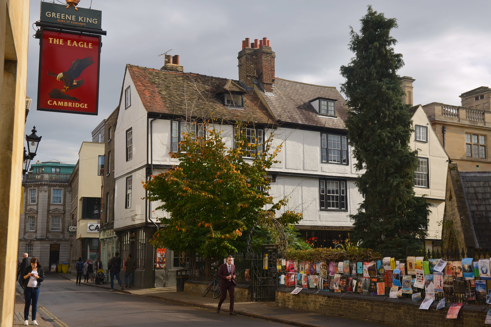
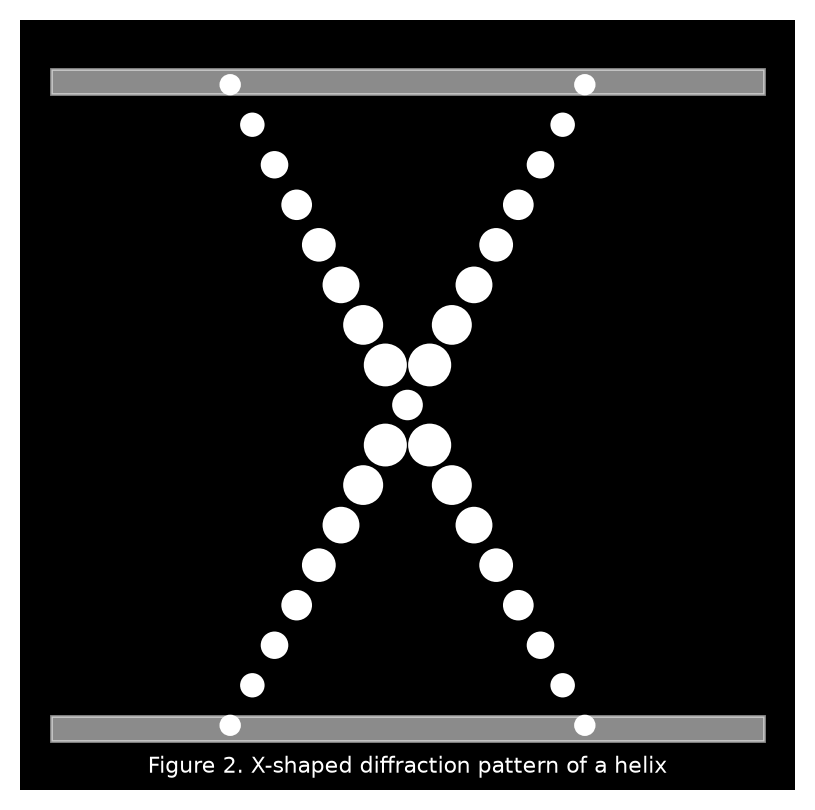
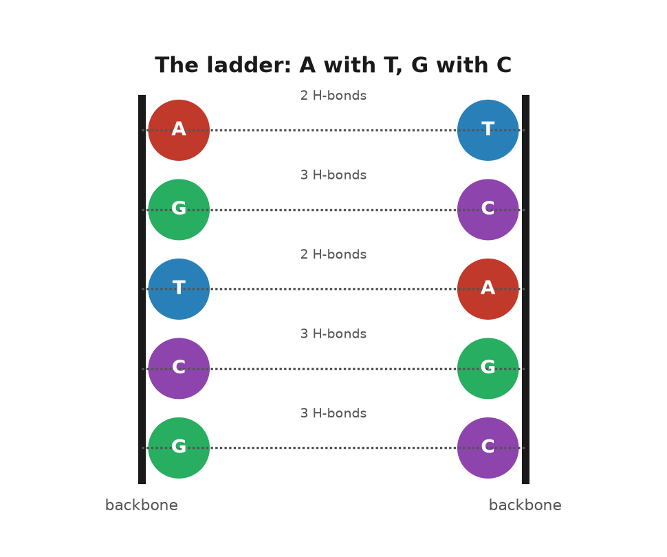
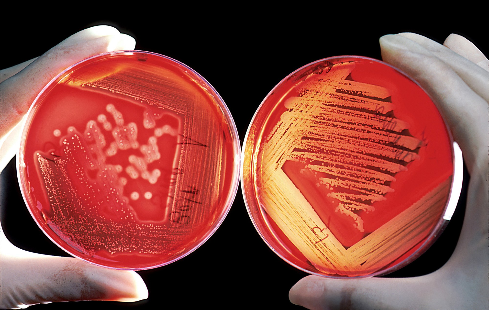

# PART I — The Shape of It

## 1. The Eagle, 28 February 1953

The Eagle is a pub on Bene't Street in Cambridge, a few minutes' walk from the old Cavendish Laboratory. It has a courtyard, low ceilings, and a back room where airmen in the Second World War burned their squadron numbers into the ceiling with candles and lighters. On a Saturday at the end of February 1953, at lunchtime, a tall, loud, thirty-six-year-old physicist named Francis Crick walked in with a thin, twenty-four-year-old American named James Watson and told the room, or at least the people near him, that they had found the secret of life.

The phrase is in Watson's memoir, published in 1968, and Crick later said he did not remember saying it, which is what people say about their best lines. Whether or not he said it, it was nearly true. That morning the two of them had worked out, with cardboard cutouts and a good deal of pacing, how the four chemical units of DNA fit together in pairs. Within a week they had a metal model of the whole molecule standing on a bench, six feet tall, held together with clamps and retort stands. Within two months a paper about it, a little over nine hundred words long, was in print. The paper is dated 25 April 1953 and appears in the journal *Nature* under a title so modest it reads like an apology: "Molecular Structure of Nucleic Acids: A Structure for Deoxyribose Nucleic Acid."

That paper is the start of this book, and it is worth asking why a shape should matter so much. Chemists had known the ingredients of DNA for decades. What nobody had was the arrangement, and in this molecule the arrangement is everything, because the arrangement is how it copies.

The two men were an odd pair, and the oddness is part of why it worked. Crick had been trained as a physicist, had spent the war designing mines for the Admiralty, and had come to biology late and hungry. He was known at the Cavendish for a laugh that could be heard through walls and for a habit of explaining other people's problems to them before they had finished describing them. He had not yet finished his PhD. Watson had finished his, at Indiana, at twenty-two, on the genetics of viruses that infect bacteria. He had come to Europe on a fellowship to learn chemistry, had been bored by it, and had seen a photograph of a DNA fibre at a meeting in Naples in the spring of 1951 that changed what he wanted to do with his life. He arrived in Cambridge that autumn, met Crick, and the two of them decided, without being asked and without any formal permission, that they would work out the structure of DNA.

They had no laboratory of their own. They shared an office. The Cavendish was run by Sir Lawrence Bragg, who had shared a Nobel Prize with his father in 1915 for working out how to use X-rays to find the positions of atoms in crystals, and whose unit was officially devoted to proteins. DNA belonged, by a gentlemen's agreement among British laboratories, to King's College London. Maurice Wilkins had started the fibre work there. Rosalind Franklin joined in 1951 to run the X-ray work on those fibres, recording how a beam bounces off a molecule and lands on film. Photographs from her laboratory would show the wet form of DNA as a helix. Watson and Crick's job was to think about other things. They thought about DNA instead.

Their method was the one Linus Pauling had used at Caltech in 1951 to find the alpha helix, the coiled shape that runs through most proteins. Pauling did not grind through the diffraction data, the pattern of spots and smudges an X-ray beam leaves on film after it bounces off a molecule's repeating structure, which a trained eye can work backward from to the shape that made it. He asked what shapes were chemically possible, built models of them with the correct bond lengths and angles, and then checked the models against the X-ray pictures. Watson and Crick copied the method and, at first, copied the mistakes. In November 1951 they built a three-chain model with the phosphate backbones on the inside and invited the King's group up to see it. Franklin took it apart in minutes. It had far too little water in it, which her measurements showed the molecule to be full of, and it put charged phosphate groups where they could not sit. Bragg told them to stop.

They did not entirely stop. Through 1952 Crick worked on his thesis and Watson worked on tobacco mosaic virus, and both of them talked about DNA in the office and in the Eagle. What put them back on the problem, with permission this time, was Pauling. In the last weeks of 1952 word came across the Atlantic that Pauling had a structure. His son Peter was a graduate student in the same Cavendish office, and in January 1953 Peter produced a copy of the manuscript. It was a triple helix with the phosphates on the inside, essentially the model Franklin had demolished fourteen months earlier, and it was wrong in a way that a first-year chemistry student could see: the phosphate groups were drawn without their charges, so that in the form Pauling described the molecule would not have been an acid at all. Watson said afterwards that his first feeling was fear that Pauling had won and his second, once he had read the paper carefully, was that they had perhaps six weeks before Pauling noticed his own error. Bragg, who had lost the alpha helix to Pauling two years earlier and did not care to lose again, let them build.

---

The pieces of the puzzle were, by then, mostly on the table. Everyone agreed that DNA was a long chain in which sugar and phosphate groups alternated to form a backbone, and that from each sugar hung one of four flat, ring-shaped bases: adenine, guanine, thymine, cytosine, known ever since by their initials. Franklin's X-ray photographs from King's said the molecule was a helix, meaning it was twisted into a spiral, like a spring or a spiral staircase, about twenty ångströms wide, with something repeating every thirty-four ångströms along its length. An ångström is a unit so small it is normally used only for single atoms; ten of them side by side would barely span the width of a strand of spider silk. An Austrian-born chemist at Columbia, Erwin Chargaff, had published in 1950 a peculiar regularity: in every kind of DNA he measured, the amount of adenine equalled the amount of thymine, and the amount of guanine equalled the amount of cytosine, even though the ratio of the two pairs to each other varied from species to species. Chargaff had visited Cambridge in the summer of 1952 and been unimpressed by Watson and Crick, who did not, at the time, seem to know the chemical formulas of the bases. He left them his rule anyway.

What Watson did in the last week of February 1953 was to take the rule seriously as a fact about shape. He cut the four bases out of stiff cardboard, to scale, and moved them around on his desk trying to find a way that two bases could sit side by side across the width of the helix, joined by the weak attractions called hydrogen bonds, with the backbones on the outside. His first idea was that like paired with like: adenine with adenine, and so on. Jerry Donohue, an American crystallographer (a scientist who works out a molecule's shape from the way it scatters X-rays) who shared the office and happened to know more about the chemistry of these particular rings than anyone in the building, told him that the textbook drawings he was using showed the bases in the wrong form. In the drawings, some of the atoms carried their hydrogens in a way known as the enol form, that Donohue said was rare in real molecules. In the more common keto form, the hydrogens sat elsewhere, and the like-with-like pairs no longer fitted.

Watson redrew the cardboard. On the morning of Saturday 28 February he found that adenine paired with thymine, held by two hydrogen bonds, made a shape almost exactly the same size as guanine paired with cytosine, held by three. Two different pairs, one width. They would stack down the middle of a helix like the rungs of a ladder, and the ladder would be the same width everywhere. Chargaff's rule fell out at once: if every A is bonded to a T, there must be as many of one as the other. So did something more important. If the two strands were pulled apart, each carried the full information needed to rebuild the other. Where one strand had A, the new partner must have T. Where it had G, the partner must have C.

That was the morning Crick walked into the Eagle.

The model took a week to build, because the machine shop had to cut new metal templates for the bases and because Crick insisted on checking every distance and angle against the known chemistry. The chains ran in opposite directions, one up and one down, which Crick had deduced from a piece of King's data that he had seen in a report and that Franklin, who had generated it, had not yet drawn the conclusion from. The two backbones wound around a common axis with ten bases per turn, one every 3.4 ångströms, so that one full turn came to Franklin's thirty-four. The bases were flat and perpendicular to the axis, stacked like coins. The whole thing was about twenty ångströms across.

They wrote the paper in March. It has two authors, no experiments, and one figure, a sketch of the helix drawn by Crick's wife Odile. It proposes the structure, notes that the bases pair in a specific way, and observes that this specific pairing "immediately suggests a possible copying mechanism for the genetic material." That sentence is the reason the paper is famous. It is the only sentence in it that is about biology rather than geometry, and it was put in, Crick said later, because leaving it out would have looked as if they had not noticed. In the same issue of *Nature*, immediately after, were two papers from King's College: one from Wilkins and colleagues, one from Franklin and Gosling, presenting the X-ray evidence. The arrangement was negotiated between the laboratory heads. It gave the impression, which was not quite the truth, of a joint effort.

A second paper by Watson and Crick, in *Nature* on 30 May 1953, spelled out the copying idea. If the strands separate, each acts as a template on which a new partner is assembled, letter by letter, by the pairing rules. The result is two helices where there was one, each combining one old strand with one new. They also noted, in a paragraph that will matter later in this book, that mistakes could occur if a base briefly took a rare chemical form and paired with the wrong partner. That paragraph is the first written suggestion that mutation might be a matter of where a hydrogen atom happens to be.

---

Why did a shape settle a question that decades of chemistry had not? Because the shape answered what people had actually been asking, which was not "what is DNA made of" but "how can anything made of only four ingredients carry the instructions for a living thing, and how can those instructions be passed on." The order of the bases along the chain was unconstrained by the structure: any sequence would fit, because every rung was the same width. So the order could be a message. And the pairing meant the message could be copied by a purely mechanical process that needed no intelligence and no reading, only chemistry. A cell could make a copy of its text the way you make a plaster cast, by pressing.

The metal model stood in the Cavendish for a while and then was dismantled; some of the plates survive in museums. Watson and Crick shared the Nobel Prize in Physiology or Medicine in 1962 with Wilkins. Franklin, whose photograph and whose measurements ran under the whole enterprise, had died in 1958 and could not be named, because the prize is not given to the dead. What the field owed her is the subject of the next chapter.

The Eagle has a plaque now, and a beer named after the molecule, and people come in to sit where Crick sat. But the discovery did not happen in a pub. It happened at a desk, on a Saturday morning, with cardboard, and it began with a photograph that neither man had taken.

## 2. Photo 51

The photograph is a black square with a white cross in it. The cross is smudged, as if someone had drawn an X with a wet thumb, and its arms are broken into short dashes. Around the edges there are darker arcs. It was taken in the basement of King's College London, in the Strand, in May 1952, on a camera built for the purpose, with an exposure that lasted more than sixty hours. The specimen was a single fibre of DNA drawn out of a wet gel, thinner than a hair, held in a humid chamber so that it stayed swollen with water. The film is labelled, in a laboratory notebook, as photograph number 51.

A fibre photograph is not a picture of one molecule. It is what you get when you pull a wet gel into a thread so that many chains point the same way, fire X-rays through the thread, and let the scattered beam blacken a film. Each helix in the bundle scatters alike. The film records the sum. Molecules lined up along one axis, and free to rotate around it, smear the sharp spots of a crystal into layer lines. Those lines are the broken dashes of the X. The X is what a corkscrew looks like in an X-ray beam.

It is the most famous X-ray picture ever taken, and almost no one who has seen it can read it. That is fair; it takes training. But the cross is the point. When X-rays pass through a helix, the regular twist of the molecule scatters them into a pattern that any crystallographer of the day would have recognised as the fingerprint of a helix. The spacing of the dashes along the arms gives the distance between successive turns. The angle of the X gives the pitch. The missing fourth dash on each arm says something about how the two chains are staggered. The dark arcs at the top and bottom give the distance between the stacked bases: 3.4 ångströms. Photo 51 is, to a trained eye, a message that says: helix, thirty-four ångströms per turn, twenty across, bases stacked one every 3.4, and probably two chains.

The person who took it was a graduate student named Raymond Gosling. The person who supervised him, who had built the apparatus, worked out the humidity conditions, and would spend the next year extracting the numbers from the pattern, was Rosalind Franklin.

---

Franklin was born in London in 1920 into a banking family, went to Cambridge, took a doctorate in physical chemistry on the structure of coal, and spent four years in Paris learning X-ray diffraction from Jacques Mering, who was among the best in the world at applying the technique to things that were not neat crystals. She was thirty when she came to King's in January 1951, on a three-year fellowship, to work on DNA. She was a careful experimentalist and a formidable arguer, and she did not suffer people who guessed.

She also walked into a misunderstanding that poisoned the next two years. Maurice Wilkins, the deputy head of the biophysics unit, had been working on DNA fibres for a year with Gosling and understood that Franklin was joining his project. Franklin, from what she had been told by the unit's director, John Randall, understood that DNA was now her project and that Wilkins would work on something else. Neither of them had been told the same thing. Wilkins returned from a holiday to discover a colleague who treated his DNA work as her own and his advice as interference. Franklin, for her part, had a colleague who kept turning up expecting to be consulted on results she considered hers. They never sorted it out. They barely spoke.

Within a year she had done something no one else had. DNA fibres, she found, took two forms depending on how wet they were. At lower humidity the molecule was shorter and thicker and gave a sharp, crystalline pattern; she called this the A form. At high humidity it lengthened, took up more water, and gave a simpler, blurrier pattern; this was the B form. The two could be turned into each other by changing the moisture in the chamber. Earlier photographs, including the ones that had drawn Watson to the problem, had been muddled superimpositions of the two. Franklin separated them, and by doing so rendered the B form's helical cross visible for the first time. Photo 51 is a B-form picture.

The humidity numbers are the whole distinction, and they are worth having in ordinary units. The A form was stable when the air in the chamber was about three-quarters saturated, and it gave more than a hundred measurable spots, a crystallographer's feast. The B form needed the air nearly saturated, about 92 percent, the damp of a wet room, and it gave the simpler cross. A single fibre could be driven from one form to the other and back by changing only the water, which meant they were two states of one molecule. Franklin measured the B form at about 20 ångströms across, two millionths of a millimetre, and 34 ångströms from one turn to the next. Those are the numbers that stand in the Cambridge model. She had them in 1952, from a fibre thinner than a hair and an exposure that ran past sixty hours because the specimen scattered so little light. Gosling loaded the camera. She had decided the conditions.

She then arrived at a decision that has been argued about ever since. The A form gave the richer data, with many more spots, and Franklin was a crystallographer: she wanted to solve the structure properly, from the spots, by the long mathematical road. She put the B form aside and spent most of 1952 on the A form, which, as it happens, does not show a clean helical pattern, because in the drier state the molecule packs in a way that hides the signature. For a time she doubted whether the A form was helical at all. In July 1952 she and Gosling circulated a mock funeral notice among colleagues announcing the death of the DNA helix. It was a joke, at Wilkins's expense, and it has been used against her judgment ever since. It should not be. Her notebooks show that by the end of the year she had concluded that both forms were helical, with two chains, with the phosphates on the outside, and she had measured the B form's dimensions to within a few percent of the values Watson and Crick would use.

What she had not done, by January 1953, was find the pairing of the bases. Nobody had. And she was not looking for it with cardboard, because she did not build models. She thought the model-builders were guessing, which, until the last week of February, they were.

On Friday 30 January 1953, Watson took the train to London to show Wilkins the Pauling manuscript. He stopped first at Franklin's laboratory, where the conversation went badly; the account in his memoir, in which she is made to seem on the point of striking him, is his and has been doubted by everyone else who was in the building. He then continued to Wilkins's office, where Wilkins, who had by this time been told by Franklin's own student that she was leaving King's in the spring and who regarded the work as reverting to him, opened a drawer and showed Watson Photo 51.

Watson later wrote that his mouth fell open and his pulse began to race. He had seen helical patterns before and knew what the cross meant. On the train back to Cambridge he sketched what he remembered on the margin of a newspaper. It was not much: the cross, the spacing. But it settled, for him and for Crick, that the molecule was a helix, that it was a B-form helix with the thirty-four ångström repeat, and that they should build a two-chain model rather than three.

A second transfer mattered as much and is less known. In December 1952 the Medical Research Council, which funded both laboratories, had sent a committee to King's to review the work. Franklin had written up her results for the visitors in a short report. One of the visitors was Max Perutz, the head of Watson and Crick's unit at the Cavendish. In February 1953 Crick asked Perutz to see the report, and Perutz, who did not regard it as confidential, handed it over. It contained Franklin's measurements, her statement that the phosphates were on the outside, and a detail about the symmetry of the A-form crystal that Crick, who had done his doctoral work on exactly that kind of symmetry, recognised at once as meaning the two chains ran in opposite directions. Franklin had written the symmetry down without seeing what it meant. Crick saw it in minutes. It fed straight into the model.

Franklin was not told about either transfer. She learned that Cambridge had a structure in March, when Wilkins telephoned. She went up to see the model, checked it against her data, and agreed that it was right. Her paper in the 25 April *Nature* was already drafted before she saw it; she added a sentence saying that her results were consistent with the Cambridge model. The paper describes the B-form pattern, gives the dimensions, and argues, from her own data, for a two-chain helix with the phosphates outside. In a draft dated 17 March, before she knew about the model, she had written most of that already.

---

So what was hers? The clean separation of the two forms, and therefore the first clear helical picture. The dimensions. The location of the backbone. The water content that had killed the first Cambridge model. The symmetry observation, though not its interpretation. What was not hers, and would not have been for some time on the road she had chosen, was the base pairing, which is the part that explains inheritance. Aaron Klug, who inherited her notebooks and became her most careful defender, concluded that she was perhaps a few months from the structure and that she would have got there by her own route. He also concluded that she would have got the backbone right before the pairing, and might not have seen the copying mechanism at once. I think that is fair, and I think it does not settle anything, because the question was never whether she would have won the race. It was whether her data should have been used without her being asked, and the answer to that is no.

In the spring of 1953 she left King's for Birkbeck College, a mile away, and was made to promise, as a condition of the move, that she would stop working on DNA. She turned to viruses, and in five years at Birkbeck, with Klug and others, she did work on the structure of tobacco mosaic virus and polio virus that was at least as good as anything she did on DNA. In the autumn of 1956 she learned she had ovarian cancer. She worked between operations. She died on 16 April 1958, aged thirty-seven.

The Nobel Prize for the structure went to Watson, Crick, and Wilkins in 1962. It is awarded only to the living, and to at most three people, so there was no place for her either way. Watson's memoir, published in 1968 over Crick's and Wilkins's objections, gave her a nickname, mocked her clothes and her lack of lipstick, and presented her as an obstacle. He added an epilogue conceding that he had misjudged her. The book sold a great deal, and for a generation it was the story. Since then her notebooks have been read, her letters published, her papers reassessed, and the King's report and its journey to Cambridge documented in detail. She is now more famous than Wilkins, and a building, a university, a Mars rover, and a good many schools carry her name.

The picture is still in a drawer at King's. It is a black square with a white cross in it, and it is the reason the model in Cambridge was a helix with two chains and not something else.

## 3. What the Shape Explains

Take the model apart in your head. Unwind the helix until it is flat, a ladder lying on a table. The two uprights are the backbones, each a chain of sugar and phosphate, sugar and phosphate, repeating every 3.4 ångströms. The rungs are the base pairs. Every rung is built from two bases, one bolted to each upright, meeting in the middle and held there by hydrogen bonds. There are only four kinds of base and therefore, by the rule Watson found on his desk, only two kinds of rung: A with T, and G with C. Look along the ladder and read the left-hand upright: A, G, G, T, C, A. Now cover it and read the right: T, C, C, A, G, T. You did not need to look. Each side dictates the other.

That is the whole of the copying mechanism, and it is worth being slow about how much it explains, because in 1953 nearly everything about heredity was a mystery and this one shape swept away a surprising number of those mysteries at once.

Start with Chargaff. Between 1949 and 1951 Erwin Chargaff and his students at Columbia had taken DNA from yeast, from calf thymus, from bacteria, from human sperm, and had measured, with a precision no one had bothered with before, how much of each base it contained. The older textbook view, going back to Phoebus Levene in the 1920s, was that the four bases occurred in equal amounts and repeated in a fixed order, which would make DNA a monotonous polymer, like nylon, incapable of spelling anything. Chargaff's numbers said this was wrong. The proportions varied from species to species: human DNA was about 30 percent adenine, a bacterium might be 25 or 35. So the molecule was not monotonous. But underneath the variation was a regularity he could not explain and did not try to. In every sample, adenine and thymine came out equal, and guanine and cytosine matched just as closely, to within the error of the measurement.

He published the rule in 1950 and told anyone who would listen. Few did, because a rule without a reason looks like a coincidence. The model gave the reason in a single glance. If every A on one strand is bonded to a T on the other, then counting the As counts the Ts. The same for G and C. Chargaff's regularity is not a property of the chemistry of the bases. It is a property of the ladder.

The pairs are not interchangeable, and the reason is geometry. Adenine and guanine are large bases with two rings; thymine and cytosine are small, with one. A large paired with a large would be too wide for the helix; two smalls would be too narrow and would not reach across. Only a large with a small fits the twenty-ångström width. That still leaves two large-small combinations, A with C and G with T, and those are ruled out by the hydrogen bonds. A hydrogen bond needs a hydrogen atom on one side, attached to a nitrogen or an oxygen, pointing at a nitrogen or oxygen on the other side with a spare pair of electrons. Adenine and thymine, in their common forms, present two such matched pairs across the gap. Guanine and cytosine present three. A facing C, or G facing T, lines up donors against donors and acceptors against acceptors, and the pair does not hold. So the rule is not a convention. It is the only arrangement that fits.

The three bonds of a G–C pair against the two of an A–T pair have a consequence you can feel with a thermometer. Heat a solution of DNA and, at some temperature between about 70 and 95 degrees Celsius, the strands come apart, a process biochemists call melting. DNA rich in G and C melts at a higher temperature than DNA rich in A and T, because it has more bonds per rung to break. Organisms that live in hot springs tend, for that reason among others, to run G–C-rich. This was measured in the years after 1953 and was one of the first quantitative tests the model passed.

Now the two backbones. Crick's insight from Franklin's symmetry data was that they ran in opposite directions. Each sugar in the chain has its carbon atoms numbered, and the phosphate links the carbon numbered 3 on one sugar to the carbon numbered 5 on the next, so that the chain has a direction, like a row of arrows. One strand runs 5-to-3 up the page; its partner runs 5-to-3 down the page. Biologists say the strands are antiparallel. It sounds like a detail and it turned out to be an enormous nuisance, because the enzyme that copies DNA can only work in one direction along a strand, and so the two strands have to be copied by two different tricks. That story belongs to chapter 7. For now the point is that the model predicted the nuisance before anyone had found the enzyme.

The twist has consequences too. Because the two backbones are not evenly spaced around the axis, the helix has two grooves running along it, one wide and deep, the major groove, and one narrow, the minor groove. In the major groove the edges of the base pairs are exposed, and the pattern of atoms along the edge differs for each of the four possible rungs. A protein that fits into the major groove can therefore read the sequence without opening the helix, by touch, the way a finger reads Braille. This is how the regulators of genes find their addresses, and it was implicit in the model long before anyone had identified a regulator.

The dimensions themselves were confirmed and then refined. Watson and Crick had ten base pairs per turn from Franklin's photograph; later work with DNA in solution gave about 10.5. Their 3.4 ångström rise per base pair has held. So has the diameter. The B form they modelled is the form that exists in a living cell, because a living cell is wet. The A form, which Franklin spent 1952 on, is what DNA becomes when it dries, and turns up in life mainly in stretches where DNA is paired with RNA.

---

A shape that explains inheritance ought to make predictions, and the first big one was about how the copy is made. The paper of 30 May 1953 said it: unwind the helix, use each old strand as a template, assemble a new partner on each. The result is two helices, each with one old strand and one new. Chemists called this semiconservative, because each daughter keeps half of the parent. There were two rival ideas. In the conservative scheme, the parent helix stays intact and a completely new one is built beside it. In the dispersive scheme, the parent is chopped and the pieces scattered between the daughters. The three schemes give distinct answers to a simple question: after one round of copying, is there any helix left that is composed entirely of old material? Semiconservative says no, every helix is half and half. Conservative says yes, one of the two. Dispersive says every strand is a patchwork.

Matthew Meselson and Franklin Stahl settled it in 1958 at Caltech, in an experiment so clean it is still taught as the model of what an experiment should be. They grew bacteria for many generations in a broth in which all the nitrogen was the heavy isotope nitrogen-15, so that every base in every DNA molecule was heavy. Then they switched the bacteria to ordinary nitrogen-14 and let them divide once. DNA can be sorted by weight in a spinning tube of caesium chloride solution, where heavy molecules settle into a band lower than light ones. After one division, all the DNA sat at a single band exactly halfway between heavy and light. No fully heavy helix survived, so the conservative scheme was dead. After a second division there were two bands, one halfway and one light, in equal amounts, which is what you get if each half-and-half helix is pulled apart and each old strand gets a new light partner. The dispersive scheme, which would have given a single band drifting gradually lighter, was dead too. The paper appeared in the *Proceedings of the National Academy of Sciences* in July 1958, five years after the shape. It has been praised ever since as the most beautiful experiment in biology, and the shape had told it what to look for.

The second prediction was about information. If the order of the bases is the message, the message must somehow specify proteins, which are chains of twenty different amino acids and which do almost all the work in a cell. Four letters have to spell twenty words. Crick thought about this more clearly than anyone. In a talk in 1957, published in 1958, he laid out what he called the sequence hypothesis and what he labelled, with a straight face, the central dogma. The sequence hypothesis said that the order of bases in a stretch of DNA determines the order of amino acids in a protein, and nothing else does. The central dogma said that information flows from DNA to RNA to protein and not backwards: a protein cannot rewrite the DNA that made it. He chose the word dogma, he admitted later, because he thought it meant a bold idea with no evidence, and did not know it meant a belief that cannot be questioned. The name stuck anyway.

The dogma has been dented. In 1970 Howard Temin and David Baltimore identified viruses that copy RNA into DNA, running the arrow in reverse, which is how HIV inserts itself into the human text. But no one has ever caught a protein writing its own sequence back into a gene, and that was the claim Crick cared about. It is why acquired characteristics are not inherited. A blacksmith's arms do not alter his sperm. The arrow points one way.

The third prediction was almost an aside, and it is the one this book is named for. In the same May paper Watson and Crick pointed out that each base can, rarely, shift a hydrogen atom to a new position, taking on what chemists call a tautomeric form. In that form its pattern of donors and acceptors changes, and it can pair with the wrong partner. If the shift happens at the moment a strand is being copied, the wrong letter goes into the new strand and, on the next copy, is faithfully paired and fixed. They suggested that this might be one way spontaneous mutations arise. It was a guess, and a good one, and how good is still being argued in physics journals seventy years later. Chapter 10 returns to it.

---

Watson presented the model at the Cold Spring Harbor Symposium on Long Island in June 1953, a few weeks after the paper. The audience was the American geneticists and phage biologists who would spend the next decade turning the shape into a science. Some were sceptical. Max Delbrück, Watson's own mentor, had been sceptical since the spring and had worried in letters about how a helix with two chains wound around each other could ever be unwound for copying without tangling; twisted that tightly over such a distance, it would have to spin like a propeller. He was right that this was a problem and wrong that it was fatal. Cells solve it with enzymes known as topoisomerases, that cut a strand, let it swivel, and rejoin it, and those were identified in the 1970s.

By the end of 1953 the shape was accepted by almost everyone who mattered. It was the right width, it fitted Franklin's photographs, it obeyed Chargaff, it copied itself on paper, and it told a dozen people what experiment to do next. Bragg, who had been made to look slow by Pauling two years before, wrote the introduction to the Cambridge papers and took a good deal of pleasure in the fact that the answer had come from his laboratory. Franklin's paper with Gosling sat in the same issue of *Nature*. King's had the measurements. Cambridge had the pairing.

What none of that explained was why anyone had doubted, for thirty years, that DNA was the substance of heredity at all. That doubt has its own history, and it begins with a Swiss doctor and a pile of used bandages.

## 4. The Race Before the Race

In the winter of 1868 a twenty-four-year-old Swiss physician named Friedrich Miescher arrived in Tübingen to work in the laboratory of Felix Hoppe-Seyler, one of the founders of what would come to be known as biochemistry. Hoppe-Seyler's laboratory was in the kitchen of the old castle, which was a fair location, because the work was mostly boiling things. Miescher wanted to know what cells were composed of, and he needed cells. The surgical clinic down the hill supplied him with bandages from wounds that had gone septic. The pus on them was rich in white blood cells, and white blood cells have large nuclei.

He washed the cells off the bandages with salt solution, dissolved away their outer membranes with a weak alkali, and was left with nuclei. From those he extracted a substance that was not a protein: it resisted the enzymes that digest proteins, it was acidic, and it contained a great deal of phosphorus, which no protein did. He called it nuclein. He had, in 1869, isolated DNA, though he did not know what it was for, and his paper was held up by Hoppe-Seyler, who repeated the work himself before letting it appear in 1871.

Miescher later moved to Basel and discovered that salmon sperm was a much better source of nuclein than pus, which was an improvement in every respect. He speculated, cautiously, that the substance might be involved in fertilisation. He did not suggest it carried heredity, and neither did anyone else for a long time.

By the 1920s the ingredients were known. Albrecht Kossel in Germany had identified the four bases and won a Nobel Prize for it in 1910. Phoebus Levene at the Rockefeller Institute in New York had worked out that each base was attached to a sugar and a phosphate to make a unit he termed a nucleotide, and that nucleotides were strung together in a chain. Levene also identified the sugar, deoxyribose, in 1929, which gave the substance its modern name.

Levene then did something that held the field back for twenty years. He proposed that the four nucleotides occurred in equal amounts and repeated in the same order, a tetranucleotide, over and over. The evidence was thin: the bases seemed roughly equal in the impure samples of the day, and the methods for measuring the length of the chains were so crude that DNA looked like a small molecule. But the idea was tidy and Levene was eminent, and it became the textbook view. Under it, DNA could not carry information for the same reason a fence cannot carry a message: every picket is the same. The pickets were not, in fact, the same. The measurements that seemed to show equal amounts of the four bases were too crude to see the differences, and a chain that looks short because your ruler cannot reach the end will look like a small molecule. Chargaff's later measurements killed the equality. Until then the fence was the textbook, and a textbook is hard to argue with when the man who wrote the underlying chemistry is the authority in the room.

If DNA was a fence, then heredity had to live in the proteins, and there was a great deal going for proteins. They were made of twenty different amino acids, which gave them an alphabet. They came in thousands of distinct kinds. They folded into elaborate shapes. They did the visible work of the cell, as enzymes, as muscle, as the pigment in blood. Chromosomes, which everyone agreed carried the genes, were known to contain both protein and DNA, and the sensible bet was that the protein was the message and the DNA was the scaffolding. The physicist Max Delbrück, Watson's mentor in the phage group, had a phrase for the general view. Evelyn Witkin, who heard it as a student, later recalled him calling DNA a stupid molecule, too simple, on the tetranucleotide story, to be a gene. The recollection is hers, published in a 2012 interview in *PLOS Genetics*, not a sentence from a paper of his.

---

The evidence that overturned this arrived in three instalments, each of which was ignored more than it deserved.

The first was an accident of public health. In 1928 Frederick Griffith, a bacteriologist at the British Ministry of Health, was studying the bacterium that causes pneumonia, *Streptococcus pneumoniae*, which comes in two forms. One has a smooth coat of sugar and kills mice; the other, lacking the coat, is rough under the microscope and harmless. Griffith killed smooth bacteria with heat and injected them into mice, which lived. He injected live rough bacteria, and the mice lived. Then he injected both together, heat-killed smooth and live rough, and the mice died, and from their blood he recovered live smooth bacteria. Something in the dead cells had passed into the living ones and changed them, permanently and heritably. He called it the transforming principle and did not know what it was. He was killed in an air raid on London in 1941, still not knowing.

Griffith was not hunting for the molecule of heredity. He was sorting outbreaks, so that one wave of pneumonia could be told from the one before it. The sugar coat comes in types a serum can tell apart. What passed into the living cells was the ability to build one particular type, and the ability bred true. A daughter cell made the dead cell's kind of coat. In 1928 almost nobody was willing to use the word inheritance for a bacterium. It was inheritance all the same.

The second instalment took sixteen years. At the Rockefeller Institute, Oswald Avery, a quiet Canadian-born physician in his sixties who had spent his career on pneumococcus, set out with Colin MacLeod and Maclyn McCarty to purify the transforming principle. It took most of a decade. They grew the smooth bacteria by the vat, broke them open, and removed one class of substance after another, testing after each step whether what remained could still transform rough cells into smooth. They took out the sugar coat; the extract still worked. They digested the proteins with enzymes; it still worked. They removed the lipids and the RNA; still. What was left was a fibrous white material that formed threads when alcohol was added, contained phosphorus in the right proportion, and was destroyed by the one enzyme that specifically breaks down DNA. Their paper appeared in the *Journal of Experimental Medicine* in February 1944. It concluded, with the caution of people who knew what they were claiming, that the transforming substance was a nucleic acid of the deoxyribose type.

The reception was muted. Avery was a bacteriologist publishing in a medical journal, and the geneticists did not all read it. Those who did had objections. Perhaps a trace of protein, too small to detect, was the real agent. Perhaps transformation was a peculiarity of pneumococcus. Alfred Mirsky, a colleague at the same institute, argued for years that Avery's preparations were contaminated. Avery was nominated for a Nobel Prize repeatedly and never got one; the committee's own records, opened later, show that the doubts about purity were taken seriously in Stockholm. He retired in 1948 and died in 1955, two years after the shape.

In May 1943, with the paper still unpublished, Avery wrote to his brother Roy, also a bacteriologist. The transforming material matched a nucleic acid. Nobody had expected that. It behaved as if it might be a gene. The letter was private. The paper, when it came, was more guarded.

He had a reason to guard it. If DNA were only Levene's repeating four-letter block, the white fibres could spell nothing. A trace of protein stuck to them would still be the real agent. That objection was fair until someone showed the bases could stand in any order. Chargaff's measurements, still a few years off, would do it. Until then a sceptic had a door.

The third instalment was built to answer that objection. In 1952, at Cold Spring Harbor, Alfred Hershey and Martha Chase used a virus that infects bacteria. They named it T2. A bacteriophage, the word for this kind of virus, is little more than a protein coat around a core of DNA. It lands on a bacterium and injects something. Twenty minutes later the bacterium bursts and releases about a hundred new viruses. Whatever was injected had to be the instructions.

The two materials can be marked apart, because their chemistry differs. Protein contains sulfur, in the amino acids cysteine and methionine, and DNA contains none. DNA contains phosphorus in every link of its backbone, and protein contains almost none. Grow the virus in radioactive sulfur and only the coat glows. Grow it in radioactive phosphorus and only the core does.

They let each batch infect bacteria, then stripped the empty coats off with a Waring blender, the same countertop machine a kitchen used for drinks. A spin sank the heavy bacteria and left the light coats in the liquid. In the 1952 paper the blender knocked about three-quarters of the sulfur off the cells, and only about fifteen percent of the phosphorus. The new viruses carried thirty percent or more of the parental phosphorus, and less than one percent of the parental sulfur. The coat had stayed outside. The core had gone in and done the building.

The separation was not clean. A sceptic could still mutter about a trace of protein. It was done, though, on the virus the most influential group of geneticists in America already studied, by one of their own, in the journal they read. It convinced the people Avery had not. Watson arrived in Cambridge that autumn certain that DNA was the thing to solve.

---

There is a fourth thread, and it runs through the physics rather than the biology. In 1938 William Astbury in Leeds, who had spent the decade taking X-ray photographs of wool and hair, put a fibre of DNA in front of his beam and got a pattern. It was blurry, but it showed a strong repeat at 3.4 ångströms along the fibre, which he read, correctly, as flat bases stacked one on top of another like a pile of pennies. He built a model that was wrong in most other respects. In 1951 his student Elwyn Beighton took photographs that, seen now, plainly show the helical cross of the B form. Astbury did not publish them. He did not see what they meant.

Chargaff's rule, from 1950, was the last piece, and Chargaff himself is the strangest figure in the story, because he had the evidence and hated the conclusion. He had begun measuring the bases because he read Avery's paper and believed it, at a time when few did. His measurements killed the tetranucleotide idea and gave the model-builders their pairing rule. When he met Watson and Crick in Cambridge in the summer of 1952, he found two men who could not, in his telling, remember the chemical difference between the bases, and he was appalled that such people should be building models of his molecule. After 1953 he spent the rest of a full career saying that the double helix had been a lucky guess by amateurs and that molecular biology was the practice of biochemistry without a licence. He was not entirely wrong about the luck. He was entirely wrong about what it meant.

Why did it take from 1869 to 1952 for the obvious to become accepted? Partly because the obvious was not obvious: a molecule with four ingredients looked too simple to spell out a human being, and until Chargaff nobody knew the ingredients came in variable proportions. Partly because the evidence arrived from the wrong people in the wrong journals. Miescher was a physiologist, Avery a medical bacteriologist, Astbury a textile physicist, Chargaff a chemist who disliked biologists. The people who owned the question of heredity were geneticists, and they worked with flies and corn and did not, for the most part, care what a gene was made of as long as it behaved. And partly because the matter could not be settled by any amount of purification. Avery could show that DNA carried the message. He could not show how, and until someone showed how, a sceptic could always imagine a hidden protein.

The shape did what the purifications could not. It showed that a molecule built from four ingredients could carry any message at all, provided the ingredients could come in any order, and it showed how the message could be copied. After April 1953 there was nothing left for the protein to do. The Cambridge model was in *Nature* that month. So were the two King's papers, Wilkins and colleagues, Franklin and Gosling. Three papers, one issue, one shape.

Ruth was five that spring. Nobody told her, and it did not matter, because the molecule had been copying itself in her since 1948 without waiting for anyone to name the mechanism. What it was copying, and what the letters themselves consisted of, is the subject of the next part.

