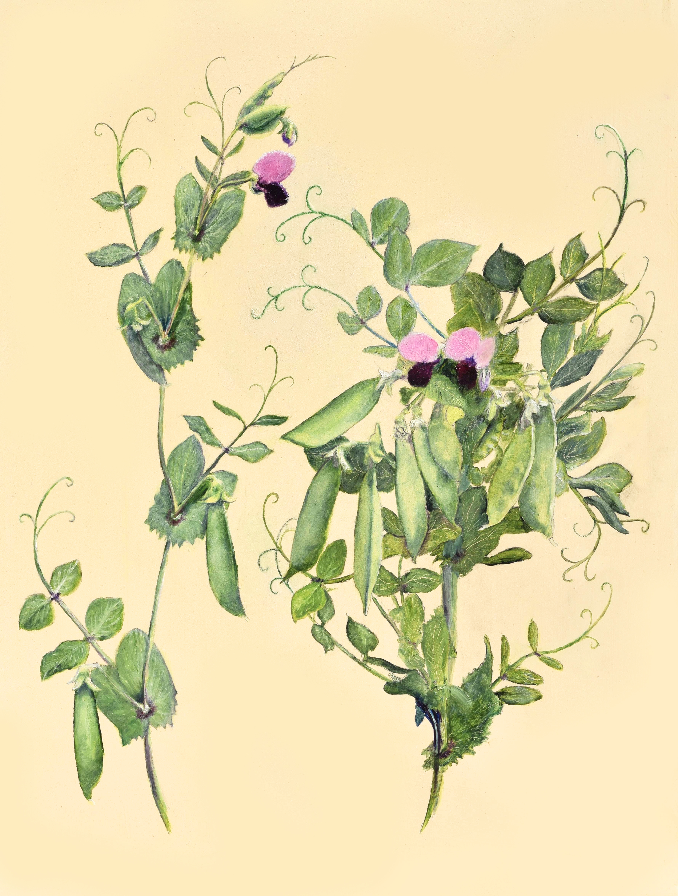
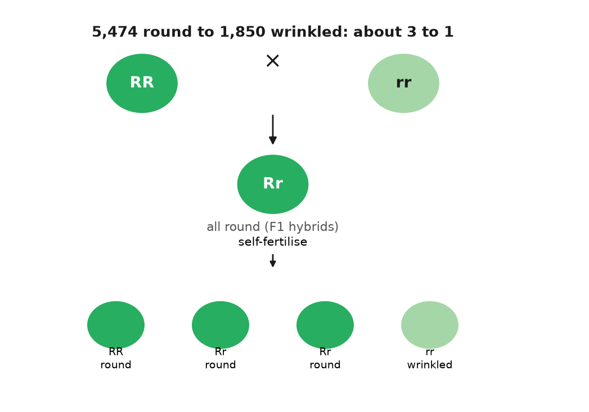
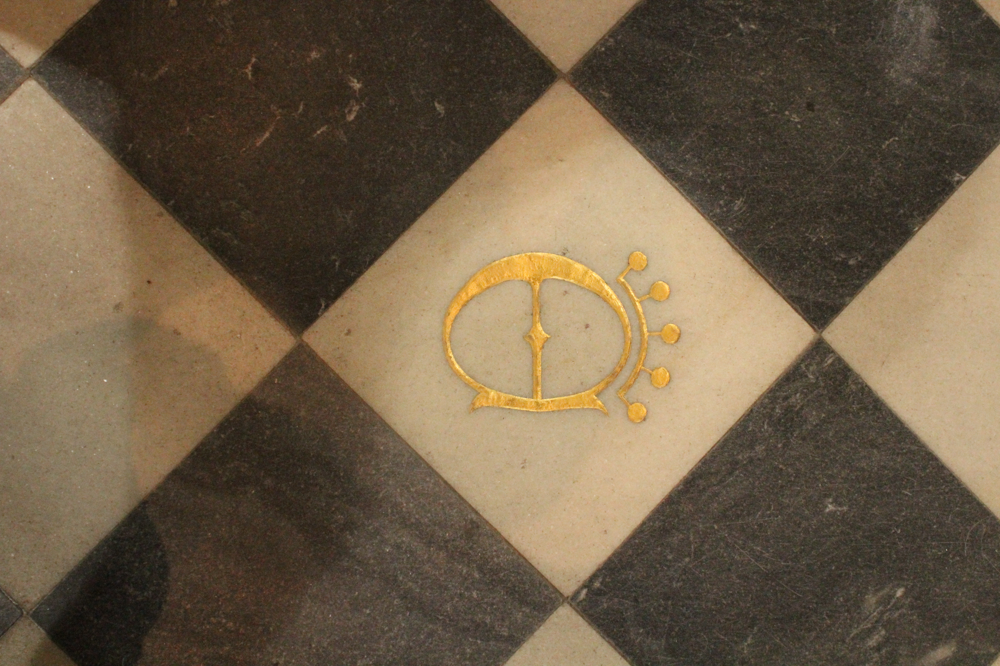
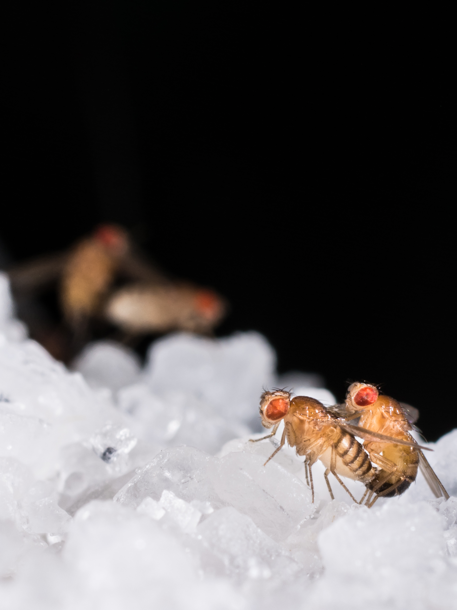
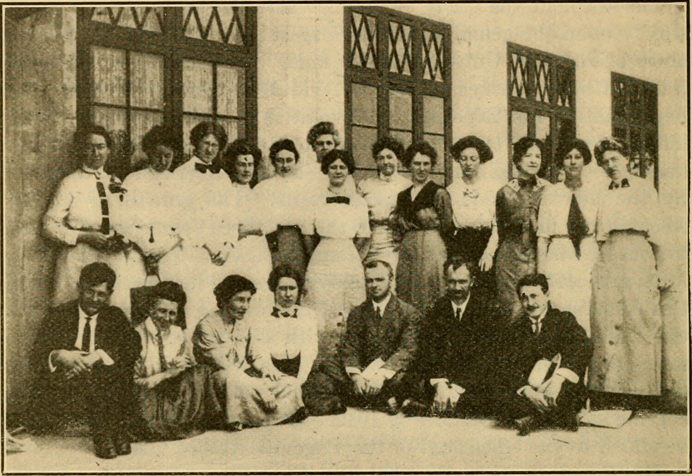

# PART IV — The Monk

## 15. Brno, 1856: Peas in a Garden

The garden is a strip of ground about thirty-five metres long and seven wide, along the south wall of an Augustinian abbey in the Moravian town of Brünn, which is now Brno in the Czech Republic. It is the spring of 1856. A stout man in a friar's habit is kneeling among the pea plants with a pair of fine forceps and a small brush of the kind painters use for detail. He opens a flower bud that has not yet unfolded, picks out the ten immature stamens one by one, and drops them into a dish. Then he touches the brush to the open flower of a different plant, carries back a dusting of yellow pollen, and paints it onto the stigma of the flower he has just stripped. He slips a little bag over the flower, ties it, writes a label. Then he moves to the next bud.

He will do this, by his own account, for eight growing seasons, and he will raise and score something like 28,000 plants before he is done. Nobody has asked him to. Nobody is paying him. The result will be the first quantitative law of inheritance, and almost nobody will read it for thirty-five years.

The man's name was Gregor Mendel, and it had not always been. He was born Johann Mendel on 20 July 1822 in Heinzendorf, a village of German-speaking farmers in Austrian Silesia, now Hynčice in the Czech Republic. His father, Anton, worked a modest farm and owed the local landowner three days of labour a week. Johann was clever, and the village priest noticed. He was sent to the Gymnasium in Troppau and then to the philosophical institute in Olmütz, and the family's money ran out along the way. His younger sister Theresia gave up part of her dowry to keep him in school. He fell ill more than once with what the records call nervous exhaustion and spent months at home in bed. A farm boy with a gift for mathematics and no money had, in the Austrian Empire of the 1840s, one reliable route to a life of study, and in 1843 he took it. He entered the Augustinian abbey of St Thomas in Brünn as a novice and was given the name Gregor.

The abbey was an unusual house. Its abbot, Cyrill Napp, ran it less like a place of prayer than like an unassuming college. The friars taught in the town's schools, kept a library of several thousand volumes, maintained a mineral collection and a botanical garden, and counted a composer, a philosopher, and a plant breeder among their number. Moravia was sheep country and orchard country, and its landowners were seriously interested in better wool and better fruit. Napp himself had chaired a society for the improvement of sheep, and he had written, in the course of that work, that the real question was not whether traits were inherited but what was inherited and how. It is hard to imagine a better landlord for what Mendel was about to do.

Mendel was ordained in 1847. He was a poor parish priest; visiting the sick made him ill himself, and Napp moved him into teaching instead. He was good at it. In 1850 he sat the state examination for a teacher's licence, in Vienna, and failed. The examiners found his natural history patchy and his physics self-taught, which it was. What they did not find was any lack of ability, and one of them suggested that the abbey send him to university. Napp did. From the autumn of 1851 to the summer of 1853 Mendel was a student at the University of Vienna.

The physics there was taught by Christian Doppler, the man whose name is on the change in pitch of a passing siren. Doppler had set up the Physical Institute in Vienna the year before Mendel arrived, and he taught physics as a thing done with instruments and repetition, not a thing read about. Mendel also took mathematics from Andreas von Ettingshausen, including combinatorics, the arithmetic of how many ways things can be arranged. He took plant physiology from Franz Unger, who was already arguing, several years before Darwin's book, that plant species were not fixed and that new forms arose from old. It was an odd education for a friar and exactly the right one for the problem he would choose. Unger gave him the puzzle, Doppler the habit of measurement, and Ettingshausen the arithmetic to read the answer.

He sat the teaching examination a second time in 1856 and did not complete it. The accounts differ; the usual one is that he fell ill during the oral, and one biographer suggests a quarrel with an examiner. He went back to Brünn, taught physics and natural history at the town's technical school as a substitute for the next fourteen years, and that same spring began the crosses in the garden.

---

Why peas? The choice was not casual, and Mendel says so on the first pages of his paper. He wanted a plant that came in clearly different forms, that bred true when left alone, that could be crossed by hand when he wished, and whose hybrids were as fertile as their parents. The garden pea, *Pisum sativum*, passed on every count.

The crucial property is the flower. A pea flower is built like a small boat. Two lower petals are fused into a keel, and the keel wraps the stamens and the pistil so closely that pollen from outside almost never gets in. The plant fertilises itself, usually before the flower has opened. A pea variety will therefore breed true for generation after generation, wrinkled giving wrinkled and tall giving tall, because nothing from outside is mixing in. This gave Mendel pure lines to start from. It also meant that when he wanted a cross he had to make it himself, and that when he had made it he could be nearly certain the pollen he painted on was the only pollen involved. The bags were insurance against the pea weevil and the occasional determined bee.

Others had crossed plants before him, and some had done far more of it. Joseph Kölreuter in the 1760s and Carl Friedrich von Gärtner in the 1840s had between them performed thousands of crosses across hundreds of species. Gärtner's book of 1849 runs to some 800 pages, and Mendel read it closely. What none of them had done was count. They had asked whether hybrids were possible, whether they were fertile, whether they resembled one parent or the other or something in between. They had not sown the hybrids' seed, grown every plant, sorted the offspring by a single trait, and written down how many fell on each side. Mendel put his finger on this in the second paragraph of his paper. Nobody, he wrote, had determined the numbers of the various forms in each generation or their statistical relations. That sentence is the whole difference.

Before starting, he did something that separates him from nearly every hybridiser before him. He bought thirty-four varieties from seed merchants and grew them for two years, 1854 and 1855, simply to see whether each bred true. Twelve failed the test or were too close to others and were dropped. Twenty-two remained. This is the first step of a controlled experiment, establishing what your starting material does when you do nothing to it, and it is why his later numbers meant something.

Then he chose the traits. Pea varieties differ in dozens of ways, and most of the differences shade into one another. Mendel wanted characters that were either one thing or the other, with nothing between, so that a seed or a plant could be scored with a glance and no judgement. He settled on seven. The seed was round or wrinkled. The cotyledons, the seed's own first pair of leaves, packed inside it, were yellow or green. The seed coat was grey-brown or white, and this went with the flower colour, violet or white, so tightly that he treated the two as one character. The ripe pod was inflated or pinched in between the seeds. The unripe pod was green or yellow. The flowers grew along the stem, in the leaf axils, the narrow angles where each leaf meets the stem, or bunched at the top. The stem was long, around two metres, or short, well under half a metre.

Seven is a number people have wondered about since, because the pea has seven pairs of chromosomes, and it has been suggested that Mendel picked one trait per chromosome by luck or by cunning. Neither is right. He knew nothing of chromosomes, and later mapping showed that several of his seven characters sit on the same chromosome, far enough apart that the effect he would have needed to notice was small. He chose seven because seven gave him clean yes-or-no scoring, and he said so.

The work of the eight seasons was mostly labour. Each cross meant opening buds, removing stamens, painting on pollen, bagging, labelling, and later harvesting each pod separately and counting what was in it. The reciprocal crosses had to be done too, round pollen onto wrinkled flowers and wrinkled pollen onto round, so that he could show it made no difference which parent supplied which. Then the hybrid seeds had to be sown, grown, and left to fertilise themselves, and their seeds harvested and counted, and those sown in turn. For seed shape and seed colour the answer was visible in the pod, and one plant could yield dozens of data points. For stem length or flower position each plant was a single data point and had to be grown to maturity. He raised tall and short varieties on the same plot so that soil would not confound the result, and he watched for that sort of confounding throughout. In the greenhouse he ran checks on whether flowers under bags gave the same results as flowers in the open.

Scoring was a physical job, not a judgment. Round seeds and wrinkled seeds were sorted into dishes and counted, pod by pod, and the dishes were the data. A seed that was neither clearly round nor clearly wrinkled would have wrecked the ratio, which is why he had spent two years throwing out varieties that shaded. The paper does not describe a statistical test, because the tests had not been invented. It describes piles.

It was weather-dependent work, and Mendel was one of Moravia's most diligent recorders of weather. He kept daily readings for decades, published on the climate of Brünn, sent monthly reports to the meteorological service in Vienna, and once wrote a careful account of a tornado that crossed the abbey grounds. He kept bees and tried to cross them and failed, because he could not control whom a queen met in the air. The peas were the one system where he controlled everything.

The question Mendel had posed is the physicist's version of a family puzzle. Not "what is inherited," which was everyone's puzzle, but "in what proportions, and does the proportion hold." Doppler's student asked it of a pea.

By the autumn of 1863 the crosses were finished. Mendel had, in his notebooks, counts from roughly 28,000 plants and a great many more seeds, and he had two winters in which to work out what the numbers meant.

## 16. The Ratios

Five thousand four hundred and seventy-four round. One thousand eight hundred and fifty wrinkled. The numbers are on a page of a paper published in Brünn in 1866, and they are the moment the subject of this book stops being a matter of opinion. Divide one by the other and you get 2.96. Mendel wrote it as 2.96 to 1 and then, in the next breath, as what it plainly was: 3 to 1.

Here is how the numbers arose. Take a pea variety that has bred true for round seeds and one that has bred true for wrinkled. Cross them, either way round. Every seed in the resulting pods is round. Not mostly round, not a bit less wrinkled than the wrinkled parent; round, indistinguishable from the round parent's own seed. The wrinkled character has vanished. Sow those round hybrid seeds, let the plants fertilise themselves, and open the pods. The wrinkled character is back, unchanged, in about a quarter of the seeds. In Mendel's 253 hybrid plants that was 5,474 round and 1,850 wrinkled.

He called the character that showed in the hybrid dominant, and the one that hid, recessive. Both words are still in use. He then did the same for the other six characters and got the same shape of answer each time. Yellow cotyledons beat green, 6,022 to 2,001. Grey-brown seed coats beat white, 705 to 224. Inflated pods beat constricted, 882 to 299. Green unripe pods beat yellow, 428 to 152. Flowers along the stem beat flowers at the top, 651 to 207. Tall beat short, 787 to 277. Added up across all seven, 14,949 to 5,010, which is 2.98 to 1.

| Character | Dominant form | Recessive form | Ratio |
|---|---|---|---|
| Seed shape | 5,474 round | 1,850 wrinkled | 2.96 |
| Seed colour | 6,022 yellow | 2,001 green | 3.01 |
| Seed coat and flower | 705 grey-brown, violet | 224 white | 3.15 |
| Pod shape | 882 inflated | 299 constricted | 2.95 |
| Unripe pod colour | 428 green | 152 yellow | 2.82 |
| Flower position | 651 axial | 207 terminal | 3.14 |
| Stem length | 787 long | 277 short | 2.84 |

A ratio that turns up seven times in seven different characters is not a fact about seed shape. It is a fact about how inheritance works. Mendel saw that, and then he did the thing that makes him Mendel rather than a lucky gardener. He asked what was underneath the 3.

---

The answer came from the next generation. He took the round seeds from the hybrids' pods, the three quarters, and sowed them. Some of those plants bred true: every seed round, generation after generation, exactly like the original round parent. Others did not: they gave round and wrinkled again, in the same 3 to 1. He counted. Of 565 plants grown from round hybrid seed, 193 bred true and 372 threw wrinkled seed. That is 1 to 1.93, and Mendel took it as 1 to 2. So the three quarters were not one thing. One quarter of the whole were true round, two quarters were round-looking hybrids, and one quarter were wrinkled. The 3 to 1 on the surface was a 1 to 2 to 1 underneath.

He wrote the underlying series as A + 2Aa + a, and that notation contains the whole theory. Each plant carries two factors for a character, one from each parent. A pure round plant is AA; a pure wrinkled plant is aa. The hybrid is Aa, and looks round because A is dominant. Dominant, here, does not mean common, and it does not mean healthy. It means that one copy is enough to show. A recessive character can be the ordinary one in a population, and a dominant one can be rare. The words describe the hybrid, not the world.

When the hybrid makes pollen or eggs, each grain or egg gets one factor, not both and not a blend, and it gets A or a with equal odds. Combine a random pollen grain with a random egg and you get AA one time in four, Aa two times in four, aa one time in four. That is the 1 to 2 to 1. Since AA and Aa look alike, it appears as 3 to 1. The recessive character had not been destroyed or diluted in the hybrid. It had been carried, whole and silent, and handed on.

This is what later textbooks call segregation, and it is worth pausing on how strange it was. Every theory of inheritance before Mendel, and Darwin's own theory after him, assumed that the contributions of two parents mixed in the child like two inks in water. Mendel's numbers said they did not. They said inheritance was made of particles that kept their identity, that a plant carried two of each and passed on one, and that which one was a matter of chance with fixed odds. The A and the a of 1866 are, at a distance of a century and a half, the two copies of a gene that every reader of this book carries at every position on every pair of chromosomes.

A neighbour's garden makes the same mechanism concrete without pretending a person is a pea. Suppose a tall pea, Aa, is planted next to a short one, aa. The tall plant looks tall. It tells you nothing about the silent a it is carrying. Cross them and about half the offspring are short. The short ones reveal the a that the tall parent had hidden, exactly as the wrinkled factor was hidden in the round hybrid, and the two-thirds-to-one-third arithmetic of Mendel's 565 plants would have given the odds of it. That is the entire content of a genetic counsellor's first sentence, and a friar counted it out in 1864. Human freckles are not this clean. They depend on several genes, the best known being *MC1R*, and on sunlight. The pea is the rule. The neighbour's tall plant is the picture. A face is not.

Then Mendel did the experiment that turned one law into two. He crossed a plant with round yellow seeds to one with wrinkled green seeds. The hybrids were all round and yellow, as expected. He let them self-fertilise and opened 556 seeds. There were 315 round yellow, 101 wrinkled yellow, 108 round green, and 32 wrinkled green. Look at shape alone and it is 423 round to 133 wrinkled, about 3 to 1. Look at colour alone and it is 416 yellow to 140 green, about 3 to 1. Each character had done its own thing without any regard to the other, and two independent 3 to 1s multiply out to 9 to 3 to 3 to 1. He tried three characters at once and got the 27-way series that theory predicted. The factors, whatever they were, were not only particles. They were separately dealt particles, shuffled without regard to one another.

That second rule, independent assortment, has a catch that Mendel could not have found with his seven characters, and it is an honest one to state now. Factors are dealt independently only when they sit on different chromosomes, or far apart on the same one. Factors that sit close together on the same chromosome tend to travel together, and the ratios bend. William Bateson and Reginald Punnett saw this in sweet peas in 1905, with flower colour and pollen shape refusing to give 9 to 3 to 3 to 1, and it took a room full of flies in New York, two chapters from here, to explain it. Mendel's rule is right as far as it goes. The catch is a fact about where the factors live, which he had no way to know.

What the factors were, at the level of molecules, took another 125 years. In 1990 a group in Norwich showed that the wrinkled seed is a pea whose gene for a starch-branching enzyme has been broken by a jumping piece of DNA about 800 letters long; the seed makes less starch, holds less water, and wrinkles as it dries. The short stem, identified in 1997, is a broken gene for an enzyme that makes the growth hormone gibberellin. The green cotyledon is a gene that fails to break down chlorophyll. By 2011 four of Mendel's seven had been pinned to a specific gene and a specific change, and more have been narrowed down since. Every one of them is a case of the copy being inexact somewhere in a pea's ancestry, and of the inexact copy being carried, whole and recessive, until Mendel counted it.

---

On the evening of 8 February 1865, in the hall of the Realschule in Brünn, Mendel read the first half of his results to the Natural History Society of the town. About forty people came. He read the second half on 8 March. The minutes record no questions worth noting. The paper, "Versuche über Pflanzen-Hybriden," Experiments on Plant Hybrids, was printed in the Society's Proceedings for 1865, which appeared in 1866, and ran to about forty pages. The Proceedings went out by exchange to something like 120 libraries and societies across Europe and beyond, including the Royal Society and the Linnean Society in London. Mendel ordered forty offprints and sent them to botanists he thought would care.

Almost nobody did. Between 1866 and 1900 the paper was cited perhaps a dozen times, mostly in passing and mostly wrongly, as one more study of whether hybrids were stable. The largest of the botanical handbooks of the period, Wilhelm Olbers Focke's *Die Pflanzen-Mischlinge* of 1881, mentioned Mendel briefly and missed the point. Darwin's own copy of that book is in the Darwin collection at Cambridge University Library. Andrew Sclater, writing in the *Journal of Biosciences* in 2006 after the copy had been examined, reported that pages 108 to 110, the pages that mention Mendel's peas, were never cut. An opened page would not have handed Darwin the ratios either, because Focke did not say what Mendel had found. The story that Darwin owned an uncut offprint of Mendel's own paper is a different claim, and there is no credible evidence for it.

Why the silence? Part of it was framing. Mendel had presented his work as a contribution to the hybrid question, an old debate about whether crossing could make new species, and his readers filed it there. Part of it was the audience. Botanists of 1866 did not think in ratios; a paper whose central claims were 3 to 1 and 9 to 3 to 3 to 1 read to them like a paper about arithmetic, not about plants. Part of it was the one expert Mendel did reach. He wrote to Carl Nägeli in Munich, a leading botanist, and Nägeli answered politely, doubted the generality of the result, and steered Mendel toward hawkweed, a plant that, as it turned out, sets seed without fertilisation and could not have shown the ratios if it tried. Mendel spent years on it and got nothing.

And part of it, I think, was that the discovery had arrived before anyone knew what to ask. Nobody in 1866 was asking what the particles of inheritance were, because nobody was sure there were particles. Darwin's book was seven years old and its weakest point, as its critics said at once, was that blending inheritance should swamp any new variation in a few generations. Mendel's peas were the answer to that objection. They were sitting in 120 libraries, and the man who most needed them never saw them.

## 17. Lost for Thirty-Five Years

In the spring of 1900 Carl Correns, a botanist at Tübingen, had a result he was proud of and a footnote he had not followed up. He had spent several years crossing peas and maize and had observed, in the second generation of his hybrids, a 3 to 1 split that he could explain with a neat model of paired factors segregating. The footnote was in Focke's handbook and pointed to a paper by a Brünn friar. Correns went to the library, read it, and discovered that the friar had done all of it, more carefully and with more plants, thirty-four years earlier. Correns titled his own paper, submitted to the German Botanical Society in April 1900, "G. Mendel's Rule Concerning the Behaviour of the Progeny of Racial Hybrids." He gave the credit in the first line.

He was not alone. In March 1900 Hugo de Vries in Amsterdam had published a short note in French reporting the same 3 to 1 in a range of plant species, without mentioning Mendel; a longer German version, printed shortly afterwards, did mention him. In June 1900 Erich von Tschermak in Vienna published pea crosses of his own and cited the 1866 paper. Three botanists in three countries, within three months, and all of them tracing to a dead abbot in Moravia. Historians have since argued that Tschermak did not fully grasp what he was citing, and that de Vries may have encountered Mendel before he found the ratio rather than after. The ordinary account of a triple independent rediscovery is probably too tidy. What is not in doubt is that in 1900 the paper came back from the dead and stayed alive.

The scramble over who was first is worth a paragraph, because it shows what "lost" had meant. De Vries had the ratio in several species and, in the French note of March 1900, did not mention Mendel. Correns had read Focke's footnote, gone to the 1866 paper, and saw his own result already in print. He then saw de Vries's note, and the German version of his own paper, which does cite Mendel, followed within weeks. Whether de Vries had known the paper before he counted, and only remembered it when a rival appeared, is still argued. Tschermak's June paper cites Mendel and reports pea numbers, and later readers have doubted that he understood the 1 to 2 to 1 underneath the 3 to 1. The tidy story of three independent discoveries is too clean. The untidy one is enough. A paper that had sat in about 120 libraries for thirty-four years became, in one spring, the thing every hybridiser had to answer.

Mendel had not lived to see it. He was elected abbot of St Thomas on 30 March 1868, after Napp died, and the election ended his research. He wrote to Nägeli that the new duties left him no time; the surviving letters, which run from 1866 to 1873, show a man doing hawkweed crosses at the edges of an administrator's day and getting results that seemed to contradict his peas, because hawkweed, unknown to anyone then, produces seed without fertilisation. He published a brief paper on it in 1869 and then nothing more on heredity.

The last decade of his life was eaten by a tax dispute. In 1874 the Austrian parliament passed a law requiring religious houses to pay an assessment on their property into a fund for the clergy. Mendel took the position that the law was unconstitutional and refused to pay the abbey's share. The state answered by placing parts of the abbey's estate under administration. Other abbots settled; Mendel did not, for ten years, and it made him, in the words of more than one contemporary, difficult. He died in Brno on 6 January 1884 of kidney disease with heart failure, aged 61. Leoš Janáček, then a young choirmaster in the town who had been a pupil at the abbey's school, is reported to have played at the funeral. His successor as abbot, Anselm Rambousek, is said to have burned Mendel's papers, and the usual explanation is that he wanted the tax business closed. The notebooks with the counts from 28,000 plants are gone. What survives are the printed paper, the letters to Nägeli, and a few pages of notes.

---

The man who did most to make the rediscovery stick was English and had never crossed a pea. William Bateson, a Cambridge zoologist, had spent the 1890s arguing that evolution proceeded by discontinuous jumps and collecting cases of variation to prove it. When he read Mendel in the spring of 1900, he saw at once that the ratios were the mechanism his argument had lacked. He arranged an English translation for the Journal of the Royal Horticultural Society in 1901, and in 1902 he published a short book called *Mendel's Principles of Heredity: A Defence*. The word "defence" in the title was not decoration. The biometricians, led by Karl Pearson and W. F. R. Weldon at University College London, held that inheritance was a matter of continuous measurement and correlation, in the tradition of Francis Galton, and that a friar's particles were a curiosity. The argument between them was bitter and personal and lasted the better part of a decade.

In the course of it, Bateson named the field. In a letter to Adam Sedgwick dated 18 April 1905 he proposed the word "genetics" for the study of heredity and variation, and in 1906 he used it in public at the Third International Conference on Hybridisation and Plant Breeding in London, whose proceedings appeared under the new name. The word "gene" came three years later, from the Danish botanist Wilhelm Johannsen, in his 1909 textbook on the exact theory of heredity. He cut it down from de Vries's "pangene," which in turn derived from Darwin's "pangenesis," and he meant it as a deliberately neutral term: a unit of account for the thing that segregated, with no claim about what it was made of. Johannsen also gave us "genotype" for the factors a plant carried and "phenotype" for what it looked like, which is the distinction between a visible trait and a silent factor handed on.

He earned the word with beans, not with a definition. In the years before 1909 he grew pure lines of the common bean, self-fertilised for generations, and selected the heaviest seeds and the lightest. Within a pure line, selection did nothing. The heavy seeds did not produce heavier offspring than the light ones, because the differences were the season, the position in the pod, the accidents of growth, and not a factor that could be bred. Between lines, the differences held. A gene, on that evidence, was whatever stayed constant when the visible plant did not. Johannsen could not see it. He could show that blending and training would not move it. That is still a useful way to hold the word. It is a unit of account, not a bead someone had looked at.

Where the factors lived was settled almost as fast. In 1902 and 1903 Walter Sutton, a graduate student at Columbia, was looking at grasshopper sperm. Chromosomes travelled in pairs. Each parent contributed one of each pair. The pairs separated when the sex cells formed. That is exactly what Mendel's factors did.

Theodor Boveri in Würzburg reached the same conclusion from another kind of wreckage. Sea-urchin eggs fertilised by two sperm ended up with the wrong chromosome sets, and the embryos failed in ways that tracked which chromosomes were extra. The visible threads and Mendel's factors moved by the same rules. The threads were a reasonable place for the factors to live. That was the chromosome theory of heredity. It was not yet a proof that one particular factor rode on one particular thread. A room full of flies would be needed for that.

In the years just after 1905, Bateson and R. C. Punnett crossed sweet peas and got a result Mendel's second rule forbade. Flower colour and the shape of the pollen grain did not travel independently. Purple flowers kept company with long pollen. Red flowers kept company with round pollen. Or the reverse, depending on how the parents had been built.

They used two words for it, coupling and repulsion. Their explanation was that certain classes of pollen and egg were produced in extra numbers, a scheme known as reduplication. It saved the counts on paper. It said nothing about where the factors sat.

The association was strong and not perfect. Some offspring carried a combination neither parent had preferred, which is what an occasional exchange of chromosome pieces would produce, though nobody in 1906 drew that picture. Bateson disliked the chromosome explanation for years after the flies had made it obvious. The sweet peas had been the first sight of linkage, described with the wrong cause. The proof still needed a trait you could see and a chromosome you could count in the same animal, which is what the next chapter is for.

---

There is one more thing to say about Mendel's numbers, and it is uncomfortable. They are too good.

In 1936 Ronald Fisher, the statistician whose own work had by then joined Mendel to Darwin, went through the 1866 paper with the tool he had done more than anyone to build, the chi-squared test, which measures how far a set of counts strays from what theory predicts. Real counts stray. If you toss a fair coin 400 times you expect about 200 heads, but you would be surprised to get exactly 200, and you would be suspicious of a person who reported exactly 200 on every one of many tries. Fisher found that Mendel's counts, taken together, sat closer to the predicted ratios than chance would put them. Across the whole paper, he calculated, results as good as Mendel's or better would arise by chance about seven times in a hundred thousand.

He spotted a second oddity. To decide whether a round second-generation plant was pure AA or hybrid Aa, Mendel grew ten of its seeds and looked for any wrinkled ones. But a hybrid plant has a one-in-four chance of giving a round seed each time, and a run of ten round seeds from a hybrid happens about once in eighteen tries. So some hybrids should have been misclassified as pure, and the expected ratio was not 1 to 2 but roughly 1 to 1.9. Mendel reported ratios closer to the 1 to 2 he expected than to the 1 to 1.9 he should have got.

Fisher did not accuse Mendel of fraud. He suggested, carefully, that an assistant who knew what the abbot expected might have tidied the counts. The suggestion has been argued over ever since. The most thorough modern review, a 2008 book by five statisticians and historians titled *Ending the Mendel-Fisher Controversy*, agreed that Fisher's arithmetic was right and that the fit is unusually close, and turned up no evidence of deliberate falsification. The candidate explanations are mundane. Ambiguous seeds, and there are always some, may have been scored unconsciously toward the expected class. Mendel says outright that he left some experiments out of the paper, and a researcher who drops the crosses that failed will report data that fit better than they should. He may have tested more than ten seeds for some plants. None of this is proof of anything, and the seven-in-a-hundred-thousand figure depends on assumptions about how the experiments were pooled that not everyone accepts.

My own view, marked as mine: the numbers are honest and somewhat tidied, in the way that most numbers from a single researcher with a hypothesis and no blind scoring are tidied, and the ratios are real, because they have been reproduced in every genetics classroom for a century. The 3 to 1 does not depend on Mendel's 5,474. It depends on the rules of a molecule that copies itself, and by 1910 the place where the rules were written was about to be uncovered, in a bottle of fruit flies in New York.

## 18. Flies in a Bottle

The bottle is an ordinary half-pint milk bottle with a plug of cotton wool in the neck, and there is a layer of mashed banana in the bottom. It is May 1910, on the sixth floor of Schermerhorn Hall at Columbia University in New York, and a professor of zoology named Thomas Hunt Morgan is looking through a hand lens at a fly that should not be there. The flies in the bottle, several hundred of them, have red eyes. This one, a male, has white eyes. Morgan has been breeding fruit flies for about two years, looking for exactly this, a spontaneous change of the sort de Vries had described in evening primroses, and he has had little to show for it. Now he has one fly.

He kept it alive, which was not trivial, and mated it to ordinary red-eyed females. The offspring, more than a thousand of them, all had red eyes. White had vanished, exactly as wrinkled had vanished in Mendel's hybrids. Morgan then mated those red-eyed offspring to each other and counted the next generation. He got 2,459 red-eyed females, 1,011 red-eyed males, and 782 white-eyed males. The 3 to 1 was there, roughly. But there were no white-eyed females at all. The white eye had come back only in sons.

Morgan published this in *Science* in July 1910, and the explanation he gave is the one still taught. A fruit fly, like a person, has a pair of sex chromosomes, XX in females and XY in males. If the white-eye factor sits on the X, a male has only one copy and shows whatever it carries; a female has two, and needs the recessive on both to show it. The daughters of the white-eyed founder all carried one white X hidden behind a red one, and their sons inherited that X half the time. This was the first trait ever tied to a particular chromosome, and it was the proof that Sutton and Boveri had lacked. Morgan, who two years earlier had been publicly sceptical of both Mendel and the chromosome theory, changed his mind because his flies made him.

*Drosophila melanogaster* is a small brownish fly that lives on rotting fruit, and it is close to the ideal animal for counting. A female lays hundreds of eggs. A generation takes about ten days at room temperature. A bottle costs nothing, a banana costs a cent, and a thousand flies fit in a space smaller than a shoebox. The animals can be knocked out with a whiff of ether and sorted on a white card under a lens, and they have only four pairs of chromosomes. Morgan's laboratory, which became known as the Fly Room, was about five metres by seven, with eight desks, and it smelt of banana and ether and the flies that had escaped.

---

The room mattered because of who was in it. Morgan took on two undergraduates in 1910, Alfred Sturtevant and Calvin Bridges, and a graduate student, Hermann Muller, and treated them as colleagues from the first day. New mutants came in steadily once people knew what to look for: yellow bodies, vermilion eyes, miniature wings, rudimentary wings, and dozens more. Many of them, like white, turned out to be on the X. And when two X-linked mutants were crossed together, the two traits did not assort independently, as Mendel's second rule required. They tended to stay together, because they were on the same chromosome. But they did not stay together always. Some fraction of the offspring had the traits recombined, and the fraction was different for each pair of traits, and it was the same fraction every time that pair was tested.

Morgan's guess at why originated with a Belgian cytologist, a cell scientist, Frans Alfons Janssens, who in 1909 had seen paired chromosomes under the microscope crossing over one another during the formation of sex cells and had suggested that they exchanged pieces at the crossing. If so, two factors close together on a chromosome would rarely be separated by an exchange, and two far apart would often be. The recombination fraction was a measure of distance.

Sturtevant, then nineteen, saw the consequence one evening in the autumn of 1911. He took the recombination figures for six X-linked factors home from the laboratory, put aside his homework, and by morning had arranged them along a line so that the distances added up. Yellow body and white eye were close, about one unit apart. Vermilion was thirty-odd units further along. Miniature and rudimentary lay beyond it. The spacing satisfied every pair of figures at once, which it could only do if the factors really were arranged in a line, one after another, along a physical thread. He published it in 1913 in the *Journal of Experimental Zoology*. It was the first genetic map, drawn by an undergraduate in one night.

The unit he used was one percent recombination, later named the centimorgan after his professor. Human geneticists still measure in it. One centimorgan is, roughly, a one-in-a-hundred chance that two positions will be separated when eggs or sperm are made. In people that chance is, on average, about a million letters of DNA. The match is lumpy. Some stretches recombine often and some almost never.

Sturtevant did not have letters. He had percentages. If yellow and white recombined in about one fly in a hundred, they were one unit apart. If yellow and miniature recombined in about a third of the flies, they were about thirty-three units apart. The test of the map was that the long distances equalled the sum of the short ones. They did, well enough for a night's work. That additivity is what a line gives you. A bag of unlinked factors does not.

Bridges supplied the last proof. In 1916 he studied rare exceptional flies, white-eyed daughters and red-eyed sons that ought not to exist, and showed under the microscope that each carried an abnormal count of X chromosomes, an extra one or a missing one, exactly as the theory predicted if the eye factor rode on the X and the X had occasionally failed to separate. A gene's inheritance and a chromosome's inheritance had been shown to be the same event, in the same fly. The four of them wrote a book together, *The Mechanism of Mendelian Heredity*, in 1915. It is short, and nearly everything in it is still true.

The map was still a row of percentages. In 1933 it became something a person could see.

The salivary glands of a fruit-fly larva hold giant chromosomes. Each is a bundle of about a thousand copies of the same DNA, laid side by side. Under a microscope they show a barcode of dark and pale bands. T. S. Painter, at the University of Texas, reported that December that the bands were stable enough to follow a rearranged piece to its new address.

Calvin Bridges then drew the bands for all four chromosomes. His 1935 maps marked more than three thousand of them. A factor the crosses had placed between two others sat, on the giant chromosome, between the bands those factors matched. The line an undergraduate had drawn from percentages was a thread in a cell. For decades a fly geneticist gave an address as a band.

Muller went further and, in a sense, further than anyone wanted. In 1926 and 1927, at the University of Texas, he exposed male flies to X-rays and bred them. Mutations, which in the Fly Room turned up perhaps once in tens of thousands of flies, now appeared in a large fraction of the offspring. Muller reported a rate around 150 times the spontaneous one, and the new mutants were of every kind, lethal and visible, dominant and recessive. His paper in *Science* in July 1927 was titled "Artificial Transmutation of the Gene," and it drove home two things at once. The gene was a physical thing that radiation could damage, and the copy could be rendered inexact on demand. He was awarded the Nobel Prize in Physiology or Medicine in 1946, a year after two cities had been irradiated by design, and he spent much of the rest of his life warning about radiation and the human germline.

Morgan's own Nobel came in 1933, in Physiology or Medicine, for the chromosome theory. He had moved to the California Institute of Technology in 1928, taking Sturtevant and Bridges with him, and it is on the record that he divided part of the prize money among the children of Bridges and Sturtevant. Bridges died in 1938 at 49. Sturtevant lived until 1970 and wrote the field's first history. The Fly Room itself was eventually turned into other uses, but *Drosophila* never fell out of use. It gave the world the genes that lay out a body plan in the 1980s, and at the time of writing it is still in tens of thousands of bottles, on banana or a modern substitute.

---

What the flies had shown was Mendel with an address. Factors were real, they sat in a line on chromosomes, they could be mapped, and they could be broken. What the flies had not yet shown was how any of this squared with Darwin. Mendel's characters were discrete, round or wrinkled, red or white. Darwin's variation, the raw material of selection, was continuous, a little taller, a little faster. Galton's followers, the biometricians, had measured that continuous variation for forty years and showed it was inherited in the smooth statistical way that particles seemed not to allow. And Morgan's own school, with its focus on large visible mutations, had left it easy to suppose that evolution happened by mutation and not by selection at all.

Chapter 10 already joined the pieces. Mutation supplies the new letters. Mendel's particles carry them. Selection changes which ones spread. The flies did not invent that joining. They gave it an address, a line on a chromosome you could break with an X-ray.

The naturalists then had to be brought in, and that was done by a former member of the Fly Room. Theodosius Dobzhansky, who had come from Russia to Columbia in 1927, took the flies out of the bottle and into the wild. The wild cousin he used, *Drosophila pseudoobscura*, carries stretches of chromosome flipped end to end. A flip travels as a block, because it suppresses the usual exchange of pieces, and on the giant chromosomes of the larva one arrangement can be told from another.

On Mount San Jacinto in southern California he sampled the same places through the year, from 1939 into the early 1940s. One arrangement, which he labelled Standard, was scarcest in early summer and commoner by autumn. Another, Chiricahua, swung the opposite way. The swing returned the next year. A hidden chromosomal type was being favoured in one season and disfavoured in another, in a free-living population, on a schedule you could count. His 1937 book *Genetics and the Origin of Species* is the one the movement dates from. The mountain counts came just after, and they were evidence a naturalist could not dismiss as a bottle artefact.

Ernst Mayr in 1942 put species and geography into the account, George Gaylord Simpson in 1944 put in the fossil record, and Julian Huxley in 1942 gave the whole thing its name, the Modern Synthesis. Its content can be said in two sentences. Variation arises by mutation, which is inexact copying, and is inherited in Mendel's particles. Selection changes the frequencies of those particles, and given enough time that is evolution.

The bottles were the method. A generation every ten days means about thirty-six generations a year, which is what let an undergraduate draw a map before he finished his degree. A human geneticist waiting on families would have needed centuries for the same crosses. The fly did not have a simpler heredity. It had a faster one.

It was a clean piece of science, and it was finished in the same decade that its cousin, the application of heredity to human beings, was finishing something far darker in the courtrooms of Virginia and the ministries of Berlin.

## 19. Galton's Shadow

In the summer of 1884, at the International Health Exhibition in South Kensington, a visitor could pay threepence to pass through a narrow booth and be measured. Height standing and sitting, arm span, weight, breathing capacity, the strength of the hand's grip, the speed of a blow, keenness of sight and hearing, the highest audible note. A clerk wrote the results on a card, kept a copy, and gave the visitor the other. More than nine thousand people went through. The booth was the Anthropometric Laboratory, and the man who designed it, paid for it, and pored over the cards afterwards was Francis Galton.

Galton was born in Birmingham on 16 February 1822, five months before Mendel, into money made in guns and banking. He was Charles Darwin's half-cousin; they shared a grandfather, Erasmus Darwin. He was a child prodigy, an indifferent medical student, an explorer of south-west Africa, and then, after 1859 and his cousin's book, a man with a single idea. If ability was inherited like height, the human race could be improved the way a breeder improves cattle. His 1869 book *Hereditary Genius* traced judges, statesmen and scientists through their families and concluded that talent ran in blood. In 1883, in a book called *Inquiries into Human Faculty and Its Development*, he gave the project a name, from the Greek for well-born: eugenics.

It is worth saying plainly that Galton was a serious scientist, because that is part of the problem. He invented the weather map and named the anticyclone. He worked out regression to the mean, from measuring sweet-pea seeds and then the heights of parents and children. He invented the correlation coefficient, which his follower Karl Pearson turned into a rigorous tool. He established that fingerprints were unique and permanent and devised the classification system Scotland Yard adopted in 1901. He was the founder of the biometric school that fought Bateson over Mendel, and its methods, not Bateson's, are the ones a modern genome-wide study uses. The statistics of inheritance and the programme of breeding people came out of the same head at the same time, and for fifty years most people who used the one accepted the other.

---

In the United States the programme found money. On 1 October 1910 the Eugenics Record Office, the ERO, opened at Cold Spring Harbor on Long Island, funded at first by Mary Harriman, widow of the railroad magnate, and from 1918 by the Carnegie Institution. Its director was Charles Davenport, a Harvard-trained biologist who had embraced Mendel early and applied him with enthusiasm. Its superintendent was Harry Laughlin, a former schoolteacher from Missouri. The Office trained field workers, mostly young women, who went out to prisons, poorhouses and asylums and returned with pedigrees on index cards. By the time it closed in 1939 it held hundreds of thousands of them. The cards purported to trace feeblemindedness, pauperism, criminality, alcoholism and "shiftlessness" as Mendelian recessives, with the same confidence Mendel had brought to wrinkled seeds.

The first thing the Office wanted was law. Indiana had passed the first compulsory sterilisation statute in 1907, and Laughlin drafted a Model Eugenical Sterilization Law in 1922 for other states to copy. Many did; by the early 1930s about thirty states had some such law on the books. The question was whether the Supreme Court would allow it, and Virginia arranged a test case to find out.

Her name was Carrie Buck. She was seventeen, from Charlottesville, and had been raised in a foster home after her mother was committed to the Virginia Colony for Epileptics and Feebleminded. In 1923 she became pregnant. Later evidence indicates that she had been raped by a relative of the foster family; the family had her committed to the same Colony as her mother, and her daughter Vivian was born in 1924. The Colony's superintendent selected her for sterilisation under the new Virginia law, and a lawyer was appointed to appeal on her behalf, the appeal being part of the plan. The case reached the Supreme Court as *Buck v. Bell*. On 2 May 1927 the Court upheld the law, eight to one, in an opinion by Oliver Wendell Holmes Jr. It is short, and its most famous sentence is documented: "Three generations of imbeciles are enough." Carrie Buck was sterilised on 19 October 1927. The one dissenting justice, Pierce Butler, wrote nothing.

The three generations were a fiction. Carrie's school records show her promoted normally. Vivian, the third generation, was placed on her school's honour roll; she died of an intestinal illness in 1932, aged eight. The decision has never been formally overturned. Virginia repealed its law in 1974 and apologised in 2002. In total, somewhere around 60,000 people were sterilised under state laws in the United States, a third of them in California, and the practice continued in some states into the 1970s. The same movement, with Laughlin as an expert witness before Congress, helped carry the Immigration Act of 1924, which cut immigration from southern and eastern Europe on the argument that those populations carried inferior stock.

Germany was watching. The Law for the Prevention of Hereditarily Diseased Offspring was passed on 14 July 1933, five and a half months after Hitler became chancellor, and came into force on 1 January 1934. It set up hereditary health courts and made sterilisation compulsory for a list of conditions that included schizophrenia, manic depression, hereditary blindness and deafness, severe alcoholism, and, above all, "congenital feeblemindedness." Its drafters knew and cited the American statutes, and Laughlin's model law in particular; Laughlin received an honorary doctorate from Heidelberg in 1936 for his services to the science of racial hygiene, and accepted it. About 400,000 people were sterilised under the German law by 1945.

The road from there is brief and documented. From the autumn of 1939, under a programme later called T4 after the Berlin address from which it was run, doctors selected patients in psychiatric hospitals and institutions for the disabled for what the paperwork termed a mercy death. About 70,000 people were killed in six centres by August 1941, most of them in gas chambers using carbon monoxide, and the count continued in other forms until the end of the war. The staff who had built and run those chambers were then transferred east, and the method went with them, to Belzec, Sobibor and Treblinka. The Nuremberg trial of the doctors, in 1946 and 1947, traced the line in evidence. Eugenics did not cause the Holocaust. It supplied the vocabulary, the personnel, and the first machinery.

---

In the Soviet Union the same decades produced the mirror image, and it is worth the detour because the error was of the opposite kind. Trofim Lysenko, born in 1898 to a peasant family in Ukraine, rose to notice in 1929 with vernalisation, a real if old technique of chilling wheat seed so that winter varieties could be sown in spring. He claimed it would transform Soviet yields. It did not, but the claim was welcome, and Lysenko learned what was welcome. Through the 1930s he built a doctrine, known as Michurinist biology after a Russian plant breeder, whose core was that there were no genes, that heredity was a property of the whole organism responding to its conditions, and that characteristics a plant acquired during its life could be handed to its offspring. Lamarck, dead a century, was restored as state science, and Mendel, Morgan and Weismann were denounced as bourgeois idealists.

The man in his way was Nikolai Vavilov. Born in 1887, Vavilov was the most travelled botanist alive. He had led more than a hundred expeditions through some sixty-four countries, had identified the regions of the world where crop plants were first domesticated, and had built in Leningrad a seed bank of about a quarter of a million samples, the largest collection of crop diversity on earth. He was a Mendelian and a Darwinian, and for a decade he defended genetics in public against Lysenko while trying to keep his institute alive. He was arrested on 6 August 1940, while collecting plants in western Ukraine, sentenced to death the following year on charges of sabotage and espionage, had the sentence commuted, and died in Saratov prison on 26 January 1943 of starvation. During the siege of Leningrad, several of his staff starved to death in the building that held the seeds, surrounded by sacks of edible rice, wheat and peas that they would not touch.

In August 1948, at a session of the Lenin All-Union Academy of Agricultural Sciences, Lysenko announced that his report had been approved by the Central Committee, which meant by Stalin. Genetics as a science was ended in the Soviet Union. Laboratories were closed, textbooks pulped, and researchers dismissed, in the thousands by most estimates. The ban lasted, with loosening after Stalin's death, until Khrushchev's fall in October 1964; Lysenko was removed the next year and a commission published the details of his fraudulent farm results. Soviet biology took a generation to recover, and Soviet agriculture never did benefit from a single one of his methods.

It is easy to say that eugenics was bad ethics, and it was. It is more useful, in a book about how inheritance works, to say why it was bad science, because the scientific error is the one that could recur.

The first error was the pedigree. Davenport's field workers scored "feeblemindedness" from a conversation and a family rumour, and the tests that later replaced the conversation, the early IQ tests, short for intelligence quotient, a single score meant to sum up how a person reasons, measured schooling and English as much as anything else. A pedigree in which poverty runs in families is not evidence of a gene for poverty. The ERO's cards recorded a social fact and labelled it a Mendelian one, and none of it was ever checked the way Mendel checked his twenty-two varieties for two years before he crossed them.

The second error was arithmetic, and it is the one Mendel's own ratios expose. Suppose a condition really were a simple recessive, like wrinkled seed, and suppose it affected one person in ten thousand. Then the responsible allele, the faulty version of the gene, is carried by about one person in fifty, and nearly all copies of it, more than ninety-nine in a hundred, sit in carriers who show nothing and whom no court could identify. Sterilise every affected person in every generation and the allele's frequency falls, but slowly: from one in a hundred to one in two hundred takes a hundred generations, about two and a half thousand years. Reginald Punnett laid this out in 1917 and Fisher confirmed it in 1924, and the movement carried on regardless. The recessive character is not removed by removing the plants that show it. That is the one thing Mendel's peas had made most plain, and the people who claimed Mendel's authority did not do the sum.

The third error was Lysenko's, and it is the older one. Acquired characteristics are not, in any general way, inherited. Chapter 14 gave the honest modern version: there are real cases of environmental marks passing a generation or two, mostly in plants and worms, weakly and contestedly in mammals, and none of them makes a chilled seed into a new variety of wheat. A doctrine that says otherwise fails in the field, and when the state forbids the field from reporting the failure, people go hungry.

The echoes are not finished, and Part XI will pick them up: polygenic scores sold to parents choosing embryos, the language of improvement returning through a clinic door rather than a courtroom. I think the right defence against them is not to forget the science but to know it better than Galton's heirs did. The text is copied, the copy is inexact, the differences are mostly small, mostly recessive, and mostly hidden in people who look like everyone else, and no programme that ignores that has ever done anything but harm.
