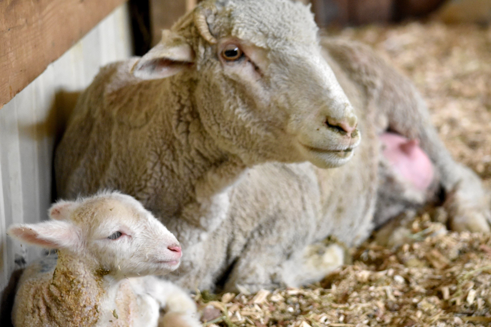
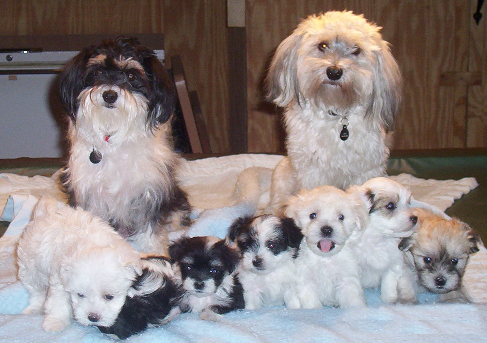
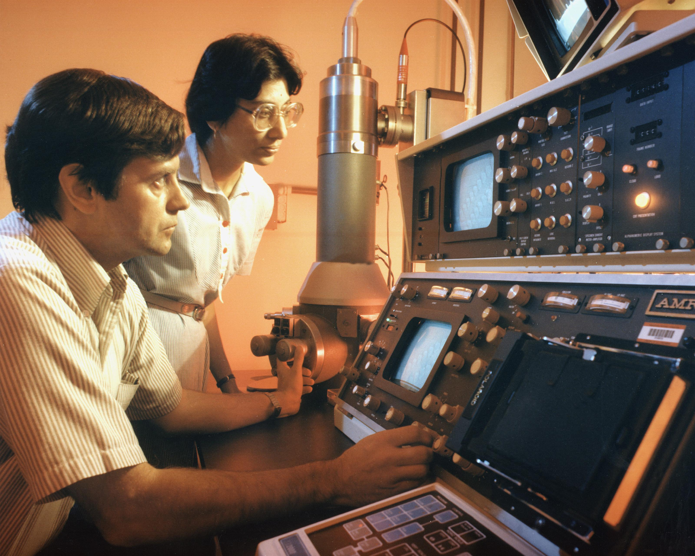

# PART VII — Copies

## 29. Dolly, 5 July 1996

The lamb was born in a shed on a research farm seven miles south of Edinburgh, on a Friday evening in early July, and the first thing anyone noticed was her face. It was white. The ewe that had carried her for five months was a Scottish Blackface, a hill breed named for the obvious reason, and a Blackface ewe does not throw a white-faced lamb. The lamb's face said she was a Finn Dorset. There had been no Finn Dorset ram anywhere near the flock. That was the point. She weighed 6.6 kilograms, she stood up, she fed, and the handful of people in the shed slipped away and told nobody. It was 5 July 1996.

The world heard about her seven months later. A Sunday newspaper broke the story on 22 February 1997, five days ahead of the paper it was based on, which appeared in *Nature* on 27 February under a title that gives nothing away: "Viable offspring derived from fetal and adult mammalian cells." Five authors, Ian Wilmut of the Roslin Institute first among them. Somewhere in the text, in a table, is the number that made the lamb famous. The cell she had grown from was taken from the udder of a six-year-old ewe. A stockman at the farm is usually credited with the name.

What had been done to make her is called nuclear transfer, and the recipe is short even if the practice is not. Take an unfertilised egg from a Blackface ewe. Under a microscope, with a glass pipette finer than a hair, suck out the egg's own chromosomes, so that what remains is a cell with all its machinery and none of its text. Take a cell from a culture that has been grown from a scrap of the Finn Dorset's mammary tissue. Lay the whole cell against the emptied egg and pass a brief pulse of electricity through the pair. The pulse fuses the two membranes, so the udder cell's nucleus finds itself inside the egg, and it also gives the egg the jolt it would normally get from a sperm. The egg starts to divide. Grow it for a few days, then put it into a surrogate ewe and wait 147 days.

The numbers in the table are these. From the adult mammary cells, 277 eggs were fused with a cell. Of those, 29 developed far enough to be worth transferring, and they were placed into 13 ewes. One pregnancy went to term. One lamb. The other 276 are the result as much as the one is. Most reconstructed eggs never became embryos worth moving. Most of those that were moved never implanted. The recipe worked, and it worked rarely, which is the pattern nuclear transfer has kept ever since. A newspaper can print the lamb. The table prints the failures, and the failures are why a clone is not a photocopy you can order. The same paper reports two other cell lines, one from a nine-day-old embryo and one from a 26-day-old fetus, and those gave a few lambs each. But it was the one from the udder that changed the argument, because an udder cell is a fully adult, fully specialised cell, and the question of the century in this corner of biology was whether such a cell still had the whole book in it, and whether the book could be told to start again from page one.

---

The puzzle was older than Wilmut. In 1928 the German embryologist Hans Spemann tied a loop of baby hair around a salamander egg, pinching it so that the nucleus was on one side and a bag of cytoplasm on the other. When the nucleated half had divided several times, he loosened the loop and let one nucleus slip across into the empty half. It grew into a normal embryo. In 1938, in a book, he proposed what he called a fantastical experiment: take a nucleus from a cell that had already become something, put it into an egg with no nucleus, and see if the egg could make a whole animal from it. He had no way to do it.

Robert Briggs and Thomas King did it in 1952, in Philadelphia, with the leopard frog. They took nuclei from cells of a blastula, an early hollow ball of a few thousand cells, put them into eggs whose own nucleus had been removed, and got swimming tadpoles. When they tried nuclei from later, more specialised stages, the tadpoles mostly failed. Their conclusion, cautious and reasonable, was that as a cell commits to its fate, its nucleus loses something it cannot get back.

John Gurdon, at Oxford, did not believe it. In 1962 he published an experiment with the African clawed frog *Xenopus laevis* in which the donor nuclei came from the gut lining of feeding tadpoles, cells that were already doing a job. He used a strain with a visible marker in the nucleus so that nobody could say the frogs had come from a stray egg nucleus. A small fraction of the transfers, of the order of one or two in a hundred, became tadpoles that became fertile adult frogs. It was a slim fraction, but zero would have proved Briggs and King right and it was not zero. Gurdon's school biology master had once written on a report that a scientific career for the boy would be a waste of everyone's time. Gurdon kept the report. In 2012 he shared the Nobel Prize in Physiology or Medicine with Shinya Yamanaka, whose part of the story is two chapters on.

Frogs, however, are not mammals, and for thirty years the mammal refused. A frog's egg is enormous and develops on its own in pond water. A mammal's egg is a tenth of a millimetre across and needs a womb. In 1984 James McGrath and Davor Solter published in *Science* a careful set of mouse experiments in which transferred nuclei from anything later than the two-cell stage failed, and they ended with a sentence that became notorious: the cloning of mammals by simple nuclear transfer, they wrote, was biologically impossible. Steen Willadsen, working in Cambridge with sheep, showed in 1986 that nuclei from eight-cell embryos would work, and groups in Wisconsin extended it to cattle, but those were embryo cells with almost no history. The adult cell was the wall.

---

The person who found the way through was not Wilmut but Keith Campbell, a cell biologist who joined Roslin in 1991 with a background in cell cycles rather than sheep. His idea was that the trouble was one of timing. A nucleus busy copying its own DNA or preparing to divide, dropped into an egg that is at a different point in its own cycle, gets torn chromosomes and a dead embryo. The egg needs a quiet nucleus. Campbell's trick was to starve the donor cells of the serum that feeds them for a few days, so that they stopped growing and dropped into a resting state that biologists call G0. A nucleus in that state, he argued, would be reprogrammed rather than wrecked.

It worked first with cultured embryo cells. Two lambs, Megan and Morag, were born at Roslin in the summer of 1995 from cells that had been grown in a dish for weeks, and the paper appeared in *Nature* in March 1996. Nobody outside the field noticed. Dolly, from the udder, was the same method pushed one step further, and it is a fair puzzle who deserves the credit for her. Wilmut was the head of the project and the first author. Campbell was the one with the idea. In 2006, giving evidence to an employment tribunal in Edinburgh, Wilmut himself is reported to have put Campbell's share of the credit at 66 percent. Campbell died in 2012 at 58. Wilmut was knighted in 2008 and died on 10 September 2023, at 79.

Dolly herself lived in a barn at Roslin. She could not be put out on the hill, because the institute had received threats, and because a sheep that had been on the front page of every newspaper on Earth was worth stealing. Visitors fed her, and she grew fat. In the spring of 1997, to find out whether a clone could breed, she was put to a Welsh Mountain ram named David. Bonnie was born in April 1998. Twins, Sally and Rosie, followed in 1999, and triplets, Lucy, Darcy and Cotton, in 2000. Six lambs, all by the ordinary method. Whatever the egg had done to the udder nucleus, it had produced a ewe whose own eggs were fine.

Two things then happened that made people wonder whether she had been born old. In May 1999 a paper in *Nature* reported that Dolly's telomeres, the protective caps on the ends of the chromosomes that shorten a little with every division, were about 20 percent shorter than those of ordinary sheep of her age. The obvious reading was that her cells remembered the six years of the ewe she came from, plus the weeks in culture. Then, in the autumn of 2001, at five and a half, she was found to have arthritis in the hip and knee of her left hind leg, which is early for a sheep. The newspapers had their story. The clone was ageing fast.

The end arrived in February 2003. She developed a cough, a scan showed tumours in both lungs, and on 14 February she was put down, at six years and seven months. A Finn Dorset can live to eleven or twelve. The tumour was ovine pulmonary adenocarcinoma, a cancer caused by a retrovirus, a virus that copies itself straight into a cell's own DNA, called Jaagsiekte sheep retrovirus, that spreads in sheep kept close together indoors. Other sheep in the same barn had it. Her body was preserved and stands today in the National Museum of Scotland in Edinburgh, looking, as she did in life, faintly pleased with herself.

So was she old before her time? The working answer, and I think the right one, is no. Cloned cattle reported in 2000 had telomeres longer than normal, so short telomeres are not a law of cloning. In 2016 a group at the University of Nottingham led by Kevin Sinclair published, in *Nature Communications*, a full health check of thirteen cloned sheep aged seven to nine, four of them grown from the same frozen mammary cell line as Dolly. They were healthy. Their joints, blood pressure and blood sugar were those of ordinary sheep, and none had unusual arthritis. In 2017 the same group X-rayed Dolly's own skeleton and identified the joint damage of a sheep her age, and no worse. The best account is that she was a fat sheep kept indoors, which is a recipe for bad knees and for catching a lung virus, and that the cloning had little to do with either.

What the cloning had to do with was the argument that the copy in an adult cell is still the whole book. Roughly two hundred distinct cell types, the figure from chapter 9, make a sheep or a person, and each type carries the same text. In a person that text is two parental sets, about 6.2 billion letters. A sheep's cells likewise carry two copies of a text of the same order of length. What differs between an udder cell and a neuron is which pages are open. Dolly showed that an egg can close them all and open them again in the right order, at least once in 277 tries. It was the loudest possible demonstration that the text and the reading of the text are two different things. What she did not show, and what the next chapter is about, is that a clone is a copy of the animal it came from.

## 30. What a Clone Is and Isn't

In February 2018, in the middle of a long interview about her career, Barbra Streisand mentioned to a reporter from *Variety* that two of her three dogs had been cloned. Her Coton de Tulear, Samantha, had died in May 2017 at fourteen. Before she died, cells had been taken from her mouth and stomach and sent to a company in Texas, and the result was two puppies, Miss Violet and Miss Scarlett. A month later Streisand wrote a brief piece for the *New York Times* to explain herself. The puppies, she said, had distinct personalities from each other and from Samantha, and she was waiting to see which one would grow into the dog she missed. She dressed them in contrasting colours so she could tell them apart.

The company was ViaGen Pets, in Cedar Park near Austin, which had begun cloning dogs and cats for the public in 2015. In 2018 the price for a dog was about $50,000. A cat was cheaper, somewhere between $25,000 and $35,000 depending on the year, and by the mid-2020s both were being quoted at $50,000. The first step, the taking and freezing of a skin sample, is listed at $1,600, and a good many owners buy that and stop there.

What they are buying, if they go on, needs saying carefully, because the word clone carries a freight of films. Suppose, purely for the mechanism, that a skin cell of a fifteen-year-old were used to make a clone of him, and a child were born in 2027. What would that child share with the boy born in 2011?

The nucleus, to begin with. The child's nucleus would carry the donor's full diploid genome, both parental sets, about 6.2 billion letters. Two qualifications follow. The skin cell would have picked up its own private mutations since that boy was a single cell, at a rate that in skin runs to dozens a year, and every one of those would be in every cell of the clone. And the child would carry no new mutations from a father's sperm, because there was no sperm. So the clone would be nearer to the donor than the donor is to his own brother, and not identical to him. Identical twins, who are the natural clones, are nearer still, because they start from the same single cell on the same day, and even they diverge: the fingerprints differ, and by middle age each twin carries hundreds of mutations the other does not. About three or four births in every thousand are identical twins, and the rate is oddly constant across the world.

What the clone would not share is everything outside the nucleus. The mitochondria, the small power stations in each cell with their own 16,569-letter text, come with the egg, so they would be the egg donor's, not the boy's. The womb would be another woman's, with her own diet, her own infections and hormones, and her own birthday. And the epigenome, the set of chemical marks on the DNA and its packaging that tells a cell which pages are open, would have been wiped and re-laid by the egg, imperfectly. Freckles written in the nucleus would come along. A memory of the summer he learned to swim would not.

---

The most instructive clone ever made is a cat. Her name is CC, and she was born at Texas A&M University on 22 December 2001, announced in *Nature* in February 2002. The money had come from John Sperling, the founder of the University of Phoenix, who wanted his dog Missy cloned and had funded a project to that end; dogs proved harder than cats, so the cat came first. CC's donor was a calico called Rainbow, a patchwork of orange, black and white. CC turned out grey tabby and white. Not a fleck of orange.

The reason is one that Chapter 12 set up. The gene that makes a cat's fur orange rather than black sits on the X chromosome. A female cat has two X chromosomes, and early in development each of her cells shuts one of them down at random and keeps that choice for life. If one X carries orange and the other black, the result is a patchwork cat, each patch descended from a cell that settled on a different choice. The pattern is not in the text. It is in a set of random decisions taken by a few dozen cells in an embryo a few days old. CC's donor cell had, by chance, shut down the X with the orange copy, and the usual account is that the egg did not fully reverse that decision, so every cell of the clone inherited it. Even if the egg had reset it, the patches would have fallen elsewhere. There is no way, in principle, to clone a calico's coat.

CC was healthy, had three kittens in 2006 by the ordinary method, and died in March 2020 at eighteen. Sperling's company, Genetic Savings & Clone, sold a handful of cloned cats from December 2004 at $50,000 each and closed in 2006 for lack of customers. The first cloned dog, an Afghan hound named Snuppy, was born in Seoul on 24 April 2005, from an ear skin cell; the paper reports 1,095 embryos put into 123 surrogates for that one surviving puppy. Dogs are hard because a bitch's eggs mature late, in the oviduct, the tube that carries an egg toward the womb, and are difficult to collect at the right stage. The laboratory that created Snuppy is a story for the next chapter; the dog, unlike much else to emerge from that laboratory, was real.

---

Outside the pet trade, cloning found the uses that pay. Mice were cloned in Honolulu in 1997 and reported in 1998, cattle in Japan in 1998, pigs in 2000, a horse in Italy in 2003, a mule in Idaho the same year, a camel in Dubai in 2009. On 15 January 2008 the United States Food and Drug Administration published its final risk assessment and concluded that meat and milk from cloned cattle, pigs and goats, and from their offspring, were as safe as any other; it made no ruling on sheep for want of data, and it required no label. In practice the clones themselves are rarely eaten. A clone of a prize bull costs something in the region of $15,000 to $20,000, and what is sold is his semen. The offspring of clones are ordinary animals, conceived by ordinary sex, and they have been in the American food chain since the 2000s. The European Parliament voted in 2015 to ban the cloning of farm animals and the sale of products from them, and though the legislation stalled, the practice is not carried on in Europe.

Horses are a special case, because racing's rulebooks forbid clones but polo's do not. In December 2016, in the final of the Argentine Open at Palermo, Adolfo Cambiaso rode six clones of his mare Cuartetera, one after another, and won. The clones had been produced by Crestview Genetics, a company set up by a Texan, Alan Meeker, with Cambiaso as a partner, and Cambiaso's first clone had been of a stallion, Aiken Cura, from cells taken as the horse was dying in 2006. Cloned polo ponies are reported to change hands for more than $100,000. In Dubai the Camel Reproduction Centre produced the first cloned camel, Injaz, on 8 April 2009, from the ovarian cells of a slaughtered adult, and has since cloned racing champions and winners of camel beauty contests by the dozen. What is bought in every case is the same thing: a genetic twin of a proven animal, born later. The buyer of a Cuartetera clone does not get Cuartetera's training. He gets a foal that can be trained.

Conservation has begun to use the same tool. Kurt, a Przewalski's horse, was born in August 2020 from cells frozen in 1980 at the San Diego Zoo's Frozen Zoo, restoring a set of genes that had been lost from the living herd. Elizabeth Ann, a black-footed ferret, was born on 10 December 2020 from cells of an animal frozen in 1988, and clones of the same donor were reported to have produced kits of their own in 2024. That is cloning as a time machine for genetic variation, and it is the use I find easiest to defend.

The primates came last. On 27 November and 5 December 2017, in Shanghai, two crab-eating macaques were born. Their names, Zhong Zhong and Hua Hua, spell the Chinese word for China when set side by side. Qiang Sun and Mu-ming Poo's group published the paper in *Cell* on 24 January 2018.

The numbers were bleak. The donor cells were fibroblasts, ordinary connective-tissue cells, from an aborted fetus. Seventy-nine embryos went into twenty-one surrogates. Six animals became pregnant. Two gave a live baby. A parallel attempt with adult cells produced two babies that died within hours.

What got monkeys over a line that twenty years of effort had missed was a chemical nudge. The embryos were injected with messenger RNA for an enzyme, Kdm4d, which strips a silencing mark off the packaging of the DNA, and treated with a drug, trichostatin A, that loosens that packaging further. The purpose was not curiosity. Identical monkeys are the ideal control group for a drug trial. In 2019 the same institute reported five cloned macaques with a body-clock gene knocked out.

The Kdm4d trick points at the general problem. Dolly was one in 277. Two decades on, the efficiency of nuclear transfer is still poor: in cattle, a few percent of transferred embryos become live calves, and in pigs and dogs the figure is lower. The losses come at every stage, from embryos that never implant, to placentas that grow wrong, to calves born too large to be delivered, a condition the breeders call large offspring syndrome. That the losses happen is settled. Why they happen is a working account, and its centre is the epigenome: the egg must strip from an adult nucleus every mark that made it an udder cell or a skin cell and then lay down the marks of a one-day-old embryo, and it does the job unevenly. The marks that record which parent contributed each gene copy, the imprints, are especially prone to error, and imprinted genes control the placenta and fetal growth, which is exactly where clones fail.

A growth gene shows the kind of error. *IGF2* pushes a fetus to grow. Normally it is read from the father's copy and kept quiet on the mother's. The quiet is a chemical mark, not a changed letter.

In cloned calves the marks at this gene, and at several others like it, often slip. A copy that should be silent speaks, or a copy that should speak goes faint. The fetus overgrows. So does the placenta. The same class of slip, arising on its own rather than from a cloning procedure, is a known human condition, Beckwith-Wiedemann syndrome: babies born large, growth marks wrong.

Cloning did not invent the problem. It stumbles into it when the reset of those marks is incomplete. A live calf shows that the reset was good enough. It does not show that the reset was clean. I would describe the link between the slipped marks and the oversized calves as a working account. The overgrowth is settled. The marks are the best current explanation, and more than one gene is involved.

There is a second mismatch, in the energy supply. Milk yield and muscle work depend partly on mitochondria, and those come with the egg, not with the nucleus that was copied. A clone of a champion cow carries the champion's nuclear text, both parental sets, and the egg donor's mitochondrial circle of 16,569 letters. The face can match. The energy machinery is someone else's, and nothing in the procedure swaps it. That is the same split this chapter has already shown in a calico cat and in two pet dogs. The nuclear text travels. A great deal around it does not.

None of this is what Streisand paid for, and she said as much. She wanted Samantha back, and she got two dogs with Samantha's coat and Samantha's face and their own opinions. The mistake, if it is one, is not in the science but in the word. A clone is a copy of the text, built late, read by another cell, in another body, in another year. Every animal in this chapter is a demonstration that the text is not the animal. The one animal it has never been done to, in any way that anyone has proved, is the one that has argued about it the most.

## 31. The Human Question

On the morning of 28 November 2018, in a lecture hall at the University of Hong Kong, a thirty-four-year-old biophysicist named He Jiankui walked to a lectern in front of several hundred of the world's genome-editing scientists and a bank of cameras, and the chair of the session asked the audience to let him speak. Three days earlier, videos posted on YouTube and a story in the *MIT Technology Review* had announced what he was there to describe. Twin girls, given the pseudonyms Lulu and Nana, had been born a few weeks before in China with a gene known as *CCR5* altered in their embryos by CRISPR, the gene-editing tool introduced in chapter 25. It was the first time anyone had deliberately altered a human being's heritable text and let the pregnancy go to term. The chair of the summit, David Baltimore, who had shared a Nobel Prize in 1975 and had spent forty years helping to write the rules for exactly this kind of work, branded it irresponsible from the same stage the next day.

The summit was the second of its kind. The first, in Washington in December 2015, had ended with a statement that it would be irresponsible to proceed with editing embryos for pregnancy until the safety questions were answered and society had reached some broad agreement. He Jiankui had been in the room in 2015. The full story of what he did and what was wrong with it comes at the end of this chapter. Before it, there is the older puzzle that Dolly raised in 1997 and that has never been answered by a birth: whether a human being can be cloned, and what people did while trying.

---

The reaction to Dolly was immediate and mostly about people. Within a fortnight of the announcement, President Clinton had barred federal funds from any attempt to clone a human and asked his National Bioethics Advisory Commission for a report; it came in June 1997 and recommended a moratorium, a temporary halt. In December 1997 a Chicago physicist named Richard Seed announced that he would set up a clinic to clone people, and got the front pages he wanted. In 2002 a religious group called the Raelians, through a company named Clonaid, announced the birth of a cloned baby girl on 26 December, and never produced her, a DNA test, or anything else. An Italian fertility doctor, Severino Antinori, and an American, Panayiotis Zavos, put forward similar claims across 2002 to 2004 with the same evidence, which is to say none. There is no verified case of a cloned human being born, then or since.

The laws followed anyway. In Britain, a High Court judge ruled in November 2001 that an embryo made by nuclear transfer was not covered by the 1990 fertility law, because that law defined an embryo in terms of fertilisation, and Parliament passed the Human Reproductive Cloning Act within weeks. The Council of Europe had opened a protocol banning human cloning in 1998. On 8 March 2005 the United Nations General Assembly adopted a Declaration on Human Cloning, by 84 votes to 34 with 37 abstentions, calling on states to prohibit all forms of human cloning that were incompatible with human dignity. The declaration is not binding, and the vote split not over babies, which nobody was defending, but over research: Britain, Belgium, South Korea and others voted against because the wording could be read to cover the making of cloned embryos for stem cells, which they allowed. The United States has never passed a federal ban, though some fifteen states have their own. Dozens of countries ban reproductive cloning outright.

The research the vote was about is what became known as therapeutic cloning. The idea was Dolly's recipe stopped short. Put a patient's nucleus into an emptied egg, let it grow five or six days to a hollow ball of a hundred or so cells, then take the inner cells and grow them in a dish as embryonic stem cells, which can become any tissue in the body and which carry the patient's own text, so his immune system would accept them. James Thomson in Wisconsin had grown the first human embryonic stem cells from spare embryos left over from IVF, fertility treatment done outside the body, in November 1998. The matched version was the prize, and in 2004 a veterinarian at Seoul National University announced that he had won it.

Hwang Woo-suk's paper in *Science*, published in March 2004, reported the first human embryonic stem cell line produced by nuclear transfer, from 242 eggs. A second paper in June 2005 reported eleven such lines, each matched to a patient, from 185 eggs, an efficiency that startled everyone in the field. Hwang became the most famous scientist in South Korea, given a title, a postage stamp and his own institute. In the autumn of 2005 the story fell apart. First it emerged that some of the eggs had come from junior women in his own laboratory, and that donors had been paid, which his American collaborator, Gerald Schatten of Pittsburgh, cited when he withdrew in November. Then a television investigative programme, and a group of young Korean scientists posting online, showed that photographs in the 2005 paper were duplicates of each other. A university panel reported on 23 December 2005 that the 2005 data were fabricated, and on 10 January 2006 that the 2004 line was not a clone either. *Science* retracted both papers on 12 January 2006. Not one matched stem cell line had ever existed. In 2009 Hwang was convicted of embezzling research funds and of violating the bioethics law, and after appeals received a suspended sentence. He went on cloning dogs, at which, as the last chapter said, he was genuinely good.

The thing Hwang faked was eventually done. In May 2013, in *Cell*, Shoukhrat Mitalipov's group at Oregon Health & Science University reported human embryonic stem cell lines made by nuclear transfer, using skin cells from a fetus and from an eight-month-old infant. The reasons it worked were unglamorous: very fresh eggs from young donors, precise timing of the electrical pulse, and caffeine in the medium, which holds the emptied egg in the right state while the new nucleus settles. In April 2014 two other groups, one in New York and one in California and Korea, extended the method to adult donors, including a man of 75 and a woman with type 1 diabetes. It had taken eleven years from Hwang's claim to the fact. By then it barely mattered.

---

It barely mattered because of a paper published in *Cell* on 25 August 2006 by Kazutoshi Takahashi and Shinya Yamanaka of Kyoto University. Yamanaka had trained as an orthopaedic surgeon, found he was bad at it, and turned to research. His question turned Gurdon's on its head: an egg can reset an adult nucleus, so the egg must contain the factors that do it. What are they, and how few would be enough? He and Takahashi assembled a list of 24 genes active in embryonic stem cells, put all 24 into mouse skin cells with a virus, and got a few cells that behaved like embryonic stem cells. Then they removed the genes one at a time to see which ones were needed. The answer was four: *Oct3/4*, *Sox2*, *Klf4* and *c-Myc*. Four genes, delivered to a skin cell, turned it back into something that could become any tissue. He called the cells induced pluripotent stem cells, iPS cells, and in November 2007 his group and James Thomson's, in the same week, did it with human cells.

The consequences for cloning were immediate. To get a patient's own stem cells, you no longer needed a woman's eggs, an emptied egg, a nuclear transfer, or an embryo. You needed a skin biopsy and a virus. Whatever position a country had taken in the 2005 vote, the technology had walked around it. In 2012 Yamanaka shared the Nobel Prize in Physiology or Medicine with John Gurdon, for a frog experiment in 1962 and a mouse experiment in 2006, and it is one of the better-judged prizes: the second experiment answered what the first had only asked. The first patient treated with iPS-derived cells was a Japanese woman in her seventies who received a sheet of retinal cells in Kobe in September 2014, made from her own skin. By 2025 trials for Parkinson's disease, heart failure and several other conditions were under way, and the Parkinson's results reported that year from Kyoto were modest and real. Whether iPS cells become routine medicine is still a working hypothesis. That they killed the argument for cloning humans for spare parts is settled.

That leaves the babies, and the man at the lectern. He Jiankui had a doctorate from Rice University, a postdoctoral year at Stanford, extra research training taken after a doctorate, and a post at the Southern University of Science and Technology in Shenzhen, from which he had taken unpaid leave. Through a support group for people affected by HIV, the virus that causes AIDS, he recruited couples in which the husband was HIV-positive and the wife was not. The consent form the couples signed described the project as the development of an AIDS vaccine. The ethics approval he produced bore the stamp of a Shenzhen hospital, which said it had never given it, and the Chinese investigation that followed found the document forged. He edited *CCR5* in the couples' IVF embryos, chose embryos he judged edited, and transferred them. Twin girls were born in late 2018. A third child, from another couple, was born in 2019.

What was wrong scientifically is a list, and it needs no rhetoric. First, there was no medical need. A father's HIV is kept out of an embryo by washing the sperm, a routine procedure since the 1990s, and the mothers were not infected, so the girls were at no risk in the womb. Second, the edit was not the edit. The intended model was Δ32, a 32-letter deletion in *CCR5* carried on one chromosome by about 10 percent of northern Europeans and on both by about 1 percent, which removes the doorway that HIV uses to enter a cell. CRISPR cut where it was aimed, but the cell's repair produced different deletions. One girl, from his own slides, had one copy of the gene changed and one untouched, which gives no protection at all. The other had two distinct changes, neither of them Δ32, whose effect on the protein nobody had ever measured. Third, the girls were mosaic: the slides showed that not every cell in the embryos carried the same edit, so the children are patchworks of edited and unedited cells in unknown proportion. Fourth, off-target cuts, CRISPR snipping at an address other than the one it was aimed at, could not be excluded, and cannot be checked in a living child without sampling tissue after tissue. Fifth, the gene itself has other jobs. People with two copies of Δ32 are reported to die more often from West Nile virus infection, and mouse work in 2016 had linked loss of CCR5 to changes in memory, a finding whose meaning for humans is speculative but which no one had considered on the girls' behalf.

What was wrong ethically follows from the list. Children who could not consent were given an unproven change to every cell of their bodies, for no benefit to them, with risks nobody could bound, in secret, under a consent form that misdescribed the work, with paperwork that was forged. It emerged afterwards that a number of scientists in China and the United States had known something of his plans, and that none had raised an alarm loud enough to stop him. The strongest case in his defence, that HIV carries a heavy stigma in China and the parents wanted their children protected, is true and does not reach the list.

On 30 December 2019 a court in Shenzhen sentenced He Jiankui to three years in prison and a fine of three million yuan, about $430,000 at the time, for illegal medical practice; two colleagues received lesser sentences. He was released in April 2022 and has since said publicly that the children are healthy, without publishing any data that would let anyone else judge. Whether editing embryos could ever be justified, for the family in which both parents carry Huntington's and every embryo is at risk, is the argument of Part XI, and I think it is a real argument with real people on both sides. He Jiankui did not have that argument. He had a gene that was easy to cut, couples who trusted him, and a summit to announce it at.

Every cell in those three children carries a change that no parent handed down and no cell miscopied, and if they have children, the change goes with them.
