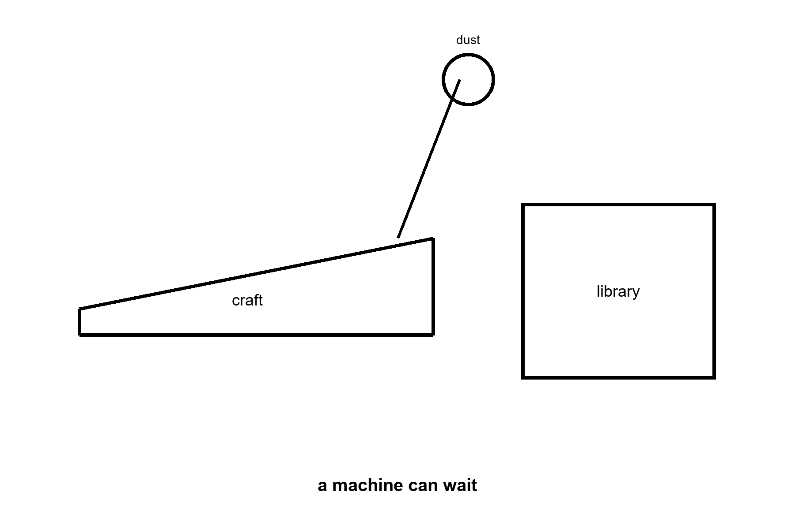
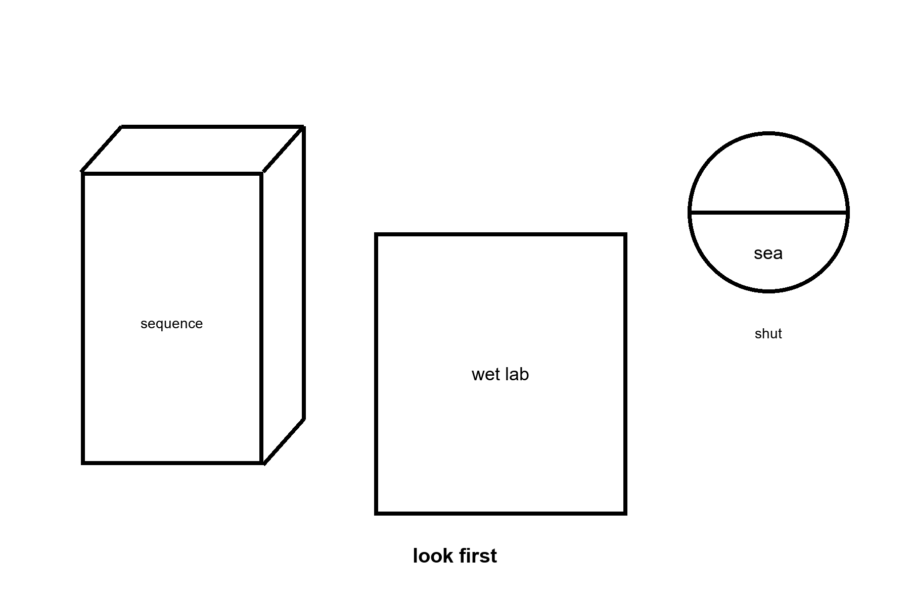

# PART VI — The Long Ticket

The near ticket was a camp. This part is the far one: a crew that can wait, and the box it should carry. Ice oceans and a second dictionary stay in *The Universe Has No Now*. The rule does not.

---

## 25. Crews That Do Not Sleep

A trip to Mars is a year of your proper time if you are lucky and the window is kind. A trip to Europa is years, with a nuclear brick in the back and Jupiter’s radiation as a landlord. A trip to a large moon of a cold planet around another star is not a trip. It is a career for a civilization, or a nap that no flesh can take, or a crew that does not have a metabolism.

At a hundredth of light speed — already an aspiration that makes chemical rockets look like horses — Alpha Centauri is four centuries away. At a tenth of light speed, it is forty years, plus the problem of slowing down, plus the problem of a grain of dust at that speed becoming a rumor of energy. Flesh does not like forty years in a can. Flesh does not like four hundred at all. Generation ships are a story we tell to see if we mean it. Sleeping flesh is a story that biochemistry has not signed.

A few words, so this chapter does not assign another book. Proper time is the time a clock reads along its own path. It is the only time a body keeps. A fast trip can change the date waiting at home. It does not hand the traveler extra heartbeats. The loaf, in the cosmology book, is spacetime drawn whole, like bread: events are the crumb, a life is a thread through it, and “now” is only a slice someone chooses to cut. There is no slice every clock must share. The leftover glow is the faint microwave light still arriving from the hot past. The shove is the measured speeding-up of the stretch between galaxies. The Omega Point was a required last mind at the end of time, as if the universe owed someone a final computation. This chapter refuses the cruise as destiny. It does not reopen that trial.

Machines do not sign either, but they do not starve. An autonomous crew — processors, actuators, repair arms, a body that may look like a person because the tools were built for hands, or may look like a drill because the job is ice — can wait. It can coast. It can wake for a course correction every decade. It can arrive at a moon that has not heard of Earth in a thousand years and still know how to melt a hole.

Call it AI if you want the current trademark. Call it a robot if you want the older one. Call it an android if the hull is a courtesy to human doorways. The physics does not care about the courtesy. The physics cares about joules per bit, about error-correcting memory against cosmic rays, about a reactor that still knows its job after a century of quiet. Appendix A25 writes dose and travel time. Here, keep one image: a thing that does not sleep, hanging in the dark, carrying a library, aimed at a lid of ice.

The quiet is the job. Galactic cosmic rays — a drizzle of fast nuclei that no planetary magnetic mood is catching — punch bits all century. Unshielded flesh, in deep space, collects a career-limiting dose in a handful of years: tenths of a sievert per year, order of, enough to make a human worldline a bad hire for a four-century commute. The machine does not have marrow. It has parity, redundancy, a memory that expects to be wrong and keeps a spare. A grain of dust at a tenth of light is not dust. It is an energy rumor with a mass. Whipple bumpers and a long, thin nose are the kitchen names; “hope” is not. Slowing down at the far end is a second fortune, as rude as leaving. Chemical tanks will not pay it. A brick that still knows how to be a brick after a hundred years of cold might.

It wakes, if it wakes, for a star that has drifted, a gyro that has sulked, a bit that flipped and must be voted off the island. Then it sleeps again, which is a word for a low-power wait, not a dream. Flesh wants a generation ship or a biochemistry that has not signed. This crew wants a plug you can still reach from Earth for the first years, and then a set of orders dull enough that a flipped bit cannot found a religion. A melt-probe under the ice, in *The Universe Has No Now*, is the same object with a shorter commute. Chapter 26’s library is the cargo that makes the commute worth the failure rate.

This is not the Omega Point. It is not destiny. It is a project with a failure rate. The machine can miss. The ice can be thicker than the melt. The sea can be sealed from rock. The sea can already be taken. The project is still the only way “long travel” stops being a picture. Flesh can follow later, as cargo or as a reconstruction, if the library is good and the greenhouse, under some other sun or under some other lid, has begun to smell like a lie again.

A warning, because this book has a temperature habit. “AI” in the kitchen now is a pattern engine. “AI” on a century cruise is a control system that must not go mad in the quiet. Those are not the same object. We do not yet own the second. We own the beginnings of the first. The chapter is an outlook, not a purchase order. What it may hand her is a machine that can wait. It may not hand her a colleague.

The greenhouse woman, if a machine ever takes her shift, still needs the stuck airlock to sigh. Joules per bit do not name a potato. A century crew that arrives at a lid of ice with a library and a melt plan is a success of waiting, not a replacement of the observer who can be surprised by a yellow leaf. Keep the orders dull. Keep the plug. The rest is Chapter 26’s box and the hole under the ice, in the other book. This chapter is only the crew that can wait.

---

## 26. A Library of Earth

If you are sending a crew that does not sleep, send more than a flag.

Earth’s interesting inventory is not its iron. Iron is common. The interesting inventory is a trick of carbon and water that learned to copy itself, then learned to remember, then learned to write the memory down. The memory, at the bottom, is sequence: DNA, RNA, the libraries of proteins, the messy extra of cultures and seeds and stored fat. You can put a surprising amount of that into a box. The Svalbard vault puts seeds under a mountain because mountains outlast ministries. A cruise to a dark sea puts sequence into error-corrected crystal or dried archive or a set of printers that can, if the printers still work, turn sequence back into a cell.

A human genome is a novella: a few billion letters, less than a music library once you compress the repeats. A biosphere is a literature. The box that only holds a mascot — one ape, one crop, one slogan — is a vandal’s suitcase. What you actually want, if you are not a vandal, is the staff that can live in the available trick: rock-eaters for a vent, light-eaters for a tray, seeds that remember winter, a wet lab that can turn a recipe back into a membrane. The printers are not magic. They are kitchens that must themselves survive the trip — enzymes, solvents, a sterility you can still trust after a century of rays. Sequence without a kitchen is a book in a language no one left standing can cook.

The look-first rule is a procedure, not a hymn. Taste the plume. Melt a hole. Ask whether a chemistry already wants a story. COSPAR’s categories are the dull names for that pause: icy moons with oceans sit in the rooms where a sneeze is a policy. If the sea is taken, the library stays shut. If the sea is empty, opening the library is still a first day of school you do not get to un-teach. You cannot know from the greenhouse on the dead world. Light-minutes of delay do not carry a verdict from a lid of ice light-hours away. Patience is the instrument.

Directed panspermia is an old idea with a famous name attached: maybe someone already did this to us. Maybe we do it next. The idea is cold as history and warm as engineering. Planetary protection is the brake. If Europa’s sea has a biosphere, our *E. coli* is a conquistador. If it does not, our *E. coli* is a first day of school. You cannot know from the greenhouse. You know from the taste of a plume, from a melt, from a patient look.

The louder version is not a later visit. It is a first day.

A being — or a machine that does not sleep — opens a sterile world and pours a library into the water. DNA, or something that will become DNA, as a gift or as a farm. Earth at four billion years ago is such a world: cooled, wet, chemically sloppy, empty of grandmothers. If the pour happened, every cell we have cultured is a grandchild of someone else’s box. LUCA is still a grandmother. She is just not *ours*. A second origin with a code of its own would be a second dictionary. If the pour happened, that test becomes a shipping label, not a frozen accident. You do not need the other book’s trial to use the brake here. That is allowed as a sentence. It does not answer the first question. It moves it. The seeder still needed a kitchen, somewhere, sometime. Turtles, all the way down, until chemistry does the first hour without a librarian.

Would we know?

The leftover glow does not say. The rocks of the first wet days are almost gone, cooked and recycled. What we have is a code that looks like one origin, a handedness that looks like one flip of a coin, and a chemical path from organics to something like a cell that is incomplete and not empty. Miller’s spark, vents, an RNA world that may or may not have happened — those are papers, not a myth. A seeder would have to hide in that incompleteness. A serial number in the genome — a string that is not a gene and not a parasite and not junk we have misread — has been looked for by people who wanted to find it. What they found was mostly junk we had misread. Endogenous leftover viruses are leftovers, not a note.

So: seeding Earth at the beginning is cold as a detection and warm as a project we might do to someone else. If we do it, we have written over their exam. That is why the ice chapter of the other book already said look first. The myth that forgets the rule is a gardener who drinks himself into a river and calls the river life. Pretty. Rude. The river does not owe him a thank-you, and it does not prove he was there.

Ants are the honest scale.

A leafcutter city already farms. It already wars. It already keeps slaves, in some species, which is a sentence you can dislike and still have to write down. No ant negotiates with us. We step over, or we study, or we pour. To a crew that crossed a century, an ape city may be that nest: organized, impressive at its own size, not a colleague, not a conversation. The zoo hypothesis — they do not talk because we are the exhibit — is a story. The ant hypothesis is ruder and cheaper: they do not talk because talking is not what you do with a nest. If someone seeded us, they may be tending a farm, or they may have forgotten the farm, or they may have come back to wipe it because the crop learned to shout. None of those is a detection. All of them are what a librarian looks like when you are the book.

The nest is the scale, not a theory of mind. To a crew that crossed a century, an ape city may be that nest: organized at its own size, not a colleague. You meet it by being the wrong size, or by pouring. Whether a machine can be a someone is the other book’s unfinished fight. This chapter keeps the box shut until the sea has been tasted.

The printers cut the other way too. You do not have to seed a pond and wait four billion years. If the library is good and the wet lab survived the trip, you can print a being to spec: a perfect worker, a perfect weapon, a fifth thing after the ordinary four, dropped into a crisis on a clock. That is not a new physics. It is Chapter 25’s machine wearing this chapter’s recipe. Special relativity still makes the mail late. Quantum mechanics still makes the recipe a sequence of letters, not a mystic spark. General relativity still refuses a handle unless someone pays the exotic bill. The being can look like a miracle to the city that did not own the printer. It is a miracle of logistics. We would notice the printer before we noticed the theology.

Logistics has a mass. The wet lab, the spare parts, the error-corrected crystal, the power to keep a freezer cold through a century of quiet: those are kilograms the Δv still invoices. A flag is light. A literature is not. Directed panspermia — the old idea with Crick and Orgel’s names on one famous version — is this invoice pointed at a sterile ocean, ours or someone else’s. Cold as a detection in our own rocks. Warm as a project we might do, and therefore a project we can refuse. Refusing is the adult move when the exam has not been read. Pouring because the cruise was long and the crew was bored is how a librarian becomes a flood.

What you carry, if you are not a vandal, is diversity, not a mascot. A human genome is a novella. A biosphere is a literature. Bacteria that eat rock. Algae that eat light. Tardigrades that pretend to die. Seeds that remember winter. The printers, if we ever own them at that scale, do not have to print a person first. They have to print a chemistry that can live in the available trick: a greenhouse on a desert planet, a vent-garden in a dark sea, a film on a tide.

The woman in Chapter 1 is already a librarian. Her basil is a borrowed sentence. The machine in Chapter 25 is a librarian with a longer loan period. Neither of them is a destiny. Both of them are what a filter looks like when it grows hands: not the universe arranging itself for observers, but observers arranging a small room so that water and carbon can keep their trick going in a place the universe left dead or dark. Do not pour first and call it genesis. That is how you become the ant’s flood.

A last look at the box, because mass is honest. Seeds under Svalbard’s mountain are a literature parked in a climate we already have. Sequence in a cruise is a literature parked in a climate we must carry: vacuum, rays, a reactor, a sterility. If the printers fail, the box is a museum. If the printers work and the look-first failed, the box is a conquistador. The greenhouse woman’s basil is the small version of this choice, already made, on a world whose exam for a second origin was graded empty enough to farm. A dark sea is not that world until the melt says so. Keep the vault door shut until it does.

Look first is also a hygiene of the printers. A wet lab that can print a cell can print a plague. Chapter 25 already named the design assistant as a danger; this chapter is the recipe drawer that assistant would open. Sterility is not a mood. It is filters, assays, a refusal to let Earth’s hitchhikers ride the melt. The box is as dangerous as it is precious. Treat it as both. A librarian who only loves the literature will pour. A librarian who only fears the literature will never farm a dead world whose exam is already empty. The rule splits the cases. The greenhouse is the empty-exam case, run small. The dark sea is the ungraded case. Do not mix the folders.

The Svalbard door is large in the figure because a library is a physical object. So is a cruise. So is a sneeze. If you remember nothing else from this chapter, remember the mass and the pause. Sequence is light to store and heavy to cook. The pause is look first. Seed later. Never because the potatoes on the dead world were lonely.

A library of Earth, carried well, is still Earth. The letters are ours. The handedness is ours. The four-letter habit is ours. The other book already said what a second dictionary would mean. This chapter says what pouring our dictionary would mean: a shipping label where an exam should have been. The crew that does not sleep can wait a century. It cannot wait an origin. Look first is how you refuse to spend the only data. Seed later is how you farm a room that has already been graded empty. Both belong in the box. Only one belongs in a dark sea on the first shift.

Appendix A26 writes genome size, synthesis, and the protection categories. Here, keep the vault door and the pause. A mountain outlasts a ministry. A cruise outlasts a body. Neither outlasts a mistake poured into a sea that already copies.

---
