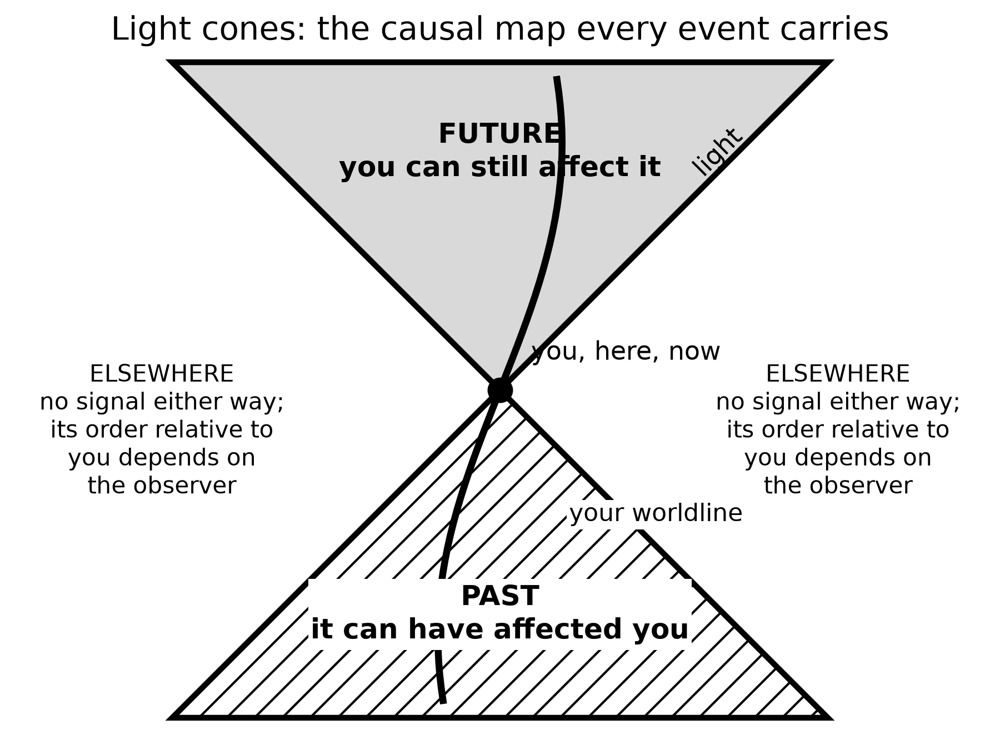
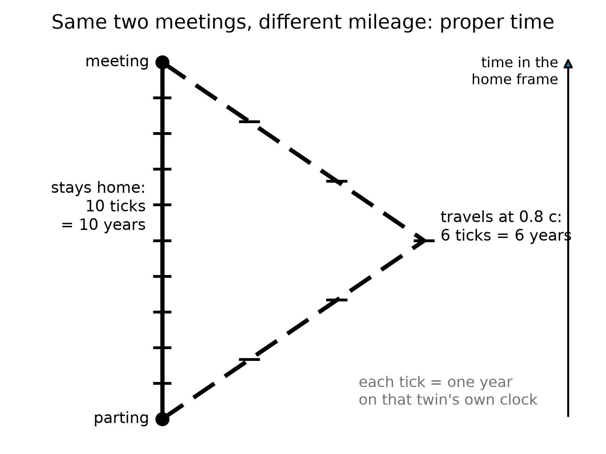

# PART I — There Is No Now

---

## 1. The Argument in the Kitchen

Imagine two people in a kitchen arguing about whether the casserole is done. One is standing still, pot holders ready. The other is walking toward the table. They agree on the recipe. They agree on the oven. They do not, if you take them seriously as physicists, agree on which distant events are happening “right now.”

That sounds like a joke. It is the opening move of twentieth-century physics.

Call the woman with the pot holders Mara. Call the walker Eli. They are invented. The casserole is invented. The disagreement is not. It is what falls out of a speed that refuses to change when you do.

In Newton’s world the joke would be on the physicist. Space was a box. Time was a universal tick, the same in London and on Jupiter. You could, in principle, freeze the universe and take a photograph of “everything at this instant.” The casserole, the moons of Saturn, and a supernova in a galaxy we have not named yet would all sit in one frame, labeled NOW.

Newton wrote that camera into law in 1687. The *Principia* treats time as something that “flows equably without relation to anything external.” Space is a stage that does not care who is walking on it. A second in Cambridge is a second on Jupiter because the second is a property of the universe, not a property of a clock. It let him predict the Moon. It is also, as a claim about the furniture of the world, wrong.

Hot: the Moon’s orbit yields to Newton’s arithmetic. Cold: there is a single river of time that every event sits in at once. The river was a convenience. The convenience survived two centuries because nothing in the kitchen, or in the solar system as Newton could time it, was fast enough to notice the lie.

Einstein broke the camera.

He broke it in 1905, in a paper that does not mention casseroles and barely mentions philosophy. The paper is about electrodynamics: what Maxwell’s equations look like if you are allowed to move. The speed that falls out of those equations is not a property of the air, or of a luminiferous ether that the Earth is swimming through. It is a property of the pairing of space and time. In 1983 the meter itself was redefined so that this speed is exact: 299,792,458 meters per second. That is a definition, not a measurement: the second comes from cesium, and the meter is whatever length light covers in 1/299,792,458 of it.[^2]

People had already tried to catch the ether. In 1887 an interferometer in Cleveland sent light up and down, expecting the Earth’s motion around the Sun to change the time of the trip. The change was not there. Others patched the books: lengths contract, clocks disagree, the ether becomes a ghost that cannot be found. Their algebra is close to Einstein’s. Their ontology is not. They were saving a stage. Einstein threw the stage out. There is no ether to be at rest in. There are events, and a speed that every honest observer assigns to light.

That is a hot claim. The null result is a century of repeated measurements. The reading — no privileged rest, no universal now — is the one that has survived every later test. Some treated the relativity of simultaneity as a convention about how to set distant clocks. Einstein treated the convention as a fact about the world. The difference is not a footnote. It is why this kitchen argument is physics and not manners.

He did it because the speed of light refused to play along. Measure that speed while you are standing still; then measure it while you are on a train. You get the same number. Not almost the same — the same. The only way that can be true, if space and time are allowed to share the job of keeping accounts, is if people who move relative to each other slice the world into “now” differently.

Here is why, at the scale of a countertop.

The oven has a window in the door and a second lamp over the stove, a couple of meters apart. A circuit is wired so that both lamps flash at what Mara, standing midway between them, will call the same instant. Light from the left lamp and light from the right lamp reach her face together. She is entitled to say: the two flashes were simultaneous. That is Einstein’s own popular example from 1916 — a train, an embankment, lightning at both ends — shrunk to fit between a sink and a fridge.[^3]

Eli is walking toward the right-hand lamp, and the books only close if we put him where Mara was: midway, in his own accounting, at the moment the lamps fire. In that accounting the two lamps are still the same distance from him. The light from the right-hand lamp meets him sooner because he is walking into it. The light from the left has farther to run and is chasing him. He subtracts those travel times and still cannot call the flashes one instant. A person merely standing closer to one lamp is a different mistake: unequal arrival, equal emission, once the distances are put back in. Eli has already put the distances back in. What remains is a disagreement about the emissions. Neither of them has made a mistake. They have different slices.

If the speed of those flashes were infinite, Mara’s “same time” and Eli’s “same time” would collapse into one stamp. An infinite courier can update every clock at once. A finite courier cannot. The same *c* that makes the Cleveland interferometer come up empty is the *c* that forbids a shared now. You do not get to keep Newton’s photograph and the Cleveland null result. One of them has to go. The photograph went.

Standing still, in this kitchen, does not mean “the true rest of the universe.” It means Mara is not walking relative to the floor. Eli is. Newton would have asked which of them is really moving relative to absolute space. There is no such question left to ask. Each is entitled to treat themselves as at rest and the other as moving. Each is entitled to a now. Those nows agree at the stove. They do not have to agree at Andromeda.

The kitchen clock is an excellent local tool. It does not tell you what is happening on Andromeda. Nothing does, instantly. Light from Andromeda takes about two and a half million years to arrive. Any claim about what is “now” happening there is a claim about how you choose to extend your kitchen instant across empty space. Different motions, different extensions, different nows. If Mara and Eli already disagree about two lamps a walk apart, they will disagree — after a tilt too small to feel in the hips — about events two and a half million light-years away. Chapter 4 does the arithmetic, and Spacetime Diagram 1 draws it. Here it is enough to feel the lever: a tiny disagreement about “same time,” multiplied by a huge distance, is not tiny.

This is not mysticism. It is not “everything is relative” in the freshman-poster sense. The speed of light is not relative. The order of cause and effect, for events that can actually influence each other, is not relative. What is relative is a luxury we never noticed we were taking: a single present tense for the whole universe.

Mara takes the casserole out. That event can be a cause of Eli smelling dinner. Everyone who can be reached by the smell, or by a shout, will agree on the order: out first, smell second. That order is not a slice. It is a cone. The luxury we lost is only the luxury of stamping Andromeda with the same second. We did not lose before and after where they earn their keep. It just will not let the kitchen timer annex a galaxy.

Keep the temperatures honest. Hot: light’s speed in vacuum is the same in every inertial lab we have built. Hot: no signal we have ever sent outruns it. Hot: two people in relative motion do not share a distant present. Warm: the cleanest reading is that the universe is a four-dimensional spread of events, not a box with a moving stamp. Cold: that this makes your choices unreal. It does not. A choice is an event with a past cone and a future cone. Chapter 6 will spend that coin. Do not spend it in the kitchen as despair.

Once that luxury is gone, several other ideas have to be rebuilt. The past is not a country that has vanished. The future is not a country that has not yet been founded. Both are regions of a four-dimensional object that physicists call spacetime. Your life is a path through it. The path has a beginning and, for you, an end. The object does not have a glowing edge labeled NOW that advances like a weather front.

That is the claim of Part I. The rest of the book spends it on the sky, and none of that works if the kitchen clock stays the official time of the cosmos.

Take the casserole out when your clock says so. Then look up, and notice that the dark is late.

---

## 2. An Event Is a Happening, Not a Thing

Physics, at this level, does not start with objects. It starts with *events*.

An event is a happening with a location and a time — or, more carefully, a happening that can be given four numbers once you have chosen a way to measure. A firecracker goes off. A photon hits a detector on a satellite. Two black holes finish colliding and ring down. You finish this sentence. Each of those is an event. A person is not an event. A person is a long, messy chain of them.

This sounds like bookkeeping. It is the opposite of bookkeeping. It is a decision about what the universe is made of.

Hold the firecracker a moment. It is not a red tube that “is” in the drawer and then “is” in the air. The lighting, the bang, the smoke that reaches a neighbor’s window — those are events. The tube is a habit we form when a bundle of events stays in step long enough for a hand to close on it. A marriage is an event, or a short braid of them: two people in a room, a sentence said, a register signed. The marriage-as-object, the thing you point at twenty years later and call “us,” is the trail. A death is an event. The person who died is not an event that has finished. The person was the trail. Confusing the trail with a crumb is how you end up asking where the rock “goes” when time “passes.” The rock does not go. The rock is a worldline. The crumb is a happening on it.

The loss is not verbal. Start with the rock and you will want a universal tick that tells you when the rock is “the same rock, later.” You will want a photograph of all the rocks at once. You will rebuild Newton’s camera because the camera is what objects demand. Start with events and the camera is optional. The rock is still there, as a braid. You can weigh it. You can throw it. You just cannot promote it into the atom of the inventory. Hot: detectors click at places and times. Warm: calling the click-cluster a muon, or a person, is the right habit for daily work. Cold: that the habit is what the universe is made of.

Give each event four coordinates. Three of them are the ones you already use to find a restaurant: a grid on the Earth, or a grid in the sky. The fourth is a clock reading. The set of all events, related by which ones can influence which others, is spacetime. The geometry of this got a line that still startles.

Hermann Minkowski, who had taught Einstein and had not at first been impressed by him, said it in Cologne on 21 September 1908: henceforth space by itself, and time by itself, are doomed to fade into mere shadows.[^4] He said it to a room of natural scientists who had grown up inside Newton’s box. Then the 1905 paper stopped looking like a trick with clocks. It was a geometry. Space by itself is a shadow because a length you measure depends on your motion. Time by itself is a shadow because a duration you measure depends on your motion. What is not a shadow is the pairing. Four numbers, glued by a rule that does not care who is walking. That sentence is warm as poetry and hot as a classification: every later test that has distinguished “space plus time” from spacetime has come down on that side.

Unpack the shadows without reciting the whole lecture. A meter stick moving past you is shorter along the direction of the motion than the same stick at rest in your kitchen. A clock moving past you ticks through fewer of its own seconds between two of your marks than a clock on the wall. Those are not optical tricks. They are what “space by itself” and “time by itself” become once *c* is the same for everyone. The point was that the two tricks are one trick. Shorten a length and you have borrowed from time. Stretch a duration and you have borrowed from space. The loan is exact. The leftover, the thing that does not change when you change walkers, is the interval.

Mara books a table. The booking already has almost everything physics will ask for. A street and a number. A floor. A clock time — half past seven, not “evening” in the abstract. If you like, a calendar date. Those are four coordinates for an event: Mara sits, the bread arrives. You can change the grid. You can measure the restaurant from a church steeple or from a satellite. You can run Mara’s watch fast or slow. You cannot turn the dinner into a rock that exists “at all times” and then ask time to happen to it. The dinner is a happening. Miss the hour and the table is a different event, or no event at all.

The useful picture is not a box of space with a clock hanging on the wall. The useful picture is a loaf. Each event is a crumb. A *worldline* is the trail of crumbs that is you — or the Earth, or a photon. A photograph of “the world at a given time” is a slice through the loaf. The slice is not unique. Tilt your knife — which is what changing your motion does — and you cut a different set of crumbs.

The tilt is tiny at walking speed. That is why Newton never saw it in a kitchen. Over a table, Eli’s knife and Mara’s knife cut almost the same crumbs. Over a galaxy, they do not. The loaf does not change when the knife tilts. The membership of the slice does. Cuts are useful. They are how you say “when I was twenty” without listing a million events. They are not a feature the bakery stamped on the crust.

Two events can stand in only a few relations that matter.

They can be close enough, in the right combination of space and time, that a light signal or something slower could pass from one to the other. Then one can be a cause of the other. Everyone agrees on the order. This is a *timelike* or *lightlike* separation, and it is the part of physics that still has a before and an after.

Lightlike is the edge of that permission. A photon leaving the oven lamp and hitting Mara’s eye is a lightlike pairing: no slower courier could have made the trip, and no faster one exists. Timelike is everything inside the edge — a shout, a smell, a walk from stove to table. Those pairings keep a before and an after for every honest observer. That is why the casserole can still be a cause of dinner. The order is not a courtesy. It is the interval advertising its sign.

Or they can be so far apart, compared with the time between them, that not even light can connect them. Then neither is the cause of the other. Different observers can disagree about which happened first. This is a *spacelike* separation. The casserole and a flare on Andromeda, “at the same kitchen instant,” are almost certainly spacelike. There is no fact of the matter about which was first that the universe is required to honor.

Appendix A2 writes this as a single formula: the spacetime interval. The interval is the same for every observer. The split of that interval into “so much space” and “so much time” is not. That is the entire trick. The loaf has a real geometry. The slices are ours.

The kitchen analog is a cutting board. Draw a right triangle from the corner of the board to a knife. The hypotenuse is a length. You can call one leg “along the counter” and one “toward the sink.” Rotate the board — you relabel the legs. The hypotenuse does not care. The interval is that kind of stubborn length, except one of the legs is time and comes in with a minus sign.

The minus sign is why the analog is not perfect. Rotate a cutting board and both legs stay lengths. In spacetime one leg is a duration, and it enters with the opposite sign to a length. That is why a small change of motion can trade a little space for a little time without changing the interval, and why a large enough distance makes “who was first” a question the interval refuses to answer. That invariance is hot: every particle detector that reconstructs a collision and every GPS receiver that solves for a position uses it. The split is ours. The pairing is not.

If you take nothing else from this chapter, take this: when a physicist says *spacetime*, they are not being fancy about the word *background*. They are telling you that the raw inventory of the world is events, and that time is one of the ways events can be separated — not a river the events float in.

---

## 3. Light Is Late on Purpose

We talk about looking into space. We are always looking into the past.

The Sun you see is eight minutes old. Jupiter, tonight, is about forty minutes old. The Andromeda Galaxy is two and a half million years old in your sky. The leftover glow this book will spend Part II on is a picture of the universe as it was when it was 380,000 years old — a baby picture with the baby long gone.

Eight minutes is the rounded kitchen number. The honest one is 499 seconds. That is how long light takes to cross one astronomical unit, the mean Earth–Sun distance, 149,597,870.7 kilometers, at 299,792,458 meters per second. The light that heats the back of your hand left the photosphere before you put the kettle on. You are not in touch with the Sun. You are in touch with a star that has already moved on.

The Moon is closer, which is why it fools people. Light from the near face takes about 1.3 seconds to finish the trip. During Apollo, Houston learned that number as a manner. A question went up. An answer came down. In the middle sat a hole you can hear on the tapes if you listen for the gap. It is not drama. It is 384,000 kilometers divided by the same *c* that emptied the Cleveland interferometer. The men in the room called it lag. The geometry called it a past cone.

Jupiter does not have a single number. The planet runs from about 3.9 to 6.5 astronomical units from the Earth, depending on where the two worlds sit in their orbits. Light one way is then about 33 minutes on a close night and about 54 minutes on a far one. “Forty minutes” is a typical Tuesday. A flare on Io is not news. It is a letter.

Voyager 1, as of October 2026, sits about 172 astronomical units out, in the thin dark past the planets. A command from Earth takes nearly 24 hours to arrive, and on 18 November 2026 the one-way trip passes a full light-day.[^5] A reply takes as long again. The spacecraft is not “out there now” in the sense a casserole is in the oven now. The spacecraft is a trail of events. The event you can still affect with today’s radio is already tomorrow on the craft’s clock, and the event you can still hear left yesterday.

This is not a limitation of our instruments. It is what a finite speed of light *is*. If light were instant, “now” would still be a problem for moving observers, but the night sky would at least be a live feed. It is not a live feed. It is an archive. Every direction is a different depth of time.

Look left at the Moon and you are looking 1.3 seconds down. Look at Jupiter and you are looking most of an hour down. Look at Andromeda and you are looking through the entire history of *Homo sapiens* and then some. The sky is not a dome with a single stamp. It is a stack of postmarks. A telescope is not a telephone.

People find this either depressing or wonderful. Both reactions are allowed. The scientific point is narrower. Because light is late, astronomy is already time travel of the only kind we actually have: we receive news of events that lie to our past, along our past light cone.

A light cone is not a party decoration. From any event — say, you snapping your fingers — draw every path a light ray could take into the future, and every path a light ray could have taken to arrive there from the past. The future cone is everything you can still affect. The past cone is everything that can still affect you. Everything else is *elsewhere*: real, possibly interesting, and unavailable as a cause or an effect of this snap.

Treat the cone as a traffic law. You may go into your future cone. You may have come from your past cone. You may not cut across elsewhere and arrive before the light. The posted limit is *c*. There is no shoulder. A radio, a probe, a letter, a shout across a yard — all of them buy a ticket inside the cone or they do not travel. The law is hot. Every failed attempt to signal faster than light, and every collider that has tried to catch a particle arriving before its own cause, has left the cone unbent. Warm: that no clever geometry later in the book will hand you a legal detour. Cold: that we have checked every cheat. We have not. Chapter 34 will be honest about the proposed ones. They have to break something in the loaf. They do not get to edit the 499 seconds to the Sun.

The night sky is the past cone, printed on the inside of your eye.

This is why “getting somewhere else in the universe” is not an engineering slogan. Most of the interesting somewhere-elses are already outside the future cone of any event you will live to occupy. You can wait. You can send a probe. You cannot, in this spacetime, jump sideways into elsewhere and arrive for dinner. Light’s lateness is not an inconvenience we can edit out. It is the geometry.

You do not need Andromeda to feel this. A conversation with someone on Mars is already broken. Light takes between about three and twenty-two minutes one way, depending on where the two planets sit in their orbits. The reply costs the same again. You cannot talk. You can only send, and wait, and send again. Elsewhere begins at the next planet over.

Put the same two people on the radios, years after the casserole, because the cone is easier to believe when it ruins a sentence. Eli, still in the kitchen, sends “How is the dust?” Mara, on the dead world, will hear it between three and twenty-two minutes later. She cannot say “wait, what?” in the way a kitchen allows. She can send her own sentence into a future Eli has not reached yet. By the time her words arrive, his next sentence is already in the air, or already abandoned. They are not talking. They are mailing. The interruption that makes a conversation a conversation is a timelike luxury — a luxury that requires the gap between speakers to be short compared with the time they are willing to wait. Elsewhere begins when the luxury ends. No colony is required for the demonstration. Two radios and an orbit are enough.

There is a kindness in the lateness, if you want one. The universe is not happening *at* you. It is arriving. The glow behind the stars, the one you cannot see without an antenna, has been arriving for thirteen billion years and will keep arriving tomorrow. You do not have to go anywhere to be in contact with the beginning. The beginning is late, and it is here.

The dark between the stars is late in another sense, and it has a name older than relativity. If the universe were infinite, eternal, and static, stuffed with stars, every line of sight would end on a surface as bright as a photosphere. The night would be a furnace. Heinrich Olbers was not the first to worry; he was the one the paradox kept. The night is not a furnace. Part of the reason belongs to later chapters: expansion stretches light and thins it. Part of the reason belongs here. The universe has a finite age. Light from the farthest possible furnaces has not had time to arrive, and many of those furnaces have not been burning forever. The black is an archive with empty early pages. That is a hot observational fact wearing a nineteenth-century question. The dark is late, and the loaf has a beginning.

---

## 4. Andromeda’s Navy

Here is the thought experiment that makes the kitchen argument unavoidable. It is often called the Andromeda paradox — the version physicists still use.

Mara is standing in the yard. Eli walks past her, toward Andromeda, at an ordinary pace — a stroll. Special relativity says that the set of events Eli calls “simultaneous with this passing” is tilted, very slightly, relative to hers. Over the distance to Andromeda, a slight tilt is not slight. On her “now,” the Andromedans (if any) are, say, sitting in committee. On his “now,” the committee has already launched a fleet.

The stroll is not a metaphor for speed. It is a speed. A comfortable walk is about 1.4 meters per second. M31, the Andromeda Galaxy, sits about 2.5 million light-years from the yard — a modern distance, not a poster guess. The tilt of “now” is the same arithmetic Einstein used on trains:

Δ*t* ≈ *v* Δ*x* / *c*²

where *v* is how fast Eli walks toward the galaxy, Δ*x* is the distance to M31, and *c* is the speed we have already refused to negotiate.

Plug in the stroll. You do not get centuries. You get about four days. A few days of disagreement about Andromeda’s “present,” for a walk you would not break a sweat on, at a galaxy you cannot see without knowing where to look. That is already enough to break a single cosmic now. Raise the relative speed to a highway and the disagreement becomes about three months. At an airliner’s speed it is about two years. The Earth’s own 30 kilometers per second around the Sun, if you compared frames carelessly, would buy you centuries. The yard only needs the stroll.

At the moment their sleeves brush, they share a here. They do not share an Andromeda-now. If Eli stopped walking, the disagreement would shrink toward zero. The navy, if any, would not notice. Nothing in M31 is waiting on his hips. The tilt is a fact about slices, not a telegram to a fleet.

Neither of them can see the fleet. The light has not arrived and will not arrive for millions of years. The point is not what they see. The point is the temptation to call one slice real.

If you believe that only the present is real — that the past is gone and the future is not yet — then you have a problem. Mara and Eli, standing in the same yard, passing each other at walking speed, do not share a present at Andromeda. If his present is real and includes a launched fleet, and her present is real and does not, then “real” has split in the yard.

The split is not a feeling. It is a bookkeeping collision. She has granted *real* to whatever sits on her slice. Eli has granted *real* to whatever sits on his. The slices disagree at a distance where no signal can referee. Either reality is allowed to depend on who is walking past the compost heap, or *real* was the wrong prize to hang on a slice. The first option makes ontology a property of gait. The second option is the loaf.

The clean way out is to stop granting a privilege to the slice. The fleet-launch is an event. The committee meeting is an event. Both are in the loaf. You will learn about them, if at all, when their light arrives. Until then they are not “future” in some ghostly sense and not “present” in some official sense. They are simply events that are spacelike-separated from this moment in the yard.

Hilary Putnam and C. W. Rietdijk made this into a formal argument in the 1960s: if whatever is present-for-someone is real, and if reality does not depend on who is walking, then distant future events are already real. Rietdijk’s paper is 1966. Putnam’s “Time and Physical Geometry” is 1967. Philosophers have been picking at the logic ever since. Some reject the idea that “real for Alice” transfers to Bob. Some try to keep a privileged present by adding extra structure that relativity does not provide. Some accept the loaf and get on with their lives.

The transfer is the hinge they pick at. Alice walks. A distant event is present-for-Alice, hence real. Bob stands. Reality does not depend on gait, hence the event is real-for-Bob too, even if it is future-for-Bob. Repeat, and the future fills up. That chain is only as strong as the first gift: present implies real, and real is shared. This book does not need the chain as a proof. It needs the first gift to look expensive. Once you have seen the gift cost a preferred slice, you can put the gift back on the shelf.

Keep the temperature on that last move. The relativity tilt is hot. Clocks and rods and GPS and particle tracks all honor it. The inference “therefore the distant future is real in the same way this yard is real” is a reading. It is a reading this book accepts, because the alternatives have to smuggle in a preferred slice that no experiment has found. It is still a reading. Warm, not a photograph of a fleet. The quiet version is enough: do not give the word *real* to one cut of the loaf and withhold it from the crumbs a walk would recut.

Henri Poincaré said as much around 1898: you cannot assign a time to a distant event without a rule, and the honest rule will not be Newton’s. He still treated the rule as a convention among surveyors, and the ether was still being patched. Einstein’s 1905 paper is the rule written as physics. The yard is the same rule with a longer baseline.

This book accepts the loaf. Not as a religion, and not as a measurement — as the interpretation that does the least violence to a theory that has passed every test we have given it. Chapter 6 marks exactly where the tested theory ends and the reading begins. GPS satellites run a daily demonstration: if you do not correct their clocks for both speed and gravity, your phone’s map slides into a ditch. The corrections are the same mathematics that tilts the Andromeda slice. Leave the clocks alone and they drift by about 38 microseconds per day[^1] — special relativity and gravity pulling in opposite directions, the net still large enough to walk a position off a road. The tilt that reallocates a few days of Andromeda is the tilt that, at 20,000 kilometers up, reallocates a fraction of a blink. We correct the blink because we like maps. We do not get to refuse the galaxy.

You do not need to believe that 2219 is “already happening” in some lurid sense. You need to believe something quieter: 2219 is a region of the same object 1914 is a region of. The difference is which events can still influence the ones that make up you.

1914 is not “still going on” in a kitchen. It is a region whose light, and whose causal leftovers, still reach you. 2219 is a region whose light has not, and whose causes you have not yet become. The vocabulary of happening — the glow, the stamp, the weather front — is what gets people into lurid trouble. Drop the glow. Keep the regions. You already do this with places. Lisbon is real when you are in the yard. You do not need Lisbon to be *here*. Times are places in the loaf. That sentence is warm. It is also the least theatrical reading that leaves Eli’s walk intact.

That quieter belief is enough to rewire the rest of the book. The beginning of the universe is not a story that *used to* be true. It is a region of the loaf. The heat death, if that is what we get, is another region. We occupy a thin braid in between.

---

## 5. You Are a Path

If the universe is a loaf of events, you are a thread.

A worldline is the set of events that is a particular object’s history. The Earth’s worldline is a long helix around the Sun’s, which is a longer helix around the galaxy’s. A photon’s worldline is a straight edge of a light cone — as straight as the geometry allows. A person is a bundle of worldlines, roughly parallel, that eat, argue, and occasionally write books.

The bundle is the honest picture and the slightly comic one. You are not a single thread. You are a rope of atoms that stay in conversation, plus a few that do not. The rope has a thickness of a body and a length of a life. Physics will still call the rope a worldline when the thickness does not matter. It matters when you want to know why a liver and a thought can share a name. They share a braid. The braid has a mileage. That mileage is the age your cells would confess if they kept better books than birthdays.

You do not move *through* time the way a boat moves through a river. That sentence, which feels like common sense, smuggles the river back in. What you do is occupy a sequence of events. The sequence has a length. That length is the time your watch measures, and it is called proper time. Proper time is not a coordinate someone assigned from a tower. It is a property of the worldline, the way a hiking trail has a mileage that does not depend on which map you used.

where proper time is the mileage along your worldline, the seconds a clock traveling with you actually accumulates.

Picture two hikers, June and Cal, who leave the lot at 8:00 by the same clock on the wall. June takes the ridge. Cal takes the creek. They meet at the lake and compare. The surprise, if you still think time is a river, is that their watches need not agree, even if both kept honest seconds. In the mountain the difference is too small to see. In spacetime the same kind of difference is the whole twin story. The map can lie about mileage if it wants; the boots do not. Proper time is the boots.

Two worldlines that start together and end together need not have the same length. This is the twin “paradox,” which is not a paradox. The twin who accelerates, turns around, and comes home has a shorter worldline. She is younger. The loaf does not care that this offends the kitchen clock. Particle accelerators run the same experiment all day: unstable particles that travel fast live longer, as measured in the lab, because their worldlines between two lab events are shorter in proper time, which means their internal clocks tick through fewer of their own seconds. The word “live longer” is a lab word. In their own terms they live a normal life and the lab takes forever.

It is mileage, not a trick. The twin who stays home is the hiker who took the straighter trail through the loaf. In the geometry Einstein handed us, the straightest timelike path between two meetings is the *longest* proper time, not the shortest. That is the minus sign from Chapter 2 earning its keep. The traveler who turns around has taken the switchbacks. Her watch adds up fewer seconds. No one has to break physics to prefer a younger sister. You only have to stop asking the kitchen clock to be the mountain.

The muon is the classroom that does not need a twin. A muon at rest lasts about 2.2 microseconds before it decays. That is not a rumor. It is a measured lifetime, 2.2 × 10⁻⁶ seconds, repeated until it is boring. Cosmic-ray muons are born in showers tens of kilometers up. Even at nearly the speed of light, 2.2 microseconds buys only about 660 meters of travel, so without time dilation most of them should die in the upper air. They reach the ground in inconvenient numbers. Their worldlines between the shower and the dirt are short in proper time and long in the laboratory’s coordinates. The particles are not cheating death. They are hiking a shorter trail. Hot.[^6]

The showers start nearer 15 kilometers. Without the mileage effect you would need a conspiracy of extra lifetime to stock a basement detector. With it, a muon whose energy buys a time-dilation factor of twenty or thirty has a trail long enough to punch the dirt. Students have been counting those punches since the 1940s.

In October 1971 Joseph Hafele and Richard Keating put that trail on commercial jets.[^7] They flew cesium-beam atomic clocks around the world, eastward and then westward, and compared them with clocks that had stayed in Washington. The eastward clocks came home about 59 nanoseconds behind the clocks that stayed; the westward clocks came home about 273 nanoseconds ahead, each close to its prediction. The signs flip with direction because the Earth’s rotation is already a velocity, and a jet adds to it one way and subtracts the other. Special relativity is not only for twins in textbooks. It is a fare class.

Gravity bends worldlines. That is what gravity *is*, in Einstein’s account: mass-energy tells spacetime how to curve; curved spacetime tells worldlines how to lean. A clock deeper in a gravitational well accumulates less proper time between two meetings than a clock higher up. This has been measured with aircraft, with towers, with a hydrogen-maser clock flown on a rocket in 1976,[^8] and with those GPS satellites. Near a black hole the same fact becomes extreme: an hour beside the horizon can be years farther out.

Bent, here, is not a metaphor for trouble. A worldline that stays near a mass is a different trail through the loaf than a worldline that stays high. The trail nearer the mass is shorter in proper time between two comparisons. The mass did not reach out and grab the clock. The mass told the geometry how to lean, and the clock added up the lean. Hot as a description of what we measure. Warm as the full story of why the geometry listens. Cold: that we have a finished quantum account of the listening. We do not. The clocks do not wait for one.

The tower came first, and it was short. In 1959 Robert Pound and Glen Rebka sent gamma rays up and down a 22.5-meter shaft in Harvard’s Jefferson Laboratory and measured the gravitational redshift — climbing out of a well costs a photon energy, the way climbing a hill costs a thrown ball speed, and a photon with less energy reads as a lower, redder frequency — of the Earth over the height of a building.[^9] Iron-57. A fraction of a fraction of the energy. They saw it. Later refinements made the agreement rude. You do not need a hole in the sky to learn that height is time. You need a basement and a roof and a nucleus that will confess. In 2010 optical clocks saw the same effect over a height difference of about a third of a meter.[^10]

GPS is the public sum of the jet and the tower. A satellite clock, moving fast, runs slow by about 7 microseconds a day from special relativity. The same clock, sitting higher in Earth’s well, runs fast by about 45 microseconds a day from gravity. The net, if you do not correct, is about 38 microseconds a day — the number Chapter 4 already used as a threat to maps. At the speed of light it is about 11 kilometers of ranging error a day, and it accumulates. The engineers correct both pieces because both pieces are real.[^1] The Andromeda tilt and the hiking-trail mileage are the same theory wearing different hats.

Chapter 21 will take the hour-beside-the-edge as far as a spinning hole and a poster number. If a clock in a basement already disagrees with a clock on a roof, a clock that hovers just outside a horizon will disagree with a clock in the suburbs of the same hole by an amount that stops being polite. The geometry is continuous. The kitchen is not a different law from the hole. The hole is the kitchen with the well turned up.

Once you are used to worldlines, several puzzles lose their fog.

“Where is the universe expanding *into*?” is a thing-question. Expansion is a change in the distance between worldlines of galaxies, measured at successive meetings with light. There is no need for an outside.

“What happened before the beginning?” is a river-question. If the loaf has a boundary — and it may — then “before” is a word that applies inside the loaf, not to a waiting room outside it. Chapter 45 will take this as far as anyone honestly can.

“Can I go back?” is a thread-question. Going back would mean your worldline looping so that it meets an earlier event on itself, or on someone else’s line, in the wrong order. The loaf’s geometry may or may not allow such loops. Ordinary spacetime, the kind we have measured, does not hand them out. Chapters 36 and 37 are about that.

Keep the temperatures on the path. Hot: clocks that take different trails between two meetings disagree, and the disagreement is the one the geometry ordered. Hot: muons, jets, towers, and phones all keep the same books. Warm: that the books are best read as a block of events with worldlines drawn through them. Cold: that this makes you a prisoner of a drawing. A path can still choose its next step inside its future cone. The drawing is the set of steps. It is not a warden.

For now, keep the thread. You are not a passenger in time. You are a path.

---

## 6. The Block

Call the loaf by its public name: the block universe.

The block is not a brick. It is the claim that past, present, and future events are equally part of the inventory. The “present” is the event-cluster you are using as a vantage. It is not an ontological VIP section.

The loaf has a shape, not only a guest list. In November 1915 Einstein wrote the field equation that says how the shape is set: mass-energy on one side, geometry on the other. Matter tells spacetime how to curve. Curved spacetime tells worldlines how to go. You have already met the local consequences — the tower, the jet, the 38 microseconds. The global consequence is that the block is not a rigid box we inhabit. It is a geometry we are inside of, and the geometry answers to what is in it.

The first public test was not a kitchen. It was an eclipse. On 29 May 1919 Arthur Eddington’s teams on Príncipe and at Sobral photographed stars near the Sun and found their light bent by about the amount Einstein had asked for — on the order of 1.75 arcseconds at the limb, twice Newton’s corpuscle guess. The measurement was ruder than the headlines, and later eclipses and radio interferometers cleaned it. The claim that survived is hot: light follows the geometry, and the geometry is not flat when the Sun is in the way. The block is not a metaphor we chose because it sounded grave. It is one reading, this book’s reading, of a theory that has been catching starlight for a century.[^11] The theory is hot. The reading is not a measurement, and the box below says exactly where the line falls.

> **Physics vs philosophy: from relativity to the block**
>
> **What the evidence establishes (hot).** Clocks that move, or sit higher in a gravitational field, tick at different rates, by amounts measured on airliners, up a tower, across a laboratory bench, and every day in GPS.[^7][^9][^10][^1] Observers in relative motion disagree about which distant events are simultaneous, and no experiment has ever singled out one of their slices as the true one.[^12] Every observer agrees on the light cones: which events can affect which.
>
> **What this book infers (interpretation).** If no slice is privileged, then past, present, and future events are on the same footing: the block universe, which philosophers call eternalism.[^13][^14] That is a philosophical reading of a tested theory, not a measurement. No experiment can tell it apart from a universe with a hidden preferred slice, because the slice is hidden by construction.
>
> **What would change the verdict.** A detected preferred frame (a violation of Lorentz symmetry, which experiments already constrain tightly[^15]), or a quantum theory of gravity in which a physical global time reappears. Either would put a cosmic now back on the table without contradicting anything relativity already explains.

People dislike the block because it sounds like fatalism. If 2219 is “already there,” was anything I did today a choice? The honest answer is: your choice is an event too. It has causes in its past cone and effects in its future cone. The block does not steal the choosing. It refuses to make the choosing into a little glow that travels along the thread, lighting up real events and leaving the rest in storage. The choosing *is* a stretch of the thread.

There are rivals, and they deserve their best case, not a cartoon.[^16]

*Presentism* says only the now is real.

**Its strongest case.** Every experience anyone has ever had was had in a present. Tensed facts (“it is raining now”) look irreducible. And a careful presentist can keep every prediction of relativity: add one preferred slicing of spacetime that no experiment can detect, and the equations, the clocks, and GPS are untouched. Cosmology even offers a natural candidate. The leftover glow of Chapter 9 looks the same in every direction for one family of observers, and their clocks define the “cosmic time” in which the universe is 13.8 billion years old.

**What it gets right.** It cannot be refuted by experiment, and this book does not claim otherwise. Cosmic time is real and useful; this book uses it in every chapter that gives an age. And the felt present is a datum that any account of time owes an explanation.

**Why this book still declines it.** The preferred slice does no work. It enters no prediction, it is posited and never measured, and in a lumpy universe (near a star, inside a black hole) the glow does not even define it cleanly. Declining it is a judgment of economy, not a proof.

*The growing block* says the past and present are real and the future is not yet. The loaf grows.

**Its strongest case.** The asymmetry between a fixed past and an open future is the deepest feature of experience and of action: we keep records of the past and make choices about the future. George Ellis’s “evolving block” gives this physical teeth: the future is not there yet because quantum outcomes are not settled yet, and spacetime crystallizes as they become definite.[^17]

**What it gets right.** The arrow of time is real and needs explaining, and this book agrees it is not explained by the block alone (see below). If quantum outcomes are genuinely chancy, as collapse theories say, there is something the future lacks.

**Why this book still declines it.** Growth needs an edge, and an edge that runs across space is a preferred slice again. Ellis says so openly; his model needs a preferred foliation. The asymmetry it wants can be had more cheaply: a low-entropy boundary in the past, plus the way records form. So this book keeps the asymmetry and drops the moving edge. As physics, the evolving block is a research program, not a refuted idea.

The yard does not get kinder if you change the slogan. Mara stands. Eli walks. Their “nows” at M31 differ by days. If only the present is real, they do not share a reality at 2.5 million light-years, while sharing a reality at the fence. If the loaf grows, someone must say which crumbs have already been baked at that distance. A growing edge that both of them can honor is a preferred slice. Preferred slices are extra structure. Extra structure can be added. It has not been measured. Presentism and the growing block meet Andromeda with the same quiet cost: a walk is enough to recut the distant present, and the universe does not appoint a winner. Both views can pay that cost by adding the winner by hand. That is a reading of a hot tilt, not a proof that philosophers must shut up. Decoherence, which the evolving block leans on, is a possibility losing its power to interfere with the others once it leaks into a big, messy environment; Chapter 41 does this properly.

This book adopts the block as its working reading of spacetime, chosen for economy and flagged as an interpretation, and then notices where physics puts pressure on it. The arrow of time — why we remember the past and not the future, why eggs break and do not unbreak — is not explained by the block. The block is time-symmetric in its basic laws. The arrow needs a fact about the *boundary*: the early universe was absurdly ordered. Philosophers call it the Past Hypothesis; Sean Carroll has done most to popularize it, and it is why Part II is not optional philosophy. The hot, smooth beginning is the low-entropy end of the loaf. We are downstream of it. That is why there is a difference between looking that way and looking the other way.

Quantum mechanics puts a different pressure on, and this book treats that pressure as a core element, not a cameo.

The equation that describes an electron does not, by itself, pick a single outcome. It assigns an amplitude to each way the story might go. One reading — Hugh Everett’s, later sharpened by people who take the equation literally — says the leftovers are not discarded. When a measurement could have gone two ways, both ways persist, decohered, no longer able to interfere. The block is not only all the times. It is all the allowed versions. You are one thread in a loaf that splits.

That sentence is where a sermon likes to sit down. *Reality only forms when it is observed.* The equation does not say that. The equation says that amplitudes interfere until a system becomes entangled with something that will not give the interference back — an environment, a plate, a wall of photons that have left and will not return. That is decoherence. It is a calculation you can assign a time to. It does not require a soul.

So what counts as an observer?

Not a person, first. A person is a late, expensive observer: a nervous system that keeps a model and can be surprised. In the laboratory sense an observer is any degree of freedom that acquires a *record* — a correlation stable enough that you would have to conspire with the whole environment to undo it. A silver grain that darkens. A Geiger tube that clicks. A dust mote whose spin will never again line up with its twin. The leftover glow, last-scattering at 380,000 years, is a record written before any eye. The helium of Chapter 10 is a record written at three minutes. If “observe” means “leave an irreversible trace,” the universe has been observing itself since it was a fog. You were not needed for the fog to have a temperature.

If “observe” means “a mind noticed,” you have added a postulate the amplitudes do not ask for. Wigner can put a friend in a lab and argue about when the wavefunction collapses. That is a quarrel about the word *record*, not a proof that the Moon is a sketch until you look up. Consciousness-causes-collapse is a minority reading with a famous pedigree and, so far, no extra prediction anyone has confirmed. Chapter 41 gives its strongest modern version a fair hearing and says why this book still declines it. Everett does not need it. Decoherence does not need it. Relativity, which already forbade a single now, will not wait while a mind in one kitchen switches Andromeda on.

There is a better picture of what a mind *feels like* from the inside, and it does not need a collapse.

Call it a strange loop. A system writes symbols. Some of the symbols point at the system that is writing them. The map contains a sketch of the mapmaker. The hierarchy tangles: the “up” of explanation (neurons, then thoughts, then an I) folds back so the I is what the neurons are doing, and the neurons are what the I takes itself to be made of. No extra spark. A level-crossing. The word *I* is what that loop sounds like when it has a mouth. An observer, in the expensive sense, is a record that has begun to model the fact that it is a record. An ant is not that loop. A nest of ants, taken as a whole — a city that farms and wars and does not know the name of a single worker — is a cheap sketch of the same trick. Here it is a diagram of a self: meaning that is not in the parts, and is not a ghost. It is an isomorphism, a translation, a tangle.

That picture is warm as phenomenology and cold as a proof that the leftover glow needed us. The glow was a record without a loop. The helium was a record without a loop. The loop arrives late, on a thread, and then has the nerve to ask whether the fog was real before it got here. It was.

EPR — the 1935 complaint that quantum mechanics lets a measurement here fix a pairing there, “at once” — is the same room with better furniture. The pairing is real. Bell showed the pairings are stronger than any local recipe of hidden instructions.[^18] Aspect and the rest measured that, and in 2015 a test closed the main loopholes at once.[^19][^20] Hot. What is not on offer is a telegram. You cannot choose what to do here in a way that sends a bit there. The no-signaling theorem is the grown-up name for Einstein’s unease, resolved without a radio. “Simultaneous action” is already a phrase the kitchen clock should not be allowed to use. There is no shared now in which the two ends happen together. There is a correlation in the loaf.

That is a warm claim. It is not a photograph of other lives, and it is not a travel method. Nothing in the equation hands you a way to hop from your thread onto a neighboring one and steal a different marriage, a different planet, a different you. The copies, if they are real, are as unavailable as Andromeda’s navy. They are on the inventory. They are not a destination. And the Moon was there before the first nervous system named it. The record was.

Holography puts a third pressure on. If the information in a region scales with its surface, not its volume, the loaf may be a projection of something thinner. That is a warm-to-cold idea, and it does not cancel the events. It relocates them.

What the block does, for a book about origins and endings, is simple and a little severe. It lets us talk about the first three minutes and the last three minutes as regions, not as moods. It lets a wormhole be a handle connecting two regions, not a machine that “goes.” It lets the Omega Point — a hoped-for final crunch in which life computes forever — be judged as a claim about the shape of the future region, which the data currently contradict.

You can still say “now” in the kitchen. You should. Just do not promote the kitchen to a cosmology.

---
