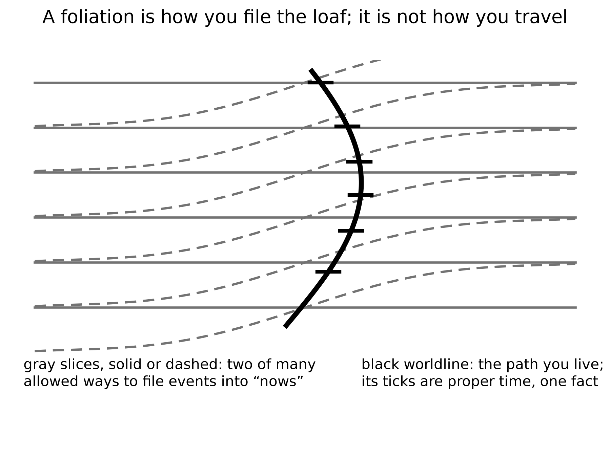

# PART VII — Loops

---

## 36. Time Travel Is Not an Edit

The kitchen fantasy of time travel is an edit. You go back, you unsay a sentence, you save a person, you kill a tyrant, you step on a butterfly, and history *rewrites*. Relativity does not hand out rewrites. If spacetime contains a path that arrives at an earlier event, the event was never waiting to be changed. It already includes whatever the path did.

An edit would be a second history, or a machine that erases events and writes them again. General relativity does not own that machine. It owns a geometry of events and a rule about which events can influence which others. A worldline is a set of those events. If the set meets itself, the meeting is one of the crumbs. It is not a revision of the crumbs.

This is the Novikov habit, and it is the only habit that does not set the block on fire. A loop is a consistency condition, not a sandbox. The watch you leave in a drawer in 1989 is the watch you will find because you left it. The message you scratch into frost on a greenhouse pane is the message that was always on the pane in that event. You do not get a second pane.

Igor Novikov, in the 1980s, said this with a physicist’s lack of drama, and a 1990 paper with colleagues showed how it works for billiard balls fired into a wormhole time machine.[^55] If a closed timelike curve exists — a path that stays inside its own future and arrives at its own past — then the only histories with nonzero weight are the ones that fit. A paradoxical history is not a thriller. It is a configuration the equations refuse to count. The principle is not a policeman who jumps in at the last second. It is bookkeeping: the probability of an inconsistent loop is zero because an inconsistent loop is not a solution.

The kitchen version sits on the glass.

She comes into the greenhouse on a cold morning and the inner pane is already written. The letters are her letters. The sentence is a pH, a date, a warning about a pump. She has not written it yet, as her watch tells it. She will write it, because she found it, and because the frost will take a finger. The pane is not a suggestion. It is an event. The writing and the finding are two stretches of the same thread, or of two threads that meet at the glass, and both stretches were always there. She does not get to wipe the letters and invent a kinder pump. She gets a finger, and a pane that was never blank in that event.

People hate this because it feels like a trick. It is the opposite of a trick. It is what “the inventory is events” was always going to mean once you allowed a worldline to meet its own past. The choosing is still a stretch of thread. The stretch, if it loops, was counted once.

Mara cannot radio yesterday. She can hear twenty minutes ago, which is rude but not looping. The machine that does not sleep, falling toward a star for four hundred years, cannot mail a warning to its launch. It can arrive, melt, look, and send a letter that will be read by people who have never met the launch crew. That is not time travel. That is the ordinary lateness of light, stretched over a career. Late is not yesterday.

Yesterday, in the greenhouse, is a set of events in her past light cone. A radio wave she emits today leaves along her future cone. That cone does not include yesterday’s workbench. A loop would require the signal, or the sender, to arrive at an event already in the sender’s past. It has delay. Delay is Chapter 3, scaled to a dead world. It is not a closed curve. The four-hundred-year cruise is the same lesson with worse manners: launch and arrival are two events on a long worldline, not a loop. The arrival cannot warn the launch because the launch is not in the arrival’s future cone. The letter, if any, is news. News is late. Late is not yesterday.

If you want the edit, you need a different history — a branch, a copy, a hop. The copies chapter will give you inventory and still refuse the hop. There is no known door from this thread to a thread where the basil died and you would like a second try. Grief is a fact about one worldline. It is not a user interface.

Are loops even allowed?

In special relativity, no: flat spacetime is too stiff. Flat spacetime is a flat block. Timelike curves in it do not close. You can ride forever and you will not meet your own morning. Trouble about *when* is not the same as a ticket to *then*.

In general relativity, sometimes, on paper. Kurt Gödel found a rotating universe in which you can ride a closed timelike curve[^56] — a path that stays inside its own future and arrives at its own past. Our universe is not Gödel’s. It does not rotate that way. Kerr’s spinning hole, if you could go *through* the interior in the idealized math and if the interior were not a chaos of instability, offers rings that loop. Wormhole mouths, if you could move them, can be turned into a time machine: park one, fly the other on a fast trip, bring it back, and the clocks on the mouths no longer agree in a way that lets you leave today and arrive last year.

Take those three sentences apart. They are not a brochure.

Gödel’s 1949 cosmos is a solution of Einstein’s equation filled with rotating dust. Every event, in that geometry, sits on a closed timelike curve. You could, in the math, leave a kitchen, fly a long way, and arrive before you left, without ever exceeding light locally. It is a marvel of a metric and a poor map of home. Gödel’s universe does not expand the way ours does. It has a global rotation our leftover glow does not show. The microwave sky is even to a part in a hundred thousand. A Gödel twist of the size that would let you loop would have written a louder signature than that. **Hot claim:** we do not live in Gödel’s rotating dust. **Cold claim:** somewhere, in some other solution, such dust is a universe.

Kerr’s spinning hole is closer to furniture we actually own. Stars rotate. The holes they can become rotate. The exterior of a Kerr hole is a working theory with shadows and rings and LIGO chirps to its name. The *interior*, in the full analytic extension, is a different room. Inside the inner horizon — a Cauchy horizon, a surface beyond which spacetime stops being predictable from the outside — the idealized math offers closed timelike curves around a ring singularity. Tourists love that sentence. Physics does not. The inner horizon is unstable. Matter and radiation falling in get blueshifted without mercy. The technical name is mass inflation:[^57] the horizon becomes a wall of energy, and the pretty extension is not a hallway. A hole made by a collapsing star is not the eternal, vacuum Kerr solution of a textbook. Even on paper, “go through and loop” is a sentence about an object we have not got. **Warm claim:** spinning holes exist. **Cold claim:** their insides are a time machine. The insides, as far as the instability arguments run, are a place the theory we trust stops being a guide.

Wormhole mouths are the kitchen trick people actually try to draw. Chapter 34 paid the bill for a throat that stays open. Suppose, against the inequalities, you have two mouths. Park one in the yard. Fly the other on a fast cruise and bring it home. The twin effect of Chapter 5 is waiting: the flown mouth accumulates less proper time. The clocks on the two spheres no longer agree. After enough mismatch, a path that enters the young mouth and leaves the old one can arrive at an external clock reading *earlier* than the departure. You have not outrun light in any local room. You have used a handle plus a twin-clock cheat to fold spacetime until today touches last year. Morris, Thorne, and Yurtsever wrote the operation down.[^58] It is a recipe for a chronology horizon, not a recipe for an edit.

All of these are sentences in a theory we trust in the rooms we have tested, used in rooms we have not. None of them is a photograph. None of them is a ticket.

Appendix A36 names the metrics. Here, keep one picture: a loop is a *shape* the loaf might have, locally or globally. It is not a machine you bolt on. If the shape is there, it was there. If it is not, you cannot will it into an edit.

The grandfather “paradox” is a complaint about edits. In a consistent loop, you do not kill the grandfather in a way that prevents the loop. Either you fail, or you are not in that story, or the story was never the one you thought. This is unsatisfying as drama and perfect as bookkeeping. Drama wants the rewrite. Bookkeeping wants the inventory.

The complaint sounds like a riddle because it assumes a draft: you exist, therefore the grandfather lived, therefore you cannot have killed him, therefore contradiction — or else a branching, or else a policeman. Novikov’s answer is duller. There is no draft. A worldline that both requires the grandfather and removes him is not in the sum. The failure is not a moral. It is a zero in the measure. You trip. The gun jams. You *are* the descendant by a route the riddle did not budget.

Why may the universe forbid them?

The chronology-protection conjecture is a hunch with a pedigree: the universe, when you try to build a loop, fights back. Vacuum jitters near the would-be time machine grow. The throat, if a throat is involved, blows. The Cauchy horizon — the surface beyond which prediction dies — becomes a wall of energy. You do not get last year. You get a bang.

Stephen Hawking wrote the hunch down in 1992.[^59] Near a forming chronology horizon, the vacuum’s stress-energy tries to diverge. The machine, in this picture, destroys itself with the same jitters that make black holes glow. Chronology protection is not a theorem. It is a conjecture that the divergence is generic, that nature does not let you finish the wormhole-clock trick, that Cauchy horizons in this role are walls rather than doors.

**Hot:** flat spacetime does not loop, and we have never photographed a closed timelike curve. **Warm:** general relativity admits looping metrics; the ones that look like ours do not wear them in the rooms we can see. **Cold:** you could build a time machine if you stacked exotic matter and survived the vacuum. Hawking’s hunch is the grown-up cold: maybe you cannot, because the stacking asks the field to explode. Do not confuse a solution of Einstein’s equation with a launch window.

> **Physics vs philosophy: from general relativity to time machines**
>
> **What the evidence establishes.** General relativity passes every test we can give it, from clocks on towers to black-hole shadows and merger signals. No closed timelike curve has ever been observed, and the leftover glow rules out a Gödel-style rotation of our universe.
>
> **What the theory allows on paper.** Exact solutions with loops exist (Gödel’s dust, the idealized Kerr interior, wormholes with moving mouths), but each needs a global rotation we do not see, an interior that is unstable, or negative energy in amounts quantum field theory seems to forbid.[^60]
>
> **The strongest rival view.** Some physicists take loops more seriously than this chapter does. David Deutsch showed that quantum mechanics can be made consistent on a loop by letting the loop pick out a self-consistent quantum state, so paradoxes dissolve without a policeman.[^61] What it gets right: consistency, not prohibition, is the real constraint. Why this book still does not book a ticket: Deutsch’s model assumes the loop already exists, and nothing in it pays the energy bill for building one.
>
> **What would change the verdict.** A full quantum theory of gravity that either proves chronology protection or shows a loop can be built and survive.

If the hunch is wrong, the block contains shapes that arrive before they leave, and the kitchen argument about “now” was only the beginning of the trouble. If the hunch is right, nature is stubborn about order along worldlines that matter, and time travel remains a sport for metrics, not for crews. That is a practical mercy.

---

## 37. If You Could Walk Sideways Through When

Suppose, as a thought, you could leave your worldline and walk *across* the block, as if time were a hallway of rooms, each room a now, each now a place you could enter and leave.

You would not be editing. You would be visiting. The childhood kitchen would be a room. The greenhouse would be a room. The dark sea under Europa’s ice, on a particular Tuesday of a particular millennium, would be a room. You could push a book, raise a dust of frost, encode a pulse in a watch. Those events, if they are in the block, were always there. Your walk would be another thread, weirdly oriented, already counted.

Stay in the thought long enough to feel what the permission would actually be.

You step off the thread you have been calling a life. The loaf, which Chapter 6 treated as inventory, becomes furniture. You are not a passenger in a river. You are a visitor in a house that was never sequential except along the paths that live in it. The first room you try is the one grief already named.

A childhood kitchen. A kettle that has not yet learned the house. A window with a frost that is not the greenhouse frost, earlier, kinder. A child at the table is a bundle of worldlines that will, later, include you. You are not that child. You are a later stretch, illegally sideways, looking. If the walk is real, the looking is an event, and the event was always in the room. The child does not acquire a new memory because you arrived. You do not get to pick a different kettle. You get to stand in a room you cannot rent.

You could push a book on a table in 1914. You could encode a pulse in a watch in 1989. You could meet your own later face in a corridor that, along ordinary worldlines, is a lifetime away. Each of those is a crumb. Each crumb, if the walk exists, was counted. The walk does not add a second inventory. It adds a weirdly oriented thread to the one inventory, the way a worm through bread is still bread.

From this illegal hallway you could look at the leftover glow edge-on: not a sky, a slice, a last-scattering surface as a wall in the house. You could see the three minutes as a thin, hot room near one end of the block, and a sparse, shoved-apart web of galaxies as a later furniture. It would still be a view from a path, not a god’s-eye. Even a sideways path has a proper length. Even a visitor accumulates something. The something would not be the time your kitchen clock named. It would be whatever parameter the new thread used for mileage. The block does not owe that parameter a name you already like.

This is the block made into a set of furniture. It is useful as a picture and false as a permission. We do not have a sideways walk. Our worldlines are nearly parallel, locally, to the time directions the leftover glow picked out when it last scattered. We go from event to event the long way, accumulating proper time, eating basil, dying.

The permission is the part that has to be taken away, slowly, because the picture is so good at lying.

You cannot walk sideways through *when*. “When” is not a corridor. It is a way of ordering events along a thread, and a way of slicing spacetime for the convenience of a clock. The slice is a choice. The thread is a fact. Confusing the two is the whole of this chapter.

Foliations — the technical name for slicing the loaf into “nows” — are a choice, not a hallway. Appendix A37 says why a stack is not a corridor. A foliation is a stack of three-dimensional surfaces, each surface a candidate for “the world at a given time.” Relativity does not pick a preferred stack. Cosmology, when it needs a bookkeeping time, hires the leftover glow: the surfaces on which the microwave sky looks as even as it can. That hire is a superb convenience, not a set of rooms with doors between them.

A stack of pages is not a building you can wander. You can put a finger on page 12 and a finger on page 400. You cannot walk from 12 to 400 except by reading, which is the analog of accumulating proper time along a worldline. The reading is a path in the book. The stack is a filing habit. Appendix A37 is the note that says this in the language of embeddings and leaves. Here, the sentence is shorter. **A foliation is how you file the loaf. It is not how you travel.**

The stack invites a second myth, and it usually arrives with a number. Time, the story goes, is a flip-book. Each page is one Planck time thick, about 5 × 10⁻⁴⁴ seconds, and the universe turns one page per tick, everywhere at once, like a projector with a cosmic shutter.

The projector fails three ways. First, nobody has found the pages. The Planck time marks where our equations expect to need quantum gravity. It is a warning on the map, not a measured grain. In 2009 a gamma-ray burst seven billion light-years away delivered its high-energy and low-energy photons within about a second of each other, which is not what the simplest Planck-scale grain, one that slows the short waves, would do.[^15] Second, a universal shutter needs a universal stack, and Chapter 1 already took that away. The person standing still and the person walking toward the table slice spacetime differently, and neither slicing is the one true deck. A projector needs a throne to stand on. Third, the configurations do not come as a finite deck of frames. In every theory that has passed a test, positions and fields vary smoothly. Between any two pages you can always fit another.

So the flip-book is a filing habit drawn as if it were a machine. **Hot:** no measured Planck tick. **Warm:** the Planck time as the place our equations stop vouching for themselves. **Cold:** a future theory might make time grainy in a subtler way, with no shutter and no favorite slicing. Even then the grains would not be a film someone is running. They would be one more fact about spacetime.

A coordinate labeled *t* on a map of spacetime is a filing number. It is useful. Cosmology uses it so that “when the universe was 380,000 years old” has a meaning on the leftover-glow slices. Your watch does not read that filing number. Your watch reads the length of your thread. Mixing the two is how a hallway gets invented.

Grief already knew.

The childhood kitchen is a room you cannot rent. It is a cluster of happenings, related by light and soup and a kettle, occupying a region of the block. You cannot go there as a visitor. You can remember it, which is a present event that points, by a causal chain of traces, at past events. Memory is not a hallway. It is a record, the same family of fact as a silver grain or a helium nucleus, written on a later stretch of thread. The later stretch does not get to move in. The kettle is not waiting. The kettle is an event that has, from the later vantage, already sat in its region. “Already” is a word the later thread is allowed. The block does not need it.

Hope is the same furniture with the sign flipped. The greenhouse’s later Tuesdays, the melt-probe’s maybe-taste, a library that arrives or does not: those are regions too. You cannot skip ahead into them any more than you can rent the kettle. You can occupy the next stretch of thread, do a project, and leave a record. That is the only method the geometry permits. It is slow. It is not a small thing. It is the thing.

**Hot:** you have a worldline, a proper time, and no measured hop onto a neighboring slice. **Warm:** the block is this book’s working interpretation of a theory that GPS tests daily (GPS tests the theory, not the interpretation), and foliations are bookkeeping. **Cold:** a new structure might someday let a thread lean so hard it looks like a walk through when. That cold idea would still not be an edit. It would be another shape, already counted, already refused a second pane. Until someone photographs the shape, there is one Tuesday at a time, and a childhood kitchen that will not take a tenant.
