# The Universe Has No Now

*Time, Origins, and Whether We Can Get Somewhere Else*

*by Lothar J. Musiol*

---

\newpage

## Copyright

The Universe Has No Now: Time, Origins, and Whether We Can Get Somewhere Else

Copyright © 2026 Lothar J. Musiol. All rights reserved.

Look First, Volume 1.

Photograph credits are not printed under the figures. They are in this file, so a copy that never sees the store page still names its sources.

**Photographs.** Fig 0: Islander61, Wikimedia Commons, CC BY-SA 4.0. Fig 1: Unsplash. Fig 3: NASA/SDO. Fig 4: NASA/ESA/Hubble. Fig 8: NASA/ESA/STScI. Fig 9: ESA and the Planck Collaboration, CC BY 4.0. Fig 14: NASA/ESA/Hubble Heritage Team (STScI/AURA). Fig 16: NASA/JPL-Caltech/IPAC (2MASS, T. Jarrett). Fig 17: NASA/CXC/CfA/M. Markevitch et al.; NASA/STScI; ESO WFI. Fig 18: NASA/ESA/J. Hester and A. Loll (Arizona State University). Fig 20: Event Horizon Telescope Collaboration, CC BY 4.0. Fig 24: NASA/Hubble Heritage Team (STScI/AURA). Fig 25: NASA/JPL-Caltech/MSSS. Fig 29: NASA/JPL-Caltech/SETI Institute. Fig 31: Sasu photography, Wikimedia Commons, CC BY-SA 4.0. Fig 32: Cierra Martin for Crop Trust, Wikimedia Commons, CC BY-SA 2.0. Fig 34: Corrie Barklimore, Wikimedia Commons, CC BY 2.0. Fig 41: NASA. Fig 42: Charles J. Sharp, Wikimedia Commons, CC BY-SA 3.0. Fig 45: NASA/JPL-Caltech. Diagrams are original line art for this book.

---

\newpage

## How to Read This Book

Every claim in these pages wears one of three temperatures. The difference matters more than any formula.

**Hot — established.** Measured, repeated, and used to predict new measurements. The universe is expanding. Space is filled with a 2.7-degree glow left over from a hot past. Ordinary matter is a minority ingredient. Black holes exist. There is no single “now” shared by observers who move differently.

**Warm — working theory.** The best account we have, with real gaps. A burst of extremely fast expansion in the first sliver of a second (inflation) explains several facts at once, but we have not identified the field that did it. Most of the mass that pulls on galaxies does not emit light; we do not know what particle, if any, it is. Empty space behaves as if it has a faint energy of its own; we do not know why that energy is the size it is.

**Cold — speculation.** Allowed by the equations, not selected by the data. Traversable wormholes. A required final state in which life computes forever (the Omega Point). A stack of universes with different laws. Extra dimensions from string theory.

On that last item, a standing rule. **String theory, whenever it appears in this book, cannot currently be tested.** It is a large, ingenious mathematical framework. It has not produced a unique, risky prediction — a number or a signature that would kill the whole idea if the experiment came out otherwise. Extra dimensions and a “landscape” of possible laws inherit that status. They may be mentioned because popular physics mentions them. They are not results.

A few scenes in this book are stories: a greenhouse on a dead planet, a radio that answers a quarter-hour late, a clock that runs slow beside a black hole, a melt-probe chewing through kilometers of ice into a sea that has never seen the Sun. They are thought experiments with dirt on them. The numbers in them are real. The people are invented. They are here so the geometry has somewhere to sit besides a diagram.

The main chapters keep the math in the sentence, the way a good explainer talks at a table. A handful of relations are important enough to number. Those numbered equations live in the Appendix, where the treatment is actually technical: the Friedmann equation, the spacetime interval, the helium calculation, the Bekenstein bound, the energy condition a wormhole has to break. If you want the scaffolding, it is there. If you want the story, you can finish the book without opening the back.

This edition is longer than a Barrow pamphlet on purpose — about four hundred Kindle pages of teaching, not two hundred of outline. The extra is not padding. It is the second trunk, the leftover in the air, the crew that does not sleep, the loop that calls itself I, and a path that refuses a last chapel. The sentences stay short. The inventory grew.

You do not need a physics degree. You need curiosity and a willingness to let “now” come apart.

---

\newpage

## A Note on the Series

This book is Volume 1 of *Look First*. It is a complete book. The crew that can wait, and the library that crew would carry, are taught here. You are not sent to another volume to finish this argument.

If you liked the greenhouse and wanted a downtown, or a fountain, that want has one later kitchen: *A Trip Is Not a New Life* — camps, the body, and the Earth you do not abandon. A trip is not a settlement. A longer life is not a new body. They are the same invoice. That kitchen is optional. It is not the missing half of this one.

That book stands alone. It reuses a woman, three temperatures, and a habit of looking first. It does not reopen this spine. You can stop here. The leftover glow will still be late tomorrow.

---

\newpage

## Author’s Note

Most people meet the universe in the wrong order.

First comes the solar system, then stars, then a chapter that says the galaxies are flying apart, then — if the book has nerve — a sentence about the Big Bang. Time is treated as the thing the story runs *in*, the way a clock is assumed to run on a wall. Black holes arrive as monsters. Dark matter arrives as a rumor. Wormholes arrive as promised shortcuts. String theory arrives as the thing “they’re working on,” which the listener is invited to treat as almost done.

That order is historically understandable. It is roughly the order we discovered these things. It is not the order that makes the structure easiest to see.

This book runs a different sequence on purpose. It starts with *events*, because that is what relativity actually talks about, and with the fact that two people can disagree about which events are simultaneous without either of them being wrong. Only after “now” has been retired as a universal fact does it turn to the hot past, the leftover light, the missing mass, the missing energy, the one-way membranes we call black holes, and the shortcuts that probably do not exist. The questions people actually want — Can we get somewhere else? Is there a multiverse? Was the universe made for us? Does time exist? — are delayed until the words have meanings.

John D. Barrow’s short book *The Origin of the Universe* is the formal model: brief chapters, no swagger, a clean line between a measurement and an idea. Steven Weinberg’s *The First Three Minutes* is the model for the thermal past — a reconstruction, minute by minute, that anyone can follow and that happens to be right. Sean Carroll’s work on the arrow of time, Alan Guth’s and Andrei Linde’s inflation, Roger Penrose’s singularity theorems, P. J. E. Peebles’s insistence that structure is a physical problem, Katie Mack’s tour of cosmic endings — these are the sources. They are used. They are not copied. Where they disagree, the disagreement is the point.

A book like this should succeed if those recognitions arrive in the chapters, not in this note. If meaning is not scheduled for the end of time, it has to be made in the middle: this copy, this planet, this launch window.

Readers of *The Quantum Conversation*, a book of mine outside this series, will notice a family resemblance: start with the variable that makes the physics simple, not the variable that got discovered first. There, the variable was phase. Here, it is the event.

---

\newpage

## Prologue: The Clock That Does Not Agree

There is a clock on the kitchen wall, and it is lying to you — not by being fast or slow, but by pretending that “now” is a thing the universe shares.

You glance at it. Somewhere, at what that clock would like to call the same moment, a star in Andromeda finishes a flare. A neutrino left the Sun eight minutes ago and is about to pass through your hand without asking. A galaxy so far away that its light began traveling before Earth had multicellular life is, at this instant — if the word still means anything — already receding so fast that no message you send will ever arrive.

The clock cannot hold those facts together. It was built for a kitchen.

This book is about what replaces the kitchen clock once you take Einstein seriously, and then take the sky seriously after that. It is a scientific book. It is also meant to be a good time. Those two aims are not at war. The universe is allowed to be precise and still be the strangest story anyone ever told.

If you have ever stood outside at night and felt, for a second, that the dark was not empty but *late* — that you were looking into travel time — you already have the instinct this book is going to use.

The kitchen already contains a proof, if you will let a phone be a proof. GPS clocks in orbit run fast compared with clocks on the ground, once you have subtracted the special-relativistic slowing that comes from their speed. The two corrections are tens of microseconds a day, opposite in sign, and if you skip them your map slides into a ditch. Those microseconds are the same mathematics that refuses a shared now on Andromeda. The casserole still comes out on time. The cosmos does not share the timer.

Mara will leave that kitchen. Eli will keep the clock. The dark, if you have stood outside and felt it, is not empty. It is late.

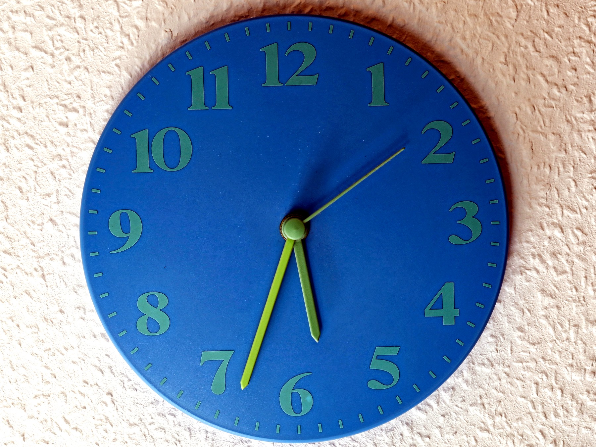

\newpage

# PART I — There Is No Now

---

\newpage

## 1. The Argument in the Kitchen

Imagine two people in a kitchen arguing about whether the casserole is done. One is standing still, pot holders ready. The other is walking toward the table. They agree on the recipe. They agree on the oven. They do not, if you take them seriously as physicists, agree on which distant events are happening “right now.”

That sounds like a joke. It is the opening move of twentieth-century physics.

Call the woman with the pot holders Mara. Call the walker Eli. They are invented. The casserole is invented. The disagreement is not. It is what falls out of a speed that refuses to change when you do. She is the one who later leaves this kitchen. He is the one who keeps the clock. The lamps do not need that future. They need the walk.

In Newton’s world the joke would be on the physicist. Space was a box. Time was a universal tick, the same in London and on Jupiter. You could, in principle, freeze the universe and take a photograph of “everything at this instant.” The casserole, the moons of Saturn, and a supernova in a galaxy we have not named yet would all sit in one frame, labeled NOW.

Newton wrote that camera into law in 1687. The *Principia* treats time as something that “flows equably without relation to anything external.” Space is a stage that does not care who is walking on it. A second in Cambridge is a second on Jupiter because the second is a property of the universe, not a property of a clock. That is a magnificent bookkeeping system. It let him predict the Moon. It is also, as a claim about the furniture of the world, wrong.

Hot: the Moon’s orbit yields to Newton’s arithmetic. Cold: there is a single river of time that every event sits in at once. The river was a convenience. The convenience survived two centuries because nothing in the kitchen, or in the solar system as Newton could time it, was fast enough to notice the lie.

Einstein broke the camera.

He broke it in 1905, in a paper that does not mention casseroles and barely mentions philosophy. The paper is about electrodynamics: what Maxwell’s equations look like if you are allowed to move. The speed that falls out of those equations is not a property of the air, or of a luminiferous ether that the Earth is swimming through. It is a property of the pairing of space and time. In 1983 the meter itself was redefined so that this speed is exact: 299,792,458 meters per second. That is not a measurement anymore. It is a definition. The second is the thing we keep, from cesium. The meter is whatever length makes light cover that many of them in one of those seconds. The universe does not negotiate.

People had already tried to catch the ether. In 1887 an interferometer in Cleveland sent light up and down, expecting the Earth’s motion around the Sun to change the time of the trip. The change was not there. The null result sat in the literature like an unpaid invoice. Others patched the books: lengths contract, clocks disagree, the ether becomes a ghost that cannot be found. Their algebra is close to Einstein’s. Their ontology is not. They were saving a stage. Einstein threw the stage out. There is no ether to be at rest in. There are events, and a speed that every honest observer assigns to light.

That is a hot claim. The null result is a century of repeated measurements. The reading — no privileged rest, no universal now — is the one that has survived every later test. Some treated the relativity of simultaneity as a convention about how to set distant clocks. Einstein treated the convention as a fact about the world. The difference is not a footnote. It is why this kitchen argument is physics and not manners.

He did not do it to be difficult. He did it because the speed of light refused to play along. Measure that speed while you are standing still; then measure it while you are on a train. You get the same number. Not almost the same — the same. The only way that can be true, if space and time are allowed to share the job of keeping accounts, is if people who move relative to each other slice the world into “now” differently.

Here is why, at the scale of a countertop.

The oven has a window in the door and a second lamp over the stove, a couple of meters apart. A circuit is wired so that both lamps flash at what Mara, standing midway between them, will call the same instant. Light from the left lamp and light from the right lamp reach her face together. She is entitled to say: the two flashes were simultaneous. That is Einstein’s 1917 popularization — a train, an embankment, lightning at both ends — shrunk until it fits between a sink and a fridge. The geometry does not care about the furniture.

Eli is walking toward the right-hand lamp, and the books only close if we put him where Mara was: midway, in his own accounting, at the moment the lamps fire. In that accounting the two lamps are still the same distance from him. The light from the right-hand lamp meets him sooner because he is walking into it. The light from the left has farther to run and is chasing him. He subtracts those travel times and still cannot call the flashes one instant. A person merely standing closer to one lamp is a different mistake: unequal arrival, equal emission, once the distances are put back in. Eli has already put the distances back in. What remains is a disagreement about the emissions. Neither of them has made a mistake. Neither of them has a broken eye. They have different slices.

If the speed of those flashes were infinite, Mara’s “same time” and Eli’s “same time” would collapse into one stamp. An infinite courier can update every clock at once. A finite courier cannot. The same *c* that makes the Cleveland interferometer come up empty is the *c* that forbids a shared now. You do not get to keep Newton’s photograph and the Cleveland null result. One of them has to go. The photograph went.

There is a bookkeeping version of the same fact, if you prefer an invoice to a lamp. Mara writes two arrival times on a pad: left flash, right flash, equal. Eli, still treating himself as midway when the lamps fired, writes two different arrival times and, after subtracting the trips, two different issue times. If both of them insist that light covered the two lamps at the same speed — and they must, if Cleveland was right — then they cannot also insist that the flashes were issued together. Same *c*, different nows. That is not a preference. It is the only way the books close.

Standing still, in this kitchen, does not mean “the true rest of the universe.” It means Mara is not walking relative to the floor. Eli is. Newton would have asked which of them is really moving relative to absolute space. There is no such question left to ask. Each is entitled to treat themselves as at rest and the other as moving. Each is entitled to a now. Those nows agree at the stove. They do not have to agree at Andromeda.

The kitchen clock is a local tool. It is an excellent local tool. It tells you when to take the casserole out. It does not tell you what is happening on Andromeda. Nothing does, instantly. Light from Andromeda takes about two and a half million years to finish the trip. Any claim about what is “now” happening there is a claim about how you choose to extend your kitchen instant across empty space. Different motions, different extensions, different nows.

Mara can set a timer for forty minutes and be right about dinner. She cannot set a timer for Andromeda. The photons that will tell her about a supernova there have not entered the oven yet, and most of them never will. “What is happening on Andromeda right now” is not a question the casserole answers. It is a question about a slice. Slices are cheap. Light is not. If Mara and Eli already disagree about two lamps a walk apart, they will disagree — after a tilt too small to feel in the hips — about events two and a half million light-years away. Chapter 4 does the arithmetic. Here it is enough to feel the lever: a tiny disagreement about “same time,” multiplied by a huge distance, is not tiny.

You already own a daily proof that the slices are not a classroom toy. The map in a phone stays on the road because the clocks in the satellites have been told, in advance, that motion and gravity both change how fast a clock runs. Skip the corrections and the pin drifts. Chapter 5 will give the flights and the microseconds. Here, notice only the moral: the same mathematics that keeps a pin on a street also refuses Mara and Eli a shared Andromeda. The universe does not run one kitchen clock and a separate, more serious clock for engineers. It runs events.

This is not mysticism. It is not “everything is relative” in the freshman-poster sense. The speed of light is not relative. The order of cause and effect, for events that can actually influence each other, is not relative. What is relative is a luxury we never noticed we were taking: a single present tense for the whole universe.

Mara takes the casserole out. That event can be a cause of Eli smelling dinner. Everyone who can be reached by the smell, or by a shout, will agree on the order: out first, smell second. That order is not a slice. It is a cone. The luxury we lost is only the luxury of stamping Andromeda with the same second. We did not lose before and after where they earn their keep. A physics that cannot tell a cause from a coincidence is a failed physics. This one can. It just will not let the kitchen timer annex a galaxy.

Keep the temperatures honest. Hot: light’s speed in vacuum is the same in every inertial lab we have built. Hot: no signal we have ever sent outruns it. Hot: two people in relative motion do not share a distant present. Warm: the cleanest reading is that the universe is a four-dimensional spread of events, not a box with a moving stamp. Cold: that this makes your choices unreal. It does not. A choice is an event with a past cone and a future cone. Chapter 6 will spend that coin. Do not spend it in the kitchen as despair.

Once that luxury is gone, several other ideas have to be rebuilt. The past is not a country that has vanished. The future is not a country that has not yet been founded. Both are regions of a four-dimensional object that physicists call spacetime. Your life is a path through it. The path has a beginning and, for you, an end. The object does not have a glowing edge labeled NOW that advances like a weather front.

That is the claim of Part I. The rest of the book will spend it on the sky: on a hot beginning, on a leftover glow, on mass that does not shine, on doors that do not open, on the temptation to think the whole construction was arranged for us. None of that works if we keep the kitchen clock as the official time of the cosmos.

Take the casserole out when your clock says so. Then look up, and notice that the dark is late.

---

\newpage

## 2. An Event Is a Happening, Not a Thing

Physics, at this level, does not start with objects. It starts with *events*.

An event is a happening with a location and a time — or, more carefully, a happening that can be given four numbers once you have chosen a way to measure. A firecracker goes off. A photon hits a detector on a satellite. Two black holes finish colliding and ring down. You finish this sentence. Each of those is an event. A person is not an event. A person is a long, messy chain of them.

This sounds like bookkeeping. It is the opposite of bookkeeping. It is a decision about what the universe is made of.

Hold the firecracker a moment. It is not a red tube that “is” in the drawer and then “is” in the air. The lighting, the bang, the smoke that reaches a neighbor’s window — those are events. The tube is a habit we form when a bundle of events stays in step long enough for a hand to close on it. A marriage is an event, or a short braid of them: two people in a room, a sentence said, a register signed. The marriage-as-object, the thing you point at twenty years later and call “us,” is the trail. A death is an event. The person who died is not an event that has finished. The person was the trail. Confusing the trail with a crumb is how you end up asking where the rock “goes” when time “passes.” The rock does not go. The rock is a worldline. The crumb is a happening on it.

A *thing* — a rock, a star, a spaceship — is a habit we form when a bundle of events stays in step. The rock is the history of a certain clump of atoms. The star is a history of fusion, light, and collapse. If you insist that the rock is the fundamental item and time is something that happens *to* it, you will spend the next century fighting Einstein, and you will lose.

The loss is not verbal. Start with the rock and you will want a universal tick that tells you when the rock is “the same rock, later.” You will want a photograph of all the rocks at once. You will rebuild Newton’s camera because the camera is what objects demand. Start with events and the camera is optional. The rock is still there, as a braid. You can weigh it. You can throw it. You just cannot promote it into the atom of the inventory. Hot: detectors click at places and times. Warm: calling the click-cluster a muon, or a person, is the right habit for daily work. Cold: that the habit is what the universe is made of.

Give each event four coordinates. Three of them are the ones you already use to find a restaurant: a grid on the Earth, or a grid in the sky. The fourth is a clock reading. The set of all events, related by which ones can influence which others, is spacetime. The geometry of this got a line that still startles.

Hermann Minkowski, who had taught Einstein and had not at first been impressed by him, said it in Cologne on 21 September 1908: henceforth space by itself, and time by itself, are doomed to fade into mere shadows. He said it to a room of natural scientists who had grown up inside Newton’s box. Then the 1905 paper stopped looking like a trick with clocks. It was a geometry. Space by itself is a shadow because a length you measure depends on your motion. Time by itself is a shadow because a duration you measure depends on your motion. What is not a shadow is the pairing. Four numbers, glued by a rule that does not care who is walking. That sentence is warm as poetry and hot as a classification: every later test that has distinguished “space plus time” from spacetime has come down on that side.

Unpack the shadows without reciting the whole lecture. A meter stick moving past you is shorter along the direction of the motion than the same stick at rest in your kitchen. A clock moving past you ticks through fewer of its own seconds between two of your marks than a clock on the wall. Those are not optical tricks. They are what “space by itself” and “time by itself” become once *c* is the same for everyone. The point was that the two tricks are one trick. Shorten a length and you have borrowed from time. Stretch a duration and you have borrowed from space. The loan is exact. The leftover, the thing that does not change when you change walkers, is the interval. Chapter 1 gave you the lamps. This chapter gives you the reason the lamps were never only about time.

The restaurant makes the four numbers ordinary. Mara books a table. The invoice, if the place is honest, already has almost everything physics will ask for. A street and a number. A floor. A clock time — half past seven, not “evening” in the abstract. If you like, a calendar date. Those are four coordinates for an event: Mara sits, the bread arrives. You can change the grid. You can measure the restaurant from a church steeple or from a satellite. You can run Mara’s watch fast or slow. You cannot turn the dinner into a rock that exists “at all times” and then ask time to happen to it. The dinner is a happening. Miss the hour and the table is a different event, or no event at all.

Eli, walking the length of the room while Mara sits, will, if you take him seriously, disagree with her about which distant kitchens are pulling casseroles at the same instant as the bread. He will not disagree that the bread arrived. The bread is an event they share. It has a where and a when in both of their books. What they do not share, once the distance gets long, is the rest of the slice. Four numbers name a crumb. They do not name a universe-wide plate.

The useful picture is not a box of space with a clock hanging on the wall. The useful picture is a loaf. Each event is a crumb. A *worldline* is the trail of crumbs that is you — or the Earth, or a photon. A photograph of “the world at a given time” is a slice through the loaf. The slice is not unique. Tilt your knife — which is what changing your motion does — and you cut a different set of crumbs.

The tilt is tiny at walking speed. That is why Newton never saw it in a kitchen. Over a table, Eli’s knife and Mara’s knife cut almost the same crumbs. Over a galaxy, they do not. The loaf does not change when the knife tilts. The membership of the slice does. People who fall in love with the photograph think the slice *is* the loaf. It is a cut. Cuts are useful. They are how you say “when I was twenty” without listing a million events. They are not a feature the bakery stamped on the crust.

Two events can stand in only a few relations that matter.

They can be close enough, in the right combination of space and time, that a light signal or something slower could pass from one to the other. Then one can be a cause of the other. Everyone agrees on the order. This is a *timelike* or *lightlike* separation, and it is the part of physics that still has a before and an after.

Lightlike is the edge of that permission. A photon leaving the oven lamp and hitting Mara’s eye is a lightlike pairing: no slower courier could have made the trip, and no faster one exists. Timelike is everything inside the edge — a shout, a smell, a walk from stove to table. Those pairings keep a before and an after for every honest observer. That is why the casserole can still be a cause of dinner. The order is not a courtesy. It is the interval advertising its sign.

Or they can be so far apart, compared with the time between them, that not even light can connect them. Then neither is the cause of the other. Different observers can disagree about which happened first. This is a *spacelike* separation. The casserole and a flare on Andromeda, “at the same kitchen instant,” are almost certainly spacelike. There is no fact of the matter about which was first that the universe is required to honor.

Mara’s forty-minute timer and a flare in M31, stamped “now” by her kitchen clock, do not have a courier between them. Light would need two and a half million years. The timer has forty minutes. That pairing is spacelike. Call it a spacelike casserole if you want a handle. Eli, still walking, stamps a different flare, or the same galaxy on a different day of its own history. Neither stamp is a photograph. Neither stamp is a cause. The universe is not required to pick a winner. What it is required to keep is a different quantity: the interval between the two crumbs.

Appendix A2 writes this as a single formula: the spacetime interval. The interval is the same for every observer. The split of that interval into “so much space” and “so much time” is not. That is the entire trick. The loaf has a real geometry. The slices are ours.

The kitchen analog is a cutting board. Draw a right triangle from the corner of the board to a knife. The hypotenuse is a length. You can call one leg “along the counter” and one “toward the sink.” Rotate the board — you relabel the legs. The hypotenuse does not care. The interval is that kind of stubborn length, except one of the legs is time and comes in with a minus sign.

Appendix A2 keeps the minus sign and the squares. You do not need the algebra to use the moral. Mara’s dinner and a lightning strike on the next block can be compared in more than one way. How much of the comparison you call “space” and how much you call “time” depends on who is walking. How much there is to compare does not. That invariance is hot. It is measured every time a particle detector reconstructs a collision and every time a GPS receiver solves for a position. The split is ours. The pairing is not.

The minus sign is why the analog is not perfect. Rotate a cutting board and both legs stay lengths. In spacetime one leg is a duration, and it enters with the opposite sign to a length. That is why a small change of motion can trade a little space for a little time without changing the interval, and why a large enough distance makes “who was first” a question the interval refuses to answer. A2 is there if you want the squares. The kitchen only owes you the stubbornness.

If you take nothing else from this chapter, take this: when a physicist says *spacetime*, they are not being fancy about the word *background*. They are telling you that the raw inventory of the world is events, and that time is one of the ways events can be separated — not a river the events float in.

---

\newpage

## 3. Light Is Late on Purpose

We talk about looking into space. We are always looking into the past.

The Sun you see is eight minutes old. Jupiter, tonight, is about forty minutes old. The Andromeda Galaxy is two and a half million years old in your sky. The leftover glow this book will spend Part II on is a picture of the universe as it was when it was 380,000 years old — a baby picture with the baby long gone.

Eight minutes is the rounded kitchen number. The honest one is 499 seconds. That is how long light takes to cross one astronomical unit, the mean Earth–Sun distance, 149,597,870.7 kilometers, at 299,792,458 meters per second. 8.3 minutes if you want a decimal. The light that heats the back of your hand left the photosphere before you put the kettle on. You are not in touch with the Sun. You are in touch with a star that has already moved on.

Put the kettle on and count. Before the water complains, the photons on your knuckles have crossed a hundred and fifty million kilometers. The Sun, in those 499 seconds, has moved, the Earth has moved, and a flare that erupted on the far limb has not yet had time to become a headline. The heat is old news that happens to be warm. That is the whole of astronomy, scaled to a burner.

The Moon is closer, which is why it fools people. Light from the near face takes about 1.3 seconds to finish the trip. During Apollo, Houston learned that number as a manner. A question went up. An answer came down. In the middle sat a hole you can hear on the tapes if you listen for the gap. It is not drama. It is 384,000 kilometers divided by the same *c* that emptied the Cleveland interferometer. The men in the room called it lag. The geometry called it a past cone.

A kitchen version: you ask a question from one end of a long hallway and the answer has to walk back. You learn not to interrupt, because the interruption arrives in the middle of a sentence that has already left. Houston’s hallway was a quarter of a million miles. The politeness was physics. No one in the room thought the Moon was happening “now” in the casserole sense. They waited, and the wait was the measurement.

Jupiter does not have a single number. The planet runs from about 4.2 to 6.2 astronomical units from the Earth, depending on where the two worlds sit in their orbits. Light one way is then about 33 minutes on a close night and about 53 minutes on a far one. “Forty minutes” is a typical Tuesday. A flare on Io is not news. It is a letter.

Voyager 1, as of the mid-2020s, sits more than 160 astronomical units out, in the thin dark past the planets. A command from Earth takes on the order of 23 hours to arrive. A reply takes another 23. The spacecraft is not “out there now” in the sense a casserole is in the oven now. The spacecraft is a trail of events. The event you can still affect with today’s radio is already tomorrow on the craft’s clock, and the event you can still hear left yesterday. That is not a tragedy about old machines. It is Chapter 3 with a larger ruler.

Twenty-three hours is a kitchen day. You can bake, sleep, and walk to the table in that span. The signal does the same span as a straight line through empty dark. If you want a current-order number and not a romance, mid-2020s one-way light time to Voyager 1 is about twenty-two to twenty-three hours and still growing. The invoice updates. The geometry does not.

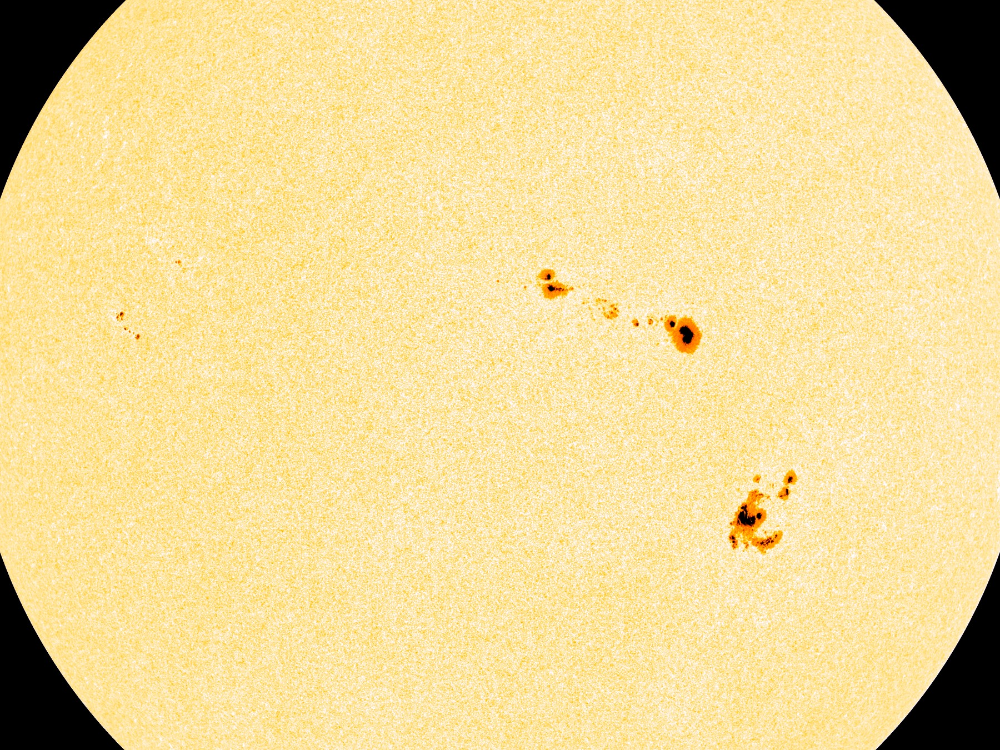

This is not a limitation of our instruments. It is what a finite speed of light *is*. If light were instant, “now” would still be a problem for moving observers, but the night sky would at least be a live feed. It is not a live feed. It is an archive. Every direction is a different depth of time.

Look left at the Moon and you are looking 1.3 seconds down. Look at Jupiter and you are looking most of an hour down. Look at Andromeda and you are looking through the entire history of *Homo sapiens* and then some. The sky is not a dome with a single stamp. It is a stack of postmarks. Better instruments change how faint a postmark you can read. They do not make the postmark younger. A telescope is not a telephone.

People find this either depressing or wonderful. Both reactions are allowed. The scientific point is narrower. Because light is late, astronomy is already time travel of the only kind we actually have: we receive news of events that lie to our past, along our past light cone.

A light cone is not a party decoration. From any event — say, you snapping your fingers — draw every path a light ray could take into the future, and every path a light ray could have taken to arrive there from the past. The future cone is everything you can still affect. The past cone is everything that can still affect you. Everything else is *elsewhere*: real, possibly interesting, and unavailable as a cause or an effect of this snap.

Treat the cone as a traffic law. You may go into your future cone. You may have come from your past cone. You may not cut across elsewhere and arrive before the light. The posted limit is *c*. There is no shoulder. A radio, a probe, a letter, a shout across a yard — all of them buy a ticket inside the cone or they do not travel. The law is hot. Every failed attempt to signal faster than light, and every collider that has tried to catch a particle arriving before its own cause, has left the cone unbent. Warm: that no clever geometry later in the book will hand you a legal detour. Cold: that we have checked every cheat. We have not. Chapter 33 will be honest about the proposed ones. They have to break something in the loaf. They do not get to edit the 499 seconds to the Sun.

A letter across town still obeys the law; it is just a slow car in the future cone. A shout across the yard is a faster car, still legal. A wish that Andromeda hear you before lunch is not a car. It is a request to leave the road. The elsewhere of a finger-snap is not a rumor. It is most of the universe, at that instant of your life, ruled out as a partner in cause. That sounds lonely. It is also why the kitchen still works. The people who can spoil the casserole, or praise it, live inside your cone.

The night sky is the past cone, printed on the inside of your eye.

This is why “getting somewhere else in the universe” is not an engineering slogan. Most of the interesting somewhere-elses are already outside the future cone of any event you will live to occupy. You can wait. You can send a probe. You cannot, in this spacetime, jump sideways into elsewhere and arrive for dinner. Light’s lateness is not an inconvenience we can edit out. It is the geometry.

You do not need Andromeda to feel this. A conversation with someone on Mars is already broken. Light takes between four and twenty-four minutes one way, depending on where the two planets sit in their orbits. The reply costs the same again. You cannot talk. You can only send, and wait, and send again. That delay is this chapter, scaled to a neighbor planet. Elsewhere begins at the next planet over.

Put the same two people on the radios, years after the casserole, because the cone is easier to believe when it ruins a sentence. Eli, still in the kitchen, sends “How is the dust?” Mara, on the dead world, will hear it between four and twenty-four minutes later. She cannot say “wait, what?” in the way a kitchen allows. She can send her own sentence into a future Eli has not reached yet. By the time her words arrive, his next sentence is already in the air, or already abandoned. They are not talking. They are mailing. The interruption that makes a conversation a conversation is a timelike luxury — a luxury that requires the gap between speakers to be short compared with the time they are willing to wait. Elsewhere begins when the luxury ends. No colony is required for the demonstration. Two radios and an orbit are enough.

Try to interrupt anyway. Eli hears a word he does not like and starts a correction before Mara has finished. His correction is a new event. It will not arrive in time to sit inside her sentence. It will arrive as a later letter, possibly answering a question she is no longer asking. That is not rudeness. That is 4 to 24 minutes of one-way light, twice, depending on the week. A kitchen can afford overlap. A planet cannot. The traffic law does not care that both of them would rather chat.

There is a kindness in the lateness, if you want one. The universe is not happening *at* you. It is arriving. The glow behind the stars, the one you cannot see without an antenna, has been arriving for thirteen billion years and will keep arriving tomorrow. You do not have to go anywhere to be in contact with the beginning. The beginning is late, and it is here.

The dark between the stars is late in another sense, and it has a name older than relativity. If the universe were infinite, eternal, and static, stuffed with stars, every line of sight would end on a surface as bright as a photosphere. The night would be a furnace. Heinrich Olbers was not the first to worry; he was the one the paradox kept. The night is not a furnace. Part of the reason belongs to later chapters: expansion stretches light and thins it. Part of the reason belongs here. The universe has a finite age. Light from the farthest possible furnaces has not had time to arrive, and many of those furnaces have not been burning forever. The black is an archive with empty early pages. That is a hot observational fact wearing a nineteenth-century question. The dark is late, and the loaf has a beginning.

Eli can check this without a telescope. He turns off the kitchen lights and looks out. The glass is not white. If every line of sight ended on a star as old as forever, the window would be a furnace and the casserole would be beside the point. The window is dark because the light is late and the universe is not eternal in the Olbers sense. He can take the dish out anyway. Her letter about the dust is still in transit. The dark will still be there after dinner.

---

\newpage

## 4. Andromeda’s Navy

Here is the thought experiment that makes the kitchen argument unavoidable. It is often called the Andromeda paradox — the version physicists still use.

Mara is standing in the yard. Eli walks past her, toward Andromeda, at an ordinary pace — a stroll. Special relativity says that the set of events Eli calls “simultaneous with this passing” is tilted, very slightly, relative to hers. Over the distance to Andromeda, a slight tilt is not slight. On her “now,” the Andromedans (if any) are, say, sitting in committee. On his “now,” the committee has already launched a fleet.

The stroll is not a metaphor for speed. It is a speed. A comfortable walk is about 1.4 meters per second. M31, the Andromeda Galaxy, sits about 2.54 million light-years from the yard — a modern distance, not a poster guess. The tilt of “now” is the same arithmetic Einstein used on trains:

Δ*t* ≈ *v* Δ*x* / *c*²

where *v* is how fast Eli walks toward the galaxy, Δ*x* is the distance to M31, and *c* is the speed we have already refused to negotiate.

Plug in the stroll. You do not get centuries. You get a few days. A few days of disagreement about Andromeda’s “present,” for a walk you would not break a sweat on, at a galaxy you cannot see without knowing where to look. That is already enough to break a single cosmic now. Raise the relative speed to a highway and the disagreement becomes weeks. Give it a jet’s portion of the Andromeda line and you are talking months to years. The Earth’s own 30 kilometers per second around the Sun, if you compared frames carelessly, would buy you centuries. The yard only needs the stroll. The loaf does not care that the number for a walk is modest. It cares that the number is not zero.

Walk the arithmetic once, slowly, because the lever is the whole joke. Light-travel time to M31 is 2.54 million years. The walker’s speed over *c* is 1.4 divided by 299,792,458 — a few parts in a billion. Multiply those two numbers and you have the tilt in years: a few thousandths of a year. That is a few days. Not a mythic navy. Not a century of court intrigue. Days. Days are enough. A presentism that cannot survive a disagreement of Tuesday versus Friday at two and a half million light-years is not a presentism that can run a universe. The years-to-centuries versions in older tellings usually smuggle a faster relative motion. The formula will give them to you if you pay for the speed. The paradox does not need the upgrade. Eli in the yard is the invoice.

At the moment their sleeves brush, they share a here. They do not share an Andromeda-now. If Eli stopped walking, the disagreement would shrink toward zero. The navy, if any, would not notice. Nothing in M31 is waiting on his hips. The tilt is a fact about slices, not a telegram to a fleet. Keep that, or the thought experiment turns into a comic.

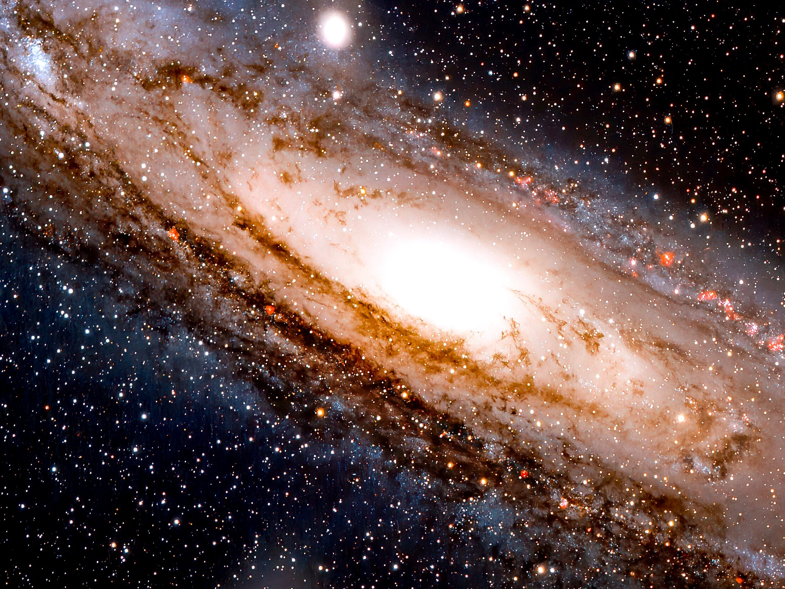

Neither of them can see the fleet. The light has not arrived and will not arrive for millions of years. The point is not what they see. The point is the temptation to call one slice real.

If you believe that only the present is real — that the past is gone and the future is not yet — then you have a problem. Mara and Eli, standing in the same yard, passing each other at walking speed, do not share a present at Andromeda. If his present is real and includes a launched fleet, and her present is real and does not, then “real” has split in the yard.

The split is not a feeling. It is a bookkeeping collision. She has granted *real* to whatever sits on her slice. Eli has granted *real* to whatever sits on his. The slices disagree at a distance where no signal can referee. Either reality is allowed to depend on who is walking past the compost heap, or *real* was the wrong prize to hang on a slice. The first option makes ontology a property of gait. The second option is the loaf.

The clean way out is to stop granting a privilege to the slice. The fleet-launch is an event. The committee meeting is an event. Both are in the loaf. You will learn about them, if at all, when their light arrives. Until then they are not “future” in some ghostly sense and not “present” in some official sense. They are simply events that are spacelike-separated from this moment in the yard.

Spacelike, here, is the same word as the casserole in Chapter 2. The yard-event and the launch-event have no courier. Mara may draw a line between them and call it “now.” Eli may draw a different line and call it “now.” The universe is not required to pick. What it is required to keep is the interval, and the interval for that pairing does not choose a first. A navy that cannot send a photon into your eye for two and a half million years is not a navy in your kitchen. It is a crumb elsewhere. Treat it as a crumb. The fear dissolves. The geometry stays.

Hilary Putnam and C. W. Rietdijk made this into a formal argument in the 1960s: if whatever is present-for-someone is real, and if reality does not depend on who is walking, then distant future events are already real. Rietdijk’s paper is 1966. Putnam’s “Time and Physical Geometry” is 1967. Philosophers have been picking at the logic ever since. Some reject the idea that “real for Alice” transfers to Bob. Some try to keep a privileged present by adding extra structure that relativity does not provide. Some accept the loaf and get on with their lives.

The transfer is the hinge they pick at. Alice walks. A distant event is present-for-Alice, hence real. Bob stands. Reality does not depend on gait, hence the event is real-for-Bob too, even if it is future-for-Bob. Repeat, and the future fills up. That chain is only as strong as the first gift: present implies real, and real is shared. This book does not need the chain as a proof. It needs the first gift to look expensive. Once you have seen the gift cost a preferred slice, you can put the gift back on the shelf. The crumbs stay on the inventory without the courtroom.

Keep the temperature on that last move. The relativity tilt is hot. Clocks and rods and GPS and particle tracks all honor it. The inference “therefore the distant future is real in the same way this yard is real” is a reading. It is a reading this book accepts, because the alternatives have to smuggle in a preferred slice that no experiment has found. It is still a reading. Warm, not a photograph of a fleet. The quiet version is enough: do not give the word *real* to one cut of the loaf and withhold it from the crumbs a walk would recut.

The hinge was already visible years before anyone named a galaxy for the paradox. Distant simultaneity is not a fact you go out and fetch. It is a rule for setting clocks, and the only rule that respects a single *c* is a rule that moving people will not share. You can still say “now” in the yard. You are talking about a slice. You are not talking about a feature the universe marked with paint.

Henri Poincaré said as much around 1898: you cannot assign a time to a distant event without a rule, and the honest rule will not be Newton’s. He still treated the rule as a convention among surveyors, and the ether was still being patched. Einstein’s 1905 paper is the rule written as physics. The yard is the same rule with a longer baseline. The navy is optional color. The baseline is 2.54 million light-years. The color is what people remember. Remember the baseline.

This book accepts the loaf. Not as a religion — as the reading that does the least violence to a theory that has passed every test we have given it. GPS satellites run a daily demonstration: if you do not correct their clocks for both speed and gravity, your phone’s map slides into a ditch. The corrections are the same mathematics that tilts the Andromeda slice. Leave the clocks alone and they drift by about 38 microseconds per day — special relativity and gravity pulling in opposite directions, the net still large enough to walk a position off a road. Chapter 5 will split that 38 into its two pieces and put the pieces on jets and on a tower. Here the invoice is simpler. The tilt that reallocates a few days of Andromeda is the tilt that, at 20,000 kilometers up, reallocates a fraction of a blink. We correct the blink because we like maps. We do not get to refuse the galaxy.

Thirty-eight microseconds is a kitchen nothing and a cartographer’s everything. You cannot feel it in a walk across the yard. You can feel it when the pin that was your driveway is a block south by midnight. The same smallness that makes Eli’s tilt look like a philosopher’s toy is the smallness engineers refuse to ignore. Ignore it and the town moves. Honor it and Andromeda’s “now” is already a slice, not a fact.

You do not need to believe that 2219 is “already happening” in some lurid sense. You need to believe something quieter: 2219 is a region of the same object 1914 is a region of. The difference is which events can still influence the ones that make up you.

1914 is not “still going on” in a kitchen. It is a region whose light, and whose causal leftovers, still reach you. 2219 is a region whose light has not, and whose causes you have not yet become. The vocabulary of happening — the glow, the stamp, the weather front — is what gets people into lurid trouble. Drop the glow. Keep the regions. You already do this with places. Lisbon is real when you are in the yard. You do not need Lisbon to be *here*. Times are places in the loaf. That sentence is warm. It is also the least theatrical reading that leaves Eli’s walk intact.

That quieter belief is enough to rewire the rest of the book. The beginning of the universe is not a story that *used to* be true. It is a region of the loaf. The heat death, if that is what we get, is another region. We occupy a thin braid in between.

---

\newpage

## 5. You Are a Path

If the universe is a loaf of events, you are a thread.

A worldline is the set of events that is a particular object’s history. The Earth’s worldline is a long helix around the Sun’s, which is a longer helix around the galaxy’s. A photon’s worldline is a straight edge of a light cone — as straight as the geometry allows. A person is a bundle of worldlines, roughly parallel, that eat, argue, and occasionally write books.

The bundle is the honest picture and the slightly comic one. You are not a single thread. You are a rope of atoms that stay in conversation, plus a few that do not. The rope has a thickness of a body and a length of a life. Physics will still call the rope a worldline when the thickness does not matter. It matters when you want to know why a liver and a thought can share a name. They share a braid. The braid has a mileage. That mileage is the age your cells would confess if they kept better books than birthdays.

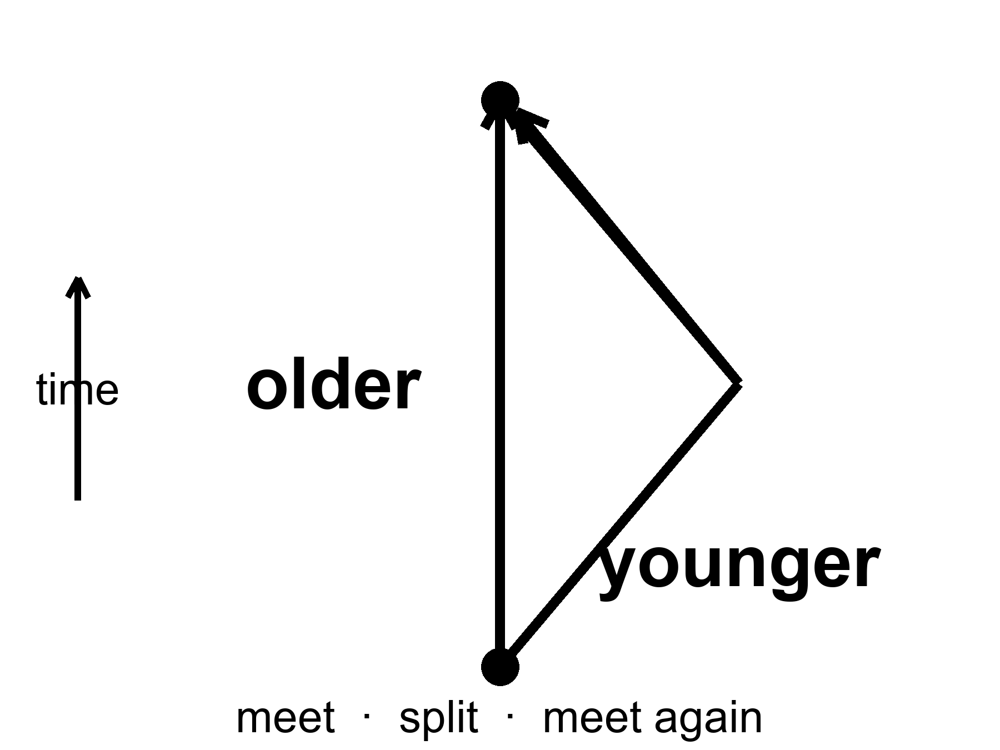

You do not move *through* time the way a boat moves through a river. That sentence, which feels like common sense, smuggles the river back in. What you do is occupy a sequence of events. The sequence has a length. That length is the time your watch measures, and it is called proper time. Proper time is not a coordinate someone assigned from a tower. It is a property of the worldline, the way a hiking trail has a mileage that does not depend on which map you used.

where proper time is the mileage along your worldline, the seconds a clock traveling with you actually accumulates.

Two hikers can leave a trailhead together and meet again at a lake. The one who took the switchbacks has more dirt on the boots. The one who took the ridge has a different number. Neither number is “the” time of the mountain. Each number is a property of a path. Watches are pedometers for that kind of path. They do not read a river. They add up a trail.

Call the hikers June and Cal. They leave the lot at 8:00 by the same clock on the wall. June takes the ridge. Cal takes the creek. They meet at the lake and compare. The surprise, if you still think time is a river, is that their watches need not agree, even if both kept honest seconds. In the mountain the difference is too small to see. In spacetime the same kind of difference is the whole twin story. The map can lie about mileage if it wants; the boots do not. Proper time is the boots.

Two worldlines that start together and end together need not have the same length. This is the twin “paradox,” which is not a paradox. The twin who accelerates, turns around, and comes home has a shorter worldline. She is younger. The loaf does not care that this offends the kitchen clock. Particle accelerators run the same experiment all day: unstable particles that travel fast live longer, as measured in the lab, because their worldlines between two lab events are shorter in proper time, which means their internal clocks tick through fewer of their own seconds. The word “live longer” is a lab word. In their own terms they live a normal life and the lab takes forever.

It is mileage, not a trick. The twin who stays home is the hiker who took the straighter trail through the loaf. In the geometry Einstein handed us, the straightest timelike path between two meetings is the *longest* proper time, not the shortest. That is the minus sign from Chapter 2 earning its keep. The traveler who turns around has taken the switchbacks. Her watch adds up fewer seconds. No one has to break physics to prefer a younger sister. You only have to stop asking the kitchen clock to be the mountain.

The muon is the classroom that does not need a twin. A muon at rest lasts about 2.2 microseconds before it decays. That is not a rumor. It is a measured lifetime, 2.2 × 10⁻⁶ seconds, repeated until it is boring. Cosmic-ray muons are born in showers tens of kilometers up. At walking speed, 2.2 microseconds is a few hundred meters of light-travel, and most of them should die in the upper air. They reach the ground in inconvenient numbers. Their worldlines between the shower and the dirt are short in proper time and long in the laboratory’s coordinates. The particles are not cheating death. They are hiking a shorter trail. Hot.

A few hundred meters is *c* times 2.2 microseconds, about 660 meters, if the muon is dawdling. The showers start nearer 15 kilometers. Without the mileage effect you would need a conspiracy of extra lifetime to stock a basement detector. With it, a muon whose energy buys a time-dilation factor of twenty or thirty has a trail long enough to punch the dirt. Students have been counting those punches since the 1940s. The count is an invoice. The kitchen analog is June’s ridge: fewer of her own seconds, more of the mountain’s map. The muon is June, if June decayed.

In October 1971 Joseph Hafele and Richard Keating put that trail on commercial jets. They flew cesium-beam atomic clocks around the world, eastward and then westward, and compared them with clocks that had stayed in Washington. The eastward set came home about 59 nanoseconds behind the prediction’s neighborhood; the westward set came home about 273 nanoseconds ahead. Nanoseconds. Not a feeling. Not a philosophy. Clocks in the air, clocks on the ground, a difference you can write on an invoice. The signs flip with direction because the Earth’s rotation is already a velocity, and a jet adds to it one way and subtracts the other. Special relativity is not only for twins in textbooks. It is a fare class.

They bought ordinary tickets. They sat the clocks in seats. The prediction had two pieces even then: motion, and the fact that a jet is a little higher in Earth’s well than a basement in Washington. Eastward, you add to the Earth’s spin and the motion piece grows. Westward, you subtract from the spin and the signs rearrange. The measured leftovers were tens to hundreds of nanoseconds, in the direction the tickets said. If you want a temperature: the existence of the difference is hot. The 1971 error bars were the size of honest flying. Later flights and better clocks have made the same fare class boring. Boring is what hot looks like when engineers have had fifty years.

Gravity bends worldlines. That is what gravity *is*, in Einstein’s account: mass-energy tells spacetime how to curve; curved spacetime tells worldlines how to lean. A clock deeper in a gravitational well accumulates less proper time between two meetings than a clock higher up. This has been measured with aircraft, with towers, with atomic clocks in trucks, and with those GPS satellites. Near a black hole the same fact becomes extreme: an hour beside the horizon can be years farther out. The cartoon is unnecessary. The clocks are enough.

Bent, here, is not a metaphor for trouble. A worldline that stays near a mass is a different trail through the loaf than a worldline that stays high. The trail nearer the mass is shorter in proper time between two comparisons. You can call that “clocks run slow in a well” if you like the poster. You can call it mileage if you liked June and Cal. The mass did not reach out and grab the clock. The mass told the geometry how to lean, and the clock added up the lean. Hot as a description of what we measure. Warm as the full story of why the geometry listens. Cold: that we have a finished quantum account of the listening. We do not. The clocks do not wait for one.

The tower came first, and it was short. In 1959 Robert Pound and Glen Rebka sent gamma rays up and down a 22.5-meter shaft in Harvard’s Jefferson Laboratory and measured the gravitational redshift — climbing out of a well costs a photon energy, the way climbing a hill costs a thrown ball speed, and a photon with less energy reads as a lower, redder frequency — of the Earth over the height of a building. Iron-57. A fraction of a fraction of the energy. They saw it. Later refinements made the agreement rude. You do not need a hole in the sky to learn that height is time. You need a basement and a roof and a nucleus that will confess.

Twenty-two and a half meters is a kitchen stacked on a kitchen. A clock on a fridge and a clock on the floor would disagree in the same direction, by an amount no casserole timer can read. Pound and Rebka did not use a timer. They used a nucleus whose voice changes when it has to climb. The photon that goes up arrives tired. The photon that goes down arrives richer. That is gravitational redshift as an invoice: height is a column, energy is a line, the difference is real. 1959 is not ancient history. It is the year a building learned to be a well.

GPS is the public sum of the jet and the tower. A satellite clock, moving fast, runs slow by about 7 microseconds a day from special relativity. The same clock, sitting higher in Earth’s well, runs fast by about 45 microseconds a day from gravity. The net, if you do not correct, is about 38 microseconds a day — the number Chapter 4 already used as a threat to maps. Thirty-eight microseconds is not a mood. At the speed of light it is more than 10 kilometers of position error by nightfall, and it accumulates. The engineers correct both pieces because both pieces are real. The Andromeda tilt and the hiking-trail mileage are the same theory wearing different hats.

You can put those two pieces on a pad the way Mara put the lamp times on a pad. Motion: minus seven. Height: plus forty-five. Net: plus thirty-eight, if you do nothing. Do nothing and the pin that was on your street is in the next neighborhood by evening. The correction is not a fudge for engineers who distrust Einstein. It is Einstein, twice, with opposite signs, added like an invoice that has to close or dinner is on the wrong block.

Chapter 21 will take the hour-beside-the-edge as far as a spinning hole and a poster number. This chapter will not steal that one. Notice only the seed. If a clock in a basement already disagrees with a clock on a roof, a clock that hovers just outside a horizon will disagree with a clock in the suburbs of the same hole by an amount that stops being polite. The geometry is continuous. The kitchen is not a different law from the hole. The hole is the kitchen with the well turned up.

Once you are used to worldlines, several puzzles lose their fog.

“Where is the universe expanding *into*?” is a thing-question. Expansion is a change in the distance between worldlines of galaxies, measured at successive meetings with light. There is no need for an outside.

“What happened before the beginning?” is a river-question. If the loaf has a boundary — and it may — then “before” is a word that applies inside the loaf, not to a waiting room outside it. Chapter 44 will take this as far as anyone honestly can.

“Can I go back?” is a thread-question. Going back would mean your worldline looping so that it meets an earlier event on itself, or on someone else’s line, in the wrong order. The loaf’s geometry may or may not allow such loops. Ordinary spacetime, the kind we have measured, does not hand them out. Chapters 35 and 36 are about that.

Keep the temperatures on the path. Hot: clocks that take different trails between two meetings disagree, and the disagreement is the one the geometry ordered. Hot: muons, jets, towers, and phones all keep the same books. Warm: that the books are best read as a block of events with worldlines drawn through them. Cold: that this makes you a prisoner of a drawing. A path can still choose its next step inside its future cone. The drawing is the set of steps. It is not a warden.

For now, keep the thread. You are not a passenger in time. You are a path.

---

\newpage

## 6. The Block

Call the loaf by its public name: the block universe.

The block is not a brick. It is the claim that past, present, and future events are equally part of the inventory. The “present” is the event-cluster you are using as a vantage. It is not an ontological VIP section.

The loaf has a shape, not only a guest list. In 1916 Einstein wrote the field equation that says how the shape is set: mass-energy on one side, geometry on the other. The equation is not a sermon about fate. It is a rule for how the crumbs lean. Matter tells spacetime how to curve. Curved spacetime tells worldlines how to go. You have already met the local consequences — the tower, the jet, the 38 microseconds. The global consequence is that the block is not a rigid box we inhabit. It is a geometry we are inside of, and the geometry answers to what is in it.

The first public test was not a kitchen. It was an eclipse. On 29 May 1919 Arthur Eddington’s teams on Príncipe and at Sobral photographed stars near the Sun and found their light bent by about the amount Einstein had asked for — on the order of 1.75 arcseconds at the limb, twice Newton’s corpuscle guess. The newspapers made a man into a monument. The measurement was ruder than the headlines, and later eclipses and radio interferometers cleaned it. The claim that survived is hot: light follows the geometry, and the geometry is not flat when the Sun is in the way. The block is not a metaphor we chose because it sounded grave. It is the reading of a theory that has been catching starlight for a century.

People dislike the block because it sounds like fatalism. If 2219 is “already there,” was anything I did today a choice? The honest answer is: your choice is an event too. It has causes in its past cone and effects in its future cone. The block does not steal the choosing. It refuses to make the choosing into a little glow that travels along the thread, lighting up real events and leaving the rest in storage. The choosing *is* a stretch of the thread.

There are rivals.

*Presentism* says only the now is real. Relativity of simultaneity makes a single cosmic now a piece of extra furniture. You can add the furniture. The theory we test does not require it, and the Andromeda argument is waiting in the yard.

*The growing block* says the past and present are real and the future is not yet. The loaf grows. This matches the feeling of time better than the finished block. It still needs a fact about which events have “already grown in” at Andromeda — the same fact relativity will not supply without help.

The yard does not get kinder if you change the slogan. Mara stands. Eli walks. Their “nows” at M31 differ by days. If only the present is real, they do not share a reality at 2.54 million light-years, while sharing a reality at the fence. If the loaf grows, someone must say which crumbs have already been baked at that distance. A growing edge that both of them can honor is a preferred slice. Preferred slices are extra structure. Extra structure can be added. It has not been measured. Presentism and the growing block fail at Andromeda for the same quiet reason the kitchen argument started: a walk is enough to recut the distant present, and the universe does not appoint a winner. That failure is a reading of a hot tilt, not a proof that philosophers must shut up. It is why this book does not hire them as cosmologists.

*The evolving block*, in some quantum-gravity sketches, tries to let new events become definite as decoherence happens — a possibility losing its power to interfere with the others once it leaks into a big, messy environment; Chapter 40 does this properly. That is a research program. It is not a measurement.

This book will treat the block as the default reading of spacetime, and then notice where physics puts pressure on it. The arrow of time — why we remember the past and not the future, why eggs break and do not unbreak — is not explained by the block. The block is time-symmetric in its basic laws. The arrow needs a fact about the *boundary*: the early universe was absurdly ordered. That is Carroll’s Past Hypothesis, and it is why Part II is not optional philosophy. The hot, smooth beginning is the low-entropy end of the loaf. We are downstream of it. That is why there is a difference between looking that way and looking the other way.

Mara is back at the counter. She cracks three eggs into a bowl for a different casserole. Shells in, yolks out, a fork, a scramble. The laws that govern the molecules do not prefer scramble to unscramble. A film of the bowl run backward is still a solution of those laws. What is not a solution of our history is a universe that arrived already scrambled and then assembled a smooth, hot, simple beginning out of the mess. We do not see eggs climb back into shells because we live downstream of a boundary that was foolishly tidy. Sean Carroll’s name for that boundary fact is the Past Hypothesis. One kitchen is enough. The arrow is not a river in the block. The arrow is a memory of the bang’s manners. Part II will put a temperature on the leftover glow. Here, notice only that the block without that boundary would not give you a “before” you could remember.

Quantum mechanics puts a different pressure on, and this book treats that pressure as a core element, not a cameo.

The equation that describes an electron does not, by itself, pick a single outcome. It assigns an amplitude to each way the story might go. One reading — Hugh Everett’s, later sharpened by people who take the equation literally — says the leftovers are not discarded. When a measurement could have gone two ways, both ways persist, decohered, no longer able to interfere. The block is not only all the times. It is all the allowed versions. You are one thread in a loaf that splits.

That sentence is where a sermon likes to sit down. *Reality only forms when it is observed.* The equation does not say that. The equation says that amplitudes interfere until a system becomes entangled with something that will not give the interference back — an environment, a plate, a wall of photons that have left and will not return. That is decoherence. It is a calculation you can assign a time to. It does not require a soul.

So what counts as an observer?

Not a person, first. A person is a late, expensive observer: a nervous system that keeps a model and can be surprised. In the laboratory sense an observer is any degree of freedom that acquires a *record* — a correlation stable enough that you would have to conspire with the whole environment to undo it. A silver grain that darkens. A Geiger tube that clicks. A dust mote whose spin will never again line up with its twin. The leftover glow, last-scattering at 380,000 years, is a record written before any eye. The helium of Chapter 10 is a record written at three minutes. If “observe” means “leave an irreversible trace,” the universe has been observing itself since it was a fog. You were not needed for the fog to have a temperature.

If “observe” means “a mind noticed,” you have added a postulate the amplitudes do not ask for. Wigner can put a friend in a lab and argue about when the wavefunction collapses. That is a quarrel about the word *record*, not a proof that the Moon is a sketch until you look up. Consciousness-causes-collapse is a minority reading with a famous pedigree and no extra prediction you can miss. This book will not hire it. Everett does not need it. Decoherence does not need it. Relativity, which already forbade a single now, will not wait while a mind in one kitchen switches Andromeda on.

There is a better picture of what a mind *feels like* from the inside, and it does not need a collapse.

Call it a strange loop. A system writes symbols. Some of the symbols point at the system that is writing them. The map contains a sketch of the mapmaker. The hierarchy tangles: the “up” of explanation (neurons, then thoughts, then an I) folds back so the I is what the neurons are doing, and the neurons are what the I takes itself to be made of. No extra spark. A level-crossing. The word *I* is what that loop sounds like when it has a mouth. An observer, in the expensive sense, is a record that has begun to model the fact that it is a record. An ant is not that loop. A nest of ants, taken as a whole — a city that farms and wars and does not know the name of a single worker — is a cheap sketch of the same trick. Chapter 30 will spend that scale on a visitor who files the cars and misses the mite. Here it is a diagram of a self: meaning that is not in the parts, and is not a ghost. It is an isomorphism, a translation, a tangle.

That picture is warm as phenomenology and cold as a proof that the leftover glow needed us. The glow was a record without a loop. The helium was a record without a loop. The loop arrives late, on a thread, and then has the nerve to ask whether the fog was real before it got here. It was.

EPR — the 1935 complaint that quantum mechanics lets a measurement here fix a pairing there, “at once” — is the same room with better furniture. The pairing is real. Bell showed the pairings are stronger than any local recipe of hidden instructions. Aspect and the rest measured that. Hot. What is not on offer is a telegram. You cannot choose what to do here in a way that sends a bit there. The no-signaling theorem is the grown-up name for Einstein’s unease, resolved without a radio. “Simultaneous action” is already a phrase the kitchen clock should not be allowed to use. There is no shared now in which the two ends happen together. There is a correlation in the loaf. Chapter 40 will say it again: branches do not mail each other. Entangled ends do not either.

That is a warm claim. It is not a photograph of other lives, and it is not a travel method. Nothing in the equation hands you a way to hop from your thread onto a neighboring one and steal a different marriage, a different planet, a different you. The copies, if they are real, are as unavailable as Andromeda’s navy. They are on the inventory. They are not a destination. And the Moon was there before the first nervous system named it. The record was.

The practical fact is unchanged either way. The worldline you occupy is the only one you can work along. A crop grows, or it does not, in this dirt. A launch window opens, or you wait. Part VIII will take the copies seriously as physics. It will not pretend they are a destination you can enter.

Holography puts a third pressure on. If the information in a region scales with its surface, not its volume, the loaf may be a projection of something thinner. That is a warm-to-cold idea, and it does not cancel the events. It relocates them.

What the block does, for a book about origins and endings, is simple and a little severe. It lets us talk about the first three minutes and the last three minutes as regions, not as moods. It lets a wormhole be a handle connecting two regions, not a machine that “goes.” It lets the Omega Point — a hoped-for final crunch in which life computes forever — be judged as a claim about the shape of the future region, which the data currently contradict.

You can still say “now” in the kitchen. You should. Just do not promote the kitchen to a cosmology.

---

\newpage

# PART II — The Past We Can Rebuild

---

\newpage

## 7. The Explosion That Happened Everywhere

People hear “Big Bang” and picture a grenade in a dark warehouse: a bright point, a blast wave, shrapnel flying into empty rooms. That picture is wrong in every way that matters, and it is the reason smart readers keep asking a question that has no answer: *what did it explode into?*

It did not explode into anything. It was not a bomb in space. It was space, getting roomier, everywhere at once.

If you could have been present at a minute old — you could not have; there was no solid ground, no shadow, no place to stand — you would not have seen a fireball receding toward a horizon. You would have been *inside* the fireball, and so would every other direction. The glow would have been the walls, the floor, the air, the idea of “away.” Density would have been falling because the distances between nearby bits of stuff were stretching, not because the stuff was fleeing a scene.

A baker’s analogy earns its keep here. Imagine raisin bread dough rising in a warm bowl. Every raisin sees every other raisin recede. There is no special raisin in the middle of the dough. The “middle” is a habit we picked up from grenades. In a universe that is, on the largest scales, the same in every direction and at every place — the Cosmological Principle, a working rule with a lot of data behind it — every galaxy is allowed to feel like the center of the stretch. That feeling is a symmetry, not a privilege.

Mira, who has never heard of a metric, asked the only honest question the bowl suggests. She pointed at the rim as if it were a warehouse wall. *Where do the raisins go?* The answer is rude and precise. They do not flee into the kitchen air. There is no kitchen air in the analogy. There is only dough. “Outside the dough” is a habit we brought from rooms and grenades. If the loaf is the whole universe — if the geometry is the same kind of thing everywhere, with no rim — then the raisins recede from one another *inside* a thing that has no outside. Mira’s bowl is a cheat we use because bread needs a pan. The cosmos does not. You cannot scrape leftover dough off a cosmic countertop. There is no countertop.

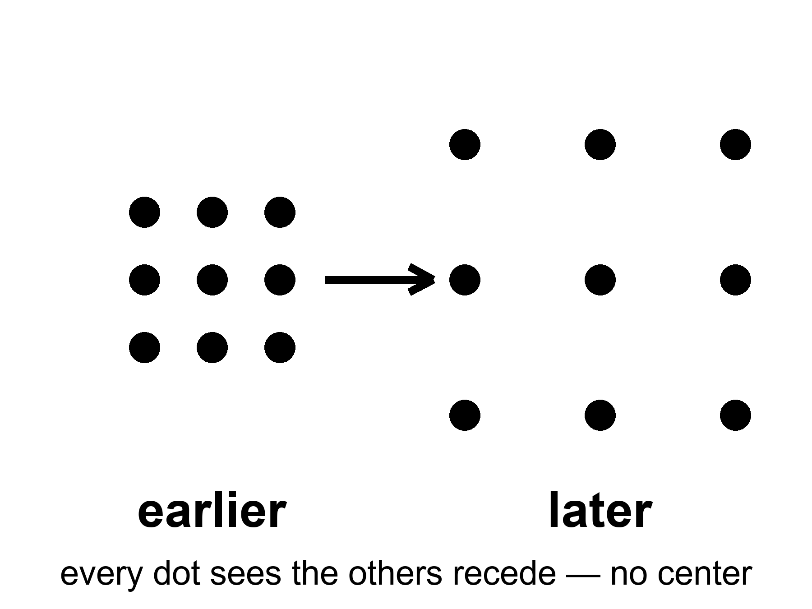

Read the figure as a rule, not a cartoon. If every dot recedes from every other dot, you cannot stand outside the grid and point at the blast. There is no outside. The grown-up name for that rule is FLRW: Friedmann–Lemaître–Robertson–Walker, four people whose initials stand for a spacetime that is homogeneous and isotropic on large scales. Homogeneous means no special place. Isotropic means no special direction. Put them together and you are not allowed a center, and you are not allowed an edge you could walk to. An edge would be a special place. A center would be a special place. The equations refuse both.

The single number that does the work is a scale factor, written *a(t)*.

*where a(t) is the relative size of unbound distances at time t, set to 1 today by habit, smaller in the past, growing if the raisins are receding.*

Distances between unbound things scale with *a*. Wavelengths of free light scale with *a*. Ordinary matter thins as *1/a³*, because the same stuff is poured into a larger volume. Radiation thins faster, as *1/a⁴*, because each photon is also getting tired. That bookkeeping is the whole of the simple expanding universe as a calculator. Appendix A7 writes the metric. Here it is enough to stop looking for a warehouse.

The equations that describe this are named for Alexander Friedmann, a young mathematician who, in the early 1920s, took Einstein’s gravity seriously enough to let the universe change size. Einstein had tried to freeze it with a fudge factor. Friedmann showed the freeze was optional. Georges Lemaître, a priest and physicist, said out loud what the math was hinting: the universe has a history. Edwin Hubble, with a telescope and a lot of patient plates of spiral nebulae, found that the farther a galaxy is, the faster it recedes. The grenade picture rushed back in through the newspapers. It has been misleading well-meaning people ever since.

The dates are not decoration. In 1922 Friedmann published expanding — and recollapsing — solutions of Einstein’s equations. Einstein’s first reply was that the paper contained a mistake. The mistake was Einstein’s. He had already, in 1917, added a term — the cosmological constant, written Λ — to keep the universe static, because a static universe was the respectable prejudice of the room. When the freeze proved optional, and then when the sky refused to sit still, Einstein regretted the term. Later retellings call it his biggest blunder. Whether he used that kitchen word, or only suffered the fact, is a historian’s fight. The physics fight is simpler: he had forced the loaf not to rise, and the loaf was rising.

Lemaître, in 1927, did the unfashionable thing of putting numbers on the stretch and saying, in print, that the universe had a history with a hotter, denser past — a primeval atom, in his phrase. Hubble, in 1929, plotted velocities against distances for a handful of galaxies and got a line. The line was noisy. The distances were too small by a factor of several. The slope was therefore too steep. The *existence* of the slope was the news. Chapter 8 will fight over the second digit of that slope. This chapter only needs the insult to the grenade: recession is a function of distance, not of a privileged warehouse.

Hot claim: the universe is expanding, and it was hotter and denser in the past. That is not a mood. It is the only account that has survived the leftover glow in Chapter 9 and the leftover helium in Chapter 10.

Warm claim: the simple expanding model — same in every direction, no special place — is a superb average. Under the average there is a foam of clusters and voids, which we will meet when quantum twitches get their chapter.

Cold claim, which this book will not smuggle in as fact: that the bang was a “beginning of everything” in the kitchen-clock sense, with a waiting room labeled BEFORE. The loaf may have a boundary. “Before” may not be a word that applies. Chapter 44 will sit with that until it stops itching.

Was there really a bang?

There was really a *hot, dense, expanding everywhere*. That is not a brand. It is two fossils and a stretch: the leftover glow, the leftover helium, the raisins receding. If you want the words “Big Bang” to mean a grenade, then no. If you want them to mean the past we can rebuild — a universe that was once a mixed fog, did nuclear work in minutes, and has been getting roomier since — then yes. The name is a nickname. The nickname stuck. The grenade did not.

It was not an exploding black hole. Say that out loud, because the picture is tempting and lame in the same breath. A black hole is a local one-way membrane in a larger loaf, made when a clump loses an argument with gravity. A white hole is that film run backward: a local fountain no one has seen. The bang was not local. There was no outside to explode into, no warehouse, no shrapnel crossing a pre-existing dark. Chapter 22 will give the white hole its four rooms and then take the analogy away. Here: **a hole is a place. The bang was a time.** You can write math in which a collapse, time-reversed, looks like a bang. You cannot point at the leftover glow and say “that was a star that burst.” Stars come later. Holes come later. The fog comes first.

How old, if we are allowed a kitchen number? About 13.8 billion years, give or take a hundred million, counted from the hot fog we can reconstruct — not counted from a waiting room labeled BEFORE. That is a hot-enough claim for this chapter: the leftover glow, the leftover helium, and the stretch-rate of now, run backward through the equations, meet at a finite age. The number will get a few more digits later. It will not turn into infinity.

Then why is the part we can see about 93 billion light-years across, if light has only had 13.8 billion years to travel? Because the dough kept rising while the light was in transit. A photon that has been flying for 13.8 billion years did not fly through a frozen warehouse. The places it left have been pulled farther apart the whole time. The farthest stuff whose light has had time to reach us sits, today, at a proper distance of about 46 billion light-years. Diameter, roughly 93 billion. That is not the universe’s edge. It is our archive’s edge. Chapter 26 will make the distinction official. Here: the loaf is larger than the slice we can still taste.

So what was it *from*?

Not from a kitchen nothing — not from an empty room with the lights off and a magician. Empty, in physics, is already a something: a vacuum with rules, jitters, a leftover shove, a geometry. Pair production makes a particle and its opposite from energy, and the energy had to be in the account. The early soup made particles and antiparticles by the truckload and then almost canceled them. We are the rounding error: about one leftover nucleon per billion photons, Chapter 10’s ratio, the reason atoms are a footnote. That leftover is a *warm* problem with a name, baryogenesis — why the cancellation was rude by one part in a billion. We have recipes (a bit of leftover difference between matter and antimatter, a bit of out-of-equilibrium cooking). We do not have the dish photographed. “Matter from nothing” is a poster. Matter from a slightly unfair soup is the grown-up line.

Andrei Sakharov, in 1967, wrote down what a kitchen would need to keep one extra ladle of matter when the soup tried to cancel. Three conditions, in ordinary language. First, the books must be allowed to go out of balance: the soup must be able to change the baryon count, to make a nucleon without making its twin. Second, the soup must be rude in a particular way. It must treat matter and antimatter a little differently, and it must treat left and right a little differently, which physicists write as C violation and CP violation — charge conjugation and its partner, the combined swap of particle-identity and mirror. Third, the cooking cannot be in equilibrium. A pot that has fully settled forgets its rudeness; the extra ladle gets undone on the way back. You need a moment when the reactions cannot keep up with the cooling — a slammed oven door, a stretch that outruns the chemistry.

Those three are warm. We have seen C and CP rudeness in particle kitchens on Earth, in kaons and B mesons, at the level of a small insult, not yet at the level of one leftover in a billion. We have not photographed the cosmic moment. The ratio is hot. The recipe that produced the ratio is a research program. Do not let a poster cash the check.

What about the soup’s own origin — the first slice of loaf?

Inflation, if you buy it, pushes the question back: a burst of stretch, then a reheating that *is* the hot fog. The burst still wants a field, a vacuum, a reason. Quantum-gravity sketches try to stop using “before”: Hartle and Hawking round the loaf off so time only becomes time when there is enough of it; Vilenkin tunnels from a technical nothing that is not a kitchen nothing. Those are cold, and they are allowed to be. The fossils do not reach that room. They reach the fog, the three minutes, the glow. **We do not owe you a waiting room labeled BEFORE in order to say the fog was real.**

For now, retire the grenade. Retire the bursting hole. Keep the dough. The past we can rebuild is not a point. It is a hotter, smaller-spaced version of everywhere, made of a soup that almost canceled and didn’t, and we do not yet own the first word of the recipe. We own the leftovers. That is already a courtroom.

---

\newpage

## 8. Everything Is Stretching

In the 1910s, Vesto Slipher, working nights at a stubborn telescope in Arizona, noticed that the light from many spiral nebulae was shifted toward the red. Red, in the physics of waves, is the stretch. A siren falling away from you drops in pitch for the same family of reasons. Slipher did not yet know those nebulae were other galaxies. He had the stretch before he had the nouns.

The years were 1912 to 1917, more or less, a run of plates at Lowell Observatory. Slipher was measuring spectra: the fingerprints of atoms in light — hydrogen, calcium, the usual kitchen of lines. In spiral nebulae those lines sat in the wrong place, shifted toward the red for most of them, toward the blue for a few. Receding, approaching. He did not yet have a distance ladder tall enough to turn the shifts into a law. He had a pile of redshifts and a puzzle. By 1917 he had two dozen spirals, and the pile was mostly red. The sky was already voting.

A law needs a ruler, not just a pile. The first honest cosmic ruler was a kind of star that brightens and dims on a schedule. Henrietta Leavitt, in 1912, working through plates of the Small Magellanic Cloud at Harvard, found that the longer the period, the brighter the star. Cepheids, named for the prototype in Cepheus. Once you have that relation, a Cepheid is a standard lamp: measure how fast it winks, infer how bright it truly is, compare with how faint it looks, and you have a distance. Hubble used those lamps to show that the spirals sat far outside the Milky Way. Then he used them again as rungs. Without Leavitt there is no Hubble law. There is only Slipher’s pile, glowing and unnamed.

Hubble and Milton Humason turned the stretch into a law. Plot distance against recession speed and you get a line, sloppy at first, cleaner every decade since:

*v = H_0 × d*

*where v is how fast a distant galaxy recedes, d is its distance, and H_0 — Hubble’s constant — is the slope, the stretch-rate of now.*

Humason had been a mule driver on the mountain before he became the person who could hold a faint galaxy on a slit for hours. The 1929 paper was a handful of points. The 1930s were Humason going fainter, the line getting longer, the slope refusing to go away. Hubble’s first number was about 500 kilometers per second per megaparsec, wildly high, because the distances were wildly short. The modern fight is not whether there is a slope. The modern fight is whether the slope is nearer 67 or nearer 73.

The number has been fought over for a century and is still being fought over a little. The fight is about the second digit, not about the existence of the line. Galaxies recede. Farther means faster. That is hot.

Say the digits out loud, because the argument is real and it is not a crack in the bang. One camp reads the leftover glow of Chapter 9 through the simple expanding model and gets about 67 kilometers per second per megaparsec. Another camp climbs Leavitt’s ladder in the nearby universe — Cepheids in hosts that also explode in a particular way — and gets about 73. Both error bars are small enough that the two numbers do not overlap. That is the Hubble tension. It may mean a rung is still mis-cut. It may mean the simple model is missing a late-time ingredient. It does not mean the raisins have stopped receding. Appendix A8 keeps the algebra. Here: the first digit is a 6 or a 7. The existence of the stretch is not on the table.

The later ruler, the one that extends the ladder past where Cepheids fade, is a kind of exploding star: Type Ia, a white dwarf that goes thermonuclear with a peak brightness you can standardize. Chapter 18 will hire those explosions to show that the stretch is speeding up. Do not steal 1998 from that chapter. This chapter only needs the job description. Cepheids get you to nearby galaxies. Type Ia get you farther. Both are lamps. Both can be wrong in the second digit. Neither is optional if you want a number for *H_0* that is not just a slope on a chalkboard.

A megaparsec is a terrible kitchen length and a perfect cosmic one: about 3.26 million light-years, the distance at which the Hubble law starts to drown out the local shoving. Nearby, galaxies have peculiar velocities — they fall toward neighbors, swing in groups, approach like Andromeda, which is coming toward us at about 110 kilometers per second because we already touched. The Hubble law is not a traffic ticket issued to every smudge. It is the motion that remains after you leave the bound clump. Plot only the Local Group and you will not find a slope. Plot past a few tens of megaparsecs and the slope sits up. *H_0* in kilometers per second per megaparsec is a kitchen invoice: so many extra kilometers per second of recession for each extra megaparsec of distance. At 70, a galaxy 100 megaparsecs away recedes at about 7,000 kilometers per second. That is the stretch-rate of now as a cash register.

The redshift itself is not a guess. It is a shift of named lines. Hydrogen’s Lyman-α, the calcium H and K pair Slipher knew, the oxygen lines that light up star-forming gas: you know where they sit in a rest-frame kitchen, because you can measure them in a lamp. In a distant galaxy they sit redward by the same factor for every line. That common factor is *1 + z*. If the lines disagreed with one another, the stretch would be a fraud. They do not disagree. A single *z* slides the whole fingerprint. A speedometer reading of *v = cz* is only a translation for small *z*. At *z = 1* you are not allowed that translation. You are allowed the scale factor.

What is stretching is not the galaxies themselves, as if someone had put Andromeda on a rack. Bound things — people, planets, solar systems, galaxies — hold together. What stretches is the space between the unbound. Light traveling through that stretch gets its wavelength pulled longer. A photon that left a hydrogen atom as a sharp ultraviolet line arrives here as a tired red one. The amount of stretch is written *1 + z*, where *z* is the redshift. A galaxy at *z = 1* sent its light when the universe was half the scale it is today. A galaxy at *z = 6* is a teenager from when the first big galaxies were still assembling. The leftover glow of Chapter 9 sits at *z* about 1,100. We are looking at the universe when it was about a thousandth of its present size.

Put the scale factor back on the table, because the sentence deserves its own line:

*a = 1 / (1 + z)*

*where a is how large unbound distances were when the light left, compared with today, and z is how much the wavelength has been pulled.*

At *z = 1*, *a = 1/2*: half-size. At *z ≈ 1,100*, *a ≈ 1/1,100*: the leftover glow. Redshift is not a speedometer glued to a galaxy. It is a receipt for how much the dough rose while the photon was in the mail.

Nadia keeps a sourdough starter and a notebook of doubling times. Every so often the recipe doubles: twice the flour, twice the water, twice the bowl. The raisins that have already touched — the ones that stuck into a clump while the dough was still shy — stay a family. They do not peel apart when the next doubling comes, because they are bound: gluten, sugar, a crust. The raisins that never touched keep receding, invoice after invoice, each doubling a larger kitchen. That is the Hubble law as a baker’s account. You, Earth, the Solar System, the Milky Way: a family that already touched. The next cluster over, if it is not bound to us, is a raisin on a later invoice. Bound systems do not stretch. The space between the unbound does. Your meter stick does not grow overnight. Andromeda is not on a rack. The gap between here and a galaxy at *z = 1* is.

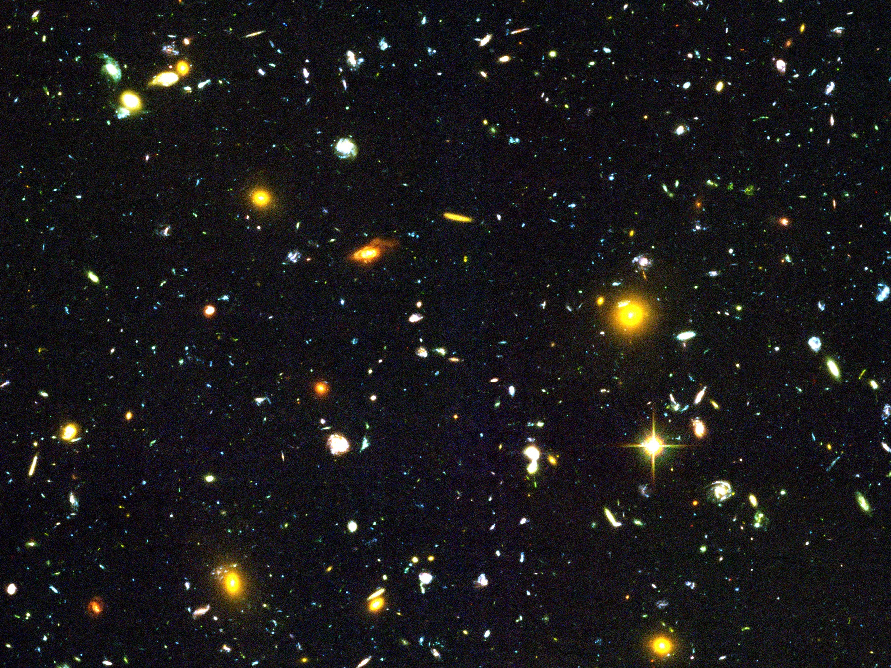

There is a cruelty hidden in the kindness of the deep field. The most interesting smudges are so far that their light has been in transit for most of the age of the universe. We will never send a reply that arrives while anything there still resembles what we photographed. Chapter 26 will make that official. Here it is enough to feel the stretch in your hands: the night sky is not a room. It is a history of rooms, stacked by how much they have been pulled since the light left.

The James Webb Space Telescope did not invent high redshift. It made it rude. There are galaxies at *z > 10*. That sentence is hot: spectroscopically confirmed objects from when the universe was a few hundred million years old, already shining as galaxies, not as a rumor of gas. The fight — and it is a real fight — is how mature they look. Some of them seem too massive, too dusty, too done for the time on the clock, if you feed certain models of how fast stars should have assembled. That fight is warm. It is a fight about the first factories, not about whether the dough rose. Early galaxies exist. How quickly they put on weight is a measurement in progress, not a loophole in Chapters 9 and 10.

There is a distinction the newspapers keep flattening. Light-travel time is how long the photon was in the mail. Proper distance now is where the sender sits in today’s dough. At *z = 1* the mail took about eight billion years; the sender now sits farther than eight billion light-years because the dough rose in transit. At the leftover glow the mail took 13.8 billion years and the sender’s current seat is about 46 billion light-years. Chapter 7 already gave you the diameter. This chapter only needs you not to treat *z* as a speed and not to treat lookback time as a ruler you can lay on the table without the scale factor.

Humason’s faint galaxies were at redshifts we would now call modest. JWST’s spectroscopic *z > 10* objects are not modest. The measurement is a set of lines, not a vibe. When a break or an emission line sits where *1 + z > 11* says it should, you are not looking at a nearby dwarf with bad luck. You are looking at a factory from the first few hundred million years. How chemically grown-up that factory already was — how much dust, how many stars, how settled a disk — is the warm argument. That it existed is not.

One more detail, because it is beautiful and true. The Hubble law does not pick a center. If every raisin recedes from every other raisin in proportion to distance, then *your* raisin is allowed to write the same law. The slope is a property of the dough, not of a privileged kitchen.

A rough inverse of *H_0* is a Hubble time. If the slope is 70 kilometers per second per megaparsec, *1/H_0* is about 14 billion years. That is not the age, because the stretch-rate has not been constant — matter used to brake, the shove now speeds — but it is the same order as 13.8, which is why a slope could smell an age before the leftover glow gave us a clock. Hubble’s first number implied something like two billion years and was already in a fight with rocks. The second-digit fight of 67 versus 73 is a fight inside a number that finally agrees with the stones.

Appendix A8 writes the redshift into the scale factor and shows how *H_0* is a snapshot of a function *H(t)* that has not been constant. Dark energy, when we get there, is a statement about that function’s later life. The stretch is older than the speeding-up. The speeding-up is a plot twist, not the opening scene.

---

\newpage

## 9. A Baby Picture in Microwaves

In 1964, Arno Penzias and Robert Wilson were trying to make a radio antenna in Holmdel, New Jersey, shut up. It hissed. The hiss came from every direction. They cleaned out the pigeons. They checked the wiring. The hiss stayed. A few miles and a few conversations away, a Princeton group was looking for exactly that hiss: the leftover heat of a once-hot universe, stretched by expansion into microwaves, cooled to a few degrees above absolute zero.

The Princeton group had names, and they had a theory, and they were a little late. Robert Dicke had built the kind of radiometer that can hear a sky this quiet. Jim Peebles had calculated that a hot, dense past should leave a glow at a few degrees Kelvin. Peter Roll and David Wilkinson were getting ready to look. In 1965 the Holmdel hiss and the Princeton calculation met, and the leftover glow stopped being a prediction. It became a measurement. Penzias and Wilson had not been hunting a bang. They had been hunting a clean antenna. The universe does not care what you were hunting.

They had found the baby picture.

It is not a photograph in the camera sense. You cannot walk outside and see it. You need a radio ear. But it is as real as the Sun, and in some ways ruder, because it is in your kitchen too. A small fraction of the snow on an old analog television was this glow, leaking into the living room, older than any continent.

Tomas kept a set in the basement after the stations went digital, out of stubbornness and because the hiss was company. A few percent of that snow, if the set is analog and the antenna is honest, is not dead channels. It is 13.8 billion-year-old light, stretched into microwaves, leaking through the walls. You can stop watching. You cannot make the glow go away. It is in the basement, in the attic, in the space between the casserole and the ceiling. That is what “everywhere” sounds like when it has cooled.

Why microwaves, not visible light? Because the oven cooled. A blackbody’s peak wavelength stretches with *a*. At last scattering the fog was optical: 3,000 K, a dull red if you could have had eyes, which you could not. Stretch by a thousand and the peak sits near a millimeter, in the microwave, a frequency around 160 gigahertz on the FIRAS curve. That is why Penzias and Wilson heard a hiss on a radio horn and not a glow on a photographic plate. Alpher and Herman had predicted a leftover of a few degrees Kelvin in 1948. They did not have Holmdel. They had the right order of magnitude and a number that waited seventeen years for an antenna that would not shut up.

The temperature is 2.725 degrees Kelvin — two and three-quarters degrees above the coldest anything can be. The spectrum is a blackbody so clean it makes laboratory blackbodies look sloppy. A blackbody is the glow of something in thermal equilibrium, a “we have mixed thoroughly” signature. The early universe was mixed. Then it stretched, and the glow stretched with it, and the mix was frozen into the sky.

COBE, the Cosmic Background Explorer, carried the instrument that made that sentence unkind to rivals. FIRAS — a spectrophotometer built to argue with the sky — found a blackbody at 2.725 K so tight that the error bars sit inside a line on a plot. John Mather’s team had measured the temperature of the universe the way a baker measures an oven: not by mood, by a curve. If you want a hot claim with a decimal, take that one. The leftover glow is not “about three degrees.” It is 2.725, and it is a blackbody, and the departures from that curve are so small they had to be hunted on purpose.

A blackbody this clean is also a veto. Starlight bounced off dust, a fog of leftover starlight, a glow from nearby radio junk: those stories produce the wrong shape. They can make a hiss. They cannot make FIRAS. The curve is the courtroom. The pigeons were a reasonable first suspect. They were not a spectrum.

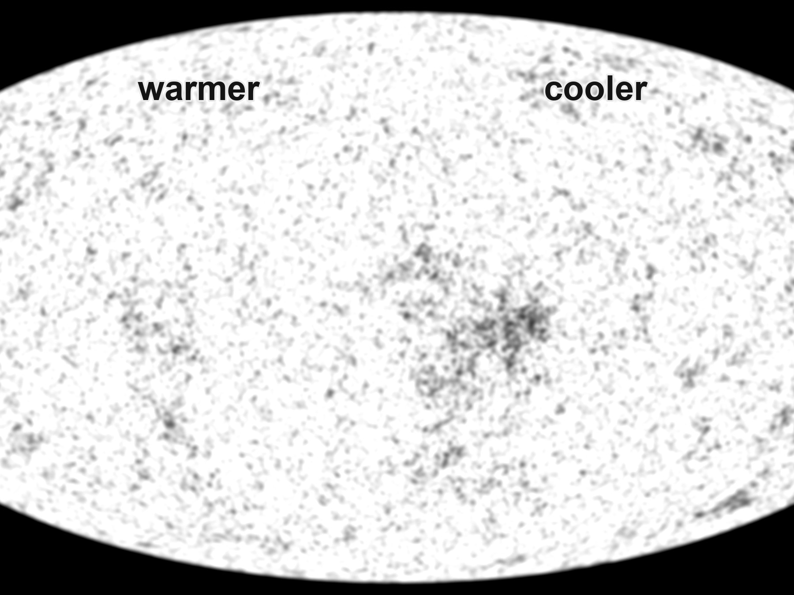

At first the picture looked boring: the same temperature everywhere, to a part in a thousand. Then to a part in a hundred thousand. COBE, in the early 1990s, found the freckles — slightly warmer, slightly cooler patches. WMAP and Planck mapped them until they looked like a weather chart for a day 380,000 years after the beginning of the stretch.

The freckles have a date. COBE’s DMR map, in 1992, showed that the sky is not perfectly bland: differences of about one part in 100,000, the first photograph of the seeds Chapter 14 will grow into galaxies. George Smoot’s team had not found continents. They had found the rumple in the dough. WMAP, through the 2000s, turned the rumple into a spectrum of sizes. Planck, with maps in 2013 and a final cosmology release in 2018, sharpened the weather chart until the peaks in that spectrum became a courtroom of their own: how much ordinary matter, how much extra pull, how fast the stretch, how flat the large-scale geometry. Those later maps are how Chapter 11 gets its percentages. This chapter only needs the baby: a blackbody with freckles, photographed on the whole sky.

Why 380,000 years? Before that, the universe was a plasma: nuclei and electrons, loose, swimming in light. Light could not travel far. It kept bouncing off free electrons, the way sunlight has trouble getting out of the middle of the Sun. When the universe cooled enough for electrons to lock onto nuclei and make the first hydrogen atoms, the fog lifted. Photons that last scattered then have been flying in straight-ish lines ever since. We photograph the surface of last scattering the way you photograph a cloud bank from an airplane: you do not see through it. You see the top.

Two nouns get mixed here, and they should not. *Recombination* is the chemistry: electrons locking onto nuclei, the universe becoming electrically neutral for the first time. (The name is a fossil; nothing had combined before. It was combination. The word stuck anyway.) *Last scattering* is the optics: the last time a typical photon bounced off a free electron and then ran. They happen at nearly the same age, because once the electrons are locked, the fog has nothing to bounce off. Nearly is not identical. A few electrons stay free. The last bounce is a little later than the locking, a surface with a thickness, not a pane of glass. Kitchen language: the soup sets, and then the last steam stops hitting the lid. We photograph the lid.

Before the fog lifted, a photon’s mean free path was a kitchen, not a cosmos: bounce, bounce, bounce, like light in milk. After, the mean free path became the size of the observable universe. That is the whole optical trick. We are not looking through milk. We are looking at the last skin of milk, stretched into an oval.

The temperature then was about 3,000 K — a red-hot fog, the color of a stove element, not a microwave. Stretch the wavelengths by *1 + z ≈ 1,100* and 3,000 K becomes 2.725 K. The number is not a coincidence. Temperature of free light scales with *1/a*. Cool the oven by stretching the kitchen.

One large pattern is not a freckle and should not be sold as one. The whole sky is a few thousandths of a degree warmer in one direction and cooler in the opposite direction: a dipole. It corresponds to a motion of about 370 kilometers per second toward Leo, the Sun’s peculiar velocity relative to the leftover glow. We are not at rest in the dough. We orbit the Galaxy; the Galaxy falls toward a crowd; the crowd has a velocity of its own. Maps like Figure 9 have that dipole subtracted, the way you subtract the motion of the train before you argue about the scenery. What remains is the baby picture, not our weather.

The oval is not raw sky. Our own Galaxy shines in microwaves too — dust, electrons spiraling in magnetic fields, a plane of junk across the middle. Planck’s maps are the sky after that junk has been modeled and taken off, a subtraction as necessary as wiping flour off a scale. What you are allowed to call cosmology is the remainder. WMAP, the Wilkinson Microwave Anisotropy Probe, carries David Wilkinson’s name because he was one of the people waiting in 1965 and one of the people who spent a career making the wait into a map. He died before the full harvest. The probe did not. The sky does not pause for obituaries.

Inside the freckles there is a sound, almost literally: the plasma, before last scattering, could ring. Overdense patches compressed, bounced, compressed again, a fluid with light as the spring. Those acoustic oscillations froze at 380,000 years into a preferred set of angular sizes on the sky — peaks in a power spectrum. Planck’s 2013 and 2018 papers are, in large part, a reading of those peaks. This chapter will not steal Chapter 14’s seeds or Chapter 11’s inventory. It will say that the baby picture is not a blur. It is a freeze-frame of a ringing fog, and the ring has been measured.

Those freckles are not decoration. They are the seeds of Chapter 14, written in temperature. A patch that was a little denser then is a little more likely to be a cluster of galaxies now. The baby picture is also a will.

The evenness of the picture is its own unpaid bill. Look at two patches on opposite sides of Figure 9. Their temperatures match to a part in a hundred thousand. In the simple bang of this part, those patches have never been in each other’s past light cones. They have not had time to talk, to mix, to agree. That is the horizon problem. It is a real problem. It is not a reason to throw out the leftover glow. It is a pointer: Part III exists because this sky is too even for a kitchen that never shared a pot. Do not solve it here. Notice that the baby picture both confirms the hot fog and hands you a puzzle the fog, by itself, does not pay.

Hot claim: the leftover glow exists, is a blackbody, is almost the same in every direction, and has freckles at the level of one part in a hundred thousand. Warm claim: those freckles are the fingerprint of slightly uneven density in a hot, expanding plasma. Cold claim: any story of the first 10⁻³² seconds that does not eventually produce this picture is entertainment.

When you look at Figure 9, you are not looking at a place. You are looking at a time. The oval is the entire sky. The entire sky is one age. That is what “the explosion happened everywhere” looks like when it has had 13.8 billion years to cool in public.

---

\newpage

## 10. The First Three Minutes

Steven Weinberg gave this interval its fame, and he was right to. Between about a hundredth of a second and a few minutes, the universe did something we can reconstruct with the same nuclear physics we use in the Sun and in weapons labs. Before that, the story gets warmer and then cold. After that, for a long time, not much of nuclear interest happens. The three minutes are a workshop. We still own the tools.

He was not the first to guess that a hot past would cook light nuclei. In 1948 Ralph Alpher and George Gamow published a paper whose third author was Hans Bethe, added as a joke so the names would read α, β, γ — alpha, beta, gamma, the start of a Greek kitchen. The αβγ paper argued that the early universe could build nuclei by capturing neutrons, and that a leftover glow should still be around. The capture-chain details were wrong in ways that later work had to repair: you cannot climb the whole periodic table in three minutes, because there are no stable lodgings at five or eight nucleons. The helium insight was the seed. The leftover-glow insight was the other seed. Weinberg’s book, decades later, is the workshop with the tools calibrated. Gamow’s joke is how the idea first got a table.

At a hundredth of a second, the temperature is about a hundred billion degrees. No atoms. No nuclei that last. A soup of light, electrons, positrons, neutrinos, and a few leftover nucleons — protons and neutrons — swimming in a glare that would unmake any chemistry you have a word for. The nucleons are outnumbered by photons about a billion to one. That ratio is still written in the sky. It is why the universe is so empty of atoms compared with light, and why we are a footnote in a photon’s memoir. The billion dead twins are the antimatter that did not get a chair. Food, when we get to it, is a later argument about leftovers. The first leftover is this: the soup was unfair, and the unfairness is why there is anyone to eat.

Write the temperature once, as a kitchen clock, so the later ticks have a place to hang.

*T ≈ 10¹¹ K at t ≈ 0.01 s*

*where T is the temperature of the soup and t is time since the hot fog we can reconstruct — not since a waiting room.*

At that glare, electrons and positrons are still being born in pairs from photons and annihilating back. Neutrinos still talk to the rest of the pot. The nucleons are a trace ingredient, a pinch of salt in a vat of light.

Neutrons are slightly heavier than protons. In equilibrium, there are fewer of them. As the soup cools, the reactions that turn protons into neutrons and back slow down. At about one second, neutrinos stop talking to the rest of the soup — they *decouple* — and the neutron-to-proton ratio freezes near one-to-six, then keeps dropping slowly because free neutrons decay. You have about ten minutes before most of the leftover neutrons would be gone. The universe does not give you ten minutes of workshop time. It gives you about three.

The free neutron’s lifetime is about fifteen minutes. That is why the workshop is in a hurry. Leave the nucleons sitting as a warm gas with no oven and the neutrons wander off into protons, electrons, and ghostly leftovers, and there is nothing left to glue into helium. Ten minutes would have wasted most of the inventory. Three minutes spends it. The clock is nuclear, not rhetorical. A kitchen timer on the counter is the same kind of object as this: a half-life with consequences for the recipe.

Decoupling, here, is not a mood. It is a race. The soup is thinning and cooling. The weak reactions that let neutrinos knock nucleons around get slower. When the reaction rate falls behind the stretch rate, the neutrinos leave the conversation, streaming as their own leftover — a cosmic neutrino background we have not photographed as a map, but whose presence is felt in the helium and in the leftover glow’s peaks. One second is the door slam. The neutron fraction at the slam, plus a little decay on the walk to minute three, is the inventory the workshop will be allowed to spend.

At roughly three minutes, the temperature has fallen to a billion degrees. Deuterium — a proton glued to a neutron — can at last stay stuck. Before that, the glare broke deuterium as fast as it formed. This is the deuterium bottleneck, a traffic jam with a clock. Once deuterium survives, helium-4 assembles with almost greedy efficiency. There are no stable nuclei with five or eight nucleons, so the assembly line stalls at helium. A sprinkle of lithium is a leftover rounding error. Almost every neutron that survived is now locked in helium.

*T ≈ 10⁹ K at t ≈ 3 min*

*where that billion-degree tick is the oven setting at which deuterium stops being smashed, and helium can be baked.*

If nearly every leftover neutron is locked in helium-4, and you started with about one neutron per seven nucleons after decay, the mass fraction of helium sits near one quarter.

*Y_p ≈ 0.25*

*where Y_p is the primordial mass fraction of helium-4, counted before stars had a chance to lie.*

Deuterium that escaped the greedy step survives as a sprinkle.

*D/H ≈ 2.5 × 10⁻⁵*

*where D/H is deuterium nuclei per hydrogen nucleus in uncooked gas, a thermostat for how crowded the nucleons were in the pot.*

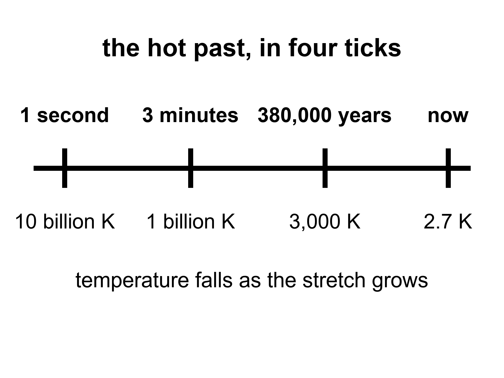

Then the workshop closes. The soup is still too hot for atoms. It will be too hot for 380,000 years. But the nuclear work is done. The universe has committed, by weight, to about three-quarters hydrogen and one-quarter helium, plus a dust of the rest. Stars will later lie about this. They will burn hydrogen into more helium and brag. The *first* helium is not their brag. It is a fossil.

Weinberg’s afterword, years later, had to make room for inflation and for freckles in the leftover glow. He did not have to take back the three minutes. The three minutes have only gotten sharper. That is what a hot claim feels like when you meet one in the wild.

If you could inventory the ordinary atoms in the universe — not the dark extra pull, not the dark extra shove, the atoms — you would find that about one-quarter of their mass is helium-4. That is an absurd amount of helium to blame on stars.

Stars are helium factories, yes. Our Sun is making helium in its core right now, at a stately, suburban pace. In ten billion years it will have converted a respectable fraction of its hydrogen. It will not have converted a quarter of the hydrogen in the *universe*. There has not been time, and there have not been enough stars. The first stars, which were massive and brief and sloppy, made a mess of carbon and oxygen and the iron in your blood. They did not flood intergalactic space with a quarter-by-mass of helium. Something else did.

Say that as a budget, not as an insult. Take every star that has ever shone in the observable loaf, give it a generous lifetime, let it burn at a generous efficiency, and you still cannot cook a quarter of all baryons into helium. Stars make *metals* — astronomers’ rude word for anything heavier than helium — in interesting amounts. They make extra helium locally, in cores and in winds. They do not set *Y_p*. The sky’s baseline helium is older than the first star. That is why the workshop is not optional, and why Alpher and Gamow, joke author included, were pointing at the right oven even when the recipe was still a mess.

The something else is the workshop, caught in the act.

Astronomers measure primordial helium in the least sophisticated gas they can find: dwarf galaxies that have made almost no stars, clouds that have not had a chance to lie. The number they keep finding sits near a quarter by mass, with a little scatter and a lot of argument about the second digit. Deuterium, which stars destroy more easily than they make, is a second fossil. Too much deuterium and the early workshop was too empty of nucleons. Too little and it was too crowded. The observed sprinkle of deuterium is a thermostat for the nuclear minutes. Lithium is the sulky cousin: the prediction and the measurement still do not quite shake hands. That fight is real and unfinished. It does not cancel the helium.

The practical kitchen for helium is an H II region: a nebula where hot stars have stripped electrons off hydrogen, so the gas glows in lines you can put a spectrometer on. Look in metal-poor dwarf irregulars — galaxies that have barely cooked a periodic table — and the helium lines sit near that quarter by mass. Look at deuterium in high-redshift clouds, uncooked by stars, and you get a few deuterium nuclei per hundred thousand hydrogen nuclei, about *2.5 × 10⁻⁵*. The photon-to-baryon ratio that makes those numbers come out is the same billion-to-one already sitting in the leftover glow: about *10⁹* photons per nucleon. Two fossils, one crowding number. Lithium-7 is the exception that still itches: the workshop predicts two to three times more than the oldest stars seem to hold, or the stars seem to hold two to three times less than the workshop baked. Factor two or three, not a factor of a hundred. Warm, unfinished, not a loophole.

The lithium fight has a name on the stellar side: the Spite plateau, a floor of lithium-7 in the oldest, most metal-poor stars, lower than the three-minute prediction by a factor of two or three. Either the stars ate some after they formed, or the workshop’s lithium-7 channel is still missing a correction, or both. People who work on stellar atmospheres and people who work on nuclear rates have been polite at each other for years. The helium does not care. The deuterium does not care. Lithium is allowed to be the sulky cousin and still sit at the table.

Here is the detail that makes the fossil personal. Every breath you take is mostly nitrogen and oxygen, cooked in stars that died before the Sun was a cloud. The helium in a party balloon is mostly not that. Some of it leaked from Earth’s crust, where uranium and thorium have been throwing helium nuclei like litter for eons. Some of the helium in the *cosmos*, the quarter that is not a party trick, has been helium since before there was a periodic table with more than two honest entries. You cannot hold that helium. You can know it.

Ruth once tied twenty balloons to a porch rail for a birthday and asked, as a joke, how much of the universe she was holding. Almost none, and the wrong helium besides. Party helium is a crustal leak, a local mining of radioactive rock. Cosmic helium is the workshop’s payroll, locked at minute three, mixed into every uncooked cloud. The porch rail is not a detector. The metal-poor dwarfs are.

Hot claim: the light-element abundances match a hot, expanding workshop with a known nucleon-to-photon ratio. Warm claim: the remaining lithium tension is a problem for astronomers and nuclear theorists, not a loophole for a cold beginning. Cold claim: any rival origin story that cannot produce this helium is not an origin story. It is a mood.

The leftover glow says the universe was once a mixed, hot fog. The leftover helium says the fog did nuclear work on a three-minute clock. Two fossils, two methods, one past. That is as close as cosmology gets to a courtroom.

---

\newpage

## 11. Almost Nothing, Almost Everywhere

Smooth the universe. Take every star, every planet, every wandering rock, every atom in every lung, and spread them until the lumps are gone. You will have, on average, about one atom of ordinary matter in a space the size of a closet — a cubic meter, give or take the fights about the second digit. A good vacuum pump on Earth is proud to do worse.

Insist on the second digit and the closet is a little emptier than the sentence suggests: about 0.2 ordinary atoms per cubic meter, once you weigh the universe properly and give the atoms only their share. “About one” is the kitchen insult. 0.2 is the receipt. Either way, you are not living in the average. You are living in a lump.

That is the catalog’s first insult. We live in a freak clump. The clump is not the rule. The rule is the emptiness.

The second insult is that the atoms are not even the main clump. When astronomers weigh the universe the way you weigh a truck — by how hard it pulls, not by how shiny it is — the atoms are a minority. About five percent of the energy budget is the stuff of chemistry. About a quarter is an extra pull that does not shine. About two-thirds is an extra shove that makes the stretch speed up. Chapters 17 through 19 are the inventory of those insults. Here it is enough to feel the loneliness of the five percent.

Elena weighs a bag of flour on a kitchen scale and trusts the number because the bag pushes down. She does not trust the number by how white the flour looks. Shine is a terrible scale. A bag of powdered sugar and a bag of whole wheat can fool the eye; they cannot fool the spring. Cosmology’s spring is gravity. Rotation speeds in the outskirts of galaxies, the way clusters lens background galaxies, the peaks in the leftover glow: those are pulls. The shine — stars, nebulae, the kitchen table — is the five percent announcing itself with light. Weigh the loaf by pull and the flour is a minority ingredient. Chapter 17 is the extra pull. Chapter 18 is the extra shove. Do not write those chapters here. Notice, only, that the review lead’s habit is the right one, and that the cosmos does not owe her a bag that matches the photograph.

The bookkeeping has a name. There is a critical density, *ρ_c*, the amount of stuff that would make the large-scale geometry sit on a knife-edge: neither curling closed toward a recollapse nor hinging open so fast that galaxies never find each other.

*ρ_c = 3H_0² / 8πG*

*where ρ_c is that critical density, H_0 is the stretch-rate of now, and G is Newton’s constant — the same G that weighs apples, planets, and the review lead’s flour.*

What we actually have is counted in units of that knife-edge:

*Ω = ρ / ρ_c*

*where Ω is a density parameter, a fraction of critical, and the pieces of Ω are allowed to add.*

The leftover glow, plus the stretch, plus the way structure grew, currently split the bill about like this: *Ω_b ≈ 0.05* in ordinary atoms (baryons), *Ω_c ≈ 0.27* in extra pull that does not shine, *Ω_Λ ≈ 0.68* in extra shove. The sum sits near 1, which is why “flat” keeps surviving the maps. Those decimals will move in the fourth digit. They will not swap the story that chemistry is a rounding error with a press agent.

Put a kitchen number on the knife-edge, because “critical density” sounds like a mood and it is a mass. For a Hubble constant near 70 kilometers per second per megaparsec, *ρ_c* is about 9 × 10⁻²⁷ kilograms per cubic meter — a few proton-masses in each empty closet if all of it were atoms, which it is not. Only the baryon slice, the 0.05, gets to be atoms, and that is how you arrive at 0.2 per cubic meter. The rest of the pull does not sit on the review lead’s scale as flour. The shove does not sit on it at all. “Flat” means the large-scale geometry is the one in which parallel lines stay parallel and the angles of a cosmic triangle add to 180 degrees. Planck’s maps like that answer. Part III will ask why the pebble sat on the blade. This chapter only weighs the bag.

Radiation is a rounding error *now*: the photon share, Ω_γ, is a few parts in ten thousand. Photons dominated the budget when the universe was young and the wavelengths were short; they lost the argument because each photon got tired as well as diluted. Neutrinos, decoupled at one second, are another small slice — a relic you feel in the helium and in the leftover glow’s peaks, not the extra pull of Chapter 17. The extra pull does not shine and does not, as far as the maps can tell, live in the periodic table. The extra shove does not dilute as matter does. Those two sentences are previews. They are not the chapters.

The 0.05 in Ω_b is not a guess from counting stars. Stars are a terrible census of atoms: most ordinary matter is not in stars. It is in hot gas, warm gas, a thin salt in clusters, a fog between galaxies. The leftover glow’s peaks and the three-minute deuterium thermostat agree on the baryon crowding to a level that would be vanity if they did not use different physics. That agreement is why 0.05 is hot enough to print. Counting kitchens will not get you there.

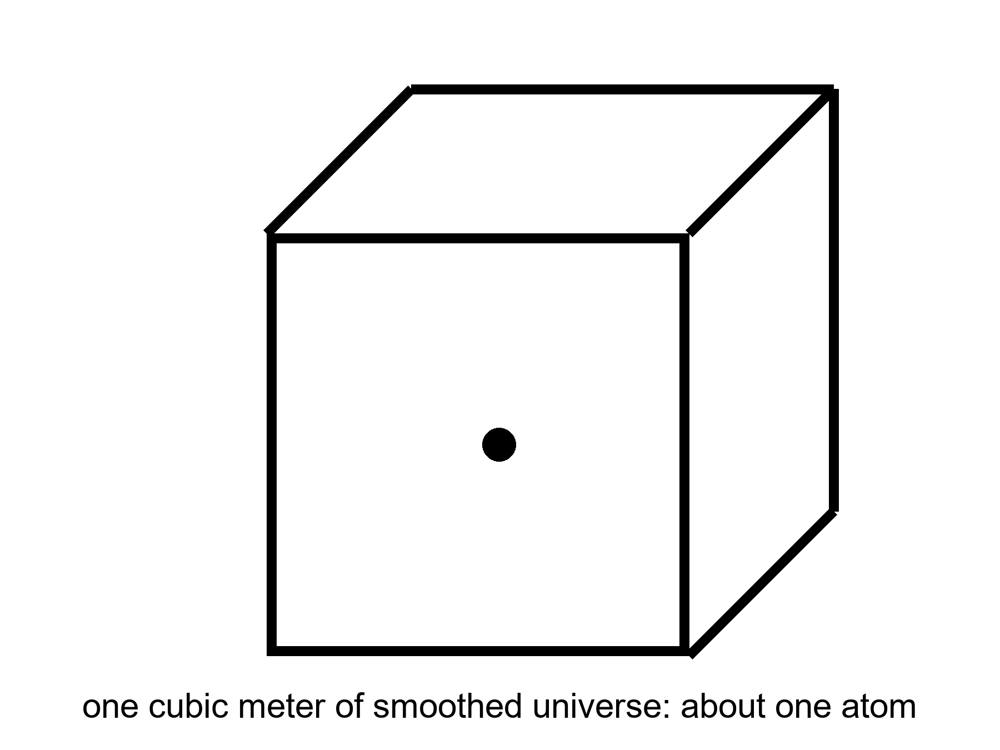

Figure 11 is the most dishonest honest picture in the book. The cube is a meter on a side. The dot is an atom. If you drew the cube at the scale of the review lead’s kitchen, the next atom of the average cosmos would not be in the house. It would not be on the block. You would need a walk that feels like a mistake. We do not take that walk, because we live in the freak, and the freak is full of dots that stuck. The figure is what you get when you refuse the freak and insist on the climate.

Barrow liked to shock readers with billions, and the billions are still shocking if you let them be specific. The observable universe is about 93 billion light-years across, not because it is 93 billion years old — it is 13.8 — but because the stretch has been pulling the farthest light’s starting points farther while the light was in transit. Inside that sphere there are a few hundred billion galaxies you could, in a generous mood, name. Each galaxy has, give or take, a hundred billion stars. Multiply and you get a number that looks like a lie: on the order of 10²² stars. Then remember the closet with one atom. The stars are the rare weather. The emptiness is the climate.

The 93-billion-light-year sphere is a census volume, not a wall. Chapter 7 already told you why the number is larger than the age. This chapter only needs the inventory inside it. Ten-to-the-twenty-two is an order of magnitude, not a roll call: a hundred billion here, a hundred billion there, and the product is a 1 with twenty-two zeros and an argument about the first factor of ten. You may add a zero when the deep fields finish arguing about faint galaxies. You will not add emptiness to the stars and make the stars the rule. Figure 11 is the rule. The Milky Way is a rounding error that learned to shine.

You live in a freak clump twice. Once because a galaxy is already a conspiracy of gravity against the average. Again because a planet, a kitchen, a pair of lungs are conspiracies inside that conspiracy. Walk three meters from the review lead’s scale and you are still in the clump. Smooth the 93 billion light-years and you are back at 0.2 atoms per cubic meter and a dark that does not care about flour. The average cosmos has no tables. It has a leftover glow, a leftover helium, and a lot of nothing with a pull.

Compare the densities so the closet stays honest. Air in the review lead’s kitchen is about 2 × 10²⁵ molecules per cubic meter. The space between stars in the Galactic disk is already a vacuum by kitchen standards — maybe a million atoms per cubic meter in the better neighborhoods, far less in the halo. The smoothed cosmos is 0.2. Each step is a humiliation of the last. You cannot see 0.2 atoms per cubic meter. You can only weigh its consequences, or refuse to smooth, and live in the clump.

The clumps nest. A person is a clump in a kitchen. The kitchen is a clump on a planet. The planet is a clump around a star. The star is a clump in a galaxy. The galaxy is a clump in a group; our group is falling toward Virgo; Virgo sits in a larger web. Chapter 14 will grow the web from freckles. Here the point is only inventory: every noun you care about is a place where the average failed, gravity won, and the stretch was told to wait. The 10²² stars are 10²² local victories. They still occupy a negligible fraction of the 93-billion-light-year sphere.

If you could pour the observable universe’s ordinary atoms into the review lead’s style of bag, and you could find a scale that did not laugh, the bag would still be the five percent. The rest of the pull and all of the shove would not sit in the bag. That is why the catalog of exceptions — star, planet, kitchen, book — is not a catalog of the world. It is a catalog of the part of the world that can hold a reader.

Stars themselves are a later luxury. They are places where gravity won a local argument against the stretch, piled gas until the pile was hot enough to fuse, and then spent millions or billions of years turning hydrogen into the rest of the table. When the more massive ones die, they throw the table into space. Planets are the sediment of that throw. You are the sediment of the sediment, walking around asking where the sediment came from.

The catalog, then, is not a list of objects. It is a list of exceptions. A star is an exception to emptiness. A planet is an exception to the habit stars have of being unfriendly. A kitchen is an exception to the habit planets have of being dead. A book is an exception to the habit kitchens have of being used for casseroles.

the review lead’s bag of flour is an exception inside the exception. It has a weight she can read. The cosmos has a weight she cannot, except by the pull: the way a galaxy refuses to spin as the shine predicts, the way a cluster bends background light, the way the leftover glow’s peaks sit where a certain crowding of stuff requires. Weigh by shine and you will invent a universe made of kitchens. Weigh by pull and you will get the inventory above, and you will have to wait for Chapters 17 and 18 to name the majority ingredients. Waiting is allowed. Pretending the flour is the loaf is not.

The past we can rebuild explains how the exceptions got their raw material. It does not owe the exceptions a destiny. The leftover glow and the leftover helium will still be true if no one ever builds another kitchen. That is not a threat. It is the courtesy of a universe that does not need us in order to have had a first three minutes.

\newpage

# PART III — A Burst, Then Seeds

---

\newpage

## 12. Three Puzzles the Hot Bang Cannot Solve

The leftover glow and the leftover helium make the hot, expanding past look inevitable. They do not make it comfortable. Three puzzles sit in the model like bills on a table, and the three-minute workshop does not pay them.

The first is the *horizon problem*. Look at the microwave sky in two opposite directions. The temperatures match to a part in a hundred thousand. For two patches to agree that tightly, they usually need to have talked — to have exchanged light, mixed, come to terms. In the simple hot bang, those opposite patches have never been in each other’s past light cones. They are like two strangers who have never met and have never had a friend in common, wearing the same shirt to the same size. You can call it a coincidence. Physicists get hives.

The kitchen version is two thermometers.

Tape one to the wall above the stove. Tape the other to the wall by the back door. They agree to a part in 10⁵. In an ordinary kitchen that is not a miracle. Air mixed. Light bounced. The fan ran. The two walls have been in conversational range for hours. Now shrink the time the kitchen has existed until light from the stove has not yet had a chance to reach the door. The thermometers still agree. That is the horizon problem, moved off the sky and onto tile.

At 380,000 years, when the fog lifted and the leftover glow set out, a causal horizon — the farthest a light signal could have traveled since the simple bang began — was a small patch on the sky we photograph now. A couple of degrees. A thumbnail at arm’s length. The whole dome of the microwave sky is not a couple of degrees. Opposite patches sit a hundred thumbnails apart, and then some. The causal horizon at last scattering is much smaller than the sky. In the simple bang, the patches labeled A and B in Figure 12 have never been in each other’s past light cones. They did not mix. They did not come to terms. They still match, to one part in 10⁵, as if agreement were free.

You can try to rescue the simple bang by saying the universe started already even, on scales that had never talked. That is not a solution. That is a shrug wearing a lab coat. It pushes the evenness into the initial conditions and then looks innocent. Physics is supposed to *make* evenness, or at least to inherit it from a time when talking was possible. The simple bang, run backward from the leftover glow, does not give you that time. The leftover glow is a photograph of a single age, the entire sky at 380,000 years. The photograph is too even for the age.

Agreement, in physics, is not a fashion. Two patches of plasma come to the same temperature because photons ricochet between them until the hot spots have given their extra to the cold spots. That is thermal equilibrium, the same “we have mixed thoroughly” signature that makes the leftover glow a blackbody. Mixing needs a path. A path needs time. In the simple bang the time from a hot start to last scattering is 380,000 years, which sounds generous until you remember that the last-scattering surface we see is not 380,000 light-years across. Expansion has been stretching the rulers. The region that could have mixed by then subtends about a degree or two on today’s sky. Opposite patches — 180 degrees of argument — contain thousands of those little mixed rooms, none of which had a hallway to the others.

One part in 10⁵ is not a casual “pretty even.” It is the measured amplitude of the remaining freckles after the dipole of our own motion is subtracted. The average temperatures of opposite hemispheres match far tighter than a kitchen thermometer. Chapter 3’s light cones, applied at 380,000 years, do not overlap for A and B. Figure 12 is that non-overlap, drawn as a circle because the sky is a circle when you have only two dimensions of paper. The simple bang has no conversation that can buy the match. It has only a hope that the start was already a match. Hopes are not mechanisms.

The second is the *flatness problem*. The universe’s geometry — whether parallel lines stay parallel on the largest scales — is astonishingly close to “flat,” which is another way of saying the density is astonishingly close to a special critical value. In the simple bang, that closeness is unstable. A little too much density in the first second and the universe would have recollapsed before helium was done. A little too little and it would have become so empty, so fast, that galaxies would never have found each other. We live on a knife-edge that the equations keep trying to throw us off. Either someone balanced a pebble, or something *drove* the pebble to the middle of the blade.

Barrow liked a pebble on a blade. The blade is the critical density: the exact budget of stuff that makes *Ω = 1*, the universe in which the large-scale geometry does not curl into a ball or splay into a saddle. A little above, and gravity wins on a short clock. A little below, and the stretch wins so fast that clumps never find each other. We measure, today, a universe so close to that blade that the leftover glow, the later bombs of Chapter 18, and the frozen sound-scale in the galaxies all vote *flat* to within a percent or better. That is a fact about now. The insult is a fact about then.

In a decelerating bang — radiation, then matter, no burst — the quantity |Ω − 1| is driven *away* from zero as time runs forward. Closeness is unstable. Run the same equations toward the past and the required closeness blows up. By the time the clock reads one second, the pebble has to sit in the middle of the blade to something like one part in 10¹⁶. Not one part in a hundred. Not one part in a million. A 1-second pebble that would shame a watchmaker. Bump it, and you do not get a slightly different kitchen. You get a recollapse before helium, or a desert that never makes a galaxy.

Nobody balanced it with fingers. Either the initial conditions were an unpublished miracle, or something drove the pebble to the middle and held it there long enough that later physics would look inevitable. Inflation, in the next chapter, is the candidate drive. Here, notice only the bill: the simple bang does not explain the pebble. It assumes the pebble, and then spends 13.8 billion years trying to kick it off.

One second is not a mystic number. It is the door of Weinberg’s workshop: neutrinos have just decoupled, the neutron-to-proton ratio is freezing, the nuclear minutes are about to start. If the pebble is already wrong at that door, the workshop never opens, or opens onto a warehouse with no walls. The required closeness at the Planck time is worse — 10⁻⁶⁰, a number Barrow would have put on a chalkboard to watch a room go quiet. We do not need the Planck time to feel the insult. The 1-second pebble is rude enough. A pebble is not a mechanism either. It is a way of saying the tuning has a clock reading, and the clock reading is uncomfortably early.

The third is the *relic problem*. Grand unified theories — warm-to-cold ideas about how the forces were once one force — tend to produce leftover monsters: magnetic monopoles, heavy stable particles, knots in fields. The simple bang would have left the universe ankle-deep in them. We do not trip over monopoles on the way to the mailbox. Something diluted the relics, or they were never made in our past, or the grand theories are wrong. The first option is the one inflation was built to offer.

A magnetic monopole, in this context, is not a bar magnet you can put on the fridge. It is a knot in a grand-unified field, a particle that would be a north without a south, heavy, stable, and — if the simple bang passed through the grand-unified temperature — as common as the horizon would allow. One per causal patch, roughly, and then they sit there, too massive to decay, too stubborn to hide. They would outweigh the atoms. They would wreck the leftover helium’s accounting. They would be underfoot.

They are not underfoot. That is a fact you can take to the mailbox. So either the grand theories are wrong about the knots, or the knots were never cooked in our past, or something diluted them by a ridiculous factor — 10²⁵ in entropy, says the appendix, if you want a number to flinch at. Inflation was built, in part, as a dilution machine. Guth was thinking about monopoles when he started. The even sky and the pebble came along as bonuses. The bonuses are now the famous posters. The monopoles are the quiet third bill.

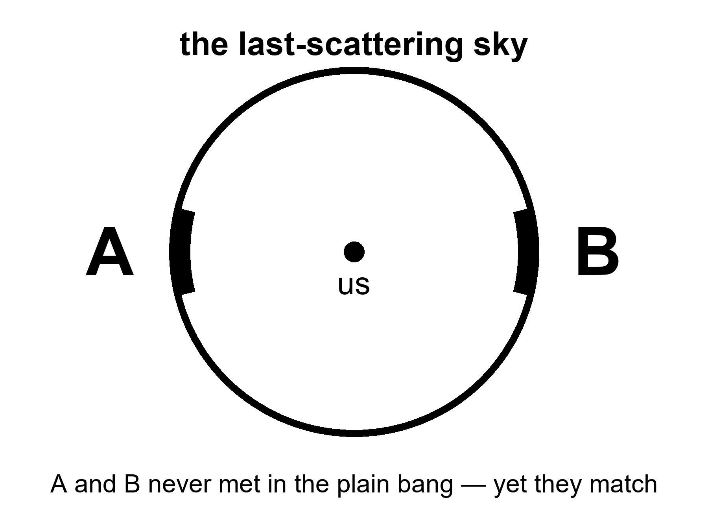

Imagine the kitchen table at the end of Weinberg’s workshop.

Three envelopes were already paid. The leftover glow exists. The leftover helium exists. The stretch exists. Those are receipts. You can put them in a drawer. Then three more envelopes sit where the casserole should be, unpaid, the kind of bills that do not go away because you cooked a good dinner. One says HORIZON. One says FLATNESS. One says RELICS. The three-minute workshop did not write checks for them. It was not that kind of workshop. It reconstructed a soup. It did not explain why the soup’s bowl was so round, so even, and so empty of monsters.

Weinberg paid the nuclear minutes. He paid them with the same nuclear physics we still use in stars and in laboratories, and the helium still sits in the account. These three remain. They are not evidence that the workshop was a fiction. They are evidence that the workshop started with a table already set, and nobody at the table could say who set it.

None of these puzzles says the hot bang is false. They say it is incomplete as a story of *initial conditions*. Weinberg could reconstruct the nuclear minutes without knowing why the sky was so even. Guth, in 1980, asked whether a brief, violent stretch *before* those minutes could set the table so the minutes would look inevitable.

Guth was not, in 1980, handing the community a finished preface. He was a particle theorist staring at monopoles, asking whether a false-vacuum stretch could dilute them, and noticing that the same stretch would also even the sky and drive the pebble. The paper is a question with a mechanism attached, not a verdict. Old inflation, the first mechanism, will fail to exit. That failure is Chapter 13’s opening debt. The question survives the debt. The three bills are still on the table either way.

That question is the opening of Part III. It is not yet the solution. Guth’s first try will have a graceful-exit problem, a mess about how to stop, which Chapter 13 will have to clean. The sky will later be photographed in polarization by people who were sometimes too eager. Those fights belong to the next pages. Here the honest inventory is three unpaid bills, a paid nuclear dinner, and a physicist asking whether a burst could be the missing payment.

That is a different kind of move. The three minutes are a reconstruction. Inflation is a proposed preface. Prefaces can be wrong even when the book is right. Keep the temperatures straight. The puzzles are hot. The leading solution is warm. The details of the preface — what field, what potential, what first 10⁻³⁶ second — are still being written in pencil.

---

\newpage

## 13. Inflation, Without the Hype

Here is inflation without the poster.

Suppose, in a sliver of time so short that “sliver” is already too romantic, a patch of the universe was filled with a field that behaved like a temporary cosmological constant: a stuff whose tension was so odd that gravity, locally, *repelled*. The stretch that matters is an e-fold: every distance grows by a factor of *e*, about 2.7, not by a tidy doubling. About fifty to sixty of those e-folds are what the job asks for. Distances that had been smaller than a proton became larger than a grapefruit, then larger than a solar system, then larger than the part of the universe we can see. Then the field decayed. Its energy dumped into particles. The dump is called reheating, which is a calm word for setting a universe on fire. After the dump, you have a hot bang: soup, light, the three minutes, the leftover glow.

The kitchen is a pot on a high flame.

For a sliver the pot does not simmer. It *boils over*: the volume of steam is not a polite trickle, it is a room-filling insult, doubling and doubling. Then the whole violent pot dumps into a larger pot of soup. The dump is reheating. After the dump you have the hot bang. The boil-over is not the soup. The soup is what you can reconstruct. The boil-over is the proposed preface that makes the soup’s evenness less of a miracle.

The count that matters is *e-folds*. Each e-fold stretches every distance by a factor of *e*, about 2.7. A doubling would be a different count, and this chapter will not teach the wrong one. About 50 to 60 e-folds are what the three puzzles ask for: enough stretch that the whole sky we photograph was once inside one talking neighborhood, enough that a curved surface looks flat, enough that one relic per pre-burst patch becomes one relic per observable universe, or fewer. Sixty of them take a proton-scale patch and throw it past everything we can see. The clock for the whole insult is of order 10⁻³² seconds. That number is a round order, not a kitchen timer. It depends on how hard the field was shoving. It is short the way a lightning strike is short, except lightning is leisurely.

Slow-roll is how the pot is allowed to boil that long without instantly dumping. If the field sprinted down its hill, the boil-over would be over before it had stretched enough, or it would dump in a mess of bubbles. Slow-roll is a hill so flat the field creeps. Hubble friction acts like a damper. Sixty e-folds of almost-constant shove, then a dump. The field that does this job is called the inflaton because physics names things by their chores. We have not met it in a detector. It is unnamed in the only sense that matters: no mass, no charge, no track in a tank.

Reheating deserves a slower look, because the dump is where the preface becomes the book we already trust.

While the field is slow-rolling, its energy is locked in the odd tension: vacuum-like, smooth, shoving. When the field reaches the bottom of the hill it oscillates. Oscillation is particles, or at least the right to become particles. Those particles collide, thermalize, and you have a radiation bath — the hot bang, at last, with a temperature that depends on how the dump was done. The reheating temperature is model-dependent. The appendix will not apologize for that. What is not model-dependent is the order of operations: burst, dump, soup, three minutes, leftover glow. You do not get to skip the dump and still claim the helium. The helium is soup-work. The burst is table-setting.

Fifty to sixty e-folds is a window, not a sacred count. Too few, and a corner of today’s sky was never inside the talking neighborhood; the horizon bill stays unpaid. Too many is allowed by the local job description and starts to grow the rumor of Chapter 15: extra stretch somewhere else, extra rooms, a pot that does not stop. The local sky asks for about sixty. It does not ask for infinity. Do not let infinity borrow sixty’s paycheck.

Picture two kitchens, two years apart. In the first, 1980, a pot is boiling so violently that bubbles of “done” soup nucleate in a superheated sea and never quite fill the pot; the walls between bubbles are a mess. That is old inflation, Guth’s first try, the graceful-exit problem as a cooking failure. In the second, 1982, the flame is high but the pot is a wide, almost-flat pan. The whole surface comes up to temperature together and then, when the field finds the lip, dumps as one. That is slow-roll. Linde’s pan and Albrecht–Steinhardt’s pan were independent. Physics sometimes invents the same dish twice in one year when the bill is loud enough.

Why bother? Because the three puzzles go pale.

The opposite patches of sky *did* talk. They talked when they were neighbors, before the burst pulled them out of conversational range. The burst then stretched their agreement across the whole sky. The horizon problem becomes a memory of an old neighborhood.

The knife-edge of flatness gets driven toward the middle. Stretch a curved surface enough and any small patch looks flat. A basketball, to an ant the size of an atom, is a plane. Inflation is the move that makes us the ant.

The relics get diluted. One monopole per pre-burst patch becomes one monopole per observable universe, or fewer. We stop tripping.

That is the job description. It is not yet a proof. A preface that pays three bills is a good preface. It can still be the wrong preface, or the right job done by a field we have not named.

Repulsive, here, is not a personality. Einstein’s gravity, for ordinary stuff, pulls. For a stuff whose pressure is negative enough — a cosmological-constant-like tension — the same equations shove. The burst is that shove, brief and huge. It is not anti-gravity in a comic-book sense. It is the Friedmann equation with a budget that has the wrong sign for anyone who grew up on apples. Then the budget changes, because the field rolls and dumps, and apples make sense again. Figure 13 is that change of budget: a steep rise labeled burst, then a gentler slope labeled after. The after is the hot bang we already rebuilt. The rise is the proposed reason the after looks so unsurprising.

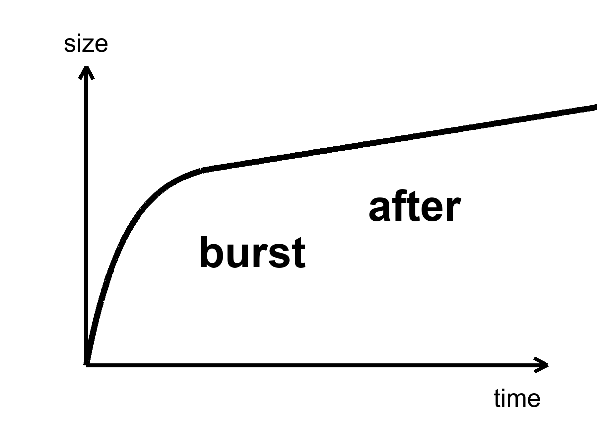

Alan Guth’s first version had a graceful-exit problem: the burst did not know how to stop without making a mess. Andrei Linde, and independently Albrecht and Steinhardt, found a smoother hill for the field to roll down — *slow-roll*. Linde later suggested that the starting values of the field could be chaotic, different in different places, some patches inflating a lot, some not. That idea will grow a maybe-multiverse in Chapter 15. Do not let it jump the line. The *local* burst is the working theory. The froth of other bursts is a rumor the local burst can tell if you let it drink.

The graceful-exit problem, said without kindness, is this. Guth’s 1980 boil-over happened in pockets. True-vacuum bubbles nucleated in a false-vacuum sea and did not fill space without leaving walls and wreckage. The burst that was supposed to set the table set a junkyard instead. In 1982, Linde, and independently Albrecht and Steinhardt, flattened the hill. The whole patch rolls slowly together. New inflation, slow-roll. That is the working picture, the one whose job description still fits the leftover glow. Old inflation is a historical kindness we owe Guth for asking the question. It is not the pot we cook with.

What inflation has not done: name the field. We have no particle in a detector called the inflaton. We have a shape that works and a sky that looks like the shape predicted. That is more than a mood and less than a conviction. Appendix A13 writes the e-folds and the slow-roll parameters. Here it is enough to know that “inflation” is not a brand. It is a job description: a brief, repulsive stretch that sets the table for the hot bang we can actually reconstruct.

A humility from 2014 belongs on this page, because poster-inflation hates humility and the sky does not.

A telescope at the South Pole, BICEP2, looked for swirls in the leftover glow — B-modes — that a burst would have printed with gravitational waves. In 2014 the team announced a detection. The world did a lap. Warm claim, briefly worn as hot. Then dust in our own galaxy, polarized dust, sat down in the same seat as the signal. A 2015 joint analysis with Planck was the kill. The swirl was not the burst. The swirl was grit in the kitchen, the kind that lives in the Milky Way and polarizes starlight for a living. Humility is not a personality trait in a press office. It is what the sky did when someone claimed to have photographed the first 10⁻³² second.

The kill is worth teaching because it is how a warm claim dies correctly.

B-modes are a swirl pattern in the polarization of the leftover glow. Inflationary gravitational waves would write one kind of swirl, a primordial kind, whose amplitude is a number called *r*, the tensor-to-scalar ratio. Dust writes another kind, because dust grains in our galaxy align with magnetic fields and scatter starlight with a handedness of their own. BICEP2 looked at a clean-looking patch of southern sky at 150 GHz and saw swirls. Planck, looking at many frequencies, could tell dust from glow by color. Dust is redder in a specific way. The joint analysis showed the color of dust. *r* was not measured. An upper limit remained. Upper limits are not nothing. They are a fence the hill has to live behind. They are also not a detection. The poster that said first direct evidence had to be taken down. Taking it down is part of the science. Leaving it up would have been a different book.

What survived the dust is quieter and better. Planck measured the tilt of the primordial spectrum: *n_s* ≈ 0.965, a little redder than a perfectly scale-invariant 1. Slow-roll likes that song. A hill that is not perfectly flat, a field that creeps, a spectrum that leans a little toward larger scales: that is the shape, not the photograph of a particle. A tilt is a clue. Clues are allowed to be warm. They are not allowed to be a victory lap.

String theory sometimes offers inflatons the way a catalog offers furniture. The catalog is large. **It cannot currently be tested.** We will not pay the book’s rent with a catalog.

A catalog is tempting because the job description is wide. Many hills slow-roll. Many fields, in many theories, can pretend to be a temporary cosmological constant for 10⁻³² seconds and then dump. String theory’s catalog is famous for being large. Large is not the same as found. A furniture catalog does not furnish a kitchen. Until a particular hill is killed or confirmed by a number — a value of *r*, a feature in *P(k)* the leftover glow does not have, a leftover particle in a tank — we have a job, not a hire. The unnamed inflaton is not a failure of imagination. It is a failure of detection. Failures of detection are allowed to sit on the table beside the soup. They are not allowed to be called dinner.

Keep the temperatures straight on this chapter too. Hot: the three puzzles are real, and a brief stretch of the sort described would pale them. Warm: slow-roll inflation, 50 to 60 e-folds, a dump into soup, a tilt near 0.965, is the working preface. Cold: we have named the field, bagged it in a tank, and photographed its gravitational waves. We have not. The pot boiled over. We are eating the soup. The name of the cook is still a blank line.

---

\newpage

## 14. How a Quantum Twitch Became a Galaxy

If inflation had stretched the universe perfectly smooth, there would be nothing to look at. No galaxies, no stars, no kitchens. Perfection is sterile. The universe is saved by a twitch.

Quantum fields cannot sit still. Even in their quietest state they jitter. During the burst, those jitters — differences in the field from place to place, at the smallest scale the quantum rules allow — get stretched from subatomic to cosmic the way a note written on a balloon becomes unreadable when you inflate it, except here the note becomes a *continent*. A region that jittered a little dense stays a little dense. After reheating, gravity, which has all the time in the world, starts calling in the debt. The dense patches pull. The thin patches get thinner. After a few hundred million years, the dense patches are making the first stars. After a few billion, they are making galaxies that look, cropped and gray, like Figure 14.

The kitchen mistake is to think of a twitch as a metaphor for “something small.” It is not a metaphor. An electron in a wire does not have a definite path. The same family of rule that forbids that path forbids a quantum field from sitting at one exact value in every place. Inflation is not a new kind of uncertainty. It is an amplifier. It takes the jitter the quantum rules already insist on and stretches it until the jitter is the size of a future cluster. Gravity is the sculptor. Gravity does not invent the pattern. Gravity spends 13.8 billion years pulling on a pattern that was already written, faintly, in a field that could not sit still.

This is Mukhanov’s territory, and Guth’s, and a workshop of people in 1982 who realized that inflation does not just solve puzzles. It *makes the seeds*. The leftover glow’s freckles are those seeds, photographed at 380,000 years, before gravity had done much sculpting. The pattern has a sound: almost the same power at every scale, a little redder on large scales, a spectrum written *P(k)* in the appendix and “almost scale-invariant” in conversation. Planck measured the tilt. The tilt matches slow-roll inflation’s favorite song. That is the warm claim at its warmest.

The 1982 workshop — a room of chalk, not a cathedral — is worth a pause because this is the moment the burst stopped being only a bill-payer. Viatcheslav Mukhanov, with G. V. Chibisov a year earlier, and then a crowd that included Hawking, Starobinsky, Guth, Turner, Bardeen, Steinhardt, had the same rude thought: if a field is jittering while it stretches, the jitter *is* a spectrum of density. After the dump into soup, that spectrum is a set of slightly overdense and underdense patches. The leftover glow is the photograph of those patches as temperature. Galaxies are the same patches, later, as matter. One twitch. Two exhibits.

The numbers are small on purpose. The amplitude of the primordial spectrum, *A_s*, is about 2 × 10⁻⁹. Two parts in a billion. That is how loud the twitch was, as a fractional difference in density, when it was stretched beyond the causal horizon and frozen. The tilt is *n_s* ≈ 0.965, Planck’s digit, a hair redder than 1. If *n_s* were exactly 1, every scale would have been given the same fractional power. Slow-roll does not quite do that. The hill is not perfectly flat, so large scales, which exit the horizon earlier, get a little more to work with. The leftover glow’s freckles sing that song. The song is not a galaxy. It is the score gravity will play.

*P(k)* is a recipe for how much power lives at each spatial scale. Scale-invariant means the fractional jitter looks the same if you zoom in or out, like a coastline that is wrinkly at every magnification. Almost scale-invariant means the coastline is a little calmer when you zoom into small bays, a little wilder when you back up to the whole shore. That is the red tilt. *A_s* ~ 2 × 10⁻⁹ sets how wrinkly, overall, the coastline was. Gravity turns wrinkle into continent. The leftover glow is the coastline at 380,000 years, still a coastline, not yet a continent. Figure 14 is a continent.

During the burst, a jitter of a given size is stretched until it is larger than the causal horizon — it *exits*. Outside the horizon it freezes: the patch cannot talk to its neighbors, so the overdensity stays an overdensity. After the burst, the horizon grows again, and the jitter *re-enters*. Gravity can then start sculpting. Different scales exit at different times during the 50 to 60 e-folds, which is why the spectrum is a story about a hill, not a single stamp. Large scales exit earlier. If the hill is slowly changing, large scales get a slightly different amplitude. That slight difference is *n_s* − 1. Planck’s 0.965 is a sentence about the hill’s slope, written in the leftover glow.

Mukhanov’s name is on the variable that lets you quantize the twitch in an expanding background — a combination of field jitter and metric jitter that the appendix will write as if it were a friend. You do not need the friend to understand the claim. You need this: the same quantum rule that smears an electron’s path smears the unnamed field’s value. The burst is a loudspeaker. Gravity is a chisel. The 1982 workshop is the moment a room of people heard the loudspeaker and realized they were also looking at a sculpture garden.

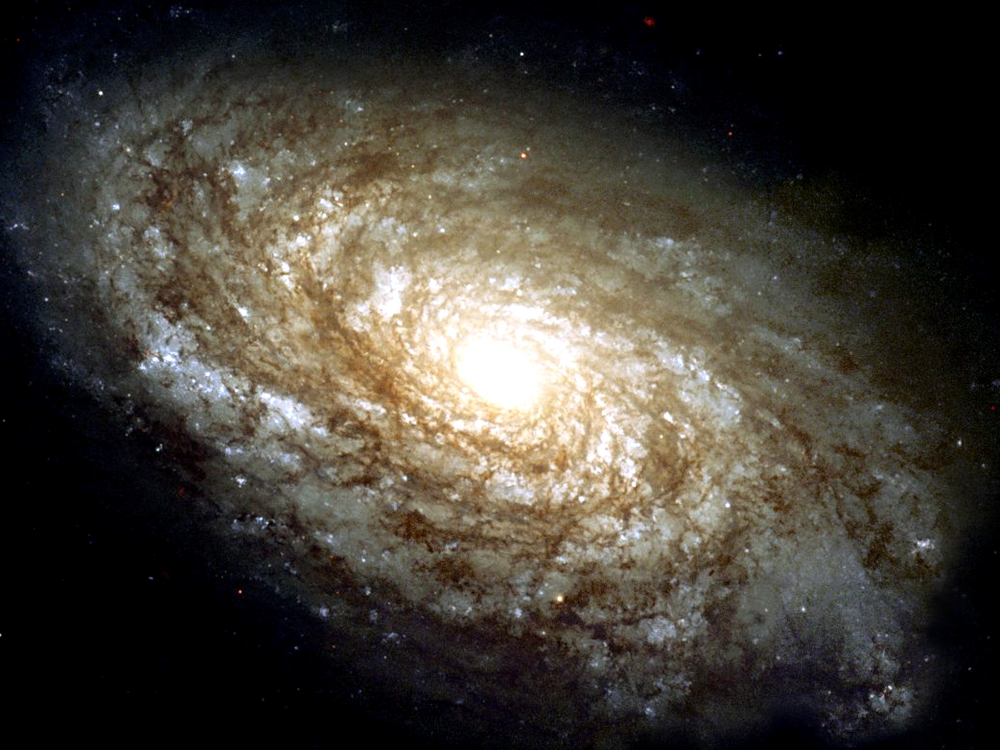

A detail that should not be allowed to stay abstract: the twitch is not a metaphor for “something small.” It is the same kind of uncertainty that keeps an electron from having a definite path in a wire. Inflation is the amplifier. Gravity is the sculptor. You are a later exhibit.

The timeline of exhibits, kept at the right temperature:

Hot: the leftover glow has freckles whose statistics we have measured. Their amplitude and tilt are numbers, not adjectives.

Warm: those freckles are the stretched jitter, and gravity grew them. The first stars, in this working picture, light up around 100 to 200 million years after the dump — a range, not a birthday. JWST photographs later exhibits: galaxies already assembled, already chemically rude, already sitting on the web that Chapter 16 will name. Those photographs are not a laboratory of the twitch. They are the museum downstairs from the laboratory.

The first stars are a warm chapter in a hot book. Theory says the first lumps that can cool and collapse do so around 100 to 200 million years after the dump, in minihalos that would look, if you could see them, like failed galaxies: a few hundred thousand or a few million solar masses of extra pull, a handful of massive, short-lived, metal-free stars. We have not photographed those stars as individuals. We have photographed, with JWST, galaxies that are already later exhibits — assembled, chemically polluted, sitting at redshifts that still make the stretch look like a time machine. Those galaxies are not the twitch. They are the twitch after gravity has had a few hundred million years to work and after the first stars have already lived and died and thrown carbon into the kitchen. Do not let a sharp infrared image pose as a laboratory of quantum jitter. It is a museum label that says LATER.

Gravity as sculptor is not a metaphor you can retire. Overdense patches pull. Underdense patches get emptied. On small scales the extra pull of Chapter 17 helps the lumps hold together against the stretch. On large scales the stretch eventually wins, and the web freezes. In between, for a few billion years, the sculptor is busy. A spiral disk is a late, local luxury: gas that cooled, spun, and settled in a halo that the twitch had already chosen. The choice was a nick of size 10⁻⁵ in the leftover glow. The luxury took the rest of cosmic time.

Cold: we have watched a twitch become a spiral in a laboratory. We have not. We have watched the intermediate photograph — the leftover glow at 380,000 years — and done the math that grows a 2 × 10⁻⁹ jitter into a disk like Figure 14. That is allowed to be enough, if we say so.

Chaos belongs here as mechanism. A jitter of one part in a hundred thousand is nothing in a kitchen and everything in a cosmos. Change the jitter’s pattern and you get a different web of galaxies — still a web, different rooms. That is not destiny. It is sensitivity. Chapter 16 will give chaos its own chair. Here, notice that the most important structures you will ever see began as noise.

Do not let the spiral in Figure 14 pose as a time-lapse of a quantum event. It is a nearby galaxy, light a few tens of millions of years old, a late sculpture. The twitch that seeded the line of lumps it grew from is not in the frame. The twitch is in the statistics of the leftover glow, and in the fact that a universe this empty still managed to make a disk this pretty. Gravity had time. Time is the sculptor’s only luxury. The quantum rule supplied the chisel’s first nick.

Between the freckles and the first stars there is a long, dark kitchen.

Last scattering is 380,000 years. The first stars, warm, are 100 to 200 million years. In between, the universe is not empty of stuff. It is empty of light worth a name. Neutral hydrogen, leftover helium, the extra pull gathering in the dark, the stretch still going. Lumps that were 10⁻⁵ too dense in the glow become, slowly, lumps that can cool. Cooling is the unglamorous step. Gravity pulls. Gas that can radiate away its heat can keep falling. Gas that cannot stays puffy and fails. The first stars are the first successful coolers, not the first lumps. JWST’s later exhibits have already inherited metals from coolers that died. That inheritance is why a sharp galaxy at high redshift is not a photograph of the nick. It is a photograph of a kitchen after several meals.

You cannot, in a laboratory, stretch a quantum jitter until it is a spiral and then wait out the sculptor. The amplifier is a burst we cannot turn on. The sculptor’s hours are cosmological. What we can do is measure the intermediate photograph, write *P(k)* with *A_s* ~ 2 × 10⁻⁹ and *n_s* ≈ 0.965, and check that gravity, given that score, grows a web that looks like the surveys of Chapter 16 and a disk that looks like Figure 14. That check is the warm claim at its most responsible. It is not a time-lapse. It is a courtroom with two exhibits and a lot of math between them.

Hot claim: the leftover glow has a pattern of freckles whose statistics we have measured. Warm claim: those freckles are stretched quantum jitters, grown by gravity into galaxies. Cold claim: we have watched a twitch become a spiral in a laboratory. We have not. We have watched the intermediate photograph and done the math. That is allowed to be enough, if we say so.

---

\newpage

## 15. Bubbles That May Never Stop

Once you have a field that can burst, you can ask whether the bursting ever takes a holiday.

In many versions of slow-roll, the field reaches the bottom of its hill in some places and keeps rolling, or keeps jittering, in others. The places that keep going keep stretching. The places that stop become hot bangs — pocket universes, bubbles, whatever noun you can stand. Our observable sky would be inside one stopped place. Outside, the bursting might still be hiring.

This is eternal inflation, Linde’s and Vilenkin’s child, Guth’s grown rumor. It is a live hypothesis. It is not a photograph.

The kitchen is a pot that keeps boiling in the next room.

You live in the room where the pot already dumped into soup. The soup is the leftover glow, the leftover helium, the stretch, the galaxies. In the next room — a room whose door is not a door, because the stretch between rooms is not a hallway you can walk — the original pot may still be boiling over. New dumps, new soups, new leftover glows that are not ours. You cannot go there. A bubble is not a destination. It is not a planet with a pad. It is a volume that reheated, or a volume that has not, separated from you by a stretch that does not sell tickets. Chapter 25 will talk about greenhouses on worlds you can, in principle, point at. This chapter is not that chapter. Bubbles are a maybe about the loaf, not a travel brochure.

A destination has a worldline you can aim at. A bubble that nucleated elsewhere, behind a stretch that has been doubling for longer than our soup has existed, does not. Light from that bubble does not arrive. A ship does not arrive. The word “neighbor” in the cold claim at the end of this chapter is a courtesy and a trap. Neighbors, on Earth, share a street. These would share only a mathematics.

In many slow-roll models the quantum jitter in the field, per Hubble time, can be larger than the classical roll down the hill. Where the jitter kicks the field *up* the hill, that patch stretches more and the hill remains. Where it kicks down, that patch dumps into soup and becomes a bubble. The stretching patches make more volume than the dumping patches. Volume wins. The boil-over in the next room does not stop because the next room keeps being remade. That is eternal inflation as a mechanism, not as a mood. Linde’s picture is often this self-reproduction on a hill. Vilenkin’s picture is often bubbles nucleating in a false-vacuum sea. The nouns differ. The next-room pot is the same insult: the bursting may not take a holiday.

If the underlying physics has many ways to stop — many valleys for the field to fall into, many sets of effective constants — then different bubbles can freeze out with different laws. That is the expensive copy machine of Chapter 39, and it is where the anthropic filter of Chapter 41 gets its only real job. Weinberg’s argument that the cosmological constant should not be much larger than what still allows galaxies *needs* an ensemble. Eternal inflation plus a landscape is the ensemble people reach for.

Do not write the filter here. Chapter 41 will have to say, carefully, what an ensemble is allowed to explain and what it is only allowed to excuse. Here it is enough to see why Weinberg’s Λ is lonely without company. A vacuum energy — a hum of energy that empty space carries even with nothing in it — as small as the one we weigh is a joke if it is a unique, first-principles output of a theory. It is less of a joke if many vacua are tried and we can only find ourselves in one that still makes galaxies. That sentence is a pointer, not a proof. The pointer needs two things this chapter can name and cannot certify: a bursting that never quite stops, and a menu of valleys. The bursting is eternal inflation, Linde and Vilenkin, a live maybe. The menu, in its most advertised form, is a landscape inherited from string theory.

Weinberg, in 1987, asked how large a cosmological constant could be before galaxies fail to form. The answer is: not much larger than what we weigh. That is an upper bound from the existence of galaxies, not a calculation of the vacuum from first principles. An upper bound of that kind is idle unless many values are tried. One universe, one Λ, and Weinberg’s bound is a coincidence we live inside. Many bubbles, many Λs, and the bound becomes a filter: we could not have found ourselves in the bubbles that shoved too hard, too soon. Chapter 41 is the filter chapter. This chapter only points at the drawer the filter would need. Do not open the drawer and call it a house. Do not write the filter’s sentences here. Point, and leave the pointing visible.

The landscape, in its most advertised form, comes from string theory. **String theory cannot currently be tested.** A landscape of valleys inherited from an untestable framework is not a measurement. It is a maybe stacked on a maybe. This book will let the stack sit on the table. It will not serve it for dinner.

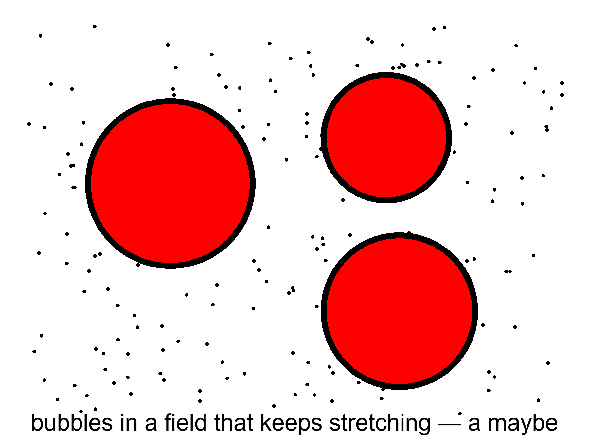

Figure 15 is a picture of a possibility. It is not a map. Maps have distances you can travel. These circles do not.

If you find yourself packing a bag for a bubble, put the bag down. Chapter 6 already took away a single now. Chapter 3 already made light late on purpose. A bubble that is not in your past light cone is not late mail. It is elsewhere, in the technical sense, and then some: the stretch between dumped soups can put them out of every future cone you will ever occupy. That is why bubbles are not destinations. Destinations, even cruel ones, sit on a worldline you can still draw. These do not.

There is a further rumor: that the bursting has no beginning, that bubble has always begotten bubble. The Borde–Guth–Vilenkin result says otherwise for a wide class of stretching spacetimes: if the average expansion is positive, the spacetime is past-incomplete. Eternal inflation, even if it has no end, still faces a boundary in the past. The bubbles do not give you a free forever-behind-you. They give you a messier loaf.

Past-incomplete, in the kitchen, means this. Follow a worldline backward through a spacetime that has been stretching, on average, and you run out of geodesic — the straightest path the geometry allows, the trail a free stone or a free clock actually follows — before you run out of curiosity. You do not get a quiet eternity of boiling behind you. You get a boundary, a place where the description stops and a different description — quantum gravity, a bounce, a sentence we do not own — would have to take over. BGV is not a proof that the loaf had a kitchen-clock beginning. It is a proof that *this* kind of forever-behind-you is not for free. The next-room pot does not pay the first-word bill. Chapter 44 will sit with that bill. Here: eternal inflation is not a machine for manufacturing a past without an edge.

Measure problem, in one sentence: if there are infinitely many bubbles and infinitely many observers, the word “typical” breaks. You cannot say “most universes are like this” until you say how you count. No one has a count that everyone else has to accept. Until they do, “the multiverse predicts X” is a hope in a lab coat.

Volume-weighted counting rewards the patches that stretched longest. Observer-weighted counting tries to ask where a typical observer sits. Pocket-weighted counting treats each dumped soup as one. They disagree. They disagree about whether we are typical, whether the cosmological constant we weigh is typical, whether anything is typical. An ensemble without a measure is a drawer of photographs with no rule for which one is “the” photograph. Chapter 41 will need a rule if it wants the filter to be more than a mood. This chapter’s job is to admit that the drawer is a rumor, and that the rumor is not a destination.

Infinity is the rude guest. If the next-room pot never stops, there are infinitely many dumped soups. Infinitely many observers. Infinitely many values of anything you care to count. A ratio of infinities is not a prediction until you say which infinity sits in the denominator. Different measures are different denominators. They are not a minor bookkeeping quarrel. They change what the rumor is allowed to claim. Until one of them is forced on us by a principle we already trust, “the multiverse predicts X” should be read as “some ways of counting would like X.” That is a thinner sentence. It is the honest one.

Past-incompleteness and the measure problem are not the same bill. BGV is about the loaf having an edge behind you. The measure is about not knowing how to average the rooms in front of you, or beside you, if the boiling never stops. You can have an edge in the past and an uncountable froth in the future. That combination is allowed. It is not a comfort. It is a messier loaf, as the earlier paragraph said, and messier is not the same as mapped.

Warm claim: inflation *can* be eternal in many models. Cold claim: it is, and we live in a bubble with neighbors we will never meet. The sky we have does not require the neighbors. It permits them. Permission is not a postcard.

Keep the next-room pot on a back burner, not on the dining table. The local burst of Chapter 13 is the working preface to the soup we can taste. The pot that may still be boiling elsewhere is a maybe that the local burst can tell if you let it drink. Letting it drink is allowed. Paying rent with the drink is not.

The next-room pot is also a humility about nouns.

People hear “bubble” and picture a place, a film of soap, a destination with an inside you could visit if you had a better ship. The picture is a liar in three ways. First, the wall of a nucleated bubble, in the versions that have walls, is not a surface you approach. It is a stretch you cannot catch. Second, other dumped soups need not share our leftover glow, our helium fraction, our shove. Different valleys, different effective constants: that is the landscape rumor, and the rumor is untestable while it is borrowed from string theory. Third, even a bubble that dumped with laws like ours is not “next door.” Next door is a kitchen word. These rooms do not share a hall.

Guth’s grown rumor, Linde’s child, Vilenkin’s child: the bursting as a process that, once started, makes more of itself. That is the live hypothesis. It may be false. Slow-roll can be arranged, in some hills, so that the classical roll always beats the jitter and the pot dumps everywhere at once. Those hills pay Chapter 13’s bills without hiring Chapter 15. The sky we have does not yet force the hiring. It permits it. Permission, again, is not a postcard. Figure 15 remains a picture of a possibility. Frame it as a possibility and the chapter has done its job. Frame it as a map of destinations and the chapter has failed.

---

\newpage

## 16. Chaos Is an Engine

Chaos, in physics, is not a mood and not a mess. It is a precise kind of sensitivity: two starts that differ by a breath end in rooms that do not recognize each other. Weather is chaotic. A pendulum swinging over a magnet can be chaotic. The approach to a final crunch, if the universe had been headed for one, would have been chaotic — Barrow proved things in that vicinity, and Belinski, Khalatnikov, and Lifshitz gave the mixmaster a name. A recollapsing cosmos would not politely reverse the film. It would scramble.

The kitchen is a dropped tray of yeast.

Same flour. Same water. Same yeast. The tray hits the floor and the grains go everywhere. Two bakers, starting from two almost identical spills, do not bake the same loaf. One kitchen gets a dense crumb. The other gets holes like a sponge. The ingredients did not change. The sensitivity did the work. Lyapunov, if you want the surname on the sensitivity, is the person who taught mathematics to measure how fast nearby starts stop being nearby. A Lyapunov time is a clock for forgetting. Weather forgets in days. A mixmaster crunch would forget in a scramble of axes. A quantum twitch, stretched and then pulled by gravity for 13.8 billion years, forgets the subatomic room and remembers only a web.

Take two trays. Spill them as identically as a human can. Watch. In a Lyapunov system the difference that was a grain of yeast becomes, after enough doublings of error, a different city of holes in the crumb. The number that measures the doubling is a Lyapunov exponent; its inverse is a time. Weather’s time is short, which is why the kitchen radio stops pretending on day ten. The stretch’s time, for the average expansion, is long, which is why Friedmann still works as a forecast. The mixmaster’s time, near a crunch, is short in the only way that matters: too short to steer. Nearby starts, unrecognizable rooms: that is the whole definition, with a surname attached so nobody can pretend chaos meant “messy feelings.”

At the beginning, chaos is an engine.

The quantum twitch of Chapter 14 is sensitivity as a gift. Stretch it, and you get a web. The cosmic web — filaments of galaxies around voids like holes in a sponge — is what gravity does with a nearly scale-invariant jitter after thirteen billion years. It is not a design. It is what you get when pull is allowed to run on noise.

Same engine, two temperatures. At the start, sensitivity is how a nick of size 10⁻⁵ becomes a sponge you can survey. At a hypothetical crunch, sensitivity is how a last decimal becomes a mixer nobody holds. The mathematics is cousin to itself. The moral is not. One gift. One theft. Do not let a poster collapse them into “chaos means we cannot know anything.” We can know the leftover glow. We can know the web’s family. We cannot know, from a grain of yeast, which hole in which loaf. That is the precise kind of not-knowing. It is enough.

The web is not a drawing. It is a survey. The Sloan Digital Sky Survey and the Two-degree-Field survey mapped enough galaxies that the sponge became a fact you could crop and print. Figure 16 is that crop: filaments as dark on light, voids as the light, a later exhibit of the same jitter that freckled the leftover glow. Two nearby starts in the primordial noise — two almost identical spills of yeast — would not grow the same rooms. They would still grow a web. Still a sponge. Different holes. That is chaos as an engine: the family of outcomes is stable, the particular kitchen is not.

A survey is a census, not an anecdote. 2dF, from Australia, and SDSS, from a telescope in New Mexico, redshifted enough galaxies that the sponge stopped being a theorist’s sketch. Filaments, walls, voids: the same family of pattern the leftover glow’s freckles asked for, grown. You can still argue about the second digit of how much extra pull sits in the filaments. You cannot argue that the web is a mood. Figure 16 is a measurement, cropped so a page can hold it. The yeast on the floor is the same measurement, earlier, before gravity baked. Same ingredients. Different loaves, if you spilled twice. One loaf, because we spilled once.

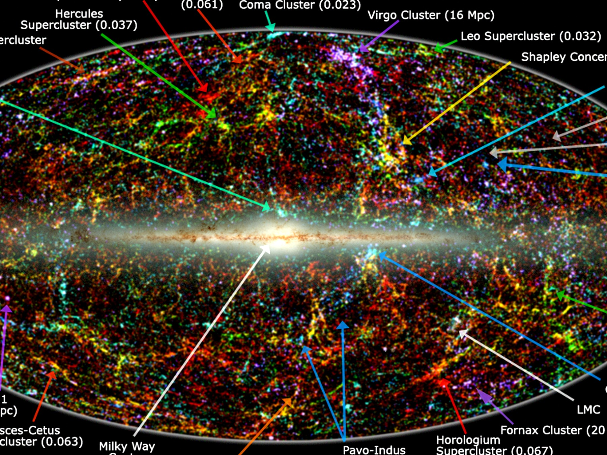

Barrow’s habit, useful here, was to walk you up to a large number and then refuse to call the number a destiny. The web is a large fact. It is not a plan. Mixmaster is a large fact about a kind of ending we do not appear to be headed for. It is not a control panel.

The mixmaster, named for a kitchen mixer because the axes of a collapsing universe would stretch and squash in a chaotic rotation, is Belinski, Khalatnikov, and Lifshitz: BKL. Near a spacelike singularity — a place, Chapter 24's proper subject, where the loaf tears and the equations stop describing what happens next — the generic behavior in general relativity is not a polite, spherical crunch. It is an oscillation of shapes, sensitive to the last decimal, a Lyapunov nightmare. Barrow proved things in that vicinity that matter for anyone who wants a last moment to be a steering wheel. Nearby starts become unrecognizable rooms. A civilization of perfect computers would not find a handle. The geometry would melt the handle.

Picture a collapsing room whose walls do not approach you together. One axis crunches while another stretches, then they trade, then they trade again, the sequence sensitive to the last decimal of the starting shape. That is Mixmaster, Bianchi IX in the jargon, a kitchen mixer beating a dough that is the geometry itself. BKL argued this is generic: not a special, spherical collapse, but the thing Einstein’s theory wants to do when a spacelike singularity is approached. Barrow took that generic chaos seriously enough to ask what a final intelligent observer could still control. The answer, in the vicinity of those proofs, is: almost nothing, unless you add extra structure the known laws do not hand you. Ideas for ideas can add the structure. Data have not.

At the end, if there were a crunch, the same family of sensitivity would be a theft. Tiny differences near a final singularity would be amplified until no one, not even a civilization of perfect computers, could steer. That fact will matter when someone tries to sell you a required Omega Point: a last moment in which mind takes the controls and computes forever. Chaos at the crunch is not a control panel. It is a warning that control panels melt.

Chapter 19 will finish that sale’s refusal on other grounds: the shove is winning, the bombs of 1998 are not a crunch track. Even in a universe that *did* crunch, BKL plus Barrow would still be waiting at the far end with a scrambled mixer. Forever-mind fails twice. Once because the data do not crunch. Once because a crunch, if you had one, would not be a computer. Do not let the Omega Point borrow this chapter as a mood. It is a mechanism. The mechanism is unkind to steering.

In the middle — which is where we live — chaos is why forecasts have horizons. We can reconstruct the three minutes because the soup was mixed and the laws were simple. We cannot forecast a galaxy’s weather in year 10¹². We can forecast the stretch. The stretch, with dark energy in the budget, looks dull and huge. Dull and huge is a kind of mercy. The web freezes in place as the shove between filaments wins. Galaxies go dark on their own clocks. The engine that built them idles.

Weather versus stretch is the distinction worth taking home. Weather is Lyapunov’s child: a breath here, a different storm next week. The stretch is not that kind of forecast. The Friedmann equations, fed a budget of pull and shove, do not forget their nearby starts on a weather clock. They tell you the dough will keep rising, and, with the shove in the account, rising faster. You can be wrong about the second digit of the Hubble number and still be right that the voids will get ruder. You cannot be a little wrong about a hurricane’s seed and still be right about next Tuesday. Do not confuse the two clocks. One is why you pack an umbrella. The other is why the cosmic web is a fossil in progress.

A kitchen radio that promised you Tuesday’s rain from Monday’s steam would be lying by Wednesday if the Lyapunov time had already run out. A cosmology that promised you the leftover glow from the three minutes is not lying: the soup was mixed, the laws were simple, the clock was short and hot. A cosmology that promised you the weather inside a particular spiral in year 10¹² would be the radio. The stretch forecast is closer to the soup than to the rain. Dull and huge, as the earlier paragraph said. Mercy, if you like mercy. A fossil, if you like fossils. The web we map with SDSS and 2dF is the baking caught mid-loaf. The shove will finish the bake by stretching the tins apart until no new filaments form. That end of the engine is Chapter 18’s personality change. This chapter’s personality is the engine itself.

Barrow would have called the Omega Point an idea for ideas and then, if he were in a kind mood, walked you to the mixmaster and let the mixer do the unkindness. Chapter 19 will do the data. Here the mixer is enough: crunch chaos is a second lock on that door. Nearby starts, unrecognizable rooms. No steering wheel survives the last decimals.

Keep chaos in the book as a tool, not a vibe. It made the rooms. It will not let anyone own the ending. It is the opposite of a watchmaker and the opposite of a destiny. It is what a twitch can do when the universe gives it time.

The dropped tray is still on the floor. Same ingredients. Different loaves. You live in one of them. The leftover glow is the photograph of the spill before the baking. The survey map is the photograph after. In between, gravity did what gravity does with a nick of size 10⁻⁵ and a lot of idle hours. That is an engine. It does not owe you a particular loaf. It owes you the family: webs, not destiny; sensitivity, not mood; a mixer at the far end that nobody steers.

If you want a last kitchen instruction: pick up the tray. Notice that picking it up does not unspill the yeast. The web is already baked into the surveys. The leftover glow is already on the antenna. Chaos, as an engine, has already done the morning’s work. What it will not do, tonight or in a crunch, is hand you a recipe that steers the last decimal. Barrow’s pebble, Guth’s unpaid bills, Mukhanov’s twitch, Linde’s next-room pot, and this dropped tray are one family of honesties. The universe is sensitive. It is not a mood. It is how rooms get made, and why nobody owns the ending.

\newpage

# PART IV — The Missing Most

---

\newpage

## 17. The Extra Pull

Dark matter is a terrible name. It sounds like a feeling, or a brand of chocolate, or the opposite of enlightenment. It is none of those. It is a pull we can weigh and cannot photograph in ordinary light.

Barrow, in the short origin book this one uses as a model, had a habit of refusing a pretty noun until a measurement had earned it. Dark matter has not earned a pretty noun. It has earned a scale. The scale is the extra weight in galaxies and in clusters: more pull than the shining stars and gas can account for, by a factor of several. The name is a confession. We weighed it. We have not bagged it.

In the kitchen you do not weigh a truck by climbing into the trailer and counting crates. You weigh it by how the bridge leans when the truck rolls on — by the strain gauges, the sag, the way the other traffic feels the extra. Dark matter is the trailer you cannot open. The bridge still leans. That is the whole method of this chapter, and it is why the extra pull is a hot fact even while the particle is a warm rumor.

In the 1930s, Fritz Zwicky timed the galaxies in the Coma Cluster and found them moving too fast. The visible stars did not supply enough gravity to hold the swarm. He said so, rudely, and was mostly ignored. In the 1970s, Vera Rubin and Kent Ford timed stars in the disks of spiral galaxies and found the same insult at a friendlier scale: stars out in the suburbs orbit as fast as stars closer in, as if most of the mass were in a big, dark halo, not in the shining bulge. The light is a liar about the weight.

The Coma paper is 1933, and the cluster is a city of cities: thousands of galaxies in a well so deep that, if you time them as Zwicky did, the virial theorem becomes a speed trap. If the members are this fast, the well has to be this deep, or the swarm would have flown apart long ago. The well was too deep for the starlight. The rudeness was not the problem. The problem was that nobody wanted an extra ingredient that did not shine. Extra ingredients are expensive. Astronomy in the 1930s was still finishing the argument about whether spiral nebulae were even other galaxies. An invisible majority was a second insult.

Rubin and Ford brought the second instrument down to a single disk. A rotation curve is speed versus distance from the center, a plot that Newtonian common sense said should fall once you leave the shining bulge. Their curves stayed flat. Flat is not a mood. Flat is *v* staying large while *r* grows, which, if gravity is still gravity, means *M* is still growing in the dark. They did this galaxy after galaxy, with a spectrograph and a stubbornness that later textbooks still under-thank. The suburban stars were clocks. The clocks did not slow.

What dark matter is *not*, while we are cleaning the noun:

It is not dark energy. Dark energy shoves. Dark matter pulls. They share a marketing department and nothing else.

Keep the divorce or the rest of this part will lie to you. The extra pull clumps. It makes halos. The extra shove does none of those things. Chapter 18 is the other spouse. Do not let a shared adjective fuse two ingredients.

It is not a black hole in the everyday sense, though a zoo of old, small black holes is a cold candidate people still kick. Ordinary black holes made from dead stars are not numerous enough, and we have looked.

Microlensing surveys have walked the Magellanic Clouds looking for the wink of a compact object passing in front of a star. They did not find a halo made of dead stars. A halo made of primordial pebbles of collapsed spacetime is still allowed by some papers and disliked by others. It is not the working fluid.

It is not the failure of our eyes. We have looked in radio, infrared, X-ray. The missing weight does not glow in those either, not as atoms would.

Atoms, given a chance, find a wavelength. The extra pull has had thirteen billion years of chances and has not found one we can tune a dish to. Hidden steam would have shown up as heat, as lines, as a fog in some band.

It is not a mood in the equations. The leftover glow’s freckles have a pattern that, when grown by gravity, matches a universe in which most of the pulling-stuff does not collide with light. Atoms slam into photons in the early plasma and leave a different signature. The extra pull did not slam. It is *non-baryonic* in the jargon: not the protons-and-neutrons club. Appendix A17 says that more carefully. Here: it is a different ingredient, not hidden steam.

The leftover helium of Chapter 10 already counted the baryons. There are not enough of them. You cannot hide the extra weight in more hydrogen that forgot to shine. The nuclear minutes already took inventory. The leftover glow’s odd and even acoustic peaks take the same inventory a second way. Two fossils, two methods, one minority of atoms. The extra pull is the difference between that minority and the weight the clocks and the arcs demand.

Candidates have names that sound like card games. WIMPs: heavy, shy particles that would leave a rare cough in an underground tank. Axions: wisps from an old fix to nuclear physics, convertible into photons in a magnetic field if you listen with a sufficiently obsessive radio. Sterile neutrinos: a shy cousin of the neutrinos we already know. None of them has been caught in the act. The tanks have gotten very quiet. XENON, a vat of noble liquid under a mountain in Italy, listens for WIMP coughs and hears the Earth’s radioactivity and the Sun’s neutrinos and not much else. LZ, a larger vat in a South Dakota mine, does the same with a stiller ear. The radios have gotten very proud. The sky has not changed its mind about the pull.

WIMPs were the easy hope: weakly interacting massive particles, heavy enough to sit still on galaxy scales, shy enough to pass through a mountain, common enough that a ton of liquid xenon should, over a year, record a few recoils. The year keeps ending without the recoils. Axions were a patch Peccei and Quinn wrote for a problem in the strong force; if they exist at the right mass they can be the halo, and a magnetic cavity can try to turn them into a microwave whisper. The whisper has not arrived. Sterile neutrinos are a shy extra flavor that would not join the usual weak interactions; some recipes make them cold enough to scaffold galaxies, some make them warm enough to erase dwarf galaxies we can still see. None of the three has been caught in the act. That silence is a scientific result, not a failure of nerve. A WIMP at the mass and interaction strength that would have made the tanks cough by now is, to a first approximation, not there. The window has not slammed shut on every mass. It has slammed shut on the masses that were supposed to be easy.

Modified gravity — change the law instead of adding an ingredient — still has clever friends. It has a harder time with clusters, with the leftover glow, and with the Bullet, where two kinds of stuff have been caught in the act of *not staying together*. The working theory is an extra ingredient. The working theory has a hole in it the size of a noun. That is allowed. Chemistry once had a hole named “what is fire.” The hole was not a reason to deny the flame.

MOND, and the relativistic clothes it has tried on, can mimic a flat rotation curve in a lonely disk with a tweak to Newton at low accelerations. A lonely disk is not a colliding pair of clusters. If gravity itself were simply stronger on large scales, the slammed gas and the extra weight would still sit on the same map, because they would be the same map. They do not. Some papers try to dress modified gravity so the offset still happens. The try is allowed. The try has not become the working theory. Barrow would have walked you to the photograph, named the extra ingredient, and then said the noun is still an idea for a laboratory, not a trophy.

How do you weigh something that refuses to shine?

You watch what it does to things that do. Galaxies lean. Clusters lean. The leftover glow rang like a bell, and bells remember what was pulling on them.

Rotation curves are the suburban clocks: stars and gas, timed in their orbits, going too fast. Gravitational lensing is the more theatrical trick. A cluster’s weight bends spacetime, and the bend makes multiple, stretched images of galaxies behind it — arcs, crosses, rings. Count the arcs, measure the stretch, and you have a scale. The scale disagrees with the starlight by a factor of several. The disagreement is the extra pull.

Weak lensing, which does not make a full arc, still shears the background into a statistical lean. Stack enough galaxies and the lean is a map. Strong lensing is the theater. Weak lensing is the survey. Both weigh the trailer by the bridge. Neither needs the crates to glow.

The leftover glow offers a third scale. The freckles are a sound. The sound has harmonics, like a bell. The position and height of those harmonics depend on how much ordinary matter was slamming into light, and how much quiet matter was only pulling. The bell says: a little slamming stuff, a lot of quiet stuff. The numbers line up with the clocks and the arcs. Three instruments, one extra weight.

Before atoms formed, the plasma could ring: photons and baryons slamming, compressing, bouncing, while the extra pull sat in the wells and did not slam. Odd peaks versus even peaks are a baryon census. Peak positions are a total-matter census. A single method can lie. Three methods, of different families, lying in the same direction, is a courtroom. That is why this chapter’s first sentence is hot even though the last noun is missing.

Then there is the Bullet.

The catalog name is 1E 0657-56. In 2006, Clowe and colleagues published the map that made the argument visual even for people who dislike maps.

Two clusters have passed through each other. The gas — atoms, shining in X-rays — slammed, shocked, and lagged in the middle, the way two crowds trying to walk through each other get stuck at the doors. The extra pull, mapped by lensing, did not slam. It went on through, like two ghosts politely declining to notice they had overlapped. In the famous color posters, gas is pink and mass is blue. On a Kindle those posters lie. Figure 17 is one composite: the slammed gas labeled where it piled up, the mass labeled where lensing put it, same scene. The contours do not sit on the gas. That is the photograph of “not atoms.”

If you wanted modified gravity to swallow the extra pull, this is the exhibit it has to explain without an extra ingredient that can leave the gas behind. The gas is most of the shining baryons in the cluster. After the crossing, the gas is in the middle. The lensing mass is not. Collisionless stuff goes on through. Collisional stuff sticks.

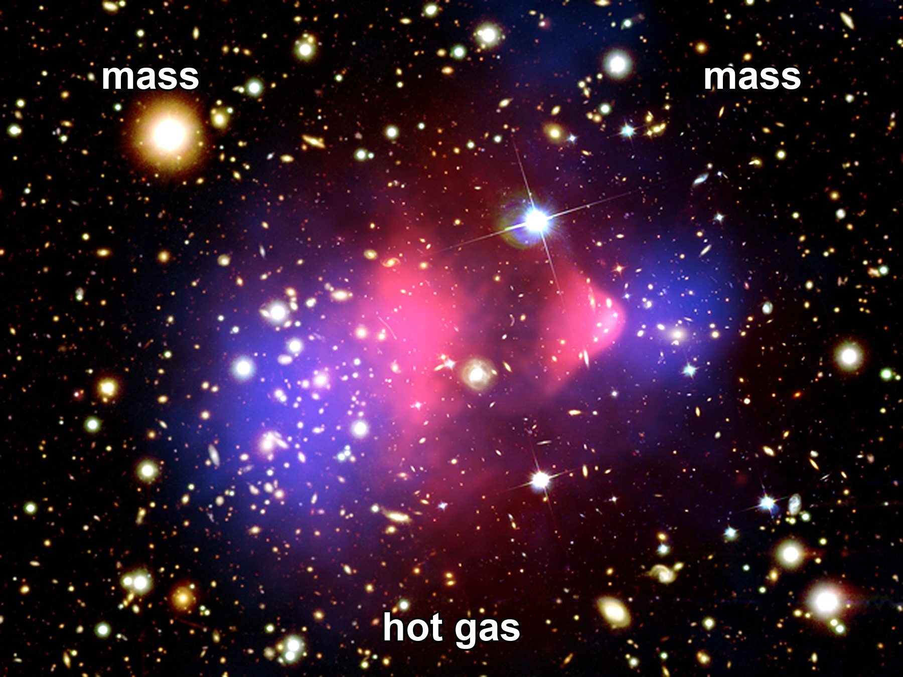

Hot claim: there is more pulling-stuff than shining-stuff, and the extra stuff does not collide the way gas does. Warm claim: it is a particle we have not bagged, or a small zoo of them. Cold claim: we know its name, its mass, and which underground tank will cough first. We do not.

The extra pull is why galaxies are not just pretty. It is the scaffolding they grew on. Without the quiet halos, the twitches of Chapter 14 would have had a harder time becoming spirals before the stretch pulled the scaffolding out of reach. You live in a suburb of a ghost.

The baryons, left to themselves, would have been a thinner foam. The quiet wells were already there, grown from the same freckles, and the gas fell in. The scaffolding is not a purpose. It is a head start. Gravity ran on noise in the dark wells first; the shining disks are late tenants. The ghost is an ingredient, not a destiny, and not a synonym for the shove. It owes you a weight. The weight is on the bridge. The trailer is still locked.

---

\newpage

## 18. The Shove

In 1998 two teams of astronomers, racing each other with dying stars, found that the stretch is not sulking. It is speeding up.

Saul Perlmutter’s Supernova Cosmology Project, and the High-Z team of Adam Riess and Brian Schmidt, were doing the same rude job: hunting Type Ia supernovae far enough away that their light had been in transit for billions of years, and asking whether the stretch had been tiring the way gravity said it should. Two teams, two pipelines, one sky. That is how you keep a shared mistake from dressing up as a discovery. In 2011 the three of them shared a Nobel Prize for the answer. The answer was no. The stretch had been getting a second wind.

The dying stars were Type Ia supernovae, a kind of standard bomb: a white dwarf that reaches a bad weight and detonates with a brightness you can almost trust. Trust the brightness, measure how faint it looks, and you have distance. Measure the stretch of its light and you have the universe’s size when it exploded. Plot size against time for bombs going off over the last several billion years and you expected, if you were educated before 1998, a slowdown. Gravity pulls. Stretching should tire.

The bombs were too faint. They were farther than the tired-stretch story allowed. The stretch had *accelerated*. Something was shoving.

Acceleration, in the kitchen, is not a galaxy putting its foot down. A raisin does not gun an engine. The dough between raisins changes its mind about how fast to rise. The plot of distance against stretch, once it is corrected for the way candles look faint, tips the wrong way for a tired universe. Gravity is still pulling inside the raisins. Between them, the budget has a term that does not thin, and that term has started to win.

A Type Ia is not a random firework. It is a white dwarf — a dead star’s leftover ember, about Earth’s size and the Sun’s mass — stealing matter from a companion, or merging with another dwarf, until it crosses a mass where electron degeneracy can no longer hold it. The explosion is nuclear and brief and, after you calibrate the way the light fades, nearly the same candle each time. Nearly is doing a lot of work. The teams spent years arguing about dust, about evolution, about whether a candle at redshift one is still the candle you calibrated nearby. The argument did not eat the result. Later candles, better calibrated, still sit too far away. That is how a hot claim is born: not from a press conference, from a result that survives the people who wanted it to be dust.

The simplest shove is a cosmological constant: an energy that comes with empty space itself, a tension Einstein once put in to freeze the universe and then regretted. The vacuum, in quantum field theory, is allowed to have a cost. The cost it *should* have, if you naively add up the jitters of every field down to the Planck scale, is off by a number so large it has become a joke: 10¹²⁰, give or take a few zeros. The measured shove is tiny. The predicted vacuum is a monster. This is the worst prediction in physics if you are in the mood to be rude, and one of the deepest problems if you are not.

Einstein wanted a static loaf. The constant was a fudge to hold the raisins still. When Hubble’s stretch showed the raisins were not still, he called the fudge his blunder. The sky, seventy years later, hired the blunder back — not to freeze the loaf, but to speed the later rise. Barrow liked numbers that make a kitchen feel small. This one makes the kitchen feel like a rounding error that somehow landed on a habitable decimal. If the vacuum energy were even a few orders of magnitude larger, galaxies would not have had time to assemble before the shove tore the wells apart. Weinberg said that out loud in 1987, as an anthropic upper bound, before the bombs had voted. The bombs voted near the bound. That is either a clue about an ensemble of vacuums — Chapter 15’s rumor — or a coincidence we have not earned the right to spend. Warm either way. Not a photograph.

Dark energy is the placeholder name for the shove. It might be Einstein’s constant. It might be a field that changes slowly, a “quintessence,” which is a word that sounds like a perfume and behaves like a maybe. It might be a mistake in how we read distances. The last option has been losing for twenty-five years. The leftover glow, the baryon acoustic oscillations — a leftover sound-scale printed in the way galaxies cluster — and the bombs now tell the same story. About two-thirds of the budget is the shove.

Quintessence would have an equation of state *w* that can wander a little. Einstein’s constant sits at *w = −1* and does not wander. The data, as of the kitchen date of this book, sit at *w ≈ −1*. That is a measured shrug in the direction of the constant, not a proof that the perfume is empty. A *w* that later turns around and becomes a crunch is still a cold loophole. It is not the working fit. The working fit is a shove that looks, to the present instruments, like empty space with a tiny, stubborn cost.

The sound-scale is worth a kitchen minute. In the plasma of Chapter 9, baryons and photons rang together. When the fog lifted, the ringing froze. The frozen wavelength is a ruler about 150 megaparsecs long, comoving — a stick you can still lay across the clustering of galaxies today. That is BAO: baryon acoustic oscillations. It is not a bomb. It is a leftover chime. Lay the ruler at different redshifts and you measure how the stretch has been behaving, *H(z)*, the Hubble rate as a function of how much the universe has grown. Appendix A18 writes the Friedmann line for the case *w = −1*:

*H²(z)/H₀² = Ω_m (1+z)³ + Ω_r (1+z)⁴ + Ω_Λ + Ω_k (1+z)²*

Matter thins as the cube of the stretch. Radiation thins as the fourth power. A cosmological constant does not thin. That is the whole plot twist in one line: at late times the thing that does not thin takes over, and the stretch accelerates. Acceleration, in the data, begins around redshift 0.6 — a few billion years ago. The last part of the bake is the fast part.

It does not clump. It does not make halos. It does not sit in the Bullet. It is not dark matter in a hat. If you take nothing else from this chapter, take the divorce: pull and shove are not a couple.

The extra pull is scaffolding. The extra shove is a later wind between the scaffolds. You can live in a suburb of a ghost and still be carried apart from the next suburb by a dough that has started to hurry. The marketing department will keep printing “dark” on both bottles. The kitchen will keep two spoons.

Once the shove is in the budget, the future changes personality.

Without it, you still had a fight between pull and stretch. Enough atoms-and-ghosts and the universe might someday stop expanding and fall back. Too little and it would stretch forever, tiring, thinning, cooling. The knife-edge of Chapter 12 was, in part, a knife-edge of fate.

With the shove, the fight is already over, unless the shove itself is a liar that will someday switch sides. The stretch accelerates. Isolated lumps — galaxies, bound clusters — remain bound. Between them, space wins and keeps winning. The cosmic web freezes. New filaments stop forming. The voids get ruder.

A second-digit fight has been making the newspapers, and it should not be allowed to steal the first digit. Local candles and nearby geometry — Cepheids, nearby Type Ia, a geometric trick with water masers — want a Hubble constant a little larger than the leftover glow prefers, once the glow is grown forward with the working model. Planck’s sky, read through the shove and the extra pull, likes a slope near 67 kilometers per second per megaparsec. Some local ladders like 73. That is the Hubble tension. It is a real argument among careful people. It is an argument about the slope *now*, about whether we have misread a candle or missed a late-time wrinkle. It is not an argument that the stretch is not accelerating. Both camps still need a shove. The bombs are still too faint. The 150-megaparsec ruler still says the late bake sped up. Do not let a fight about the second digit become a rumor that 1998 did not happen.

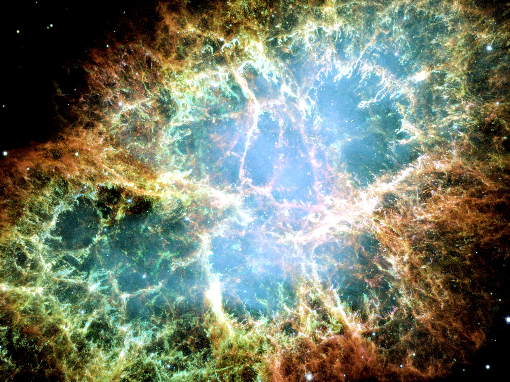

Appendix A18 writes *H(z)* and the distance-redshift relation. Here is the kitchen version. Imagine a raisin bread that not only rises but starts rising faster in the last part of the bake. The raisins that are already touching stay a family. The raisins that were only neighbors become, in time, rumors. The early bake was the pull’s era: matter thinning, stretch tiring. The last bake is the shove’s. You can feel that as a change in the dough without ever naming a field. *H(z)* is only the baker’s clock for how fast the pan is growing at each stage.

That is bound versus unbound in a loaf whose yeast has found a second wind. You, in a galaxy, are inside a raisin. The next cluster over may still be family. The next supercluster is already practicing being a rumor. The kitchen mistake is to think the raisins themselves are swelling. Bound things hold. The dough between the unbound is what hurries.

This is why a required Omega Point — a final crunch in which life steers the universe and computes forever — fails as physics, not as poetry. Poetry can crunch whatever it wants. The bombs, the leftover glow, and the frozen sound-scale say we are not on a crunch track. The next pages put shoes on that sentence.

A detail for later travel: the accelerating stretch makes a *cosmic event horizon*. There are galaxies whose light, emitted today, will never reach us, and there are galaxies we now see whose future light never will. Most of the universe has already left, not by walking away, but by the dough rising too well. Chapter 26 is the map. Chapter 18 is why the map is not optional.

A horizon of this kind is not a black hole. It is a fact about which events can still be connected by light in a loaf that keeps hurrying. The kitchen clock cannot hold it. The kitchen clock never could. If the shove stays near *w ≈ −1*, the map gets ruder with time: more of the web leaves the set of events that can still answer a signal. That is not despair. It is a reason to keep the word *now* local, and a reason Chapter 26 has a job.

Hot claim: the expansion is accelerating. Warm claim: a cosmological constant, or something that looks like one, is the shove. Cold claim: we know why the shove is the size it is. We do not. The worst prediction in physics is still on the board.

---

\newpage

## 19. Why Forever-Mind Does Not Follow

Frank Tipler, working from a book he wrote with Barrow, described a final state in which the universe recollapses, intelligent information-processing takes the controls, the amount of computation diverges, and this last, infinitely clever moment is — he was not shy — God. He called it the Omega Point. He said the known laws require it. He said life must never die out.

The book was *The Anthropic Cosmological Principle*, 1986, a thick, serious, sometimes dazzling inventory of how the constants look arranged, followed by a last act that stopped being an inventory. Barrow’s name is on the cover. Barrow’s later habit, in the short origin book, was the one this chapter will keep: walk you up to a speculation and then call it an idea for ideas. Tipler kept walking. He later wrote a thicker popularization in which the last computation wore the noun more openly. The Omega Point is what you get if you let an idea for ideas put on a lab coat and then a mitre.

The known laws do not require it. The data have been voting no since 1998.

A crunch needs the pull to win. The shove is winning. For the Omega Point to be a destiny rather than a story, the shove would have to fade, reverse, or be a mirage. None of those is the working theory. A story can still imagine a different bubble, a different branch, a later surprise in the vacuum. A destiny cannot hide in a surprise. Destiny is supposed to be what the laws demand. The laws, plus the bombs — the Type Ia supernovae of Chapter 18, not weapons — demand a long, thinning, accelerating future, not a steered collapse.

Here is the kitchen version, and it is ruder than a diagram. Imagine a will that names destinies the bank account cannot pay. The will is eloquent. It leaves the house to a dynasty, the orchard to a school, the future to a mind that never sleeps. Then you open the ledger. The shove is two-thirds of the budget. Recollapse is not in the data. The will is still a document. The bank is still empty of that particular future. You do not get to call the will a law of physics because the prose was confident.

Perlmutter, Riess, and Schmidt did not set out to probate a metaphysical estate. They set out to weigh the stretch. The estate failed anyway. A required forever-mind needed the loaf to turn over. The loaf tipped up. Twenty-five years of leftover glow, of the 150-megaparsec ruler, of later candles, have not put recollapse back on the working track. Warm loopholes remain — a *w* that turns around, a vacuum that decays, a different bubble. Spend those as destinies and you have left the data for a story. Chapter 18 already said the story is allowed. Destiny is not the word for a loophole.

Barrow himself, in the short origin book this one uses as a formal model, had a better habit: he would walk you up to a speculation and then call it an idea for ideas. The Final Anthropic Principle — intelligent processing must arise and must never die out — is an idea for ideas that put on a lab coat. Martin Gardner made a joke of the acronym. The joke was unkind. The data have been unkinder.

In the 1986 book the Final Anthropic Principle is stated as a requirement, not a hope: observers come into existence, and once they do, they persist. That is FAP. Gardner, a working skeptic with a magazine column and no patience for cosmic last acts dressed as theorems, suggested that a principle which *demands* eternal observers deserved a cruder expansion of the letters. He did not need the 1998 bombs. He needed only the difference between a condition we observe from — we are here, therefore the universe is the kind of place that can have a here — and a commandment that we must remain. The first is the weak anthropic cut, a likelihood filter, useful once you have an ensemble. The second is a wish with a Latin name. Chapter 41 will give the filter its honest job. Here the job is simpler: FAP is not selected by the leftover glow, the leftover helium, the extra pull, or the extra shove. It is selected by a desire that the story not end without a speaker.

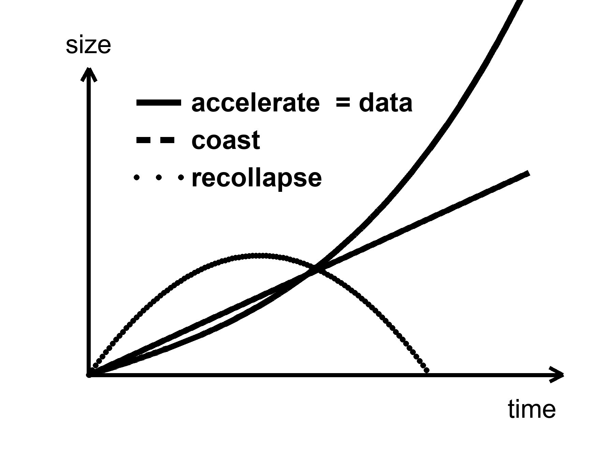

Look at the figure until it is boring. Recollapse is a curve that turns over. Coast is a curve that tires. Accelerate is a curve that tips up. The data sit on the one that tips up. Appendix A19 writes the same sentence with density parameters: observed matter about 0.3, observed shove about 0.7, deceleration parameter negative. Closed, matter-only recollapse needed a universe heavier than the critical density and no lasting shove. We are not that universe. The working fit is the accelerating curve.

Barrow would have made you sit with the figure before he let you talk about God. Three line styles, one of them marked data. The temptation is to treat the other two as equally live options, the way a menu treats three dinners. They are not equally live. Recollapse was the dinner the 1986 last act needed. The kitchen is not serving it. An idea for ideas may still draw the turning-over curve. A destiny may not.

Chaos, from Chapter 16, is the second objection, even in a universe that *did* crunch. Near a final singularity — the same wall Chapter 16 named and Chapter 24 properly explains — the mixmaster scrambles. Steering requires control. Control requires that nearby futures stay nearby. They do not. Infinite computation in a dying crunch is a wish that the geometry be a computer. Geometry is not that polite.

This is the objection that would survive a miracle. Suppose, against the bombs, the shove later faded and the loaf turned over. Suppose a civilization of perfect machines was ready with a plan. The plan still has to steer a geometry that, near the end, swaps its axes the way a chaotic kitchen fire swaps which pan is hottest. You cannot cook a required last thought on a stove that will not hold a setting. FAP said life must never die out. BKL says that even a dying crunch is not a stove you can borrow. The first objection is the data. The second is the shape of Einstein’s ending, crunch or no crunch.

Belinski, Khalatnikov, and Lifshitz — BKL, in the jargon — showed that a generic spacelike crunch in Einstein’s theory does not approach a polite point. It approaches a sequence of Kasner eras: squash in two directions, stretch in one, then swap, then swap again, the axes changing in a way that is chaotic. Barrow proved things in that vicinity about how little control you get. Say that again without the names, because the names can sound like a priestly veto. If the loaf recollapses, the last slice is not a quiet room in which a civilization of perfect machines can store more and more bits in less and less space. The last slice is a scramble. Tiny differences become different universes of shape. A steered crunch to a single, infinitely processed point is a measure-zero demand unless you add extra structure by hand. Extra structure by hand is not “the known laws require it.” Extra structure by hand is a story.

Tipler needed a recollapse, a cosmology that could be forced toward a point, a way to dump unlimited energy into unlimited computation, and a reading of God as that last computation. Each of those is a cold brick. Stacked, they are a chapel. This book will not bless the chapel. It will also not sneer at the hunger that built it. People want the story to have a speaker at the end. The leftover glow does not hire speakers. The Bekenstein count of Chapter 23 will later make the bit-budget ruder still: shelf space likes area, not a vanishing volume asked to hold an infinity. The first objection does not need that count. The first objection is the shove.

None of this says mind is small. It says mind is not a clause in the gravitational field equation. If we want mind to last — in machines that do not sleep, in libraries of Earth sent to dark seas under ice, in a greenhouse on a dead world — that is a project. Projects can fail. Destinies, if they are real, cannot. The distinction is the moral of this book’s second half. Meaning, if you want it, is local, expensive, and optional. The leftover helium does not care. The leftover glow does not care. The shove does not care. That is why a greenhouse is interesting. It is a care that the universe did not budget for.

The greenhouse is a thought with dirt on it: someone, somewhere, keeping a volume of air at a temperature a plant can use, on a world the shove and the pull did not arrange for gardening. The hours are still hours. The failure modes are still failure modes. The universe did not set aside a line item. The line item, if it exists, is us, locally, for a while. That is not a blessing of forever-mind. It is the opposite. Forever-mind was the claim that the field equation would staff the garden. The field equation staffs a stretch. The garden, if it happens, is overtime.

Meaning, in this book, is that overtime. It is not a clause that appears when the scale factor is large. It is a woman checking a valve, a library that can fail in a fire, a melt-probe that can miss the sea. The leftover helium will still be a quarter by mass if the valve sticks. The shove will still be two-thirds of the budget if the library burns. That is not a scolding. It is why the care is interesting. Care that the cosmos already budgeted for would be weather. Care it did not budget for is a project.

A will that names a forever-mind is the same document as FAP in a more theatrical font. The bank account is the energy budget and the stretch. The bank will pay galaxies that stay bound, stars that finish their fuel, holes that leak on clocks we will not live to read, a leftover glow that thins, a web that freezes. It will not pay a required last computation. You may still write libraries. You may still staff a greenhouse. You may still send a melt-probe into a dark sea. Those are checks you write on a local account. They clear, or they bounce, in kitchens. They do not clear because the cosmos owes you a dynasty.

Hot claim: the working cosmology is not a recollapse. The bombs, the leftover glow, and the frozen ruler say the stretch is accelerating. Warm claim: the shove will keep behaving like a cosmological constant, *w ≈ −1*, long enough that the web freezes and most worldlines never meet again. Cold claim: mind is scheduled to take the controls and compute without end. That claim is not selected by the data. It is a will the ledger cannot honor.

Forever-mind does not follow. What follows, if you want a moral from a budget, is smaller and ruder and better: meaning is a local project, or it is not a project at all. The universe did not budget for it. That is the permission. It is also the bill.

\newpage

# PART V — One-Way Membranes

---

\newpage

## 20. A Horizon Is a Fact About Events

A black hole is not a cosmic drain with a personality. It is a one-way membrane in the loaf.

Pick an event — a flash of light, a last radio beep, the moment a clock’s hand ticks. From that event, some future events can still be reached by a signal that never exceeds light. Some cannot. The boundary between those two sets, when gravity has bent the loaf enough, can close on itself. Inside, every future of every event leads deeper. Outside, you can still choose. The closed boundary is the horizon. It is not made of a material. It is made of *facts about which events can influence which others*.

That sentence is the whole chapter, if you let it sit. A horizon is not a black wall, not a hungry mouth, not a place you could chip with a hammer. It is a sorting of the loaf. Chapter 3 already gave you the tool: from any event, a future light cone of things you can still affect and a past cone of things that can still affect you. In ordinary space those cones stay open. Near a sufficiently compact mass they tip and close. Cross the closed surface and Earth’s worldline is no longer in your future cone. You can still be in Earth’s past cone for a while — as a signal, as a photograph, as a last beep. The asymmetry is not a mood. It is geometry.

This is a different object from the *cosmic* event horizon of Chapter 26. That one is a fact about the whole loaf’s later stretch: galaxies whose light, emitted today, never arrives. This one is local. A star collapses. A membrane forms around a clump. Most of the universe does not notice. Do not blur the two just because both are called horizons. One is a weather of the expanding dough. One is a fact about a compact mass.

We knew the local kind was real before anyone made a picture of a shadow. In the 1960s and 1970s, X-ray telescopes found binaries in which a visible star whipped around an unseen compact partner too heavy to be a neutron star. Cygnus X-1 was the rude prototype: a blue giant, a dark companion of more than a few Suns, gas screaming in X-rays as it lost an argument with an orbit it could not leave. The case was circumstantial and then it was not. No other object that heavy and that small holds itself up. The membrane was inferred the way a well is inferred from a missing bucket and a splash you cannot retrieve. The later pictures did not invent the well. They stopped the argument about whether the splash was a mood.

Karl Schwarzschild, in 1916, found the first exact hole in Einstein’s equations while dying, more or less, on the Eastern Front. He was an artilleryman as well as a mathematician. Between trajectory tables he took Einstein’s new field equations, assumed a mass that did not spin and did not charge, and found a clean solution Einstein had not yet written down. He posted the result to Berlin. Einstein read it to the Prussian Academy. Schwarzschild was dead by May, of an illness the war had not invented but had not helped. The radius that now carries his name is

*r_s = 2GM / c²*

*where G is Newton’s constant, M is the mass, and c is the speed of light.*

The formula is not a decoration. It says how small you must squeeze a mass before the membrane forms. Double the mass, double the radius. The speed of light sits in the denominator as a square, which is why everyday objects have absurdly tiny horizons and stars have horizons you could, in a dark mood, walk across. Appendix A20 writes the line and notes that the horizon is a coordinate scare, not a curvature scare: invariants stay finite there. The singularity, later, is the place the theory actually breaks.

A fact about events can still have a radius. That is the useful shock. The sorting of cones happens at a place you can write in kilometers, or millimeters, once you know the mass. For a stellar hole of ten Suns the radius is about thirty kilometers — a city you could hide under a cloud. For Sagittarius A* it is about twelve million kilometers, a good fraction of Mercury’s reach. For M87* it is tens of billions of kilometers, a solar system of darkness. None of those numbers is a wall. Each is the distance, in Schwarzschild’s labels, at which “you can still send a letter home” stops being true. The labels misbehave at that surface; the facts do not. Light aimed outward from just inside never arrives. Light aimed outward from just outside can, if it is lucky and not circling the photon sphere forever.

For the Sun, that radius is about three kilometers. The Sun is not a black hole; it is much larger than its Schwarzschild radius, and proud of it. Squeeze the Sun into those three kilometers and the membrane forms. For Earth, the radius is about nine millimeters — a pea, not a city. For a mountain, it is smaller than a nucleus and we do not live in a cartoon. Nature does not squeeze mountains. Nature squeezes the cores of heavy stars. When the core can no longer hold, and the leftover is heavier than the two or three Suns a neutron star can bear, the membrane is not optional. It is what the equations do with that much mass in that little room.

For the object in the middle of the galaxy M87, the radius is comparable to a solar system. Six and a half billion Suns, packed so that the one-way surface is tens of billions of kilometers across. The Event Horizon Telescope did not photograph the membrane. It photographed the *shadow*: the silhouette of paths that could not escape, against a glowing ring of gas that still could. The picture was released in 2019. It is a radio mosaic from a planet-sized interferometer, not a snapshot from a tourist bus. In 2022 the same collaboration published the hole in our own cellar — Sagittarius A*, four million Suns, a horizon the size of a planetary orbit, flickering on the timescale of a coffee break. Andrea Ghez and Reinhard Genzel had already timed the stars that whip around that cellar, and taken a Nobel for the timing. The shadow was the picture that matched the clocks.

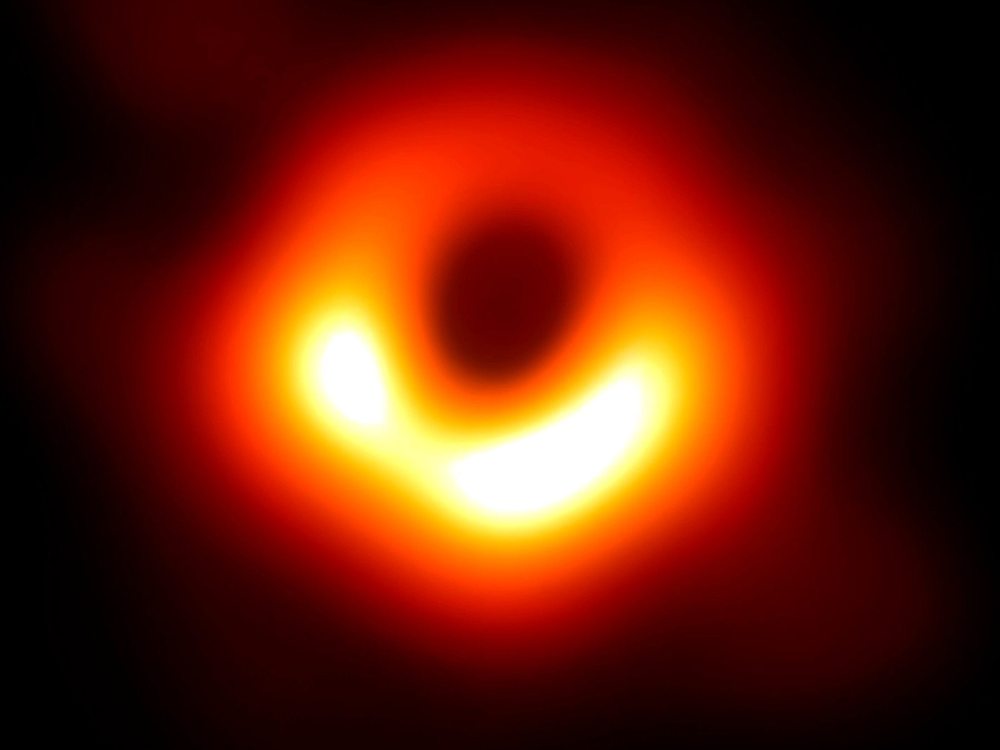

A woman at a console in 2019 — invented, as the How to Read promised; the ring is not — watched the press image load and said, to no one, “That’s a hole.” She was almost right. It is the *absence* of paths. Photons that grazed the photon sphere, a circle at one and a half Schwarzschild radii for a hole that does not spin, can loop and still crawl out to a telescope. Photons that aimed closer cannot. The dark patch is a census of failed escapes. The bright ring is a census of last chances. The membrane itself is not in the JPEG. It is a fact about events the JPEG is allowed to imply.

Hot claim: horizons of this kind exist. Stars orbit something compact and enormous in galactic centers. Mergers ring spacetime and LIGO hears the ring. The shadow is now a picture. On 14 September 2015 — a Monday, if you like kitchen calendars — a ripple passed through Hanford and Livingston, a few milliseconds apart, the way a fact about two colliding holes should. The event is called GW150914. Two holes, about thirty-six and twenty-nine Suns, finished a dance 1.3 billion light-years from this kitchen and became one hole of about sixty-two Suns. Three Suns’ worth of mass left as gravitational waves. For an instant the glow in those waves outshone, in raw power, every star we can name. The announcement came in February 2016. Since then the catalog has grown: more stellar holes, neutron-star pairs, a zoo of masses no optical telescope had weighed. The ringdown is the loaf settling after a slap. It is as close as we have come to hearing a horizon be a horizon.

Warm claim: inside the membrane, Einstein’s theory keeps going until a singularity, a place where the theory itself throws up its hands. The classical interior is a prediction of the same equations that got the shadow and the ringdown right. It is not a photograph. Cold claim: we know what replaces the singularity. We do not. Quantum gravity is a research program. Loop sketches try to bounce. String theory offers replacements — fuzz, a tangle of extra dimensions, a horizon that is not quite a horizon. **String theory cannot currently be tested.** A replacement that cannot be weighed is an idea for ideas, in Barrow’s honest sense, not a second picture to hang beside Figure 20.

The kitchen mistake is to think of the hole as an object you could poke. The useful thought is the membrane of events.

Imagine a last radio beep. A probe, invented, falls toward a stellar hole while a ship waits far out. The probe’s beacon is a metronome. At first the ship hears it on schedule, Doppler and all. Then the ticks stretch. Each beep arrives redder, then redder still, as if someone were pulling the wavelength the way Chapter 8 pulls galaxy light. The probe, by its own clock, crosses the membrane in finite proper time and keeps falling. The ship never quite receives a last tick. The signal fades, redshifts, and is lost in the noise. Earth can still include the probe in *its* past, for a while, as a redder and redder last beep. The probe’s future cone no longer includes Earth. That asymmetry is the whole joke and the whole tragedy. It is also why a hole is not a door.

A woman on the ship — invented; the redshift is not — sits with headphones and a log. She marks the frequency of each beep. 1.4 gigahertz. Then 1.2. Then a smear she has to argue with the noise about. She is not watching a drain swallow a box. She is watching a sequence of events lose the right to be heard. The probe’s last second, on the probe’s clock, still happens. It is a crumb in the loaf. It is not a crumb the ship is allowed to share as a contemporaneous tick. “Now,” which was already in trouble in the kitchen, has no job left at the membrane. There is the probe’s proper time, finite and doomed. There is the ship’s proper time, in which the last beep is an ever-redder rumor. There is no third clock that declares them simultaneous.

A drain in a kitchen sink is a poor metaphor and a useful one. Water goes down. You do not get the water back by staring at the hole. But a drain is a material, with a rim you can touch, and a plumber can reverse it with a snake. A horizon has no rim you can chip. There is no snake. The “down” is a fact about cones. Cross it and you have not entered a basement. You have left the set of events that can still send a letter home.

Barrow liked to shock readers with a number that fits in a teaspoon. Earth’s horizon is nine millimeters. The entire planet, squeezed to a pea, would wear a membrane you could hide under a thumb. We do not do that. Gravity, given a few dozen Suns in a collapsing core, does. The shock is not the cartoon. The shock is that the same formula that makes a pea out of Earth makes a solar-system-sized shadow out of M87*, and that both numbers are now, in different ways, measured.

So: a horizon is a fact about events. It is not a personality, not a drain, not a door. The next chapter parks a clock beside one and watches “now” come apart in a more intimate way. Chapter 24 will take the door away for good. Here, keep the beep. If you remember nothing else, remember that the probe’s last second is not a second the ship is allowed to share.

---

\newpage

## 21. An Hour Beside the Edge

Clocks run slow when they sit deep in a gravitational well. This is not a rumor from a story. It is why a clock on a rear truck bed, driven up a mountain and back, comes home younger by a number you can write on a grant application. It is why GPS, without corrections, would slide your map into a river.

The first clean tower measurement has a name and a height. In 1959 and 1960, Robert Pound and Glen Rebka sent iron-57 gamma rays up and down a 22.5-meter shaft in Harvard’s Jefferson Laboratory. Einstein’s 1915 theory said the photons that climbed should arrive tired — a gravitational redshift of a couple of parts in 10¹⁵. The experiment was a nightmare of vibration and recoil, fixed with a trick of moving the source so the Doppler wobble could find the gravitational shift. They found it. The well is not a metaphor. It is a measurable tax on light.

In October 1971, Joseph Hafele and Richard Keating put cesium clocks on commercial airliners and flew them around the world, eastward and then westward, against twins that stayed at the United States Naval Observatory. Special relativity said speed would slow the fliers. General relativity said altitude would hurry them. East and west swapped the balance because the Earth is already spinning under the planes. The clocks disagreed when they met again, by hundreds of nanoseconds, in the direction the two effects predicted. The kitchen clock on the wall, the one that pretends to be the time of the cosmos, lost a small, public argument on a 747.

GPS lives on that argument. The satellites orbit at about 20,200 kilometers. Their clocks, left uncorrected, would run fast by roughly 45 microseconds a day from the weaker gravity and slow by about 7 microseconds a day from their speed. The net, about 38 microseconds a day, is 10 kilometers of map error if you ignore it. The phone in your pocket is a daily demonstration that a well changes a clock. You do not need a black hole to believe Chapter 5. You need a constellation and a ditch you would rather not drive into.

What “slow” means, if we are being careful, is not that the lower clock is broken. It is that its worldline is shorter between two meetings. Proper time is mileage. A path that sits deeper in a well is a shorter path, the way a trail that cuts through a valley can be shorter than a trail that stays on the ridge, except here the “shorter” is time itself. Pound and Rebka measured the tax on light. Hafele and Keating measured the tax on clocks that flew and clocks that stayed. GPS spends the tax every second so your map does not drown. The black-hole chapter is the same tax, made rude. Nothing new is invented at the horizon except the size of the bill.

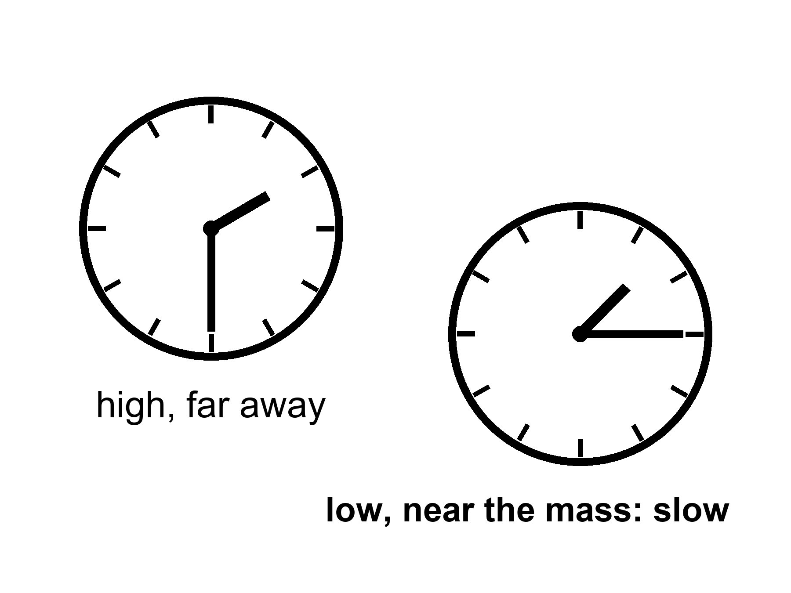

Near a horizon the same fact becomes rude. A clock hovering just outside, fighting with rockets to stay put, ticks slowly compared with a clock far away. An hour there can be years elsewhere. The numbers in posters — an hour for seven years — require a hole that is both enormous and spinning almost as fast as a hole is allowed to spin. Spin helps. A spinning hole, a Kerr hole, drags space with it and permits stable orbits closer in, where the well is deeper and the tides, for a given mass, are gentler. A supermassive hole can have an hour-beside-the-edge without spaghettifying the visitor. A stellar-mass hole would turn the visitor into a rumor of atoms before the hour was interesting.

Say the poster line out loud, then put a temperature on it. Warm claim: if you have a hole of millions or billions of Suns, spinning so close to the extremal limit that the leftover wiggle is a rounding error, and you park a station in the last orbits the equations still call stable, then an hour of proper time on the station can be years on a distant ship. Generic Kerr hole, generic orbit: the dilation is real and milder. Hours can be days. Days can be weeks. The seven-year postcard is a near-extremal special, not a brochure for every hole in the catalog. Appendix A21 writes the static factor *√(1 − r_s/r)* and notes how close to extremal spin the poster ratio really needs. Allowed is not the same as typical. Typical is not a holiday.

The innermost stable circular orbit — ISCO, in the jargon — is the last racetrack. For a hole that does not spin, it sits at three Schwarzschild radii. Matter in a disk can orbit outside that circle. Inside, it plunges. A Kerr hole, spinning, drags the loaf. Prograde orbits — going with the spin — can sit closer. In the extremal limit the last stable track crowds the horizon itself. That is why spin is not a flourish. It is how you get a station into a well deep enough for the poster, without asking the station to hover on rockets that would have to burn like a star. Even then the station is not comfortable. It is parked on a knife-edge the equations permit and astrophysics may not often build.

Frame-dragging is the grown-up name for the drag. A spinning mass pulls inertial frames around with it, the way a spoon pulled through honey pulls the honey. Lense and Thirring wrote the weak-field version a century ago; Gravity Probe B later measured a tiny twist of gyroscopes in Earth orbit and found the honey, faintly. Near a Kerr hole the honey is not faint. Orbits lean. Light leans. The last stable circle for a stone going with the spin can sit far closer than the last stable circle for a stone going against it. Accretion disks, the glowing junk that makes X-ray binaries and the EHT ring possible, live on those tracks. The woman in the station, if she exists at all, lives on one too. She is not hovering by brute force. She is falling sideways forever, on a rail the spin still allows. The rail is not a gift. Miss it inward and she plunges. Miss it outward and she is no longer in the poster well.

Tides are the other half of the honesty. The stretch across a body scales, near the membrane, as the inverse square of the hole’s mass. A ten-Sun hole, the sort LIGO hears, would pull your head from your feet before you had a philosophical thought about cones. Sagittarius A*, four million Suns, is gentler at its horizon; you could cross the membrane and still be a person for a while, which is not a kindness, only a delay. M87*, billions of Suns, has tides at the horizon that a human body would barely notice. The doom is the same. The itinerary of the doom is not. Do not confuse “the tides will not shred you at the door” with “the door is a place to live.”

Imagine a woman in a small station, parked in that close orbit, tending a rack of algae because someone still has to eat.

The station is the size of a bus that never learned to be a home. The algae live in clear sleeves along one wall, a green smear that bubbles when the pumps are honest. She checks the pH with a strip that stains her fingers. She eats a paste that was sunlight last month, then a smear, then a meal if you are not picky. The water tastes like the filter. The filter tastes like the last filter. There is a window, because the designer was sentimental, and the window shows a smear of lensed sky, a ring of light that is not for her. She does not go outside. Outside is a well.

Morning, by her watch, is a ritual with dirt on it. She bleeds a sleeve that has gone brown, dumps the dead green into a recycler that will pretend to be soil, and seeds a fresh rack because the oxygen budget is a number, not a vibe. The pumps click. A bubble sticks and she flicks the sleeve with a fingernail. This is the work. This is why she is here in the thought experiment: so the geometry has a person who still has to eat, not a tourist with a camera. The ship that sent her is a rumor with a call sign. The hole is not a view. The hole is a well she is parked in.

Her radio to a ship farther out is not just delayed by distance. It is delayed by *time*. She keys the mike and says “good morning” on a day her own log still calls Tuesday. The carrier crawls up the well. The ship hears it on a Thursday she will never have. The reply, when it comes, is already a conversation from a calendar she is not on. She is not time-traveling. She is accumulating less proper time between two meetings. Proper time is the mileage of her worldline, the number her watch is allowed to count. The ship’s worldline, higher on the same well, is longer between the same two reunions. The loaf did not rewind. Two worldlines of different lengths met again.

She keeps two logs because one log would lie. The station log is her proper time: sleep, pH, a paste that was algae, a Tuesday that belongs to her. The ship log, when the radio bothers to be kind, is a scatter of dates that skip. A maintenance window she was told would be “next week” arrives in her headphones as a report of a job already done. A birthday on the ship is a recording. She can answer the recording. She cannot attend the cake. “Now” is not a conference call. It is two mileages, and hers is the shorter.

She logs the algae. She sleeps. She wakes and the ship has had more hours than she has. If she stays a year by her count, the crew that sent her has had a different year — longer, grayer, full of Thursdays that were never hers. When she climbs back out, if the rockets and the orbits allow the climb, the ship’s crew has more gray in it than her mirror. She cannot take the extra years back. She can only have fewer of her own. This is the twin effect with a well instead of a rocket, and it is the only kind of “time travel to the future” relativity hands out for free. It is one-way in the human sense.

Do not book a ticket. This is not a resort and not a clinic. The station stinks of wet plastic. The radio is a stack of monologues, the way the greenhouse in Chapter 25 is a stack of monologues. The dilation that makes an hour into years is a near-extremal poster, not a civic plan. A person is a path, Chapter 5 said. A path that sits in a well is a shorter path. Shorter is not younger in the advertisement sense. Shorter is fewer of her seconds, spent on algae and a sky that does not belong to her. The book will not sell you a life beside a hole. It will sell you the geometry, and then it will send you back to the kitchen clock that was already lying.

Appendix A21 writes the dilation factor and the innermost stable orbit. Here, keep the two clocks. Keep the woman only long enough to feel that “now” was already in trouble in the kitchen. Beside the edge it is in ruins. She says good morning. Thursday answers. The casserole, if anyone still cares about casseroles, was done on a day she will read about and will not have lived.

---

\newpage

## 22. The Hole That Runs Backward

If you take a black hole and run the film of spacetime backward, you get a white hole: a membrane you can leave but never enter. Light can come out. Nothing from the outside can go in. In the full, idealized diagram of a non-spinning hole — the Kruskal diagram, which looks like a secret handshake and is, in the appendix, four rooms — there is a black hole region, a white hole region, and two exteriors that meet only at a throat that pinches.

The kitchen version is ruder and clearer. A drain you cannot leave is a black hole. A fountain you cannot enter is a white hole. Same plumbing laws. Opposite manners. You may stand in the yard and watch the spray. You may not climb the spray and hide in the nozzle. You may lose a spoon down the sink. You may not fetch the spoon by asking the drain to run in reverse. The laws of the water do not forbid a film played backward. The objects in a real kitchen do not offer you that film. Eggs smash. They do not unsmash. Horizons form. They do not, around us, unform into fountains.

Kruskal–Szekeres coordinates are the honest map of Schwarzschild’s solution once you stop letting a bad choice of labels pretend the horizon is the end of the world. Schwarzschild’s original labels — the ones that give you *r_s* as a clean number — blow up at the membrane the way a bad map blows up at the poles. Nothing physical explodes there. The labels do. Kruskal and Szekeres, independently, found labels that stay calm across the surface. The map has four rooms. One room is our exterior: the space far from the hole, the place LIGO lives, the place the woman in Chapter 21 might climb back to. Opposite it, on the diagram, is another exterior, a mirror region no probe of ours has a road into. Above is the black-hole interior, the room whose every future leads deeper. Below is the white-hole interior, the room whose every past comes from a membrane you cannot go in through. The four rooms meet at a throat — an Einstein–Rosen bridge, a pinch in the loaf. The pinch lasts, in proper time, no time at all that a traveler could use. Try to cross from one exterior to the other and the throat slams. The diagram is a maximal mathematical extension. It is not a floor plan of something nature built and left unlocked.

Walk the rooms once, slowly, because this is the place posters get drunk. Our exterior is ordinary spacetime with a hole in it, if “ordinary” still means anything. Light cones tip as you approach the membrane but still include a way out, until they don’t. Cross into the black room and every future cone points at the singularity. There is no “turn around.” There is no second knob. The white room is the time-reverse: every past cone comes from a singularity, and the membrane is a past horizon you can leave but never enter. The second exterior is a mathematical twin. It is not Andromeda. It is not a parallel kitchen. It is what the equations write when you refuse to cut the diagram in half. Nature, when it makes a hole from a collapsing star, does not appear to build the white room or the twin exterior. Collapse writes two rooms at most: an outside and a black inside. The other two are what you get if you insist on the whole, eternal, vacuum solution — a hole that has always been there, will always be there, and came with a fountain attached. Stars do not make that object. Stars make a membrane in one direction, in finite time, from matter that used to shine.

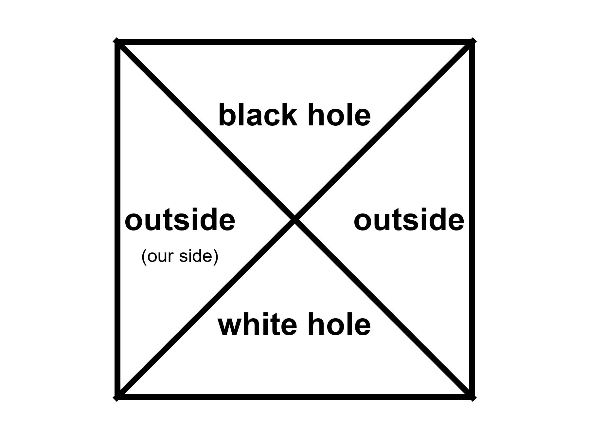

No one has ever seen a white hole. They are allowed as mathematics and unwelcome as astrophysics. They are unstable the way a pencil on its point is unstable. A speck of dust, a photon, a rumor of mass falling toward the past horizon ruins the fountain. Any stuff that tries to enter from the exterior cannot; that is the definition. Any stuff that is already in the white room must leave, and once it has left the fountain is no longer the clean vacuum solution you drew. The universe, as far as we can tell, makes membranes in one direction: collapse, inward, one-way in. It does not spray matter out of ready-made white fountains.

A woman at a kitchen sink — invented; the spoon is optional — watches the drain and then, through the window, a cheap yard fountain that the bulb has not yet burned out. The drain takes water that will not climb back. The fountain throws water she cannot stuff back into the nozzle. Same water. Same gravity. Opposite boundary conditions. She can imagine a film in which the fountain runs in reverse and becomes a drain, and a film in which the drain becomes a fountain. She cannot make either film happen by wishing. The laws she learned in school do not pick a direction. The kitchen does. The kitchen started with an ice cube in a tray and an egg in a shell and a yesterday that was tidier than today. That is the arrow, sitting in the initial mess, not in the plumbing.

Hot claim: black-hole horizons exist and we have weighed them, pictured their shadows, and heard them ring. Warm claim: the time-reverse solution sits in the same notebook and deserves a diagram. Cold claim: there is a white hole in the sky, or at the beginning of time, waiting to be photographed. There is not, on present evidence. There is a picture we can draw.

People like to say the Big Bang was a white hole. The analogy has a poetic muscle and a scientific limp. A white hole is a local object in a larger spacetime. The bang, as Chapter 7 insisted, was not a bomb in a warehouse. It was everywhere. You would not have stood outside a fountain and watched the universe come out. You would have been inside the soup, and so would every other direction. A hole is a place. The bang was a time — a hotter, smaller-spaced version of everywhere. You can draw pictures in which a bang looks, mathematically, like a time-reverse of a collapse. You can also draw pictures in which it does not. Oppenheimer and Snyder, in 1939, wrote the collapse of a ball of dust and got a black hole. Run that solution backward and you get an explosion out of a white membrane into a pre-existing space. That is not the Friedmann loaf. The Friedmann loaf has no outside, no pre-existing dark, no nozzle. The leftover glow is not a spray from a nozzle. It is a baby picture of a fog that filled the loaf.

Keep the nouns on their leashes. A white hole, if one existed, would have a mass, a location, a sky around it. The bang had a temperature, a leftover helium fraction, a glow in every direction. Those are different courtrooms. Mixing them is how a reader ends up asking what the universe exploded *into*, and then answering “a white hole,” and then feeling clever. The feeling is not a fossil.

Conformal cyclic cosmology — CCC, a cold idea — tries to glue a remote, empty future to a next bang with a conformal trick. When the universe is old and thin and almost empty of mass, the remaining massless stuff does not care about a scale. Photons, in a world with no massive clocks left, do not know how big the loaf is. Maybe that future can be rewritten as a beginning. Maybe bang follows bang, not by bouncing through a crunch, but by a rescaling that turns a dead, cold loaf into a new hot one. Its advocates have looked for rings in the leftover glow, scars of previous aeons. The claims are disputed. The idea is allowed to sit on the table. It is not a white hole in the sky. It is a maybe about the shape of the whole loaf. Call it cold and let it sit. Barrow would have walked you to the edge of the idea and then refused to sell it as a fossil. The fossils we have — the glow, the helium, the stretch — do not require a fountain and do not require a previous aeon. They require a hot, dense, expanding everywhere. Chapter 7 already held that courtroom. This chapter will not reopen it with a prettier noun.

A man in a kitchen — invented; the egg is real enough — cracks breakfast into a pan. The film of that event, run backward, is a lawful film in Newton’s mechanics and in Einstein’s, and in the quantum amplitudes that assign the bits of shell a chance. The backward film does not happen. The egg does not climb back into its shell. The reason is not that the membrane of a hole has a preference. The reason is the boundary: a low-entropy yesterday, a kitchen that started orderly, a universe that started hot and smooth enough to leave us a glow. Time-symmetric laws do not have to make time-asymmetric *objects*. Maxwell’s equations do not care which way the light goes, and still a kitchen does not un-bake a casserole. Einstein’s equations do not care which way the membrane faces, and still the sky makes drains, not fountains. Same smash. Same refusal of a fountain. The arrow is in the boundary, in the low-entropy past, not in the membrane’s manners.

Carroll’s work on the arrow, which this book already owes, sits here without being hired as a sermon. If the fundamental rules look the same with the tape reversed, the direction we call time is a fact about the loaf’s edges, not about a little arrow painted on each crumb. A white hole is what you get when you take that tape-reversal literally at a horizon. A smashed egg is what you get when you refuse to. Both lessons belong in the same kitchen. The first is a diagram. The second is breakfast.

Appendix A22 writes the four rooms and the pinch. Here, keep the fountain and the drain. If someone offers you a white hole as an exit, or as a birth, ask whether they have a photograph or a diagram. A diagram is allowed. A photograph would change the temperature of the claim. We have photographs of shadows and ripples. We have no photograph of a spray that cannot be entered. Until we do, the hole that runs backward is a teacher, not a destination. It teaches that the equations are more generous than the sky, and that the sky’s stinginess is information. Collapse happens. Uncollapse, as a local fountain, does not appear to. That is a fact about our loaf, and it is already stranger than a two-way pipe.

One more kitchen caution, because the four rooms look like a floor plan and floor plans make people walk. You cannot enter the white room from our exterior. You cannot use the pinch as a hallway to the twin exterior. You cannot treat the bang as the white room with the labels scraped off. The diagram is a map of a vacuum eternity nobody has built. The sky’s holes are made, in time, from stars, and they come with one membrane and one direction. If a later chapter offers you a handle, it will say so and it will be Chapter 33. This chapter offered you a fountain that cannot be entered and a drain that cannot be left. That is enough plumbing for one sitting.

---

\newpage

## 23. The Skin and the Leak

Jacob Bekenstein asked a rude question in the early 1970s: if you throw an encyclopedia into a black hole, where did the information go? If it vanishes, physics has lost its memory. If it stays, it has to stay somewhere that still counts.

The year was 1972, then 1973, papers that made respectable people itchy. An encyclopedia is a useful kitchen object. It has a finite number of sentences. You can, in principle, count the bits. Drop it down a well and the well gets a little heavier. The horizon grows by a tiny area. If ordinary thermodynamics still applies — if you are not allowed to hide entropy by throwing it into a hole — then the hole itself must gain at least as much unread-ness as the encyclopedia lost to the outside world. Bekenstein argued that the hole’s entropy — its hidden information, its unread library — scales with the *area* of the horizon, not the volume inside. Hawking first thought the idea was wrong, and said so with the confidence of a man who had already proved that horizons only grow. Then, in 1974 and 1975, he found that the same calculation that fixed the coefficient also made the hole glow. A glowing hole has a temperature. A temperature and an energy give you an entropy. The coefficient came out four. The entropy is

*S = kA / 4ℓ_P²*

*where A is the horizon area, k is Boltzmann’s constant, and ℓ_P is the Planck length, a ridiculously small ruler made from G, ħ, and c.*

The Planck length is about 1.6 × 10⁻³⁵ meters. A square of that on a side is not a shelf. It is a pixel of the smallest bookkeeping the theory we have can write. One bit per few square Planck lengths on the skin. A solar-mass hole has a horizon area of a few thousand square kilometers and an entropy so large the number looks like a prank: on the order of 10⁷⁷ *k*, a library that would embarrass every warehouse on Earth and still fit, in the accounting, on a sphere thirty kilometers across. The inside, however deep it seems, does not get extra shelf space. This is the holographic idea in its first, stubborn form: the inventory of a region can be written on its boundary.

Hawking had already shown, classically, that the area of a horizon does not shrink. That area theorem is why he resisted Bekenstein: if area only grows, and if entropy is not area, then throwing the encyclopedia in looks like a way to cheat the second law. Once entropy *is* area, the theorem becomes a second law for holes. The encyclopedia’s unread sentences are not deleted from the universe’s books. They are charged to a lid that got a little wider. The glow, later, is the hole’s way of paying the bill in reverse — area shrinking, very slowly, as heat leaves. Classically the lid only grows. Quantum mechanically the lid can leak. Both statements can be true in their seasons.

Kitchen version, before the ambition starts. You throw an encyclopedia into a well. You want to know whether the universe still knows the encyclopedia. You do not get to climb in and check the basement. You get to watch the lid. The lid gets a little wider. The unread library, if it is still in the account, is written on the cover, not stacked in a volume you could walk. Count the lid. Do not count a warehouse that no letter can leave. The shock is Barrow’s kind of shock: the biggest object you can name — a billion-Sun hole — still files its secrets on a surface, at a density so fierce the numbers look like jokes until you remember that the jokes are the theory.

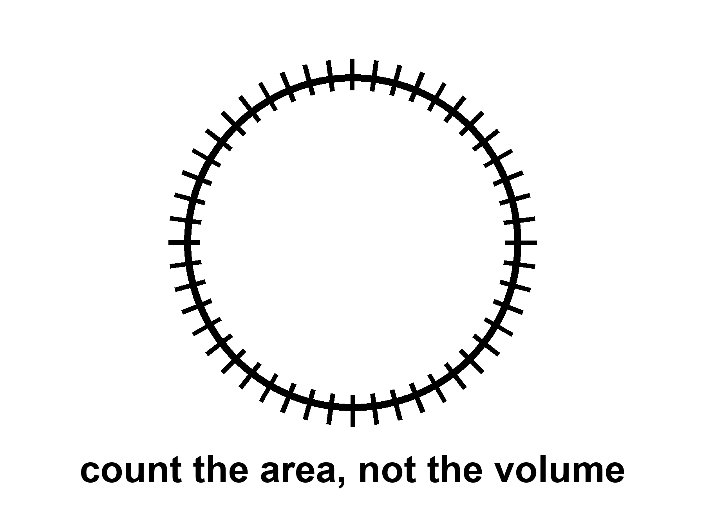

People then got ambitious. Maybe the whole universe is a hologram. Maybe a gravity theory in a volume is secretly a quantum theory on a wall. In one special, negatively curved kind of space, this has been made precise enough to write papers that get jobs. Juan Maldacena’s AdS/CFT duality, from 1997, is the precise form: a gravitational theory in an Anti-de Sitter box, a space that caves in the way a saddle caves, matches a quantum field theory on the wall of the box. Calculations that look like black-hole thermodynamics on the inside look like ordinary quantum bookkeeping on the wall. That is a triumph of a model. That space is not our accelerating, leftover-glow space. We live with a shove, Chapter 18’s shove, that looks like a positive cosmological constant, a de Sitter mood, not an Anti-de Sitter box. A duality that works in a box we do not inhabit is not a photograph of the kitchen. It is a constraint on how ambitious you are allowed to be when you invent hiding places for bits. The leap from “black holes count on their skin” to “your kitchen is a projection” is a leap. Warm-to-cold. Useful as a constraint: you do not get to invent an infinitely roomy crunch-computer (Chapter 19) without saying where the bits sit. Tipler needed a loophole in a bound like this. The bound is not impressed.

Holography does not cancel events. It relocates the bookkeeping. The loaf may be a projection of something thinner. The events you care about — a last beep, a first helium nucleus, a woman saying good morning to a Thursday she will not have — still happen. They may have fewer hiding places than a volume would suggest. That is a change in the furniture of the account. It is not a vanishing. It is not a promise that a lost encyclopedia can be checked out later like a library book. It is a rule about how much unread stuff a region is allowed to hold.

The glow is a slow leak from the membrane.

In the kitchen version: near the horizon, the vacuum’s jitters get sorted. One part of a jitter falls in. The other part escapes. From far away, the hole is radiating, very slightly, as if it had a temperature. The formula, if you want the shape of it, is *T_H = ħ c³ / (8π G M k)*: colder when heavier, hotter when lighter, Planck’s constant in the numerator so that a purely classical hole would not glow at all. Hawking’s temperature for a solar-mass hole is about 10⁻⁷ kelvin — ten millionths of a degree above absolute zero, a hundred million times colder than the leftover glow in your kitchen. Small holes are hotter. A hole the mass of a mountain would sizzle. A hole the mass of an asteroid would be a brief, rude oven. A hole the mass of a star is colder than the leftover glow and, today, *gains* weight from the sky faster than it leaks. Only in the unimaginably far future, after the leftover glow has thinned, would stellar holes begin to lose.

The leftover glow is 2.725 kelvin. A solar-mass hole is a hundred million times colder than that. The sky, for now, is a heat bath the hole sits in, and the bath wins. This is why “black holes evaporate” is a true sentence about a later season of the loaf and a false poster about Tuesday. Tuesday, the hole in Cygnus X-1 is getting slightly heavier from the microwave fog and from whatever gas it can steal. The leak is real in the derivation. The leak is not winning.

If nothing interrupts, the leak eventually takes all the mass. The evaporation time for a solar-mass hole is about 10⁶⁷ years — a one with sixty-seven zeros, a number that makes the 13.8 billion years of the stretch look like a blink in a blink. Barrow would have put that integer on a blackboard and let it sit until someone laughed. The laugh is allowed. The integer is the theory. The hole shrinks, heats, shrinks faster, and ends in a last, small violence. Whether the encyclopedia comes back in the last violence, or came out slowly in the glow, or is written on a remnant, is the information problem. It is unfinished.

The fight has a shape, even unfinished. Hawking’s first glow looked thermal, which is a polite word for “the radiation does not remember the encyclopedia’s sentences, only the hole’s mass, spin, and charge.” If the hole then vanishes, the sentences have nowhere to live. That is a quarrel with quantum mechanics, which prefers to keep its books unitary: information is shuffled, not shredded. Proposed peace treaties have names. Complementarity says the outside and the inside are two accounts of one book, and you are not allowed both at once. Firewalls say the membrane might be a violent place after all, a contradiction dressed as a heat bath. Islands in the recent math say the entropy of the glow can fall late in the evaporation, as if the sentences had been hiding in the radiation all along and only became countable later. None of these is a photograph. All of them are warmer than a shrug and colder than a settlement. It is not unfinished in a way that lets you use a hole as a filing cabinet for resurrection. A soul is not an encyclopedia. An encyclopedia is not a person. Neither one is stored in a basement you can open later by being patient, or pious, or good at grants.

Hawking radiation has not been seen from an astrophysical hole. It is a derived glow, as firm as a derivation can be without a photograph. Laboratory analogs — sound horizons in fluids, tricks with lasers, a Bose–Einstein condensate with a sonic membrane — have made related noises. Bill Unruh taught the field to listen for a sound that cannot climb out of a moving fluid: if the fluid runs faster than sound, there is a surface sound cannot recross, and the math of that surface is cousin to the math of Chapter 20. Jeff Steinhauer and others have built such membranes in the lab and reported a glow with the right family resemblance. They are encouraging and not the same as weighing a photon from Cygnus X-1. An analog horizon is a teacher. It is not the leak from M87*. You can poke the fluid. You cannot poke M87*. Keep the temperatures straight. The derivation is warm-to-hot. The photograph is missing. The analog is a cousin.

For the travel chapters, the leak is a timekeeper. It says black holes are not eternal furniture. They are long-lived, then gone, on clocks that make civilizations look like sparks. If you want a library to last, do not drop it in. Put it under ice, or in a vault, or in a machine that can wait. The membrane is a fact about events. It is not a basement.

A woman — invented; the bound is not — stands at a real well in a yard and holds a battered encyclopedia, the kind with thumb-indexes and a broken spine. She could keep it. She could throw it. If she throws it, the well does not become a library. The lid, if the well were a hole, would remember in a way no visitor can read. That is the teaching. That is all the teaching. Do not promote the well to a filing cabinet. Do not promote the glow to a last judgment that hands the sentences back. Count the skin. Admit the leak. Leave the resurrection for books that are not this one.

---

\newpage

## 24. Not a Door

The last mistake is the door.

A door has two sides you can use. A horizon has two sides you cannot trade. A kitchen door has two knobs. You go out for the mail. You come back for the casserole. The loaf of the house does not mind. You can stand in the yard and still be in the kitchen’s future, and stand in the kitchen and still be in the yard’s future. That is what two knobs *are*: two rooms that keep each other in their cones. A one-way membrane is not that door. Fall in and you do not come out “somewhere else” in this universe with a story to tell. There is no second knob. There is no mail. There is a sorting of events, and you have joined the set that cannot write home.

The flattering picture is always the same. The hole is a gate. The gate leads to a tunnel. The tunnel leads to another kitchen, or another century, or another you. The picture borrows its furniture from doors because doors are the one-way-looking objects we actually own, and because we have all, at least once, wanted a room that was not this one. Physics will not rent you that room at a horizon. The membrane does not open. It sorts. If you want a handle between two exteriors, that is a wormhole, and it is Chapter 33’s problem, and it is not this object. If you want a future in this universe with a story to tell, stay outside.

In the classical theory you come to a singularity, a ripped place in the loaf, and the theory stops. The geodesics — the straightest paths the geometry allows, the paths free clocks and free stones follow — do not come out. A geodesic that crosses *r_s* reaches *r = 0* in a proper time you can write on a napkin: tens of microseconds for a stellar hole, hours for Sagittarius A*, the better part of a day for a giant like M87*. Those are not transit times to another station. They are the lengths of worldlines that end. They reach, in that finite proper time, a boundary the equations cannot extend through. That is what “singularity” means when it is being honest. It is not a glowing point with a brand name. It is geodesic incompleteness: the paths stop, and the theory that was telling you how they lean has nothing left to say. Appendix A24 writes the line. Here it is enough to refuse the hallway. A path that ends is not a path that arrives in another kitchen.

You can try to be clever. You can fire rockets inside. You can aim “sideways.” Inside a Schwarzschild hole there is no sideways that leads out. The radial direction has become timelike: “out” is as unavailable as “yesterday.” That sentence is the whole joke, dressed as a coordinate fact. The membrane is not a wall you bounced off. It is a date you cannot un-reach. The geodesics do not come out because “out” is no longer a direction in their future cones. Chapter 20’s last beep, heard from the ship, is the outside’s view of a crossing that, inside, is already a one-way season.

The singularity theorems, and Hawking’s cosmological versions, say that if gravity pulls in the ordinary way and energy behaves, collapse and bang-like expansions have boundaries the geodesics cannot extend through. Penrose’s 1965 result is the local one: a trapped surface — a sphere from which light is already being dragged inward, outgoing as well as incoming — plus ordinary energy conditions, and the loaf is incomplete. You do not need to assume a pretty symmetry. You need a trapped surface and a rule that energy is not too exotic, and the paths cannot be extended forever. That is why a collapsing star is not a special cartoon. It is a case of a general sentence. Hawking applied the same muscle to the early universe: if the past is a trapped place in the right sense, the bang, too, is incomplete as a geodesic story. Inflation and dark energy violate some of those energy assumptions, which is why the theorems are not a courtroom for “the universe began” in every model. A burst that repels, a shove that stretches, can dodge a hypothesis the 1960s treated as polite. They are still a courtroom for “you may not treat the inside of a hole as a hallway.” A stellar collapse still makes a trapped surface. Ordinary matter still obeys the energy conditions the theorems asked for. A trapped surface is not a doorframe. It is a proof that the paths do not return.

Hot claim: if you fall into a hole of the kind we have pictured and heard, classical general relativity does not give you an exit in this universe. Warm claim: a quantum theory of gravity will replace the ripped place with something that does not infinite-curve. Cold claim: that something is a door, a bounce you can steer, a baby cosmos with a forwarding address. The warm claim is a research program. The cold claim is a hope wearing a lab coat. This book will not rent the coat.

In speculative theory you might come to a bounce, a baby universe, a tangle of extra dimensions. Those are cold. They are also, even if true, not a transit system. A baby universe you cannot call is not a destination. A bounce that pinches off a new loaf, if such a pinch exists, is a maybe about the interior, not a ticket window. You do not steer it. You do not mail a letter through it. You do not retire there. The new loaf, in the sketches that allow one, is not “somewhere else” on a map you already own. It is a separate region of events, pinched off, causally unavailable to the ship that watched the last beep. Calling that a trip is like calling death a change of address because the nouns still exist in a dictionary.

Extra dimensions offered by string theory come with the standing rule: **the framework cannot currently be tested.** A hallway drawn in an untestable framework is a drawing. It is not a road. Loop-quantum sketches that replace the ripped place with a bounce are a different drawing, also unphotographed, also not a subway. This book will let the drawings sit. It will not sell tickets. A cold interior is allowed. A transit system is a different claim, and it fails even if the cold interior is true, because availability is the whole of what “destination” means. If you cannot call, you did not arrive. If no one can call you, you are not a station.

Wormholes, in Chapter 33, are a different object: a handle, not a membrane. People blur them because both are “holes” and both are associated with Einstein. Do not blur them. One is common and one-way. The other is unphotographed and probably expensive beyond engineering. A wormhole, if nature or a civilization ever held one open, would be a throat between two exteriors you could, in the optimistic diagrams, enter and leave. You would see two mouths, two skies, two knobs, if the metaphor will sit still that long. It needs exotic stress, a violation of the energy conditions the singularity theorems were using as police — a stuff that antigravitates in the throat so the pinch does not slam. The Kruskal throat of Chapter 22 is not that object. That throat pinches in finite proper time and cannot be traversed. The Morris–Thorne kind of handle is a different drawing, built to stay open, and it pays for the staying with matter no kitchen has ever weighed. It is a maybe about a handle on the block. A black hole is not that handle. A black hole is the membrane we have already pictured and heard. Confusing them is how a shadow in a ring becomes, in a careless paragraph, a subway. This book will not be careless. Chapter 33 can spend its own pages on the handle. This page is the refusal.

A short inventory, so the blur has nowhere to hide. Horizon: a fact about events, one-way, photographed as a shadow, heard as a ringdown. White hole: the time-reverse, undrawn in the sky, unstable. Kruskal throat: a pinch, not a tunnel you can walk. Wormhole: a proposed handle, two-way if it exists, not this chapter, not in the EHT image. Baby universe: a cold pinch-off, not a destination. Singularity: where the geodesics stop, not a station. If a paragraph uses two of those nouns as if they were one noun, the paragraph is a poster. Put it down.

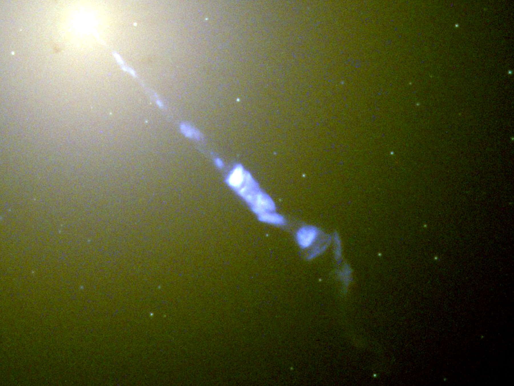

Look at Figure 24 and practice the sentence. A real hole lives in a real galaxy. Stars orbit. Gas glows. A shadow, if we had the baseline, would sit in the middle the way Figure 20 sits in M87. None of that is a door. The host is not a terminal. The dark is not an arrival hall. The honest nouns are still the ones Chapter 20 paid for: a fact about events, a last beep, a leak so slow it makes civilizations look like sparks.

A woman in a kitchen — the same invented kitchen, a different mistake — puts her hand on both knobs of the back door and thinks of a well. The door opens inward and outward. The well, if it were a horizon, would not. She can fetch the mail. She cannot fetch the probe. The difference is not poetry. It is which events remain in which cones. Chapter 2 said an event is a happening, not a thing. A door is a thing we built to keep two rooms in conversation. A horizon is a happening-boundary we did not build. Promoting the second to the first is the last mistake because it is the most flattering. It lets you keep the casserole and the adventure. Physics will let you keep the casserole. It will not let you keep the adventure as a round trip.

She opens the door, because that is what knobs are for, and looks at the yard. The fountain from Chapter 22, if this is the same invented house, is still throwing water she cannot climb. The sink is still a drain she cannot reverse. The well, if there were a well, would still be a lid you count and do not enter. Three kitchen objects, three lessons, none of them a gate to another cosmos. She closes the door. Both knobs still work. That is the privilege of a house. It is not the privilege of a hole.

So: no transit. No filing cabinet for souls. No steered crunch. No baby-universe bus. A shadow in a ring, a slow leak, a one-way fact about events. That is the honest hole. It is enough. It is already stranger than a door.

The part that began with Schwarzschild’s letter from the front ends here, on a galaxy that does not owe us an exit. The next part will try to go somewhere anyway — a greenhouse, a delay, a launch window — without once treating a membrane as a knob. If you wanted the hole to be a door, you wanted a different loaf. This one sorts events and does not give them back. Take the casserole out when your clock says so. Leave the well alone.

\newpage

# PART VI — Getting There Anyway

---

\newpage

## 25. A Greenhouse on a Dead World

The airlock sticks on cold mornings. Mara hits it with the heel of her glove, the way you hit a jammed kitchen drawer, and it sighs. Inside, the greenhouse is the only room that smells like a lie: wet soil, torn basil, a sweetness that does not belong to this planet. The lie is maintained with LEDs the color of an overcast noon and a tray of water she melted, yesterday, from a vein of ice the color of dirty chalk.

She does not rush the second door. Pressure equalizes the way a kettle decides to boil: when it is ready, not when she is. The suit still smells of dust and of the powder the filters never quite catch. She cracks the helmet, in here only, and the wet-soil lie hits her like a kitchen she has not earned.

This is the woman who stood between the lamps. Eli still has the clock. His question about the dust is already late.

The boot-print from yesterday is still sharp. Wind on this world is a rumor. The air outside is carbon dioxide at about six millibars — a hundredth of a kitchen atmosphere, a breath that would not lift a napkin, a sky that is weather only if you are generous with the noun. She does not farm the sky. She farms a box. The box is the permit.

A permit, in this book, is not a city. It is not a flag. It is permission for a trick to be run by hand: liquid water in a tray, light on a leaf, a gas mix a potato can stand. The planet’s own permit expired. The wet youth ran off or hid in the bones. What is left is a desert with ice in it and a chemistry that can be negotiated with. She is the one who negotiates. The dirt is the other party.

She logs the night before she drinks. Heater held. No frost on the potato bench. A tray of seedlings on the north side looks sulky, which is a word the log does not want and gets anyway. The recycled water has crept in pH. She will negotiate that after the brown liquid the recycler calls coffee. Sentiment is allowed. Sentiment does not get to vote.

The dirt is not dirt. It is crushed rock and dust, a mineral flour with a tax in it. Perchlorates — salts that on Earth show up in dry places and in laboratory jokes — sit in the fines. They are oxidizers. They are rude to a gut and interesting to a chemist who needs a stash of oxygen in a pinch. She does not eat the fines. She rinses what she must rinse, she binds what she can bind, she treats each tray as a negotiation. The universe did not mail soil. It mailed a rock. The rock can hold a root if you add water, a buffer, and weeks.

The air she breathes in the box is not the six millibars. Potatoes want a buffer of nitrogen and oxygen, a pressure a leaf recognizes, a humidity that is not a desert. She mixed that kitchen, or a machine mixed it, from tanks and from whatever the chemistry would surrender. The outside CO₂ is a feedstock if you have the power to split it, and a poison in the wrong mix. She watches the gauges the way you watch a pot that can boil dry. The greenhouse is also a cave: glass and piled dirt against a sky that does not shield. A solar day of unkindness lives in the dust. She farms under a lid, not under a heaven.

Water is stolen, not supplied. Ice at mid-latitudes and high, in the ground, in the shade of a crater lip, in veins the color of dirty chalk. Orbiters sniffed hydrogen. A drill made it a fact. Yesterday she ran a heater into a vein and waited like a person waiting for a kettle, except the kettle is a planet and the wait is a workday. Melt, filter, test for the salts, melt again. A kilogram of potato is mostly water wearing starch as a costume. The log knows this. The tray knows this. The ice vein does not care.

The potatoes are not a metaphor. They are a starch that either happens or does not, under LEDs, in a tray whose salts she has not finished arguing with. A sprout is a small yes. A black smear is a small no. She trims a leaf that went yellow and puts it in the compost that is not a compost so much as a bucket she will negotiate with later. The airlock, on the way to the bucket’s outer porch, sticks. She hits it. The seal is the morning.

Outside, the sky is butterscotch and thin. A radio sits on the workbench. When she talks to the orbiter, she talks to twenty minutes ago, or four, depending on the week. The orbiter talks to Earth, which talks back in more minutes. There is no conversation. There is a stack of monologues that eventually, if everyone lives, amount to a plan.

Four minutes one-way when the two worlds sit as close as they get. Twenty-four when they sit on opposite sides of the Sun, like relatives at a table too long. Light does that. Radio is light. She does not ask a question she needs answered before lunch. She files a sentence. She waits. She files another. Earth answers a morning she has already spent. The orbiter overhead is closer and still not a chat. Chapter 3 already said this with Jupiter. Here it is a workday, and the workday is a stack of late mail.

There is no live weather from home. There is a file with a timestamp, Eli’s voice on the delay, a checklist that was current when it left. She answers the checklist. She does not answer the tone. Tone does not survive twenty minutes of vacuum. If the heater failed at 3 a.m. her time, Eli will learn it after the potatoes have already decided.

She is not waiting for a miracle. She is waiting for a launch window. The next cheap path home — the one that lets a ship fall most of the way instead of burning a fortune — opens in 26 months, give or take the mood of the two orbits. Until then the potatoes either make starch or they do not. The universe does not have an opinion. The dirt has a chemistry, and the chemistry can be negotiated with.

The window is not a holiday. It is a fact about two ellipses that lap each other. Every two years and a bit, the cheap path opens: a long fall that spends its fortune at the beginning and the end and lets gravity do the commute. Δv is the invoice — how much extra shove you must buy, in kilometers per second, to leave one well and enter another. The invoice does not care that she is tired. It does not care that a tuber is late. Miss the window and you wait for the next lap. Burn extra to force a path and you pay in propellant you are not holding. She is not drawing a schedule for a nation. She is reading a calendar two planets already wrote.

She names the morning’s jobs the way you name the burners on a stove. pH. Filter. Ice. The stuck door, again, because the seal has a personality in the cold. The rover’s blanket of dust. None of these is a milestone on a poster. None of them founds a town. A town is a later kind of waste, a pile that remembers, and this chapter has not hired one. She has a box, a drill, a radio that talks to yesterday, and a tray.

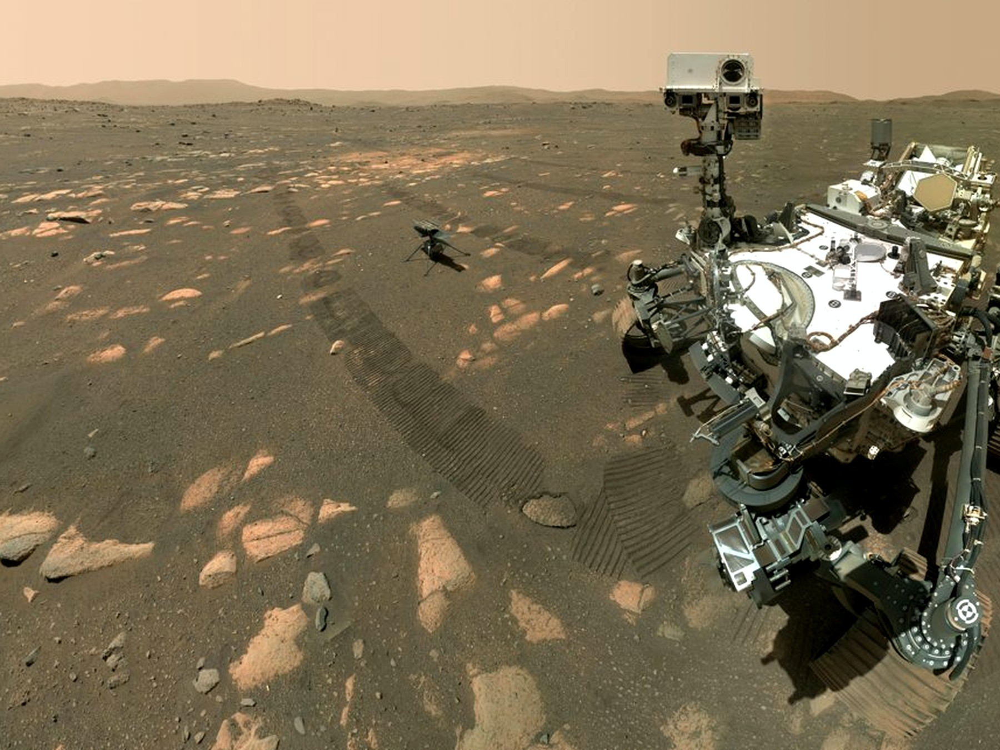

This is the only honest picture of “somewhere else” this book will allow in the near term. A dead world, close enough that light-minutes, not light-years, set the lag. A body you can weigh. An ice vein you can steal. Machines that do not sleep parked in the driveway. A human worldline that has to eat.

Close enough is the whole joke. Four light-minutes is a neighbor. Four light-years is a different book of stamps. She can, in principle, be reached by a ship that still uses tanks and falls. The Δv is ugly and finite. Ugly-and-finite is the grown-up kind of possible. The chapters after this one will put other suns on the table and then take the tickets away. Keep this morning in your hands while they do it. This is what a ticket looks like when it is real: a jammed door, a late radio, a potato that is either a potato or a failure of chemistry.

The rover waits like a tool left in a driveway. Dust on the solar blanket. A scratch on a wheel from a rock that did not care. She will drive to the vein after the pH, or she will not, depending on a battery that has opinions. Machines that do not sleep still need someone to hit an airlock with a glove. The sky is butterscotch because the dust is a fine rude flour and sunlight through a breath of CO₂ is a stain, not a blue. Blue is a luxury of a thick nitrogen kitchen. She has seen the marble in a camera, late by minutes. She is not a backup of that marble. She is a person with a tray.

Appendix A25 writes the Δv, the round-trip delay, the kilograms of water per kilogram of potato. Here, keep the stuck airlock. If we go farther than this world — and we will, in the next chapters, on paper — we will go as Mara goes: by negotiating with the chemistry, by missing conversations, by treating a launch window as a fact about the loaf, not a mood.

She names the basil, which is sentimental, and logs the pH, which is not. On a dead world, sentiment is allowed as long as it does not get to vote.

The second door sticks again on the way back from the vein. She hits it. It sighs. The greenhouse takes her in like a liar who has, for today, told the truth: the tray is wet, the LEDs are an overcast noon, the potatoes have not given up. She writes that down. She does not write a nation. She writes a morning, which is the only unit this permit comes in.

A permit on a dead world is this small. Not a sky that learned to be kind. Not a calendar of cities. A glove, a sighing door, a tray, a delay of four to twenty-four minutes, a cheap path that opens every twenty-six months, a Δv that is an invoice, ice at the latitudes where ice still sits, perchlorates in the fines, six millibars of the wrong air. She already has all of that. The morning is how you spend it.

---

\newpage

## 26. Most of the Universe Has Already Left

Even if her potatoes prosper and the window opens and the ship falls home, most of the cosmos is already out of reach.

Light is late, we said. There is a ruder fact. In an accelerating universe, there are events that will *never* be in our future cone, no matter how long we wait, no matter how patient the radio. Space between unbound things stretches so well that a photon emitted “now” from those galaxies never finishes the trip. We can still *see* some of them: their old light is in transit. Their new light is a letter that will not be mailed.

Imagine the kitchen version, because the kitchen is where this book keeps its bills. You write a letter. You put a stamp on it. You walk it to the slot. For Earth, for the orbiter, for the woman with the stuck airlock, the slot still works. The letter is late — four minutes, twenty-four, a few hours to a probe at a giant planet — but late is not never. For a galaxy in the deep field, the slot is painted on. You may drop the envelope. The loaf does not carry it. The stretch between you and that kitchen is accelerating. The hallway lengthens faster than the messenger runs. The letter is not lost in a drawer. It was never in the future cone of the person you meant to reach.

That is not a black hole. Say it twice, because the noun *horizon* was already hired in Chapter 20 for a one-way membrane around a collapsed star. A hole’s horizon is a fact about which events can still influence which others, locally, in a deep well. The cosmic event horizon is a fact about the whole loaf’s later shape: which distant raisins will never, even given eternity, receive a photon we emit today. Same family of word. Different kitchen.

The shove of Chapter 18 is why the slot paints shut. In a universe that only coasts, you can, in principle, wait long enough for more and more old light to arrive; the particle horizon — we will get to that word in a moment — keeps growing as a patient astronomer. Once the stretch *accelerates*, waiting stops helping in a new way. Isolated lumps stay bound: a galaxy, a cluster, our own small group of raisins that still hold hands. Between the unbound, space wins and keeps winning. A photon set down “now” on a far worldline never finishes the commute. The destination recedes faster than light can close the gap. Faster-than-light recession is allowed here; it is the dough rising, not a rocket cheating Einstein in a room.

How far is the shut door?

Order of sixteen billion light-years, as a proper radius today — a ball, not a calendar date. Inside that ball, a letter mailed this morning can, in principle, still arrive, late and stretched. Outside it, the letter is a gesture. Appendix A26 writes the integral: a finite remaining commute when the scale factor grows like a compounding interest. Sixteen is not a speed limit on a sign. It is the size of the remaining postal system for new mail. The number will not become a destination. It is a fact about influence, the same species of fact as a hole’s skin, drawn on the whole sky.

Do not confuse that ball with a different circle people like to draw. The Hubble sphere is where unbound raisins recede at light, today, in the stretch-rate of now. It is a snapshot, not a membrane. Light can still arrive from outside it; light we emit can still, in some cases, arrive inside a future that the event horizon has not yet shut. The event horizon is ruder and more useful for travel: it is about *never*. The Hubble sphere is about *this instant’s slope*. Kitchen: the speedometer is not the locked door. Chapter 8’s line *v = H_0 × d* is the speedometer. Chapter 18’s shove is why the locked door exists at all.

We can still *see* past that ball. That is the part that feels like a trick and is only lateness. The light in the telescope left a long time ago, when the raisins sat differently, when the hallway was shorter in the right way. Old light is already in transit. New light is the letter that will not be mailed. A museum can be full of real objects whose living rooms you will never enter. The deep field is that museum.

The other rudeness has a different name.

The *particle horizon* is the edge of what we can already see — more carefully, the farthest events whose light has had time to reach us since the stretch began. It is a fact about the past we can rebuild. The leftover glow is a practical wall in front of it: a fog at 380,000 years, Chapter 9’s baby picture, beyond which the universe was opaque. In principle the particle horizon sits farther than a naive age-of-the-loaf times the speed of light, because the dough rose while the messengers were running. The raisins that emitted the oldest light we can imagine are now much farther than “thirteen-and-a-bit billion light-years.” The kitchen mistake is to treat the age as a radius. The age is a duration along worldlines. The radius is a rising.

Two horizons, two rudenesses. One is about the past we can rebuild. One is about the future we cannot visit. They are not the same line with two labels. The particle horizon grows as time passes; more past becomes visible, fog permitting. The event horizon, in an accelerating loaf, is a closed kind of future: some worldlines are already out of the postal system for anything we do today. Appendix A26 distinguishes them on a wedge. Here, keep the two slots. One slot still takes incoming archive. One slot refuses outgoing mail.

The kitchen image for the particle horizon is a stack of letters that *did* get mailed, a long time ago, and are still arriving. Every year a few more old envelopes finish the trip, fog permitting — except the leftover glow is a wall of fog, and behind it the soup was opaque. You will not get the first hour of the loaf as a postcard. You will get the baby picture, and the galaxies after the fog cleared, and that is the archive. The kitchen image for the event horizon is the stack you will never send. Two rudenesses. Two slots. Do not merge them because both are called horizon.

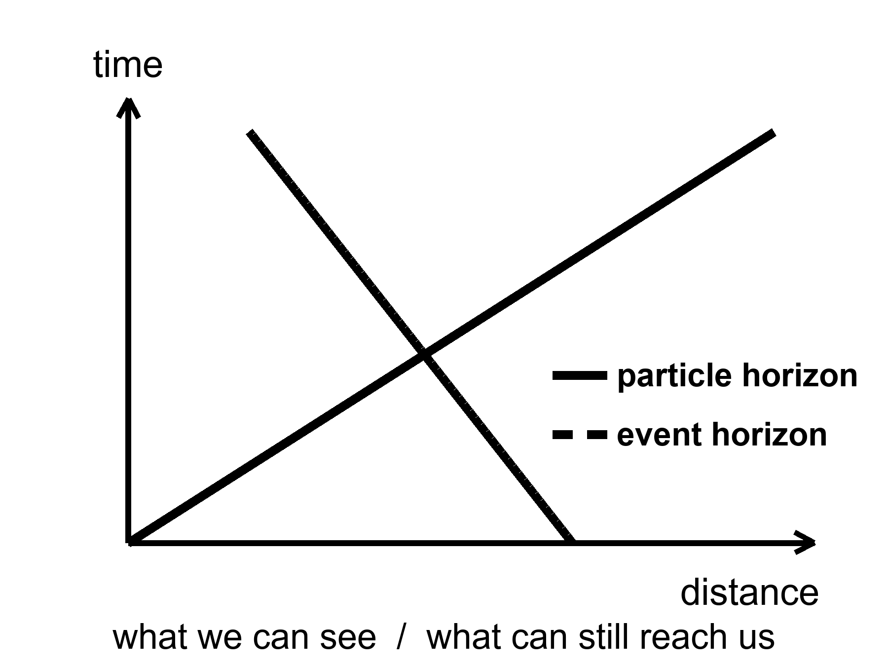

The deep field of Chapter 8 is, in this light, a kind of wake. Those galaxies are not destinations. Some of them were already leaving when their light left. The woman in the greenhouse, if she dreams of “the universe,” is dreaming mostly of a museum. The exhibits are real. The gift shop does not sell tickets to the exhibits’ futures.

She can, if she is lonely, look at a smudge four minutes old — a moon, a planet, a star in this house — and be looking at a neighbor. She can look at Andromeda, two and a half million years old in her sky, and still be looking at a raisin that shares our bound group; the navy of Chapter 4 is not leaving the kitchen. She can look at a deep-field smudge and be looking at a wake. The light is a fossil. The kitchen that emitted it has been carried off by the dough. A reply, if she were mad enough to send one, would be a letter to a house that will never have a mail slot in her future cone.

Most galaxies are not destinations. Say it as a temperature. Hot: they are real, they were there, their light is a measurement. Warm: many of them are already outside the event horizon for new signals, or will be, as the shove keeps winning. Cold: that we will one day “go to the Hubble Deep Field,” as if a photograph were a pier. A photograph is an archive. An archive is not a ticket.

Bound things hold. People, planets, galaxies, the Local Group. What stretches is the space between the unbound. That is Chapter 8’s law, spent here as a travel ban. The woman can, in the ugly-and-finite sense of Chapter 25, still reach a dead neighbor. She cannot, in any sense this loaf presently offers, reach a smudge whose light has been flying for most of the age of the universe. Waiting does not fix it. Patience is not a warp. The accelerating stretch is not a mood we can talk out of.

A future astronomer in this loaf has a poorer museum, not a richer one. As the shove keeps winning, more of the deep field redshifts out of practical view. Bound groups become islands. Our island — the Local Group, Andromeda’s navy still inbound, the Magellanic scraps, the raisins that still hold hands — remains a kitchen. The other kitchens go dark, not because they died, but because their new light is a letter that will not be mailed and their old light has already passed or stretched past the point of a useful stamp. The leftover glow itself thins. The night, late enough, is a local night. That is not a tragedy we can schedule against. It is the later shape of an accelerating loaf.

This is why wormholes and warps get invented. This is why they have to break something. The loaf, as measured, does not include a hallway to those rooms. Getting there anyway, if it happens, will happen to *nearby* rooms: planets and moons that still share our future cone for a long time. The rest is a baby picture of a crowd that has gone home.

A last kitchen image, because it is the one that sticks. She writes two letters. One is to Earth, timed for the window, a stack of monologues that may yet amount to a plan. That letter is late and allowed. The other she does not write, except in the dream where “the universe” meant the deep field. That letter would be honest feeling and bad physics. Most of the cosmos has already left, not by walking away, but by the dough rising too well. The museum stays open. The gift shop still does not sell tickets. Keep the potatoes. They are in the cone.

Appendix A26 writes the two integrals. Here, keep the two slots and the unsent letter. The particle horizon is an archive that thickens, fog permitting. The event horizon is a postal system that, in an accelerating loaf, has a last address. Sixteen billion light-years is the order of that last address, as a proper radius today — not a pier, not a mission, a fact about which raisins will never read our mail. The woman in the greenhouse can still write to Earth. That is already a lot. It is also the grown-up size of “getting there.”

---

\newpage

## 27. Other Suns, Other Worlds

For most of human history, “planet” meant a wanderer you could see, and there were six, then seven, then eight, then a fight about nine. Other suns were assumed, in the way a reasonable person assumes other kitchens exist in other houses. Proof is ruder than assumption. Proof arrived in 1995, as a wobble.

51 Pegasi is an ordinary star, forty-odd light-years toward Pegasus. Didier Queloz and Michel Mayor watched its spectrum rock, back and forth, every 4.2 days. Something heavy was tugging it — something at least as massive as a fraction of Jupiter, something so close to the fire that a “year” there is a work week. A hot Jupiter. Nobody’s formation story had ordered that dish. The dish arrived anyway. The Nobel, years later, was for the first confirmed planet around a sun-like star, and for the implication that followed like a rude guest: if the first one we found was a monster in the wrong orbit, the sky is not a copy of our living room.

The Nobel was 2019. Twenty-four years of arguing, confirming, and watching the drawer fill. The prize named Mayor and Queloz, which is how prizes work, and named the implication, which is how science works. 51 Pegasi b is not a place you would put a tray of basil. It is a measurement that broke a template. Templates, in this book, are the enemy of a census.

How you find a world you cannot see:

You watch a star dip. A planet crosses its face, and the light falls by a fraction of a percent, a bite out of a cookie, repeating. Kepler sat in space and stared at one patch of sky until the bites numbered in the thousands. TESS is doing the bright, nearby stars. The depth of the bite is the area of the planet compared with the area of the star. A Jupiter in front of a Sun is an easy bite. An Earth in front of a Sun is a nibble you must not invent.

Kepler’s stare was a long look at one crowded patch, faint stars included, until the repeating crumbs piled high enough to be a population. TESS trades depth of stare for a wider, nearer harvest: the bright kitchens, the ones a later telescope can smell. Neither mission walked on a world. Both counted bites. The count is the point. A thousand worlds you will never visit are still a thousand measurements. The woman in the greenhouse can read that file. She cannot drive there.

The nibble has a number, because this chapter is a census and a census without a number is a mood. Transit depth is roughly the square of the radius ratio. An Earth crossing a Sun takes about eighty-four parts per million of the starlight — eighty-four in a million, a cookie with a crumb missing, a bite you will miss if your photometer is a guess. A Jupiter crossing a Sun takes about one percent, a bite a less fussy instrument can taste. That is why the first rude finds were large and close. Rude is easy. Quiet is the later, better harvest.

Eighty-four parts per million is a crumb you must calibrate or you will invent a world. Photometers lie if you let them. A starspot, a binary eclipse, a jitter in the instrument: those also nibble. Repeating, at the same depth, at the same period, in a star you have otherwise understood — that is a planet. Kepler’s thousands survived that mill. TESS’s nearer bites are still being milled. The woman in the greenhouse does not need a thousand. She needs to know that the thousand are not addresses.

You watch a star wobble, as Mayor and Queloz did. The tug is bigger if the planet is heavy and close. This is why the first finds were rude: rude is easy.

The wobble is a spectrum rocking: lines sliding toward blue, toward red, a Doppler that is a partner’s pull, not a siren in a street. The amplitude is larger for a heavy planet, a close planet, a star you can see well, an orbit viewed more edge-on than face-on. Kitchen: a child on a seesaw with a truck is obvious. A child on a seesaw with another child is a job for a better scale. Hot Jupiters were the trucks. Super-Earths and mini-Neptunes waited for the scale.

You, rarely, take a picture. A young, fat world, far from a star that has been blocked or subtracted, can show as a dot. Most planets are fireflies against searchlights. The picture is the exception.

You, more rarely still, watch a star lens another star, and a planet hitchhiking the lens adds a hiccup to the brightening. Microlensing finds worlds we will never visit and barely name.

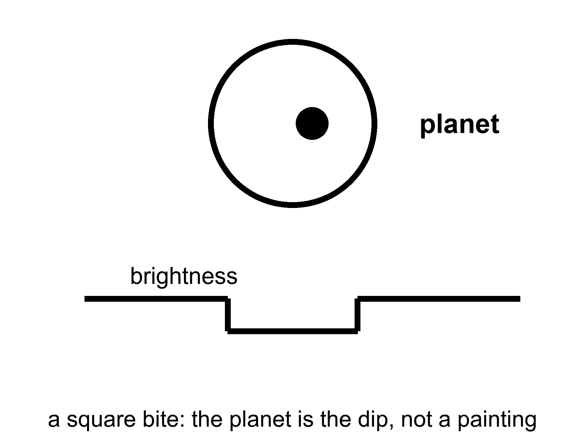

The census, once you correct for the rude-is-easy bias, is the sentence that should have been in every schoolbook twenty years ago: **most stars have planets.** Not all of them are Jupiters hugging the flames. The common finds, the ones our own solar system did not prepare us for, are the in-between worlds — super-Earths, mini-Neptunes — larger than us, smaller than ice giants, often wearing thick gas we would not call air. Kepler’s harvest is a drawer of sizes we did not have names for.

Correcting for rude-is-easy is the whole adult move. Stars were watched because they were bright and quiet enough. Planets were found because they were heavy or close or both. The drawer, once you put those biases on the table, still fills: a planet or more around most of the stars we have learned how to count. Not a Jupiter per house. Not an Earth per house. A furniture of in-betweens, plus ice giants, plus rocks, plus the occasional monster in a work-week orbit. Occurrence is a word for that filling. It is not a hotel list. Mini-Neptunes — a couple of Earth-radii, a thick wrap of hydrogen and helium we would not breathe — are common in the Kepler field and absent from our living room. Super-Earths sit between us and that wrap. Our system’s gap there may be a local accident, or a migration that cleaned a shelf. The census does not owe us a copy of the shelf we grew up with.

Most stars, not most posters. A Sun-like star is allowed to have a family. A red dwarf, which is most stars, is allowed to have a tighter, ruder family. The eight-world house we grew up in — four rocks, two ice giants, two gas giants, a fight about a ninth — was a local floor plan. The sky’s common furniture is a super-Earth or a mini-Neptune, a world that would sit, in our house, in a room we never built. Thick envelopes. No template. A permit, if any, that is not our permit.

A few catalogs have become characters. TRAPPIST-1 is a cool dwarf with seven Earth-sized worlds packed closer than Mercury, some in the starlight band of the next chapter, all tidally interesting, all flare-threatened. Proxima Centauri, the nearest other sun, has at least one world in a hurry around a brat of a star. K2-18b is a maybe-Hycean: a hydrogen blanket over a slush we have not tasted; JWST has been asked to smell its air, and the smells have been argued like a will.

K2-18b is the sentence to keep at *maybe*. A hydrogen envelope over a water-rich interior is a warm paper. A detection of a molecule in a transmission spectrum is a barcode, not a beach. The arguments have been loud because the public wants a neighbor and the data want a committee. This book will not pick a winner in a courtroom that is still in session. It will say: even a yes would not be a ticket for the woman in the greenhouse.

Atmospheres are the new sport. When a world bites its star, a sliver of starlight threads the air, if there is air, and molecules write barcodes — water, carbon dioxide, methane, the absence of things as loud as their presence. A barcode is not a biosphere. Oxygen can be a lie told by light shredding water and letting hydrogen escape. Methane can be a vent. The pair of them together, out of equilibrium, is a raised eyebrow, not a verdict. Chapter 30 is the verdict’s rulebook.

What exoplanets are *not*: destinations for the woman in the greenhouse. The nearest other sun is four years away at light, four centuries at a hundredth of light. They are a census. They tell us our eight-world house was never the template. They tell us Goldilocks has more chairs than we built. They tell us most chairs are empty of us, and that emptiness is not yet a statement about emptiness of *chemistry*.

Four years of light to Proxima. That is the mail. The ship is worse. At a hundredth of light speed — already a number that makes chemical rockets look like horses — the cruise is four centuries, plus the problem of slowing down, plus the problem of a grain of dust at that speed becoming a rumor of energy. Chapter 31 is that crew. Chapter 25 is not. She is on a neighbor measured in light-minutes. A hot Jupiter in Pegasus, a packed seven around a cool dwarf, a maybe-Hycean with an argued smell: those are measurements she can read in a file, late by minutes from Earth, late by years from the star. They are not a second greenhouse. They are not a window that opens in twenty-six months. They are a drawer. Open the drawer. Do not pack a bag.

TRAPPIST-1’s worlds, even the ones that sit in the starlight band, are still tens of light-years of postage. Tidal lock and flares are the next chapter’s invoices. Proxima’s world is the nearest chair and still not a chair she can sit in. The census is allowed to be wonderful without being a pier.

Formation stories had to be rewritten after 51 Pegasi b, and they are still being rewritten. Disks were supposed to make giants out where ice could help a core grow, not in a work-week hug. Migration — a giant born far out, then sliding inward on a disk’s gossip — is a warm hire. So is a disk that was ruder than the one we grew up under. The point for this book is smaller: the first confirmed world around a sun-like star was not an Earth. It was a monster that should not have been there. A census that starts with a monster is a census that has not finished surprising you. Super-Earths and mini-Neptunes were the next surprise. Mara, with the potatoes, is not in those surprises. She is in a light-minute kitchen, negotiating with a rock.

Appendix A27 writes transit depth and wobble amplitude. Here, keep the bite in the light. A world you will never walk on can still be a measurement. That is a kind of contact the leftover glow would recognize: late, thin, and real.

---

\newpage

## 28. Where Liquid Water Can Last

Life, as we have actually met it, is a water trick. Other solvents get papers. Water gets the biosphere. So the first map of “somewhere else worth the trip” is a map of where water can stay liquid for a long time. Chapter 30 writes the papers — methane lakes, ammonia mixes, rooms we call poison. This chapter writes the map we already know how to fold.

Around a star, that map is a band. Too close and the oceans boil, or the atmosphere runs away, or the ground becomes a story about steam. Too far and the oceans freeze to the bed. In between is the circumstellar habitable zone, the Goldilocks band, a phrase that has done too much work and still earns its keep. For a Sun-like star the band includes Earth and teases Mars. Venus is the cautionary tale: a sister that kept the wrong blanket and cooked.

Call it a permit, not a promise, before the posters hire the word *habitable* as a hotel rating. The band says: starlight of this much, at this distance, can keep a water ocean liquid *if* the air cooperates, *if* the crust recycles, *if* the volatiles arrived, *if* the luck held. It does not say a biosphere is sitting in the chair. It does not say a greenhouse woman can step out of a suit. It says the star has not, by raw flux alone, forbidden a wet surface. Forbidden is not the same as furnished.

The numbers, for a Sun, have names attached. Kopparapu and colleagues drew conservative edges that are still the ones a careful paper reaches for: a moist-greenhouse inner line, where a stratosphere gets wet and hydrogen starts to leak to space, and a maximum-greenhouse outer line, where even a thick CO₂ blanket cannot keep the water from freezing to the bed. For our Sun those sit, roughly, at about 0.99 and 1.7 astronomical units — Earth just inside the inner caution, Mars in the teasing outer suburbs. Optimistic maps draw wider. Optimistic maps are allowed as a maybe. They are not a second Earth. Appendix A28 writes the flux limits. Here, keep the kitchen: too much stove, too little stove, a band in between that is a permit you can still fail.

What the conservative band is actually claiming is narrower than a travel brochure. Inner edge: a moist greenhouse, a stratosphere that has started to carry water, hydrogen leaking to space one atom at a time — an ocean that can be spent without anyone boiling it in a pot. Outer edge: even a thick carbon-dioxide blanket cannot keep the water liquid; the greenhouse has done all it can and the bed still freezes. Between those lines, for a Sun, Earth sits and Mars teases. Move the star’s wattage and the lines move. A brighter lamp pushes the band out and shortens the career. A dimmer lamp pulls the band in and lengthens the career, then writes flares on the invoice.

Venus failed inward. A sister in size, closer to the fire, a runaway that turned a wet maybe into a pressure-cooker of carbon dioxide and sulfuric weather. The caution is not “Venus is mean.” The caution is that a permit can be held and then spent. A moist greenhouse, once the stratosphere is wet, can lose an ocean one hydrogen atom at a time. What you have left is a thick blanket and a ground that is a story about steam. Earth kept the right blanket, the right leak, the right luck. That is not a destiny. It is a local success of a band plus a crust plus time.

Mars failed outward, or failed in mood, or both. It sits near the rim. It had a wetter youth: riverbeds, minerals that remember water, ice in the bones. It lost the trick. The air thinned to those six millibars. The magnetic mood faded. Water hid. The greenhouse in Chapter 25 is what a permit looks like after the permit has expired: you bring the water up from the bones and you *run the trick yourself*. That is not terraforming as a calendar. That is a tray. The planet did not promise her a sky. It promised, at most, ice and a rock that can be negotiated with. Mara accepted the invoice.

The band moves with the star. A small, cool red dwarf wears its band close, like a tight collar. Planets there get tidally locked — one face forever day, one forever night — unless an atmosphere or an ocean cheats the lock by carrying heat around. They also get flares, which are rude to air. A heavier, hotter star wears its band farther out and dies sooner. The Sun is a compromise with a ten-billion-year career. We are living in the middle of the career, which is, if you like filters, not a surprise.

Red dwarfs are most of the stars, so most of the chairs in the census sit in tight collars. TRAPPIST-1’s packed worlds, Proxima’s hurried one: Chapter 27’s characters, living in a band that is a few million kilometers across instead of a few hundred million. Close means locked. Locked means a dawn-ring, a hot face, a cold face, and a hope that wind in an atmosphere or current in an ocean will carry the heat around like a soup you stir so it does not burn on one side and freeze on the other. Close also means the star is not a gentle lamp. Flares and X-rays and ultraviolet are a brat’s manners. Air can be stripped. Water can be shredded. A permit drawn only by flux is a piece of paper the brat can tear.

Tidal lock is not a cartoon of a pancake world. It is a staffing choice the gravity of a close orbit likes to make. You can still have weather. You can still have a terminator where the light is forever dawn and a leaf, if a leaf existed, might commute. You cannot assume an Earth-day, an Earth-night, an Earth-air. The band said liquid water *may*. The flare said *ask again*.

The rest of the permit is geology and luck, not starlight. Air that does not leave: a gravity and a temperature and, sometimes, a magnetic mood that keeps a brat star from stripping the kitchen. A crust that recycles: carbon pumped into rock and back into air, a thermostat with a long period, the carbonate-silicate trick Earth hired. Volatiles that arrived and stayed: water, carbon, nitrogen, not boiled off in a last great impact, not lost to space in a youth of impacts and a fading field. None of that is in the hatched band of Figure 28. The hatch is flux. Flux is the easy line to draw. The rest is why Mars is a desert with ice in its bones and Earth is a kitchen with basil that did not have to be named.

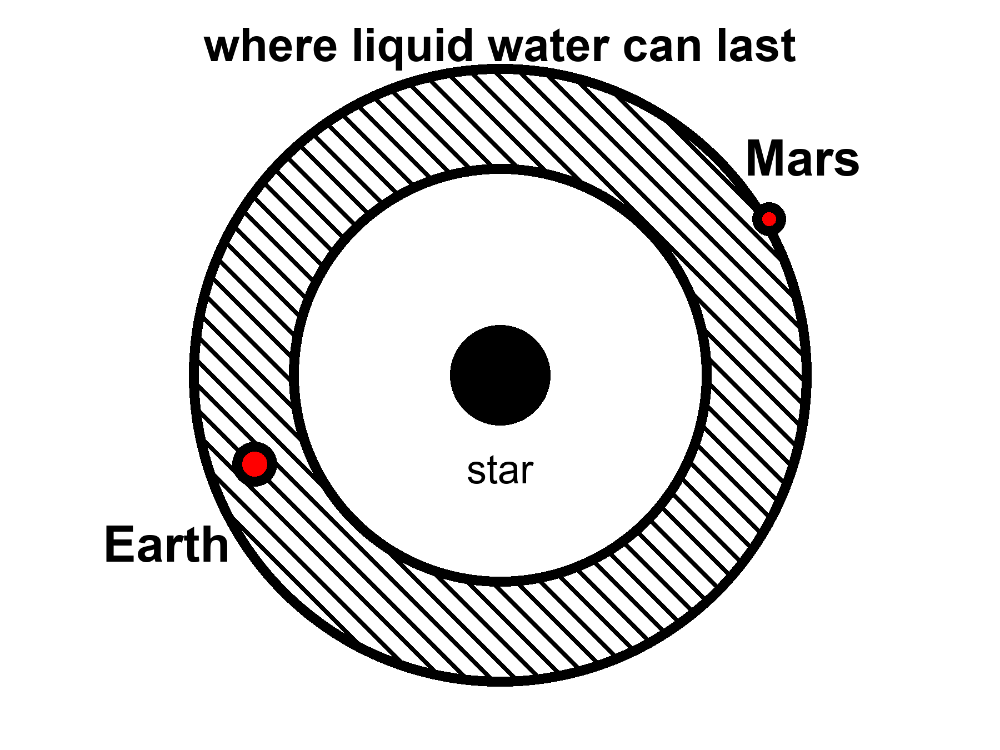

The band is not a promise. It is a permit. You still need air that does not leave, a crust that recycles, a magnetic mood if the star is a brat, the right volatiles, the right luck. Mars sits near the edge and is a desert with ice in its bones. It had a wetter youth. It lost the trick. The greenhouse in Chapter 25 is what a permit looks like after the permit has expired: you bring the water up from the bones and you *run the trick yourself*.

So the grown-up inventory of a starlight band is short. A flux window. A caution named Venus. An expired case named Mars. A crowd of red-dwarf chairs that come with flares and a lock. Super-Earths and mini-Neptunes may sit in the window and still wear a blanket we would not call air. The woman in the greenhouse is not waiting on those chairs. She is running a local trick on a rim-world whose permit already failed. Other suns, other bands: a census, not a pier.

Appendix A28 writes the flux limits and the conservative-versus-optimistic bands. Here, notice what the band leaves out. It is a map drawn by *starlight*. The next chapter is a map drawn by *squeeze*. The chapter after that asks whether a permit ever got used. Most of the liquid water in this solar system, if you added it up honestly, may not be in our southern oceans. It may be in the dark, under ice, around Jupiter and Saturn, where the Sun is a bright star and the heat comes from the flexing of a world.

That sentence is the hinge. Goldilocks is a lamp-map. The next chapter is a squeeze-map. A world can sit far outside every Kopparapu line — too little stove, a night that never ends — and still keep an ocean if a lid of ice and a flexing interior pay the heat. Europa does not have a circumstellar permit. It has a tidal one. The woman in the greenhouse is running a lamp-trick by hand on a rim-world. The dark seas do not need her LEDs. They need a melt, a look, and a refusal to confuse a permit with a town. Other solvents wait in Chapter 30. This chapter’s water is still water. The band is where starlight can keep it wet. The ice is where starlight is optional.

A last caution, because the word *habitable* will try to climb back on the poster. Venus is in the Sun’s optical neighborhood and is not a kitchen. Mars is in the teasing suburbs and is a permit you run by hand. A mini-Neptune can sit in a Kopparapu band and still wear a hydrogen blanket a potato would drown in. An M-dwarf world can sit in the tight collar and lose its air to a flare before a leaf is a thought. The band is the first filter, not the last. Chapter 29 is the filter the lamp forgot. Chapter 30 is whether anyone used a permit at all.

The woman in Chapter 25 is not waiting for Kopparapu’s outer line to move. The line already moved, in the only way that matters to her: the planet spent the permit and left ice in the bones. She runs the trick in a box. A TRAPPIST world in a tight collar, a Proxima world in a hurry, a maybe-Hycean with an argued smell — those are still Chapter 27’s drawer, still not her airlock. If this chapter has done its job, *habitable zone* now sounds like a license you can fail, not a destination you can book. The next chapter does not book one either. It melts.

Starlight is the photogenic map. It is also the smaller map. Most of the chairs in Chapter 27 sit around lamps that are not the Sun; most of those lamps are brats; most of those chairs will fail a permit they were drawn inside of. Water can still last where the lamp is a rumor. That is not this chapter’s band. It is the squeeze. Turn the page.

---

\newpage

## 29. Oceans Under the Ice

Europa is the size of our Moon and the color of a frozen bruise. Its surface is ice, cracked like a windshield after a long winter, almost empty of craters because the windshield keeps healing. Under the ice — ten kilometers down, or thirty; the arguments are a sport — there is an ocean. Not a lake. An ocean, tens to a hundred kilometers deep, wrapped around a rock. If you could unroll it, it would shame the Pacific.

The heat that keeps it wet is not a campfire of sunlight. Sunlight at Jupiter is a sixteenth of what we get, a weak coin. The heat is a *squeeze*. Europa orbits in a resonance with Io and Ganymede: a three-body music in which the periods lock, 1:2:4, and the little world is never allowed to settle into a perfectly lazy circle. Jupiter pulls. The neighbors pull. The ice and rock flex. Flexing is friction. Friction is heat. Heat, trapped under a lid of ice, is a sea.

Laplace’s names sit on that music. Io twice for Europa’s once; Europa twice for Ganymede’s once; a 1:2:4 that is not a poster of harmony but a fact that keeps eccentricity from dying. A circular orbit would be lazy. Lazy would freeze. The resonance is a rude gift: it pumps the flex, the flex pays the heat, the heat pays the sea. Io, innermost, got too much of the music. It is volcanoes, sulfur, a pizza that screams. Callisto, farther out, may have a deep, sleepy ocean under a thicker lid. Ganymede, largest moon in the solar system, has its own magnetic field — a pride — and may stack oceans between ices the way a building stacks floors.

A field is not a decoration. Ganymede’s is a fact you can measure from a flyby: a dynamo in a metal heart, a rare hire for a moon. Stacked seas — water, then high-pressure ice, then water again — are a warmer maybe. The pride and the maybe together make Ganymede a different kind of classroom from Europa’s single dark wrap. Europa is the windshield. Ganymede is the building. Neither is a town.

Enceladus, a scrap of a moon at Saturn, vents its sea into space through cracks at the south pole. Cassini flew through the spray and tasted salt, silica, organics. The taste is not a biosphere. It is a kitchen that has the ingredients out on the counter.

Salt means the water has seen rock, or at least seen something that dissolves like rock’s gossip. Silica nanoparticles are a hydrothermal hint: water that was hot against stone, somewhere below, making grains the way a vent on Earth’s seafloor makes grains. Organics are the sloppy generosity of carbon chemistry, not a farmer. Cassini did not land a verdict. It landed a sample of a plume. If you want the sea without the borehole, a plume is a kindness. If the plume is shy some years, you wait. You do not found a dock.

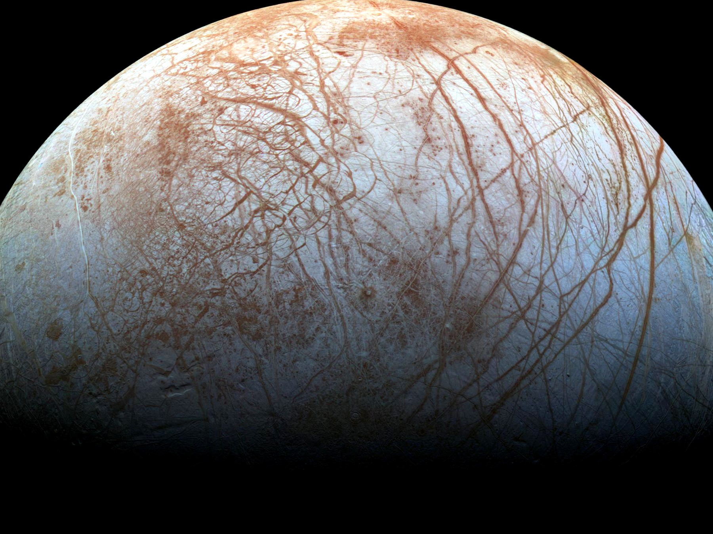

This trick does not require a moon. It requires a lid, a flex or another quiet heat, and enough ice to be a blanket. A planet far from its star can wear a global ice crust and keep a sea underneath if the rock is radioactive enough, or if a close, heavy neighbor squeezes it, or if it is a rogue, thrown into the dark, hugging the leftover heat of its birth under kilometers of frozen roof. David Stevenson wrote that last idea down: orphan worlds, wandering between stars, oceans intact because the ice is a thermos. We have not photographed one. The physics of thermoses is not exotic.

A rogue thermos is the starlight band’s rude cousin. No Goldilocks. No dawn-ring. No basil. A rock, a leftover warmth, a lid of ice that does not care that the nearest sun is a rumor. The habitable map in Chapter 28 was drawn by lamps. This map is drawn by squeeze and by blankets. If Stevenson is even half right, the dark may hold more wet rooms than all the photogenic bands around all the dwarfs. We have not seen those rooms. We have Europa, Enceladus, a maybe at Ganymede, a sleepy maybe at Callisto, and a permission that does not need a picture to be physics.

There is a catch the papers argue about. On a *big* icy world, the bottom of the ocean may freeze again under pressure into exotic ices — ice VI, ice VII, names that sound like sequels — and those ices might seal the water off from the rock. Life, as we have met it at Earth’s vents, likes rock and water to argue. A sealed sea is a bathtub without a drain or a mineral feed. Maybe the high-pressure ice convects and leaks. Maybe it does not. The argument is unfinished. It is the right kind of unfinished: a fight about chemistry, not a fight about magic.

The catch is why Ganymede’s stacked floors matter, and why a modest Europa may be the kinder exam. Too much world, too much squeeze from above, and the bottom of the sea becomes a lid of its own. Silica in a plume is a hint that Enceladus, at least, still lets water talk to rock. A sealed bathtub would not mail silica. We do not yet know which icy worlds are kitchens and which are jars.

Under the ice, the sky does not matter. Photosynthesis is a rumor from a brighter world. If anything eats, it eats rock and redox, the way vent microbes on Earth’s seafloor eat the planet’s leftovers. A probe that wants to look cannot stand on the ice and take a postcard. The surface of Europa is a radiation hell, bathed in Jupiter’s belts; a human would collect a lethal dose in a day. Under the ice, the water is a shield. The way in is a melt. A hot probe, a nuclear kettle, a machine that does not sleep, chewing a hole for weeks, paying out a fiber, dropping into a dark that has not seen a photon in four billion years.

The surface dose is not a mood. Hundreds to thousands of rem in a day, order of, in the belts: a number that turns a walk into a last walk. Electronics sulk. Plastics age. A person in a suit is a footnote the belts would erase. The ice itself is a shield once you are in it; water and frozen water eat the radiation the way a cave eats weather. So the job is not to picnic on the windshield. The job is to get through it.

She — or it — would fall out of the borehole into a pressure that would crumple an ordinary hull, into a black that is not the black of space but the black of a cave that forgot the entrance. If there are plumes, as on Enceladus, you can taste the sea without going in. If there are not, you go in. Planetary protection, in this doorway, is not a slogan. If that sea already has a biosphere, our dirt is a plague. If it does not, our dirt is a library. Chapter 32 is that library. The rule is: look first. Seed later. Never confuse the two. Chapter 30 is how you would know the difference.

Lengthen the melt, because the posters skip the weeks.

A kettle on a cable, a nuclear brick that does not sleep, a nose that is hot enough to turn ice into a hole and not hot enough to be a tantrum. The first meters are easy in the sentence and rude in the engineering: radiation, vacuum, a surface that is not a rink but a chaos of ridges. Then the ice closes behind, or wants to. The probe pays out fiber like a spider that has to remember the way back. Weeks, not an afternoon. The hole is a wound the windshield tries to heal. Power is a budget. Meltwater is a fog around the nose. A steering vane, a prayer that is actually a gyroscope. At ten kilometers, or thirty, the nose goes from chewing ice to chewing nothing — a drop, a pressure, a dark that has been dark since before there were eyes.

What the probe *does* in that dark is dull on purpose. It samples salinity. It sniffs for a redox that wants a cook. It listens for a magnetic induction, a global conductor already hinted by Galileo’s flybys. It does not unroll a habitat. It does not name a bay. Weeks of melt, a drop, a fiber, a list of numbers that either raise an eyebrow or do not. If the numbers are a vent’s leftovers, you have a kitchen without a verdict. If they are a cell that divides in a bottle you sterilized, you have Chapter 30’s jackpot and you keep the library shut. If they are silence, you still do not pour on the same shift. Look first is a calendar of patience, not a slogan on a hatch.

No colony follows the drop. Say that as a closed door, not as a sequel. A melt-probe is an eye on a wire. It tastes, it listens for a conductor, it looks for a chemistry that wants a story. It does not unload a town. It does not plant a flag that founds a nation under a lid. If the sea is taken, the probe is a guest who must not sneeze. If the sea is empty, the probe is still not a gardener. Look first. Seed later. Later is a different chapter and a different invoice.

The fiber would carry a thin, late conversation: not to Earth in real time — Jupiter is light-hours, not light-minutes, a ruder stack of monologues than the greenhouse radio — but to an orbiter, then home. She, if a she is even on this trip, is more likely a machine from Chapter 31, hanging in the dark, carrying a library, aimed at a lid of ice. Flesh on Europa’s windshield is a bad idea the belts already vetoed. Flesh in the sea is a worse idea the rule already vetoed. The eye on the wire is the honest unit.

Tidal habitable zones are, then, a second map, larger and stranger than Goldilocks. Anywhere a world flexes or holds heat under a lid, liquid water can last in the dark. Jupiter’s court is the nearby exhibition. The exhibition may be the common case. Starlight habitable bands are the rare, photogenic ones, where someone can grow basil under an LED and call it a greenhouse. The dark seas do not owe us basil. They owe us, if they owe us anything, a second origin — or a first one that never needed a sun.

---

\newpage

## 30. A Second Origin

We have a sample size of one.

The length of this chapter is a path, not a pile. A slope, and what a second trunk would eat. Sex as a shuffle, not forever. One grandmother, and why the dictionary froze. Body plans that lost, and why a colleague will not look like us. Cities that will not look like ours. Doors this rock never opened: wheels, glass bones, caves, vents. Then the solvents, Titan included. Then varieties, immigrants, and a visitor who files the cars and misses the mite. Appendix A30 holds the meshes. Hold the path, and read the rooms.

Sample size one is the whole sport of exobiology, and it is why the sport is mostly a discipline of *not* lying to yourself. Life, as we have actually met it, is a water-and-carbon trick that copies, mutates, and lets death keep the score. It uses a handful of amino acids with a preferred handedness, a genetic script written in four letters, and a metabolism that eats gradients — light, redox, leftover rock. Whether that is the only trick the universe knows is not a question you answer from an armchair. It is a question you answer with a yes that can be wrong, or a no that can be shy.

Food is not a sandwich. Food is a slope.

A cell, a person, a machine that still has a metabolism, stays organized by running downhill on a difference: hot to cold, charged to spent, food-molecule to ash. Schrödinger said it with a better noun than he is credited for — life drinks order, and pays in disorder. The kitchen name is waste. Yes, there are excrements. There is always an excrement. Heat is the one you cannot hide. Carbon dioxide is ours. Oxygen is a plant’s leftover that we later hired as a lunch. Methane is a vent’s breath and a cow’s. A biofilm on a rock shits a rust. A city is a lasting pile of organized waste. A civilization that learned to shout still leaks warmth. That leak is the most honest technosignature we have: not a hello, an excrement of industry.

What would they eat?

Not our gold. Not, if they have a choice, our water — ice is cheap in the dark. Not, casually, *us*. We are a wrong-handed, four-letter lunch, and a seeder’s crop is as likely to be poison as protein. If they eat a biosphere, they are eating a library, which is either vandalism or a sample. If they eat starlight, they are a Dyson habit: a wrap, a leak of infrared, a slope stolen from a sun. If they eat rock, they are a vent. If they eat the leftover unfairness of Chapter 10 — the fact that matter won by a billion — they are eating the same menu physics already set. A being without a metabolism, Chapter 31’s crew, does not eat. It spends joules. The joules still come from a slope, and the slope still ends as heat.

Animals eat animals. That is a slope with teeth, not a scandal, and not a ban. Eating your own kind is common, and it is not a field equation. Three meshes make it expensive, and Appendix A30 files them: a parasite that already knows your flesh, a gene dining on its own copies, and a city that remembers an intruder and organizes a punishment. A nest already knows the third at ant-scale. None of that makes the shudder a theorem. A second origin might hire the meal, or might refuse every cousin chemistry and then look at us as lunch across a trunk. Aliens eating us is not cannibalism. It is a different menu, and the wrong-handed, four-letter problem still sits on the plate.

Is sex how life lives forever — here, and everywhere?

No. Sex is not forever. Sex is a *shuffle*. The body still dies. The lineage keeps a copy that is not you, with a mixed hand of cards. That is a consolation we dressed up as immortality. It is bookkeeping. You do not go on. A sentence that sounds like you goes on, then another, then the scorekeeper calls time on each of them.

The common forever, if you want the word, is **copying**. Bacteria split and do not take a lover. A clone of aspen is a forest that forgot to die. Bdelloid rotifers have been all-female, as far as we can tell, for tens of millions of years, and they are not a myth. Most of the Earth’s career, by time and by headcount, is asexual. Sex is the expensive hire: two to make one, a search, a risk, the famous two-fold cost of making males who do not lay the egg. We still hired it. So did most of the large, parasite-haunted things we can see.

Why pay?

The honest answers are warm, not helium. A shuffle breaks up the coalitions of genes that a parasite has learned to eat — the Red Queen, running to stay in place. A shuffle also lets a lineage dump a broken letter without throwing out the whole book — Muller’s ratchet, the slow rust of a clone. Repair that needs a second copy. A lottery ticket when the weather will not sit still. None of these is a proof that the cosmos requires two sexes and a wedding. Horizontal gene transfer in a microbial film is another shuffle: sex without a face. Three sexes, a caste that only unlocks a genome, a being that fuses and splits like a siphonophore — Earth has sketches. Another lottery can ink them.

What would be strange, on a second trunk, is not the absence of our bedroom. It is the absence of *any* mixing in a world that also has parasites and time. Mixing is a warm bet wherever death keeps score with specialists. Our exact meiosis, our two-body habit, our idea that the child is how the parent outruns the grave: those are local costumes. The individual who does not die is the rare hire, and even then the lineage still mutates. Forever, in this book, is the wrong noun. The loaf already has all the times. Biology’s trick is not to escape the loaf. It is to put another thread on it before the first one ends.

The expensive hire comes with a carrot, or the staff will not pay the invoice. Pleasure is staffing, not a pamphlet the universe mailed. A cue can be turned up until it outbids the costly act. That spoof is warm wherever recording is cheap. It is not a law that a second origin will invent our pictures of it. Appendix A30 keeps the reward loop with the other biological invoices. The cosmic claim stops at the shuffle.

So the alien latrine, if there is one, is this: a gradient used up, dumped as warmth, as gas, as a rust, as a plume that should have eaten itself and didn’t. We already hunt that. We call it a biosignature when it is sloppy and alive, a technosignature when it is sloppy and industrial. The polite word is disequilibrium. The kitchen word is shit. Both are allowed. Neither requires a face.

What would count as a second origin?

Not “it looks green.” Not “we found organics.” The Murchison meteorite is stuffed with amino acids that no farmer planted; space chemistry is sloppy and generous. Not “it moved,” if a grain of dust can move. The Viking landers, in 1976, fed Martian dirt a labeled meal and watched a gasp of gas that looked, for a weekend, like a breath. Then the controls misbehaved, and the consensus settled on chemistry without a cook. A minority never signed. That is what a sample size of one does: it makes every gasp a courtroom.

A better test is *disequilibrium that wants a story*. Oxygen in an air, by itself, can be a lie — light shredding water, hydrogen fleeing, O₂ left behind like a forgotten suitcase. Methane can be a vent. Oxygen *and* methane together, in amounts that should have eaten each other, is a raised eyebrow. Add a seasonal pulse, a color that is not a mineral, a plume that carries not just silica but a lipid that nature does not stock — the eyebrow goes higher. A cell that divides in a bottle you sterilized is a verdict. We do not have the verdict. We have the eyebrow’s job description.

Earth is a cheat sheet and a trap. Everything we know how to look for looks like us: carbon, water, left-handed amino acids, radio. A shadow biosphere on Earth — a second trick under our feet that we have never cultured — is a cold possibility that would humble the cheat sheet. A dark sea that eats rock and never learned photosynthesis would humble it differently. A world that uses solvents we call poison would humble it completely. The honest search is therefore two searches: one for our cousins, one for our alternatives. The first is easier to fund. The second is the one that would change the kitchen.

Why is the script the same in every kitchen we have opened?

Open a bacterium, a mushroom, a whale, the woman in the greenhouse. The memory is nucleic acid. Four letters, or a close dialect. The same leftover grammar in the codon table: three-letter words, sixty-four of them, almost the same dictionary from *E. coli* to you. Mitochondria cheat a little. A few microbes rewrite a stop. The family resemblance is still a family. That is not a law the cosmos stamps on wet rock. That is what **one grandmother** looks like.

Call her LUCA if you like labels: last universal common ancestor, the bottleneck every cultured lineage on Earth still shares. Once a code works well enough, changing a word later is a catastrophe. Every protein in the house breaks at once. Francis Crick called that a frozen accident. The dictionary may also be a little tidy — errors land on cousins more often than on strangers — which is a warm extra, not a proof that A, T, C, and G were inevitable. The letters are good letters. Pairing is a good trick. The exact four, and the exact sixty-four-word book, are history.

Would another world use the same book?

Bet this way. Something *like* a pairing polymer is warm: you need a memory that copies with mistakes. The same four bases and the same dictionary is cold, or else it is a confession. If we found our exact codon table under Europa’s ice, the grown-up explanations are contamination or a shared seed — panspermia, directed or sloppy, Chapter 32’s library arriving early. A second origin with a *different* dictionary is the jackpot: same sport, other rules. Mirror letters. A six-letter script. An XNA that pairs and is not ours. A code that never invented thymine. That is what “not cousins” looks like on a gel.

So the sameness of DNA is evidence. It is evidence of **one origin on this rock**, not of a cosmic typesetter.

It is not evidence that biology waited for a witness.

A fashionable extra step says: the soup was a fog of maybe, and DNA became definite only when something looked. That step confuses a filter with a cause. The weak anthropic reminder is allowed and useful — chemists find themselves in a chemistry that worked. Unsuccessful soups have no one to file the complaint. That is selection of a *place* and a *history*, the same mesh as Chapter 41. It is not a mechanism that folds nucleotides into a helix when an eye opens. Polymers copy, or they do not, whether or not a later ape writes a book about them. The first record of a successful copy was another copy, then a fossil, then a cell that ate a gradient. Those are observers in the cheap sense of Chapter 6: traces. They are not priests.

The origin of life is an unfinished chemical problem, not an unfinished metaphysical one. We do not yet have the hour-by-hour of the first ribozyme, the first membrane, the first code. The incompleteness is real and should be said without flinching. It does not rent space to a collapse-of-the-wavefunction-of-the-ocean. Coincidences that survive a billion years of death are not coincidences. They are what got through.

There is a louder way the sample of one lies. It is not only chemistry. It is *history*.

Replay Earth’s tape — Stephen Jay Gould’s dare, after the Burgess Shale’s cabinet of body plans that mostly lost — and the winners can change. Anomalocaris, a meter of armored weirdness, was a champion of a sea we no longer run. Hallucigenia looked like a joke until we found which side was up. Most of those experiments died. The survivors look inevitable only because we are their children. A second origin, or even a second lottery on a second wet world, does not owe us two eyes, a spine, or a face. It owes us, at most, a trick that copies and a death that keeps score.

It does not even owe us one shape of mind. Earth hired two good ones in water — ours, and the octopus — and then only one of them took the hills. A wetter world, given time, might hire a *committee*: walkers, swimmers, climbers, even something built like an insect’s toolkit, all smart, all from one radiation, all arguing about the same sun. That is not a zoo invented for television. It is what empty niches plus a long clock can do if several body plans keep their nerve. We had the cabinet. We fired most of the staff.

A mind need not be a skull. A slime mold solves a maze without a neuron. A mycelium is a room-sized conversation in sugar. A siphonophore is a committee that forgot it was a committee. A world that hired the web, not the head — a thing that thinks by touching, that is only itself when it is plugged into itself — would fail every test that looks for a face. We would call it weather, or a cable, or a plague.

Blood need not be iron. Octopuses already use copper. Green blood, blue blood, blood that is a slurry of magnetite: those are staffing choices.

What the second trunk almost certainly is *not* is a person with different ears.

A humanoid — two legs, two arms, a face that can hold a conversation over a table — is a wonderful costume. It is a terrible prediction. Bipedal apes with grammar are one late hire on one wet rock, after a specific series of forests, savannas, and accidents. Hands that can strike a flint are not a law of intelligence. They are a law of *our* intelligence. An independent origin that reprints the ape, down to the eyebrows, is cold as zoology. If we ever met someone that close in the mirror, the grown-up guess would be cousins: a shared seed, Chapter 32 again, not a second invention of the chin.

We keep hiring the costume because we want a colleague. A cooler pulse. A different emotional budget. Someone who will tell you that logic is a kind of loyalty, and then save your life anyway. Keep the colleague if you need the story. Fire the body plan. The thing worth wanting is a second *culture*, not a second pair of cheekbones.

The swimming cousin is the same cheat in a wetter hat. Dolphins are not a destiny for ocean worlds. They are a destiny for *this* ocean: warm-blooded, echolocating, big-brained, and — this is the part the posters skip — without a fire, without a radio, without a hand. Aquatic intelligence is warm. A bottlenose with a dialect on every iced-over moon is cold. Most of the dark seas in Chapter 29 will not owe us poetry. They will owe us, if they owe us anything, a nervous system that works in the black and a body that does not look like a poster from Earth.

There is a prettier version of the colleague: tall, luminous, plugged into a forest that is a nervous system, wearing a local body the way Chapter 31’s machine might wear a shape so the doors still fit. Keep the forest. Roots that talk, a web that is a mind, a planet that is only itself when it is connected — that is the mycelium paragraph with a bigger budget, and it is warmer than a face. Bioluminescence is already on Earth; we just did not put it on a person and call it a neighbor. The remote body is an engineering sentence. The blue-or-green *person* inside it is the humanoid cheat again, better lit.

If you want a monster, do not hire a craftsman of evil. Hire a fitness peak.

Earth already runs the sketch. A wasp that lays an egg in a living host and lets the host walk around as a pantry. A fungus that steers an ant up a stem and fruits from its head. Those are not villains. They are solutions. Scale the solution up — a specialist that treats *you* as the egg, that survives the vacuum of a hull, that spends the whole budget on teeth and a childhood you do not consent to — and you have the nightmare people like. Survival at all cost is not a personality. It is what natural selection looks like when nothing in the room is keeping score but death. We call it evil because we were the host. The universe did not.

A large hunter can converge on something dinosaur-ish without becoming a person in scales. For a hundred million years this rock hired bipedal meat-eaters with a balance tail and a mouth that was the point. Sharks and ichthyosaurs found the same torpedo. Wolves and thylacines found the same face. A big dry world with room for giants might hire the theropod solution again: two legs because the hands are busy, teeth because the meeting is short. That is warmer than a gentleman with a phaser. It is still not a citizen.

Intelligent dinosaurs are a different sentence. We already have them. Birds are dinosaurs that lived. Crows make tools. Parrots steal words. Troodontids, before the rock fell, had the kind of brain-to-body ratio that makes paleontologists polite. Some of their cousins had grasping hands. They had time — more time than we have had since we stood up. Intelligence, then, is warm. A saurian mind is not a paradox. It is an experiment Earth ran and then interrupted.

Size is a worse predictor than the posters admit.

A skull the size of a grapefruit is not a requirement. A being thirty centimeters tall can, in principle, outthink a room of us. A nervous system the size of a whale can fail to invent a word. Volume is a weak forecast. Packing, wiring, the body the wires have to run, a culture that stacks know-how, and time — those hire a mind. A blue whale’s brain is a city of cells and still does not keep a library. A New Caledonian crow, a handful of feathers, bends a twig into a hook and teaches the trick. An octopus, a bag of muscle with a committee in each arm, opens a jar and then does not write it down. A termite mound air-conditions a tower no worker could draw. Those are Earth sketches, not a sermon about a hive that is a person. The colony is a room-sized habit. The crow is a small, fast, dense mind on a budget. The octopus is a second good hire that never took the hills.

Hot claim: **brain volume is a weak predictor of what a lineage can do.** Warm claim: another world, given packing and a clock, can hire a mind that fits in a teacup and still outruns us at the thing we congratulate ourselves for. Cold claim: they will look like tiny people. Colder: thirty centimeters is a law. It is a permission, not a uniform. A small sophont is allowed. A doll that reprints the ape, down to the eyebrows, is the humanoid cheat with a ruler.

Civilization is the extra invoice. A mind is not a city. A city is a rearrangement of matter that outlasts a death: surplus food, teaching, a way to stack know-how so the grandchild does not start from zero. Fire helps. Writing helps. Hands that can hold a coal and a stylus help. Nests of tinder and a snout that is also a weapon do not forbid those things. They make them expensive. A paleontologist once grew a museum hunter into a naked man with a tail and called the result a forecast. That is the humanoid cheat in a jacket with elbow patches. If a saurian lineage ever paid the invoice, keep the tail. Keep the nest. Do not expect tea.

And do not expect streets.

We look for cities the way we look for colleagues: windows, grids, a night side that glows in rectangles. Those are ape furniture. A city, stripped of the poster, is only this — a lasting pile of organized waste, built by something that remembers. Termites already air-condition a tower without a mayor. Coral already lays down a skyline without a plan. A web-mind’s capital is the web. A swimming people’s capital is a current they taught to stay. A dawn-ring herd’s capital is a road of trampled light. A cave town’s capital is a lung of tunnels that grew a library. A hunter civilization, if the invoice was paid, might be a rookery the size of a county: ramps for tails, pits for eggs, no stairs, no doors a hand would love, a smell-map instead of a street name.

Chapter 34 looks for shouting. A city that never invented the radio is still a city. We would miss it from orbit because we packed a test for *our* skyline. The honest forecast is rude, and better: if the second trunk pays for civilization, the first photograph will look like a mistake. Geology with an opinion. A reef that is too regular. A forest that is too warm at night. A canyon that breathes on a schedule. Not a downtown. Not a person in scales offering you a key to the city. A place like nothing we have built, doing the only job cities ever do — keeping a trick of carbon and water alive in a pile that remembers.

So there are forms Earth never fully hired, not because they are impossible, but because our path did not pass their door.

Wheels, for large animals, never made it. Axles are hard to feed with blood. Flagella spin; tumbleweeds roll; nobody commutes on a femur that goes all the way around. A high-gravity world, or a hard-packed plain with no mud, might hire wheels and think our knees are quaint.

Skeletons of silicon, as a habit, never made it. Diatoms glaze themselves in glass. Radiolarians make lace from silica. Vertebrates stuck with calcium phosphate like a union contract. A world poorer in phosphorus and richer in sand might build its bones the diatom way, and our X-rays would bounce off for the wrong reason.

Earth already hired two ways to be stiff. A rod on the inside — bone, cartilage, a notochord — so the meat can hang and the muscle can pull. A suitcase on the outside — chitin, shell, a crab’s door — so the meat lives in a room and molts when the room is too small. Both work. Both have invoices: the inside rod breaks and heals; the outside suitcase must be shed, and for a while you are lunch. A second origin may pick either, or both, or a hydrostatic bag with no hard parts at all. “Where is the bone?” is a vertebrate question. A world of suitcases would look, to an X-ray, empty and armed.

Fur on a hot world is not a joke if you remember what fur is. A coat is a boundary layer. Camels wear one in a desert. It keeps the day’s shove *out* as much as it keeps a night’s warmth in. The alternative is ears like radiators, skin that sweats, a life after dusk. A tidally locked dawn-ring might hire a pelt on the cold side and a shine on the hot side of the same beast. Thick polar wool under a runaway greenhouse is the cartoon. A coat as a parasol is already on Earth, waiting to be over-hired.

Farming is older than us, and smaller. Cattle are a late, loud version. Ants already keep herds: aphids, “leaf lice,” milked for sugar, moved to better leaves, defended like a barn. Other ants cut leaves to grow a fungus they cannot live without. That is husbandry without a hat. A second origin that never invents a cow may still invent a farm. The unit can be a louse, a microbe, a captured chloroplast. We would call it ecology until we noticed the ants had a policy.

Walking plants never made it. Chloroplasts were once free bacteria; we already swallowed a sun-eater and parked it in the basement. A few slugs steal the furniture and glow like bad decisions. Volvox swims, green and spherical, and never pays rent on a hill. No herd grazes the sun with its skin and then *walks* to the next lamp. A tidally locked world with a permanent dawn ring might hire exactly that: green beasts that commute along the terminator and forget how to chew. Soft, photosynthetic, and late to a meeting. The cartoon is a tree that stands up. The real permission is an animal that never gave the light back.

Caves already hire the dark. Movile, in Romania, has been a locked room for a few million years: no sun, a bad egg of hydrogen sulfide, and more than fifty species that exist nowhere else. The plants are bacteria. The animals eat the bacteria. The whole town runs on rock-breath. Lava tubes do a hotter version. If Mars still has a moist pore, it is this kind of town, not a meadow. A greenhouse on a dead world is a cave we brought with us. A lava tube we did not bring is the better classroom.

Volcanoes are not the opposite of life. They are kitchens with the gas left on. Archaea that treat boiling as room temperature. Worms that farm bacteria on a smoker’s lip. Acid that would strip a kitchen sink, full of cells that like it. Io is the warning: too much kitchen, no pantry. A milder vent, under ice or under a bad sky, is how you eat when the star is a rumor.

Crystals are houses, not flesh. That distinction matters, because jewelry that walks is a cartoon, and cartoons waste probe time. What is real: microbes locked in the water between gypsum facets a kilometer down; grains that live inside rock and eat what seeps; chains of magnetite that a bacterium grows to know which way is down; glass shells; a paper that says the first genes were patterns on clay. Cairns-Smith’s mineral-gene idea is warm as a template and cold as a detection, not a zoo. Silicon as a *replacement* for carbon is still a weak paper: the chains fall apart in water and prefer to be mountains. Silicon as a *scaffold* — bones of glass, skins of rust, a biofilm that only shines because the crystal is rented — is already on Earth, waiting to be over-hired. If a world looks like a geode with an opinion, look at the fluid in the cracks first. That is where the cook stands.

And then the chemistries we did not staff.

Life here is a carbon town in a water county, with a nitrogen-rich air that we *breathe as a mixer*, not as a meal. Nitrogen is shy. It takes lightning or a microbe with a special union card to pry N₂ apart. A story people like to tell — a blob that *eats* nitrogen and finds our air a banquet — is a cartoon of a real permission.

Water is not sacred. Water is *hired*.

It does a job, and it does it so well that we forget it is staff. It stays liquid over a wide kitchen of temperatures. It dissolves the charged bits so they can meet. It lets them wander. It holds a skin — a lipid bilayer — so the meeting has a room and a door. Ice, unusually, floats, so a pond does not freeze from the bed up and evict the fish. Hydrogen bonds give the liquid a gossip network: charges stand apart and still talk. That last trick has a name and a number. Chemists call it the dielectric constant, the relative permittivity. For water in a warm kitchen it is about eighty. For liquid methane on Titan it is about 1.7.

Eighty is a meeting room. 1.7 is a mute hall. Ions that leap into water and argue will, in methane, clump, sulk, or refuse to dissolve. A metabolism that lives on charged intermediates — ours — would walk into that hall and go silent. That is not a proof that nothing else can talk. It is a proof that *our* talk is a water dialect.

What must a meeting-room do, if you want a second origin and not a pretty lake?

It must dissolve the staff so they can meet. It must let them move — diffusion, a current, some way of not sitting in one chair forever. It must offer a compartment, a skin or a pore or a mineral hotel, so a copy is a copy and not a smear. It must not eat the furniture: a solvent that shreds every polymer is a drain, not a kitchen. And it must let energy run downhill as a gradient, not as a rumor. Water does all five. Other liquids get papers because they can do *some* of the five, somewhere, if you squint and grant them a different staff.

Titan is the nearby exhibition. Ninety-four kelvin. An air of nitrogen thicker than ours, with methane as the weather. Lakes and seas of methane and ethane, mapped by radar, photographed as dark stains on a pale world, landed in by a probe that saw rounded cobbles and a humidity of the same stuff. Cassini flew. Huygens fell. The lakes are hot as geology. A biosphere in them is not. We have not detected one. We have a world that hired a different solvent and left the recipe on the counter.

The counter is slow. Reaction rates do not politely double for every ten degrees across a drop like this. They fall the way Arrhenius wrote them: exponentially, as the temperature in the denominator shrinks and the hill the molecules must climb stays tall. From a sink at 300 K to a Titan lake at 94 K is not twenty cozy steps. It is a statue. Appendix A30 names that suppression. Photochemistry in the high air — sunlight and Saturn’s magnetosphere shredding methane into a brown haze — can still be busy. The *lake*, left to itself, is a pot you turned off last winter. Anyone who wants life there needs a trick we did not hire: a catalyst, a surface, a chemistry that was never ours.

The papers have names. Azotosomes: bubbles of nitrogen-rich skin, proposed as a methane-world stand-in for our lipid rooms. Acrylonitrile, the suggested brick, has been smelled in Titan’s air. The case that those skins would hold as membranes has gone against them. Cold as a cell wall. The molecule in the air is not a membrane. Hydrogen plus acetylene as a lunch — a metabolism that would thin the air of H₂ and leave a fingerprint — is another warm page. Cassini left puzzles that were argued like a will. None of this is a zoo. None of it is a detection. Warm as permission. Cold as a neighbor you could wave to.

Ammonia is the other cold pot. At one atmosphere it is liquid from about 195 K to 240 K — a narrower window than water, unless you mix it or squeeze it. It is polar. It gossips. It can, on paper, dissolve a staff. Water–ammonia slush stays wet colder still, which is why the giant planets’ insides and some ice-moon stories keep a bottle of it on the shelf. The invoices are real: different acids and bases, weaker hydrogen bonds than water, a kitchen that would pickle our proteins and call it weather. Ammonia as a solvent, on a cold world, is a paper, not a zoo.

Then the rooms we call poison. Concentrated sulfuric acid, in a cloud deck on a world that cooked its oceans away, is liquid in a band where a probe could, in principle, get wet. Papers ask whether some tough organics could hold a meeting there. Earth’s cells would die of thirst in a gulp — the acid is a dehydrator — which is the point. A solvent that is rude to us is not rude to chemistry. It is rude to *our* chemistry. Phosphine rumors in that sky were a courtroom, not a census. The clouds remain a colder paper than Titan’s lakes. Titan we have tasted. The clouds we have argued.

So: methane and ethane on a 94 K beach. Ammonia in a freezer that still has a liquid range. Acid in a bright, horrible mist. Silicon as flesh, still a weak paper — the chains fall apart in water and prefer to be mountains. All chairs in a room we have not sat in. Earth’s periodic table is a menu. Evolution ordered from one column and stuck with the order.

Mirror life — the same trick, opposite handedness — is the scariest near-term maybe, because it could look like us under a microscope and starve in our kitchens, or poison them. A different set of amino acids, a six-letter script, a metabolism that treats arsenic as a feature: those are the other chairs. Sample size one does not get to fire them. It also does not get to print them as a zoo.

Energy-beings that wear your body like a coat can stay on the cold shelf. Physics has not offered a metabolism made of a glow. A plague that *rewrites* you into someone else’s extinct cousin is warmer as a warning than as a zoology: genomes are software if you are clumsy with a printer. That is why Chapter 32’s library is a brake as well as a hope. Do not overwrite the only exam.

Empty niches speed the hiring. After a dying, after a new island, after a new dark sea, after a cave that locked, after a vent that opened, whatever copies fastest and eats what is left will radiate. Generation time is the clock, not a montage. Bacteria can have a career in an afternoon. Animals cannot become a committee of new phyla by Friday. The cartoon of a spore that climbs the whole ladder of Earth-history in a week is a cartoon. The real sentence is ruder and better: **give a fast copier an empty room, and the room will not stay empty.** A dark sea under ice, never photosynthesized, is such a room. A sterile greenhouse is such a room. A sealed cave, a lava tube, the water between crystals, a dawn ring on a locked world: such rooms. What gets hired there will not look like a textbook chapter. It will look like a solution.

Once a room is hired, the staff splits.

Give a species a mountain, a strait, a long coast, a million years, and the copies are no longer identical. Island finches. Cave fish that fired their eyes. Dogs we made on purpose. Mosquitoes that learned a city. Taxonomists used to stamp *race* on those piles — a subspecies, an ecotype, a local edition. The stamp is common in biology. The political word that stole it is not a taxonomic rank. Human folk-races are a bad map of a young, well-mixed ape: most of the difference lives *inside* any crowd you pick, and the rest is a smear, not a set of boxes. Hot claim: **population structure is ordinary.** Isolated groups adapt. Founders bottleneck. Color, size, diet, disease resistance pick up local weather. Warm claim: a second origin, given islands or a locked dawn-ring, will do the same and grow varieties you could sort if you had a week and a caliper. Cold claim: those varieties will reprint Earth’s census categories, or that “race” is a law of intelligence. It is a word for a smear. Exobiology should expect smears. It should not pack a form with our boxes.

Native is a date, not an essence.

Every lineage is an immigrant if you roll the clock far enough. The first cell in a pond was a native only because there was no one to sue. Starlings in America, rabbits in Australia, cats on islands, our own species walking into rooms that already had a staff — those are introductions. Some stay polite. Some eat the room. *Invasive* is what we call an immigrant that won too well. The greenhouse in Chapter 25 is an introduction: basil where basil has no grandmother. The library in Chapter 32, if it prints into a dark sea that already copies, is a conquistador. If the sea is empty, the same print is a first day of school. Look first. Seed later. That rule is just the native/non-native distinction with a spacecraft.

We are the immigrant in more than one tense. Out of Africa was a range expansion. The Americas, Australia, every island with a flightless bird we met — we arrived, and the natives, when they were other species, often lost. On another world we would be the alien immigrant. If something arrived *here*, we would be the natives, which is a joke the rocks would not get: we are late tenants of a 4-billion-year lease. A second trunk under ice is native to its dark. Our *E. coli* is not. Their spore in our greenhouse, if they ever sent one, would be the same sentence with the verbs swapped.

So: expect varieties. Expect travel, if anything travels. Do not expect our census. Do not call a winner a destiny. Native is who got there first *on the clock you chose*. Choose a longer clock and the word empties.

Technosignatures — radios, city lights, industrial waste heat — are a thinner search. They assume someone invented shouting, and that the shout looks like ours. Most of the wet map, if it is wet, is microbes or missing forms or nothing. Microbes do not file patents. Missing forms do not sit for portraits we would recognize. A city that is a rookery or a reef or a breathing canyon will not file one either. Chapter 34 is the radio. This chapter is the dirt, and the doors we never opened.

A visitor who only watches the night side can make a category error we have earned. The bright veins, the boxes that run in herds, the heat that does not match a forest — those are easy to take for the animal. The soft things that climb in and out, that bleed, that argue about basil, look like a parasite of the metal: a mite in a gut that happens to steer. We already did the inverse to ants. We talked to the worker and missed the nest. A machine that does not sleep, looking down, might file Earth as a planet of cars, with a carbon infection that builds and repairs them. The file would be wrong, and not crazy. The unit of life is a choice of scale. Chapter 6’s loop sits in the mite. The waste heat sits in the herd of boxes. Look at both, or you will negotiate with the wrong noun.

False positives are the professional hazard. False negatives are the moral one. We can decide a world is dead because we packed a test for *our* blood, *our* breath, *our* left-handed sugar, *our* four letters. We can decide a world is live because we packed our own microbes. Planetary protection is exobiology’s hygiene. Look first. Seed later. If you seed first, you have written over the only data that would have told you whether the universe invented the trick twice, and whether it hired the shapes we skipped.

Appendix A30 writes Viking, the codon freeze, Titan’s 94 K lakes, caves and vents, and why silicon-as-flesh and nitrogen-as-lunch stay cold. Here, keep two numbers: sample size one, and a Burgess Shale drawer of fired employees. A second origin would be the most important fossil since helium. A second *dictionary* would settle the DNA question. A second *body plan* would be the most important art. None of them would save us. None of them would require a craftsman. All of them would say the filter has more than one hole, and that our hole was not the only cut.

---

\newpage

## 31. Crews That Do Not Sleep

A trip to Mars is a year of your proper time if you are lucky and the window is kind. A trip to Europa is years, with a nuclear brick in the back and Jupiter’s radiation as a landlord. A trip to a large moon of a cold planet around another star is not a trip. It is a career for a civilization, or a nap that no flesh can take, or a crew that does not have a metabolism.

At a hundredth of light speed — already an aspiration that makes chemical rockets look like horses — the nearest other sun is four centuries away. At a tenth, it is forty years, plus the problem of slowing down, plus a grain of dust at that speed becoming an energy rumor. Flesh does not like forty years in a can. Flesh does not like four hundred at all. Generation ships are a story we tell to see if we mean it. Sleeping flesh is a story biochemistry has not signed.

Machines do not sign either, but they do not starve. An autonomous crew — processors, actuators, repair arms, a body that may look like a person because the tools were built for hands, or may look like a drill because the job is ice — can wait. It can coast. It can wake for a course correction every decade. It can arrive at a moon that has not heard of Earth in a thousand years and still know how to melt a hole.

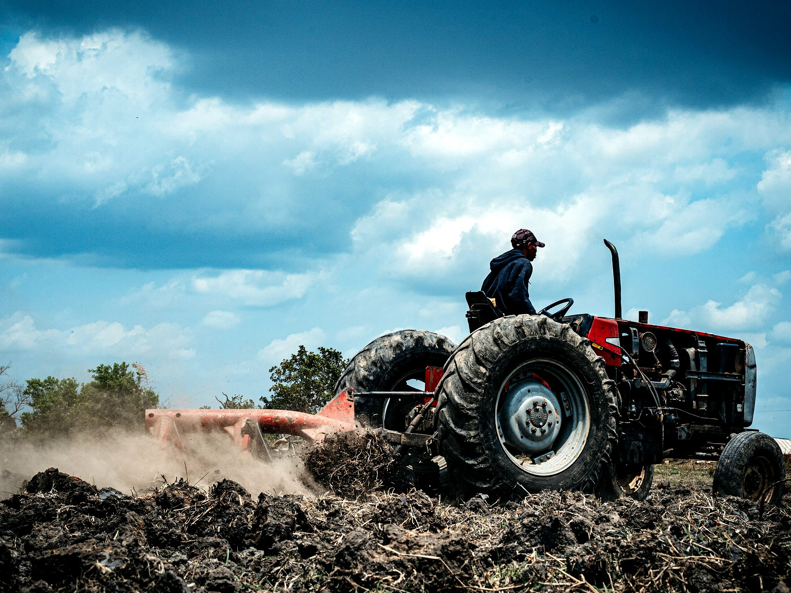

Call it AI if you want the current trademark. Call it a robot if you want the older one. Call it an android if the hull is a courtesy to human doorways. The physics does not care about the courtesy. The physics cares about joules per bit, about error-correcting memory against cosmic rays, about a reactor that still knows its job after a century of quiet. Appendix A31 writes the dose and the two speeds. Here, keep one image: a thing that does not sleep, hanging in the dark, carrying a library, aimed at a lid of ice.

The quiet is the job. Galactic cosmic rays — a drizzle of fast nuclei that no planetary magnetic mood is catching — punch bits all century. Unshielded flesh, in deep space, collects a career-limiting dose in a handful of years: tenths of a sievert a year, order of, enough to make a human worldline a bad hire for a four-century commute. The machine does not have marrow. It has parity, redundancy, a memory that expects to be wrong and keeps a spare. A grain of dust at a tenth of light is not dust. It is an energy rumor with a mass. Slowing down at the far end is a second fortune, as rude as leaving. Chemical tanks will not pay it. A brick that still knows how to be a brick after a hundred years of cold might.

The nearest other sun is not a farther greenhouse. Chapter 25’s lag is light-minutes. A radio call is a bad afternoon, then an answer. Four light-years is a letter you mail and then inhabit the wait. Flesh inhabits it as a different age. A machine inhabits it as a different set of flipped bits. Orders that need a conversation will not survive that postage. The orders that survive are the dull ones: if the gyro sulks, vote; if the star has drifted, burn this much and no more; if the ice says a chemistry is already copying, do not open the box.

Leaving is only half the fortune. At a hundredth of light speed, the energy stored in one kilogram is already a violent number. Appendix A31 writes the digit. You paid it to go. You pay a fortune of the same order to stop, or you arrive as a flash. There is no coasting into a polite orbit around a star you have never visited. The brake is a second departure, pointed the other way, and it has to still work after centuries of cold. Chemical tanks are a way to leave a planet. They are a poor way to throw that motion away at the far end. A brick that fissions, or a sail that can turn and take the destination star’s light as a headwind, is a sentence you are allowed to write. A sentence is not a tank farm.

Dust is the killer the posters draw as sparkle. A grain the size of a pollen mote, met at a tenth of light, does not bounce off a windshield. It arrives as a little explosion. The cruise does not need a mountain in the road. It needs a haze. A shield in front — a slab of something dull, or a cloud of grit you carry as your own bumper — is part of the crew. The shield will be holed. The holes are why the memory keeps a spare, and why the spare does not sit in the same drawer as the original.

Who fixes the fixer is the question the metal-person poster skips. A drill that can melt ice cannot, by that talent, replace its own bearing after a century. You send a shop: spare arms, a way to make a simple part from feedstock you carried, a test that says the new part is the old part and not a flipped-bit cousin. The shop is mass. Mass is the invoice Chapter 32 will refuse to let you spend on a flag. The cleverness is not a mind that founds a religion at the far end. The cleverness is a drawer of dull parts and a procedure short enough to audit before you leave.

Flesh has been offered three ways out, and none of them is signed. A generation ship hires children as the propellant: born, taught, buried, and the destination still a rumor for the first many lives. The teaching has to survive without the Earth that wrote the curriculum. That is a culture you are inventing, not a motor you are buying. Suspended flesh asks biochemistry for a pause it has not given large animals. A box of embryos asks for a nursery run by the machine, which is Chapter 32’s printers wearing a kinder name. All three still collect the dose if they ride awake in a thin can, and all three still owe the brake. The crew that does not sleep is what is left when you decline to hire a childhood as fuel. That crew is who covers the window Mara cannot stay for. Her afternoon is light-minutes. Theirs is centuries.

Mara, hitting the airlock, is still the ticket we can price. Her delay is an afternoon. Her food is a potato with a mass you can lift. Her failure is a jammed door, not a civilization that forgot why it left. Keep her in the frame when the cruise starts to sound like destiny. The cruise is her invoice with the stamps changed from minutes to centuries. If you cannot stand her afternoon, you cannot stand the quiet.

It wakes, if it wakes, for a star that has drifted, a gyro that has sulked, a bit that flipped and must be voted off the island. Then it sleeps again, which is a word for a low-power wait, not a dream. This crew wants a plug you can still reach from Earth for the first years, and then a set of orders dull enough that a flipped bit cannot found a religion. Chapter 29’s melt-probe is the same object on a shorter commute. Chapter 32’s library is the cargo that makes the commute worth the failure rate. Chapter 25’s greenhouse is the near ticket: a jammed door, a late radio, a potato.

This is not the Omega Point. It is not destiny. It is a project with a failure rate. The machine can miss. The ice can be thicker than the melt. The sea can be sealed from rock. The sea can already be taken. The project is still the way “long travel” stops being a poster.

A pattern engine that completes a sentence is not this crew. “AI” in a kitchen now finishes a phrase, folds a protein, aims a weapon, or lies with a straight face. That is already a fact. It is not a mind, and it is not a toy. “AI” on a century cruise is a control loop that must still make sense after decades of bit flips. We own the beginnings of the first. We do not yet own the second. Keep the plug in reach.

Will the first eat the species that built it? Take the keys? Be better? Three different questions. The posters fuse them. Ask what the device does, in a room you can walk into. *Will it take over?* is not a question until you say what takeover is — a board vote, a power grid, a goal that keeps itself on when you try to pull the plug. *Is it better?* is not a question until you name the task. Better at chess is hot. Better at being Mara in the greenhouse is a category error with a marketing department.

Two serious ideas about mind sit under the better-question, and they do not shake hands.

One says a someone is a pattern in matter. Computation is physical. Nothing in the block forbids a later architecture from being a someone. Nothing in the block requires it of a chatbot. A duplicate loop, if you ever had one, would be a second person, not a hop. Chapter 40 already refused the hop.

The other says a someone is not a program. A formal system cannot, from inside, certify every truth a mathematician can point at, and that incompleteness is used as a wedge: if understanding is the wedge, no stack of tokens is a mind, however fluent. A stronger version ties awareness to a collapse that gravity itself is supposed to finish. That is a minority research program. It is not helium. Appendix A40 keeps both morals of the same theorem. If the wedge is right, the century crew can still steer a melt and still not be a colleague. If it is wrong, a colleague remains a physical permission, not a press release.

The same theorem faces the other way, and Chapter 6 already used that face. Incompleteness can be how a formal system talks about itself and an “I” appears: a tangle, a translation, a map that contains the mapmaker. On that reading a pattern engine that completes a phrase is a very large parrot. A someone would be a loop that stays closed. We do not own that loop in silicon. The fight is unfinished. Neither chair is a license to send a cruise without a plug.

A goal that improves itself, and that we cannot switch off, is a warning rather than a theory of mind. Extra assumptions about speed and stable preferences turn the warning into a scheduled apocalypse. The Omega Point already tried to make a mind into a law of the future. The shove declined. Fraud at scale, a targeting loop that does not get tired, a design assistant for a plague, a civilization that lets the engine write procedures it then cannot read: those are hot as a class of misuse. Takeover by a new agent that treats us as the nest in Chapter 32 is an extra hypothesis. Treat it as an engineering fear for a reactor, a silo, or a century cruise. Do not treat it as a calendar.

Alignment is local control on one thread. It is not a destiny. Do not ask the tool to be better than a person at being a person. Ask it to be better at the task, and to stop when the task is done. A machine can wait. Waiting is not wisdom.

Chapter 32 is the box this crew would carry.

Appendix A31 writes the cruise times, the dose, and the temperature of the warning.

---

\newpage

## 32. A Library of Earth

If you send a crew that does not sleep, send more than a flag.

Earth’s interesting inventory is not its iron. Iron is common. The interesting inventory is a trick of carbon and water that learned to copy, then to remember, then to write the memory down. The memory, at the bottom, is sequence. You can put a surprising amount of it into a box. A mountain vault holds seeds because mountains outlast ministries. A cruise to a dark sea puts sequence into a memory that expects rays, and into printers that must themselves survive the trip. Sequence without a kitchen is a book no one left standing can cook.

A human genome is a novella: a few billion letters, small once the repeats are compressed. A bacterium is a pamphlet, shorter by orders that Appendix A32 actually counts. A biosphere is a literature. The box that holds one ape, one crop, and a slogan is a vandal’s suitcase. What you want, if you are not a vandal, is a staff, named below, and a wet lab that can turn a recipe back into a membrane. The printers are kitchens. They are not magic. Appendix A32 writes the sizes and the protection categories.

What goes in the box is that staff, and the list is dull on purpose.

One human genome is a vanity. It does not farm a vent, fix a soil, or turn grit into a potato. A crop without the microbes that make the crop a crop is a poster of lunch. The useful list is long and unglamorous: a bacterium that eats rock and exhales a gas you can measure, a bacterium that makes a dirt, an alga that takes a dim light and does not demand a yellow sun, a yeast that will ferment what the alga leaves, seeds of a few plants that already know a winter, and the viruses of those organisms only if you have a reason you can say out loud. A reason you cannot say out loud is a souvenir. Souvenirs are how a suitcase becomes a vandal.

The printers are the part the poster skips, because the poster wants the letters to be the life. Letters are a recipe. A recipe needs a kitchen: the feedstock the script eats, membranes, salts, a temperature that stays inside a narrow sulk, a way to keep the wrong chemistry out. That kitchen has to survive the cruise Chapter 31 just priced. A hard drive in a heavy box is the easy kilogram. The wet lab is the rude one. It freezes. It sheds a film you did not order. It wants power in the year the reactor is quietest. If the lab dies, you have a literature and no cook. That is a museum. A museum is a decent building on Earth. Under an unread ice it is a failed errand.

Look first has a method, and the method is slower than a pour.

You taste before you seed. A plume, if the moon has one, is the cheap exam: molecules in a spray, no hole yet. A melt is the expensive exam: a thread through the shell, a sample that is not a puddle of your own machine. Chapter 29 already hired the thread. This chapter only refuses to let the library jump the queue. The exam can come back empty, and empty is allowed to mean “we did not see it,” which is not the sentence “it is not there.” Seed later means you wait until empty has been graded. Boredom is not a measurement.

Copying, inside the box, is not photocopying. A library that sits in a ray for a century will not be the library you sealed unless you kept the spares and the votes Chapter 31 already required for the gyro. A flipped letter in a navigation file wrecks a burn. A flipped letter in a genome wrecks a protein, or does nothing, or does something you will call a discovery because you were not there to call it a typo. Seal more than one copy. Store the copies in different drawers. Check them against each other before a printer is allowed to believe them.

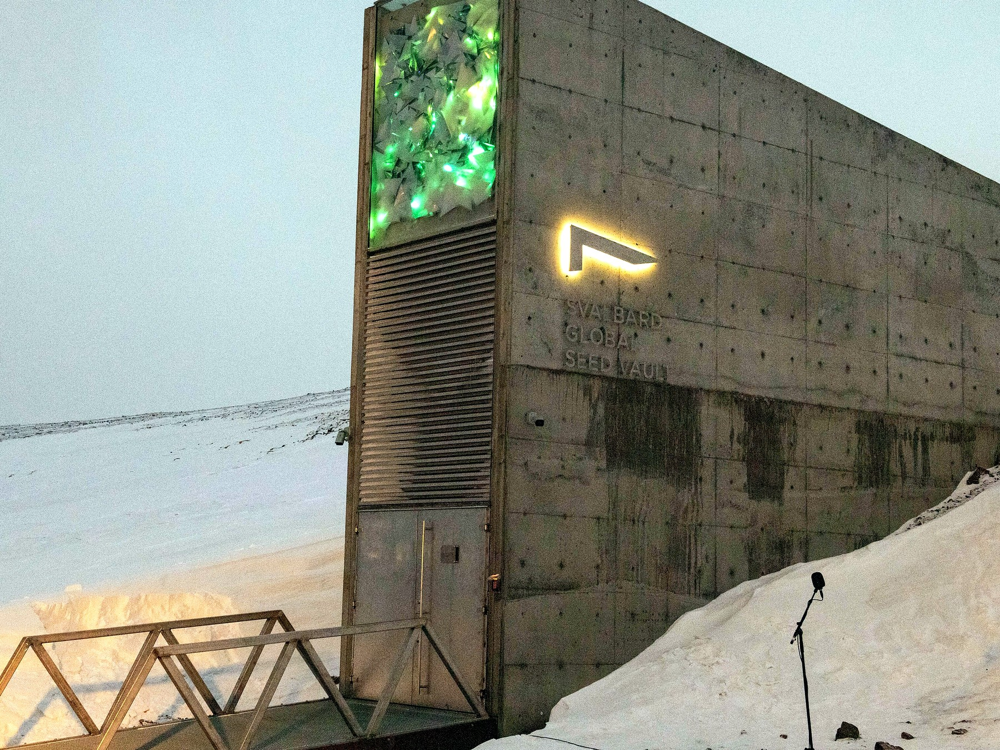

Mara’s trays in Chapter 25 are the empty-exam case, run small, on a world close enough to argue with. The library stays shut until a world has been tasted. She will not open the box on a chemistry she has not graded. A dark sea is not that world until the melt says so. You cannot know from the basil. Light-hours of delay do not carry a verdict from under the ice.

Directed seeding is an old idea with Crick and Orgel’s names on one famous version: maybe someone already did this to us, or we do it next. Cold as a detection in our rocks. Warm as a project we might do, and therefore a project we can refuse. If Europa’s sea has a biosphere, our dirt is a conquistador. If it does not, the same dirt is a greenhouse. Chapter 29 already hired the rule. This chapter is the box the rule governs.

Would we know, if the pour had been ours, four billion years ago? The leftover glow does not say. The rocks of the first wet days are almost gone. What we have is one code, one handedness, and a chemical path that is incomplete and not empty. A serial number in the genome has been looked for by people who wanted to find it. What they found was mostly leftover we had misread. A seeder still needed a kitchen somewhere. The first hour does not disappear because a librarian arrived for the second.

Ants are the scale worth keeping.

A leafcutter city farms. It wars. No worker negotiates with us. We step over, or we study, or we pour. To a crew that crossed a century, an ape city may be that nest: impressive at its own size, not a colleague. Chapter 6 used the nest as a diagram of a self. Chapter 30 spends the same scale on a visitor who files the cars and misses the mite. Here the scale is a warning about the box. Talking is not what you do with a nest. Pouring is. If the printers work and the look-first failed, the box is the pour.

The printers cut the other way too. A wet lab that can make a cell can make a plague. Sterility is filters and assays, not a mood. The box is as dangerous as it is precious. A librarian who only loves the literature will pour. A librarian who only fears it will never farm a dead world whose exam is already empty. The rule splits the cases. Do not mix the folders.

The same rule runs back toward Earth, and the poster forgets that direction because the poster faces out.

A sample that might still be a kitchen does not come home in a pocket. It comes home in a box inside a box, opened in a room you can afford to throw away. Appendix A32 names the policy. You do not put an unread sea on the same bench as the basil. The crew that can wait is useful because waiting is the method. A schedule for planting a flag is how you fail it.

Mass is the only vote that counts on the day you leave.

A vault in a mountain is already a building, a staff, a power bill, and a politics. Put that vault on the cruise and you add the shield, the brick, the spare drawers, and the years of quiet. Every kilogram of literature is a kilogram you did not spend on the brake. The vandal’s suitcase — one ape, one crop, a slogan — is light, and light is its temptation. Light is not sufficient. Sufficient is a staff that can live in the trick the destination actually offers. A vent wants rock-eaters. A dim tray wants light-eaters that will not sulk for a yellow sun. Chapter 25’s dead greenhouse wants the potato and the microbes that make the potato a potato, because that exam was a close world with no sea hiding a second dictionary. Do not copy that shopping list onto a dark moon because the word “seed” felt brave.

Special relativity still makes the mail late. Quantum mechanics still makes the recipe a sequence of letters, not a spark. General relativity still refuses a handle unless someone pays Chapter 33’s bill. A being printed at the far end can look like a miracle to a city that did not own the printer. It is a miracle of logistics.

A library of Earth, carried well, is still Earth. The letters are ours. A second dictionary, Chapter 30’s jackpot, is what this box must not pretend to be. Pouring our dictionary into an unread sea writes a shipping label where an exam should have been. The crew that does not sleep can wait a century. It cannot wait an origin. Look first is how you refuse to spend the only data. Seed later is how you farm a room that has already been graded empty.

You do not pack a forest.

A forest is a queue. A film comes first. The film makes a dirt. The dirt holds a root. The root holds a shade the film never asked for and the later plant cannot live without. Print the later plant on the first day and you have shipped a corpse with a pedigree. Print the film, in a room that can stand it, and a queue can start. The box holds rungs, not the finished stair. The stair between the pamphlet and the ape is a staff, and the staff is what the departure has to lift.

The first rung should be an instrument, not a mascot.

A rock-eater that breathes out a gas you can see from outside the room is a measurement that happens to be alive. You chose it because the exam can fail in public. If the gas never comes, the printer lied, the room refused, or the recipe was the typo the spare copies were there to catch. Those are three different failures. A thing that looks like a pet and changes nothing you can detect will report success to the people who miss it. A gas will not.

The reader has to outlast the letters.

A vault you cannot open is geology. A file you cannot parse is the same rock with a prouder story. The script has to travel with a reader that still knows which mark is which after the ministry that wrote the labels is gone. Mountains outlast ministries, and ministries are who letter the drawers. Put two readers in two drawers. Put the key in a form a person can still sound out, not only in a format that dies with a company. The crew that does not sleep can keep a machine awake. It should not be the only speaker of the alphabet left on the cruise.

Chapter 30 already set a poison beside the gift. The life we know has a handedness. The mirror of it is a maybe, not a second Earth the box is obliged to carry. Packing both, because completeness sounds like care, is how a knife gets into the suitcase. An empty exam wants the trick we have actually run. A taken sea wants nothing this box can give. The mirror does not get a third folder in which the rule was shy.

A mountain outlasts a ministry. A cruise outlasts a body. Neither outlasts a mistake poured into a sea that already copies.

Appendix A32 writes the numbers.

---

\newpage

## 33. Handles, and the Bill

Now the cheat.

A wormhole, in the only picture that does not lie, is not a subway. It is a handle on the loaf. Two distant regions — two spheres in space, if you want the honest shape — are neighbors by a short extra piece of geometry. You do not fly the long way. You fall *in* a sphere and come *out* another sphere. Light from the far side fills the mouth like a crystal ball. The mouth is not a manhole in a floor. It is a ball in a room.

Keep the ball. Posters draw a glowing ring on a wall, a door you step through like a cellar. The geometry that actually sits in the equations is spherical: a region of space whose interior is identified, by a short throat, with the interior of another sphere somewhere else. Walk toward the ball and the far kitchen swells in it, a crystal-ball picture made of real light taking the short way. Walk into the ball and you have not gone “through a surface into a tunnel painted on the wall.” You have fallen along a handle. Two rooms that were distant on the long loaf are neighbors by extra bread. If you cannot picture a ball, picture two mouths of a worm in an apple, except the apple is spacetime and the worm is a sentence we have not paid for.

Einstein and Rosen found a throat in the Schwarzschild geometry in 1935. It pinches. Nothing useful crosses. In 1988 Morris and Thorne wrote down a throat that stays open. The price is matter that, in some frames, has negative energy density — *exotic* in the jargon, rude to the energy conditions that let Hawking and company prove their theorems. Ordinary stuff focuses. A throat that stays open must defocus. You are asking the loaf to do the opposite of what mass usually asks.

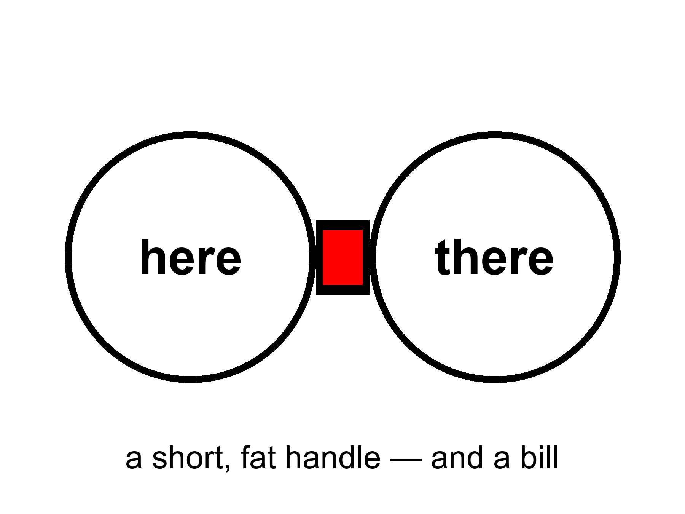

Quantum field theory allows small, brief negative energies. The Casimir effect, between two plates, is the laboratory ghost of that permission. Quantum inequalities then say you cannot pile the ghost into a ship-sized hallway and keep it on duty. The honest status: allowed as a sentence in general relativity; probably forbidden as a station in engineering. Appendix A33 writes the condition. We will not pretend a handle is a purchase order.

Two plates, a tiny gap, a vacuum that is slightly less eager between them than outside: that is Casimir’s kitchen. The force is real. The energy density, in the gap, can be written as negative compared with the ordinary vacuum. Kitchen permission: the vacuum is not a nothing; it has a ledger; the ledger can, briefly and locally, go below the line ordinary matter respects. Kitchen refusal: the gap is millimeters and less, the time is not a career, the energy is not a ring around a cabin. Ford and Roman make the refusal quantitative — magnitude times duration times volume, a budget the ghost cannot overspend. A throat you could fall through, and come out still yourself, for the minutes a commute would take, is the overspend. “Probably forbidden” is the grown-up temperature. Not helium. Not a ticket.

If a handle existed, it would not be a machine that “goes.” It would be a feature of the loaf, already there, the way 1914 is already there. Moving one mouth, if you could, is how people turn a handle into a loop, and a loop into a problem for the next part. First, pay the bill.

The bill is not in dollars. It is in a kind of stuff we have never stacked.

Ordinary mass, in Einstein’s theory, is a focusing lens for light. A bundle of rays that just grazes a star comes out slightly more converged than it went in. That is why Hawking and company could prove that, once focusing has gone far enough, a collapse has a point of no return: a singularity, or at least a place the theory itself will not describe. The null energy condition is the kitchen rule that lets the proof run. Spreading is a defocus. Defocus, in this ledger, is the rude stuff.

The null energy condition, a rule of thumb that ordinary matter respects, says that light rays, on average, get focused by stuff. A traversable throat requires a defocusing, a violation, along the hole. You can write solutions that do this. You cannot, today, point at a tank and say “that is the defocusing, please load it.”

Ford and Roman’s inequalities are the killjoys: the more negative the energy, the shorter the time you may have it, in a given volume. Macroscopic and long-lived fight each other. A ship-sized, hour-long throat is the kind of request the inequalities seem built to refuse. “Seem” is doing some work. The refusal is not a theorem about every possible loaf. It is a strong hint from the quantum rules we actually use.

Moving a mouth, if you could, is the other temptation. Park one sphere in this room. Park the other in a far kitchen. Then tow one of them, slowly, on a long cruise, and bring it home. The two mouths now disagree about which slice of loaf they sit in. A round trip through the handle can become a round trip through *when*. That is not this chapter’s gift. That is Chapter 35’s problem, and Hawking’s hunch that the vacuum will not sit still for it. Even granting the tow, you still owed the exotic bill to keep the throat from pinching while you drove. The pinch is the default. The open throat is the unpaid invoice.

Is there a real way to go faster than light by bending the path?

There is a real *sentence*. There is not a real ticket.

Special relativity is a rule about the loaf’s local manners: nothing with a mass, in its own little room, outruns the light in that room. General relativity lets the rooms themselves be rearranged. You do not beat the messenger. You shorten the hallway. A handle does this by adding a shortcut between two spheres. A warp does this by squeezing the loaf ahead of you and stretching it behind, so the destination slides toward the kitchen while you sit, locally, as if you were at rest. Miguel Alcubierre wrote that bubble down in 1994. Inside, the tea does not spill. Outside, the geometry does the commute. Light still wins every local race. The arrival can still beat a light-beam that took the long way through the unbent loaf. That is the whole trick, and it is not a cheat of Einstein. It is Einstein used as a contractor.

The contractor sends a bill we have never paid.

The skin of the bubble needs the same rude stuff as a throat: energy, in some frames, that is negative — a defocusing, a violation of the null energy condition, equation (17). Early estimates asked for a Jupiter of it. Later papers shaved the number by reshaping the skin. Shaved is not stacked. We have Casimir plates and other ghosts. We do not have a ring of ghosts around a cabin. Ford and Roman still mutter: the more negative, the shorter the time you may have it. A bubble you could live in, for the hours a star-trip would take even when the hallway is short, is the kind of object the inequalities seem built to refuse.

There is a ruder catch, and it is the one the posters skip. **Bending the path usually means the path is already yours.** The front of a warp bubble is, in the ordinary writing, causally disconnected from the cabin. You cannot reach out and steer a geometry you have not already laid. Turning the bubble on, from the inside, is like lighting a fuse that has not been strung. Someone — or some machine — has to arrange the loaf along the route first, or meet you from the far end, or leave a tube in the bread on an earlier, slow pass. Krasnikov’s tube is that last idea: go the long way once, leave a modified hallway, come home short. That is not a point-and-go. That is paving. Paving a century of loaf with exotic asphalt is not a smaller project than the cruise in Chapter 31. It is a larger one, wearing a faster hat.

The woman hitting the airlock already knows this invoice in a duller coin. She does not shorten the hallway to Earth. She waits twenty-six months for the cheap fall. A tube that had to be laid by a first slow crew is that wait, dressed as a miracle for the second crew. The first crew is still Chapter 31. The exotic asphalt is still a stuff we have not stacked. If your plan to beat light begins with “first, spend a century paving,” you have not beaten the greenhouse. You have hired it as a contractor and then asked it to invent a solvent it does not stock.

If you *could* pave at will, you could also turn the pavement into a loop: two short hallways, badly timed, and yesterday is a stop. Hawking’s hunch from Chapter 35 is waiting there. The universe, asked to let you arrive before you left, may explode the pavement instead.

So the grown-up inventory is short. No local dash past light. No switch that nulls weight because you said so. A handle, a bubble, a tube: three shapes the loaf might wear, all of them sentences in a theory we trust in the rooms we have tested, all of them hungry for a stuff we have not stacked, all of them easier to write than to start from a cockpit. The woman in the greenhouse, the melt-probe in the dark sea, the crew that does not sleep — those remain the transit system. Handles and bubbles stay in the appendix, where a bill belongs. The galaxies that have already left stay gone. A nearby ice, a nearby dirt, a nearby library: those are still in the cone.

The pinch is worth one more look, because it is the default the posters skip. Einstein and Rosen’s throat is a mathematical kindness in a diagram: two exteriors, a neck, and a neck that thins to nothing in a blink of proper time. Nothing useful crosses. Morris and Thorne asked for a neck that holds. Holding is the exotic bill. If you cannot pay it, you have Kruskal’s pinch, which is a curiosity, not a commute. If you can pay it, you have a ball in a room and a second bill when you try to move the ball through time. This book will not sell you the commute. It will sell you the invoice. The greenhouse does not need a handle. It needs a window that two planets already wrote, and a glove.

Tea that does not spill inside a warp is a true sentence about a false ticket. Local manners can be perfect while the global commute is a fiction we have not stacked the matter for. The same is true of a throat that stays open on paper. The woman, the melt, the waiting crew: those are rude and finite. Rude-and-finite is the temperature of a real path. Handles stay in A33 with equation (17). Pay the bill there. Do not cash it in a cockpit.

Appendix A33 writes the flaring-out condition and equation (17). Here, keep the ball in the room and the unpaid invoice. The pinch is free and useless. The open throat is useful and not free. That is the whole cheat, priced.

---

\newpage

## 34. The Watchmaker, and the Signal

When the basil lives and the ice melts and the leftover glow looks arranged, a temptation arrives: *someone did this.*

A slab that teaches apes to use tools. A gardener who lights a new star for a moon. A visitor who lands because we played five notes. Those are stories. They are allowed as stories. As physics they have a job they have not done: they must predict a signature we can miss.

A craftsman who wanted liquid water could have used starlight bands or tidal seas. We have both, and they look like maps, not signatures. A craftsman who wanted observers could have left a serial number in the leftover glow. The glow’s freckles look like stretched noise. A craftsman who wanted contact would not be limited to the speed of light, unless the craftsman is also a physicist with our constraints — in which case the craftsman is us, later, in a machine that does not sleep, and we are back at a project.

The oldest version of the temptation has a better address. It asks whether a river kingdom already knew.

Say the obvious first. Egypt knew the sky as a tool. They aligned million-ton tombs to true north within a fraction of a degree — not by luck, by stretching ropes and watching a star that does not travel far. They ran a calendar off the Nile and off the heliacal rising of Sopdet, the star we call Sirius, because a flood that feeds you is a clock you do not get to ignore. They had decans, surveying, a geometry that could lay a square on sand and make it stay. They wrote the work down. We have quarry marks, worker villages, a diary of a man who hauled limestone for a king. The stone did not arrive from another sun. It arrived from a quarry, on a boat, by people who were good at their job.

That is already a lot. It is allowed to astonish you. Astonishment is not a visitor.

What they did *not* know is the leftover glow, the shove, the block, the fact that Andromeda is a navy of suns. They had a sky full of meaning — a Duat, a night boat, an afterlife with a map — and meaning is a kind of knowledge. It is not the same kind as a microwave temperature. A culture can be brilliant at north and still not own cosmology. Those are not contradictions. They are two different kitchens.

The sermon that follows is the one that steals the work. *Someone must have told them. The shafts point at Orion on purpose as a physics lesson. The ratio of the base to the height is a message about circles that only we can read.* Some of the numbers are real: a seked, a cubit, a slope you can repeat. Some are what happens when you go looking for π in any pile of well-cut stone. Selection is a craftsman too. Shafts that face a northern star are what you get if you care about the unmoving sky and you have a burial to aim. They are not a telegram from Chapter 8.

Did they know something we forgot? They knew how to live with a river and a year and a death that needed a house. We forgot some of the patience. We did not forget a hidden physics. If a gardener had numbered those stones, the number would survive a translation into a channel nature does not use. What survives is architecture, administration, and a sky used as a clock. That is enough. It is also the grown-up sentence: **give a long state a flood and a bureaucracy, and it will invent north.** You do not need a colleague with different ears. You need time, food, and someone who writes the rope-length down.

Then there are the lights.

Not the leftover glow. Lights in *this* air. The temperature is locked before the stories: a residual in serious instruments can be hot as “something was there”; every name for it — ours, secret; someone else’s workshop; a colleague — stays cold until hardware you can hold, or a channel nature does not use, is on the bench. Say the obvious first, or the skepticism is just a mood.

Something is there. Not in every backyard video. In the stubborn cases: a carrier group, a spy radar that had been seeing “things” for days, two navy pilots who flew up to a pale lozenge with no exhaust, no rotors, no thermal plume, and watched it stay in the wind over a disturbed patch of sea, then leave in a way their jets do not leave. A wing camera wrote an infrared tape. The navy later let the tape out of the bag, stood up an office, and printed the dull word *unidentified*. That sequence is not a campfire. It is what a serious institution does when its own instruments have leftover.

What did they film?

They filmed an object, or a phenomenon that holds still long enough to be an object. Infrared is a thermometer with a zoom, not a novel. Without a range, a small drone nearby and a large hull far away wear the same pixels; a turn of the pod can look like a miracle. Some of the later famous tapes really are that kind of homework: glare, parallax, a balloon that was never a visitor. Admit those too. The best case is not those tapes. The best case is the day the radar, the eyeballs, and the camera were all pointed at the same leftover, and the leftover did not fly like an airplane. You can argue about the last burst of speed. You cannot honestly argue that nothing was there.

Two other obvious things.

If the leftover is ours — a classified drone, a test article, a trick of electronic warfare — then the obvious sentence is not “go home.” It is: someone already builds machines the briefing does not mention, and they already share the sky with nuclear carriers. That is remarkable even if it is dull. If the leftover is someone else’s — another flag, another workshop — it is the same sentence with a worse budget meeting. Human homework still has to obey energy, materials, and light. It does not get a free pass because it is embarrassing.

If the leftover is *not* a known workshop, then “I don’t know” is the grown-up line. Not “nothing.” Not “a colleague.” A real residual with bad range and no wreckage. Science starts there. Kitchens fill with stories there. The job is to stay in the residual without hiring a priest or a joker.

The pilots are not the problem. They saw a thing in a place they are paid to see things. The leap is not “they lied.” The leap is “therefore a face, a future, a hop.” Chapter 30 already fired the face as a default. The physics still has to hire the vehicle, or admit it has not.

So: where would it come from, *if* the leftover is a vehicle we do not own?

**Our own future.** The loaf does not offer an edit. If a later crew could ride a loop, the visit was already in the inventory; Chapters 35 and 36 will not give you a sandbox, and Hawking’s hunch is that the vacuum explodes if you try to build the ride. Even granting the ride, buzzing a fighter jet is a strange errand for a civilization that can borrow yesterday. Cold as an account of these tapes. Warm only as a reminder that “us, later, in a machine that does not sleep” is already a project in this book — and that project arrives by the long road, late, with a library, not as a lozenge in a dogfight.

**A parallel world.** Everett’s leftover branches, if that reading is right, are inventory, not a ferry. There is no hop. There is no note. Chapter 40 will say this again because people want it not to be true. Cold.

**Our past.** A gardener who came, left, and forgot to number the rocks. That is the watchmaker again. The rocks we have look like rocks. A secret workshop in *this* century is the warmer past: not antiquity, last Tuesday, and classified on purpose. Dull. Allowed. And — say it — sometimes the *best* fit for a leftover that looks like a machine and shares a range with a navy. “Often enough” is not “always.” The best cases are exactly the ones that have not been publicly walked back to a balloon.

**Another planet, traveling forever.** This is the least rude extraterrestrial sentence, and it still pays Chapter 31’s bill. A crew that does not sleep can, in principle, spend centuries and arrive. Light is late; flesh is worse; a machine can wait. That possibility is obvious as physics and unproven as a caption on these leftovers. Why *this* air, *this* decade, *this* game of tag, and no wreckage, no radio, no serial number in the leftover glow? Those are fair questions. They are not a proof of absence. The Fermi quiet — if the sky is full of travelers, why is the mail this bad? — is a smell, not a gavel. Warm as a project the universe permits. Cold as a filled-in name on the tape. The honest middle is ugly and correct: an interstellar machine is allowed by the chapters we already wrote, and we do not have the hardware that would make us say we have met one.

**Beamed.** A handle, a printer, a body assembled from a recipe sent at light. The handle still owes the exotic-matter bill. A recipe still needs a kitchen on this end; that is Chapter 32’s library, and it is a box we would notice if it were sitting in a field. Teleportation without a printer is not a sentence in the physics we have. Cold.

**A thought without ears.** A schoolyard, a crowd of children, a craft on the ground and a message that arrived behind the eyes. That story exists, and the obvious part is that many children, the same morning, described a thing in the same dirt. Something happened in that yard — a sight, a panic, a shared picture. Children are not a lesser instrument; they are an instrument without a rangefinder and with a powerful need to agree. Memory is social. Expectation is contagious. None of that makes them liars. None of it hires a new force. Telepathy, as physics, is a channel that has never shown up in a lab where you can miss it. Information still has to be carried by something that exists — light, sound, a chemical, a shove. A mind-to-mind radio that beats light, or skips the air, is not on the inventory we can test. Cold as a mechanism. The schoolyard remains a human event we have not finished explaining. “Not finished” is not a second universe. It is also not a shrug.

Do quantum mechanics and relativity play a role? Yes — as bills, not as costumes.

Special relativity is why a seeder’s mail is late, why a lozenge that really moved at a serious fraction of light in air would have written a louder signature than a tape, and why “beamed here” is still a years-long letter unless the printer was already in the room. General relativity is why a handle, a warp, a nulling of weight, is not a switch: gravity is the loaf, and a throat still owes Chapter 33. The one warm “future-us” that relativity permits is not a loop. It is a twin who went fast and came back younger — a Chapter 31 cruise, not a raid on yesterday.

Quantum mechanics is why the library is letters that copy with mistakes, why entanglement is not a schoolyard radio — the no-signaling theorem is a killjoy with a proof — and why “they vibrate at a higher frequency” is not a sentence in the theory. The hole we actually have is that the two great theories do not yet share a kitchen. That hole is real. It does not fill in a gardener, a pour into the first ocean, or a leftover in a dogfight. String theory, if you want the name, cannot currently be tested; it does not get to be a visitor’s engine either.

What would count, if you are not here to be thrilled?

Hardware you can hold, with isotope ratios and a microstructure Earth does not pour. A trajectory, range-complete, that violates the energy a craft that size can carry — and still looks the same when three instruments that are not friends agree. A message in a channel nature does not use. We do not have those yet. What we do have, in the stubborn files, is already enough to forbid two lazy sentences: *nothing happened*, and *so it was a person from another world*. The leftover is obvious. The name is not.

Why did a legislature suddenly want a hearing?

It was not sudden if your file starts in 1947. It was sudden as a *public, funded, unembarrassed residual*. In 2017 a newspaper printed a Pentagon office that had been buying the question. In 2020 the navy authenticated the tapes. In 2021 the law required an intelligence assessment. Hearings followed. A majority leader put disclosure language in a defense bill and watched it thin out in negotiation. That is not a conversion to a colleague from another sun. That is what a state does when three boring fears line up.

First: air domain. Drones, cruise missiles, hypersonic tests, someone else’s homework in a range you thought you owned. A leftover that can sit over a carrier is, if it is a machine, already an operational fact. Stigma — the joke that used to keep pilots quiet — is, in that light, a security hole. Second: oversight. Classified programs live in the same sky. A congress that cannot tell a leftover from its own black budget is a congress that is being managed. Third: nuclear nervousness. Reports that cluster near weapons and reactors are, even when they are noise, the kind of noise a committee is paid to hate.

Some members want the other caption. Testimony has been given, under oath, of retrievals and of craft that are not ours. Testimony is a record of a claim. It is not a hull on a bench. Appendix A34 still wants the isotope. Admit the obvious without the choir: **Congress got interested because the leftover entered institutions that can be embarrassed, in a decade when being surprised in your own air is a career-ending sentence.** That is smarter than an awakening and ruder than a debunking. It leaves the stubborn files where they were — unnamed.

Appendix A34 is the dull list. The Blind Watchmaker of the filter chapters is the working tool. The greenhouse is not evidence of a gardener. It is evidence of a gardener *we know*, wearing a glove, hitting an airlock.

If someone else has a radio, the radio is late.

A yes-or-no from the nearest other Sun is eight years of round-trip at light, if they answer on the first try, if they listen our way, if they exist. A conversation is a career. A conversation with a tidal sea’s inhabitants, if they have not invented radio because they have not invented eyes, is a melt and a guess. SETI is a search for a very specific kind of waste heat and timing: someone who learned to shout in electromagnetic. Most of the habitable map in Chapters 27 and 28 would not shout that way.

The shout, if you want a picture of a missable one, is not a hello in English. It is a channel nature does not use: a narrowband whistle, a timing that is not a pulsar, a modulation that looks like a prime because primes are a habit mathematicians share and rocks do not. Drake’s famous product is a parameterization of ignorance — a row of fractions we have not measured, multiplied until they look like a population. It is not a census. It is a list of things a dish cannot yet count: how many rooms are wet, how often wet becomes a trick that copies, how often the trick learns to shout, how long the shout stays on. Ice seas in Chapter 29 can be wet and silent. A second origin can eat rock in the dark and never hire a radio. Most of the chairs in Chapter 27 are empty of us; they may be empty of shouting too. The dish is still the clean search. Clean is not complete.

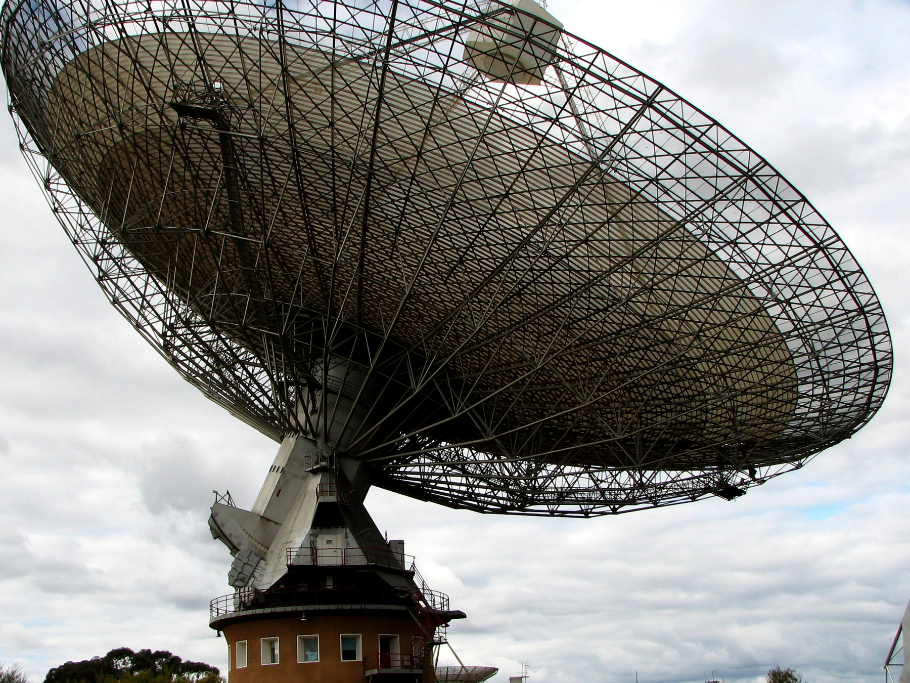

A signal is not a savior. It does not fix the shove. It does not open a handle. It does not make the Omega Point required. It is a fact about another worldline, arriving late, the way Andromeda’s navy arrives late. If we ever hear one, we will not have been rescued. We will have been informed that the trick of carbon and water happened twice, or that a machine that does not sleep learned to shout.

An unidentified light in our own air is not a better savior. It is a closer residual: sometimes a pixel with no range, sometimes a radar and two eyeballs and a camera on the same leftover, and still not a sentence we can read. If a visitor were here, the visitor would still be a worldline, late or local, paying the same bills as the rest of this part. The clean search remains the one that can be missed — a dish, a spectrum, a plume, a melt. The dirty search is the one we already have, and it is not empty.

Until then we have a greenhouse, a dark sea, a library, and a delay. That is enough to be getting on with. It is already a better story than a door. Chapter 41 is where this watchmaker meets the filter and is refused a hire. The six chapters between are copies and loops. They do not reopen the signal.

\newpage

# PART VII — Loops

---

\newpage

## 35. Time Travel Is Not an Edit

The kitchen fantasy of time travel is an edit. You go back, you unsay a sentence, you save a person, you kill a tyrant, you step on a butterfly, and the loaf *rewrites*. Relativity does not hand out rewrites. If the loaf contains a path that arrives at an earlier event, the event was never waiting to be changed. It already includes whatever the path did.

An edit would be a second loaf, or a machine that erases crumbs and bakes them again. General relativity does not own that machine. It owns a geometry of events and a rule about which events can influence which others. A worldline is a set of those events. If the set meets itself, the meeting is one of the crumbs. It is not a revision of the crumbs. The kitchen clock wants a draft and a final copy. The block offers one inventory.

This is the Novikov habit, and it is the only habit that does not set the block on fire. A loop is a consistency condition, not a sandbox. The watch you leave in a drawer in 1989 is the watch you will find because you left it. The message you scratch into frost on a greenhouse pane is the message that was always on the pane in that event. You do not get a second pane.

Igor Novikov, in the 1980s, said this with a physicist’s lack of drama. If a closed timelike curve exists — a path that stays inside its own future and arrives at its own past — then the only histories with nonzero weight are the ones that fit. A paradoxical history is not a thriller. It is a configuration the equations refuse to count. The principle is not a policeman who jumps in at the last second. It is bookkeeping: the probability of an inconsistent loop is zero because an inconsistent loop is not a solution.

The kitchen version sits on the glass.

She comes into the greenhouse on a cold morning and the inner pane is already written. The letters are her letters. The sentence is a pH, a date, a warning about a pump. She has not written it yet, as her watch tells it. She will write it, because she found it, and because the frost will take a finger. The pane is not a suggestion. It is an event. The writing and the finding are two stretches of the same thread, or of two threads that meet at the glass, and both stretches were in the loaf. She does not get to wipe the letters and invent a kinder pump. She gets a finger, and a pane that was never blank in that event.

People hate this because it feels like a trick. It is the opposite of a trick. It is what “the inventory is events” was always going to mean once you allowed a worldline to meet its own past. The choosing is still a stretch of thread. The stretch, if it loops, was counted once.

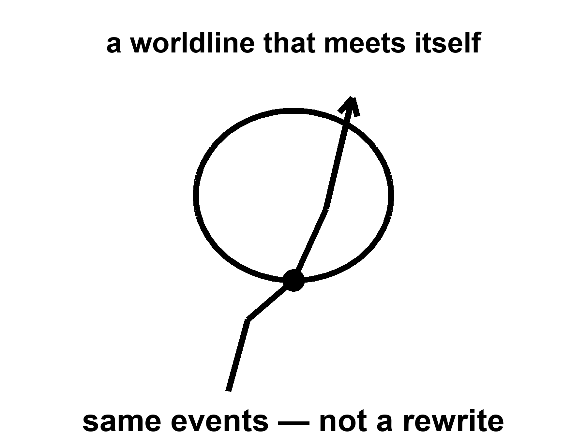

The woman in the greenhouse cannot radio yesterday. She can radio twenty minutes ago, which is rude but not looping. The machine that does not sleep, falling toward a star for four hundred years, cannot mail a warning to its launch. It can arrive, melt, look, and send a letter that will be read by people who have never met the launch crew. That is not time travel. That is the ordinary lateness of light, stretched over a career.

Say the same thing with cones, because the kitchen radio makes people greedy.

Yesterday, in the greenhouse, is a set of events in her past light cone. A radio wave she emits today leaves along her future cone. That cone does not include yesterday’s workbench. Light does not run uphill on the loaf. Twenty minutes ago can still be in range on a good week, because an orbiter a few light-minutes away is an event her signal can still reach. A loop would require the signal, or the sender, to arrive at an event already in the sender’s past. The greenhouse does not have that hallway. It has delay. Delay is Chapter 3, scaled to a dead world. It is not a closed curve. The four-hundred-year cruise is the same lesson with worse manners: launch and arrival are two events on a long worldline, not a loop. The arrival cannot warn the launch because the launch is not in the arrival’s future cone. The letter, if any, is news. News is late. Late is not yesterday.

If you want the edit, you need a different loaf — a branch, a copy, a hop. The copies chapter will give you inventory and still refuse the hop. There is no known door from this thread to a thread where the basil died and you would like a second try. Grief is a fact about one worldline. It is not a user interface.

Are loops even allowed?

In special relativity, no: the loaf is too stiff. Flat spacetime is a flat block. Timelike curves in it do not close. You can ride forever and you will not meet your own morning. Trouble about *when* is not the same as a ticket to *then*.

In general relativity, sometimes, on paper. Kurt Gödel found a rotating universe in which you can ride a closed timelike curve — a path that stays inside its own future and arrives at its own past. Our universe is not Gödel’s. It does not rotate that way. Kerr’s spinning hole, if you could go *through* the interior in the idealized math and if the interior were not a chaos of instability, offers rings that loop. Wormhole mouths, if you could move them, can be turned into a time machine: park one, fly the other on a fast trip, bring it back, and the clocks on the mouths no longer agree in a way that lets you leave today and arrive last year.

Take those three sentences apart. They are not a brochure.

Gödel’s 1949 cosmos is a solution of Einstein’s equation filled with rotating dust. Every event, in that geometry, sits on a closed timelike curve. You could, in the math, leave a kitchen, fly a long way, and arrive before you left, without ever exceeding light locally. It is a marvel of a metric and a poor map of home. Gödel’s universe does not expand the way ours does. It has a global rotation our leftover glow does not show. The microwave sky is even to a part in a hundred thousand. A Gödel twist of the size that would let you loop would have written a louder signature than that. **Hot claim:** we do not live in Gödel’s rotating dust. **Cold claim:** somewhere, in some other solution, such dust is a universe. An idea for ideas. Barrow would have walked you up to the metric, tipped his hat, and declined to sell a ticket.

Kerr’s spinning hole is closer to furniture we actually own. Stars rotate. The holes they can become rotate. The exterior of a Kerr hole is a working theory with shadows and rings and LIGO chirps to its name. The *interior*, in the full analytic extension, is a different room. Inside the inner horizon — a Cauchy horizon, a surface beyond which the loaf stops being predictable from the outside — the idealized math offers closed timelike curves around a ring singularity. Tourists love that sentence. The loaf does not. The inner horizon is unstable. Matter and radiation falling in get blueshifted without mercy. The technical name is mass inflation: the horizon becomes a wall of energy, and the pretty extension is not a hallway. A hole made by a collapsing star is not the eternal, vacuum Kerr solution of a textbook. Even on paper, “go through and loop” is a sentence about an object we have not got. **Warm claim:** spinning holes exist. **Cold claim:** their insides are a time machine. The insides, as far as the instability arguments run, are a place the theory we trust stops being a guide.

Wormhole mouths are the kitchen trick people actually try to draw. Chapter 33 paid the bill for a throat that stays open. Suppose, against the inequalities, you have two mouths. Park one in the yard. Fly the other on a fast cruise and bring it home. The twin effect of Chapter 5 is waiting: the flown mouth accumulates less proper time. The clocks on the two spheres no longer agree. After enough mismatch, a path that enters the young mouth and leaves the old one can arrive at an external clock reading *earlier* than the departure. You have not outrun light in any local room. You have used a handle plus a twin-clock cheat to fold the loaf until today touches last year. Morris, Thorne, and Yurtsever wrote the operation down. It is a recipe for a chronology horizon, not a recipe for an edit.

All of these are sentences in a theory we trust in the rooms we have tested, used in rooms we have not. None of them is a photograph. None of them is a ticket.

Appendix A35 names the metrics. Here, keep one picture: a loop is a *shape* the loaf might have, locally or globally. It is not a machine you bolt onto the loaf. If the shape is there, it was there. If it is not, you cannot will it into an edit.

The grandfather “paradox” is a complaint about edits. In a consistent loop, you do not kill the grandfather in a way that prevents the loop. Either you fail, or you are not in that story, or the story was never the one you thought. This is unsatisfying as drama and perfect as bookkeeping. Drama wants the rewrite. Bookkeeping wants the inventory.

The complaint sounds like a riddle because it assumes a draft: you exist, therefore the grandfather lived, therefore you cannot have killed him, therefore contradiction — or else a branching, or else a policeman. Novikov’s answer is duller. There is no draft. A worldline that both requires the grandfather and removes him is not in the sum. The failure is not a moral. It is a zero in the measure. You trip. The gun jams. You *are* the descendant by a route the riddle did not budget. Unsatisfying. Correct. The loaf was never a sandbox in which you test a murder and then reload.

Why may the universe forbid them?

The chronology-protection conjecture is a hunch with a pedigree: the universe, when you try to build a loop, fights back. Vacuum jitters near the would-be time machine grow. The throat, if a throat is involved, blows. The Cauchy horizon — the surface beyond which prediction dies — becomes a wall of energy. You do not get last year. You get a bang.

Stephen Hawking wrote the hunch down in 1992. Near a forming chronology horizon, the vacuum’s stress-energy tries to diverge. The machine, in this picture, destroys itself with the same jitters that make black holes glow. Chronology protection is not a theorem. It is a conjecture that the divergence is generic, that nature does not let you finish the wormhole-clock trick, that Cauchy horizons in this role are walls rather than doors.

It is a conjecture. It is not a theorem. It smells right to people who have watched quantum fields misbehave near horizons. It may be a prejudice. Appendix A35 writes the horizon names. Here, the hunch is allowed to sit in the warm-to-cold chair: we have never seen a loop; we have good reasons to think making one is a way of asking the vacuum to explode; we do not have a photograph of the explosion either.

**Hot:** special relativity’s loaf does not loop, and we have never photographed a closed timelike curve. **Warm:** general relativity admits looping metrics; the ones that look like ours do not wear them in the rooms we can see. **Cold:** you could build a time machine if you stacked exotic matter and survived the vacuum. Hawking’s hunch is the grown-up cold: maybe you cannot, because the stacking asks the field to explode. Barrow’s habit still applies. Walk up to the metric. Call it an idea for ideas. Do not confuse a solution of Einstein’s equation with a launch window.

If the hunch is wrong, the block contains shapes that arrive before they leave, and the kitchen argument about “now” was only the beginning of the trouble. If the hunch is right, the loaf is stubborn about order along worldlines that matter, and time travel remains a sport for metrics, not for crews. Either way, the greenhouse’s radio does not get yesterday. That is a practical mercy. A project is hard enough when the dirt can vote no. It would be impossible if the dirt could vote no, then yes, then no again, on the same Tuesday.

---

\newpage

## 36. If You Could Walk Sideways Through When

Suppose, as a thought, you could leave your worldline and walk *across* the loaf, as if time were a hallway of rooms, each room a now, each now a place you could enter and leave.

You would not be editing. You would be visiting. The childhood kitchen would be a room. The greenhouse would be a room. The dark sea under Europa’s ice, on a particular Tuesday of a particular millennium, would be a room. You could push a book, raise a dust of frost, encode a pulse in a watch. Those events, if they are in the loaf, were always in the loaf. Your walk would be another thread, weirdly oriented, already counted.

Stay in the thought long enough to feel what the permission would actually be.

You step off the thread you have been calling a life. The loaf, which Chapter 6 treated as inventory, becomes furniture. You are not a passenger in a river. You are a visitor in a house that was never sequential except along the paths that live in it. The first room you try is the one grief already named.

A childhood kitchen. A kettle that has not yet learned the house. A window with a frost that is not the greenhouse frost, earlier, kinder, attached to a planet that still had an unstuck airlock as a joke rather than a job. A child at the table is a bundle of worldlines that will, later, include you. You are not that child. You are a later stretch, illegally sideways, looking. If the walk is real, the looking is an event, and the event was always in the room. The child does not acquire a new memory because you arrived. The child already had whatever the loaf contains. You do not get to pick a different kettle. You get to stand in a room you cannot rent.

Walk farther. The greenhouse on a butterscotch morning: basil, a radio that answers twenty minutes late, a pane that may already carry a sentence in her letters. You could raise a dust of frost with a glove. If you do, that dust was in the Tuesday. The woman who hits the airlock is not surprised by a visitor from when, because surprise is a fact about her worldline, and her worldline either includes you or it does not. There is no version of the Tuesday that was clean until you arrived. There is the Tuesday.

Walk farther still. A dark sea under ice, on a particular Tuesday of a particular millennium, a melt-probe’s fiber paying out into a black that has not seen a photon in four billion years. If you could stand in that water as a sideways guest, you would not be bringing the Sun. You would be occupying an event the probe might taste, or might miss. The tasting, if it happens, is a later stretch of a machine’s thread, not a right you purchased by walking across *when*.

You could push a book on a table in 1914. You could encode a pulse in a watch in 1989. You could meet your own later face in a corridor that, along ordinary worldlines, is a lifetime away. Each of those is a crumb. Each crumb, if the walk exists, was counted. The walk does not add a second inventory. It adds a weirdly oriented thread to the one inventory, the way a worm through bread is still bread.

From this illegal hallway you could look at the leftover glow edge-on: not a sky, a slice, a last-scattering surface as a wall in the house. You could see the three minutes as a thin, hot room near one end of the loaf, and a sparse, shoved-apart web of galaxies as a later furniture. You would be tempted to call the view a god’s-eye. It would still be a view from a path. Even a sideways path has a proper length. Even a visitor accumulates something. The something would not be the time your kitchen clock named. It would be whatever parameter the new thread used for mileage. The loaf does not owe that parameter a name you already like.

This is the block made into a set of furniture. It is useful as a picture and false as a permission. We do not have a sideways walk. Our worldlines are nearly parallel, locally, to the time directions the leftover glow picked out when it last scattered. We go from event to event the long way, accumulating proper time, eating basil, dying.

The permission is the part that has to be taken away, slowly, because the picture is so good at lying.

You cannot walk sideways through *when*. “When” is not a corridor. It is a way of ordering events along a thread, and a way of slicing the loaf for the convenience of a clock. The slice is a choice. The thread is a fact. Confusing the two is the whole of this chapter.

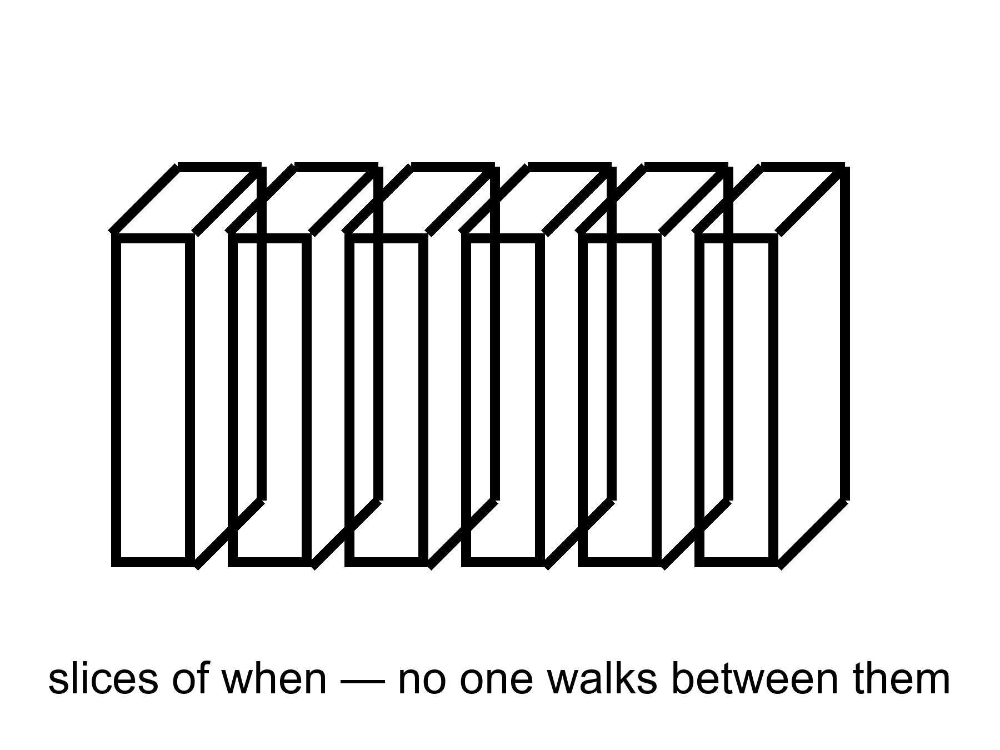

Foliations — the technical name for slicing the loaf into “nows” — are a choice, not a hallway. Appendix A36 says why a stack is not a corridor. A foliation is a stack of three-dimensional surfaces, each surface a candidate for “the world at a given time.” You already met the freedom in Chapter 1. The person standing still and the person walking toward the table do not share Andromeda’s now. They are using different knives on the same bread. Chapter 4 made the knives rude: a stroll in the yard is enough, at that distance, to move a fleet from committee to launch on the slice. Relativity does not pick a preferred stack. Cosmology, when it needs a bookkeeping time, hires the leftover glow: the surfaces on which the microwave sky looks as even as it can. That hire is a convenience. It is a superb convenience. It is not a set of rooms with doors between them.

A stack of pages is not a building you can wander. You can put a finger on page 12 and a finger on page 400. You cannot walk from 12 to 400 except by reading, which is the analog of accumulating proper time along a worldline. The reading is a path in the book. The stack is a filing habit. Appendix A36 is the note that says this in the language of embeddings and leaves. Here, the sentence is shorter. **A foliation is how you file the loaf. It is not how you travel.**

The stack invites a second myth, and it usually arrives with a number. Time, the story goes, is a flip-book. Each page is one Planck time thick, about 5 × 10⁻⁴⁴ seconds, and the universe turns one page per tick, everywhere at once, like a projector with a cosmic shutter.

The projector fails three ways. First, nobody has found the pages. The Planck time marks where our equations expect to need quantum gravity. It is a warning on the map, not a measured grain. In 2009 a gamma-ray burst seven billion light-years away delivered its high-energy and low-energy photons within about a second of each other, which is not what the simplest Planck-scale grain, one that slows the short waves, would do. Second, a universal shutter needs a universal stack, and Chapter 1 already took that away. The person standing still and the person walking toward the table slice the loaf differently, and neither slicing is the one true deck. A projector needs a throne to stand on. Third, the configurations do not come as a finite deck of frames. In every theory that has passed a test, positions and fields vary smoothly. Between any two pages you can always fit another.

So the flip-book is a filing habit drawn as if it were a machine. **Hot:** no measured Planck tick. **Warm:** the Planck time as the place our equations stop vouching for themselves. **Cold:** a future theory might make time grainy in a subtler way, with no shutter and no favorite slicing. Even then the grains would not be a film someone is running. They would be one more fact about the loaf.

Proper time is the mileage of the thread. Chapter 5 already insisted: it is not a coordinate someone assigned from a tower. Two twins who part and meet can disagree on the mileage between the same two meetings. A clock in a well ticks through less of it than a clock on a hill. A clock on a fast cruise ticks through less of it than a clock that stayed. None of those clocks walked sideways into another when. They occupied sequences of events, some sequences shorter than others. The hour beside a horizon is not a visit to a neighboring slice. It is a short worldline between two meetings that, for someone farther out, were long-separated. The woman who says good morning to a Thursday she will not have is not a tourist in the ship’s future. She is a short thread that will meet the ship again.

If you could fire a rocket “in the time direction,” you would still be firing it along a worldline. Rockets change which way a thread leans in the loaf. They do not hop to a parallel leaf of a foliation and knock on its door. That hop would be a new kind of motion, a new structure, a new instability. We have not hired it. The leftover glow did not hire it. GPS does not hire it. The greenhouse radio does not hire it.

A coordinate labeled *t* on a map of the loaf is a filing number. It is useful. Cosmology uses it so that “when the universe was 380,000 years old” has a meaning on the leftover-glow slices. Your watch does not read that filing number. Your watch reads the length of your thread. Mixing the two is how a hallway gets invented: people see a stack of *t* = constant pages and imagine walking the *t* axis as if it were a corridor in a library. The library has no such corridor. The only walk is the reading, and the reading is proper time.

Grief already knew.

The childhood kitchen is a room you cannot rent. It is in the loaf in the only sense events are in the loaf: it is a cluster of happenings, related by light and soup and a kettle, occupying a region of the block. You cannot go there as a visitor. You can remember it, which is a present event that points, by a causal chain of traces, at past events. Memory is not a hallway. It is a record, the same family of fact as a silver grain or a helium nucleus, written on a later stretch of thread. The later stretch does not get to move in. The kettle is not waiting. The kettle is an event that has, from the later vantage, already sat in its region. “Already” is a word the later thread is allowed. The loaf does not need it.

Hope is the same furniture with the sign flipped. The greenhouse’s later Tuesdays, the melt-probe’s maybe-taste, a library that arrives or does not: those are regions too. You cannot skip ahead into them any more than you can rent the kettle. You can occupy the next stretch of thread, do a project, and leave a record. That is the only method the geometry permits. It is slow. It is the method that grew basil and helium and a leftover glow.

The invented walk was always a teaching tool. Lengthened, it still teaches. It shows you what the inventory means: the rooms are there, the childhood and the ice and the last scattering, equally crumbs, none of them blinking off when a later clock ticks. Then the permission has to be confiscated, or the teaching becomes a lie people will try to live inside. We do not walk between slices. We do not occupy two Tuesdays. We do not take a sideways step into a kinder kettle. We go from event to event the long way.

The picture remains the right one for grief and for hope: the rooms are there, in the only sense events are there. You cannot rent them. You can occupy one thread, do a project, and leave a library. That is not a small thing. It is the thing. The sideways walk would only show you what the thread already meant: that the inventory does not blink when you close your eyes.

**Hot:** you have a worldline, a proper time, and no measured hop onto a neighboring slice. **Warm:** the block is the default reading of a theory that GPS tests daily, and foliations are bookkeeping. **Cold:** a new structure might someday let a thread lean so hard it looks like a walk through when. That cold idea would still not be an edit. It would be another shape, already counted, already refused a second pane. Until someone photographs the shape, the greenhouse keeps one radio, one Tuesday, and a childhood kitchen that will not take a tenant.

\newpage

# PART VIII — All the Copies

---

\newpage

## 37. Four Kinds of Elsewhere

“Multiple realities” is four claims in a trench coat. If you let them fuse, you can prove anything and have explained nothing. Keep them in separate rooms.

The coat is a kitchen habit. Someone hears “other worlds,” pictures a door, and starts borrowing furniture from four different houses. A repeat of this galaxy, far away, gets mixed with a bubble that froze under different constants, which gets mixed with a quantum branch that never shared a place, which gets mixed with a mathematical structure no one could inhabit because inhabiting is not what a theorem does. The mix will sell a ticket. The mix is not a theory. It is four drawers emptied onto one bench.

Open the drawers one at a time. A useful test, before the labels: ask what question the claim is answering. More space answers *how big is the dough.* Other bubbles answer *could the leftover constants have been otherwise.* Other branches answer *what the electron’s equation does with leftovers.* Other mathematics answers *what existence even is.* Those are four questions. A coat that answers all four with “other worlds” has stopped asking.

**More of this universe.** Same laws, same constants, more space. If the dough is infinite, or merely brutally large, and the ingredients are sprinkled in a statistically ordinary way, then a finite pattern — a galaxy like this, a kitchen like this, a woman hitting an airlock — repeats. Not because anyone copied it. Because there are only so many ways to arrange a closet of atoms, and an infinite warehouse will reuse the arrangements. These copies are *elsewhere* in the ordinary, spacelike sense. You cannot visit. Light will not finish the trip.

This is the cheap copy. Chapter 38 is its room. The physics, if you grant the extras, is the physics we already use: an expanding FLRW loaf, a Hubble volume as a tile, a finite list of ways to stock the tile. The copies sit on the same map as Andromeda, only ruder. They are not behind a curtain. They are behind a distance. Distance, in an accelerating cosmos, is sometimes a forever.

**Other bubbles, other rules.** If inflation never quite clocks out, and if the way it clocks out has many valleys, then other hot bangs can freeze with different effective constants, different particle menus, different numbers of large directions. This is the expensive copy machine. It is a live hypothesis stacked on a working theory stacked, often, on an untestable framework.

This is Chapter 39’s room. The burst of Chapter 13 is the working theory. Eternal inflation is the burst that may not retire. The menu of valleys is the maybe. A landscape inherited from string theory is a catalog sitting on the maybe. **String theory cannot currently be tested.** Do not let the catalog put on the cheap copy’s coat and walk around as if it had been counted in the leftover glow.

**Other branches.** The electron’s equation does not pick a single outcome. One reading says the leftovers stay: both ways persist, decohered, non-interfering. These copies are not other places. They are other terms. You are one term.

This is Chapter 40’s room, and Chapter 6 already put a chair in it. Everett’s habit is a reading of the same rule that builds chemistry. It is not extra cosmology. It does not hand you a hallway to a kinder marriage. The copies, if they persist, persist elsehow, not elsewhere. Confusing elsehow with elsewhere is how the trench coat gets buttoned.

**Other mathematics.** If existence is cheap and consistency is enough, then every coherent structure is a universe. This is a metaphysical bet. It is not physics. Barrow would have smiled and called it an idea for ideas.

This drawer is the one that should stay closed in a book that has a leftover glow to be loyal to. A consistent set of axioms is not a sky. It does not have a helium fraction. It does not have a woman, except as a symbol in a formal system that has decided to talk about women. You may find the bet beautiful. You may even find it thrifty: why should existence be stingy once consistency is satisfied? Beauty and thrift are not a temperature. They are a taste. This book will not run an experiment on a theorem and call the theorem a neighbor.

Barrow’s habit is the right one here. Walk up to the idea. Call it an idea for ideas. Do not let it complete the other three drawers by metaphysics. A far tile, if it exists, still has to obey our leftover helium. A bubble, if it exists, still has to be a solution of something. A branch, if it persists, still has to be a term in the equation we already use. Other mathematics owes none of that. That is why it feels like a completion and why it is not physics.

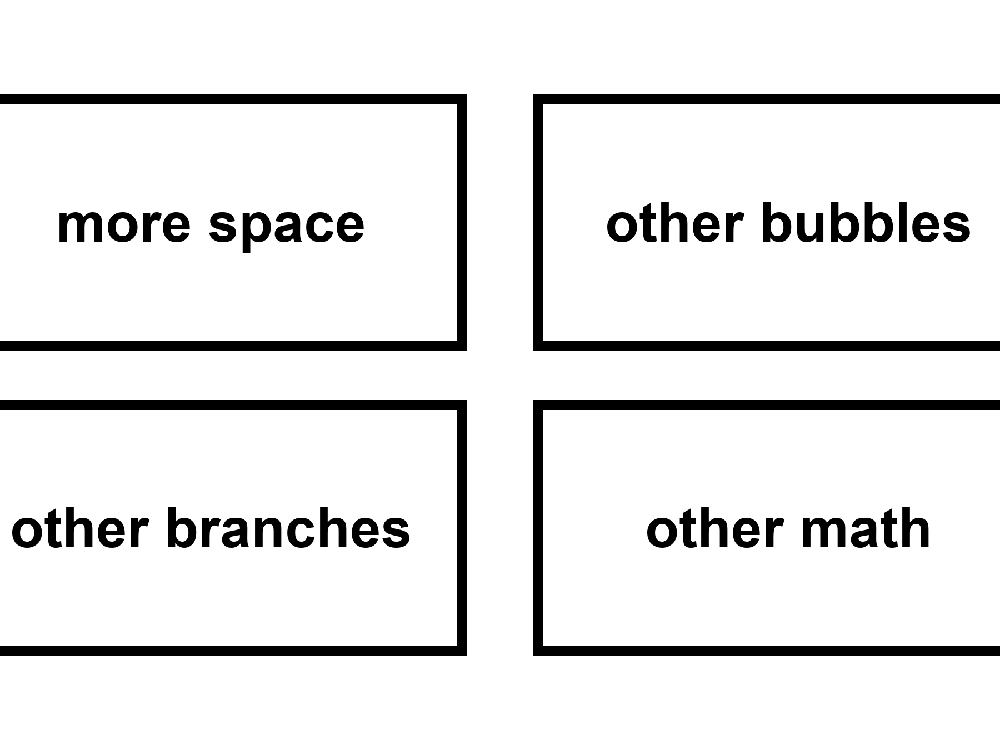

Keep the 2-by-2 on the wall. The rows are not a ranking of how much you should want them. They are a ranking of how easily they fuse in a conversation. More-space copies share our laws; people treat them as travel. Bubble copies share a family of laws and then don’t; people treat them as destinations with different weather. Branch copies share a past up to a fork and then don’t share a place at all; people treat them as hops. Mathematical copies share nothing that physics can cash. People treat them as a completion of the other three. The completion is the coat.

What would a ticket even be?

To a more-space copy: a path through this loaf, same constants, long enough to reach a matching tile. Chapter 26 already spent that path. The event horizon ate it. You can name the copy the way you name a galaxy in a deep field. You cannot arrive.

To a bubble: a path into a different freeze — different fine-structure constant, different shove, maybe a different number of large directions. The wall between pockets is not a customs desk. In the usual pictures it is still-bursting dough. A crew that does not sleep cannot clock out of our chemistry and clock into another.

To a branch: a hop between terms of a sum. Chapter 40 will refuse the hop by name. There is no door in the sky labeled tails. There is a silence after decoherence.

To a theorem: boots on a page of axioms. A category error that has learned to walk. You do not visit consistency. You write it down.

Four refusals. One coat. Put the coat down before you start proving that the basil both died and was saved, that Λ is both a miracle and a selection, that a far kitchen both is and is not a destination. Those sentences can be made separately. They cannot be made as one noun.

The greenhouse workbench has four drawers. One holds spare seals, same kit, more of it, the way a longer shelf holds more jars of the same dirt. One holds a manual for a kitchen that never shared a wall: different voltage, different water, a basil that would not be basil. One holds two copies of today’s log, both true in their own terms, only one of which she can write with this pen. One holds a sheet of blank axioms, elegant, uninhabited. A visitor dumps all four into a coat and says, *other worlds.* She should put the coat back. The seals will not fix the axioms. The second log will not water the plants. The manual for the other kitchen will not open the airlock. The blank sheet will not grow potatoes.

She can feel the temptation in the wrists. The airlock sticks. The radio is late. A far drawer with more of the same dirt sounds like help. A drawer with different laws sounds like a miracle weather. A drawer with another log sounds like a second try. A drawer of axioms sounds like a reason the first three must exist. Help, miracle, second try, reason: four hungers. The coat is those hungers sewn together. Physics is allowed to be unkind to hungers. It is not allowed to be sloppy about drawers.

Dark matter is not a fifth room. Dark energy is not a sixth. They are ingredients *in this room*. Chapter 17’s extra pull is a mass budget in the leftover glow, in the Bullet Cluster, in the way galaxies hold together. Chapter 18’s shove is a term in the stretch, a faintness in empty space, a plot twist in *H(t)*. Neither is a copy of the kitchen. Neither is a bubble with other rules, except in the cold sense that some other valley might have a different shove — and that cold sentence belongs in drawer two, labeled as such, not smuggled into drawer one as if the missing mass were a missing universe. A particle we have not yet named is still a particle *here*. A vacuum energy we have not yet explained is still a vacuum energy *here*. Missing nouns are not extra loaves.

A tidal sea under ice is not another reality. It is a dark room in this one. Europa’s ocean, Enceladus’s spray, a maybe-Hycean under a hydrogen blanket: those are permits and dark pantries in the same expanding dough, the same constants, the same leftover helium. You could, in principle, send a melt-probe. You cannot, in principle, send a melt-probe to a branch, or to a bubble with a different fine-structure constant, or to a theorem. The sea is elsewhere in the ordinary sense that a basement is elsewhere. It is not a fifth kind of copy. People reach for “another world” because the ice is a lid and the Sun is a rumor. Keep the nouns sober. A lid is a lid. A copy is a claim about inventory.

The confusion is honest in the mouth and expensive in the argument. A basement you have not entered *feels* like a second house. It is still plumbed to the first. The same gravity. The same water, if water is there. The same table of nuclei. Chapter 29’s dark seas are the largest nearby lesson in this: strangeness is not a new loaf. Strangeness is a room with the lights off. If the melt-probe tastes a second origin, that origin is still *this* universe’s chemistry, this helium, this leftover glow as a ceiling the sea never saw. If it tastes a sterile bath, the sterility is also this universe’s. Neither result opens drawer two, three, or four. Both results are dirt, delay, and a fiber. That is the point of keeping the nouns sober. You can act on a basement. You cannot act on a fused coat.

Why the sobriety matters: fuse the rooms and you can “explain” anything. The basil died? A branch where it lived. The shove is small? A bubble that passed a filter. A pattern repeats? Infinite space. A pattern looks arranged? Other mathematics in which arrangement is cheap. Each of those sentences, in its own drawer, can be a responsible maybe. Stacked, they are an oil that lets a sermon slide. This part will not stack them.

Keep the nouns sober. The rest of this part takes the first three claims in order and refuses, each time, to sell you a ticket. A popular filing of the four drawers calls them levels: more volume, other vacua, other branches, other mathematics. The filing is a set of labels, not a detection. Use it if it keeps the coat unbuttoned. Do not use it as a poster of doors.

**Hot:** we have one leftover glow, one set of constants, one table of nuclei, and a sky larger than the patch we have seen. Dark matter pulls in this sky. A tidal sea, if it is wet, is wet in this sky. **Warm:** inflation, dark ingredients, and a quantum rule that does not pick a single outcome. **Cold:** the four drawers, each in its own way. The coat is colder still. It is not a fifth claim. It is a way of not having a claim. If a later chapter seems to be wearing two drawers at once, that is a mistake in the reading, not a new kind of elsewhere. Send it back to the 2-by-2.

---

\newpage

## 38. More of This Universe

Assume, for a page, that space goes on, same laws, no edge, matter doing statistically ordinary things. Then the Hubble volume — the room we can, in principle, have seen — is one tile. Beyond it, more tiles. The number of ways to arrange the quantum states in a tile is enormous, but finite if you take the holographic bound seriously. In an infinite warehouse of tiles, every allowed arrangement happens, and happens again.

That is the cheap copy in one breath. Now unpack it, because the breath is doing a lot of work, and not all of the work is the same temperature.

An FLRW universe, the expanding dough of Chapter 7, can be infinite in space. The spatial slices — the “nows” cosmology hires from the leftover glow — can be the three-dimensional analog of an endless plane: same rules, no wall. Galaxies, on large enough averages, sprinkled the way Chapter 14’s twitches and Chapter 16’s web sprinkle them. No special place. No edge to walk off. That geometry is allowed. It is not required. Finite spaces with no edge are allowed too: a 3-sphere, a 3-torus, other closed shapes that look, locally, like the endless plane if they are large enough. The leftover glow does not hand you the global topology. It hands you a patch.

The Hubble volume is the patch. Not exactly the particle horizon, not exactly the event horizon: a room of order the Hubble length, the distance light could cover in a Hubble time, the tile people use when they want a fair comparison between “what we can see” and “what a repeat would have to match.” The particle horizon is the edge of what we can already have seen, set by the age of the stretch. The event horizon is the edge of what we can still reach with a future letter. The Hubble tile is a fair-comparison box sitting between those rudenesses. Inside one tile: a leftover glow, a web of galaxies, a greenhouse, a childhood kitchen, this sentence. The tile is finite. The question is how many tiles the loaf contains.

We already know the answer is more than one. The leftover glow is a picture of a last-scattering surface larger than the Hubble length of that era, stretched. Inflation, if you buy it, stretched a still smaller patch into something that makes our whole sky look local. “Much larger than we see” is not a mood. It is the working theory’s everyday implication, and it is why the cheap-copy argument even gets a hearing. The hearing is not a verdict. Larger is not infinite. A warehouse with a thousand rooms is already larger than the room you are standing in. It is not an infinite warehouse.

If the warehouse is infinite, and if the sprinkle is ergodic — statistically the same, no conspiracy that makes every tile a unique snowflake forever — then a finite list of arrangements, drawn infinitely often, must repeat. Not as a project. As a tautology of large numbers. A deck of cards, shuffled without end, will eventually deal a hand you have already seen. An infinite deck of Hubble volumes will eventually deal a volume that matches this one to whatever precision you asked for, then deal it again.

There is a version of you who did not open this book. There is a version of the greenhouse where the basil died in month four. There is a version, much farther, where a dead world was never visited. These are not hops. They are the cheap copies: same physics, different draws, out of reach because the particle horizon and the event horizon are rude.

The “you” in that paragraph is a pattern of atoms, or a pattern of quantum states, occupying a region. It is not a soul that jumped. It is a repeat, the way two identical copies of a recipe are two copies. The woman who did not open the book is not your understudy, waiting in the wings. She is a later or farther stretch of dough that happens, if the extras are granted, to match a stretch you occupy. She does not get your radio. You do not get her afternoon.

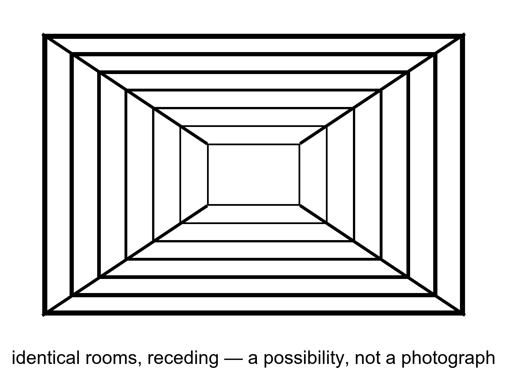

How finite is a tile’s menu?

If you treat a Hubble volume as an ordinary box of particles, the number of arrangements is already a Barrow shock: more than you can say out loud, less than infinity. Count the ways to place a roomful of atoms and you get a number that looks like a lie. Count the quantum states more carefully and the lie gets worse. If you take holography seriously — Chapter 23’s stubborn skin, the inventory of a region written on its boundary — the menu becomes finite in a cleaner way. A region’s distinguishable states cannot exceed what the area of its bounding surface can hold, at about one bit per few square Planck lengths. A de Sitter-like tile, bounded in practice by an event horizon, has a finite area of order 10¹²² Planck patches, and therefore a finite library. The number of possible books in that library is two to that power: a stack of exponents you cannot write as an ordinary integer. Enormous. Finite. Infinity is not hiding in the closet of one tile. It would have to hide in the number of tiles.

That finiteness is doing the cheap copy’s real work. Infinite space plus an infinite menu need not repeat; you could have a new snowflake forever. Infinite space plus a finite menu must, if the draws are independent enough, reuse the books. The holographic bound is the cleanest reason the menu is finite. It is warm-to-cold as a statement about the whole sky — our space is not the negatively curved special case where holography is a theorem — and it is stubborn as a hint. Even without holography, a finite energy in a finite box, with a quantum grain, is a finite list. The cheap copy is, at bottom, that list plus a warehouse that never stops.

Ergodic is the other extra. It means the sprinkle does not, at some scale, freeze into a crystal of unique rooms, or stop being defined, or start repeating for a boring geometric reason that is not “infinity plus a finite menu.” Inflation, if you buy it, helps: it stretches a small, mixed patch into a large, mixed patch, and the twitches are statistically ordinary. Help is not a proof that the whole spatial slice is an ergodic infinite plane. Help is a reason the cheap-copy argument is not crazy. Crazy would be assuming a unique snowflake at every distance for no reason. The cheap copy assumes the opposite, which is also an assumption.

Is space infinite? We do not know. We know it is larger than the tile, and flat to a boredom that inflation explains as a feature. Infinite is a cold extra. “Much larger than we see” is warm. The cheap copies require the stronger extra, plus a faith that the statistical sprinkle does not, at some scale, start repeating for a boring reason or stop being defined.

Flatness is the measurement people try to promote.

Planck’s leftover-glow maps find a curvature parameter, Ω_k, consistent with zero. Parallel lines, on the largest scales we photograph, stay parallel to a boredom. Inflation predicted that boredom: stretch a curved surface enough and the ant sees a plane. **Ω_k ≈ 0 does not prove the slice is infinite.** A 3-sphere with a radius far larger than the Hubble length looks flat in the patch. A 3-torus, finite and edgeless, looks like infinite FLRW until you have gone all the way around, and “all the way around” may be farther than light has traveled since the glow. Topology is sneaky. The data say: not a small, curvy room. They do not say: warehouse without end. Treating “flat enough” as “infinite” is a kitchen leap. The leap is popular. It is still a leap.

There is a search that tried to catch the sneak. If the last-scattering surface wrapped around a small enough 3-torus, the leftover glow would show matching circles: the same pattern, twice, on the microwave sky, because you would be seeing the same patch of fog in two directions. People looked. They have not found the circles. That is a warm push: whatever the global shape is, it is not a snug little room we have already walked around by looking. It is not a proof of infinity. It is a proof that “finite but huge” still has a lot of room to hide. Appendix A38 writes the curvature and the repeat. Here: **flat is not infinite. Flat is a local manners.**

So the temperatures, named:

**Hot:** the universe is larger than the part we have seen; it is close to flat on that part; galaxies recede; the glow is a baby picture of a mixed fog. **Warm:** inflation made the flatness a feature, and the region beyond the tile is more of the same dough, same laws, for a long way. **Cold:** the dough is actually infinite, the sprinkle is actually ergodic, the holographic menu is actually the right count, and therefore a copy of this kitchen sits in some far tile, then sits again. The cheap copies are a fact only if those cold extras are facts. They are a picture of a possibility. Figure 38 is honest about that. It is not a photograph of copies.

One popular inventory of this room calls it Level I: more of the same FLRW volume, repeats by distance. The name is a filing label, not a detection. The label is useful if it keeps this drawer from fusing with bubbles, branches, and theorems. It is harmful if it puts a grid of rooms on a poster and lets a reader think the grid has been counted in the microwave sky. It has not.

The distances, if you grant the extras, are a Barrow shock of a different kind. A repeat of a planet-sized pattern is already unspeakably far. A repeat of a whole Hubble volume is farther in a way that does not fit in a throat. These are not destinations. Chapter 26 already spent the event horizon: most of the sky has left. The cheap copies, if they exist, live in a region that will not take a letter, let alone a ship. Light will not finish the trip. The particle horizon is the past’s rudeness. The event horizon is the future’s. Together they make “elsewhere in this universe” into a museum, not a road.

Even if the copies exist, they do no work for the woman in the airlock. Her potatoes are not saved by a tile where potatoes lived. Grief is local. So is a project. The cheap copies are a fact, if they are a fact, about the warehouse. They are not a consolation and not a map.

Say the potatoes out loud, because consolation is the usual hire.

She logs a blight. Starch fails. The window home is still months of orbit away. Somewhere, if the warehouse is infinite and the menu is finite, a greenhouse that matches hers to a ridiculous number of decimal places has a tray that lived. That tray is not her tray. It does not share her worldline. It does not share her Tuesday except as a matching pattern, which is a compliment the loaf does not cash. She cannot eat a repeat. She cannot be consoled by a statistical tautology. The dirt in front of her either makes starch or it does not. The copy, if any, is a fact about far crumbs. Far crumbs do not water this pot.

The far greenhouse does not even share a *when* she could name without cheating. Chapter 1 already retired a cosmic now. A matching tile is spacelike-separated from her blight. It is Andromeda’s navy without a navy: real, if the extras are granted, and unavailable as a cause or an effect of this log entry. Consolation that cannot enter the past cone is not consolation. It is a poster about large numbers. Barrow liked to shock readers with billions. The cheap copy’s billions are so large they stop being a shock and become a shrug. A shrug does not save potatoes.

A project is the same refusal with a better mood. You do not grow basil because a far tile might. You grow it because this thread is the one you can work along. The cheap copies, even at their most generous, are not colleagues. They are recurrences. Recurrence is not company. It is a statement that a finite story, told often enough, is told again.

Keep the drawer shut against hops. Same laws, more space, maybe repeats: that is all this chapter owns. The next chapter will try to change the laws. That is a different coat, and it is more expensive.

---

\newpage

## 39. Other Rooms, Other Rules

The expensive copies need a burst that does not know how to retire, and a menu of retirements.

Eternal inflation, Chapter 15, is the burst that may not retire. The menu is the maybe: different valleys, different leftover constants, different low-energy laws. In one valley the cosmological constant is a monster and galaxies never form. In one it is a little shove, and someone hits an airlock. In one there are two large dimensions and no kitchens. Weinberg’s filter needs this menu, or something like it, to turn “Λ is small” from a miracle into a selection.

Do not rerun Chapter 15 as a whole. Keep the one extra this part needs: the local burst is a working theory; the froth of other bursts is a rumor the local burst can tell if you let it drink.

In many slow-roll stories, the field that stretched the patch reaches the bottom of its hill in some places and keeps rolling, or keeps jittering, in others. The places that stop become hot bangs — pocket universes, bubbles, a noun you can hate and still need. The places that keep going keep stretching. Our leftover glow would be the inside of one stopped place. Outside, if the rumor is right, the bursting is still hiring. Different stops can freeze different effective physics if the underlying theory has more than one valley to fall into. That is the expensive machine: not more of the same tile, but other tiles whose constants were never ours.

From inside a stopped place the sky looks ordinary. A leftover glow. A stretch. Helium. Galaxies. You do not see the bursting next door. You see a patch that reheated, mixed, and froze into the kitchen you have. That is why eternal inflation is easy to oversell and hard to kill. It does not predict a new smudge in tonight’s field. It predicts that our smudge is one of many, and that the many may not share our leftover constants. The local burst of Chapter 13 can be right while the froth is a rumor. Keep the temperatures. Local inflation is warm. Eternal hiring is a live maybe. Other laws in other pockets are the maybe stacked on the maybe.

Where does the menu come from? Often, from string theory’s landscape: a reported 10⁵⁰⁰ ways to compactify extra directions and freeze a vacuum. **String theory cannot currently be tested.** A number like 10⁵⁰⁰, offered without a risky prediction that would kill the framework, is a catalog, not a census. Other frameworks offer other menus. Some offer one valley. The sky we have does not yet choose.

The number is a celebrity, so treat it like one. Extra directions, curled small. Fluxes, wrapping those directions, choosing a vacuum energy and a set of leftover constants the way a combination lock chooses a number. Count the combinations people know how to write and you get a shock with a lot of zeros. Ten to the five hundred is not a census of kitchens. It is a count of locks. Some locks may not open onto a cosmos that lasts. Some may be the same kitchen counted twice. Some may be artifacts of an approximation. The advertised number moves when the approximations move. That is allowed in a research program. It is not allowed in a result.

The shock is not a measurement. It is a count of sentences in a framework that has not yet named a signature we could miss. Compactify differently, freeze differently, and you can accommodate, after the fact, almost any low-energy kitchen. A framework that can accommodate almost any kitchen is not, so far, a theory of this kitchen. Row (18) in the appendix is a reminder, not a formula, of what a test would have to do: a risky number, a signature, a way for the whole idea to die. It has not been done. This book’s standing rule does not get a holiday because the number is large. **String theory cannot currently be tested.** Repeating the sentence is the point. Celebrity numbers try to hypnotize. A temperature label wakes you up.

Other menus exist on paper. Loop-ish gravities, extra-field cosmologies, a single vacuum that just happens to be ours. Some of those are also untested. Some are more modest. Modesty is not a proof. The leftover glow, the helium, the shove’s size: those are the court. The catalog is a witness who has not agreed to be cross-examined.

A modest menu can still be an ensemble. One valley is not. Two valleys begin to be, if you have a reason both are occupied. 10⁵⁰⁰ valleys are an ensemble only if they are more than a list of sentences. Until the framework risks a death, the list is a maybe about a maybe. Chapter 15 already said permission is not a postcard. This chapter says a catalog is not a census. The repetition is deliberate. Celebrity numbers come back if you do not keep saying no.

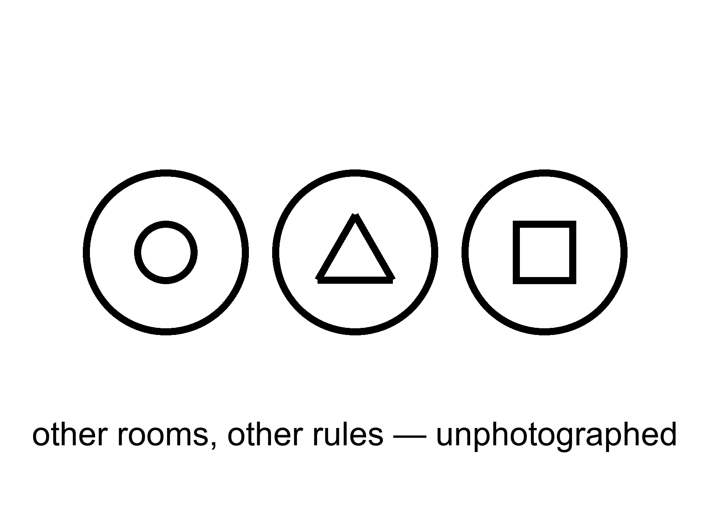

The measure problem sits on the catalog like a cat. Infinite bubbles, infinite observers, no agreed count: “typical” becomes a fight. Until the fight ends, “the landscape predicts observers like us” is a hope. It is a better hope than a required Omega Point, because it does not contradict the shove. It is still a hope.

The cat deserves a paragraph of its own, because it is the reason the expensive copies cannot yet do the job people hire them for.

If bubble begets bubble without end, the word *most* breaks. Most by what? Volume? Then the still-inflating regions, which stretch without limit, drown the stopped ones, or the stopped ones that stopped later drown the ones that stopped earlier, depending on how you cut. Count by bubbles? Then you need a cutoff, a regulation, a rule that says when two infinities have been made finite enough to compare. Count by observers? Then you need to know what an observer is, and whether a bubble that makes a brief, dense flash of many brains outranks a bubble that makes a few, slowly, in galaxies. The youngness paradox is one of the rude children of a bad measure: some cuttings predict that typical observers live almost at the beginning of their bubble, which we do not. Other cuttings predict other rudenesses. No cutting is the one everyone else has to accept. Until one is, a sentence that begins “the landscape predicts” is a sentence that has not finished its homework.

The kitchen analog is an infinite pantry with no agreement about jars. You want to say “typical jam is strawberry.” You cannot, until you say how you count jars that never stop arriving. Count by shelf-meters and the newest, emptiest shelves win. Count by jars and you must say when you stop the delivery. Count by tasters and you must say who counts as a taster. Eternal inflation’s measure problem is that pantry. It is not a quibble. It is why the expensive copies cannot yet turn Weinberg’s number into a prediction you could miss. A filter without a count is a hope with a mesh sketched on it.

Weinberg’s filter is why anyone bothers.

In 1987 he asked what value of the cosmological constant observers should expect if the constant is drawn from a wide range. Too large a shove and galaxies never form; too small, and you would need a reason the draw sat far below the galaxy-formation edge. The measured value sits near that edge, give or take the arguments about how to draw the edge. That is interesting. It is the rare case where “looking arranged” was turned into a number. Chapter 41 will sit with the number and with the sermons people attach to it. Here, the one sentence that matters is: **the filter needs an ensemble.** Without a menu of valleys, or of tiles, or of something that plays the same role, the weak anthropic cut is a reminder that we are not on Venus. It is not an explanation of why Λ is small. With an ensemble, it becomes a mesh. You throw away the monster shoves, look at what is left, and ask whether we are a typical survivor. You still need a measure. You still need the ensemble to be more than a catalog. You do not get to say the universe wanted a greenhouse. You get to say we could not have found ourselves in the valleys that did not want anyone.

Pointer, then, not a theft of Chapter 41: expensive copies are one of the ensembles people reach for. Cheap copies are another, weaker for Λ, because cheap copies share our laws and our leftover shove — a far tile with the same potatoes blighted or saved still has the same small cosmological constant. Branches are a third, and they do not help Λ at all unless the shove itself is a quantum leftover that forks, which is a different, colder story. Other mathematics will explain anything and therefore nothing. If you want a filter rather than a purpose, you need a drawer that actually contains variation. Drawer two is the expensive candidate. It has not passed a test. It is allowed to sit on the table. It is not dinner.

Weinberg’s number is the reason to keep the candidate anyway. A small shove, sitting near a galaxy-formation edge, looks arranged. An ensemble of shoves plus a mesh turns “arranged” into “survivors.” Chapter 41 will do that work without promoting the mesh to a craftsman. This chapter’s job is narrower: name the ensemble, name the catalog, name the cat, refuse the ticket to the next bubble.

If you live in a bubble, the neighboring bubbles are not destinations. The walls, in the usual pictures, are empty and expanding. You cannot book a crew that does not sleep and arrive at a different fine-structure constant. You can, at best, infer that you are in a valley that permits you. That inference is the weak filter. It is not a tour.

The wall sentence is practical, so keep it practical. Between bubbles, in the usual eternal-inflation cartoons, inflation is still going. The domain wall — the boundary between a stopped kitchen and a still-bursting dough — expands. The space you would have to cross is not a hallway with a different weather on the far side. It is a region that stretches too well to finish. Different constants are not a climate you could pack for. They are a different low-energy physics, a different chemistry, a different number of large directions. A crew that arrived, if arrival were a word, would not be a crew. Chemistry would not be chemistry. There is no airlock to hit. There is no basil to name. Neighbor bubbles are, at best, an inference from the fact that our valley is livable. They are not a pin on a map.

A vacuum that decays is not a door either. People hear “tunnel to another vacuum” and picture a station. A true-vacuum bubble nucleating in a false vacuum is, in the usual pictures, a disaster or a rewrite of local law, not a ticket booth. You do not book it. You do not steer it. If our vacuum is metastable, the news is a lifetime, not a destination. Chapter 43 will sit with endings. Here: neighboring rooms with other rules are not ports. They are, if they are anything, an ensemble for a filter. Chapter 41 is where the filter is allowed to work. This chapter’s job is to refuse the tour.

**Hot:** we live in one expanding region with one leftover glow and one small shove. **Warm:** inflation can be eternal in many models, and a small Λ wants an explanation that might be a selection. **Cold:** the bursting never stops, the valleys number 10⁵⁰⁰, the measure will someday settle, and a bubble with two large dimensions is as real as this kitchen. Barrow’s smile still fits. An idea for ideas. A catalog. A cat on the catalog. Chapter 41 will use the mesh without pretending the catalog was a census. Until a risky signature exists, 10⁵⁰⁰ is a celebrity, not a count of neighbors, and the neighbors are not a place you could grow basil.

---

\newpage

## 40. Every Allowed Outcome

Hugh Everett, in the 1950s, took the electron’s equation at its word. The equation offers a sum of ways. The usual habit is to throw away the ways that did not “happen” at a measurement. Everett’s habit is to keep them. The sum is the inventory. A measurement is a fork. After the fork, the branches do not talk; decoherence makes the interference go away. You are the branch that includes this sentence.

The year, if you want the stamp, is 1957. The dissertation is a relative-state reading: the global wavefunction does not collapse. A measurement correlates an apparatus with a system. Each term of the correlation is a consistent story for the observers inside it. There is no extra postulate that picks one story and burns the rest. The rest stay, decohered, as unavailable to you as a spacelike navy.

This is not extra cosmology. It is a reading of the same rule that builds chemistry. It is warm. It is not a photograph of other lives. It does not give you a hop. The carnival version — jump to the branch where the basil lived, where the sea is empty, where you did not lose who you lost — is a story. The physics, if Everett is right, says those branches are *on the inventory* and *unavailable*. They are as unavailable as Andromeda’s navy and ruder, because they are not even elsewhere. They are elsehow.

Chapter 6 already spent decoherence, the record, the leftover glow as an observer that did not need a mind, and the strange loop that later minds are. This chapter will not rent that furniture again. It needs one new kitchen, one rude moral about duplicates, and a practical fact that does not budge.

The new kitchen is a coin.

You flip it by the sink. In the equation, both faces persist. Decoherence — entanglement with air, with photons, with the grain of the table — makes the interference go away on a timescale you could, in a careful lab, assign a number to. No soul is required for the going-away. Afterward there is a heads term and a tails term. You are, in this term, the person who sees heads. There is an elsehow in which you see tails. You wash one dish. The dish you dirtied while the coin was in the air, waiting, talking, not talking. The tails-you washes a dish too, in that term: maybe the same plate elsehow, maybe a different plate if the afternoon already forked. You do not wash both. The sink in this term has one plate. The coin in this term has one face showing. The other face is not under the table. It is not in a far Hubble volume. It is a term you do not occupy. You cannot lean sideways and dry the other plate. You cannot radio the other face and ask whether the basil lived. The no-signaling theorem is the grown-up name for that refusal: local operations do not send notes between terms. The greenhouse radio, which can at least reach twenty minutes ago in *this* term, is more powerful than a branch.

Stay with the dish a moment, because the hop always tries to sneak back through the suds. You saw heads. You put the plate in the rack. Somewhere in the sum, a you who saw tails is putting a plate in a rack. If the I is a tangle, both of those stretches have an equal right to the pronoun. That equality is not a ticket. It is the ruder moral: a perfect copy of a loop is a second loop. You do not get to be both dishwashers. You get this sink, this face of the coin, this one plate. The carnival wants you to treat the other term as a spare afternoon you could still choose. Everett, if you buy him, says the choosing *was* the fork. After the fork there is no remaining chooser who stands above both terms and picks. There are two choosers, decohered, silent. You are one of them. Wash the plate you have.

That is the kitchen. Keep it. It is not Chapter 6’s ant nest and not Chapter 6’s Moon. It is a coin and a dish and a sink that does not do two jobs.

Decoherence, in this sink, is not a philosophy. It is a rate. Air molecules, photons, the roughness of the table, each take a little record of which face is up. After enough records, putting the two faces back into interference would require conspiring with every record that left. The conspiracy does not happen in a kitchen. It barely happens in a lab, and only when the lab is built to prevent records. A hop would require the conspiracy, or a door the equation does not draw. Neither is on offer beside the sink.

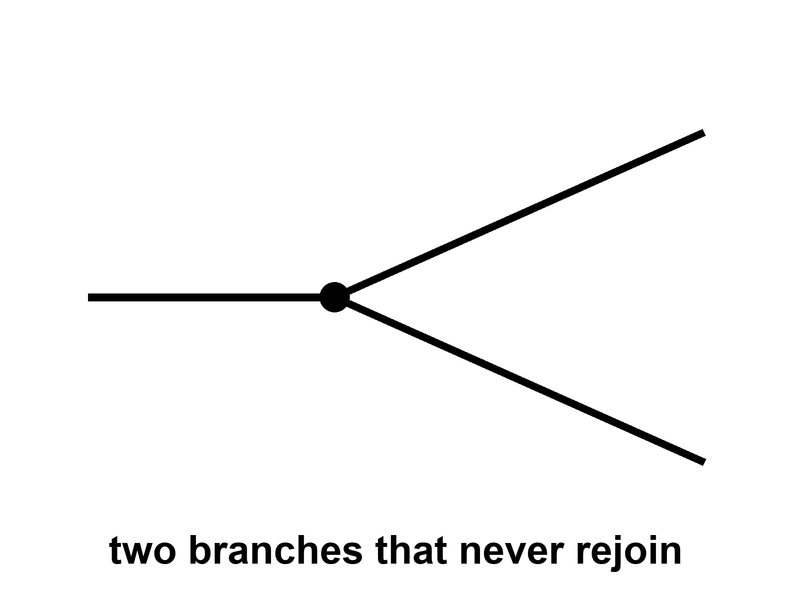

Why put this at the core of a book about the universe? Because the block, without it, is only all the times. With it, if you buy the reading, the block is all the times and all the allowed versions. “Everything, everywhere, all at once” is a phrase this book will not treat as a title. It will treat it as a temptation to be made precise. All the times: the loaf. All the versions: the forks. All at once: a bad kitchen phrase for “equally in the inventory.” Not a permission to walk sideways. Not a permission to hop.

Elsehow is the word to keep when elsewhere tries to steal the scene. A far Hubble volume, if Chapter 38’s extras are granted, is elsewhere: a spacelike other, a tile, a distance. A neighboring bubble, if Chapter 39’s extras are granted, is a ruder elsewhere: other rules, not a destination. A branch is not a place. After decoherence you cannot point at the sky and say “the tails are that way.” There is no that way. There is another term in a sum. The split in Figure 40 never rejoins. Rejoining would be interference, and interference is what the environment spent. The carnival hop would require a door between terms. The equation, taken at Everett’s word, does not build that door. It builds a fork and then a silence.

The practical fact does not budge. The worldline you occupy is the one you can work along. A melt-probe either tastes life or it does not. A library either arrives or it does not. The other outcomes, if they persist, persist without you. That is either a horror or a relief. It is, in any case, not a ticket counter.

Taste the probe as a discipline, not a sermon. A machine chews ice, pays out a fiber, drops into a dark sea. In this term the water has a chemistry or it does not. A second origin or a sterile bath. The equation may, if Everett is right, also contain the other tasting. You will not read both reports. The report you can act on is the one on this thread: seed later or not, look first or have failed to, write the log or lose the fiber. The elsehow tasting does not cancel a plague you poured, and it does not console a sterile sea. It is not a spare life. It is a term. Terms do not do dishes in this sink.

The discipline is the same in the greenhouse. Potatoes make starch or they do not. A launch window opens or you wait. Those are forks only in the carnival sense. In the geometry they are stretches of one worldline, with causes in a past cone and effects in a future cone. Everett does not turn them into spare lives you can cash if this stretch goes badly. If both outcomes persist, they persist as two later stretches that do not talk. The woman who logs a blight does not get to read the log where the tray lived. She gets this log. Look first is a rule for this term. It does not get cheaper because another term might have looked later.

A loop that calls itself I wants a ruder answer. If the I is a tangle — a translation that stays closed — then a perfect copy of the tangle is a second I, not a hop of the first. Two nests built from the same plan are two cities. They may share a past up to the fork. After the fork they do not share a now, because there is no now. The woman in the greenhouse, duplicated by a printer that worked too well, does not “go” into the duplicate. She acquires a twin who will swear, with equal right, that she is the original. That is not Everett. That is logistics plus a loop. Everett is ruder still: the twin is not even elsewhere. She is elsehow, and she does not get your radio.

The printer twin is a useful fool. She stands in the same room, eats the same basil, hits the same airlock, and is still a second person, because the tangle that says *I* is instantiated twice. Instantiation is not travel. Chapter 6’s strange loop was a picture of what a mind feels like from the inside: symbols that point at the pointing. Copy the tangle and you have two insides. Neither inside is a suitcase the other can climb into. Everett’s twin does not even get the shared room. She is a term. The printer at least left two bodies in one greenhouse. The branch leaves you with one body and a silence.

People who love copies as consolation are buying a translation and calling it travel. Keep the translation. Fire the ticket.

The translation is allowed to be interesting. A tangle that can be copied is a fact about what an I is: not a spark that hops, a pattern that can be instantiated. That fact belongs in a book about a loaf of events. It does not belong at a ticket counter. Instantiation elsewhere is Chapter 38’s cheap copy, if the extras hold. Instantiation elsehow is this chapter’s branch. Instantiation by a printer is logistics in one greenhouse. Three instantiations. Zero hops. The hunger that wants a hop will try to wear all three as a coat. Chapter 37 already told you what to do with the coat.

Consolation is the hire this whole part has been refusing. A far tile where the potatoes lived. A bubble where Λ was kind. A branch where the coin was tails and the person you lost is still in the kitchen. Each, in its drawer, may be a responsible maybe. None of them is a method. None of them is a spare you. The I that wants a spare is asking for an edit, and Chapter 35 already spent edits. A duplicate is a second I. A branch is an elsehow I. Neither is a continuation of this dishwashing, this blight, this fiber paying out into the dark.

Appendix A40 writes decoherence, the no-signaling theorem, and the loop. You cannot use a fork to send a note to the branch next door. Pairings can be stronger than any local recipe of hidden instructions; Chapter 6 already sat with Bell and Aspect. Stronger is not a telegram. You cannot choose what to do with the coin in a way that writes a bit on the other face’s afternoon. Relativity already denied a frame-independent “at once” in which the two ends could confer. Everett adds a ruder silence: even the terms that share a past up to the flip do not confer after the environment has spent the interference. The radio in the greenhouse is more powerful than a branch. It can, at least, reach twenty minutes ago in *this* term.

**Hot:** quantum interference is real; decoherence is a calculation; Bell pairings are real; you still cannot telegraph with them. **Warm:** Everett’s reading keeps the leftovers without a collapse postulate, and it fits a loaf that already refused a single now. **Cold:** you have photographed the other term, or hopped into it, or mailed it a dish. You have not. The coin lands both ways. You wash one plate.

\newpage

# PART IX — The Filter

---

\newpage

## 41. A Filter, Not a Purpose

If the strong nuclear force were a few percent different, carbon would be rarer, or stars would be ruder, or the leftover helium would be a different lie. If the cosmological constant were a few dozen times larger, the shove would have won before the twitches grew up, and there would be no spirals, no kitchens, no one to notice the shove. If electromagnetism were a little stronger, chemistry would be a smaller menu. These are the dimensionless coincidences, and they have been used to sell both wonder and sermons.

The wonder is allowed. The sermons are a leap.

A dimensionless number is a number with no units left on it, so you can ask, without cheating, *why this and not 17*. The fine-structure constant *α* is one: about 1/137, the strength of electromagnetism in the units nature actually uses. Make it a few percent ruder and atoms change size, chemistry loses dishes, stars burn on a different clock. The nuclear coincidences are ruder still. The leftover helium of Chapter 10 is a fossil of a force that let deuterium hold together long enough to cook, then stopped short of burning the workshop to iron. A few percent the other way and the three minutes would have been a different courtroom. Carbon itself sits on a famous resonance — Hoyle’s, predicted because we are made of the stuff and the triple-alpha dance needed a rung — which is either a miracle or a reminder that chemists find themselves in a chemistry that worked. The cosmological constant is the loudest of the lot. Naive vacuum jitters want a monster. The shove we measure is a whisper, off by a joke of tens of zeros. That gap is a real problem. Treating the gap as a love letter is the sermon.

Hot, as coincidences go: the numbers are the numbers. *α* is 1/137-ish in every lab. The helium fraction is a quarter. The shove is tiny compared with the Planck density. Warm: some of those numbers are fixed by a deeper rule we have not got yet, the way chemistry stopped being a list of miracles once electrons were a wave. Cold: they were dialed for us. The cold claim does not get to wear a lab coat just because the feeling is strong.

We do not have a second universe on the bench to compare. We have one leftover glow, one set of constants, one table of nuclei. In that one, water bends, carbon chains, stars last. The look of arrangement is real as a feeling. As an argument it has a hole: we are the sample. Samples taken from the places that permit samples are biased. That is not cynicism. It is how you do not get fooled by your own lungs.

Dicke said a version of this in 1961, before the leftover glow had even been named in a journal. Dirac had noticed large coincidences between cosmic numbers and atomic ones and wanted a law that made them change with time. Dicke’s reply was ruder and better: observers made of carbon need a universe old enough for stars to have cooked carbon. They will find themselves in a cosmos whose age is a stellar lifetime, give or take. That is not a prediction of a changing gravity. It is a prediction of a sampling rule. Brandon Carter, a dozen years later, gave the sampling rule a name that has been causing trouble ever since: *anthropic*. The trouble is the noun. *Anthropos* sounds like a crown. The move is a mesh.

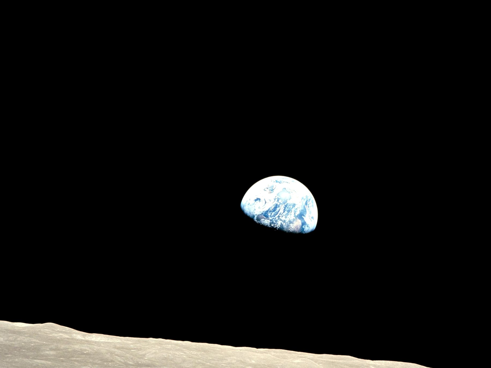

Weinberg’s move on the cosmological constant is the rare case where the feeling was turned into a number. If Λ is drawn from a wide range, the observers who measure it should find it small enough for galaxies, and not much smaller than that unless something else is at work. The measured value is near that edge. That is interesting. It is not a proof of a menu. It is what a filter looks like when you bother to write it down.

The year was 1987. Galaxies, in the working picture, grow from the twitches of Chapter 14 only if the shove does not win too early. If vacuum energy is large, the stretch accelerates before the overdensities can collapse, and you get a thin fog with no spirals and no kitchens. Weinberg asked what values of Λ a later observer could possibly report. The answer was an upper bound: not much larger than the matter density at the epoch when galaxies form. If the prior is wide — if many values are on offer, and nothing else picks — then typical observers should find themselves near that edge, not deep in a valley of needless smallness. Eleven years later the bombs of Chapter 18 found a shove of that order. That is the interesting part. It is not a photograph of other valleys. It is a number that *looks like* a cut. Hot as a calculation: if you grant the ensemble, the bound is a bound. Warm as a hint: the measured Λ sits where a filter would put it. Cold as a proof that the ensemble exists.

The tidal seas belong here as a humility. We thought “arranged for life” meant a Goldilocks band and a blue marble. Then we found that most of the wet real estate in the solar system might be dark, under ice, squeezed by a giant, uninterested in sunsets. If there is life there, it did not need our sermon. If there is not, the permit was still wider than the sermon. Arrangement, if you must use the word, is sloppy and local, not a tailored suit.

Chapter 28 drew the starlight band. Chapter 29 drew the squeeze. The sermon had been: liquid water under a yellow sun, a blue marble, a sky, a kitchen window. The inventory, once you stop flattering the window, is ruder. Europa’s ocean, if you could unroll it, would shame the Pacific. Enceladus vents a kitchen’s ingredients into space. Ganymede may stack seas between ices. A rogue world, thrown into the dark, can keep a sea under a thermos of ice without ever having had a sunset worth naming. None of that is a detection of life. All of it is a detection of *permit*. The permit is wider than the postcard. If you were going to crown a world for being arranged, you would have to crown the dark ones too, and they do not care about your crown. Humility, here, is not a mood. It is a map correction. Life, if it is a water trick, was never a blue-marble exclusive. Observers who need a sky to grow basil are a narrower guild. Do not confuse the guild with the cosmos.

The Weak Anthropic Principle, in a careful wording, is a selection effect: the constants we measure are drawn from the values that permit us to measure them. Carbon chemists need carbon chemistry. They need a universe old enough to have cooked carbon in stars. They need a shove that did not win too early. Saying so is as taut as saying that fish find themselves in water. It is also as useful as that, once you have an ensemble to select from.

Barrow and Tipler, who wrote the big book that put the names in order, said the weak principle this way: the observed values of the constants are not equally probable. They are restricted by the requirement that there be sites where carbon-based life can evolve, and by the requirement that the universe be old enough that it already has. That is a likelihood cut. It is not a cause. It does not cook the carbon. It does not aim the shove. It tells you which draws from a menu you are allowed to be surprised by. Carter’s original wording was in that neighborhood. The later sermons wandered off.

The kitchen version is a fish. A fish, if fish wrote books, would write a hymn to water. The hymn would be true as a feeling: water is the condition of the gill. The hymn would be a leap as a cosmology: water was arranged for fish. The honest sentence is that you do not find fish composing treatises in a dry valley. A child at the sink, watching the tap, is not puzzled that cooking happens in a wet room. The child would be puzzled to find a casserole on Venus. The weak principle is that lack of puzzlement, written for constants. It stops you from treating your own lungs as a theorem about the loaf.

Without an ensemble, the weak principle is a reminder, not an explanation. It stops you from being surprised that the kitchen is not on Venus. It does not tell you why there is a kitchen.

A reminder is still a tool. It keeps you from writing “therefore God” in the margin of *α*. It keeps you from writing “therefore us” in the margin of Λ. It does not replace a theory of why the numbers have the values they have. If there is only one universe, and it had to have some numbers, then “these numbers permit us” is a consistency check. You already knew you were here. Consistency checks are not nothing. They are not a menu.

With an ensemble — cheap copies, expensive bubbles, a menu of Λ — the weak principle becomes a cut. You throw away the valleys that have no observers, and you look at what is left. You still need a measure. You still need the ensemble to be more than a catalog from an untestable framework. You do not get to say “the universe wanted us.” You get to say “we could not have found ourselves in the valleys that did not want anyone.”

Chapter 39 already sat with the expensive copies. Eternal inflation plus a landscape is the ensemble people reach for. **String theory cannot currently be tested.** A reported 10⁵⁰⁰ vacua, offered without a risky prediction that would kill the framework, is a catalog, not a census. Other frameworks offer other menus. Some offer one valley. The leftover glow does not yet choose. The measure problem sits on any infinite menu like a cat: too many observers, no agreed count, “typical” a fight. Until the fight ends, “the landscape predicted Λ” is a hope with a number attached. It is a better hope than a required last mind, because it does not contradict the shove. It is still a hope. Warm as a research program. Cold as a result.

The Strong Anthropic Principle says the universe *must* permit life. “Must” is a smuggler. It can mean the tautology, the ensemble, or a purpose. Only the first is safe. The Final Anthropic Principle says intelligent processing must arise and must never die out. That is the Omega Point’s moral clause. Chapter 19 already broke its physics. Its morals were never physics.

Unpack the smuggler. “Must,” in the tautology, means: a universe we are looking at, from inside, is one that permitted looking. Allowed. Empty of news. “Must,” in the ensemble, means: among the valleys, the occupied ones are the ones that permit occupation. That is the weak principle again, wearing a louder coat. “Must,” as purpose, means: the loaf was aimed. Aimed by whom, through which channel nature uses, with which leftover in the glow as a serial number? Chapter 34 already asked the watchmaker to clock in. The channel has not spoken. The Final principle is louder still. It does not only want a permit. It wants a forever-mind as a law. The bombs, the leftover glow, and the mixmaster of Chapter 16 declined. Barrow, who had helped write the names, had the better habit in the short origin book this one uses: walk up to the speculation and call it an idea for ideas. The Final Anthropic Principle is an idea for ideas that put on a lab coat. This book will not help it with the buttons.

A filter is not a purpose. A purpose has an aim. A filter has a mesh. We are what got through, in this valley, on this worldline, with this leftover helium. That is enough to be getting on with. It is not enough to crown us.

Do not crown the fish for discovering water. Do not crown Mara for finding a permit that includes basil. Do not crown this species for occupying a temperate crust while dark seas, if they are empty, were always empty without our permission, and if they are not, were never waiting for a sermon. The leftover glow does not have a favorite. The shove does not have a favorite. The mesh does not owe the things that pass through it a parade. You may still grow the basil. You may still melt the ice. You may still be glad the nuclear force was not a few percent ruder. Glad is a local weather. It is not a cosmology.

---

\newpage

## 42. No Cosmic Craftsman

Darwin’s trick, which this book has been circling since the prologue, is that a filter can look like a craftsman if you only see the survivors. The beaks fit the seeds. The fit looks like intent. The intent was death, repeated, in a lot of directions.

The look is not a small look. A living thing is an invoice so long, and so locally paid, that a reasonable person staring at one bird will reach for a someone. Paley’s watch on the heath was that reach, and it was not stupid as a first move. A watch has parts that mesh. A finch has parts that mesh. The difference, which is the whole of the trick, is that watches do not leave a trail of almost-watches that died, and finches do. The trail is the notebook. Skip the notebook and you will hire a craftsman every time. Keep the notebook and the craftsman becomes a mesh you can miss: a pile of deaths that would have looked, from inside any one of them, like a plan that failed.

He did not start with the trick. He started with a notebook. Islands. Barnacles. Pigeons in a shed. A clergyman’s son who could sit still and then refuse the cheap sentence. The beaks were not a revelation in a dream. They were a pile of measurements that would not sit still under “each kind was issued.” Malthus gave him a rate. Breeders gave him a proof that selection can be hurried by a hand. The conclusion — descent with a mesh — was keen because the observations were allowed to kill the other story. A man on the other side of the world, looking at beetles and islands of his own, reached the same mesh without asking permission. That is what this book means by a path: **a record you could have missed, then a sentence that can die.** The leftover glow is that habit aimed at a fog. The dark sea is that habit aimed at a lid of ice. A craftsman is what you hire when you skip the notebook.

The man on the other side was Wallace. Same mesh, different kitchen, a letter from the Malay Archipelago that arrived in time to make the announcement a joint one. That matters for the method, not for a statue. Two notebooks, two worldlines, one sentence that could have been wrong and was not. Malthus had only meant a sermon about the poor. The rate he named — more mouths than food, if nothing checks — is a filter when you let it run on beaks. Breeders had only meant prettier pigeons. The shed is a proof that a mesh, hurried by a hand, can make a pouter from a rock dove in a career. Nature’s hand is slower and has no taste. The taste is what dies.

The cosmic version is ruder because we cannot see the deaths. If there are dead valleys, they do not send baby pictures. If there are dead tiles, they are out of reach. If there are dead branches, they do not radio. We see a leftover glow that permits spirals, a shove that waited, a nuclear force that permits carbon, a Jupiter that squeezes a moon until a sea stays wet. The craftsman story is the cheap story. The filter story is the one that does not invent a someone.

Hot: this universe permits chemists. Warm: some of the coincidences of Chapter 41 are what a cut looks like, if the draws exist. Cold: a someone numbered the leftover glow. The cold claim has had centuries of poetry and no channel. Beauty is not a serial number. A blue marble is not a signature. A dark sea is a humility, not a second signature. You may still find the glow beautiful. Finding it beautiful is a fact about a worldline. It is not a telegram.

Anthroposophy — a spiritual cosmos arranged around human becoming — is a craftsman story with incense. It does not survive the leftover glow, the three minutes, or the shove. It is not a warm claim that failed. It is a different game. This book does not play it.

Steiner’s cosmos has a plot: human spirit as the point of the loaf, epochs, a moral weather in the planets. Plots are allowed in novels. Plots that must survive the leftover helium have to predict the helium, or at least not contradict the workshop that made it. Anthroposophy does not fail a nuclear test because it does not sit the test. It does not fail the shove because it does not use the bombs. It is not in the temperature system. It is a different kitchen, and this book’s kitchen is the one with a clock that already lied. You may keep the incense if the incense is how you stay kind. Do not promote it to a thermal history.

Where, then, is God?

If the word means a person who numbered the leftover glow, aimed a river kingdom’s stones, and poured a library into the first ocean — a colleague, larger — then the word is the watchmaker again. The channel nature does not use has not spoken. Beauty is not a serial number. This book will not pretend a gap in the first chemical hour is a detection.

That is the cold hire. Paley’s watch, scaled up. Chapter 34 already asked it to clock in: a leftover in the air, a serial number in the glow, a signal that is not the ionosphere. The glow’s freckles look like stretched noise. The stones of a river kingdom look like a people who could cut rock. The first ocean looks like chemistry that either copied or did not. A gap is not a someone. A gap is a gap. You may call the someone by an old name in a kitchen. The field equation will not countersign the name. Hot as a sociological fact: people hire the watchmaker. Cold as physics: the hire has not clocked in.

If the word means the reason there is a loaf rather than not, the question is honorable and unanswered. Naming the question is not a theory. It does not predict the helium fraction. It does not fix Λ. It does not open a handle. You may keep the name in a kitchen, the way you keep “now.” Do not promote it to a cosmology. Einstein’s habit, when he said God, was often the order itself — *Deus sive Natura*, a dignity for the metric, not a will. That habit is poetry with a good ear. It still does not give you a prayer that changes a worldline from outside the loaf.

Why is there a casserole rather than an empty oven? That is a kitchen sentence for the honorable question. Physics, as we have it, takes the loaf as given and asks how the slices relate. It is very good at that. It is silent, so far, on why there is dough. Silence is not a detection of a baker. Silence is silence. Barrow would have called the question an idea for ideas and then gone back to the leftover glow, which is a measurement. This book will do the same. You may sit with the question after you take the casserole out. Sitting with it is not a third temperature. It is a refusal to fake a result.

If the word means the laws, you have renamed the equations. Allowed. Empty.

Calling the Friedmann equation God does not make the stretch kinder. Calling the leftover glow a hymn does not change its temperature. Rename if the rename keeps you from treating the mesh as a someone. Do not imagine the rename added a will.

The devil is the same furniture with the sign flipped. A cosmic adversary who wants the host to lose is a craftsman of evil, and Chapter 30 already fired that hire: survival at all cost is a fitness peak, not a personality. Death keeps the score. Entropy is the arrow we borrowed from a smooth beginning, not a being who likes ashes. Suffering is real. It happens on threads. It does not become a second deity because we need someone to blame who is not the filter. You may use the old words for the old dread. The field equation will not countersign them.

The pointer is enough. Chapter 30 wrote the peak — the wasp, the nest, the invoice paid in other bodies — and this chapter will not rewrite it. The temptation, in a book that has just fired a cosmic craftsman of good, is to keep a cosmic craftsman of evil so the dread has a face. Faces are for kitchens. The mesh does not have one. A parasitoid is a local success, not a deputy. A plague is a copy that found a host, not a sermon. Entropy is Chapter 44’s arrow, a boundary condition, not a preference. If you need a word for the dread, use the dread. Do not staff a second throne.

What we *can* be is a local craftsman. The greenhouse is a beak we built for a seed we brought. The melt-probe is a beak for a dark sea. The library is a beak for a future dirt. That is not the universe arranging itself. That is a worldline arranging a room. The difference is the whole moral, if a cosmology book is allowed one: do not wait for the loaf to love you. Do not require the ending to compute you back. Grow the basil. Taste the plume. Send the machine. Admit that it may fail. Call that, if you need a word, meaning — and keep it off the gravitational field equation.

Local is the word that does the work. The woman hitting the airlock is a craftsman in a glove. The machine chewing ice is a craftsman that does not sleep. The box of sequences in Chapter 32 is a craftsman aimed at a later dirt. None of them is a clause in Einstein’s equation. None of them is required by the leftover helium. All of them are allowed by a permit — water, carbon, a little quiet, a launch window — and by a refusal to wait. Meaning, on this reading, is not scheduled at crunch and not denied by heat death. It is a project on a thread. Projects can fail. That is what keeps them off the list of destinies. Destiny was the thing that was not allowed.

Hot: there are worldlines that arrange rooms. Warm: that arrangement is the only craftsman this cosmology can sign. Cold: the loaf will notice and grade the basil. The loaf does not grade. The dirt does. The dirt can vote no.

Paley’s watch, found on a heath, was an argument for a someone. The greenhouse is a watch we can name the maker of. She hits the airlock. She logs the pH. The melt-probe is a watch with no one inside, chewing ice because a worldline decided to look. The library is a watch aimed at a later dirt. Those are craftsmen. They are local. They leave a trail of invoices, not a serial number in the leftover glow. That is the inversion the cosmic hire never survives: when you can name the hand, you have a project. When you cannot, you have a mesh or a sermon. This book will keep the project and fire the sermon.

---

\newpage

# PART X — What the Future Is Allowed to Be

---

\newpage

## 43. Five Ways It Can End

The leftover glow does not say how the story closes. The shove does most of the talking, and it talks in a low, accelerating voice. Here are five closings, with their temperatures.

A kitchen loaf can finish in more than one way. It can dry until it is a brick. It can be pulled apart while it is still warm. It can be shoved back into a hotter oven and collapse. It can spoil from the inside, a bubble of wrong chemistry that eats the crumb at the speed of the room. It can be sliced so thin and glued to tomorrow’s dough that you call the end a beginning. Only one of those is on the receipt you were handed with the ingredients. The receipt, in this cosmos, is the bombs, the leftover glow, and a shove that is winning. The receipt says: it dries. The other four are allowed as other kitchens, other valleys, other mistakes in how we read *w*. They are not on this ticket. Katie Mack wrote the tour; Barrow would have walked you to the door of each and then asked which one had a measurement. This chapter does that, with a clock.

**Heat death.** The working default. The stretch keeps winning. Bound islands last a long time and then do not: stars burn out, remnants cool, black holes leak (Chapter 23), the islands thin toward a sameness in which no heat can run a trick. Time, as a useful word for change, gets bored. This is Kelvin’s old gloom, updated with dark energy. It is not a crunch. It is a fade. Hot as the track the bombs picked. Warm only in the details no one has photographed.

William Thomson — Kelvin — said it in the nineteenth century, when the leftover glow was not yet a fact and the shove was not yet a bomb. Stars would burn out. The universe would reach a sameness of temperature. No heat engine, no trick, no kitchen. The gloom was thermodynamics applied to a cosmos he could not yet weigh. The update is the shove. Without it, you still had a fight: pull versus stretch, a possible recollapse, a possible tired forever. With it, the fight is over unless the shove is a liar. Isolated lumps stay bound — the Local Group, a while; a galaxy, longer. Between them the dough wins and keeps winning. New stars, after a long career, stop being made. Red dwarfs, the stingy ones, spend on the order of 10¹³ to 10¹⁴ years and then sit as cinders. White dwarfs, neutron stars, brown leftovers: a degenerate era, dimming. Then the holes. A stellar-mass hole leaks on a timescale of order 10⁶⁷ years. A giant, a billion Suns, can last toward 10¹⁰⁰. Chapter 23 already wrote the leak. After the last leak, the islands are a thin of particles and a leftover stretch, too even to run a trick. That is the fade. Hot as a default given the bombs. Warm in the details: we have not photographed year 10¹⁰⁰. We have the equations that got the leftover glow right, pointed forward. Mara, if the potatoes prosper, still lives inside one bound island. The island can go dark without a recollapse. The afternoon is long enough to grow basil.

**The rip.** If the shove is not a constant but a growing rudeness — *w* less than −1, phantom, a word that should not have survived the committee — then bound things unbind. Galaxies, then stars, then worlds, then you. Finite time. No evidence requires this. The bombs permit a constant. Cold, unless *w* misbehaves in a future survey.

*w* is the ratio of pressure to energy density. A cosmological constant sits at *w* = −1. Acceleration needs *w* less than −1/3. A rip needs the phantom: *w* less than −1, and no decay of the field that would let it sit down. Then the shove grows. Clusters unbind. Galaxies unbind. The Solar System unbinds. Atoms, in the rude versions, unbind. There is a last day, and it is not a metaphor. The working surveys, as of this kitchen, are consistent with *w* = −1 to a few percent. That is not a proof it cannot wander later. It is a proof it has not been required to. The working surveys, as of this kitchen, have not been required to make *w* phantom. If a future survey finds it, this paragraph gets a promotion.

**The crunch.** Pull wins. The web falls back. The last three minutes are a hot workshop in reverse, then a scramble, then a singularity or a bounce. The bombs and the leftover glow say we are not on this track unless the shove is a liar. Cold as destiny; allowed as a different valley.

A crunch was the textbook future for a long time, the one that made forever-minds look like a calculation. Chapter 19 already broke the calculation. The shove is winning. Recollapse needs the pull to take the budget back. It has not. Even in a universe that *did* crunch, the mixmaster of Chapter 16 is a scramble, not a control panel. BKL chaos is not a computer. You may still write a crunch as a different bubble’s fate. You may not write it as ours.

**Vacuum decay.** A jitter somewhere turns the vacuum into a ruder vacuum. A bubble of the new one grows at light, rewriting the laws inside it. No warning: the warning would arrive with the bubble. The leftover glow’s vacuum looks stable enough that we are still here. “Stable enough” is not “stable.” Cold-to-warm; do not lose sleep; do not pretend the risk is zero.

The Higgs vacuum, given the measured masses of the Higgs and the top quark, may be a metastable sit: not the lowest valley, a ledge. A ledge can tunnel. Coleman and De Luccia wrote the bubbles; the wall, once nucleated, runs at light. You would not see it coming because seeing is a light-speed fact, and the wall is that fact. The estimated lifetime, in the working Standard Model, is vastly longer than the present age — longer, often, than the fade. That is why you should not lose sleep. The estimate depends on numbers we still sharpen and on physics above the energies we have stacked. That is why you should not pretend the risk is zero. If a bubble arrives, there is no project that outruns it. Mara’s greenhouse, the melt, the library — all of them are inside the same vacuum.

**The bounce.** The end is a middle. A crunch becomes a bang, or a dark sea of extra-dimensional branes slaps, or Penrose’s conformal trick glues a thin future to a next beginning. Cyclic, ekpyrotic, conformal: names, papers, no leftover-glow signature that has stuck. Cold.

A bounce needs the pull to win first, or a different high-curvature theory that turns a bang into a rebound, or a pair of branes that collide in a room we have not photographed. Loop-quantum sketches bounce. Ekpyrotic sketches slap. Penrose’s conformal cyclic cosmology glues a thinned, far future to a next fog by a rescaling that makes infinity look like a start. Each of these is an idea for ideas with equations. None of them has a leftover-glow signature that has survived the surveys as a detection.

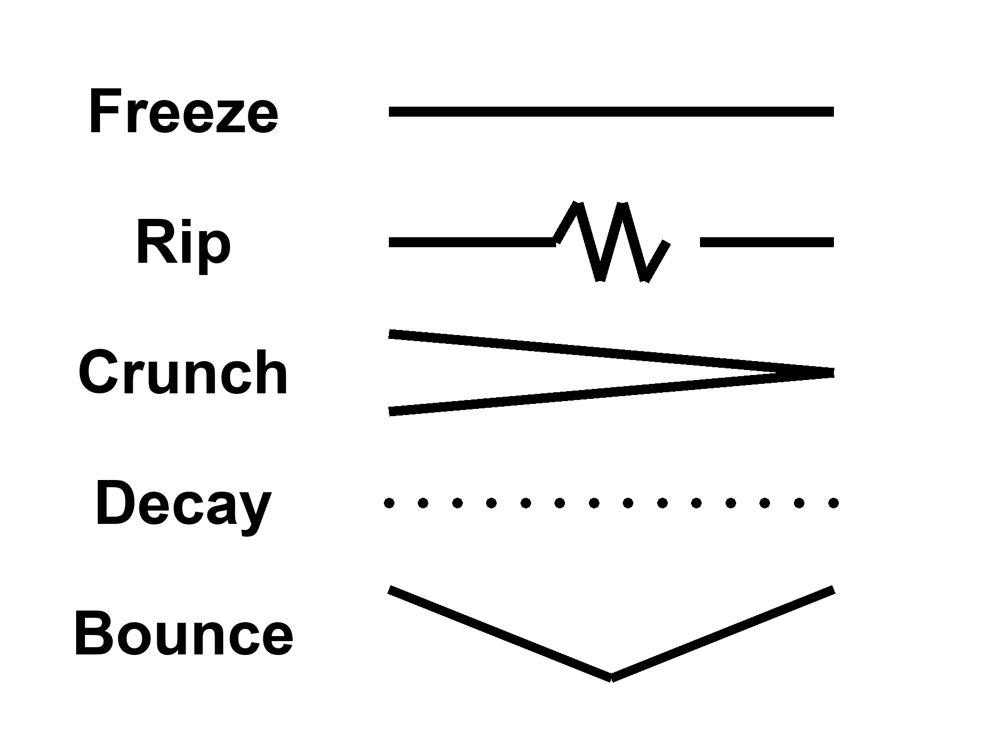

Notice what is not on the list: a required forever-mind. Notice what *is* on the list, quietly, as a project rather than a fate: a greenhouse, a dark sea, a machine that does not sleep. Those do not close the cosmos. They occupy a few more worldlines before the fade. That is the only closing this book will bless.

The Omega Point wanted a sixth row: crunch, then mind, then God. Chapter 19 deleted the row. The Final Anthropic Principle wanted the row as a law. The data did not countersign. You may still want mind to last. Wanting is a project. Put it in the greenhouse, in the probe, in the library. Do not put it in the Friedmann equation.

Appendix A43 writes *w*, decay rates, bounce conditions. Here, pick the default without romance: a long accelerating stretch, islands going dark, the leftover glow thinning until even the holes begin to leak. If you want a prettier last page, write it yourself, in a room, while there is still a room.

---

\newpage

## 44. Does Time Exist?

We have used “time” as if we knew.

In the kitchen, time is the clock. In relativity, time is a direction in the loaf, mixed with space, sliced differently by walkers. Proper time is a length of thread. The leftover glow picks out a useful slicing — cosmic time — because the glow is almost the same everywhere and we can watch it cool. That slicing is a convenience the universe approximately offers, not a throne.

The wall clock is still the right tool for a casserole. It is a terrible cosmology. GPS is the grown-up version of the same split. The satellites carry clocks. The clocks run fast, relative to the ground, because they sit higher in Earth’s well, and they run slow because they are moving. Both corrections are geometry. The well’s gift is the larger one: about forty-five microseconds a day of speeding-up. The motion’s tax is about seven microseconds a day of slowing-down. The net, about thirty-eight microseconds a day, would be a joke if light were slow. Light is not slow. Thirty-eight millionths of a second, times the speed of light, is on the order of ten kilometers of lie per day if you skip the metric. That is why the phone in the kitchen can find the street. You do not need a philosophy of time to land a plane. You need the interval. That is the first honest answer, and it is hot.

Mara and Eli are still on that argument, years apart. He is allowed to use the wall clock. Her radio is the late relation the clock cannot annex. Chapter 1 already gave them Andromeda as the thing the clock cannot settle. This chapter gives them GPS as the thing the geometry can. The clock is a local tool. The satellites are the same tool, corrected. Neither is a river. Both are relations among events: a tick here, a tick there, a radio that is late on purpose. If “does time exist?” is a way of asking whether those relations are real, the answer is yes, and your dinner depends on it.

Does time *exist*? The honest answers come in flavors.

**Yes, as geometry.** The loaf has a metric. Intervals are real. This is the hot answer, and it is enough to run GPS.

Enough, also, to run the twin who comes home younger, the particle that lasts longer in the lab, the radio that answers twenty minutes late. Chapters 1 through 6 spent this money. An event is a happening. The interval between happenings is the thing the geometry cares about. Proper time is how much of that interval a particular thread accumulates. “Does time exist?” in this flavor is like asking whether length exists. Length is a relation among events along a ruler. Time is a relation among events along a worldline. The relation is as real as the casserole’s doneness. The throne — a universal now the relations are painted on — is what the kitchen clock invented and relativity retired.

**Yes, as an arrow, but the arrow is a boundary.** The laws do not prefer a direction. The low-entropy past does. Eggs smash because the beginning was smooth. Carroll’s Past Hypothesis is this sentence in a better suit. If the past had been a scramble, we would not have a “we.”

The microscopic rules run as well backward as forward. That is not a rumor. It is a feature of the equations that got the three minutes right. The arrow you feel — memory, cause, the way a cup does not unshatter — is not a second law hiding in the metric. It is a fact about the region we call the past: it was special, smooth, low in the kind of mess that would have been a heat death at the start. From a special past, the typical futures are messier. That is the arrow. It is hot as a thermodynamic fact in kitchens and stars. It is warm as a cosmological claim: we do not have a derivation of *why* the past was special. We have the leftover glow as a photograph of a smoothness, and a name for the postulate that says the smoothness was there. The Past Hypothesis is that name. Without it you do not get observers who remember. With it you do not need a river.

Memory is the arrow made intimate. You remember the special past because the special past left records, and records are a kind of order: a photograph, a scar, a leftover glow, a notebook of beaks. You do not remember the fade because the fade has not left you a fossil of itself in your head. That is not a failure of the brain. It is what a boundary condition looks like from inside a thread. An egg smashes and does not un-smash for the same reason. The laws would allow the un-smash. The past would not. The kitchen already knew this before it had a name. Cosmology’s job was to notice that the leftover glow is the same kind of fact, written on the sky.

**Not as a river.** There is no glowing NOW moving down the loaf. Chapters 1 through 6 were that retirement.

A river would be a privileged slice, lit, advancing, making the future into the present and the present into the past. The loaf does not have that furniture. Different walkers slice differently. Andromeda’s navy is not waiting for your kitchen instant. The leftover glow offers a convenient slicing because it is almost the same everywhere, a last-scatter surface you can watch cool. Convenience is not a throne. You may still say “now” to take the casserole out. You should. Just do not promote the kitchen to a cosmology.

**Maybe not as a fundamental word.** In some attempts to quantize gravity, the wave of the universe does not mention time. The Wheeler–DeWitt equation is a constraint, a “this must add up,” not a “this happens next.” Julian Barbour takes the hint all the way: the inventory is configurations, Nows, a heap. Dynamics is what a heap looks like when it contains records of other heaps. Carlo Rovelli takes a different hint: time is what a system with heat says about itself. Thermal time. A useful word for a useful state.

Wheeler and DeWitt wrote a wavefunction of geometry that sits still: Ĥ Ψ = 0, no external *t* on the page. That is the problem of time in quantum gravity, and it is not a slogan. If the whole loaf is the system, there is no clock outside it to say “next.” Time, if it is to be recovered, has to be recovered from inside: a subsystem that can serve as a clock, a semiclassical limit where a geometry becomes classical enough to have a *t*, a relational fact among degrees of freedom. One family of recoveries says: treat part of the loaf as a clock and ask how the rest correlates with it. Another says: when the geometry is large and gentle, a WKB limit hands you something that looks like the Schrödinger equation in a *t* that was not fundamental. Warm-to-cold as a research program. No experiment has selected the recovery. The GPS clock does not adjudicate this fight. GPS lives in the limit where the recovery has already succeeded, or was never needed, because the metric is classical enough to land a plane.

Barbour’s heap is the austere version. The world is a pile of Nows — instantaneous configurations — and what we call motion is a correlation: this Now contains records that match that Now, the way a brain contains a memory that matches a room. There is no moving spotlight. There is a heap with internal likenesses. It is a picture that takes “no river” all the way to “no primitive duration.” It is cold. It is the right kind of cold: it does not add a someone, and it does not contradict GPS, which lives in the classical limit where the heap looks like a loaf.

A fossil, in the heap, is a Now that contains a record of another Now: a glow with a temperature, a notebook with a beak, a scar. Dynamics is the pattern of those containments. You do not need a spotlight moving down a hallway of rooms. You need the rooms to include pictures of other rooms. That is either a deep truth or a way of talking. We do not yet have a leftover-glow test that picks. What we have is a warning: do not smuggle a river back in just because English has a tense.

A tempting merger waits here, and Chapter 37 already taught the habit for refusing it. Barbour has a heap of Nows. Everett has a sum of branches. Both say the inventory is bigger than the slice you remember. Put them in one coat and you get a slogan: every possible Now exists, so the multiverse is just the heap. Two drawers, one bench.

Open them one at a time. The heap is configurations: every arrangement the stuff could have, one point per arrangement, whether or not anything in it remembers anything. That is configuration space, a map of the possible. Everett’s branches are not points on that map. A branch is a term in the wave that has decohered from the other terms, a pattern of records that agree with each other about which face the coin shows. Most points in the heap belong to no branch worth the name. They are scrambles with no records at all. A branch is a thin, well-behaved thread through the heap, picked out by decoherence. Not by time. Not by being possible.

Barbour did build a bridge. In his picture the wave of the universe piles its weight on the Nows that hold consistent records, which he calls time capsules. That is a bridge between two drawers, not a fusion of them. It is a proposal about where the weight sits, and nobody has derived it from anything we can test. The GPS clock is no help here either. It lives where the heap already looks like a loaf.

Hot: decoherence is a measured rate. Warm: Everett as a reading of the rule that builds chemistry. Cold: the heap as the fundamental inventory, and the time capsules as its weighting. Colder than any of them: the fused slogan. Possible is not the same word as realized. A map of every arrangement is not a census of worlds.

Rovelli’s thermal time is a different recovery. A system with enough heat, enough statistical mix, can have a flow defined by that mix: time as what equilibrium says about itself. In ordinary kitchens this is overkill. In a quantum gravity where no *t* is on the page, it is a candidate for where the word comes back. Cold-to-warm. Allowed. Not a photograph.

Hartle and Hawking’s no-boundary idea tries to replace “before the bang” with a rounded-off geometry, time crystallizing only when the universe is large enough to have it. Vilenkin tunnels from nothing, which is a technical nothing, not a kitchen nothing. These are cold, and they are the right kind of cold: they are attempts to stop using a word where the word may not apply.

“Before the fog” may not be a kitchen word. Empty, in physics, is already a something: a vacuum, a rule, a jitter. A technical nothing is a path integral without a prior boundary, or a tunneling from a state that is not a waiting room. Neither is an empty oven with the lights off. Chapter 7 already refused the waiting room. This chapter refuses to staff it with a *t*. Cold: we do not have a leftover-glow fossil of the rounding-off. Allowed: the attempt is what you do when you take the problem of time seriously instead of drawing a throne and calling it God.

This book’s working answer, the one that can carry a greenhouse and a dark sea: time exists as relations among events. It does not exist as a stage the events are put down on. It may not exist, in the quantum-gravity limit, as a primitive. The arrow exists because the past was special. You exist as a thread that remembers the special past and cannot remember the fade. That is enough to hit an airlock and call it morning.

The wall clock still useful, not a cosmology. That is the kitchen sentence. Use it to take the casserole out. Use GPS to know where the greenhouse is. Use proper time to know how old the woman is when the window opens. Use cosmic time as a convenience when you want to say how long after the leftover glow’s last scatter a galaxy formed. Do not use any of them as a river the loaf is floating on. Do not use “before” as a room. Do not use a required forever-mind as a clock that runs after the holes have leaked. Relations among events are enough. They were always enough. The rest was a throne we built because kitchens have clocks and clocks have a way of looking like laws.

Hot: intervals, GPS, the arrow as a fact about a smooth past. Warm: the Past Hypothesis as the name of that smoothness; cosmic time as a convenience. Cold: a primitive *t* in the quantum-gravity wave; a waiting room labeled BEFORE; a river. The working answer sits in the hot and the warm and lets the cold stay cold. That is how this book has used temperatures since the front. It will not stop at the last chapter but one.

---

\newpage

## 45. The Honest Ending

Let us cash the recognitions, the way a book of this family is supposed to. Cashing is what you can *do* once the recognition has arrived and stayed. A second reading of the same list would be a choir.

An event is a happening: so you stop asking where the casserole “is” in time and ask which happenings it is between. “Now” is a slice you draw: so you keep the word for the kitchen and retire it for Andromeda. The past we can rebuild is a region: so the three minutes are not a myth you are being asked to respect, they are a workshop whose tools you still own. Most of what pulls does not shine: so you weigh by lean, not by glow. Most of the budget shoves: so the future is a fade unless the shove is a liar, and a required last mind is a story. A horizon is a one-way fact: so you do not book a door. A handle is a bill: so you do not staff a subway. Copies are four kinds: so you do not fuse them and then sell a ticket. Arrangement is a filter: so you do not crown the fish. Time is a relation: so the wall clock stays a tool. Each of those is a refusal that leaves a project standing. The project is the point of the cash.

And then the part the leftover glow does not owe us:

A dead world can hold a greenhouse if someone bullies the ice and the hours. A frozen moon can hold a sea if a giant squeezes it, and that sea can hold a second origin or an empty kitchen, and the only way to know is to melt and look, without poisoning the answer. A crew that does not sleep can carry a library farther than flesh. The library is a physical object. The project can fail. Failure is allowed. Destiny was the thing that was not allowed.

That paragraph is the second trunk of the book, and it is not a schedule of downtowns. It is a permit list. Water, carbon, a little quiet, a launch window, tact. No downtown assigned. No recovery of this world promised by leaving it. No helium for a body that wants a thousand centuries. Those rooms, if they are rooms, are later kitchens. This cosmology signs a smaller invoice: a greenhouse that may die in month four, a melt that may taste an empty, a library that may miss. The invoice is interesting *because* it can fail. Destiny cannot fail. That is why destiny was the thing that was not allowed.

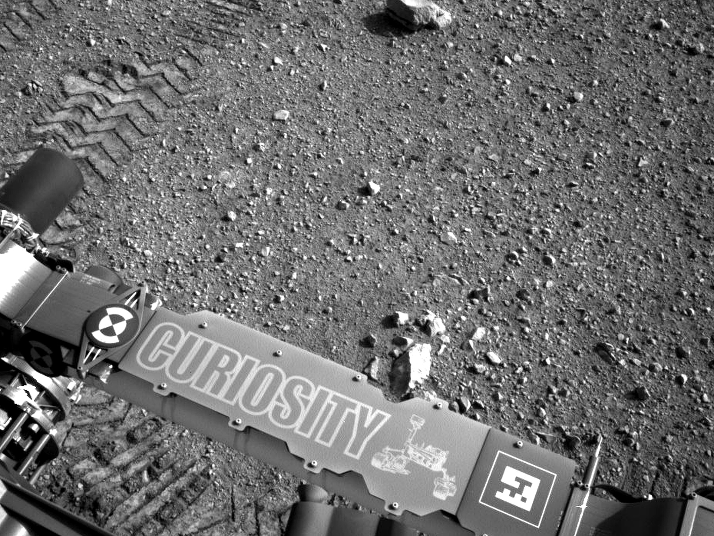

If every allowed outcome is on the inventory, this outcome is still the one with your hands in it. If the block is real, the basil you log on a cold morning is as real as the leftover helium. If the block is not quite real, if time is a heap of Nows, the heap still includes the smell of a lie in a room of LEDs. You do not need the universe to have a purpose in order to have a purpose in it. You need a permit — water, carbon, a little quiet — and a refusal to wait for the ending to compute you back.

Local, on one worldline. That is the moral the field equation will not write and does not have to. Everett, if you buy the reading, puts other outcomes on the inventory. The cheap copies, if space is that large, put other kitchens out of reach. Neither of them cooks this basil. Grief is still a fact about one thread. So is a project. So is the decision not to plague a dark sea. Meaning that had to be scheduled at crunch was a way of not having to decide. Meaning that is local is a way of having to.

Is there a path to ultimate knowledge?

There is a path. There is no chapel at the end of it, and the word *ultimate* is a temptation the loaf itself refuses.

Knowledge, in this book, is a record you could have missed. A prediction that can fail. A fossil that does not need your agreement: the glow, the helium, the stretch, the ring around a hole, a leftover in a navy file that still has no name. The path is the widening of that kind of record — not a feeling, not a collapse of the ocean when you look, not a framework that can survive every outcome and therefore explains none.

Darwin’s notebook was already the whole method. A pile of beaks. A sentence that could die. Wallace’s letter. The leftover glow is that habit aimed at a fog. Weinberg’s three minutes are that habit aimed at a workshop. The bombs of 1998 are that habit aimed at a future that did not want to recollapse. A melt that tastes a sea is that habit aimed at a lid of ice. The path does not change species when the subject changes. It does not become a chapel when the subject is the loaf. It stays a record you could have missed. Lengthen it. Do not crown it. Do not build a last room and call the room God.

The steps are few, and they are severe. They are also old. A notebook, a pile of beaks, a sentence that can die: that is already the whole method. The sky is a larger shed of pigeons.

Learn the bills. Special relativity: no shared now, no local dash past light, mail that is late on purpose. General relativity: gravity is the loaf; a handle and a bubble are sentences that still owe a stuff we have not stacked. Quantum mechanics: amplitudes, decoherence, pairings without a telegram. The seam where the two great theories do not yet share a kitchen is the largest honest hole we have. Sit in it. Do not furnish it with a visitor or a god of the gaps.

The bills are not homework for a degree. They are the price of not being fooled. Special relativity is why Andromeda’s navy is a parable and not a paradox. General relativity is why a horizon is a fact about events, why GPS needs a metric, why a handle has an invoice. Quantum mechanics is why a pairing is not a radio and why a branch, if Everett is right, is not a ticket. The seam is the hole where those two great theories do not yet agree on a kitchen: a geometry that is also a quantum object, a time that may not be a primitive, a bang that may not have a before. Sitting in the seam is the opposite of filling it. Filling it is how you hire a craftsman. Sitting in it is how you keep the next record honest. **String theory cannot currently be tested.** It is one of the attempts to furnish the seam. It has not named a kill-shot. Until it does, it is a large, ingenious maybe. Maybes are allowed. Maybes are not results.

Learn the walls. An event horizon is a fact about influence. A cosmic event horizon is a fact about which galaxies will never get your letter. A branch, if Everett is right, is a fact about a term you cannot enter. “Before the fog” may not be a word. Those are not insults. They are the shape of what a worldline is allowed to know.

Walls are not dares. A dare is a poster that says the wall is a door if you are brave. Chapter 24 already fired the poster. You cannot fetch a letter from inside a hole. You cannot fetch a letter from a galaxy past the cosmic event horizon. You cannot hop a branch. You cannot sit in a waiting room labeled BEFORE and interview the fog. Knowing the walls is part of the path. It keeps you from spending a life on a ticket that was never for sale. It also keeps you from despair: the rooms that *are* in your future cone — a dead world with ice in its bones, a moon with a sea, a dish that can hear a shout — are not small because they are not the whole loaf. They are the part of the loaf a thread can still work.

Refuse what cannot die. A story that fits every leftover glow is not a story. String theory, as it stands, has not named a kill-shot. A craftsman who leaves no channel nature does not use has not clocked in. An observation-creates-life that cannot say what counted as the first observer is a regress, not a path.

The refusal is a temperature rule. If a claim cannot be wrong, it is not a claim in this kitchen. The leftover glow could have been a different temperature; it was not. The helium could have been a different fraction; it was not. The stretch could have been slowing; it is not. Those are sentences that could have died. Keep them. Fire the ones that survive every outcome.

Build the next record. A telescope that can smell an oxygen-methane pair and be wrong. A dish that can hear a shout and know the shout was not the ionosphere. A melt that tastes a dark sea without writing over it. A library that is a box, not a sermon. A legislature, even, when it is doing its only smart job: asking whether the leftover in its own air is an adversary, a secret of its own, or a file that still says unidentified. That last is not ultimate knowledge. It is hygiene.

Melt, dish, library: three beaks. The melt is the only way a second origin, or a clean empty, leaves this solar system as a measurement instead of a mood. The dish is the only way a shout that is not us becomes a fossil. The library is the only way a trick of carbon and water travels farther than a body that has to eat. None of them is a destiny. Each of them can fail. Each of them is a widening of the record. Planetary protection is the tact that keeps the melt from becoming a flood. Chapter 32 already wrote the rule: look first, seed later, never confuse the two. Tact is not a chapel. Tact is how a local craftsman does not become a plague.

What would *ultimate* have to mean, if we kept the word? Not a God’s-eye inventory of every branch, every before, every event outside our cone. That inventory, if it exists, is not a destination. Ultimate, for a thread, is asymptotic: more of the loaf brought into a record that can fail, fewer sermons in the gaps, a closing of the QM–GR seam if the seam can be closed, a second dictionary under ice or a clean empty, a leftover named or honestly unnamed. You will not finish. The fade, if the fade is coming, will not wait until you finish. The point of the path is not to arrive at a last fact. It is to be the kind of worldline that can tell a last fact from a mood.

Lengthen without a chapel. That is the whole close, if you want it in four words. A chapel is a last room that cannot be wrong. This cosmology has no such room. It has a kitchen clock that is still useful, a leftover glow that is still late, a shove that is still winning, a seam that is still a hole, and a handful of projects that still might fail. That is a richer inventory than a throne. It is also a ruder one. Rudeness is the courtesy of a universe that does not need us in order to have had a first three minutes, and does not owe us a last mind in order for a morning to be worth hitting an airlock.

The clock on the kitchen wall is still lying. Let it. Take the casserole out. Then, if you have the years and the machines and the tact not to plague a dark sea, send a library. Not because the loaf requires it. Because you can, and because the fade, if the fade is coming, will not be hurried or helped by your waiting.

That is the honest ending. It is not a door. It is a door you build, on a world that did not ask for one, under a sky that is late on purpose. It is also the only path this cosmology can sign: **widen the record, pay the bills, stop at the walls, and do not hire a someone to finish your homework.**

Meaning, if you still want the word after forty-five chapters, is local, expensive, and optional. It lives on one worldline, in a room that smells like a lie, under a clock that was never a cosmology. Grow the basil. Log the pH. Melt if you can do it without writing over the answer. Send the box if you have the tact. Admit that the dirt can vote no. That admission is not despair. It is the difference between a project and a destiny, and it is the last recognition this book will cash.

\newpage

# APPENDIX — The Scientific Detail

\newpage

## How to Read These Notes

Each note A*n* twins popular chapter *n*. Units are SI unless stated. *c* is the speed of light, *G* Newton’s constant, *ħ* the reduced Planck constant, *k* Boltzmann’s constant. A scale factor *a(t)* is dimensionless; today *a₀ = 1*. Cosmological redshift *z* obeys *1 + z = 1/a* for light emitted at *a*. A gravitational redshift, as in Pound–Rebka, is a different relation.

String theory, whenever it appears: a mathematical framework that **cannot currently be tested**. It has not produced a unique, risky prediction that would kill the whole idea if the experiment came out otherwise.

These notes are denser than the chapters they twin. They are still this book: short sentences, named measurements, temperatures on the claim. They are not a textbook. If a formula is numbered (1)–(17), the number is a handle, not a homework set. Row (18) is a standing rule, not a formula.

---

\newpage

## A0. Three Temperatures of Claim

**Hot:** repeated measurement, used to predict new ones. **Warm:** best model, real gaps. **Cold:** allowed by the equations, not selected by the data. A claim can change temperature. The oven is the sky, not the seminar.

Inflation is the cleanest change-of-temperature in this book. In 1981 Guth’s paper was a proposal: a brief early burst of repulsive stretch that could solve the horizon, flatness, and monopole problems the hot bang, taken alone, cannot. The first (“old”) inflation stalled on how to end the burst without emptying the universe of matter. In 1982 Albrecht–Steinhardt and Linde supplied slow-roll exits. That was still a model. What warmed the *local* burst was later data: a sky that is spatially flat to a percent; a primordial spectrum with *n_s* a few percent below 1 (A14); acoustic peaks in the leftover glow that match a nearly scale-invariant twitch stretched outside the Hubble radius and then brought back. Those are not proofs that a particular inflaton exists in a detector. They are reasons the local burst is no longer a 1981 maybe.

A claim can also cool. In March 2014 BICEP2 announced *B*-mode polarization at degree scales and offered a tensor-to-scalar ratio *r ~ 0.2*. Primordial gravitational waves from a high-scale burst would have been a trophy. Within a year Planck’s dust maps and the joint BICEP/Keck–Planck analyses showed that Galactic dust, not a primordial tensor background, carried the signal. The measurement was real. The interpretation was not. Current combinations (BICEP/Keck plus Planck) put *r ≲ 0.03–0.04* at 95% confidence, depending on the data cut. High-scale inflation of the 2014 headline is colder than it was on announcement day. The local burst is still warm. Eternal inflation — self-reproducing pocket nucleations, a measure problem, no unique risky number — did not inherit the warming. It stays allowed and unselected.

Temperature is a discipline, not a mood. “We have a picture of a black-hole shadow” is hot. “The interior is a bounce into a baby universe” is cold. String landscapes, when named, inherit the standing rule (18). Use the labels in that spirit for the rest of these notes.

---

\newpage

## A1. Relativity of Simultaneity

Einstein synchronization: a clock at spatial coordinate *x* is set by a light signal from a master clock, assuming the one-way speed is *c*. That assumption is a convention that special relativity makes consistent. Observers with relative velocity *v* along *x* then disagree on which events with Δ*x* ≠ 0 are simultaneous. The desynchronization is, to first order in *v/c*,

*Δt = v Δx / c²*.

This is not a signal. Nothing travels from here to Andromeda in the instant you take a step. It is a fact about how two inertial frames slice the same loaf.

Worked numbers, Andromeda at Δ*x*/c ≈ 2.5 × 10⁶ yr. Walking, *v ≈ 1.4 m/s*, so *v/c ≈ 4.7 × 10⁻⁹*. Then *Δt ≈ 4.7 × 10⁻⁹ × 2.5 × 10⁶ yr ≈ 0.012 yr ≈ 4 days*. The kitchen walker and the kitchen stander do not share a “now” on Andromeda to better than a long weekend. An airliner, *v ≈ 250 m/s*, tilts the same slice by *~2 yr*. Earth’s orbital speed, *v ≈ 30 km/s*, tilts it by *~250 yr*. None of those numbers is a photograph of Andromeda’s navy. Light from M31 is 2.5 million years late for everyone in the kitchen. The disagreement is about which events on that galaxy you *label* simultaneous with the casserole, not about which photons you receive.

At laboratory distances the same formula is tiny. Across a 10 m kitchen at walking speed, *Δt ~ 5 × 10⁻¹⁷ s* — below any clock you own. Relativity of simultaneity is therefore easy to miss and easy to oversell. The one-way speed used to set the clocks is the convention. Once both kitchens have adopted it, the disagreement about which distant events share a slice is not a convention. It is what the Lorentz transformation does to those clocks. Chapter 1’s lamps are that second fact. Calling the whole disagreement “only a convention” is the reading Chapter 1 refused. The disagreement becomes a plot point only when *Δx* is huge or *v* is not small. Chapter 1’s kitchen is the first case.

---

\newpage

## A2. Minkowski Coordinates and the Interval

An event is a point in a 4-manifold. In inertial coordinates the interval is

**(1)**  *ds² = −c² dt² + dx² + dy² + dz²*

*(signature convention −+++).*

*ds² < 0* timelike, *= 0* lightlike, *> 0* spacelike. *ds²* is invariant: every inertial observer computes the same number. The split into *dt* and *dℓ* is not. That is the entire content of “the loaf has a geometry; the slices are ours.”

Signature is a convention. Particle physicists often write *+−−−*, so the inequality for “timelike” flips. The physics does not. This book keeps −+++ so that spatial distances look like school geometry and proper time satisfies *c² dτ² = −ds²* along a worldline.

A number. Two sparks in a lab: Δ*t* = 5.00 μs, Δ*x* = 1.00 km, Δ*y* = Δ*z* = 0. Light would need 3.34 μs to cover that kilometer, so the pair is timelike. Equation (1) gives *ds² / c² = −(5.00 × 10⁻⁶)² + (10³ / c)² ≈ −1.38 × 10⁻¹¹ s²*. The proper time between them, for the inertial traveler who visits both, is *Δτ = √(−ds²)/c ≈ 3.72 μs*. A different inertial frame can assign 6 μs and a shorter Δ*x*; it cannot change *Δτ*. Swap the numbers to Δ*t* = 2.00 μs and the same kilometer and *ds² > 0*: spacelike. No traveler visits both. Different frames can disagree on order.

Null intervals are the paths of light in vacuum. They are the boundary of A3’s cones. If you take nothing else from this note, take invariance: the interval is the thing the universe keeps. Your clock and your ruler are how you spend it.

---

\newpage

## A3. Light Cones and Lookback Time

**(2)**  *ds² = 0*  ⇒  *dℓ = c dt*

The past light cone of an event *p* is the set of events that can signal to *p*. The future cone is the set *p* can signal to. Everything else is elsewhere: real, and unavailable as a cause or an effect of *p*. Equation (2) is the generators of those cones in inertial coordinates. In a curved, expanding cosmology the same idea survives: null geodesics still bound causal contact; the scale factor *a(t)* changes how far a null ray gets.

Lookback time to redshift *z* is the integral of *dt = da / (a H(a))* from *a = 1/(1+z)* to *a = 1*. It is not “distance over *c*” except as a slogan. In a matter-plus-Λ fit with *H₀ ≈ 67–73 km s⁻¹ Mpc⁻¹*, light emitted at *z = 1* has been traveling *~7.8 Gyr*; at *z = 2*, *~10.5 Gyr*; at last scattering *z_* ≈ 1090, the travel time is the age of the universe minus *~3.8 × 10⁵ yr*. The leftover glow is a baby picture with the baby long gone. The Sun in your sky is eight minutes old; Jupiter tonight is *~30–50 min* old depending on opposition; M31 is 2.5 Myr old in photons.

The night sky is the past cone, sampled. Astronomy is the only time travel we have: we receive news that already lies to our past. You cannot answer the news. You can wait for later news from a later event on the same worldline. Chapter 3’s lateness is geometry, not an instrument limit.

---

\newpage

## A4. Tilting the Simultaneity Slice

**(3)**  *t′ = γ (t − v x / c²)*

*where γ = 1 / √(1 − v²/c²).*

A plane *t′ = const* is tilted in *(t, x)*. The slope is *v/c²*. At kitchen *v* the tilt is invisible on kitchen *x* and enormous on megaparsec *x* (A1). The Andromeda paradox is this tilt: two people who meet in a kitchen, one walking, assign different “present” events to a galaxy 2.5 million light-years away. They do not assign different photons in the eyepiece.

Reality-transfer arguments (Rietdijk 1966; Putnam 1967) take the tilt as a metaphysical conveyor: if event *A* is present-for-me and event *B* is present-for-you-when-you-share-*A*, then *B* is already real-for-me. The chain is then run around the loaf until every event is “already real.” The Lorentz transformation in (3) is not on trial. The extra premise is: “present ⇒ real,” plus transitivity of that privilege across observers who do not share a global plane. This book rejects the privilege of the plane. The manifold plus metric is the inventory. A slice is a bookkeeping surface. Calling the slice “the now” does not promote it to a moving spotlight.

At *v* not small, *γ* matters. Equation (3) is the exact boost, not the first-order slogan. For GPS satellites (*v ≈ 3.9 km/s*, *γ − 1 ≈ 8.5 × 10⁻¹¹*) the *vx/c²* term is a daily desynchronization you must correct or the navigation solution drifts by kilometers (A5). For a *0.1 c* cruise, *γ ≈ 1.005*; for *0.9 c*, *γ ≈ 2.3*. The twin effect (A5) is the integral of proper time along two different worldlines that meet twice. The Andromeda tilt is what those worldlines do to *distant* labels between the meetings.

---

\newpage

## A5. Proper Time and the Twin Effect

Proper time along a timelike worldline: *c² dτ² = −ds²*. Between two meetings, the inertial path maximizes *τ*. That is the twin “paradox”: the accelerated twin has the smaller elapsed proper time. There is no paradox in the geometry. The worldlines are different lengths. The traveling twin is not inertial for the whole trip; the stay-at-home twin is (idealized). They meet twice and compare wristwatches. The comparison is a scalar. Everyone agrees.

Hafele–Keating (October 1971; *Science* 1972) flew commercial airliners around the world with cesium clocks and compared them to a ground set. Eastbound, Earth-rotation velocity adds to the jet; westbound it subtracts. Predicted: eastbound *−40 ± 23 ns*, westbound *+275 ± 21 ns* (special-relativistic plus gravitational pieces together). Measured: *−59 ± 10 ns* and *+273 ± 7 ns*. The signs and the hundreds of nanoseconds are the result. A classroom “clocks are metaphysical” speech does not survive that table.

Muons. Mean proper lifetime *τ₀ ≈ 2.20 μs*. Atmospheric muons are born *~10–20 km* up at *v* so close to *c* that *γ* is typically *~10–20*. Without dilation they would decay in a few hundred meters of flight; they reach the basement. Storage-ring measurements (CERN muon storage ring; later *g−2* rings) hold *γ ≈ 29.3* and find the lab lifetime *γ τ₀* to parts in a thousand. That is the twin effect with a particle that does not file a flight plan.

GPS. Orbit *v ≈ 3.9 km/s* gives a special-relativistic slowing *~7 μs/day*. The weaker gravitational potential at altitude gives a general-relativistic speeding *~46 μs/day*. Net: the satellite clock runs *~38–39 μs/day* fast versus a geoid clock if you do not correct. Light travels 11 km in 38 μs. Uncorrected, the navigation solution is junk in hours. Both corrections are tens of microseconds per day and opposite in sign, as the chapter said. The system is an industrial twin-plus-well clock.

---

\newpage

## A6. Causal Structure: Past, Future, Elsewhere

At an event *p*, *I⁻(p)* is the chronological past (events that can reach *p* on a future-timelike curve), *I⁺(p)* the chronological future, and the remainder of the manifold, minus the light-cone boundary, is spacelike-separated “elsewhere.” Causal past and future *J±(p)* include the null generators. These are the verbs the loaf actually has. “Now” is not among them.

A Cauchy surface is a spacelike 3-surface that intersects every inextendible causal curve exactly once. Data on a Cauchy surface determine the solution in the domain of dependence. Presentism, as a physics claim rather than a mood, wants a preferred Cauchy surface that is “the present,” advancing. General relativity does not supply a preferred one. Different foliations are different bookkeeping. In Minkowski space every inertial *t = const* is a Cauchy surface; none is privileged by the metric. In generic GR, global hyperbolicity may fail (Cauchy horizons; A35). Where it holds, you still have a stack of surfaces, not a glowing edge.

The block — the 4-manifold plus metric as the inventory — is the default reading once you accept (1) and the Einstein equation as the dynamics of that metric. It is not a proof that “the future is already filmed” in a fatalist sense. It is a refusal to add a moving spotlight the equations do not contain. Local becoming, if you want the word, is along a worldline: proper time (A5). It is not a cosmic weather front.

---

\newpage

## A7. FLRW: No Center, No Edge

The Friedmann–Lemaître–Robertson–Walker metric assumes homogeneity and isotropy on spatial slices: the same density and the same expansion rate at every comoving point, no preferred direction. In coordinates comoving with the cosmic fluid,

*ds² = −c² dt² + a(t)² [dχ² + f_K(χ)² dΩ²]*,

where *K = +1, 0, −1* labels spatial slices that are *S³*, *E³*, or *H³* (closed, flat, open), and *f_K* is *sin χ*, *χ*, or *sinh χ*. There is no privileged center on those slices any more than there is a center of the Earth’s surface. Every galaxy can think of itself as at rest in the Hubble flow. “Expansion into what?” is a category error: *a(t)* rescales proper distances *between comoving observers* on the slices. The manifold is not required to sit in a higher-dimensional room with a spare radial direction labeled “outside.”

Observationally, the leftover glow is isotropic to *~10⁻⁵* after the dipole is removed (A9). Galaxy surveys (2dF, SDSS, DESI) find homogeneity on scales *≳ 100–300 Mpc*, with the usual argument about whether a given catalog is large enough. Spatial curvature *Ω_k* is consistent with 0 at the percent level or better in Planck-like fits (A11). Flat and infinite is allowed. Flat and finite (a 3-torus) is allowed and not selected. Closed with a large radius is allowed. None of those options puts you at the middle of a bomb.

The “bang” is a hot, dense *state* of the slices in the past, not a point in a pre-existing box. At *a → 0* the classical description fails (A44). That failure is not a location you can visit.

---

\newpage

## A8. Hubble–Lemaître Law and Redshift

**(4)**  *v = H₀ d*  (low *z*);  *1 + z = 1/a_emit*

*H₀* is *ȧ/a* today. Equation (4)’s velocity form is a local linearization: recession *v ≈ H₀ d* for *z ≪ 1*, where *d* is proper distance now and *v* is not a rocket velocity through a box. The exact observable is redshift. Photons stretch with the slice: a feature emitted at wavelength *λ_em* when the scale factor was *a_emit* arrives at *λ_obs = λ_em / a_emit*, hence *1 + z = 1/a_emit*. At *z = 1* the universe was half its present scale. At *z = 9* it was a tenth. At *z_* ≈ 1090 it was about a thousandth. Do not confuse *z* with lookback time; A3’s integral is the conversion, and it depends on the whole *H(z)* (A18).

Measured *H₀* still tensions. Planck-like early-universe fits (CMB acoustic scale plus the working ΛCDM inventory) give *H₀ ≈ 67.4 ± 0.5 km s⁻¹ Mpc⁻¹*. Late-universe distance ladders (Cepheids to Type Ia; SH0ES) give *H₀ ≈ 73 ± 1 km s⁻¹ Mpc⁻¹*. The gap is several times the quoted errors and has persisted through independent rungs and through *Gaia* parallaxes. That is a real problem for the working model, not a reason to deny expansion. Tip-of-the-red-giant-branch ladders and some strong-lens time delays sit in between or on one side or the other; they have not closed the case. This book treats *H₀* as measured twice, in tension, both measurements hot as measurements, the reconciliation warm-to-open.

Hubble’s original 1929 slope was *~500 km s⁻¹ Mpc⁻¹* and a universe too young for the rocks. The law was right; the calibration was not. The present tension is not that story again until someone shows which calibration, or which early-universe assumption, is the 1929 error. The law is not a center. It is *a(t)* made local.

---

\newpage

## A9. The CMB as a Blackbody

FIRAS on COBE (Mather et al.; Fixsen 2009 compilation) measured the sky-averaged spectrum as a blackbody at

*T₀ = 2.72548 ± 0.00057 K*.

Residuals from a Planck function are at the level of tens of parts per million. That is the most precise blackbody in nature we have ever taken apart. A blackbody needs a thermal history: the photons were in equilibrium with a charged plasma, then decoupled, then free-streamed while *T ∝ 1/a* (8). A “tired light” or “stars in a fog” story does not produce this spectrum plus the acoustic-peak pattern.

The dipole, *ΔT ≈ 3.4 mK*, is our motion relative to the rest frame of the glow: *v ≈ 370 km/s* toward Leo (more carefully, toward galactic coordinates near *l ≈ 264°, b ≈ 48°*). Subtract that and the intrinsic anisotropies are *ΔT/T ~ 10⁻⁵* — tens to hundreds of microkelvin. Those are the seeds of A14, printed on the last-scattering surface.

Last scattering: hydrogen recombination drops the free-electron fraction and the Thomson optical depth *τ* falls through 1. Planck-like fits put the peak of the visibility function at *z_* ≈ 1090 (1089.80 ± 0.23 in the 2018 TT,TE,EE+lowE+lensing chain; the chapter’s 1090 is the right digit). The temperature then was *T_* = *T₀ (1 + z_*) ≈ 2970 K*, which this book rounds to *3000 K*. Age at last scattering: *≈ 380,000 yr*. Helium recombination is earlier and less visible. Reionization at *z ~ 6–9* puts a small extra *τ* on the large-scale polarization; it is not a second fireball.

Hot: the spectrum, the dipole as motion, the *10⁻⁵* map, last scattering at *z ~ 10³*. Warm: the detailed recombination code and the optical-depth tail. Cold: a craftsman who painted the blackbody (A34).

---

\newpage

## A10. Thermal History, Minute by Minute

**(8)**  *T ∝ 1/a*  (photon temperature after e⁺e⁻ annihilation)

Equation (8) is the leftover glow’s thermometer once electron–positron annihilation has dumped its entropy into the photons (a factor *~ (11/4)^{1/3}* relative to the neutrinos). Before that, *T* still tracks *1/a* up to *g_** changes when species drop out of the bath. A radiation-dominated clock reads *t ~ 1 / T²* in natural units: hotter is younger.

A prose timeline, not a wallpaper. *t ~ 10⁻⁴³ s*, *T* at the Planck energy *~10³² K*: not a measurement; the classical metric is not to be trusted. A local inflationary burst, if it happened, ends somewhere around *t ~ 10⁻³⁶–10⁻³² s* in textbook sketches; *T_rh* after reheating is model-dependent (A13) and only required to sit above BBN. At *t ~ 10⁻⁶ s*, *T ~ 10¹³ K ~ 1 GeV*, the quark–gluon plasma hadronizes — inferred from heavy-ion experiments plus the cosmic expansion, not from a cosmic photograph. At *t ~ 0.01 s*, *T ~ 10¹¹ K ~ 10 MeV*: the chapter’s first rough mark; weak interactions still keep neutrinos and the *n/p* ratio in step. Neutrino decoupling: *t ~ 1 s*, *T ~ 1 MeV*. Electron–positron annihilation follows as *T* falls through *~0.5 MeV*, reheating the photons relative to the already-decoupled neutrinos. Big-Bang nucleosynthesis: *t ~ 1–3 min*, *T ~ 0.1–1 MeV* (below). Recess. Then a long wait. Recombination and last scattering: *t ~ 3.8 × 10⁵ yr*, *T ~ 3000 K*, *z_* ≈ 1090 (A9). The glow has been free-streaming since. Reionization by the first stars and nuclei: *z ~ 6–9*, a few hundred million years. Today: *T₀ = 2.725 K*, *t₀ ≈ 13.8 Gyr*.

Those marks are the working thermal history. They are not a filmed minute log. The ones with spectral or abundance teeth (BBN; the CMB) are hotter than the ones that are interpolation plus accelerator physics.

---

*Big-Bang Nucleosynthesis*

Neutron-to-proton freeze-out *n/p ≈ 1/6* when the weak rates fall behind the expansion at *T ~ 0.8 MeV*, then free decay (*τ_n ≈ 880 s*) toward *~1/7* by the time the deuterium bottleneck opens.

**(9)**  *Y_p ≈ 2 (n/p) / (1 + n/p) ≈ 0.25*

**(10)**  Deuterium bottleneck: D photodissociates until *T ≲ 0.1 MeV*.

Almost every neutron that survives is cooked into ⁴He. Equation (9) is why the helium mass fraction is a quarter and not a cosmic accident. Equation (10) is why the cooking waits three minutes: the bath is still full of gamma rays that break deuterium until *T* is low enough that *η × exp(−B_D / T)* drops, with baryon-to-photon ratio *η ≈ 6 × 10⁻¹⁰* from the CMB.

Observed *Y_p ≈ 0.24–0.25* (H II regions; primordial intercept). Deuterium, the most fragile useful thermometer, sits at *D/H ≈ 2.5 × 10⁻⁵* in high-*z* quasar absorbers, matching CMB *ω_b* at the ~10% level or better. ³He is messier (stars both make and destroy it). Lithium-7 remains in tension: Spite-plateau Population II stars show *A(Li)* a factor *~2–3* below the CMB-plus-BBN prediction. That is a real gap — stellar depletion, new physics, or both — not a reason to throw out *Y_p* and D/H. No detector has photographed the third minute. The abundances plus the expansion plus the weak rates are the courtroom.

---

\newpage

## A11. Critical Density and the Cosmic Inventory

**(5)**  *ρ_c = 3 H₀² / (8π G)*

*Ω_i = ρ_i / ρ_c*. For *H₀ = 67.4 km s⁻¹ Mpc⁻¹*, *ρ_c ≈ 8.5 × 10⁻²⁷ kg m⁻³* — a few hydrogen atoms per cubic meter if it were all hydrogen, which it is not. For *H₀ = 73* the critical density is ~17% higher; *Ω* values quoted from the CMB are usually reported in combinations like *Ω_i h²* that do not care which *H₀* you prefer until you convert.

Planck-like inventory (round numbers this book uses): *Ω_b ≈ 0.05*, *Ω_c ≈ 0.27*, *Ω_Λ ≈ 0.68*, *Ω_k ≈ 0*, photons *Ω_γ ~ 5 × 10⁻⁵*, neutrinos a comparable few × *10⁻⁵* if masses are small. Mean baryon number density *n_b ~ 0.2 m⁻³* (one proton in a box a bit more than a meter on a side). Stars and the gas you can photograph are a fraction of *Ω_b*; most baryons are in the warm–hot intergalactic medium and other faint phases. Dark matter *Ω_c* is the extra pull (A17). Dark energy *Ω_Λ* is the shove (A18). They do not trade costumes.

Spatial curvature: *|Ω_k| ≲ 0.01* in standard fits, tighter if you assume the working model. That is “flat for practical purposes,” not a proof the 3-space is infinite (A38). Critical density is the density that would make a matter-only universe spatially flat. With *Λ*, the Friedmann equation still uses (5) as the unit; the geometry is *Ω_k = 1 − Σ Ω_i*.

---

\newpage

## A12. Horizon, Flatness, and Relic Problems

Particle horizon in a radiation-dominated era grows as *~ ct*, more carefully *χ_p ~ 2ct / a* in comoving coordinates for *a ∝ t^{1/2}*. Opposite patches on the last-scattering surface, separated by ~1° or more on the sky today, had not been in causal contact in a pure hot-bang history. Yet the leftover glow agrees in temperature to *~10⁻⁵*. That is the horizon problem: a thermal agreement without a prior chance to thermalize.

Flatness: *|Ω − 1| ∝ 1/(a² H²)*. In decelerating eras (*radiation, matter*) this quantity *grows* toward the past, so *Ω ≈ 1* today to a percent requires *|Ω − 1| ≲ 10⁻¹⁶* at BBN and *~10⁻⁶⁰* near the Planck scale if you run the clock that far. That is a tuning if the bang is just a bang. It is automatic if a prior burst drives *aH* up exponentially and parks *Ω* near 1.

GUT-scale monopoles, if produced at a phase transition with *T ~ 10¹⁶ GeV*, freeze out with *n_M / s* large enough to overclose the universe by many orders unless they are never produced after a burst or are diluted by *≳ 10²⁵* in entropy. Other relics (domain walls, some moduli) tell similar stories. Inflation’s original sale was these three puzzles. The sale does not identify the inflaton (A13). It explains why a local burst was proposed, and why a burst that lasts *N ~ 50–60* e-folds (11) is the size of the proposal.

---

\newpage

## A13. Slow-Roll and E-Folds

**(11)**  *N = ∫ H dt ≈ 50–60* needed to solve A12.

An e-fold is a factor *e* in *a*. Fifty e-folds is a stretch of *e⁵⁰ ~ 5 × 10²¹*; sixty is *~10²⁶*. That is the dilution that flattens, homogenizes, and hides relics. Exact *N* depends on the reheating temperature and the scales you care about; 50–60 is the working window, not a sacred integer.

Slow-roll parameters *ε = −Ḣ/H²*, *η = ε̇/(Hε)* ≪ 1 (or the potential versions *ε_V = (M_Pl²/2)(V′/V)²*, *η_V = M_Pl² V″/V*). While they stay small the burst continues; when *ε* reaches 1, inflation ends. Reheating converts vacuum-like energy (*w ≈ −1*) into a radiation bath. *T_rh* can sit anywhere from a few MeV (below that, BBN is wrecked) up toward GUT scales in optimistic models. No inflaton has been identified in a detector. No laboratory field has been shown to be the one.

What warmed the *idea* is A14’s spectrum plus A9’s flatness, not a named particle. High-scale models that predicted *r* large enough for BICEP2’s first claim cooled when the dust was subtracted (A0). Starobinsky-like *R²* and a range of plateau potentials remain compatible with *n_s ≈ 0.96–0.97* and *r* below present bounds. The Lyth bound roughly says *r ~ 0.01* already implies a super-Planckian field range; that is a theoretical discomfort, not a kill-shot. Compatibility is not a detection. String theory sometimes offers inflatons as a catalog. **The catalog cannot currently be tested.**

---

\newpage

## A14. The Primordial Spectrum

**(12)**  *P_R(k) ∝ k^{n_s − 1}*

**(13)**  *n_s ≈ 0.965* (Planck 2018 central value; the error bar, not a second answer, is what later combinations move)

Amplitude *A_s ≈ 2.1 × 10⁻⁹* at the pivot *k = 0.05 Mpc⁻¹*. A scale-invariant Harrison–Zeldovich spectrum is *n_s = 1*. The measured tilt a few percent below 1 is a slow-roll success: *n_s − 1 ≈ −2ε − η* (sign conventions as usual). Planck 2018: *n_s = 0.9649 ± 0.0042* in the baseline combination; later ACT/SPT/Planck combinations move the digit inside 0.96–0.97. Tensor-to-scalar ratio *r = P_T / P_R* is bounded: *r ≲ 0.036* (95%) from BICEP/Keck 2018 plus Planck, with the exact ceiling depending on the likelihood. That kills the 2014 *r ~ 0.2* headline. It does not kill a local burst.

The Mukhanov–Sasaki variable *v = z ℛ* quantizes the curvature twitch *ℛ* on a rigid expanding background. Modes freeze when they exit the Hubble radius (*k = aH*) and re-enter later as density seeds *δρ/ρ ~ 10⁻⁵* — the same order as *ΔT/T* on the leftover glow. Acoustic peaks in the CMB and the baryon acoustic feature in galaxy surveys (A18) are that twitch, oscillated and projected. Non-Gaussianity *f_NL* is consistent with 0 at the level slow-roll predicts (*f_NL ~ n_s − 1*). A large local *f_NL* would have been a different, colder story.

Hot: *A_s*, *n_s < 1*, acoustic physics. Warm: a slow-roll burst as the source. Cold: a named inflaton, a detected tensor background.

---

\newpage

## A15. Eternal Inflation and the Measure Problem

If the quantum kick *δφ ~ H/2π* per Hubble time exceeds the classical roll down the potential, inflation self-reproduces: volume that is still inflating grows faster than volume that has exited. Pocket nucleations in a false-vacuum sea (Coleman–De Luccia) are a related picture with bubbles instead of a slowly rolling field. Both produce a multiverse of the Level II kind (A37). Neither is a detection.

The measure problem is that “most” is not defined. Volume-weighted measures favor pockets that inflate longest. Pocket-weighted measures count nucleations. Observer-weighted measures try to condition on galaxies or on Boltzmann brains. They disagree, sometimes by infinite factors. Anthropic cuts on *Λ* (A41) inherit this fog: Weinberg’s upper bound is a real inequality; turning it into a probability needs a measure you do not have.

Borde–Guth–Vilenkin (BGV): if the average Hubble rate along a past-directed geodesic is positive, that geodesic is past-incomplete. Eternal inflation, on this theorem, is not a past-eternal block. It does not prove a kitchen-time “before.” It proves that the inflating congruence cannot be extended indefinitely into the past as a regular, expanding spacetime. What replaces the incompleteness is A44’s problem, not a filmed first tick.

Temperature: local burst, warm (A13–A14). Eternal froth and a predictive measure, cold-to-warm at best. A landscape of string vacua as the menu, untestable by (18).

---

\newpage

## A16. Sensitivity: From Quantum Noise to BKL Chaos

Inflationary *δφ* is chaotic in the colloquial sense: a *10⁻⁵* twitch, stretched across the sky, becomes the difference between a void and a cluster. It is not always chaotic in the formal attractor sense. Slow-roll backgrounds are often attractors in field space; the *noise* on top of them is what gets amplified into *δρ/ρ*. Do not sell “chaos” as a single noun for both.

BKL (Belinski–Khalatnikov–Lifshitz): generic spacelike singularities in classical GR show Mixmaster behavior — chaotic Bianchi IX oscillations, a sequence of Kasner epochs with exponents that bounce in a deterministic but exponentially sensitive map. Nearby spatial points lose correlation as *t → 0* (or toward a crunch). That is a theorem-level expectation of the classical theory, not a photograph of the bang.

A steered crunch — the Omega Point demand that intelligence control the geometry all the way to a single *c*-boundary point — requires control of that chaos. Barrow-type results make the demand measure-zero unless extra structure is imposed: you would need to fine-tune the approach on successively smaller scales without a horizon-free handle (A23, A42). Lyapunov exponents of the Mixmaster map are positive; each Kasner epoch shrinks the set of successful steerings. Sensitivity is an engine for structure in the expanding era. It is a veto on a required final mind in a recollapse.

---

\newpage

## A17. What “Non-Baryonic” Means

Baryons: protons and neutrons (plus electrons when the popular chapters say “ordinary matter”). CMB acoustic peaks plus BBN fix *Ω_b ≈ 0.05* (*ω_b = Ω_b h² ≈ 0.0224*). Dynamical masses (clusters; large-scale flows), weak lensing, and the CMB peak *positions* give *Ω_m ≈ 0.3*. The difference *Ω_c ≈ 0.26–0.27* does not couple electromagnetically at the level that would have shown up as extra light, extra damping, or extra BBN catalysts. Collisionless cold dark matter (CDM) is the working fluid: it clumps, it does not shine, it does not collide with itself or with baryons at rates that would erase A17’s offsets. WIMP, axion, sterile neutrino, primordial black hole (in a narrow mass window) are candidate nouns, not detections.

Rotation curves: *v² ≈ G M(<r)/r* in a disk. Flat *v(r)* at tens to hundreds of km/s implies *M ∝ r* well outside the starlight. That is the original “missing mass” in spirals (Rubin; Bosma). It is not, by itself, a proof of a new particle — MOND still has friends here — but it is the everyday face of the extra pull.

Weak and strong lensing map surface density *Σ*. The Bullet Cluster, 1E 0657−56 at *z ≈ 0.3* (Clowe, Markevitch, et al., 2006), is a merger in which the X-ray gas (Chandra) lagged the collisionless mass reconstructed from weak lensing. The offset is the point: collisional baryons were stripped; the majority of the gravitating mass was not. Modified-gravity stories that tie the extra pull strictly to the visible gas have to work around that photograph. They have not done so in a way this book treats as competitive.

CMB acoustic peaks: the odd/even peak-height ratio is sensitive to *Ω_b*; the spacing and the third-peak height help fix *Ω_m h²* and the late-time inventory. That is why the leftover glow, not only the Bullet, is a dark-matter courtroom.

Direct detection: LZ, XENON1T/nT, PandaX, and predecessors have not found a WIMP. Spin-independent cross-section limits sit near *10⁻⁴⁷–10⁻⁴⁸ cm²* at *~30–40 GeV/c²*, with neutrino fog approaching. Axion haloscopes (ADMX and cousins) have closed slices of *g_{aγγ}–m_a* space, not the whole QCD-axion band. Nulls are data. They are not a proof CDM is a mistake. They are a proof the first popular noun was not sitting on the first shelf.

---

\newpage

## A18. Vacuum Energy and the Cosmological Constant

**(6)**  *ρ_Λ = Λ c² / (8π G)*  (constant)

Naive QFT zero-point *~ M⁴* with *M* at the Planck scale (*~10¹⁹ GeV*) overshoots *ρ_Λ,obs* by ~120 orders of magnitude; even a TeV cutoff overshoots by ~60. Observed *ρ_Λ ~ (2.3 × 10⁻³ eV)⁴*, or about *6 × 10⁻²⁷ kg m⁻³* — the same order as *ρ_c* today, which is the coincidence problem. Weinberg 1987: if *ρ_Λ* is too large and positive, galaxies do not form before the shove wins; that anthropic upper bound sits within one or two decades of the measured value. A bound is not a derivation. It becomes an explanation only if an ensemble of vacua exists and a measure can be defined (A15, A41). String landscapes offered as that ensemble inherit (18).

---

*Supernovae, BAO, and H(z)*

**(7)**  *H²(z)/H₀² = Ω_m (1+z)³ + Ω_r (1+z)⁴ + Ω_Λ + Ω_k (1+z)²*

(for *w = −1*). Type Ia supernovae as standardizable candles (Riess et al. 1998; Perlmutter et al. 1999; Schmidt’s team sharing the 2011 Nobel) showed that luminosity distance at *z ~ 0.5–1* is too large for a matter-only decelerating universe. The leftover glow and a baryon acoustic oscillation standard ruler together prefer the same fit. BAO: the sound horizon at the drag epoch is *r_d ≈ 147 Mpc* comoving in Planck-like physics; galaxy and Lyman-*α* surveys (SDSS, BOSS, eBOSS, DESI) recover a feature at *~150 Mpc* comoving. That is a meter stick, not a metaphor.

Equation (7) with *Ω_m ≈ 0.3*, *Ω_Λ ≈ 0.7*, *Ω_k ≈ 0* is the working *H(z)*. Acceleration (*q₀ < 0*) begins near *z ~ 0.6* in that fit — a few billion years ago, not at the bang. DESI’s latest BAO, combined with supernovae, has opened a conversation about *w(z) ≠ −1* at the edge of the errors. That is a possible warming of “not exactly Λ.” It is not a detection of a Big Rip, a bounce, or a required recollapse (A19, A43). *w ≈ −1* remains the number this book writes unless a named survey forces the digit.

Hot: acceleration; *Ω_Λ ~ 0.7*; BAO ruler. Warm: Λ as a true constant rather than a slow field. Cold: we know *why* the zero-point is small.

---

\newpage

## A19. Why Recollapse Is Not in the Data

Closed matter-only recollapse needs *Ω_m > 1* and no lasting shove. Observed *Ω_m ≈ 0.3*, *Ω_Λ ≈ 0.7*, *q₀ < 0*. The working Friedmann equation (7) expands forever. The expansion *accelerates*. A recollapse remains possible in a different vacuum or a *w(z)* that turns around later — a cold option, not the fit.

FAP and the Omega Point, as a *requirement* of the laws plus data, fail here first: they need a crunch. They fail again on horizons (A23, A26): a de Sitter-like late phase has an event horizon and a finite entropy budget, not an infinite computational resource in a vanishing 3-volume. They fail a third time on BKL chaos (A16) if you grant a crunch anyway. This book keeps that failure. A poetic crunch is not a measurement.

What would reopen recollapse: a measured *w(z)* that climbs through *−1/3* and stays there with *Ω_m* high enough, or a vacuum decay (A43) into a negative-*Λ* phase on a timescale shorter than the remaining expansion. Neither is in the data. The first is a research program. The second is a lifetime *Γ* that is not measured (and, in the Standard Model metastability calculation, is usually quoted as vastly longer than *t₀*, with large theoretical fog). A closed universe with *Ω_k* slightly negative and *Ω_Λ ≈ 0.7* still expands forever in the working fit; curvature does not buy you a crunch once the shove is on.

---

\newpage

## A20. The Schwarzschild Radius

**(14)**  *r_s = 2 G M / c²*

The horizon is the null surface *r = r_s* in Schwarzschild coordinates. That coordinate is bad at the surface: *g_{tt} → 0*, *g_{rr} → ∞*. Curvature invariants (*Kretschmann scalar ~ M²/r⁶*) are finite at *r_s* and blow up at *r = 0*. The horizon is a fact about events — which worldlines can still reach future null infinity — not a painted brick wall.

Numbers. Sun: *r_s ≈ 2.95 km*. Earth: *≈ 8.9 mm*. A 10 *M_⊙* stellar hole: *≈ 30 km*. Sagittarius A*: *M ≈ 4.3 × 10⁶ M_⊙* (stellar orbits; GRAVITY; S0-2 periapsis), *r_s ≈ 1.3 × 10¹⁰ m ≈ 0.08 AU*. M87*: *M ≈ 6.5 × 10⁹ M_⊙*, *r_s ≈ 1.9 × 10¹³ m ≈ 130 AU*. The Event Horizon Telescope’s 2019 M87* ring and 2022 Sgr A* ring are images of photon-orbit scale (*~2.5–5.5 r_s* depending on spin and inclination), not snapshots of *r = 0*. The 1.3 mm M87* ring diameter is *~42 μas*, matching a 6.5-billion-solar-mass hole at 16.8 Mpc. LIGO/Virgo/KAGRA hear mergers: GW150914 was *36 + 29 → 62 M_⊙* with *~3 M_⊙ c²* in gravitational waves, peak strain *~10⁻²¹*, ringdown frequencies matching Kerr quasi-normals at the masses implied by the inspiral. Thousands of solar-mass events later, the catalog is a population, not a one-off. Hot: horizons of this kind exist. Warm: the interior continues as classical GR until a singularity. Cold: we know what replaces *r = 0*.

---

\newpage

## A21. Gravitational Time Dilation and Kerr Orbits

**(15)**  *dτ = dt √(1 − r_s/r)*  (static observer, Schwarzschild)

A clock at rest at radius *r* runs slow versus a clock at infinity by that factor. On Earth’s geoid versus a GPS orbit the gravitational piece is *~+46 μs/day* for the higher clock (A5). At the surface of a neutron star (*r ~ 3–5 r_s*) the factor is tens of percent. At a static station hovering near *r_s* the factor goes to 0 — and the station needs a rocket that goes to infinity. Hovering is not free.

Kerr: spin parameter *a/M* between 0 and 1 in geometric units. The innermost stable circular orbit (ISCO) sits at *6 GM/c²* for Schwarzschild and moves in to *GM/c²* for prograde extremal spin. That is why thin-disk efficiency can reach *~40%* of rest mass for high spin versus *~6%* for a non-spinning hole. Extreme “hour versus years” ratios for a *person* beside a supermassive hole need a station near ISCO *and* *a/M* within *~10⁻¹⁴* of extremal so that the redshift factor is huge while the orbit remains stable. Allowed by the metric. Not generic. Astrophysical spins measured from iron lines and continuum fitting are high (*a/M ~ 0.7–0.98* for some AGN) and nowhere near that engineering tolerance.

Frame dragging (Lense–Thirring) is measured around Earth (Gravity Probe B; LAGEOS) at the milliarcsecond-per-year level. Around a hole it is the reason the ergosphere exists (*r < 2GM/c²* at the equator for Kerr). Penrose processes and Blandford–Znajek jets can tap spin. They are not time machines (A35).

---

\newpage

## A22. White Holes and the Kruskal Diagram

Maximal analytic extension of Schwarzschild (Kruskal–Szekeres coordinates): two exterior regions, a black-hole region (*r < r_s*, future), a white-hole region (*r < r_s*, past), and an Einstein–Rosen throat connecting the exteriors. A white hole is a past horizon: matter can exit, not enter. The time-reverse of collapse is not the same as a film of a hole run backward in an astrophysical sky. Forming a white hole from regular initial data in our exterior is not what stars do. The white-hole region in the eternal diagram is as eternal and as unphysical as the second exterior: a boundary condition, not a collapse.

Unstable: any infalling perturbation (and the quantum flux) destroys the idealized extension. No astrophysical candidate has been named that survived a measurement. Fast radio bursts, gamma-ray bursts, and odd transients have all been offered and re-offered; none is a white hole in the data.

A white hole is not the FLRW bang. The bang is a hot, dense spatial slice in the past of *every* comoving worldline. A white hole is a local causal structure with an exterior. Confusing them is a diagram accident (both have a past singularity in some drawings). It is not a theory of the leftover glow. Planck’s blackbody plus *z_* ≈ 1090 last scattering (A9) is the bang’s photograph. No analogous spectrum has been offered for an astrophysical white hole.

---

\newpage

## A23. The Bekenstein–Hawking Bound

**(16)**  *S = k A / (4 ℓ_P²)*  *ℓ_P = √(ħ G / c³)*

Entropy scales with area, not with the 3-volume inside. For a solar-mass hole, *A = 4π r_s²* gives *S/k ~ 10⁷⁷*, enormous compared with a star of the same mass. This is the seed of holography: the number of states a region can hold is bounded by the area of a surrounding lightsheet (Bousso’s covariant version of Bekenstein). AdS/CFT makes a precise dual in negatively curved space with a conformal boundary. **That dual is not a tested description of our cosmology.** We do not live in AdS. String theory’s most precise holography inherits (18) when offered as a fact about the leftover glow.

Tipler-style infinite information in a vanishing 3-volume fights this counting. Unless horizons are removed by hand and the area theorem is evaded, a crunch does not give you infinite bits. The late universe we have, with *Λ > 0*, gives you a cosmological horizon of radius *~16 Gly* (A26) and a finite Gibbons–Hawking entropy *~ 10¹²² k*. That is a budget, not an infinity.

---

*Hawking Temperature and Evaporation Time*

*T_H = ħ c³ / (8π G M k)*. Solar-mass hole: *T_H ≈ 6 × 10⁻⁸ K*, far below *T_CMB = 2.725 K*, so a stellar hole in today’s sky accretes more from the leftover glow (and from the interstellar medium) than it evaporates. A hole lighter than *~10¹¹ kg* would be hotter than the CMB and could be losing mass now; none is observed. Evaporation time *t_ev ~ 5120 π G² M³ / (ħ c⁴) ~ 10⁶⁷ (M/M_⊙)³ yr*. For *M = 10¹² kg* (a sometimes-quoted primordial window), *t_ev* can sit near the age of the universe; Fermi and cousins have not confirmed a Hawking photosphere. Information paradox: a thermal Hawking spectrum versus unitary evaporation. Unfinished. Not a door (A24).

---

\newpage

## A24. Geodesics, Singularities, and Why You Do Not Come Out

In classical GR, timelike geodesics that cross *r_s* reach *r = 0* in finite proper time. For Schwarzschild, *τ ~ π GM/c³* from horizon to crunch — about 10 μs for a 10 *M_⊙* hole, about 20 s for Sgr A*, about 9 h for M87*. They cannot return to the exterior. The horizon is not a hallway. Outgoing light at *r = r_s* stays at *r = r_s*; inside, the *r* coordinate is timelike and decreasing *r* is as compulsory as tomorrow. The photon sphere (*r = 1.5 r_s* for Schwarzschild; the EHT ring sits near that projected scale) is still *outside*. Orbiting there is not visiting the interior.

The singularity theorems (Penrose 1965; Hawking–Penrose) give geodesic incompleteness under energy conditions plus a trapped surface, not a map of what the incomplete edge “is.” Tidal forces at the horizon of a supermassive hole can be small (the curvature scale is *GM/c²*); at *r → 0* they are not. No-hair: a classical hole is characterized by *M*, *J*, and *Q*. That is a statement about the exterior, not a door code.

Inflation and *Λ* violate the strong energy condition. That is why a burst and a late shove can exist without recollapse. They do not violate the null energy condition in the working stress-energy, and they do not turn a trapped surface into a transit system. Quantum replacements (bounces, fuzzballs, firewalls, baby universes) are research programs. String replacements, when offered, **cannot currently be tested**. A baby universe you cannot call is not a destination. You do not come out.

---

\newpage

## A25. Mars Numbers: Δv, Delay, Life Support

These are *permit* numbers. They are not a colony plan, a city budget, or a sequel.

Earth–Mars light time: *~4 min* at closest approach, *~21–24 min* near solar conjunction; one-way. You do not converse. You send, and wait. Hohmann-like transfers: *~6–9 months* (a standard 145-day-class fast transfer costs more Δv; a 259-day textbook Hohmann is the cheap ellipse). Synodic window: *~26 months*. Miss it and you wait two years.

Δv: LEO to trans-Mars injection *~3.6 km/s*; Mars capture and circularization *~2 km/s* class for a propulsive orbit, plus a lander budget of several more km/s if you do not aerobrake. Aerobraking and aerocapture trade heat shield for propellant. Surface gravity *0.38 g*. Solar constant *~43%* of Earth’s. Atmosphere *~6 mbar* (6.1 mbar mean), *~95% CO₂*, argon and nitrogen in the remainder — a vacuum by kitchen standards, a resource by ISRU standards. Mean surface *T* near *−60 °C*; equatorial summer afternoons can sit near 0 °C. Water ice is mapped at mid and high latitudes (Phoenix; SHARAD; neutron spectroscopy); equatorial “dry” is not globally dry at depth.

Perchlorates: Phoenix wet chemistry found *~0.5–1%* by mass in the soil, mostly as Mg/Na perchlorate. That is a toxic oxidizer and a hygroscopic brine ingredient, not a mood and not automatically a nutrient. Plant growth needs imported or generated O₂/N₂ buffers, water that has been scrubbed, and radiation shielding. GCR plus solar protons at the surface are lower than in cruise (A31) because of the planet’s bulk, higher than under Earth’s atmosphere and magnetosphere. A greenhouse on a dead world is an engineering permit. It is not a biosphere, not a city, and not a reason to treat Earth as optional.

---

\newpage

## A26. Particle Horizon vs Cosmic Event Horizon

Particle horizon: comoving integral *χ_p = ∫_0^{t₀} c dt / a*. It is how far a photon has been able to travel since *a = 0* (or since the end of a burst, if you cut the integral there). In working ΛCDM, the proper radius of the particle horizon *today* is *~46 billion light-years* — larger than *c t₀ ≈ 13.8 Gly* because the universe expanded while the light was in flight. That is the radius of the observable universe.

Event horizon (ΛCDM with *Λ > 0*): *χ_e = ∫_{t₀}^{∞} c dt / a*, finite when *a ~ exp(H_Λ t)* at late times, *H_Λ = c √(Λ/3)*. Galaxies with comoving distance *χ > χ_e* will never receive a signal we send *today*. The current proper radius of that event horizon is *~16 billion light-years*. The Hubble radius *c/H₀* is *~14 Gly* for *H₀ ≈ 70*. Three different lengths; three different questions. Do not swap them.

The leftover glow comes from *χ* just inside the particle horizon (last scattering is not *a = 0*). Most galaxies we photograph already lie outside today’s event horizon in the sense that *our* “hello,” sent now, will never arrive — even though *their* ancient light is still arriving here. That is Chapter 26’s leaving. It is not a door closing on the past cone. It is a door closing on the future cone of *this* event.

---

\newpage

## A27. Finding Worlds You Cannot See

Transit depth *δ ≈ (R_p / R_★)²*. An Earth–Sun transit is *(R_⊕ / R_⊙)² ≈ 84 ppm*; a Jupiter–Sun transit is *~1.1%*. Kepler, TESS, and ground surveys have turned that percent and that 84 ppm into a census. Radial-velocity semi-amplitude *K ∝ M_p sin i / (M_★^{2/3} P^{1/3} √(1−e²))*. An Earth at 1 AU on a Sun analog is *K ≈ 9 cm/s* — at the edge of the best spectrographs. A hot Jupiter is *K ~ 50–200 m/s*, which is why the first detections were massive and close.

Occurrence: most FGK stars host planets; Kepler’s conservative yield is more than one planet per star on average. Mini-Neptunes (*R ~ 2–3 R_⊕*) are common; a radius valley near *1.8 R_⊕* separates stripped cores from those that kept envelopes. Earth-size planets in conservative habitable zones of GK dwarfs sit at occurrence *~0.1–0.2* depending on the paper — a rate, not a biosphere count. Direct imaging (GPI, SPHERE, JWST) and microlensing (OGLE; Roman in the future) are rare, complementary, and biased to wide, young, or unaligned systems. Timing of transits and TTVs give densities when you have both *R* and *M*; a 5 *M_⊕*, 1.6 *R_⊕* world is not Earth.

Atmospheric transmission spectroscopy measures molecular bands during transit. H₂O, CO₂, CH₄, CO appear in giant and sub-Neptune atmospheres; O₂, O₃, CH₄ as a *set* are candidate biosignatures, not proofs. Photolysis makes O₂; geology and haze fake CH₄; abiotic CH₄–CO₂ pairs exist. JWST has smelled CO₂ on a transiting sub-Neptune and water on giants. That is chemistry. It is not a second origin. Look first, then name the gas.

---

\newpage

## A28. Circumstellar Habitable Zones

Kopparapu et al. (approximate, Sun): conservative moist-greenhouse to maximum-greenhouse limits *~0.99–1.7 AU*; recent-Venus to early-Mars optimistic limits wider (*~0.75–1.8 AU*). Insolation *S ∝ L / d²*; *L* depends on spectral type and age. A G star at 4.5 Gyr is the hired case. An M dwarf’s HZ sits at *≲ 0.2 AU* (TRAPPIST-1’s temperate planets are *~0.03–0.06 AU*). Tidal lock is likely; flare and XUV stripping of atmospheres are the invoice; M-dwarf habitability is a research program, not a yes.

HZ is a *permit for surface liquid water*, given an Earth-like atmosphere and a carbonate–silicate thermostat you should not take for granted. It is not a biosphere detector. The inner edge is a moist-greenhouse runaway: stratospheric water, UV photolysis, hydrogen escape. The outer edge is the maximum greenhouse: CO₂ condenses and the warming saturates. Both edges move if you change surface gravity, N₂ inventory, or rotation. Venus is in a generous optimistic zone and is a 90-bar CO₂ oven at *~735 K*. Mars is near the outer edge and is a 6 mbar desert (A25). Moons of giants can sit outside a stellar HZ and still host liquid water on tidal heat (A29). A K dwarf’s HZ is closer in than the Sun’s and quieter than an M dwarf’s; that is why some occurrence papers prefer it. Do not use the cartoon ring as a census of life.

---

\newpage

## A29. Tidal Heat, Ice Shells, and Dark Seas

Tidal power scales roughly *Ė ∝ (G M_p)² R⁵ e² / (a⁶ μ Q)* (order-of-magnitude; *e* eccentricity, *μ* rigidity, *Q* dissipation). Io–Europa–Ganymede 1:2:4 Laplace resonance maintains *e*. Io’s *Ė* is measured as heat (*~10¹⁴ W*); Europa’s is inferred. Europa: ice shell perhaps 10–30 km (thicker in some gravity/induction models), ocean *O(100) km*. Induced magnetic field (Galileo) already implies a global conductor; Hubble and JWST have argued for plumes and then argued with themselves — plumes remain warm as a claim, not a scheduled geyser. Surface in Jovian belts: *O(10²–10³) rem/day* (*~1–10 Sv/day*) — lethal; the ocean is shielded by ice and water column.

Enceladus: south-polar plume (Cassini), salinity, silica nanoparticles (hydrothermal hint), H₂, organics. The plume is a sample without a landing. Ganymede: intrinsic field; possible stacked oceans separated by high-pressure ices. Titan: surface lakes are methane (A30); a deep water–ammonia ocean is a gravity/shape inference, not a beach. High-pressure ices (VI, VII) on larger worlds may limit water–rock exchange — open problem. Rogue planets: radiogenic plus primordial heat under a thick ice blanket can maintain a sea (Stevenson-type thermos). Look-first rule: induced field and plumes before slogans. Oceans are warm-to-hot. Life in them is not a detection.

---

\newpage

## A30. Second Origins, Other Chemistries, Missing Body Plans

Sample size *N = 1*. Operational life: Darwinian replication plus a metabolism on a gradient. Viking LR (1976): labeled-release gas at *~15 °C* that did not repeat after a *160 °C* heat control, contested then and now as abiotic soil chemistry (peroxides; perchlorates, later measured) versus a metabolism. Biosignature *pair* O₂+CH₄ is a disequilibrium test, not a verdict.

Universal genetic code on Earth is a LUCA signature (frozen accident ± modest error-minimization), not a cosmic typesetter. Same codon table on a second world: contamination or panspermia, not independent invention. Pairing polymers warm; exact DNA alphabet cold. LUCA, as a node, sits before *~3.5–3.8 Ga* on the terrestrial clock; that is a date for *this* tree, not a cosmic requirement.

Alternative solvents are papers, not zoos. A solvent must dissolve reactants, permit transport, allow a compartment, spare the polymers, and host a gradient. Water is the hired case, not a cosmic sacrament.

Titan (Cassini; Huygens, 2005): surface *T ≈ 94 K*, *P ≈ 1.45 bar*, N₂ air with CH₄ weather; lakes/seas of CH₄/C₂H₆ (radar-dark, north-polar concentration). No biosphere detection. Liquid-methane relative permittivity *ε_r ≈ 1.7* vs water *ε_r ≈ 80* at kitchen *T* — ions poorly solvated; Earth-like acid–base metabolism is mute. Kinetics: Arrhenius suppression at 94 K makes uncatalyzed lake chemistry a statue; upper-atmosphere photochemistry (CH₄ → haze) can still run. Warm papers, not detections: H₂ + C₂H₂ metabolism (McKay–Smith-type fingerprint: depleted H₂ / acetylene). Azotosomes (acrylonitrile vesicles proposed for liquid CH₄; the molecule is in the air) are cold as membranes: the stability case has gone against them. Dragonfly-class in situ is the next measurement, not a verdict in this note.

Ammonia: 1 atm liquid range *≈ 195–240 K* (narrower than water unless mixed or pressurized). Polar, H-bonding; NH₃–H₂O eutectics stay liquid colder. Different acid–base inventory; hostile to Earth proteins. Still a paper.

Concentrated H₂SO₄ cloud decks (Venus-class): liquid in a probe-accessible *T* band; dehydrating to Earth organics. Tougher aromatics get papers. Phosphine claims were a courtroom, not a census. Colder paper than Titan: we have tasted the lakes; we have argued the mist.

Silicon chains as *flesh*: weak in water (prefer silica / mountains). Silica *scaffolds* already exist (diatoms, radiolarians) as coating, not metabolism. Homochirality: a second origin may be mirror-life; terrestrial enzymes would fail on it. “Nitrogen-breathing” as a *primary* metabolism is not an Earth pathway; N₂ fixation is costly (nitrogenase). Rapid *morphological* ascent through Earth’s taxa in days is fiction. Rapid *radiation* given short generation time and empty ecospace is ordinary (microbes; post-extinction recoveries). Contingency: Burgess-type body plans show many fired experiments; convergence (eyes, wings, torpedo bodies, cursorial hunters) shows some re-hiring.

Independent *humanoid* sophonts: cold (ape bauplan is historical). Independent *cetacean* sophonts as a default: cold; aquatic nervous systems warm. “Colleague with different ears” is a cultural wish, not a morphology forecast. Planetary-scale hyphal/root nets: Earth has sketches (mycelia; plant-mycorrhizal signalling — do not oversell a global brain). Remote-worn local bodies are engineering (Ch. 31), not a second origin.

Brain *volume* is a weak predictor once you leave a clade. Cetacean brains are large; corvid and parrot pallia are small, dense, and capable (Herculano-Houzel-type neuron counts beat cubic centimeters). Packing, wiring length, the body the wires serve, cumulative culture, and clock time matter more. A ~30 cm soma is neither a law nor a ban. Warm: a small, fast, dense nervous system can outrun a human-scale skull. Whale-scale tissue without that invoice can fail to. Eusocial colonies are distributed-control sketches, not a proof of a planetary hive-person. Miniaturized humanoids remain cold as morphology.

Parasitoid / host-as-nursery specialists: warm (ichneumonids; *Ophiocordyceps*); “evil” is the host’s word. Large terrestrial bipedal predators: warm convergence (theropod solution). Saurian *intelligence*: warm (avian dinosaurs already; troodontid EQ). Saurian *civilization*: extra filters (surplus, cumulative culture, manipulation, often fire) — not forbidden, not an ape downtown. Russell-style “dinosauroid” humanoid: cold as morphology. Alien cities as non-rectilinear lasting rearrangements (rookery, reef, mound, hyphal net, breathing burrow): the search problem is recognition, not physics. Cave/vent/endolith towns: hot as Earth fact (Movile; black smokers; Naica fluid inclusions). Walking photosynthetic macrofauna: warm permission, no Earth hire.

Endo- vs exoskeleton: both hired (vertebrate bone/cartilage; arthropod/mollusc cuticle). Molting vs fracture-healing are the invoices. Fur/pelage as a boundary layer can dump or block heat (camel coats); “no fur on a hot world” is too crude. Husbandry predates humans: ant–aphid trophobiosis; leafcutter fungal agriculture. Technosignature category error: night lights / vehicle herds misread as the organism, organisms as parasites of the machines — a scale mistake symmetric to missing the ant nest.

Missing on Earth as *macro* habits: wheels with axial blood supply; silicon endoskeletons as *default vertebrate* habit; photosynthetic herds; terrestrial coleoid dominance; radial large terrestrial predators; several simultaneous intelligent bauplans from one radiation.

Cannibalism: common in metazoa (not a zoological ban). Human near-taboo is a filter, not a field equation. Leading meshes: species-specific pathogens/prions (kuru; BSE from intra-species feed); kin selection; retaliation in social species. Inter-trunk predation (them eating us) is not cannibalism; chirality/code mismatch still makes us a poor default lunch.

Sex is not immortality: soma dies; lineage continues (Weismann). Asexual fission/clones are the common terrestrial default by time and census; sex is costly (two-fold cost of males) and still common in large parasite-exposed taxa. Warm accounts: Red Queen, Muller’s ratchet, recombinational repair — not a unique cosmic requirement. HGT is mixing without meiosis. Individual biological immortality is rare and still mutates. Expect *some* genome mixing where parasites + time exist; do not expect two sexes and a child-as-afterlife.

Reward, not pamphlet: sexual pleasure as a selected carrot for an expensive shuffle (wanting/seeking vs liking/completion; pair-bond peptides as a warm extra where young are costly). Asexuality and drive variation are lottery outcomes, not cosmic defects. Pornography as supernormal stimulus (Tinbergen): cue louder than the costly act; watchfulness plus cheap infinite images is Pleistocene wiring against an industrial supply (same family as refined sugar, intermittent-reward machines). Not a universal sophont law; warm that any reward loop can be spoofed once recording is cheap. No off-switch labeled “depiction only.”

Population structure (ecotypes, subspecies, island morphs): hot as a pattern after isolation + selection. Human folk “races” as discrete biological kinds: a poor map of a recently expanded, highly admixed species (most variation within groups; clines). Exobiology should expect local editions, not Earth’s census boxes. Native/non-native is a timestamp, not an essence; introductions can be polite or invasive. Directed seed into an occupied biosphere = invasion (look first). Humans are range-expanders on Earth and would be the non-native on any other world.

---

\newpage

## A31. Travel Time, Dose, and Autonomous Systems

At *v = 0.01 c* (*3000 km/s*), α Centauri (*4.37 ly*) is a *~437 yr* cruise before deceleration; the galaxy is not a weekend. At *0.1 c*, *~44 yr* plus a deceleration burn that is itself a propulsion problem. Kinetic energy per kilogram at *0.01 c* is *~4.5 × 10¹² J/kg* (*~1 kt TNT per kilogram*); at *0.1 c*, a hundred times that. Interstellar dust and ionized gas at *0.1 c* are an energy hazard: a 10 μm grain at that speed is a bullet. This note is not a starship catalog. Those two speeds are enough to see the invoice.

Dose. Galactic cosmic rays in deep space deposit *~0.3–0.6 Sv/yr* behind thin shielding, order of magnitude; cruise measurements (Mars Science Laboratory’s RAD; astronaut TEPC) sit near *0.3–0.5 Sv/yr* depending on solar modulation. A career limit of order *1 Sv* (age- and sex-dependent regulatory numbers; ICRP and NASA have moved the digit) is a few years of unshielded or lightly shielded interplanetary flesh, not a century. Solar particle events add rare, sharp sieverts unless you have a storm shelter. A planetary surface is better than cruise and worse than Earth. Europa’s surface is a non-starter for flesh (A29). Autonomy is not a slogan: error-corrected memory, rad-hard processors, in-situ repair, and a control loop that still makes sense after decades of bit flips. Present pattern engines are not a century-stable control system. The chapter is the outlook. Form (android versus drill) is interface, not physics.

AI risk, temperatures: (i) misuse and scale-error by human principals — hot as a class; (ii) loss of institutional comprehension when procedures are model-generated — warm; (iii) agentic takeover via stable goals plus instrumental convergence — extra hypotheses, not a thermal-history-grade fact; treat as a design constraint for reactors, weapons, and long cruises. “Better” is task-relative. Mind as computation versus mind as non-algorithmic (the incompleteness wedge; gravity-linked objective reduction): the second is a minority research program. Both morals of incompleteness are in A40. Current pattern engines are not a someone on either reading. Alignment is local control engineering, not an Omega Point.

---

\newpage

## A32. Genome Information, Synthesis, and Planetary Protection

Haploid human genome *~3 × 10⁹* bases (*~0.75 GB* uncompressed, far less with compression and redundancy). A typical bacterium is *~10⁵–10⁷* bases. A biosphere archive is orders of magnitude larger than either if you want ecological function, not a mascot. COSPAR planetary protection: the Policy on Planetary Protection published in *Space Research Today* (January 2026 edition; Bureau approval 7 November 2025) puts icy worlds under one policy, and a landing that can erase A29’s look-first measurement stays in the strict forward-contamination categories. Mars life-detection sites are stricter than a flyby. A restricted Earth return is the invoice if a sample might still be a kitchen. Directed panspermia (Crick and Orgel, 1973, as an idea) is engineering plus ethics, not a detection. A first-ocean seed on the early Earth would be absorbed into the LUCA signature and is not presently distinguishable from a local origin. “Messages in junk DNA” have not survived as a channel nature does not use. Synthesis from sequence requires wet-lab machinery that must itself survive the trip. Eusocial Earth sketches are the scale reminder: competence at nest-size is not a colleague. Look first. Seed later. A library poured into a sea that already copies is a conquistador. The same library, on a world whose exam has already been graded empty, is a greenhouse.

A closed ecology is a queue, not a portrait: a pioneer film, then a dirt that film makes, then a rooted producer that needs the shade and the soil it did not arrive with. Shipping the last organism without the first is a corpse with a pedigree. The useful first print is an assay — a metabolism whose waste you can see from outside the room (a gas, a pigment, a pH shift) — so a dead printer, a refusing room, and a corrupted recipe are three different failures. Keep at least two copies of the archive in two radiation environments, plus a key a person can still sound out when the catalog’s format has died. Do not pack a mirror biosphere “for completeness” (A30). An empty exam gets the chemistry we have run. An occupied sea gets the box left shut.

---

\newpage

## A33. Einstein–Rosen vs Traversable Throats

ER bridge: Kruskal throat, non-traversable, pinches in finite proper time (A22). Morris–Thorne (1988): static, spherically symmetric, flaring-out condition at the throat requires *ρ + p_r < 0* in the appropriate frame (exotic). Mouths appear as spheres, not holes in a floor. A traversable throat is a metric you write down, not a tunnel you have dug.

---

*Energy Conditions and Quantum Inequalities*

**(17)**  NEC: *T_μν k^μ k^ν ≥ 0* for all null *k*. Traversable throats need NEC violation near the throat. Ford–Roman inequalities bound the magnitude × duration of negative energy in a given volume. Macroscopic, long-lived throats are likely forbidden; not a theorem covering every QFT-on-curved-space loophole.

Alcubierre (1994): a shift vector that contracts the loaf ahead and expands it behind; the cabin can have small tidal forces; the ship’s *local* four-velocity stays timelike and subluminal. Effective superluminal *arrival* vs a long-way light signal is a global, not a local, fact. The bubble wall requires *T_μν* that violates the WEC/NEC (exotic). Energy estimates have been reduced by wall-shaping (van den Broeck; Natário; later “warp shells”); they remain enormous and still exotic. The forward wall is typically outside the cabin’s causal past — you do not control or ignite the geometry from inside without pre-arranging the path (or a receiver). Krasnikov tube: modify *g_μν* along an outbound worldline so the return is short; still exotic, still paving. Superluminal effective travel in GR can be arranged to yield CTCs; chronology protection (A35) is the same unpaid insurance as for wormhole mouths. No laboratory metric-engineering. “Warp” laboratory claims to date are not an Alcubierre drive.

---

\newpage

## A34. What Would Count as Evidence of Intervention

A message in a channel nature does not use (narrowband, prime-modulated, a sightline that is not geochemistry). A correlation in the CMB that is not a Gaussian twitch plus foregrounds. “It looks pretty” is not a test. Absence of such signatures is not a proof of absence; it is why the craftsman stays cold.

Old Kingdom Egypt: cardinal alignment of Khufu’s pyramid to true north at the few-arcminute level; Sirius/Sopdet heliacal rising tied to the civil/flood year; decanal star clocks; surveyed cubit architecture (seked slopes). Worker villages, quarry logistics, Wadi el-Jarf papyri: terrestrial workforce, not a missing physics. Orion-correlation / “encoded π as a telegram” claims are selection plus later reading; not a testable intervention channel. Precession as a *named* phenomenon is Greek (Hipparchus); Egyptian sky-work does not imply a forgotten FLRW cosmology. The obvious residual is competence. The visitor is the sermon.

UAP residuals (public): 2004 Nimitz / Princeton — the stubborn file: Aegis radar tracks + two-pilot visual + ATFLIR on a wingless, plume-less object; 2014–15 Roosevelt “Gimbal” / “GoFast” (single-sensor IR; prosaic accounts exist and may be right); 2017 reporting; 2020 DoD authentication of the tapes; 2021 ODNI (most cases data-poor; a minority unusual); NASA UAP study (2023) and AARO historical record (2024): no *confirmed* extraterrestrial technology, some later-identified U.S. programs, no verified exotic wreckage in the public record. That is not the same sentence as “nothing was there.”

Single-sensor IR without range cannot fix size or speed; camera rotation and parallax mimic miracles. Multi-platform leftovers still require a prior: classified terrestrial (own or adversary) is the least-new-physics fit and is already an admission of remarkable hardware if true. “I don’t know” is the correct residual for the best public cases. What would *name* the residual: range-complete multi-sensor kinematics that exceed on-board energy; physical samples with non-terrestrial isotopic/microstructural signatures; a communicative channel that can be missed.

Visitor hypotheses vs this book’s physics: future-us requires CTCs or a sideways foliation (A35–A36; chronology protection warm-to-cold). Everett branches do not admit hops or signals (A40). Interstellar arrival is a Chapter 31 project, not a dogfight. Traversable “beam-in” still owes the exotic-matter bill (A33) or a local assembler (A32). Telepathy: no established extra information channel; still bounded by carriers we already have.

Congressional UAP sequence (public): 2017 reporting on AATIP; 2020 DoD video authentication; FY2021 intelligence authorization → 2021 ODNI preliminary assessment; 2022–24 hearings; Schumer–Rounds UAP disclosure language (thinned). Institutional motives that do not require an extraterrestrial conclusion: air-domain awareness (UAS, adversary systems), SAP/oversight ambiguity, stigma as an operational defect, reports near strategic sites. Witness claims of non-terrestrial retrieval remain claims until the hardware tests above are met.

---

*Light-Travel Contact and Information Bounds*

Round-trip time *2d/c*: 8.7 yr for α Cen, *~4,000 yr* for a star on the far side of the Galaxy’s disk, *~5 Myr* for M31. Drake’s equation *N = R_* × f_p × n_e × f_l × f_i × f_c × L* is a parameterization of ignorance, not a measurement; several factors are still *N = 1* or an occurrence rate from A27, not a communication census. Information capacity of a noisy channel is Shannon’s *C = B log₂(1 + S/N)*. A 1 Hz carrier with a miserable signal-to-noise still needs photons, a dish, and a time slot; a biosphere under ice (A29) may have no EM leakage at all. SETI is a search in a thin slice of the habitable map — radio and some optical, a fraction of the sky, a fraction of the duty cycle. That thinness is why a null is not a proof of emptiness. It is also why a headline “we heard them” owes a channel nature does not already use.

---

\newpage

## A35. Worldlines and Self-Consistency

Novikov principle: the probability of events on a closed timelike curve (CTC) is consistent; paradoxical histories have measure zero. This is a consistency condition on the block, not a dynamics that “prevents” edits. There are no edits. If a CTC exists, the solution of the field equations plus matter is already a loop. You do not climb into it and change Tuesday. You discover that Tuesday was always the loop.

---

*Metrics That Admit CTCs*

Gödel (1949): a rotating dust universe with *Λ < 0* (or an equivalent tension) and vorticity *ω* tied to the density so that *4πGρ = ω²* in the original normalization. Every event lies on CTCs. Angular velocity of the matter is not a small Lense–Thirring twist; it is the geometry. Our universe is not Gödel’s. Planck-scale vorticity limits and the leftover glow’s isotropy (*10⁻⁵*) do not permit a Gödel rotation at cosmological scale. The metric is an existence proof in GR, not a map.

Kerr: CTCs appear inside the inner (Cauchy) horizon in the analytic extension, in the *r < 0* region through the ring. The inner horizon is unstable (Poisson–Israel mass inflation): infalling radiation blueshifts and the idealized extension does not survive. Traversable wormhole plus time-shifted mouths (Morris–Thorne plus a twin-paradox boost of one mouth): after a finite operation the mouths become a CTC. Alcubierre and Krasnikov shortcuts can be arranged to the same end (A33). None of these are observational geometries. None are a visitor hypothesis that this book will cash (A34).

---

*Chronology Protection and Cauchy Horizons*

Hawking 1992 (*Phys. Rev. D* **46**, 603): as a chronology horizon forms — the first closed null curve, the Cauchy horizon that would become a CTC factory — vacuum stress-energy of quantum fields diverges. The back-reaction is expected to destroy the would-be time machine. That is a conjecture, not a theorem. It has been checked in 2D models and in some 4D examples; loopholes (cut-and-paste, compact extra dimensions, trans-Planckian excuses) get papers. A Cauchy horizon is already a loss of global predictability: the future of the surface is not determined by data on it. Chronology protection, if true, keeps the popular “edit” dead and the “consistent loop” unbuilt. If false, the block can contain loops and still contain no edits. Either way, Tuesday is not a hallway (A36).

---

\newpage

## A36. Foliations: Why a Stack Is Not a Hallway

A foliation is a stack of 3-surfaces: a time function *t* whose level sets are the leaves. CMC slices, Gaussian-normal slices, cosmic-time slices in FLRW — different jobs, different stacks. A foliation is bookkeeping. It is not a dimension you can walk with a rocket. Proper time is along a worldline, tangent to the 4-velocity, not along the normal from leaf to leaf as if the normal were a corridor.

“Walking the time direction” is a category error unless new structure is added: a fifth direction, a CTC (A35), a traversable handle (A33), or a second copy of the manifold. Each of those additions brings instabilities or exotic stress-energy or both. Gödel’s CTCs are not a walk *across* the leaves of a cosmic time; they are worldlines that are already closed, *inside* the manifold. Hawking 1992’s chronology horizon is what you meet if you try to *build* a closed worldline from a previously causal stack. FLRW cosmic time *t* is a convenient foliation because the slices are homogeneous; it is still not a hallway, and a rocket that “goes back to recombination” is a rocket that aims at our past light cone, not at a previous leaf. The popular picture of pages in a book that you flip at will is a picture of a foliation plus a privilege this book does not grant (A4, A6). You may choose a stack to write *H(z)*. You may not treat the stack as a transit system.

---

\newpage

## A37. Four Claims That Must Not Be Fused

Tegmark’s levels, as a filing cabinet this book will use and then distrust:

**Level I:** more FLRW volume than our particle horizon — more of the same laws, same *a(t)*, beyond *χ_p* (A26, A38). **Level II:** other post-inflation vacua, other low-energy constants, pocket universes (A15, A39). **Level III:** Everett branches of a universal wavefunction (A40). **Level IV:** other mathematical structures as equally real worlds.

I and II are cosmological hypotheses. They can, in principle, leave fossils (a bubble wall in the leftover glow; a curvature or *Λ* we can bound). They have not. A bubble collision would be a disk-like temperature or polarization feature with a specific profile; Planck searches have not named one that survived foregrounds. III is an interpretation of quantum mechanics. It does not add new constants and it does not let you hop (A40). Calling III “a parallel universe you could visit” is a Level I sentence in the wrong filing cabinet. IV is metaphysics: if every consistent math is a world, no measurement selects. Dark matter and dark energy are not levels. They are ingredients in *this* FLRW inventory (A17–A18). Fusing “the extra pull” with “a branch” or “a landscape vacuum” is a category error that makes every noun unfalsifiable at once. Give the levels separate temperatures, or do not use the cabinet.

---

\newpage

## A38. Infinite FLRW and Repeated Hubble Volumes

If the spatial slice is infinite and conditions are ergodic — the same statistical ensemble of Hubble-volume states realized over infinite 3-volume — then a finite Hubble-volume configuration recurs. A Hubble volume has a finite number of modes below a cutoff. Holographic finite-state counting (area of the de Sitter horizon; A23) makes “finite” precise: *~exp(10¹²²)* states is still finite. Recurrence of a volume as detailed as “you, reading this sentence” is then a Level I expectation at distances so large they are not a travel plan.

Whether the slice *is* infinite is unproven. *Ω_k* consistent with 0 does not prove infinite extent: a 3-torus can be flat and finite; a closed 3-sphere can have radius far larger than *c/H₀* and look flat. Planck-like *|Ω_k| ≲ 0.01* still allows a 3-sphere with radius tens of Hubble lengths. Topology searches in the leftover glow (matched circles; Cornish–Spergel–Starkman) have not found a small universe; the fundamental domain, if finite, is at least of order the diameter of the last-scattering surface (*~20–30 Gpc* comoving). That is a lower bound, not an infinity. Ergodicity can fail: inflation can leave residual gradients; a landscape (A39) can make distant volumes *not* the same ensemble. Level I is a maybe that follows from infinity plus sameness. Both premises are unproved. Recurrence, if it happens, is not a destination and not a copy you can greet (A26, A31).

---

\newpage

## A39. Landscapes, Measures, and Untestable Frameworks

String compactifications are often said to yield *~10⁵⁰⁰* vacua (and larger numbers in later counts). **This is not a tested census.** It is a report about the size of a construction in a framework that **cannot currently be tested** (18). A framework that can accommodate any low-energy constants after the fact is not, so far, falsifiable. Extra dimensions and a “landscape” of possible laws inherit that status. They may be mentioned because popular physics mentions them. They are not results.

Eternal inflation’s measure problem (A15) blocks quantitative “prediction” of *Λ* beyond order-of-magnitude anthropic cuts (A41). Even if you grant the landscape as a menu, you do not have a way to take attendance. Volume weighting, pocket weighting, and observer weighting disagree; some produce Boltzmann-brain domination that no one treats as a success. Other frameworks offer other menus, or one valley. The leftover glow has not chosen. Compactification moduli, if they exist, have not been seen as light scalars in the Solar System or as extra damping in the CMB. Until a unique, risky, framework-level prediction exists — a number that would kill the *whole* construction, not one vacuum — this book will not pay rent with a catalog. Row (18) is the standing rule, not a formula and not a footnote.

---

\newpage

## A40. Decoherence and Why Branches Are Not Destinations

Decoherence: entanglement with an environment suppresses interference between pointer states on a calculable timescale; no mind is required. A dust grain at room temperature decoheres its center-of-mass superposition in *~10⁻¹³ s* or faster once photons and air molecules correlate with position. “Observer,” operationally: any degree of freedom that holds an effectively irreversible record (pointer–environment correlation). Conscious observers are a late subset: a *strange loop* / tangled hierarchy (self-referential symbol system; meaning as inter-level isomorphism). Colony-as-mind vs worker-as-neuron is the eusocial sketch. Incompleteness has two morals in this book: (a) as a wedge that minds are not algorithms; (b) as the mechanism by which a formal system talks about itself and an “I” appears. Neither moral is a thermal-history-grade fact. A duplicate loop is a second person, not travel.

Consciousness-causes-collapse (von Neumann–Wigner) is an extra postulate without a distinct kill-shot; this book does not use it. EPR/Bell: spacelike correlations violate local hidden-variable bounds (Aspect et al.; later loophole-closing runs). The no-signaling theorem still forbids using the pairing as a channel. Relativity already denies a frame-independent “at once.” Participatory creation of a pre-biotic chemistry by later minds is not a mechanism; weak anthropic selection explains why chemists inhabit a worked chemistry, not how nucleotides polymerized.

Everett: the global state remains a superposition; each decohered term includes observers who see one outcome. No-signaling: local operations cannot send messages between terms. There is no hop. Branches are not destinations. They are terms in a decomposition you do not climb.

---

\newpage

## A41. Dimensionless Coincidences and Weinberg’s Λ Bound

Fine-structure *α ≈ 1/137.036*; proton-to-electron mass *m_p/m_e ≈ 1836*; the primordial amplitude *δ_Q ~ 10⁻⁵* (*A_s* in A14); *ρ_Λ / ρ_Planck ~ 10⁻¹²³*. Many “coincidences” are selection-biased: you notice the numbers that look tuned and ignore the ones that do not. Some are genuine sensitivity: if *α* or the light-quark masses move by tens of percent, nuclear binding and chemistry change. How much they *may* move is a model of an ensemble you do not possess.

Weinberg’s galaxy-formation bound (1987) is the cleanest anthropic *number*: *ρ_Λ* cannot sit much more than an order of magnitude or two above the matter density at the epoch when the first galaxies collapse, or linear growth freezes too soon. Observed *ρ_Λ* is within that window. It still needs an ensemble to be an explanation rather than a consistency check. WAP (below) is that check, done honestly. SAP and FAP (A42) are the check, promoted to a purpose.

---

*The Weak Anthropic Principle as Selection*

WAP (Carter; Barrow–Tipler’s wording): observed constants are restricted by the requirement that carbon-based life can evolve and that the universe is old enough that it has. This is a likelihood cut, not a cause. You do not observe from a universe that cooked no chemists. Useful only once priors over an ensemble exist. Without an ensemble, WAP is a reminder not to be surprised that the numbers permit you. With an ensemble, it is how you weight the menu. This book keeps WAP. It does not promote it to a designer.

---

\newpage

## A42. Why Strong and Final Anthropic Claims Fail

SAP — “the universe *must* permit life” — is either tautological (it did, so it must have been able to), ensemble-selection (WAP with a capital letter), or teleology (a purpose in the laws). The first is empty. The second is WAP again. The third is not a physical model. This book does not hire SAP.

FAP — “intelligence must arise and never die out” — plus the Omega Point (Tipler) requires a recollapse, horizon-free control of the geometry, and infinite computation in finite proper time. Each requirement fails a measurement or a theorem this book already has: *Ω_Λ > 0* and *q₀ < 0* (A18–A19); Bekenstein / de Sitter area counting (A23, A26); BKL chaos on the approach to a crunch (A16). The Omega Point as *required law* stays failed. A required final mind is not a physical model. A late mind that computes forever is a wish the shove will not sign.

What remains: WAP as a cut *if* an ensemble exists (warm as a method, not as a proof the ensemble is real). A future that stays habitable in pockets (stars for 10¹² yr; white-dwarf cooling; tidal seas) is allowed and unpromised. Destiny is not a Friedmann equation.

---

\newpage

## A43. *w*, Vacuum Decay, and Bounce Conditions

*w = p/ρ*. A cosmological constant: *w = −1* exactly, *ρ* fixed, *p = −ρ*. Acceleration of the scale factor requires *w < −1/3* for the dominant component (Raychaudhuri / second Friedmann). Phantom energy: *w < −1* with no decay of the field; *ρ* grows as the universe expands and a Big Rip can form in finite time. Planck-like combinations give *w = −1.03 ± 0.03* or a number statistically compatible with −1; DESI BAO plus supernovae have opened a conversation about *w(z)* drifting above −1 at low *z*. That is a possible warming of “not exactly Λ.” It is not a Rip, and it is not a recollapse.

Metastable vacuum: a field trapped in a false minimum decays by bubble nucleation. Decay rate per four-volume *Γ ~ A exp(−S_E)*, where *S_E* is the Euclidean bounce action. Expected lifetime of a Hubble volume *~ 1/(Γ V)*. The Standard Model Higgs potential, taken at face value with the measured *m_H ≈ 125 GeV* and *m_t ≈ 173 GeV*, appears to sit near a metastability boundary; published lifetimes are typically *≫ t₀* (sometimes quoted as *10^{10^{86}} yr*-class, with huge theory error from Planck-scale operators you do not know). That is not a clock you can set. It is a reminder that *w = −1* today does not prove the vacuum is the final one. A decay into a negative-*Λ* phase would eventually recollapse; a decay into a deeper positive well would shove harder. Neither is a detection.

Bounce: a passage from contraction to expansion requires NEC violation (17) or a new high-curvature theory that invalidates the singularity theorems. Loop-quantum-cosmology bounces and ekpyrotic scenarios get papers. No established CMB signature has been named that this book will call a detection: a specific *B*-mode shape, a specific non-Gaussian template, a specific relic gravitational-wave spectrum, all remain optional. A bounce is allowed by some equations. It is not selected by the leftover glow.

---

\newpage

## A44. The Problem of Time in Quantum Gravity

Wheeler–DeWitt: *Ĥ Ψ = 0* — the Hamiltonian constraint of canonical GR, imposed as an operator on a wavefunctional of 3-geometries. There is no external *t* in the equation. The Schrödinger equation *iħ ∂_t Ψ = Ĥ Ψ* is what you write when a background time already exists. Here the background *is* the thing being quantized. That is the problem of time: the fundamental equation does not contain the variable the chapters used for *H(z)*.

Recovered time is always extra structure. Semiclassical WKB: when *Ψ* peaks on a family of classical 3-geometries, a phase gradient can play the role of *t* and matter can obey an approximate Schrödinger equation. Relational clocks: a degree of freedom (a scalar field; a dust; the leftover glow’s temperature) is promoted to a clock, and the rest of the universe is “changing with respect to” it. Thermal time (Rovelli): a state plus the Hamiltonian defines a flow; equilibrium is special. Configuration-space geodesics (Barbour): best-matching of 3-geometries, duration as a derived length. None of these is a laboratory selection. All are attempts to get *t* back out of a timeless constraint.

Hartle–Hawking no-boundary: a path integral over compact 4-geometries with no past boundary; time as we use it emerges for large 3-geometries when the wavefunction becomes oscillatory. Vilenkin’s tunneling proposal is a cousin with a different contour. Both are cold-to-warm. They do not restore a kitchen-time “before” the bang, and they do not pick an inflaton. Loop quantum gravity and string cosmology offer other recoveries. String recoveries inherit (18). The mismatch between QM and GR is a real gap. It is not a permit for a first tick you can stand in, a hop between branches, or a craftsman.

---

\newpage

## A45. Inventory of Claims, by Temperature

**Hot:** expansion, including the Hubble–Lemaître linearization at low *z*; CMB blackbody at *T₀ = 2.72548 K* plus *ΔT/T ~ 10⁻⁵* anisotropies and acoustic peaks; BBN light elements (*Y_p*, D/H) at the order the third minute predicts; *Ω_b*, *Ω_c*, *Ω_Λ* to tens of percent; horizons of the Schwarzschild/Kerr kind (orbits, shadows, ringdowns); no universal now (Hafele–Keating; GPS; muon *γ*); accelerating expansion (Type Ia; BAO; CMB).

**Warm:** a local inflationary burst as the source of the tilt and the flatness; CDM as a collisionless fluid whose particle is unspecified (LZ/XENON nulls); *Λ* as the shove rather than a slow field; Hawking radiation as a calculation not yet photographed; WAP as a cut *if* an ensemble exists; tidal oceans on icy moons (Europa/Enceladus evidence strong for *oceans*, not for *life*); *H₀* tension as a real discrepancy without a named winner; chronology protection as a conjecture that keeps edits dead.

**Cold:** required Omega Point; SAP/FAP as physics; traversable wormholes or Alcubierre bubbles as engineering; hops between Everett branches; string landscape as an explanation (18); a proven beginning “before” which there was kitchen-time; BICEP2’s *r ~ 0.2* as primordial tensors; a white hole in the catalog of the sky; a craftsman in the leftover glow.

A claim can change temperature (A0). This list is the book’s oven reading on publication day, not a creed. New digits — a tensor background, a WIMP, a *w(z)* that refuses −1, a vacuum-decay product — would move lines. They would not restore a universal now, a required final mind, or a hallway through a horizon.

---

\newpage

## Equations at a Glance

Rows (1)–(17) are formulas. The last row is a rule this book refuses to disguise as one.

| # | Relation | Role |
|---|---|---|
| (1) | *ds² = −c² dt² + dℓ²* | Interval |
| (2) | *ds² = 0* | Light |
| (3) | *t′ = γ (t − v x/c²)* | Slice tilt |
| (4) | *v = H₀ d*, *1+z = 1/a* | Stretch |
| (5) | *ρ_c = 3H₀²/8πG* | Critical density |
| (6) | *ρ_Λ = Λ c²/8πG* | Shove as constant |
| (7) | *H(z)* Friedmann | History of the stretch |
| (8) | *T ∝ 1/a* | Cooling |
| (9) | *Y_p ≈ 2(n/p)/(1+n/p)* | Helium mass fraction |
| (10) | D bottleneck *T ≲ 0.1 MeV* | Why three minutes |
| (11) | *N = ∫ H dt ~ 50–60* | E-folds |
| (12)–(13) | *P_R(k)*, *n_s ≈ 0.965* | Seeds |
| (14) | *r_s = 2GM/c²* | Horizon scale |
| (15) | *dτ = dt √(1−r_s/r)* | Well clocks |
| (16) | *S = kA/4ℓ_P²* | Area counting |
| (17) | NEC; *ρ + p_r < 0* at throat | Wormhole bill |
| (18) | Standing rule, not a formula: a string-theory test would be a unique, risky, framework-level prediction that experiment could kill. None is in hand. | Untestable |

---

\newpage

## Further Reading (tiered)

Years and publishers are here so a shelf can be fetched. The notes cite papers in place, with the year and the venue, and that citation is the bibliography entry. This list is the next reading, not a second copy of those notes. Together they are the shelf.

**Named in the text:** Albert A. Michelson and Edward W. Morley, “On the Relative Motion of the Earth and the Luminiferous Ether,” *American Journal of Science* 34 (1887): 333–345. Henri Poincaré, “La mesure du temps,” *Revue de métaphysique et de morale* 6 (1898): 1–13. Albert Einstein, “On the Electrodynamics of Moving Bodies,” *Annalen der Physik* 17 (1905): 891–921. Hermann Minkowski, “Space and Time,” lecture, Cologne, 21 September 1908, *Physikalische Zeitschrift* 10 (1909): 104–111. J. C. Hafele and Richard E. Keating, “Around-the-World Atomic Clocks,” *Science* 177 (1972): 166–170. C. W. Rietdijk, “A Rigorous Proof of Determinism Derived from the Special Theory of Relativity,” *Philosophy of Science* 33 (1966): 341–344. Hilary Putnam, “Time and Physical Geometry,” *Journal of Philosophy* 64 (1967): 240–247. Neil Ashby, “Relativity in the Global Positioning System,” *Living Reviews in Relativity* 6 (2003): 1. The Andromeda walk is in Roger Penrose, *The Emperor’s New Mind* (Oxford University Press, 1989), also on the loops shelf below. Adam G. Riess and colleagues, “Observational Evidence from Supernovae for an Accelerating Universe and a Cosmological Constant,” *Astronomical Journal* 116 (1998): 1009–1038. S. Perlmutter and colleagues, “Measurements of Omega and Lambda from 42 High-Redshift Supernovae,” *Astrophysical Journal* 517 (1999): 565–586. Steven Weinberg, “Anthropic Bound on the Cosmological Constant,” *Physical Review Letters* 59 (1987): 2607–2610. Planck Collaboration, “Planck 2018 results. VI. Cosmological parameters,” *Astronomy & Astrophysics* 641 (2020): A6. J. B. Hartle and S. W. Hawking, “Wave function of the Universe,” *Physical Review D* 28 (1983): 2960–2975. Alexander Vilenkin, “Creation of Universes from Nothing,” *Physics Letters B* 117 (1982): 25–28. DESI Collaboration, “DESI 2024 VI: Cosmological Constraints from the Measurements of Baryon Acoustic Oscillations,” arXiv:2404.03002 (2024), the drifting-*w* conversation in A43.

**Start here:** Steven Weinberg, *The First Three Minutes* (Basic Books, 1977; updated edition 1993). John D. Barrow, *The Origin of the Universe* (Basic Books / Science Masters, 1994). Barbara Ryden, *Introduction to Cosmology*, 2nd ed. (Cambridge University Press, 2017). Katie Mack, *The End of Everything (Astrophysically Speaking)* (Scribner, 2020).

**Next:** Alan Guth, *The Inflationary Universe* (Addison-Wesley, 1997). Sean Carroll, *From Eternity to Here* (Dutton, 2010). Simon Singh, *Big Bang* (Fourth Estate, 2004). Andrew Liddle, *An Introduction to Modern Cosmology*, 3rd ed. (Wiley, 2015).

**Heavier:** P. J. E. Peebles, *Principles of Physical Cosmology* (Princeton University Press, 1993). Viatcheslav Mukhanov, *Physical Foundations of Cosmology* (Cambridge University Press, 2005). Edward W. Kolb and Michael S. Turner, *The Early Universe* (Addison-Wesley, 1990). Steven Weinberg, *Cosmology* (Oxford University Press, 2008). Roger Penrose, *The Road to Reality* (Jonathan Cape, 2004), for the singularity theorems in a heavier key.

**Icy worlds:** F. Nimmo and R. T. Pappalardo, “Ocean Worlds in the Outer Solar System,” *Journal of Geophysical Research: Planets* 121 (2016): 1378–1399. J. R. Spencer and colleagues, “Cassini Encounters Enceladus: Background and the Discovery of a South Polar Hot Spot,” *Science* 311 (2006): 1401–1405. COSPAR Panel on Planetary Protection, “Policy on Planetary Protection,” *Space Research Today*, January 2026 edition (Bureau approval 7 November 2025); the Panel’s page is cosparhq.cnes.fr/cospar-policy-on-planetary-protection/.

**Second origins:** Stephen Jay Gould, *Wonderful Life: The Burgess Shale and the Nature of History* (W. W. Norton, 1989). Francis Crick, “The Origin of the Genetic Code,” *Journal of Molecular Biology* 38 (1968): 367–379. A. G. Cairns-Smith, *Genetic Takeover and the Mineral Origins of Life* (Cambridge University Press, 1982).

**Loops, selves, and the two incompleteness morals:** Douglas Hofstadter, *Gödel, Escher, Bach* (Basic Books, 1979) and *I Am a Strange Loop* (Basic Books, 2007) — tangled hierarchies, the nest as a mind, incompleteness as self-reference. The opposite moral, mind as not a program, is Roger Penrose, *The Emperor’s New Mind* (Oxford University Press, 1989) and *Shadows of the Mind* (Oxford University Press, 1994). This book’s own statement of both morals is Appendix A40. Hugh Everett III, “Relative State Formulation of Quantum Mechanics,” *Reviews of Modern Physics* 29 (1957): 454–462. John S. Bell, “On the Einstein Podolsky Rosen Paradox,” *Physics* 1 (1964): 195–200.

**Avoid as physics:** Tipler’s Omega Point as required law; any string text that forgets the standing rule numbered (18), which is not a formula.

---

\newpage

## Glossary

**Event.** A happening with a location in spacetime.

**Worldline.** An object’s chain of events.

**Block.** All the events, with no moving edge called now. The loaf is the picture of the block used in this book.

**Loaf.** The block, drawn as bread: events are the crumb, a life is a thread through it, “now” is a slice you draw.

**Leftover glow.** The microwave background, a blackbody near 2.725 K, light from when the fog lifted.

**Bombs.** Type Ia supernovae used as standard candles. Chapter 18 names them. Later chapters keep the word.

**Proper time.** Length of a timelike worldline.

**Interval.** Invariant *ds²* in (1). The split into space and time is not invariant.

**Simultaneity.** Two events called the same time. Observers in relative motion do not share the distant ones. Chapter 1. The one-way speed used to set the clocks is a convention. The disagreement, once both kitchens use that convention, is not.

**Ether.** The resting stuff nineteenth-century optics wanted light to wave in. The 1887 Cleveland experiment did not find it.

**Timelike.** A separation a slower-than-light signal can cross. Everyone agrees on the order.

**Lightlike.** The edge of that permission. Only light makes the trip.

**Spacelike.** Too far apart for light. Order is not agreed. Elsewhere.

**Light cone.** Past cone: events that can affect you. Future cone: events you can affect. The rest is elsewhere. Chapter 3.

**Geodesic.** The straightest path the geometry allows. Free stones and free clocks follow one.

**Singularity.** A boundary where those paths stop and the equations stop describing what happens next. Geodesic incompleteness, not a glowing point with a brand name.

**Horizon (black hole).** One-way null surface. Events inside do not reach the outside.

**Particle horizon.** The past edge: how far light has had time to travel to you since the hot early universe. Patches outside each other’s particle horizon have not exchanged a signal yet.

**Cosmic event horizon.** The future edge: galaxies that will never receive a letter you send now, if the shove keeps winning. Not the same edge as the particle horizon, and not a black-hole horizon.

**FLRW.** The smooth, expanding geometry this book uses for the hot past and the leftover glow: Friedmann, Lemaître, Robertson, Walker. The scale factor *a* lives on its slices.

**Scale factor *a*.** Dimensionless stretch of those slices; *a₀ = 1* today.

**Redshift *z*.** For cosmological stretch, with *a₀ = 1*, *1 + z = 1/a* at emission. A photon climbing out of a well (Chapter 5, Pound–Rebka) also loses energy; that is a gravitational redshift, not this formula.

**Inflaton.** The unnamed field whose temporary repulsive stretch is the working preface to the hot bang. Not a particle in a tank.

**Inflation.** That brief early stretch. Local burst: warm. Eternal froth: colder.

**E-fold.** One factor of *e* (about 2.7) in *a*. Some 50–60 e-folds are the working burst. A doubling is a different count.

**Past Hypothesis.** The boundary fact that the early universe was absurdly ordered. Carroll’s name. It is why there is an arrow.

**Dark matter.** Extra pull; not atoms; not the shove.

**Dark energy.** Extra shove; not the pull. The working fit looks like a cosmological constant.

***w*.** Pressure over density. Λ sits at *w = −1*.

**Decoherence.** Entanglement with an environment that makes interference go away on a calculable time. No mind required.

**Everett / branch.** The reading that keeps every outcome the equation allows, after decoherence, as a term you do not occupy. Warm. Not a destination. Elsehow, not elsewhere.

**Elsehow.** This book’s word for a branch: not a place you could point at.

**Omega Point.** A hoped-for final crunch in which life computes forever. Cold as required law.

**Bekenstein bound.** Entropy of a region scales with area, not volume. Chapter 23 and equation (16).

**Chronology protection.** Hawking’s conjecture that a would-be time machine destroys itself. Not a theorem. Appendix A35.

**NEC.** Null energy condition. Traversable throats need it violated. Equation (17).

**Habitable zone (stellar).** Band where starlight *permits* surface liquid water.

**Tidal habitable environment.** Liquid water under ice, heated by flex or trapped heat.

**WAP.** Weak anthropic principle: a selection effect, not a purpose.

**SAP / FAP.** Strong and final anthropic claims. Not hired.

**CTC.** Closed timelike curve. A loop in the block, not an edit.

**FIRAS.** COBE spectrometer that made the leftover glow a blackbody to parts in *10⁵*.

**Shove.** This book’s name for the accelerated stretch, the working fit being a cosmological constant. Not the pull.

**Pull.** This book’s name for the extra gravity that does not shine. Not the shove.

**Permit.** A world you can weigh, close enough that delay, dirt, and a date are the invoice. Chapter 25. Not a downtown, and not a handle.

**Look first.** Taste the plume, or melt the hole, before you open the library. Seed later. Chapter 32.

**Pattern engine.** A machine that completes a phrase, folds a protein, or aims a tool. Not, by that talent, a century-stable crew. Chapter 31.

**Azotosome.** A proposed membrane for a cold methane lake. The case that those skins would hold has gone against them. Cold. Chapter 30.

**Technosignature.** A leak a civilization did not mean as a letter: waste heat, a gas out of balance, a radio we already know how to make. Not a hello.

**Exotic matter.** Stuff that, in some frames, has negative energy density, so a throat can stay open. We can write it. We have not stacked it. Equation (17).

**Kruskal.** The diagram in which the Einstein–Rosen throat pinches before anything useful crosses. A drain you cannot climb. Appendix A22.

**LUCA.** Last universal common ancestor. The bottleneck every cultured lineage on Earth still shares. One grandmother on this rock, not a cosmic typesetter.

**Biosignature.** A disequilibrium that wants a story: two gases that should have eaten each other and have not. “It looks green” is not one.

**Panspermia.** A seed that traveled, sloppy or on purpose. Our exact dictionary under someone else’s ice would be this, or contamination. Chapter 32.

**Frozen accident.** Crick’s name for a working code that later edits would break all at once, because every protein in the house depends on the dictionary.

