<!-- Auto-generated read-only transcript of "Physics Vol 2 - Gravity, Cosmology, and the Limits of Spacetime.docx". Edit the .docx (the real manuscript source), then regenerate this file -->

# Physics, Actually

**Volume 2 - Gravity, Cosmology, and the Limits of Spacetime**

*A Volume in the Physics, Actually Series*

*Lothar J. Musiol*

# Contents

- Prologue

- Chapter 1: Gravity Is Geometry — Einstein’s Elevator

- Chapter 2: Gravitational Waves — When Spacetime Ripples

- Chapter 3: The Expanding Universe — Space Itself Can Stretch

- Chapter 4: Dark Matter — The Invisible Architecture

- Chapter 5: Dark Energy — Why the Universe Is Speeding Up

- Chapter 6: The Cosmic Web — How the Universe Built Itself

- Chapter 7: The First Three Minutes — How the Elements Were Made

- Chapter 8: Inflation — How the Universe Got So Enormous

- Chapter 9: Time in a Gravitational Universe

- Chapter 10: Black Holes — Where Gravity Wins

- Chapter 11: The Edges of Spacetime — Singularities, Horizons, and the Limits of Prediction

- Chapter 12: Quantum Gravity — Where Our Theories Collide

- Chapter 13: Wormholes — Black Holes, White Holes and Spacetime Shortcuts

- Epilogue: The Universe Is Not Finished Explaining Itself

- Appendix: Core Ideas Worth Keeping

- Glossary

- The Equations, Decoded

- Try It Yourself

- Solutions

- Further Reading

- Bibliography

# Also in This Series

- Volume 1 — Motion, Forces, Time, and Relativity

- Volume 3 — The Standard Model, Chaos, and the Edge of Knowledge

- Life, Actually — From the First Cell to the Edited Genome and the Search for Life Elsewhere

# Prologue

In Volume 1, we learned how physicists describe motion, forces, energy, light, time, and special relativity. Those ideas already changed the rules of the game. But gravity was still waiting in the wings. Newton gave us a spectacularly successful description of gravity: masses attract one another, and that simple rule lets us calculate the motions of falling objects, planets, moons, and tides. It works. It works so well that for centuries it looked like the final word.

Then Einstein asked a more awkward question. What if gravity is not a force in the ordinary sense? What if space and time themselves are part of the physical system? The answer was general relativity: gravity becomes geometry. Spacetime can curve, change, and carry disturbances. Stars can collapse into black holes. The universe itself can expand. The light from the early cosmos can reach us billions of years later carrying a record of what the universe used to be.

This volume follows that story outward — from the geometry around a falling observer to the geometry of the entire cosmos. Along the way we will meet gravitational waves rippling across billions of light-years, the invisible dark matter that outweighs every star and galaxy combined, the dark energy that is accelerating the universe's expansion, the cosmic web that gravity built out of both, the first three minutes of nuclear fusion after the Big Bang, and the extraordinary — and still unproven — idea that space itself once stretched apart faster than light could ever cross it. Then we turn inward, following gravity into black holes, where it finally wins, and to the singularities where Einstein's theory, by its own account, stops working. At the end we reach a genuine frontier. General relativity is extraordinarily successful on large scales. Quantum theory is extraordinarily successful on small ones. But when gravity becomes extreme enough that both descriptions matter at once, our theories stop fitting together cleanly. That is the quantum-gravity problem.

We will not pretend to have solved it. That would be a very short book and a very large lie. Instead, we will do something more useful: understand exactly what the problem is, what we know, what we do not know, and why the unanswered question is so important. The universe, as usual, has not volunteered to make this easy.

Good. That means there is something worth explaining.

# Chapter 1: Gravity Is Geometry — Einstein’s Elevator

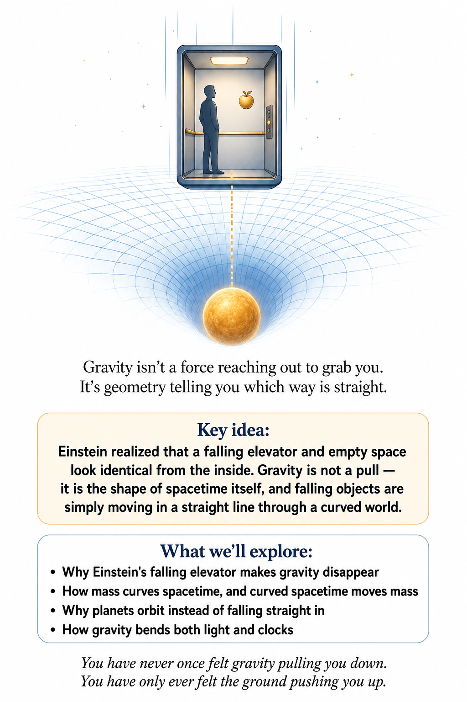

## Gravity Is Geometry

Newton gave us a wonderfully useful picture of gravity. Put two masses in the universe and they pull on each other. The equation works beautifully. But Einstein asked a question that sounds almost mischievous: what if gravity is not really a force?

What if the thing we call gravity is what happens when matter and energy change the geometry of spacetime? That sounds much stranger. It is also much more accurate. And we can begin to understand it without imagining that space is a rubber sheet floating in some mysterious fifth dimension.

## The elevator

Imagine you are standing inside a sealed elevator. You suddenly feel yourself pushed against the floor. You cannot see outside. How do you know whether you are standing on Earth, where gravity pulls you downward, or whether the elevator is accelerating upward in empty space?

Locally, you cannot tell. This is Einstein's equivalence principle. Gravity and acceleration can produce the same local effects. That was an enormous clue.

If gravity behaves like acceleration, perhaps gravity is not an ordinary force at all. Perhaps the geometry of spacetime is involved.

## The falling elevator

Now imagine the elevator cable breaks. You and the elevator begin falling together. For a brief moment, you feel weightless. The floor is no longer pushing upward against your feet.

You are still near Earth. Gravity has not disappeared. But you are in free fall. This is one of the most important ideas in general relativity.

A freely falling object is not necessarily being “pulled” through space in the Newtonian sense. It is following the natural path available to it in curved spacetime. In relativity, that natural path is called a geodesic. A geodesic is the straightest possible path in a curved geometry.

## You do not feel gravity itself

This sounds strange because we often say that gravity is what we feel. But what you actually feel while standing on Earth is the floor pushing on you. A person in free fall does not feel their weight even though Earth's gravity is still acting. Astronauts in orbit are therefore not outside Earth's gravity.

They are continuously falling around Earth. The International Space Station is falling too. It simply has enough sideways velocity that it keeps missing the ground.

## A straight line on a curved world

On a flat sheet of paper, the shortest path between two points is a straight line. Now imagine walking on Earth. If you travel along the equator and keep heading straight, you eventually return to where you started. Your path is not a straight line in the ordinary flat-map sense.

Yet on the surface of Earth, you did not have to turn left or right. You followed a geodesic. The geometry itself determined the path. This is the key idea we need for gravity.

Objects in free fall follow the natural straightest paths through curved spacetime. From far away, those paths can look curved. The object does not necessarily experience a mysterious sideways force. The geometry is doing the work.

## But the rubber sheet is lying to you

You have probably seen the famous picture of a heavy ball sitting on a stretched rubber sheet. The sheet bends. A smaller ball rolls toward the heavy ball. It looks like gravity.

It is a useful cartoon. It is also incomplete. The real universe does not require an invisible hand pulling objects downward into a lower dimension. Spacetime itself has geometry.

And that geometry includes time as well as space. This matters enormously. If you only bend a two-dimensional sheet of space, you miss one of the most important parts of Einstein's theory. Gravity changes the behavior of clocks.

The geometry of time is involved. That is why a proper explanation of gravity has to be four-dimensional.

## The Sun bends spacetime

The Sun is extremely massive. Its mass and energy affect the geometry around it. Earth follows a path through that geometry. From our ordinary three-dimensional point of view, we say that Earth orbits the Sun because gravity pulls it inward.

General relativity gives a deeper description. Earth is following a natural path through curved spacetime.

The orbit is not a mysterious compromise between “gravity” and “motion.”

It is the geometry of spacetime determining the free-fall path. This is one reason Einstein's theory feels so different from Newton's.

Newton asks, “What force is acting?”

Einstein asks, “What geometry is the object moving through?”

## Why planets orbit instead of falling straight in

There is a common misunderstanding here. If the Sun curves spacetime, why doesn't Earth simply fall straight into the Sun? Because “straight” has changed meaning. Earth is already moving sideways at enormous speed.

In Newtonian language, gravity continuously bends that motion inward. In relativistic language, Earth follows a geodesic through curved spacetime. The result is an orbit. Imagine throwing a ball horizontally from a very high mountain.

It falls toward Earth while Earth curves away beneath it. Throw it fast enough, and it keeps falling without hitting the ground. That is essentially what an orbit is. An orbiting spacecraft is perpetually falling.

It is just missing the Earth.

## The bathroom scale gives away the secret

There is a wonderfully ordinary experiment you can perform every morning. Stand on a bathroom scale. The number on the scale tells you the force the scale exerts on you. If you jump upward, the reading changes.

If you stand still, the scale pushes upward on you while Earth's gravity pulls downward. If you could suddenly fall freely, the scale would read zero. You would be weightless.

So the scale is not measuring “how much gravity exists.”

It is measuring how much the floor is preventing you from following your natural free-fall path.

## Gravity changes clocks

Now we reach one of the most beautiful consequences of curved spacetime. Gravity affects time. A clock closer to a massive object runs more slowly relative to a clock farther away. This is not because the clock mechanism is being damaged.

An atomic clock behaves the same way. Time itself is part of the geometry. Imagine two identical clocks. Put one on a mountain.

Put the other at sea level. The clock at sea level is deeper in Earth's gravitational field. Over a long enough period, the clocks accumulate a measurable difference. The effect is tiny.

But modern clocks are so precise that we can measure it. So even the passage of time depends on where you are.

## The GPS satellites know about gravity

This is not merely a theoretical curiosity. GPS satellites need extremely precise clocks. Those clocks are moving rapidly, which affects their rate. They are also high above Earth's surface, where gravity is weaker, which affects their rate in the opposite direction.

Both special and general relativity therefore matter. Engineers correct for these effects. Without those corrections, your navigation system would rapidly become inaccurate. So every time your phone tells you that you are standing in the right parking lot instead of the one next door, you are benefiting from curved spacetime.

Put a number on it: the combined effect of speed and altitude leaves GPS clocks running about 38 microseconds faster per day than clocks on the ground — and light covers about 300 meters in a single microsecond. Left uncorrected, that drift compounds into a real, measurable navigation error within a single day.

Einstein's universe is not just philosophically interesting. It is part of the machinery of ordinary life.

## Light bends too

Where this stands: OBSERVED — confirmed during the 1919 solar eclipse expedition, and many times since.

If spacetime is curved, what about light? Light has no rest mass. But that does not mean it ignores gravity. Light follows the geometry of spacetime.

If spacetime is curved, the path of light is curved too. This produces one of the great observational confirmations of general relativity. During a solar eclipse, stars appearing close to the Sun's position in the sky can appear slightly displaced because their light passes through the Sun's gravitational field. The apparent shift is tiny.

But it was measurable. Einstein had predicted it. The result became one of the early spectacular successes of general relativity. Gravity, it turns out, can bend something that has no rest mass at all.

## Mercury's stubborn forty-three seconds

Where this stands: OBSERVED — explained by Einstein in 1915 and confirmed with ever greater precision since.

Any new theory of gravity had to pass an old exam first. Mercury's orbit is a slightly stretched ellipse, and the ellipse slowly turns, so the planet's closest point to the Sun creeps around over the centuries. Most of that drift is caused by the tugs of the other planets, and Newton's theory handles them well. But in 1859 the French astronomer Urbain Le Verrier found a leftover: a slow extra turning that no known planet could explain, amounting today to about 43 arcseconds per century. That is a tiny angle, about the width of a coin seen from a hundred meters away, accumulated over a hundred years. Astronomers proposed an unseen planet inside Mercury's orbit and even named it Vulcan. Nobody ever found it.

In November 1915, while finishing general relativity, Einstein calculated Mercury's orbit in curved spacetime. Close to the Sun, where curvature is strongest, the geometry adds a small extra twist to each orbit. His answer came out at 43 arcseconds per century, with no adjustable parameters and no extra planet. He later wrote that he was beside himself with joy for days. It was the first time his theory had explained something that had defeated Newton, and it was a prediction he could not have tuned in advance.

## Gravity affects everything that carries energy

In general relativity, gravity is not simply something that acts on objects with mass. Energy, momentum, pressure, and stresses all contribute to the gravitational field. Light carries energy and momentum. Therefore light participates in gravity.

This is why gravitational lensing is possible. A massive galaxy or cluster can distort spacetime so strongly that light from a more distant object is deflected around it. The universe sometimes gives us natural telescopes made of gravity.

## The geometry tells matter how to move

We can now state the central idea the way physicist John Wheeler memorably put it: Matter and energy tell spacetime how to curve. Spacetime tells matter and energy how to move. It is not a complete equation.

But it is an excellent summary. The Sun curves the spacetime around it. Earth follows a geodesic in that curved spacetime. Earth also contributes its own tiny curvature.

So does your body. So does the chair beneath you. So does the book you are holding. You are not merely sitting in a universe that contains gravity.

You are part of the gravitational geometry.

## What is actually curved?

This is where language can become dangerous.

People say that “space is curved.”

That is useful, but incomplete. General relativity describes the curvature of spacetime. Space can be curved. Time can be affected.

And the full four-dimensional geometry contains relationships between them. You do not need to imagine spacetime bending into some larger physical space. Curvature is an intrinsic property. A creature living on a two-dimensional spherical surface could discover that its world is curved without ever looking at the sphere from outside.

Likewise, physicists can detect spacetime curvature by measuring what clocks, light rays, and freely falling objects do. The geometry reveals itself through behavior.

## Tides reveal curvature

There is another clue hiding in ordinary gravity. The Moon pulls on the Earth. But it does not pull equally strongly on every part of Earth. The side facing the Moon is slightly closer.

The far side is slightly farther away. This difference produces tidal effects. In general relativity, tidal gravity is especially important because it reveals something that a uniform gravitational field cannot. If you are in free fall inside a small elevator, you can locally remove the effects of gravity.

But you cannot generally remove tidal effects over a large enough region. Nearby freely falling objects can move toward or away from one another. That relative acceleration is a signature of spacetime curvature. Gravity is therefore not merely something you can erase by choosing the right viewpoint.

Curvature leaves a measurable residue.

## Two apples, one Earth

Here is a way to see curvature with nothing more than a pair of apples. Hold them side by side, a meter apart, and drop them from the top of a tall building. Each apple falls straight toward the center of Earth. But “straight toward the center” points in two slightly different directions, because the two apples start at slightly different places above a round planet. Their paths are not parallel. They converge.

The effect is small. After a fall of a hundred meters, the gap between the apples has shrunk by roughly sixteen micrometers, a fraction of the width of a human hair. Now hold one apple above the other instead. The lower apple sits a little deeper in Earth's gravity, so it falls a little faster, and the gap between them grows.

Put those two observations together and something familiar appears. Surround yourself with a ring of freely falling apples and the ring does not simply fall. It deforms. It squeezes in from the sides and stretches along the vertical, becoming an egg shape. That is the same squeeze-and-stretch the Moon applies to Earth's oceans. It is tidal gravity, seen up close.

Physicists call this geodesic deviation: the way neighboring free-fall paths drift toward or away from each other. It is the cleanest operational meaning of the word “curvature.” On a flat sheet of paper, two lines that start out parallel stay parallel forever. On a sphere, two travelers who set off due north from points on the equator, both walking perfectly straight, find themselves closer and closer until they meet at the pole. No force pushed them together. The geometry did. Spacetime curvature is exactly that kind of convergence, measured by watching free-falling objects instead of travelers on a globe.

The size of the effect has a simple form. For two objects a small distance L apart, near a mass M at distance r, the difference in their accelerations is roughly

Δa ≈ 2GM L / r³

That is the stretch along the line pointing toward the mass; across that line, the squeeze is about half as strong. Notice the r³. Tidal effects fade much faster with distance than ordinary gravity does, which fades only as r². That is why the Moon, much smaller than the Sun but much closer, raises the larger ocean tides. It will also matter enormously when we meet black holes in Chapter 10, where tides are what actually kill an unlucky traveler.

This is the deep reason Einstein's elevator trick only works locally. You can cancel the fall itself by falling with it. You cannot cancel the slight squeeze between the apples. In the classic textbook Gravitation, Charles Misner, Kip Thorne, and John Wheeler build their entire treatment of curvature on this one observation. The tides are the part of gravity no choice of viewpoint can erase, and that is why they are the part that counts as geometry.

## The black hole waiting at the edge of the map

Now imagine concentrating a huge amount of mass into a very small region. The curvature of spacetime becomes stronger. Stronger. Stronger still.

Eventually, something extraordinary can happen. A region forms from which light cannot escape to the distant universe. We call it a black hole. A black hole is not simply an extremely strong vacuum cleaner.

It is a region of spacetime whose geometry has become so extreme that all future-directed paths remain inside once they cross the event horizon. The horizon is not a solid surface. There is no cosmic wall there. It is a boundary in spacetime.

And once we understand that, black holes stop looking like magical holes in space. They become extreme examples of Einstein's geometry.

## Einstein's equation in one sentence

The full mathematics of general relativity is beautiful, difficult, and far beyond what we need to develop in this chapter. But its central equation can be summarized in words. The geometry of spacetime is determined by the distribution of matter and energy. On one side, geometry.

On the other, matter and energy. The equation connects them. That is the remarkable achievement. Gravity has been transformed from a force acting inside space into a property of spacetime itself.

Newton's theory remains an extraordinarily good approximation when gravitational fields are weak and speeds are modest. Einstein's theory explains why that approximation works and tells us where it eventually fails.

## What the equation says about a ball of coffee grounds

Einstein's field equation is usually written in a compact notation that hides ten interlocking equations inside a few symbols. But there is a way of reading its heart that needs no tensors at all, popularized by the physicists John Baez and Emory Bunn.

Imagine a small ball of coffee grounds floating in space, every grain initially at rest relative to its neighbors, all of them falling freely. Watch the volume of the ball. If spacetime inside it were flat, the ball would keep its size. If there is matter inside or around it, curvature makes the ball begin to shrink. Einstein's equation says exactly how fast:

the rate at which the ball's volume begins to shrink ∝ the energy density inside it + the pressure in each of the three directions

In symbols, for pressure that is the same in every direction, the volume V starts to change as V̈/V = −4πG(ρ + 3P/c²), where ρ is the density of mass-energy and P is the pressure.

The first term is Newton, back again. Put more mass inside the ball and it shrinks faster, and from this one statement you can rebuild Newton's law of gravity. The second term is entirely new, and it has extraordinary consequences. In Einstein's theory, pressure itself gravitates.

For everyday matter, pressure is so small compared with ρc² that the extra term vanishes into rounding error. Inside a neutron star, it does not. The pressure that holds the star up also adds to its gravity, so squeezing harder to resist collapse makes the collapse worse. That feedback is why there is a maximum mass for a neutron star, and why heavier stellar cores have nowhere to go but into a black hole.

Now flip the sign. If some substance had a pressure that was negative, and negative enough (more negative than one-third of its energy density), the quantity in brackets would turn negative and the ball of coffee grounds would grow instead of shrink. Gravity would push. That is not a hypothetical curiosity. It is the leading explanation for why the expansion of the universe is accelerating, the story of Chapter 5. The same compact equation that keeps your feet on the floor also allows the cosmos to speed up.

## The universe becomes dynamic

Once gravity is geometry, the universe itself can no longer be thought of as a fixed stage. Matter changes the geometry. The geometry changes how matter moves. Matter moves and changes.

The geometry responds. The entire universe becomes a dynamic system. That idea will eventually lead us to expanding space, the Big Bang, gravitational waves, and the large-scale structure of the cosmos. For now, keep the central picture.

You are not standing on a stage called space while a separate clock called time ticks in the background. You are inside spacetime. Your worldline — the complete path you trace through spacetime, from birth to this very moment to wherever you're headed next — is part of its geometry. And gravity is what that geometry does.

## One last fall

Drop a ball. It falls. Newton says Earth exerts a gravitational force on the ball. Einstein says the ball follows a geodesic through curved spacetime.

For ordinary life, both descriptions predict essentially the same motion. But Einstein's picture goes further. It predicts that clocks at different gravitational potentials tick at different rates. It predicts that light bends.

It predicts gravitational waves. It predicts black holes. And it tells us that the geometry of the universe is not fixed. The stage is part of the play.

That is the real revolution of general relativity. Next we are going to watch spacetime do something even more dramatic. It can ripple.

↑ Back to Contents

# Chapter 2: Gravitational Waves — When Spacetime Ripples

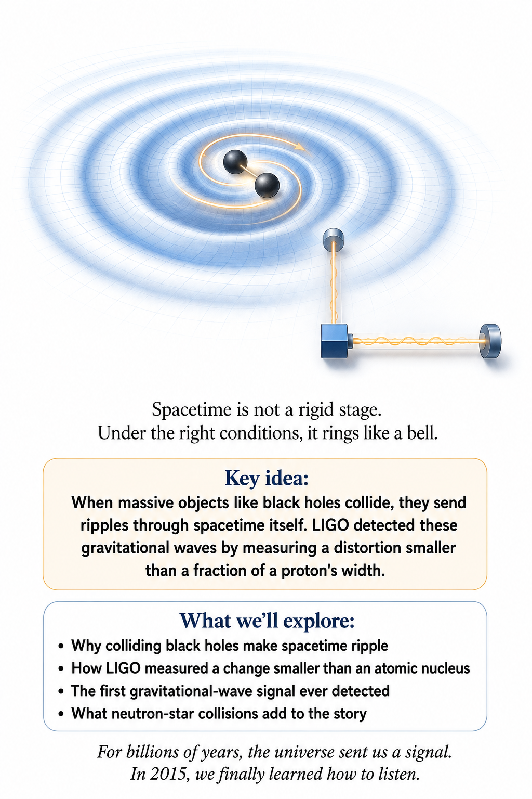

We have spent a while treating spacetime as though it were a perfectly calm stage. Matter sits here. Stars move there.

Planets follow their paths. Clocks tick. But general relativity says the stage itself can change. And it can do something spectacular.

It can ripple. Those ripples are called gravitational waves. They travel through spacetime at the speed of light. And they were predicted by Einstein long before anyone had a machine sensitive enough to detect them.

## A violent universe

Imagine two enormous black holes orbiting one another. They are not merely moving through space. Their motion is violently disturbing the geometry of spacetime around them. As they orbit, they send ripples outward.

The black holes lose energy. Their orbit shrinks. They spiral together. And finally they merge.

The merger releases an astonishing amount of energy in the form of gravitational radiation. For a brief moment, the event's peak power in gravitational waves exceeded the combined light output of every star in the observable universe, by a factor of several dozen. Yet the signal reaching Earth is extraordinarily weak. By the time the ripple arrives here, spacetime itself has been disturbed by an almost unimaginably tiny amount.

What is actually waving? A water wave is easy to picture. Water goes up and down. A sound wave is also fairly intuitive.

Air is compressed and expanded. But a gravitational wave is different. There is no material substance sitting in space that has to wiggle. The geometry itself changes.

Distances between freely falling objects can increase and decrease. Imagine two test masses floating freely in space. A gravitational wave passes through them. For a moment, the distance between them changes in one direction while the distance in the perpendicular direction changes oppositely.

Then the pattern reverses. Space is not being pushed through some invisible cosmic medium. The spacetime interval itself — relativity's measure of the true separation between two points in spacetime, the one no change in motion or viewpoint can argue away — is changing.

## A ring of beads in a passing wave

Picture a gravitational wave coming straight toward you out of the page, and a ring of free-floating beads lying flat in front of you. As the wave passes, the ring does not move toward you or away from you. It changes shape in its own plane. First it stretches side to side while squeezing top to bottom. Half a cycle later it does the opposite. The ring pulses between two ellipses, like a hoop being gently squashed one way and then the other.

If this looks familiar, it should. It is the tidal squeeze-and-stretch from the falling apples in Chapter 1, except now it is traveling, and it oscillates. A gravitational wave is a moving pattern of tidal gravity.

There is a second way to do it, with the same pattern turned by 45 degrees, so the stretching runs along the diagonals. Physicists call these the two polarizations, nicknamed “plus” and “cross” after the shapes of the stretching. Light also has two polarizations, but light's are turned 90 degrees from each other. That difference in angle is a fingerprint of the deeper nature of gravity, and detectors spread around the globe can now measure which pattern each passing wave carries.

## The world's strangest ruler

Suppose you have two mirrors separated by a long distance. You want to know whether that distance changes. You could put a ruler between them. That is inconvenient if the mirrors are kilometers apart.

Instead, send light from one mirror to the other and back. Measure the travel time. If the distance changes, the travel time changes. This is the basic idea behind a laser interferometer.

The actual instruments are vastly more sophisticated. They use laser beams, mirrors suspended in carefully engineered systems, vacuum tubes, vibration isolation, and extraordinary methods for removing noise. Because the expected effect is so tiny, almost everything in the laboratory is an enemy.

## LIGO and the impossible measurement

The Laser Interferometer Gravitational-Wave Observatory, better known as LIGO, was designed to detect these tiny changes. Its detectors use enormous perpendicular arms. Laser light travels along both arms and returns. The beams are combined.

Under ordinary conditions, their interference — the way two overlapping light waves add up where their crests line up and cancel out where a crest meets a trough — is carefully controlled. When a gravitational wave passes through, one arm effectively becomes slightly longer while the other becomes slightly shorter. The interference pattern changes. The amount of stretching is fantastically small.

A detector can measure a fractional change in length of roughly one part in 10²¹ — a 1 followed by 21 zeros. That is like detecting a change in a distance comparable to the width of a human hair across a distance of several light-years. Nature was not making this easy.

## The first signal

Where this stands: OBSERVED — LIGO's first detection, September 2015, confirmed and repeated many times since.

In 2015, LIGO detected something extraordinary. A signal arrived that matched the predicted pattern from two black holes spiraling together and merging. The event was called GW150914. The signal lasted less than a second.

Put numbers on it: the two black holes weighed about 36 and 29 times the mass of the Sun. The black hole they merged into weighed about 62 solar masses. Do the arithmetic and three entire solar masses are unaccounted for — converted, in a fraction of a second, into the energy of the gravitational wave itself.

But inside that brief chirp was information about the masses, motion, and final merger of the black holes. It was the first direct detection of gravitational waves. It was also the first direct observation of a binary black-hole merger. For the first time, humanity was not merely seeing the universe.

We were detecting the motion of spacetime itself.

## The cosmic chirp

The signal from a binary merger has a wonderfully characteristic shape. As two compact objects orbit one another, their orbital frequency increases. The waves become stronger. The frequency rises.

The signal sweeps upward. Physicists call this a chirp. It is not a sound traveling through space. GW150914's chirp happened to sweep through frequencies already inside the range of human hearing, so physicists could simply play the detector's strain data — its moment-by-moment record of how much the arms stretched and squeezed — back as sound, the way you would play any other audio recording.

When you listen to a gravitational-wave chirp, you are hearing a translation of a distortion in spacetime. It is one of the most poetic pieces of experimental physics ever produced.

## Why the waves carry energy

The orbiting black holes cannot keep their motion unchanged forever. The gravitational waves carry energy away. As energy leaves the system, the orbit changes. The black holes spiral closer.

The final merger becomes faster and more violent. This is an important prediction of general relativity. Gravity is not merely a static geometry. Changing gravitational fields can propagate outward and carry energy.

The universe is not just full of gravitational landscapes. Those landscapes can move.

## Why it takes a lopsided dance

Not every motion makes waves. A perfectly round star that swells and shrinks, keeping its round shape, sends out no gravitational waves at all. Neither does a perfectly smooth sphere spinning in place. The reason is a deep bookkeeping rule. The total mass-energy of an isolated system cannot wobble, because energy is conserved. Its center of mass cannot jiggle back and forth, because momentum is conserved. Those two kinds of wiggle are forbidden from the start.

What is left is a change in shape: a mass distribution that is lopsided, and whose lopsidedness changes in time. Two stars orbiting each other are the textbook example. Seen from above, the pair looks like a dumbbell spinning around its middle, and a spinning dumbbell sends out waves at twice its rotation rate.

The power radiated is controlled by a combination of constants that explains why gravitational waves are so hard to make. The natural “power scale” of gravity, the speed of light to the fifth power divided by G, is about 3.6 × 10⁵² watts. A system has to move masses at a meaningful fraction of the speed of light to get anywhere close to it. Earth orbiting the Sun radiates about 200 watts of gravitational waves, roughly what a few bright incandescent bulbs give off, out of an orbital energy so vast that the loss would take far longer than the age of the universe to matter. Only compact objects whipping around each other at a large fraction of light speed radiate seriously. When they do, the numbers become absurd: in its final fraction of a second, GW150914 reached about a thousandth of that natural limit, outshining, in gravitational waves, all the stars in the observable universe.

## The pulsar that kept perfect time

Where this stands: OBSERVED — the orbital decay of the Hulse–Taylor binary pulsar matches general relativity to within a fraction of a percent.

Long before LIGO heard anything, astronomers had already watched gravitational waves at work. In 1974, using the giant Arecibo radio telescope in Puerto Rico, Russell Hulse and Joseph Taylor discovered a pulsar locked in a tight orbit around another neutron star. The pair circles every seven and three-quarter hours. And because the pulsar ticks with clock-like regularity, its pulses act like a transmitter riding the orbit, reporting the orbit's shape and timing with extraordinary precision.

General relativity made a definite prediction: the system should be losing energy to gravitational waves, so the stars should be slowly spiraling together, and the orbital period should shrink by about 76 millionths of a second every year. That is the kind of number that sounds too small to measure. But the effect accumulates, the way a clock that runs a fraction of a second slow eventually falls minutes behind. Year after year, the arrival time of the stars' closest approach drifted earlier exactly along the curve the theory predicted. By the early 1980s the match was unmistakable. Hulse and Taylor shared the 1993 Nobel Prize in Physics.

So by the time the 2015 chirp arrived, physicists already knew gravitational waves existed. What they had never done was catch one directly.

## Light and gravity waves

Gravitational waves give us a new way to observe the universe. Ordinary telescopes detect electromagnetic radiation. Visible light. Radio waves.

Infrared. Ultraviolet. X-rays. Gamma rays.

Gravitational-wave detectors observe something entirely different. This is why people sometimes describe gravitational-wave astronomy as opening a new sense. It is like discovering that the universe has been speaking in a language our telescopes could not hear. A black-hole merger may produce little or no ordinary light.

But spacetime itself can carry the news.

## Neutron stars make the story even better

Where this stands: OBSERVED — the 2017 neutron-star merger (GW170817) was seen in both gravitational waves and light.

Black holes are not the only interesting sources. Neutron stars can also produce gravitational waves. These objects are extraordinarily dense. A teaspoon of neutron-star material would have an astonishing mass if you could somehow bring it to Earth.

Now imagine two neutron stars orbiting one another. They emit gravitational waves. They merge. And unlike many black-hole mergers, the collision can produce enormous amounts of electromagnetic radiation.

Astronomers can therefore observe the same cosmic event through both light and gravitational waves. This is called multi-messenger astronomy. Two different messengers arrive carrying different pieces of the story.

## Gravity keeps pace with light

The 2017 neutron-star merger also answered a question that had been open since Einstein: does gravity travel at exactly the speed of light? The gravitational waves and the first burst of gamma rays from the collision set out from a galaxy roughly 130 million light-years away. They arrived at Earth about 1.7 seconds apart, and part of that gap is simply the time the explosion needed to produce gamma rays in the first place.

A difference of under two seconds after a race lasting 130 million years means the two speeds agree to about one part in a thousand trillion. That single measurement eliminated a whole family of alternative theories of gravity in which gravitational waves travel at a different speed from light.

The same event settled an old question about where gold comes from. In the days afterward, telescopes watched the debris glow with a signature of freshly forged heavy elements, a “kilonova.” Collisions like this one appear to be a major source of the universe's gold, platinum, and uranium. Some of the metal in a wedding ring may have been made in a collision of dead stars and announced, at the time, by a ripple in spacetime.

## The universe as an observatory

Every new gravitational-wave detection gives physicists another experiment. We can test general relativity in extreme conditions. We can measure black-hole populations. We can study neutron-star matter.

We can learn how often compact objects merge. We can investigate how the universe produces its heaviest elements. And we can look farther into cosmic history. The universe is no longer merely something we observe from a distance.

It is providing us with natural laboratories far more energetic than anything we can build on Earth.

## Hearing a black hole ring

After two black holes merge, the new, single black hole is briefly misshapen. It settles into its final smooth form by shedding the distortion as a last burst of gravitational waves, the way a struck bell settles into silence. Physicists call this the ringdown.

The tones of that ringing are remarkable. According to general relativity, they depend only on the final black hole's mass and spin, and on nothing else about what made it. Measuring more than one tone in the same ringdown therefore gives an independent check on the theory: two tones must point to the same mass and spin, or something is wrong. So far, the ringing of every well-measured black hole has been consistent with Einstein's equations. Chapter 10 explains why a black hole has so little to say about its past.

## Why detecting them is so hard

Imagine trying to measure the length of a kilometer-long ruler while someone is tapping the table. Then imagine earthquakes. Passing trucks. Ocean waves.

Wind. Thermal motion. Electrical noise. The vibrations of the mirrors themselves.

Now imagine that the signal you want is smaller than almost anything you can directly picture. That is the problem. LIGO and other detectors therefore use extraordinary isolation and filtering. The instruments have to distinguish a genuine astrophysical signal from the endless collection of disturbances produced by Earth.

In a sense, detecting gravitational waves is partly a battle against the planet.

## Spacetime is not silent

We began this part of the story with a seemingly static universe. Mass curves spacetime. Objects follow geodesics. Clocks run differently in different gravitational environments.

Now we know something more. Spacetime can oscillate. A disturbance can travel outward. It can cross billions of light-years.

It can pass through Earth. And, if our instruments are sensitive enough, we can detect it. The geometry of the universe is not frozen. It has dynamics.

It has weather.

## A wave from more than a billion years ago

When a gravitational-wave detector records a merger, the event did not happen yesterday. The waves may have traveled for hundreds of millions or billions of years. They crossed interstellar space. They crossed galaxies.

They crossed the expanding universe. Then, after all that travel, they passed through a detector on Earth. For a fraction of a second, a tiny change in spacetime was recorded. The signal is therefore a message from deep cosmic history.

The detector is not merely measuring something happening far away. It is measuring something that happened long ago and has only now reached us.

## The next revolution

Where this stands: EVIDENCE, NOT YET GOLD-STANDARD CONFIRMATION — pulsar timing arrays (tracking dozens of pulsars, collapsed stars that flash with clock-like regularity, for shared timing wobbles) reported evidence for a nanohertz stochastic background (a slow, random hum of gravitational waves) in 2023; other exotic sources remain open searches.

Gravitational waves changed astronomy because they changed what counts as an observation. We can see. We can measure particles. We can detect neutrinos — ghostly particles introduced properly in Chapter 7.

And now we can measure ripples in spacetime. There may be gravitational waves from events we have not yet imagined clearly. There may be signals from the early universe. There may be a background hum produced by countless distant sources.

The universe may be full of information that is invisible to ordinary telescopes. We have only recently learned how to listen for it.

## A detector the size of a solar system

LIGO's arms are four kilometers long, which tunes it to waves that oscillate tens to thousands of times per second, the dance of stellar-mass black holes in their final moments. Slower waves need longer arms. The European Space Agency's LISA mission, planned for launch in the 2030s, will fly three spacecraft in a triangle about 2.5 million kilometers on a side, trailing Earth around the Sun and passing laser beams between them. It should hear the deep, slow tones of merging supermassive black holes in the centers of galaxies, along with thousands of tightly orbiting pairs of white dwarfs here in the Milky Way.

Slower still are the waves that pulsar timing arrays look for, rising and falling over years. There the “arms” are the distances between Earth and pulsars thousands of light-years away. Each detector listens in its own frequency band, and together they cover more than a dozen powers of ten in frequency, much as radio dishes, optical telescopes, and X-ray satellites together cover the spectrum of light.

## One last ripple

Take a moment to appreciate the chain of ideas. Einstein imagined that gravity was geometry. The geometry could change. Changing geometry could propagate.

Those propagating disturbances could carry energy. Decades later, engineers built machines capable of measuring distortions smaller than anything ordinary experience prepares us to imagine. And then the universe supplied the signal. Two black holes collided.

Spacetime rippled. The ripple crossed the cosmos. And humans detected it. That is one of the great triumphs of physics.

We did not merely confirm a prediction. We gained a new way to experience the universe. Next, we are going to zoom out. Far out.

Because once gravity is geometry, the entire universe can become a gravitational story.

↑ Back to Contents

# Chapter 3: The Expanding Universe — Space Itself Can Stretch

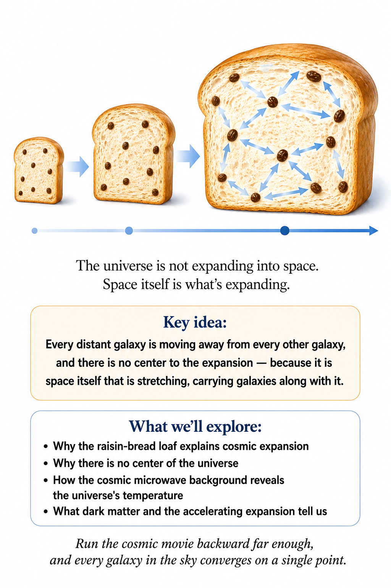

## The Universe Is Not Sitting Still

Look up at the night sky and imagine freezing everything in place. The stars seem to be arranged on an enormous, permanent backdrop. It is tempting to think of the universe as a giant box containing galaxies. But general relativity has already warned us that this picture is too simple.

Space is not merely an empty container. It is part of spacetime. And spacetime can change. The universe can expand.

Not galaxies exploding outward through pre-existing empty space, but the large-scale distances between galaxies increasing because the geometry of space itself is changing. That distinction sounds subtle. It is actually the whole story.

## A raisin bread universe

Imagine making a loaf of raisin bread. The raisins represent galaxies. As the dough rises, every raisin gets farther from every other raisin. Pick any raisin and look around.

Almost every other raisin appears to be moving away from you. Now pick a different raisin. The same thing happens. There does not have to be one special raisin sitting at the center.

The expansion is happening throughout the dough. The analogy is not perfect — the real universe is not expanding into some larger oven-shaped space — but it captures an important idea. On large scales, the distances between galaxies can increase because space itself is expanding.

## Who discovered that?

The story begins with observations. Astronomers found that many distant galaxies have their spectral lines — the sharp, barcode-like stripes each chemical element stamps into light once it's spread into a rainbow — shifted toward longer wavelengths. This is called redshift. For many galaxies, the farther away they are, the larger the redshift tends to be.

The relationship is known as Hubble's law, though the history is more complicated than the name suggests: Vesto Slipher measured the first galaxy redshifts years earlier, Henrietta Leavitt's work on variable stars supplied the distance ladder that made the law possible at all, and in 2018 the International Astronomical Union renamed it the Hubble–Lemaître law to credit Georges Lemaître's independent contribution. The simplest interpretation is that the universe is expanding. The galaxies are not merely moving randomly through a static cosmic room. The large-scale structure of the universe is changing with time.

And that means something remarkable. If we run the cosmic movie backward, the universe becomes denser and hotter.

## The universe that refused to sit still

The theory, as it happens, had gotten there first. The first person to discover that general relativity wanted to move the whole universe was Einstein himself, and he did not like it. In 1917 he applied his new equations to the cosmos as a whole and found that a universe filled evenly with matter could not simply stay put. Gravity would pull it inward. Since everyone then assumed the universe was static, Einstein added a new term to his equation, the cosmological constant, tuned to hold everything in a delicate balance.

Others were less attached to stillness. In 1922 the Russian mathematician Alexander Friedmann showed that Einstein's equations, taken at face value, describe universes that expand or contract. In 1927 the Belgian physicist and priest Georges Lemaître reached the same conclusion independently and went further, connecting expansion to the redshifts astronomers were measuring. Lemaître later recalled Einstein telling him that his calculations were correct but his physics was abominable.

Within a few years, the observations had sided with Lemaître. The static balance Einstein had built was also unstable, like a pencil standing on its point; nudge it and it would either collapse or run away. Einstein dropped the cosmological constant. As Chapter 5 explains, it later came back, for a completely different reason. Meanwhile, the expanding universe was already pointing somewhere startling: toward its own beginning.

## The cosmic movie backward

Imagine reversing the expansion. Galaxies that are now enormously separated become closer. Clusters become more crowded. Matter becomes hotter and denser.

Keep going. The universe becomes an extraordinary hot, dense state. This is the basic idea behind the Big Bang. The Big Bang was not an explosion that happened at one location in already-existing space.

There was no cosmic bomb sitting somewhere and blasting galaxies outward into empty surroundings. The expansion happened everywhere. Asking where the Big Bang happened is therefore a little like asking where the surface of a balloon began expanding. The question assumes a center that the model does not require.

## There is no center of the expansion

Stand on the surface of an inflating balloon and mark several dots on it. As the balloon expands, every dot gets farther from every other dot. A dot near you is not the center. Neither is any other dot.

The two-dimensional surface has no special center on the surface itself. Our universe is not literally the surface of a balloon, but the analogy helps us avoid one of the most common mistakes. The expansion of the universe does not have to have a central point inside the universe. Every sufficiently distant galaxy can see other distant galaxies receding from it.

That is exactly what we would expect from a homogeneous expanding universe.

## What is expanding?

This question deserves care. Atoms are not expanding.

Your coffee cup is not getting larger because the universe is expanding. The Earth is not stretching away from the Sun because of cosmic expansion. Galaxies and galaxy clusters are held together by gravity and other forces strongly enough that they do not simply participate in the expansion in the same way as widely separated galaxies. The expansion becomes important on enormous scales.

Think of the universe as having a changing large-scale geometry. Within a galaxy, local physics dominates. Between very distant galaxies, cosmic expansion becomes important. The universe can therefore expand while your kitchen remains reassuringly the same size.

## Faster than light, and no rule broken

Hubble's law has a startling consequence. Recession speed grows with distance, so far enough away it must exceed the speed of light. With today's expansion rate, that happens at a distance of roughly fourteen billion light-years. Galaxies beyond that distance are receding faster than light right now.

This does not break relativity. Relativity's speed limit is local: nothing can overtake a light beam passing right beside it. Expansion is not motion through space. It is the growth of the space between, and there is no limit on how fast the total distance between two far-apart places can grow when every stretch of space along the way is growing a little. No galaxy outruns a light beam in its own neighborhood.

It also explains a number that surprises almost everyone. The universe is about 13.8 billion years old, yet the most distant objects whose light we can see are now about 46 billion light-years away. Their light set out when they were much closer. During its long journey, the space it had already crossed kept stretching behind it. The light has traveled for 13.8 billion years; the distance to its source today is far greater.

## Redshift is stretched light, not a siren

Redshift is often explained by comparison with the falling pitch of a passing ambulance, the Doppler effect. For nearby galaxies that is a fine approximation. For distant ones it is misleading. The light from a far-off galaxy is not reddened because the galaxy was speeding away when the light left. It is reddened because the wavelength itself was stretched, crest by crest, as the space it traveled through expanded.

That makes redshift a direct measure of how much the universe has grown. Light that arrives with its wavelengths doubled left its source when the universe was half its present size. The cosmic microwave background arrives with its wavelengths stretched by a factor of about 1,100. It was emitted when every distance in the universe was about 1,100 times smaller than it is today, which is why light that began as the orange glow of gas at about 3,000 degrees now arrives as faint microwaves.

## The light from the early universe

Where this stands: OBSERVED — discovered in 1965 and mapped with high precision since.

If the universe was once much hotter and denser, there should be evidence left behind. There is. In 1965, astronomers Arno Penzias and Robert Wilson discovered a faint microwave glow coming from essentially every direction in the sky. It is called the cosmic microwave background, or CMB.

It is ancient light. It was released when the early universe became cool enough for electrons and nuclei to combine into neutral atoms, allowing light to travel much more freely. That light has been traveling ever since. As the universe expanded, the wavelengths of that light stretched.

Today it arrives mostly as microwaves. We are therefore looking at a photograph of the young universe — but one taken in light that has been stretched by cosmic expansion.

## The universe has a temperature

The cosmic microwave background is extraordinarily cold by everyday standards. Its temperature is about 2.7 kelvin. That is only a few degrees above absolute zero. Yet this faint background fills the universe.

It is not the leftover glow of stars. It is not ordinary radio interference. It is relic radiation from the early universe. The fact that it is so uniform across the sky was one of the great clues that the universe began in a very hot, dense, remarkably smooth state.

Tiny variations exist. Those tiny variations are enormously important. They are the seeds from which later cosmic structure grew.

## Tiny bumps become galaxies

The early universe was not perfectly smooth. There were tiny differences in density. Some regions contained slightly more matter than others. Gravity amplified those differences.

A region that was a little denser pulled in more matter. More matter made its gravity stronger. That attracted still more matter. Over immense stretches of time, small irregularities grew into enormous structures.

Galaxies formed. Galaxies gathered into groups and clusters. A vast cosmic web emerged. The galaxies you see today are therefore not random decorations scattered through space.

They are the descendants of tiny variations that existed when the universe was young.

## Dark matter enters the story

Where this stands: STRONGLY SUPPORTED — the gravitational evidence is overwhelming; what dark matter actually is remains an open question.

There is a problem. The visible matter we can see does not appear to provide enough gravity to explain all the structure and motion we observe. Galaxies rotate as though they contain much more mass than their stars and gas reveal. Clusters of galaxies also behave as though additional unseen mass is present.

The simplest broad explanation is dark matter. We do not know exactly what dark matter is. We do know that it behaves gravitationally. It does not appear to interact strongly with light in the way ordinary matter does.

So the universe contains a strange situation. We can see the effects of something we cannot directly see. Physics is full of these irritatingly useful discoveries.

## And then the expansion started speeding up

Where this stands: OBSERVED — confirmed independently by multiple methods since the late 1990s.

Here comes another surprise. For a long time, physicists expected gravity to slow the expansion of the universe. Gravity attracts. So perhaps the expansion should gradually lose speed.

Observations of distant supernovae — exploding stars introduced properly in Chapter 5 — told a different story. The expansion of the universe is accelerating. Something appears to be driving that acceleration. We call it dark energy.

The name is honest about our ignorance. “Dark energy” does not mean we have identified a new substance sitting in a cosmic tank. It is a label for the phenomenon associated with accelerated cosmic expansion. Whatever the underlying explanation turns out to be, the universe is doing something we did not expect.

## The cosmic inventory

If you put the pieces together, ordinary matter is only part of the cosmic story. There is ordinary matter: stars, planets, gas, dust, coffee cups, cats, and people. There is dark matter, whose gravitational influence is evident even though its nature remains mysterious. And there is dark energy, associated with the accelerated expansion of the universe.

The exact proportions depend on the cosmological model and measurements, but ordinary matter is only a small fraction of the total cosmic budget. That is a humbling thought. Almost everything in the universe is made of things we do not yet fully understand. And yet the universe is remarkably orderly.

Put actual numbers on those proportions: cosmologists currently estimate roughly 68% dark energy, 27% dark matter, and just 5% ordinary matter — the atoms making up every star, planet, and person. Everything humanity has ever directly touched or measured with a chemistry set is that last sliver.

## A disagreement worth having

Where this stands: OPEN QUESTION — two precise methods disagree, and nobody yet knows why.

How fast is the universe expanding today? You might expect the answer to be settled. It is not. One method reads the expansion rate from the pattern in the cosmic microwave background and runs the standard cosmological model forward to the present; it gives about 67 kilometers per second per megaparsec. Another measures distances to nearby galaxies directly, using pulsating stars and exploding supernovae as markers; it gives about 73.

An eight percent difference sounds modest, but both measurements now claim precision of one or two percent, so the gap is far too large to be bad luck. Astronomers call it the Hubble tension. It might be a subtle error hidden in one of the measurement chains. Or it might be a crack in the standard model of cosmology, perhaps a sign that dark energy or the early universe is not quite what we assumed. Either way, it is a reminder that cosmology has become precise enough for its disagreements to be informative.

## The arrow points backward

The expanding universe also gives us another way to think about time. If the universe is expanding now, then earlier it was smaller, denser, and hotter. The cosmic history therefore has a direction, running from hot and dense toward cold and dilute — the same direction in which entropy, the universe’s tendency toward disorder, increases.

The universe began in an extraordinarily special condition. It evolved. Structure appeared. Stars formed.

Stars died. Heavy elements accumulated. Planets formed. Chemistry became complicated.

Life emerged. And eventually, on one small planet, someone wondered why the universe has an arrow of time. The question has become part of the universe's own story.

## Are we at the center?

There is a wonderfully human temptation to think that we occupy a special place. The cosmic expansion makes that temptation unnecessary. From our galaxy, distant galaxies appear to recede. From another sufficiently typical galaxy, they would see essentially the same large-scale pattern.

There is no need for a privileged cosmic center. The universe does not seem to have been built around our particular address. This is one of the recurring lessons of modern physics. Earth is not the center of the solar system.

The Sun is not the center of the galaxy. Our galaxy is not the center of the universe. And the universe itself does not need a center in the ordinary sense.

## The universe is changing its scale

We can now combine several ideas. General relativity says spacetime can be dynamic. Observations show that the universe is expanding. The cosmic microwave background shows that the early universe was hot and dense.

Tiny primordial variations grew into galaxies and the cosmic web. Dark matter helps explain gravitational structure. Dark energy is associated with accelerated expansion. This is not a collection of unrelated facts.

It is one enormous physical story. The universe is not a stage on which history happens. The universe is part of the history.

## One last look into the night

Go outside on a clear night. Pick a bright star. Then remember that the universe you are seeing is not frozen. Space is expanding.

Light has been traveling for years, centuries, millions, or billions of years depending on what you look at. Some of the light began its journey before humans existed. Some began before Earth looked anything like it does today. The night sky is therefore not just a picture of where things are.

It is a record of when they were. The farther you look, the farther back in time you see. And that means astronomy is also a form of time travel. Not the science-fiction kind.

The real kind. The kind the universe has been giving us for free all along. But an expanding universe raises an obvious question: what, exactly, is doing all the expanding — and is all of it actually visible?

↑ Back to Contents

# Chapter 4: Dark Matter — The Invisible Architecture

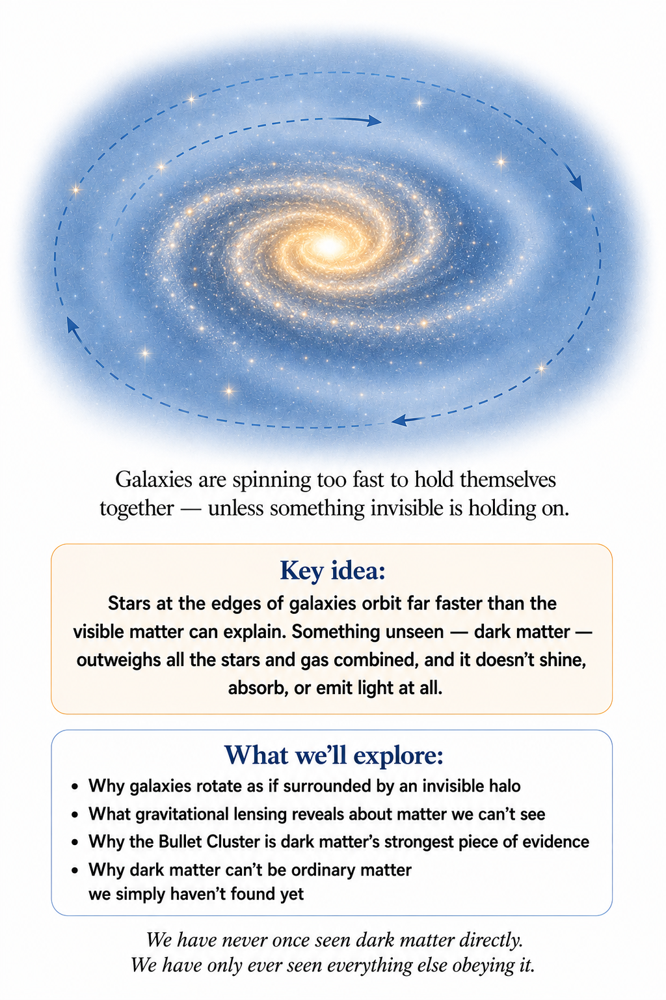

There's a rather embarrassing problem with the universe. We can see stars. We can see galaxies. We can see glowing clouds of gas. We can detect planets, observe black holes indirectly, and measure the cosmic microwave background. We can even detect ripples in spacetime from colliding black holes far across the cosmos.

And yet when we add up all the matter we can actually see, the universe doesn't contain nearly enough of it to behave the way it does. Something is missing. Not a little something — a lot of something.

The leading explanation is that the universe is filled with enormous quantities of matter that simply doesn't shine. We call it dark matter. The name sounds like a placeholder, and in a sense it is — but this isn't a case of inventing invisible stuff because the equations were inconvenient. Dark matter is backed by several independent lines of evidence, all pointing the same direction.

We don't know what the stuff actually is. But we can see what its gravity does. And gravity, it turns out, is remarkably difficult to hide.

## Galaxies spin too fast

Where this stands: OBSERVED — Vera Rubin's rotation-curve measurements, 1970s, confirmed and extended many times since.

Start with something familiar: the planets orbiting the Sun. The closer a planet sits to the Sun, the faster it moves — Mercury outruns Earth, and Earth outruns Mars. That's because the Sun's gravity controls the orbits, and orbital speed depends on how much mass is concentrated inside the orbit.

Now look at a galaxy. A galaxy contains billions of stars orbiting a common center, and you'd expect the stars farther out to move more slowly, the way the outer planets do. If almost all of a galaxy's mass sat in its visible central bulge, that's roughly what we'd see.

That is not what astronomers found. The outer stars were moving far too quickly — fast enough that they should have flown off into intergalactic space. They didn't. Something was holding them there.

In the 1970s, astronomer Vera Rubin and her collaborators measured exactly how fast stars and gas moved at different distances from galactic centers. The result was striking: rotation speeds in the outer regions of many galaxies stayed surprisingly high, far past where the visible starlight faded out. Instead of dropping off as expected, the curves often went essentially flat.

Put a number on the flatness: in a typical spiral galaxy, stars far out in the disk orbit at roughly the same speed — often somewhere around 200 kilometers per second — as stars much closer to the center. Newtonian intuition, with only the visible mass to go on, predicts those outer stars should be moving dramatically slower.

That was a problem. If visible matter were the whole story, those outer stars shouldn't have behaved that way. Something else was contributing gravitational mass — something surrounding the visible galaxy, something nobody could see.

Rubin's was not the very first hint, either. Decades earlier, in 1933, astronomer Fritz Zwicky noticed something similar in the Coma galaxy cluster: its galaxies were moving so fast that the cluster should have flown apart unless it contained far more mass than any telescope could see. He called the missing stuff dunkle Materie — dark matter. His measurement was met mostly with skepticism at the time; it was Rubin's far more detailed rotation-curve data, four decades later, that finally made the case impossible to dismiss.

## An invisible halo

The simplest picture is that a galaxy sits inside an enormous halo of dark matter. The stars and gas make up the bright part we see; the dark matter forms a much larger, diffuse structure wrapped around it. The visible galaxy, in other words, is not the whole galaxy.

It's more like the frosting on a much larger, invisible cake — except nobody has identified what the cake is made of. And please don't eat it.

## Gravity doesn't need to glow to be real

This is where the name “dark matter” comes from. Ordinary matter interacts with light: atoms absorb and emit it, hot gas glows, dust soaks it up and re-radiates it. Dark matter does none of that. It doesn't shine, absorb, or reflect light in any way a telescope could photograph.

But that doesn't make it undetectable. It interacts gravitationally, and gravity doesn't care whether something is glowing.

Think about Earth. You can't see its gravitational field — there's no faint blue glow marking its edge. You know the field is there because things fall when you drop them.

The same logic applies to dark matter. We don't see it directly; we see the consequences of its gravity — in the motion of stars, the motion of galaxies, the behavior of galaxy clusters, the bending of light, the growth of cosmic structure, even the pattern in the cosmic microwave background. Different observations, same conclusion: there is more gravitating matter out there than the visible matter can explain.

## Galaxy clusters raise the stakes

Galaxies rarely travel alone. They gather into groups and enormous clusters, sometimes containing thousands of galaxies bathed in gas so hot it glows in X-rays.

Astronomers can measure that gas's temperature, track the galaxies' motions, and estimate how much gravitational mass it would take to hold the whole cluster together. Once again, the numbers don't add up.

The visible matter isn't nearly enough. Clusters behave as though they contain far more mass than telescopes can account for — one of the earliest major hints that the universe might be hiding large quantities of unseen matter.

## Gravitational lensing draws the map

Then there's an even more elegant method. General relativity tells us mass curves spacetime, and light follows that curved geometry — so a sufficiently massive object can bend light passing near it. This is called gravitational lensing.

Picture a distant galaxy with a massive cluster sitting between it and us. The cluster's gravity bends the background galaxy's light, stretching, distorting, and sometimes multiplying its image. By measuring those distortions, astronomers can work backward and estimate how much mass lies along the line of sight.

Here's the remarkable part: lensing routinely reveals far more mass than the visible stars and gas can account for. We can use light — bent light — to map something that emits no light at all.

This is a recurring pattern in physics. You don't see the culprit; you see the fingerprints. A star wobbles, so something massive must be orbiting it. A galaxy spins too fast, so something is providing extra gravity. Light bends more than the visible matter predicts, so something else must be there.

The mystery was never “why did physicists invent dark matter?” It's “what is producing all these gravitational fingerprints?”

## The Bullet Cluster's smoking gun

Where this stands: OBSERVED — one of the most direct pieces of observational evidence for dark matter.

One of the most famous pieces of evidence comes from a genuinely extraordinary collision. Two massive galaxy clusters slammed into each other, and the galaxies themselves mostly sailed straight through one another — galaxies, it turns out, are mostly empty space.

Their hot gas was not so lucky. It collided, slowed down, and piled up into an enormous cloud of X-ray-emitting plasma.

That let astronomers separate two components: the ordinary matter, which interacted and got left behind in the collision, and the gravitational mass, mapped by lensing, which appeared to have passed straight through with barely a hiccup. Much of the gravitating mass turned out to be sitting apart from the hot ordinary gas.

That's very hard to explain if all the gravitating matter is ordinary. It's exactly what you'd expect if a large share of it barely interacts with anything except through gravity — which is precisely how dark matter is supposed to behave.

## Could gravity itself be wrong?

Where this stands: OPEN QUESTION — modified-gravity alternatives remain live, though dark matter explains more of the evidence at once.

It's a fair question. Maybe there's no dark matter at all, and our theory of gravity simply breaks down on galactic scales. Modified-gravity theories exist that try to explain some of these observations without inventing a new invisible substance, and that possibility shouldn't be dismissed just because the standard picture is more popular — science is supposed to weigh explanations against evidence, not against popularity.

But there's a catch. A successful explanation has to account for everything, not just rotation curves. Dark matter has the advantage that one basic ingredient contributes to galaxy rotation, cluster dynamics, gravitational lensing, the cosmic microwave background, and the growth of cosmic structure, all at once.

Modified-gravity ideas can explain individual pieces impressively, but reproducing the entire picture is much harder. For now, the evidence favors a universe that contains dark matter. What that matter fundamentally is remains an open question.

## So what could dark matter actually be?

Where this stands: SPECULATIVE — no candidate particle has ever been detected in a laboratory.

This is where things get interesting. Whatever dark matter is, it has to satisfy some tough requirements: it must gravitate, survive for cosmic timescales, interact weakly enough with light and ordinary matter to stay dark, and behave in a way that lets galaxies and large-scale structure form the way they do.

Physicists have proposed several candidates: hypothetical particles called WIMPs, short for weakly interacting massive particles; extremely light particles called axions; and other exotic possibilities involving physics beyond the Standard Model.

So far, though, no dark-matter particle has ever been detected in a laboratory. We have strong evidence for something that behaves gravitationally like dark matter. We don't yet have equally strong evidence for what, microscopically, that something is.

## Probably not just hidden ordinary matter

Could dark matter simply be ordinary matter we can't see — black holes, dead stars, cold gas, wandering planets, small rocks drifting in the dark? Maybe some of it is. But there isn't nearly enough ordinary matter to go around.

The cosmic microwave background gives a powerful constraint: it tells us how much ordinary, baryonic matter — protons and neutrons, the stuff atoms and stars are made of — the universe contains, and that amount is far smaller than the total mass cosmological observations require.

So most dark matter can't just be atoms hiding in dark corners. Whatever it is, it appears to be a genuinely different ingredient in the cosmic recipe.

## Dark matter that never lights a star

Here's another clue. Ordinary matter can lose energy by radiating it away — a cloud of gas collapses under gravity, radiates as it falls, and can eventually ignite into a star. Dark matter doesn't seem to do that.

It doesn't radiate energy efficiently, so instead of collapsing into bright, compact objects, it spreads into enormous diffuse halos. That difference builds the architecture of galaxies.

Ordinary matter falls into gravitational wells partly carved out by dark matter; gas collects, stars ignite, galaxies light up — while the dark matter itself stays invisible. The universe ends up with a strange division of labor: dark matter supplies the gravitational scaffolding, and ordinary matter builds the furniture on top of it.

## The cosmic web

Remember those tiny fluctuations in the cosmic microwave background? They were the beginning. Gravity amplified them, and dark matter played a leading role.

Regions with slightly more dark matter pulled in more of everything else. They grew, stretched into filaments, and knotted into dense clumps wherever filaments crossed, leaving vast empty regions in between.

The result is the cosmic web: a sprawling three-dimensional network stitched across the observable universe, with galaxies sitting inside it and clusters clumped at its densest intersections. The visible universe traces an underlying structure we can't see directly.

It's a bit like galaxies being Christmas lights strung along a framework that's invisible in the dark — except the lights are made of billions of stars, the ornaments are entire galaxies, and the framework holds most of the mass in the universe. Christmas has never been this complicated.

## Hot, warm, or cold dark matter

Cosmologists also care about how dark matter moves, which sounds like a technical footnote but isn't. If dark-matter particles zip around the early universe extremely fast, they can stream right out of small density fluctuations and smooth them away before structure can form. If they move slowly, small structures survive and grow.

That distinction sorts dark matter into broad categories: hot, warm, and cold. The standard cosmological model works remarkably well with cold dark matter.

“Cold” here doesn't mean the particles are sitting at absolute zero. It means they were moving slowly relative to the expansion and structure-formation scales of the early universe — slowly enough for small structures to survive and build up hierarchically into the galaxies and clusters we see today.

## The standard model — and the mystery it leaves open

The modern standard cosmological model is often called ΛCDM. The letters stand for its two headline ingredients: Λ, the cosmological constant associated with dark energy, and CDM, cold dark matter.

Combined with ordinary matter, radiation, neutrinos, and the geometry of spacetime, this recipe describes the large-scale universe with remarkable success. It isn't necessarily the final theory, but it works extremely well — and “this works extremely well” is not the same statement as “we now understand what reality fundamentally is.”

In fact there are really two separate mysteries hiding inside the phrase “dark matter.” First: is the unseen gravitational component actually matter? The evidence strongly says yes — something with matter-like gravitational behavior. Second: what is it made of? That question is still wide open.

We've searched for dark-matter particles in underground detectors, hunted for their annihilation signatures in space (the burst of energy expected if two dark-matter particles collided and destroyed each other), and tried to manufacture candidates in particle accelerators. So far, no experiment has produced a universally accepted direct detection. The universe is giving us an extremely clear gravitational clue and being remarkably unhelpful about the identity of the culprit.

## The irony of an invisible universe

There's something almost poetic in this. For most of human history we assumed the visible universe was the universe — stars, planets, gas, dust, light, full stop. Physics has since taught us that the visible component is only part of the story.

Much of the universe's gravitational structure appears to be invisible. We're living inside a cosmic architecture whose foundations can't be seen directly — and yet we can infer those foundations from the way everything else moves.

That's one of the great lessons of physics: seeing is not the only way of knowing. Sometimes the invisible leaves an unmistakable fingerprint.

## Dark matter isn't even the biggest mystery

And here the cosmic inventory gets even stranger. Dark matter dominates the matter budget of the universe — but matter itself isn't the largest piece of the total cosmic energy budget.

Something else dominates that: something tied to the accelerating expansion of space, something that — unlike dark matter — doesn't gather into galaxies and clusters, and seems to matter more and more as the universe keeps expanding. We call it dark energy.

If dark matter is mysterious, dark energy is arguably worse. With dark matter, at least we have a clear picture of what the unknown thing is doing: providing extra gravitational pull. Dark energy does almost the opposite — it's associated with accelerating the expansion itself.

So we end up with a universe in which most of the matter is invisible, and most of the total energy budget belongs to something we barely understand. At this point you might reasonably ask: what happened to the ordinary stuff — the stars, the planets, the atoms, the galaxies?

They're still here. They're just not the majority. The universe, it turns out, is under no obligation to resemble the contents of your kitchen.

Our next chapter takes on the even stranger member of the cosmic inventory: dark energy, the thing that seems to make the universe expand faster the older it gets.

↑ Back to Contents

# Chapter 5: Dark Energy — Why the Universe Is Speeding Up

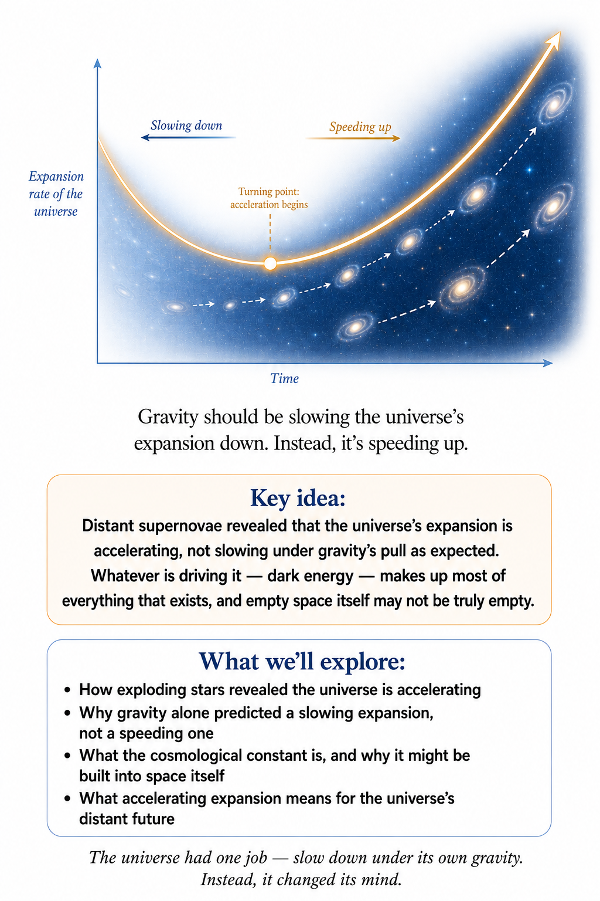

The universe has a strange habit of becoming more confusing exactly when we think we've finally got it figured out. We discovered that the universe is expanding. Fine. We discovered that gravity shapes that expansion. Also fine. We discovered that most of the matter out there is invisible. Less fine.

Then, in the late 1990s, astronomers discovered something that made the situation considerably worse. The expansion of the universe is accelerating. Not merely continuing. Not merely failing to stop. Accelerating.

Something appears to be making the large-scale expansion of the universe speed up. We call it dark energy, and that name is doing a remarkable amount of work. “Dark” means we don't know what it is. “Energy” means it behaves, in the cosmic equations, somewhat like a component of the universe with a particular gravitational effect — you met this same trick earlier, with dark matter.

Put those two pieces together and you get a working definition of modern cosmology: we don't know what this stuff is, but it seems to be making the universe accelerate. Welcome to cosmology.

## Gravity should have slowed things down

Let's return to the beginning. The universe was expanding, and matter was present. Matter attracts matter gravitationally, so the natural expectation was that gravity should gradually slow the expansion down.

Imagine throwing a ball upward. It starts out with a certain speed, Earth's gravity pulls downward, and the ball slows. Eventually, if you don't throw it fast enough, it stops rising and falls back to your hand.

Cosmologists once imagined something similar for the universe as a whole. It began expanding, gravity would gradually slow that expansion down, and perhaps the expansion would eventually stop and reverse — a scenario sometimes called the Big Crunch. It was a perfectly reasonable expectation. It was also wrong as a description of our present cosmic expansion.

## The supernova clue

The discovery of cosmic acceleration came from something that seems almost too small to reveal the fate of the universe: exploding stars. Certain stellar explosions, called Type Ia supernovae, have remarkably useful properties. They occur when a particular kind of white dwarf — the dense, burnt-out core left behind when a Sun-like star dies — undergoes a thermonuclear explosion, and because these explosions have relatively predictable intrinsic brightnesses, astronomers can use them as standardizable candles.

That means if we measure how bright one appears to us, we can estimate how far away it is. The farther away it is, the fainter it appears. Simple enough. But there's more.

Because the supernova's light has also been stretched by cosmic expansion, astronomers can compare how far away it appears to be with how much the universe expanded while that light was traveling toward us. That comparison lets us reconstruct the entire history of cosmic expansion. And the results were astonishing.

## The universe had changed its mind

Where this stands: OBSERVED — the acceleration itself has been confirmed independently by multiple methods since the late 1990s.

In the late 1990s, two independent research teams studying distant Type Ia supernovae found evidence that the universe's expansion was accelerating. The universe was not behaving like a ball gradually losing its upward speed. Something had taken over.

For much of cosmic history, matter dominated the expansion, and gravity slowed things down accordingly. But at relatively late cosmic times, another component became increasingly important, and the expansion began accelerating. It was as though the universe had reached a point where matter's gravity was no longer the dominant factor in its own large-scale expansion. Something else was winning.

Picture a car traveling uphill. You take your foot off the accelerator, and gravity slows the car down — until, unexpectedly, the car begins accelerating uphill anyway. You'd immediately suspect something unusual: maybe the engine switched back on, maybe the hill changed shape, maybe someone strapped on a rocket. Cosmic acceleration is the equivalent of discovering that the car is speeding up a hill it should be sliding down. We know the acceleration is real. We don't yet know what the cosmic engine is.

## Enter the cosmological constant

One of the simplest possibilities is surprisingly old. Remember Einstein's cosmological constant, Λ? It first appeared because Einstein wanted a static universe, and that didn't work out — the universe turned out to be expanding, and the cosmological constant seemed like a historical curiosity, a mathematical detour Einstein himself later regretted.

Then cosmic acceleration was discovered, and suddenly Λ was useful again. In the simplest interpretation, dark energy is associated with a constant energy density of empty space itself. As the universe expands, there is more volume, and if the energy density of empty space stays constant, the total amount of that energy increases right along with the volume of space.

That sounds alarming. Where does the energy come from? The answer is that energy conservation in an expanding universe governed by general relativity is subtler than the simple conservation rule you learned in elementary mechanics. There is no universal cosmic box in which we can say “the total energy inside this fixed container must remain constant” — the geometry of spacetime itself is dynamic, and the bookkeeping is more complicated than that.

## Empty space isn't necessarily nothing

This is where quantum physics starts whispering in the background. Quantum physics is the rulebook for how matter and energy behave at the smallest scales: not solid little balls bouncing around, but something closer to a haze of possibilities that only settles into one definite outcome when something measures it. In classical physics, empty space can seem like nothing at all — no particles, no radiation, nothing. Quantum field theory gives us a different picture.

Fields exist throughout space, and even what we call the vacuum turns out to have quantum properties. The lowest-energy state of a quantum field is not necessarily equivalent to absolute nothingness.

This raises an obvious question.

## Could dark energy just be the vacuum?

Where this stands: OPEN QUESTION — one candidate explanation among several, not yet confirmed.

Perhaps. It's a natural guess, and quantum field theory does predict that empty space should carry some energy of its own, simply by existing.

## Then why doesn't the math work?

Because when physicists try to estimate that vacuum energy using straightforward quantum-field-theory arguments, the result is enormously larger than the observed dark-energy density. Not slightly larger. Not ten times larger. The discrepancy is fantastically huge — one of the worst mismatches between theoretical expectation and observation anywhere in fundamental physics.

Put an actual number on “fantastically huge”: naive quantum-field-theory estimates put the vacuum energy density at around 10¹²⁰ times larger than what astronomers actually measure. That is not a typo — a 1 followed by 120 zeros — arguably the largest gap between theoretical prediction and observation anywhere in physics.

## The cosmological constant problem

Where this stands: OPEN QUESTION — one of the largest unsolved mismatches between theory and observation in physics.

We have a quantity that appears to be associated with empty space. Our quantum theories seem to say it should be vastly larger than what we observe. Nature says no, and refuses to explain further.

This mismatch is known as the cosmological constant problem, and it is one of the deepest unsolved problems in theoretical physics. If dark energy truly is a cosmological constant, its observed value is extraordinarily small compared with naïve quantum estimates. Why?

Perhaps there is an enormous cancellation between different contributions. Perhaps some unknown principle sets the vacuum energy to a tiny value. Perhaps gravity responds to vacuum energy differently from what we currently understand. Perhaps dark energy is not a cosmological constant at all. We don't know — and this is one reason cosmology and quantum mechanics eventually have to meet. The universe is forcing the two subjects into the same room, and at the moment they are just staring at each other suspiciously.

## Is dark energy really energy?

Where this stands: OPEN QUESTION — dark energy's fundamental nature remains genuinely unresolved.

The name can be misleading. Dark energy is not necessarily a mysterious fluid floating through space. It is better to think of it as a convenient label for whatever component of the cosmic energy-momentum budget produces the observed accelerated expansion.

The simplest model is a cosmological constant, but other possibilities exist. Perhaps there is a dynamical field whose energy changes over time — such models are often grouped under the broad label quintessence. Perhaps gravity itself behaves differently on cosmological scales, and the apparent acceleration is telling us that general relativity needs modification. Or perhaps the cosmological constant really is the answer, and the deeper mystery is simply why it has precisely the value it does. Science hasn't settled the matter.

## The equation that governs expansion

To understand the issue more precisely, cosmologists use the Friedmann equations. In simplified form, one of them can be written H² = (8πG/3)ρ − kc²/a² + Λc²/3.

Don't let the symbols intimidate you. The equation is essentially a cosmic accounting system. The expansion rate depends on the density of matter and radiation, the curvature of space, and the cosmological constant — how much stuff there is, what shape space takes, and how hard empty space itself is pushing.

Matter tends to slow expansion down. Radiation affects the expansion strongly in the early universe. A positive cosmological constant, on the other hand, produces accelerated expansion. The entire history of the universe is a competition between these ingredients, and which one wins changes as the universe ages.

## Why does dark energy eventually dominate?

Here's a subtle but beautiful point. Matter becomes more dilute as the universe expands — if the universe doubles in each spatial dimension, the volume increases eightfold, and the same amount of matter gets spread across all that extra space. Radiation becomes even more dilute still, and it also loses energy as its wavelengths stretch.

But a cosmological constant has an approximately constant energy density. So as the universe grows, matter becomes less important relative to it, almost by default.

Imagine a swimming pool filled with sand and a peculiar substance whose density never changes, no matter how much the pool expands. Stretch the pool enormously, and the sand becomes increasingly sparse while the strange substance remains exactly as dense as it always was. Eventually, it dominates. That is roughly what happens cosmologically.

## The universe entered the dark-energy era

For billions of years, matter had a much stronger influence on cosmic expansion than anything else. But in time the density of matter fell far enough that dark energy took over, and the expansion has been accelerating ever since.

If dark energy really is a cosmological constant, that acceleration will continue indefinitely. The universe will grow increasingly dilute. Galaxies that aren't gravitationally bound to us will gradually disappear beyond our observable horizon, star formation will decline, and existing stars will die out one by one.

The universe will become darker. Colder. More empty. After a universe that once contained exploding stars, colliding galaxies, and growing black holes, the ultimate cosmic drama may turn out to be an extraordinarily long fade-out.

## The fate of galaxies

Our Milky Way is gravitationally bound to the Andromeda Galaxy and the other nearby members of the Local Group. Cosmic expansion does not tear apart gravitationally bound systems, so the Local Group can stay together even while the universe expands all around it.

But increasingly distant galaxies will eventually become unreachable. As cosmic expansion accelerates, the distance between us and sufficiently far-off galaxies grows so rapidly that their light can no longer outrun the expansion, and those galaxies will, in time, pass beyond our cosmic horizon for good.

A future civilization living in our cosmic neighborhood could look up into the sky and see far fewer galaxies than we do today. The universe could appear far emptier — not because the galaxies vanished, but because their light can no longer reach us.

## The cosmic future gets dark

Where this stands: SPECULATIVE — a model-dependent extrapolation trillions of years into the future.

If dark energy remains a cosmological constant, the long-term picture is often described as heat death. Not a dramatic explosion. Not a cosmic collapse. A slow approach toward maximum large-scale entropy.

Stars burn through their fuel. Gas becomes less available for forming new ones. Galaxies grow increasingly isolated, and black holes may in time dominate what compact structures remain — and over unimaginably long stretches of time, even black holes are expected to evaporate away through Hawking radiation. The universe approaches a state with extremely little usable free energy left. There can still be particles and radiation drifting around, but fewer and fewer ways to organize any of it into something interesting. The cosmos doesn't necessarily end. It simply becomes increasingly boring — and on sufficiently long timescales, boring becomes a terrifyingly impressive achievement.

We shouldn't get ahead of ourselves, though. The future depends entirely on what dark energy actually is. If it evolves rather than staying constant, the story could look very different — in some hypothetical models, dark energy grows stronger over time, and could eventually tear apart galaxies, stars, planets, and even smaller structures still. This extreme scenario is called the Big Rip. It is not the standard prediction, and it depends on physics we haven't established. Cosmology is unusually good at reminding us that extrapolating today's physics into an unimaginably distant future requires a healthy dose of humility.

## The cosmological constant is strangely simple

Where this stands: STRONGLY SUPPORTED — but under real strain: the Hubble tension (different measurement methods disagree on the expansion rate by about 8%) and 2024–2025 DESI survey results hinting dark energy may not be perfectly constant are two live cracks worth watching.

Despite all these mysteries, there is something remarkable about the simplest model. A single number can describe dark energy extremely well — one that corresponds to a nearly constant energy density of space. Combined with cold dark matter and ordinary matter, this gives us the ΛCDM model, and ΛCDM works startlingly well.

It reproduces the broad features of the cosmic microwave background, the expansion history, the distribution of galaxies, gravitational lensing, and the growth of cosmic structure. The fact that a model with so few ingredients can describe such a vast universe is extraordinary. But success doesn't mean completion. ΛCDM tells us how the universe behaves. It does not necessarily tell us what dark matter and dark energy fundamentally are.

## The universe's biggest accounting problem

We can now take stock. The ordinary matter we know — atoms, stars, gas, planets, people — is only a minority component. Dark matter appears to provide much of the gravitational scaffolding, and dark energy appears to dominate the large-scale energy budget. Ordinary matter is almost an afterthought in the cosmic inventory.

That is a humbling realization. Everything we see directly — the stars, the galaxies, the planets, and our own bodies — appears to be only a small part of what the universe actually contains. We are, in a very literal sense, made from the minority.

But dark energy and dark matter still don't answer everything. Dark energy explains, or at least parametrizes, the acceleration of cosmic expansion. Dark matter helps explain the growth of structure. Neither one tells us why the universe had the particular initial conditions we observe — why it is so smooth on such vast scales, why it is so close to spatially flat, why it ended up dominated by matter instead of antimatter, or why the fundamental constants are what they are. Why does the universe exist in this particular form at all?

That leaves us with two mostly invisible ingredients dominating the cosmic inventory: dark matter supplying the gravitational scaffolding, dark energy driving the expansion itself. Put gravity to work on that scaffolding for long enough, and something striking happens. Matter stops being scattered at random and starts building itself into structure — filaments, clusters, a web spanning billions of light-years. That is where we go next.

↑ Back to Contents

# Chapter 6: The Cosmic Web — How the Universe Built Itself

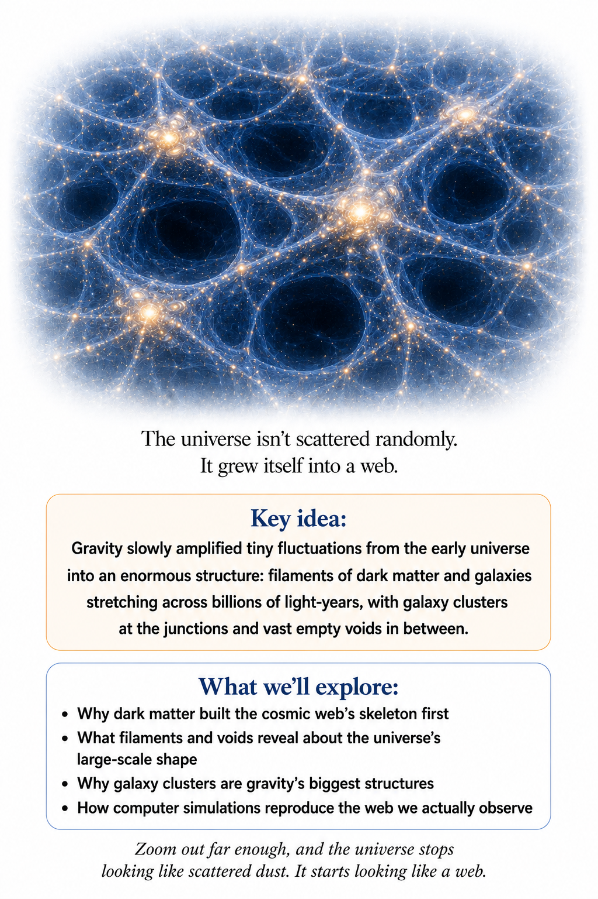

Look at the universe on the largest scales and something striking appears. It isn't a random scattering of galaxies. Galaxies gather into clusters. Clusters string together into long filaments that stretch across immense distances, with vast, sparse voids in between.

The result is a colossal three-dimensional network — the cosmic web. It is one of the most spectacular structures in nature, spanning a meaningful fraction of the observable universe. Its origin can be traced to something almost absurdly small: tiny fluctuations in the density of the early universe. The universe began surprisingly smooth. Gravity made it complicated.

You've already met dark matter and dark energy as separate characters in this story. This chapter is where they start working together, alongside gravity and plain old gas, to build the largest structures the universe has ever produced.

## Gravity is an amplifier

You met the cosmic microwave background earlier in this book: a snapshot of the universe as it looked when it was nearly — but not perfectly — smooth. Some regions held slightly more matter than others. Picture a perfectly smooth sheet of paper, then add wrinkles so shallow you can barely see them. Those wrinkles don't look like much.

But gravity is very good at amplifying differences. A region that is slightly denser has slightly more gravitational pull. It draws in more matter, which makes it denser still, which draws in even more matter. A small advantage becomes a larger advantage.

It is the cosmic equivalent of a snowball rolling downhill — except the snowball is a density fluctuation, the hill is spacetime, and the snowball eventually becomes a galaxy. This is gravitational instability, and it is unstable in exactly the right way. Over hundreds of millions and then billions of years, the tiny primordial fluctuations grow until a nearly smooth universe becomes a cosmic landscape of structure.

## Dark matter gets there first

There's a complication. Ordinary matter interacts strongly with radiation, and in the early universe it was tightly coupled to the photon bath (the sea of light particles, called photons, filling the young universe) — radiation pressure resisted gravitational collapse and held the clumping back. Dark matter behaved differently. It interacted only weakly with radiation, so it could start responding to gravity earlier, building halos and larger networks that ordinary matter would later fall into.

So which came first, dark matter or galaxies? Dark matter, by a wide margin. This is one of the reasons it matters so much to cosmology. It wasn't just extra mass sitting inside galaxies that had already formed — it was the scaffolding the galaxies formed on.

Imagine a gigantic invisible framework spanning the universe: dense knots, long threads, huge sheets, enormous empty spaces. Sprinkle ordinary matter into that framework and gas falls into the gravitational wells, collects, cools, and fragments. Stars form. Galaxies emerge.

The dark matter is invisible. The galaxies are not. But the galaxies reveal the structure, the way seeing leaves at night lets you reconstruct the shape of the branches from where the leaves cluster — except the branches are dark matter halos, the leaves are galaxies, and the tree is billions of light-years across.

## Filaments and voids

The cosmic web has a few recognizable pieces. Dense nodes, where massive clusters of galaxies form. Long filaments, where matter flows between those dense regions. Broad sheets and walls. And vast voids — regions where matter is far less concentrated than everywhere else.

The voids aren't completely empty. They hold diffuse gas, dark matter, and the occasional lonely galaxy. But compared with the dense clusters, they are remarkably sparse.

So the universe looks less like a uniform fog of galaxies and more like a gigantic network. At first glance it almost resembles a biological or neural structure. But the resemblance is visual, not evidence that the universe is literally functioning like a brain. Nature is simply very fond of making patterns.

## The universe grows from the bottom up

One of the key predictions of the standard cosmological model is that structure develops hierarchically: small galaxies merge into larger ones, galaxies gather under their mutual gravity into groups, and groups assemble into even larger clusters. Small first, big later — that is the rule, though a few surprisingly massive early galaxies spotted by the James Webb Space Telescope are currently testing how strictly it holds.

That doesn't mean every structure grows identically. Cosmic history is messy: galaxies collide, gas flows, stars explode, black holes grow, feedback processes redistribute energy. But underneath all that complexity is a simple gravitational story — small density differences grow into large structures.

Big galaxies did not appear first and fragment into smaller pieces — they were built, piece by piece, over billions of years.

## Galaxies are not static islands

When you look at a photograph of a galaxy, it's tempting to imagine a finished object — a beautiful spiral, a glowing center, some dust lanes, a tidy collection of stars. But galaxies are dynamic. Gas flows through them. Stars are born and stars die.

Supernovae inject energy and heavy elements into the surrounding gas, and black holes can release enormous amounts of energy into their environments. Galaxies collide and merge, and their shapes can change dramatically — the Milky Way itself has a long history of mergers and interactions.

The universe isn't displaying a collection of finished galaxies in a cosmic museum. It's running a construction site. The tools are gravity, gas, radiation, and time.

## How does a galaxy actually form?

Imagine a region of dark matter that has become slightly denser than its surroundings. Gravity draws more matter inward and a halo begins to form. Ordinary gas falls into the halo, heating as it falls. Eventually it cools through radiation, and as it cools it collapses further, forming dense regions.

Those dense regions eventually become stars. Stars gather into larger structures. A galaxy emerges. The details are complicated — there are many feedback mechanisms — but the galaxies we see today are the late products of a process that began in the almost-uniform early universe.

## Why don't all galaxies look alike?

Because the universe isn't a machine producing identical objects. Different galaxies have different histories. Some have abundant cold gas and keep forming stars; others have exhausted much of their star-forming material. Some have experienced major mergers. Some contain extremely massive central black holes.

Some are spirals, some elliptical, some irregular — their shapes reflect their environments and their histories. Two galaxies born from equally modest fluctuations can end up looking nothing alike, depending on who they collided with and when. A galaxy isn't merely defined by how it looks. It's defined by what happened to it.

The universe leaves evidence of its past in the structures we observe today.

## The Milky Way is part of a larger family

Our galaxy belongs to a small collection called the Local Group, which contains the Milky Way, Andromeda, Triangulum, and many smaller galaxies. A group like ours might hold anywhere from several dozen to over a hundred known members, and the count keeps climbing as fainter dwarf galaxies are discovered. The Local Group itself sits inside a much larger cosmic environment, where nearby galaxy groups and clusters form part of the broader cosmic web.

The universe has structure at many scales, each nested inside the next — stars, galaxies, groups and clusters, filaments, the cosmic web. There isn't one privileged scale at which “the universe” suddenly becomes organized; structure emerges across the whole range at once.

## Galaxy clusters: gravity's giant cities

A galaxy cluster is an enormous gravitationally bound system that can contain hundreds or thousands of galaxies — among the largest bound structures the universe builds. But the galaxies themselves are only part of the mass. Clusters also hold vast amounts of extremely hot gas, hot enough to reach tens of millions of degrees and glow in X-rays. The cluster's total mass is dominated by dark matter.

So a cluster is almost a miniature universe: dark matter provides much of the gravitational structure, ordinary gas fills the gravitational wells, galaxies move through the system, stars produce light, and a central supermassive black hole — millions to billions of times the Sun's mass — can influence the surrounding environment. Clusters are therefore enormous laboratories for testing gravity and cosmology.

## The cosmic web is still growing

The universe isn't finished. Matter continues to move along the cosmic web — gas falls into galaxies, galaxies merge, clusters grow. But there's an important competition underway. Gravity pulls matter together. Dark energy drives accelerated cosmic expansion.

On small scales, gravity easily wins. On the largest scales, accelerated expansion becomes increasingly important. Structures already bound together can remain together, but structures that were never bound to one another are drifting further apart. The universe's large-scale architecture is gradually becoming more isolated, one unbound neighborhood at a time.

## The cosmic web has a history

We can test this story directly. Look at distant galaxies: because their light takes time to reach us, we see them as they were billions of years ago. Look farther away and we see even earlier galaxies still, letting us compare the universe at different stages of its development.

Young galaxies tend to look different. Clusters were less developed, the cosmic web was less mature, and the universe was more actively forming stars. That lets cosmologists reconstruct the growth of structure over cosmic time. We are not merely looking at different places. We are looking at different ages.

In effect, the night sky becomes a time-lapse movie of structure formation, one that unfolds a little further every time a bigger telescope points at a fainter, more distant patch of galaxies.

## Simulations reproduce the universe

Cosmologists can take a model of the universe, specify its initial density fluctuations, add dark matter and ordinary matter, and use enormous computer simulations to evolve the whole system forward. The result is a virtual universe: particles of dark matter move under gravity, structures grow, halos merge, gas flows, and galaxies form according to increasingly sophisticated physical models.

The simulated universe can then be compared with observations. When the large-scale patterns match, that gives us confidence in the underlying cosmological model. It's one of the extraordinary advantages of modern cosmology — we can compare the actual universe with thousands of virtual universes generated by equations. The computer becomes a kind of experimental laboratory.

But a simulation is only as good as the physics inside it. Where we don't fully understand something — the detailed behavior of gas inside galaxies, say — the simulation has to approximate it. Star formation, supernova feedback, and black-hole feedback all happen on scales far smaller than the simulation itself, so cosmologists build effective models and tune them against observations. Agreement between simulations and observations is powerful evidence. It isn't proof that every microscopic detail is correct.

Even the best simulations cut corners on purpose, and how they do it is worth knowing. The Millennium Simulation of 2005 tracked about ten billion particles, yet each “particle” stood in for nearly a billion suns' worth of dark matter. Modern codes spend their effort unevenly. Where gas collapses into a galaxy, the computational grid splits into finer and finer cells; out in the near-empty voids it stays coarse. Anything smaller than the finest cell, from a single star to a single supernova, is handled by a subgrid recipe: a rule of thumb for how much starlight and blast energy a patch of gas should produce on average. Video-game designers call the same trick level of detail. Spend detail where something is happening, and save it where nothing is.

That resemblance is one reason some people wonder whether our own universe is rendered the same way. The comparison actually points the other way. A simulation that skimps leaves seams, and much of the craft of cosmology is checking that the model's seams don't show when it is set against the sky. The real sky has shown no seams. Chapter 12 describes one careful search for them.

## The cosmic web connects the very large to the very small

This is one of the deepest themes in cosmology. The structure of the universe on scales of billions of light-years depends on physics operating at scales almost too small to imagine. The primordial fluctuations may have originated in quantum processes — microscopic jitters stretched to cosmic size, a story Chapter 8 tells properly — and particle physics determines the properties of matter and radiation that filled the early universe.

Those ingredients set the initial density fluctuations, which gravity amplifies into the dark matter scaffolding, gas, stars, and galaxies already traced above — and billions of years later, the cosmic web.

A structure spanning unimaginable distances may therefore preserve information about quantum physics from the earliest moments of cosmic history — a remarkable chain running from quantum fluctuations all the way to observers looking up at the sky.

## Gravity is a cosmic sculptor

We began this book with gravity as the phenomenon that makes apples fall. Now look at what that same interaction has done. It built stars. It assembled galaxies. It created clusters. It shaped the cosmic web. It formed black holes and generates gravitational waves. It governs the large-scale evolution of the universe. Gravity is not merely one force among many — at cosmic scales, it is the architect.

Cosmology gives us a strange kind of laboratory. Particle accelerators let us probe incredibly small distances; telescopes let us probe incredibly large ones. Cosmology lets us study the universe as a whole. The early universe reached energies far beyond anything we can reproduce on Earth, and it left evidence behind: the cosmic microwave background, the distribution of galaxies, the gravitational waves from violent events. We cannot rerun the experiment. But we can read the evidence it left.

There is a catch, though. We have been describing gravity using general relativity, and matter using quantum physics. The cosmic web seems to emerge from the interaction of these two descriptions. Yet at the earliest stages of the universe, the two must have operated simultaneously — and that is where things become difficult.

## A problem hiding in the success

The cosmic web is one of the great successes of ΛCDM, the standard model of cosmology built from ordinary matter, dark matter, dark energy, radiation, and general relativity. The model explains a remarkable amount. But two of its main ingredients are still mysterious: we don't know what dark matter actually is, and we don't know what dark energy fundamentally is. That's not a minor footnote — together, those two mysteries account for the overwhelming majority of everything in the cosmic inventory.

There's an even deeper problem underneath. The model describes the universe using general relativity, but the early universe should also have been governed by quantum physics. At some point, classical spacetime must give way to quantum gravity. We don't know exactly where that happens, what spacetime looks like at the deepest level, or whether spacetime itself is fundamental. That question will eventually take us to the boundary of this book.

## The universe is a hierarchy

We can now see the cosmic story from a new perspective. At the smallest scales, quantum fields fluctuate. At larger scales, those fluctuations become density variations. At still larger scales, gravity amplifies them: dark matter forms halos, gas falls into those halos, stars form, galaxies assemble, galaxies gather into clusters, clusters trace filaments, and filaments form the cosmic web — all of it evolving inside an expanding spacetime.

The universe is therefore not a collection of unrelated scales. It is a hierarchy, and each level grows out of the one beneath it. When we look at today's cosmic web, we are seeing the consequences of ancient initial conditions. The filaments remember the fluctuations. The galaxies remember the filaments. The stars remember the galaxies. The elements remember earlier stars.

Cosmology, in other words, is a form of forensic science. We examine the universe today and reconstruct what must have happened billions of years ago. Sometimes the evidence is remarkably clear. Sometimes it isn't. And sometimes the evidence points directly toward a missing theory.

Because the cosmic web tells us something extraordinary: the largest structures in the universe may preserve traces of events that began at scales so tiny that ordinary intuition completely fails. If that is true, the quantum world is not merely a microscopic curiosity — it may have written the blueprint for the cosmos. But that blueprint had to survive an extraordinarily violent childhood first. Before there was a cosmic web to build, there was a universe hot and dense enough to forge the first atomic nuclei in a matter of minutes.

↑ Back to Contents

# Chapter 7: The First Three Minutes — How the Elements Were Made

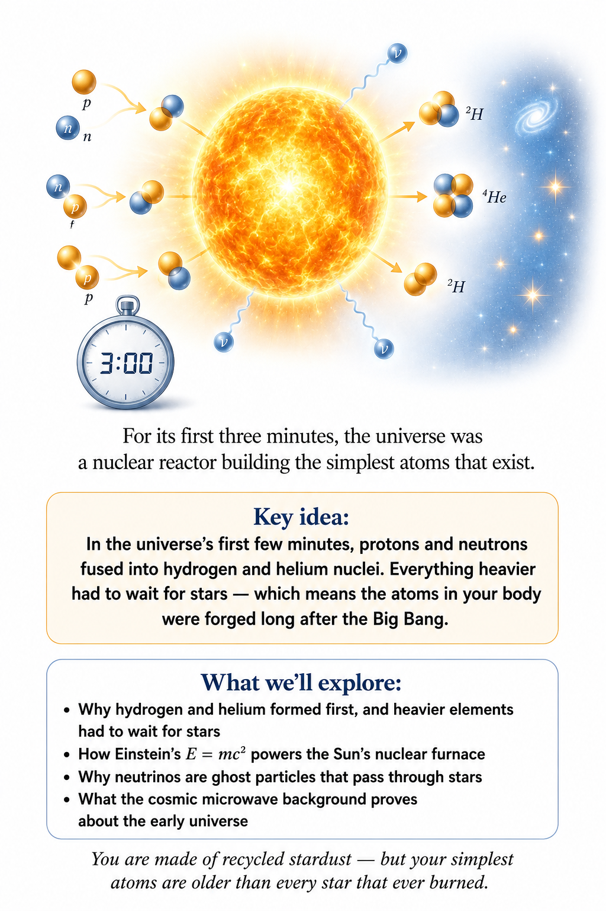

We have watched the universe expand, cool, and grow structures. Now we are going to run the cosmic movie much farther backward, to a time when the universe was so hot and dense that the ordinary matter around us could not yet exist in the forms we know today. This is where physics becomes wonderfully strange. The early universe was not a quiet place containing tiny versions of today's stars and planets; it was a hot, dense soup of particles and radiation, changing rapidly as space expanded.

## The universe was once very hot

If the universe is expanding today, then in the past everything was closer together. When radiation is squeezed into a smaller volume, its energy density rises, and as the universe expands that radiation is stretched and cools. That gives us a simple cosmic thermometer. Look at the universe today and ask what it would have looked like when everything was much closer together. The answer is hotter, denser, and much less friendly to anyone hoping to keep an ice cube intact.

## A cosmic pressure cooker

Imagine putting ordinary matter into an unimaginably hot pressure cooker and then turning the temperature up far beyond anything a kitchen appliance could survive. Molecules would not remain molecules, atoms would not remain atoms, and eventually even atomic nuclei would be broken apart. At sufficiently high temperatures, particles constantly collide with enough energy to create and destroy other particles. The early universe was therefore not merely hot in the everyday sense; it was a place where matter itself was continually being rearranged.

## The first moments are not a movie we can watch

There is an important limitation here. We cannot simply point a telescope at the first instant of the universe and take a photograph, because the early universe was opaque to light and the conditions were far beyond anything directly accessible to ordinary observation. Instead, physicists reconstruct the early universe using theory, particle physics, the cosmic microwave background, and the amounts of light elements found in the cosmos. The remarkable thing is that these different lines of evidence fit together extraordinarily well.

## The first three minutes

Physicist George Gamow and his collaborators famously explored what the early universe could have done during its first few minutes. The basic idea is simple: as the universe expanded and cooled, conditions changed rapidly enough that different nuclear reactions became possible and then stopped. This period matters because some of the simplest atomic nuclei were forged during those early minutes. Hydrogen and helium dominate the ordinary matter in the universe, and their proportions carry a fossil record of the young cosmos.

## Before atoms, there were nuclei

An atom is a nucleus surrounded by electrons. But in the very early universe, it was far too hot for stable atoms to exist. Electrons were flying around freely, and nuclei were continually battered by energetic particles and radiation. As the universe cooled, the situation changed. Protons and neutrons could combine into nuclei, producing deuterium, helium, and tiny amounts of other light nuclei. This process is called Big Bang nucleosynthesis.

Run the numbers and Big Bang nucleosynthesis makes a sharp, testable prediction: ordinary matter coming out of the first few minutes should be about 75% hydrogen and 25% helium by mass, with only trace amounts of anything heavier. Measure the actual proportions in ancient, unprocessed gas clouds today, and that is almost exactly what you find.

## Why hydrogen wins

Hydrogen is the simplest element: one proton with an electron when it is neutral. It is therefore not surprising that hydrogen remains enormously abundant, but the reason it dominates also lies in the early nuclear reactions and in the number of free neutrons available at the time. Free neutrons are unstable when left alone. They can decay, so the early universe had only a limited window in which neutrons could be captured into stable nuclei. Much of the surviving neutron population ended up in helium nuclei.

## Building helium

A helium-4 nucleus contains two protons and two neutrons. It is unusually stable, and once the temperature fell enough for nuclei to survive collisions without being immediately destroyed, helium formation became efficient. The result was a universe containing mostly hydrogen nuclei, a substantial amount of helium nuclei, and only traces of heavier light elements. Nearly all of the heavier elements would have to wait for stars.

## The universe makes a prediction

Where this stands: STRONGLY SUPPORTED — Big Bang nucleosynthesis's predicted abundances match observations closely.

This is one of the beautiful features of cosmology. The early universe was hot enough that nuclear physics could predict approximate abundances of the light elements, provided we know the relevant physical conditions. Astronomers can then measure those abundances in ancient stars, gas clouds, and other environments. The agreement between prediction and observation is one of the major pieces of evidence supporting the hot Big Bang picture.

## Deuterium weighs the universe

The first three minutes also give cosmology one of its sharpest cross-checks. Deuterium, a hydrogen nucleus with an extra neutron, is a fragile intermediate step on the way to helium. How much of it survived the first three minutes depends sensitively on how many protons and neutrons there were per unit volume. More ordinary matter means more collisions, and more deuterium gets cooked into helium.

Astronomers measure deuterium in pristine gas clouds lit from behind by distant quasars, and find about 25 deuterium atoms for every million hydrogen atoms. Turn that into a density of ordinary matter, and it says ordinary matter makes up about five percent of the universe's total energy budget.

Here is the remarkable part. The cosmic microwave background, released some 380,000 years later by completely different physics, gives the same answer. Two independent clocks, one nuclear and one acoustic, agree on how much ordinary matter exists. That agreement is one of the strongest reasons cosmologists are confident that dark matter, as described in Chapter 4, cannot be made of ordinary atoms. The budget for ordinary matter has already been spent.

## Cosmology counts the neutrinos

Neutrinos are nearly massless particles with no electric charge, produced in nuclear reactions, that pass through ordinary matter almost as if it were not there; trillions cross your body every second. They also turn out to be countable from cosmology.

The helium made in the first three minutes depends on how fast the universe was expanding at the time. If expansion was quick, the neutrons had less time to decay before being locked into helium, and more helium resulted. The expansion rate, in turn, depended on everything that filled the early universe with energy, including every kind of light, fast-moving particle. Each extra type of neutrino would have sped the expansion up a little and raised the helium abundance.

So by measuring helium, cosmologists could count neutrino types. By the late 1970s, the observed helium already suggested there could be no more than a few, and later analyses settled on three. In 1989 particle accelerators at CERN and Stanford counted neutrino types directly, from the way the Z particle decays. The answer was three. Today the cosmic microwave background gives the same count independently. A measurement of gas in distant galaxies agreed with a measurement in an underground accelerator about how many kinds of a nearly invisible particle exist.

## The neutrino sea

Those neutrinos are still here. About one second after the Big Bang, the universe cooled enough that neutrinos stopped interacting with everything else and began flying freely. They have been doing so ever since, cooling as space expands. Today they form a cosmic neutrino background, an older cousin of the microwave background, with a temperature of about 1.9 degrees above absolute zero.

There are roughly 340 of these relic neutrinos in every cubic centimeter of space, including the space inside your body right now. They are almost impossible to detect directly, because their energies are so low. But their gravity is not negligible. Neutrinos have a small mass, and so many of them fill the universe that their combined gravity slightly smooths the growth of the cosmic web: fast-moving neutrinos stream out of small clumps instead of settling into them. By measuring the cosmic web precisely, cosmologists have placed an upper limit on the combined mass of the three neutrino types of roughly a tenth of an electron volt, tighter than any laboratory experiment has yet achieved. A particle discovered in nuclear decays is being weighed, indirectly, by the distribution of galaxies.

## A small crack worth watching

Where this stands: OPEN QUESTION — a long-standing mismatch between prediction and observation.

Not every light element behaves. The same calculation that gets hydrogen, helium, and deuterium right predicts about three times more lithium-7 than astronomers find in the oldest stars of our galaxy. This is the cosmological lithium problem. It may be that old stars slowly destroy some of their lithium, mixing it down into layers hot enough to burn it. It may be an error in nuclear reaction rates. Or it may point to new physics in the first minutes. Most researchers suspect the stars, but the case is not closed.

## Why heavier elements had to wait

You might reasonably ask why the early universe did not simply continue making carbon, oxygen, iron, and everything else. The problem is time and expansion: the universe cooled rapidly, and the density fell so quickly that the sequence of nuclear reactions could not efficiently build most heavier nuclei. There is also a famous bottleneck in the nuclear pathway: no stable nucleus exists with five or eight particles in it, so simply adding one proton or neutron at a time to helium hits a dead end almost immediately. Building anything heavier requires a much rarer three-way collision, one that needs far more time and far higher density than the rapidly cooling, expanding early universe could offer. The universe moved on before it could manufacture large quantities of heavy elements, leaving stars to take over the job later.

## Stars take over the factory

So the first three minutes made hydrogen, helium, and a trace of lithium, and then the universe moved on. Almost everything else in the periodic table was made later, inside stars, and it is tempting to treat that as a story for nuclear physicists. It is not only theirs. A star is a gravitational object first and a nuclear reactor second. Gravity builds it, heats it, sets how fast it burns, and finally destroys it. The rest of this chapter follows the elements through that gravitational machinery, and through the ways cosmology checks its own arithmetic.

The nucleus itself, meaning the strong force that binds it, fission, radioactive decay, and the long detective story of the neutrino, gets its own full treatment in Volume 3, Chapters 1 and 2. Here we only need one fact from it: fusing light nuclei releases energy, because the fused nucleus weighs slightly less than its ingredients, and E = mc² turns the missing mass into heat.

## A star is gravity holding its breath

Picture a cloud of hydrogen and helium a few light-years across, slightly denser than its surroundings. Gravity pulls it inward. As it falls, gravitational energy turns into heat, exactly as a dropped stone warms the ground it hits. The cloud's core grows hotter and denser until, at around ten million degrees, hydrogen nuclei collide hard enough to fuse. The collapse stops. A star is born.

You can estimate the temperature of the Sun's core with nothing but gravity. A proton deep inside the Sun must be moving fast enough to hold up the weight of the layers above it. That means its thermal energy must be roughly comparable to the gravitational energy binding it to the Sun, which is about GMm/R, with M and R the Sun's mass and radius and m the proton's mass. Plug in the numbers and the temperature comes out at around twenty million degrees. The measured value, from detailed models checked against the Sun's vibrations and neutrinos, is about fifteen million. Gravity alone gets you within a factor of two.

That estimate hides a strange feature of self-gravitating objects. When a star loses energy by shining, it does not cool down. It contracts slightly, and the contraction releases more gravitational energy than the star lost, so its core heats up. Physicists say a star has negative heat capacity: take energy away and it gets hotter. This is why a star's nuclear furnace is so stable. If fusion runs too fast, the extra heat makes the core expand and cool, and fusion slows. If fusion runs too slowly, the core contracts, heats, and fusion speeds up. Gravity is the thermostat.

## The clock that ran out too soon

In the nineteenth century, before anyone knew about nuclear energy, the physicist William Thomson, later Lord Kelvin, asked how long gravity alone could keep the Sun shining. Take the Sun's gravitational energy, roughly GM²/R, and divide it by the rate at which the Sun gives off light. The answer is about thirty million years.

Kelvin used that number to argue that Earth could not be much older, which put him in open conflict with geologists and with Charles Darwin, who needed hundreds of millions of years at least. The arithmetic was correct. The assumption was wrong. The Sun was not running on gravitational energy but on fusion, a source Kelvin could not have known about, and it has been shining for about 4.6 billion years. Physics was right about how gravity works and wrong about what else nature had available. It is a useful warning for every chapter of this book that ends in an open question.

## Heavy stars live fast

Gravity also decides how long a star lives. A more massive star must hold up more weight, so its core is hotter and denser, and its fusion runs dramatically faster. A star's light output rises roughly as the cube or fourth power of its mass. Double the mass and a star shines about ten times more brightly, so it burns through its larger fuel supply about five times faster.

Put numbers on it. The Sun will spend about ten billion years fusing hydrogen in its core. A star of ten solar masses spends only about twenty million years. A small red dwarf of a tenth of the Sun's mass sips its fuel so slowly that it should last for trillions of years, far longer than the universe has existed so far. Not one red dwarf has yet died of old age.

That mass dependence is why the heavy elements appeared so quickly in cosmic history. The stars that make the most interesting elements are the massive ones, and massive stars live and die in a cosmic eyeblink. Within a few hundred million years of the first stars switching on, generations had already lived, exploded, and enriched the gas around them.

## The first stars

Where this stands: STRONGLY SUPPORTED as theory; not yet directly observed.

The very first stars formed out of almost pure hydrogen and helium, the raw output of the first three minutes. That changes how they form. Gas cools by radiating, and heavier elements such as carbon and oxygen are excellent radiators; without them, primordial gas stays warmer, resists collapse longer, and gathers into larger clumps. Simulations suggest the first stars were often tens to hundreds of times the mass of the Sun, lived only a few million years, and died spectacularly.

Astronomers call them Population III stars, an awkward name inherited from an older classification. They probably lit up somewhere around one to two hundred million years after the Big Bang, ending the cosmic dark ages that followed the release of the microwave background. None has been seen directly. Searching for their light, or for the chemical fingerprints they left in the oldest surviving stars, is one of the main goals of the James Webb Space Telescope.

## How a star dies is a gravity question

When a massive star's core runs out of fuel, the outcome is decided, again, by gravity. Fusion can build elements up to iron, but fusing iron consumes energy instead of releasing it. An iron core is a dead end. Once it grows heavier than about 1.4 solar masses, the limit Chandrasekhar found, as described in Chapter 10, the core collapses in less than a second, from roughly the size of Earth to a ball of neutrons about twenty kilometers across.

That collapse releases a staggering amount of gravitational energy, around ten to the power of 46 joules, a few hundred times more than the Sun will radiate over its entire ten-billion-year life. Remarkably, about ninety-nine percent of it leaves as neutrinos. The spectacular explosion we see, bright enough to outshine its whole galaxy for weeks, is powered by roughly one percent of the energy budget. A core-collapse supernova is, at heart, a gravitational event that happens to be lit up.

This was tested directly in 1987, when a star exploded in the Large Magellanic Cloud, a small companion galaxy about 160,000 light-years away. A few hours before the light of Supernova 1987A was noticed, detectors in Japan, the United States, and the Soviet Union recorded about two dozen neutrinos within thirteen seconds. Two dozen sounds like very few. But the detectors could catch only an absurdly small fraction of what passed through them. Scaled up, the count matched the gravitational energy expected from a collapsing core of about the right mass.

The explosion also throws the star's freshly made elements back into space, carbon, oxygen, silicon, calcium, iron, to be gathered into the next generation of stars and planets. And, as Chapter 2 described, many of the heaviest elements, such as gold, platinum, and uranium, appear to come from an even more violent gravitational event: the merger of two neutron stars.

## You are made of recycled stars

The carbon in your body, the oxygen you breathe, the calcium in your bones, and the iron in your blood were not produced in the Big Bang in significant amounts. They were made later by generations of stars and stellar explosions. So when people say that we are made of stardust, this is not merely poetic decoration. Much of the chemistry required for life was manufactured inside stars and scattered into space before the Solar System formed.

## The universe becomes transparent

For hundreds of thousands of years after the Big Bang, the universe remained filled with a hot plasma of nuclei, electrons, and radiation. Light could not travel freely because it kept scattering from the charged particles. Eventually the universe cooled enough for electrons to combine with nuclei and form neutral atoms. Suddenly, light had a much clearer path through space. The radiation released during this transition is what we now observe as the cosmic microwave background.

## The cosmic microwave background

The cosmic microwave background is one of the greatest surviving relics of the early universe. It comes from a time when the universe was only a tiny fraction of its present age, and cosmic expansion has stretched that ancient radiation into microwaves. Its temperature is remarkably uniform, but not perfectly uniform. Tiny fluctuations in the background radiation reveal slight variations in the density of the early universe — the seeds from which galaxies and larger structures eventually grew.

## A universe with instructions written into it

Those tiny fluctuations are astonishing. They are small differences in the young universe that later became enormous differences in the distribution of matter. Gravity amplified them over billions of years. Slightly denser regions attracted more matter, became still denser, and eventually developed into galaxies, clusters, and the vast cosmic web we see today.

What came before? Now we reach the boundary between what we understand reasonably well and what remains deeply uncertain. Our successful description of the early universe can be pushed back tremendously far, but eventually we reach energies and conditions where our current theories are incomplete. General relativity describes gravity extremely well on large scales, while quantum mechanics describes the microscopic world extraordinarily well. Near the earliest moments, we need a theory that can do both jobs at once.

## The Planck wall

Where this stands: OPEN QUESTION — no theory of quantum gravity has earned experimental confirmation.

At unimaginably early times, around the Planck scale, quantum effects of gravity should become important. Our familiar picture of smooth spacetime may no longer be adequate. Physicists have several ideas about what might replace it, including different approaches to quantum gravity. None has yet earned the status of an experimentally confirmed theory of the earliest universe, so this is a place where scientific honesty matters more than a dramatic answer.

Did the universe begin at a point? The phrase “the beginning of the universe” can be misleading. The Big Bang model tells us that the universe was once much hotter and denser and that it has been expanding and cooling. It does not, by itself, give us a complete description of an absolute beginning from nothing.

Asking what happened “before” the Big Bang may even be a badly formed question if time itself is part of the system whose early behavior we are trying to understand. Physics has learned to be cautious around that boundary.

## One last look backward

We started with today's expanding universe and ran the film backward. We found a hotter universe, then a denser universe, then a plasma of particles and radiation, and eventually a regime where our best theories reach their limits. Along the way, the universe made light nuclei, later allowed atoms to form, and eventually provided the raw material from which stars, planets, chemistry, and life could develop. The atoms in your body therefore have a history that reaches almost all the way back to the beginning of cosmic time.

## The universe keeps the evidence

The most remarkable part is that the early universe did not erase its history. The cosmic microwave background still carries information about the young cosmos, and the abundance of light elements still remembers the conditions of the first few minutes. Cosmology is therefore a kind of detective work. We cannot travel backward and watch the early universe directly, but the universe has left clues everywhere, and the clues agree surprisingly well.

## Smooth from the start

There is one thing all of this takes for granted. The first three minutes began with a universe that was already astonishingly smooth and evenly heated, everywhere. Why it started that way is not explained by any of the physics in this chapter. The leading answer requires going back a great deal further, to a fraction of a second so brief that the first three minutes look like an eternity beside it.

↑ Back to Contents

# Chapter 8: Inflation — How the Universe Got So Enormous

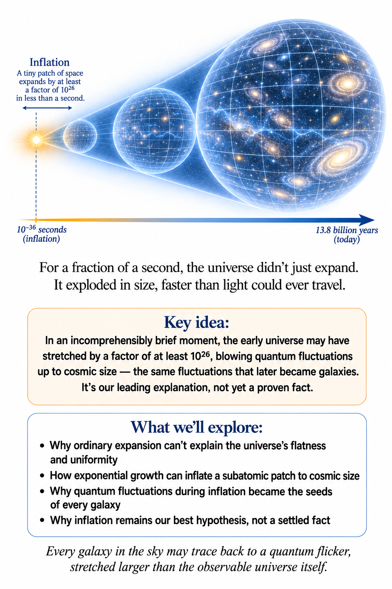

The universe has a problem. Actually, it has several. One of them is so strange that it pushed physicists toward an extraordinary idea: that for a sliver of a second, at the very beginning, the universe expanded not just fast but absurdly fast — fast enough to stretch a region smaller than an atom into something larger than a galaxy.

This idea is called cosmic inflation. If it happened, it may explain why distant patches of sky look almost identical, why the universe is so close to spatially flat, and where the seeds of every galaxy, cluster, and filament in the cosmic web actually came from. It may even tie the largest structures we can see to quantum fluctuations at scales too small to picture.

But inflation isn't just a story about fast expansion. It's a story about what could have driven that expansion, how a quantum jitter became a galaxy, and what happened the moment inflation stopped. Let's start with the puzzle that started it all.

## Why is the universe so smooth?

Where this stands: OBSERVED — the CMB's uniformity is a direct, precisely measured fact.

Look at the cosmic microwave background — the afterglow of the early universe. It's astonishingly uniform. A patch of sky on one side has almost exactly the same temperature as a patch on the opposite side, the difference amounting to roughly one part in a hundred thousand.

That should be impossible. In the simplest Big Bang picture, opposite sides of the sky never had time to talk to each other before that light was released. Nothing — not light, not any other influence — can travel faster than the cosmic speed limit. If two regions are far enough apart, there simply hasn't been enough time for anything to pass between them.

So how did they end up in nearly identical states? This is called the horizon problem, and it's a real clue. Something about the early universe demands an explanation.

## Two cakes, two ovens, one mystery

Picture two ovens on opposite sides of a continent, each baking an identical cake. When you check them, the cakes have almost the same temperature, the same texture, the same moisture, the same shade of golden brown. You'd suspect the ovens had once been connected — or that the cakes had somehow compared notes.

The early universe presents the same puzzle on a cosmic scale. Two enormous regions of the observable universe have nearly identical properties, yet they never seem to have been able to communicate before the moment that matters. Inflation offers a way out.

## The universe may have started small

Imagine that the entire patch that would eventually become our observable universe began as a much smaller region — small enough that its different parts really could interact. Matter and radiation could exchange energy. The whole patch could settle into a common, smooth state.

Then something extraordinary happened: that patch expanded enormously. Regions that had once been close together were driven impossibly far apart, so far that today they sit billions of light-years from one another with no way to have exchanged so much as a photon since. But they still carry nearly identical conditions, because they inherited those conditions before inflation ever stretched them apart.

In this picture, the uniformity of the sky isn't a mystery to be explained away. It's a fossil — a record of a time when the whole observable universe was small enough to agree with itself.

## Inflation is not a balloon

The word “inflation” makes it sound like a balloon being blown up. That's not quite right. Ordinary cosmic expansion is described by a quantity called the scale factor, which tracks how distances between galaxies grow over time. During inflation, that scale factor didn't just grow — it grew exponentially, doubling and doubling again on an absurdly short clock: roughly a(t) ∝ eᴴᵗ — read the symbol ∝ as “grows in proportion to” — where t is time and H sets the pace.

The important word is exponential. Ordinary fast growth adds up. Exponential growth multiplies, and multiplication, given enough repetitions, produces numbers that stop feeling like numbers at all.

Suppose something doubles over and over. After ten doublings, you have 1,024 — a big number, but not an absurd one. After a hundred doublings, you have roughly a 1 followed by thirty zeros: 10³⁰. That's already larger than the number of stars in the observable universe, many times over.

Inflation is essentially that process, applied to space itself. The exact expansion factor depends on the model, but the key point holds across nearly all of them: a patch far smaller than an atom can be stretched into a region vastly larger than the observable universe — and it doesn't need to take long. It only needs to be efficient. Space gets huge, fast.

## What actually caused it?

Where this stands: SPECULATIVE — no inflaton field has ever been detected.

Here the story gets more speculative. The simplest inflationary models invoke a field called the inflaton — something with a value at every point in space, the way the Higgs field or the electromagnetic field does. An inflationary field would carry an energy dense enough, and shaped in just the right way, to drive accelerated expansion on its own.

We should add the warning immediately: nobody has detected an inflaton. Inflation is a framework with a lot of attractive consequences and real observational successes, but the exact physical field behind it — if there ever was a single one — remains unknown.

The mechanism itself isn't mysterious, though. It connects to an idea from an earlier chapter: dark energy. A component with sufficiently negative pressure can push space apart in general relativity, because pressure, like energy density, contributes to gravity. Get the combination right, and the gravitational effect turns effectively repulsive. During inflation, the energy of the inflating field behaves almost exactly like that — vacuum-like, and expansive. So inflation isn't “the universe decided to expand really fast.” There's a mechanism sitting in the equations. The mystery is what field actually supplied it.

## Solving the flatness problem

The universe also looks remarkably close to spatially flat — not curved like the surface of a sphere, not saddle-shaped, just flat. Why should that be true, out of all the geometries the universe could have had?

Think about a curved surface. Zoom in far enough on any small patch, and it starts to look flat — the way the surface of a huge sphere looks flat from where you're standing on it. Inflation does the same thing to space: it stretches any initial curvature so thin that the observable region today looks almost perfectly flat, the way a small bump in a rubber band flattens out as you stretch the band. Curvature doesn't disappear. It just becomes too diluted to notice.

That's two puzzles solved by one mechanism — the horizon problem and the flatness problem, both dissolved by the same burst of exponential expansion. It's an elegant package. But the theory gets far more interesting once you ask the next question.

## Shouldn't inflation smooth out everything?

If inflation stretches every wrinkle flat, shouldn't the universe end up perfectly smooth?

## Then where did the galaxies come from?

Because it isn't smooth. It has galaxies, clusters, voids, filaments — and those tiny temperature ripples in the CMB. Inflation has to do two seemingly contradictory jobs: flatten the universe on the largest scales, and still leave behind the tiny imperfections that grow into everything we see. Quantum mechanics supplies exactly that kind of imperfection.

## Empty space isn't perfectly still

In quantum physics, fields fluctuate. Even a field sitting in its lowest-energy state doesn't have a perfectly fixed value everywhere — there are unavoidable jitters built into the theory. Normally those fluctuations are microscopic: tiny, fleeting, utterly irrelevant on cosmic scales.

Inflation changes the game. Rapid expansion can take a fluctuation that started out smaller than an atom and stretch its wavelength until it's larger than a galaxy — or larger than the observable universe. That sounds absurd. It's also one of the most beautiful ideas in modern cosmology.

## Stretching quantum uncertainty to cosmic size

Picture drawing a tiny wrinkle on a sheet of rubber, then stretching that rubber enormously. The wrinkle stretches too — its wavelength grows right along with the sheet. Inflation does something analogous to a quantum fluctuation in the inflaton field: it stretches the fluctuation's wavelength until it lies outside the cosmic horizon — the greatest distance any influence can cross in the time available. Once the crest and trough of that fluctuation are farther apart than anything can travel between them, neither one can smooth the other out anymore, effectively freezing it into the large-scale geometry.

When inflation ends and the universe settles into more ordinary expansion, those frozen fluctuations re-enter the horizon. They're no longer microscopic curiosities — they're density variations. Gravity gets to work amplifying them. Billions of years later: galaxies.

Follow the whole chain and it's remarkable. A quantum fluctuation occurs. Inflation stretches it into a large-scale variation in energy density. The universe expands and cools. Gravity amplifies the variation. Matter gathers, stars ignite, planets emerge — and eventually someone looks at the cosmic microwave background and notices the pattern. The smallest known physics may have shaped the largest structures we can observe. That isn't poetic license. It's the working idea behind inflationary perturbation theory.

## A very particular pattern

Where this stands: STRONGLY SUPPORTED — the predicted fluctuation spectrum matches CMB observations closely.

Inflation doesn't just predict “some fluctuations.” Many inflationary models predict fluctuations with a specific statistical fingerprint — near scale invariance, meaning roughly similar strength across a huge range of length scales. Observations of the CMB show a spectrum of primordial fluctuations that's close to scale invariant, with a slight, telling deviation from the exact case.

That match is a genuine success for inflationary cosmology. The universe contains just the sort of broad-spectrum ripple pattern that simple inflationary models naturally produce.

## But inflation isn't proven

Where this stands: OPEN QUESTION — influential and well-motivated, but not settled.

This distinction matters. Inflation is enormously influential — it explains several puzzling features elegantly, naturally produces the right kind of primordial fluctuations, and makes predictions broadly consistent with what we observe.

But nobody has directly observed an inflationary field. Nobody watched inflation happen. Nobody has measured a unique signature that rules out every competing explanation — and there are competing ideas, some of which can reproduce parts of the observed early universe without conventional inflation. There are also many different inflationary models, and some are far more plausible than others.

So the honest scientific position is this: inflation is a powerful, well-developed hypothesis, strongly connected to observation — but the complete physical story isn't settled.

## When inflation ends

Inflation can't run forever, at least not in the simplest picture. Eventually the inflating field has to change behavior, and its potential energy converts into ordinary particles and radiation. The universe fills with hot matter. This transition is called reheating, and it marks the start of the hot Big Bang phase in the usual telling.

Notice something subtle: “Big Bang” can refer to that hot, expanding phase rather than the absolute beginning of everything. Inflation may have come before it. The terminology gets confusing because people use “Big Bang” in several related ways — but the physical distinction is clean enough: hot Big Bang cosmology describes the hot, dense, expanding universe; inflation is a proposed earlier phase of accelerated expansion that set the stage for it.

When inflation's energy converts into particles, things get energetic fast. Matter and antimatter form. The universe cools enough for nuclei to assemble, then atoms, then eventually stars. Inflation, in other words, offers a possible bridge between an unknown quantum-gravitational regime and the hot, particle-filled universe we can describe with far more confidence.

## Eternal inflation

Where this stands: SPECULATIVE — no observational evidence for other pocket universes exists.

Here the story turns openly speculative. In some inflationary models, inflation doesn't end everywhere at once. Some regions stop and become ordinary hot Big Bang universes — ours, presumably, among them. Other regions just keep inflating, spinning off an enormous, possibly never-ending background dotted with individual “pocket universes.” This is eternal inflation.

It's fascinating, and it's controversial. It raises hard questions about probability and predictability, and about what it would even mean to test a theory that produces regions permanently beyond anything we could ever observe. Some physicists see it as a natural consequence of certain models; others worry it makes clear, testable predictions hard to pin down.

Eternal inflation leads naturally to talk of a multiverse, with different pocket universes potentially settling into different vacuum states — even different values of the physical constants. It's a genuinely fascinating possibility, and it also sits right at the boundary between physics and speculation. We have direct evidence for an expanding universe, for the CMB, for primordial fluctuations. We do not have direct evidence that other pocket universes exist. The multiverse shouldn't be presented as something astronomers have discovered. We haven't.

It's tempting, whenever an idea like this catches on, to slide from “the theory allows this” to “the theory predicts this.” Some inflationary models produce eternal inflation; others don't. Some predict distinctive gravitational-wave signals; others predict signals too faint to ever detect. A beautiful idea isn't enough on its own — it has to survive contact with observation.

## Inflation leaves fingerprints

Where this stands: OPEN QUESTION — the decisive gravitational-wave signature hasn't been found yet.

One of the most exciting possibilities is that inflation left behind primordial gravitational waves — ripples generated by quantum fluctuations of spacetime itself during that first burst of expansion. A detection would hand physicists extraordinarily direct information about the energy scale of inflation.

One place to look is the polarization pattern of the CMB — the particular direction the CMB's light waves tend to oscillate in, which carries its own information beyond just the light's temperature. Specifically, there's a signature called B-mode polarization, a swirling pattern that a primordial gravitational-wave background would imprint in a characteristic way. So far, no detection of primordial B-modes — the specific signature inflation would leave — has been universally accepted. The similar-looking B-modes produced by gravitational lensing of the CMB have been detected many times over, but that is a separate, already-confirmed effect. There have been intriguing hints of the primordial kind and many careful searches — but the decisive signal remains elusive.

Still, the possibility is extraordinary on its own terms. The CMB may preserve information about quantum fluctuations from when the universe was unimaginably young — fluctuations later stretched by inflation into the seeds of cosmic structure. Measure them precisely enough, and we might learn about physics at energies far beyond anything a terrestrial particle accelerator could ever reach. The early universe becomes a natural high-energy physics laboratory. It just happens to be 13.8 billion years old.

## One last question

Inflation may explain why the universe looks the way it does — why it's so flat, why distant regions match so closely, where the primordial fluctuations came from. What it doesn't necessarily answer is the question underneath all of those: why was there an inflating universe in the first place?

Where did the inflaton come from, and why did its potential energy have exactly the shape needed to drive expansion? Why did inflation begin, and why did it end when it did? Was there some quantum-gravitational state before it — or is “before inflation” simply a meaningless phrase? We don't know. Inflation may be an important chapter in the universe's story. It may not be page one.

Let's step back and look at the whole arc. This book's cosmology began with the cosmic microwave background — a universe that is almost perfectly smooth, carrying tiny irregularities that gravity slowly grew into the cosmic web. Inflation offers a possible origin for those irregularities: quantum fluctuations, stretched to cosmic scale and frozen into the geometry of space itself. If that's right, the universe we see today carries a fossil record of quantum mechanics operating in its very first instants.

That's also where gravity, cosmology, and quantum physics start to overlap uncomfortably. General relativity treats spacetime as a smooth geometric surface. Quantum mechanics insists that nature is fundamentally probabilistic and jittery at small scales. So what happens when spacetime itself becomes a quantum object? That question sits at the edge of what we currently understand.

Before we go there, it's worth taking stock. We started with Newton's apple. We followed gravity into curved spacetime, watched black holes form, detected gravitational waves rippling across billions of light-years, and watched the universe expand. We traced the cosmic microwave background, followed its fluctuations into galaxies and the cosmic web, and met dark matter and dark energy along the way. Now we've considered inflation. Through all of it, one theory has guided us: Einstein's general relativity. It has passed test after test and survived every observational challenge thrown at it.

But it has limits — inside black holes, at the earliest moments of the universe, and anywhere quantum mechanics refuses to stay outside the room. Those limits are a subject for later. First, there is a more immediate consequence of everything in this chapter worth exploring: if space itself can stretch and inflate, what happens to time along with it? Gravity, it turns out, has been quietly rewriting the rules of time all along.

↑ Back to Contents

# Chapter 9: Time in a Gravitational Universe

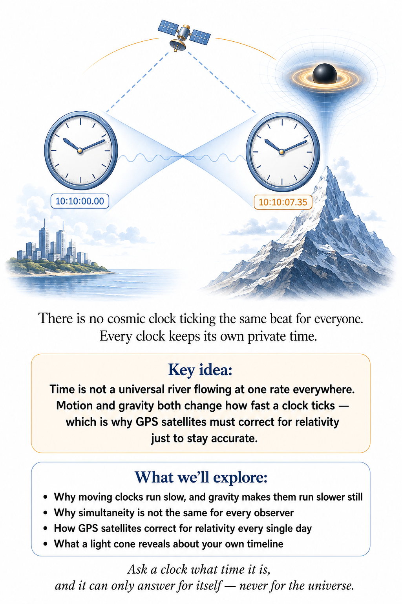

## A clock is not as simple as it looks

Put two atomic clocks side by side on a laboratory bench, then raise one of them by about thirty centimeters, roughly the length of a school ruler. In 2010 physicists at the National Institute of Standards and Technology in Colorado did exactly that, and the raised clock ran faster. The difference was absurdly small, a fraction with sixteen zeros after the decimal point, but it was real, and it was exactly the amount Einstein’s theory predicts.

In Volume 1, we discovered that motion alone can make two clocks disagree. Motion changes how fast a clock ticks. Two identical clocks, sent on different journeys through space, can disagree when they meet again — not because either one is broken, but because elapsed time depends on the path a clock takes through spacetime. That was already strange enough. Gravity is about to make it stranger.

## Gravity gets the same trick

Remember the falling elevator from Chapter 1? Einstein's equivalence principle said that gravity and acceleration can be locally indistinguishable. If acceleration changes how clocks tick — and it does — then gravity must change how clocks tick too.

There is a lovely argument, going back to Einstein, that shows gravity must affect clocks without using any of the mathematics of curved spacetime. Put two people in a long rocket accelerating through empty space, one at the tail and one at the nose. The person at the tail sends a light pulse forward once every second by her clock. Each pulse takes a moment to reach the nose, and during that moment the rocket has picked up a little more speed. So the nose is always running away from the pulses a little faster than it was when the previous pulse was sent. The pulses arrive slightly stretched out, slightly less often than once per second.

The person at the nose concludes that the tail clock runs slow. And nothing about this is an illusion of signaling. If the two later compare clocks side by side, the tail clock really has recorded less time.

Now apply the equivalence principle. A rocket accelerating upward is locally indistinguishable from a tower standing still on Earth. So a clock at the bottom of a tower must run slower than one at the top, by exactly the same amount.

A clock deeper in a gravitational field runs more slowly relative to a clock farther away. This is gravitational time dilation, and we have already met its most familiar consequence: GPS satellites carry clocks that must be corrected for it every day, or your phone would drift off course within hours. That correction is small because Earth's gravity is weak. What happens when gravity stops being weak?

## A clock on a neutron star

Where this stands: OBSERVED — confirmed routinely through precision pulsar timing.

Take a neutron star: roughly the mass of the Sun, compressed into a sphere about twenty kilometers across. Stand a clock on its surface, and the gravitational field is trillions of times stronger than anything a GPS satellite experiences. A clock there runs measurably, unmistakably slower than an identical clock far away — not by nanoseconds, but by something like fifteen to twenty-five percent, slow enough that a wristwatch, if it could survive there, would catch the difference within minutes.

Astronomers actually rely on this. Pulsars — spinning neutron stars that sweep a beam of radiation past us like a lighthouse — are some of the most precise natural clocks in the universe. To use them for navigation or to test gravity itself, physicists have to account for exactly how much the star's own gravity is slowing down the ticking they observe.

## You do not need a black hole to notice

Where this stands: OBSERVED — the 2010 NIST tabletop experiment measured this directly.

Here is the part that should genuinely surprise you: the effect does not require anything exotic at all. In 2010, physicists at NIST — the U.S. National Institute of Standards and Technology — compared two atomic clocks separated by only about a third of a meter in height — one clock sitting slightly higher than the other on a lab bench — and measured the higher clock ticking faster. Not a black hole. Not a neutron star. A shelf.

Scale that up and the implication is almost comical: someone who has spent their life at the top of a mountain has, technically, aged a tiny bit more than a twin who stayed at sea level. Neither twin traveled anywhere. Neither one accelerated to nearly the speed of light. They simply lived at different depths in Earth's gravitational field, and the universe kept separate books on each of them.

Clocks have kept improving. In 2022 a team at JILA in Boulder, Colorado, measured the gravitational shift in the ticking rate across a single cloud of strontium atoms, from the bottom of the cloud to the top, a height of about one millimeter. Gravity's effect on time is no longer something you need a mountain to see. It shows up across the width of a grain of rice.

## A tower at Harvard

Where this stands: OBSERVED — first measured in 1959–60 and confirmed many times since, most precisely by atomic clocks.

The first laboratory test of gravity's effect on time did not use clocks at all. It used light. In 1959 Robert Pound and his student Glen Rebka sent gamma rays from radioactive iron down a 22.5-meter tower inside Harvard's Jefferson Physical Laboratory. Light falling into a gravitational field picks up a little energy, which raises its frequency, a gravitational blueshift. Turn the experiment around and light climbing out loses energy and is redshifted. The predicted shift over 22.5 meters was about 2.5 parts in a thousand trillion.

Measuring something that small required a newly discovered piece of nuclear physics, the Mössbauer effect, which lets certain atoms emit and absorb gamma rays at an extraordinarily sharp frequency. Pound and Rebka used the Doppler shift from a slowly moving source as a calibrated yardstick, and found the shift Einstein's theory required, first to within about ten percent and, a few years later, to within one percent.

This is the same physics as the slow clocks, seen from another angle. Light is itself a clock: every wave crest is a tick. If a clock at the bottom of a tower runs slow, the light it sends up arrives with fewer crests per second than an identical clock at the top produces. Gravitational redshift and gravitational time dilation are one phenomenon wearing two names.

## Clocks that fly

In October 1971 two physicists, Joseph Hafele and Richard Keating, bought airline tickets for themselves and four cesium atomic clocks, and flew around the world twice, once eastward and once westward. On their return, the clocks were compared with identical clocks that had stayed at the U.S. Naval Observatory in Washington.

Two effects were in play. Height made the flying clocks run faster, as gravity predicts. Speed made them run slower, as special relativity predicts, and because Earth itself rotates eastward, the eastbound clocks were moving faster through space than the ground clocks, and the westbound ones slower. The eastbound clocks came back about 59 billionths of a second behind; the westbound clocks came back about 273 billionths of a second ahead. Both results matched the predictions within the experimental uncertainty. In 1976 a NASA rocket, Gravity Probe A, carried a hydrogen-maser clock 10,000 kilometers up and confirmed the gravitational part alone to better than one part in ten thousand.

## How much slower, exactly?

Near Earth's surface, the rule is pleasingly simple. Raise a clock by a height h and it runs faster by a fraction

Δτ/τ ≈ gh/c²

where g is the acceleration of gravity, about 9.8 meters per second per second. One meter of height speeds a clock up by about one part in ten million billion (10¹⁶), roughly ten trillionths of a second per day.

Those numbers sound impossibly small, so make them personal. Someone who spends eighty years living in Denver, about 1,600 meters above sea level, ages roughly four ten-thousandths of a second more than a twin who spends the same eighty years in Miami. You will not notice. Your clocks will.

Far from Earth, or near something much denser, the full formula takes over. A clock hovering at distance r from a mass M ticks at a rate, compared with a clock far away, of

√(1 − 2GM/rc²)

When the quantity 2GM/rc² is tiny, as it is everywhere in the solar system, this reduces to the simple rule above. As r shrinks toward 2GM/c², the factor under the square root falls toward zero. That special distance will turn out to be the edge of a black hole.

## The clock that never quite arrives

Now push the thought experiment to its limit: a black hole. Imagine watching a clock — or an astronaut, or a spacecraft — fall toward the event horizon. From your safe distance, something very strange happens. The clock appears to tick slower and slower the closer it gets. Its light becomes redder and redder, dimmer and dimmer. From the outside, the infalling object never quite seems to finish crossing the horizon. It appears to freeze there, fading out, forever approaching but never arriving.

That is what you would see. It is not what the astronaut experiences. From their own point of view, falling in feels unremarkable — their clock ticks normally, and they cross the horizon in finite time, feeling nothing special at the moment of crossing (tidal forces aside). The “freezing” is entirely a feature of how light struggles to climb back out of a gravitational well that keeps getting steeper. Two observers, two completely different stories, and general relativity says both are correct — for the clock each one is actually reading.

## Light takes the long way

Where this stands: OBSERVED — measured with planetary radar in the 1960s and 1970s, and by the Cassini spacecraft in 2002 to within a few thousandths of a percent.

In 1964 the radio astronomer Irwin Shapiro pointed out that general relativity predicts a fourth classic effect, alongside Mercury's orbit, light bending, and gravitational redshift. A signal that passes close to the Sun should take longer to make a round trip than it would if the Sun were not there. Partly the path is bent, but mostly the signal passes through a region where time itself runs slow and space is slightly stretched.

His team bounced radar signals off Mercury and Venus when those planets were on the far side of the Sun, and timed the echoes. Near the Sun, the delay amounted to about two hundred millionths of a second, out of a round trip lasting tens of minutes, and it came out just as predicted. In 2002, radio signals to and from the Cassini spacecraft on its way to Saturn, grazing past the Sun, confirmed the same effect with spectacular precision. The Sun's gravity makes the solar system slightly “bigger” on the inside than a flat map would suggest.

## Different clocks, different histories

This is the deepest lesson of a gravitational universe: there is no single, universal “now.” Nature is not asking, “What time is it, really?” It is asking, “How much time elapsed along this particular path, through this particular geometry?” A clock at sea level, a clock on a mountain, a clock orbiting a neutron star, and a clock falling toward a black hole are not four readings of one shared clock running at different speeds. They are four different histories through spacetime, each perfectly consistent on its own terms.

## Why an apple falls: the longest time

Here is the most surprising idea in this chapter, and perhaps the most beautiful in the whole theory. It explains not just why clocks behave strangely near Earth, but why things fall at all.

In special relativity there is a rule for free motion: between two events, a freely moving clock takes the path along which it records the most time. Any detour, any acceleration, shortens the elapsed time; that is the lesson of the traveling twin in Volume 1. General relativity keeps the same rule in curved spacetime. Free fall is the path of maximal aging.

Now toss a ball straight up so it lands back in your hand two seconds later. It has to leave your hand and return to it at fixed moments. What path gives its internal clock the longest time? Two effects compete. Rising higher puts the ball where clocks run faster, which adds time. But rising higher means moving faster to get there and back in the same two seconds, and speed subtracts time. The best compromise turns out to be exactly the path Newton would predict, rising about five meters and falling back.

Think about what that means. Near Earth, the falling of objects is almost entirely due to the warping of time, not of space. Space near Earth is curved too, but for slowly moving objects that curvature barely matters. The apple falls, at bottom, because time runs a little slower closer to the ground, and the apple's own clock prefers the path that ages it most.

## The light cone

Relativity gives us one more essential tool for thinking about time: the light cone. From any event, light can travel outward in every direction, tracing out a boundary — and if you plot space running sideways and time running upward, that ever-widening flash of light sweeps out the shape of a cone, hence the name. Everything inside that boundary can, in principle, be influenced by the event. Everything outside it cannot — not without traveling faster than light, which nothing does.

Near ordinary matter, light cones look the way you would expect. Near a black hole, they tilt more and more the closer you get, though escape is still possible anywhere outside the horizon. Cross the horizon, and every future light cone points inward, toward the singularity — the point where general relativity's own equations predict curvature without limit and stop giving sensible answers — which is why nothing, not even light, can find a path back out from there. The light cone is not just a diagram. It is the shape of cause and effect itself, and gravity can bend that shape.

## A new picture of reality

We began this chapter with a clock that seemed to be telling us something absolute. It was not. It was telling us how much time had elapsed along its own particular path through spacetime — a path shaped, this time, by gravity rather than by speed alone. There is no cosmic master clock ticking the same beat for a wristwatch, a GPS satellite, a pulsar, and an object falling into a black hole.

That is a strange universe. It is also the one our experiments keep confirming. And it raises an uncomfortable question we have been circling since Chapter 1 without quite landing on it: if gravity is geometry, and geometry can be extreme enough to trap light and stretch time toward infinity, what happens where that geometry becomes so extreme that it swallows light completely, and where even the equations of general relativity start to predict their own failure? To answer that, we have to look properly at the objects where gravity finally wins.

↑ Back to Contents

# Chapter 10: Black Holes — Where Gravity Wins

## A star runs out of arguments

Every star is a standoff. Gravity pulls every part of it toward the center. Pressure pushes back. In the Sun, the pressure comes from hot gas, kept hot by nuclear fusion in the core, and the two sides have been evenly matched for four and a half billion years. A star is stable for exactly as long as it can keep making that argument.

Eventually the fuel runs out. When it does, gravity gets to make its case again, and the story of what happens next is a story of the universe running out of ways to push back.

The first fallback is quantum mechanics. Squeeze electrons close enough together and they resist being packed any tighter, not because they repel one another electrically, but because no two of them may occupy the same quantum state. That resistance, called degeneracy pressure, holds up a white dwarf: a stellar ember with roughly the mass of the Sun packed into a ball the size of Earth. A teaspoon of it would weigh several tons.

In 1930, a nineteen-year-old Subrahmanyan Chandrasekhar, on a ship from India to England to begin graduate study, worked out that this defense has a limit. Above about 1.4 solar masses, the electrons are pushed to nearly the speed of light, and their pressure can no longer keep up with gravity. The core keeps collapsing. Electrons are squeezed into protons, making neutrons, and the collapse halts again only when the neutrons themselves are packed shoulder to shoulder. The result is a neutron star: more mass than the Sun in a city-sized sphere about twenty kilometers across.

Neutrons have a limit too. Its exact value depends on nuclear physics we do not fully understand, but it lies somewhere around two to two and a half solar masses. And here general relativity adds a cruel twist, the one we met with the ball of coffee grounds in Chapter 1. In Einstein's theory, pressure itself gravitates. The harder a collapsing core pushes back, the more its own pressure adds to the gravity it is trying to resist. Above the limit, there is no known force, no known pressure, nothing in physics as we know it that can stop the collapse.

So nothing does.

## The collapse nobody wanted

The mathematics for the end point arrived long before anyone believed it. In 1916, within weeks of Einstein publishing his field equation, the German astronomer Karl Schwarzschild, then serving in the army on the Russian front, found its exact solution for the spacetime outside a single round mass. Hidden in that solution was a strange sphere at a radius of 2GM/c², where the equations seemed to misbehave. Schwarzschild died of an illness a few months later. For decades, most physicists, Einstein among them, assumed that no real object could ever be squeezed inside its own Schwarzschild radius.

In 1939 J. Robert Oppenheimer and his student Hartland Snyder followed an idealized collapsing star all the way down. Their result is still startling. To a distant observer, the star's surface seems to slow as it approaches the critical radius, its light growing redder and dimmer until it effectively freezes and fades from view. To someone riding on the surface, nothing of the sort happens: the star passes through the critical radius in a finite and brief time and keeps collapsing. Both descriptions are correct; they are the two clocks from Chapter 9, read by different observers.

The paper was largely ignored, partly because World War II swallowed its authors' attention. Not until the 1960s, when astronomers began discovering quasars and pulsars and physicists returned to the problem with new mathematical tools, did the idea become respectable. In 1967 John Wheeler popularized the name that stuck: black hole.

## The simplest black hole, measured

The edge of a black hole is its event horizon, at the Schwarzschild radius:

Rs = 2GM/c²

For a black hole with the mass of the Sun, that is about three kilometers. For one with the mass of Earth, about nine millimeters, roughly the size of a marble. The radius grows in direct proportion to the mass, and that simple fact leads to a surprise. Volume grows as the cube of the radius, so the average density inside the horizon falls as the mass goes up. A black hole of around a hundred million suns, not unusual in the center of a large galaxy, has an average “density” inside its horizon roughly that of water.

That number is mostly a curiosity; the inside of a black hole is not a container full of evenly spread matter. But it carries a real lesson. Black holes are not defined by being dense. They are defined by geometry. Pile up enough of anything, even something as thin as water, and it will eventually hide itself behind its own horizon.

Outside the horizon there are other landmarks. At one and a half times the Schwarzschild radius is the photon sphere, where gravity bends light so strongly that a beam fired sideways can circle the black hole. Look outward from there and, in principle, you could see the back of your own head. At three times the Schwarzschild radius, for a non-spinning black hole, is the innermost stable circular orbit. Gas swirling around a black hole can orbit safely outside it. Inside it, there are no stable orbits at all, and gas spirals in.

That spiral is one of the most powerful engines in nature. Gas grinding its way inward through a disk around a black hole heats up enormously and can radiate away around six percent of its rest-mass energy before it crosses that last stable orbit, and far more if the black hole spins. Nuclear fusion, by comparison, releases less than one percent. This is how quasars, powered by supermassive black holes, can outshine the hundreds of billions of stars in their host galaxies.

## What falling in actually feels like

Imagine stepping off a spaceship and falling feet first toward a black hole. You are in free fall, so, as the elevator taught us in Chapter 1, you feel weightless. What you do feel is the tide.

Your feet are closer to the black hole than your head, so they are pulled harder. The stretch along your body and the squeeze across it is the same pattern as the falling apples, scaled up to murderous strength. Physicists call the result, with a straight face, spaghettification.

How bad it gets depends on the black hole's size, in a way that is the opposite of what most people expect. The tidal stretch at the horizon gets weaker as the black hole gets bigger, falling off as the square of the mass. At the horizon of a black hole of ten solar masses, the difference in pull between your head and your feet would be about twenty million times Earth's gravity. You would be torn apart long before reaching the horizon. At the horizon of Sagittarius A*, the four-million-solar-mass black hole at the center of the Milky Way, the same difference would be about a ten-thousandth of Earth's gravity. You would cross it without noticing anything at all.

That is the strangest feature of the event horizon. It is not a wall, not a membrane, not a place where anything locally happens. It is a point of no return defined by where light can and cannot go in the future, and a falling traveler carries no instrument that can sense it in the moment of crossing.

## Inside, the future points one way

Once inside, the geometry does something that has no parallel in ordinary experience. Outside the horizon, the radial direction is an ordinary direction in space: you can move inward or, with a strong enough rocket, outward. Inside, the light cones from Chapter 9 have tipped so far that every future direction points toward smaller radius. Moving inward is no longer a choice. It is the direction of time.

This is why rockets cannot help. Asking how to avoid the center of a black hole is like asking how to avoid next Tuesday. The singularity is not a place in front of you that you might steer around. It is a moment in your future.

There is even a best strategy, and it comes from the principle of maximal aging. Free fall is the path that records the most time on your own clock, so firing rockets in any direction only shortens what is left of your life. For a ten-solar-mass black hole, the longest possible time between crossing the horizon and reaching the center is about a ten-thousandth of a second. For Sagittarius A*, it is about a minute. For the six-and-a-half-billion-solar-mass black hole in the galaxy M87, it is more than a day. It is the most expensive way to buy time in the universe.

## Black holes spin

Real stars rotate, and when they collapse their rotation is concentrated, the way a figure skater spins faster by pulling in her arms. So real black holes should spin, and many spin rapidly. The exact spacetime around a rotating black hole was found in 1963 by the New Zealand mathematician Roy Kerr, nearly half a century after Schwarzschild's.

A spinning black hole drags spacetime around with it. Near the horizon, in a region called the ergosphere, the dragging is so strong that nothing can stay still relative to the distant stars; even light is swept along in the direction of rotation. Roger Penrose showed in 1969 that this region acts like a flywheel from which energy can, in principle, be extracted, slowing the black hole's spin. Up to about 29 percent of a maximally spinning black hole's mass-energy is stored in its rotation.

Frame dragging is not confined to black holes. Every rotating mass does it, very weakly. In 2011 the Gravity Probe B satellite, carrying four of the roundest objects ever manufactured as gyroscopes, reported that Earth's rotation twists the orientation of an orbiting gyroscope by about 0.04 arcseconds per year, in agreement with general relativity. That is the angle subtended by a human hair seen from about half a kilometer away, accumulated over a year.

Fast spin also deepens the time-warping. Near the horizon of a rapidly spinning, very massive black hole, stable orbits exist far closer in than for a non-spinning one, deep in the region where clocks run dramatically slow. The physicist Kip Thorne used exactly this geometry when he advised on the film Interstellar, in which an hour on a planet orbiting a giant spinning black hole corresponds to seven years far away. The extremes in the film are pushed hard, but the principle is straight out of Kerr's solution.

## Three numbers and nothing else

A star is enormously complicated: layers, magnetic fields, chemistry, spots, flares. Collapse it into a black hole and nearly all of that vanishes from the outside view. Once a black hole settles down, general relativity says it is completely described by just three numbers: its mass, its spin, and its electric charge, which for real black holes is essentially zero.

Wheeler summarized this as “a black hole has no hair.” Two black holes with the same mass and spin are, from the outside, identical, whether one was made from a dying star and the other from a collapsing cloud of something else entirely. The mathematical proof that settled black holes must be of the Kerr type, developed in the late 1960s and 1970s by Werner Israel, Brandon Carter, David Robinson, Stephen Hawking, and others, is one of the great achievements of the field. It is also the reason the ringdown of a newly merged black hole, described in Chapter 2, is such a clean test of the theory: a bell with only two adjustable properties can play only one family of tunes.

Where did all that hair go? Some of it was radiated away as gravitational waves while the black hole was settling. Some fell inside. Where the information it carried ends up is a far harder question, and one we will return to in Chapter 12.

## How we know they are real

Where this stands: OBSERVED — black holes have been detected through X-ray binaries, stellar orbits, gravitational waves, and direct imaging.

For a long time black holes were a mathematical prediction with suggestive evidence. Today the evidence comes from at least four independent directions.

In 1964 a rocket-borne X-ray detector discovered a bright source in the constellation Cygnus. Cygnus X-1 turned out to be a massive star in orbit with an unseen companion of about twenty solar masses, far too heavy to be a neutron star, pulling gas off its partner and heating it to X-ray temperatures.

At the center of our galaxy, two teams led by Reinhard Genzel and Andrea Ghez spent decades tracking individual stars as they orbit an invisible point. One star, called S2, completes an orbit every sixteen years and at closest approach passes within about 120 times the Earth–Sun distance of the center, moving at nearly 8,000 kilometers per second. Only a mass of about four million suns, packed into a region smaller than our solar system, can explain those orbits. In 2018 the light from S2 was even seen to be gravitationally redshifted as it swung close, exactly as predicted. Genzel and Ghez shared the 2020 Nobel Prize in Physics with Roger Penrose, whose work on singularities is the subject of the next chapter.

Gravitational-wave detectors, as we saw in Chapter 2, have now recorded the mergers of many pairs of black holes, with signals that match Einstein's equations from the inspiral through the ringdown.

And in 2019 the Event Horizon Telescope, a network of radio dishes spanning the planet and acting as a single Earth-sized telescope, released the first image of a black hole's shadow: a dark disk, ringed by glowing gas, at the center of the galaxy M87. Its size matched the prediction for a black hole of six and a half billion solar masses. In 2022 the same collaboration released an image of Sagittarius A*. Neither image shows the horizon itself, which by definition sends out no light. What they show is the dark silhouette that gravity carves out of the light around it, roughly two and a half times the size of the horizon, because the photon sphere bends so much light away.

## Small, large, and a puzzle in between

Where this stands: OPEN QUESTION — that supermassive black holes exist is observed; how they grew so large so early is not settled.

Black holes come in at least two very different families. Stellar-mass black holes, from a few to perhaps a hundred times the mass of the Sun, are the corpses of massive stars. Supermassive black holes, from about a million to tens of billions of solar masses, sit at the centers of nearly all large galaxies, including our own.

Between them is a puzzling gap. Intermediate-mass black holes, of hundreds to hundreds of thousands of suns, should exist if big black holes grow from small ones, yet they have been frustratingly hard to find. One clear example arrived in 2019, when LIGO and Virgo recorded a merger, GW190521, that left behind a black hole of about 140 solar masses. Others are suspected in dense star clusters, but the population as a whole remains elusive.

The bigger puzzle is timing. Quasars powered by black holes of a billion suns are seen as they were less than a billion years after the Big Bang, and the James Webb Space Telescope has found actively growing black holes even earlier. Growing that large that fast is hard if every black hole starts as the remnant of a single star and feeds at the usual rate. Perhaps some began much heavier, born from the direct collapse of enormous gas clouds in the young universe. Perhaps they fed in brief, ferocious bursts. Nobody yet knows, and the answer is being written in the infrared light now arriving at Webb's mirrors.

## Laws that look suspiciously familiar

In the early 1970s, physicists working out the general properties of black holes kept stumbling on something uncanny. In 1971 Stephen Hawking proved that, in classical general relativity, the total area of black-hole horizons can never decrease. Black holes can grow, merge, and swallow, but the combined horizon area always goes up or stays the same. Merge two black holes and the final horizon is larger than the two original horizons put together, even though some of the mass has been radiated away as gravitational waves.

Anyone who has studied thermodynamics will recognize the shape of that rule. There is only one other quantity in physics that never decreases: entropy, the measure of disorder that gives time its arrow. In 1972 Jacob Bekenstein, then a graduate student working with Wheeler, made the bold suggestion that the resemblance was no coincidence. A black hole's horizon area, he argued, is its entropy. If it were not, you could cheat the second law of thermodynamics by throwing a box of hot gas into a black hole and watching its entropy disappear from the universe.

In 1973 James Bardeen, Brandon Carter, and Hawking set out four laws of black hole mechanics that parallel the four laws of thermodynamics term for term. Mass plays the role of energy. Horizon area plays the role of entropy. And a quantity called surface gravity, roughly the strength of gravity at the horizon as measured from far away, plays the role of temperature, constant across the horizon of a settled black hole just as temperature is uniform in a system at equilibrium. The textbook General Relativity by Robert Wald gives the theorems their rigorous form, and they remain among the most elegant results in the subject.

At first the parallel looked like a mathematical coincidence. Anything with a temperature must glow, and black holes, by definition, emit nothing. Hawking himself set out to show that Bekenstein was wrong. In the process he discovered, to his own astonishment, that the analogy was no analogy at all. That discovery needs quantum mechanics, and it waits for us in Chapter 12.

In 2021 a team analyzing the very first gravitational-wave event, GW150914, tested Hawking's area theorem directly. They measured the horizon areas of the two black holes before the merger and of the single black hole afterward. The area went up, as the theorem demands, even though the total mass went down.

## The question at the center

Step back and look at what we have. A black hole is a region of spacetime from which the future offers no exit. It can be weighed, spun, photographed in silhouette, and heard as it merges. Its outside is described with extraordinary precision by a solution to Einstein's equations, and that description has passed every test we have thrown at it.

Its inside is another matter. Follow any infalling path to the end and general relativity predicts that the curvature grows without limit, and the path itself simply stops. Is that a real feature of nature, or a sign that we used the theory somewhere it was never meant to go? For a long time physicists hoped it was an artifact of idealized, perfectly symmetrical calculations, and that real, messy collapse would avoid it. In 1965 a young mathematician named Roger Penrose proved that the hope was mistaken.

↑ Back to Contents

# Chapter 11: The Edges of Spacetime — Singularities, Horizons, and the Limits of Prediction

## A theory that predicts its own failure

Most theories fail quietly. Newton's mechanics never warned anyone that it would go wrong near the speed of light; it simply gave slightly wrong answers until experiments got good enough to notice. General relativity is different. Followed carefully, it points to places where its own description of spacetime comes to an end, and it says so in advance. It is a map that has drawn its own edges and written, in its own handwriting, here be dragons.

This chapter is about those edges. It is the most abstract chapter in the book, and also, in a way, the most honest. It is where physicists learned to ask not just what spacetime does, but what it means for spacetime to stop.

## The singularity that was not

Where this stands: ESTABLISHED — the mathematics is settled; the horizon is a real boundary but not a place where anything breaks.

The first lesson is that not every alarming infinity is real. In Schwarzschild's original description of a black hole, some of the numbers blew up at the horizon. For decades, many physicists took that as evidence that something physically catastrophic happened there, or that real objects could never reach it.

It took a surprisingly long time, from Georges Lemaître in 1933 to David Finkelstein in 1958 and Martin Kruskal and George Szekeres in 1960, to show convincingly that the trouble was in the bookkeeping, not in nature. Schwarzschild's coordinates, the grid of labels used to name points in spacetime, simply go bad at the horizon. The same thing happens on an ordinary globe. At the North Pole, every line of longitude meets, and the longitude of the pole itself is undefined. A navigator standing there is not in danger. The map is.

Relabel spacetime with better coordinates and the horizon turns out to be perfectly smooth. A falling traveler, as Chapter 10 described, sails through it without incident. That is one reason physicists distrust infinities that appear in a single description. The question is always whether the infinity belongs to nature or to the labels.

## What makes a singularity real

So how do you tell the difference? A coordinate problem can be fixed by changing coordinates. Curvature that physically blows up cannot. The tidal stretching at the center of a black hole grows without any limit, and no relabeling makes it go away. Something measured by a falling observer's own body becomes infinite there.

But physicists found an even sharper definition, and it is the one that appears in rigorous treatments like Wald's General Relativity. A spacetime is singular if some freely falling path, a geodesic, comes to an end after a finite amount of time on the traveler's own clock and cannot be continued. The traveler's worldline does not hit a wall. It simply runs out. There is no “after” to fall into.

That definition is wonderfully clean because it does not depend on any choice of labels. It only asks a question that a traveler could, in principle, answer: does my clock keep ticking forever, or does my history just stop?

## The hope that symmetry was to blame

For years after Oppenheimer and Snyder, there was a respectable escape route. Their collapsing star was perfectly round, perfectly smooth, perfectly symmetric. Real stars are lumpy, spinning, turbulent things. Perhaps, in a real collapse, the infalling matter would miss the exact center, swirl past itself, and bounce back out. The singularity might be an artifact of an unrealistically tidy calculation, the way a perfectly aimed set of billiard balls might all meet at one point while real ones never would.

Some careful researchers argued exactly this through the early 1960s. It was a reasonable hope. It turned out to be wrong.

## Penrose's trapped surface

Where this stands: ESTABLISHED — a mathematical theorem, given its assumptions; Penrose shared the 2020 Nobel Prize in Physics for it.

In 1965 Roger Penrose found a way to prove something about collapse without solving the equations at all. His key idea was a new kind of object, the trapped surface.

Imagine a sphere in space, and imagine it giving off a flash of light from every point at once. Part of the flash heads outward, forming a growing shell. Part of it heads inward, forming a shrinking shell. That is what happens anywhere ordinary.

Now imagine a sphere deep enough inside a collapsing star, or inside a black hole, that even the outward-going flash is dragged inward. Both shells shrink. Even light aimed directly away from the center ends up, in total, losing ground. That is a trapped surface. Once one exists, gravity has, in a precise sense, won the argument locally.

Penrose then proved a theorem. If a trapped surface forms, and if gravity is attractive, meaning matter carries positive energy the way all ordinary matter does, and if spacetime is reasonable in a few other technical ways, then at least one freely falling path inside must come to an end. A singularity becomes inevitable. No perfect symmetry is needed. Lumps, spin, and turbulence do not help. Trapped surfaces are robust: nudge a collapse a little and they still form. So the singularity is not an accident of tidy calculation. It is what general relativity predicts for real collapse.

The engine behind the proof is something you have already met. Gravity focuses. A bundle of light rays passing through matter is squeezed together, like light through a magnifying glass, and in general relativity positive energy can only ever focus, never defocus. The Indian physicist Amal Kumar Raychaudhuri wrote down the equation for this focusing in 1955, and it is the same fact we saw with the ball of coffee grounds in Chapter 1: matter makes free-falling bundles shrink. Once the bundle is trapped, the focusing runs to completion, and something has to give.

## The beginning of time, run in reverse

Stephen Hawking, then a graduate student at Cambridge, realized that Penrose's argument could be turned around. A collapsing star, run backward in time, looks like an expanding universe. Our universe is expanding. Run it backward, as in Chapter 7, and its matter is squeezed together everywhere at once, with all of space focusing toward the past.

In 1970 Hawking and Penrose published a general theorem covering both cases. Given the assumptions of classical general relativity and ordinary matter, our universe must contain a singularity in its past: past-directed histories that cannot be extended indefinitely. In classical general relativity, the Big Bang is not an optional extra. It is where the equations insist that our history begins.

The key word is classical. The theorems assume that gravity is always attractive and that matter always behaves like ordinary matter. Nature does not obey those rules perfectly. Quantum fields can, in small regions and for short times, carry negative energy. And the field thought to have driven the inflation of Chapter 8 made gravity push rather than pull, breaking one of the Hawking–Penrose assumptions outright. That does not make the conclusion vanish. Later theorems showed that even an inflating universe, under fairly general conditions, cannot have been inflating forever into the past. But it does mean that the singularity theorems tell us where general relativity runs out, not what lies on the other side.

## Is nature modest? The censorship question

Where this stands: OPEN QUESTION — widely believed, supported by much evidence, and still unproven in general.

A singularity hidden inside a black hole is unsettling but contained. Whatever happens there cannot reach the rest of the universe; the horizon keeps it out of sight. A singularity that was not hidden, a so-called naked singularity, would be far worse. Physics works by predicting the future from the present. A visible singularity would be a place where the equations stop and new, unpredictable information could leak into the universe at random. The future would no longer follow from the past.

In 1969 Penrose proposed that nature forbids this. His cosmic censorship conjecture says that the singularities formed in realistic collapse are always clothed by horizons. It has been tested in enormous numbers of computer simulations and has survived almost all of them. The exceptions are revealing. In 1993 Matthew Choptuik found that collapses tuned with impossible precision, exactly on the knife-edge between forming a black hole and dispersing, can produce a naked singularity. Stephen Hawking had bet the physicists Kip Thorne and John Preskill that naked singularities could not form at all; he conceded on that technicality, with a cheeky T-shirt as part of the payment.

Most physicists still believe a generic version of censorship holds: anything you could actually build, or nature could actually do, keeps its singularities clothed. But nobody has proved it, and it remains one of the central open problems in mathematical relativity.

## Can the future be calculated?

Behind the worry about naked singularities is a deeper question: is general relativity a theory that predicts at all? In Newton's physics the answer is obvious. Give the positions and velocities of every particle now, and the laws determine everything afterward. But in general relativity the stage is part of the play. What does it even mean to give the “present” of spacetime itself?

The answer, worked out by the French mathematician Yvonne Choquet-Bruhat in 1952, is that you can treat Einstein's equation as a machine for evolving geometry forward in time. Take a single three-dimensional slice of space at one moment, and specify both its shape and how its shape is changing. Feed that into the equations and they determine, uniquely, the spacetime that grows from it.

There is a catch, and it is a beautiful one. You cannot choose the starting slice freely. Some of Einstein's equations are constraints, conditions the initial snapshot must already satisfy, much as the electric field around a charge must already obey Gauss's law before you ask how it changes. A universe cannot begin with its geometry and its matter disagreeing with each other.

Spacetimes in which this procedure works for all of history, where one slice determines everything, are called globally hyperbolic, and the slice is called a Cauchy surface. Cosmic censorship is, at bottom, the hope that the real universe stays like this: that general relativity remains a theory in which the present determines the future.

This is not just philosophy. It is the foundation of numerical relativity, the art of simulating spacetime on computers. For decades, attempts to simulate two black holes merging kept crashing. In 2005 Frans Pretorius, followed within months by two other groups, finally made the simulations run stably. Those simulations produced the predicted waveforms that LIGO compared against GW150914 a decade later. The chirp in Chapter 2 was recognized partly because computers had already learned to grow spacetime from a slice.

## Drawing infinity on a napkin

Spacetime goes on forever in every direction, which makes it hard to draw. Penrose found a trick. Squeeze the whole of an infinite spacetime into a finite diagram, the way a map of the world can fit the entire globe onto a page, but choose the squeeze so that light rays always travel at 45 degrees. Distances get wildly distorted, but cause and effect are drawn faithfully. You can see at a glance which events can influence which.

In such a Penrose diagram, empty flat spacetime becomes a diamond. Its left and right corners are the far edges of space; its top corner is the infinite future, and its bottom corner the infinite past. A black hole appears as a region in the upper part of the diagram, bounded by a 45-degree line, the horizon, and capped at the top by a horizontal line, the singularity. In the diagram the singularity runs sideways, like a moment in time, not upright like a place in space. It is the picture of what Chapter 10 put into words: the center of a black hole is not somewhere you go; it is somewhen you arrive.

Draw the idealized, eternal Schwarzschild black hole in full and the diagram doubles: a second exterior region appears, along with a white hole in the past. That is the mathematical structure behind the Einstein–Rosen bridge, and it is where Chapter 13 picks up the story of wormholes. A real black hole, formed by collapse, has only one exterior and no white hole; the collapsing star covers up the rest of the diagram.

## Horizons are a matter of perspective

An event horizon is defined in a strange way. It is not marked by anything local, no extra curvature, no surface. It is the boundary of the region from which signals can never reach the distant universe, ever. That means the location of a horizon depends on the entire future.

Wald's textbook draws out a startling consequence. Imagine an enormous shell of matter, far away, collapsing inward toward you. Long before it arrives, and while the space around you is still perfectly empty and flat, you may already be inside the event horizon that the collapse will eventually create. Nothing you measure locally tells you so. Only the future knows.

Horizons need not involve black holes at all. A rocket that accelerates at a steady 1 g, forever, has a horizon trailing about one light-year behind it. Light emitted from beyond that boundary can never catch up, no matter how long the rocket waits. And our accelerating universe has a horizon of its own. Because dark energy keeps speeding up the expansion, galaxies currently more than about sixteen billion light-years away will never receive a signal we send today. We can still see some of them, by light they emitted long ago. But we have lost, permanently, the ability to say hello.

## Time machines, and nature's objections

There is one more edge worth noting. Some solutions of Einstein's equations contain closed timelike curves: paths along which a traveler, never exceeding the speed of light locally, returns to her own past. In 1949 the logician Kurt Gödel found a whole rotating universe made of them, as a birthday present for his friend Einstein. Similar loops appear deep inside the idealized Kerr solution and in certain wormhole constructions.

None of these appears to describe our universe. In 1992 Hawking proposed a chronology protection conjecture: that the laws of physics, probably through quantum effects, always prevent time machines from forming. Like cosmic censorship, it is a statement of faith that nature keeps its causal structure in order, supported by calculation but not yet proved. Chapter 13 returns to how wormholes test it.

## Where the map runs out

Gather the pieces. General relativity predicts that collapse produces singularities, robustly and generically. It predicts that our universe began at one, if traced back with classical physics alone. It suggests, but cannot prove, that nature hides those singularities behind horizons, keeping the rest of the universe predictable. And its own theorems point to the reason the story is incomplete: they rely on matter behaving classically, and matter does not.

The singularities, in other words, are not where the universe breaks. They are where general relativity stops being trustworthy and something else must take over. Every serious physicist expects that something to be a quantum theory of gravity. The places the singularity theorems point to, the hearts of black holes and the first instant of cosmic history, are exactly where the next chapter goes.

↑ Back to Contents

# Chapter 12: Quantum Gravity — Where Our Theories Collide

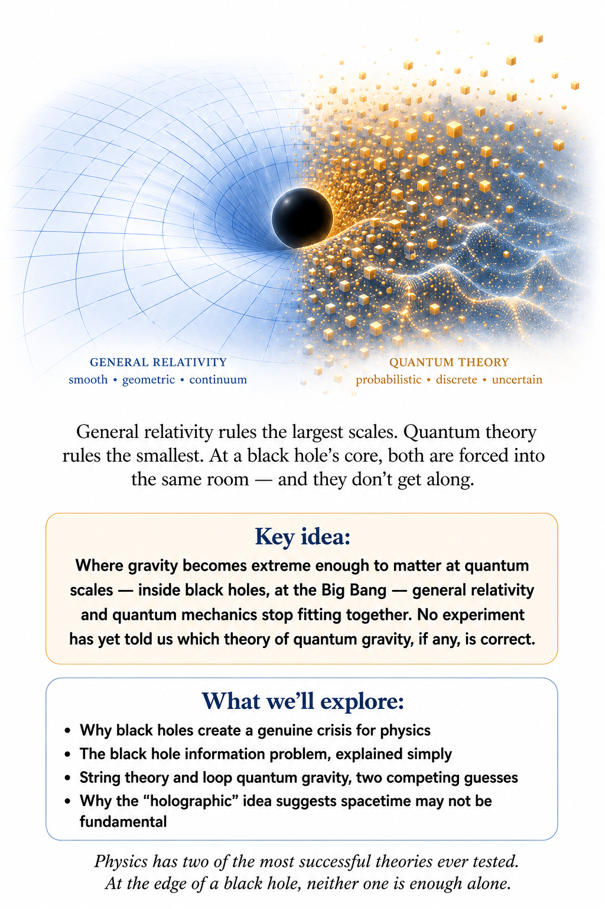

## Two Great Theories, One Universe

We have reached one of the great unfinished stories in physics. General relativity gives us our best description of gravity, spacetime, black holes, and the large-scale universe. Quantum field theory — the quantum picture in which every particle is a ripple in an underlying field and every outcome is a matter of probability — gives us our best description of particles and the other fundamental interactions. Both theories are spectacularly successful. Every experiment we have ever devised to test either one, separately, has come back agreeing with the theory to a remarkable number of decimal places.

And yet they do not fit together completely. The universe, annoyingly, insists on using both.

## The problem in one picture

Imagine describing a city with two maps. One map is extraordinarily good for roads and buildings. The other is extraordinarily good for underground pipes and electrical cables. Most of the time, you can use whichever map you need, and you would never think to ask a plumbing engineer to settle an argument about traffic patterns.

But eventually you find a place where the two systems interact so strongly that you need one map containing both — a construction site where a new subway tunnel has to thread between existing gas lines and building foundations, say. That is roughly where physics stands with gravity and quantum mechanics. Most of the universe, most of the time, only ever needs one map or the other. We need a theory that can describe spacetime itself when quantum effects become important, and right now we do not fully have one.

## Why ordinary quantum theory is not enough

Quantum field theory normally assumes a spacetime background on which the fields live — a fixed stage, with quantum actors moving across it. General relativity says that spacetime is not a fixed background at all. It is dynamical. Matter and energy affect the geometry, and the geometry affects matter and energy right back.

So the problem is deeper than simply adding one more particle to the Standard Model. If gravity is quantum, then the geometry itself must somehow participate in quantum behavior — the stage has to become part of the play. The obvious question: is gravity a particle? The other fundamental interactions can be described using quantum fields, each with its own characteristic particle. That naturally suggests asking whether gravity also has a quantum field. If so, its quantum excitation would be a particle called the graviton.

The graviton is a useful theoretical concept, but it has not been experimentally detected. And even if gravitons exist, simply writing down a quantum field for gravity does not automatically give us a complete theory that works at arbitrarily high energies. The equations tend to break down exactly where you would most want them to work.

## Why gravitons are so difficult to detect

Gravity is extraordinarily weak compared with the other fundamental interactions. Rub a balloon on your sweater, and the tiny static charge it picks up can lift a scrap of paper against the gravitational pull of the entire planet Earth. A single quantum of a gravitational field would interact incredibly weakly with matter — detecting individual gravitons with any foreseeable experiment appears fantastically difficult, likely requiring a detector so sensitive and so shielded that building one may not be practical with any technology we can currently imagine.

Gravitational waves are different. We can detect classical or semiclassical gravitational radiation from enormous astrophysical events, the way LIGO detected the ripples from colliding black holes in Chapter 2. That does not mean we have detected individual gravitons. It is the difference between hearing an ocean wave and detecting one particular water molecule.

## Black holes create the crisis

Where this stands: STRONGLY SUPPORTED — derived from well-tested theory, though never yet directly observed.

Black holes are where our two great theories begin glaring at each other. General relativity describes the geometry around a black hole extremely well. Quantum mechanics tells us that quantum fields should exist there, filling even seemingly empty space with fluctuations. Then Stephen Hawking discovered something extraordinary: black holes are not completely black.

Quantum effects near a black-hole horizon imply that black holes can emit thermal radiation. That radiation is now called Hawking radiation, and it means every black hole is, technically, slowly evaporating — glowing very faintly, losing mass over unimaginably long timescales, until in principle it could vanish entirely.

This was the answer to the puzzle left hanging in Chapter 10. The laws of black hole mechanics were no coincidence. A black hole's surface gravity really does set a temperature, and Bekenstein's horizon-area entropy is real entropy. The temperature is absurdly low for any black hole we know of: for one with the mass of the Sun, about sixty billionths of a degree above absolute zero, far colder than the cosmic microwave background. Every known black hole therefore absorbs more radiation than it emits, and is still growing. But in principle the glow is there, and Hawking's formula for it contains Newton's constant, the speed of light, Planck's constant, and Boltzmann's constant all at once. Gravity, relativity, quantum theory, and thermodynamics, in a single line.

## The black hole information problem

Where this stands: OPEN QUESTION — genuinely unresolved, and central to current quantum-gravity research.

Here is the trouble. Quantum mechanics normally evolves information in a way that preserves the underlying quantum state — in principle, if you knew everything about a system at one moment, you could always reconstruct everything about it at any earlier or later moment. But if a black hole evaporates completely through Hawking radiation, what happens to the information about everything that fell into it?

If the information simply disappears, something profound has gone wrong with ordinary quantum mechanics. If the information escapes somehow, general relativity and our simple picture of the horizon are missing something. This is the black hole information problem. It is not a minor technical annoyance. It is a clue that our theories are incomplete.

## The universe may have started in the danger zone

The earliest universe presents the same problem from another direction. Run general relativity backward far enough — the same backward movie we ran in Chapter 7 to reach the first three minutes — and the universe becomes extremely hot and dense. Eventually, the curvature of spacetime and quantum effects should both become enormous at once. That is precisely where we need quantum gravity, and precisely where our story of the universe's earliest moment currently runs out of road.

Unfortunately, our current theories do not yet provide a universally accepted, experimentally confirmed description of that regime.

## Planck scales

There is a natural combination of the constants G (Newton's gravitational constant, the fixed number that sets how strongly any two masses attract), c (the speed of light), and ħ (the reduced Planck constant, the tiny fixed number that sets the size of quantum effects) that produces characteristic scales of length, time, and energy. The resulting length is the Planck length, about 1.6 × 10⁻³⁵ meters — smaller than an atom by a factor of about ten trillion trillion. The Planck time is about 5.4 × 10⁻⁴⁴ seconds. These numbers are so extreme that ordinary intuition simply gives up.

The Planck scale does not automatically mean that spacetime literally becomes a foam of tiny cubes, the way a photograph becomes grainy pixels if you zoom in far enough. It means that our familiar descriptions are expected to require quantum gravity there, and we genuinely do not know what we would find if we could look.

## Has anyone looked for the pixels?

Where this stands: OBSERVED — searches for a grain in spacetime have found none so far; they rule out some versions, not every form of discreteness.

If space were a grid, it should leave fingerprints. A digital photo looks smooth until you zoom in far enough, and then the pixels show. For spacetime, the simplest fingerprint would be a speed of light that depends very slightly on a photon's energy, because short-wavelength light would “feel” the grain more than long-wavelength light.

Nature has run that test for us. On 10 May 2009, NASA's Fermi Gamma-ray Space Telescope caught a burst of gamma rays, GRB 090510, from a stellar explosion about seven billion light-years away. Among its photons was one carrying about 31 billion electronvolts, millions of times the energy of visible light. It arrived within a second of the burst's lower-energy photons. After a journey of seven billion years, that is a dead heat. The Fermi team showed that, for the simplest kind of energy-dependent speed, any graininess must sit below the Planck length itself.

A second idea took the simulation question literally. In 2012 the physicists Silas Beane, Zohreh Davoudi and Martin Savage asked what would happen if the universe were computed on a cubic lattice, the way particle physicists already simulate protons on supercomputers. The grid would cap the energy of the most energetic cosmic rays and line their arrival directions up with the grid's axes. The cap we actually see has an ordinary explanation, cosmic rays losing energy to the microwave background, and their analysis implied that any such grid would have to be finer than roughly 10⁻²⁷ meters. No alignment with any axes has ever been reported.

None of this proves that spacetime is perfectly smooth all the way down. Some approaches to quantum gravity, as we will see, predict discreteness of a subtler kind, one that has no preferred directions and leaves light's speed alone. What the searches do show is that the naive picture, space as a screen of tiny pixels, has been looked for and not found. So far, every attempt to catch the universe at a low resolution has come back with a sharper image.

## Maybe spacetime is not fundamental

Where this stands: SPECULATIVE — a radical possibility explored by several research programs, not an established result.

Here is a truly radical possibility. Perhaps spacetime itself is not fundamental. Maybe space and time emerge from something deeper, just as temperature emerges from the collective behavior of enormous numbers of particles bouncing around. A single molecule does not have a temperature — temperature is a statistical property of trillions of them together. If that is true of spacetime, asking what spacetime is made of could be like asking what a single wave is made of — not what medium carries it, but what the wave itself, as a thing, is built from.

The answer is: not smaller waves. A wave is a pattern moving through something deeper, not a stack of tinier waves — and so, perhaps, is space itself.

## String theory

Where this stands: SPECULATIVE — no decisive experimental evidence yet supports or rules it out.

One major approach is string theory. Instead of treating elementary particles as point-like objects, string theory proposes tiny one-dimensional objects whose different vibrational states correspond to different particles — much like a guitar string can produce many different notes depending on how it vibrates, except here each “note” is an entirely different particle. One of those vibrational states naturally behaves like a quantum graviton. That is exciting.

But string theory also requires additional mathematical structure, including extra dimensions in many formulations. Its earliest architects, in the late 1960s and early 1970s, included Gabriele Veneziano, Yoichiro Nambu, and Leonard Susskind; Michael Green and John Schwarz's work in the 1980s, later joined by Edward Witten's, helped reshape it into its modern form. Most importantly, it has not yet produced the kind of decisive experimental evidence that would settle the matter.

## Loop quantum gravity

Where this stands: SPECULATIVE — another leading candidate, equally untested so far.

Another approach is loop quantum gravity, developed beginning in the 1980s by physicists including Abhay Ashtekar, Lee Smolin, and Carlo Rovelli. Rather than beginning with ordinary quantum fields on a fixed spacetime, it attempts to quantize spacetime geometry itself. In some formulations, geometric quantities such as area and volume become quantized: there is a smallest possible nonzero unit of area, with nothing in between it and zero — the same broad idea as electric charge always arriving in whole multiples of a smallest unit, though the actual spacing of the allowed values works out differently. The idea is conceptually attractive because it takes the dynamical nature of general relativity seriously from the very start.

But like other quantum-gravity programs, it faces major theoretical and experimental challenges.

## There are other ideas too

These are not the only possibilities. Physicists investigate causal sets, asymptotic safety, emergent gravity, holographic approaches, and many other ideas. Some may eventually turn out to be aspects of the same deeper theory, viewed from different angles. Some may be wrong.

That is normal. At the frontier of physics, a beautiful idea is not enough. Nature gets the final vote.

## The holographic surprise

Where this stands: OPEN QUESTION — a profound clue, not yet a complete theory.

One of the strangest clues comes from black-hole physics. The amount of information associated with a black hole appears to scale with the area of its event horizon rather than simply with the volume inside it. That is deeply surprising — ordinary objects store more information the more three-dimensional volume they occupy, but a black hole seems to keep its books on a flat, two-dimensional surface instead.

This idea is associated with the holographic principle, named for the way a two-dimensional hologram can encode a full three-dimensional image. It suggests that the information content of a region of space may somehow be encoded on a lower-dimensional boundary, and it is one of the most profound hints that our ordinary picture of space may not be the deepest description.

## The universe may be made of relationships

Quantum theory already showed us something equally strange: two particles can become entangled, sharing a single description no matter how far apart they later travel — measure one, and you instantly know something about the other, even on opposite sides of the galaxy. Relationships between systems, this suggests, can be more fundamental than the private properties of isolated pieces. General relativity taught us that geometry is not an immutable stage. Quantum gravity may force us to take both lessons even more seriously. Perhaps the fundamental description of reality is not a collection of objects sitting inside space.

Perhaps what we call objects, space, and time all emerge from a deeper network of relationships.

## Why this is not just philosophy

It is tempting to hear all this and think that physicists have wandered into philosophy. Some of the questions certainly have philosophical consequences. But quantum gravity is also a physics problem, because competing theories make mathematical predictions, constrain possible observations, and must reproduce the enormous body of experimental evidence we already possess. A successful theory of quantum gravity must reduce to quantum physics where quantum physics works and to general relativity where general relativity works.

That is a formidable requirement, and it is the reason most candidate theories of quantum gravity never make it past the drawing board.

## The humility test

There is something wonderful about reaching the edge of knowledge and being able to say, “We do not know yet.” Physics is not a collection of answers handed down from a mountain. It is a process for discovering which ideas survive contact with reality. General relativity survived spectacular tests — bending starlight, gravitational waves, the precise orbit of Mercury. Quantum mechanics survived even more.

There is a cheeky way to read the deadlock: perhaps the universe is a simulation whose programmers wrote one engine for the small and another for the large, and never got the two to share a frame. It is a fun thought, and it is wrong in an instructive way, because the two engines already run together every day. A GPS receiver corrects for general relativity's clock effects using atomic clocks that work by quantum mechanics. In 1974 Stephen Hawking put quantum fields on the curved spacetime of a black hole and found that black holes should glow. The same marriage explains how the quantum jitters of Chapter 8 grew into galaxies. What we lack is not a way to use both theories at once. It is one theory that still works where both are strong together, at a black hole's center or the very first instant.

A future theory will have to contain both in some deeper sense. Until then, the disagreement between our best theories is not an embarrassment. It is a signpost, pointing toward exactly the kind of question physics is supposed to chase.

## One last thought about gravity

We began this journey by learning that gravity is geometry. Then we discovered that matter behaves quantum mechanically. Now we have reached the uncomfortable conclusion that geometry itself may have to become quantum. That is a much bigger idea than simply inventing a new particle.

It may mean that space and time, as we experience them, are emergent features of a deeper reality. We do not yet know what that reality is. And that is precisely why the question is so exciting. The universe has given us two extraordinarily successful descriptions of itself.

Our next job is to discover the deeper language in which they become one story.

↑ Back to Contents

# Chapter 13: Wormholes — Black Holes, White Holes and Spacetime Shortcuts

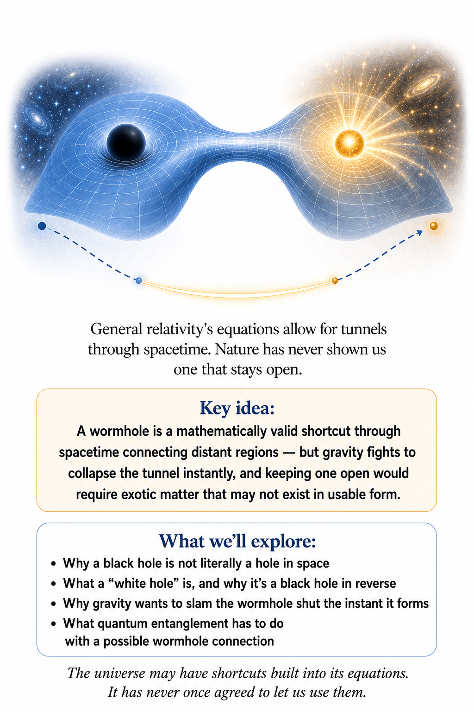

## What If a Black Hole Has a Back Door?

Black holes are already strange enough. Matter falls in.

Light falls in. Nothing that crosses the event horizon can come back out through the ordinary route. And then general relativity does something even more mischievous. Under certain mathematical extensions of the black-hole solution — the exact shape of spacetime Einstein's equation predicts around a black hole, followed mathematically further than any real black hole would need — spacetime can contain a bridge connecting one exterior region to another.

A wormhole. So perhaps the question is not merely: “What happens if you fall into a black hole?” Perhaps we should also ask:

“Where, exactly, does the mathematics think you might be going?” There is a catch. The universe may have drawn the tunnel. It may also have put up a very large sign saying:

DO NOT ENTER. THIS SHORTCUT IS NOT CURRENTLY TRAVERSABLE.

Where this stands: most of this chapter explores what general relativity's equations permit, not what has been observed. No wormhole, traversable or otherwise, has ever been detected in nature — treat what follows as SPECULATIVE or an OPEN QUESTION unless a tag says otherwise.

## First: A Black Hole Is Not a Hole in Space

As Chapter 10 showed, the name is misleading. A black hole is not an empty tunnel punched through the universe. It is a region of spacetime whose gravitational geometry is so extreme that, once you cross the event horizon, all future-directed paths lead inward. The event horizon is the boundary.

Cross it, and there is no ordinary route back out. In classical general relativity, the interior ultimately leads toward a singularity where the theory itself ceases to provide a reliable description. So a black hole is better imagined as a peculiar region of spacetime than as a cosmic drainpipe.

## Then Where Did the Wormhole Idea Come From?

Where this stands: STRONGLY SUPPORTED — the Einstein–Rosen bridge itself is rigorously derived, peer-reviewed mathematics; it's the traversability claims that are speculative.

The wormhole idea comes from the mathematics of general relativity. In 1935, Albert Einstein and Nathan Rosen examined a mathematical structure associated with the Schwarzschild solution — the simplest possible black-hole geometry, worked out by Karl Schwarzschild in 1916 for a single mass that neither spins nor carries charge. What became known as the Einstein–Rosen bridge can be understood, in that solution's fully extended mathematical spacetime, as connecting two exterior regions. This is where the famous picture begins.

Two regions. A bridge. A shortcut. It sounds like the universe has built a tunnel.

But the mathematics is not promising us a usable tunnel through which a spaceship can casually pop from one galaxy to another.

## The White Hole Appears

The full mathematical extension of the simplest eternal black-hole solution contains something that looks like the time-reversed version of a black hole: a white hole. A black hole lets things enter but not escape. A white hole is the reverse idea. Things can emerge, but nothing can enter from the outside.

This is where black holes and white holes become connected with the Einstein–Rosen bridge. In the idealized mathematical spacetime, there are regions that can be interpreted as a black-hole region and a white-hole region, with the geometry connecting exterior regions. It is an extraordinary piece of mathematics. It is not evidence that astrophysical black holes contain functioning white-hole exits.

## A White Hole Is Not Just a Black Hole With Better Public Relations

It is tempting to imagine a black hole as the entrance and a white hole as the exit. You fall into one. You emerge from the other. Congratulations. Intergalactic transportation solved.

Unfortunately, the actual geometry is not that friendly. The classic Einstein–Rosen bridge is not traversable. It pinches off too quickly.

An observer cannot simply enter one mouth and come out the other. The bridge exists in the mathematical spacetime diagram, but not as a practical tunnel for travelers.

## So What Does the Bridge Connect?

This is the first really interesting question.

It does not necessarily mean “our galaxy connected to another galaxy.”

In the classic mathematical construction, the bridge connects two exterior regions of the extended spacetime. Depending on how one interprets that extension, those regions can be thought of as two distant regions or as two asymptotically separate universes — each one, far from the black hole, opening out into its own vast, ordinary-looking expanse of space. The important point is that the mathematics permits a connection between regions that look separate from the outside. That is already astonishing.

We do not need to add a science-fiction galaxy map to make it strange.

## Could It Connect Two Galaxies?

In principle, a wormhole geometry can connect two distant locations. So one can imagine a mouth near one galaxy and another mouth near a distant galaxy.

The geometry would provide a shortcut through spacetime. But this is a statement about possible spacetime solutions, not an astronomical observation. We have no confirmed evidence for naturally occurring traversable wormholes. The safest sentence is therefore:

General relativity permits wormhole geometries; nature has not yet shown us a usable one.

## Could It Connect Two Universes?

Some mathematical wormhole constructions can be interpreted as connecting separate asymptotic regions that are naturally described as different universes. This is where the word “universe” becomes slippery.

Physicists may use it to describe separate regions of a mathematical spacetime that do not communicate in the ordinary way. Science fiction tends to hear: “Parallel universe with another Earth.” Those are not automatically the same thing.

The mathematics can be stranger and less cinematic.

## And What About the Fourth Dimension?

Here we need to rescue the poor fourth dimension from several bad science-fiction jobs. In relativity, spacetime has four dimensions: three of space, one of time.

A wormhole is not simply a tunnel drilled through a fourth spatial dimension. The geometry of the four-dimensional spacetime itself can contain a shortcut between regions. You do not need to climb “up” into another dimension like someone climbing out of a two-dimensional drawing.

The extra dimension in the spacetime description is time, not a hidden corridor beside our universe.

## But Pictures Make It Look That Way

You have probably seen the classic illustration. Take a flat sheet. Mark two distant points. Bend the sheet.

Bring the points close together. Punch a tunnel between them. Suddenly the journey is shorter. It is a wonderful visualization.

But the sheet is not the universe. The bending is not literally happening into some accessible external dimension. It is a visualization of a geometry whose actual description is four-dimensional spacetime. The picture is useful.

The picture is also lying to you. Most good physics pictures do this a little.

## So Is There a Higher Dimension?

Possibly — in some theories.

String theory and related approaches can involve additional spatial dimensions beyond the four dimensions of ordinary spacetime. Some theoretical wormhole models are constructed in higher-dimensional settings. For example, Maldacena and Milekhin studied a humanly traversable wormhole model in a five-dimensional spacetime, where the extra dimension plays an important role in the construction.

But this does not mean we have discovered a hidden fifth-dimensional tunnel network around the Milky Way. It means that extra-dimensional theories provide additional mathematical possibilities.

## The Real Problem: Gravity Wants to Close the Tunnel

Suppose we somehow create a wormhole. Gravity is not going to sit politely nearby and admire our engineering. The throat of a wormhole tends to collapse. To keep a wormhole open long enough for something to pass through, theoretical models often require unusual forms of matter or stress-energy — physicists' all-in-one term for the mass, energy, pressure, and tension that Einstein's equation counts when deciding how spacetime curves.

This is why traversable wormholes are so speculative. The universe appears to say: “You may have a shortcut. But I would prefer that it collapse immediately.”

## Exotic Matter Enters the Story

Some traversable-wormhole constructions require matter with unusual properties, often described as exotic matter. The phrase sounds wonderfully alien. It does not necessarily mean a mysterious new substance from another planet. It refers to stress-energy with properties that ordinary matter does not normally have and that can violate certain classical energy conditions — rules, obeyed by every ordinary material ever measured, saying the energy packed into any region can never dip below zero.

Quantum field theory can produce negative energy densities in restricted circumstances, so the idea is not simply forbidden by every known equation. But producing enough of the right kind of effect to hold open a macroscopic wormhole is an entirely different matter. The theoretical door is open. The engineering door is several kilometers away.

## Traversable Wormholes Are Not All the Same

There is an important distinction. A wormhole can exist as a mathematical structure without being traversable. A traversable wormhole is one in which a traveler can actually enter one mouth and emerge from the other without encountering a horizon or destructive collapse. That is a much stronger requirement.

Researchers have found theoretical models with traversable wormholes under various assumptions, including models in higher-dimensional spacetime. None of this demonstrates that nature has built one.

## Would a Wormhole Break the Speed of Light?

Here is another delightful trap.

Suppose Earth and a distant galaxy are separated by a million light-years. A wormhole provides a shortcut. You travel through it and emerge after a short journey. Have you gone faster than light?

Locally, you need not have. You may have followed a perfectly ordinary timelike path — the kind every slower-than-light traveler follows, always staying inside the light cones met in Chapter 9 — through curved spacetime. The shortcut comes from the geometry. It is the distance through spacetime that has changed, not the local speed limit.

This is why wormholes are so interesting. They challenge our intuition about distance without necessarily requiring an object to locally outrun light.

## The Cosmic Subway

Imagine a city with two neighborhoods. The normal road takes an hour. A subway tunnel takes five minutes. The subway train did not violate the speed limit.

It simply took a shorter route. A wormhole is the relativistic version of a shortcut. Except that instead of digging under the city, you are changing the geometry of spacetime. And instead of a municipal transit authority, you need physics we do not yet know how to engineer.

## But Time Causes Trouble

Wormholes can create an even more interesting problem. If the two mouths are moved relative to each other in the right way, relativistic time dilation can make the clocks at the two mouths disagree. Then a traveler entering one mouth might emerge at a different time relative to the outside world. Physicists have shown that suitable motion of the mouths can, in principle, produce a time shift.

Now the wormhole is no longer merely a shortcut through space. It may become a shortcut through spacetime.

## The Time Machine Problem

And once you have a route into the past, physics becomes extremely uncomfortable. Could you travel back and prevent yourself from entering the wormhole? Could you send information to the past? Could you create a causal paradox?

These questions have led physicists to investigate whether quantum effects, chronology protection — Stephen Hawking's suspicion that nature always finds a way to sabotage a time machine before it can be switched on — or other mechanisms prevent usable time machines from forming. So even if nature gives us a wormhole, it may come with a very strict no-time-travel policy.

## The Wormhole Is Not a Portal to the Fifth Dimension

This is worth repeating because popular imagery gets it wrong. A wormhole does not require a person to leave ordinary three-dimensional space and enter a magical fourth spatial dimension. The relevant geometry belongs to spacetime. Extra-dimensional theories can provide other constructions.

But the ordinary Einstein–Rosen bridge is already a four-dimensional spacetime phenomenon.

The tunnel is not “somewhere else.”

The tunnel is a feature of the geometry of spacetime itself.

## Now Bring Quantum Mechanics Into the Room

Where this stands: OPEN QUESTION — ER = EPR is an active research conjecture, not an established result.

General relativity gives us the geometry. Quantum mechanics gives us entanglement. And eventually the two subjects meet. This is where things get properly strange.

In modern theoretical physics, there is a conjectural connection summarized as: ER = EPR. ER means Einstein–Rosen bridge. EPR means Einstein–Podolsky–Rosen entanglement.

The idea, associated especially with Juan Maldacena and Leonard Susskind, suggests that certain quantum-entangled systems may have a geometric description involving wormhole-like connections.

## Entanglement Does Not Give You a Wormhole Telephone

Before anyone starts building the intergalactic phone network, there is an important warning. Entanglement does not let you send an ordinary message faster than light. And the wormholes appearing in the ER=EPR picture are not ordinary traversable tunnels. The proposed relationship is about a deep connection between quantum entanglement and spacetime geometry.

It is not a recipe for teleporting people across the galaxy. Physics has once again provided a beautiful idea and then attached a small sign saying: Please do not misuse this for faster-than-light communication.

## Why This Connection Is So Important

The exciting possibility is conceptual. Maybe spacetime is not fundamental. Maybe geometry itself emerges from deeper quantum information. If so, a wormhole would not simply be a bizarre tunnel inside spacetime.

It could be a clue about why spacetime has the structure it does. This is one reason modern physicists take wormhole mathematics seriously even though nobody has demonstrated a traversable wormhole. The wormhole may be valuable not because we can travel through it, but because it teaches us something about the architecture of reality.

## Black Holes, White Holes and the Arrow of Time

The black-hole/white-hole distinction also forces us to think about time. A black hole is naturally associated with collapse and one-way passage. A white hole is the time-reversed mathematical picture. That makes white holes fascinating.

It also makes them suspicious. Our universe contains abundant evidence for black holes. We have no comparable observational evidence for white holes. The white hole appears naturally in certain idealized extensions of the equations, but that does not mean astrophysical white holes exist.

Mathematics is wonderfully democratic. It gives many possibilities. Nature gets the final vote.

## What About Real Black Holes?

Real black holes form from physical processes such as gravitational collapse. They rotate. They interact with matter. They grow.

They merge. They exist in messy astrophysical environments. The ideal eternal black-hole solution used to construct the classic Einstein–Rosen bridge is much cleaner. That distinction matters.

A mathematical feature of an idealized solution is not automatically a feature of every real black hole. Nature is under no obligation to use the entire menu offered by the equations.

## Could a Black Hole Really Become a White Hole?

Some modern speculative theories investigate whether quantum-gravity effects could alter the classical black-hole picture and permit a transition to something resembling a white hole.

These ideas are interesting. They are not established observational facts. We do not currently know the correct theory of quantum gravity. So the responsible statement is:

black-to-white-hole transitions are theoretical possibilities in some approaches, not confirmed properties of astrophysical black holes. That distinction keeps the science exciting without turning speculation into a press release.

## The Galaxy-to-Galaxy Shortcut

Now we can return to the science-fiction picture. Suppose a traversable wormhole had one mouth near Earth and another near a distant galaxy. The two galaxies could remain enormously far apart in ordinary space. The wormhole would provide a shorter path through spacetime.

The traveler would not need to accelerate beyond light speed. The geometry would do the cheating for them. This is mathematically conceivable in certain models. It is technologically fantastical.

Those are very different words.

## A Five-Dimensional Detour

Some higher-dimensional models make the picture even more interesting. In one theoretical construction, a traversable wormhole in a five-dimensional spacetime could permit a cross-galaxy journey in a very short traveler-measured time, while an outside observer could see a vastly longer duration because of the geometry and gravitational effects involved. That sounds like science fiction.

It is actually a theoretical physics result. But theoretical does not mean available at your local spaceport.

## What the Wormhole Is Really Teaching Us

The most important lesson is not that wormholes might someday become spacecraft tunnels. It is that spacetime is not a rigid stage. General relativity tells us that geometry itself is dynamical. Matter and energy affect spacetime.

Spacetime affects matter and energy. And in extreme conditions, the geometry can become so strange that the ordinary idea of distance stops behaving the way our brains expect. A wormhole is the ultimate reminder: distance is a property of geometry.

## The Universe May Have Shortcuts We Cannot Use

This is perhaps the most frustrating possibility. The equations may contain shortcuts. The shortcuts may be mathematically consistent. They may even have deep connections to quantum theory.

And yet nature may make every macroscopic shortcut unstable. That would be very like the universe. It shows us the door. Then it removes the handle.

## The Final Picture

So what have we learned? A black hole is not literally a hole. A white hole is a time-reversed mathematical cousin, not an observed cosmic object. An Einstein–Rosen bridge can connect regions of spacetime in the extended black-hole solution.

A wormhole can, in some theories, connect distant regions without requiring local faster-than-light travel. It might be described as connecting two regions of one universe or, in some constructions, separate asymptotic universes. It is not simply a tunnel into a fourth spatial dimension. Higher-dimensional theories can provide additional possibilities.

Traversable wormholes remain speculative and may require exotic conditions. And modern theoretical physics has proposed a tantalizing relationship between wormholes and quantum entanglement. That is quite a lot for one little tunnel.

## The Punchline

Black holes looked like the ultimate cosmic prisons. Then mathematics suggested they might have bridges. White holes appeared at the other end. Wormholes became shortcuts.

Extra dimensions joined the discussion. Quantum entanglement wandered in. And suddenly a question that began with “Where does everything go?” became a question about the architecture of spacetime itself.

Perhaps there are tunnels through the universe. Perhaps there are no traversable ones. Perhaps the wormhole is telling us that spacetime is emergent from something deeper. Perhaps the whole idea is a beautiful mathematical mirage.

We do not know. But there is one thing we can say with confidence. If the universe really has a shortcut, it has done an extraordinary job of hiding the entrance.

The frontier is now clearly defined: general relativity describes gravity as spacetime geometry; quantum theory describes the microscopic world with extraordinary success; a complete theory combining the two remains unknown. The next volume turns to matter itself — the nucleus, the neutrino, the full particle zoo, the symmetries that hold it together, and the semiconductors that let us build with it.

↑ Back to Contents

# Epilogue: The Universe Is Not Finished Explaining Itself

## Where We Started, and Where We Are

This volume began with a falling elevator. A person inside it, unable to see out, could not tell whether they were sitting on Earth or accelerating through empty space. That small, almost silly puzzle turned out to contain an entire universe.

From that elevator we followed gravity outward. We watched it bend starlight during a solar eclipse, slow clocks on mountaintops, and quietly correct the phone in your pocket every time it tells you where you are. We watched two black holes spiral into each other so violently that they shook spacetime itself, and watched that shudder cross a billion light-years to arrive, almost unimaginably faint, at a detector on Earth. We followed space as it expanded, cooled, and organized itself into filaments and clusters spanning the observable universe. We asked what dominates that universe and discovered, a little uncomfortably, that the matter we are made of is a minority stakeholder in its own cosmos. We ran the clock back to the universe's first three minutes, and then further back still, into a fraction of a fraction of a second when everything we can see was smaller than an atom, doubling in size so fast that separations between points grew faster than light could ever cross them. We followed dying stars inside their own horizons, and watched Einstein's theory prove, by its own logic, that it must break down somewhere within. And we arrived, finally, at a genuine wall: the place where general relativity and quantum mechanics both insist on speaking, and refuse to agree on what they are saying.

That is not a bad place to end a book. It is, honestly, the most interesting place to end one.

## What We Actually Know

It is worth pausing to notice how much of this book was not speculation. General relativity has been tested against the natural world for over a century and has not yet lost an argument. It predicted the bending of starlight, the existence of black holes, and the existence of gravitational waves, all before any of them were observed directly — and it resolved a puzzle that had stumped astronomers for over half a century: the slow drift in Mercury's orbit, first measured by Le Verrier in 1859, that Newton's gravity could never quite explain. The expansion of the universe, the cosmic microwave background, and the relative abundances of hydrogen and helium are not competing hypotheses; they are measurements that happen to agree with a theory in embarrassing detail.

This is easy to forget in a book that spends so much time in speculative territory, so it is worth saying plainly: the boring, well-established core of this volume is one of the great achievements of the human species. GPS satellites correcting for relativity, telescopes imaging the shadow of a supermassive black hole (its dark silhouette against its own glowing gas, first photographed in 2019), detectors hearing the collision of two stellar corpses across the cosmos — none of this is science fiction. It is Tuesday.

## What We Genuinely Don't

The honesty cuts both ways. We still do not know what dark matter is made of, only that something with its gravitational fingerprints is out there in overwhelming quantity. We still do not know why the vacuum's energy is what it is, only that whatever it is, it is winning. We do not know whether inflation actually happened, only that it explains several otherwise-mysterious features of the universe so neatly that most cosmologists would be startled if some version of it turned out to be wrong. And we do not have a working theory of quantum gravity, only a handful of promising, unconfirmed, and occasionally beautiful attempts to build one.

A less careful book might have smoothed over these gaps, presented dark matter as a settled particle or inflation as an established fact. We chose not to, because the gaps are not embarrassing. They are the field's job description. A science that had finished asking questions about gravity and the cosmos would be a strange kind of dead.

## A Universe You Are Part Of

Return, for a moment, to that falling elevator. You are not reading this from outside the universe, checking in on it occasionally. You are made of atoms forged in stars that died before the Sun was born, sitting on a planet held in its orbit by the same curved spacetime that bends starlight and rings when black holes collide. The gravity that keeps this book from floating off your lap is not a different phenomenon from the gravity that shaped the cosmic web. It is the same story, told at a smaller scale.

That is, in the end, the real lesson of this volume. Gravity is not something happening to the universe from the outside. It is something the universe is doing to itself, continuously, everywhere, including in the room you are sitting in right now.

## One Last Look Up

The next time you are somewhere dark enough to see the stars properly, take a moment before you name any constellations. Every point of light up there is a fellow participant in the same curved spacetime this book has spent its pages describing. Some of that light left its source before there were humans to look up at it. Some of it is bending, right now, around masses you cannot see. And underneath all of it, at scales far too small for any telescope, gravity and quantum mechanics are still refusing to shake hands.

We do not know how that disagreement ends. That is not a flaw in this book, or in physics. It is an invitation, and the next volume takes it — not into deeper space, but into the particles, fields, and matter that space is made of.

↑ Back to Contents

# Appendix: Core Ideas Worth Keeping

This book covered a lot of ground, from a falling elevator to the edge of quantum gravity. If you remember nothing else, remember these.

## Gravity is geometry, not a force reaching out to grab you

Mass and energy curve spacetime. Objects in free fall are not being pulled; they are following the straightest available path through a curved geometry. You have never once felt gravity pulling you down. You have only ever felt the ground pushing you up.

## Locally, gravity and acceleration are indistinguishable

This is the equivalence principle, and it is the single idea the entire theory of general relativity grows out of. A sealed elevator cannot tell you, from the inside, whether it is sitting still on Earth or accelerating through empty space.

## Gravitational waves are real, measurable ripples in spacetime itself

They were predicted in 1916 and directly detected in 2015, by measuring a distortion a few hundred times smaller than the width of a proton. Spacetime is not a rigid stage. Under the right conditions, it rings like a bell.

## The universe is not expanding into anything

Space itself is stretching, carrying galaxies along with it. There is no center to the expansion and no edge it is expanding toward. Every sufficiently distant galaxy is moving away from every other one, and that is true no matter which galaxy you happen to be standing on.

## Most of the universe does not shine

Ordinary matter — atoms, stars, planets, you — is a minority component. Dark matter supplies gravitational scaffolding we cannot see directly, and outweighs ordinary matter by roughly five to one on its own. Dark energy dominates the universe's overall energy budget and is accelerating its expansion. Together, dark matter and dark energy outweigh ordinary matter by roughly nineteen to one, and we still do not know what either of them fundamentally is.

## The early universe was a nuclear reactor, briefly

In its first few minutes, the universe fused protons and neutrons into helium nuclei (plain hydrogen, a lone unfused proton, was simply left over), then cooled too quickly to build much else. Nearly everything heavier than helium — the carbon in your body, the calcium in your bones — was made later, inside stars.

## Inflation is our best explanation for why the universe looks the way it does

A brief, staggering burst of exponential expansion in the earliest fraction of a second would explain why the universe is so flat, so uniform, and seeded with exactly the kind of tiny fluctuations that later grew into galaxies. It remains our leading hypothesis, not a settled fact.

## Time is not a universal river

Clocks run at different rates depending on how they move and how deep they sit in a gravitational field. This is not a measurement error. It is a real, repeatedly confirmed property of nature — and it is why your GPS receiver has to do relativistic arithmetic just to tell you where you are standing.

## General relativity and quantum mechanics do not currently agree

Both are extraordinarily successful in their own domains. Where gravity becomes strong enough to matter at quantum scales — inside black holes, at the instant of the Big Bang — our two best theories stop fitting together. Finding out how they reconcile is one of the central unsolved problems in physics.

## A black hole is a region of geometry, not a hole in space

Cross its event horizon and every future-directed path leads inward. It is not a cosmic vacuum cleaner: replace the Sun with a black hole of identical mass, and Earth's orbit would not change at all.

## Singularities mark where general relativity runs out

Penrose and Hawking proved that, in classical general relativity, collapse must produce singularities and our universe must have one in its past. That is not a claim that infinities exist in nature. It is the theory telling us, precisely, where it stops being trustworthy.

## Wormholes are mathematically permitted and, so far, entirely theoretical

General relativity's equations allow for shortcuts connecting distant regions of spacetime. Nature has never shown us one that stays open long enough to use, and keeping one open would require forms of matter we have never observed.

## What We Know, What We Suspect, What We're Still Arguing About

ESTABLISHED: general relativity's predictions (light bending, time dilation, gravitational waves, black holes); the expanding universe; the cosmic microwave background; light-element abundances from Big Bang nucleosynthesis.

STRONGLY MOTIVATED: dark matter as some form of unseen mass; dark energy as the driver of accelerating expansion; cosmic inflation as the origin of large-scale structure.

ACTIVE RESEARCH: what dark matter and dark energy actually are; how to unify general relativity with quantum mechanics; whether traversable wormholes are possible in any form.

## The Final Punchline

Every idea in this volume traces back to the same move: take something that feels obvious — falling, standing still, empty space, the passage of time — and ask what it is actually made of. The universe has never once answered “nothing interesting.” It has, every single time, answered with geometry.

↑ Back to Contents

# Glossary

## Black hole

A region of spacetime whose gravity has become so extreme that nothing, not even light, can escape once it crosses the event horizon. Not a hole in space — a region of extreme geometry. See Chapter 10.

## Cosmic censorship

Roger Penrose's conjecture that the singularities formed in realistic gravitational collapse are always hidden inside event horizons, so they cannot spoil the predictability of the rest of the universe. Widely believed and still unproven. See Chapter 11.

## Cosmic microwave background (CMB)

The faint afterglow of the early universe, released about 380,000 years after the Big Bang when the universe cooled enough to become transparent. Its tiny temperature variations are the seeds of every galaxy that formed afterward. See Chapter 7.

## Cosmological constant (Λ)

A term in Einstein's equations, originally added and later regretted by Einstein, associated with a constant energy density of empty space. It is the simplest candidate for dark energy. See Chapter 5.

## Dark energy

Whatever is causing the expansion of the universe to accelerate rather than slow down. It dominates the total energy budget of the universe, and its fundamental nature is unknown. See Chapter 5.

## Dark matter

An invisible form of matter that does not emit, absorb, or reflect light, detected only through its gravitational effects — galaxy rotation curves, gravitational lensing, and the Bullet Cluster among them. It outweighs all visible matter combined. See Chapter 4.

## Einstein-Rosen bridge

The formal name for a wormhole: a mathematical feature of the extended black-hole solution in general relativity — the exact shape of spacetime Einstein's equation predicts around a black hole, followed further than any real one would need — connecting two distant regions of spacetime. First described by Einstein and Rosen in 1935. See Chapter 13.

## Equivalence principle

Einstein's insight that gravity and acceleration are locally indistinguishable — a person in a sealed, accelerating elevator cannot tell whether they are on a planet or being pushed through empty space. The foundation of general relativity. See Chapter 1.

## ER = EPR

A conjecture, associated with Juan Maldacena and Leonard Susskind, proposing a deep connection between wormholes (Einstein-Rosen bridges) and quantum entanglement (Einstein-Podolsky-Rosen correlations). See Chapter 13.

## Ergosphere

The region just outside the horizon of a spinning black hole where spacetime is dragged around so strongly that nothing can remain at rest relative to the distant stars. Energy can, in principle, be extracted from it. See Chapter 10.

## Event horizon

The boundary of a black hole. Cross it, and every possible future path leads inward — there is no route back out, even for light. See Chapter 10.

## Frame dragging

The twisting of spacetime by a rotating mass, which drags nearby gyroscopes, orbits, and light along with the rotation. Measured around Earth by Gravity Probe B; overwhelming near a spinning black hole. See Chapter 10.

## Geodesic

The straightest possible path available through a curved geometry. Freely falling objects follow geodesics through curved spacetime; this is what general relativity means by “falling.” See Chapter 1.

## Geodesic deviation

The way neighboring free-fall paths drift toward or away from each other. It is the measurable signature of spacetime curvature, and the same thing as tidal gravity. See Chapter 1.

## Gravitational lensing

The bending of light by curved spacetime around a massive object, which can distort, magnify, or multiply the image of anything behind it. Used to map matter — including dark matter — that emits no light of its own. See Chapter 4.

## Gravitational wave

A ripple in spacetime itself, generated whenever a mass distribution changes shape in a lopsided, time-varying way — as when two black holes spiral together and merge. Predicted by Einstein in 1916 and directly detected by LIGO in 2015. See Chapter 2.

## Hawking radiation

Faint thermal radiation predicted to be emitted by black holes due to quantum effects near the event horizon, discovered theoretically by Stephen Hawking. It implies black holes slowly evaporate over unimaginably long timescales. See Chapter 12.

## Holographic principle

The idea, suggested by black hole entropy calculations (a black hole's hidden information turns out to scale with its horizon's area, not its volume), that the information content of a volume of space may be fully encoded on its boundary — a lower-dimensional surface — rather than the volume itself. See Chapter 12.

## Hubble tension

The unexplained disagreement between the universe's present expansion rate inferred from the cosmic microwave background (about 67 km/s per megaparsec) and that measured directly from nearby galaxies (about 73). See Chapter 3.

## Inflation

A hypothesized period of exponential expansion in the earliest fraction of a second after the Big Bang, which would explain the universe's flatness, its uniformity, and the origin of the density fluctuations that became galaxies. Well-supported but not yet proven. See Chapter 8.

## Kerr black hole

A rotating black hole, described by the exact solution Roy Kerr found in 1963. Every settled black hole in nature is expected to be of this type. See Chapter 10.

## ΛCDM

The standard model of cosmology: a universe made of ordinary matter, cold dark matter (CDM), and a cosmological constant (Λ) driving accelerated expansion. Remarkably successful at matching observations, despite not explaining what dark matter or dark energy fundamentally are. See Chapter 5.

## Light cone

The boundary, at any event in spacetime, of everywhere light could travel to or have arrived from. It defines which events can possibly cause, or be caused by, any given event. See Chapter 9.

## No-hair theorem

The result that a settled black hole is completely described by just three numbers: mass, spin, and electric charge. Every other detail of what formed it is lost from the outside view. See Chapter 10.

## Nucleosynthesis

The process by which atomic nuclei are built. Big Bang nucleosynthesis, in the universe's first few minutes, produced hydrogen and helium; heavier elements had to wait for stars. See Chapter 7.

## Penrose diagram

A map that squeezes an infinite spacetime onto a finite page while keeping light rays at 45 degrees, so that cause and effect are drawn faithfully. Used to show the structure of black holes and the universe. See Chapter 11.

## Planck length / Planck time

The characteristic length (about 1.6 × 10⁻³⁵ meters) and time (about 5.4 × 10⁻⁴⁴ seconds) built from the fundamental constants of gravity, quantum mechanics, and relativity. The scale at which a full theory of quantum gravity is expected to become necessary. See Chapter 12.

## Proper time

The time actually recorded by a clock traveling along a particular path through spacetime. Free fall is the path of greatest proper time. See Chapter 9.

## Redshift

The stretching of light's wavelength toward the red end of the spectrum, caused by the source moving away or by the expansion of space itself. The farther away a galaxy is, the greater its redshift. See Chapter 3.

## Singularity

A point where a physical theory's equations produce infinite or undefined results — at the center of a black hole, or at the universe's earliest moment. A signal that the theory has been pushed past where it can be trusted, not necessarily a physical infinity in nature. See Chapter 11.

## Spacetime

The four-dimensional geometric structure combining space and time into a single entity, whose curvature — determined by matter and energy — is what general relativity identifies as gravity. See Chapter 1.

## Tidal force

The difference in gravitational pull across an extended object, which stretches it along the direction toward a mass and squeezes it across. In general relativity, the tidal effect is curvature itself. See Chapter 1 and Chapter 10.

## Time dilation

The slowing of elapsed time for a clock, caused by its motion (special relativity) or by its depth in a gravitational field (general relativity). Measured directly, including by GPS satellites and tabletop atomic clocks. See Chapter 9.

## Trapped surface

A closed surface so deep in a gravitational field that even light emitted outward from it converges. Penrose proved that once one forms, a singularity is unavoidable in classical general relativity. See Chapter 11.

## Wormhole

A mathematically permitted shortcut through spacetime connecting two distant regions. See Einstein-Rosen bridge. No naturally occurring, traversable wormhole has ever been observed. See Chapter 13.

↑ Back to Contents

# The Equations, Decoded

None of the physics in this book required you to read an equation. But the equations are where these ideas actually live, and a few of them are short enough to be worth a closer look. Each one below is connected to a specific chapter, for readers who want to see a little more of the machinery.

## Mass-Energy Equivalence

E = mc²

Energy equals mass multiplied by the speed of light, squared.

E is energy, m is mass, and c is the speed of light — a huge number, so c² is enormous. That means even a tiny amount of mass corresponds to a huge amount of energy.

This is the equation behind why nuclear fusion in the Sun, and in the universe's first three minutes, can release such staggering amounts of energy from such small amounts of matter. Chapter 7 covers what actually happens when that conversion takes place.

## Einstein's Field Equation

Gμν + Λgμν = (8πG/c⁴) Tμν

The geometry of spacetime, on the left, is determined by the distribution of matter and energy, on the right.

Gμν describes the curvature of spacetime; hidden inside it is the metric, gμν (lowercase), spacetime's basic rule for measuring distances and durations, with the paired μν subscripts just labeling directions in space and time. Tμν describes the matter and energy present at a given point. G is Newton's gravitational constant — the fixed number that sets how strongly any two masses attract — c is the speed of light, and Λ is the cosmological constant — the term associated with dark energy.

In plain language: matter and energy tell spacetime how to curve; spacetime tells matter and energy how to move. Chapter 1 builds up to this equation without the symbols; this is what it actually looks like once you add them back in.

## Tidal Stretching

Δa ≈ 2GML / r³

The difference in gravitational acceleration between two points a distance L apart, lined up toward a mass M at distance r.

G is Newton's gravitational constant, M the mass doing the pulling, r the distance to it, and L the separation between the two points, such as the length of your body. The r³ in the denominator makes tides fade much faster with distance than gravity itself does.

In Einstein's language this is geodesic deviation, the clearest physical meaning of spacetime curvature. Chapter 1 uses it to explain falling apples and ocean tides; Chapter 10 uses it to explain why falling into a small black hole is fatal and into a giant one is not.

## The Friedmann Equation

H² = (8πG/3)ρ − kc²/a² + Λc²/3

This equation governs how fast the universe expands at any given moment.

H is the expansion rate (the Hubble parameter), ρ is the density of matter and radiation, k describes the overall curvature of space, a is the scale factor — a measure of the universe's relative size — and Λ is again the cosmological constant.

Matter and radiation tend to slow the expansion down; a positive Λ pushes it to accelerate. Which term wins depends on how dilute matter has become, which is why the universe's expansion history has distinct eras. Chapters 3 and 5 walk through what this equation predicts, and what it took to discover that Λ actually matters.

## The Planck Length and Planck Time

ℓP = √(ħG/c³) ≈ 1.6 × 10⁻³⁵ m       tP = √(ħG/c⁵) ≈ 5.4 × 10⁻⁴⁴ s

The characteristic length and time scale built purely from the constants of gravity, quantum mechanics, and relativity — the scale at which quantum-gravitational effects are expected to become important.

ħ (h-bar) is the reduced Planck constant — the tiny fixed number that sets the size of quantum effects. G is Newton's gravitational constant. c is the speed of light. Combining all three in the only way that produces a length and a time gives the two numbers above, ℓP and tP.

Neither number means space or time literally comes in discrete little chunks of exactly this size. They mark the scale at which our current theories — general relativity and quantum mechanics separately — are expected to stop being trustworthy on their own. Chapter 12 covers why that scale matters so much.

## Exponential Inflation

a(t) ∝ e^(Ht)

During inflation, the universe's scale factor grows exponentially with time, rather than at an ordinary steady rate.

a(t) is the scale factor at time t — how large the universe is relative to some earlier moment. The symbol ∝ means “grows in proportion to.” H sets the pace of the expansion. e is a special number, about 2.718, that shows up whenever growth compounds continuously.

The difference between exponential and ordinary growth is the entire point: exponential growth compounds, the way money left in an account earning steady interest does, except radically faster. About a hundred doublings, repeated fast enough, can take a patch smaller than an atom past the size of the observable universe. Chapter 8 works through exactly how fast, and why physicists think it happened at all.

## Gravitational Time Dilation

dτ/dt = √(1 − 2GM/rc²)     and, near Earth, Δτ/τ ≈ gh/c²

A clock hovering at distance r from a mass M ticks more slowly than an identical clock far away, by the factor on the left.

τ (tau) is the time recorded by the nearby clock, t the time recorded far away, and g the acceleration of gravity at Earth's surface. Raising a clock by a height h near Earth speeds it up by the fraction gh/c², about one part in 10¹⁶ per meter.

When r shrinks to 2GM/c², the factor reaches zero; that radius is the event horizon. Chapter 9 explains the experiments, from a Harvard tower to clocks a millimeter apart.

## The Schwarzschild Radius

Rs = 2GM/c²

The radius an object's event horizon would have, if all of its mass were compressed inside that radius.

G is Newton's gravitational constant, M is the object's mass, and c is the speed of light. Every object with mass has a Schwarzschild radius; almost nothing is ever actually compressed small enough to reach it.

Compress the Sun's mass inside about three kilometers, or Earth's mass inside about nine millimeters, and either one would become a black hole. Chapter 1 introduces black holes conceptually and Chapter 10 explores them properly; this is the equation that sets how small is small enough.

## Black Hole Entropy

S = A / 4

A black hole's entropy — roughly, the amount of hidden information it could contain — is proportional to the area of its event horizon, not its volume.

S is entropy, A is the horizon's area, measured in a natural unit called the Planck area — a tiny square one Planck length on each side. This result was found by Jacob Bekenstein and developed further by Stephen Hawking.

Ordinary objects store more information the more volume they occupy. A black hole instead keeps its books on a flat, two-dimensional surface — the seed of the holographic principle discussed in Chapter 12.

## Hawking Temperature

T = ħc³ / (8πGMk_B)

Every black hole glows faintly, at a temperature inversely proportional to its mass.

ħ is the reduced Planck constant, c the speed of light, G Newton's constant, M the black hole's mass, and k_B Boltzmann's constant, which converts energy into temperature. Quantum theory, relativity, gravity, and thermodynamics all appear in a single line.

For a black hole with the mass of the Sun, T is about sixty billionths of a degree above absolute zero, far colder than the cosmic microwave background. Smaller black holes are hotter, which is why they would evaporate faster. Chapter 12 explains why this tiny glow causes so much trouble.

↑ Back to Contents

# Try It Yourself

None of these need more than arithmetic you can do with pen and paper — no calculus, and only one uses anything fancier than powers of ten. They’re here because a number you compute yourself tends to stick in a way that a number you merely read does not. Try each one before flipping to the Solutions section that follows.

## GPS: A Race Against Light

GPS satellite clocks run about 38 microseconds faster per day than ground clocks, from the combined effects of speed and altitude. Light travels about 300 meters in one microsecond. If this effect went completely uncorrected, roughly how far off would your calculated position drift after just one day?

## LIGO’s Impossible Ruler

LIGO’s detector arms are 4 kilometers (4,000 meters) long, and the instrument can detect a fractional length change of about one part in 10²¹. About how many meters is the smallest change LIGO can detect — and how does that compare to the width of a proton, roughly 10⁻¹⁵ meters?

## How Fast Is Far Away?

Hubble's law says a galaxy's recession speed equals its distance multiplied by H₀, the universe's present-day expansion rate. Using H₀ ≈ 70 kilometers per second per megaparsec (one megaparsec is about 3.3 million light-years), roughly how fast is a galaxy 200 megaparsecs away receding from us, purely due to cosmic expansion?

## The Invisible Majority

A galaxy’s visible stars and gas add up to about 10¹¹ solar masses. Observations of its rotation curve suggest the galaxy’s total gravitating mass — including its dark matter halo — is roughly six times that. About how many solar masses of dark matter does the halo contain?

## A Trick Question About Dark Energy

The universe’s energy budget is roughly 68% dark energy, 27% dark matter, and 5% ordinary matter. A particular galaxy cluster has a well-measured total mass. Does it make sense to say 68% of that cluster’s mass is dark energy?

## Cosmic Arithmetic, 13.8 Billion Years Later

Big Bang nucleosynthesis predicts that ordinary matter emerging from the first few minutes should be about 75% hydrogen and 25% helium by mass. In a sample of pristine primordial gas weighing 1,000 kilograms, about how many kilograms would be helium?

## Doubling Your Way to a Universe

During inflation, a patch of space doubles in size over and over on an incredibly short timescale. Starting from a patch smaller than an atom, roughly how many doublings would it take to grow the patch by a factor of about 10³⁰?

## How Small Is the Planck Length, Really?

The Planck length is about 1.6×10⁻³⁵ meters. A hydrogen atom is about 10⁻¹⁰ meters across. Roughly how many powers of ten smaller is the Planck length than a hydrogen atom?

## Scaling a Black Hole

The Schwarzschild radius scales directly with mass: Rs = 2GM/c². Earth’s Schwarzschild radius is about 9 millimeters. Roughly what would the Schwarzschild radius be for a hypothetical planet with 4 times Earth’s mass?

## A Clock on the Top Floor

A clock raised by a height h near Earth runs faster by the fraction gh/c², where g ≈ 10 meters per second per second and c ≈ 3×10⁸ meters per second. About how much time does a clock on the top floor of a 100-meter building gain, compared with one on the ground floor, in one year (about 3×10⁷ seconds)?

## Pound and Rebka's Tower

Using the same rule, what fractional frequency shift should light pick up falling down Harvard's 22.5-meter tower? (Use g ≈ 9.8 and c ≈ 3×10⁸.)

## Choosing Your Black Hole

At the horizon of a black hole of 10 solar masses, the tidal stretch across a human body is about twenty million times Earth's gravity. The tidal stretch at the horizon falls off as the square of the black hole's mass. About how strong would it be at the horizon of a black hole of 10,000 solar masses?

↑ Back to Contents

# Solutions

Worked answers to the “Try It Yourself” questions — order-of-magnitude reasoning, not formal derivations. Getting within a factor of two counts as correct; the point is the reasoning, not decimal precision.

## GPS: A Race Against Light

38 × 300 = 11,400 meters, or roughly 11 kilometers of drift in a single day.

## LIGO’s Impossible Ruler

4,000 × 10⁻²¹ = 4×10⁻¹⁸ meters. Compared with a proton’s 10⁻¹⁵ meters, that’s about 1/250th the width of a proton — LIGO routinely measures distance changes hundreds of times smaller than a single proton.

## How Fast Is Far Away?

70 × 200 = 14,000 kilometers per second.

## The Invisible Majority

6×10¹¹ − 10¹¹ = 5×10¹¹ solar masses of dark matter — about five times as much dark matter as visible matter in that halo.

## A Trick Question About Dark Energy

No — and that’s the point of the question. Dark energy is a property of space itself, spread essentially evenly throughout the universe; it doesn’t clump into bound structures the way matter does. Those percentages describe the universe’s overall energy budget, not the makeup of any one gravitationally bound object. A galaxy cluster’s mass is almost entirely ordinary matter plus dark matter — dark energy isn’t “in” it in any meaningful sense.

## Cosmic Arithmetic, 13.8 Billion Years Later

25% of 1,000 kilograms = 250 kilograms.

## Doubling Your Way to a Universe

Since 2ⁿ ≈ 10³⁰ and log₁₀(2) ≈ 0.301, n ≈ 30 / 0.301 ≈ 100. About 100 doublings.

## How Small Is the Planck Length, Really?

10⁻³⁵ / 10⁻¹⁰ = 10⁻²⁵, so the Planck length is about 25 orders of magnitude — 25 powers of ten — smaller than a hydrogen atom.

## Scaling a Black Hole

The Schwarzschild radius is directly proportional to mass, so 4 × 9 mm = 36 mm, or about 3.6 centimeters.

## A Clock on the Top Floor

gh/c² = (10 × 100) / (9×10¹⁶) ≈ 1.1×10⁻¹⁴. Multiply by 3×10⁷ seconds: about 3×10⁻⁷ seconds, a third of a microsecond per year. Tiny, but well within reach of modern atomic clocks.

## Pound and Rebka's Tower

(9.8 × 22.5) / (9×10¹⁶) ≈ 220 / (9×10¹⁶) ≈ 2.5×10⁻¹⁵, or about two and a half parts in a thousand trillion. That is the shift Pound and Rebka measured in 1959–60.

## Choosing Your Black Hole

The mass is 1,000 times larger, so the tide is 1,000² = 1,000,000 times weaker: about 20 times Earth's gravity. Still lethal if you had to endure it for long, but a world away from twenty million. For a black hole of a few million suns, it drops to a gentle fraction of a g.

↑ Back to Contents

# Further Reading

A Brief History of Time, by Stephen Hawking (Bantam, 1988; ISBN 978-0-553-05340-1) — the book that started the modern wave of popular cosmology writing, and still one of the clearest accounts of black holes and the Big Bang for a general reader.

Black Holes and Time Warps: Einstein's Outrageous Legacy, by Kip Thorne (W. W. Norton, 1994; ISBN 978-0-393-03505-6) — a much deeper, still accessible dive into black holes, wormholes, and gravitational waves from one of the physicists behind LIGO's detection covered in Chapter 2.

Black Hole Blues and Other Songs from Outer Space, by Janna Levin (Alfred A. Knopf, 2016; ISBN 978-0-307-95819-8) — the human story of the decades-long hunt for gravitational waves, expanding on Chapter 2.

Dark Matter and the Dinosaurs, by Lisa Randall (Ecco, 2015; ISBN 978-0-06-232847-2) — a wide-ranging case for one specific dark matter hypothesis, going considerably further into the subject of Chapter 4.

The Inflationary Universe, by Alan Guth (Addison-Wesley, 1997; ISBN 978-0-201-14942-5) — inflation's own originator explaining the idea and its discovery, for readers who want more of Chapter 8 from the source.

Three Roads to Quantum Gravity, by Lee Smolin (Basic Books, 2001; ISBN 978-0-465-07835-6) — a comparison of the leading approaches to unifying gravity and quantum mechanics, including loop quantum gravity, written by one of its founders and expanding directly on Chapter 12.

Reality Is Not What It Seems, by Carlo Rovelli (Riverhead, 2017; ISBN 978-0-7352-1392-0) — another loop quantum gravity pioneer's account of the history of ideas about space and time, reaching many of the same questions raised in Chapter 12.

The Fabric of the Cosmos, by Brian Greene (Alfred A. Knopf, 2004; ISBN 978-0-375-41288-2) — a broader tour connecting spacetime, quantum fields, and cosmology, touching on nearly every chapter of this volume.

The six books below are textbooks, and they use real mathematics. They are listed for readers who finish this volume wanting the full equations; each was a source for the explanations in this book.

Gravity: An Introduction to Einstein's General Relativity, by James B. Hartle (Addison-Wesley, 2003; ISBN 978-0-8053-8662-2) — the gentlest of the true textbooks, built around physical phenomena rather than formalism. If you are comfortable with first-year calculus and want to see the machinery behind Chapters 1, 9, and 10, start here.

A First Course in General Relativity, by Bernard Schutz (2nd ed., Cambridge University Press, 2009; ISBN 978-0-521-88705-2) — a patient bridge from special relativity to curved spacetime that introduces tensors as gently as anyone has managed. The natural companion to Hartle.

Spacetime and Geometry, by Sean Carroll (Cambridge University Press, 2019; ISBN 978-1-108-48839-6) — a modern graduate-level introduction with an exceptionally clear geometric viewpoint and strong chapters on black holes and cosmology.

Gravitation, by Charles W. Misner, Kip S. Thorne, and John Archibald Wheeler (W. H. Freeman, 1973; ISBN 978-0-7167-0344-0; Princeton University Press reissue, 2017, ISBN 978-0-691-17779-3) — the enormous, famous “phone book” of general relativity, first published in 1973. Demanding, but full of physical pictures, including the tidal, falling-apple view of curvature that runs through this book.

General Relativity, by Robert M. Wald (University of Chicago Press, 1984; ISBN 978-0-226-87033-5) — the standard rigorous treatment, and the place to go for the precise statements behind Chapters 10 and 11: causal structure, the singularity theorems, the initial-value formulation, and black hole thermodynamics.

Gravity: Newtonian, Post-Newtonian, Relativistic, by Eric Poisson and Clifford M. Will (Cambridge University Press, 2014; ISBN 978-1-107-03286-6) — a detailed account of how Einstein's theory reduces to Newton's, how it has been tested in the solar system and with binary pulsars, and how merging binaries produce gravitational waves.

↑ Back to Contents

# Bibliography

This is the formal reference list behind the book: the original papers this account of gravity and cosmology ultimately rests on, and the standard textbooks used as sources for its explanations, for readers who want to trace an idea back to its primary source. (Further Reading, above, is the friendlier, annotated list for where to go next.)

Abbott, B. P., et al. (LIGO Scientific Collaboration and Virgo Collaboration). “GW170817: Observation of Gravitational Waves from a Binary Neutron Star Inspiral.” Physical Review Letters 119, no. 16 (2017): 161101.

Abbott, B. P., et al. (LIGO Scientific Collaboration and Virgo Collaboration). “Observation of Gravitational Waves from a Binary Black Hole Merger.” Physical Review Letters 116, no. 6 (2016): 061102.

Baez, John C., and Emory F. Bunn. “The Meaning of Einstein’s Equation.” American Journal of Physics 73, no. 7 (2005): 644–652.

Bardeen, J. M., B. Carter, and S. W. Hawking. “The Four Laws of Black Hole Mechanics.” Communications in Mathematical Physics 31, no. 2 (1973): 161–170.

Bekenstein, Jacob D. “Black Holes and Entropy.” Physical Review D 7, no. 8 (1973): 2333–2346.

Bionta, R. M., et al. “Observation of a Neutrino Burst in Coincidence with Supernova 1987A in the Large Magellanic Cloud.” Physical Review Letters 58, no. 14 (1987): 1494–1496.

Bothwell, Tobias, et al. “Resolving the Gravitational Redshift across a Millimetre-Scale Atomic Sample.” Nature 602 (2022): 420–424.

Carroll, Sean M. Spacetime and Geometry: An Introduction to General Relativity. Cambridge: Cambridge University Press, 2019 (first published 2004). ISBN 978-1-108-48839-6.

Chandrasekhar, S. “The Maximum Mass of Ideal White Dwarfs.” Astrophysical Journal 74 (1931): 81–82.

Chou, C. W., D. B. Hume, T. Rosenband, and D. J. Wineland. “Optical Clocks and Relativity.” Science 329, no. 5999 (2010): 1630–1633.

Clowe, Douglas, Marusa Bradac, Anthony H. Gonzalez, Maxim Markevitch, Scott W. Randall, Christine Jones, and Dennis Zaritsky. “A Direct Empirical Proof of the Existence of Dark Matter.” Astrophysical Journal Letters 648, no. 2 (2006): L109–L113.

Einstein, Albert, and Nathan Rosen. “The Particle Problem in the General Theory of Relativity.” Physical Review 48 (1935): 73–77.

Event Horizon Telescope Collaboration. “First M87 Event Horizon Telescope Results. I. The Shadow of the Supermassive Black Hole.” Astrophysical Journal Letters 875, no. 1 (2019): L1.

Fourès-Bruhat, Y. [Yvonne Choquet-Bruhat]. “Théorème d’existence pour certains systèmes d’équations aux dérivées partielles non linéaires.” Acta Mathematica 88 (1952): 141–225.

Guth, Alan H. “Inflationary Universe: A Possible Solution to the Horizon and Flatness Problems.” Physical Review D 23, no. 2 (1981): 347–356.

Hafele, J. C., and Richard E. Keating. “Around-the-World Atomic Clocks: Observed Relativistic Time Gains.” Science 177, no. 4044 (1972): 168–170.

Hartle, James B. Gravity: An Introduction to Einstein’s General Relativity. San Francisco: Addison-Wesley, 2003. ISBN 978-0-8053-8662-2.

Hawking, S. W. “Gravitational Radiation from Colliding Black Holes.” Physical Review Letters 26, no. 21 (1971): 1344–1346.

Hawking, S. W. “Particle Creation by Black Holes.” Communications in Mathematical Physics 43, no. 3 (1975): 199–220.

Hawking, S. W., and R. Penrose. “The Singularities of Gravitational Collapse and Cosmology.” Proceedings of the Royal Society of London A 314, no. 1519 (1970): 529–548.

Hirata, K., et al. “Observation of a Neutrino Burst from the Supernova SN1987A.” Physical Review Letters 58, no. 14 (1987): 1490–1493.

Hulse, R. A., and J. H. Taylor. “Discovery of a Pulsar in a Binary System.” Astrophysical Journal 195 (1975): L51–L53.

Isi, Maximiliano, Will M. Farr, Matthew Giesler, Mark A. Scheel, and Saul A. Teukolsky. “Testing the Black-Hole Area Law with GW150914.” Physical Review Letters 127, no. 1 (2021): 011103.

Kerr, Roy P. “Gravitational Field of a Spinning Mass as an Example of Algebraically Special Metrics.” Physical Review Letters 11, no. 5 (1963): 237–238.

Maldacena, Juan, and Alexey Milekhin. “Humanly Traversable Wormholes.” Physical Review D 103, no. 6 (2021): 066007.

Maldacena, Juan, and Leonard Susskind. “Cool Horizons for Entangled Black Holes.” Fortschritte der Physik 61, no. 9 (2013): 781–811.

Misner, Charles W., Kip S. Thorne, and John Archibald Wheeler. Gravitation. San Francisco: W. H. Freeman, 1973. ISBN 978-0-7167-0344-0. Reissued Princeton: Princeton University Press, 2017. ISBN 978-0-691-17779-3.

Oppenheimer, J. R., and H. Snyder. “On Continued Gravitational Contraction.” Physical Review 56, no. 5 (1939): 455–459.

Penrose, Roger. “Gravitational Collapse and Space-Time Singularities.” Physical Review Letters 14, no. 3 (1965): 57–59.

Perlmutter, S., et al. “Measurements of Ω and Λ from 42 High-Redshift Supernovae.” Astrophysical Journal 517, no. 2 (1999): 565–586.

Planck Collaboration. “Planck 2018 Results. VI. Cosmological Parameters.” Astronomy & Astrophysics 641 (2020): A6.

Poisson, Eric, and Clifford M. Will. Gravity: Newtonian, Post-Newtonian, Relativistic. Cambridge: Cambridge University Press, 2014. ISBN 978-1-107-03286-6.

Pound, R. V., and G. A. Rebka Jr. “Apparent Weight of Photons.” Physical Review Letters 4, no. 7 (1960): 337–341.

Raychaudhuri, Amalkumar. “Relativistic Cosmology. I.” Physical Review 98, no. 4 (1955): 1123–1126.

Riess, Adam G., et al. “Observational Evidence from Supernovae for an Accelerating Universe and a Cosmological Constant.” Astronomical Journal 116, no. 3 (1998): 1009–1038.

Rubin, Vera C., and W. Kent Ford Jr. “Rotation of the Andromeda Nebula from a Spectroscopic Survey of Emission Regions.” Astrophysical Journal 159 (1970): 379–403.

Schutz, Bernard. A First Course in General Relativity. 2nd ed. Cambridge: Cambridge University Press, 2009. ISBN 978-0-521-88705-2.

Schwarzschild, K. “Über das Gravitationsfeld eines Massenpunktes nach der Einsteinschen Theorie.” Sitzungsberichte der Königlich Preussischen Akademie der Wissenschaften (1916): 189–196.

Shapiro, Irwin I. “Fourth Test of General Relativity.” Physical Review Letters 13, no. 26 (1964): 789–791.

Steigman, G., D. N. Schramm, and J. E. Gunn. “Cosmological Limits to the Number of Massive Leptons.” Physics Letters B 66, no. 2 (1977): 202–204.

Taylor, J. H., and J. M. Weisberg. “A New Test of General Relativity: Gravitational Radiation and the Binary Pulsar PSR 1913+16.” Astrophysical Journal 253 (1982): 908–920.

Wald, Robert M. General Relativity. Chicago: University of Chicago Press, 1984. ISBN 978-0-226-87033-5.

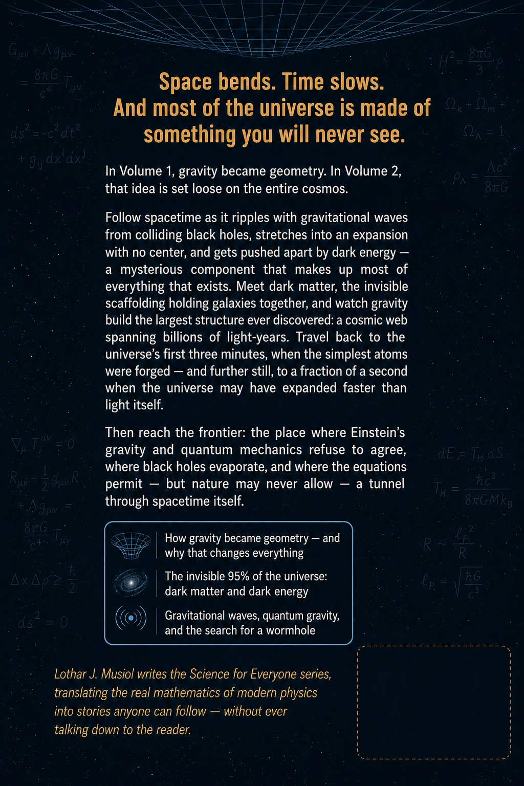

# Also by Lothar J. Musiol

**Physics, Actually**

- Physics, Actually, Volume 1: Motion, Forces, Time, and Relativity

- Physics, Actually, Volume 2: Gravity, Cosmology, and the Limits of Spacetime

- Physics, Actually, Volume 3: The Standard Model, Chaos, and the Edge of Knowledge

**Life, Actually**

- Life, Actually: From the First Cell to the Edited Genome and the Search for Life Elsewhere

**Math, Actually**

- Math, Actually, Volume 1: From Arithmetic to Calculus

- Math, Actually, Volume 2: From Multivariable Calculus to Set Theory & Logic

- Math, Actually, Volume 3: From Differential Equations to Abstract Algebra

- Math, Actually, Volume 4: From Category Theory to the Frontier

**Quanta, Actually**

- Quanta, Actually, Volume 1: The Quantum World

- Quanta, Actually, Volume 2: The Quantum Conversation

- Quanta, Actually, Volume 3: Complete Quantum Electrodynamics Course

**Science Sparks**

- Science Sparks: Physics, Life, and Mathematics — The Same Few Rules, Told in Highlights

**Look First**

- Look First, Volume 1: The Universe Has No Now

- Look First, Volume 2: A Trip Is Not a New Life

**Electrical Engineering Series**

- Foundations of Electronics (Book 1)

- Circuits, Components, and Control (Book 2)

- Semiconductor Physics and Devices (Book 3)

- RF, Microwave, and Transceivers (Book 4)

- Communications, Wireless, and SDR (Book 5)

- Power and Energy (Book 6)

- Packaging, Layout, EMC, and Test (Book 7)

**History**

- The Dolphins' View of History

**Fiction**

- The Murder That Hadn't Happened Yet (The Relativistic Investigation Bureau, Book 1)

- The Warning That Was Sent Too Late (The Relativistic Investigation Bureau, Book 2)

- Schrödinger’s Paperwork (Lolly Wren’s Curious Science Adventures, Book 1)

- The Permitted Options (Lolly Wren’s Curious Science Adventures, Book 2)

- Protocol Flamingo (The Invasion Storybooks, Book 1), as George Herbert Fontaine

**How-To**

- Your First Book That Sells

- Your First YouTube Channel That Rocks

