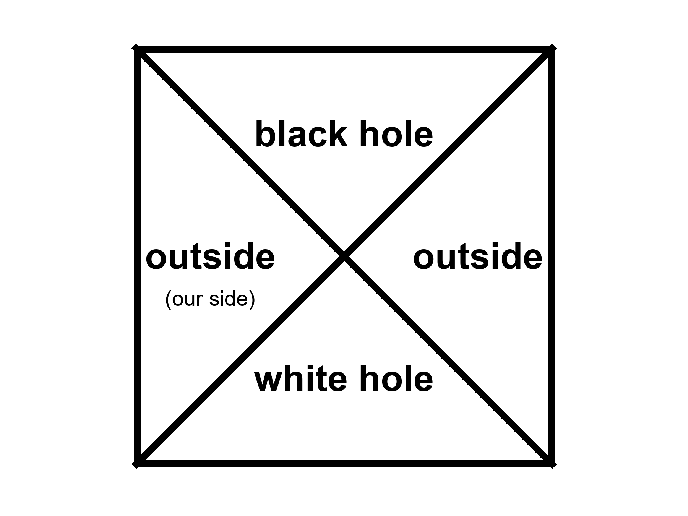
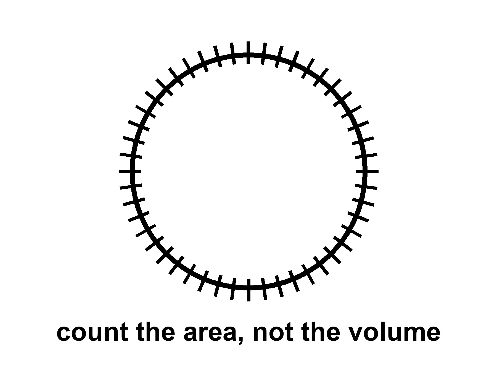

# PART V — One-Way Membranes

---

## 20. A Horizon Is a Fact About Events

A black hole is not a cosmic drain with a personality. It is a one-way membrane in the loaf.

Pick an event — a flash of light, a last radio beep, the moment a clock’s hand ticks. From that event, some future events can still be reached by a signal that never exceeds light. Some cannot. The boundary between those two sets, when gravity has bent the loaf enough, can close on itself. Inside, every future of every event leads deeper. Outside, you can still choose. The closed boundary is the horizon. It is not made of a material. It is made of *facts about which events can influence which others*.

Karl Schwarzschild, in 1916, found the first exact hole in Einstein’s equations while dying, more or less, on the Eastern Front. The radius that now carries his name is

*r_s = 2GM / c²*

*where G is Newton’s constant, M is the mass, and c is the speed of light.*

For the Sun, that radius is about three kilometers. The Sun is not a black hole; it is much larger than its Schwarzschild radius, and proud of it. Squeeze the Sun into those three kilometers and the membrane forms. For Earth, the radius is about a centimeter. For a mountain, it is smaller than a nucleus and we do not live in a cartoon. For the object in the middle of the galaxy M87, it is comparable to a solar system. The Event Horizon Telescope did not photograph the membrane. It photographed the *shadow*: the silhouette of paths that could not escape, against a glowing ring of gas that still could.

Hot claim: horizons of this kind exist. Stars orbit something compact and enormous in galactic centers. Mergers ring spacetime and LIGO hears the ring. The shadow is now a picture. Warm claim: inside the membrane, Einstein’s theory keeps going until a singularity, a place where the theory itself throws up its hands. Cold claim: we know what replaces the singularity. We do not. Quantum gravity is a research program. String theory offers replacements. **String theory cannot currently be tested.**

The kitchen mistake is to think of the hole as an object you could poke. The useful thought is the membrane of events. Cross it, and your future cone no longer includes Earth. Earth can still include you in *its* past, for a while, as a redder and redder last beep. That asymmetry is the whole joke and the whole tragedy. It is also why a hole is not a door.

---

## 21. An Hour Beside the Edge

Clocks run slow when they sit deep in a gravitational well. This is not a rumor from a story. It is why a clock on a rear truck bed, driven up a mountain and back, comes home younger by a number you can write on a grant application. It is why GPS, without corrections, would slide your map into a river.

Near a horizon the same fact becomes rude. A clock hovering just outside, fighting with rockets to stay put, ticks slowly compared with a clock far away. An hour there can be years elsewhere. The numbers in posters — an hour for seven years — require a hole that is both enormous and spinning almost as fast as a hole is allowed to spin. Spin helps. A spinning hole, a Kerr hole, drags space with it and permits stable orbits closer in, where the well is deeper and the tides, for a given mass, are gentler. A supermassive hole can have an hour-beside-the-edge without spaghettifying the visitor. A stellar-mass hole would turn the visitor into a rumor of atoms before the hour was interesting.

Imagine a woman in a small station, parked in that close orbit, tending a rack of algae because someone still has to eat. Her radio to a ship farther out is not just delayed by distance. It is delayed by *time*. She says “good morning” and the ship hears it on a Thursday she will never have. She is not time-traveling. She is accumulating less proper time between two meetings. When she climbs back out, the ship’s crew has more gray in it than her mirror. The loaf did not rewind. Two worldlines of different lengths met again.

This is the twin effect with a well instead of a rocket, and it is the only kind of “time travel to the future” relativity hands out for free. It is one-way in the human sense. She cannot take the extra years back. She can only have fewer of her own.

Appendix A21 writes the dilation factor and the innermost stable orbit. Here, keep the two clocks. If you remember nothing else, remember that “now” was already in trouble in the kitchen. Beside the edge it is in ruins.

---

## 22. The Hole That Runs Backward

If you take a black hole and run the film of spacetime backward, you get a white hole: a membrane you can leave but never enter. Light can come out. Nothing from the outside can go in. In the full, idealized diagram of a non-spinning hole — the Kruskal diagram, which looks like a secret handshake and is, in the appendix, four rooms — there is a black hole region, a white hole region, and two exteriors that meet only at a throat that pinches.

No one has ever seen a white hole. They are allowed as mathematics and unwelcome as astrophysics. They are unstable the way a pencil on its point is unstable. The universe, as far as we can tell, makes membranes in one direction: collapse, inward, one-way in. It does not spray matter out of ready-made white fountains.

People like to say the Big Bang was a white hole. The analogy has a poetic muscle and a scientific limp. A white hole is a local object in a larger spacetime. The bang, as Chapter 7 insisted, was not a bomb in a warehouse. It was everywhere. You can draw pictures in which a bang looks, mathematically, like a time-reverse of a collapse. You can also draw pictures in which it does not. Penrose’s cyclic cosmology, a cold idea with a serious author, tries to glue a remote, empty future to a next bang with a conformal trick. That is not a white hole in the sky. It is a maybe about the shape of the whole loaf.

For this book’s purposes, the white hole is a reminder: time-symmetric laws do not have to make time-symmetric *objects*. Eggs smash. They do not unsmash. Horizons form. They do not, around us, unform into fountains. The arrow is in the boundary, in the low-entropy past, not in the membrane’s manners.

---

## 23. The Skin and the Leak

Jacob Bekenstein asked a rude question in the early 1970s: if you throw an encyclopedia into a black hole, where did the information go? If it vanishes, physics has lost its memory. If it stays, it has to stay somewhere that still counts.

He argued that the hole’s entropy — its hidden information, its unread library — scales with the *area* of the horizon, not the volume inside. The same calculation that fixed the coefficient also made the hole glow. The entropy is

*S = kA / 4ℓ_P²*

*where A is the horizon area, k is Boltzmann’s constant, and ℓ_P is the Planck length, a ridiculously small ruler made from G, ħ, and c.*

One bit per few square Planck lengths on the skin. The inside, however deep it seems, does not get extra shelf space. This is the holographic idea in its first, stubborn form: the inventory of a region can be written on its boundary.

People then got ambitious. Maybe the whole universe is a hologram. Maybe a gravity theory in a volume is secretly a quantum theory on a wall. In one special, negatively curved kind of space, this has been made precise enough to write papers that get jobs. That space is not our accelerating, leftover-glow space. The leap from “black holes count on their skin” to “your kitchen is a projection” is a leap. Warm-to-cold. Useful as a constraint: you do not get to invent an infinitely roomy crunch-computer (Chapter 19) without saying where the bits sit. Tipler needed a loophole in a bound like this. The bound is not impressed.

Holography does not cancel events. It relocates the bookkeeping. The loaf may be a projection of something thinner. The events you care about — a last beep, a first helium nucleus, a woman saying good morning to a Thursday she will not have — still happen. They may have fewer hiding places than a volume would suggest.

The glow is a slow leak from the membrane.

In the kitchen version: near the horizon, the vacuum’s jitters get sorted. One part of a jitter falls in. The other part escapes. From far away, the hole is radiating, very slightly, as if it had a temperature. Small holes are hotter. A hole the mass of a mountain would sizzle. A hole the mass of a star is colder than the leftover glow and, today, *gains* weight from the sky faster than it leaks. Only in the unimaginably far future, after the leftover glow has thinned, would stellar holes begin to lose.

If nothing interrupts, the leak eventually takes all the mass. The hole shrinks, heats, shrinks faster, and ends in a last, small violence. Whether the encyclopedia comes back in the last violence, or came out slowly in the glow, or is written on a remnant, is the information problem. It is unfinished. It is not unfinished in a way that lets you use a hole as a filing cabinet for resurrection.

Hawking radiation has not been seen from an astrophysical hole. It is a derived glow, as firm as a derivation can be without a photograph. Laboratory analogs — sound horizons in fluids, tricks with lasers — have made related noises. They are encouraging and not the same as weighing a photon from Cygnus X-1.

For the travel chapters, the leak is a timekeeper. It says black holes are not eternal furniture. They are long-lived, then gone, on clocks that make civilizations look like sparks. If you want a library to last, do not drop it in. Put it under ice, or in a vault, or in a machine that can wait. The membrane is a fact about events. It is not a basement.

---

## 24. Not a Door

The last mistake is the door.

A door has two sides you can use. A horizon has two sides you cannot trade. Fall in and you do not come out “somewhere else” in this universe with a story to tell. In the classical theory you come to a singularity, a ripped place in the loaf, and the theory stops. In speculative theory you might come to a bounce, a baby universe, a tangle of extra dimensions. Those are cold. They are also, even if true, not a transit system. A baby universe you cannot call is not a destination. Extra dimensions offered by string theory come with the standing rule: **the framework cannot currently be tested.**

Wormholes, in Chapter 33, are a different object: a handle, not a membrane. People blur them because both are “holes” and both are associated with Einstein. Do not blur them. One is common and one-way. The other is unphotographed and probably expensive beyond engineering.

Penrose’s singularity theorems, and Hawking’s cosmological versions, say that if gravity pulls in the ordinary way and energy behaves, collapse and bang-like expansions have boundaries the geodesics cannot extend through. Inflation and dark energy violate some of those energy assumptions, which is why the theorems are not a courtroom for “the universe began” in every model. They are still a courtroom for “you may not treat the inside of a hole as a hallway.”

So: no transit. No filing cabinet for souls. No steered crunch. A shadow in a ring, a slow leak, a one-way fact about events. That is the honest hole. It is enough. It is already stranger than a door.
