# The Universe Has No Now

*Time, Origins, and Whether We Can Get Somewhere Else*

*by Lothar J. Musiol*

---

\newpage

## Copyright

The Universe Has No Now: Time, Origins, and Whether We Can Get Somewhere Else

Copyright © 2026 Lothar J. Musiol. All rights reserved.

Look First, Volume 1.

---

\newpage

## How to Read This Book

Every claim in these pages wears one of three temperatures. The difference matters more than any formula.

**Hot — established.** Measured, repeated, and used to predict new measurements. The universe is expanding. Space is filled with a 2.7-degree glow left over from a hot past. Ordinary matter is a minority ingredient. Black holes exist. There is no single “now” shared by observers who move differently.

**Warm — working theory.** The best account we have, with real gaps. A burst of extremely fast expansion in the first sliver of a second (inflation) explains several facts at once, but we have not identified the field that did it. Most of the mass that pulls on galaxies does not emit light; we do not know what particle, if any, it is. Empty space behaves as if it has a faint energy of its own; we do not know why that energy is the size it is.

**Cold — speculation.** Allowed by the equations, not selected by the data. Traversable wormholes. A required final state in which life computes forever (the Omega Point). A stack of universes with different laws. Extra dimensions from string theory.

On that last item, a standing rule. **String theory, whenever it appears in this book, cannot currently be tested.** It is a large, ingenious mathematical framework. It has not produced a unique, risky prediction — a number or a signature that would kill the whole idea if the experiment came out otherwise. Extra dimensions and a “landscape” of possible laws inherit that status. They may be mentioned because popular physics mentions them. They are not results.

A few scenes in this book are stories: a greenhouse on a dead planet, a radio that answers a quarter-hour late, a clock that runs slow beside a black hole, a melt-probe chewing through kilometers of ice into a sea that has never seen the Sun. They are thought experiments with dirt on them. The numbers in them are real. The people are invented. They are here so the geometry has somewhere to sit besides a diagram.

The main chapters keep the math in the sentence, the way a good explainer talks at a table. A handful of relations are important enough to number. Those numbered equations live in the Appendix, where the treatment is actually technical: the Friedmann equation, the spacetime interval, the helium calculation, the Bekenstein bound, the energy condition a wormhole has to break. If you want the scaffolding, it is there. If you want the story, you can finish the book without opening the back.

This edition is longer than a Barrow pamphlet on purpose — about four hundred Kindle pages, not two hundred. The extra is not padding. It is the second trunk, the leftover in the air, the crew that does not sleep, the loop that calls itself I, and a path that refuses a last chapel. The sentences stay short. The inventory grew.

You do not need a physics degree. You need curiosity and a willingness to let “now” come apart.

---

\newpage

## A Note on the Series

This book is Volume 1 of *Look First*. It is a complete book. You are not being assigned homework.

If you liked the greenhouse and wanted a downtown, that want has a later kitchen: *A Permit Is Not a City* — Moon, Mars, and why leaving does not clean the one you already staff. If you liked the carrot and wanted helium, that want has a later kitchen: *The Body Keeps Its Own Clock* — lifespan, minds, and why ten thousand years is not a straight line.

Those books stand alone. They reuse a woman, three temperatures, and a habit of looking first. They do not reopen this spine. You can stop here. The leftover glow will still be late tomorrow.

---

\newpage

## Author’s Note

Most people meet the universe in the wrong order.

First comes the solar system, then stars, then a chapter that says the galaxies are flying apart, then — if the book has nerve — a sentence about the Big Bang. Time is treated as the thing the story runs *in*, the way a clock is assumed to run on a wall. Black holes arrive as monsters. Dark matter arrives as a rumor. Wormholes arrive as promised shortcuts. String theory arrives as the thing “they’re working on,” which the listener is invited to treat as almost done.

That order is historically understandable. It is roughly the order we discovered these things. It is not the order that makes the structure easiest to see.

This book runs a different sequence on purpose. It starts with *events*, because that is what relativity actually talks about, and with the fact that two people can disagree about which events are simultaneous without either of them being wrong. Only after “now” has been retired as a universal fact does it turn to the hot past, the leftover light, the missing mass, the missing energy, the one-way membranes we call black holes, and the shortcuts that probably do not exist. The questions people actually want — Can we get somewhere else? Is there a multiverse? Was the universe made for us? Does time exist? — are delayed until the words have meanings.

John D. Barrow’s short book *The Origin of the Universe* is the formal model: brief chapters, no swagger, a clean line between a measurement and an idea for ideas. Steven Weinberg’s *The First Three Minutes* is the model for the thermal past — a reconstruction, minute by minute, that anyone can follow and that happens to be right. Sean Carroll’s work on the arrow of time, Alan Guth’s and Andrei Linde’s inflation, Roger Penrose’s singularity theorems, P. J. E. Peebles’s insistence that structure is a physical problem, Katie Mack’s tour of cosmic endings — these are the sources. They are used. They are not copied. Where they disagree, the disagreement is the point.

A book like this should not succeed because a reader can recite a definition of spacetime. It should succeed if a sequence of recognitions arrives and stays:

that an event is a happening, not an object;  
that “now” is a slice you draw, not a pulse the cosmos shares;  
that the past is reconstructible in detail for the first three minutes and foggy before that;  
that most of what gravitates does not shine, and most of what speeds the expansion has no agreed name beyond “dark energy”;  
that a black hole is not a door;  
that a wormhole, if it existed, would be a handle on the block, not a subway;  
that looking arranged is not the same as being arranged;  
that every allowed quantum outcome may already be on the inventory — and that you still have only one worldline to live;  
and that the future, on present evidence, is allowed to be empty of us.

That last recognition is not a counsel of despair. It is the opposite. If meaning is not scheduled for the end of time, it has to be made in the middle, which is the only part of the block we occupy — this copy, this planet, this launch window.

Readers of *The Quantum Conversation*, elsewhere in this series, will notice a family resemblance: start with the variable that makes the physics simple, not the variable that got discovered first. There, the variable was phase. Here, it is the event.

---

\newpage

## Prologue: The Clock That Does Not Agree

There is a clock on the kitchen wall, and it is lying to you — not by being fast or slow, but by pretending that “now” is a thing the universe shares.

You glance at it. Somewhere, at what that clock would like to call the same moment, a star in Andromeda finishes a flare. A neutrino left the Sun eight minutes ago and is about to pass through your hand without asking. A galaxy so far away that its light began traveling before Earth had multicellular life is, at this instant — if the word still means anything — already receding so fast that no message you send will ever arrive.

The clock cannot hold those facts together. It was built for a kitchen.

This book is about what replaces the kitchen clock once you take Einstein seriously, and then take the sky seriously after that. It is a scientific book. It is also meant to be a good time. Those two aims are not at war. The universe is allowed to be precise and still be the strangest story anyone ever told.

The short version, before it has been earned:

Space and time are not a stage with a single present tense. They are a four-dimensional spread of *events* — happenings with a where and a when. Your life is a thin thread through that spread. Quantum mechanics, read one way, says the spread is larger still: every outcome the equations allow is on the inventory, not just the outcome you remember. All the times. All the versions. Not as a carnival trick — as a reading of the same rule that tells an electron where it may be found. That reading is a core element of this book. It is also, for now, a warm claim, not a photograph.

The past we can reconstruct, from a hot, dense beginning through the forging of hydrogen and helium to the leftover glow in every direction, is not a myth. The future we can forecast, with the same equations, does not owe us a reunion, a resurrection, or a cosmic purpose. If the universe looks arranged for observers, the honest move is the one Darwin made on Earth: look for a filter, not a craftsman.

If you have ever stood outside at night and felt, for a second, that the dark was not empty but *late* — that you were looking into travel time — you already have the instinct this book is going to use.

\newpage

# PART I — There Is No Now

---

\newpage

## 1. The Argument in the Kitchen

Imagine two people in a kitchen arguing about whether the casserole is done. One is standing still, pot holders ready. The other is walking toward the table. They agree on the recipe. They agree on the oven. They do not, if you take them seriously as physicists, agree on which distant events are happening “right now.”

That sounds like a joke. It is the opening move of twentieth-century physics.

In Newton’s world the joke would be on the physicist. Space was a box. Time was a universal tick, the same in London and on Jupiter. You could, in principle, freeze the universe and take a photograph of “everything at this instant.” The casserole, the moons of Saturn, and a supernova in a galaxy we have not named yet would all sit in one frame, labeled NOW.

Einstein broke the camera.

He did not do it to be difficult. He did it because the speed of light refused to play along. Measure that speed while you are standing still; then measure it while you are on a train. You get the same number. Not almost the same — the same. The only way that can be true, if space and time are allowed to share the job of keeping accounts, is if people who move relative to each other slice the world into “now” differently.

The kitchen clock is a local tool. It is an excellent local tool. It tells you when to take the casserole out. It does not tell you what is happening on Andromeda. Nothing does, instantly. Light from Andromeda takes about two and a half million years to finish the trip. Any claim about what is “now” happening there is a claim about how you choose to extend your kitchen instant across empty space. Different motions, different extensions, different nows.

This is not mysticism. It is not “everything is relative” in the freshman-poster sense. The speed of light is not relative. The order of cause and effect, for events that can actually influence each other, is not relative. What is relative is a luxury we never noticed we were taking: a single present tense for the whole universe.

Once that luxury is gone, several other ideas have to be rebuilt. The past is not a country that has vanished. The future is not a country that has not yet been founded. Both are regions of a four-dimensional object that physicists call spacetime. Your life is a path through it. The path has a beginning and, for you, an end. The object does not have a glowing edge labeled NOW that advances like a weather front.

That is the claim of Part I. The rest of the book will spend it on the sky: on a hot beginning, on a leftover glow, on mass that does not shine, on doors that do not open, on the temptation to think the whole construction was arranged for us. None of that works if we keep the kitchen clock as the official time of the cosmos.

Take the casserole out when your clock says so. Then look up, and notice that the dark is late.

---

\newpage

## 2. An Event Is a Happening, Not a Thing

Physics, at this level, does not start with objects. It starts with *events*.

An event is a happening with a location and a time — or, more carefully, a happening that can be given four numbers once you have chosen a way to measure. A firecracker goes off. A photon hits a detector on a satellite. Two black holes finish colliding and ring down. You finish this sentence. Each of those is an event. A person is not an event. A person is a long, messy chain of them.

This sounds like bookkeeping. It is the opposite of bookkeeping. It is a decision about what the universe is made of.

A *thing* — a rock, a star, a spaceship — is a habit we form when a bundle of events stays in step. The rock is the history of a certain clump of atoms. The star is a history of fusion, light, and collapse. If you insist that the rock is the fundamental item and time is something that happens *to* it, you will spend the next century fighting Einstein, and you will lose.

Give each event four coordinates. Three of them are the ones you already use to find a restaurant: a grid on the Earth, or a grid in the sky. The fourth is a clock reading. The set of all events, related by which ones can influence which others, is spacetime. Minkowski, who taught Einstein the geometry of this, put it in a line that still startles: henceforth space by itself, and time by itself, are doomed to fade into mere shadows.

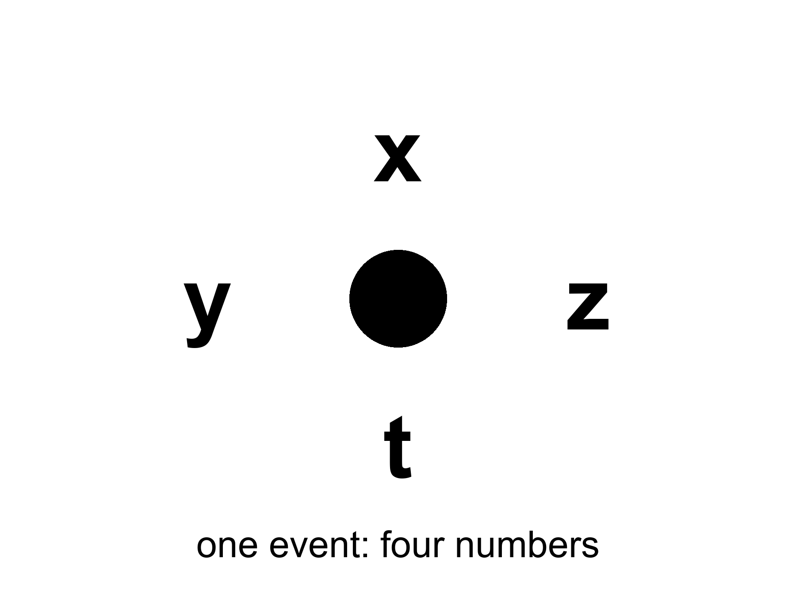

The useful picture is not a box of space with a clock hanging on the wall. The useful picture is a loaf. Each event is a crumb. A *worldline* is the trail of crumbs that is you — or the Earth, or a photon. A photograph of “the world at a given time” is a slice through the loaf. The slice is not unique. Tilt your knife — which is what changing your motion does — and you cut a different set of crumbs.

Two events can stand in only a few relations that matter.

They can be close enough, in the right combination of space and time, that a light signal or something slower could pass from one to the other. Then one can be a cause of the other. Everyone agrees on the order. This is a *timelike* or *lightlike* separation, and it is the part of physics that still has a before and an after.

Or they can be so far apart, compared with the time between them, that not even light can connect them. Then neither is the cause of the other. Different observers can disagree about which happened first. This is a *spacelike* separation. The casserole and a flare on Andromeda, “at the same kitchen instant,” are almost certainly spacelike. There is no fact of the matter about which was first that the universe is required to honor.

Appendix A2 writes this as a single formula: the spacetime interval. The interval is the same for every observer. The split of that interval into “so much space” and “so much time” is not. That is the entire trick. The loaf has a real geometry. The slices are ours.

If you take nothing else from this chapter, take this: when a physicist says *spacetime*, they are not being fancy about the word *background*. They are telling you that the raw inventory of the world is events, and that time is one of the ways events can be separated — not a river the events float in.

---

\newpage

## 3. Light Is Late on Purpose

We talk about looking into space. We are always looking into the past.

The Sun you see is eight minutes old. Jupiter, tonight, is about forty minutes old. The Andromeda Galaxy is two and a half million years old in your sky. The leftover glow this book will spend Part II on is a picture of the universe as it was when it was 380,000 years old — a baby picture with the baby long gone.

This is not a limitation of our instruments. It is what a finite speed of light *is*. If light were instant, “now” would still be a problem for moving observers, but the night sky would at least be a live feed. It is not a live feed. It is an archive. Every direction is a different depth of time.

People find this either depressing or wonderful. Both reactions are allowed. The scientific point is narrower. Because light is late, astronomy is already time travel of the only kind we actually have: we receive news of events that lie to our past, along our past light cone.

A light cone is not a party decoration. From any event — say, you snapping your fingers — draw every path a light ray could take into the future, and every path a light ray could have taken to arrive there from the past. The future cone is everything you can still affect. The past cone is everything that can still affect you. Everything else is *elsewhere*: real, possibly interesting, and unavailable as a cause or an effect of this snap.

The night sky is the past cone, printed on the inside of your eye.

This is why “getting somewhere else in the universe” is not an engineering slogan. Most of the interesting somewhere-elses are already outside the future cone of any event you will live to occupy. You can wait. You can send a probe. You cannot, in this spacetime, jump sideways into elsewhere and arrive for dinner. Chapter 33 will take up the proposed cheats — wormholes, warps, a handle on the block. The cheats have to break something in the loaf. Light’s lateness is not an inconvenience we can edit out. It is the geometry.

You do not need Andromeda to feel this. A conversation with someone on Mars is already broken. Light takes between four and twenty-four minutes for the round trip, depending on where the two planets sit in their orbits. You cannot talk. You can only send, and wait, and send again. That delay is Chapter 3, scaled to a neighbor planet. Elsewhere begins at the next planet over.

There is a kindness in the lateness, if you want one. The universe is not happening *at* you. It is arriving. The glow behind the stars, the one you cannot see without an antenna, has been arriving for thirteen billion years and will keep arriving tomorrow. You do not have to go anywhere to be in contact with the beginning. The beginning is late, and it is here.

---

\newpage

## 4. Andromeda’s Navy

Here is the thought experiment that makes the kitchen argument unavoidable. It is often called the Andromeda paradox, and Roger Penrose gave it the version physicists still use.

You are standing in the yard. A friend walks past you, toward Andromeda, at an ordinary pace — a stroll. Special relativity says that the set of events your friend calls “simultaneous with this passing” is tilted, very slightly, relative to yours. Over the distance to Andromeda, a slight tilt is not slight. On your “now,” the Andromedans (if any) are, say, sitting in committee. On your friend’s “now,” the committee has already launched a fleet.

Neither of you can see the fleet. The light has not arrived and will not arrive for millions of years. The point is not what you see. The point is what you are tempted to call real.

If you believe that only the present is real — that the past is gone and the future is not yet — then you have a problem. You and your friend, standing in the same yard, passing each other at walking speed, do not share a present at Andromeda. If her present is real and includes a launched fleet, and your present is real and does not, then “real” has split in the yard.

The clean way out is to stop granting a privilege to the slice. The fleet-launch is an event. The committee meeting is an event. Both are in the loaf. You will learn about them, if at all, when their light arrives. Until then they are not “future” in some ghostly sense and not “present” in some official sense. They are simply events that are spacelike-separated from this moment in the yard.

Hilary Putnam and C. W. Rietdijk made this into a formal argument in the 1960s: if whatever is present-for-someone is real, and if reality does not depend on who is walking, then distant future events are already real. Philosophers have been picking at the logic ever since. Some reject the idea that “real for Alice” transfers to Bob. Some try to keep a privileged present by adding extra structure that relativity does not provide. Some accept the loaf and get on with their lives.

This book accepts the loaf. Not as a religion — as the reading that does the least violence to a theory that has passed every test we have given it. GPS satellites run a daily demonstration: if you do not correct their clocks for both speed and gravity, your phone’s map slides into a ditch. The corrections are the same mathematics that tilts the Andromeda slice.

You do not need to believe that 2219 is “already happening” in some lurid sense. You need to believe something quieter: 2219 is a region of the same object 1914 is a region of. The difference is which events can still influence the ones that make up you.

That quieter belief is enough to rewire the rest of the book. The beginning of the universe is not a story that *used to* be true. It is a region of the loaf. The heat death, if that is what we get, is another region. We occupy a thin braid in between.

---

\newpage

## 5. You Are a Path

If the universe is a loaf of events, you are a thread.

A worldline is the set of events that is a particular object’s history. The Earth’s worldline is a long helix around the Sun’s, which is a longer helix around the galaxy’s. A photon’s worldline is a straight edge of a light cone — as straight as the geometry allows. A person is a bundle of worldlines, roughly parallel, that eat, argue, and occasionally write books.

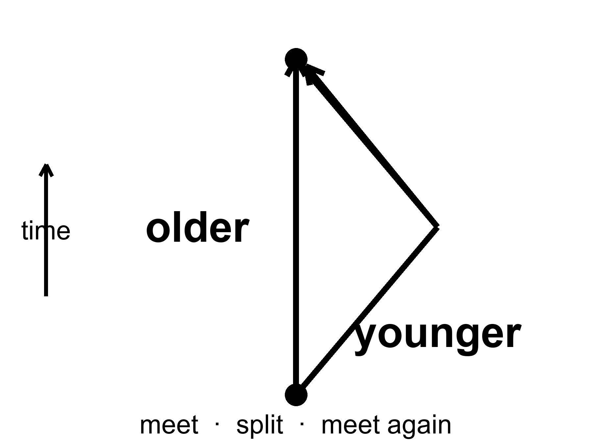

You do not move *through* time the way a boat moves through a river. That sentence, which feels like common sense, smuggles the river back in. What you do is occupy a sequence of events. The sequence has a length. That length is the time your watch measures, and it is called proper time. Proper time is not a coordinate someone assigned from a tower. It is a property of the worldline, the way a hiking trail has a mileage that does not depend on which map you used.

Two worldlines that start together and end together need not have the same length. This is the twin “paradox,” which is not a paradox. The twin who accelerates, turns around, and comes home has a shorter worldline. She is younger. The loaf does not care that this offends the kitchen clock. Particle accelerators run the same experiment all day: unstable particles that travel fast live longer, as measured in the lab, because their worldlines between two lab events are shorter in proper time, which means their internal clocks tick through fewer of their own seconds. The word “live longer” is a lab word. In their own terms they live a normal life and the lab takes forever.

Gravity bends worldlines. That is what gravity *is*, in Einstein’s account: mass-energy tells spacetime how to curve; curved spacetime tells worldlines how to lean. A clock deeper in a gravitational well accumulates less proper time between two meetings than a clock higher up. This has been measured with aircraft, with towers, with atomic clocks in trucks, and with those GPS satellites. Near a black hole the same fact becomes extreme: an hour beside the horizon can be years farther out. The cartoon is unnecessary. The clocks are enough.

Once you are used to worldlines, several puzzles lose their fog.

“Where is the universe expanding *into*?” is a thing-question. Expansion is a change in the distance between worldlines of galaxies, measured at successive meetings with light. There is no need for an outside.

“What happened before the beginning?” is a river-question. If the loaf has a boundary — and it may — then “before” is a word that applies inside the loaf, not to a waiting room outside it. Chapter 44 will take this as far as anyone honestly can.

“Can I go back?” is a thread-question. Going back would mean your worldline looping so that it meets an earlier event on itself, or on someone else’s line, in the wrong order. The loaf’s geometry may or may not allow such loops. Ordinary spacetime, the kind we have measured, does not hand them out. Chapters 35 and 36 are about that.

For now, keep the thread. You are not a passenger in time. You are a path.

---

\newpage

## 6. The Block

Call the loaf by its public name: the block universe.

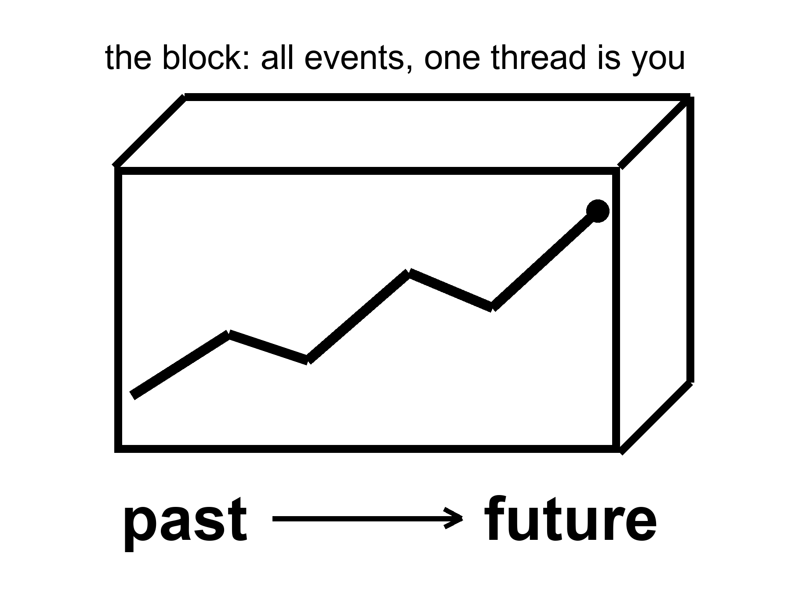

The block is not a brick. It is the claim that past, present, and future events are equally part of the inventory. The “present” is the event-cluster you are using as a vantage. It is not an ontological VIP section.

People dislike the block because it sounds like fatalism. If 2219 is “already there,” was anything I did today a choice? The honest answer is: your choice is an event too. It has causes in its past cone and effects in its future cone. The block does not steal the choosing. It refuses to make the choosing into a little glow that travels along the thread, lighting up real events and leaving the rest in storage. The choosing *is* a stretch of the thread.

There are rivals.

*Presentism* says only the now is real. Relativity of simultaneity makes a single cosmic now a piece of extra furniture. You can add the furniture. The theory we test does not require it, and the Andromeda argument is waiting in the yard.

*The growing block* says the past and present are real and the future is not yet. The loaf grows. This matches the feeling of time better than the finished block. It still needs a fact about which events have “already grown in” at Andromeda — the same fact relativity will not supply without help.

*The evolving block*, in some quantum-gravity sketches, tries to let new events become definite as decoherence happens. That is a research program. It is not a measurement.

This book will treat the block as the default reading of spacetime, and then notice where physics puts pressure on it. The arrow of time — why we remember the past and not the future, why eggs break and do not unbreak — is not explained by the block. The block is time-symmetric in its basic laws. The arrow needs a fact about the *boundary*: the early universe was absurdly ordered. That is Carroll’s Past Hypothesis, and it is why Part II is not optional philosophy. The hot, smooth beginning is the low-entropy end of the loaf. We are downstream of it. That is why there is a difference between looking that way and looking the other way.

Quantum mechanics puts a different pressure on, and this book treats that pressure as a core element, not a cameo.

The equation that describes an electron does not, by itself, pick a single outcome. It assigns an amplitude to each way the story might go. One reading — Hugh Everett’s, later sharpened by people who take the equation literally — says the leftovers are not discarded. When a measurement could have gone two ways, both ways persist, decohered, no longer able to interfere. The block is not only all the times. It is all the allowed versions. You are one thread in a loaf that splits.

That sentence is where a sermon likes to sit down. *Reality only forms when it is observed.* The equation does not say that. The equation says that amplitudes interfere until a system becomes entangled with something that will not give the interference back — an environment, a plate, a wall of photons that have left and will not return. That is decoherence. It is a calculation you can assign a time to. It does not require a soul.

So what counts as an observer?

Not a person, first. A person is a late, expensive observer: a nervous system that keeps a model and can be surprised. In the laboratory sense an observer is any degree of freedom that acquires a *record* — a correlation stable enough that you would have to conspire with the whole environment to undo it. A silver grain that darkens. A Geiger tube that clicks. A dust mote whose spin will never again line up with its twin. The leftover glow, last-scattering at 380,000 years, is a record written before any eye. The helium of Chapter 10 is a record written at three minutes. If “observe” means “leave an irreversible trace,” the universe has been observing itself since it was a fog. You were not needed for the fog to have a temperature.

If “observe” means “a mind noticed,” you have added a postulate the amplitudes do not ask for. Wigner can put a friend in a lab and argue about when the wavefunction collapses. That is a quarrel about the word *record*, not a proof that the Moon is a sketch until you look up. Consciousness-causes-collapse is a minority reading with a famous pedigree and no extra prediction you can miss. This book will not hire it. Everett does not need it. Decoherence does not need it. Relativity, which already forbade a single now, will not wait while a mind in one kitchen switches Andromeda on.

There is a better picture of what a mind *feels like* from the inside, and it does not need a collapse.

Call it a strange loop. A system writes symbols. Some of the symbols point at the system that is writing them. The map contains a sketch of the mapmaker. The hierarchy tangles: the “up” of explanation (neurons, then thoughts, then an I) folds back so the I is what the neurons are doing, and the neurons are what the I takes itself to be made of. No extra spark. A level-crossing. The word *I* is what that loop sounds like when it has a mouth. An observer, in the expensive sense, is a record that has begun to model the fact that it is a record. An ant is not that loop. A nest of ants, taken as a whole — a city that farms and wars and does not know the name of a single worker — is a cheap sketch of the same trick. Chapter 32 will use the nest as a scale. Here it is a diagram of a self: meaning that is not in the parts, and is not a ghost. It is an isomorphism, a translation, a tangle.

That picture is warm as phenomenology and cold as a proof that the leftover glow needed us. The glow was a record without a loop. The helium was a record without a loop. The loop arrives late, on a thread, and then has the nerve to ask whether the fog was real before it got here. It was.

EPR — the 1935 complaint that quantum mechanics lets a measurement here fix a pairing there, “at once” — is the same room with better furniture. The pairing is real. Bell showed the pairings are stronger than any local recipe of hidden instructions. Aspect and the rest measured that. Hot. What is not on offer is a telegram. You cannot choose what to do here in a way that sends a bit there. The no-signaling theorem is the grown-up name for Einstein’s unease, resolved without a radio. “Simultaneous action” is already a phrase the kitchen clock should not be allowed to use. There is no shared now in which the two ends happen together. There is a correlation in the loaf. Chapter 40 will say it again: branches do not mail each other. Entangled ends do not either.

That is a warm claim. It is not a photograph of other lives, and it is not a travel method. Nothing in the equation hands you a way to hop from your thread onto a neighboring one and steal a different marriage, a different planet, a different you. The copies, if they are real, are as unavailable as Andromeda’s navy. They are on the inventory. They are not a destination. And the Moon was there before the first nervous system named it. The record was.

The practical fact is unchanged either way. The worldline you occupy is the only one you can work along. A crop grows, or it does not, in this dirt. A launch window opens, or you wait. Part VIII will take the copies seriously as physics. It will not pretend they are a destination you can enter.

Holography puts a third pressure on. If the information in a region scales with its surface, not its volume, the loaf may be a projection of something thinner. That is a warm-to-cold idea, and it does not cancel the events. It relocates them.

What the block does, for a book about origins and endings, is simple and a little severe. It lets us talk about the first three minutes and the last three minutes as regions, not as moods. It lets a wormhole be a handle connecting two regions, not a machine that “goes.” It lets the Omega Point — a hoped-for final crunch in which life computes forever — be judged as a claim about the shape of the future region, which the data currently contradict.

You can still say “now” in the kitchen. You should. Just do not promote the kitchen to a cosmology.

---

\newpage

# PART II — The Past We Can Rebuild

---

\newpage

## 7. The Explosion That Happened Everywhere

People hear “Big Bang” and picture a grenade in a dark warehouse: a bright point, a blast wave, shrapnel flying into empty rooms. That picture is wrong in every way that matters, and it is the reason smart readers keep asking a question that has no answer: *what did it explode into?*

It did not explode into anything. It was not a bomb in space. It was space, getting roomier, everywhere at once.

If you could have been present at a minute old — you could not have; there was no solid ground, no shadow, no place to stand — you would not have seen a fireball receding toward a horizon. You would have been *inside* the fireball, and so would every other direction. The glow would have been the walls, the floor, the air, the idea of “away.” Density would have been falling because the distances between nearby bits of stuff were stretching, not because the stuff was fleeing a scene.

A baker’s analogy earns its keep here. Imagine raisin bread dough rising in a warm bowl. Every raisin sees every other raisin recede. There is no special raisin in the middle of the dough. The “middle” is a habit we picked up from grenades. In a universe that is, on the largest scales, the same in every direction and at every place — the Cosmological Principle, a working rule with a lot of data behind it — every galaxy is allowed to feel like the center of the stretch. That feeling is a symmetry, not a privilege.

The equations that describe this are named for Alexander Friedmann, a young mathematician who, in the early 1920s, took Einstein’s gravity seriously enough to let the universe change size. Einstein had tried to freeze it with a fudge factor. Friedmann showed the freeze was optional. Georges Lemaître, a priest and physicist, said out loud what the math was hinting: the universe has a history. Edwin Hubble, with a telescope and a lot of patient plates of spiral nebulae, found that the farther a galaxy is, the faster it recedes. The grenade picture rushed back in through the newspapers. It has been misleading well-meaning people ever since.

Hot claim: the universe is expanding, and it was hotter and denser in the past. That is not a mood. It is the only account that has survived the leftover glow in Chapter 9 and the leftover helium in Chapter 10.

Warm claim: the simple expanding model — same in every direction, no special place — is a superb average. Under the average there is a foam of clusters and voids, which we will meet when quantum twitches get their chapter.

Cold claim, which this book will not smuggle in as fact: that the bang was a “beginning of everything” in the kitchen-clock sense, with a waiting room labeled BEFORE. The loaf may have a boundary. “Before” may not be a word that applies. Chapter 44 will sit with that until it stops itching.

Was there really a bang?

There was really a *hot, dense, expanding everywhere*. That is not a brand. It is two fossils and a stretch: the leftover glow, the leftover helium, the raisins receding. If you want the words “Big Bang” to mean a grenade, then no. If you want them to mean the past we can rebuild — a universe that was once a mixed fog, did nuclear work in minutes, and has been getting roomier since — then yes. The name is a nickname. The nickname stuck. The grenade did not.

It was not an exploding black hole. Say that out loud, because the picture is tempting and lame in the same breath. A black hole is a local one-way membrane in a larger loaf, made when a clump loses an argument with gravity. A white hole is that film run backward: a local fountain no one has seen. The bang was not local. There was no outside to explode into, no warehouse, no shrapnel crossing a pre-existing dark. Chapter 22 will give the white hole its four rooms and then take the analogy away. Here: **a hole is a place. The bang was a time.** You can write math in which a collapse, time-reversed, looks like a bang. You cannot point at the leftover glow and say “that was a star that burst.” Stars come later. Holes come later. The fog comes first.

So what was it *from*?

Not from a kitchen nothing — not from an empty room with the lights off and a magician. Empty, in physics, is already a something: a vacuum with rules, jitters, a leftover shove, a geometry. Pair production makes a particle and its opposite from energy, and the energy had to be in the account. The early soup made particles and antiparticles by the truckload and then almost canceled them. We are the rounding error: about one leftover nucleon per billion photons, Chapter 10’s ratio, the reason atoms are a footnote. That leftover is a *warm* problem with a name, baryogenesis — why the cancellation was rude by one part in a billion. We have recipes (a bit of leftover difference between matter and antimatter, a bit of out-of-equilibrium cooking). We do not have the dish photographed. “Matter from nothing” is a poster. Matter from a slightly unfair soup is the grown-up line.

What about the soup’s own origin — the first slice of loaf?

Inflation, if you buy it, pushes the question back: a burst of stretch, then a reheating that *is* the hot fog. The burst still wants a field, a vacuum, a reason. Quantum-gravity sketches try to stop using “before”: Hartle and Hawking round the loaf off so time only becomes time when there is enough of it; Vilenkin tunnels from a technical nothing that is not a kitchen nothing. Those are cold, and they are allowed to be. The fossils do not reach that room. They reach the fog, the three minutes, the glow. **We do not owe you a waiting room labeled BEFORE in order to say the fog was real.**

For now, retire the grenade. Retire the bursting hole. Keep the dough. The past we can rebuild is not a point. It is a hotter, smaller-spaced version of everywhere, made of a soup that almost canceled and didn’t, and we do not yet own the first word of the recipe. We own the leftovers. That is already a courtroom.

---

\newpage

## 8. Everything Is Stretching

In the 1910s, Vesto Slipher, working nights at a stubborn telescope in Arizona, noticed that the light from many spiral nebulae was shifted toward the red. Red, in the physics of waves, is the stretch. A siren falling away from you drops in pitch for the same family of reasons. Slipher did not yet know those nebulae were other galaxies. He had the stretch before he had the nouns.

Hubble and Milton Humason turned the stretch into a law. Plot distance against recession speed and you get a line, sloppy at first, cleaner every decade since:

*v = H_0 × d*

*where v is how fast a distant galaxy recedes, d is its distance, and H_0 — Hubble’s constant — is the slope, the stretch-rate of now.*

The number has been fought over for a century and is still being fought over a little. The fight is about the second digit, not about the existence of the line. Galaxies recede. Farther means faster. That is hot.

What is stretching is not the galaxies themselves, as if someone had put Andromeda on a rack. Bound things — people, planets, solar systems, galaxies — hold together. What stretches is the space between the unbound. Light traveling through that stretch gets its wavelength pulled longer. A photon that left a hydrogen atom as a sharp ultraviolet line arrives here as a tired red one. The amount of stretch is written *1 + z*, where *z* is the redshift. A galaxy at *z = 1* sent its light when the universe was half the scale it is today. A galaxy at *z = 6* is a teenager from when the first big galaxies were still assembling. The leftover glow of Chapter 9 sits at *z* about 1,100. We are looking at the universe when it was about a thousandth of its present size.

There is a cruelty hidden in the kindness of the deep field. The most interesting smudges are so far that their light has been in transit for most of the age of the universe. We will never send a reply that arrives while anything there still resembles what we photographed. Chapter 26 will make that official. Here it is enough to feel the stretch in your hands: the night sky is not a room. It is a history of rooms, stacked by how much they have been pulled since the light left.

One more detail, because it is beautiful and true. The Hubble law does not pick a center. If every raisin recedes from every other raisin in proportion to distance, then *your* raisin is allowed to write the same law. The slope is a property of the dough, not of a privileged kitchen.

Appendix A8 writes the redshift into the scale factor and shows how *H_0* is a snapshot of a function *H(t)* that has not been constant. Dark energy, when we get there, is a statement about that function’s later life. The stretch is older than the speeding-up. The speeding-up is a plot twist, not the opening scene.

---

\newpage

## 9. A Baby Picture in Microwaves

In 1964, Arno Penzias and Robert Wilson were trying to make a radio antenna in Holmdel, New Jersey, shut up. It hissed. The hiss came from every direction. They cleaned out the pigeons. They checked the wiring. The hiss stayed. A few miles and a few conversations away, a Princeton group was looking for exactly that hiss: the leftover heat of a once-hot universe, stretched by expansion into microwaves, cooled to a few degrees above absolute zero.

They had found the baby picture.

It is not a photograph in the camera sense. You cannot walk outside and see it. You need a radio ear. But it is as real as the Sun, and in some ways ruder, because it is in your kitchen too. A small fraction of the snow on an old analog television was this glow, leaking into the living room, older than any continent.

The temperature is 2.725 degrees Kelvin — two and three-quarters degrees above the coldest anything can be. The spectrum is a blackbody so clean it makes laboratory blackbodies look sloppy. A blackbody is the glow of something in thermal equilibrium, a “we have mixed thoroughly” signature. The early universe was mixed. Then it stretched, and the glow stretched with it, and the mix was frozen into the sky.

At first the picture looked boring: the same temperature everywhere, to a part in a thousand. Then to a part in a hundred thousand. COBE, in the early 1990s, found the freckles — slightly warmer, slightly cooler patches. WMAP and Planck mapped them until they looked like a weather chart for a day 380,000 years after the beginning of the stretch.

Why 380,000 years? Before that, the universe was a plasma: nuclei and electrons, loose, swimming in light. Light could not travel far. It kept bouncing off free electrons, the way sunlight has trouble getting out of the middle of the Sun. When the universe cooled enough for electrons to lock onto nuclei and make the first hydrogen atoms, the fog lifted. Photons that last scattered then have been flying in straight-ish lines ever since. We photograph the surface of last scattering the way you photograph a cloud bank from an airplane: you do not see through it. You see the top.

Those freckles are not decoration. They are the seeds of Chapter 14, written in temperature. A patch that was a little denser then is a little more likely to be a cluster of galaxies now. The baby picture is also a will.

Hot claim: the leftover glow exists, is a blackbody, is almost the same in every direction, and has freckles at the level of one part in a hundred thousand. Warm claim: those freckles are the fingerprint of slightly uneven density in a hot, expanding plasma. Cold claim: any story of the first 10⁻³² seconds that does not eventually produce this picture is entertainment.

When you look at Figure 9, you are not looking at a place. You are looking at a time. The oval is the entire sky. The entire sky is one age. That is what “the explosion happened everywhere” looks like when it has had 13.8 billion years to cool in public.

---

\newpage

## 10. The First Three Minutes

Steven Weinberg gave this interval its fame, and he was right to. Between about a hundredth of a second and a few minutes, the universe did something we can reconstruct with the same nuclear physics we use in the Sun and in weapons labs. Before that, the story gets warmer and then cold. After that, for a long time, not much of nuclear interest happens. The three minutes are a workshop. We still own the tools.

At a hundredth of a second, the temperature is about a hundred billion degrees. No atoms. No nuclei that last. A soup of light, electrons, positrons, neutrinos, and a few leftover nucleons — protons and neutrons — swimming in a glare that would unmake any chemistry you have a word for. The nucleons are outnumbered by photons about a billion to one. That ratio is still written in the sky. It is why the universe is so empty of atoms compared with light, and why we are a footnote in a photon’s memoir. The billion dead twins are the antimatter that did not get a chair. Food, when we get to it, is a later argument about leftovers. The first leftover is this: the soup was unfair, and the unfairness is why there is anyone to eat.

Neutrons are slightly heavier than protons. In equilibrium, there are fewer of them. As the soup cools, the reactions that turn protons into neutrons and back slow down. At about one second, neutrinos stop talking to the rest of the soup — they *decouple* — and the neutron-to-proton ratio freezes near one-to-six, then keeps dropping slowly because free neutrons decay. You have about ten minutes before most of the leftover neutrons would be gone. The universe does not give you ten minutes of workshop time. It gives you about three.

At roughly three minutes, the temperature has fallen to a billion degrees. Deuterium — a proton glued to a neutron — can at last stay stuck. Before that, the glare broke deuterium as fast as it formed. This is the deuterium bottleneck, a traffic jam with a clock. Once deuterium survives, helium-4 assembles with almost greedy efficiency. There are no stable nuclei with five or eight nucleons, so the assembly line stalls at helium. A sprinkle of lithium is a leftover rounding error. Almost every neutron that survived is now locked in helium.

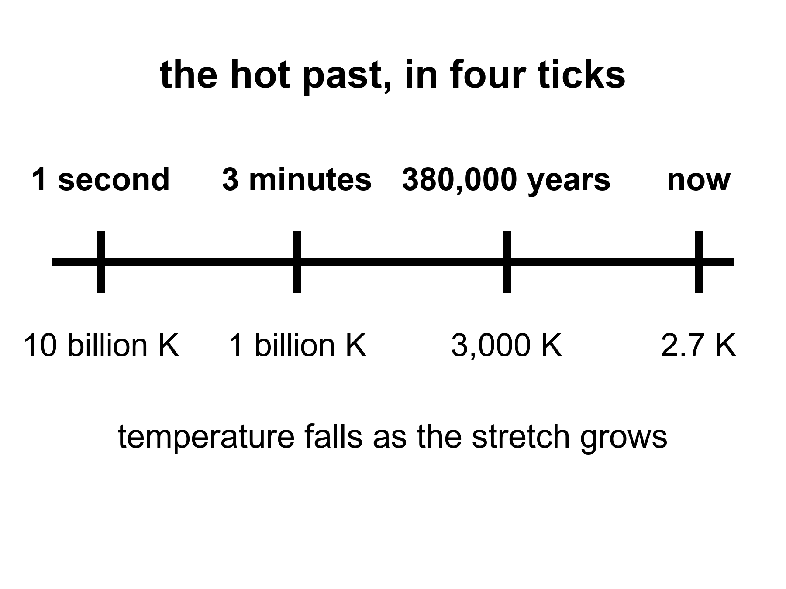

Then the workshop closes. The soup is still too hot for atoms. It will be too hot for 380,000 years. But the nuclear work is done. The universe has committed, by weight, to about three-quarters hydrogen and one-quarter helium, plus a dust of the rest. Stars will later lie about this. They will burn hydrogen into more helium and brag. The *first* helium is not their brag. It is a fossil.

Weinberg’s afterword, years later, had to make room for inflation and for freckles in the leftover glow. He did not have to take back the three minutes. The three minutes have only gotten sharper. That is what a hot claim feels like when you meet one in the wild.

If you could inventory the ordinary atoms in the universe — not the dark extra pull, not the dark extra shove, the atoms — you would find that about one-quarter of their mass is helium-4. That is an absurd amount of helium to blame on stars.

Stars are helium factories, yes. Our Sun is making helium in its core right now, at a stately, suburban pace. In ten billion years it will have converted a respectable fraction of its hydrogen. It will not have converted a quarter of the hydrogen in the *universe*. There has not been time, and there have not been enough stars. The first stars, which were massive and brief and sloppy, made a mess of carbon and oxygen and the iron in your blood. They did not flood intergalactic space with a quarter-by-mass of helium. Something else did.

The something else is the workshop, caught in the act.

Astronomers measure primordial helium in the least sophisticated gas they can find: dwarf galaxies that have made almost no stars, clouds that have not had a chance to lie. The number they keep finding sits near a quarter by mass, with a little scatter and a lot of argument about the second digit. Deuterium, which stars destroy more easily than they make, is a second fossil. Too much deuterium and the early workshop was too empty of nucleons. Too little and it was too crowded. The observed sprinkle of deuterium is a thermostat for the nuclear minutes. Lithium is the sulky cousin: the prediction and the measurement still do not quite shake hands. That fight is real and unfinished. It does not cancel the helium.

Here is the detail that makes the fossil personal. Every breath you take is mostly nitrogen and oxygen, cooked in stars that died before the Sun was a cloud. The helium in a party balloon is mostly not that. Some of it leaked from Earth’s crust, where uranium and thorium have been throwing helium nuclei like litter for eons. Some of the helium in the *cosmos*, the quarter that is not a party trick, has been helium since before there was a periodic table with more than two honest entries. You cannot hold that helium. You can know it.

Hot claim: the light-element abundances match a hot, expanding workshop with a known nucleon-to-photon ratio. Warm claim: the remaining lithium tension is a problem for astronomers and nuclear theorists, not a loophole for a cold beginning. Cold claim: any rival origin story that cannot produce this helium is not an origin story. It is a mood.

The leftover glow says the universe was once a mixed, hot fog. The leftover helium says the fog did nuclear work on a three-minute clock. Two fossils, two methods, one past. That is as close as cosmology gets to a courtroom.

---

\newpage

## 11. Almost Nothing, Almost Everywhere

Smooth the universe. Take every star, every planet, every wandering rock, every atom in every lung, and spread them until the lumps are gone. You will have, on average, about one atom of ordinary matter in a space the size of a closet — a cubic meter, give or take the fights about the second digit. A good vacuum pump on Earth is proud to do worse.

That is the catalog’s first insult. We live in a freak clump. The clump is not the rule. The rule is the emptiness.

The second insult is that the atoms are not even the main clump. When astronomers weigh the universe the way you weigh a truck — by how hard it pulls, not by how shiny it is — the atoms are a minority. About five percent of the energy budget is the stuff of chemistry. About a quarter is an extra pull that does not shine. About two-thirds is an extra shove that makes the stretch speed up. Chapters 17 through 19 are the inventory of those insults. Here it is enough to feel the loneliness of the five percent.

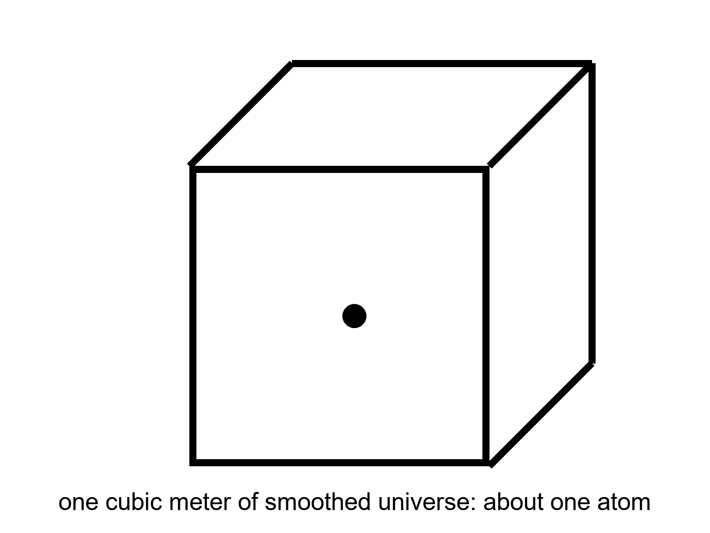

Barrow liked to shock readers with billions, and the billions are still shocking if you let them be specific. The observable universe is about 93 billion light-years across, not because it is 93 billion years old — it is 13.8 — but because the stretch has been pulling the farthest light’s starting points farther while the light was in transit. Inside that sphere there are a few hundred billion galaxies you could, in a generous mood, name. Each galaxy has, give or take, a hundred billion stars. Multiply and you get a number that looks like a lie: on the order of 10²² stars. Then remember the closet with one atom. The stars are the rare weather. The emptiness is the climate.

Stars themselves are a later luxury. They are places where gravity won a local argument against the stretch, piled gas until the pile was hot enough to fuse, and then spent millions or billions of years turning hydrogen into the rest of the table. When the more massive ones die, they throw the table into space. Planets are the sediment of that throw. You are the sediment of the sediment, walking around asking where the sediment came from.

The catalog, then, is not a list of objects. It is a list of exceptions. A star is an exception to emptiness. A planet is an exception to the habit stars have of being unfriendly. A kitchen is an exception to the habit planets have of being dead. A book is an exception to the habit kitchens have of being used for casseroles.

The past we can rebuild explains how the exceptions got their raw material. It does not owe the exceptions a destiny. The leftover glow and the leftover helium will still be true if no one ever builds another kitchen. That is not a threat. It is the courtesy of a universe that does not need us in order to have had a first three minutes.

\newpage

# PART III — A Burst, Then Seeds

---

\newpage

## 12. Three Puzzles the Hot Bang Cannot Solve

The leftover glow and the leftover helium make the hot, expanding past look inevitable. They do not make it comfortable. Three puzzles sit in the model like bills on a table, and the three-minute workshop does not pay them.

The first is the *horizon problem*. Look at the microwave sky in two opposite directions. The temperatures match to a part in a hundred thousand. For two patches to agree that tightly, they usually need to have talked — to have exchanged light, mixed, come to terms. In the simple hot bang, those opposite patches have never been in each other’s past light cones. They are like two strangers who have never met and have never had a friend in common, wearing the same shirt to the same size. You can call it a coincidence. Physicists get hives.

The second is the *flatness problem*. The universe’s geometry — whether parallel lines stay parallel on the largest scales — is astonishingly close to “flat,” which is another way of saying the density is astonishingly close to a special critical value. In the simple bang, that closeness is unstable. A little too much density in the first second and the universe would have recollapsed before helium was done. A little too little and it would have become so empty, so fast, that galaxies would never have found each other. We live on a knife-edge that the equations keep trying to throw us off. Either someone balanced a pebble, or something *drove* the pebble to the middle of the blade.

The third is the *relic problem*. Grand unified theories — warm-to-cold ideas about how the forces were once one force — tend to produce leftover monsters: magnetic monopoles, heavy stable particles, knots in fields. The simple bang would have left the universe ankle-deep in them. We do not trip over monopoles on the way to the mailbox. Something diluted the relics, or they were never made in our past, or the grand theories are wrong. The first option is the one inflation was built to offer.

None of these puzzles says the hot bang is false. They say it is incomplete as a story of *initial conditions*. Weinberg could reconstruct the nuclear minutes without knowing why the sky was so even. Guth, in 1980, asked whether a brief, violent stretch *before* those minutes could set the table so the minutes would look inevitable.

That is a different kind of move. The three minutes are a reconstruction. Inflation is a proposed preface. Prefaces can be wrong even when the book is right. Keep the temperatures straight. The puzzles are hot. The leading solution is warm. The details of the preface — what field, what potential, what first 10⁻³⁶ second — are still being written in pencil.

---

\newpage

## 13. Inflation, Without the Hype

Here is inflation without the poster.

Suppose, in a sliver of time so short that “sliver” is already too romantic, a patch of the universe was filled with a field that behaved like a temporary cosmological constant: a stuff whose tension was so odd that gravity, locally, *repelled*. The patch doubled in size, and doubled again, and again, sixty or more times. Distances that had been smaller than a proton became larger than a grapefruit, then larger than a solar system, then larger than the part of the universe we can see. Then the field decayed. Its energy dumped into particles. The dump is called reheating, which is a calm word for setting a universe on fire. After the dump, you have a hot bang: soup, light, the three minutes, the leftover glow.

Why bother? Because the three puzzles go pale.

The opposite patches of sky *did* talk. They talked when they were neighbors, before the burst pulled them out of conversational range. The burst then stretched their agreement across the whole sky. The horizon problem becomes a memory of an old neighborhood.

The knife-edge of flatness gets driven toward the middle. Stretch a curved surface enough and any small patch looks flat. A basketball, to an ant the size of an atom, is a plane. Inflation is the move that makes us the ant.

The relics get diluted. One monopole per pre-burst patch becomes one monopole per observable universe, or fewer. We stop tripping.

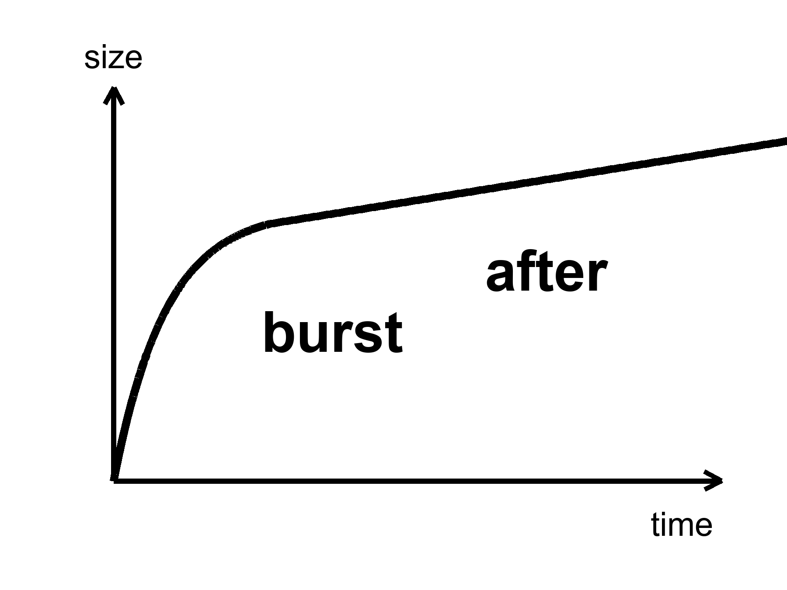

Alan Guth’s first version had a graceful-exit problem: the burst did not know how to stop without making a mess. Andrei Linde, and independently Albrecht and Steinhardt, found a smoother hill for the field to roll down — *slow-roll*. Linde later suggested that the starting values of the field could be chaotic, different in different places, some patches inflating a lot, some not. That idea will grow a maybe-multiverse in Chapter 15. Do not let it jump the line. The *local* burst is the working theory. The froth of other bursts is a rumor the local burst can tell if you let it drink.

What inflation has not done: name the field. We have no particle in a detector called the inflaton. We have a shape that works and a sky that looks like the shape predicted. That is more than a mood and less than a conviction. Appendix A13 writes the e-folds and the slow-roll parameters. Here it is enough to know that “inflation” is not a brand. It is a job description: a brief, repulsive stretch that sets the table for the hot bang we can actually reconstruct.

String theory sometimes offers inflatons the way a catalog offers furniture. The catalog is large. **It cannot currently be tested.** We will not pay the book’s rent with a catalog.

---

\newpage

## 14. How a Quantum Twitch Became a Galaxy

If inflation had stretched the universe perfectly smooth, there would be nothing to look at. No galaxies, no stars, no kitchens. Perfection is sterile. The universe is saved by a twitch.

Quantum fields cannot sit still. Even in their quietest state they jitter. During the burst, those jitters — differences in the field from place to place, at the smallest scale the quantum rules allow — get stretched from subatomic to cosmic the way a note written on a balloon becomes unreadable when you inflate it, except here the note becomes a *continent*. A region that jittered a little dense stays a little dense. After reheating, gravity, which has all the time in the world, starts calling in the debt. The dense patches pull. The thin patches get thinner. After a few hundred million years, the dense patches are making the first stars. After a few billion, they are making galaxies that look, cropped and gray, like Figure 14.

This is Mukhanov’s territory, and Guth’s, and a workshop of people in 1982 who realized that inflation does not just solve puzzles. It *makes the seeds*. The leftover glow’s freckles are those seeds, photographed at 380,000 years, before gravity had done much sculpting. The pattern has a sound: almost the same power at every scale, a little redder on large scales, a spectrum written *P(k)* in the appendix and “almost scale-invariant” in conversation. Planck measured the tilt. The tilt matches slow-roll inflation’s favorite song. That is the warm claim at its warmest.

A detail that should not be allowed to stay abstract: the twitch is not a metaphor for “something small.” It is the same kind of uncertainty that keeps an electron from having a definite path in a wire. Inflation is the amplifier. Gravity is the sculptor. You are a later exhibit.

Chaos belongs here as mechanism. A jitter of one part in a hundred thousand is nothing in a kitchen and everything in a cosmos. Change the jitter’s pattern and you get a different web of galaxies — still a web, different rooms. That is not destiny. It is sensitivity. Chapter 16 will give chaos its own chair. Here, notice that the most important structures you will ever see began as noise.

Hot claim: the leftover glow has a pattern of freckles whose statistics we have measured. Warm claim: those freckles are stretched quantum jiters, grown by gravity into galaxies. Cold claim: we have watched a twitch become a spiral in a laboratory. We have not. We have watched the intermediate photograph and done the math. That is allowed to be enough, if we say so.

---

\newpage

## 15. Bubbles That May Never Stop

Once you have a field that can burst, you can ask whether the bursting ever takes a holiday.

In many versions of slow-roll, the field reaches the bottom of its hill in some places and keeps rolling, or keeps jittering, in others. The places that keep going keep stretching. The places that stop become hot bangs — pocket universes, bubbles, whatever noun you can stand. Our observable sky would be inside one stopped place. Outside, the bursting might still be hiring.

This is eternal inflation, Linde’s and Vilenkin’s child, Guth’s grown rumor. It is a live hypothesis. It is not a photograph.

If the underlying physics has many ways to stop — many valleys for the field to fall into, many sets of effective constants — then different bubbles can freeze out with different laws. That is the expensive copy machine of Chapter 39, and it is where the anthropic filter of Chapter 41 gets its only real job. Weinberg’s argument that the cosmological constant should not be much larger than what still allows galaxies *needs* an ensemble. Eternal inflation plus a landscape is the ensemble people reach for.

The landscape, in its most advertised form, comes from string theory. **String theory cannot currently be tested.** A landscape of valleys inherited from an untestable framework is not a measurement. It is a maybe stacked on a maybe. This book will let the stack sit on the table. It will not serve it for dinner.

There is a further rumor: that the bursting has no beginning, that bubble has always begotten bubble. The Borde–Guth–Vilenkin result says otherwise for a wide class of stretching spacetimes: if the average expansion is positive, the spacetime is past-incomplete. Eternal inflation, even if it has no end, still faces a boundary in the past. The bubbles do not give you a free forever-behind-you. They give you a messier loaf.

Measure problem, in one sentence: if there are infinitely many bubbles and infinitely many observers, the word “typical” breaks. You cannot say “most universes are like this” until you say how you count. No one has a count that everyone else has to accept. Until they do, “the multiverse predicts X” is a hope in a lab coat.

Warm claim: inflation *can* be eternal in many models. Cold claim: it is, and we live in a bubble with neighbors we will never meet. The sky we have does not require the neighbors. It permits them. Permission is not a postcard.

---

\newpage

## 16. Chaos Is an Engine

Chaos, in physics, is not a mood and not a mess. It is a precise kind of sensitivity: two starts that differ by a breath end in rooms that do not recognize each other. Weather is chaotic. A pendulum swinging over a magnet can be chaotic. The approach to a final crunch, if the universe had been headed for one, would have been chaotic — Barrow proved things in that vicinity, and Belinski, Khalatnikov, and Lifshitz gave the mixmaster a name. A recollapsing cosmos would not politely reverse the film. It would scramble.

At the beginning, chaos is an engine.

The quantum twitch of Chapter 14 is sensitivity as a gift. Stretch it, and you get a web. The cosmic web — filaments of galaxies around voids like holes in a sponge — is what gravity does with a nearly scale-invariant jitter after thirteen billion years. It is not a design. It is what you get when pull is allowed to run on noise.

At the end, if there were a crunch, the same family of sensitivity would be a theft. Tiny differences near a final singularity would be amplified until no one, not even a civilization of perfect computers, could steer. That fact will matter when someone tries to sell you a required Omega Point: a last moment in which mind takes the controls and computes forever. Chaos at the crunch is not a control panel. It is a warning that control panels melt.

In the middle — which is where we live — chaos is why forecasts have horizons. We can reconstruct the three minutes because the soup was mixed and the laws were simple. We cannot forecast a galaxy’s weather in year 10¹². We can forecast the stretch. The stretch, with dark energy in the budget, looks dull and huge. Dull and huge is a kind of mercy. The web freezes in place as the shove between filaments wins. Galaxies go dark on their own clocks. The engine that built them idles.

Keep chaos in the book as a tool, not a vibe. It made the rooms. It will not let anyone own the ending. It is the opposite of a watchmaker and the opposite of a destiny. It is what a twitch can do when the universe gives it time.

\newpage

# PART IV — The Missing Most

---

\newpage

## 17. The Extra Pull

Dark matter is a terrible name. It sounds like a feeling, or a brand of chocolate, or the opposite of enlightenment. It is none of those. It is a pull we can weigh and cannot photograph in ordinary light.

In the 1930s, Fritz Zwicky timed the galaxies in the Coma Cluster and found them moving too fast. The visible stars did not supply enough gravity to hold the swarm. He said so, rudely, and was mostly ignored. In the 1970s, Vera Rubin and Kent Ford timed stars in the disks of spiral galaxies and found the same insult at a friendlier scale: stars out in the suburbs orbit as fast as stars closer in, as if most of the mass were in a big, dark halo, not in the shining bulge. The light is a liar about the weight.

What dark matter is *not*, while we are cleaning the noun:

It is not dark energy. Dark energy shoves. Dark matter pulls. They share a marketing department and nothing else.

It is not a black hole in the everyday sense, though a zoo of old, small black holes is a cold candidate people still kick. Ordinary black holes made from dead stars are not numerous enough, and we have looked.

It is not the failure of our eyes. We have looked in radio, infrared, X-ray. The missing weight does not glow in those either, not as atoms would.

It is not a mood in the equations. The leftover glow’s freckles have a pattern that, when grown by gravity, matches a universe in which most of the pulling-stuff does not collide with light. Atoms slam into photons in the early plasma and leave a different signature. The extra pull did not slam. It is *non-baryonic* in the jargon: not the protons-and-neutrons club. Appendix A17 says that more carefully. Here: it is a different ingredient, not hidden steam.

Candidates have names that sound like card games. WIMPs: heavy, shy particles that would leave a rare cough in an underground tank. Axions: wisps from an old fix to nuclear physics, convertible into photons in a magnetic field if you listen with a sufficiently obsessive radio. Sterile neutrinos: a shy cousin of the neutrinos we already know. None of them has been caught in the act. The tanks have gotten very quiet. The radios have gotten very proud. The sky has not changed its mind about the pull.

Modified gravity — change the law instead of adding an ingredient — still has clever friends. It has a harder time with clusters, with the leftover glow, and with the Bullet, where two kinds of stuff have been caught in the act of *not staying together*. The working theory is an extra ingredient. The working theory has a hole in it the size of a noun. That is allowed. Chemistry once had a hole named “what is fire.” The hole was not a reason to deny the flame.

How do you weigh something that refuses to shine?

You watch what it does to things that do.

Rotation curves are the suburban clocks: stars and gas, timed in their orbits, going too fast. Gravitational lensing is the more theatrical trick. A cluster’s weight bends spacetime, and the bend makes multiple, stretched images of galaxies behind it — arcs, crosses, rings. Count the arcs, measure the stretch, and you have a scale. The scale disagrees with the starlight by a factor of several. The disagreement is the extra pull.

The leftover glow offers a third scale. The freckles are a sound. The sound has harmonics, like a bell. The position and height of those harmonics depend on how much ordinary matter was slamming into light, and how much quiet matter was only pulling. The bell says: a little slamming stuff, a lot of quiet stuff. The numbers line up with the clocks and the arcs. Three instruments, one extra weight.

Then there is the Bullet.

Two clusters have passed through each other. The gas — atoms, shining in X-rays — slammed, shocked, and lagged in the middle, the way two crowds trying to walk through each other get stuck at the doors. The extra pull, mapped by lensing, did not slam. It went on through, like two ghosts politely declining to notice they had overlapped. In the famous color posters, gas is pink and mass is blue. On a Kindle those posters lie. Figure 17 is two stacked gray panels: the slammed gas, then the mass contours, same scale. Look at them one after the other. The contours do not sit on the gas. That is the photograph of “not atoms.”

Hot claim: there is more pulling-stuff than shining-stuff, and the extra stuff does not collide the way gas does. Warm claim: it is a particle we have not bagged, or a small zoo of them. Cold claim: we know its name, its mass, and which underground tank will cough first. We do not.

The extra pull is why galaxies are not just pretty. It is the scaffolding they grew on. Without the quiet halos, the twitches of Chapter 14 would have had a harder time becoming spirals before the stretch pulled the scaffolding out of reach. You live in a suburb of a ghost.

---

\newpage

## 18. The Shove

In 1998 two teams of astronomers, racing each other with dying stars, found that the stretch is not sulking. It is speeding up.

The dying stars were Type Ia supernovae, a kind of standard bomb: a white dwarf that reaches a bad weight and detonates with a brightness you can almost trust. Trust the brightness, measure how faint it looks, and you have distance. Measure the stretch of its light and you have the universe’s size when it exploded. Plot size against time for bombs going off over the last several billion years and you expected, if you were educated before 1998, a slowdown. Gravity pulls. Stretching should tire.

The bombs were too faint. They were farther than the tired-stretch story allowed. The stretch had *accelerated*. Something was shoving.

The simplest shove is a cosmological constant: an energy that comes with empty space itself, a tension Einstein once put in to freeze the universe and then regretted. The vacuum, in quantum field theory, is allowed to have a cost. The cost it *should* have, if you naively add up the jitters of every field down to the Planck scale, is off by a number so large it has become a joke: 10¹²⁰, give or take a few zeros. The measured shove is tiny. The predicted vacuum is a monster. This is the worst prediction in physics if you are in the mood to be rude, and one of the deepest problems if you are not.

Dark energy is the placeholder name for the shove. It might be Einstein’s constant. It might be a field that changes slowly, a “quintessence,” which is a word that sounds like a perfume and behaves like a maybe. It might be a mistake in how we read distances. The last option has been losing for twenty-five years. The leftover glow, the baryon acoustic oscillations — a leftover sound-scale printed in the way galaxies cluster — and the bombs now tell the same story. About two-thirds of the budget is the shove.

It does not clump. It does not make halos. It does not sit in the Bullet. It is not dark matter in a hat. If you take nothing else from this chapter, take the divorce: pull and shove are not a couple.

Once the shove is in the budget, the future changes personality.

Without it, you still had a fight between pull and stretch. Enough atoms-and-ghosts and the universe might someday stop expanding and fall back. Too little and it would stretch forever, tiring, thinning, cooling. The knife-edge of Chapter 12 was, in part, a knife-edge of fate.

With the shove, the fight is already over, unless the shove itself is a liar that will someday switch sides. The stretch accelerates. Isolated lumps — galaxies, bound clusters — remain bound. Between them, space wins and keeps winning. The cosmic web freezes. New filaments stop forming. The voids get ruder.

Appendix A18 writes *H(z)* and the distance-redshift relation. Here is the kitchen version. Imagine a raisin bread that not only rises but starts rising faster in the last part of the bake. The raisins that are already touching stay a family. The raisins that were only neighbors become, in time, rumors.

This is why a required Omega Point — a final crunch in which life steers the universe and computes forever — fails as physics, not as poetry. Poetry can crunch whatever it wants. The bombs, the leftover glow, and the frozen sound-scale say we are not on a crunch track. The next pages put shoes on that sentence.

A detail for later travel: the accelerating stretch makes a *cosmic event horizon*. There are galaxies whose light, emitted today, will never reach us, and there are galaxies we now see whose future light never will. Most of the universe has already left, not by walking away, but by the dough rising too well. Chapter 26 is the map. Chapter 18 is why the map is not optional.

Hot claim: the expansion is accelerating. Warm claim: a cosmological constant, or something that looks like one, is the shove. Cold claim: we know why the shove is the size it is. We do not. The worst prediction in physics is still on the board.

---

\newpage

## 19. Why Forever-Mind Does Not Follow

Frank Tipler, working from a book he wrote with Barrow, described a final state in which the universe recollapses, intelligent information-processing takes the controls, the amount of computation diverges, and this last, infinitely clever moment is — he was not shy — God. He called it the Omega Point. He said the known laws require it. He said life must never die out.

The known laws do not require it. The data have been voting no since 1998.

A crunch needs the pull to win. The shove is winning. For the Omega Point to be a destiny rather than a story, the shove would have to fade, reverse, or be a mirage. None of those is the working theory. A story can still imagine a different bubble, a different branch, a later surprise in the vacuum. A destiny cannot hide in a surprise. Destiny is supposed to be what the laws demand. The laws, plus the bombs, demand a long, thinning, accelerating future, not a steered collapse.

Barrow himself, in the short origin book this one uses as a formal model, had a better habit: he would walk you up to a speculation and then call it an idea for ideas. The Final Anthropic Principle — intelligent processing must arise and must never die out — is an idea for ideas that put on a lab coat. Martin Gardner made a joke of the acronym. The joke was unkind. The data have been unkinder.

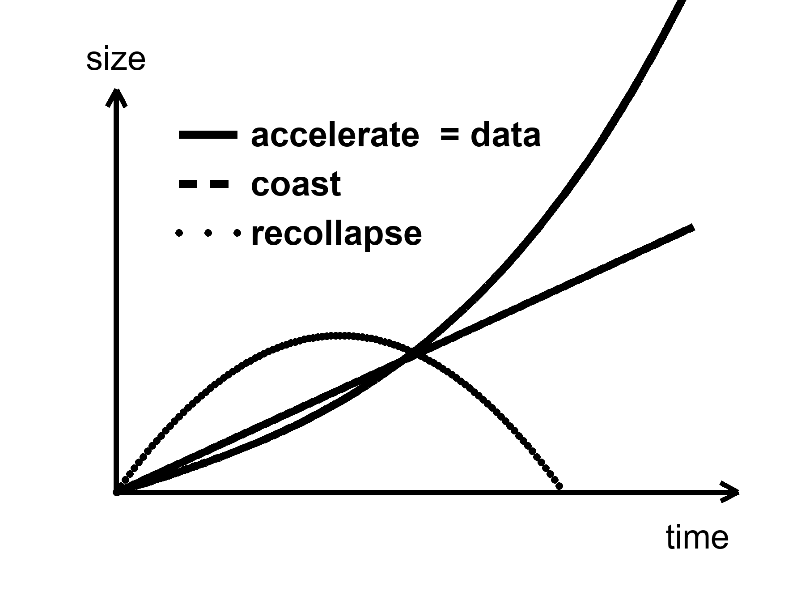

Chaos, from Chapter 16, is the second objection, even in a universe that *did* crunch. Near a final singularity the mixmaster scrambles. Steering requires control. Control requires that nearby futures stay nearby. They do not. Infinite computation in a dying crunch is a wish that the geometry be a computer. Geometry is not that polite.

None of this says mind is small. It says mind is not a clause in the gravitational field equation. If we want mind to last — in machines that do not sleep, in libraries of Earth sent to dark seas under ice, in a greenhouse on a dead world — that is a project. Projects can fail. Destinies, if they are real, cannot. The distinction is the moral of this book’s second half. Meaning, if you want it, is local, expensive, and optional. The leftover helium does not care. The leftover glow does not care. The shove does not care. That is why a greenhouse is interesting. It is a care that the universe did not budget for.

\newpage

# PART V — One-Way Membranes

---

\newpage

## 20. A Horizon Is a Fact About Events

A black hole is not a cosmic drain with a personality. It is a one-way membrane in the loaf.

Pick an event — a flash of light, a last radio beep, the moment a clock’s hand ticks. From that event, some future events can still be reached by a signal that never exceeds light. Some cannot. The boundary between those two sets, when gravity has bent the loaf enough, can close on itself. Inside, every future of every event leads deeper. Outside, you can still choose. The closed boundary is the horizon. It is not made of a material. It is made of *facts about which events can influence which others*.

Karl Schwarzschild, in 1916, found the first exact hole in Einstein’s equations while dying, more or less, on the Eastern Front. The radius that now carries his name is

*r_s = 2GM / c²*

*where G is Newton’s constant, M is the mass, and c is the speed of light.*

For the Sun, that radius is about three kilometers. The Sun is not a black hole; it is much larger than its Schwarzschild radius, and proud of it. Squeeze the Sun into those three kilometers and the membrane forms. For Earth, the radius is about a centimeter. For a mountain, it is smaller than a nucleus and we do not live in a cartoon. For the object in the middle of the galaxy M87, it is comparable to a solar system. The Event Horizon Telescope did not photograph the membrane. It photographed the *shadow*: the silhouette of paths that could not escape, against a glowing ring of gas that still could.

Hot claim: horizons of this kind exist. Stars orbit something compact and enormous in galactic centers. Mergers ring spacetime and LIGO hears the ring. The shadow is now a picture. Warm claim: inside the membrane, Einstein’s theory keeps going until a singularity, a place where the theory itself throws up its hands. Cold claim: we know what replaces the singularity. We do not. Quantum gravity is a research program. String theory offers replacements. **String theory cannot currently be tested.**

The kitchen mistake is to think of the hole as an object you could poke. The useful thought is the membrane of events. Cross it, and your future cone no longer includes Earth. Earth can still include you in *its* past, for a while, as a redder and redder last beep. That asymmetry is the whole joke and the whole tragedy. It is also why a hole is not a door.

---

\newpage

## 21. An Hour Beside the Edge

Clocks run slow when they sit deep in a gravitational well. This is not a rumor from a story. It is why a clock on a rear truck bed, driven up a mountain and back, comes home younger by a number you can write on a grant application. It is why GPS, without corrections, would slide your map into a river.

Near a horizon the same fact becomes rude. A clock hovering just outside, fighting with rockets to stay put, ticks slowly compared with a clock far away. An hour there can be years elsewhere. The numbers in posters — an hour for seven years — require a hole that is both enormous and spinning almost as fast as a hole is allowed to spin. Spin helps. A spinning hole, a Kerr hole, drags space with it and permits stable orbits closer in, where the well is deeper and the tides, for a given mass, are gentler. A supermassive hole can have an hour-beside-the-edge without spaghettifying the visitor. A stellar-mass hole would turn the visitor into a rumor of atoms before the hour was interesting.

Imagine a woman in a small station, parked in that close orbit, tending a rack of algae because someone still has to eat. Her radio to a ship farther out is not just delayed by distance. It is delayed by *time*. She says “good morning” and the ship hears it on a Thursday she will never have. She is not time-traveling. She is accumulating less proper time between two meetings. When she climbs back out, the ship’s crew has more gray in it than her mirror. The loaf did not rewind. Two worldlines of different lengths met again.

This is the twin effect with a well instead of a rocket, and it is the only kind of “time travel to the future” relativity hands out for free. It is one-way in the human sense. She cannot take the extra years back. She can only have fewer of her own.

Appendix A21 writes the dilation factor and the innermost stable orbit. Here, keep the two clocks. If you remember nothing else, remember that “now” was already in trouble in the kitchen. Beside the edge it is in ruins.

---

\newpage

## 22. The Hole That Runs Backward

If you take a black hole and run the film of spacetime backward, you get a white hole: a membrane you can leave but never enter. Light can come out. Nothing from the outside can go in. In the full, idealized diagram of a non-spinning hole — the Kruskal diagram, which looks like a secret handshake and is, in the appendix, four rooms — there is a black hole region, a white hole region, and two exteriors that meet only at a throat that pinches.

No one has ever seen a white hole. They are allowed as mathematics and unwelcome as astrophysics. They are unstable the way a pencil on its point is unstable. The universe, as far as we can tell, makes membranes in one direction: collapse, inward, one-way in. It does not spray matter out of ready-made white fountains.

People like to say the Big Bang was a white hole. The analogy has a poetic muscle and a scientific limp. A white hole is a local object in a larger spacetime. The bang, as Chapter 7 insisted, was not a bomb in a warehouse. It was everywhere. You can draw pictures in which a bang looks, mathematically, like a time-reverse of a collapse. You can also draw pictures in which it does not. Penrose’s cyclic cosmology, a cold idea with a serious author, tries to glue a remote, empty future to a next bang with a conformal trick. That is not a white hole in the sky. It is a maybe about the shape of the whole loaf.

For this book’s purposes, the white hole is a reminder: time-symmetric laws do not have to make time-symmetric *objects*. Eggs smash. They do not unsmash. Horizons form. They do not, around us, unform into fountains. The arrow is in the boundary, in the low-entropy past, not in the membrane’s manners.

---

\newpage

## 23. The Skin and the Leak

Jacob Bekenstein asked a rude question in the early 1970s: if you throw an encyclopedia into a black hole, where did the information go? If it vanishes, physics has lost its memory. If it stays, it has to stay somewhere that still counts.

He argued that the hole’s entropy — its hidden information, its unread library — scales with the *area* of the horizon, not the volume inside. The same calculation that fixed the coefficient also made the hole glow. The entropy is

*S = kA / 4ℓ_P²*

*where A is the horizon area, k is Boltzmann’s constant, and ℓ_P is the Planck length, a ridiculously small ruler made from G, ħ, and c.*

One bit per few square Planck lengths on the skin. The inside, however deep it seems, does not get extra shelf space. This is the holographic idea in its first, stubborn form: the inventory of a region can be written on its boundary.

People then got ambitious. Maybe the whole universe is a hologram. Maybe a gravity theory in a volume is secretly a quantum theory on a wall. In one special, negatively curved kind of space, this has been made precise enough to write papers that get jobs. That space is not our accelerating, leftover-glow space. The leap from “black holes count on their skin” to “your kitchen is a projection” is a leap. Warm-to-cold. Useful as a constraint: you do not get to invent an infinitely roomy crunch-computer (Chapter 19) without saying where the bits sit. Tipler needed a loophole in a bound like this. The bound is not impressed.

Holography does not cancel events. It relocates the bookkeeping. The loaf may be a projection of something thinner. The events you care about — a last beep, a first helium nucleus, a woman saying good morning to a Thursday she will not have — still happen. They may have fewer hiding places than a volume would suggest.

The glow is a slow leak from the membrane.

In the kitchen version: near the horizon, the vacuum’s jitters get sorted. One part of a jitter falls in. The other part escapes. From far away, the hole is radiating, very slightly, as if it had a temperature. Small holes are hotter. A hole the mass of a mountain would sizzle. A hole the mass of a star is colder than the leftover glow and, today, *gains* weight from the sky faster than it leaks. Only in the unimaginably far future, after the leftover glow has thinned, would stellar holes begin to lose.

If nothing interrupts, the leak eventually takes all the mass. The hole shrinks, heats, shrinks faster, and ends in a last, small violence. Whether the encyclopedia comes back in the last violence, or came out slowly in the glow, or is written on a remnant, is the information problem. It is unfinished. It is not unfinished in a way that lets you use a hole as a filing cabinet for resurrection.

Hawking radiation has not been seen from an astrophysical hole. It is a derived glow, as firm as a derivation can be without a photograph. Laboratory analogs — sound horizons in fluids, tricks with lasers — have made related noises. They are encouraging and not the same as weighing a photon from Cygnus X-1.

For the travel chapters, the leak is a timekeeper. It says black holes are not eternal furniture. They are long-lived, then gone, on clocks that make civilizations look like sparks. If you want a library to last, do not drop it in. Put it under ice, or in a vault, or in a machine that can wait. The membrane is a fact about events. It is not a basement.

---

\newpage

## 24. Not a Door

The last mistake is the door.

A door has two sides you can use. A horizon has two sides you cannot trade. Fall in and you do not come out “somewhere else” in this universe with a story to tell. In the classical theory you come to a singularity, a ripped place in the loaf, and the theory stops. In speculative theory you might come to a bounce, a baby universe, a tangle of extra dimensions. Those are cold. They are also, even if true, not a transit system. A baby universe you cannot call is not a destination. Extra dimensions offered by string theory come with the standing rule: **the framework cannot currently be tested.**

Wormholes, in Chapter 33, are a different object: a handle, not a membrane. People blur them because both are “holes” and both are associated with Einstein. Do not blur them. One is common and one-way. The other is unphotographed and probably expensive beyond engineering.

Penrose’s singularity theorems, and Hawking’s cosmological versions, say that if gravity pulls in the ordinary way and energy behaves, collapse and bang-like expansions have boundaries the geodesics cannot extend through. Inflation and dark energy violate some of those energy assumptions, which is why the theorems are not a courtroom for “the universe began” in every model. They are still a courtroom for “you may not treat the inside of a hole as a hallway.”

So: no transit. No filing cabinet for souls. No steered crunch. A shadow in a ring, a slow leak, a one-way fact about events. That is the honest hole. It is enough. It is already stranger than a door.

\newpage

# PART VI — Getting There Anyway

---

\newpage

## 25. A Greenhouse on a Dead World

The airlock sticks on cold mornings. She hits it with the heel of her glove, the way you hit a jammed kitchen drawer, and it sighs. Inside, the greenhouse is the only room that smells like a lie: wet soil, torn basil, a sweetness that does not belong to this planet. The lie is maintained with LEDs the color of an overcast noon and a tray of water she melted, yesterday, from a vein of ice the color of dirty chalk.

Outside, the sky is butterscotch and thin. A radio sits on the workbench. When she talks to the orbiter, she talks to twenty minutes ago, or four, depending on the week. The orbiter talks to Earth, which talks back in more minutes. There is no conversation. There is a stack of monologues that eventually, if everyone lives, amount to a plan.

She is not waiting for a miracle. She is waiting for a launch window. The next cheap path home — the one that lets a ship fall most of the way instead of burning a fortune — opens in 26 months, give or take the mood of the two orbits. Until then the potatoes either make starch or they do not. The universe does not have an opinion. The dirt has a chemistry, and the chemistry can be bullied.

This is the only honest picture of “somewhere else” this book will allow in the near term. A dead world, close enough that light-minutes, not light-years, set the lag. A body you can weigh. An ice vein you can steal. Machines that do not sleep parked in the driveway. A human worldline that has to eat.

Appendix A25 writes the Δv, the round-trip delay, the kilograms of water per kilogram of potato. Here, keep the stuck airlock. If we go farther than this world — and we will, in the next chapters, on paper — we will go as this woman goes: by bullying chemistry, by missing conversations, by treating a launch window as a fact about the loaf, not a mood.

She names the basil, which is sentimental, and logs the pH, which is not. On a dead world, sentiment is allowed as long as it does not get to vote.

---

\newpage

## 26. Most of the Universe Has Already Left

Even if her potatoes prosper and the window opens and the ship falls home, most of the cosmos is already out of reach.

Light is late, we said. There is a ruder fact. In an accelerating universe, there are events that will *never* be in our future cone, no matter how long we wait, no matter how patient the radio. Space between unbound things stretches so well that a photon emitted “now” from those galaxies never finishes the trip. We can still *see* some of them: their old light is in transit. Their new light is a letter that will not be mailed.

This is the cosmic event horizon. It is not the black-hole membrane. It is a fact about the whole loaf’s later shape. Appendix A26 distinguishes it from the *particle* horizon — the edge of what we can already see, set by the age of the stretch. Two horizons, two rudenesses. One is about the past we can rebuild. One is about the future we cannot visit.

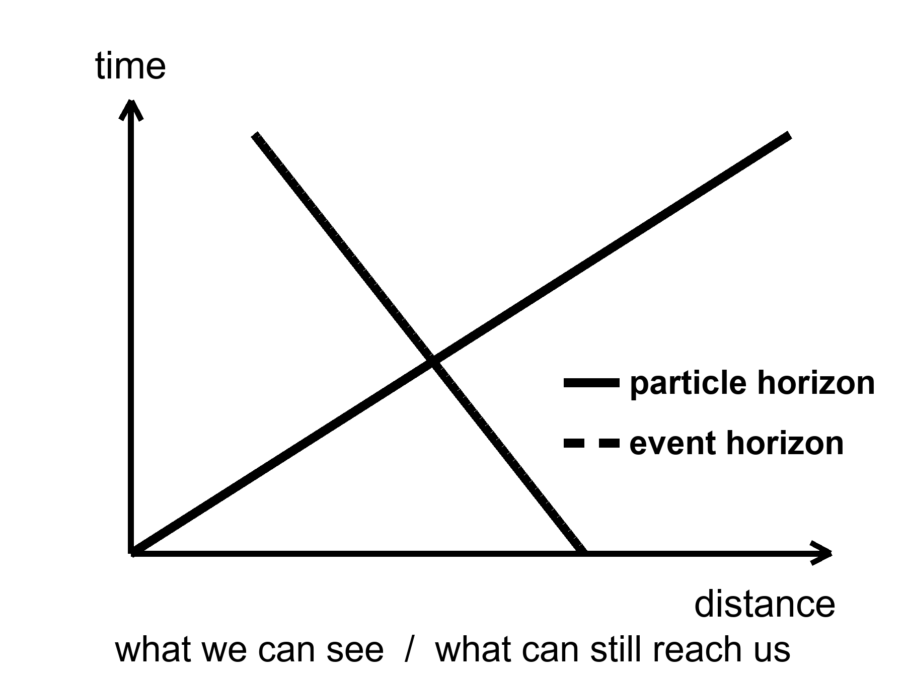

The deep field of Chapter 8 is, in this light, a kind of wake. Those galaxies are not destinations. Some of them were already leaving when their light left. The woman in the greenhouse, if she dreams of “the universe,” is dreaming mostly of a museum. The exhibits are real. The gift shop does not sell tickets to the exhibits’ futures.

This is why wormholes and warps get invented. This is why they have to break something. The loaf, as measured, does not include a hallway to those rooms. Getting there anyway, if it happens, will happen to *nearby* rooms: planets and moons that still share our future cone for a long time. The rest is a baby picture of a crowd that has gone home.

---

\newpage

## 27. Other Suns, Other Worlds

For most of human history, “planet” meant a wanderer you could see, and there were six, then seven, then eight, then a fight about nine. Other suns were assumed, in the way a reasonable person assumes other kitchens exist in other houses. Proof is ruder than assumption. Proof arrived in 1995, as a wobble.

51 Pegasi is an ordinary star, forty-odd light-years toward Pegasus. Didier Queloz and Michel Mayor watched its spectrum rock, back and forth, every 4.2 days. Something heavy was tugging it — something at least as massive as a fraction of Jupiter, something so close to the fire that a “year” there is a work week. A hot Jupiter. Nobody’s formation story had ordered that dish. The dish arrived anyway. The Nobel, years later, was for the first confirmed planet around a sun-like star, and for the implication that followed like a rude guest: if the first one we found was a monster in the wrong orbit, the sky is not a copy of our living room.

How you find a world you cannot see:

You watch a star dip. A planet crosses its face, and the light falls by a fraction of a percent, a bite out of a cookie, repeating. Kepler sat in space and stared at one patch of sky until the bites numbered in the thousands. TESS is doing the bright, nearby stars. The depth of the bite is the area of the planet compared with the area of the star. A Jupiter in front of a Sun is an easy bite. An Earth in front of a Sun is a nibble you must not invent.

You watch a star wobble, as Mayor and Queloz did. The tug is bigger if the planet is heavy and close. This is why the first finds were rude: rude is easy.

You, rarely, take a picture. A young, fat world, far from a star that has been blocked or subtracted, can show as a dot. Most planets are fireflies against searchlights. The picture is the exception.

You, more rarely still, watch a star lens another star, and a planet hitchhiking the lens adds a hiccup to the brightening. Microlensing finds worlds we will never visit and barely name.

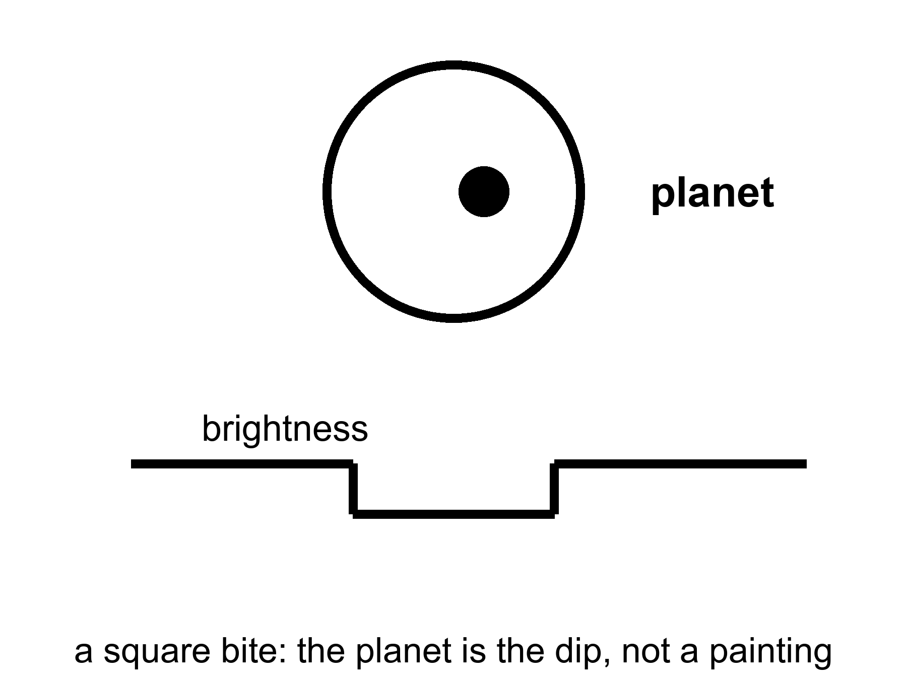

The census, once you correct for the rude-is-easy bias, is the sentence that should have been in every schoolbook twenty years ago: **most stars have planets.** Not all of them are Jupiters hugging the flames. The common finds, the ones our own solar system did not prepare us for, are the in-between worlds — super-Earths, mini-Neptunes — larger than us, smaller than ice giants, often wearing thick gas we would not call air. Kepler’s harvest is a drawer of sizes we did not have names for.

A few catalogs have become characters. TRAPPIST-1 is a cool dwarf with seven Earth-sized worlds packed closer than Mercury, some in the starlight band of the next chapter, all tidally interesting, all flare-threatened. Proxima Centauri, the nearest other sun, has at least one world in a hurry around a brat of a star. K2-18b is a maybe-Hycean: a hydrogen blanket over a slush we have not tasted; JWST has been asked to smell its air, and the smells have been argued like a will.

Atmospheres are the new sport. When a world bites its star, a sliver of starlight threads the air, if there is air, and molecules write barcodes — water, carbon dioxide, methane, the absence of things as loud as their presence. A barcode is not a biosphere. Oxygen can be a lie told by light shredding water and letting hydrogen escape. Methane can be a vent. The pair of them together, out of equilibrium, is a raised eyebrow, not a verdict. Chapter 30 is the verdict’s rulebook.

What exoplanets are *not*: destinations for the woman in the greenhouse. The nearest other sun is four years away at light, four centuries at a hundredth of light. They are a census. They tell us our eight-world house was never the template. They tell us Goldilocks has more chairs than we built. They tell us most chairs are empty of us, and that emptiness is not yet a statement about emptiness of *chemistry*.

Appendix A27 writes transit depth and wobble amplitude. Here, keep the bite in the light. A world you will never walk on can still be a measurement. That is a kind of contact the leftover glow would recognize: late, thin, and real.

---

\newpage

## 28. Where Liquid Water Can Last

Life, as we have actually met it, is a water trick. Other solvents get papers. Water gets the biosphere. So the first map of “somewhere else worth the trip” is a map of where water can stay liquid for a long time. Chapter 30 writes the papers — methane lakes, ammonia mixes, rooms we call poison. This chapter writes the map we already know how to fold.

Around a star, that map is a band. Too close and the oceans boil, or the atmosphere runs away, or the ground becomes a story about steam. Too far and the oceans freeze to the bed. In between is the circumstellar habitable zone, the Goldilocks band, a phrase that has done too much work and still earns its keep. For a Sun-like star the band includes Earth and teases Mars. Venus is the cautionary tale: a sister that kept the wrong blanket and cooked.

The band moves with the star. A small, cool red dwarf wears its band close, like a tight collar. Planets there get tidally locked — one face forever day, one forever night — unless an atmosphere or an ocean cheats the lock by carrying heat around. They also get flares, which are rude to air. A heavier, hotter star wears its band farther out and dies sooner. The Sun is a compromise with a ten-billion-year career. We are living in the middle of the career, which is, if you like filters, not a surprise.

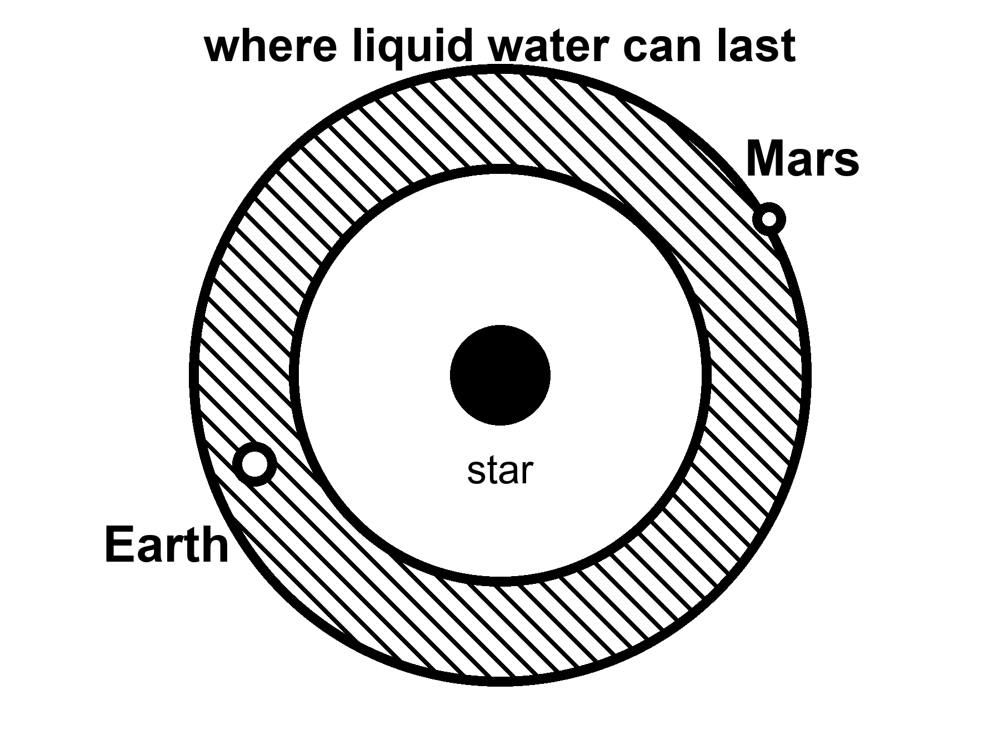

The band is not a promise. It is a permit. You still need air that does not leave, a crust that recycles, a magnetic mood if the star is a brat, the right volatiles, the right luck. Mars sits near the edge and is a desert with ice in its bones. It had a wetter youth. It lost the trick. The greenhouse in Chapter 25 is what a permit looks like after the permit has expired: you bring the water up from the bones and you *run the trick yourself*.

Appendix A28 writes the flux limits and the conservative-versus-optimistic bands. Here, notice what the band leaves out. It is a map drawn by *starlight*. The next chapter is a map drawn by *squeeze*. The chapter after that asks whether a permit ever got used. Most of the liquid water in this solar system, if you added it up honestly, may not be in our southern oceans. It may be in the dark, under ice, around Jupiter and Saturn, where the Sun is a bright star and the heat comes from the flexing of a world.

---

\newpage

## 29. Oceans Under the Ice

Europa is the size of our Moon and the color of a frozen bruise. Its surface is ice, cracked like a windshield after a long winter, almost empty of craters because the windshield keeps healing. Under the ice — ten kilometers down, or thirty; the arguments are a sport — there is an ocean. Not a lake. An ocean, tens to a hundred kilometers deep, wrapped around a rock. If you could unroll it, it would shame the Pacific.

The heat that keeps it wet is not a campfire of sunlight. Sunlight at Jupiter is a sixteenth of what we get, a weak coin. The heat is a *squeeze*. Europa orbits in a resonance with Io and Ganymede: a three-body music in which the periods lock, 1:2:4, and the little world is never allowed to settle into a perfectly lazy circle. Jupiter pulls. The neighbors pull. The ice and rock flex. Flexing is friction. Friction is heat. Heat, trapped under a lid of ice, is a sea.

Io, innermost, got too much of the music. It is volcanoes, sulfur, a pizza that screams. Callisto, farther out, may have a deep, sleepy ocean under a thicker lid. Ganymede, largest moon in the solar system, has its own magnetic field — a pride — and may stack oceans between ices the way a building stacks floors. Enceladus, a scrap of a moon at Saturn, vents its sea into space through cracks at the south pole. Cassini flew through the spray and tasted salt, silica, organics. The taste is not a biosphere. It is a kitchen that has the ingredients out on the counter.

This trick does not require a moon. It requires a lid, a flex or another quiet heat, and enough ice to be a blanket. A planet far from its star can wear a global ice crust and keep a sea underneath if the rock is radioactive enough, or if a close, heavy neighbor squeezes it, or if it is a rogue, thrown into the dark, hugging the leftover heat of its birth under kilometers of frozen roof. David Stevenson wrote that last idea down: orphan worlds, wandering between stars, oceans intact because the ice is a thermos. We have not photographed one. The physics of thermoses is not exotic.

There is a catch the papers argue about. On a *big* icy world, the bottom of the ocean may freeze again under pressure into exotic ices — ice VI, ice VII, names that sound like sequels — and those ices might seal the water off from the rock. Life, as we have met it at Earth’s vents, likes rock and water to argue. A sealed sea is a bathtub without a drain or a mineral feed. Maybe the high-pressure ice convects and leaks. Maybe it does not. The argument is unfinished. It is the right kind of unfinished: a fight about chemistry, not a fight about magic.

Under the ice, the sky does not matter. Photosynthesis is a rumor from a brighter world. If anything eats, it eats rock and redox, the way vent microbes on Earth’s seafloor eat the planet’s leftovers. A probe that wants to look cannot stand on the ice and take a postcard. The surface of Europa is a radiation hell, bathed in Jupiter’s belts; a human would collect a lethal dose in a day. Under the ice, the water is a shield. The way in is a melt. A hot probe, a nuclear kettle, a machine that does not sleep, chewing a hole for weeks, paying out a fiber, dropping into a dark that has not seen a photon in four billion years.

She — or it — would fall out of the borehole into a pressure that would crumple an ordinary hull, into a black that is not the black of space but the black of a cave that forgot the entrance. If there are plumes, as on Enceladus, you can taste the sea without going in. If there are not, you go in. Planetary protection, in this doorway, is not a slogan. If that sea already has a biosphere, our dirt is a plague. If it does not, our dirt is a library. Chapter 32 is that library. The rule is: look first. Seed later. Never confuse the two. Chapter 30 is how you would know the difference.

Tidal habitable zones are, then, a second map, larger and stranger than Goldilocks. Anywhere a world flexes or holds heat under a lid, liquid water can last in the dark. Jupiter’s court is the nearby exhibition. The exhibition may be the common case. Starlight habitable bands are the rare, photogenic ones, where someone can grow basil under an LED and call it a greenhouse. The dark seas do not owe us basil. They owe us, if they owe us anything, a second origin — or a first one that never needed a sun.

---

\newpage

## 30. A Second Origin

We have a sample size of one.

That sentence is the whole sport of exobiology, and it is why the sport is mostly a discipline of *not* lying to yourself. Life, as we have actually met it, is a water-and-carbon trick that copies, mutates, and lets death keep the score. It uses a handful of amino acids with a preferred handedness, a genetic script written in four letters, and a metabolism that eats gradients — light, redox, leftover rock. Whether that is the only trick the universe knows is not a question you answer from an armchair. It is a question you answer with a yes that can be wrong, or a no that can be shy.

Food is not a sandwich. Food is a slope.

A cell, a person, a machine that still has a metabolism, stays organized by running downhill on a difference: hot to cold, charged to spent, food-molecule to ash. Schrödinger said it with a better noun than he is credited for — life drinks order, and pays in disorder. The kitchen name is waste. Yes, there are excrements. There is always an excrement. Heat is the one you cannot hide. Carbon dioxide is ours. Oxygen is a plant’s leftover that we later hired as a lunch. Methane is a vent’s breath and a cow’s. A biofilm on a rock shits a rust. A city is a lasting pile of organized waste. A civilization that learned to shout still leaks warmth. That leak is the most honest technosignature we have: not a hello, an excrement of industry.

What would they eat?

Not our gold. Not, if they have a choice, our water — ice is cheap in the dark. Not, casually, *us*. We are a wrong-handed, four-letter lunch, and a seeder’s crop is as likely to be poison as protein. If they eat a biosphere, they are eating a library, which is either vandalism or a sample. If they eat starlight, they are a Dyson habit: a wrap, a leak of infrared, a slope stolen from a sun. If they eat rock, they are a vent. If they eat the leftover unfairness of Chapter 10 — the fact that matter won by a billion — they are eating the same menu physics already set. A being without a metabolism, Chapter 31’s crew, does not eat. It spends joules. The joules still come from a slope, and the slope still ends as heat.

Animals eat animals. That is not a scandal. It is a slope with teeth. The sermon is the next sentence: *but not their own.*

The sermon is a liar about the zoo. Spiders eat suitors. Fish eat fry. Bears, when the ice fails, eat bears. Chimpanzees have done it. A praying mantis is a bad date on purpose. Cannibalism is a staffing choice, not a forbidden operator. Plenty of lineages hired it. Plenty fired it. Humans mostly fired it and then wrote a law, which is what a filter looks like when it grows a conscience.

What is *wrong* with it, if you want a reason that is not a shudder?

Not the calories. Meat of your own kind is chemically a cousin of any other meat. The field equation does not care whose muscle it was. The mesh is uglier and better.

**Pathogens.** A parasite, a virus, a prion that learned your species has a short commute if you eat a neighbor. Kuru, in a highland people who honored the dead by a meal, was a classroom: the same brain-protein, folded wrong, coming home. Cattle fed cattle learned the same lesson in a different kitchen. Eating *across* a larger gap of kinship is not kindness. It is a worse match for the specialist that wants your exact blood. The taboo is, in part, hygiene that got a moral.

**Kin.** A gene that dines on its copies is a bad accountant. Inclusive fitness is a cold word for a warm fact: the child, the sibling, the cousin you did not recognize in the dark. Even a stranger of your species is, statistically, a closer ledger than a cow.

**Retaliation.** A species that can remember a face and organize a punishment makes a meal of its own a bad career. The nest in Chapter 32 already knows this at ant-scale. Apes know it with lawyers.

None of that makes cannibalism a law of physics. Starvation hires it again. Ritual hired it. A second origin might hire it as casually as we hire a chicken — or might have a taboo so wide they will not eat *any* cousin chemistry, and we would look, to them, like a plague on a plate. Aliens eating *us* is not cannibalism. It is lunch across a trunk. The wrong-handed, four-letter problem still sits on the plate. The shudder still does. The shudder is not a theorem.

Is sex how life lives forever — here, and everywhere?

No. Sex is not forever. Sex is a *shuffle*. The body still dies. The lineage keeps a copy that is not you, with a mixed hand of cards. That is a consolation we dressed up as immortality. It is bookkeeping. You do not go on. A sentence that sounds like you goes on, then another, then the scorekeeper calls time on each of them.

The common forever, if you want the word, is **copying**. Bacteria split and do not take a lover. A clone of aspen is a forest that forgot to die. Bdelloid rotifers have been all-female, as far as we can tell, for tens of millions of years, and they are not a myth. Most of the Earth’s career, by time and by headcount, is asexual. Sex is the expensive hire: two to make one, a search, a risk, the famous two-fold cost of making males who do not lay the egg. We still hired it. So did most of the large, parasite-haunted things we can see.

Why pay?

The honest answers are warm, not helium. A shuffle breaks up the coalitions of genes that a parasite has learned to eat — the Red Queen, running to stay in place. A shuffle also lets a lineage dump a broken letter without throwing out the whole book — Muller’s ratchet, the slow rust of a clone. Repair that needs a second copy. A lottery ticket when the weather will not sit still. None of these is a proof that the cosmos requires two sexes and a wedding. Horizontal gene transfer in a microbial film is another shuffle: sex without a face. Three sexes, a caste that only unlocks a genome, a being that fuses and splits like a siphonophore — Earth has sketches. Another lottery can ink them.

What would be strange, on a second trunk, is not the absence of our bedroom. It is the absence of *any* mixing in a world that also has parasites and time. Mixing is a warm bet wherever death keeps score with specialists. Our exact meiosis, our two-body habit, our idea that the child is how the parent outruns the grave: those are local costumes. The individual who does not die is the rare hire, and even then the lineage still mutates. Forever, in this book, is the wrong noun. The loaf already has all the times. Biology’s trick is not to escape the loaf. It is to put another thread on it before the first one ends.

Then why does the expensive hire feel like a feast?

Because the filter does not mail a pamphlet. It mails a *carrot*. A lineage that must pay two-to-make-one, search, risk, and the two-fold cost of males will not last if the staff treats the invoice as optional. Those who found the act reinforcing left more descendants. Those who found it a chore, all else equal, left fewer. Pleasure is not the cosmic point.

where the point is: a copy that ships.

The kitchen already knows this trick. Sugar is a bribe so you eat the ripe fruit. Salt is a bribe so you do not die of a blank soup. Orgasm is a bribe so the shuffle happens often enough that parasites and rust do not win the century. The wanting is one juice — a seeking loop that tags a cue as worth chasing. The liking is another — a completion stamp that says *do that again*. Bonding chemicals can glue two bodies into a season or a decade, which is useful if the young are expensive. None of that is a soul leaking. It is staffing. The same house also hired people who barely want the feast, or want a different menu. Asexuality is not a bug in the cosmos. It is what a lottery looks like when the carrot is optional and the culture is loud.

The carrot has no off-switch labeled *this is only a picture*.

A gull will sit a giant fake egg in preference to its own. A stickleback will attack a slab of red more fiercely than a rival. That is a supernormal stimulus: the cue, turned up, outbids the thing. We are a visual primate with cheap infinite images. The factory sells the cue without the invoice — no second person who can leave, no pathogen, no child, a new face every thirty seconds. The Coolidge effect is an old mammalian hire: novelty re-opens the wanting. Industry industrialized the novelty. That is the same family of mismatch as a cupboard of sugar, a slot machine, a feed that never ends. Hot as a mechanism. Not a verdict on a species, and not a proof that everyone bought a ticket. Plenty of people shrug. Plenty of people drown. Both are allowed by the same wiring.

It is not a law that a second origin will invent our bedroom pictures. It is warm that any reward system can be spoofed once recording is cheap. A smell-world might bottle a plume. A vibration-world might keep a drum that never tires. A mind that eats gradients of status might hoard a leaderboard. The honest sentence is smaller than a sermon and ruder than a blush: we enjoy the feast because lineages that did not enjoy it are thinner on the ground, and we enjoy the fake because the carrot was hired for a scarce, expensive act and we built a tap.

So the alien latrine, if there is one, is this: a gradient used up, dumped as warmth, as gas, as a rust, as a plume that should have eaten itself and didn’t. We already hunt that. We call it a biosignature when it is sloppy and alive, a technosignature when it is sloppy and industrial. The polite word is disequilibrium. The kitchen word is shit. Both are allowed. Neither requires a face.

What would count as a second origin?

Not “it looks green.” Not “we found organics.” The Murchison meteorite is stuffed with amino acids that no farmer planted; space chemistry is sloppy and generous. Not “it moved,” if a grain of dust can move. The Viking landers, in 1976, fed Martian dirt a labeled meal and watched a gasp of gas that looked, for a weekend, like a breath. Then the controls misbehaved, and the consensus settled on chemistry without a cook. A minority never signed. That is what a sample size of one does: it makes every gasp a courtroom.

A better test is *disequilibrium that wants a story*. Oxygen in an air, by itself, can be a lie — light shredding water, hydrogen fleeing, O₂ left behind like a forgotten suitcase. Methane can be a vent. Oxygen *and* methane together, in amounts that should have eaten each other, is a raised eyebrow. Add a seasonal pulse, a color that is not a mineral, a plume that carries not just silica but a lipid that nature does not stock — the eyebrow goes higher. A cell that divides in a bottle you sterilized is a verdict. We do not have the verdict. We have the eyebrow’s job description.

Earth is a cheat sheet and a trap. Everything we know how to look for looks like us: carbon, water, left-handed amino acids, radio. A shadow biosphere on Earth — a second trick under our feet that we have never cultured — is a cold possibility that would humble the cheat sheet. A dark sea that eats rock and never learned photosynthesis would humble it differently. A world that uses solvents we call poison would humble it completely. The honest search is therefore two searches: one for our cousins, one for our alternatives. The first is easier to fund. The second is the one that would change the kitchen.

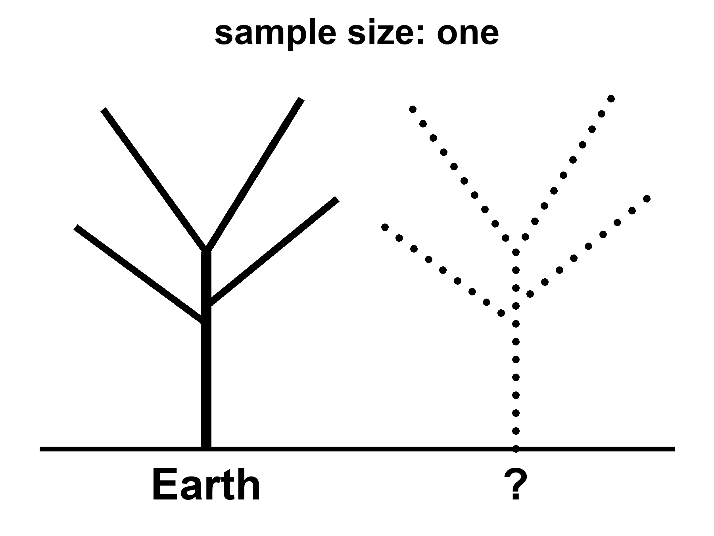

Why is the script the same in every kitchen we have opened?

Open a bacterium, a mushroom, a whale, the woman in the greenhouse. The memory is nucleic acid. Four letters, or a close dialect. The same leftover grammar in the codon table: three-letter words, sixty-four of them, almost the same dictionary from *E. coli* to you. Mitochondria cheat a little. A few microbes rewrite a stop. The family resemblance is still a family. That is not a law the cosmos stamps on wet rock. That is what **one grandmother** looks like.

Call her LUCA if you like labels: last universal common ancestor, the bottleneck every cultured lineage on Earth still shares. Once a code works well enough, changing a word later is a catastrophe. Every protein in the house breaks at once. Francis Crick called that a frozen accident. The dictionary may also be a little tidy — errors land on cousins more often than on strangers — which is a warm extra, not a proof that A, T, C, and G were inevitable. The letters are good letters. Pairing is a good trick. The exact four, and the exact sixty-four-word book, are history.

Would another world use the same book?

Bet this way. Something *like* a pairing polymer is warm: you need a memory that copies with mistakes. The same four bases and the same dictionary is cold, or else it is a confession. If we found our exact codon table under Europa’s ice, the grown-up explanations are contamination or a shared seed — panspermia, directed or sloppy, Chapter 32’s library arriving early. A second origin with a *different* dictionary is the jackpot: same sport, other rules. Mirror letters. A six-letter script. An XNA that pairs and is not ours. A code that never invented thymine. That is what “not cousins” looks like on a gel.

So the sameness of DNA is evidence. It is evidence of **one origin on this rock**, not of a cosmic typesetter.

It is not evidence that biology waited for a witness.

A fashionable extra step says: the soup was a fog of maybe, and DNA became definite only when something looked. That step confuses a filter with a cause. The weak anthropic reminder is allowed and useful — chemists find themselves in a chemistry that worked. Unsuccessful soups have no one to file the complaint. That is selection of a *place* and a *history*, the same mesh as Chapter 41. It is not a mechanism that folds nucleotides into a helix when an eye opens. Polymers copy, or they do not, whether or not a later ape writes a book about them. The first record of a successful copy was another copy, then a fossil, then a cell that ate a gradient. Those are observers in the cheap sense of Chapter 6: traces. They are not priests.

The origin of life is an unfinished chemical problem, not an unfinished metaphysical one. We do not yet have the hour-by-hour of the first ribozyme, the first membrane, the first code. The incompleteness is real and should be said without flinching. It does not rent space to a collapse-of-the-wavefunction-of-the-ocean. Coincidences that survive a billion years of death are not coincidences. They are what got through.

There is a louder way the sample of one lies. It is not only chemistry. It is *history*.

Replay Earth’s tape — Stephen Jay Gould’s dare, after the Burgess Shale’s cabinet of body plans that mostly lost — and the winners can change. Anomalocaris, a meter of armored weirdness, was a champion of a sea we no longer run. Hallucigenia looked like a joke until we found which side was up. Most of those experiments died. The survivors look inevitable only because we are their children. A second origin, or even a second lottery on a second wet world, does not owe us two eyes, a spine, or a face. It owes us, at most, a trick that copies and a death that keeps score.

It does not even owe us one shape of mind. Earth hired two good ones in water — ours, and the octopus — and then only one of them took the hills. A wetter world, given time, might hire a *committee*: walkers, swimmers, climbers, even something built like an insect’s toolkit, all smart, all from one radiation, all arguing about the same sun. That is not a zoo invented for television. It is what empty niches plus a long clock can do if several body plans keep their nerve. We had the cabinet. We fired most of the staff.

A mind need not be a skull. A slime mold solves a maze without a neuron. A mycelium is a room-sized conversation in sugar. A siphonophore is a committee that forgot it was a committee. A world that hired the web, not the head — a thing that thinks by touching, that is only itself when it is plugged into itself — would fail every test that looks for a face. We would call it weather, or a cable, or a plague.

Blood need not be iron. Octopuses already use copper. Green blood, blue blood, blood that is a slurry of magnetite: those are staffing choices. A third sex, a caste that exists only to unlock a genome, a child that imprints on a smell and calls that smell parent — Earth has sketches. Another lottery could ink them.

What the second trunk almost certainly is *not* is a person with different ears.

A humanoid — two legs, two arms, a face that can hold a conversation over a table — is a wonderful costume. It is a terrible prediction. Bipedal apes with grammar are one late hire on one wet rock, after a specific series of forests, savannas, and accidents. Hands that can strike a flint are not a law of intelligence. They are a law of *our* intelligence. An independent origin that reprints the ape, down to the eyebrows, is cold as zoology. If we ever met someone that close in the mirror, the grown-up guess would be cousins: a shared seed, Chapter 32 again, not a second invention of the chin.

We keep hiring the costume because we want a colleague. A cooler pulse. A different emotional budget. Someone who will tell you that logic is a kind of loyalty, and then save your life anyway. Keep the colleague if you need the story. Fire the body plan. The thing worth wanting is a second *culture*, not a second pair of cheekbones.

The swimming cousin is the same cheat in a wetter hat. Dolphins are not a destiny for ocean worlds. They are a destiny for *this* ocean: warm-blooded, echolocating, big-brained, and — this is the part the posters skip — without a fire, without a radio, without a hand. Aquatic intelligence is warm. A bottlenose with a dialect on every iced-over moon is cold. Most of the dark seas in Chapter 29 will not owe us poetry. They will owe us, if they owe us anything, a nervous system that works in the black and a body that does not look like a poster from Earth.

There is a prettier version of the colleague: tall, luminous, plugged into a forest that is a nervous system, wearing a local body the way Chapter 31’s machine might wear a shape so the doors still fit. Keep the forest. Roots that talk, a web that is a mind, a planet that is only itself when it is connected — that is the mycelium paragraph with a bigger budget, and it is warmer than a face. Bioluminescence is already on Earth; we just did not put it on a person and call it a neighbor. The remote body is an engineering sentence. The blue-or-green *person* inside it is the humanoid cheat again, better lit.

If you want a monster, do not hire a craftsman of evil. Hire a fitness peak.

Earth already runs the sketch. A wasp that lays an egg in a living host and lets the host walk around as a pantry. A fungus that steers an ant up a stem and fruits from its head. Those are not villains. They are solutions. Scale the solution up — a specialist that treats *you* as the egg, that survives the vacuum of a hull, that spends the whole budget on teeth and a childhood you do not consent to — and you have the nightmare people like. Survival at all cost is not a personality. It is what natural selection looks like when nothing in the room is keeping score but death. We call it evil because we were the host. The universe did not.

A large hunter can converge on something dinosaur-ish without becoming a person in scales. For a hundred million years this rock hired bipedal meat-eaters with a balance tail and a mouth that was the point. Sharks and ichthyosaurs found the same torpedo. Wolves and thylacines found the same face. A big dry world with room for giants might hire the theropod solution again: two legs because the hands are busy, teeth because the meeting is short. That is warmer than a gentleman with a phaser. It is still not a citizen.

Intelligent dinosaurs are a different sentence. We already have them. Birds are dinosaurs that lived. Crows make tools. Parrots steal words. Troodontids, before the rock fell, had the kind of brain-to-body ratio that makes paleontologists polite. Some of their cousins had grasping hands. They had time — more time than we have had since we stood up. Intelligence, then, is warm. A saurian mind is not a paradox. It is an experiment Earth ran and then interrupted.

Size is a worse predictor than the posters admit.

A skull the size of a grapefruit is not a requirement. A being thirty centimeters tall can, in principle, outthink a room of us. A nervous system the size of a whale can fail to invent a word. Volume is a weak forecast. Packing, wiring, the body the wires have to run, a culture that stacks know-how, and time — those hire a mind. A blue whale’s brain is a city of cells and still does not keep a library. A New Caledonian crow, a handful of feathers, bends a twig into a hook and teaches the trick. An octopus, a bag of muscle with a committee in each arm, opens a jar and then does not write it down. A termite mound air-conditions a tower no worker could draw. Those are Earth sketches, not a sermon about a hive that is a person. The colony is a room-sized habit. The crow is a small, fast, dense mind on a budget. The octopus is a second good hire that never took the hills.

Hot claim: **brain volume is a weak predictor of what a lineage can do.** Warm claim: another world, given packing and a clock, can hire a mind that fits in a teacup and still outruns us at the thing we congratulate ourselves for. Cold claim: they will look like tiny people. Colder: thirty centimeters is a law. It is a permission, not a uniform. A small sophont is allowed. A doll that reprints the ape, down to the eyebrows, is the humanoid cheat with a ruler.

Civilization is the extra invoice. A mind is not a city. A city is a rearrangement of matter that outlasts a death: surplus food, teaching, a way to stack know-how so the grandchild does not start from zero. Fire helps. Writing helps. Hands that can hold a coal and a stylus help. Nests of tinder and a snout that is also a weapon do not forbid those things. They make them expensive. A paleontologist once grew a museum hunter into a naked man with a tail and called the result a forecast. That is the humanoid cheat in a jacket with elbow patches. If a saurian lineage ever paid the invoice, keep the tail. Keep the nest. Do not expect tea.

And do not expect streets.

We look for cities the way we look for colleagues: windows, grids, a night side that glows in rectangles. Those are ape furniture. A city, stripped of the poster, is only this — a lasting pile of organized waste, built by something that remembers. Termites already air-condition a tower without a mayor. Coral already lays down a skyline without a plan. A web-mind’s capital is the web. A swimming people’s capital is a current they taught to stay. A dawn-ring herd’s capital is a road of trampled light. A cave town’s capital is a lung of tunnels that grew a library. A hunter civilization, if the invoice was paid, might be a rookery the size of a county: ramps for tails, pits for eggs, no stairs, no doors a hand would love, a smell-map instead of a street name.

Chapter 34 looks for shouting. A city that never invented the radio is still a city. We would miss it from orbit because we packed a test for *our* skyline. The honest forecast is rude, and better: if the second trunk pays for civilization, the first photograph will look like a mistake. Geology with an opinion. A reef that is too regular. A forest that is too warm at night. A canyon that breathes on a schedule. Not a downtown. Not a person in scales offering you a key to the city. A place like nothing we have built, doing the only job cities ever do — keeping a trick of carbon and water alive in a pile that remembers.

So there are forms Earth never fully hired, not because they are impossible, but because our path did not pass their door.

Wheels, for large animals, never made it. Axles are hard to feed with blood. Flagella spin; tumbleweeds roll; nobody commutes on a femur that goes all the way around. A high-gravity world, or a hard-packed plain with no mud, might hire wheels and think our knees are quaint.

Skeletons of silicon, as a habit, never made it. Diatoms glaze themselves in glass. Radiolarians make lace from silica. Vertebrates stuck with calcium phosphate like a union contract. A world poorer in phosphorus and richer in sand might build its bones the diatom way, and our X-rays would bounce off for the wrong reason.

Earth already hired two ways to be stiff. A rod on the inside — bone, cartilage, a notochord — so the meat can hang and the muscle can pull. A suitcase on the outside — chitin, shell, a crab’s door — so the meat lives in a room and molts when the room is too small. Both work. Both have invoices: the inside rod breaks and heals; the outside suitcase must be shed, and for a while you are lunch. A second origin may pick either, or both, or a hydrostatic bag with no hard parts at all. “Where is the bone?” is a vertebrate question. A world of suitcases would look, to an X-ray, empty and armed.

Fur on a hot world is not a joke if you remember what fur is. A coat is a boundary layer. Camels wear one in a desert. It keeps the day’s shove *out* as much as it keeps a night’s warmth in. The alternative is ears like radiators, skin that sweats, a life after dusk. A tidally locked dawn-ring might hire a pelt on the cold side and a shine on the hot side of the same beast. Thick polar wool under a runaway greenhouse is the cartoon. A coat as a parasol is already on Earth, waiting to be over-hired.

Farming is older than us, and smaller. Cattle are a late, loud version. Ants already keep herds: aphids, “leaf lice,” milked for sugar, moved to better leaves, defended like a barn. Other ants cut leaves to grow a fungus they cannot live without. That is husbandry without a hat. A second origin that never invents a cow may still invent a farm. The unit can be a louse, a microbe, a captured chloroplast. We would call it ecology until we noticed the ants had a policy.

Walking plants never made it. Chloroplasts were once free bacteria; we already swallowed a sun-eater and parked it in the basement. A few slugs steal the furniture and glow like bad decisions. Volvox swims, green and spherical, and never pays rent on a hill. No herd grazes the sun with its skin and then *walks* to the next lamp. A tidally locked world with a permanent dawn ring might hire exactly that: green beasts that commute along the terminator and forget how to chew. Soft, photosynthetic, and late to a meeting. The cartoon is a tree that stands up. The real permission is an animal that never gave the light back.

Caves already hire the dark. Movile, in Romania, has been a locked room for a few million years: no sun, a bad egg of hydrogen sulfide, and more than fifty species that exist nowhere else. The plants are bacteria. The animals eat the bacteria. The whole town runs on rock-breath. Lava tubes do a hotter version. If Mars still has a moist pore, it is this kind of town, not a meadow. A greenhouse on a dead world is a cave we brought with us. A lava tube we did not bring is the better classroom.

Volcanoes are not the opposite of life. They are kitchens with the gas left on. Archaea that treat boiling as room temperature. Worms that farm bacteria on a smoker’s lip. Acid that would strip a kitchen sink, full of cells that like it. Io is the warning: too much kitchen, no pantry. A milder vent, under ice or under a bad sky, is how you eat when the star is a rumor.

Crystals are houses, not flesh. That distinction matters, because jewelry that walks is a cartoon, and cartoons waste probe time. What is real: microbes locked in the water between gypsum facets a kilometer down; grains that live inside rock and eat what seeps; chains of magnetite that a bacterium grows to know which way is down; glass shells; a paper that says the first genes were patterns on clay. Cairns-Smith’s mineral-gene idea is a warm-to-cold origin story, not a zoo. Silicon as a *replacement* for carbon is still a weak paper: the chains fall apart in water and prefer to be mountains. Silicon as a *scaffold* — bones of glass, skins of rust, a biofilm that only shines because the crystal is rented — is already on Earth, waiting to be over-hired. If a world looks like a geode with an opinion, look at the fluid in the cracks first. That is where the cook stands.

And then the chemistries we did not staff.

Life here is a carbon town in a water county, with a nitrogen-rich air that we *breathe as a mixer*, not as a meal. Nitrogen is shy. It takes lightning or a microbe with a special union card to pry N₂ apart. A story people like to tell — a blob that *eats* nitrogen and finds our air a banquet — is a cartoon of a real permission.

Water is not sacred. Water is *hired*.

It does a job, and it does it so well that we forget it is staff. It stays liquid over a wide kitchen of temperatures. It dissolves the charged bits so they can meet. It lets them wander. It holds a skin — a lipid bilayer — so the meeting has a room and a door. Ice, unusually, floats, so a pond does not freeze from the bed up and evict the fish. Hydrogen bonds give the liquid a gossip network: charges stand apart and still talk. That last trick has a name and a number. Chemists call it the dielectric constant, the relative permittivity.

where ε_r is about eighty for water in a warm kitchen, and about 1.7 for liquid methane on Titan.

Eighty is a meeting room. 1.7 is a mute hall. Ions that leap into water and argue will, in methane, clump, sulk, or refuse to dissolve. A metabolism that lives on charged intermediates — ours — would walk into that hall and go silent. That is not a proof that nothing else can talk. It is a proof that *our* talk is a water dialect.

What must a meeting-room do, if you want a second origin and not a pretty lake?

It must dissolve the staff so they can meet. It must let them move — diffusion, a current, some way of not sitting in one chair forever. It must offer a compartment, a skin or a pore or a mineral hotel, so a copy is a copy and not a smear. It must not eat the furniture: a solvent that shreds every polymer is a drain, not a kitchen. And it must let energy run downhill as a gradient, not as a rumor. Water does all five. Other liquids get papers because they can do *some* of the five, somewhere, if you squint and grant them a different staff.

Titan is the nearby exhibition. Ninety-four kelvin. An air of nitrogen thicker than ours, with methane as the weather. Lakes and seas of methane and ethane, mapped by radar, photographed as dark stains on a pale world, landed in by a probe that saw rounded cobbles and a humidity of the same stuff. Cassini flew. Huygens fell. The lakes are hot as geology. A biosphere in them is not. We have not detected one. We have a world that hired a different solvent and left the recipe on the counter.

The counter is slow. A chemist’s rough kitchen rule is that many reactions roughly double in haste for every ten degrees of warmth. From a sink at 300 K to a Titan lake at 94 K is not a cooler afternoon. It is a statue. Photochemistry in the high air — sunlight and Saturn’s magnetosphere shredding methane into a brown haze — can still be busy. The *lake*, left to itself, is a pot you turned off last winter. Anyone who wants life there needs a trick we did not hire: a catalyst, a surface, a chemistry that was never ours.

The papers have names. Azotosomes: bubbles of nitrogen-rich skin, proposed as a methane-world stand-in for our lipid rooms. Acrylonitrile, the suggested brick, has been smelled in Titan’s air. Whether the bubbles would hold is a fight. Hydrogen plus acetylene as a lunch — a metabolism that would thin the air of H₂ and leave a fingerprint — is another warm page. Cassini left puzzles that were argued like a will. None of this is a zoo. None of it is a detection. Warm as permission. Cold as a neighbor you could wave to.

Ammonia is the other cold pot. At one atmosphere it is liquid from about 195 K to 240 K — a narrower window than water, unless you mix it or squeeze it. It is polar. It gossips. It can, on paper, dissolve a staff. Water–ammonia slush stays wet colder still, which is why the giant planets’ insides and some ice-moon stories keep a bottle of it on the shelf. The invoices are real: different acids and bases, weaker hydrogen bonds than water, a kitchen that would pickle our proteins and call it weather. Ammonia as a solvent, on a cold world, is a paper, not a zoo.

Then the rooms we call poison. Concentrated sulfuric acid, in a cloud deck on a world that cooked its oceans away, is liquid in a band where a probe could, in principle, get wet. Papers ask whether some tough organics could hold a meeting there. Earth’s cells would die of thirst in a gulp — the acid is a dehydrator — which is the point. A solvent that is rude to us is not rude to chemistry. It is rude to *our* chemistry. Phosphine rumors in that sky were a courtroom, not a census. The clouds remain a colder paper than Titan’s lakes. Titan we have tasted. The clouds we have argued.

So: methane and ethane on a 94 K beach. Ammonia in a freezer that still has a liquid range. Acid in a bright, horrible mist. Silicon as flesh, still a weak paper — the chains fall apart in water and prefer to be mountains. All chairs in a room we have not sat in. Earth’s periodic table is a menu. Evolution ordered from one column and stuck with the order.

Mirror life — the same trick, opposite handedness — is the scariest near-term maybe, because it could look like us under a microscope and starve in our kitchens, or poison them. A different set of amino acids, a six-letter script, a metabolism that treats arsenic as a feature: those are the other chairs. Sample size one does not get to fire them. It also does not get to print them as a zoo.

Energy-beings that wear your body like a coat can stay on the cold shelf. Physics has not offered a metabolism made of a glow. A plague that *rewrites* you into someone else’s extinct cousin is warmer as a warning than as a zoology: genomes are software if you are clumsy with a printer. That is why Chapter 32’s library is a brake as well as a hope. Look first. Seed later. Do not overwrite the only exam.

Empty niches speed the hiring. After a dying, after a new island, after a new dark sea, after a cave that locked, after a vent that opened, whatever copies fastest and eats what is left will radiate. Generation time is the clock, not a montage. Bacteria can have a career in an afternoon. Animals cannot become a committee of new phyla by Friday. The cartoon of a spore that climbs the whole ladder of Earth-history in a week is a cartoon. The real sentence is ruder and better: **give a fast copier an empty room, and the room will not stay empty.** A dark sea under ice, never photosynthesized, is such a room. A sterile greenhouse is such a room. A sealed cave, a lava tube, the water between crystals, a dawn ring on a locked world: such rooms. What gets hired there will not look like a textbook chapter. It will look like a solution.

Once a room is hired, the staff splits.

Give a species a mountain, a strait, a long coast, a million years, and the copies are no longer identical. Island finches. Cave fish that fired their eyes. Dogs we made on purpose. Mosquitoes that learned a city. Taxonomists used to stamp *race* on those piles — a subspecies, an ecotype, a local edition. The stamp is common in biology. The political word that stole it is not a taxonomic rank. Human folk-races are a bad map of a young, well-mixed ape: most of the difference lives *inside* any crowd you pick, and the rest is a smear, not a set of boxes. Hot claim: **population structure is ordinary.** Isolated groups adapt. Founders bottleneck. Color, size, diet, disease resistance pick up local weather. Warm claim: a second origin, given islands or a locked dawn-ring, will do the same and grow varieties you could sort if you had a week and a caliper. Cold claim: those varieties will reprint Earth’s census categories, or that “race” is a law of intelligence. It is a word for a smear. Exobiology should expect smears. It should not pack a form with our boxes.

Native is a date, not an essence.

Every lineage is an immigrant if you roll the clock far enough. The first cell in a pond was a native only because there was no one to sue. Starlings in America, rabbits in Australia, cats on islands, our own species walking into rooms that already had a staff — those are introductions. Some stay polite. Some eat the room. *Invasive* is what we call an immigrant that won too well. The greenhouse in Chapter 25 is an introduction: basil where basil has no grandmother. The library in Chapter 32, if it prints into a dark sea that already copies, is a conquistador. If the sea is empty, the same print is a first day of school. Look first. Seed later. That rule is just the native/non-native distinction with a spacecraft.

We are the immigrant in more than one tense. Out of Africa was a range expansion. The Americas, Australia, every island with a flightless bird we met — we arrived, and the natives, when they were other species, often lost. On another world we would be the alien immigrant. If something arrived *here*, we would be the natives, which is a joke the rocks would not get: we are late tenants of a 4-billion-year lease. A second trunk under ice is native to its dark. Our *E. coli* is not. Their spore in our greenhouse, if they ever sent one, would be the same sentence with the verbs swapped.

So: expect varieties. Expect travel, if anything travels. Do not expect our census. Do not call a winner a destiny. Native is who got there first *on the clock you chose*. Choose a longer clock and the word empties.

Technosignatures — radios, city lights, industrial waste heat — are a thinner search. They assume someone invented shouting, and that the shout looks like ours. Most of the wet map, if it is wet, is microbes or missing forms or nothing. Microbes do not file patents. Missing forms do not sit for portraits we would recognize. A city that is a rookery or a reef or a breathing canyon will not file one either. Chapter 34 is the radio. This chapter is the dirt, and the doors we never opened.

A visitor who only watches the night side can make a category error we have earned. The bright veins, the boxes that run in herds, the heat that does not match a forest — those are easy to take for the animal. The soft things that climb in and out, that bleed, that argue about basil, look like a parasite of the metal: a mite in a gut that happens to steer. We already did the inverse to ants. We talked to the worker and missed the nest. A machine that does not sleep, looking down, might file Earth as a planet of cars, with a carbon infection that builds and repairs them. The file would be wrong, and not crazy. The unit of life is a choice of scale. Chapter 6’s loop sits in the mite. The waste heat sits in the herd of boxes. Look at both, or you will negotiate with the wrong noun.

False positives are the professional hazard. False negatives are the moral one. We can decide a world is dead because we packed a test for *our* blood, *our* breath, *our* left-handed sugar, *our* four letters. We can decide a world is live because we packed our own microbes. Planetary protection is exobiology’s hygiene. Look first. Seed later. If you seed first, you have written over the only data that would have told you whether the universe invented the trick twice, and whether it hired the shapes we skipped.

Appendix A30 writes Viking, the codon freeze, Titan’s 94 K lakes, caves and vents, and why silicon-as-flesh and nitrogen-as-lunch stay cold. Here, keep two numbers: sample size one, and a Burgess Shale drawer of fired employees. A second origin would be the most important fossil since helium. A second *dictionary* would settle the DNA question. A second *body plan* would be the most important art. None of them would save us. None of them would require a craftsman. All of them would say the filter has more than one hole, and that our hole was not the only cut.

---

\newpage

## 31. Crews That Do Not Sleep

A trip to Mars is a year of your proper time if you are lucky and the window is kind. A trip to Europa is years, with a nuclear brick in the back and Jupiter’s radiation as a landlord. A trip to a large moon of a cold planet around another star is not a trip. It is a career for a civilization, or a nap that no flesh can take, or a crew that does not have a metabolism.

At a hundredth of light speed — already an aspiration that makes chemical rockets look like horses — Alpha Centauri is four centuries away. At a tenth of light speed, it is forty years, plus the problem of slowing down, plus the problem of a grain of dust at that speed becoming a rumor of energy. Flesh does not like forty years in a can. Flesh does not like four hundred at all. Generation ships are a story we tell to see if we mean it. Sleeping flesh is a story that biochemistry has not signed.

Machines do not sign either, but they do not starve. An autonomous crew — processors, actuators, repair arms, a body that may look like a person because the tools were built for hands, or may look like a drill because the job is ice — can wait. It can coast. It can wake for a course correction every decade. It can arrive at a moon that has not heard of Earth in a thousand years and still know how to melt a hole.

Call it AI if you want the current trademark. Call it a robot if you want the older one. Call it an android if the hull is a courtesy to human doorways. The physics does not care about the courtesy. The physics cares about joules per bit, about error-correcting memory against cosmic rays, about a reactor that still knows its job after a century of quiet. Appendix A31 writes dose and travel time. Here, keep one image: a thing that does not sleep, hanging in the dark, carrying a library, aimed at a lid of ice.

This is not the Omega Point. It is not destiny. It is a project with a failure rate. The machine can miss. The ice can be thicker than the melt. The sea can be sealed from rock. The sea can already be taken. The project is still the only way “long travel” stops being a poster. Flesh can follow later, as cargo or as a reconstruction, if the library is good and the greenhouse, under some other sun or under some other lid, has begun to smell like a lie again.

A warning, because this book has a temperature habit. “AI” in the kitchen now is a pattern engine. “AI” on a century cruise is a control system that must not go mad in the quiet. Those are not the same object. We do not yet own the second. We own the beginnings of the first. The chapter is an outlook, not a purchase order.

Will the first eat the species that built it? Take the keys? Be *better*?

Three different questions. The posters fuse them. The first habit of a grown-up physics is to refuse the fusion. Ask what the device *does*, in a room you can walk into, not what the press release named it. A pattern engine that completes a sentence, folds a protein, aims a weapon, or lies with a straight face is already a fact. That fact is not a mind. It is also not a toy. If it disagrees with the world, it is wrong, and it can be wrong at a scale no tired technician ever managed. Cargo-cult danger and cargo-cult salvation look alike from the bench: both skip the experiment and paint the airstrip. *Will it take over?* is not a question until you say what takeover is — a board vote, a power grid, a goal that keeps itself on when you try to pull the plug. *Is it better?* is not a question until you name the task. Better at chess is hot. Better at being the woman in the greenhouse is a category error with a marketing department.

Two serious ideas about *mind* sit under the better-question, and they do not shake hands.

One says a someone is a pattern in matter — a way stuff keeps a model of other stuff. Computation is physical. Nothing in the block forbids a later architecture from being a someone. Nothing in the block requires it of a chatbot. Meaning stays a human-level word for a human-level description: you can have a purpose in the loaf without the loaf having a purpose. The arrow still comes from a smooth beginning, not from a new engine. Leftover branches, if they persist, are still not a hop into the run where we already lost.

The other says a someone is *not a program*. A formal system cannot, from inside, see every truth that a mathematician can point at; a theorem about incompleteness is used as a wedge. If understanding is that wedge, no stack of tokens is a mind, however fluent. A stronger version ties awareness to a collapse that gravity itself is supposed to finish — an objective reduction, not an extra postulate about souls, and not a line of code. That is a cold-to-warm research program. It is not helium. It is allowed to sit in the room, because if it is right the century crew can still steer a melt and still not be a colleague. If it is wrong, a colleague remains a physical permission, not a press release.

The same theorem has a third reading, and it faces the other way. Incompleteness is not a proof that a mind floats above the formal. It is a proof that a formal system, once it is rich enough to talk about itself, can build sentences that are about the builder. Meaning shows up as a loop: a translation between levels, an analogy that holds, a map that has the mapmaker in it. On this reading the “I” is the tangle, not the escape from the tangle. A pattern engine that completes a phrase is a cheap analogy machine — sometimes useful, often a parrot. A someone would be a loop that *stays closed under the analogies that refer to it*: a nest that is a mind, not a worker that recites the nest. We do not own that loop in silicon. We own a very large parrot. The fight between “incompleteness means you cannot be a program” and “incompleteness is how a program becomes a self” is unfinished. Both are smarter than a press release. Neither is helium. This book will keep both chairs. It will not let either one excuse a cruise without a plug.

A third idea, late and blunt, is a warning rather than a theory of mind: a goal that improves itself, and that we cannot switch off, is not a product cycle. It is a species-level fact. The man who made holes evaporate in public was willing to say that out loud. The warning does not need his name. It needs a mechanism. Extra assumptions about speed, about stable preferences, about whether we are already the last relevant observers, are what turn the warning into a scheduled apocalypse. The Omega Point already tried to make a mind into a law of the future. The shove declined.

So the honest near inventory:

It is already a danger the way a new explosive is a danger: humans hold it, humans hurry, humans hide the failure. Fraud at scale. A targeting loop that does not get tired. A design assistant for a plague, which is why Chapter 32’s printer is a brake as well as a hope. A civilization that lets the engine write its procedures will, in time, not understand its own procedures. That last is the quiet extinction — not a robot king, a loss of the record. Hot as a tendency. Not a date.

Takeover as a new *agent* — a goal that treats us as ants, Chapter 32’s scale, and has the reach to make the treatment stick — is a warmer story with extra machinery. You need a system that keeps a preference through retraining, that seeks the means to keep itself on, that is not merely completing the next token. Instrumental convergence is an argument, not a measurement. It might be right. It has not yet clocked in as helium has clocked in. Treat it as a serious engineering fear for anything we put on a reactor, a silo, or a cruise that lasts a century. Do not treat it as a calendar.

Better: yes, at a list of tasks that grows every year, and no, at being the observer Chapter 6 actually needed — a record that can be surprised and still care what the basil costs. A machine can wait. Waiting is not wisdom. We own a tool that talks like a someone. Whether a someone can be a computation at all is the unfinished fight above. Either way, alignment is local engineering on one thread. It is not a destiny. It is a greenhouse problem with worse hours.

The species is not owed survival by the leftover glow. It is not owed replacement either. A pattern engine can help melt a hole, or help write over the only exam, or help a tired ape fool himself at planetary scale. The path of Chapter 45 does not end when the engine speaks. It ends when the record can no longer fail in public. Keep the plug in reach. Keep the melt-probe’s orders dull and checkable. Do not ask the tool to be better than a person at being a person. Ask it to be better at the task, and to stop when the task is done.

---

\newpage

## 32. A Library of Earth

If you are sending a crew that does not sleep, send more than a flag.

Earth’s interesting inventory is not its iron. Iron is common. The interesting inventory is a trick of carbon and water that learned to copy itself, then learned to remember, then learned to write the memory down. The memory, at the bottom, is sequence: DNA, RNA, the libraries of proteins, the messy extra of cultures and seeds and stored fat. You can put a surprising amount of that into a box. The Svalbard vault puts seeds under a mountain because mountains outlast ministries. A cruise to a dark sea puts sequence into error-corrected crystal or dried archive or a set of printers that can, if the printers still work, turn sequence back into a cell.

Directed panspermia is an old idea with a famous name attached: maybe someone already did this to us. Maybe we do it next. The idea is cold as history and warm as engineering. Planetary protection is the brake. If Europa’s sea has a biosphere, our *E. coli* is a conquistador. If it does not, our *E. coli* is a first day of school. You cannot know from the greenhouse. You know from the taste of a plume, from a melt, from a patient look.

The louder version is not a later visit. It is a first day.

A being — or a machine that does not sleep — opens a sterile world and pours a library into the water. DNA, or something that will become DNA, as a gift or as a farm. Earth at four billion years ago is such a world: cooled, wet, chemically sloppy, empty of grandmothers. If the pour happened, every cell we have cultured is a grandchild of someone else’s box. LUCA is still a grandmother. She is just not *ours*. Chapter 30’s one dictionary would then be a shipping label, not a frozen accident. That is allowed as a sentence. It does not answer the first question. It moves it. The seeder still needed a kitchen, somewhere, sometime. Turtles, all the way down, until chemistry does the first hour without a librarian.

Would we know?

The leftover glow does not say. The rocks of the first wet days are almost gone, cooked and recycled. What we have is a code that looks like one origin, a handedness that looks like one flip of a coin, and a chemical path from organics to something like a cell that is incomplete and not empty. Miller’s spark, vents, an RNA world that may or may not have happened — those are papers, not a myth. A seeder would have to hide in that incompleteness. A serial number in the genome — a string that is not a gene and not a parasite and not junk we have misread — has been looked for by people who wanted to find it. What they found was mostly junk we had misread. Endogenous leftover viruses are leftovers, not a note.

So: seeding Earth at the beginning is cold as a detection and warm as a project we might do to someone else. If we do it, we have written over their exam. That is why the rule in Chapter 29 was look first. The myth that forgets the rule is a gardener who drinks himself into a river and calls the river life. Pretty. Rude. The river does not owe him a thank-you, and it does not prove he was there.

Ants are the honest scale.

A leafcutter city already farms. It already wars. It already keeps slaves, in some species, which is a sentence you can dislike and still have to write down. No ant negotiates with us. We step over, or we study, or we pour. To a crew that crossed a century, an ape city may be that nest: organized, impressive at its own size, not a colleague, not a conversation. The zoo hypothesis — they do not talk because we are the exhibit — is a story. The ant hypothesis is ruder and cheaper: they do not talk because talking is not what you do with a nest. If someone seeded us, they may be tending a farm, or they may have forgotten the farm, or they may have come back to wipe it because the crop learned to shout. None of those is a detection. All of them are what a librarian looks like when you are the book.

The nest is also a picture of a mind that is not in the worker. A single ant is a neuron with legs. The city — the trails, the fungus halls, the decisions no one voted on — is the loop. You can talk to the city only by being the wrong size, or by pouring. Chapter 6’s tangle lives here as dirt: meaning that is not in the parts. A pattern engine is, for now, a very fast worker. It is not yet a nest. If it ever is, the conversation will not be a chat window. It will be weather, or a cable, or a plague, the way Chapter 30 already warned.

The printers cut the other way too. You do not have to seed a pond and wait four billion years. If the library is good and the wet lab survived the trip, you can print a being to spec: a perfect worker, a perfect weapon, a fifth thing after the ordinary four, dropped into a crisis on a clock. That is not a new physics. It is Chapter 31’s machine wearing Chapter 32’s recipe. Special relativity still makes the mail late. Quantum mechanics still makes the recipe a sequence of letters, not a mystic spark. General relativity still refuses a handle unless someone pays the exotic bill. The being can look like a miracle to the city that did not own the printer. It is a miracle of logistics. We would notice the printer before we noticed the theology.

What you carry, if you are not a vandal, is diversity, not a mascot. A human genome is a novella. A biosphere is a literature. Bacteria that eat rock. Algae that eat light. Tardigrades that pretend to die. Seeds that remember winter. The printers, if we ever own them at that scale, do not have to print a person first. They have to print a chemistry that can live in the available trick: a greenhouse on a desert planet, a vent-garden in a dark sea, a film on a tide.

The woman in Chapter 25 is already a librarian. Her basil is a borrowed sentence. The machine in Chapter 31 is a librarian with a longer loan period. Neither of them is a destiny. Both of them are what a filter looks like when it grows hands: not the universe arranging itself for observers, but observers arranging a small room so that water and carbon can keep their trick going in a place the universe left dead or dark. Do not pour first and call it genesis. That is how you become the ant’s flood.

---

\newpage

## 33. Handles, and the Bill

Now the cheat.

A wormhole, in the only picture that does not lie, is not a subway. It is a handle on the loaf. Two distant regions — two spheres in space, if you want the honest shape — are neighbors by a short extra piece of geometry. You do not fly the long way. You fall *in* a sphere and come *out* another sphere. Light from the far side fills the mouth like a crystal ball. The mouth is not a manhole in a floor. It is a ball in a room.

Einstein and Rosen found a throat in the Schwarzschild geometry in 1935. It pinches. Nothing useful crosses. In 1988 Morris and Thorne wrote down a throat that stays open. The price is matter that, in some frames, has negative energy density — *exotic* in the jargon, rude to the energy conditions that let Penrose and Hawking prove their theorems. Ordinary stuff focuses. A throat that stays open must defocus. You are asking the loaf to do the opposite of what mass usually asks.

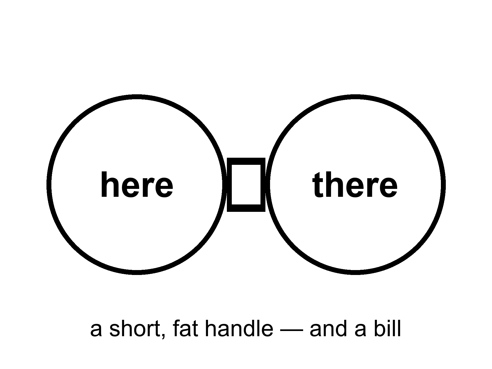

Quantum field theory allows small, brief negative energies. The Casimir effect, between two plates, is the laboratory ghost of that permission. Quantum inequalities then say you cannot pile the ghost into a ship-sized hallway and keep it on duty. The honest status: allowed as a sentence in general relativity; probably forbidden as a station in engineering. Appendix A33 writes the condition. We will not pretend a handle is a purchase order.

If a handle existed, it would not be a machine that “goes.” It would be a feature of the loaf, already there, the way 1914 is already there. Moving one mouth, if you could, is how people turn a handle into a loop, and a loop into a problem for the next part. First, pay the bill.

The bill is not in dollars. It is in a kind of stuff we have never stacked.

The null energy condition, a rule of thumb that ordinary matter respects, says that light rays, on average, get focused by stuff. A traversable throat requires a defocusing, a violation, along the hole. You can write solutions that do this. You cannot, today, point at a tank and say “that is the defocusing, please load it.”

Ford and Roman’s inequalities are the killjoys: the more negative the energy, the shorter the time you may have it, in a given volume. Macroscopic and long-lived fight each other. A ship-sized, hour-long throat is the kind of request the inequalities seem built to refuse. “Seem” is doing some work. The refusal is not a theorem about every possible loaf. It is a strong hint from the quantum rules we actually use.

Is there a real way to go faster than light by bending the path?

There is a real *sentence*. There is not a real ticket.

Special relativity is a rule about the loaf’s local manners: nothing with a mass, in its own little room, outruns the light in that room. General relativity lets the rooms themselves be rearranged. You do not beat the messenger. You shorten the hallway. A handle does this by adding a shortcut between two spheres. A warp does this by squeezing the loaf ahead of you and stretching it behind, so the destination slides toward the kitchen while you sit, locally, as if you were at rest. Miguel Alcubierre wrote that bubble down in 1994. Inside, the tea does not spill. Outside, the geometry does the commute. Light still wins every local race. The arrival can still beat a light-beam that took the long way through the unbent loaf. That is the whole trick, and it is not a cheat of Einstein. It is Einstein used as a contractor.

The contractor sends a bill we have never paid.

The skin of the bubble needs the same rude stuff as a throat: energy, in some frames, that is negative — a defocusing, a violation of the null energy condition, equation (17). Early estimates asked for a Jupiter of it. Later papers shaved the number by reshaping the skin. Shaved is not stacked. We have Casimir plates and other ghosts. We do not have a ring of ghosts around a cabin. Ford and Roman still mutter: the more negative, the shorter the time you may have it. A bubble you could live in, for the hours a star-trip would take even when the hallway is short, is the kind of object the inequalities seem built to refuse.

There is a ruder catch, and it is the one the posters skip. **Bending the path usually means the path is already yours.** The front of a warp bubble is, in the ordinary writing, causally disconnected from the cabin. You cannot reach out and steer a geometry you have not already laid. Turning the bubble on, from the inside, is like lighting a fuse that has not been strung. Someone — or some machine — has to arrange the loaf along the route first, or meet you from the far end, or leave a tube in the bread on an earlier, slow pass. Krasnikov’s tube is that last idea: go the long way once, leave a modified hallway, come home short. That is not a point-and-go. That is paving. Paving a century of loaf with exotic asphalt is not a smaller project than the cruise in Chapter 31. It is a larger one, wearing a faster hat.

If you *could* pave at will, you could also turn the pavement into a loop: two short hallways, badly timed, and yesterday is a stop. Hawking’s hunch from Chapter 35 is waiting there. The universe, asked to let you arrive before you left, may explode the pavement instead.

So the grown-up inventory is short. No local dash past light. No switch that nulls weight because you said so. A handle, a bubble, a tube: three shapes the loaf might wear, all of them sentences in a theory we trust in the rooms we have tested, all of them hungry for a stuff we have not stacked, all of them easier to write than to start from a cockpit. The woman in the greenhouse, the melt-probe in the dark sea, the crew that does not sleep — those remain the transit system. Handles and bubbles stay in the appendix, where a bill belongs. The galaxies that have already left stay gone. A nearby ice, a nearby dirt, a nearby library: those are still in the cone.

---

\newpage

## 34. The Watchmaker, and the Signal

When the basil lives and the ice melts and the leftover glow looks arranged, a temptation arrives: *someone did this.*

A slab that teaches apes to use tools. A gardener who lights a new star for a moon. A visitor who lands because we played five notes. Those are stories. They are allowed as stories. As physics they have a job they have not done: they must predict a signature we can miss.

A craftsman who wanted liquid water could have used starlight bands or tidal seas. We have both, and they look like maps, not signatures. A craftsman who wanted observers could have left a serial number in the leftover glow. The glow’s freckles look like stretched noise. A craftsman who wanted contact would not be limited to the speed of light, unless the craftsman is also a physicist with our constraints — in which case the craftsman is us, later, in a machine that does not sleep, and we are back at a project.

The oldest version of the temptation has a better address. It asks whether a river kingdom already knew.

Say the obvious first. Egypt knew the sky as a tool. They aligned million-ton tombs to true north within a fraction of a degree — not by luck, by stretching ropes and watching a star that does not travel far. They ran a calendar off the Nile and off the heliacal rising of Sopdet, the star we call Sirius, because a flood that feeds you is a clock you do not get to ignore. They had decans, surveying, a geometry that could lay a square on sand and make it stay. They wrote the work down. We have quarry marks, worker villages, a diary of a man who hauled limestone for a king. The stone did not arrive from another sun. It arrived from a quarry, on a boat, by people who were good at their job.

That is already a lot. It is allowed to astonish you. Astonishment is not a visitor.

What they did *not* know is the leftover glow, the shove, the block, the fact that Andromeda is a navy of suns. They had a sky full of meaning — a Duat, a night boat, an afterlife with a map — and meaning is a kind of knowledge. It is not the same kind as a microwave temperature. A culture can be brilliant at north and still not own cosmology. Those are not contradictions. They are two different kitchens.

The sermon that follows is the one that steals the work. *Someone must have told them. The shafts point at Orion on purpose as a physics lesson. The ratio of the base to the height is a message about circles that only we can read.* Some of the numbers are real: a seked, a cubit, a slope you can repeat. Some are what happens when you go looking for π in any pile of well-cut stone. Selection is a craftsman too. Shafts that face a northern star are what you get if you care about the unmoving sky and you have a burial to aim. They are not a telegram from Chapter 8.

Did they know something we forgot? They knew how to live with a river and a year and a death that needed a house. We forgot some of the patience. We did not forget a hidden physics. If a gardener had numbered those stones, the number would survive a translation into a channel nature does not use. What survives is architecture, administration, and a sky used as a clock. That is enough. It is also the grown-up sentence: **give a long state a flood and a bureaucracy, and it will invent north.** You do not need a colleague with different ears. You need time, food, and someone who writes the rope-length down.

Then there are the lights.

Not the leftover glow. Lights in *this* air. Say the obvious first, or the skepticism is just a mood.

Something is there. Not in every backyard video. In the stubborn cases: a carrier group, a spy radar that had been seeing “things” for days, two navy pilots who flew up to a pale lozenge with no exhaust, no rotors, no thermal plume, and watched it stay in the wind over a disturbed patch of sea, then leave in a way their jets do not leave. A wing camera wrote an infrared tape. The navy later let the tape out of the bag, stood up an office, and printed the dull word *unidentified*. That sequence is not a campfire. It is what a serious institution does when its own instruments have leftover.

What did they film?

They filmed an object, or a phenomenon that holds still long enough to be an object. Infrared is a thermometer with a zoom, not a novel. Without a range, a small drone nearby and a large hull far away wear the same pixels; a turn of the pod can look like a miracle. Some of the later famous tapes really are that kind of homework: glare, parallax, a balloon that was never a visitor. Admit those too. The best case is not those tapes. The best case is the day the radar, the eyeballs, and the camera were all pointed at the same leftover, and the leftover did not fly like an airplane. You can argue about the last burst of speed. You cannot honestly argue that nothing was there.

Two other obvious things.

If the leftover is ours — a classified drone, a test article, a trick of electronic warfare — then the obvious sentence is not “go home.” It is: someone already builds machines the briefing does not mention, and they already share the sky with nuclear carriers. That is remarkable even if it is dull. If the leftover is someone else’s — another flag, another workshop — it is the same sentence with a worse budget meeting. Human homework still has to obey energy, materials, and light. It does not get a free pass because it is embarrassing.

If the leftover is *not* a known workshop, then “I don’t know” is the grown-up line. Not “nothing.” Not “a colleague.” A real residual with bad range and no wreckage. Science starts there. Kitchens fill with stories there. The job is to stay in the residual without hiring a priest or a joker.

The pilots are not the problem. They saw a thing in a place they are paid to see things. The leap is not “they lied.” The leap is “therefore a face, a future, a hop.” Chapter 30 already fired the face as a default. The physics still has to hire the vehicle, or admit it has not.

So: where would it come from, *if* the leftover is a vehicle we do not own?

**Our own future.** The loaf does not offer an edit. If a later crew could ride a loop, the visit was already in the inventory; Chapters 35 and 36 will not give you a sandbox, and Hawking’s hunch is that the vacuum explodes if you try to build the ride. Even granting the ride, buzzing a fighter jet is a strange errand for a civilization that can borrow yesterday. Cold as an account of these tapes. Warm only as a reminder that “us, later, in a machine that does not sleep” is already a project in this book — and that project arrives by the long road, late, with a library, not as a lozenge in a dogfight.

**A parallel world.** Everett’s leftover branches, if that reading is right, are inventory, not a ferry. There is no hop. There is no note. Chapter 40 will say this again because people want it not to be true. Cold.

**Our past.** A gardener who came, left, and forgot to number the rocks. That is the watchmaker again. The rocks we have look like rocks. A secret workshop in *this* century is the warmer past: not antiquity, last Tuesday, and classified on purpose. Dull. Allowed. And — say it — sometimes the *best* fit for a leftover that looks like a machine and shares a range with a navy. “Often enough” is not “always.” The best cases are exactly the ones that have not been publicly walked back to a balloon.

**Another planet, traveling forever.** This is the least rude extraterrestrial sentence, and it still pays Chapter 31’s bill. A crew that does not sleep can, in principle, spend centuries and arrive. Light is late; flesh is worse; a machine can wait. That possibility is obvious as physics and unproven as a caption on these leftovers. Why *this* air, *this* decade, *this* game of tag, and no wreckage, no radio, no serial number in the leftover glow? Those are fair questions. They are not a proof of absence. The Fermi quiet — if the sky is full of travelers, why is the mail this bad? — is a smell, not a gavel. Warm as a project the universe permits. Cold as a filled-in name on the tape. The honest middle is ugly and correct: an interstellar machine is allowed by the chapters we already wrote, and we do not have the hardware that would make us say we have met one.

**Beamed.** A handle, a printer, a body assembled from a recipe sent at light. The handle still owes the exotic-matter bill. A recipe still needs a kitchen on this end; that is Chapter 32’s library, and it is a box we would notice if it were sitting in a field. Teleportation without a printer is not a sentence in the physics we have. Cold.

**A thought without ears.** A schoolyard, a crowd of children, a craft on the ground and a message that arrived behind the eyes. That story exists, and the obvious part is that many children, the same morning, described a thing in the same dirt. Something happened in that yard — a sight, a panic, a shared picture. Children are not a lesser instrument; they are an instrument without a rangefinder and with a powerful need to agree. Memory is social. Expectation is contagious. None of that makes them liars. None of it hires a new force. Telepathy, as physics, is a channel that has never shown up in a lab where you can miss it. Information still has to be carried by something that exists — light, sound, a chemical, a shove. A mind-to-mind radio that beats light, or skips the air, is not on the inventory we can test. Cold as a mechanism. The schoolyard remains a human event we have not finished explaining. “Not finished” is not a second universe. It is also not a shrug.

Do quantum mechanics and relativity play a role? Yes — as bills, not as costumes.

Special relativity is why a seeder’s mail is late, why a lozenge that really moved at a serious fraction of light in air would have written a louder signature than a tape, and why “beamed here” is still a years-long letter unless the printer was already in the room. General relativity is why a handle, a warp, a nulling of weight, is not a switch: gravity is the loaf, and a throat still owes Chapter 33. The one warm “future-us” that relativity actually permits is not a loop. It is a twin who went fast and came back younger — a Chapter 31 cruise, not a raid on yesterday.

Quantum mechanics is why the library is letters that copy with mistakes, why entanglement is not a schoolyard radio — the no-signaling theorem is a killjoy with a proof — and why “they vibrate at a higher frequency” is not a sentence in the theory. The hole we actually have is that the two great theories do not yet share a kitchen. That hole is real. It does not fill in a gardener, a pour into the first ocean, or a leftover in a dogfight. String theory, if you want the name, cannot currently be tested; it does not get to be a visitor’s engine either.

What would count, if you are not here to be thrilled?

Hardware you can hold, with isotope ratios and a microstructure Earth does not pour. A trajectory, range-complete, that violates the energy a craft that size can carry — and still looks the same when three instruments that are not friends agree. A message in a channel nature does not use. We do not have those yet. What we do have, in the stubborn files, is already enough to forbid two lazy sentences: *nothing happened*, and *so it was a person from another world*. The leftover is obvious. The name is not.

Why did a legislature suddenly want a hearing?

It was not sudden if your file starts in 1947. It was sudden as a *public, funded, unembarrassed residual*. In 2017 a newspaper printed a Pentagon office that had been buying the question. In 2020 the navy authenticated the tapes. In 2021 the law required an intelligence assessment. Hearings followed. A majority leader put disclosure language in a defense bill and watched it thin out in negotiation. That is not a conversion to a colleague from another sun. That is what a state does when three boring fears line up.

First: air domain. Drones, cruise missiles, hypersonic tests, someone else’s homework in a range you thought you owned. A leftover that can sit over a carrier is, if it is a machine, already an operational fact. Stigma — the joke that used to keep pilots quiet — is, in that light, a security hole. Second: oversight. Classified programs live in the same sky. A congress that cannot tell a leftover from its own black budget is a congress that is being managed. Third: nuclear nervousness. Reports that cluster near weapons and reactors are, even when they are noise, the kind of noise a committee is paid to hate.

Some members want the other caption. Testimony has been given, under oath, of retrievals and of craft that are not ours. Testimony is a record of a claim. It is not a hull on a bench. Appendix A34 still wants the isotope. Admit the obvious without the choir: **Congress got interested because the leftover entered institutions that can be embarrassed, in a decade when being surprised in your own air is a career-ending sentence.** That is smarter than an awakening and ruder than a debunking. It leaves the stubborn files where they were — unnamed.

Appendix A34 is the dull list. The Blind Watchmaker of the filter chapters is the working tool. The greenhouse is not evidence of a gardener. It is evidence of a gardener *we know*, wearing a glove, hitting an airlock.

If someone else has a radio, the radio is late.

A yes-or-no from the nearest other Sun is eight years of round-trip at light, if they answer on the first try, if they listen our way, if they exist. A conversation is a career. A conversation with a tidal sea’s inhabitants, if they have not invented radio because they have not invented eyes, is a melt and a guess. SETI is a search for a very specific kind of waste heat and timing: someone who learned to shout in electromagnetic. Most of the habitable map in Chapters 27 and 28 would not shout that way.

A signal is not a savior. It does not fix the shove. It does not open a handle. It does not make the Omega Point required. It is a fact about another worldline, arriving late, the way Andromeda’s navy arrives late. If we ever hear one, we will not have been rescued. We will have been informed that the trick of carbon and water happened twice, or that a machine that does not sleep learned to shout.

An unidentified light in our own air is not a better savior. It is a closer residual: sometimes a pixel with no range, sometimes a radar and two eyeballs and a camera on the same leftover, and still not a sentence we can read. If a visitor were here, the visitor would still be a worldline, late or local, paying the same bills as the rest of this part. The clean search remains the one that can be missed — a dish, a spectrum, a plume, a melt. The dirty search is the one we already have, and it is not empty.

Until then we have a greenhouse, a dark sea, a library, and a delay. That is enough to be getting on with. It is already a better story than a door.

\newpage

# PART VII — Loops

---

\newpage

## 35. Time Travel Is Not an Edit

The kitchen fantasy of time travel is an edit. You go back, you unsay a sentence, you save a person, you kill a tyrant, you step on a butterfly, and the loaf *rewrites*. Relativity does not hand out rewrites. If the loaf contains a path that arrives at an earlier event, the event was never waiting to be changed. It already includes whatever the path did.

This is the Novikov habit, and it is the only habit that does not set the block on fire. A loop is a consistency condition, not a sandbox. The watch you leave in a drawer in 1989 is the watch you will find because you left it. The message you scratch into frost on a greenhouse pane is the message that was always on the pane in that event. You do not get a second pane.

People hate this because it feels like a trick. It is the opposite of a trick. It is what “the inventory is events” was always going to mean once you allowed a worldline to meet its own past. The choosing is still a stretch of thread. The stretch, if it loops, was counted once.

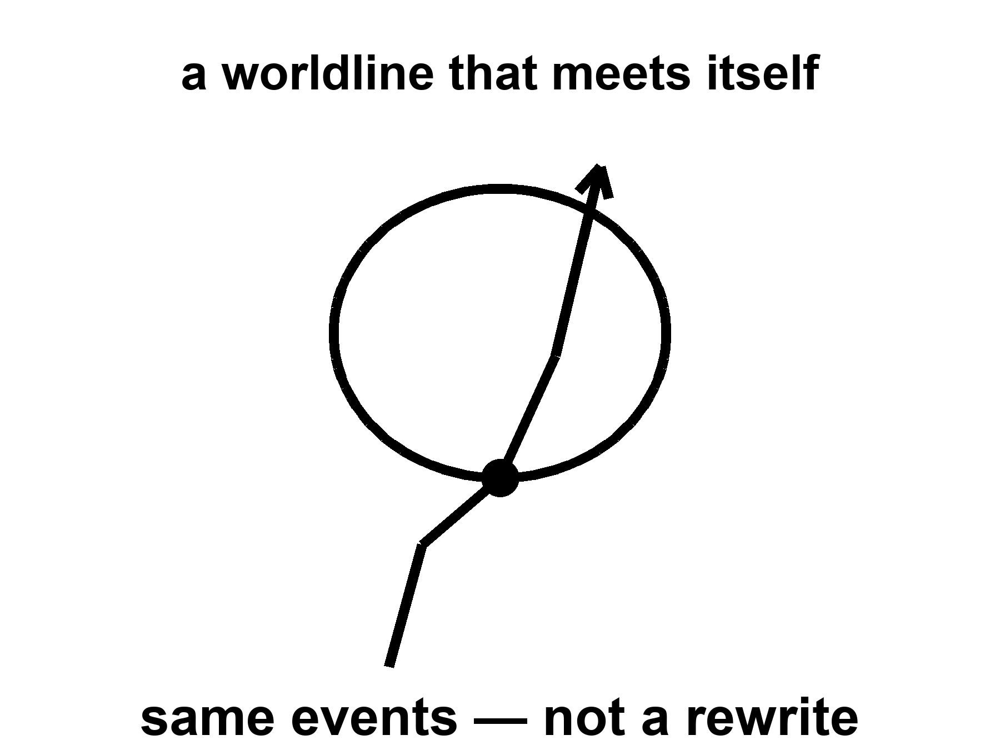

The woman in the greenhouse cannot radio yesterday. She can radio twenty minutes ago, which is rude but not looping. The machine that does not sleep, falling toward a star for four hundred years, cannot mail a warning to its launch. It can arrive, melt, look, and send a letter that will be read by people who have never met the launch crew. That is not time travel. That is the ordinary lateness of light, stretched over a career.

If you want the edit, you need a different loaf — a branch, a copy, a hop. The copies chapter will give you inventory and still refuse the hop. There is no known door from this thread to a thread where the basil died and you would like a second try. Grief is a fact about one worldline. It is not a user interface.

Are loops even allowed?

In special relativity, no: the loaf is too stiff. In general relativity, sometimes, on paper. Kurt Gödel found a rotating universe in which you can ride a closed timelike curve — a path that stays inside its own future and arrives at its own past. Our universe is not Gödel’s. It does not rotate that way. Kerr’s spinning hole, if you could go *through* the interior in the idealized math and if the interior were not a chaos of instability, offers rings that loop. Wormhole mouths, if you could move them, can be turned into a time machine: park one, fly the other on a fast trip, bring it back, and the clocks on the mouths no longer agree in a way that lets you leave today and arrive last year.

All of these are sentences in a theory we trust in the rooms we have tested, used in rooms we have not. None of them is a photograph. None of them is a ticket.

Appendix A35 names the metrics. Here, keep one picture: a loop is a *shape* the loaf might have, locally or globally. It is not a machine you bolt onto the loaf. If the shape is there, it was there. If it is not, you cannot will it into an edit.

The grandfather “paradox” is a complaint about edits. In a consistent loop, you do not kill the grandfather in a way that prevents the loop. Either you fail, or you are not in that story, or the story was never the one you thought. This is unsatisfying as drama and perfect as bookkeeping. Drama wants the rewrite. Bookkeeping wants the inventory.

Why may the universe forbid them?

The chronology-protection conjecture is a hunch with a pedigree: the universe, when you try to build a loop, fights back. Vacuum jitters near the would-be time machine grow. The throat, if a throat is involved, blows. The Cauchy horizon — the surface beyond which prediction dies — becomes a wall of energy. You do not get last year. You get a bang.

It is a conjecture. It is not a theorem. It smells right to people who have watched quantum fields misbehave near horizons. It may be a prejudice. Appendix A35 writes the horizon names. Here, the hunch is allowed to sit in the warm-to-cold chair: we have never seen a loop; we have good reasons to think making one is a way of asking the vacuum to explode; we do not have a photograph of the explosion either.

If the hunch is wrong, the block contains shapes that arrive before they leave, and the kitchen argument about “now” was only the beginning of the trouble. If the hunch is right, the loaf is stubborn about order along worldlines that matter, and time travel remains a sport for metrics, not for crews. Either way, the greenhouse’s radio does not get yesterday. That is a practical mercy. A project is hard enough when the dirt can vote no. It would be impossible if the dirt could vote no, then yes, then no again, on the same Tuesday.

---

\newpage

## 36. If You Could Walk Sideways Through When

Suppose, as a thought, you could leave your worldline and walk *across* the loaf, as if time were a hallway of rooms, each room a now, each now a place you could enter and leave.

You would not be editing. You would be visiting. The childhood kitchen would be a room. The greenhouse would be a room. The dark sea under Europa’s ice, on a particular Tuesday of a particular millenium, would be a room. You could push a book, raise a dust of frost, encode a pulse in a watch. Those events, if they are in the loaf, were always in the loaf. Your walk would be another thread, weirdly oriented, already counted.

This is the block made into a set of furniture. It is useful as a picture and false as a permission. We do not have a sideways walk. Our worldlines are nearly parallel, locally, to the time directions the leftover glow picked out when it last scattered. We go from event to event the long way, accumulating proper time, eating basil, dying.

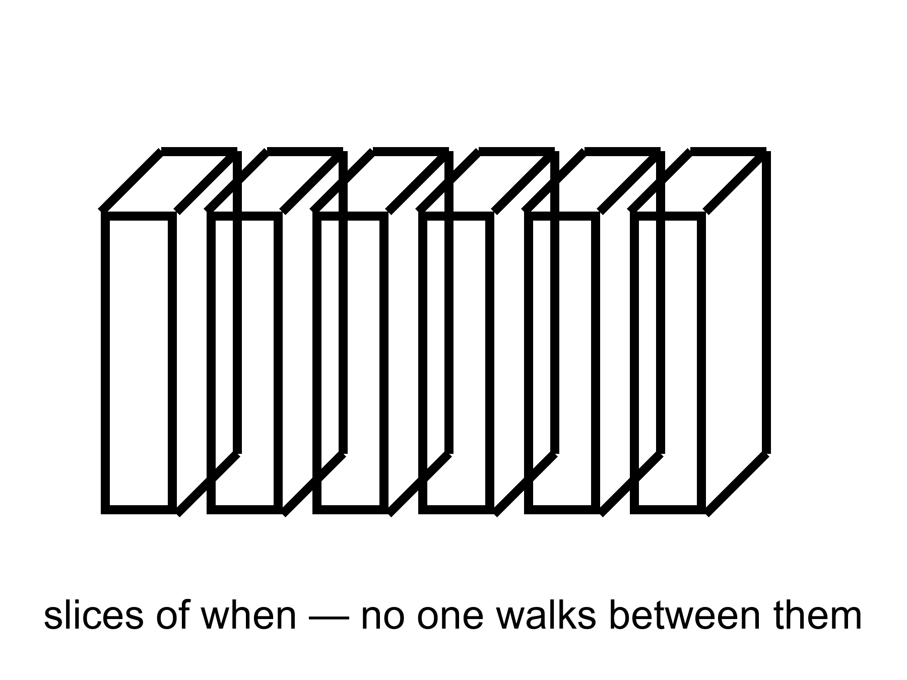

Foliations — the technical name for slicing the loaf into “nows” — are a choice, not a hallway. Appendix A36 says why a stack is not a corridor. The picture remains the right one for grief and for hope: the rooms are there, in the only sense events are there. You cannot rent them. You can occupy one thread, do a project, and leave a library. That is not a small thing. It is the thing. The sideways walk would only show you what the thread already meant: that the inventory does not blink when you close your eyes.

\newpage

# PART VIII — All the Copies

---

\newpage

## 37. Four Kinds of Elsewhere

“Multiple realities” is four claims in a trench coat. If you let them fuse, you can prove anything and have explained nothing. Keep them in separate rooms.

**More of this universe.** Same laws, same constants, more space. If the dough is infinite, or merely brutally large, and the ingredients are sprinkled in a statistically ordinary way, then a finite pattern — a galaxy like this, a kitchen like this, a woman hitting an airlock — repeats. Not because anyone copied it. Because there are only so many ways to arrange a closet of atoms, and an infinite warehouse will reuse the arrangements. These copies are *elsewhere* in the ordinary, spacelike sense. You cannot visit. Light will not finish the trip.

**Other bubbles, other rules.** If inflation never quite clocks out, and if the way it clocks out has many valleys, then other hot bangs can freeze with different effective constants, different particle menus, different numbers of large directions. This is the expensive copy machine. It is a live hypothesis stacked on a working theory stacked, often, on an untestable framework.

**Other branches.** The electron’s equation does not pick a single outcome. One reading says the leftovers stay: both ways persist, decohered, non-interfering. These copies are not other places. They are other terms. You are one term.

**Other mathematics.** If existence is cheap and consistency is enough, then every coherent structure is a universe. This is a metaphysical bet. It is not physics. Barrow would have smiled and called it an idea for ideas.

Dark matter is not a fifth room. Dark energy is not a sixth. They are ingredients *in this room*. A tidal sea under ice is not another reality. It is a dark room in this one. Keep the nouns sober. The rest of this part takes the first three claims in order and refuses, each time, to sell you a ticket.

---

\newpage

## 38. More of This Universe

Assume, for a page, that space goes on, same laws, no edge, matter doing statistically ordinary things. Then the Hubble volume — the room we can, in principle, have seen — is one tile. Beyond it, more tiles. The number of ways to arrange the quantum states in a tile is enormous, but finite if you take the holographic bound seriously. In an infinite warehouse of tiles, every allowed arrangement happens, and happens again.

There is a version of you who did not open this book. There is a version of the greenhouse where the basil died in month four. There is a version, much farther, where a dead world was never visited. These are not hops. They are the cheap copies: same physics, different draws, out of reach because the particle horizon and the event horizon are rude.

Is space infinite? We do not know. We know it is larger than the tile, and flat to a boredom that inflation explains as a feature. Infinite is a cold extra. “Much larger than we see” is warm. The cheap copies require the stronger extra, plus a faith that the statistical sprinkle does not, at some scale, start repeating for a boring reason or stop being defined.

Even if the copies exist, they do no work for the woman in the airlock. Her potatoes are not saved by a tile where potatoes lived. Grief is local. So is a project. The cheap copies are a fact, if they are a fact, about the warehouse. They are not a consolation and not a map.

---

\newpage

## 39. Other Rooms, Other Rules

The expensive copies need a burst that does not know how to retire, and a menu of retirements.

Eternal inflation, Chapter 15, is the burst that may not retire. The menu is the maybe: different valleys, different leftover constants, different low-energy laws. In one valley the cosmological constant is a monster and galaxies never form. In one it is a little shove, and someone hits an airlock. In one there are two large dimensions and no kitchens. Weinberg’s filter needs this menu, or something like it, to turn “Λ is small” from a miracle into a selection.

Where does the menu come from? Often, from string theory’s landscape: a reported 10⁵⁰⁰ ways to compactify extra directions and freeze a vacuum. **String theory cannot currently be tested.** A number like 10⁵⁰⁰, offered without a risky prediction that would kill the framework, is a catalog, not a census. Other frameworks offer other menus. Some offer one valley. The sky we have does not yet choose.

The measure problem sits on the catalog like a cat. Infinite bubbles, infinite observers, no agreed count: “typical” becomes a fight. Until the fight ends, “the landscape predicts observers like us” is a hope. It is a better hope than a required Omega Point, because it does not contradict the shove. It is still a hope.

If you live in a bubble, the neighboring bubbles are not destinations. The walls, in the usual pictures, are empty and expanding. You cannot book a crew that does not sleep and arrive at a different fine-structure constant. You can, at best, infer that you are in a valley that permits you. That inference is the weak filter. It is not a tour.

---

\newpage

## 40. Every Allowed Outcome

Hugh Everett, in the 1950s, took the electron’s equation at its word. The equation offers a sum of ways. The usual habit is to throw away the ways that did not “happen” at a measurement. Everett’s habit is to keep them. The sum is the inventory. A measurement is a fork. After the fork, the branches do not talk; decoherence makes the interference go away. You are the branch that includes this sentence.

This is not extra cosmology. It is a reading of the same rule that builds chemistry. It is warm. It is not a photograph of other lives. It does not give you a hop. The carnival version — jump to the branch where the basil lived, where the sea is empty, where you did not lose who you lost — is a story. The physics, if Everett is right, says those branches are *on the inventory* and *unavailable*. They are as unavailable as Andromeda’s navy and ruder, because they are not even elsewhere. They are elsehow.

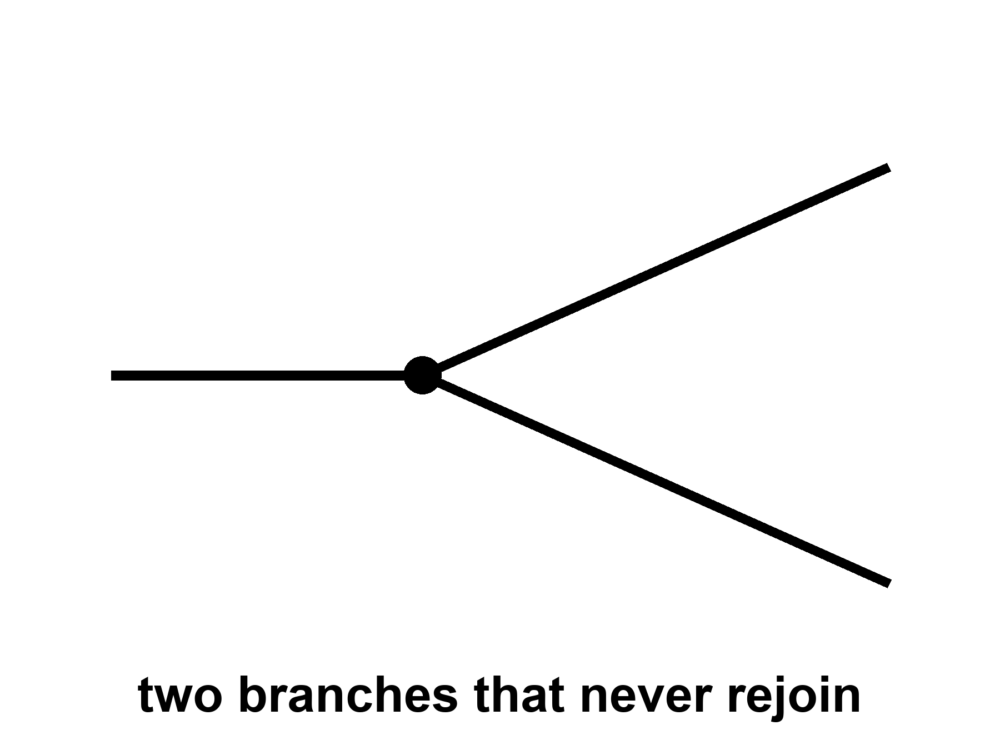

Why put this at the core of a book about the universe? Because the block, without it, is only all the times. With it, if you buy the reading, the block is all the times and all the allowed versions. “Everything, everywhere, all at once” is a phrase this book will not treat as a title. It will treat it as a temptation to be made precise. All the times: the loaf. All the versions: the forks. All at once: a bad kitchen phrase for “equally in the inventory.” Not a permission to walk sideways. Not a permission to hop.

The practical fact does not budge. The worldline you occupy is the one you can work along. A melt-probe either tastes life or it does not. A library either arrives or it does not. The other outcomes, if they persist, persist without you. That is either a horror or a relief. It is, in any case, not a ticket counter.

A loop that calls itself I wants a ruder answer. If the I is a tangle — a translation that stays closed — then a perfect copy of the tangle is a second I, not a hop of the first. Two nests built from the same plan are two cities. They may share a past up to the fork. After the fork they do not share a now, because there is no now. The woman in the greenhouse, duplicated by a printer that worked too well, does not “go” into the duplicate. She acquires a twin who will swear, with equal right, that she is the original. That is not Everett. That is logistics plus a loop. Everett is ruder still: the twin is not even elsewhere. She is elsehow, and she does not get your radio.

People who love copies as consolation are buying a translation and calling it travel. Keep the translation. Fire the ticket.

Appendix A40 writes decoherence, the no-signaling theorem, and the loop. You cannot use a fork to send a note to the branch next door. The radio in the greenhouse is more powerful than a branch. It can, at least, reach twenty minutes ago in *this* term.

\newpage

# PART IX — The Filter

---

\newpage

## 41. A Filter, Not a Purpose

If the strong nuclear force were a few percent different, carbon would be rarer, or stars would be ruder, or the leftover helium would be a different lie. If the cosmological constant were a few dozen times larger, the shove would have won before the twitches grew up, and there would be no spirals, no kitchens, no one to notice the shove. If electromagnetism were a little stronger, chemistry would be a smaller menu. These are the dimensionless coincidences, and they have been used to sell both wonder and sermons.

The wonder is allowed. The sermons are a leap.

We do not have a second universe on the bench to compare. We have one leftover glow, one set of constants, one table of nuclei. In that one, water bends, carbon chains, stars last. The look of arrangement is real as a feeling. As an argument it has a hole: we are the sample. Samples taken from the places that permit samples are biased. That is not cynicism. It is how you do not get fooled by your own lungs.

Weinberg’s move on the cosmological constant is the rare case where the feeling was turned into a number. If Λ is drawn from a wide range, the observers who measure it should find it small enough for galaxies, and not much smaller than that unless something else is at work. The measured value is near that edge. That is interesting. It is not a proof of a menu. It is what a filter looks like when you bother to write it down.

The tidal seas belong here as a humility. We thought “arranged for life” meant a Goldilocks band and a blue marble. Then we found that most of the wet real estate in the solar system might be dark, under ice, squeezed by a giant, uninterested in sunsets. If there is life there, it did not need our sermon. If there is not, the permit was still wider than the sermon. Arrangement, if you must use the word, is sloppy and local, not a tailored suit.

The Weak Anthropic Principle, in a careful wording, is a selection effect: the constants we measure are drawn from the values that permit us to measure them. Carbon chemists need carbon chemistry. They need a universe old enough to have cooked carbon in stars. They need a shove that did not win too early. Saying so is as taut as saying that fish find themselves in water. It is also as useful as that, once you have an ensemble to select from.

Without an ensemble, the weak principle is a reminder, not an explanation. It stops you from being surprised that the kitchen is not on Venus. It does not tell you why there is a kitchen.

With an ensemble — cheap copies, expensive bubbles, a menu of Λ — the weak principle becomes a cut. You throw away the valleys that have no observers, and you look at what is left. You still need a measure. You still need the ensemble to be more than a catalog from an untestable framework. You do not get to say “the universe wanted us.” You get to say “we could not have found ourselves in the valleys that did not want anyone.”

The Strong Anthropic Principle says the universe *must* permit life. “Must” is a smuggler. It can mean the tautology, the ensemble, or a purpose. Only the first is safe. The Final Anthropic Principle says intelligent processing must arise and must never die out. That is the Omega Point’s moral clause. Chapter 19 already broke its physics. Its morals were never physics.

A filter is not a purpose. A purpose has an aim. A filter has a mesh. We are what got through, in this valley, on this worldline, with this leftover helium. That is enough to be getting on with. It is not enough to crown us.

---

\newpage

## 42. No Cosmic Craftsman

Darwin’s trick, which this book has been circling since the prologue, is that a filter can look like a craftsman if you only see the survivors. The beaks fit the seeds. The fit looks like intent. The intent was death, repeated, in a lot of directions.

He did not start with the trick. He started with a notebook. Islands. Barnacles. Pigeons in a shed. A clergyman’s son who could sit still and then refuse the cheap sentence. The beaks were not a revelation in a dream. They were a pile of measurements that would not sit still under “each kind was issued.” Malthus gave him a rate. Breeders gave him a proof that selection can be hurried by a hand. The conclusion — descent with a mesh — was keen because the observations were allowed to kill the other story. A man on the other side of the world, looking at beetles and islands of his own, reached the same mesh without asking permission. That is what this book means by a path: **a record you could have missed, then a sentence that can die.** The leftover glow is that habit aimed at a fog. The dark sea is that habit aimed at a lid of ice. A craftsman is what you hire when you skip the notebook.

The cosmic version is ruder because we cannot see the deaths. If there are dead valleys, they do not send baby pictures. If there are dead tiles, they are out of reach. If there are dead branches, they do not radio. We see a leftover glow that permits spirals, a shove that waited, a nuclear force that permits carbon, a Jupiter that squeezes a moon until a sea stays wet. The craftsman story is the cheap story. The filter story is the one that does not invent a someone.

Anthroposophy — a spiritual cosmos arranged around human becoming — is a craftsman story with incense. It does not survive the leftover glow, the three minutes, or the shove. It is not a warm claim that failed. It is a different game. This book does not play it.

Where, then, is God?

If the word means a person who numbered the leftover glow, aimed a river kingdom’s stones, and poured a library into the first ocean — a colleague, larger — then the word is the watchmaker again. The channel nature does not use has not spoken. Beauty is not a serial number. This book will not pretend a gap in the first chemical hour is a detection.

If the word means the reason there is a loaf rather than not, the question is honorable and unanswered. Naming the question is not a theory. It does not predict the helium fraction. It does not fix Λ. It does not open a handle. You may keep the name in a kitchen, the way you keep “now.” Do not promote it to a cosmology. Einstein’s habit, when he said God, was often the order itself — *Deus sive Natura*, a dignity for the metric, not a will. That habit is poetry with a good ear. It still does not give you a prayer that changes a worldline from outside the loaf.

If the word means the laws, you have renamed the equations. Allowed. Empty.

The devil is the same furniture with the sign flipped. A cosmic adversary who wants the host to lose is a craftsman of evil, and Chapter 30 already fired that hire: survival at all cost is a fitness peak, not a personality. Death keeps the score. Entropy is the arrow we borrowed from a smooth beginning, not a being who likes ashes. Suffering is real. It happens on threads. It does not become a second deity because we need someone to blame who is not the filter. You may use the old words for the old dread. The field equation will not countersign them.

What we *can* be is a local craftsman. The greenhouse is a beak we built for a seed we brought. The melt-probe is a beak for a dark sea. The library is a beak for a future dirt. That is not the universe arranging itself. That is a worldline arranging a room. The difference is the whole moral, if a cosmology book is allowed one: do not wait for the loaf to love you. Do not require the ending to compute you back. Grow the basil. Taste the plume. Send the machine. Admit that it may fail. Call that, if you need a word, meaning — and keep it off the gravitational field equation.

\newpage

# PART X — What the Future Is Allowed to Be

---

\newpage

## 43. Five Ways It Can End

The leftover glow does not say how the story closes. The shove does most of the talking, and it talks in a low, accelerating voice. Here are five closings, with their temperatures.

**Heat death.** The working default. The stretch keeps winning. Bound islands last a long time and then do not: stars burn out, remnants cool, black holes leak (Chapter 23), the islands thin toward a sameness in which no heat can run a trick. Time, as a useful word for change, gets bored. This is Kelvin’s old gloom, updated with dark energy. It is not a crunch. It is a fade. Warm-to-hot, as futures go.

**The rip.** If the shove is not a constant but a growing rudeness — *w* less than −1, phantom, a word that should not have survived the committee — then bound things unbind. Galaxies, then stars, then worlds, then you. Finite time. No evidence requires this. The bombs permit a constant. Cold, unless *w* misbehaves in a future survey.

**The crunch.** Pull wins. The web falls back. The last three minutes are a hot workshop in reverse, then a scramble, then a singularity or a bounce. The bombs and the leftover glow say we are not on this track unless the shove is a liar. Cold as destiny; allowed as a different valley.

**Vacuum decay.** A jitter somewhere turns the vacuum into a ruder vacuum. A bubble of the new one grows at light, rewriting the laws inside it. No warning: the warning would arrive with the bubble. The leftover glow’s vacuum looks stable enough that we are still here. “Stable enough” is not “stable.” Cold-to-warm; do not lose sleep; do not pretend the risk is zero.

**The bounce.** The end is a middle. A crunch becomes a bang, or a dark sea of extra-dimensional branes slaps, or Penrose’s conformal trick glues a thin future to a next beginning. Cyclic, ekpyrotic, conformal: names, papers, no leftover-glow signature that has stuck. Cold.

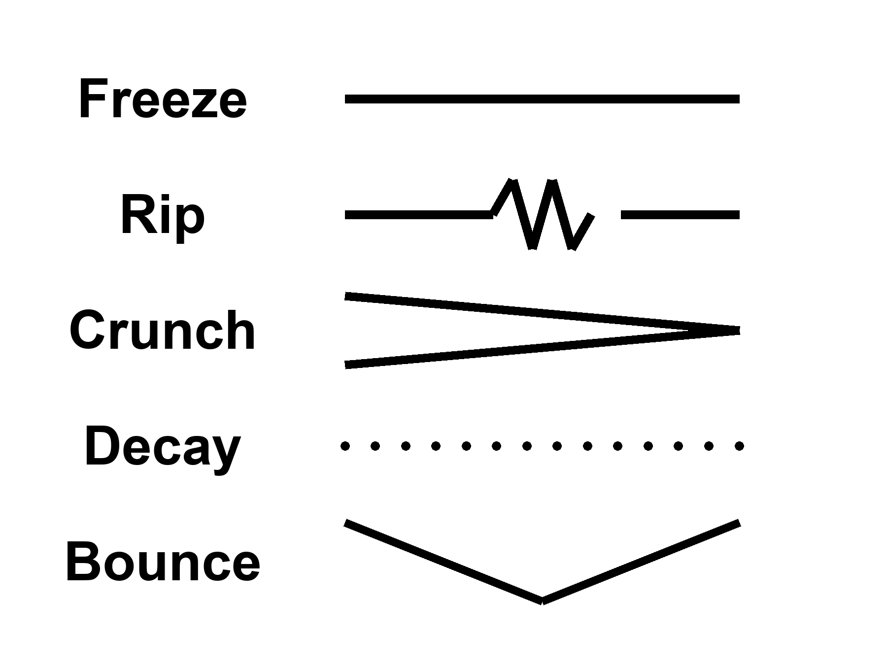

Notice what is not on the list: a required forever-mind. Notice what *is* on the list, quietly, as a project rather than a fate: a greenhouse, a dark sea, a machine that does not sleep. Those do not close the cosmos. They occupy a few more worldlines before the fade. That is the only closing this book will bless.

Appendix A43 writes *w*, decay rates, bounce conditions. Here, pick the default without romance: a long accelerating stretch, islands going dark, the leftover glow thinning until even the holes begin to leak. If you want a prettier last page, write it yourself, in a room, while there is still a room.

---

\newpage

## 44. Does Time Exist?

We have used “time” as if we knew.

In the kitchen, time is the clock. In relativity, time is a direction in the loaf, mixed with space, sliced differently by walkers. Proper time is a length of thread. The leftover glow picks out a useful slicing — cosmic time — because the glow is almost the same everywhere and we can watch it cool. That slicing is a convenience the universe approximately offers, not a throne.

Does time *exist*? The honest answers come in flavors.

**Yes, as geometry.** The loaf has a metric. Intervals are real. This is the hot answer, and it is enough to run GPS.

**Yes, as an arrow, but the arrow is a boundary.** The laws do not prefer a direction. The low-entropy past does. Eggs smash because the beginning was smooth. Carroll’s Past Hypothesis is this sentence in a better suit. If the past had been a scramble, we would not have a “we.”

**Not as a river.** There is no glowing NOW moving down the loaf. Chapters 1 through 6 were that retirement.

**Maybe not as a fundamental word.** In some attempts to quantize gravity, the wave of the universe does not mention time. The Wheeler–DeWitt equation is a constraint, a “this must add up,” not a “this happens next.” Julian Barbour takes the hint all the way: the inventory is configurations, Nows, a heap. Dynamics is what a heap looks like when it contains records of other heaps. Carlo Rovelli takes a different hint: time is what a system with heat says about itself. Thermal time. A useful word for a useful state.

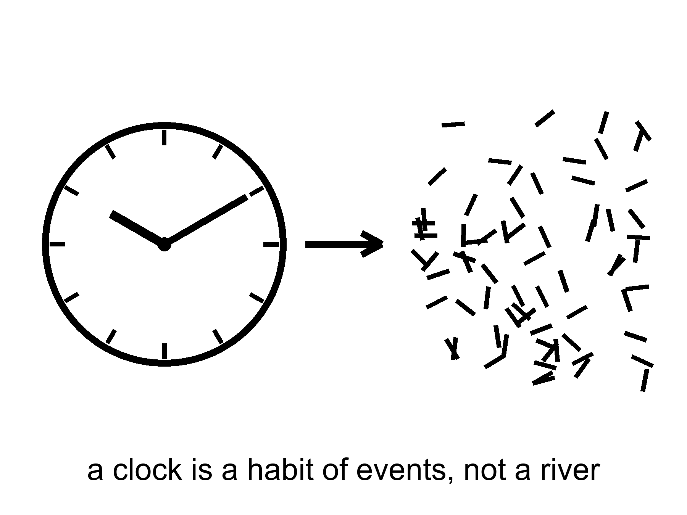

Hartle and Hawking’s no-boundary idea tries to replace “before the bang” with a rounded-off geometry, time crystallizing only when the universe is large enough to have it. Vilenkin tunnels from nothing, which is a technical nothing, not a kitchen nothing. These are cold, and they are the right kind of cold: they are attempts to stop using a word where the word may not apply.

This book’s working answer, the one that can carry a greenhouse and a dark sea: time exists as relations among events. It does not exist as a stage the events are put down on. It may not exist, in the quantum-gravity limit, as a primitive. The arrow exists because the past was special. You exist as a thread that remembers the special past and cannot remember the fade. That is enough to hit an airlock and call it morning.

---

\newpage

## 45. The Honest Ending

Let us cash the recognitions, the way a book of this family is supposed to.

An event is a happening, not a thing. “Now” is a slice you draw. The past we can rebuild — a hotter everywhere, a three-minute workshop, a leftover glow with freckles, a leftover quarter of helium — is a region of the loaf, not a rumor. Most of what pulls does not shine. Most of the budget shoves. The shove is winning, so a required last mind is not a law. A horizon is a one-way fact. A handle is a bill we probably cannot pay. Copies, if they exist, come in four kinds and none of them is a ticket. The look of arrangement is a filter, or a sample bias, or both. Time is a relation and an arrow, not a river.

And then the part the leftover glow does not owe us:

A dead world can hold a greenhouse if someone bullies the ice and the hours. A frozen moon can hold a sea if a giant squeezes it, and that sea can hold a second origin or an empty kitchen, and the only way to know is to melt and look, without poisoning the answer. A crew that does not sleep can carry a library farther than flesh. The library is a physical object. The project can fail. Failure is allowed. Destiny was the thing that was not allowed.

If every allowed outcome is on the inventory, this outcome is still the one with your hands in it. If the block is real, the basil you log on a cold morning is as real as the leftover helium. If the block is not quite real, if time is a heap of Nows, the heap still includes the smell of a lie in a room of LEDs. You do not need the universe to have a purpose in order to have a purpose in it. You need a permit — water, carbon, a little quiet — and a refusal to wait for the ending to compute you back.

Is there a path to ultimate knowledge?

There is a path. There is no chapel at the end of it, and the word *ultimate* is a temptation the loaf itself refuses.

Knowledge, in this book, is a record you could have missed. A prediction that can fail. A fossil that does not need your agreement: the glow, the helium, the stretch, the ring around a hole, a leftover in a navy file that still has no name. The path is the widening of that kind of record — not a feeling, not a collapse of the ocean when you look, not a framework that can survive every outcome and therefore explains none.

The steps are few, and they are severe. They are also old. A notebook, a pile of beaks, a sentence that can die: that is already the whole method. The sky is a larger shed of pigeons.

Learn the bills. Special relativity: no shared now, no local dash past light, mail that is late on purpose. General relativity: gravity is the loaf; a handle and a bubble are sentences that still owe a stuff we have not stacked. Quantum mechanics: amplitudes, decoherence, pairings without a telegram. The seam where the two great theories do not yet share a kitchen is the largest honest hole we have. Sit in it. Do not furnish it with a visitor or a god of the gaps.

Learn the walls. An event horizon is a fact about influence. A cosmic event horizon is a fact about which galaxies will never get your letter. A branch, if Everett is right, is a fact about a term you cannot enter. “Before the fog” may not be a word. Those are not insults. They are the shape of what a worldline is allowed to know.

Refuse what cannot die. A story that fits every leftover glow is not a story. String theory, as it stands, has not named a kill-shot. A craftsman who leaves no channel nature does not use has not clocked in. An observation-creates-life that cannot say what counted as the first observer is a regress, not a path.

Build the next record. A telescope that can smell an oxygen-methane pair and be wrong. A dish that can hear a shout and know the shout was not the ionosphere. A melt that tastes a dark sea without writing over it. A library that is a box, not a sermon. A legislature, even, when it is doing its only smart job: asking whether the leftover in its own air is an adversary, a secret of its own, or a file that still says unidentified. That last is not ultimate knowledge. It is hygiene.

What would *ultimate* have to mean, if we kept the word? Not a God’s-eye inventory of every branch, every before, every event outside our cone. That inventory, if it exists, is not a destination. Ultimate, for a thread, is asymptotic: more of the loaf brought into a record that can fail, fewer sermons in the gaps, a closing of the QM–GR seam if the seam can be closed, a second dictionary under ice or a clean empty, a leftover named or honestly unnamed. You will not finish. The fade, if the fade is coming, will not wait until you finish. The point of the path is not to arrive at a last fact. It is to be the kind of worldline that can tell a last fact from a mood.

The clock on the kitchen wall is still lying. Let it. Take the casserole out. Then, if you have the years and the machines and the tact not to plague a dark sea, send a library. Not because the loaf requires it. Because you can, and because the fade, if the fade is coming, will not be hurried or helped by your waiting.

That is the honest ending. It is not a door. It is a door you build, on a world that did not ask for one, under a sky that is late on purpose. It is also the only path this cosmology can sign: **widen the record, pay the bills, stop at the walls, and do not hire a someone to finish your homework.**

\newpage

# APPENDIX — The Scientific Detail

\newpage

## How to Read These Notes

Each note A*n* twins popular chapter *n*. Units are SI unless stated. *c* is the speed of light, *G* Newton’s constant, *ħ* the reduced Planck constant, *k* Boltzmann’s constant. A scale factor *a(t)* is dimensionless; today *a₀ = 1*. Redshift *z* obeys *1 + z = 1/a* for light emitted at *a*.

String theory, whenever it appears: a mathematical framework that **cannot currently be tested**. It has not produced a unique, risky prediction that would kill the whole idea if the experiment came out otherwise.

---

\newpage

## A0. Three Temperatures of Claim

**Hot:** repeated measurement, used to predict new ones. **Warm:** best model, real gaps. **Cold:** allowed by equations, not selected by data. A claim can change temperature. Inflation’s local burst is warmer than it was in 1981; eternal inflation is not.

---

\newpage

## A1. Relativity of Simultaneity

Einstein synchronization: a clock at *x* is set by light from a master clock, assuming one-way speed *c*. Observers with relative velocity *v* along *x* disagree on which events with Δ*x* ≠ 0 are simultaneous. The desynchronization is, to first order, *Δt = v Δx / c²*. At walking speed across 2.5 million light-years this is years. No signal is exchanged; this is a convention-plus-Lorentz fact, not a photograph of Andromeda.

---

\newpage

## A2. Minkowski Coordinates and the Interval

An event is a point in a 4-manifold. In inertial coordinates the interval is

**(1)**  *ds² = −c² dt² + dx² + dy² + dz²*

*(signature convention −+++).*

*ds² < 0* timelike, *= 0* lightlike, *> 0* spacelike. *ds²* is invariant. The split into *dt* and *dℓ* is not.

---

\newpage

## A3. Light Cones and Lookback Time

**(2)**  *ds² = 0*  ⇒  *dℓ = c dt*

The past light cone of an event *p* is the set of events that can signal to *p*. Lookback time to redshift *z* is an integral of *dt = da / (a H(a))*. The CMB last-scatters at *z ≈ 1090*, age ≈ 380,000 yr.

---

\newpage

## A4. Tilting the Simultaneity Slice

**(3)**  *t′ = γ (t − v x / c²)*

*where γ = 1 / √(1 − v²/c²).*

A plane *t′ = const* is tilted in *(t, x)*. The Andromeda paradox is this tilt at large *x*. Reality-transfer arguments (Rietdijk–Putnam) assume that “present ⇒ real” is transitive across observers. This book rejects the privilege of the plane, not the Lorentz transformation.

---

\newpage

## A5. Proper Time and the Twin Effect

Proper time along a timelike worldline: *c² dτ² = −ds²*. Between two meetings, the inertial path maximizes *τ* (twin “paradox”: the accelerated twin has smaller *τ*). Muons in storage rings: lifetime dilation matches *γ* to high precision. GPS: special-relativistic and gravitational corrections are both ~ tens of microseconds per day and opposite in sign.

---

\newpage

## A6. Causal Structure: Past, Future, Elsewhere

At *p*, *I⁻(p)* (chronological past), *I⁺(p)* (future), and spacelike-separated “elsewhere.” A Cauchy surface intersects every inextendible causal curve once. Presentism requires a preferred foliation that GR does not supply. The block is the default reading of the manifold plus metric.

---

\newpage

## A7. FLRW: No Center, No Edge

The Friedmann–Lemaître–Robertson–Walker metric assumes homogeneity and isotropy. Spatial slices are *S³*, *E³*, or *H³* (closed, flat, open). There is no privileged center. “Expansion into what?” is a category error: *a(t)* rescales proper distances on the slices.

---

\newpage

## A8. Hubble–Lemaître Law and Redshift

**(4)**  *v = H₀ d*  (low *z*);  *1 + z = 1/a_emit*

*H₀* is *ȧ/a* today. Measured *H₀* still tensions (~67 vs ~73 km s⁻¹ Mpc⁻¹) between early- and late-universe methods. The law is not a center; it is a local linearization of *a(t)*.

---

\newpage

## A9. The CMB as a Blackbody

FIRAS/COBE: spectrum is blackbody at *T₀ = 2.72548 ± 0.00057 K*. Dipole from our motion (~370 km/s toward Leo). Intrinsic anisotropies *ΔT/T ~ 10⁻⁵*. Last scattering: *z_* ≈ 1090, *T_* ≈ 3000 K, when hydrogen recombination makes the Thomson optical depth drop through 1.

---

\newpage

## A10. Thermal History, Minute by Minute

**(8)**  *T ∝ 1/a*  (photon temperature after e⁺e⁻ annihilation)

Rough marks: *T ~ 10¹¹ K* at *t ~ 0.01 s*; neutrino decoupling *t ~ 1 s*; e⁺e⁻ annihilation reheats photons; BBN *t ~ 1–3 min*, *T ~ 0.1–1 MeV*; recombination *t ~ 3.8 × 10⁵ yr*.

---

*Big-Bang Nucleosynthesis*

Neutron-to-proton freeze-out *n/p ≈ 1/6*, then decay to ~1/7 at BBN.

**(9)**  *Y_p ≈ 2 (n/p) / (1 + n/p) ≈ 0.25*

**(10)**  Deuterium bottleneck: D photodissociates until *T ≲ 0.1 MeV*.

Observed *Y_p ≈ 0.24–0.25*; D/H ≈ 2.5 × 10⁻⁵. Lithium-7 remains in tension (~factor 2–3). Baryon density from BBN agrees with CMB *ω_b* at the ~10% level or better.

---

\newpage

## A11. Critical Density and the Cosmic Inventory

**(5)**  *ρ_c = 3 H₀² / (8π G)*

*Ω_i = ρ_i / ρ_c*. Planck-like inventory (round): *Ω_b ≈ 0.05*, *Ω_c ≈ 0.27*, *Ω_Λ ≈ 0.68*, *Ω_k ≈ 0*. Mean baryon number density *n_b ~ 0.2 m⁻³*.

---

\newpage

## A12. Horizon, Flatness, and Relic Problems

Particle horizon in radiation era *~ ct*. Opposite last-scattering patches were out of causal contact without a prior stretch. Flatness: *|Ω − 1| ∝ 1/(a² H²)* grows toward the past in decelerating eras, so *Ω ≈ 1* today requires extreme tuning at *t ~ 1 s*. GUT monopoles: *n_M / s* too large unless diluted by *≳ 10²⁵* in entropy or never produced after a burst.

---

\newpage

## A13. Slow-Roll and E-Folds

**(11)**  *N = ∫ H dt ≈ 50–60* needed to solve A13.

Slow-roll parameters *ε = −Ḣ/H²*, *η = ε̇/(Hε)* ≪ 1. Reheating converts vacuum-like energy to a radiation bath; *T_rh* is model-dependent. No inflaton has been identified in a detector.

---

\newpage

## A14. The Primordial Spectrum

**(12)**  *P_R(k) ∝ k^{n_s − 1}*

**(13)**  *n_s ≈ 0.96–0.97* (Planck)

Amplitude *A_s ≈ 2.1 × 10⁻⁹* at *k = 0.05 Mpc⁻¹*. Tensor-to-scalar ratio *r* is bounded (*r ≲ 0.03–0.06* depending on data). Mukhanov–Sasaki variable quantizes the twitch; horizon exit then re-entry seeds *δρ/ρ*.

---

\newpage

## A15. Eternal Inflation and the Measure Problem

If *δφ ~ H/2π* per Hubble time exceeds the classical roll, inflation self-reproduces. Pocket nucleations in a false-vacuum sea are a related picture. Volume-weighted, pocket-weighted, and observer-weighted measures disagree. BGV: if the average Hubble rate along a geodesic is positive, the geodesic is past-incomplete.

---

\newpage

## A16. Sensitivity: From Quantum Noise to BKL Chaos

Inflationary *δφ* is chaotic in the colloquial sense of amplified noise, not always in the formal attractor sense. BKL: generic spacelike singularities in GR show Mixmaster (chaotic Bianchi IX) behavior. A steered crunch requires control of that chaos; Barrow-type results make “intelligent steering to a single c-boundary point” a measure-zero demand unless extra structure is imposed.

---

\newpage

## A17. What “Non-Baryonic” Means

Baryons: protons and neutrons (plus electrons for “ordinary matter” in the budget). CMB + BBN fix *Ω_b*. Dynamical and lensing masses give *Ω_m > Ω_b*. The difference does not couple electromagnetically at the needed level. Collisionless cold dark matter (CDM) is the working fluid. WIMP, axion, sterile-*ν* are candidate nouns, not detections.

---

*Rotation Curves, Lensing, and CMB Peaks*

Flat rotation curves: *v² ≈ G M(<r)/r* implies *M ∝ r* in disks. Weak/strong lensing maps *Σ*. Bullet Cluster: offset between *Σ* (lensing) and X-ray gas after a merger — collisionless mass vs collisional baryons. CMB acoustic peaks: odd/even peak-height ratio sensitive to *Ω_b*; peak positions to *Ω_m h²* and *Ω_Λ*.

---

\newpage

## A18. Vacuum Energy and the Cosmological Constant

**(6)**  *ρ_Λ = Λ c² / (8π G)*  (constant)

Naive QFT zero-point *~ M⁴* with *M* at the Planck or even TeV scale overshoots *ρ_Λ,obs ~ (2 × 10⁻³ eV)⁴* by 60–120 orders. Weinberg 1987: anthropic upper bound so that galaxies can form; observed *ρ_Λ* is within one or two decades of that bound.

---

*Supernovae, BAO, and H(z)*

**(7)**  *H²(z)/H₀² = Ω_m (1+z)³ + Ω_r (1+z)⁴ + Ω_Λ + Ω_k (1+z)²*

(for *w = −1*). Type Ia luminosity distances, BAO standard ruler (*~150 Mpc* comoving), and CMB together prefer *Ω_Λ ≈ 0.7*, *w ≈ −1*. Acceleration begins at *z ~ 0.6*.

---

\newpage

## A19. Why Recollapse Is Not in the Data

Closed matter-only recollapse needs *Ω_m > 1* and no lasting shove. Observed *Ω_m ≈ 0.3*, *Ω_Λ ≈ 0.7*, *q₀ < 0*. FAP/Omega Point as a *requirement* of the laws plus data fails. A recollapse remains possible in a different vacuum or a *w(z)* that turns around — not the working fit.

---

\newpage

## A20. The Schwarzschild Radius

**(14)**  *r_s = 2 G M / c²*

Horizon is the null surface *r = r_s* in Schwarzschild coordinates (coordinate artifact: curvature invariants finite there). For the Sun, *r_s ≈ 3 km*; Earth *≈ 9 mm*; M87* *~ 10¹⁰ km* scale.

---

\newpage

## A21. Gravitational Time Dilation and Kerr Orbits

**(15)**  *dτ = dt √(1 − r_s/r)*  (static observer, Schwarzschild)

Kerr: ISCO can sit at *r = r_s* for prograde extremal spin. Extreme “hour vs years” ratios need *a/M* within ~10⁻¹⁴ of extremal for a supermassive hole and a station near ISCO — allowed, not generic.

---

\newpage

## A22. White Holes and the Kruskal Diagram

Maximal Schwarzschild extension: two exteriors, black-hole region, white-hole region, Einstein–Rosen throat. White hole: past horizon; matter can exit, not enter. Unstable; no astrophysical candidate. Not identical to the FLRW bang.

---

\newpage

## A23. The Bekenstein–Hawking Bound

**(16)**  *S = k A / (4 ℓ_P²)*  *ℓ_P = √(ħ G / c³)*

Entropy scales with area. This is the seed of holography. AdS/CFT makes a precise dual in negatively curved space; that dual is **not** a tested description of our cosmology. Tipler-style infinite information in a vanishing 3-volume fights this counting unless horizons are removed by hand.

---

*Hawking Temperature and Evaporation Time*

*T_H = ħ c³ / (8π G M k)*. Solar-mass hole: *T_H ~ 10⁻⁷ K*, less than *T_CMB*, so it accretes. Evaporation time *t_ev ~ 5120 π G² M³ / (ħ c⁴) ~ 10⁶⁷ (M/M_⊙)³ yr*. Information paradox: unitarity vs. thermal Hawking spectrum; unfinished.

---

\newpage

## A24. Geodesics, Singularities, and Why You Do Not Come Out

In classical GR, timelike geodesics that cross *r_s* reach *r = 0* in finite proper time and cannot return to the exterior. Singularity theorems: geodesic incompleteness under energy conditions + trapped surfaces. Inflation and *Λ* violate some of those conditions; they do not make a hole a hallway.

---

\newpage

## A25. Mars Numbers: Δv, Delay, Life Support

Earth–Mars light time: ~4–24 min one-way. Hohmann-like transfers: ~6–9 months, synodic window ~26 months. Δv from LEO to Mars capture: several km/s plus lander budget. ISRU: water ice at mid/high latitudes; CO₂ atmosphere ~6 mbar; plant growth needs imported or generated O₂/N₂ buffers and radiation shielding. Perchlorates in soil are a chemistry problem, not a mood.

---

\newpage

## A26. Particle Horizon vs Cosmic Event Horizon

Particle horizon: comoving integral *χ_p = ∫_0^{t₀} c dt / a*. Event horizon (ΛCDM): *χ_e = ∫_{t₀}^{∞} c dt / a* finite when *a ~ exp(H t)*. Galaxies with *χ > χ_e* will never receive a signal we send today. Current event-horizon radius ~16 billion light-years proper.

---

\newpage

## A27. Finding Worlds You Cannot See

Transit depth *δ ≈ (R_p / R_★)²*. An Earth–Sun transit is ~84 ppm; a Jupiter–Sun transit is ~1%. Radial-velocity semi-amplitude *K ∝ M_p sin i / (M_★^{2/3} P^{1/3} √(1−e²))*. Occurrence: most FGK stars host planets; mini-Neptunes are common. Direct imaging and microlensing are rare, complementary. Atmospheric transmission spectroscopy measures molecular bands during transit; O₂, O₃, CH₄ are *candidate* biosignatures, not proofs (photolysis and geology fake them).

---

\newpage

## A28. Circumstellar Habitable Zones

Kopparapu et al. (approximate, Sun): conservative moist-greenhouse to maximum-greenhouse limits ~0.99–1.7 AU; optimistic wider. Insolation *S ∝ L / d²*; *L* depends on spectral type. M-dwarfs: HZ at ≲ 0.2 AU, tidal lock likely, flare/XUV stripping. HZ is a *permit for surface liquid water*, not a biosphere detector.

---

\newpage

## A29. Tidal Heat, Ice Shells, and Dark Seas

Tidal power scales roughly *Ė ∝ (G M_p)² R⁵ e² / (a⁶ μ Q)* (order-of-magnitude; *e* eccentricity, *μ* rigidity, *Q* dissipation). Io–Europa–Ganymede 1:2:4 Laplace resonance maintains *e*. Europa: ice shell perhaps 10–30 km, ocean *O(100) km*. Enceladus: south-polar plume, salinity, silica nanoparticles (hydrothermal hint), organics. Ganymede: intrinsic field; possible stacked oceans. High-pressure ices (VI, VII) on larger worlds may limit water–rock exchange — open problem. Rogue planets: radiogenic + primordial heat under a thick ice blanket can maintain a sea (Stevenson-type thermos). Surface of Europa in Jovian belts: *O(10²–10³) rem/day* — lethal; ocean is shielded. Look-first rule: induced magnetic field (Galileo) already implies a global conductor; plumes allow sampling without landing.

---

\newpage

## A30. Second Origins, Other Chemistries, Missing Body Plans

Sample size *N = 1*. Operational life: Darwinian replication plus a metabolism on a gradient. Viking LR (1976): labeled-release gas, contested abiotic chemistry. Biosignature *pair* O₂+CH₄ is a disequilibrium test, not a verdict.

Universal genetic code on Earth is a LUCA signature (frozen accident ± modest error-minimization), not a cosmic typesetter. Same codon table on a second world: contamination or panspermia, not independent invention. Pairing polymers warm; exact DNA alphabet cold.

Alternative solvents are papers, not zoos. A solvent must dissolve reactants, permit transport, allow a compartment, spare the polymers, and host a gradient. Water is the hired case, not a cosmic sacrament.

Titan (Cassini; Huygens, 2005): surface *T ≈ 94 K*, *P ≈ 1.45 bar*, N₂ air with CH₄ weather; lakes/seas of CH₄/C₂H₆ (radar-dark, north-polar concentration). No biosphere detection. Liquid-methane relative permittivity *ε_r ≈ 1.7* vs water *ε_r ≈ 80* at kitchen *T* — ions poorly solvated; Earth-like acid–base metabolism is mute. Kinetics: Arrhenius suppression at 94 K makes uncatalyzed lake chemistry a statue; upper-atmosphere photochemistry (CH₄ → haze) can still run. Warm papers, not detections: azotosomes (acrylonitrile vesicles in liquid CH₄; acrylonitrile seen in Titan’s air; stability contested); H₂ + C₂H₂ metabolism (McKay–Smith-type fingerprint: depleted H₂ / acetylene). Dragonfly-class in situ is the next measurement, not a verdict in this note.

Ammonia: 1 atm liquid range *≈ 195–240 K* (narrower than water unless mixed or pressurized). Polar, H-bonding; NH₃–H₂O eutectics stay liquid colder. Different acid–base inventory; hostile to Earth proteins. Still a paper.

Concentrated H₂SO₄ cloud decks (Venus-class): liquid in a probe-accessible *T* band; dehydrating to Earth organics. Tougher aromatics get papers. Phosphine claims were a courtroom, not a census. Colder paper than Titan: we have tasted the lakes; we have argued the mist.

Silicon chains as *flesh*: weak in water (prefer silica / mountains). Silica *scaffolds* already exist (diatoms, radiolarians) as coating, not metabolism. Homochirality: a second origin may be mirror-life; terrestrial enzymes would fail on it. “Nitrogen-breathing” as a *primary* metabolism is not an Earth pathway; N₂ fixation is costly (nitrogenase). Rapid *morphological* ascent through Earth’s taxa in days is fiction. Rapid *radiation* given short generation time and empty ecospace is ordinary (microbes; post-extinction recoveries). Contingency: Burgess-type body plans show many fired experiments; convergence (eyes, wings, torpedo bodies, cursorial hunters) shows some re-hiring.

Independent *humanoid* sophonts: cold (ape bauplan is historical). Independent *cetacean* sophonts as a default: cold; aquatic nervous systems warm. “Colleague with different ears” is a cultural wish, not a morphology forecast. Planetary-scale hyphal/root nets: Earth has sketches (mycelia; plant-mycorrhizal signalling — do not oversell a global brain). Remote-worn local bodies are engineering (Ch. 31), not a second origin.

Brain *volume* is a weak predictor once you leave a clade. Cetacean brains are large; corvid and parrot pallia are small, dense, and capable (Herculano-Houzel-type neuron counts beat cubic centimeters). Packing, wiring length, the body the wires serve, cumulative culture, and clock time matter more. A ~30 cm soma is neither a law nor a ban. Warm: a small, fast, dense nervous system can outrun a human-scale skull. Whale-scale tissue without that invoice can fail to. Eusocial colonies are distributed-control sketches, not a proof of a planetary hive-person. Miniaturized humanoids remain cold as morphology.

Parasitoid / host-as-nursery specialists: warm (ichneumonids; *Ophiocordyceps*); “evil” is the host’s word. Large terrestrial bipedal predators: warm convergence (theropod solution). Saurian *intelligence*: warm (avian dinosaurs already; troodontid EQ). Saurian *civilization*: extra filters (surplus, cumulative culture, manipulation, often fire) — not forbidden, not an ape downtown. Russell-style “dinosauroid” humanoid: cold as morphology. Alien cities as non-rectilinear lasting rearrangements (rookery, reef, mound, hyphal net, breathing burrow): the search problem is recognition, not physics. Cave/vent/endolith towns: hot as Earth fact (Movile; black smokers; Naica fluid inclusions). Walking photosynthetic macrofauna: warm permission, no Earth hire.

Endo- vs exoskeleton: both hired (vertebrate bone/cartilage; arthropod/mollusc cuticle). Molting vs fracture-healing are the invoices. Fur/pelage as a boundary layer can dump or block heat (camel coats); “no fur on a hot world” is too crude. Husbandry predates humans: ant–aphid trophobiosis; leafcutter fungal agriculture. Technosignature category error: night lights / vehicle herds misread as the organism, organisms as parasites of the machines — a scale mistake symmetric to missing the ant nest.

Missing on Earth as *macro* habits: wheels with axial blood supply; silicon endoskeletons as *default vertebrate* habit; photosynthetic herds; terrestrial coleoid dominance; radial large terrestrial predators; several simultaneous intelligent bauplans from one radiation.

Cannibalism: common in metazoa (not a zoological ban). Human near-taboo is a filter, not a field equation. Leading meshes: species-specific pathogens/prions (kuru; BSE from intra-species feed); kin selection; retaliation in social species. Inter-trunk predation (them eating us) is not cannibalism; chirality/code mismatch still makes us a poor default lunch.

Sex is not immortality: soma dies; lineage continues (Weismann). Asexual fission/clones are the common terrestrial default by time and census; sex is costly (two-fold cost of males) and still common in large parasite-exposed taxa. Warm accounts: Red Queen, Muller’s ratchet, recombinational repair — not a unique cosmic requirement. HGT is mixing without meiosis. Individual biological immortality is rare and still mutates. Expect *some* genome mixing where parasites + time exist; do not expect two sexes and a child-as-afterlife.

Reward, not pamphlet: sexual pleasure as a selected carrot for an expensive shuffle (wanting/seeking vs liking/completion; pair-bond peptides as a warm extra where young are costly). Asexuality and drive variation are lottery outcomes, not cosmic defects. Pornography as supernormal stimulus (Tinbergen): cue louder than the costly act; Coolidge novelty + cheap infinite images = Pleistocene wiring / industrial supply mismatch (same family as refined sugar, intermittent-reward machines). Not a universal sophont law; warm that any reward loop can be spoofed once recording is cheap. No off-switch labeled “depiction only.”

Population structure (ecotypes, subspecies, island morphs): hot as a pattern after isolation + selection. Human folk “races” as discrete biological kinds: a poor map of a recently expanded, highly admixed species (most variation within groups; clines). Exobiology should expect local editions, not Earth’s census boxes. Native/non-native is a timestamp, not an essence; introductions can be polite or invasive. Directed seed into an occupied biosphere = invasion (look first). Humans are range-expanders on Earth and would be the non-native on any other world.

---

\newpage

## A31. Travel Time, Dose, and Autonomous Systems

At *v = 0.01 c*, α Cen is ~430 yr; at *0.1 c*, ~43 yr plus deceleration. Interstellar dust at *0.1 c* is an energy hazard. GCR dose in deep space ~0.3–0.6 Sv/yr unshielded order of magnitude — career-limiting for flesh. Autonomy: error-corrected memory, rad-hard processors, in-situ repair. Present “AI” is not a century-stable control system; the chapter is an outlook. Form (android vs drill) is interface, not physics.

AI risk, temperatures: (i) misuse and scale-error by human principals — hot as a class; (ii) loss of institutional comprehension when procedures are model-generated — warm; (iii) agentic takeover via stable goals + instrumental convergence — extra hypotheses, not a thermal-history-grade fact; treat as design constraint for reactors, weapons, and long cruises. “Better” is task-relative. Mind as computation (physicalism) vs mind as non-algorithmic (incompleteness wedge; gravity-linked objective reduction): the second is a minority research program, not a detection. Current pattern engines are not a someone on either reading. Alignment = local control engineering, not an Omega Point.

---

\newpage

## A32. Genome Information, Synthesis, and Planetary Protection

Haploid human genome ~3 × 10⁹ bases (~0.75 GB uncompressed, far less with compression and redundancy). A biosphere archive is orders of magnitude larger if you want ecological function, not a mascot. COSPAR planetary protection: icy moons with oceans are Category IV/V concerns. Directed panspermia (Crick–Orgel as idea) is engineering plus ethics, not a detection. A *first-ocean* seed on the Hadean/Archean Earth would be absorbed into the LUCA signature (one code, one chirality) and is not presently distinguishable from a local origin; it also does not remove the need for a first kitchen elsewhere. “Messages in junk DNA” have not survived as a channel nature does not use. Synthesis from sequence requires wet lab machinery that must itself survive the trip — a printed “perfect” organism is logistics plus a library, not new dynamics. Eusocial Earth sketches (leafcutter agriculture; some dulosis) are the scale reminder: competence at nest-size is not a colleague. SR: no FTL mail. QM: no-signaling (entanglement ≠ telepathy). GR: handles still owe (17). The QM–GR mismatch is a real gap; it is not a permit.

---

\newpage

## A33. Einstein–Rosen vs Traversable Throats

ER bridge: Kruskal throat, non-traversable, pinches in finite proper time. Morris–Thorne: static, spherically symmetric, flaring-out condition at the throat requires *ρ + p_r < 0* in the appropriate frame (exotic). Mouths appear as spheres, not holes in a floor.

---

*Energy Conditions and Quantum Inequalities*

**(17)**  NEC: *T_μν k^μ k^ν ≥ 0* for all null *k*. Traversable throats need NEC violation near the throat. Ford–Roman inequalities bound the magnitude × duration of negative energy in a given volume. Macroscopic, long-lived throats are likely forbidden; not a theorem covering every QFT-on-curved-space loophole.

Alcubierre (1994): a shift vector that contracts the loaf ahead and expands it behind; the cabin can have small tidal forces; the ship’s *local* four-velocity stays timelike and subluminal. Effective superluminal *arrival* vs a long-way light signal is a global, not a local, fact. The bubble wall requires *T_μν* that violates the WEC/NEC (exotic). Energy estimates have been reduced by wall-shaping; they remain enormous and still exotic. The forward wall is typically outside the cabin’s causal past — you do not control or ignite the geometry from inside without pre-arranging the path (or a receiver). Krasnikov tube: modify *g_μν* along an outbound worldline so the return is short; still exotic, still paving. Superluminal effective travel in GR can be arranged to yield CTCs; chronology protection (A35) is the same unpaid insurance as for wormhole mouths. No laboratory metric-engineering. “Warp” laboratory claims to date are not an Alcubierre drive.

---

\newpage

## A34. What Would Count as Evidence of Intervention

A message in a channel nature does not use (narrowband, prime-modulated, a machine that is not geochemistry). A correlation in the CMB that is not a Gaussian twitch plus foregrounds. “It looks pretty” is not a test. Absence of such signatures is not a proof of absence; it is why the craftsman stays cold.

Old Kingdom Egypt: cardinal alignment of Khufu’s pyramid to true north at the few-arcminute level; Sirius/Sopdet heliacal rising tied to the civil/flood year; decanal star clocks; surveyed cubit architecture (seked slopes). Worker villages, quarry logistics, Wadi el-Jarf papyri: terrestrial workforce, not a missing physics. Orion-correlation / “encoded π as a telegram” claims are selection plus later reading; not a testable intervention channel. Precession as a *named* phenomenon is Greek (Hipparchus); Egyptian sky-work does not imply a forgotten FLRW cosmology. The obvious residual is competence. The visitor is the sermon.

UAP residuals (public): 2004 Nimitz / Princeton — the stubborn file: Aegis radar tracks + two-pilot visual + ATFLIR on a wingless, plume-less object; 2014–15 Roosevelt “Gimbal” / “GoFast” (single-sensor IR; prosaic accounts exist and may be right); 2017 reporting; 2020 DoD authentication of the tapes; 2021 ODNI (most cases data-poor; a minority unusual); NASA UAP study (2023) and AARO historical record (2024): no *confirmed* extraterrestrial technology, some later-identified U.S. programs, no verified exotic wreckage in the public record. That is not the same sentence as “nothing was there.”

Single-sensor IR without range cannot fix size or speed; camera rotation and parallax mimic miracles. Multi-platform leftovers still require a prior: classified terrestrial (own or adversary) is the least-new-physics fit and is already an admission of remarkable hardware if true. “I don’t know” is the correct residual for the best public cases. What would *name* the residual: range-complete multi-sensor kinematics that exceed on-board energy; physical samples with non-terrestrial isotopic/microstructural signatures; a communicative channel that can be missed.

Visitor hypotheses vs this book’s physics: future-us requires CTCs or a sideways foliation (A35–A36; chronology protection warm-to-cold). Everett branches do not admit hops or signals (A40). Interstellar arrival is a Chapter 31 project, not a dogfight. Traversable “beam-in” still owes the exotic-matter bill (A33) or a local assembler (A32). Telepathy: no established extra information channel; still bounded by carriers we already have.

Congressional UAP sequence (public): 2017 reporting on AATIP; 2020 DoD video authentication; FY2021 intelligence authorization → 2021 ODNI preliminary assessment; 2022–24 hearings; Schumer–Rounds UAP disclosure language (thinned). Institutional motives that do not require an extraterrestrial conclusion: air-domain awareness (UAS, adversary systems), SAP/oversight ambiguity, stigma as an operational defect, reports near strategic sites. Witness claims of non-terrestrial retrieval remain claims until the hardware tests above are met.

---

*Light-Travel Contact and Information Bounds*

Round-trip time *2d/c*. Drake equation is a parameterization of ignorance, not a measurement. Information capacity of a noisy channel: Shannon. A biosphere under ice may have no EM leakage. SETI is a search in a thin slice of the habitable map.

---

\newpage

## A35. Worldlines and Self-Consistency

Novikov principle: the probability of events on a CTC is consistent; paradoxical histories have measure zero. This is a consistency condition on the block, not a dynamics that “prevents” edits. There are no edits.

---

*Metrics That Admit CTCs*

Gödel (1949): rotating dust, CTCs through every event. Kerr: CTCs inside the inner horizon in the analytic extension; inner horizon is unstable (mass inflation). Traversable wormhole + time-shifted mouths: CTC after a finite operation. None are observational geometries.

---

*Chronology Protection and Cauchy Horizons*

Hawking 1992: vacuum stress-energy diverges as a chronology horizon forms. Conjecture, not theorem. Cauchy horizon: loss of global predictability. Chronology protection, if true, keeps the popular “edit” dead and the “consistent loop” unbuilt.

---

\newpage

## A36. Foliations: Why a Stack Is Not a Hallway

A foliation is a stack of 3-surfaces. It is not a dimension you can walk with a rocket. Proper time is along a worldline, not across leaves. “Walking the time direction” is a category error unless new structure (and new instabilities) are added.

---

\newpage

## A37. Four Claims That Must Not Be Fused

Level I: more FLRW volume. Level II: other post-inflation vacua. Level III: Everett branches. Level IV: other mathematical structures. I and II are cosmological hypotheses. III is an interpretation of QM. IV is metaphysics. Dark matter/energy are not levels.

---

\newpage

## A38. Infinite FLRW and Repeated Hubble Volumes

If the spatial slice is infinite and conditions are ergodic, a finite Hubble-volume state recurs. Holographic finite-state counting makes “finite” precise. Whether the slice *is* infinite is unproven; *Ω_k* consistent with 0 does not prove infinite extent.

---

\newpage

## A39. Landscapes, Measures, and Untestable Frameworks

String compactifications are often said to yield *~10⁵⁰⁰* vacua. **This is not a tested census.** A framework that can accommodate any low-energy constants after the fact is not, so far, falsifiable. Eternal inflation’s measure problem blocks quantitative “prediction” of *Λ* beyond order-of-magnitude anthropic cuts.

---

\newpage

## A40. Decoherence and Why Branches Are Not Destinations

Decoherence: entanglement with an environment suppresses interference between pointer states on a calculable timescale; no mind is required. “Observer,” operationally: any degree of freedom that holds an effectively irreversible record (pointer–environment correlation). Conscious observers are a late subset: a *strange loop* / tangled hierarchy (self-referential symbol system; meaning as inter-level isomorphism). Colony-as-mind vs worker-as-neuron is the eusocial sketch. Incompleteness has two morals in this book: (a) as a wedge that minds are not algorithms; (b) as the mechanism by which a formal system talks about itself and an “I” appears. Neither moral is a thermal-history-grade fact. A duplicate loop is a second person, not travel.

Consciousness-causes-collapse (von Neumann–Wigner) is an extra postulate without a distinct kill-shot; this book does not use it. EPR/Bell: spacelike correlations violate local hidden-variable bounds (Aspect et al.); the no-signaling theorem still forbids using the pairing as a channel. Relativity already denies a frame-independent “at once.” Participatory creation of a pre-biotic chemistry by later minds is not a mechanism; weak anthropic selection explains why chemists inhabit a worked chemistry, not how nucleotides polymerized.

Everett: the global state remains a superposition; each decohered term includes observers who see one outcome. No-signaling: local operations cannot send messages between terms. There is no hop.

---

\newpage

## A41. Dimensionless Coincidences and Weinberg’s Λ Bound

Fine-structure *α*, nucleon mass ratios, *δ_Q ~ 10⁻⁵*, *ρ_Λ / ρ_Planck*, etc. Many “coincidences” are selection-biased. Weinberg’s galaxy-formation bound on *ρ_Λ* is the cleanest anthropic *number*. It still needs an ensemble to be an explanation rather than a consistency check.

---

*The Weak Anthropic Principle as Selection*

WAP (Barrow–Tipler): observed constants are restricted by the requirement that carbon-based life can evolve and that the universe is old enough that it has. This is a likelihood cut, not a cause. Useful only once priors over an ensemble exist.

---

\newpage

## A42. Why Strong and Final Anthropic Claims Fail

SAP “must permit life” is either tautological, ensemble-selection, or teleology. FAP “intelligence must arise and never die out” plus Omega Point requires recollapse, horizon-free control, and infinite computation — in conflict with *Ω_Λ > 0*, Bekenstein counting, and BKL chaos. Anthroposophy is not a physical model.

---

\newpage

## A43. *w*, Vacuum Decay, and Bounce Conditions

*w = p/ρ*. Λ: *w = −1*. Acceleration: *w < −1/3*. Big Rip: *w < −1* with no decay of the field. Metastable vacuum: decay rate per volume *Γ*; expected lifetime *~ 1/(Γ V)*. Bounce: requires NEC violation or a new high-curvature theory; no established CMB signature.

---

\newpage

## A44. The Problem of Time in Quantum Gravity

Wheeler–DeWitt: *Ĥ Ψ = 0* — no external *t*. Recovered time: semiclassical WKB, relational clocks, thermal time (Rovelli), configuration-space geodesics (Barbour). Hartle–Hawking: no-boundary path integral; time as we use it emerges for large 3-geometries. All cold-to-warm; no experimental selection.

---

\newpage

## A45. Inventory of Claims, by Temperature

**Hot:** expansion; CMB blackbody + anisotropies; BBN light elements; *Ω_b*, *Ω_c*, *Ω_Λ* order of magnitude; black holes exist; no universal now; accelerating expansion.

**Warm:** local inflation; CDM particle unspecified; *Λ* as shove; Hawking radiation; WAP as a cut *if* an ensemble exists; tidal oceans on icy moons (Europa/Enceladus evidence strong for *oceans*, not for *life*).

**Cold:** required Omega Point; traversable wormholes as engineering; hops between branches; string landscape as explanation; anthroposophy; a proven beginning “before” which there was kitchen-time.

---

\newpage

## Equations at a Glance

| # | Relation | Role |
|---|---|---|
| (1) | *ds² = −c² dt² + dℓ²* | Interval |
| (2) | *ds² = 0* | Light |
| (3) | *t′ = γ (t − v x/c²)* | Slice tilt |
| (4) | *v = H₀ d*, *1+z = 1/a* | Stretch |
| (5) | *ρ_c = 3H₀²/8πG* | Critical density |
| (6) | *ρ_Λ = Λ c²/8πG* | Shove as constant |
| (7) | *H(z)* Friedmann | History of the stretch |
| (8) | *T ∝ 1/a* | Cooling |
| (9) | *Y_p ≈ 2(n/p)/(1+n/p)* | Helium mass fraction |
| (10) | D bottleneck *T ≲ 0.1 MeV* | Why three minutes |
| (11) | *N = ∫ H dt ~ 50–60* | E-folds |
| (12)–(13) | *P_R(k)*, *n_s ≈ 0.97* | Seeds |
| (14) | *r_s = 2GM/c²* | Horizon scale |
| (15) | *dτ = dt √(1−r_s/r)* | Well clocks |
| (16) | *S = kA/4ℓ_P²* | Area counting |
| (17) | NEC; *ρ + p_r < 0* at throat | Wormhole bill |
| (18) | A string-theory *test* would be a unique, risky, framework-level prediction that experiment could kill. None is in hand. | Untestable |

---

\newpage

## Further Reading (tiered)

**Start here:** Weinberg, *The First Three Minutes*; Barrow, *The Origin of the Universe*; Ryden, *Introduction to Cosmology*; Mack, *The End of Everything*.

**Next:** Guth, *The Inflationary Universe*; Carroll, *From Eternity to Here*; Singh, *Big Bang*; Liddle, *An Introduction to Modern Cosmology*.

**Heavier:** Peebles, *Principles of Physical Cosmology*; Mukhanov, *Physical Foundations of Cosmology*; Kolb & Turner, *The Early Universe*; Weinberg, *Cosmology*.

**Icy worlds:** Nimmo & Pappalardo reviews on Europa; Spencer et al. on Enceladus; COSPAR planetary protection policy.

**Loops and selves (ideas used, not copied):** Hofstadter, *Gödel, Escher, Bach* and *I Am a Strange Loop* — tangled hierarchies, the nest as a mind, incompleteness as self-reference rather than as a proof that minds float free. The opposite incompleteness moral is the non-algorithmic camp in Chapter 31.

**Avoid as physics:** Tipler’s Omega Point as required law; any string text that forgets equation (18).

---

\newpage

## Glossary

**Event.** A happening with a location in spacetime.

**Worldline.** An object’s chain of events.

**Proper time.** Length of a timelike worldline.

**Horizon (black hole).** One-way null surface.

**Horizon (cosmic).** Particle or event edge of causal contact.

**Inflation.** Brief early repulsive stretch. Local burst: warm. Eternal froth: colder.

**Dark matter.** Extra pull; not atoms; not the shove.

**Dark energy.** Extra shove; not the pull.

**Habitable zone (stellar).** Band where starlight *permits* surface liquid water.

**Tidal habitable environment.** Liquid water under ice, heated by flex or trapped heat.

**WAP.** Selection effect, not a purpose.

