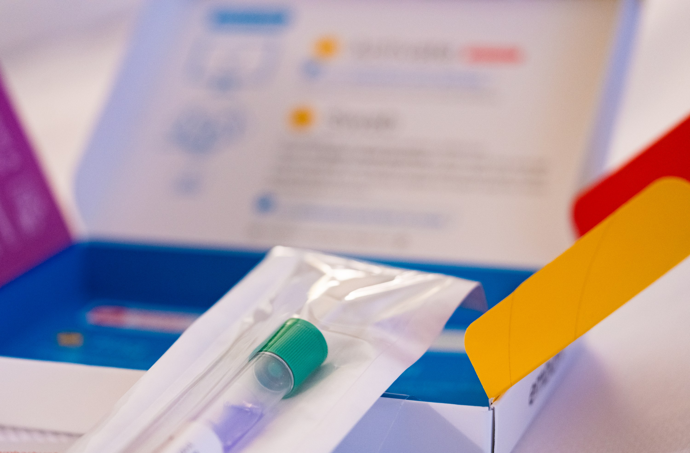

# The Copy Is Never Exact

*DNA, Inheritance, and the Coming Edit of Ourselves*

*by Lothar J. Musiol*

---

## Copyright

The Copy Is Never Exact: DNA, Inheritance, and the Coming Edit of Ourselves

Copyright © 2026 Lothar J. Musiol. All rights reserved.

Photographs in this book are from Wikimedia Commons and are credited in the appendix. The diagrams are original.

---

## How to Read This Book

This is a book about a text. The text is written in four letters. One parental set of it, the reference genome, runs to about 3.1 billion letters. Almost every cell you own holds two sets, about 6.2 billion letters. A cell is one of the tiny living units your whole body is built from, too small to see, trillions of them working at once. It is copied every time a cell divides in two, which is how a body grows and repairs itself. The copy is never exact. That last fact is the hinge of the whole story, so it is worth saying once, plainly, before anything else: if the copy were perfect there would be no evolution, no cancer, no difference between you and your sister, and nothing for this book to be about.

The chapters run in roughly the order the world found things out. Part I is the shape, discovered in 1953. Part II is the molecule itself, its chemistry, and how it copies and miscopies. Parts III and IV are inheritance and the monk who measured it first. Part V is how we learned to read the text, Part VI what we can now do with it, and Parts VII and VIII are copies and dinner: cloning, and the plants and animals we have been editing for ten thousand years. Part IX is the whole human text, read once at great cost and now read for the price of a night in a hotel. Part X is what your own text can and cannot tell you. Part XI is correction, and the argument about where correction should stop.

Where the status of a claim matters, I say which of three things it is. *Settled*: measured, repeated, and used every day. *Working*: the best current account, with real gaps. *Speculative*: allowed by what we know, not shown. Most of the book is settled. The last chapters are not, and say so.

Three people appear throughout: Ruth, born in 1948, her daughter Anna, born in 1978, and Anna's son Theo, born in 2011. They are invented. Their freckles, their milk tolerance, and their arguments at the table are there so that the mechanisms have somewhere to happen. Nothing bad is done to them for drama.

Gene names are in italics (*BRCA1*). The proteins they encode are not (the BRCA1 protein). Prices are in United States dollars and carry a year. Where I give my own opinion, I mark it as mine.

---

## Author's Note

I am not a geneticist. I am someone who wanted to know what was in the tube, and kept reading. The people who did the work are named in the text, with the year and the journal where it matters, so that anyone who wants the original can find it. Where the record is disputed, as it is for 1953, I have tried to give each side its best case and then say what I think.

%%TOC%%

## Prologue — The Tube in the Mailbox

It is a Tuesday in early spring, and a woman named Anna is standing at a mailbox with a padded envelope. Inside the envelope is a plastic tube. Inside the tube is about two millilitres of her saliva, mixed with a blue stabilising fluid that will keep what is in it from rotting on the way to a laboratory in another state.

Anna is invented. So is her mother, Ruth, who is seventy-eight and lives twenty minutes away, and so is Anna's son Theo, who is fifteen and thinks the whole thing is slightly disgusting. The tube is not invented. Several million people have mailed one. What matters at the mailbox is what Anna has just posted.

Two millilitres of spit looks like nothing much. Mixed into it, with the bacteria and the crumbs of breakfast, are a few hundred thousand cells shed from the lining of her cheeks. A cell is one of the tiny living units a body is built from. Each of these is about fifteen microns across, roughly a fifth the width of a human hair.

Each cell has a nucleus, a small compartment that holds the instructions. The instructions are a molecule with a cumbersome name, deoxyribonucleic acid, DNA for short. They sit on forty-six threads. Those threads are two copies of one text. One parental set, the reference finished in 2022, is about 3.1 billion letters. Printed in ordinary type, that one set would fill about a thousand telephone directories. The nucleus holds both sets, about 6.2 billion letters. Laid end to end, the forty-six threads stretch about two metres. Two metres of thread, in a sphere too small to see.

Nearly every cell from her scalp to her heels carries the same pair of texts, with tiny differences. She has about thirty-seven trillion of those cells. Multiply the two metres by that number and she is carrying something like seventy billion kilometres of thread. That is more than four hundred times the distance from the Earth to the Sun.

None of this was known when Ruth was born. In 1948 the molecule had been named and its ingredients listed, and most people who thought about it believed it was too dull to carry information. Proteins, the working molecules that do almost every job in a cell, were the interesting ones. The physicist Max Delbrück dismissed the repeating chain as a stupid molecule, too monotonous to be a gene. The geneticist Evelyn Witkin later recalled the phrase, in a 2012 interview published in *PLOS Genetics*; it was the view of the laboratory, not a line from a paper of his. Five years later, in the spring of 1953, two men in Cambridge built a model out of metal plates and wire that showed what the chain was for. The sentence they wrote is quietly loaded: it had not escaped their notice that the pairing they proposed suggested a copying mechanism.

The shape and the copying are the same fact. DNA is a twisted ladder split lengthwise into two strands. Pull the strands apart and each is a template the cell can rebuild the missing half from, so one ladder becomes two. A cell does this every time it divides. Anna's body has been doing it since a single cell in 1978 became two.

The copying is astonishingly good, and it is not perfect. A copying enzyme is a protein that speeds a chemical job. It checks its own work. A second set of enzymes checks again. After both checks, about one letter in a billion is wrong. One division of one nucleus, 6.2 billion letters, is expected to leave a handful of mistakes. That handful is the picture. Hold it. The sixty or seventy new letters Theo carried at conception are not one division. They are the leftovers of hundreds of divisions in the making of a sperm. The copy is never exact, and everything that has ever evolved, including us, is downstream of that.

The laboratory will not read Anna's text in full. It will look at a few hundred thousand positions in the 3.1 billion of one set, the spots known to vary between people. It will report ancestry, a handful of health risks, and relatives who have also mailed a tube.

She will learn three things, and miss the ones she might have wanted. She carries one copy of a variant, a spot where her letters differ from the average, that makes a certain disease a little more likely. She carries one copy of a variant that lets her drink milk as an adult, which she already knew. She has a second cousin in Ohio. She will not be told how long she will live, or whether Theo will inherit Ruth's temper. No laboratory can tell her that.

In 1990 a complete human text was priced at three billion dollars and scheduled to take fifteen years. Today a full genome, the 3.1 billion letters of one set, read so that both copies are visible, costs a few hundred dollars and takes a day. Reading turned out to be the easy part. Writing is only now beginning.

The letters can now be read, and in a few cases rewritten in a living person. What should be rewritten, and who decides, is the last argument of this book. It can wait until the shape is clear.

Anna walks home. Somewhere between the mailbox and her front door, in the lining of her gut, cells divide and copy both sets of the text, and a few of them get a letter wrong.
