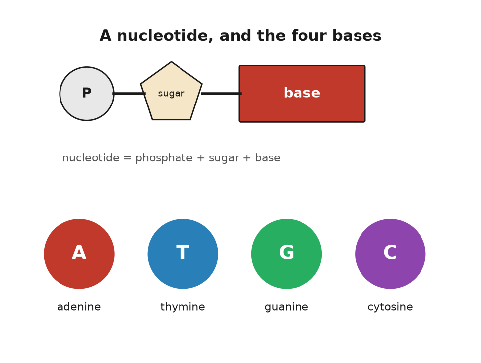
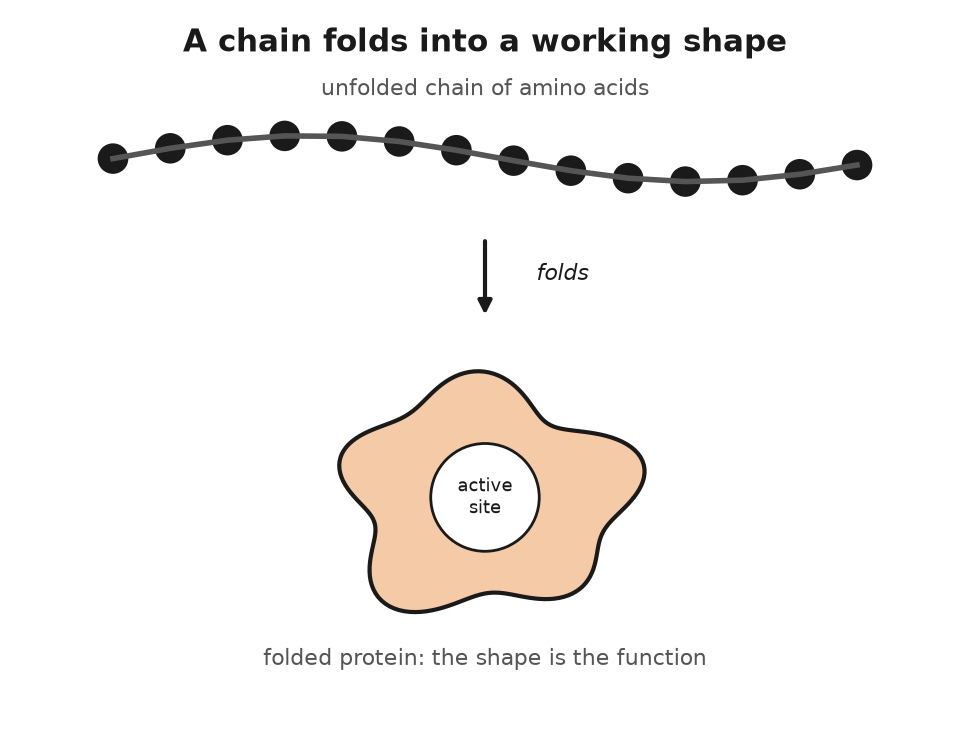
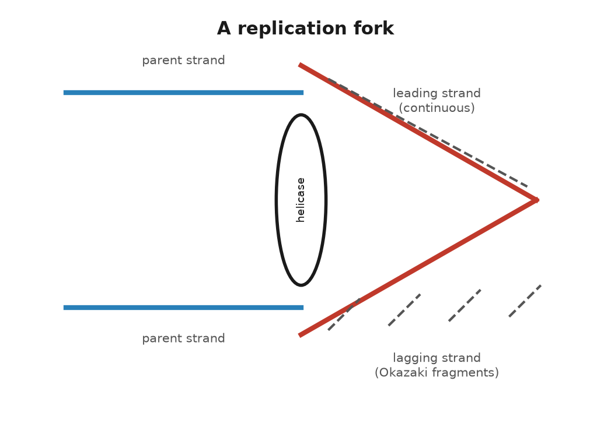
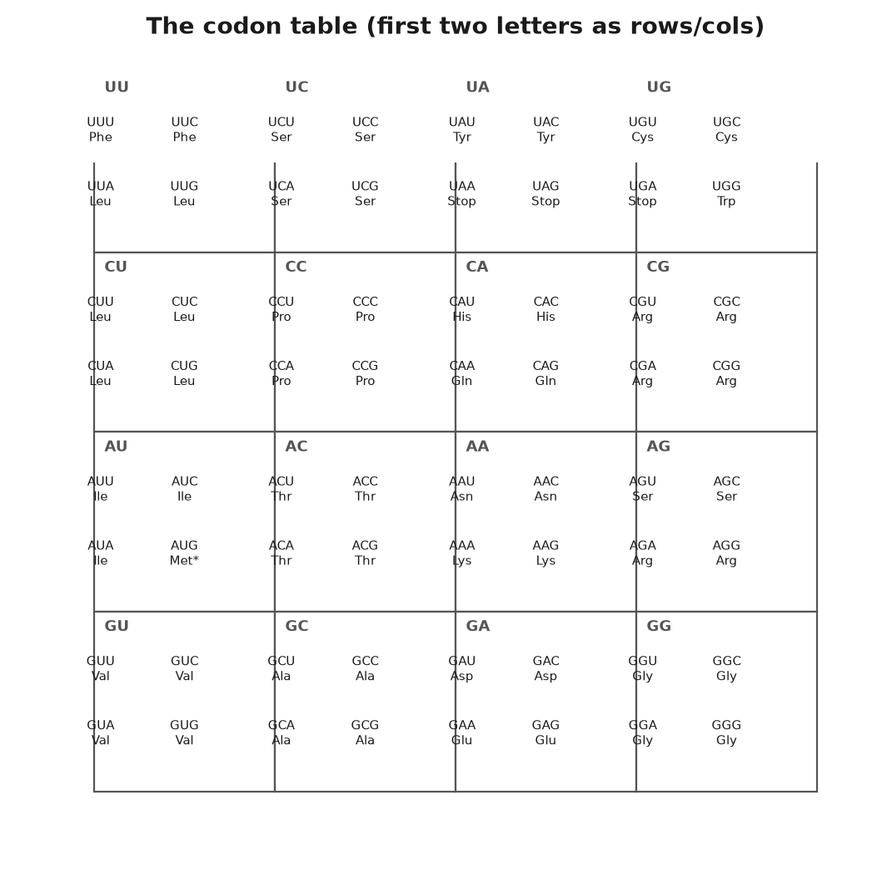
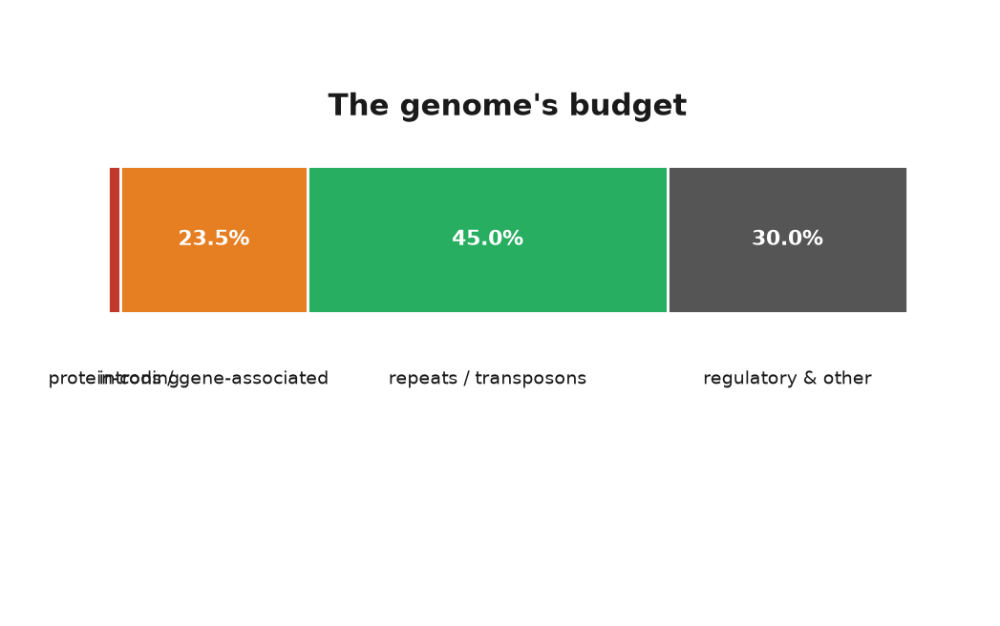
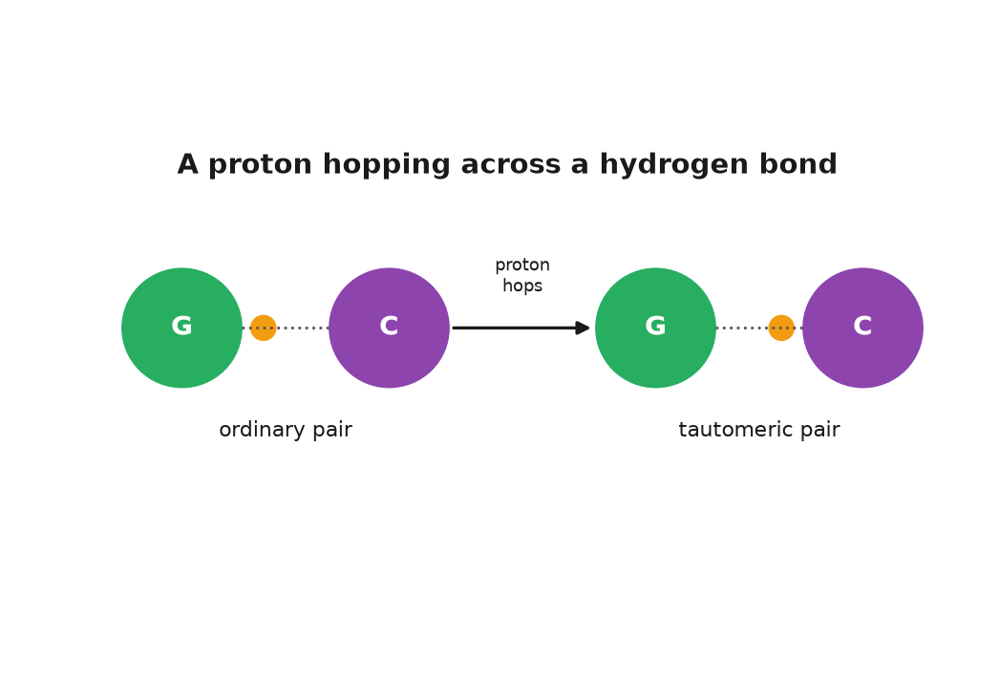

# PART II — The Molecule

## 5. Four Letters

Theo, who is invented and fifteen, has a school assignment to describe himself in a thousand words. He has managed two hundred. The instruction set that built him runs to about 3.1 billion letters, and if it were printed in ordinary type, ten letters to the centimetre and no spaces, it would fill about a thousand volumes the size of a telephone directory. The full set is stored in each of his cells in a sphere about six thousandths of a millimetre across, roughly a tenth the width of a human hair. The sphere is the nucleus. He has some thirty-seven trillion of them, give or take, and the packing problem alone would defeat any engineer who tried to do it with wire.

The first job of this chapter is to say what the letters are. The second is to say how they are packed.

A letter of DNA is a nucleotide, and a nucleotide is three things bolted together. The first is a sugar, deoxyribose, a ring of four carbon atoms and one oxygen with a fifth carbon sticking off the side. The second is a phosphate group, a phosphorus atom holding four oxygens, which is attached to that fifth carbon. The third is the base, a flat ring or double ring of carbon and nitrogen atoms, attached to the first carbon of the sugar on the opposite side. The sugar and the phosphate are the same in every nucleotide. Only the base differs, and it differs in four ways.

Adenine and guanine are the large ones, built of two fused rings, and chemists call them purines. Thymine and cytosine are the small ones, a single ring, and are called pyrimidines. All four are flat, like coins, and all four are slightly greasy on their faces and wet at their edges, which is why they stack face to face down the middle of the helix and hold hands with their partners at the sides. The names have histories. Adenine was first isolated from pancreas, and the Greek for gland is *aden*. Guanine came from guano, the bird droppings mined off the coast of Peru for fertiliser. Thymine takes its name from the thymus, cytosine from cells generally. Nobody planned the alphabet.

Nucleotides join by their sugars and phosphates. The phosphate on the fifth carbon of one sugar bonds to the third carbon of the next, and so on, so that the backbone is an alternation of sugar, phosphate, sugar, phosphate, with a base hanging off every sugar like a flag off a pole. That alternation is a strand. Two strands, running in opposite directions with their flags meeting in the middle, are the helix.

The letters are read in only one direction along a strand, from the free phosphate at the five-prime end toward the free sugar at the three-prime end, which is a convention the way reading left to right is a convention, except that here the chemistry enforces it. When a sequence is written down, as in the *HBB* gene's opening letters, ATGGTGCACCTGACTCCTGAG, it is written five-prime to three-prime unless someone says otherwise.

There is a cousin molecule, ribonucleic acid, RNA for short, that will matter a great deal from chapter 8 onward, and its differences are minor enough to list. Its sugar is ribose, which has one more oxygen atom than deoxyribose; that oxygen makes RNA easier to break, which is why RNA is used for messages and DNA for the archive. And it uses uracil in place of thymine, a base that differs from thymine by one missing methyl group. RNA is usually a single strand, but it can fold back on itself and pair up internally, and a good deal of the machinery of the cell is built from RNA folded into shapes.

---

How many letters? The human reference genome, in its 2022 telomere-to-telomere version, runs to 3,054,832,041 base pairs, which everyone rounds to 3.1 billion. That is one set. Theo has two, one from Anna and one from his father, so each of his cells holds about 6.2 billion base pairs, and the number of rungs on the ladder in a single cell is greater than the number of people on Earth.

The letters are not one continuous strand. They are divided among chromosomes, and a human cell has forty-six of them, in twenty-three pairs. Chromosome 1 is the longest at about 248 million base pairs. The smallest, chromosome 21, has about 45 million. The X carries 154 million and the Y about 57 million, of which a large fraction is repetitive filler. Each chromosome is one enormous double helix, so the longest single DNA molecule in Theo's body, in a cell of the right kind, is about eight centimetres long.

Multiply out and the total DNA in one nucleus comes to a little over two metres. Multiply by thirty-seven trillion cells, which is a 2013 estimate by Eva Bianconi and colleagues that has held up, and Theo contains something like seventy billion kilometres of double helix. Numbers like that are the reason biology books reach for the solar system. It is enough to go to Neptune and return several times, and every centimetre of it is two nanometres wide, a nanometre being ten ångströms, the impossibly tiny unit introduced in chapter 1.

Two metres into six microns is a compaction of about ten thousand to one in linear terms, and it is achieved in stages, with proteins.

The first stage is the nucleosome. The helix winds itself, about one and two-thirds turns, around a spool made of eight histone proteins, two each of four kinds, and the wound stretch runs 147 base pairs. Then there is a short linker, twenty to eighty base pairs, and another spool. Under the electron microscope the result looks like beads on a string, and that phrase is the standard description. The histones are positively charged, because they are rich in the amino acids lysine and arginine, and DNA is negatively charged, because every phosphate carries a charge, so the winding is partly electrostatic. It is also adjustable. Chemical tags added to the histone tails loosen or tighten the winding, and that is one of the ways a cell turns genes on and off without touching the letters, a subject that comes back in chapter 9.

The second stage is that the beaded string coils into a thicker fibre, about thirty nanometres across, whose exact geometry was argued about for forty years and is now thought to be less regular than the textbooks drew it. The third stage is loops. The fibre is gathered into loops of tens to hundreds of thousands of base pairs, pinned at their bases by ring-shaped proteins, and the loops are the working units: a gene and its switches usually sit in one loop, kept away from the neighbours. The fourth stage, which only happens when a cell is about to divide, is the full condensation into the fat X-shaped chromosomes of the school textbook. Those exist for perhaps an hour per division. For the rest of a cell's life the chromosomes are diffuse, each occupying its own territory in the nucleus, like countries on a map without borders.

The result is a nucleus in which two metres of thread are packed without a single knot, from which any stretch can be reached by the enzymes that need it within seconds, and which can be copied in full, unpacked, repacked, and split in two, in a few hours. The best modern storage medium for comparison is a hard drive, which holds about a terabyte per cubic centimetre. A nucleus, if you count two bits per base pair and six billion base pairs in about a hundred cubic microns, holds the equivalent of about ten thousand terabytes per cubic centimetre, and it is mostly water.

---

One last point about the letters, and it is the one people most often get wrong. The text is the same in every cell, but it is not used the same way. The cell in Theo's cheek that ended up in the tube and the cell in his retina that is reading this page carry the same 6.2 billion base pairs. What differs is which stretches are unpacked and read. The cheek cell has its keratin genes open and its rhodopsin genes shut; the retinal cell has the opposite. This is not because the letters differ but because the packing differs. Same book, different pages dog-eared.

There are exceptions to the sameness. Red blood cells throw away their nucleus entirely and carry no DNA at all. Egg and sperm cells carry one set, not two. And every cell accumulates its own private errors, so that two cells from Theo's cheek, sequenced deeply enough, would differ at a few hundred positions. But the general picture holds. A human being is a colony of tens of trillions of cells that share a text and specialise by reading particular parts of it.

The letters are chemistry. What holds them together, what pulls them apart, and what they are for once read, is chemistry too, and that is the next chapter.

## 6. The Chemistry Under the Letters

Anna's kitchen, on a weekday evening, has one pot on the stove and a pan beside it, and she considers this a busy night. A single one of her cells is running something like ten thousand distinct chemical reactions at the same time, in a volume smaller than a speck of flour, at a temperature of 37 degrees, in salt water. Most of those reactions, left to themselves at that temperature, would take years or centuries. They take milliseconds because the cell has catalysts, helpers that speed up a reaction without being used up by it, and the catalysts are the proteins that DNA specifies. The molecule of chapter 5 is an archive. This chapter is about what the archive is an archive of.

It is also, by request, the one chapter in the book that is mostly chemistry. A reader who last saw a chemical formula at school can take it slowly. There is nothing here that a kitchen does not also do.

Begin with the bonds, because there are two kinds and the difference runs through everything.

A covalent bond is two atoms sharing a pair of electrons. It is strong, in the sense that breaking one at body temperature takes energy the cell must supply on purpose. The backbone of DNA is covalent: the sugars and phosphates are joined by phosphodiester bonds, and a strand does not fall apart in warm water. It takes an enzyme to cut it. The 3.1 billion letters of a chromosome stay in order for a lifetime because covalent bonds hold them in order.

A hydrogen bond is weaker by about a factor of twenty. It forms when a hydrogen atom that is already attached to an oxygen or a nitrogen is attracted to a second oxygen or nitrogen nearby. The hydrogen is slightly positive, the second atom slightly negative, and they lean toward each other without sharing electrons. The rungs of the ladder are hydrogen bonds, two per A–T pair and three per G–C pair. Individually each is feeble, and a single pair would separate spontaneously in a fraction of a second. Collectively, over a stretch of a few dozen base pairs, they hold. The strands can nevertheless be unzipped, by heating to around 90 degrees, or, in the cell, by an enzyme that walks along the helix prising the rungs apart as it goes.

This is the design principle, and it is worth stating because it is not obvious: the information is held by weak bonds, so that it can be read, and the order of the letters is held by strong bonds, so that it cannot be scrambled. Water is the medium that makes both possible. Water molecules are themselves hydrogen-bonded to each other, which gives water its high boiling point and its reluctance to let greasy things dissolve in it. The bases are greasy on their faces. They hide from water by stacking on top of each other, and that stacking, as much as the hydrogen bonds, keeps the helix together.

Now proteins, because they are what the letters are for.

A protein is a chain of amino acids. An amino acid is a small molecule with an amino group at one end, a carboxylic acid group at the other, and a side chain in the middle, and there are twenty kinds in the standard set, distinguished only by the side chain. Glycine's side chain is a single hydrogen atom. Tryptophan's is a double ring. Some side chains are greasy and hide from water; some carry a charge and seek it; two, cysteine and methionine, contain sulfur; one, proline, kinks the chain. The amino group of one amino acid can bond covalently to the carboxyl group of the next, releasing a water molecule, and the link is called a peptide bond. A chain of a few amino acids is a peptide; a chain of fifty or more is a protein. Human proteins run from about fifty amino acids to over thirty thousand, the record being titin, which holds muscle fibres together.

Here is the fact that turns a chain into a machine. A protein does not stay a chain. Within seconds of being made, it folds, and the fold is determined by the sequence. Greasy side chains cluster inward, away from water; charged ones face out; hydrogen bonds form along the backbone into spirals and pleated sheets; here and there two cysteines bond across the fold and lock it. The result is a compact object with a definite shape, and the shape is the function. A protein that binds oxygen has a pocket the size of an oxygen molecule. A protein that cuts DNA has a groove the width of a double helix. Change one amino acid in the wrong place and the pocket closes, or the groove warps, and the machine stops.

That sequence alone determines the fold was shown by Christian Anfinsen at the National Institutes of Health around 1961. He took a compact enzyme, ribonuclease, unfolded it completely with chemicals, and then removed the chemicals. It refolded itself, without help, into the same working shape. Anfinsen concluded that the information for the shape was in the sequence, and nowhere else, and shared the Nobel Prize in Chemistry in 1972 for it. The idea has limits; many larger proteins need helpers, known as chaperones, to fold correctly in the crowded cell, and some, like the prion, a misfolded protein behind mad cow disease, can fold two ways. But as a principle it holds, and it is why a text of four letters can specify a machine: the text specifies the sequence, the sequence specifies the fold, and the fold does the work. Predicting the fold from the sequence by computation took sixty years and is the subject of chapter 27.

Most proteins that do chemical work are enzymes, and an enzyme is a catalyst: a molecule that speeds up a reaction without being consumed by it. The speed-ups are not modest. A reaction that would take a year on its own can be compressed into a millisecond, which is a factor of thirty billion, and some enzymes do better than that. The trick is the shape. The reacting molecules are held in a pocket, the active site, in exactly the orientation that makes the reaction easy, with charged side chains positioned to pull electrons where they need to go. Emil Fischer, in 1894, called it a lock and key. Daniel Koshland, in 1958, pointed out that the lock changes shape as the key goes in, and termed that induced fit. Both pictures are used.

An enzyme is named for what it does, with the suffix -ase. Lactase breaks down lactose, the sugar in milk. Ruth, who is invented and seventy-eight, has never been able to drink a glass of milk without regret, because the gene that keeps lactase switched on into adulthood is switched off in her; her ancestors, on her father's side, came from a region where nobody kept dairy cattle. Anna and Theo drink milk without thinking, because Anna's father carried the variant that keeps the switch on, and Theo got it. The variant is a single letter change, not in the lactase gene itself but in a switch about fourteen thousand base pairs upstream, and it arose in Europe perhaps seven thousand years ago and spread because people who carried it could digest a food the others could not. It is the cleanest example in the human text of a mutation that was useful, and it is a chemistry story: one letter, one switch, one enzyme, one glass of milk.

---

Enzymes need energy to run uphill reactions, and the cell's energy is carried by one molecule, adenosine triphosphate, ATP. It is a nucleotide, in fact the very adenine nucleotide of chapter 5, with two extra phosphates bolted onto its tail. Those phosphates are held by bonds that release a good deal of energy when broken, and the cell breaks them, one at a time, to pay for almost everything it does: contracting muscle, pumping ions, building proteins, copying DNA. The spent molecule, ADP, adenosine diphosphate, is recharged in the mitochondria, the bean-shaped compartments that fill most cells by the hundred. The turnover is hard to believe. A resting adult recycles roughly their own body weight in ATP every day, sixty or seventy kilograms of it, and the total amount present at any moment is about fifty grams. ATP is not a store. It is a current.

The recharging is what breathing is for. Sugar from food is broken down in the cell's fluid, in a ten-step sequence, glycolysis, that is the oldest chemistry in the book, older than oxygen in the atmosphere, and then the fragments are fed into the mitochondria where, in the presence of oxygen, they are burned down to carbon dioxide and water and the energy is used to pump protons across a membrane. The protons flow back through a turbine, a protein known as ATP synthase that literally rotates, and the rotation presses a phosphate onto ADP. Peter Mitchell proposed the proton scheme in 1961 and was disbelieved for a decade; he got the Nobel Prize in Chemistry in 1978. The turbine's structure was solved in 1994 by John Walker, who shared the 1997 prize. Every breath Anna takes is to keep the protons flowing.

A worked example ties the chapter together, and it is the one the rest of the book returns to more than once.

Hemoglobin is the protein that carries oxygen in red blood cells. It is made of four chains, two identical alpha chains and two identical beta chains, each folded around a flat iron-containing ring known as heme that grips one oxygen molecule. The beta chain is 146 amino acids long. It is specified by a gene called *HBB* on chromosome 11.

In 1949 Linus Pauling, with Harvey Itano and colleagues, showed that the hemoglobin from people with sickle cell disease moved differently in an electric field from normal hemoglobin, and coined the phrase molecular disease. In 1956 Vernon Ingram in Cambridge chopped the two proteins into fragments, spread the fragments on paper, and found that they differed in a single fragment, and that the difference was one amino acid: at position six of the beta chain, a glutamic acid had been replaced by a valine. Glutamic acid carries a negative charge and likes water. Valine is greasy and does not. That one greasy patch on the surface of the protein lets deoxygenated hemoglobin molecules stick to each other, and they polymerise into stiff rods that deform the red cell into a sickle, and the sickle cells jam in small blood vessels.

At the level of the text, the change is a single letter. A codon is a three-letter unit of the genetic code that specifies one amino acid, a system chapter 8 explains in full; here, the codon GAG, which specifies glutamic acid, has become GTG, which specifies valine. An A has become a T. One letter in 3.1 billion, one amino acid in 146, one greasy side chain where a charged one belonged, and the consequence is a disease that affects millions and that, as chapter 26 will describe, was in 2023 the first to be treated by rewriting the letters.

The change is also, in the malaria belt, an advantage. Carriers, with one copy of the sickle variant and one normal copy, are substantially protected against the most dangerous form of malaria, which is why the variant has persisted at high frequency in West Africa, the Mediterranean, and India. Chemistry does not judge. A greasy valine is a disease in one context and a shield in another, and the copying machinery, which is the subject of the next chapter, has no way of knowing which.

## 7. The Copying Machine

A cell in the lining of Anna's gut lives about four days. Somewhere in that span it divides, and before it divides it copies its 6.2 billion base pairs in about eight hours, working on thousands of stretches at once, and hands one full set to each daughter. The copy is, after checking, wrong at about six positions. Six in six billion. That is the machine this chapter is about, and the first thing to say is that when Watson and Crick suggested it in May 1953, nobody knew whether it was mechanically possible.

The doubts were reasonable. A double helix has to be unwound to be copied, and a long twisted rope does not unwind without something spinning. The two strands run in opposite directions, so a single enzyme moving along the fork would be reading one of them backwards. And the whole thing had to happen inside a nucleus already stuffed with thread. Delbrück, Watson's mentor, thought the model might be right about the pairing and wrong about the copying. It took fifteen years to show that it was right about both, and the answer turned out to be a set of about a dozen proteins that work as one assembly.

The enzyme came first. In 1956 Arthur Kornberg at Washington University in St Louis, working with extracts of *E. coli*, found a protein that would string nucleotides into DNA if it was given a template strand to copy and a short starting stretch to build on. He called it DNA polymerase, and he shared the Nobel Prize in 1959 for it, a year after Meselson and Stahl had shown that copying was semiconservative. The enzyme Kornberg identified turned out not to be the main copying enzyme at all; a mutant bacterium with almost none of it copied its DNA perfectly well, and the workhorse, polymerase III, was discovered in 1970. But the principle held. A polymerase takes a template strand, reads it one base at a time, and adds to the growing new strand whichever nucleotide pairs with the base it is reading. A opposite T, G opposite C. It does the reading by shape: a correctly paired base fits the enzyme's pocket and a mispaired one does not, and the pocket closes on a fit and stalls on a misfit. The polymerase is Watson's cardboard, running at speed.

The speed is worth a number. The bacterial enzyme adds about a thousand nucleotides a second. The human one is slower, about fifty a second, because it is doing more checking, and if a human cell copied its genome with one polymerase at one end it would take four years. It does not. Human chromosomes are studded with tens of thousands of origins, points where copying can start, and in a dividing cell thousands of them fire at once, each sending a fork off in both directions, so that the whole text is copied in a working day.

---

Now the fork, which is where the mechanical objections were answered.

The helix is opened by an enzyme, helicase, which is shaped like a ring, threads itself onto one strand, and crawls along it, prising the hydrogen bonds apart as it goes at a rate that matches the polymerase. Behind it, the single strands are coated with small proteins that stop them from snapping back together. Ahead of it, the unopened helix is being twisted tighter by the unwinding, and that is the propeller problem. It is solved by topoisomerases, enzymes that cut one or both strands ahead of the fork, let the helix swivel to release the strain, and reseal the cut. The cut-and-reseal happens thousands of times per chromosome per copy, and it is one of the places where the machine is fragile. Several anticancer drugs work by jamming a topoisomerase in the cut state, so that a fast-dividing cell breaks its own chromosomes.

The polymerase cannot start a strand from nothing; it can only extend one. So each new strand begins with a short primer of RNA, about ten letters, laid down by an enzyme known as primase, and the polymerase builds on from there. The primer is later removed and replaced with DNA.

Then the direction problem. A polymerase only builds in one direction, five-prime to three-prime, which means it reads its template three-prime to five-prime. At a fork, one of the template strands is oriented so that this is easy: the polymerase follows the helicase and lays down a continuous new strand. This is the leading strand. The other template runs the wrong way. The polymerase has to work away from the fork, in brief bursts, in a series of fragments, each starting from its own RNA primer, and then something has to stitch the fragments together. The fragments were found in 1968 by Reiji Okazaki in Nagoya and are known as Okazaki fragments; in humans they are about 100 to 200 letters long. The stitching enzyme is DNA ligase. The lagging strand, as it is called, is assembled in a stutter of backward loops while the leading strand is made in a single run, and the two polymerases are held together in one assembly so that they move at the same rate. The picture, a helicase ring at the front and two polymerases behind it with one strand looped around like a trombone slide, was worked out by Bruce Alberts and others through the 1980s and has held up in the electron microscope.

Every element of it was forced by the model. Antiparallel strands forced the lagging strand. A twisted helix forced the topoisomerase. A polymerase that cannot start forced the primer. Watson and Crick's paper said the copying was simple in principle. It was. In practice it takes a machine of a dozen parts.

Now the errors, because they are the subject of the book.

The polymerase, choosing a nucleotide by fit, gets it wrong about once in a hundred thousand. That would be sixty thousand errors per copy, which is far too many. So the polymerase checks itself. Attached to it is a second active site, an exonuclease, that faces backwards, and if the base just added does not sit properly in its pair, the growing strand is pulled back into the exonuclease and the last letter is chewed off and tried again. This proofreading catches about ninety-nine of every hundred mistakes, and the error rate after it is about one in ten million.

Then a separate set of enzymes goes over the copy. The mismatch repair system scans new DNA for rungs that do not fit, a G against a T, an A bulging out with no partner, and when it finds one it has to decide which strand is the old, correct one and which is the new, wrong one. In bacteria the old strand is chemically tagged and the new one is not yet. In humans the mechanism is still being argued but it works, and mismatch repair catches most of what proofreading missed. After it, the rate is about one in a billion, and a genome of six billion letters comes through with a handful of errors. When mismatch repair is broken, as it is in people who inherit a faulty copy of one of its genes, the mutation rate rises a hundredfold and the result is a strong predisposition to colon cancer, Lynch syndrome. Paul Modrich worked out the mechanism and shared the Nobel Prize in Chemistry in 2015.

One in a billion is the figure that runs through this book, and here is what it means for Theo. He carries roughly sixty to seventy new mutations that neither parent has. Most of them arose not in him but in the cell divisions that produced his father's sperm. A woman's eggs are all formed before she is born and sit waiting; a man's sperm are made continuously, from stem cells that keep dividing, so that a sperm from a forty-year-old man is the product of several hundred more copyings than an egg of the same age, and each copying adds its billionth. This is why new mutations come mostly from fathers, about four to one, and why the number rises by roughly two per year of the father's age. It was measured directly, by sequencing parents and children, in 2012 by Augustine Kong and colleagues in Iceland.

---

There is one more problem with copying that the fork cannot solve, and the solution is one of the strangest pieces of machinery in the cell.

The lagging strand starts every fragment with an RNA primer that is later removed. At the very end of a chromosome, when the last primer is removed, there is nothing upstream to build the replacement from, so the new strand is a little shorter than its template. Every copying loses a few dozen letters from each end. This is the end-replication problem, and it was pointed out by Alexey Olovnikov in 1971 and independently by Watson in 1972. Left unsolved it would eat the chromosomes from the ends inward, a few letters per division, until the genes were reached.

The ends are protected by telomeres, stretches of the same six letters, TTAGGG, repeated over and over, about two thousand times in a newborn. They carry no genes; they are the blank margins of the page, and the copying machine is allowed to trim them. When they get short, the cell stops dividing. In most adult tissues this is exactly what happens: a cell has a budget of divisions, fifty or so in the laboratory, and then it retires. The budget was found by Leonard Hayflick in 1961 and is known as the Hayflick limit.

Cells that must divide forever, the stem cells that make blood and gut lining and sperm, have a way round it. They make an enzyme, telomerase, which carries its own brief RNA template and uses it to add new TTAGGG repeats onto the ends, restoring the margin. Telomerase was discovered in 1985 by Carol Greider, a graduate student in Elizabeth Blackburn's laboratory at Berkeley, on Christmas Day, in a pond organism called *Tetrahymena*, and the two of them shared the Nobel Prize in Physiology or Medicine in 2009 with Jack Szostak. Nearly all cancers switch telomerase on, which is how they divide without limit, and switching it off is one of the strategies under trial against them.

So the machine copies six billion letters in a working day, checks its work twice, loses a little of the margin each time, and gets about six letters wrong. The letters it gets right are the ones the cell then reads, and reading is a machine of its own.

## 8. From Letter to Protein

In the spring of 1961, at the National Institutes of Health outside Washington, a young researcher named Marshall Nirenberg and a German postdoctoral fellow, Heinrich Matthaei, ran an experiment that looks, described plainly, like a magic trick. They took a soup of everything a cell needs to make protein, ribosomes, amino acids, the small molecules that ferry amino acids around, all extracted from broken bacteria, and to it they added a synthetic strand of RNA made of nothing but the letter U, repeated over and over: UUUUUU. Out of the soup came a protein built from nothing but one amino acid, phenylalanine, repeated over and over. The poly-U tape had been read, three letters at a time, as an instruction to add phenylalanine.

That single result did more to crack the genetic code than anything before it, and it is worth being clear about what "the code" means. Between the letters of DNA and the shape of a protein sits a translation problem: four kinds of letter, twenty kinds of amino acid, and a rule connecting them that nobody had proven existed until Nirenberg and Matthaei's tape yielded a single, predictable amino acid.

The path from letter to protein runs through an intermediate, and that intermediate is RNA, the cousin molecule from chapter 5. A gene is transcribed: an enzyme known as RNA polymerase attaches to a stretch of DNA at a specific address, the promoter, unwinds the two strands locally, and builds a single strand of RNA that matches one of them, letter for letter, with U standing in for T. The product is called messenger RNA, or mRNA, and it carries the gene's instructions away from the archive and out to where the work gets done.

In humans the raw transcript is edited before it is used. Most human genes are broken into pieces known as exons, separated by stretches known as introns, which can run from under a hundred letters to hundreds of thousands. The whole gene, introns and exons together, is transcribed, and then a machine, the spliceosome, cuts the introns out and glues the exons together, discarding what is between them. This was discovered in 1977, independently, by Richard Roberts and Phillip Sharp, working with an adenovirus, and it surprised nearly everyone; genes had been assumed to be continuous. They shared the Nobel Prize in Physiology or Medicine in 1993. Splicing is not a fixed job for a given gene. The same stretch of DNA can be spliced in distinct combinations in different tissues, so that one gene can specify several related proteins, a trick known as alternative splicing that is a large part of why twenty thousand human genes can produce a much larger number of distinct proteins.

The finished messenger RNA leaves the nucleus and arrives at a ribosome, a machine built of RNA and protein together, about twenty nanometres across, that sits in the cell's outer fluid by the thousand. The ribosome is the site of translation, and it is here that the code is actually read.

---

The reading unit is the codon: three letters of mRNA, read in one direction without gaps, specifying one amino acid. Three letters from an alphabet of four give sixty-four possible codons, which is more than enough for twenty amino acids, and the surplus is used for punctuation and redundancy. Three codons, UAA, UAG, and UGA, mean stop; the ribosome releases the finished chain when it reaches one. One codon, AUG, means both start and, wherever it appears mid-message, the amino acid methionine. The other sixty codons are shared among the remaining nineteen amino acids, so that most amino acids are specified by more than one codon; leucine has six. This redundancy is known as degeneracy, and it means that many single-letter changes in DNA have no effect on the protein at all, because the new codon still calls for the same amino acid. That fact matters later, when the book discusses how many mutations are silent.

Working out the sixty-four assignments took from 1961 to about 1966 and was mostly done by three groups: Nirenberg's, which kept refining the poly-nucleotide method; Har Gobind Khorana's at Wisconsin, which built defined short RNA sequences chemically and tested them one by one; and Robert Holley's, which worked out the structure of the adaptor molecule that does the actual matching. The three shared the Nobel Prize in Physiology or Medicine in 1968. The adaptor is called transfer RNA, tRNA, and its existence had been predicted by Crick in 1955, on paper, before anyone had isolated one, on the reasoning that something had to recognise a three-letter codon on one side and carry a specific amino acid on the other, since amino acids themselves have no way to read RNA. Each tRNA molecule folds into a cloverleaf shape with a three-letter anticodon at one end that pairs with a codon on the mRNA, and the matching amino acid chemically attached at the other end. When the anticodon fits the codon in the ribosome's reading slot, the amino acid is added to the growing chain, the ribosome shifts along by three letters, and the next codon comes into position.

The code, once cracked, turned out to be nearly the same in every living thing that has been checked, from bacteria to oak trees to Theo. AUG has meant methionine and start for as long as life has kept written records; UAA has meant stop the whole time. This near-universality is itself a strong argument for common descent: unrelated origins would have had no reason to agree on which sixty-four triplets mean what, and the arrangement is not the most efficient possible one, which argues against it being independently reinvented. There are exceptions, mostly small ones, and they are informative rather than embarrassing. Mitochondria, the energy compartments introduced in chapter 6, run a slightly different dialect of the code; in human mitochondria, UGA, a stop everywhere else, means the amino acid tryptophan. Mitochondria were once free-living bacteria that were absorbed by an ancestral cell roughly one and a half to two billion years ago and have kept a scrap of their own genome, and their own slightly drifted code, ever since.

The ribosome itself deserves a moment, because it is arguably the oldest machine still running in every living cell, and because working out its structure took until the twenty-first century. It is built of two subunits, one large and one compact, each a scaffold of folded RNA studded with proteins. The RNA does the chemistry: the bond that joins one amino acid to the next is formed by a piece of the large subunit's RNA acting as the catalyst, not by any of the proteins, which is one of the pieces of evidence for the idea that RNA came before protein in the early history of life on Earth. The atomic structure of the ribosome, worked out by X-ray crystallography, was published between 2000 and 2001 by three groups working somewhat competitively, led by Ada Yonath, Venkatraman Ramakrishnan, and Thomas Steitz, who shared the Nobel Prize in Chemistry in 2009. A working ribosome adds about twenty amino acids per second in humans, so an average protein of a few hundred amino acids takes perhaps twenty seconds to build, once transcription and splicing have already produced the message.

---

Put the chapter together and the flow is: DNA is transcribed into a raw RNA copy; introns are spliced out; the finished messenger travels to a ribosome; the ribosome reads it three letters at a time; a tRNA delivers the matching amino acid for each codon; the ribosome links the amino acids in order; the chain folds, as chapter 6 described, into a working shape. Crick's arrow, DNA to RNA to protein, is this whole sequence, and it never runs backward under its own power.

One consequence is worth naming because it will recur. A change to a single letter of DNA can do several different things to the protein it specifies, depending on where it falls. It can change nothing, if the new codon still calls for the same amino acid, which happens because of the redundancy described above; this is called a silent mutation. It can change one amino acid, which may or may not matter, depending on whether the new amino acid fits where the old one did; sickle cell disease, from chapter 6, is this kind. It can create a stop codon early, in which case the protein is chopped short and usually useless, or destroy the normal stop and let the ribosome run on past the end of the message into nonsense. Or, if a letter is inserted or deleted rather than substituted, it can shift the entire reading frame from that point onward, so that every codon after the change is misread, which is usually the most damaging kind of all. The code is a fixed lookup table. What varies is where, along the message, the letters go wrong.

Theo's cells are, at any moment, running tens of thousands of ribosomes on tens of thousands of messages, translating the small fraction of the text that codes for protein at all. What the rest of the 3.1 billion letters are doing is the next question.

## 9. Most of the Text Is Not Genes

If Theo's genome were a book of 3.1 billion characters, the recipe for making proteins, the part biologists call coding sequence, would fill about forty-six million of them: roughly one and a half percent. Fold in the introns that get spliced out of those same genes and the genes as regions, coding and non-coding parts together, take up something like a quarter of the text. The other three-quarters was, for a long time, filed under the least satisfying word in the science: junk.

This chapter is about what is actually there, and it turns out to be less a junkyard than an archive with a great deal of packing material, some genuinely broken equipment, and, mixed in, most of the switches that decide when the machinery runs at all.

Start with the switches, because they are the least controversial part. A gene's coding sequence is, in effect, mute without instructions on when to speak. Near the start of most genes sits a promoter, the address RNA polymerase docks at to begin transcription, and scattered elsewhere, sometimes tens of thousands of letters away, sit enhancers, stretches of DNA that proteins known as transcription factors grip onto, bending the DNA around into a loop so that the enhancer touches the promoter and boosts transcription. A single gene can have several enhancers, active in different tissues or at separate times, which is part of how one genome builds Theo's retina and his liver from the same instructions: the coding sequence for a given protein might be identical between the two tissues, while the switches that decide whether that sequence gets read at all differ completely. None of this is coding sequence. All of it is essential, and none of it would exist if the noncoding majority of the genome really were pure debris.

---

Now the debris, or what looks like it. Repeated elements make up roughly forty-five percent of the human genome, and the great bulk of them are transposons: stretches of DNA that, over evolutionary time, have made copies of themselves and inserted the copies elsewhere in the genome, the way a chain letter photocopies itself into new mailboxes. The single most common element in the human genome is a family called Alu, a sequence about three hundred letters in length that appears more than a million times and by some counts accounts for around ten percent of the entire genome on its own. Most transposons in the modern human genome are dead: they have picked up mutations that stop them from copying themselves again, and they sit as fossils, evidence of an old infection that never fully cleared. A minority, mostly a family named LINE-1, can still occasionally jump, and when a jump lands inside a working gene it can cause disease; several cases of hemophilia, a disorder in which the blood does not clot properly, have been traced to exactly that.

The existence of jumping genetic elements at all was worked out decades before anyone understood the molecular mechanism, by Barbara McClintock, working with maize at Cold Spring Harbor from the 1940s onward. She found that certain patches of colour on corn kernels appeared and vanished in ways that ordinary mutation could not explain, and concluded that pieces of the genome were physically moving from one location to another and switching genes on and off as they landed. The idea was met, for a long time, with polite disbelief; it did not fit the picture of a fixed, orderly set of genes in fixed positions. McClintock was proven right once molecular tools existed to see the elements directly, and she received the Nobel Prize in Physiology or Medicine, alone, in 1983.

The argument over how much of the noncoding genome does something useful, rather than simply riding along, has run for decades and has not fully settled, which is a case where this book has to say plainly that the two camps of scientists who study it do not agree.

In 2012 the ENCODE consortium, short for Encyclopedia of DNA Elements and a large international research project, mapped where in the genome proteins bind, where RNA is synthesised, and where the chemical marks of active chromatin, DNA packaged with its spool proteins from chapter 5, sit. The project reported that some kind of biochemical activity, transcription, protein binding, or a chromatin mark, could be detected over roughly eighty percent of the genome. Announced as a headline figure, it was widely reported as meaning that eighty percent of the genome is functional.

Evolutionary biologists pushed back hard, and the disagreement is about what "functional" should mean. Biochemical activity is not the same as consequence. Transcription happens accidentally at low levels almost everywhere in a genome; a protein binding a stretch of DNA does not mean that binding matters to the organism's survival. The evolutionary approach asks a different question: how much of the genome is under selection, meaning that a harmful mutation there would be weeded out because it hurts survival or reproduction. By comparing the human genome to those of many other mammals and looking for stretches that have stayed suspiciously unchanged over tens of millions of years, evolutionary biologists including Chris Rands and colleagues, writing in 2014, estimated that something between about eight and fifteen percent of the human genome is under this kind of constraint. That is a far smaller figure than eighty percent, though still five to ten times larger than the coding sequence alone, which tells you that most of the functional non-coding genome is regulatory: promoters, enhancers, and the RNA molecules, described below, that manage them.

I think the honest summary, and I mark this as my own reading of a genuine dispute, is that ENCODE measured something real and useful, a map of where the biochemical machinery touches down, while overstating what that map implies about function in the evolutionary sense; and that the evolutionary estimate is closer to what most geneticists mean when they ask how much of the genome matters, while probably still undercounting some kinds of function that leave no detectable fossil trace in cross-species comparison, such as very recently evolved human-specific switches. Both figures can be true at once, because they are answers to two distinct questions.

---

Whatever the final percentage, one function of the noncoding genome is now settled beyond argument: epigenetics, the study of chemical marks that change which genes get read without changing the letters themselves, an idea briefly touched on in chapter 5 through the packing of the nucleosome, deserves its due here as chemistry.

DNA itself can carry a chemical mark without changing its letters. The most common is methylation: a small chemical tag, a methyl group, attached to a cytosine, usually one that is followed by a guanine. Heavily methylated promoters tend to be shut; the tag physically discourages the transcription machinery from docking, and it also attracts proteins that compact the chromatin around it. Histones, the spool proteins from chapter 5, carry their own set of marks, acetyl groups and methyl groups added and removed at specific positions on their protruding tails, and different combinations of marks correlate with genes being open, primed, or silenced. None of these marks change a single letter of the underlying sequence. All of them are copied, imperfectly, when a cell divides, which is how a liver cell's daughter is also a liver cell rather than reverting to a blank slate: the pattern of switches, not just the text, is inherited from one cell generation to the next.

The clearest demonstration in humans is X-inactivation. Female mammals carry two X chromosomes; males carry one X and one Y. Two active X chromosomes would produce roughly double the dose of every X-linked gene product, which is generally harmful, so early in embryonic development each cell in a female embryo randomly silences one of its two X chromosomes, wrapping it in dense, methylated, inactive chromatin, and every descendant of that cell keeps the same one switched off for the rest of the individual's life. This is why a calico cat is a mosaic of orange and black patches: the coat-colour gene sits on the X, the cat carries two distinct versions, one on each X, and which patch of skin shows which colour depends on which X that patch's ancestor cell happened to silence. Mary Lyon proposed the mechanism in 1961, from breeding experiments in mice, well before anyone could see a methylated chromosome directly.

The same basic toolkit, methylation and histone marks, is how roughly two hundred distinct cell types in Theo's body run varied programs from an identical genome, and how, as chapter 14 will describe, an experience early in life can leave a chemical trace that outlasts the experience itself, though not, in most cases, one that gets passed to the next generation.

So the honest inventory of the human genome, put in round numbers, looks like this: something over one percent that codes directly for protein; a further stretch, several times larger, of introns and regulatory sequence bound up with those genes; something close to half given over to repeated elements, mostly dead transposons; and a residue that includes structural regions, RNA genes that never make protein, and sequence whose job, if it has one, is not yet known. Calling the whole non-coding majority junk was always too strong. Calling all of it essential is, on the current evidence, too strong as well.

None of this changes what happens when the machine copies the text and gets it wrong, which is the same whether the wrong letter falls in a gene, a switch, a dead transposon, or a stretch nobody has a name for yet. Where those wrong letters come from, and what a cell does about them, is the last chapter of this part.

## 10. Where Mistakes Come From

When Theo was conceived, his genome was not a clean copy of either parent's. Comparing his DNA against Anna's and against his father's, a geneticist would find somewhere between sixty and seventy positions where Theo carries a letter neither parent has. This number, and the fact that most of those new mutations trace to the father's side, comes from direct family sequencing studies, the first solid one published in 2012 by Augustine Kong's group in Iceland, and it has been repeated many times since with similar results. Every child of every generation carries a similar new burden. It is the price of copying, and this chapter is about where the price comes from, how the cell tries to avoid paying it, and a live scientific question about whether some of the toll is, at bottom, a quantum event.

The most obvious source of new mutations is the copying error described in chapter 7: a polymerase places the wrong letter, proofreading misses it, mismatch repair misses it too, and the wrong letter becomes permanent on the next round of copying, since by then it has a perfectly matched, if wrong, partner. This route alone, at roughly one error per billion letters copied, adds up over trillions of divisions in a lifetime.

But DNA does not sit passively waiting to be copied; it is chemically attacked every day, even doing nothing at all. The bond joining a purine base, adenine or guanine, to its sugar is not perfectly stable in water, and it spontaneously breaks at a low but steady rate, a process known as depurination. Estimates for a human cell run to around ten thousand such losses per day. Left alone, a lost base leaves a gap that, if copied over, produces a random letter in its place; in practice, a dedicated repair pathway usually patches the gap correctly first. Cytosine undergoes a different spontaneous change, deamination, in which it loses an amino group and turns chemically into uracil, a letter that does not belong in DNA at all and is efficiently recognised and excised; but a chemically modified form of cytosine, the one carrying the methylation tag from chapter 9, deaminates instead into thymine, a letter that does belong in DNA, and this disguised error slips past repair far more often. That single chemical quirk is why methylated cytosines are among the most mutation-prone positions in the whole genome, and it is part of why a particular cancer-causing mutation in a gene, *TP53*, recurs at the same few positions in tumour after tumour: those are methylated cytosines.

Radiation adds to the chemical toll from outside. Ultraviolet light, mainly from the sun, is absorbed by two neighbouring thymine or cytosine bases on the same strand and fuses them into a distorted unit called a pyrimidine dimer, which the copying machine either repairs correctly or, if repair fails, reads badly, producing a characteristic and well-studied class of skin-cancer mutation. Ionising radiation, from cosmic rays, from radioactive decay in rock, or from a medical scan, carries enough energy to break a DNA strand outright, sometimes both strands at the same position, which is a far more dangerous injury than a single wrong letter. And a long list of chemicals, some natural and some manufactured, react directly with DNA and distort it: aflatoxin, a mould toxin found on improperly stored grain and nuts, forms a bulky attachment to guanine that is strongly linked to liver cancer in parts of the world where contaminated food is common; benzo[a]pyrene, one of dozens of carcinogens, cancer-causing chemicals, in tobacco smoke, does something similar and is a major contributor to lung cancer's mutation burden. And the transposons of chapter 9, when one of the rare active ones jumps, tear the text at both its old and new locations, occasionally landing inside a working gene and breaking it.

Against all of this, the cell runs several dedicated repair systems, distinct from the proofreading and mismatch repair of chapter 7, each specialised for a different kind of damage. Base excision repair recognises a single damaged or wrong base, such as a deaminated cytosine, cuts it out, and rebuilds the gap using the opposite strand as a guide. Nucleotide excision repair handles bulkier distortions, such as UV-induced pyrimidine dimers, by cutting out a stretch of a couple of dozen letters around the damage and resynthesising it; people who inherit a broken copy of one of the genes in this pathway have a condition known as xeroderma pigmentosum, in which ordinary sunlight causes severe, early skin cancer, because the dimers that everyone's skin cells accumulate every sunny day are never removed. Mismatch repair, already introduced as a proofreading backstop, also has a starring role in disease when it fails on its own: inherited faults in its genes cause Lynch syndrome, a strong predisposition to colorectal and several other cancers, and the mechanism was worked out largely by Paul Modrich. Tomas Lindahl, who discovered base excision repair, and Aziz Sancar, who worked out nucleotide excision repair in detail, shared the 2015 Nobel Prize in Chemistry with Modrich for mapping this whole defensive system.

The result of copying errors, chemical attrition, and imperfect repair is a small catalogue of mutation types, which recur throughout the rest of this book and are worth naming once, clearly. A point mutation swaps one letter for another. An insertion or deletion adds or removes letters, and if the number added or removed is not a multiple of three, it shifts every downstream codon, as chapter 8 explained. A copy-number change duplicates or deletes a whole stretch, sometimes a whole gene or several. And a chromosomal mutation rearranges or miscounts entire chromosomes, as when an extra copy of chromosome 21 causes Down syndrome. All four kinds trace back, ultimately, to the sources catalogued above.

Charles Darwin, in 1859, needed exactly one ingredient he could not supply: a source of heritable variation for natural selection to act on. He could see, from pigeon breeders and cattle farmers, that offspring vary and that some variations are inherited, but he had no mechanism for where the variation originally comes from, and his own guess, a vague notion of blending inheritance under the influence of use and environment, was largely wrong and sat uneasily beside his own theory. Gregor Mendel, working at almost the same time and unread by Darwin, supplied half the missing piece: heredity is particulate, carried in discrete units that do not blend, a story told in Part IV of this book. What Mendel's peas could not supply was novelty: his seven traits were already present, in two forms each, in the varieties he started with. Neither man had, or could have had, an account of where a genuinely new trait comes from in the first place.

Mutation is that account, and this chapter's chemistry is the mechanism Darwin lacked. Bring the two together, add Mendel's particulate inheritance and the population genetics developed by Ronald Fisher, J. B. S. Haldane, and Sewall Wright in the 1920s and 1930s, and the result, consolidated by Theodosius Dobzhansky, Ernst Mayr, and George Gaylord Simpson through the later 1930s and 1940s, is what biologists call the Modern Synthesis: mutation supplies raw variation, recombination, the shuffling of chromosome segments between parents that Part III explains, mixes it further, and selection, acting on the resulting differences in survival and reproduction, changes which variants become common. Mutation without selection is just noise. Selection without mutation has nothing to select. Neither, alone, is the theory of evolution; together, they are.

---

There is one more source of variation to consider, and it is the one Lothar asked about directly: whether mutation is purely a matter of classical chemistry, molecules bumping and reacting the way billiard balls do, or whether quantum mechanics plays a genuine role.

The honest answer has a settled part and a working part, and the two should not be blurred together.

The settled part is straightforward and, once stated, almost too obvious to seem interesting: light is fundamentally a quantum phenomenon, and so is the interaction of radiation with matter that causes DNA damage. A photon of ultraviolet light is absorbed by a thymine base as a single indivisible quantum of energy, kicking an electron into an excited state that then allows the two neighbouring bases to fuse into the dimer described earlier in this chapter; the physics of that absorption is textbook quantum chemistry, no more controversial than the physics of a photograph. In that narrow, well-established sense, quantum mechanics is already part of the settled story of mutation, and always has been, since chemistry itself is built on quantum rules about how electrons and bonds behave.

The working, more contested part concerns something narrower and stranger: whether the specific route to spontaneous, radiation-free copying errors that Watson and Crick flagged in their second 1953 paper, a base briefly flipping into a rare tautomeric form and mispairing, is itself partly a quantum mechanical process, specifically one involving proton tunnelling. Tunnelling is the quantum phenomenon in which a particle has some probability of crossing an energy barrier it does not, in classical physics, have enough energy to climb over; it is well established in other contexts, including some enzyme reactions. The physicist Per-Olov Löwdin proposed in 1963 that the hydrogen atoms sitting in the middle of a base pair's hydrogen bonds might tunnel from one position to the other, converting, for a brief instant, an ordinary base pair into its rarer tautomeric form, which pairs incorrectly and can seed a mutation if the polymerase happens to copy the strand during that instant.

For decades this stayed a theoretical curiosity, difficult to test directly inside a hydrogen bond a few tenths of a nanometre long. In 2022 a paper by Louie Slocombe, Marco Sacchi, and Jim Al-Khalili, published in the journal *Communications Physics*, used detailed quantum mechanical calculations to estimate how readily this tunnelling actually occurs in a G–C base pair at body temperature. Their calculation found that the tunnelling happens fast, on a timescale of quadrillionths of a second, too brief for any laboratory clock to follow directly and faster than earlier, simpler estimates had suggested, and that even though the resulting tautomeric form is short-lived and reverts almost immediately, a small but non-negligible fraction of base pairs are sitting in the tautomeric form at any given instant, purely as a matter of ordinary quantum equilibrium.

What that calculation does not show, and what nobody has yet shown, is that this fast quantum flicker actually gets past a working polymerase often enough, in a living cell, to be copied into a permanent mutation before the tautomer reverts or before proofreading catches it. The proofreading and mismatch-repair systems described earlier in this chapter evolved, in effect, to catch exactly this kind of transient mispairing, whatever its ultimate physical cause, and no experiment has yet isolated tunnelling as a distinct, measurable contributor to the final mutation rate observed in a real organism, as opposed to a laboratory calculation of what happens to an isolated base pair. So I place this where the book's own vocabulary says it belongs: working, not settled. It is a serious hypothesis, backed by real calculation, about one possible route to one class of spontaneous mutation, sitting alongside the classical chemical routes, depurination, deamination, radiation damage, that are already firmly established and almost certainly responsible for the great majority of the mutations this chapter has catalogued. Quantum tunnelling may turn out to be a minor but real contributor to the tautomer route specifically. It has not been shown to be, and is very unlikely to be, the dominant source of mutation generally, and readers should be wary of any account, in either direction, that claims otherwise with more confidence than the data currently support.

---

Whatever the balance between chemistry and quantum flicker inside one base pair, the outcome for the species is the same. Mutation is the raw material of change; it is copying's shadow, inseparable from the very mechanism that makes life possible at all, because a molecule that copied itself with true, permanent perfection would also be a molecule that could never have produced anything new since the first cell. Selection is the editor that decides, generation after generation, which of those shadows survive. Neither, alone, explains a finch's beak or a sickle-shaped red blood cell or the lactase switch that lets Theo drink his morning milk without a second thought. The next part of this book turns from the chemistry of the mistake to the question of who inherits it, and why Theo's freckles came from Ruth.

