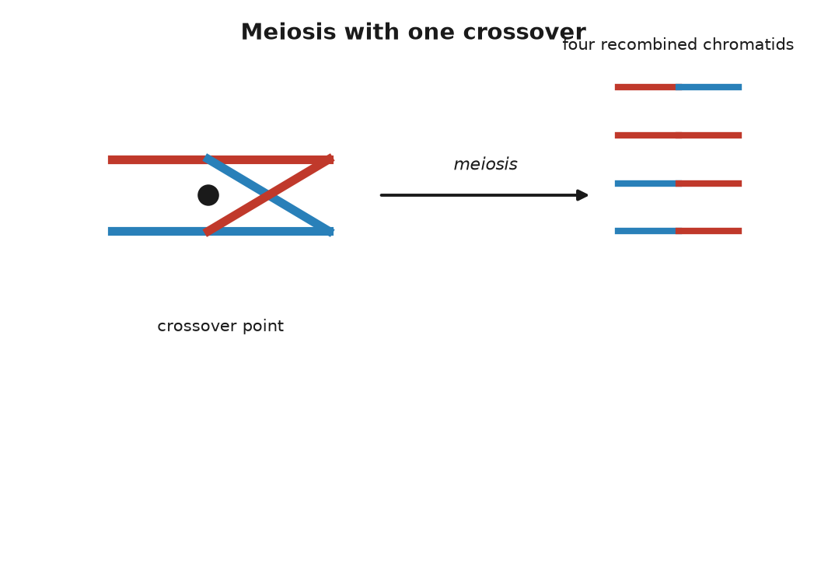
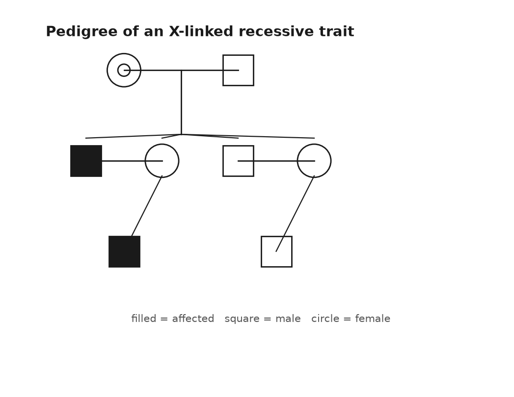
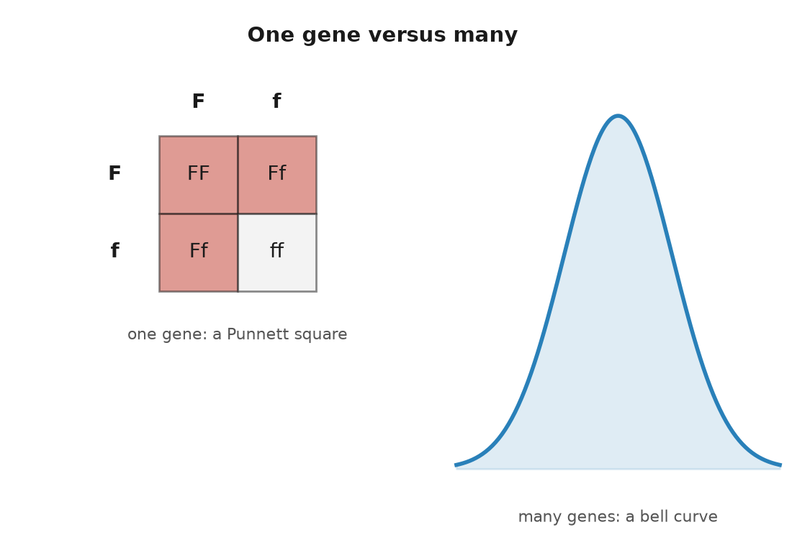

# PART III — Inheritance

## 11. Why Theo Has Ruth's Freckles

There is a photograph on Ruth's refrigerator, held up by a magnet shaped like a lemon. It was taken last summer at a picnic table. Ruth is on the left, seventy-seven then, in a sun hat. Anna is in the middle. Theo, fourteen at the time and already taller than both of them, is on the right, scowling at the sun. All three have freckles across the nose and cheekbones, the same scatter, as if someone had flicked the same brush at three faces. Ruth's husband, Anna's father, had none. Theo's father has none either. The freckles have come down one line of the family like a surname.

Ruth, Anna and Theo are invented, and what they carry has been arranged for convenience. But the question the photograph raises is a real one, and it was the central puzzle of biology for most of the nineteenth century. How does a feature get from a grandmother to a grandson? Why is it not diluted on the way, given that at each step a parent with the feature had a child with a parent without it? And why does Theo have Ruth's freckles but not her curly hair, her blood group, or her habit of finishing other people's sentences?

The answer begins with a count. Every ordinary cell in Ruth's body holds 46 chromosomes, and they come in 23 pairs. The number was settled surprisingly late. From 1923, on the authority of Theophilus Painter, the textbooks said 48, and it took until 1956, when Joe Hin Tjio and Albert Levan in Lund looked at cultured human cells with a better technique, for the count to be corrected. Twenty-two of the pairs are matched: the two chromosomes in each pair are the same length and carry the same genes in the same order. The twenty-third pair is the sex chromosomes, and it gets its own chapter.

The two members of each pair have different histories. One came from Ruth's mother, in the egg. The other arrived from Ruth's father, in the sperm. So Ruth has, for instance, two copies of chromosome 16, and somewhere on each of them sits a gene called *MC1R*, which makes a receptor protein on the surface of pigment cells. Certain variants of *MC1R* are strongly associated with red hair, skin that burns, and freckles; the association is settled, though freckling is not a one-gene affair and several other regions of the text contribute. Suppose that Ruth's chromosome 16 from her father carries one such variant and the one from her mother does not. She freckles. What matters is what she gave to Anna.

---

Cells divide in two ways, and the difference between them is the whole of inheritance. The ordinary way is mitosis. A cell copies all 46 chromosomes, lines up the 92 resulting threads, pulls one full set to each end, and pinches in two. Both daughter cells have 46, and both are, apart from the copying errors of Chapter 10, the same as the parent. This is how skin replaces itself, how a cut heals, how a fertilised egg becomes a person of about 37 trillion cells. Nothing is shuffled. Nothing is halved.

The other way is meiosis, and it happens only in the ovaries and the testes. Here a cell copies its 46 chromosomes once and then divides twice, so that the four products each hold 23, one from every pair. This halving is not optional. If eggs and sperm each carried 46, a child would have 92 and a grandchild 184. Fertilisation restores the count: 23 from the egg plus 23 from the sperm makes 46, and the pairs are re-formed, one partner from each parent.

Which member of each pair goes into a particular egg is a matter of chance, decided pair by pair. When Ruth's ovaries made the egg that became Anna, chromosome 1 could go in as the version from Ruth's mother or the version from Ruth's father; the same for chromosome 2, independently; and so on through all 23. Two choices, 23 times over, is 2 to the power 23, which is 8,388,608 distinct sets of chromosomes that Ruth could pass on, more than the population of London. Anna's father had the same number available. Multiply them, and the count of possible children from one couple, before anything else happens, is about 70 trillion, roughly nine thousand times the number of people alive on Earth today. This is independent assortment, each pair dealt on its own. A garden of peas will show the same rule later, in Part IV, and the friar who counted them could not have known the reason was physical. The pairs line up across the middle of the cell before the first division, each pair orients itself without reference to the others, and the spindle pulls whichever partner faces which way.

That is the first shuffle. The second is stranger and matters more. Before the pairs separate, they pair. Each chromosome finds its partner, lies along it, and the two exchange pieces. A stretch of the chromosome 16 that came from Ruth's father is cut out and swapped for the matching stretch from her mother's copy, so that the chromosome 16 that goes into the egg is neither of Ruth's two but a splice of both. This is crossing over. The Belgian cytologist, a scientist who studies cells under the microscope, Frans Alfons Janssens saw the crossed threads, the chiasmata, in 1909 and guessed what they meant. Thomas Hunt Morgan's fly room in New York inferred the exchange in the 1910s from the way traits travelled together, or failed to. In 1931 Harriet Creighton and Barbara McClintock, working with maize, and Curt Stern, working with fruit flies, showed in the same year that a visible chunk of chromosome had physically changed places when the traits did.

The numbers are known well enough to state. In each human meiosis there is at least one crossover on almost every pair, and usually one to three; the total across all 23 pairs is reported as roughly 50 in men and about 70 to 80 in women, with the exchanges clustered at hotspots that a protein called PRDM9, identified in 2010, helps to choose. Because crossovers are few and the chromosomes are long, a piece of text that sits near a freckle variant tends to travel with it into the same egg. Pieces far away on the same chromosome, or on other chromosomes, do not. This is why Theo got Ruth's freckles and not her curls: the two are written in different places and were dealt separately.

---

Put the two shuffles together and the arithmetic of the family photograph falls out. Anna received exactly one full set of 23 from Ruth, so Anna and Ruth share half of their text, exactly, not on average. Which half was decided by the coin tosses and crossovers in one egg in 1977. At the *MC1R* position, the chance that the egg carried the freckling variant was one in two. It did.

Theo is a second toss. The chromosome 16 that Anna passed to him was itself a splice of her two copies, one from Ruth and one from Anna's father. Again, one chance in two at the freckle position. Again, it came through. On average a grandchild carries a quarter of a grandparent's text, but "on average" is doing real work in that sentence. Because the pieces are dealt in chunks, the actual fraction varies from grandchild to grandchild. Theo might carry 20 percent of Ruth, or 30 percent; a whole chromosome from Ruth may have gone through untouched, and another may be absent entirely.

The same spread shows up between brothers and sisters, and it has been measured. Two children of the same parents share half their text on average, since each got a random half of each parent. But each child's random half is its own, not a copy of the other's. Peter Visscher and colleagues, in a 2006 paper in PLoS Genetics, used genetic markers to measure the actual sharing in several thousand pairs of siblings and found that it ran from roughly 37 percent to 62 percent. Some brothers are, genetically, nearer to cousins than the average implies. Some are much closer than that. Anyone who has watched two siblings and wondered how they emerged from the same house has, in a sense, been measuring this.

It is worth pausing on what the shuffle rules out. The nineteenth century's default picture of inheritance was blending: the child as a mix, half of one parent's fluid and half of the other's, the way paint mixes. Darwin held a version of it, and it gave him trouble. In 1867 the engineer Fleeming Jenkin pointed out in a review that under blending any new advantageous variant would be diluted by half in the first generation and by half again in the next, and would vanish before selection could act on it. Darwin had no answer. The answer was in a paper in Brünn that he never read. Traits are not fluids. They are carried on particles, on stretches of text, and a stretch of text is either copied into the egg or it is not. Ruth's freckles were not halved in Anna and quartered in Theo. They are present in Theo at full strength and can go into his children the same way, whatever his father contributed, which in this case was nothing.

One last thing about eggs, because the timing is a small surprise that makes the mechanism real. A woman's eggs are not made through her life. They form before she is born. By about the fifth month of a female fetus's development, all of the cells that will ever become eggs have formed and have begun meiosis, and then they stop, part way through the first division, with their chromosomes already paired and the crossovers already completed. They wait in that state until ovulation, one or a few at a time, from puberty on.

So the egg that became Anna began its meiosis inside Ruth in 1947 or early 1948, while Ruth was herself inside her mother, and finished it in 1977, about 29 years later. And the egg that became Theo began meiosis inside Anna in 1978, when Anna was a fetus in Ruth's womb. For a few months that year, a cell that would become part of Theo was physically present inside Ruth. Three generations, one body. Sperm are produced the other way, continuously from puberty, at a rate reported as about a thousand per second, and every one of them is the product of a fresh chain of cell divisions, which is why the new mutations in Chapter 10 come mostly from the father.

The long wait has a cost. Paired chromosomes held for decades sometimes fail to separate cleanly when the division finally resumes, and an egg ends up with two copies of a chromosome instead of one. Fertilised, it gives a child with three. For most chromosomes this is not survivable. For chromosome 21, the smallest, it is, and the result is Down syndrome, which occurs in about 1 birth in 700 overall and rises with the mother's age, from roughly 1 in 1,200 at 25 to about 1 in 100 at 40. It is the same mechanism that gave Theo his freckles, run with one step out of place.

Twenty-two of the 23 pairs play this game evenly, with both partners the same size and carrying the same genes. The twenty-third pair does not, and its unevenness decides who can inherit what.

## 12. Who Gets What: X, Y, and the Mother's Line

On 7 April 1853, at Buckingham Palace, Queen Victoria gave birth to her eighth child, a boy named Leopold, with chloroform administered by the physician John Snow. She thought the anaesthetic delightful and said so. The boy was less fortunate. He bruised at the slightest knock, bled for hours from small cuts, and spent much of his childhood in bed with swollen joints. The doctors called it haemophilia, a word that had been in use for a few decades. In March 1884, on the stairs of a club in Cannes, Leopold slipped, fell, and died the next morning of a bleed into the brain. He was thirty.

Neither of Victoria's parents had the disease, and neither, as far as the records show, did anyone in the generations before them. She carried a change that was new in her, or in one of her parents' cells. Two of her daughters, Alice and Beatrice, carried it too, and through them it travelled into the ruling houses of Germany, Spain and Russia. Alice's daughter Alix married Nicholas II and became Empress Alexandra; their only son, Alexei, born in 1904, had the disease, and the family's desperation over his bleeding gave the monk Rasputin his place at court. Two of Beatrice's grandsons, Spanish princes, died in the 1930s after car accidents, from injuries that a clotting body would have survived. In 2009 a team led by Evgeny Rogaev, working on the Romanov remains recovered near Yekaterinburg, reported in Science that the family's mutation was a single-letter change affecting the splicing of the gene *F9*: haemophilia B, rather than the commoner haemophilia A.

The pattern in that family is the textbook pattern, and it was recognisable well before anyone knew what a gene was. The disease appeared in sons. It was passed by mothers who were themselves well. Affected fathers, when they survived to have children, had healthy sons and carrier daughters. It skipped, and it reappeared. The explanation is the uneven twenty-third pair.

---

Twenty-two of the pairs in every human cell are matched partners. The twenty-third is either two X chromosomes, in which case the person is, with rare exceptions, female, or one X and one Y, in which case male. The X is a substantial chromosome, about 156 million letters long, roughly a twentieth of the whole 3.1-billion-letter text, and carrying about 800 protein-coding genes. The Y is a runt. In the reference genome it was listed at about 57 million letters, under a fiftieth of the text and more than half of that repetitive sequence so tangled that it was not fully read until 2023, and it carries only a few dozen protein-coding genes. The two share a short region at each tip, where they can pair during meiosis; along the rest of their length they have almost nothing in common.

What the Y does have is one compact gene, *SRY*, near its tip. It was found in 1990 by Andrew Sinclair, Peter Goodfellow, Robin Lovell-Badge and colleagues in London, and the next year Lovell-Badge's group showed that a mouse embryo with two X chromosomes and an inserted copy of the mouse version of the gene develops as a male. The gene is a switch. Around the sixth week of development, in an embryo that has it, the protein it encodes starts a cascade that makes the primitive gonads become testes, and the rest follows from the hormones the testes produce. Without it, the default is ovaries. People exist with an X and a Y and a broken *SRY* who develop as women, and people with two Xs and a stray copy of *SRY* who develop as men. One gene of a few hundred coding letters, on a chromosome that is otherwise mostly rubble, decides.

The egg always contributes an X. The sperm contributes an X or a Y, so it is the father's contribution that decides the sex of a child, a fact that would have been of some use to Henry VIII. The chance is close to even, with a small excess of boys at birth, about 105 to every 100 girls, for reasons that are not fully understood.

Now the pattern. A gene on the X chromosome has two copies in a woman and one in a man. If a variant on the X is recessive, meaning that a working copy on the partner chromosome masks it, then a woman with one bad copy is well, and a man with one bad copy has no partner chromosome to mask it, because his other sex chromosome is the Y and the Y does not carry the gene. So a carrier mother passes the variant to half her children on average: her sons who receive it are affected, her daughters who receive it are carriers. An affected father passes his X to all of his daughters, who become carriers, and his Y to all of his sons, who are untouched. This is Victoria's family drawn as a rule.

The commonest X-linked trait is not a disease but a limitation. About 8 percent of men of northern European ancestry cannot distinguish reds and greens as most people do, against about 0.5 percent of women. The genes for the red-sensitive and green-sensitive pigments of the retina, *OPN1LW* and *OPN1MW*, lie side by side near the tip of the X, so similar in sequence that during meiosis the paired chromosomes sometimes misalign by one gene and exchange unequally, deleting or blending copies. Jeremy Nathans worked this out in 1986. Haemophilia A comes from variants in *F8*, also on the X; haemophilia B from *F9*. Duchenne muscular dystrophy comes from *DMD*, which at about 2.2 million letters is the longest gene in the human text and, being long, is a large target for damage. If Anna's father had been colour-blind, Anna would be a carrier for certain, and Theo would have had one chance in two.

---

There is a complication in the rule, and it is a beautiful one. A woman has two Xs and a man has one, so a woman's cells ought to make twice the dose of every X-linked protein, which for most genes would be a problem. They do not. In 1961 Mary Lyon, working on coat colour in mice at Harwell in England, proposed in a short letter to Nature that early in the development of a female embryo each cell switches off one of its two X chromosomes at random and leaves the other running, and that every descendant of that cell keeps the same choice. The silenced chromosome curls into a dense knot at the edge of the nucleus that Murray Barr had seen in 1949 and that is still called the Barr body. The switch itself is an extended molecule of RNA, ribonucleic acid, DNA's single-stranded cousin, made by a gene named *XIST*, found in 1991, which coats the chromosome it came from and shuts it down.

The consequence is that every woman is a mosaic. In some patches of her body the X from her mother is working; in others, the X from her father. The clearest demonstration walks about on four legs. In cats, the gene that makes fur orange rather than black sits on the X. A male cat has one X and is either orange or not. A female with an orange allele, the working term for one version of a gene, on one X and a non-orange allele on the other is a tortoiseshell: patches of orange where the non-orange X was silenced, patches of black where the orange one was. Add the unrelated white-spotting gene and she is a calico. Almost every calico is female. The rare male has two Xs and a Y. The identity of the orange gene stayed unknown until 2025, when two groups reported that it is a deletion that alters the activity of a gene named *ARHGAP36*. The mosaic matters for people too. A woman carrying a variant for an X-linked disease is usually well, but if by chance the healthy X was silenced in most of the relevant tissue she can have symptoms, and some do.

Two other parts of the text follow rules of their own, and they are worth knowing about because they have become the working tools of ancestry.

The first is not in the nucleus at all. Every cell contains hundreds to thousands of mitochondria, the compartments in which sugar and oxygen are turned into ATP, adenosine triphosphate, the tiny molecule a cell spends the way a household spends electricity, and each mitochondrion carries its own small circle of DNA. The human version is 16,569 letters long, holds 37 genes, and was read in full by Fred Sanger's laboratory in Cambridge in 1981, one of the first complete pieces of human text. It is a leftover. Mitochondria are descended from free-living bacteria that took up residence inside another cell something like two billion years ago, and their little genome is what remains of the bacterium's own. It is inherited from the mother only. An egg holds around a hundred thousand copies; a sperm brings a hundred or so in its midpiece, and those are tagged and destroyed after fertilisation. Theo's mitochondrial text is Anna's, which is Ruth's, which is Ruth's mother's, unchanged apart from the occasional copying error, back along a single unbroken line of women. Ruth's husband contributed none, and Theo, if he has children, will pass none.

The second is the Y, which goes the other way, father to son, and unlike the other chromosomes never recombines along most of its length, because it has no matching partner. A surname in a patrilineal culture travels the same route. In 2000 Bryan Sykes tested this on his own name and reported that roughly half of the men named Sykes he sampled in Britain shared one Y type, consistent with a single founder some seven centuries ago and a modest rate, in each generation, of what geneticists politely call non-paternity.

Because these two pieces of text do not shuffle, every difference between two people's copies is a mutation that happened since their lines diverged, and the differences can be sorted into a tree. Rebecca Cann, Mark Stoneking and Allan Wilson did this in a Nature paper in 1987 with mitochondrial DNA from 147 people, found that the deepest branches were African, and estimated that all of the copies traced to a single woman who lived about 200,000 years ago. The press named her Mitochondrial Eve, and the name has caused confusion ever since.

She was not the first woman, or the only woman alive, or anyone's Eve. She is a statistical necessity. Take any set of people and follow their mothers' mothers' lines into the past; the lines merge, since every woman had one mother, and they must all meet somewhere. Lines also end, whenever a woman has only sons or no children, and as they end, the meeting point moves forward in time. Thousands of women were alive alongside her, and most of them are your ancestors too, by other routes; they simply did not pass you a mitochondrion. The same logic applied to the Y gives a most recent common male ancestor. The two are not a couple and need not have lived at the same time. Current estimates, with wide error bars, put the mitochondrial ancestor at roughly 150,000 to 200,000 years ago and the Y ancestor at roughly 200,000 to 300,000 years ago, the latter pushed earlier in 2013 when a rare lineage from Cameroon turned up that branched off deeper than any known before. The letters that ancestry companies attach to your mitochondrial and Y types, H, U, L3, R1b and the rest, are branches on those two trees, called haplogroups, and they tell you about two lines of ancestry out of the thousands you have.

Which brings the question back from lines to letters. A version of a gene arrived from one parent or the other, on one chromosome or another. Whether the version you received shows itself, or waits behind its partner, is the next thing to settle, and it is the one puzzle in this part that Mendel would have recognised at once.

## 13. Dominant, Recessive, and the Messy Middle

Theo's homework, one evening in the spring he turns fifteen, contains a worksheet. Brown eyes are dominant over blue, it says. A brown-eyed parent carries B or b; a blue-eyed parent is bb; fill in the square, a grid geneticists call a Punnett square, after Reginald Punnett, for working out the odds of each combination. One line at the bottom asks whether two blue-eyed parents can have a brown-eyed child, and the expected answer is no. Anna, who has brown eyes and whose mother Ruth has blue ones, does the square with him and gets full marks. The worksheet is wrong.

It is wrong in an honourable way, because it repeats a model published in 1907 by Charles and Gertrude Davenport, which was the best available at the time and is still the version most people carry around. Eye colour is not one gene. The biggest single lever, pinned down by two groups in 2008, is one letter inside an intron, a stretch of the gene cut out before its message is read, of a gene named *HERC2* on chromosome 15, which controls how strongly its neighbour *OCA2* is switched on in the iris; *OCA2* makes a protein needed to load pigment into the cells there. That one letter accounts for most of the difference between blue and brown in Europeans. But a 2021 study of nearly 200,000 people identified some fifty further regions of the text that nudge the shade, and green, hazel and grey are made by combinations of them. Two blue-eyed parents can have a brown-eyed child. It is uncommon. It happens.

So this chapter has two halves, and they are the two halves of inheritance. Some traits really do behave the way the worksheet says: one gene, two versions, a clean rule. Most do not. And the interesting part is what "dominant" turns out to mean when you look at the protein.

---

Take cystic fibrosis. The gene is *CFTR*, on chromosome 7, found in 1989 by a collaboration between Lap-Chee Tsui's group in Toronto and Francis Collins's in Michigan, at the end of a search through about 250,000 letters of text. The protein sits in the membranes of lung, gut and sweat-gland cells and pumps chloride; when it fails, the mucus thickens, and the lungs clog and become infected. More than 2,000 different variants of *CFTR* have been documented in patients, but one of them, called ΔF508, accounts for about 70 percent of the disease-causing copies in people of European ancestry. It is a deletion of three letters, which removes a single amino acid, a phenylalanine, at position 508 of a chain 1,480 long. The protein folds wrong, and the cell's quality control destroys it before it reaches the membrane.

Cystic fibrosis is recessive. One working copy of *CFTR* makes enough protein; a person with one ΔF508 and one normal copy is a carrier and is well. About 1 in 25 people of European ancestry is such a carrier. The chance that two carriers have children together is therefore about 1 in 625, and the chance that any given child of two carriers receives the variant from both is 1 in 4, which is Mendel's ratio. Multiply, and the disease appears in about 1 in 2,500 births in those populations, which is close to what the registries record. The carriers, being well, never see the variant in themselves; it surfaces two generations after entering a family, or ten, whenever two lines carrying it happen to meet. Since October 2019 a combination of three drugs, sold in the United States as Trikafta, has been able to coax the ΔF508 protein into a shape the cell will accept, and the median predicted survival for a child born with the disease, which was a few years in the 1950s, now runs past fifty.

Sickle cell disease follows the same rule with one addition that explains why it is so common. The variant is Glu6Val in *HBB*, from Chapter 6. Two copies give the disease; one copy gives sickle cell trait, and a person with the trait is mostly well. But in 1954 Anthony Allison, working in Kenya and Uganda, showed that children with one copy were far less likely to suffer severe malaria than children with none, and the map of the variant across Africa, the Mediterranean and India follows the historical map of the parasite. In parts of sub-Saharan Africa 10 to 20 percent of people carry it, and about 1 in 13 African Americans does. This is a balanced polymorphism: the carriers do better than either kind of non-carrier, so the population keeps a variant that kills a fraction of its children. About 300,000 babies a year are born with the disease worldwide. Evolution has no master plan and does not apologise.

Huntington's disease is the other way round. It is dominant: one copy is enough, and each child of an affected parent has one chance in two, regardless of the other parent. The gene, *HTT* on chromosome 4, was located in 1983 by James Gusella's group using markers in the enormous families around Lake Maracaibo in Venezuela that Nancy Wexler had spent years documenting, and the gene itself was found in 1993 by a collaboration of several groups. The variant is not a single wrong letter but a stutter: a run of the triplet CAG that is repeated about 10 to 35 times in most people and 40 or more times in those who will develop the disease. The extra repeats put a long tail of glutamines on the huntingtin protein, and the tail does damage on its own. That is why it is dominant. It is not that one healthy copy is too weak; it is that the mutant copy does something harmful that the healthy copy cannot undo. Symptoms typically begin in the thirties or forties, after the age at which most people have had children, which is why the variant persists.

That is the lesson hidden in the worksheet. Dominance is not a property of a gene; it is a property of what one copy of a particular variant does at the level of the protein. A variant that destroys a protein is usually recessive, because one working copy usually suffices. A variant that makes a protein do something new, or a variant in a gene where half the dose is not enough, is dominant. Familial hypercholesterolaemia is the second kind: one damaged copy of *LDLR*, the receptor that clears cholesterol from the blood, roughly doubles a person's LDL and brings heart attacks forward into the forties and fifties, while two damaged copies give LDL several times normal and heart attacks in childhood. One copy is bad and two are worse, which is called incomplete dominance, and about 1 person in 250 has the one-copy form.

Blood groups show the last variation. The ABO system, discovered by Karl Landsteiner in 1901, which brought him the 1930 Nobel Prize in Physiology or Medicine, comes from one gene on chromosome 9 that makes an enzyme adding a sugar to the surface of red cells. The A version adds one sugar, and the B version, differing by a handful of amino acids, adds another. The O version has a single letter missing near the start, which shifts the reading frame, the three-letter groupings a cell reads its text in, and produces no working enzyme at all. Someone with an A and a B copy makes both sugars and is blood group AB: neither allele hides the other, and this is codominance. O is recessive to both, being nothing. Six combinations give four blood groups, and two group-A parents, each carrying an O, can have a group-O child and be surprised.

---

Then there is the middle, where most of what we can see about each other lives.

Height is the classic. Francis Galton measured 928 adult children and their parents in the 1880s and noticed that the children of very tall parents were tall but not as tall, and the children of very short parents short but not as short; he termed it regression toward mediocrity, and the statistical idea of regression is his. Height sits on a bell curve, with no clean categories, and the early Mendelians and the biometricians who studied such curves spent the 1900s arguing about whether Mendel's rules could possibly apply to it. In 1918 Ronald Fisher settled the matter on paper: if a trait depends on many genes, each with a small effect, each following Mendel's rules, the sum comes out as a bell curve. Both sides were right.

The count was filled in a century later. In October 2022 a consortium led by Loïc Yengo published in Nature an analysis of 5.4 million people and identified 12,111 positions in the text where a single-letter variant is associated with height. Together they account for about 40 percent of the variation in height among people of European ancestry, and considerably less in people of other ancestries, because most of the 5.4 million were European and the markers travel badly. The variants are not spread evenly; they cluster in about a fifth of the genome, near genes that build cartilage and bone. Twelve thousand levers, each moving the needle by a fraction of a millimetre.

Skin colour is another. A single variant in a gene called *SLC24A5*, found in 2005 by Keith Cheng's laboratory after they noticed a pale mutant of the zebrafish, is nearly universal in Europeans and nearly absent in West Africans, and accounts for a large share of the difference in pigmentation between those two groups. It is one of a dozen or more genes with detectable effects, including *SLC45A2*, *OCA2*, *MC1R* and *KITLG*, and a 2017 study of African populations by Sarah Tishkoff's group showed that much of the variation at these genes is far older than our species, so that light and dark alleles were both in circulation before there were humans to carry them.

Theo's freckles belong here, with a footnote. *MC1R* is a major gene for freckling, and a person with a strong variant will usually freckle; how many and how dark depend on other genes and on the sun. His tolerance of milk, by contrast, is Mendelian and dominant: one copy of a single-letter variant upstream of the lactase gene *LCT* keeps the enzyme switched on after childhood. Anna has one copy, as her tube reported in the Prologue. Theo had a one-in-two chance from her side. Two traits at the same table, one governed by a square and one by a curve.

Which brings in the word that causes more confusion than any other in this field. Height is said to be about 80 percent heritable. That does not mean that 80 percent of Theo's height came from his genes and 20 percent from his breakfast. Heritability is a statistic about a population, not a fraction of a person. It is the share of the variation in a trait, among the people in a particular population living in a particular range of environments, that can be attributed to the genetic differences between them. Change the population or the environment and the number changes.

Two examples pin this down. The number of fingers a person has is obviously genetic, and its heritability is close to zero, because almost all the variation in finger count comes from accidents. And Dutch men grew about 20 centimetres taller between the 1850s and the 1990s while the heritability of height stayed high throughout; the genes explained who was taller than whom in each decade, and the food explained why every decade was taller than the last. High heritability says nothing about whether a trait can be changed. It says how much of the spread, here and now, tracks the text.

The numbers come mostly from twins. Identical twins share essentially all their text; fraternal twins share half on average, like any siblings. If a trait runs more alike in identical pairs than in fraternal pairs, the excess is attributed to genes, and the geneticist Douglas Falconer gave the formula: twice the difference between the two correlations. A 2015 review in Nature Genetics by Tinca Polderman and colleagues gathered 2,748 twin studies covering 17,804 traits in 14.5 million pairs, and found that the average heritability across everything ever measured in twins was about 49 percent. The method has known weaknesses. It assumes that identical and fraternal twins are treated equally alike, which is not quite true. It cannot say which genes. It counts a child who inherits both a musician's genes and the family piano as a genetic effect. And it describes one population at one time. Within those limits, it is settled that almost every human trait anyone has bothered to measure is heritable to some degree, and that almost none is heritable entirely.

Even 80 percent leaves a fifth of the story to something else, and for height, as for the rest, the something else begins before birth.

## 14. What Is Not in the Genes

In September 1944 the Dutch government in exile called a railway strike to help the Allied advance, and the German administration in the occupied Netherlands answered by cutting food shipments to the west of the country. Then the canals froze. By the turn of the year the cities of the west, Amsterdam, Rotterdam, The Hague, Leiden, were on an official ration that fell through the winter to somewhere between 400 and 800 calories a day, less than a third of what an adult needs. People walked out to the farms to trade linen for potatoes. They ate sugar beets and tulip bulbs. Estimates of the deaths run from about 18,000 to 22,000. Relief came at the end of April 1945, with bombers dropping food instead of bombs, and liberation on 5 May.

The winter was brief and sharply bounded, and the Dutch, who kept careful records even in the worst of it, had unknowingly built the cleanest natural experiment in human nutrition that exists. Every child conceived or carried in those months has a known date and a known exposure. In 1976 Gian-Paolo Ravelli, Zena Stein and Mervyn Susser published in the New England Journal of Medicine a study of about 300,000 nineteen-year-old men examined for military service, and reported that those who had been in the first half of gestation during the famine were markedly more likely to be obese, reported as close to double the rate of the unexposed. Later work by Susser, Hans Hoek and others found that people conceived at the height of the hunger were about twice as likely to develop schizophrenia. Tessa Roseboom and colleagues in Amsterdam followed the cohort into their fifties and sixties and added heart disease, glucose intolerance and several other conditions. These associations are settled: measured, and repeated for half a century.

In 2008 Bas Heijmans and colleagues at Leiden published in PNAS a first look at a mechanism. They took blood from 60 people who had been conceived during the famine and compared them, six decades on, with their own same-sex brothers and sisters who had not been. At a regulatory region of the gene *IGF2*, which governs growth in the fetus, the famine group had less methylation, a chemical tag on the DNA that turns a gene up or down without changing its letters, by about 5 percent, than their siblings. The effect was small. It was consistent. And it had been laid down in the first ten weeks of a pregnancy in the winter of 1944 and was still there in 2008.

Hold onto what that means. The text of those people was fixed at conception and did not change. What their mothers ate in the first ten weeks altered how the text was read, and the alteration lasted. The tube in the mailbox reads letters. It does not read winters.

---

Three things are not in the genes, and the first, environment, is the one everybody grants. The second is development, and the third is chance, and the two are hard to separate, so take them together with the tightest possible test: two people with the same text.

Identical twins come from one fertilised egg that split, and for most of the twentieth century they were treated as genetically identical by definition. In 2021 a group at deCODE in Iceland led by Hákon Jónsson sequenced 381 pairs, with their parents and children, and reported in Nature Genetics that a typical pair differ at about five positions, mutations that arose in the first few cell divisions after the split, and that some pairs differ at more than a hundred. So "identical" is an average. What is more striking is how different the outcomes can be when the text is the same. If one identical twin develops schizophrenia, the chance that the other does is reported at roughly half. For type 1 diabetes the concordance is reported in the range of 30 to 50 percent; for multiple sclerosis, roughly 25 to 30 percent. Half the time or more, the co-twin escapes, with the same letters.

Fingerprints are the miniature, exact version of this. The ridges on the fingertips form between roughly the tenth and sixteenth week of gestation, where the skin buckles under pressure from the growing pads beneath it and the fluid around it, and the pattern depends on the geometry of that moment: the fetus's position, the blood pressure in the finger, the exact rate of growth that week. Identical twins have similar types of pattern, loops or whorls, and distinct prints, which is why Francis Galton, who published the first systematic book on fingerprints in 1892, could recommend them for identification, and why Scotland Yard began using them in 1901. Nothing in the text specifies a print. The text specifies a process, and the process has noise in it.

The noise goes deeper than skin. The tiny roundworm Caenorhabditis elegans has exactly 959 cells as an adult, every one of them arising by a lineage that is the same in every worm, and worms can be bred so that all have the same text and can be kept in the same dish at the same temperature on the same food. They still die at varying ages, spread over days in a life of two or three weeks. Nobody arranged that. Molecules jostle, a gene fires a little early in one cell and a little late in another, and the differences ripple outward. Some of the variation in any population, and nobody knows exactly how much, is nothing more than this.

---

The third thing not in the genes is the one that the word "genetic" most misleads people about, and the clearest case is a disease that is entirely genetic and entirely preventable.

In 1934 a Norwegian physician, Asbjørn Følling, examined two young siblings with severe intellectual disability whose mother had noticed a strange musty smell in their urine, and found that the urine contained phenylpyruvic acid. The condition was named phenylketonuria, PKU. It is recessive and caused by variants in *PAH* on chromosome 12, whose enzyme breaks down the amino acid phenylalanine. Without it, phenylalanine from ordinary food piles up and poisons the developing brain. In 1953 Horst Bickel in Birmingham showed that a diet nearly free of phenylalanine, started early, prevents the damage, and in 1963 Robert Guthrie's heel-prick test made it possible to find the affected babies in the first days of life, which is where universal newborn screening began. About 1 baby in 10,000 of European ancestry has PKU, with the rate varying widely between countries. On the diet, they grow up with normal intelligence.

Consider the heritability. In a world where everyone eats ordinary food, PKU is close to 100 percent heritable; who has it is decided by the text and nothing else. In a world with the diet, the disability disappears and the genes are unchanged. The heritability of the disease, as a disease, drops toward zero, not because the genes have changed but because the environment has. A high heritability, as the last chapter said, is a statement about the spread in one setting. It is not a sentence.

The same logic runs the other way. Short sight is highly heritable in every population that has been measured, and in the cities of East Asia its prevalence in young adults has risen to reported levels of 80 to 90 percent within two generations, a change far too fast for the text to have moved. What moved was childhood: more hours indoors, less bright light. A gene that raises the risk of myopia raises it in a child who reads indoors; in a child who herds goats, the same gene may do very little. There is no such thing as the effect of a gene. There is the effect of a gene in an environment.

What about the other direction: could Ruth's environment have left a mark on the text that Theo received? Not on the letters; that is Chapter 10's business, and the letters mutate by their own chemistry, not by need. The candidate is the layer of marks on top of the letters, the methyl groups and histone tags of Chapter 9, which decide which parts of the text are read in which cell. Within one body these marks are settled science; they are how a liver cell's daughters stay liver cells. The question is whether an acquired mark can cross into the next generation.

The problem for mammals is that the marks are wiped, twice. When the cells that will become eggs or sperm are first set aside in the embryo, their methylation is stripped almost entirely and rewritten, and after fertilisation most of what remains on both the egg's and the sperm's contribution is stripped again. A mark that Ruth acquired in 1950 would have to survive the first wipe in her own ovaries, be laid down in the egg that became Anna, survive the second wipe in the embryo, survive the first wipe again in Anna's fetal ovaries, and survive the second wipe again in Theo. Some things do survive, by design: the imprinted genes, of which *IGF2* is one, keep a parent-specific mark on purpose. A few stretches of repetitive DNA escape by accident.

In plants and worms the story is different, and it is settled. Plants set aside no early germ line, no cells reserved from the start to become eggs or sperm; their flowers grow late from ordinary tissue, and a methylation state can pass down unchanged for many generations. Linnaeus described a toadflax in 1744 whose flowers were radially symmetrical instead of the usual snapdragon shape, and in 1999 Enrico Coen's group at Norwich showed that the difference was not a change in the letters of the gene concerned but a heavy methylation of it, inherited as if it were a mutation. In maize, one allele can permanently reprogram its partner, a phenomenon called paramutation that Alexander Brink described in 1956. In the roundworm, tiny RNA molecules made in response to a virus or to starvation are passed through eggs and sperm and keep working in descendants for three or more generations, as Oded Rechavi's group showed in 2011 and 2014.

In mice there is one famous case and a handful of contested ones. The agouti viable yellow mouse carries a jumping element parked next to the coat-colour gene *Agouti*; whether the element is methylated is set partly at random in each embryo, and unmethylated mice come out yellow and fat, methylated ones brown and lean. In 2003 Robert Waterland and Randy Jirtle showed that feeding pregnant mothers extra methyl donors, folate, vitamin B12, choline and betaine, shifted the litters toward brown. That is a diet in the womb changing a mark in the offspring, and it is settled. Whether the shift persists into the grandchildren, past the wipes, is weaker, and the studies reporting it have been hard to repeat. Sperm from male mice on a high-fat diet carry altered tiny RNAs that affect their pups' metabolism, which is a working result, not yet a settled one.

In humans the evidence for transmission across generations, as opposed to exposure in the womb, is thin. There is a distinction that matters here. When a pregnant woman starves, three generations are in the room: the woman, the fetus, and the fetus's germ cells, which will become the grandchildren. Effects in the grandchildren are not evidence that anything crossed a generation; they may be direct exposure, once removed. Only the great-grandchildren would tell. Studies from the Swedish parish of Överkalix, published by Marcus Pembrey and Lars Olov Bygren in 2006, reported that a grandfather's food supply as a boy was linked to his grandsons' lifespans, in a small population with many possible confounders; the result has been much cited and not convincingly repeated. I think the honest summary is this: in humans, intergenerational effects through the womb are settled, transgenerational epigenetic inheritance through the germ line is speculative, and the burden of proof sits with the claim.

That leaves Lamarck, who in 1809 proposed that features acquired by use or disuse were passed on, the giraffe's stretched neck to its calf, and whose name has been attached to every version of the idea since. Darwin himself accepted a version of it. It was August Weismann, in the 1880s, who argued that the germ line is sealed off from the body, and who reported cutting the tails off several hundred mice across five generations without producing a single short-tailed pup, a demonstration that was mocked at the time and is decisive anyway. The seal is real, and it leaks a little at the edges, through imprinted genes and tiny RNAs, and nothing that leaks through carries information about what an animal did or wanted. The ghost is mostly still a ghost, and where it is not, it is a few marks, for a few generations, by a mechanism Lamarck never imagined.

Ruth's freckles reached Theo because a stretch of letters was copied twice and came through both times intact; the winter of 1944 reached its children, perhaps their children, and then stopped, because it was never written in the letters to be copied. What the letters do carry, and in what proportions, was first counted, with a paintbrush and a very large amount of patience, by a friar in a garden in Moravia.
