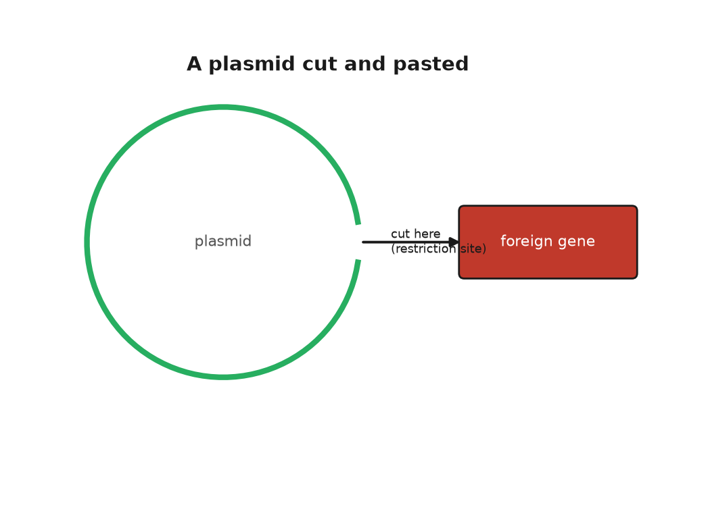
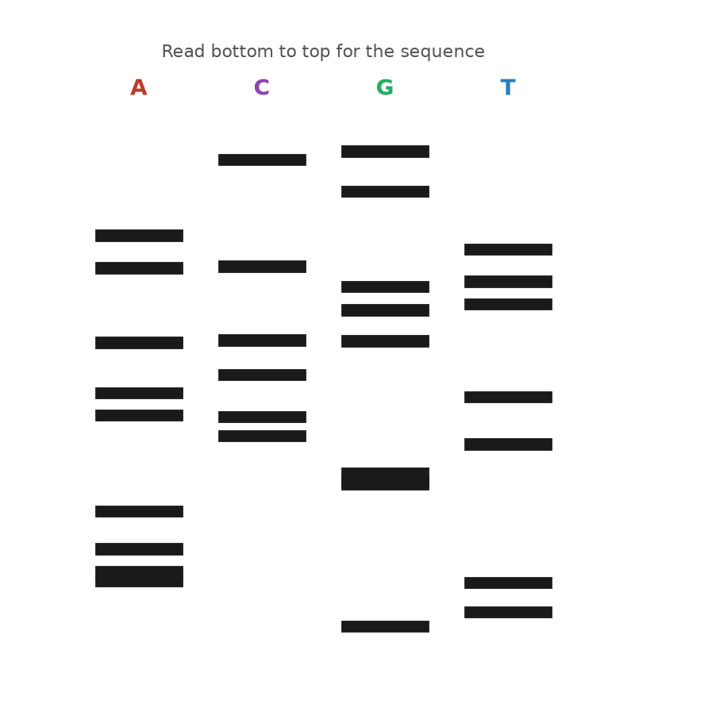
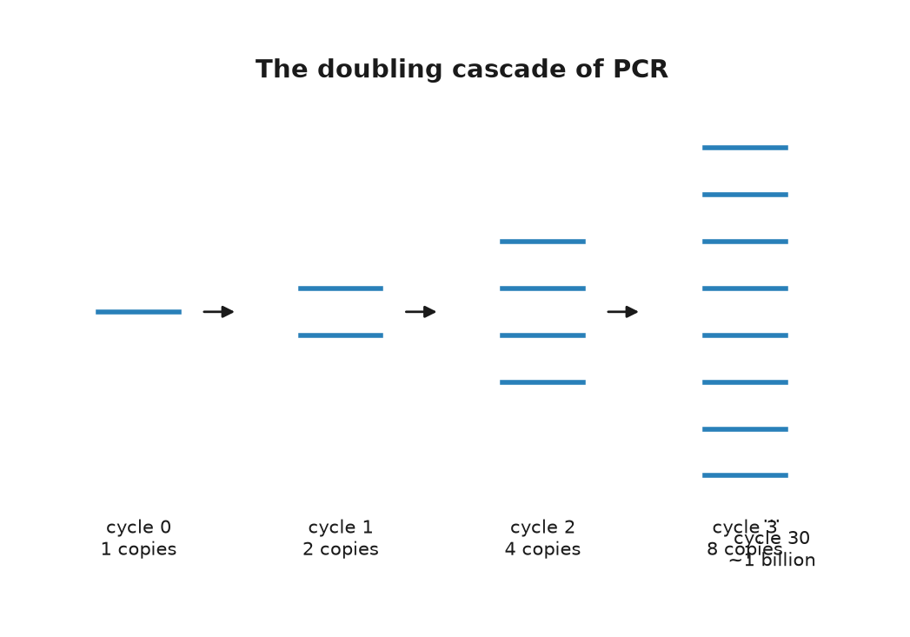
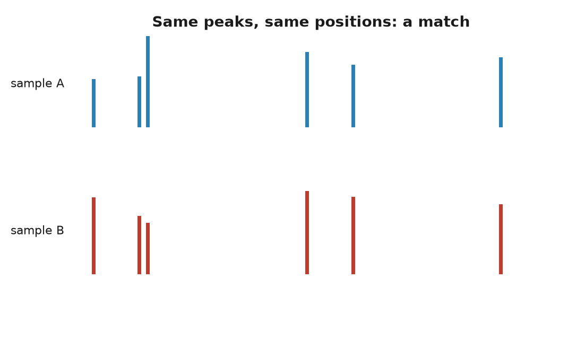
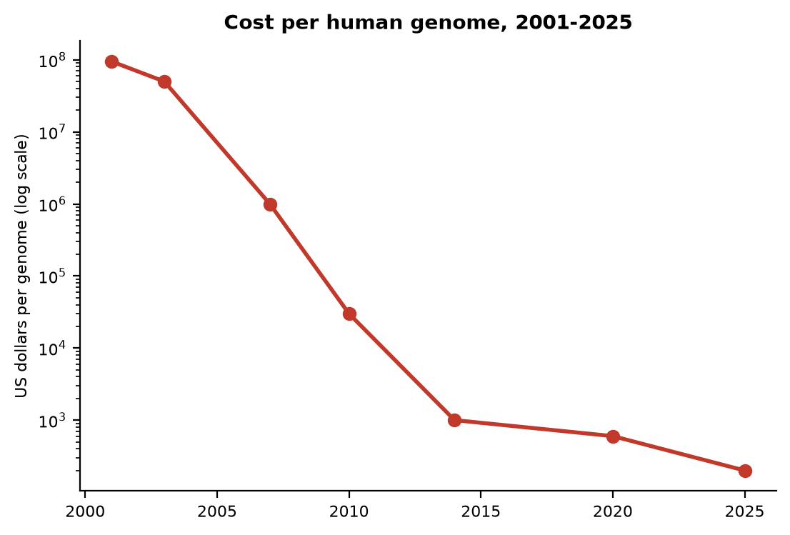

# PART V — Learning to Read

## 20. Cutting and Pasting

A bacterium has no immune system in the sense that a child has one, but it has something older and simpler. Picture a single cell of *Escherichia coli*, a rod two microns long, small enough that three dozen of them laid end to end would barely span the width of a human hair, in the gut of a boy named Theo. Theo, his mother Anna and his grandmother Ruth are invented, three generations of a family who exist in this book so that the mechanisms have somewhere to happen. The bacterium is real, and it is under attack. A virus called a bacteriophage has landed on its surface, punched through the wall, and injected a few tens of thousands of letters of foreign DNA. The bacterium's reply is an enzyme that patrols the interior of the cell looking for one short word, four or six letters in length, and cuts the double helix wherever it finds that word. The cell's own DNA carries the same word at hundreds of places, but a second enzyme has already tagged every copy with a methyl group, the tiny chemical marker behind the gene-switching in chapter 9's look at epigenetics, and the tag blocks the blade. The invader's text is untagged. It is cut to pieces within minutes.

This was worked out slowly. In 1952 Salvador Luria and Mary Human noticed that phages grown on one strain of bacteria often failed to grow on another, as if the second strain restricted them. Werner Arber, in Geneva in the early 1960s, showed with Daisy Dussoix that the restriction was done by an enzyme that cut the phage DNA, and that the host protected itself by chemically modifying its own. Arber predicted that such enzymes would recognise specific sequences. In 1970 Hamilton Smith at Johns Hopkins purified one from *Haemophilus influenzae*, named it HindII, and showed that it cut at a defined six-letter site and nowhere else. Smith's colleague Daniel Nathans then used HindII on the DNA of a monkey virus, SV40, cut the circle into eleven fragments, and in 1971 arranged the fragments in order: the first physical map of a genome made with an enzyme. Arber, Smith and Nathans shared the 1978 Nobel Prize in Physiology or Medicine.

The word "restriction" stuck, though it is a poor name for what the enzymes became. By the end of the 1970s dozens had been purified, each recognising its own distinctive word, and the catalogue now runs to thousands, with a few hundred sold by the vial. The names are the bacterium's, abbreviated: EcoRI from *Escherichia coli*, BamHI from *Bacillus amyloliquefaciens*, HindIII from the same *Haemophilus* that gave Smith his first. Most recognise a palindrome, a sequence that reads the same on both strands when each is read in its own direction. EcoRI's word is GAATTC. On the other strand, read the other way, it is GAATTC again.

EcoRI, isolated in Herbert Boyer's laboratory at the University of California, San Francisco, in 1972, had a property that turned a curiosity into a tool. It did not cut straight across. It cut between the G and the A on each strand, which left every fragment with a four-letter single-stranded tail, AATT, hanging off the end. Any two fragments cut by EcoRI, from any organism whatever, carry matching tails, and in a test tube they find each other and pair up by the same hydrogen bonds that hold the helix together. Janet Mertz and Ronald Davis at Stanford showed this in 1972 and called the tails cohesive. Everyone else calls them sticky ends. With DNA ligase, an enzyme isolated in 1967 by several groups at once, the paired fragments could be sealed into a continuous strand. The scissors had found their paste.

---

The first recombinant DNA molecule, DNA spliced together from two different sources, took shape in Paul Berg's laboratory at Stanford in 1972 without sticky ends, and without ever entering a living cell. Berg, with David Jackson and Robert Symons, took the circular DNA of SV40, opened it with EcoRI, and joined it to a piece of DNA from the bacteriophage lambda that carried three *E. coli* genes for digesting the sugar galactose. The joining was done by adding tails of A to one piece and tails of T to the other with an enzyme known as terminal transferase, then letting the tails anneal. The paper appeared in the *Proceedings of the National Academy of Sciences*, PNAS for short, in October 1972. Berg's plan had been to put the hybrid into *E. coli* and see whether the monkey virus genes worked there. He did not do it. A colleague, Robert Pollack, had telephoned him in 1971 to ask whether it was wise to put the DNA of a tumour virus into a bacterium that lives in the human gut, and Berg, having thought about it, agreed that it was not, or not yet. This was the first pause in the history of genetic engineering, and it was self-imposed.

The step into the cell was taken in 1973 by Stanley Cohen at Stanford and Boyer at UCSF. The story of how they met is well documented and has the flavour of legend anyway. At a conference on plasmids in Honolulu in November 1972, the two men went out for a late sandwich at a delicatessen near Waikiki and, over the corned beef, put their two projects together. Cohen worked on plasmids, the small circles of DNA that bacteria carry alongside their main chromosome and pass between themselves, which is how resistance to antibiotics spreads through a hospital. He had one such plasmid, which he had named pSC101, that carried a gene for resistance to tetracycline and, as luck had it, a single EcoRI site. He had also worked out, with Annie Chang and Leslie Hsu, that a cold bath of calcium chloride made *E. coli* take up naked plasmid DNA from the surrounding fluid. Boyer had the enzyme. If pSC101 was cut open with EcoRI, a fragment of anything else cut with the same enzyme could be pasted into the gap, the circle closed with ligase, and the whole thing fed to bacteria. Any bacterium that then grew on tetracycline had taken up the plasmid and, with it, the passenger.

It worked. The paper, by Cohen, Chang, Boyer and Robert Helling, was published in PNAS in November 1973. The first passenger was a gene from another bacterial plasmid, which was a modest thing to move. In May 1974 John Morrow, with Cohen and Boyer, put ribosomal genes from the African clawed frog *Xenopus laevis* into pSC101 and showed that *E. coli* copied the frog DNA every time it divided and, more surprisingly, transcribed it. A gene from a vertebrate had been carried across something like half a billion years of separate evolution and was being read by a bacterium. Stanford and the University of California filed a patent on the method in November 1974. It was granted in December 1980, licensed to several hundred companies on easy terms, and by the time it expired in 1997 it had earned the two universities about $255 million, a figure I repeat as reported.

Nobody in 1974 had an insulin gene to hand, or any human gene in a form that could be pasted. The point of the Cohen and Boyer experiment was not what it moved but that anything could be moved. The wall between species, which breeders had spent ten thousand years respecting, had a door in it.

---

The people best placed to see what might go wrong were the people who had built the door. In July 1974 Berg and ten colleagues, Cohen and Boyer among them, published a letter in *Science* that asked their fellow scientists to stop, voluntarily, two classes of experiment: putting antibiotic-resistance or toxin genes into bacteria that did not already carry them, and putting tumour-virus DNA into bacteria at all. The letter asked the National Institutes of Health to draw up guidelines, and it called for a meeting. The meeting took place from 24 to 27 February 1975 at the Asilomar conference grounds on the Monterey peninsula in California, among pines and sand dunes, with about 140 participants, most of them molecular biologists, plus a handful of lawyers and a few journalists who had been let in on condition that they stayed to the end.

The arguments at Asilomar were not tidy. Some participants thought the risks imaginary and the moratorium, the voluntary pause on research, a gift to future regulators. James Watson, who had signed the 1974 letter, spent the meeting saying he wished he had not. Others, including Berg, thought that if the field did not draw its own lines, Congress would draw them for it, badly. By the last night, working past midnight, the organisers had a draft that most of the room could accept. Experiments were sorted into risk classes. Each class was matched to a level of physical containment, from an open bench to a sealed laboratory under negative air pressure, meaning air pulled steadily inward so nothing drifts out, and to a level of biological containment, meaning bacteria crippled so that they could not survive outside a flask. The riskiest experiments were to be deferred. The NIH turned the draft into formal guidelines, published on 23 June 1976, that bound anyone who took federal money.

Asilomar has been cited ever since, sometimes as a model and sometimes as a warning, and the international summits on human genome editing in 2015, 2018 and 2023 were consciously staged in its image. I think both readings are fair. The scientists did pause themselves, which is rare, and none of the feared catastrophes occurred. They also confined the discussion to laboratory safety and kept the wider questions, about ownership and purpose and who decides, off the agenda, which is one reason those questions arrived later and less politely. The city council of Cambridge, Massachusetts, whose mayor Alfred Vellucci did not see why Harvard should decide what went into his city's drains, held its own hearings that summer and imposed a local moratorium of several months before allowing the work to continue under rules of its own.

Robert Swanson was twenty-nine, a venture capitalist, someone whose job is investing other people's money in new companies, recently let go by his firm, when he telephoned Boyer in January 1976 and asked for ten minutes. He got three hours in a bar near the UCSF campus. Boyer thought a company built on recombinant DNA was premature; Swanson thought otherwise, and on 7 April 1976 they founded Genentech, each reported to have put in $500. The company had no laboratory. Its first work was done under contract at the City of Hope medical centre near Los Angeles, where Keiichi Itakura and Arthur Riggs could synthesise a gene chemically, letter by letter, rather than fishing it out of a cell. The first target was somatostatin, a human hormone built from just fourteen amino acids, the basic building blocks of proteins from chapter 6, chosen because its gene could be built from scratch in weeks. In 1977 *E. coli* made it. It was the first human protein produced by a bacterium.

Insulin was the real prize, and there was a race for it. Insulin then came from the pancreases of pigs and cattle, collected at slaughterhouses by the tonne, and the supply was thought to be running short. The molecule has two chains, A and B, of 21 and 30 amino acids, which is longer than somatostatin but still compact enough to build. Walter Gilbert's group at Harvard was working from the natural gene. The Genentech and City of Hope team built the two chain genes chemically, put each into *E. coli* fused to a bacterial protein, cut the chains free, and joined them with the correct sulphur bridges in a flask. They announced success on 6 September 1978. Eli Lilly, which had sold insulin since 1923, took the licence. Humulin, insulin identical in sequence to the human kind and brewed by bacteria in steel tanks, was approved by the Food and Drug Administration in October 1982, the first drug produced by recombinant DNA to reach patients. Genentech had already gone public. On 14 October 1980 its shares opened at $35 and rose to about $88 within the hour, a number quoted in every history of the industry and one I repeat as reported.

So by 1982 a bacterial defence against viruses had become a pair of scissors, a bacterial plasmid a paste-pot, and a gut bacterium a factory for a human hormone. What none of this gave anyone was a way to read what they had pasted, and that method was the work of a quiet man in Cambridge who had already won one Nobel Prize and was about to earn a second.

## 21. Sanger's Ladders

The first genome anyone ever read belongs to a virus so small that ten thousand of them would fit across the width of a human hair. It is called phi X174, it infects *E. coli*, and its entire text is a single circle of DNA 5,386 letters long. In February 1977 a paper in *Nature* from the Medical Research Council's Laboratory of Molecular Biology in Cambridge printed the whole of it, or nearly: the count given then was 5,375, and the last eleven letters were tidied up over the following year. The authors were Fred Sanger and eight colleagues. Between them they had read every letter of a living thing's instructions for the first time, and the text held a surprise. Two of the virus's genes lay inside other genes, sharing the same letters but read in a different frame, like a sentence hidden in another sentence by starting one letter later. Nobody had thought that possible.

Sanger was fifty-eight and had already spent a career on the problem of reading. He was born on 13 August 1918 in Rendcomb, a village in Gloucestershire, the son of a doctor, and was raised a Quaker; he registered as a conscientious objector in 1939 and spent the war in a Cambridge laboratory. Between 1945 and 1955 he worked out the complete sequence of insulin, all 51 amino acids in its two chains, using a reagent he invented to label the end of a chain and sheets of paper chromatography, a technique that separates chemicals by how far each one travels across a wet sheet, to sort the fragments. Before that work nobody knew for certain that a protein had a fixed sequence at all. The 1958 Nobel Prize in Chemistry went to him alone. Then he turned to RNA, reading the 120 letters of a compact ribosomal RNA, a piece of the ribosome, the cell's protein-building machinery from chapter 8, in 1967, and then, in the early 1970s, to DNA, which was harder because it was longer and its four letters were chemically so alike.

His first DNA method, in 1975, was awkward, and it was the one used for most of phi X174. The method that replaced it, published in PNAS in December 1977 with Steve Nicklen and Alan Coulson, is the one the world used for the next thirty years, and it is worth understanding, because every genome in this book before 2005 was read with it.

---

Start with a single strand of the DNA you want to read and a brief primer that pairs with one end of it. Add DNA polymerase, the copying enzyme from Chapter 7, and the four ordinary building blocks, one of them carrying a radioactive atom. The enzyme extends the primer, letter by letter, making a copy of the strand. Now the trick. Into the tube goes a small dose of one building block, say A, in a crippled form: a dideoxy nucleotide, which is missing the hydroxyl group, a single oxygen-and-hydrogen pair, at its 3-prime carbon, the numbered backbone position from chapter 3's ladder, that the next letter needs in order to attach. The enzyme cannot tell the difference and slots it in. But once a crippled A is in, the chain can grow no further. It stops. Because the crippled A is a minority, the enzyme usually gets the ordinary one, and each copy runs on until, at some A along the way, it draws the short straw. Millions of copies, and the tube ends up holding a chain stopped at every A in the sequence: one that stopped at the first A, one at the second, one at the tenth. Four tubes, one for each crippled letter, give four such families.

The four tubes are then run side by side down a slab of polyacrylamide gel under an electric field, a method that separates DNA strands by length so finely that a chain of 101 letters travels visibly further than a chain of 102. Lay a sheet of X-ray film on the gel, wait, develop, and each lane shows a ladder of dark bands. The shortest fragments are at the bottom. Read upward across the four lanes, noting at each rung which lane the band is in, and the sequence writes itself: A, A, G, C, T, T, and so on, until the bands blur together somewhere past the two-hundredth rung. Later gels, taller and thinner, ran to five or six hundred letters. The X-ray film was the same one Alec Jeffreys would pull out of a developing tank seven years later, in the next chapter but two.

Allan Maxam and Walter Gilbert at Harvard published a rival method in PNAS in the same February of 1977. Theirs used chemistry rather than an enzyme: label one end of the DNA, split the sample four ways, and in each tube use a reagent that breaks the chain at one kind of letter, dimethyl sulphate for G, hydrazine for C, and so on, under conditions gentle enough that each strand breaks only once. The result is also a ladder, read the same way. For a few years the two methods were used side by side. Gilbert's needed no cloning of the fragment into a single-stranded form and was popular at first; Sanger's used an enzyme instead of hydrazine and could be scaled up and, eventually, automated. Sanger's won. The 1980 Nobel Prize in Chemistry went to Sanger and Gilbert for reading DNA, and to Paul Berg for the recombinant molecule of Chapter 20. It was Sanger's second, which makes him one of only two people ever to win the chemistry prize twice; Barry Sharpless became the other in 2022.

Notice what the method actually reads. It does not read the strand you put in the tube. It reads copies of that strand, made on the spot by a polymerase, and it depends on the copying being faithful enough that a million copies stopped at the fortieth letter all carry the same thirty-nine letters before it. They very nearly do. When they do not, because the enzyme slipped on a run of identical letters or the template was damaged, the ladder shows a faint extra rung or a smeared one, and the reader has to decide. This is why the phi X174 count of 1977 was out by eleven letters, and why every sequence in this book was read more than once. A text is not read directly; it is copied and the copies are compared, which is, when you think about it, exactly what a cell does.

Sanger himself worked at the bench until the day he retired, in a group that rarely numbered more than a dozen, and he was known for doing the experiments with his own hands rather than through students. The Laboratory of Molecular Biology, which had opened its new building in 1962 with Perutz, Kendrew, Crick and Sanger under one roof, had by 1980 collected more Nobel prizes per square metre than any building in the world, and it kept the coffee room at the centre of the plan on purpose.

Sanger's laboratory used the new method as fast as it could be written up. In 1981 it published the entire human mitochondrial genome, the 16,569 letters that Ruth passed to Anna and Anna to Theo, along with the finding that the mitochondrion reads a few codons differently from the rest of the cell. In 1982 it published bacteriophage lambda, 48,502 letters, then the largest genome read. For lambda the group could not proceed from one end to the other, because no gel reads more than a few hundred letters. So they broke the DNA into random pieces, cloned each into a small virus that delivered it as a single strand, read the pieces, and had a computer find the overlaps and stitch them together. Rodger Staden wrote the programs. The method is called shotgun sequencing, and it is, at heart, how every genome since has been assembled: read short stretches many times over and let the overlaps tell you the order.

---

The bottleneck was not the chemistry but the hands. Pouring gels, loading four lanes per sample, exposing film overnight and reading ladders by eye with a ruler was slow work, and a good technician read perhaps a few thousand letters in a day. A human genome, 3.1 billion letters read several times over for safety, was out of the question. At the California Institute of Technology, Leroy Hood and Lloyd Smith replaced the radioactive label with four fluorescent dyes, one colour for each of the four terminators, so that all four reactions could be run in a single lane and a laser at the bottom of the gel could read the colours as the bands passed. The paper appeared in *Nature* in June 1986. Applied Biosystems built the machine, the ABI 370A, and sold it from 1987; it read about 350 letters per lane, with no film and no ruler. Sanger's method had become a printer.

The machine that read the human genome was the next step but one. In 1998 Applied Biosystems released the PRISM 3700, which replaced the slab of gel with 96 hair-thin glass capillaries, each filled with a polymer that did the same job, and ran them unattended around the clock. A single 3700 could produce hundreds of thousands of letters a day, in reads of about 500 to 600 letters each. Celera, the company described in Chapter 36, bought three hundred of them; the public project bought hundreds more. The 3.1 billion letters of the first human sequence, in every draft, came out of capillaries by the dideoxy method, and the method was still, chemically, what Sanger had described in 1977 with a crippled A.

He was not there to run the machines. Sanger retired in 1983, at sixty-five, on the day he became eligible, and spent the next thirty years gardening at his house outside Cambridge and, by his own account, doing very little else. He turned down a knighthood, saying that he did not want to be called Sir, and accepted the Order of Merit in 1986. He described himself, more than once, as an ordinary sort of person who had simply enjoyed messing about in a laboratory, and people who worked with him tended to agree that he meant it. The genome campus that opened in the village of Hinxton in 1993 was named the Sanger Centre, and it went on to read about a third of the human sequence. He died on 19 November 2013, aged ninety-five.

Two habits from those years survive in every sequencing laboratory. One is coverage: because a single read can be wrong, each stretch is read several times, from different fragments, and the reads are compared before a letter is believed. The public human genome aimed at reading every position eight to ten times over. The other is the reference. Once a sequence exists, a second individual is not read from scratch; its reads are lined up against the first and only the differences are recorded. Both habits began with lambda and a shortage of hands.

There is one number worth holding onto from the Sanger years. Theo's genome, if it had been read with dideoxy ladders on a capillary machine, would have needed something like six million reads of 500 letters, and then several times that for the overlaps. The method was also greedy. Every read needed a large and pure sample of the stretch in question, which in practice meant cloning it into bacteria first, growing a flask, and purifying the plasmid: days of work to obtain enough copies to read a few hundred letters. What sequencing needed, if it was ever to leave the laboratory, was a way to make a billion copies of any chosen stretch in an afternoon, in a tube, with no cell involved at all.

## 22. Copying Without a Cell

Highway 128 runs north-west out of Cloverdale, California, through the vineyards of Anderson Valley towards the redwoods and the coast, and on a Friday night in April 1983 Kary Mullis was driving it with a chemist from his company asleep in the passenger seat. Mullis was thirty-eight. He had a doctorate in biochemistry from Berkeley, a history of leaving jobs, and a position at Cetus Corporation in Emeryville, where his work was to synthesise short stretches of DNA called oligonucleotides, twenty or so letters long, that other people ordered for their experiments. He was thinking, as he drove, about a way of reading a single letter at a chosen place in a genome. Put a primer next to the place, add polymerase and a single dideoxy terminator of the kind Sanger used, and the enzyme would add one crippled letter and stop; the colour of that letter would settle the matter.

The trouble was that any real sample of human DNA contained the chosen place once among 3.1 billion letters, and one copy is too little to see. Somewhere on the mountain road, as he told it later, he saw what would happen if he used two primers instead of one, on opposite strands, facing each other across the region he cared about. Polymerase would extend both, and the two new strands would together contain a copy of the region. Heat the tube to separate the strands, cool it, and the primers would land again, now on four strands instead of two. Extend, heat, cool, and there would be eight. He pulled over, he said, to do the arithmetic on this exponential growth, doubling each round so the numbers explode rather than simply add up. Two to the tenth is a thousand. Two to the twentieth is a million. Two to the thirtieth is a little over a billion. The region between the primers, and only that region, would be copied out of the surrounding text a billion times over. Every cycle was a copying, and it needed no cell to do it.

---

The idea is known as the polymerase chain reaction, or PCR, and its three steps are three temperatures. At about 95 degrees Celsius, just shy of boiling, the hydrogen bonds between the strands let go and the double helix comes apart. At somewhere between 50 and 65 degrees, depending on the primers, the two primers find their targets on the separated strands and stick; they are brief, and they are present in vast excess, so they win the race against the original partner strand. At 72 degrees the polymerase extends each primer along its template. Then back to 95. The first cycle makes strands of no fixed length, running on past the far primer until the enzyme falls off, but by the third cycle products appear that are bounded by a primer at each end, and from then on those products dominate. After 30 cycles, each a few minutes long, a single starting molecule has become about a billion copies of a fragment a few hundred letters across, which is plenty to see on a gel, to read with Sanger's method, or to cut with an enzyme.

Mullis's colleagues at Cetus were not impressed, at first, and it is worth being fair about why. Nothing in the scheme was new. Primers, polymerase and heat were all standard; a paper from Gobind Khorana's laboratory in 1971, by Kjell Kleppe and others, had described in a paragraph the idea of copying a stretch repeatedly with two primers, and then dropped it. What Mullis saw was that the repetition was exponential and that exponential was the whole point. The first experiment that clearly worked at Cetus is dated 16 December 1983 in the company's records, as reported in later accounts. The first cycles were done by hand. Each round of 95 degrees killed the polymerase, which was then the Klenow fragment, a trimmed-down version of the *E. coli* copying enzyme, so a technician moved the tubes between water baths and pipetted in fresh enzyme every cycle, thirty times. Cetus built a robot to do the pipetting.

A team at Cetus led by Henry Erlich, with Randall Saiki, Stephen Scharf and Norman Arnheim, turned the trick into a method and published it in *Science* in December 1985, using it to amplify part of the *HBB* gene and diagnose sickle cell disease from a small blood sample. Mullis's own description appeared in *Methods in Enzymology* in 1987. Cetus paid him a bonus of $10,000. He left the company in 1986. In 1991 Cetus sold the rights to PCR to Hoffmann-La Roche for $300 million, and in 1993 Mullis received the Nobel Prize in Chemistry, shared with Michael Smith, who had devised a way to change a single chosen letter in a cloned gene. A challenge to the patents by DuPont, resting partly on the 1971 Khorana paper, had failed before a jury in 1991.

---

The enzyme that made the reaction practical came out of a hot spring. In 1966 Thomas Brock, a microbiologist from Indiana University, collected samples from Mushroom Spring in the Lower Geyser Basin of Yellowstone National Park, where the water runs at about 70 degrees Celsius, hot enough to scald skin instantly, and discovered a bacterium growing in it that most textbooks then said could not exist. He named it *Thermus aquaticus* and published it in 1969. Its proteins worked at temperatures that cook other proteins. In 1976 a group at the University of Cincinnati purified its DNA polymerase and showed that the enzyme copied DNA happily at 70 degrees. Nobody had a use for that until the Cetus team, with David Gelfand, put the Yellowstone enzyme into the chain reaction and published the result in *Science* in January 1988.

Taq polymerase, as it is called, survives the 95-degree step. That meant one dose of enzyme lasted the whole run, the water baths could be replaced by a programmable metal block that cycled its own temperature, and a person could load the tubes, press a button, and go to lunch. Because Taq works best at 72 degrees, the primers could be annealed at higher temperatures too, which left them fussier about where they landed and the products cleaner. Taq has one defect: it does not proofread. It makes a wrong letter about once in every ten thousand or so, which after thirty cycles means that a fraction of the copies carry an error somewhere. For most purposes that does not matter, and for the purposes where it does, polymerases from other hot-spring organisms that do proofread, such as Pfu from *Pyrococcus furiosus*, were found later. Brock's bacterium had been deposited in a public culture collection, so anyone could order it, and Yellowstone itself received nothing from the enzyme until a separate agreement with a biotechnology company in 1997 caused a small public row.

What the chain reaction did to biology is hard to overstate, so I will understate it: it removed the need for a cell. Before PCR, to study a gene you cloned it, which meant a plasmid, a bacterium, a flask and a week. After PCR, you designed two primers, ordered them, and had a billion copies before the end of the day, from a drop of blood, a hair root, a mouth swab, a cheek cell in a tube, or a fragment of a bone. Real-time versions, developed in the early 1990s by Russell Higuchi and others at Cetus and then Roche, watched the copies accumulate cycle by cycle with a fluorescent dye and read off, from the cycle at which the signal crossed a threshold, how many molecules had been there at the start. That number is what a laboratory means when it reports a viral load in a patient with HIV, the human immunodeficiency virus that causes AIDS.

A brief example shows the reach. Anna can drink milk as an adult because she carries, on one of her copies of chromosome 2, a single-letter change about 14,000 letters upstream of the lactase gene *LCT*, inside a neighbouring gene called *MCM6*, that keeps the lactase gene switched on after weaning. Ruth carries it too; that is where Anna's came from. To check whether Theo inherited it, a laboratory does not need his genome. It designs two primers that flank the position, amplifies a fragment of a few hundred letters from a cheek swab, and either reads the fragment by Sanger's method or cuts it with a restriction enzyme that recognises one version of the site and not the other, and looks at the gel. The whole thing takes an afternoon and costs a few dollars in reagents. Before 1985 the same question would have taken a month.

The reaction also made a scientific career possible in places with no cold room and no flask. Field stations, veterinary laboratories, customs posts checking the species of a fish fillet, and school classrooms now run it in a box the size of a toaster, and the box costs less than a good bicycle. Mullis, as it happens, first presented the method to a wide audience at the Cold Spring Harbor symposium in the summer of 1986, on the same campus where Watson had first described the double helix in 1953, and by most accounts it was only then that the field grasped what Cetus had.

It is also what was measured, several billion times over, between 2020 and 2022. The genome of the new coronavirus was posted online from Shanghai on 10 and 11 January 2020, and within about a fortnight laboratories in Berlin, Hong Kong and elsewhere had designed primers against it and published protocols. The virus stores its text in RNA, so the swab from Theo's nose, when he was nine and his school sent him home with a cough, first met an enzyme known as reverse transcriptase that copied the RNA into DNA, and then the chain reaction ran for up to 40 cycles looking for a few hundred letters of a viral gene. If the signal crossed the threshold by cycle 30, there had been a fair amount of virus; by cycle 38, very little; not at all, none that the test could find. The numbers on the report, which puzzled several million parents, were cycle counts.

The same power is the method's hazard. The reaction copies whatever the primers find, and it cannot tell a molecule from the sample from a molecule that drifted in from the technician's breath, a previous run, or the plastic of the tube. A single stray copy, amplified a billion times, looks exactly like a signal. The people who learned this most painfully were those trying to read DNA from the dead, in Chapter 28, where a Neanderthal bone handled by a dozen living humans will yield, by default, the dozen. Clean rooms, negative controls, meaning blank samples run alongside the real ones to catch stray contamination, and a certain paranoia are as much a part of PCR as the enzyme.

Mullis was, by the public record, an unusual laureate. He surfed, he wrote a memoir in 1998 that included his experiments with hallucinogens, and in later years he publicly doubted that HIV causes AIDS and that human activity warms the climate, positions that the evidence does not support and that most of the field found difficult to hear from him. He died on 7 August 2019, in Newport Beach, aged seventy-four. The reaction he saw on the mountain road is now run, by one estimate I have seen and cannot verify, more than a billion times a year.

There is one thing PCR did not do, and the gap matters for the next chapter. It made copies of a chosen stretch; it did not, by itself, tell one person's DNA from another's. For that, someone had to find the stretches where the text of two people reliably differs, and in the autumn of 1984 a geneticist in Leicester stumbled on them by accident on a Monday morning.

## 23. The Fingerprint

At five past nine on the morning of Monday 10 September 1984, in a darkroom in the genetics department of the University of Leicester, Alec Jeffreys lifted a sheet of X-ray film out of the developing tank and held it up to the light. It was, by his own later description, a mess: a set of smudgy grey lanes, each a column of dark bars varying in thickness and at different heights, like a supermarket barcode printed badly. He had been hoping for something much tidier. He looked at it for a few minutes and understood that the mess was the point. The lanes came from his technician, Jennifer Foxon, and from her mother and father, alongside DNA from a grey seal, a cow, a baboon, a mouse and a tobacco plant, and every human lane was distinct from every other. More than that: about half of the bars in Jennifer's lane appeared in her mother's and the other half in her father's. Within the hour, he has said, he and his colleagues were listing what the film could be used for, and the list included paternity, immigration disputes and crime.

Jeffreys was thirty-four. He had come to Leicester in 1977 and had been studying, among other things, the gene for the muscle protein myoglobin, in the course of which he noticed a short repeated sequence inside one of its introns, the non-coding stretches within a gene from chapter 9. The repeat was a member of a family. Scattered through the human genome are stretches, later called minisatellites, where a unit of ten to sixty letters is copied over and over in tandem, and the number of copies at any one stretch varies wildly from person to person, because such repeats are prone to slip during the copying of Chapter 7 and gain or lose a unit. Jeffreys noticed that many of these stretches shared a core sequence about a dozen letters long. A radioactive probe made from that core would stick to dozens of minisatellites at once, and since each of them varied in length from person to person, the probe would light up a pattern of bars that was, in effect, a summary of that person's repeat lengths at thirty or forty places. He named it a DNA fingerprint. It was published in *Nature* in March 1985, with a second paper in July.

The method was Southern blotting, invented by Edwin Southern in Edinburgh in 1975, and it was slow. Extract DNA from a sample, which had to be at least a few micrograms, meaning a bloodstain the size of a coin or a good quantity of semen. Cut it with a restriction enzyme, the DNA-cutting tool from chapter 20, run the fragments down an agarose gel, transfer them to a nylon membrane, soak the membrane in the radioactive probe, wash, and expose a film for days. Then compare barcodes by eye. No PCR was involved; the reaction existed in a laboratory in Emeryville but had not yet been published, and Jeffreys was working with the whole genome at once.

---

The first case was not a crime. In 1985 a boy born in Britain to a Ghanaian mother had gone to Ghana and come back, and the immigration authorities suspected that the boy who returned was not the boy who had left, or was a nephew rather than a son. The mother's solicitor read about Jeffreys in a newspaper. The father was not available, so Jeffreys compared the boy's fingerprint with the mother's and with those of her three other children, reconstructed from them the bars the father must carry, and showed that the boy was her son and their full brother, with odds against the alternative that ran into the hundreds of thousands. The Home Office dropped the case. Paternity disputes followed by the hundred, and in 1987 the chemical company ICI opened a commercial laboratory, Cellmark, to run them.

The crime came from a few miles down the road. On 21 November 1983, a fifteen-year-old girl called Lynda Mann was raped and strangled on a footpath in the village of Narborough, south of Leicester. On 31 July 1986 a second fifteen-year-old, Dawn Ashworth, was killed in the same way on a lane in the next village, Enderby. A seventeen-year-old kitchen porter, Richard Buckland, who had learning difficulties, confessed to the second murder under questioning but denied the first. The police, wanting to tie him to both, sent Jeffreys the semen samples from the two victims and a blood sample from Buckland. Jeffreys used the newer single-locus probes, which light up one minisatellite at a time and give cleaner results from degraded material. The two crime-scene samples matched each other. Neither matched Buckland. In November 1986 he was released, the first person anywhere to be cleared of a crime by DNA, and the police, who had been told by a scientist that their confession was worthless, had to start again.

They started with what was then known as the blooding. From January 1987 every man aged between about seventeen and thirty-four who lived, worked or had been treated in the three villages of Narborough, Enderby and Littlethorpe was asked to give a sample of blood or saliva. Some five thousand men did; the figure usually reported is 5,511. Nobody matched. Then on 1 August 1987 a bakery worker named Ian Kelly, drinking with colleagues in a pub in Leicester, mentioned that he had given blood in the name of a fellow baker, Colin Pitchfork, who had told him a story about being in trouble over an earlier offence and had supplied a doctored passport for the purpose. A woman at the table reported the conversation six weeks later. Pitchfork was arrested on 19 September 1987. His blood matched the two samples, he admitted both murders, and on 22 January 1988 he was sentenced to life imprisonment, the first person convicted of murder on DNA evidence. He was released on licence in 2021 and recalled to prison within months, a matter still on the public record when this was written.

The United States followed within the year. In November 1987 a jury in Orlando, Florida, convicted Tommie Lee Andrews of rape on the strength of a match made by a commercial laboratory, and by 1989 a New York court, in the case of Joseph Castro, had thrown out DNA evidence from the same kind of laboratory because the work had been sloppy, which did more for the standards of the field than any conviction. Jeffreys was knighted in 1994.

---

The barcode of 1984 is no longer what a laboratory produces. It needed too much sample and took too long, and it was hard to turn into a number. By the early 1990s the method had moved to a different kind of repeat and to the chain reaction of the previous chapter. Short tandem repeats, or STRs, are stretches where a unit of usually four letters is repeated somewhere between five and fifty times. Each person carries two copies of each STR, one from each parent, and the two copies often differ in length. Anna has, at one much-used marker on chromosome 5, a copy with eleven repeats and a copy with thirteen. Theo, at the same marker, has one of Anna's two and one of his father's, as at every other. A pair of primers on either side of the repeat, thirty cycles of PCR, and the fragments come out of a capillary machine as peaks on a trace, one peak per copy, at positions that give the repeat number directly. Nanograms of DNA suffice, which is a few dozen cells. A licked stamp will do. The result is a list of numbers, two per marker, and lists of numbers can be stored and searched.

The United Kingdom set up the first national database in April 1995 and now profiles seventeen markers plus a sex test. The FBI's system, known as CODIS, the Combined DNA Index System, was authorised by an act of Congress in 1994 and became operational at the national level in October 1998 with thirteen core markers, expanded to twenty in January 2017. It held, by the mid-2020s, something over seventeen million profiles from convicted offenders and several million more from people merely arrested, figures I take from the FBI's own published statistics. Britain's holds profiles of about six million people. China's is reported to be far larger, and the reports are hard to check. Because Theo shares one repeat number with Anna at every marker, a database that holds Anna can also point, weakly, at Theo; this is called familial searching, it was first used to make an arrest in Britain in 2004, and it is the modest ancestor of the genealogy searches of Chapter 42.

The arithmetic that makes such profiles powerful is simple and the ways it goes wrong are subtle. At each marker, the frequency of a given pair of repeat numbers in the population can be measured; multiply the frequencies across thirteen or twenty markers, and the chance that a random unrelated person shares the whole profile falls below one in a quadrillion, several thousand times more than the number of people who have ever lived on Earth. That is the random match probability, and it is a real number. It is not the probability that the defendant is innocent, and confusing the two has a name, the prosecutor's fallacy, which the English Court of Appeal identified in a 1994 case and warned juries against. Suppose a partial profile from a degraded sample matches one person in a million. In a country of sixty-seven million there are about sixty-seven people who match. If nothing else connects the defendant to the crime, the profile makes him one of sixty-seven, not one in a million. Databases sharpen the problem: search seventeen million profiles for a one-in-a-million match and you expect to find seventeen innocent people, before you find anyone else.

The other failures are physical. DNA travels. In November 2012 a homeless man named Lukis Anderson was charged with a murder in a mansion near San Jose after his DNA was found under the victim's fingernails. He had been unconscious in a hospital at the time, drunk, and had been carried there by the same two paramedics who, hours later, attended the victim; the DNA had come with them on their equipment. He spent about five months in jail before the timeline was checked. Between 1993 and 2009, police in Germany, Austria and France pursued a woman whose DNA turned up at about forty crime scenes, including the murder of a police officer in Heilbronn in 2007, and who seemed to move between burglary, murder and shoplifting with no pattern at all. In March 2009 the investigators tracked her down: she worked in a factory in Bavaria that packed the cotton swabs the police used, and had contaminated them. In Manchester in 2011 a man named Adam Scott was charged with rape after his profile came up from a swab; the laboratory had reused a plastic tray that carried a trace from an unrelated sample of his, and the charge was dropped the following year. Mixtures of two or three people's DNA, and samples of a handful of cells, are now the daily material of forensic laboratories, and reading them is a matter of statistics and judgement, not a barcode held up to the light.

None of which is an argument against the method. In the United States, the Innocence Project counts more than 375 people freed from prison by DNA evidence since 1989, many after decades, and a fair number from death row. The technique that freed Richard Buckland before it caught Colin Pitchfork has done both, in that order, ever since. It reads, at most, a few dozen positions out of 3.1 billion, chosen precisely because they say nothing about the person except who they are. Reading the rest was, at the time of the Narborough case, an idea with a price tag of three billion dollars.

## 24. Fast, Cheap, and Everywhere

There is a chart on the website of the National Human Genome Research Institute in Bethesda, Maryland, that has been reproduced more often than any figure in genetics since the double helix, and it consists of one falling line. The vertical axis is the cost of sequencing a human genome, on a logarithmic scale, so that each gridline is ten times cheaper than the one above. The horizontal axis is time, from September 2001 to the most recent update. The line starts at about $95 million. For six years it slopes down gently, roughly halving every two years, in step with a grey reference line labelled Moore's law, the rate at which computer chips have improved since the 1960s. In late 2007 it leaves the grey line and falls off a cliff. By 2009 it is near $100,000. By 2011 it is near $10,000. By 2015 it is at about $1,000, and by 2022 the institute's own estimate is somewhere around $500 to $600. From the year the first draft was announced to the year Theo turned eleven, the price of reading a person fell by a factor of something like a hundred thousand.

The starting figure needs care. The Human Genome Project, described in Part IX, cost about $2.7 billion over thirteen years, but that paid for maps, for the genomes of yeast, worm, fly and mouse, for technology and for the first human sequence together, and the institute's own estimate is that the human sequence itself accounted for a few hundred million to a billion dollars of it. The first genome of a single named person was James Watson's, read in 2007 by a company called 454 Life Sciences in about two months at a reported cost of about $1 million and handed to him on a pair of DVDs in Houston on 31 May of that year. Craig Venter's genome, read the same year with the older capillary machines, is not usually put on the chart because nobody agrees on what it cost. By 2014 Illumina was advertising a $1,000 genome, on condition that you bought ten of its HiSeq X machines for $10 million and ran them flat out. In September 2022 the same company announced a machine, the NovaSeq X, on which it said a genome could be read for $200 in consumables, and a rival, Ultima Genomics, had claimed $100 that May. By 2025 figures below $100 were being quoted. All of these are the cost of the chemicals and the machine time to a laboratory that runs thousands of genomes, not what a hospital bills a patient, which in the mid-2020s was still typically a few thousand dollars with interpretation, and not what a consumer paid a company for a full genome, which was a few hundred. The night in a hotel from the front of this book is the consumer price.

---

The cliff in 2007 has a cause, and the cause is that the ladders of Chapter 21 were replaced by something that does not read one strand at a time. The generic name is next-generation sequencing, which was a poor name the day it was coined and is now nearly twenty years old. The first commercial machine was built by 454 Life Sciences, a company founded in Connecticut by Jonathan Rothberg, who has said that the idea came to him while his newborn son was in intensive care in 1999 and nobody could tell him whether the boy was well. The 454 machine, launched in 2005 and described in *Nature* that year, attached single DNA fragments to beads, copied each bead's fragment into thousands of identical copies by a form of PCR run inside droplets of oil, dropped the beads into a plate with more than a million wells the size of a picolitre, so small that some fifty million of them would fit inside a single drop of water, and then washed the four building blocks over the plate one at a time. Where a block was added, a flash of light was produced; a camera recorded which wells flashed at which letter. Hundreds of thousands of fragments were read in parallel, in about four hours, at about 100 letters each. It was the 454 machine that read Watson, and the Neanderthal draft of Chapter 28.

The machine that won was born in a pub. In 1997 two chemists at Cambridge, Shankar Balasubramanian and David Klenerman, worked out over drinks at the Panton Arms how to watch a polymerase add letters to a single molecule, and in 1998 they founded Solexa to do it. Their method, sequencing by synthesis, is what most genomes on Earth are now read with, and it goes like this. Break the DNA into fragments a few hundred letters long. Attach adapters, brief manufactured DNA tags, to the ends and spread the fragments over a glass slide, a flow cell, coated with matching adapters, so that each fragment sticks at a random spot. Copy each fragment in place, over and over, into a tight cluster of about a thousand identical molecules, so that the signal from each spot is bright enough to see. Then add all four building blocks at once, each carrying a different fluorescent colour and each with its 3-prime end blocked, so that every cluster takes up exactly one letter and stops, in the same spirit as Sanger's crippled A. Photograph the slide. Every cluster glows one of four colours. Chemically remove the block and the dye, add the four blocks again, photograph again. Repeat 150 or 300 times. The photographs, hundreds of millions of coloured dots per frame, are turned into 150 or 300 letters for each of hundreds of millions of clusters. The first Solexa machine, the Genome Analyzer of 2006, read 36 letters at a time and produced about a billion letters per run. Illumina, of San Diego, bought Solexa for about $600 million in a deal closed in January 2007. Its NovaSeq X, sixteen years later, produces on the order of ten trillion letters in a run of a couple of days.

Ten trillion letters is about three thousand human genomes' worth. In practice each genome is read about thirty times over, so a single run yields something like a hundred genomes, and the price falls accordingly. Reading everything thirty times is not extravagance. Each read is a copy of a copy, made by a polymerase on a slide, and the machines make mistakes, about one letter in a thousand on a good day. Thirty overlapping reads of the same stretch let the software vote. Thirty reads that all say G, where the reference says A, is a real variant. One read that says G is noise. This is the same logic as shotgun sequencing on Sanger's lambda, applied at a scale Sanger's laboratory could not have imagined: the human text is read as a heap of hundreds of millions of brief fragments and reassembled by computer, not from scratch, but by lining each fragment up against the reference genome of Chapter 37 and noting where it differs.

---

Short reads have a blind spot, and the blind spot is repeats. If a fragment of 150 letters comes from a stretch where the same 171-letter unit is repeated ten thousand times, as it is at the centre of every chromosome, the fragment fits equally well at ten thousand places and the computer cannot say which. The sequence declared finished in April 2003 was in truth about 92 percent of the genome. The remaining 8 percent, the centromeres, the pinched-in middle regions that hold a chromosome's two arms together during division, the arrays of ribosomal RNA genes on five chromosomes, the ends, and lengthy stretches of near-identical duplicated segments, was a set of gaps labelled with an estimated length and the letter N.

Two technologies filled them, and both read one molecule at a time without copying it first. Pacific Biosciences, in California, fixes a single polymerase at the bottom of a well so small that light can only illuminate the enzyme itself, and films it in real time as it adds fluorescent letters to a single strand. Its first machine shipped in 2011, with reads of ten thousand letters or more and an error rate of about 15 percent, which was fixed in 2019 by running the same circular molecule round and round and taking a consensus: reads of fifteen to twenty thousand letters at better than 99.9 percent accuracy. Oxford Nanopore Technologies, founded in 2005, threads a single strand of DNA through a protein pore set in a membrane and measures the tiny electrical current through the pore as each letter passes and disturbs it. Its MinION, shown to early users in 2014 and sold from 2015, is the size of a large USB stick, weighs less than a hundred grams, plugs into a laptop, and cost about $1,000 with starter kits. Its early reads were only about 70 to 85 percent accurate; by the mid-2020s the best modes were reported above 99 percent, and the reads have no fixed length. Reads of a million letters and more have been published. The MinION went to West Africa in a suitcase in 2015 to read Ebola genomes at the bedside, and in August 2016 the astronaut Kate Rubins used one on the International Space Station.

A consortium calling itself Telomere-to-Telomere, led by Karen Miga and Adam Phillippy, used both of the long-read technologies on a cell line called CHM13 and published the first genuinely complete human genome in *Science* on 31 March 2022: 3,054,815,472 letters, no gaps, about 200 million letters that had never been seen and some ninety-nine newly predicted protein-coding genes among them. The Y chromosome, the hardest, was added in a paper in *Nature* in August 2023. CHM13 came from a hydatidiform mole, a failed pregnancy in which the egg had lost its own nucleus and duplicated the sperm's, so that its two copies of every chromosome were identical and there was only one text to assemble. That is why it was chosen. A genome with two different copies of everything, which is to say any of ours, is now assembled in the same way, and the pangenome of Chapter 37 is the result.

The last number in this chapter is a time, not a price. In 2012 a group at Children's Mercy Hospital in Kansas City, led by Stephen Kingsmore, read and interpreted the genome of a sick newborn in 50 hours, and argued in print that for a baby in intensive care with an undiagnosed genetic disease, days were the difference between a treatment and a funeral. By 2015 the time was 26 hours. In 2018, at the Rady Children's Institute in San Diego, it was 19 and a half hours. In 2021 a team at Stanford under Euan Ashley split a patient's DNA across 48 nanopore flow cells at once, sequenced it in about five hours, and reached a diagnosis in seven hours and eighteen minutes; the report appeared in the *New England Journal of Medicine* in January 2022 and Guinness recorded it. In routine use the answer takes two or three days, which is still faster than most of the tests it replaces. A California programme known as Project Baby Bear, which paid for rapid genomes for 178 infants on the state's Medicaid between 2018 and 2020, reported a diagnosis in about four in ten and a change of treatment in about a third, along with savings that the report put at $2.5 million. Roughly a third of babies in intensive care with a suspected genetic condition get a diagnosis this way; the rest get a genome that says nothing definite, which is a subject for Part X.

Everywhere is not an exaggeration. Sewage in London was found in 2022 to contain poliovirus by sequencing what flowed down the drains. The coronavirus of Chapter 22 became, within two years, the most sequenced organism in history, with more than sixteen million genomes shared on one public database. A MinION can read the DNA in a spoonful of pond water, or in air filtered through a zoo, and name the species passing. Anna's tube, in the prologue, will be read on a chip that checks a few hundred thousand positions, but for a few hundred dollars more it could be read in full, and her son's could be read before he leaves the maternity ward, as several countries were beginning to arrange for every newborn when this was written. Ruth was born in 1948, when nobody was sure the molecule carried anything at all; in her lifetime the price of reading a human being went from infinite to a night in a hotel.

So the text can be read, by anyone, cheaply, in a day, and read so many times over that the machines' own miscopies are voted out; the next question, which a bacterium answered for the second time in 2012, was whether it could be rewritten.
