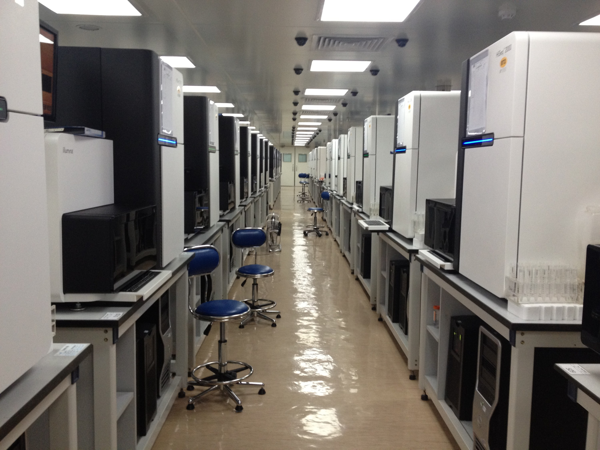
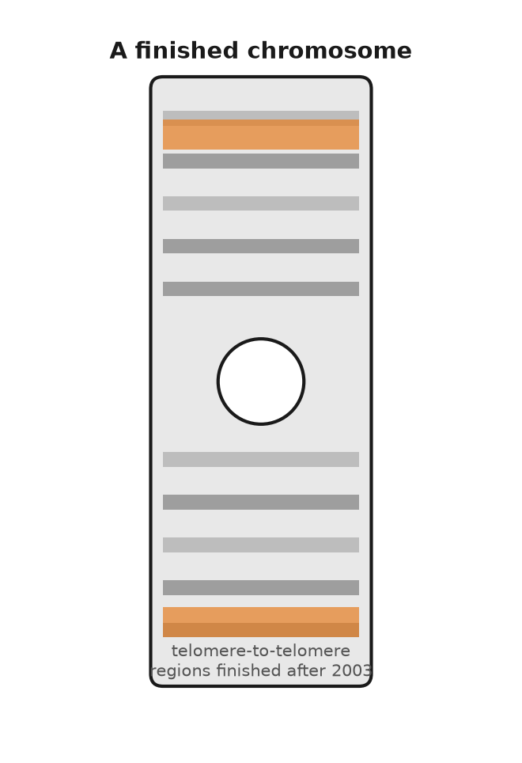
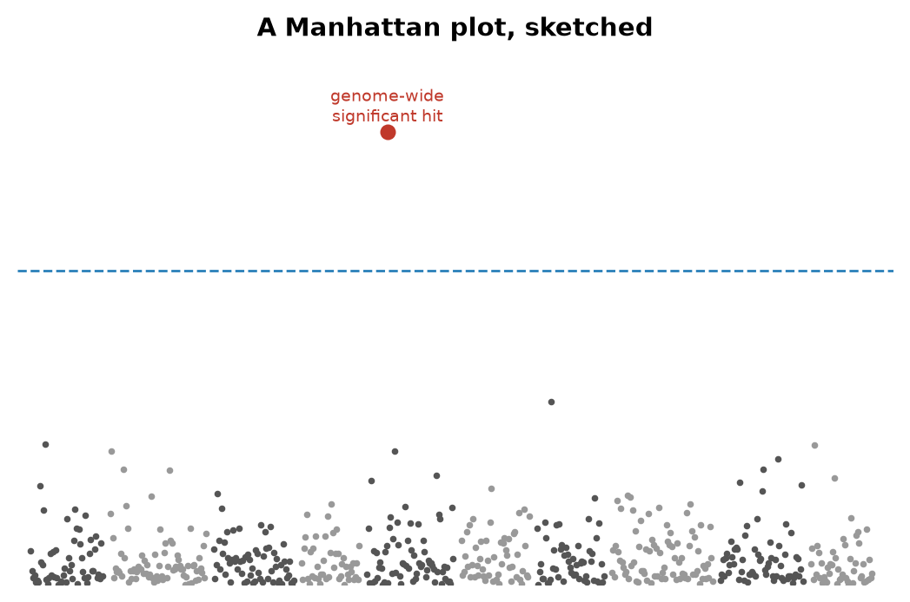

# PART IX — The Whole Book

## 36. Three Billion Letters, One Race

The East Room of the White House holds a couple of hundred people if the chairs are set close, and on the morning of Monday 26 June 2000 they were set close. On a screen at the front, Tony Blair sat in Downing Street on a satellite link. At the lectern stood Bill Clinton. On either side of him stood two men who had spent the previous two years trying to beat each other to the same finish line: Francis Collins, director of the public Human Genome Project, and Craig Venter, president of a private company called Celera Genomics. The occasion was the announcement that a "working draft" of the human genome existed. Two working drafts, in fact, one from each side, neither finished, neither yet published, each with the letters in roughly the right order and tens of thousands of gaps.

Clinton's speech reached for Thomas Jefferson and the map of the west that had once been unrolled in the same room, and it reached for God, and the phrase about learning the language in which God created life was in every newspaper the next morning. Collins spoke, then Venter. They shook hands. Reporters who had followed the story knew the handshake had been negotiated over several weeks, mostly in the kitchen of a Department of Energy official named Ari Patrinos, over pizza, because the two men could not be relied upon to be civil in an office. The genome was not done. But the race was declared a draw, which was the only result either government could live with.

Anna, who is invented, was 22 that summer and had other things on her mind. Her mother Ruth was 52. Theo would not be born for another eleven years, into a world where the reading of a human text was a hospital service rather than a national project. To see how that happened it helps to go back to the beginning, which was not 1998 and not the White House but a ski lodge in Utah.

---

In December 1984 the Department of Energy convened a meeting at Alta, Utah, on a narrow question: could DNA sequencing ever be good enough to measure the mutation rate in the children of Hiroshima and Nagasaki survivors? The answer was not yet, but the people in the room went home thinking about something larger. In May 1985 Robert Sinsheimer, the chancellor of the University of California at Santa Cruz, held a workshop on whether the whole human genome could be sequenced. In 1986 Renato Dulbecco, a Nobel laureate in cancer research, argued in *Science* that a cancer biologist would get further with the complete text than with one gene at a time, and Charles DeLisi at the Department of Energy began to push for a program. The DOE had a plausible claim to the job: it had the big computers, the national laboratories, and an abiding institutional interest in what radiation does to chromosomes.

Most biologists hated the idea. The objections were the ones any big project draws. It would cost billions that would otherwise fund small laboratories. It would be dull, industrial work, unfit for graduate students. And most of the text, everyone agreed, was junk, so why read it? A committee of the National Research Council answered these in February 1988 with a plan that was, in hindsight, the important document: map first, sequence later, develop the technology as you go, aim for fifteen years and about $200 million a year, and sequence the genomes of simpler organisms first. Three billion dollars, three billion letters, a dollar a letter. The arithmetic was easy to remember.

James Watson was appointed head of the new NIH (National Institutes of Health) genome office in 1988, and the project formally began on 1 October 1990 as a joint effort of the NIH and the DOE. Watson made one decision that outlasted him: he set aside 3 percent of the budget, later 5 percent, for research on the ethical, legal and social implications of what the project would find. He also alienated the new NIH director, Bernadine Healy, over whether brief fragments of genes could be patented. The disputed fragments came from a young NIH scientist named Craig Venter, who had found a fast way to fish out the expressed parts of genes and wanted to file on thousands of them. Watson thought the idea was foolish and said so in public, and in April 1992 he resigned. Venter left the NIH the same year to run a private institute in Maryland. Francis Collins, who had helped find the cystic fibrosis gene *CFTR* in 1989 and had helped identify the Huntington's gene in 1993, took over the public project in April 1993.

The public strategy was called hierarchical shotgun. First you built a map: genetic markers spaced along each chromosome, then a physical tiling of large cloned pieces, each about 150,000 letters long, carried in bacteria in units known as BACs, short for bacterial artificial chromosomes. Then you took each BAC, blew it into random fragments, read the fragments by Sanger's dideoxy method, the letter-by-letter reading technique from chapter 21, at 500 to 800 letters a read, and had a computer find the overlaps and stitch them together. Because you knew where each BAC sat on the map, the repeats that make up half the genome could not fool you into joining the wrong pieces. It was slow and it was careful. The genetic maps emerged from Paris and Boston in the early 1990s; the physical maps followed; by 1996 the sequencing had barely started and the project looked, to its critics, like a very expensive way to draw maps.

---

Two things changed the pace. The first was a meeting in Hamilton, Bermuda, in February 1996, convened by the Wellcome Trust, at which the heads of the main sequencing centres agreed that any assembled stretch of human sequence longer than a thousand letters would be released to the public within twenty-four hours, unpatented and free. The Bermuda Principles were partly idealism, and the idealism was real, especially in John Sulston, who ran the Sanger Centre near Cambridge and had spent years mapping every cell of a worm. They were also strategy. Sequence in a public database on Tuesday cannot be patented on Wednesday.

The second thing was Venter. In July 1995 his institute had published the complete genome of the bacterium *Haemophilus influenzae*, 1.83 million letters, the first genome of any free-living organism. He had done it by skipping the map entirely: shred the whole genome, read everything, let the computer assemble it. The NIH had declined to fund the attempt. On 9 May 1998 Venter and the instrument company Perkin-Elmer announced a new firm, Celera, that would apply the same whole-genome shotgun method to the human text with 300 of Perkin-Elmer's new capillary sequencers, machines that read DNA fragments as they crept through hair-thin glass tubes, and one of the largest civilian computers in the world. It would be done, Venter said, by 2001, for about $300 million, a tenth of the public budget. The company would release data, but on its own terms and its own schedule, and it would patent a few hundred genes along the way.

The public project's response, decided at a tense meeting at Cold Spring Harbor a week later, was to speed up. The Wellcome Trust doubled its commitment to the Sanger Centre, which would take a third of the genome. The rest was divided among Eric Lander's centre at the Whitehead Institute in Cambridge, Massachusetts, Robert Waterston's at Washington University in St Louis, Richard Gibbs's at Baylor in Houston, and the DOE's Joint Genome Institute in California. The goal became a rough draft by 2001 instead of a finished genome by 2005. In December 1999 the Sanger-led team published the first complete human chromosome, number 22, in *Nature*, 33.4 million letters. Chromosome 21 followed in May 2000. Celera, meanwhile, proved its method on a fruit fly, 120 million letters, published in March 2000 with Gerald Rubin's Berkeley group, and then turned the machines on a human sample.

Whose sample was a question nobody answered at the time. The public reference came mostly from one anonymous man in Buffalo, New York, whose DNA had been used to build the main BAC library; about two-thirds of the finished sequence is his. Celera said its sample was pooled from five donors of different ancestries. In 2002 Venter confirmed what many had suspected, that the Celera genome was largely his own.

On 14 March 2000 Clinton and Blair issued a joint statement saying that raw genome data should be freely available to scientists everywhere. It was meant as a principle. The stock market read it as a threat to every company with a genome business, and Celera's shares lost about a fifth of their value in a day. That, more than any scientific event, is what put the two sides in Patrinos's kitchen. The White House wanted a joint announcement, and by June it had one.

The two drafts were published side by side in February 2001: the public consortium's in *Nature* on 15 February, a 62-page paper with Lander as first author, and Celera's in *Science* the next day, with Venter as first author. Each covered about 90 percent of the gene-containing part of the genome. Each guessed at the gene count and, as the next chapter tells, guessed high. Celera's assembly had drawn on the public data, which was free for the taking; the public project could not use Celera's. *Science* let Celera keep its sequence on the company's own website, under conditions, rather than deposit it in GenBank, and Sulston and others said in print that this broke a rule that had held since the 1980s. I think they were right, and I also think it stopped mattering within a year, because the public sequence was there for anyone and the private one was not.

The finished text was announced on 14 April 2003, timed to the fiftieth anniversary of the 25 April 1953 paper, with Watson in the room. Finished meant 99 percent of the gene-rich sequence at an accuracy of one error in ten thousand letters, about 2.85 billion letters in all, with 341 gaps that the technology of the day could not close. The project came in two years early. The total spent by the United States was reported as about $2.7 billion, in 1991 dollars, against the $3 billion budget, which works out to a little under a dollar a letter. Celera, having found no way to sell a text that was free next door, moved into drug discovery, and Venter left it in 2002.

The human text was not the first genome, and the ones that came before it are why the human one was possible. The bacterium *Haemophilus influenzae*, 1.83 million letters, was Venter's proof in 1995 that a whole genome could be shredded and reassembled. Baker's yeast, *Saccharomyces cerevisiae*, about 12 million letters, was finished by an international consortium in 1996. The nematode *Caenorhabditis elegans*, about 100 million letters, was finished in 1998 by Sulston's group and Bob Waterston's, the first animal. The fruit fly followed in 2000, as Celera's dress rehearsal. Each of those was a parental set of a simpler creature, read end to end enough times to trust. None of them is 3.1 billion letters. The human number is the human reference, one set, and the cell that carries it still holds two.

What nobody could say at the ceremony, because nobody had had time to look, was what the text actually said.

## 37. What the Genome Turned Out to Say

In May 2000, at the bar of the annual genome meeting at Cold Spring Harbor Laboratory on Long Island, a young British bioinformatician named Ewan Birney started a sweepstake. The question was how many genes the human genome would turn out to contain. A bet cost one dollar that year, five dollars in 2001, and twenty dollars in 2002, on the reasoning that the answer was getting easier to guess. The guesses, several hundred of them, ran from a little under 26,000 to well over 150,000. The prize was the pot plus a signed copy of *The Double Helix*.

The high guesses were not foolish. In 1990, when the project was being sold to Congress, Walter Gilbert had done the arithmetic on a napkin: three billion letters, a typical gene perhaps 30,000 letters in length, so about 100,000 genes. Through the 1990s companies that fished out gene fragments announced ever higher counts, 120,000 from one, 140,000 from another, and each number was in someone's business plan. Humans were obviously complicated. Complicated things, it was assumed, needed many parts.

The two draft papers of February 2001 said 30,000 to 40,000 and 26,000 to 38,000. The finished-sequence paper of October 2004 said 20,000 to 25,000. Birney paid out in 2003 to Lee Rowen of the Institute for Systems Biology in Seattle, whose guess of 25,947 had been the lowest in the book. Today the standard catalogue lists a little under 20,000 protein-coding genes, and the count still moves by a few dozen a year as marginal cases are argued in and out. A roundworm the length of an eyelash, sequenced in 1998, has about the same number. A fruit fly has about 14,000. Rice has around 40,000, and a water flea about 31,000. Whatever makes a person more complicated than a worm, it is not the size of the parts list.

---

The answer, as far as there is one, is in how the parts are used. About 1.5 percent of the text codes for protein. The rest is introns, regulatory sequence, repeats, and stretches whose function, if any, is still argued over. A single human gene is typically read in several different ways, with exons, the segments of a gene that end up in the finished message, left in or spliced out, so that 20,000 genes make perhaps 100,000 distinct proteins; measurements in 2008 found that about 95 percent of genes with more than one exon are spliced in more than one pattern. The switches that control when and where a gene is read take up more of the text than the genes do. A worm and a person have roughly the same vocabulary. They differ in the grammar.

The drafts also showed how uneven the text is. Genes cluster on some chromosomes and thin out on others; chromosome 19 is dense with them, chromosomes 13 and 18 are sparse, and there are deserts of a million letters or more with no gene at all. More than half the genome is repeated sequence of one kind or another. A single family of short repeats called Alu, about 300 letters in length, is present in over a million copies and accounts for about a tenth of the text. The 2001 *Nature* paper also claimed that 223 human genes had been acquired directly from bacteria, which would have been a remarkable finding, and within three months a group led by Steven Salzberg showed that most of these were better explained by ordinary descent and loss in other lineages. I mention it because it is the right way to hold any first reading of a big dataset: some of it will be wrong, and the fix comes from the same data read more carefully.

Then there were the numbers that became slogans. Any two people, it was said, are 99.9 percent identical. Humans and chimpanzees are 98.8 percent identical. Both figures are true and both need a footnote in the sentence. The 99.9 counts single letters: at about one position in a thousand, two unrelated people's letters will disagree, which across 3.1 billion letters is roughly three million differences. The 1000 Genomes Project, reporting on 2,504 people in October 2015, reported that a typical genome differs from the reference at four to five million sites. Most of those are single letters. But a few thousand are structural, a chunk deleted here, a chunk duplicated there, and because each chunk can be thousands of letters long, the structural differences involve more total letters than the single-letter ones. Count by letters involved rather than by sites and two people are a bit over 99 percent alike, not 99.9. Neither number is more honest than the other. They are counting distinct things.

The same applies to the chimpanzee. Its genome was published in *Nature* on 1 September 2005, from a male named Clint at the Yerkes primate centre in Atlanta. Where the two genomes line up letter for letter, they differ at 1.23 percent of positions, which is the source of the 98.8. Add the insertions and deletions and the figure drops to about 96 percent. Add the pieces that do not line up at all, which the complete ape genomes finished in 2025 made visible for the first time, and the gap grows again. About 35 million single-letter differences and five million small insertions and deletions separate a person from a chimpanzee, and a mostly unread set of larger rearrangements sits on top. That 98.8 percent is settled. What it means for the question people actually ask, which is what makes us different, is not.

Anna's genome, set beside that of a stranger from the other side of the world, differs at three or four million positions. Set beside her mother Ruth's, it differs at fewer, though not as few as one might think, because half of Anna's letters came from her father, and it differs at about sixty positions from both her parents together, the new mutations she was born with. Theo, in turn, carries about sixty of his own. This is the whole of inheritance in one arithmetic: nearly all the same, a few million altered, a few dozen new.

---

The word "finished" in April 2003 covered about 92 percent of the genome. The missing 8 percent was not scattered. It was concentrated in the places that Sanger reads of 800 letters, and later Illumina reads of 150, could not cross: the centromeres, where each chromosome carries an array of near-identical 171-letter repeats running to millions of letters; the short arms of chromosomes 13, 14, 15, 21 and 22, which hold hundreds of copies of the genes for ribosomal RNA; and large segmental duplications, blocks of 100,000 letters or more copied almost perfectly to two or three places in the genome. A read of 800 letters that falls entirely inside a repeat tells you nothing about where it belongs. For nineteen years these regions sat in the reference as runs of the letter N.

What closed them was reads long enough to span the repeats. Oxford Nanopore's pores could by 2020 read single molecules of 100,000 letters and more, and Pacific Biosciences' HiFi method produced reads of about 20,000 letters at an accuracy of 99.9 percent. A consortium named Telomere-to-Telomere, led by Karen Miga at Santa Cruz and Adam Phillippy at the NIH, used both on a cell line called CHM13. The line derived from a complete hydatidiform mole, an abnormal pregnancy in which an egg that had lost its own nucleus was fertilised by a sperm whose genome then doubled. Every chromosome in it is therefore present in two identical copies, which removes the assembler's hardest problem, telling two similar parents' chromosomes apart. On 31 March 2022 the consortium published in *Science* the first truly complete human genome: 3,054,815,472 letters of nuclear DNA, every chromosome read from one end to the other without a gap, about 200 million letters that had never been seen, and predictions of roughly 2,000 new genes, of which perhaps a hundred code for protein. The same paper adds the mitochondrial genome, 16,569 letters, and the sum, 3,054,832,041, is the one-parental-set total used in chapter 5. The mole had no Y chromosome. The Y, half of which had never been read because it is mostly repeats, was completed from a different donor and published in *Nature* in August 2023: 62,460,029 letters, more than 30 million of them new.

That is a complete genome. It is still one genome, and one is a strange sample size for a species. The reference that hospitals and researchers align their reads against, known as GRCh38 and issued in December 2013, is a mosaic assembled mostly from the Buffalo donor of the 1990s, and it is neither an average person nor a healthy one. At something like two million positions it carries the rarer of the two common letters, and at a few thousand it carries a variant associated with disease. Anyone whose ancestry is far from the donor's will find that some of their sequence has nowhere to align, and the software will call it error.

The answer that began in May 2023 is known as a pangenome. The Human Pangenome Reference Consortium published in *Nature* on 10 May 2023 the complete or nearly complete genomes of 47 people of diverse ancestry, both chromosomes of each resolved separately, so 94 assemblies in all. Laid over one another they added 119 million letters not present in GRCh38 and about 1,100 extra gene copies. Instead of a single line of text, the reference becomes a graph, a main road with every known alternative route drawn in, and a new genome is aligned to whichever route it matches. The consortium's stated target is 350 people. I think this is the right idea and that the 47 is where it shows most clearly, since the number of people whose complete genome had ever been read before 2023 was, in effect, one.

For Anna, the practical difference is what the software does with a read that does not match the old line. On GRCh38 a stretch of her sequence that lives only in a version of a region the Buffalo donor did not carry is called a failure, or is quietly dropped. On a pangenome graph the same stretch can land on an alternate path and be counted as hers. The 3.1 billion letter reference is still the right length for one set. It is no longer the right shape for every set. Two people can both have about 6.2 billion letters in each nucleus and still not be alignable, letter for letter, to one mosaic from the 1990s.

The slogan people learned was three billion letters, sometimes 3.2 billion. The finished count for one parental set, mitochondrion included, is 3,054,832,041, and a nucleus holds about twice that. The extra letters that appeared in 2022 were not a new species. They were the repeats the older machines could not place, left for nineteen years as the letter N. A book that says three billion is rounding. A book that puts 3.1 billion letters into forty-six threads two metres long is mixing one set with two. Chapter 5 kept those apart. This chapter is why the printed number moved at all.

There is a reasonable objection to all of this, which is that a reference, however carefully drawn, tells you what the text is and not what it does. To learn what a variant means, you cannot read one genome or fifty. You have to read half a million and ask each one how its owner is doing.

## 38. Biobanks and the Million

Between 2006 and 2010, in twenty-two temporary assessment centres in shopping precincts and hospital annexes across England, Scotland and Wales, about half a million people did the same thing. They had received a letter, because they were registered with the National Health Service and were between 40 and 69 years old and lived within reach of a centre. About nine million letters were sent. Roughly one in twenty of the people who received one turned up. Each spent about ninety minutes answering a touchscreen questionnaire about diet, smoking, work, and mood, had their height, weight, blood pressure, grip strength, lung function and bone density measured, and gave blood, urine and saliva. Then they signed a consent form allowing the project to follow their medical records for the rest of their lives, and went home. Most were told nothing about themselves that they did not already know.

The project was named UK Biobank. It had been planned since the late 1990s, was funded by the Wellcome Trust and the Medical Research Council, and was run from a building in Stockport, near Manchester, by an Oxford epidemiologist named Rory Collins. Its samples were stored in freezers at minus 80 degrees and tanks of liquid nitrogen, in millions of small tubes handled by robots. The final count was 502,000 participants. They were not a cross-section of Britain; comparison with census data later showed them to be healthier, wealthier, and less likely to smoke than average, which is what happens when you rely on volunteers. The organisers knew this and decided it did not matter for the questions they wanted to ask, which were about what differs between people who develop a disease and people who do not, rather than about how common the disease is.

What made the collection worth more each year was the layers added on top. In 2017 every participant was genotyped, meaning checked at chosen points across the text rather than read letter by letter, on a chip of about 820,000 markers, from which about 90 million positions could be inferred. The inference is a best guess about letters the chip never read, and it fails where that person's copy broke the neighbourhood the reference expected. The copy is never exact, which is why the later whole genomes were read letter by letter. Between 2019 and 2022 the protein-coding parts of every genome were sequenced. A hundred thousand participants have been through an MRI scanner for brain, heart and body; a hundred thousand wore a wrist accelerometer for a week. And on 30 November 2023 the project released whole genomes for about 490,000 of them, the largest such dataset in the world, paid for with £200 million from Wellcome, the UK research councils and four drug companies, and read in Reykjavik and at the Sanger Institute near Cambridge. Any bona fide researcher anywhere may apply to use the data, for a fee, and by 2024 more than 30,000 had. The participants get nothing back individually. That was the deal, and I think it was the right one, because a return-of-results promise struck in 2006 would have been a promise about a science that did not yet exist.

---

The United States chose the other deal. The Precision Medicine Initiative, announced by Barack Obama in January 2015, became the NIH's All of Us programme, which opened enrolment on 6 May 2018 with a target of one million people and an explicit aim that most of them should come from groups that medical research had historically ignored. By 2025 more than 800,000 had joined. In February 2024 the programme published its first large release, about 245,000 whole genomes, of which roughly three-quarters came from people in underrepresented groups and close to half from people of non-European ancestry; the release reported some 275 million variants not previously catalogued. All of Us returns results. A participant can learn whether they carry one of a list of variants for hereditary disease, and how their genome predicts their response to a set of common drugs.

Other countries got there first or bigger, and the first of them was small enough to count. In Reykjavik in 1996 Kári Stefánsson founded deCODE and began asking Icelanders, a country whose family trees were already written down, to put their DNA next to those trees. The project enrolled about half the adult population, and everyone else copied the idea at their own scale. The China Kadoorie Biobank recruited 512,000 adults between 2004 and 2008. Estonia's biobank holds about a fifth of its adult population. FinnGen, from 2017, links half a million Finns to a national health register. The Million Veteran Program of the US Department of Veterans Affairs, started in 2011, passed a million enrollees in 2023. Genomics England's 100,000 Genomes Project, which ran from 2013 to 2018, sequenced patients with rare diseases and cancers rather than healthy volunteers, and found a diagnosis for about a quarter of the rare-disease families who had gone years without one.

What all of these are for is a method that was invented, in its usable form, in 2005.

Before then, the search for the genetics of common disease had been a graveyard. Linkage, which had identified *CFTR* and the Huntington's gene by tracking a marker through affected families, works when one gene of large effect is responsible. It turned up almost nothing for diabetes, heart disease, or schizophrenia, because those are not diseases of one gene. The alternative, picking a plausible candidate gene and testing whether a variant in it was commoner in patients, produced thousands of papers in the 1990s, most of which failed to replicate. Neil Risch and Kathleen Merikangas had argued in *Science* in 1996 that the answer was association rather than linkage: compare hundreds of thousands of common variants across the whole genome in thousands of cases and controls, with no prior guess about which genes matter. In 1996 that was not possible. By 2005 the HapMap project had catalogued about a million common variants in 269 people from four populations, and chips could read hundreds of thousands of them at once.

The first genome-wide association study, published in *Science* in April 2005 by Josephine Hoh, Robert Klein and colleagues at Rockefeller and Yale, was small by later standards: 96 patients with age-related macular degeneration, 50 controls, about 100,000 markers. One variant stood out, a single-letter change in the gene *CFH*, which encodes complement factor H, a brake on part of the immune system. People with two copies of the risk letter had several times the usual chance of the disease. Nobody had guessed *CFH*. That was the point. Two years later, in June 2007, the Wellcome Trust Case Control Consortium published in *Nature* a study of 14,000 patients with seven common diseases against 3,000 shared controls, at 500,000 markers each, and turned up 24 solid associations in one go, most of them in genes nobody had suspected.

The picture that emerged from these studies has a name. Lay the chromosomes end to end along a horizontal axis, and for each marker plot how unlikely its association with the disease would be if there were no real link, on a logarithmic scale, where each step up means the chance is ten times smaller, so that the more improbable the chance, the higher the point. Most of the hundreds of thousands of points lie in a low band near the floor. A real association stands up as a tower of points, because neighbouring markers travel together through the generations. The result looks like a skyline, and it has been called a Manhattan plot since the 2007 papers. The threshold for calling a tower real, a probability of five in a hundred million, comes from asking a million questions at once and refusing to be fooled by the one in twenty that would pass at ordinary standards by luck.

---

By 2024 the public catalogue of such studies listed more than 6,000 papers and several hundred thousand associations. Two lessons emerged from them that are now settled. The first is that common diseases involve hundreds or thousands of variants, each of modest effect; a typical one raises the odds by 5 or 10 percent, not by half. The second is that most of these variants lie not in genes but in the switches between them, which is why the 98.5 percent of the text that does not code for protein turned out to matter.

The natural next step was to add the small effects up. A polygenic risk score takes every variant with a measured effect, weights it, and sums across a person's genome to give one number. In August 2018 a team led by Sekar Kathiresan and Amit Khera published in *Nature Genetics* a score for coronary artery disease built from 6.6 million variants and tested in UK Biobank; the 8 percent of people with the highest scores had about three times the average risk, which is roughly the risk conferred by the single-gene condition familial hypercholesterolaemia, an inherited condition that leaves LDL cholesterol, the form that clogs arteries, dangerously high from birth, a condition doctors already screen for. Scores for breast cancer, type 2 diabetes, atrial fibrillation and others followed. Suppose Anna's score for type 2 diabetes sits at the 90th percentile, meaning her number is higher than 90 out of every 100 people tested. That tells her that people with scores like hers develop the disease perhaps one and a half times as often as the average; it does not tell her that she will, and a change in her weight would move her real risk more than any letter in the score. I would call polygenic scores a working tool, useful at the extremes and nearly useless in the middle, where most people are.

They have a harder problem than that. In 2019 Alicia Martin and colleagues counted who had been in the studies the scores were built from: about 79 percent of participants were of European ancestry, though Europeans are about 16 percent of the world, and people of African ancestry were about 2 percent. A score built in one population loses accuracy in another, because the markers on the chip are only proxies for the causal variants, and the proxies travel with different partners depending on the population. Martin's group found that scores performed about four and a half times worse in people of African ancestry than in Europeans. The height score from the 2022 study of 5.4 million people explains about 40 percent of the variation in height among Europeans and only 10 to 20 percent elsewhere. Every clinic that adopts a score built on UK Biobank inherits UK Biobank's sample. If Anna's father's family had come from Lagos rather than Leeds, the same number on the same web page would mean less, and the page would not say so.

Set against that, what a million genomes finds is real. It finds rare people whose genomes contain a natural experiment: in 2005 and 2006 Helen Hobbs and Jonathan Cohen in Dallas identified African Americans carrying a broken copy of *PCSK9* who had 28 percent lower LDL cholesterol and, over fifteen years, 88 percent less coronary disease, and by 2015 two drugs that block the PCSK9 protein were on the market. It finds which correlations are causal: variants that raise HDL cholesterol, the so-called protective form, do not lower heart disease, as a 2012 study in *The Lancet* showed, which is why the drugs that raised HDL failed. And it tells drug companies where to bet. Drug targets with genetic support have been shown, in several analyses since 2015, to be about twice as likely to reach approval as targets without it.

What it cannot do is also plain. It cannot see the environment except through the crude proxies of a questionnaire. It cannot correct for the fact that the people in it chose to be in it. And it cannot turn a probability into a prediction; a score that doubles a 5 percent risk has still left the person with a 90 percent chance of being fine. I think biobanks are the least glamorous and the most useful thing genetics has done since 1953, and I think the thing to remember about them is what they are made of. Half a million genomes are half a million slightly varied copies of one text, each produced by the same machinery, none of them exact, and when the tube Anna posted in the prologue comes back as a web page, everything it says will have been learned by reading the differences.
