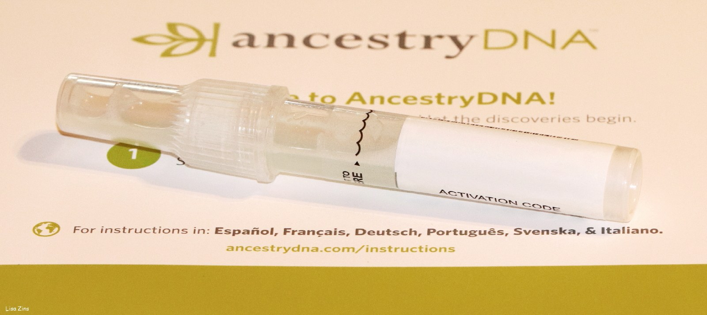
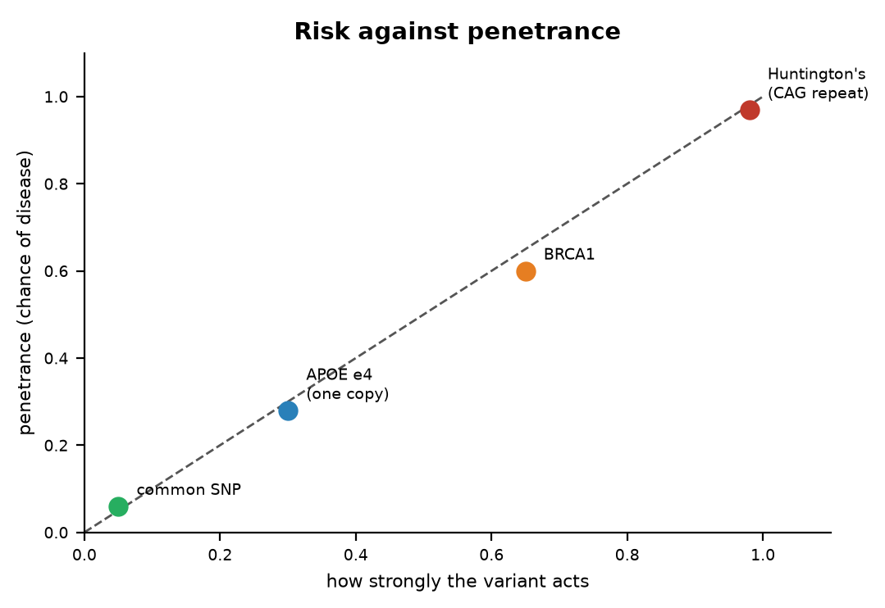
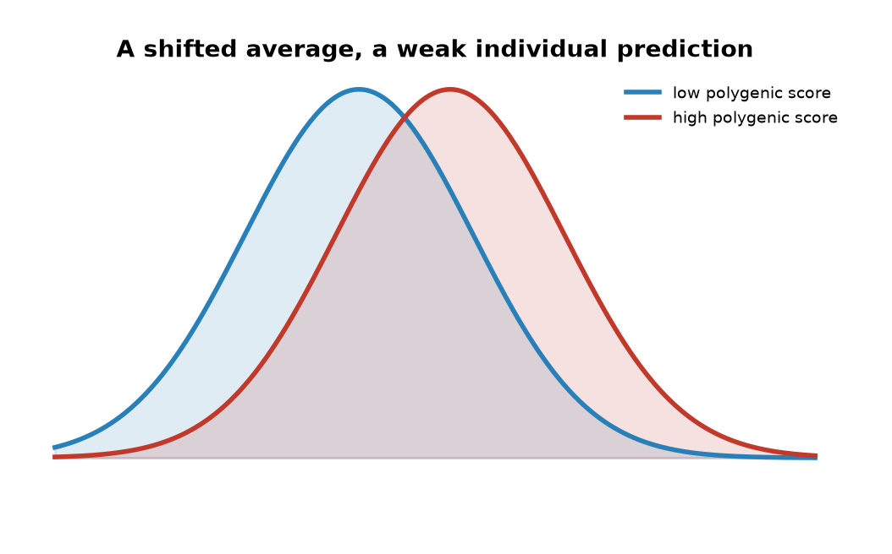

# PART X — Reading Your Own

## 39. The Spit Kit

Six weeks after the mailbox, on a weekday evening, the three of them are at Anna's kitchen table. Ruth has come the twenty minutes from her house. Theo is fifteen and wants to know whether he is descended from anyone interesting. Anna has the laptop open between the plates. All three are invented. The page on the screen is not.

The page has tabs. One is called Ancestry, and shows a map with coloured regions and percentages to one decimal place. Another is named Health, and lists reports with careful names. A third is labelled DNA Relatives, and contains a list of strangers sorted by how much of Anna's text they share, and at the top of the list is a woman in Ohio whom the page calls a second cousin. The tube has come back as a set of probabilities. The first thing to understand is what was measured to produce them, and the second is who did the measuring, because the company's own history is a fair summary of what this kind of reading is worth.

The company was founded in April 2006 in Mountain View, California, by Anne Wojcicki, Linda Avey and Paul Cusenza. Its name is a joke about the 23 pairs of chromosomes in each of your cells. It launched its service in November 2007 at $999, and Time magazine named the retail DNA test its invention of the year for 2008. The price fell to $399 in 2008 and to $99 in December 2012. By then the company had several hundred thousand customers and an ambition that went beyond ancestry maps. Wojcicki said openly that the point was a research database, and the customers who ticked a consent box, about 80 percent of them, became research subjects who had paid for the privilege.

On 22 November 2013 the US Food and Drug Administration sent the company a warning letter. The Personal Genome Service, it said, was a medical device being sold without clearance, the company had stopped answering the agency's questions, and it should stop marketing health reports. The company complied. For about two years it sold ancestry and raw data only. Then it returned one test at a time. A carrier report for Bloom syndrome was authorised in February 2015. In April 2017 the FDA allowed the first direct-to-consumer genetic health risk reports it had ever permitted, for ten conditions, including late-onset Alzheimer's disease and Parkinson's disease. In March 2018 the company was allowed to report three variants in *BRCA1* and *BRCA2*, the ones common in Ashkenazi Jewish families, with a warning that a negative result said almost nothing about the thousands of other harmful variants in those two genes.

In July 2018 GlaxoSmithKline invested $300 million and signed a four-year drug-discovery collaboration in which the database was the asset. In June 2021 the company listed publicly by merging with a blank-cheque company backed by Richard Branson, at a valuation of about $3.5 billion. Within two years the shares had lost most of their value, for a reason no test kit could fix: a customer buys one once.

---

In October 2023 the company disclosed a breach. Attackers had used passwords leaked from other websites to log into about 14,000 accounts, and from those, through the DNA Relatives feature, had scraped profile data for about 6.9 million users: names, birth years, ancestry estimates, and lists of matches. Lists of users with Ashkenazi Jewish or Chinese ancestry were offered for sale. The company agreed in 2024 to a class-action settlement reported as $30 million.

On 23 March 2025 it filed for Chapter 11 bankruptcy protection in a court in Missouri, and Wojcicki resigned as chief executive the same day. Attorneys general in several states advised customers to delete their data while they could. The drug company Regeneron won the first auction in May 2025 with a bid of $256 million. Then Wojcicki's nonprofit, the TTAM Research Institute, returned with a bid of $305 million, the court approved the sale at the end of June, and the deal closed in July 2025. By then roughly 15 million people had sent in a tube. The samples went from a private company, through a bankruptcy court, to a nonprofit run by the same woman who had founded the company, and the customers were spectators throughout.

So that is the company. Now the measurement. The laboratory did not read Anna's genome. It ran her DNA over a genotyping chip, a glass slide carrying hundreds of thousands of short probes, each designed to catch one position in the text where people are already known to differ. The chip the company has used since 2017 checks somewhere around 640,000 positions. That is about 0.02 percent of the 3.1 billion letters of one parental set. At each of those positions it reports which of two known letters Anna has, and because she has two copies it can report that she has one of each, or two the same. It cannot find a spelling mistake that nobody has catalogued, because no probe was built to look for it. It also does not read the second copy as a separate 3.1 billion letter book. It samples both copies at the positions it was built to see.

The chemistry is hybridisation, which is base pairing done on a glass slide. Each probe is a short stretch of single-stranded DNA glued to a spot. Anna's DNA, broken into fragments and tagged with a dye, is washed over the slide. Where her letters match a probe, they stick, by the same A-with-T and G-with-C rule as in the helix, and the spot lights up. Where they do not match, they wash off. The machine is not reading a sentence. It is asking, at hundreds of thousands of addresses, which of two prewritten words is in her text. That is why the price could fall to $99, and why a variant the catalogues have never seen is invisible to it. A nucleus still holds about 6.2 billion letters. The slide looks at a few hundred thousand of the addresses in one set.

The nearest analogy is checking a book by looking only at the places where different printings are known to disagree. If a new misprint has crept into your copy on page 412, the check will not find it. Whole-genome sequencing, the reading that costs a few hundred dollars in 2025 and was the subject of Part IX, reads every page. A chip is cheaper and faster and was, in 2007, the only thing that could be sold for $999. A great deal of what is in the 640,000 can be stretched further by statistics, because letters that sit close together on a chromosome travel together through the generations, a fact Sturtevant used to draw the first map in 1913. From the measured positions, software can guess millions of unmeasured ones with fair confidence. Guess is the right word.

The Ancestry tab is built on the chip result in a way that the decimals do not advertise. The software chops Anna's chromosomes into windows and compares each window to reference panels: sets of present-day people whose four grandparents all came from the same place. Each window is assigned to the population it most resembles, and the windows are added up. The percentages are therefore a statement of resemblance to living people in a reference set, not a record of where Anna's ancestors stood in the year 1700. When the company updates its reference panels, which it does every few years, the percentages move. Customers who had 4 percent Scandinavian ancestry in one version and none in the next had not lost any ancestors. The panel had changed.

Two more things follow that surprise people. Full siblings receive unequal percentages, because each inherited a separate half of each parent, as Chapter 11 described. And Theo, when he eventually mails a tube of his own, will show numbers that are not the average of his parents' numbers. The shuffle in meiosis does not deal fair halves of every region.

---

The DNA Relatives tab is the most reliable part of the page, because it does not depend on any reference panel. It depends on segments. Two people who share an ancestor share stretches of text inherited whole from that ancestor, and the software finds those stretches by looking for long runs where the two chips agree. The length is measured in centimorgans, the unit for shared genetic material that Sturtevant defined in chapter 18. A parent and child share about 3,400 centimorgans, which is half the text. Full siblings share about 2,600 on average. First cousins share about 850, which is 12.5 percent. Second cousins share about 3 percent, a bit over 200 centimorgans. The woman in Ohio shares 213 centimorgans with Anna in nine segments, and the label is right: she is a second cousin, or something equivalent, such as a first cousin's grandchild.

The method thins out fast. Third cousins share under one percent, and some third cousins share no detectable segment at all, because segments are passed on whole or not at all, and after enough generations a given ancestor's contribution can drop out of a line entirely. Beyond the fourth cousin the list is mostly noise, and the site says so.

Close relatives are not noise. A match of 50 percent is a parent or a child, and a match of 25 percent is a grandparent, a half-sibling, or an aunt. These numbers do not care what a family has said about itself, and every year they contradict some families. The industry term is "not parent expected." Historical studies of misattributed paternity in Western Europe, using surnames and Y chromosomes, put the rate at about one percent per generation. Over the millions of people who have tested, that is a great many surprised adults. Donor-conceived children have found donors who were promised anonymity in the 1980s, and half-siblings by the dozen. In Indiana a fertility doctor named Donald Cline was discovered, from 2016 onward, to have used his own sperm for patients decades earlier; consumer tests identified more than 90 of his children, and the state passed a law against fertility fraud in 2019. The chip reads what is there.

The page also offers a download, a text file of the roughly 640,000 calls, and a great many customers take it and upload it somewhere else: a genealogy site, a health interpreter, a research project. The file is not a genome. It is a list of addresses and the letter found at each, and anyone who holds the list can ask new questions of it without mailing another tube. That is why the 2023 breach mattered beyond the names. A stolen relatives list is a family tree. A stolen genotype file is a permanent sample.

A clinical genome, the kind Part IX described, would have shown Anna things this page cannot. It would have read both parental sets, about 6.2 billion letters, including spellings no catalogue has named, and it would have cost a few hundred dollars in 2025 rather than $99. The spit kit's advantage was never completeness. It was that a person could buy it without a doctor, and that millions did. The health reports on the page are a curated subset of the chip, written to a regulatory standard, and they leave out most of what the raw file contains. Ancestry percentages will move when the reference panels are updated. The Ohio cousin will not. She is in the segments, and the segments do not depend on a company's map of the world.

Which brings the table back to the Health tab. Anna has two results the prologue promised her. One says she carries a variant near the *LCT* gene, the one at position 13910 in a neighbouring gene called *MCM6*, about fourteen thousand base pairs upstream, that keeps lactase switched on in adults. That is why she drinks milk. She got the variant from her father. Ruth does not have it, and never could finish a glass. Theo has Anna's copy, so he can. One copy is enough, because this trait is dominant.

The other result says she has one copy of a variant that raises her chance of a certain disease, by a factor the page states carefully and with a footnote. Theo treats the factor as a fortune. Ruth's objection is the one the page itself supports. The slide looked at about 0.02 percent of one parental set and is offering the rest as a story. Anna reads the footnote again. The chip cannot tell them whether the variant will act, or how tall Theo will end up, or what chance will do after birth. They do not agree, and they are all looking at the same page. That argument is the next two chapters.

## 40. What a Genome Can Tell You

On 14 May 2013 the New York Times printed an opinion piece by Angelina Jolie under the title "My Medical Choice." Her mother had died of ovarian cancer at 56. Jolie had been tested and carried a harmful variant in *BRCA1*; her doctors, she wrote, had put her lifetime risk of breast cancer at 87 percent and of ovarian cancer at 50 percent. She had just completed a preventive double mastectomy. Two years later she wrote again, about having her ovaries and fallopian tubes removed. In the months after the first piece, referrals to family-history clinics in Britain roughly doubled, an effect reported in 2014 and still known, in the literature, as the Angelina effect.

Behind the op-ed is one of the cleanest stories in human genetics, and it starts with a woman who spent seventeen years being told she was wasting her time. Mary-Claire King, then at Berkeley, collected families in which breast cancer struck early and often, and looked for a stretch of chromosome that travelled with the disease. In December 1990 her group reported in *Science* that such a stretch existed, on the long arm of chromosome 17. This was the demonstration that a common cancer could have a single-gene hereditary form. The race to find the gene itself was won in October 1994 by Myriad Genetics, a company founded in Salt Lake City in 1991 by Mark Skolnick and colleagues from the University of Utah. *BRCA2*, on chromosome 13, was identified in December 1995 by Michael Stratton's group in London.

Myriad patented both genes and the test for them. By 2013 its BRACAnalysis cost about $3,000 to $4,000, and no other American laboratory was allowed to offer a full test. In *Association for Molecular Pathology v. Myriad Genetics*, decided 13 June 2013, one month after Jolie's op-ed, the US Supreme Court ruled unanimously that a naturally occurring segment of DNA is a product of nature and cannot be patented merely because it has been isolated. Laboratory-made complementary DNA, it said, can be. Within days other laboratories were offering *BRCA* tests at a fraction of the price. The genes, in the words the court used, were not invented by anyone.

What the genes do is repair. The BRCA1 and BRCA2 proteins are part of the machinery that mends double-strand breaks in DNA by homologous recombination, the accurate route described in Chapter 25. A woman born with one broken copy has a working copy in every cell, and she is fine until, in some cell in the breast or ovary, the working copy is lost by a mutation of the kind Chapter 10 catalogued. That cell then repairs badly, mutates faster, and is on the road to cancer. This is Alfred Knudson's two-hit idea of 1971, and it explains why a dominant cancer syndrome works through a recessive mechanism inside the cell.

The numbers are settled. A 2017 study in *JAMA* that followed nearly 10,000 carriers reported that women with a harmful *BRCA1* variant had a 72 percent chance of breast cancer by age 80, and a 44 percent chance of ovarian cancer; for *BRCA2* the figures were 69 percent and 17 percent. The general population figure for breast cancer is about 12 to 13 percent. Around one woman in 300 to 400 carries such a variant; in Ashkenazi Jewish populations it is about one in 40, because three particular variants became common in a small founding population, and these three are the ones the spit kit is allowed to report. Men who carry *BRCA2* variants have raised risks of prostate and male breast cancer, and pass the variant to half their children.

The word for a 72 percent chance is penetrance: the fraction of people carrying a variant who go on to have the condition. It is the single most useful number on any genetic report and the one most often missing.

---

Here is how the question travels through a family, using the invented one. Suppose Ruth's sister had breast cancer at 48. That is early, and it is the kind of history that gets a clinic's attention. The right first test is the sister's, because if she does not carry a *BRCA* variant the family's concern mostly dissolves. If she does, Ruth has a 50 percent chance of carrying it, since sisters share one copy of each chromosome from each parent on average. If Ruth carries it, Anna has a 50 percent chance, and if Anna does, Theo has a 50 percent chance. Ruth is 78 and has lived through most of the years in which the risk falls, so a result would say more about Anna than about her. Anna's spit kit reported that she does not carry the three Ashkenazi variants, which in a family with no Ashkenazi ancestry is true and useless. A clinical test sequences both genes in full. This chain, with the affected relative tested first and the rest tested in cascade, is how the clinics actually work.

Huntington's disease is the other end of the chart, where penetrance is nearly complete. James Gusella's group had placed the gene on chromosome 4 in 1983, using blood from very large families around Lake Maracaibo in Venezuela that Nancy Wexler had spent years collecting. The gene itself took a further ten years and six laboratories, and was published in *Cell* on 26 March 1993. It is called *HTT*, and the mutation is a stutter: the three letters CAG, repeated. Fewer than 27 repeats is normal. Forty or more, and the disease will come if you live long enough, usually beginning in the thirties or forties, sooner for longer repeats. Between 36 and 39 it may or may not. The repeat tends to lengthen when passed through fathers, so the disease can arrive earlier in each generation, a pattern known as anticipation.

A predictive test has existed since 1993, and one based on linked markers since 1986. Most people at 50 percent risk choose not to take it; studies of uptake in the countries that offer it put the figure at roughly 10 to 20 percent. There is no treatment that changes the course. Wexler, whose mother died of the disease and who led the hunt for the gene, said publicly in 2020 that she has it herself. The text, in this one case, reads like a sentence, and most people who could read it decline.

*APOE* sits between the two. In 1993 Allen Roses's group at Duke reported that one common form of the gene, known as ε4, was over-represented in people with late-onset Alzheimer's disease. The gene comes in three common forms, ε2, ε3 and ε4, and about a quarter of people of European ancestry carry at least one ε4; two or three percent carry two. One copy raises the risk of Alzheimer's roughly threefold. Two copies raise it roughly eight to twelvefold, though the effect is smaller in people of African ancestry and larger in East Asians. And still it is not a sentence. Many people with two copies die old and clear-headed, and most people with Alzheimer's have no ε4 at all. A 2024 paper in *Nature Medicine* argued that carriers of two copies almost all show the disease's biomarkers by their sixties and should be regarded as having a genetic form of it; that reading is contested, and I would call it working. What changed in 2023 is that the result became actionable: the antibody drugs lecanemab and donanemab cause brain swelling more often in ε4 carriers, so the label now advises testing before treatment.

---

The most immediately practical reports on any genome concern drugs, and this is a settled corner of the subject. Clopidogrel, sold as Plavix and given to millions after a stent, is a prodrug: it does nothing until an enzyme, CYP2C19, converts it. People with two loss-of-function copies of *CYP2C19* make little active drug and get little protection, which is why the FDA put a boxed warning on the label in March 2010. About two percent of Europeans are poor metabolisers by this measure, and about 13 to 15 percent of East Asians. The HIV drug abacavir causes a dangerous hypersensitivity reaction in people who carry the *HLA-B\*57:01* allele, one inherited variant of that gene, present in about five to eight percent of Europeans; a trial published in the *New England Journal of Medicine* in 2008 showed that screening before prescribing eliminated the confirmed reactions, and testing is now standard everywhere the drug is used. Warfarin is the old blood thinner with the narrow safe dose, and variants in *CYP2C9* and *VKORC1* account for about a third of the difference in dose between one patient and another; the label has carried a dosing table since 2010, though trials of genotype-guided dosing have given mixed results.

The list goes on. *TPMT* and the thiopurine drugs used for leukaemia and Crohn's disease; *DPYD* and the chemotherapy fluorouracil, where a poor metaboliser can die of a standard dose, and where European regulators recommended testing in 2020; *HLA-B\*15:02* and the epilepsy drug carbamazepine in people of Han Chinese and Southeast Asian ancestry, on the label since 2007. A consortium of clinicians has published dosing guidelines for these pairs since 2009. If Theo is prescribed any of these drugs one day, the useful thing would be for his genotype to already be in the chart. The science is done; the implementation, in most hospitals, is not.

Two more reports belong on the list, both about the beginning of life. Carrier screening asks whether a healthy adult carries one copy of a recessive variant that would matter if their partner carried one too. It began with Tay-Sachs disease in 1971, in Ashkenazi communities in Baltimore and Washington, and the disease has since almost vanished in those communities, partly through an anonymous matching scheme called Dor Yeshorim founded in 1983. By 2021 the American College of Medical Genetics and Genomics recommended offering everyone who is pregnant or planning to be a panel of 113 genes. This is the one form of genetic testing where a result has an obvious use and no waiting.

Newborn screening began in 1963 with Robert Guthrie in Buffalo, a drop of heel-prick blood on filter paper, and a bacterial test for phenylketonuria, the disease Chapter 14 described as genetic and managed by diet. Most rich countries now screen every baby for thirty to fifty conditions from the same blood spot. The next step is under way: in October 2024 Genomics England began the Generation Study, which will sequence the whole genomes of 100,000 newborns in England and look for more than 200 rare conditions that appear in early childhood and can be treated. The heel-prick and the genome are not the same test. Guthrie's spot looks for a handful of diseases that a diet or a drug can change this month. A whole genome looks at both parental sets, about 6.2 billion letters, and can return findings the parents did not ask about and cannot act on for decades. That difference is why the Generation Study publishes a list of conditions it will report, and why everything else on the file stays off the letter home.

What such a programme should do with the rest of the genome, the adult-onset findings and the risks that are only odds, is the unsettled part, and it is where the next chapter begins.

## 41. What It Cannot Tell You

A school nurse's wall has a chart of heights, and a boy of fifteen is standing against it. There is an old formula for guessing how tall he will end up: average the parents' heights and add six and a half centimetres for a boy. It is right to within about eight centimetres most of the time, which is to say it is not very right. In 2022 a consortium led by Loïc Yengo published, in *Nature*, the largest genetic study of anything ever done: 5.4 million people, 12,111 places in the text that each nudge height a little. Put together into a single polygenic score, those variants explain about 40 percent of the variation in adult height among people of European ancestry. Among people of East Asian ancestry the same score explains about 10 to 20 percent, and among people of African ancestry less again.

Hold onto that result, because it is the best case. Height is easy to measure, almost everyone's has been recorded, twin studies put its heritability, the share of variation across a population that traces to genes as chapter 13 defined it, at about 80 percent, and there is no shame in it, so millions of people gave their data. Even so, after 5.4 million people, the best score in the world reads about half of the heritable part, and only for the population it was built in. The parents' heights, on the wall chart, do about as well. Everything that follows in this chapter is a harder problem than height.

The first thing a genome cannot tell you is whether a variant will act. Chapter 40 gave the *BRCA1* figure of 72 percent, and it is a good figure, but it was measured in families that were studied because they were full of cancer. Those families share other things besides the one variant: modifier genes, habits, exposures. When biobanks began sequencing hundreds of thousands of people who were not selected for anything, and simply counted how many carriers of a given variant had the disease, the penetrance came out lower, often much lower, for one gene after another. The same letter, spotted by accident in a healthy person, means less than it did when it turned up in a family with the disease. This is called ascertainment bias, and it is the reason a variant on a spit-kit report and the same variant in a clinic's file are not the same fact.

---

The second thing is the size of the pieces. Twin studies had said height was 80 percent heritable, and the first genome-wide association studies, in 2008, found about 40 variants that explained 5 percent of the variance, the spread in height from person to person that those variants could account for. A news feature in *Nature* that year dubbed it the case of the missing heritability, and the phrase stuck. Most of it has since been recovered, but only by admitting what it was: thousands of variants of tiny effect, each too small to see until the sample reached the millions. In 2010 Peter Visscher's group showed that all the common variants taken together, even the ones no study had flagged, accounted for about 45 percent of the variance in height. The rest is a working account: rare variants that chips do not catch, structural changes, and a suspicion that the twin estimates were too high, because twins share environments and because tall people marry tall people, which inflates what looks like genetics.

The third thing is the phrase "the gene for." In 2007 Timothy Frayling's group reported that a variant in a gene named *FTO* was associated with body weight, and the headlines nicknamed it the fat gene. Each copy of the risk variant is worth about one to one and a half kilograms on average. Against the range of human weight that is a rounding error, though across a whole population it is real. Then in 2014 it turned out that the variant, although it sits inside *FTO*, does its work by altering two neighbouring genes, *IRX3* and *IRX5*. The gene for obesity was not even the gene. Most of what a genome says about a common trait is like this: a long list of minor nudges, many of them acting on genes other than the one they sit in.

This is why the prediction gap for common disease is what it is. In 2018 Sekar Kathiresan's group built a score from 6.6 million variants for coronary artery disease and showed that about 8 percent of people carried a score giving them threefold the average risk, the same order as a single-gene disorder like familial hypercholesterolaemia, the inherited high-cholesterol condition from chapter 38. That is a real finding and it will be used. But most heart attacks happen to people with average scores, because there are so many more of them, and adding the score to the things a doctor already knows, cholesterol, pressure, smoking, age, moves only a few percent of patients into a different risk band. A 313-variant score for breast cancer, published in 2019, puts the top one percent of women at about three times the average risk. These are odds, and modest ones, for most people.

The gap is wider outside Europe. A 2019 analysis in *Nature Genetics* by Alicia Martin and colleagues counted that about four-fifths of participants in association studies to that date were of European ancestry, and that scores built on them performed about four and a half times worse in people of African ancestry. The reason is technical and stubborn: the markers on a chip are mostly proxies, standing in for causal variants that sit near them, and which proxy stands for what differs between populations. Until the studies are as large elsewhere as they are in Europe, a polygenic score is a European instrument. I would call this settled, and the fix a matter of money and time.

---

Then there is the argument that will not go away, which is intelligence. The largest studies here measure years of schooling, because it is recorded for everyone. A 2018 study of 1.1 million people, and a 2022 study of three million, produced scores that explain about 12 to 16 percent of the variance in educational attainment in independent samples of European ancestry. For scores on intelligence tests themselves, the figure is a few percent. When the same scores are checked within families, by comparing siblings who drew distinct cards from the same parents, the direct effect shrinks by about half. A 2018 paper in *Science* from Iceland showed why: the variants a parent carries but does not pass on still predict the child's schooling, because they shape the home. Genetic nurture, the authors called it. The score is partly reading the parents' genes, partly the neighbourhood, and partly the fact that people with similar education marry each other.

The controversy is loud and I will state the positions rather than pretend it away. Robert Plomin's 2018 book *Blueprint* argued that DNA is, in his phrase, a fortune-teller, and that the scores will only get better. Kathryn Paige Harden's 2021 book *The Genetic Lottery* accepted the heritability and argued that it is a reason for more equal treatment, not less, since nobody chose their draw. A fringe uses the scores to make claims about groups, which the data cannot support even in principle, because the scores do not transfer across ancestries, as the previous paragraphs described. My own view, marked as mine: a score that explains a few percent of test performance in one population, halves within families, and cannot be ported, is a research instrument. It is not a fortune, and I think using it on a child would tell you less than ten minutes with the child.

The fourth thing a genome cannot tell you is what chance will do. Identical twins share every letter, and when one has schizophrenia the other has it about half the time. For type 1 diabetes the figure is somewhere between 30 and 50 percent, for multiple sclerosis about a quarter. Half or more of the outcome, for these conditions, is not in the text at all: it is in the somatic mutations that Chapter 10 described, in infections, in the noise of development that gives twins different fingerprints. In 2015 Cristian Tomasetti and Bert Vogelstein argued in *Science* that most of the variation in cancer risk between tissues tracks the number of cell divisions in that tissue, that is, the number of chances for a copying error. Their framing was contested, but the point under it was not: a great deal of what happens to a body is the copy going wrong after birth, which no genome read at birth can foresee.

Now suppose Anna, instead of a spit kit, had her whole genome sequenced for some unrelated reason. The laboratory would see all of it, including things she had not asked about. In 2013 the American College of Medical Genetics and Genomics published a list of genes in which a harmful variant should be reported whether or not the patient asked: 56 genes at first, 73 by 2021, and 81 in the 2023 version. They are the ones where knowing changes what you do: *BRCA1* and *BRCA2*, the Lynch syndrome genes for bowel cancer, the genes for inherited cardiomyopathies, diseases that weaken the heart muscle, and long QT, a rhythm disorder of the heartbeat, *LDLR* for familial hypercholesterolaemia, *RYR1* for a fatal reaction to anaesthetics. Somewhere between one and three percent of people sequenced for another reason turn out to carry one. Since 2014 a patient has been allowed to say no in advance.

Many will say no, and the reason has a name. In 2007 James Watson had his own genome read by 454 Life Sciences at a cost of about $1 million, as Chapter 24 recorded, and published it in *Nature* in April 2008 with one deletion. He asked that his *APOE* status be masked, because a grandmother had died of Alzheimer's disease and he did not want to know. In 2009 a group in Australia pointed out, in the *European Journal of Human Genetics*, that his ε4 status could be read anyway from the variants on either side of the gene, because letters travel in blocks. A further two million letters around *APOE* were then removed from the public file. You cannot hide one word in a text where words travel in sentences. The Council of Europe wrote the right not to know into its 1997 convention on biomedicine, and the Huntington's families had been exercising it since 1986. Ruth, when Anna reads her the health tab over the phone, says that at 78 she would rather not hear the odds, and I think she is being entirely rational.

A polygenic score is a sum. Each variant contributes a fraction of a centimetre, or a fraction of a percent of risk, and the sum shifts a bell curve by a little. Two people with the same score can differ by a hand's breadth in height, or by a lifetime in health, because the score is an average over millions and a person is one draw. The curves in Figure 41 overlap for that reason. A shift you can measure in a population is still a guess about the person standing in the room.

That is Anna's own text and what it can and cannot say to her. There is another question, and it is about who, besides Anna, can read it.

## 42. Who Else Is Reading

On 24 April 2018 the police in Sacramento County, California, arrested a 72-year-old former police officer named Joseph James DeAngelo at his home in the suburb of Citrus Heights. Between 1974 and 1986, under names the newspapers had given him, the East Area Rapist, the Original Night Stalker, and finally the Golden State Killer, one man had committed at least 13 murders and about 50 rapes across California. His DNA from several scenes had been matched to each other years earlier. It had never matched anyone in the national offender database, because he had never been convicted of anything.

What changed was not the evidence. It was where investigators looked. Paul Holes, an investigator in Contra Costa County, and Barbara Rae-Venter, a retired patent lawyer who had taught herself genetic genealogy, had a laboratory convert semen from a 1980 double murder in Ventura into the kind of profile a consumer chip makes, several hundred thousand markers rather than the twenty short repeats the police use. They uploaded it to GEDmatch, a free website founded in 2010 by two hobbyists, Curtis Rogers and John Olson, where about a million people had posted their raw spit-kit files to find relatives. The upload found matches at about the level of third cousins. From those the team built family trees back into the nineteenth century, looked for a man of the right age who had lived in the right places, and identified one. Officers collected DNA from a car door handle while he shopped, and then from a tissue in his rubbish, and matched it to the crime scenes. He pleaded guilty in June 2020 to 13 murders and 13 kidnappings and was sentenced to life without parole.

None of the cousins had agreed to help the police. None had been asked. They had uploaded their files to find a great-aunt, and the site's terms of service had not contemplated the alternative.

The arithmetic of why this works was published in *Science* in October 2018 by Yaniv Erlich and colleagues. Using a database of 1.28 million profiles, they calculated that a search for a person of European descent in the United States turned up a match at third-cousin level or closer about 60 percent of the time. A database holding just two percent of a population, they calculated, would give nearly everyone in that population such a match. A third cousin shares a pair of great-great-grandparents with you, and a typical person has, on one estimate, close to 200 of them. You cannot opt your cousins out, and the two percent has been passed in the United States for people of European ancestry. The rest of the population is being drawn in as the databases grow.

The rules were written afterwards. In 2019 GEDmatch let police use the site to find a suspect in an assault in Utah, a crime outside its stated limit of murder and rape, and in May of that year it switched every user to opt-out of police matching unless they chose otherwise; the pool available to investigators dropped from about a million to a few tens of thousands overnight, and has since recovered to a few hundred thousand. In December 2019 the site was bought by Verogen, a forensic company, which was in turn bought by Qiagen in 2023. FamilyTreeDNA admitted in early 2019 that it had been letting the FBI upload profiles. The two largest companies, 23andMe and Ancestry, say they refuse police access without a court order and have fought the orders they received. The US Department of Justice issued an interim policy in November 2019 limiting the method to violent crimes and unidentified remains, and only after the offender database had failed. Maryland passed the first state law in 2021, requiring a judge's authorisation. By 2023 the method had been credited with several hundred identifications, of suspects and of bodies.

Here are the two positions at their strongest. For: the crimes solved were real, some of the people identified had gone free for forty years, and the method has also cleared the wrongly convicted and named the unidentified dead, whose families had waited just as many years. Against: it puts every person with a cousin into a permanent lineup, without consent and without a warrant, on the strength of a hobby website's terms of service; and the American doctrine that what you share with a third party is no longer private, from a 1979 case about telephone records, was written before anyone shared a genome. In 2018 the Supreme Court held in *Carpenter v. United States* that mobile-phone location records need a warrant. Whether genetic matches do has not been decided. I think the use is good and the process is bad, and that the answer is a warrant and a judge, which is what Maryland did.

---

The law that most Americans believe protects them was signed on 21 May 2008. The Genetic Information Nondiscrimination Act, GINA, had taken thirteen years to pass after Louise Slaughter first introduced it in 1995, and it went through the House by 414 votes to one. Its first title bars health insurers from using genetic information to set premiums or eligibility. Its second bars employers with 15 or more workers from using it in hiring, firing or promotion, or from asking for it. Both are real protections and both have gaps that fit a genome through.

GINA says nothing about life insurance, disability insurance, or long-term-care insurance. An insurer in most American states may ask on the application whether you have had a genetic test, and may use the answer; declining to disclose a result you know is fraud. GINA does not cover the military, or companies with fewer than 15 employees. And it protects only information about a disease you do not yet have. Once a condition has appeared, GINA stops, and the protection against being refused health cover for it comes from the 2010 Affordable Care Act instead. In 2020 Florida became the first state to bar life, disability and long-term-care insurers from using genetic test results; most states have not followed. Britain took a different route: since 2001 a voluntary agreement between the government and the insurers' association has barred the use of predictive test results, with a single exception, a Huntington's disease result on a life policy above £500,000. Canada passed a criminal statute in 2017 and its Supreme Court upheld it in 2020. So Anna's report carries unequal legal weight depending on which side of which border she is standing on, and in her own country the gap is exactly where she might one day need cover.

Ownership is a stranger question, and the case that defines it began before the double helix. Henrietta Lacks was born on 1 August 1920 in Roanoke, Virginia, and in January 1951, with cervical cancer, she travelled to the Johns Hopkins Hospital in Baltimore, the only major hospital in reach that would treat Black patients. A piece of her tumour was sent, without her knowledge, to the laboratory of George Gey, who had been trying for decades to keep human cells alive in glass. Hers kept dividing. They doubled about every day and they have never stopped. She died on 4 October 1951, aged 31. Her cells, named HeLa from the first letters of her names, were used to test Jonas Salk's polio vaccine in 1952 and 1953, were the first human cells cloned, went into orbit, showed Harald zur Hausen the papillomavirus that causes cervical cancer, and appear in more than 100,000 published papers. By one estimate the total mass of HeLa cells grown since 1951 runs to tens of millions of tonnes. Her family found out in 1973, when researchers asked them for blood to help sort out which cultures around the world had been contaminated by HeLa.

Rebecca Skloot's 2010 book made the story public. In March 2013 a laboratory in Germany published the full HeLa genome without asking the family, and withdrew it after protest; in August 2013 the National Institutes of Health agreed that requests to use the genome would pass through a committee including two family members. In October 2021 the estate sued Thermo Fisher Scientific, one of many companies selling HeLa products, for unjust enrichment, the legal claim that a company had profited unfairly at her family's expense. The case settled on 31 July 2023, on the eve of what would have been her 103rd birthday, on confidential terms, and further suits against other companies followed. The settlement is a settlement, not a ruling. The ruling that stands in American law is *Moore v. Regents of the University of California*, decided in 1990: a man whose spleen cells were turned into a patented cell line had no property right in them once they left his body, though his doctors should have told him what they were doing. Under that rule you own the tube until you post it.

---

Consumer companies sit under the same rule with a contract on top. When a customer accepts the terms, the company gets a licence to the data, and about four in five customers have ticked the box that allows research use, which is what the GlaxoSmithKline deal in 2018 was buying. The federal medical-privacy law, HIPAA, does not apply to a company that is not a health-care provider. When 23andMe entered bankruptcy in March 2025 the question became whether fifteen million people's genotypes were an asset like the office chairs, and the court's answer was yes, with a privacy ombudsman appointed to watch the sale. In the weeks after the filing about 1.9 million customers asked for their data to be deleted, a figure reported in the proceedings. The buyer promised to keep the old privacy policy. A promise is what it was.

The deletion button has a limit that a password does not. In 2013 Yaniv Erlich's group showed in *Science* that anonymous men whose genomes sat in a public research database could be named by taking the repeats on their Y chromosome, searching genealogy websites where hobbyists had posted the same repeats next to surnames, and combining the result with the age and state that the database also listed. No password was involved. Your genome is a fixed identifier that you share, in halves and quarters, with everyone related to you, and it cannot be reissued.

States hold the biggest collections of all. Britain founded the first national police DNA database in April 1995, and after laws of 2001 and 2003 allowed profiles to be kept from anyone arrested, it held about 4.5 million by 2008, including hundreds of thousands of people never charged. In December 2008 the European Court of Human Rights ruled unanimously, in *S and Marper v. the United Kingdom*, that indefinite blanket retention of innocent people's profiles breached the right to private life. Britain deleted about 1.7 million profiles under a 2012 statute and the database now holds roughly six million. The American system, CODIS, an acronym for the Combined DNA Index System, went national in 1998 and by 2024 held more than 17 million offender profiles and several million more from people merely arrested; the Supreme Court held in June 2013, five to four, that a cheek swab on arrest for a serious offence is no different in kind from a fingerprint. One point in the databases' favour deserves saying: a police profile is twenty short repeats in non-coding regions, chosen because they say nothing about health, and it is a much thinner reading than a spit kit. The genealogy method, by contrast, uses the full chip.

Elsewhere the numbers are larger and the consent thinner. Human rights groups and newspapers have reported that China has collected DNA from tens of millions of men for a national Y-chromosome database, and from most of the adult population of Xinjiang in 2016 and 2017. Kuwait passed a law in 2015 requiring DNA from every citizen and visitor, and its constitutional court struck it down in 2017. Even the newborn heel-prick cards of Chapter 40 have been read by people the parents did not have in mind: Texas destroyed about five million stored blood spots after a 2009 lawsuit revealed they had been kept and shared without consent, and in 2022 a New Jersey public defender reported that police had obtained a suspect's newborn spot to make a DNA match.

So the answer to Ruth's query on the phone, who else can see this, is: the company, its buyer, the researchers who licensed it, the cousins' website if Anna uploads there, the police through the cousins whether she uploads or not, an insurer if it asks and she answers, and anyone who breaks in. Anna's cells copy her text with an error or two per division and forget nothing. The server copies it without error and forgets nothing either, and the second kind of copy, it turns out, is the one she has less control over. What remains, for the last part of the book, is the question that all the reading has been leading to: whether the text, once read, should be corrected.
