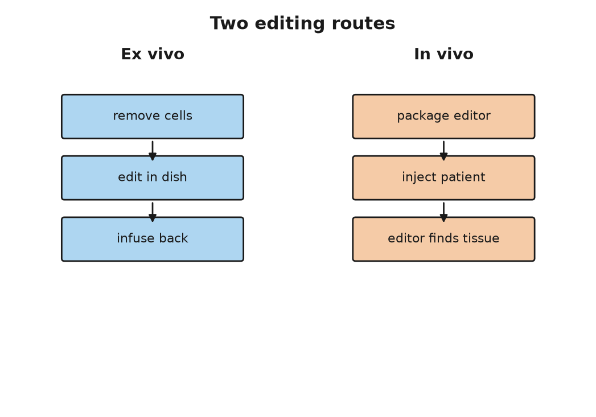
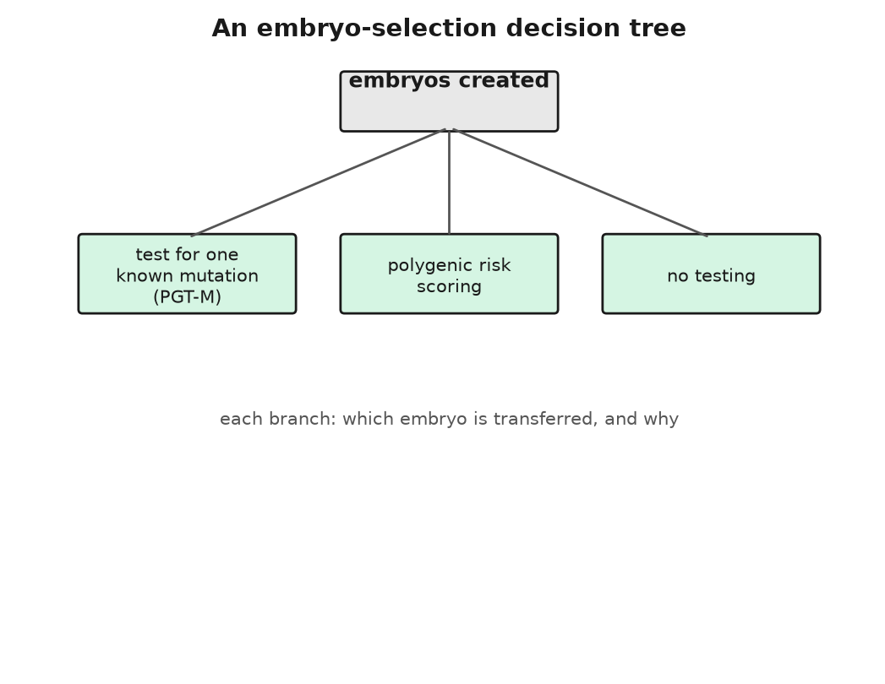
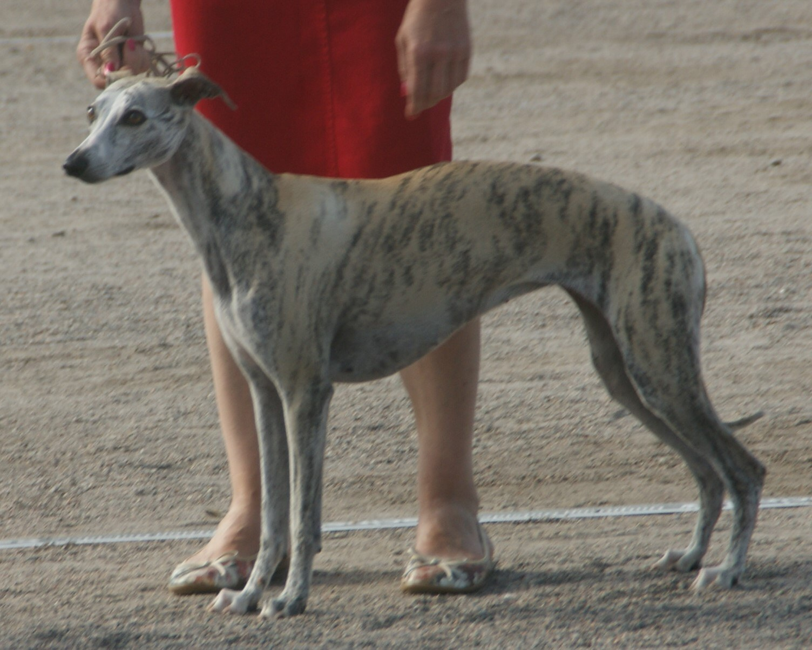
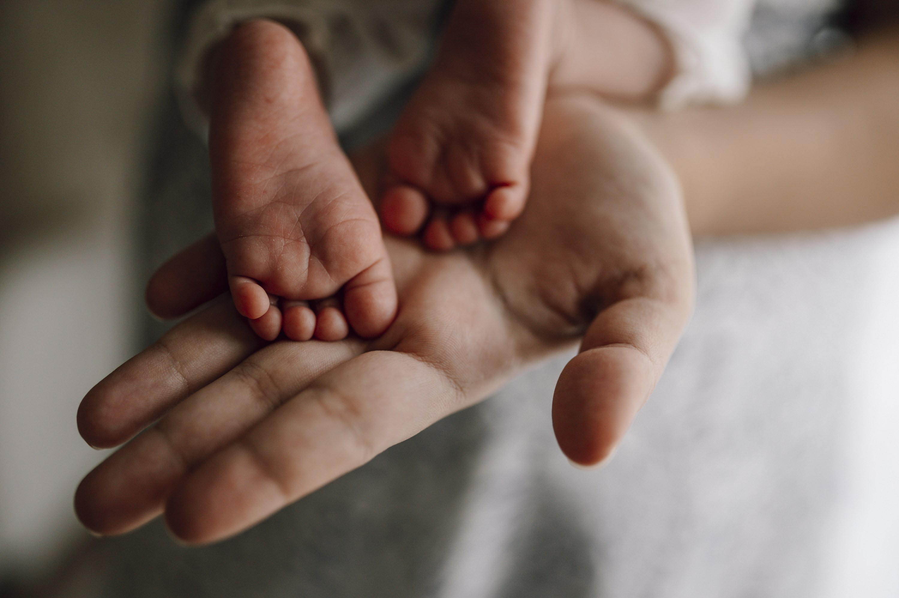

# PART XI — Correcting the Text

## 43. Fixing What Is Broken

A vial of cloudy fluid, thawed a few minutes earlier in a bath of warm water, is being pushed through a line into a vein. The patient is in a hospital bed in an isolation room and has been there for about three weeks. On the vial's label are the patient's name, a batch number, and a warning that it must not be irradiated. The list price of what is in it, in the United States in December 2023, was $2.2 million.

The fluid is the patient's own blood-forming stem cells. They were drawn from the bloodstream some months earlier, shipped to a factory, edited with the bacterial scissors of Chapter 25, tested, frozen, and shipped back. The product is called Casgevy, its generic name is exagamglogene autotemcel, exa-cel for short, and it is the first medicine on Earth built with CRISPR. The United Kingdom approved it on 16 November 2023 and the American Food and Drug Administration followed on 8 December 2023, both for sickle cell disease. Transfusion-dependent beta-thalassaemia was added in the United States on 16 January 2024.

What the edit does is worth stating exactly, because it is not what most people assume. It does not repair the sickle mutation in *HBB*. The Glu6Val change described in Chapter 6 is still there in every edited cell. Instead the scissors cut an enhancer, a DNA switch that can turn a gene's activity up or down, sitting beside a different gene, *BCL11A*, whose protein normally switches off the fetal form of hemoglobin in the months after birth. Break the switch and the cells revert to making fetal hemoglobin, which does not sickle. The cure is a detour, not a correction. It works because a fetus does not have sickle cell disease, and the edit keeps one part of the patient a fetus, in one narrow biochemical sense, for life.

Before the vial can go in, the patient's own bone marrow has to be cleared to make room. That is done with busulfan, a chemotherapy drug, at doses that cause hair loss, mouth sores, weeks in isolation, and usually infertility. Then the vial. Then a wait of several weeks while the edited cells find their way to the marrow and start producing blood. In the trial that supported approval, 29 of the 31 sickle cell patients who could be evaluated went at least twelve consecutive months without a severe pain crisis. Some of them had been having several a year since childhood.

---

The first distinction in this Part is the one that everything else rests on, and it is settled in law, in ethics statements, and in practice. Edit a person's blood cells, liver cells, eye cells, or muscle cells, and the change lives and dies with that person. That is somatic editing, from the Greek word for body. Edit an egg, a sperm, or an early embryo, and the change is in every cell of the resulting person, including the cells that will make the next generation's eggs and sperm. That is germline editing. The first is medicine, of an expensive and slightly heroic kind. The second is the subject of the next chapter, and of about seventy national laws that forbid it.

Everything approved so far is somatic. The list is short enough to give in full, and the prices, in US dollars and with their years, say something about what kind of medicine this is.

Luxturna, approved in December 2017, for a form of childhood blindness caused by two broken copies of *RPE65*: a working copy of the gene, carried by a virus, injected under the retina, about $850,000 for both eyes. Zolgensma, May 2019, for spinal muscular atrophy, in which babies born without a working *SMN1* usually die before the age of two: a working copy carried by a virus, one intravenous infusion, $2.125 million. Zynteglo, August 2022, for transfusion-dependent beta-thalassaemia, edited stem cells, $2.8 million. Hemgenix, November 2022, for haemophilia B, a working copy of *F9* delivered to the liver, $3.5 million, at the time the most expensive medicine ever sold. Roctavian, June 2023, for haemophilia A, $2.9 million. Casgevy and its rival Lyfgenia, December 2023, $2.2 million and $3.1 million. And then, in 2025, one baby, one edit, one patient, no product name, and no price list at all.

That baby is KJ Muldoon, and he turns the list from a set of products into a method. He was born in August 2024 in Pennsylvania with a severe deficiency of the liver enzyme CPS1, which clears ammonia from the blood. Untreated, about half of babies with the severe form die in infancy, and the survivors are often brain-damaged by the ammonia. His two mutations in *CPS1* were, in effect, his own; nobody had built a therapy for them, and nobody ever would have on commercial terms. A team at the Children's Hospital of Philadelphia and the University of Pennsylvania, led by Rebecca Ahrens-Nicklas and Kiran Musunuru, designed a base editor for one of the two mutations, tested it in cells and in mice carrying his variant, made a clinical-grade batch, and had the FDA's permission to dose him within about six months of diagnosis. The first infusion went in on 25 February 2025, when he was about seven months old, with two further doses in the following months. The paper appeared in the New England Journal of Medicine on 15 May 2025. By then he could eat more protein and needed less of the drug that mops up ammonia. Nobody used the word cure. The word the team used was personalised.

---

The hard part of somatic editing is not the editing. The scissors, the base editors, and the prime editors of Chapter 25 are, by now, well understood. The hard part is the post. You have to get a few thousand letters of instructions, or a protein and a guide, into the right cells of a living person, and nowhere else, without the immune system noticing, and in a quantity that does something.

There are two routes, and the diagram for this chapter shows them side by side. Ex vivo, "outside the body," is the Casgevy route: take the cells out, edit them in a dish where you can check your work, put them back. It works for blood, because blood-forming stem cells can be harvested from a vein and re-seeded into marrow, and it is the reason blood diseases came first. It does not work for a liver, a heart, or a brain, which cannot be taken out. In vivo, "inside the body," means putting the editing machinery into a person and trusting it to find the address.

For in vivo delivery there are, at present, two kinds of envelope. The first is a virus, usually an adeno-associated virus, AAV, a small harmless passenger virus that most people have met without knowing. Its own DNA is replaced with the gene you want to deliver, and the virus does the rest. Luxturna, Zolgensma, Hemgenix, and Roctavian all use AAV. Its limits are real. The capsule holds only about 4,700 letters, roughly enough for two or three ordinary genes end to end, which excludes many large genes. A third or more of adults already carry antibodies against the common AAV types and cannot be dosed, or cannot be dosed twice, because the first dose immunises them against the second. And at the very high doses needed to reach muscle throughout the body, AAV has killed. In a trial of a gene therapy for X-linked myotubular myopathy, a rare muscle disease, several boys who received the highest dose died of liver failure between 2020 and 2021, and the programme was later halted.

The second envelope is a fat droplet, a lipid nanoparticle, of the kind that carried the mRNA vaccines of 2020. It carries messenger RNA that tells the cell to make the editor for a day or two and then disappears. It can be dosed again. And it has one enormous convenience: injected into a vein, most of it ends up in the liver, because the liver's job is to pull fat particles out of the blood. For a disease of the liver, the parcel delivers itself. That is why the first in vivo CRISPR trial, in 2021, was for a liver disease. Six patients with transthyretin amyloidosis, in which the liver makes a misfolded protein that clogs the heart and nerves, received a single infusion of lipid particles carrying instructions for Cas9 and a guide aimed at *TTR*. At the higher dose the amount of the protein in their blood fell by an average of 87 percent, and the results appeared in the New England Journal of Medicine in June 2021. KJ Muldoon's editor arrived in the same kind of particle for the same reason: CPS1 is a liver enzyme.

Beyond the liver, delivery is a working problem, not a solved one. Getting an editor into the brain, past the blood-brain barrier, at scale, is not done. Getting it into every muscle fibre of a body with muscular dystrophy is not done safely. Getting it into the lining of the lung, for cystic fibrosis, has been tried since 1993 with inhaled vectors and has never produced a durable benefit. The list of approved products is a map of the organs that are easy to reach: the eye, which is small and closed and largely ignored by the immune system; the blood, which can be taken out; and the liver, which the parcel finds by itself.

Ruth, Anna, and Theo, who are invented, will not need any of this, but they are useful for scale. About 7,000 diseases are counted as rare, most of them caused by a fault in a single gene, and most of them affecting a few hundred or a few thousand people worldwide. Added together, the best current estimate, from a 2020 analysis of the Orphanet database, is that between 3.5 and 5.9 percent of people carry one of them, which is roughly 260 to 450 million people, and the round number of 300 million is the one usually quoted. If Theo has forty classmates, the odds are that one or two of them have a rare disease. Almost none of those classmates will ever have a product built for them, because there are not enough of any one of them to pay for the trial.

That is what KJ Muldoon's case changes, or might. The argument, made openly by the Philadelphia team and taken up by the FDA, runs like this. The lipid particle was one already used in other trials. The base editor was a published enzyme. The only new thing was the twenty-letter guide that told it where to go. If the envelope and the enzyme can be qualified once, as a platform, then a new patient with a new mutation needs a new guide and a few months of testing, not a new decade. In 2025 the FDA's leadership described in print a possible "plausible mechanism" pathway for exactly this kind of case, in which a treatment for a very limited number of patients could be authorised on the strength of a well-understood mechanism, a demonstrated effect in the patient's own cells or in an animal model, and close monitoring, rather than a randomised trial that could never be run. Whether that becomes a regulation, and how safety is policed when every patient is a trial of one, was still being argued as this book went to press.

The money is the other half. A million-dollar price for a one-time treatment can be cheaper than the alternative. A person with severe sickle cell disease in the United States runs up lifetime medical costs estimated at about $1.7 million, and dies on average in their forties. But the arithmetic only works if someone pays up front, and in the American system the payer is often a state Medicaid programme with an annual budget. In 2025 the federal Medicare and Medicaid agency began an arrangement under which the makers of the sickle cell therapies are paid partly on results, and by which states could pool the risk. In England the National Health Service agreed a confidential discount and began treating patients in 2024 for thalassaemia and in 2025 for sickle cell. In the countries where most sickle cell disease actually is, in sub-Saharan Africa and India, where perhaps 300,000 babies are born with it every year, none of this is available, and at any price with six zeros in it none of it will be. A cure that exists and cannot be delivered is a new kind of inequality, and it is settled that it is a real one.

I think the fair way to describe the state of somatic editing in 2026 is this. For a short list of diseases of the blood, the eye, and the liver, we can fix what is broken, at great cost and with real risk, and the fix holds. For a much longer list, the fix is designable in principle and the parcel is the problem. And for one baby, the fix was designed for him alone, which is the thing nobody expected to see this soon. All of it dies with the patient. The question of whether to make a fix that does not is the one this book has been putting off since the Prologue, and it is time to stop.

## 44. The Line We Said We Would Not Cross

The Francis Crick Institute sits behind St Pancras station in London, a building of glass and pale stone that its critics compared to a beached submarine. On the morning of 6 March 2023 its auditorium was filling for the Third International Summit on Human Genome Editing, three days of talks that had been waiting, in a sense, since the Second, in Hong Kong in November 2018, when a man from Shenzhen stood up and told the room that two edited girls had already been born.

One of the first speakers was not a scientist. Victoria Gray, the Mississippi woman who in July 2019 had been the first sickle cell patient treated with CRISPR-edited cells, told the room what her life had been before and after. The choice of opening was not an accident. The organisers wanted the world to see the somatic side of the ledger, the side with a cured patient on it, before anyone talked about embryos. When the organising committee issued its closing statement on 8 March, it said that somatic editing was working and needed to be made affordable, and that heritable human genome editing "remains unacceptable at this time." The phrase "at this time" was doing a lot of work, and everyone in the room knew it.

The line between somatic and germline, drawn in the last chapter, is the line the summit was defending. What follows is the case for crossing it, put as strongly as I can, then the case against, put the same way, then the two things that are already on the far side of the line and have been for years, and then what I think.

---

The case for begins with a couple. Ruth, Anna, and Theo, who are invented, are no use here, so let me invent two more people for a paragraph: a man and a woman who both have sickle cell disease, each carrying two copies of the *HBB* variant, who want a child of their own. Every child they conceive will have the disease. There is no embryo to select, because all of them carry two copies. The same is true for a parent who carries two copies of the Huntington's expansion in *HTT*, the fatal brain disease from Chapter 40, which is rare but not unknown, and for any couple in which one partner has two copies of a dominant condition. For these families, embryo selection, the workhorse of the last thirty-five years, has nothing to offer. Germline editing is the only route to a child who is genetically theirs and free of the disease. The number of such couples is small, and I have not found a reliable estimate, but it is not zero.

The case for goes on. We already accept risk to future people for the sake of their parents' wishes. IVF, short for in vitro fertilisation, was itself done first, in 1978, without anyone knowing what it would do to Louise Brown. Mitochondrial replacement, described below, is a heritable change and has been legal in Britain since 2015. Selection against a disease and correction of a disease have the same aim. If somatic editing of a child's blood is a cure, and everyone agrees it is, then editing the same letter one generation earlier, so that the child never has the disease and never needs the cure, is at worst the same act done sooner. And the 2020 report of the International Commission on the Clinical Use of Human Germline Genome Editing, convened by the US National Academies and Britain's Royal Society, laid out a narrow pathway: serious single-gene diseases, no other option, an edit to a common variant known to be harmless, with proof that the edit is exactly what was intended and nothing else, before any pregnancy. That is not "never." It is "not yet, and only like this."

The case against begins with consent. The person most affected by a germline edit does not exist when the decision is made and cannot be asked. The standard reply, that nobody consents to being born with any genome, is true and does not settle it, because a natural genome is nobody's choice and an edited one is somebody's. Then irreversibility: a somatic edit that goes wrong harms one patient, and a germline edit that goes wrong is inherited. Then mosaicism, which is the technical objection with teeth. Cas9, the cutting enzyme from Chapter 25, injected into a fertilised egg does not always act before the first cell division. If it acts at the two-cell or four-cell stage, some cells are edited and some are not, and the resulting person is a patchwork whose cells cannot all be tested before birth. He Jiankui's twins were, on the evidence he himself presented, mosaic. Then off-target cuts and unintended damage at the target itself: in 2020 several groups reported that Cas9 in human embryos sometimes removed large pieces of the chromosome around the cut, at rates that were not small. And then the argument that is not technical at all: that the same technique which removes a disease can, in the next laboratory, add a preference, and that a society which allows the first will not find the place to stop before the second. The next chapter is about how little of the second is actually possible, but the slope argument is not about what is possible now.

There is also the practical objection that the summit's statement leaned on. For almost every family that fears passing on a single-gene disease, embryo selection already works, is legal almost everywhere, and does not involve touching the text at all.

---

Selection is the first thing already on the far side of the line, and it has been there since 1990. In April of that year Alan Handyside and colleagues at the Hammersmith Hospital in London reported in Nature that they had taken a single cell from each of several three-day-old IVF embryos, amplified a piece of the Y chromosome by PCR, the DNA-copying method from Chapter 22, and transferred only female embryos to two women who carried X-linked diseases, disorders carried on the X chromosome. Both women became pregnant with twin girls. It went by the name preimplantation genetic diagnosis then and is called preimplantation genetic testing for monogenic disease, PGT-M, now. It has been used for cystic fibrosis since 1992, for Huntington's, for *BRCA1* and *BRCA2*, and for several hundred other conditions. The embryo is not edited. It is read, and the ones that carry the variant are not used. The moral weight of that is real, and people disagree about it, but it involves no new text and no new risk to the child who is born.

What has changed since about 2019 is that companies began selling selection on the basis of the polygenic scores described in Chapter 41, for conditions that are not single-gene at all. Genomic Prediction, founded in 2017 in New Jersey, reported in 2021 the first baby chosen with such a score. Orchid, founded in 2019 in California, sequences the whole genome of each embryo from a few cells and reports risk scores for diabetes, heart disease, schizophrenia, several cancers, and more, at a price reported as a few thousand dollars per embryo. There are others.

What the scores can actually do is measurable, and it is not nothing, but it is small. A 2019 paper in Cell by Ehud Karavani, Shai Carmi, and colleagues worked out the expected gain from choosing the top-scoring embryo among ten for height: about 2.5 centimetres. For IQ, using the scores then available: about 2.5 points, with a wide spread. A 2021 paper in the New England Journal of Medicine by Patrick Turley and colleagues listed the reasons the numbers are worse in practice. A couple rarely has ten viable embryos to choose from. The scores were built on people of European ancestry and predict less well in everyone else. A score for one thing drags others with it, in directions nobody has measured. And the score ranks the embryos against each other, not against anyone's hopes. The European Society of Human Genetics said in 2021 that offering polygenic embryo selection was unproven and premature. The companies say their customers are adults making informed choices. Both are true. The gap between what is sold and what is shown is, I think, the widest in this book, and the marketing has a way of not mentioning the centimetres.

The second thing already on the far side of the line is mitochondrial replacement. About one in 5,000 people is born with a serious disease caused by a fault in the 16,569 letters of mitochondrial DNA, which passes only from mother to child, as Chapter 12 explained. The fix is to move the nucleus of the mother's egg, or of the fertilised egg, into a donor egg whose own nucleus has been removed and whose mitochondria are healthy. The child carries the nuclear DNA of both parents and the mitochondrial DNA of the donor, which is why the newspapers called them "three-parent" babies, a phrase the embryologists dislike because the donor contributes about 0.1 percent of the child's genes and none of the ones that make a face.

It is heritable, if the child is a girl, and it was made legal on purpose. The House of Commons voted 382 to 128 on 3 February 2015 to allow it, the Lords agreed on 24 February, and the regulations came into force in October 2015. The Newcastle Fertility Centre received the first licence in March 2017. On 16 July 2025 the Newcastle team reported in the New England Journal of Medicine that eight babies had been born in Britain by pronuclear transfer, the nucleus-swap technique just described, all healthy at the time of writing, with the mother's faulty mitochondria undetectable in most of them and present at low but measurable levels in a few, which is the thing to watch. Australia passed a similar law in 2022. The United States has not; a rider attached to the federal budget every year since December 2015 forbids the FDA from even considering an application for a heritable modification, and mitochondrial replacement is caught by it. A boy born in 2016 to a Jordanian couple treated by a New York doctor working in Mexico is, as far as the record shows, the first child born by the method, and the rider is the reason it was done in Mexico.

The international rules are a patchwork with a clear centre. A 2020 survey in the CRISPR Journal found that of 96 countries with relevant policy, 70 prohibited heritable human editing outright and none permitted it; the rest were silent or ambiguous. The Council of Europe's Oviedo Convention has banned heritable modification since 1997. China, after 2018, wrote a criminal offence for it into its penal code in 2021. The World Health Organization published a governance framework in 2021 and set up a registry of trials. The summit statement of 2023 was the scientific community's own line: not now, and not until the technical bar of the 2020 report has been met and there is a public consensus that it should be done at all.

He Jiankui was released in April 2022 after his three years. He set up a laboratory, announced plans for gene therapy research, and has posted regularly about his intentions since, including statements in 2024 and 2025 that he wanted to work on embryo editing to reduce Alzheimer's risk. I stick to the record and note only that nobody has reported him doing any such thing, and that the children he did edit are, as far as anyone outside a narrow circle in China knows, alive and unstudied.

So here is what I think, marked as mine. Somatic editing is medicine and should be paid for like medicine. Embryo selection for serious single-gene disease is a reasonable thing for a family to choose and a reasonable thing for a family to refuse. Polygenic embryo selection is a product ahead of its evidence; I would not buy it, but I would not forbid adults from buying it either, provided the centimetres are in the brochure. Mitochondrial replacement has been done carefully, for a small number of families with no alternative, and the results so far justify it. Germline editing of the nuclear text I would keep where the summit left it, for the reason the summit gave: almost everyone it could help can be helped by selection instead, and the few who cannot are not yet enough to justify the first mistake. But I do not think "never" is a serious position, and I notice that the people who use the word tend to have no one in their family with two copies of anything. The line will move when the risk is shown to be smaller than the harm it prevents, and not before, and the arguing about where that point is will be done by people who are not yet born. The harder argument is not about disease at all, and it starts with a very strong little boy in Berlin.

## 45. Enhancement

The boy was born in Berlin in 1999, and the first thing anyone noticed was his legs. Newborns are soft; this one had the defined thigh and calf muscles of a compact athlete, and within days his twitches were strong enough to be worth a neurologist. The neurologist was Markus Schuelke at the Charité hospital, and over the next four years he and colleagues in Berlin and at Johns Hopkins worked out why. In June 2004 they published the answer in the New England Journal of Medicine. The boy carried two broken copies of *MSTN*, the gene for myostatin, a protein whose job is to tell muscle to stop growing. He made none of it. By the age of four and a half he could hold a three-kilogram weight in each hand with his arms stretched out sideways, and the cross-section of his thigh muscles was about twice that of other children his age. His mother, reported as a former professional athlete, carried one broken copy. She was, the paper noted, unusually strong.

Myostatin was not new. Se-Jin Lee and Alexandra McPherron at Johns Hopkins had knocked it out in mice in 1997 and produced animals with two to three times the normal muscle mass, which the newspapers called Schwarzenegger mice. Belgian Blue and Piedmontese cattle, the double-muscled breeds that look as though they have been inflated, turned out to carry natural *MSTN* mutations, an 11-letter deletion in the Belgian Blue's case. Whippets carry a 2-letter deletion; dogs with one copy are over-represented among racing winners, and dogs with two, known as bully whippets, are heavily muscled and prone to cramp. All of this is settled, and it produces the first entry on a list that this chapter is really about: the list of things that some people already are, by accident of birth, that the rest of us are not, and that an editor could in principle write in.

---

The list is shorter than the films suggest, and each entry has a footnote.

Eero Mäntyranta was a Finnish cross-country skier who won seven Olympic medals between 1960 and 1968, three of them gold. His blood carried, by report, about 50 percent more hemoglobin than a normal man's, and in 1993 Albert de la Chapelle's group in Helsinki found out why: a single-letter change in *EPOR*, the gene for the receptor that responds to erythropoietin, the hormone that tells the marrow to make red cells. The mutation truncated the receptor and removed its off switch. About thirty members of his extended family carried it. It is the nearest thing in humans to a natural blood-doping allele, and Mäntyranta spent the rest of his life, until his death in 2013 at 76, explaining that he had not cheated. The footnote is that thick blood clots. What the allele cost his family over their lifetimes is not on record in any detail, and that absence is itself a warning about how little we know of the price of these things.

*CCR5*-Δ32 is a 32-letter deletion that removes a protein from the surface of immune cells. About 10 percent of people of northern European descent carry one copy, and about 1 percent carry two. HIV uses the CCR5 protein as a door; people with two deleted copies have no door, and are almost immune to the common strains of the virus. That is why, in February 2007 in Berlin, a doctor named Gero Hütter gave an HIV-positive leukaemia patient named Timothy Ray Brown a marrow transplant from a donor with two copies of Δ32. Brown's leukaemia was cured, and so, as far as anyone could tell for the rest of his life, was his HIV. He stopped his antiviral drugs and the virus never came back. He died in September 2020 of a return of the leukaemia, still free of HIV, and a handful of people have since been cured the same way. It is also the allele He Jiankui tried to write into two embryos in 2018, which is why it belongs in this chapter and not only in the last. The footnote is West Nile virus: people with two Δ32 copies are several times more likely to fall seriously ill if they catch it, and there are hints, less certain, of worse outcomes with influenza and some other infections. A 2019 paper claiming that Δ32 homozygotes, people with two deleted copies, die younger was retracted the same year when its genotyping proved faulty, so that particular cost is not shown. But the door HIV uses is a door the immune system built for a reason.

*ACTN3* encodes a protein in fast-twitch muscle fibres. About 18 percent of people worldwide carry two copies with a stop codon, a signal that halts the gene's instructions early, and make none of it, and they are fine. But among elite sprinters and power athletes the two-copy version is almost absent, which Kathryn North's group in Sydney reported in 2003, and among endurance athletes it may be slightly enriched. The footnote is the size of the effect: it shifts the odds of being a champion by a modest amount, and it makes nobody fast on its own.

*BHLHE41*, also known as *DEC2*, carries in a few families a variant, P385R, a change at position 385 in the protein, that Ying-Hui Fu's group at the University of California, San Francisco, reported in Science in 2009. The people who carry it sleep about six hours a night, feel rested, and have done so all their lives; mice engineered with the same variant sleep less too. Fu's group has since identified several other short-sleep variants in other genes. The footnote is that nobody knows what, if anything, the two saved hours cost over a lifetime, because the families are small and the question is hard.

*LRP5* is a gene in a signalling pathway that controls bone growth, and two families reported in 2002, one of them in the New England Journal of Medicine, carry variants that give them bones several times denser than normal. Their members have walked away from car accidents that break other people's hips, and it has been reported that some of them have trouble swimming, because they sink. The footnote, so far, is modest: an enlarged jaw in some, a bony ridge on the palate in others. Osteoporosis drugs acting on the same pathway followed.

And then *PCSK9*, which is the free lunch, or the nearest thing to one. In 2006 Jonathan Cohen and Helen Hobbs at the University of Texas Southwestern reported in the New England Journal of Medicine that about 2.6 percent of Black participants in a large heart study carried a nonsense mutation, a change that stops the gene's instructions partway through, in *PCSK9*, a gene whose protein removes LDL receptors from the surface of liver cells. Carriers had LDL cholesterol, the "bad" cholesterol that clogs arteries, 28 percent lower than everyone else and, over fifteen years, 88 percent fewer coronary events, meaning heart attacks and related heart trouble. A woman was later found with both copies broken, an LDL cholesterol of about 14 milligrams per decilitre, roughly a tenth of the usual figure, and no apparent ill effect at all. Two antibody drugs that block the protein were approved in 2015, a gene-silencing RNA treatment that mutes the gene for six months at a time followed in 2020, and in 2022 a company named Verve dosed the first patients with a base editor that writes a stop into *PCSK9* in the liver, permanently, in a single infusion, with results reported in 2023. The trial had its troubles and was paused and redesigned; the point is that the natural allele told the drug designers exactly what to build.

The oldest and best-documented entry on the list is not usually put on it, because it is so common. Most adults in northern Europe, in some East African herding peoples, and in a few other places can drink milk without trouble, because a change near *LCT* keeps the lactase gene switched on past weaning. Most adults everywhere else cannot. The European variant arose perhaps 5,000 to 10,000 years ago and spread fast under selection; it is one of the strongest signals of recent evolution in the human genome. Ruth, Anna, and Theo all have it. It is an enhancement by any definition: a new ability, useful, heritable, no evident cost. It was written by copying errors and dairy farming, not by anyone.

---

Now the accounting. Every entry above except the last two comes with a trade, and the trades are the same shape as the one this book has met before. Sickle cell is the pattern: one copy of the *HBB* variant protects against severe malaria, two copies cause the disease, and the variant is common in exactly the places where malaria has been. *CCR5*-Δ32 blocks one virus and opens the door to another. *EPOR* wins medals and thickens blood. Myostatin loss builds muscle, and in cattle causes calving problems severe enough that most Belgian Blue calves are delivered by Caesarean, and in humans nobody knows what it does to tendons and hearts over sixty years, because the boy from Berlin is only in his twenties.

What we call superhuman, in other words, is mostly a menu of trade-offs that evolution has already priced, with a small number of items that look, on present evidence, like pure gain: *PCSK9* loss, dense bones, the lactase switch. I think that is the right way to hold the whole subject. The alleles exist, they are in people walking around today, and an editor that can write one letter into a liver cell can write these. What it cannot do is remove the footnote.

Gene doping is where the argument stops being theoretical. The World Anti-Doping Agency put gene doping on its prohibited list in 2003, before anyone had done it, defined broadly as the non-therapeutic use of genes or cells to improve performance. A product called Repoxygen, a virus carrying an erythropoietin gene that had been developed for anaemia, turned up in 2006 in the German trial of an athletics coach, in emails in which he tried to obtain it. No case of a gene-doped athlete has ever been confirmed, and detecting one is hard, because the added gene makes the athlete's own protein. Somatic editing of an athlete's *EPOR* or *MSTN* is, as of 2026, technically closer than most sports bodies would like to admit, and if it happens it will come to light the way East German doping did, by paperwork and defections, not by a test.

Then intelligence, which is the item on every list and the one with the least behind it. Chapter 41 gave the numbers. The largest study of educational attainment, with 3 million people in 2022, produced a polygenic score that predicts about 12 to 16 percent of the variance, the person-to-person differences, in years of schooling, and within a family, comparing siblings, about half of that, because the rest is the family's money and the schools. The score is built from thousands of variants of tiny effect, scattered across the text, most of them in regulatory regions whose function nobody has worked out, and none of them a lever. There is no *MSTN* for thinking. There is no single letter that makes a mind, and there is no evidence, working or speculative, that one is waiting to be found. Anyone who sells the possibility of an edited genius is selling something they have not seen.

Which leaves the honest position, and I will mark it as mine. The natural superhuman alleles are real, few, and mostly bought at a price. Somatic editing to copy one of them into an adult who wants it, with eyes open, is a question of medical ethics and sporting rules, not of the future of the species. Germline editing to write one of them into a child is the line of the last chapter, with less excuse. And the enhancement that would matter most, if anyone could offer it, is the one nobody can find in the text. The last chapter of this book is about what a hundred years of all this might look like, and the first thing to say is that the text will not be waiting for us to decide.

## 46. The Next Hundred Years

It is 2126, and a child has been born in a hospital that is, in most respects, recognisable. The lights are the same. The mother is tired. What is different is that on the wall a display is already showing the child's genome, all 3.1 billion letters of it, read from a few of the child's cells in the last hour of labour and compared, before the cord is cut, with the text of both parents and with a reference built from several hundred million other people. Nothing about the cutting of the cord has changed. The reading is simply done, the way a birth weight is done, and it will say, within the hour, which of the sixty or seventy new letters this child carries were in neither parent, and whether any of them matter.

I do not know that this is what 2126 will look like. Nobody does, and I have spent forty-five chapters being careful about numbers, so I am not going to stop now. What I can do is sort the guesses by how much stands behind them today, using the three words this book has used since Part VI, and then say, marked as mine, what I would bet on. The reader in 2126, if there is one, may score it.

The settled trajectory first. These are not predictions so much as extrapolations of things already being done at scale, where the only uncertainty is how far they spread.

Newborn genomes are already being read. Genomics England began its Generation Study in October 2024 with the aim of sequencing 100,000 newborns and reporting on more than 200 treatable childhood conditions. A baby in intensive care can have a diagnostic genome within a day or two, and the record, set in 2022, was under eight hours. The blood-spot screening that Robert Guthrie started in 1963 tested for one disease. A genome tests for all of them at once, and the price is within sight of what a routine hospital test costs. I would put universal newborn sequencing in the rich world within twenty years, not a hundred, and the argument about what to report from it, which Chapter 41 described, will go on for the whole century.

Somatic cures for single-gene diseases will extend from the blood, eye, and liver of Chapter 43 into whatever organs the delivery problem yields, and the KJ Muldoon model, one patient, one guide, will become a service line in a few dozen hospitals. The cost will fall, because it has fallen for everything else in this book: the $2.7 billion genome became the $200 genome in about twenty years, and the manufacturing that makes Casgevy cost $2.2 million is young. I would expect a child born in 2126 with sickle cell disease to be treated in infancy, in Lagos as well as London, and I would expect the disease to be, like polio, something grandparents remember.

Prescribing by genome is settled in principle and merely slow in practice. A 2023 trial in the Lancet, across seven European countries, gave nearly 7,000 patients a twelve-gene panel before prescribing and found about 30 percent fewer serious drug reactions than in patients treated the usual way. The panel costs less than a night in hospital. By 2126 the idea of prescribing a drug without knowing the patient's *CYP2C19* status, the drug-response gene from Chapter 40, will look the way prescribing without knowing their weight looks now.

Engineered crops and livestock are already the default in the countries that grow most of the world's calories, as Chapter 33 counted. The edited tomato and the PRRS-resistant pig are the front of a queue. I would expect the distinction between genetically modified and conventional to have dissolved by mid-century, not because the arguments were won but because the edited varieties will be the ones that survive the climate they are grown in.

And everything will be sequenced. Sewage was the proving ground: cities began reading their wastewater for the COVID virus in 2020, and in June 2022 the poliovirus turned up in London's sewage before a single case had been diagnosed, which set off a vaccination campaign. In January 2022 two groups, one working at Copenhagen Zoo and one at a zoo in England, showed that the DNA drifting in the air could identify the animals nearby. Water, air, soil, the surfaces of hospitals, the breath of the person next to you on the train: the cost of reading is heading toward the cost of the tube, and by 2126 the ambient genome of a city will be a public utility, monitored the way air quality is now. What that does to privacy, Chapter 42 has already said.

---

The working scenarios are the ones with a best current account and real gaps.

Polygenic embryo selection, sold since 2019, will be normal in some countries and illegal in others, and I would guess the line will fall roughly where the line on commercial surrogacy falls now, with the same tourism across it. The scores will get better as the biobanks of Chapter 38 pass ten million people and stop being mostly European, and the gain from picking the best of ten embryos will rise from two and a half centimetres to something a brochure can print without shame. It will never be large, because the gap between the embryos a couple actually has is the gap between siblings, and siblings differ, as Chapter 11 showed, in ways that no score can see.

Partial reprogramming is the working scenario I would watch most closely, because it is the one that could change what a century means. In 2006 Shinya Yamanaka showed that four proteins could turn an adult cell back into something like an embryonic one, as Chapter 31 described. In December 2016 Juan Carlos Izpisua Belmonte's group at the Salk Institute reported in Cell that switching those four factors on briefly and repeatedly, without letting the cells complete the reversal, made mice with a premature-ageing disease live about 30 percent longer and left their tissues looking younger by several measures. In December 2020 David Sinclair's group at Harvard reported in Nature that three of the four factors, delivered by virus into the eyes of old mice, let damaged optic nerves regrow and returned some lost vision. In January 2022 a company called Altos Labs launched with about $3 billion of private money and several of the people who had done the work, to try to make it a medicine. The first human trials, for eye conditions, were being planned as this book went to press.

What is working here is real: the epigenetic marks of Chapter 9 drift with age, the drift can be measured as a clock, and in mice the clock can be partly rewound without turning the cell into a tumour. What is not shown is that it can be done safely in a whole human body, that the gain is more than modest, or that it does anything for the cell's DNA, which has been accumulating the copying errors of Chapter 10 the whole time and is not rewound by any of this. My guess is that partial reprogramming becomes a treatment for particular tissues, the eye first, joints and skin perhaps, within thirty years, and that it adds years of health to old age rather than decades to life. The text still sets the ceiling.

De-extinction as a conservation tool is working in the sense that the animals exist. Colossal's grey wolves with twenty edits, born in late 2024 and shown in April 2025, are not dire wolves, as Chapter 28 said, but the same company's cloning of red wolves, of which fewer than twenty remained in the wild, is conservation by any name. The black-footed ferret Elizabeth Ann, cloned in December 2020 from cells frozen in 1988, and her successors, who have since produced kits, put genetic diversity back into a species that had been reduced to seven founders. By 2126, I would guess, every endangered mammal has a cell line in a freezer and a cloning protocol, and the word extinct will need a footnote.

Synthetic organisms in industry are already there in modest form. Yeast engineered by Jay Keasling's group to make the malaria drug artemisinin entered production in 2013, and precision fermentation now makes insulin, rennet, vanilla flavouring, and the heme in a plant-based burger. The 473-gene cell of 2016 and the rewritten yeast chromosomes of 2023 are the far end of the same road. What is not shown is that a wholly designed organism can do anything better than an edited natural one, and the working answer may be that it cannot, and that synthetic biology in 2126 will mostly mean very heavily edited yeast.

---

Then the speculative, which is allowed and not shown.

Germline editing for a few diseases, done under the 2020 pathway, in a few countries, for the small number of couples for whom selection cannot work: I would guess it happens before 2050, that the first cases are for sickle cell or thalassaemia in a country with a great deal of both, and that the arguments of Chapter 44 are re-run in full each time. I would also guess that by 2126 it is rare, legal in some places, and has changed nobody's view of what a person is, which is what happened with IVF.

Inequality by genome is the speculative scenario people fear most, and the 1997 film that named it, Gattaca, is still the reference. The worry is that the rich select and edit, the poor do not, and the gap becomes heritable. I think it is allowed, and I think it is unlikely to happen the way the film shows, for a dull reason: the traits that money most wants, intelligence and temperament, are the ones with no lever, as the last chapter said, and the ones with a lever, disease, are the ones public health systems have the strongest reason to pay for. The inequality that is actually coming, and is already here, is the one Chapter 43 described: a cure that exists in one country and not in another.

Human variants for space or climate are the far end. The genes that let a bacterium survive radiation, the Tibetan *EPAS1* variant for thin air, the enlarged spleen of the Bajau sea nomads for diving, heat tolerance borrowed from the slick-coat cattle of Chapter 34: all of these have been proposed, in print, as edits for a species that means to live off Earth or on a hotter one. None has been tried, none is close, and the delivery problem alone puts them beyond this century for adults. For embryos, they are the enhancement slope of Chapter 44 with a rocket attached. I would put nothing on it before 2100, and I notice that the people most enthusiastic about it are not, on the whole, the people who would be edited.

And the designer argument, in the end, may resolve itself, because the strongest evidence in this book is that we do not know what we want. Every allele on the list in Chapter 45 was a trade. The one clear enhancement in human history, the lactase switch, was not designed and could not have been, because nobody eight thousand years ago knew what a gene was or that cheese was coming. Evolution has not stopped. It wrote *EPAS1* into the Tibetans within the last few tens of thousands of years, the lactase switch within ten thousand, and it is working now on whatever gets people through cities, sugar, and antibiotics, at a pace no one can see within a lifetime. Whatever we design will sit on top of that, and will be judged by it, and I think the judgement will mostly be that we were cautious about the wrong things.

So, marked as mine, my guess for 2126. Every child's text is read at birth, and most single-gene diseases are fixed in infancy or before. Prescribing, farming, and public health are done by sequence. Old age is longer and better by a decade or two, not by a century. Embryo selection is ordinary, edited embryos are rare, and the species is recognisably the one that mailed the tube. The thing that will have changed most is not the text but our relation to it: from something that happened to us to something we read, argue about, and occasionally, with great care, correct.

And the text will not have noticed. In the hour after the child of 2126 is born, in the lining of the child's gut, cells are dividing, and each division copies 3.1 billion letters, and the copying enzyme checks its work, and a second set of enzymes checks it again, and about one letter in a billion still comes out wrong. It has been doing that for something like 3.8 billion years, through every editor, every summit, every price list, and every book. Everything that lives, including the reader, is what those errors added up to.

We may learn to correct a few of them. We will not make the copying perfect, and I think, if it ever came to it, we would be wrong to try.
