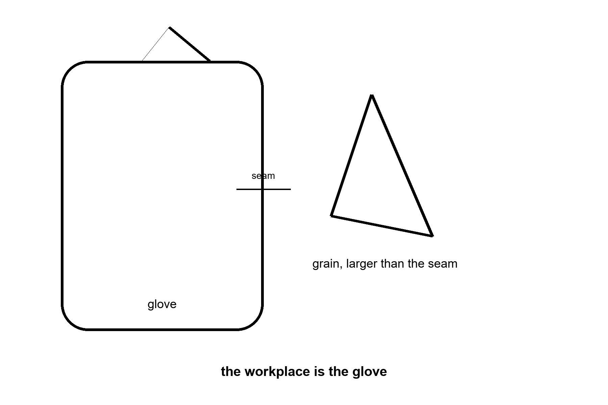
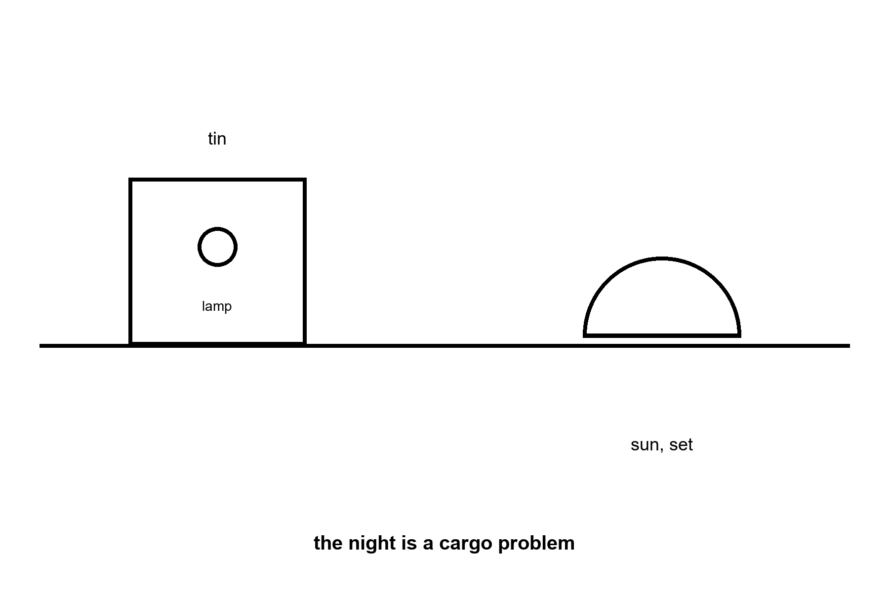
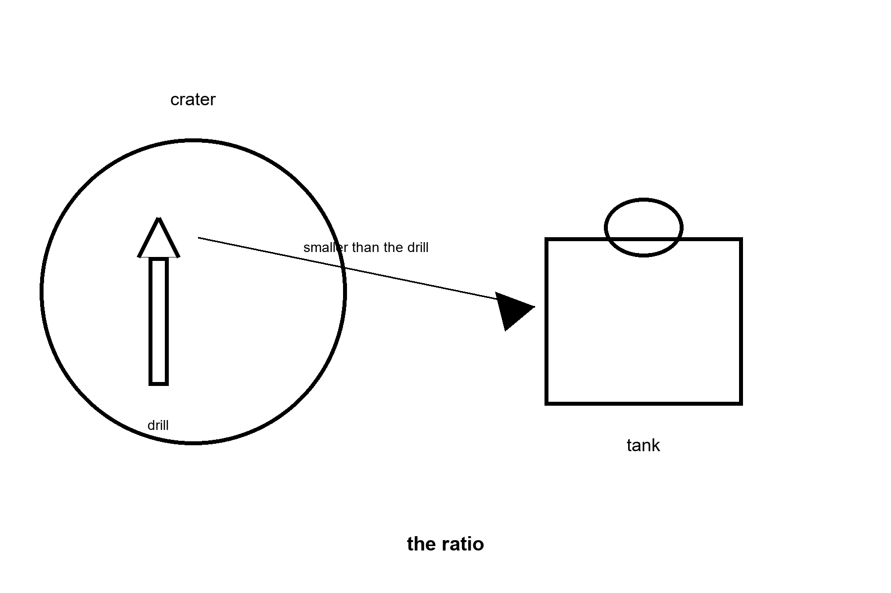
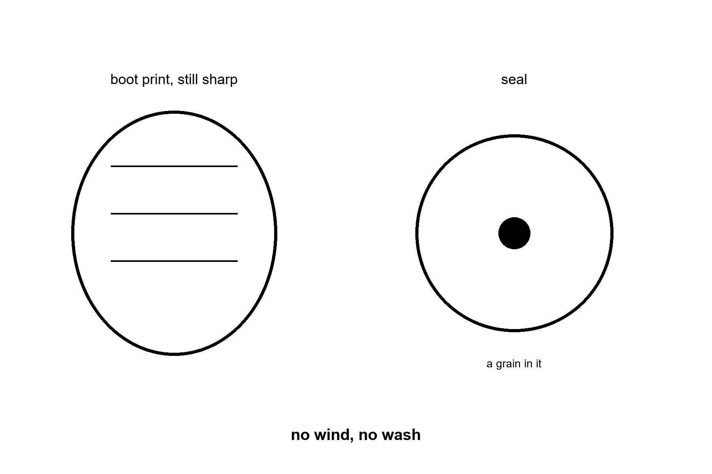
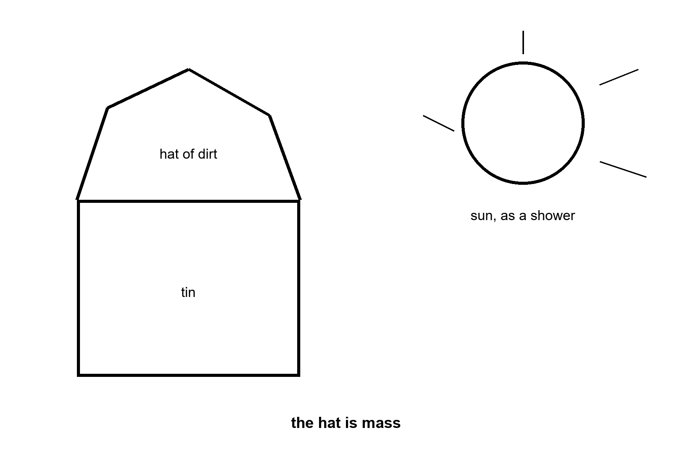
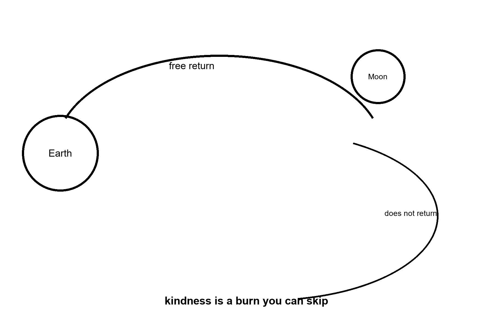

# PART V — The Classroom on the Close Rock

The next eight chapters are the homework the posters skip. Each one is a bill you can count. None of them is a downtown.

---

## 17. A Suit Is a Spacecraft

A suit is not a costume. It is a spacecraft you wear, and spacecraft slip.

Linh Pham’s box of simulant is not the Moon, and it is already rude to bearings. The real grain is worse. Lunar dust is rock that has been micrometeorited and solar-winded for a billion years with no air to round the edges and no rain to wash the charge off. It is sharp. It is a little magnetic in its iron. It sticks to a suit the way flour sticks to a wet hand, except the hand is charged and the flour is glass.

where a suit is a pressure garment, a cooling loop, a radio, a visor, and a set of bearings that must still bend after the glass has had its say.

Apollo’s crews came home sanded. Gloves wore through faster than the brochure. A few hours on the dirt was a shift that already showed the invoice. A town, if anyone ever says the word with a straight face, is thousands of those hours, with a spare glove on the shelf and a person whose job is the glove. We have not staffed that person on the Moon. We have staffed Linh, in a lab, with a box.

What the suit has to do, said as a list a slipped month cannot erase.

Hold about a third of an atmosphere, so the joints can still bend and the chest can still move. In a true vacuum the blood would boil, down near a small fraction of an atmosphere. That is why a suit has to hold something. It is not why the working pressure is a third of an atmosphere. The third is the bendable-joint bargain, paid for with oxygen and a wait before you step out. Move the joints anyway. Dump the heat of a working body into a backpack of ice or a sublimator, because vacuum does not carry heat away by a breeze; it only takes what you hand it as radiation or as a boiling liquid. Keep the visor from fogging and from being sanded blind. Give the hands enough feel to turn a valve. Come back through an airlock without bringing the glass into the tin.

The airlock is the second spacecraft. Mara already hits one with the heel of a glove, on a different world, for a different dust. The principle is the same. You do not open the house to the dirt. You beat the dirt off, you wait for the pressure, you treat the seal as a life. A suit that cannot mate with that airlock is a photograph. A suit that can, for eight hours, and again tomorrow, and again after a night, is the beginning of work.

Work is the town, if there is ever a town. A flag does not pick up a rock twice. A glove does.

Hours, so the poster cannot say “walked.” A ceremonial step is a minute. A geology stop is an hour. A construction shift is a working day, and a working day in a suit is a smaller day than a working day in a kitchen, because the suit is heavy, the hands are stupid, and the cooling loop is a clock. If you plan a camp on the assumption that a person in a suit is as useful as a person in shirtsleeves, you have planned a camp that will not get its own dishes done. The useful fraction is the number Linh is trying to raise, one bearing at a time.

Jules, who thinks about valves, would rather have a glove that fails in a lab than a glove that fails beside a lander. The lab is allowed to be boring. Boring is the classroom.

The pressure is a number, not a mood. A sea-level chest grew up at about one atmosphere, a hundred kilopascals, the weight of the air you forget until a mountain takes some of it. A working spacesuit in the American class runs nearer thirty kilopascals, a bit over four pounds per square inch, so the joints can still bend. Bendable is the whole point of a glove. The price of bendable is a gas mix that is mostly oxygen, and a wait before you step out, so the nitrogen already dissolved in your blood does not come out of solution as bubbles when the pressure drops. That wait is a pre-breathe. It is on the clock. A poster that shows a person stepping from a tin into glory has cropped the wait, the mix, and the fact that the chest is doing a different job than the one it practiced for twenty years.

Heat is the second number. A body at rest is already on the order of a hundred watts, a bright old bulb that never agreed to turn off. A body working — a valve, a sample, a panel that does not want to seat — is several times that. On Earth the air takes a share and your sweat takes a share. In vacuum there is no air to take a share. You hand the heat to a backpack that boils a little water into the dark, or to a radiator that must still see the dark, or you stop working. Stopping is not a preference. It is the loop saying the workplace is closed. Linh times how long a bearing lasts. Jules times how long a person lasts inside the bearing’s machine. They are timing the same object.

Apollo’s longest surface stay already sent the invoice. About twenty-two hours of gloves and boots, across three days, and the report came home with wear, jammed closures, and dust in the cabin. That was a geology trip, not a construction shift. A polar camp written against hundreds of hours is not a braver version of the same afternoon. Hundreds of hours against twenty-two is several times the wear, and about ten times if the stay runs for months. That is an order of magnitude. It is not two, and it is not three. The joints have already shown they sand. The spare glove is a launch. The person whose job is the glove — inspect, replace, refuse a shift when the seam has had enough — is a salary. We have not put that salary on the Moon. We have put Linh in a room with a box of sharp flour and a notebook.

A useful fraction, so the planner cannot pretend. In shirtsleeves a person might give you most of a day. In a suit the day shrinks: the hands are blunt, the cooling loop is a clock, the radio is a third person in every task, and fatigue arrives as a procedure rather than as a mood. If the plan assumes shirtsleeve productivity, the dishes do not get done, and the dishes are the samples, the panels, the seal that has to be brushed before anyone is allowed back into the tin. The airlock is the second spacecraft. You do not open the house to the grain. You beat the grain off. You wait for the pressure. You treat the seal as a life, because it is one.

Hot: vacuum does not carry heat; a lower pressure keeps a joint bendable and demands a pre-breathe; dust wore Apollo’s gloves in hours, not in years. Warm: how many hours a given suit will honestly give you after the simulant has had a month, which is what Linh is measuring and has not finished. Cold: a person in a suit as useful as a person in a kitchen, and a town that skips the spare glove. The workplace is the glove. A flag does not pick up a rock twice.

Linh keeps the box on the bench because the box is the only Moon she is allowed to fail in. She shakes it. She listens. A bearing that sings after twenty minutes of flour is a bearing you do not fly. Jules writes the failure on a card the size of a recipe and pins it where a visitor has to read it before the visitor is allowed to say the word town. The card does not say hero. It says the seam, the hour, and the spare that was not in the room. A visitor who wants a porch can have the porch in the hallway, after the card. The hallway is not the surface. The surface is the card, repeated, until the spare exists and the person who changes it has a name on a roster. Until then the classroom is a room with a box, and the room is the honest size of the workplace.

Appendix A17 writes pressure, heat, and why a glove is a workplace. Here, keep the grain and the seam. The workplace is the glove.

---

## 18. Two Weeks of Night

Away from the poles, the Sun leaves for about fourteen Earth days, and then it comes back rude for about fourteen more.

where a lunar day, at the equator, is about 29.5 Earth days from noon to noon, so the dark half is a fortnight, not a sleep.

There is no air to hold the heat. When the Sun is up, the ground can be hotter than boiling water wants to be. When the Sun is down, the ground falls toward temperatures that would crack a careless battery. A tin in that swing is a thermos with a job. You insulate. You reject heat in the day. You spend stored energy in the night. The spending is mass you flew: batteries, or a reactor that does not care that the sky is black, or a cable to a place that still sees the Sun.

The poles are why the posters moved the pin. A high ridge near the south can see the Sun for a much larger fraction of the month, and a crater floor next to it can have sat in the dark since before anyone had a word for king. That pair — a lit ridge and a dark freezer — is the whole sales pitch of a south-polar camp. It is a real geometry. It is not a lamp you can trust with your eyes closed. Ridges have shadows. Shadows move. A solar array that was in the light at the drawing’s noon can be in the dark at the drawing’s three o’clock, and three o’clock lasts for days.

Power, itemized.

Batteries for a fortnight of a crew are not a phone. They are a cargo shipment. A reactor is smaller for the same energy and larger as a politics: who launches it, who turns it on, who is wrong if it is wrong. A cable from a lit peak to a habitat in a hollow is a civil-engineering project on a world with no crane you did not bring, in one-sixth g, in glass dust, in a suit that is itself a spacecraft. All three answers are allowed. All three are mass. None of them is a downtown.

A sortie can leave before the night. That is Apollo’s curfew, and it is honest. An outpost stays. Staying is the night, paid. If your slide shows a habitat and does not show the watt-hours of the dark, the habitat is a drawing.

Nandita has a version of the camp that died because the power box slipped a year and the tin did not. She kept the drawing. She did not call it settled.

Count the dark, because a fortnight is not a metaphor. From noon to noon at a lunar equator the Sun takes about twenty-nine and a half Earth days to come back. Half of that is night: about two weeks, closer to fourteen and three quarters if you are being rude to a round number. There is no air to remember the afternoon. The ground that was hot enough to argue with boiling water becomes cold enough to argue with a battery’s chemistry. A tin in that swing is a thermos with a job it cannot resign. You insulate. You throw heat away while the Sun is up. You spend what you stored when the Sun is not.

What you spend is mass you flew. A phone battery is a lie you tell yourself so the number stays cute. A habitat that wants a few kilowatts through fourteen days wants a cargo shipment of storage, or a reactor that does not consult the sky, or a cable to a ridge that still has noon when the hollow has midnight. The battery shipment is heavy and politically dull, which is a point in its favor. The reactor is lighter for the same energy and heavier as a meeting: who launches it, who arms it, who is wrong if it is wrong. The cable is a road. Roads on this world are laid by people in suits, which is Chapter 17’s spacecraft, in one-sixth of the weight and all of the sharpness. None of the three is a downtown. All of the three are the night.

The poles are why the pin moved, and the pin is not a lamp you can trust with your eyes shut. A high south ridge can see the Sun for a much larger share of the month. A crater next to it can have sat in the dark since before anyone had a word for king. That pair — lit ridge, dark freezer — is a real geometry. It is the sales pitch, and the sales pitch crops the shadows. Shadows move. A solar array that was in the light at the drawing’s noon can be in the dark at the drawing’s three o’clock, and three o’clock here lasts for days. Nandita’s dead camp died of a box that slipped, not of a law of nature. The law of nature is that the night still arrives for anyone who is not standing on the particular ridge the drawing promised, and even that ridge has a calendar.

A sortie can leave before the dark. That was Apollo’s curfew, and it was honest. An outpost stays, which means the watt-hours are on the slide or the habitat is a drawing. Hot: the fortnight is a measured half of a measured month, and vacuum does not store the day’s heat for you. Warm: which of the three cargos a given program will actually fly, and whether the ridge it chose keeps the promise the drawing made at noon. Cold: a habitat with no night on the invoice. The night is a cargo problem. The lamp in the figure is the small version. The large version does not fit in a caption.

Nandita walks the drawing with a pencil, not with a speech. She marks the hours the ridge is dark even when the brochure said continuous. She marks the cable’s length in the dust, and the people who would have to lay it in suits, and the day the cable is cut by a rock nobody scheduled. A reactor gets a second box on the page: the meeting, the license, the neighbor who does not want the box in the same sky as a school. Batteries get a mass. She writes the mass in tonnes, then she writes what those tonnes displaced on the ship — food, a spare pump, the drill Wei is still waiting to fly. Something always loses. The night does not negotiate. A camp that survives one fortnight on a borrowed battery has performed a stunt. A camp that survives the next one, and the one after, with the spare already on the pad, has started to be an outpost. The difference is not courage. It is the second shipment, paid before the first night, because the first night is when you find out which box you forgot.

She keeps the dead camp’s drawing because the dead camp is a teacher that does not need a funeral. The power slipped a year. The tin arrived on time. The crew would have had a beautiful afternoon and then a fortnight of a lamp and a radio and a decision about who sleeps. She will not draw that decision again and call it architecture. Architecture is the cargo that makes the decision unnecessary. Until the cargo is on a manifest with a date, the lamp in the corner of the figure is the whole power system, and the rest is a wish with a switch.

Appendix A18 writes the fortnight, the polar bargain, and the three ways to hold the night. Here, keep the lamp. The night is a cargo problem.

---

## 19. The Ice Has to Pay for Itself

Polar ice is the sentence that turned a flag stand into a maybe-kitchen. Maybe is the word.

where a permanently shadowed region is a hollow the Sun does not reach, cold enough that water ice can sit for geological time if it was delivered and not later kicked out.

Cold is not the same as a well. The ice may be a frosting, a mix with dirt, a lie of the radar, or a thick deposit a robot can bite. Wei Ning’s paper moves that sentence from a rumor toward a number. A number is not a shift until a machine has bitten twice and a spare exists for the machine that broke.

The ratio is the whole pole. You spend spacecraft, power, and often water — the water of seals, of losses, of the crew — to get ice. If you spend three tonnes of trouble to net one tonne of water, you are not a tank farm. You are a demonstration that lost money in a useful direction. If you net more than you spend, and you can do it again next month, you have moved one pole of ISRU from a paper to a shift. You have not moved the babies. Babies need the shift to be boring.

What the water is for, if you get it.

Drink, after you clean it. Air, after you crack it. Propellant, if your engines drink oxygen and hydrogen, or oxygen and a fuel you still have to find. Cooling. Shielding, because a jacket of water is a kinder dosimeter than a jacket of nothing. Every one of those uses is a plant: power, a cracker, a liquefier, a tank that does not leak in a vacuum that will forgive nothing. The ice is the ore. The plant is the town’s argument, and the plant is mostly unflown.

Temperature, so “cold” is not a mood. The shadowed floors can sit at tens of kelvin, far below any freezer in a kitchen. Machinery that was happy in a lab at room temperature becomes a different animal there: batteries quit, metals get brittle, lubricants stop being lubricants. The classroom includes a cold the equator’s night only sketches.

Look first. Drill, or radar, or a rover that can go into the dark and come out, before you draw the tank farm at the size of a harbor. Wei will not vote for the harbor. She will vote for the second measurement.

Cold is a temperature, and the temperature is rude. The floors that never see the Sun can sit at tens of kelvin, a cold that a kitchen freezer only sketches and that the equator’s night only approaches. Metals get brittle. Lubricants stop being what the label promised. Batteries that were cheerful in a lab become a different animal. The machine that bites the ice has to be a machine that agrees to live there, and then to come out, and then to bite again after the first bite broke something. Wei’s paper moves a rumor toward a number. A number is not a shift. A shift is the second bite, and a spare for the biter.

The ratio is the only honest arrow in the figure. You spend spacecraft, power, and often water — the water of seals, of leaks, of the crew who are not yet a tank farm — to get ice. If you spend three tonnes of trouble to net one tonne of water, you have bought a demonstration. Demonstrations are allowed. They are how a classroom starts. They are not a harbor. If you net more than you spend, and you can do it next month without inventing a new hero, one pole of the in-situ sentence has moved from a paper to a shift. Babies are not in that sentence yet. Babies need the shift to have become boring, which means the spare exists and the person who runs it has a Tuesday.

What the water is for, if the ratio ever smiles. Drink, after you clean what rode in with the dirt. Air, after you crack the water and keep both products. Propellant, if your engines are the kind that drink oxygen and a fuel you may still have to import. Cooling. A jacket against the dose in Chapter 21, because a wall of water is a kinder hat than a wall of nothing. Every one of those uses is a plant: power, a cracker, a liquefier, a tank that does not leak into a vacuum that forgives nothing. The ice is the ore. The plant is the argument for a town, and the plant is mostly unflown. A poster draws the tank the size of a harbor and the drill the size of a toy. The figure in this chapter draws the arrow the other way until the drill has been paid.

Hot: ice can persist in the dark; one impact, years ago, found water in one plume; cold machinery is a different machine. Warm: the concentration, site by site, and whether a repeated bite nets more than it spends. Cold: a harbor drawn before the second measurement. Wei will not vote for the harbor. The tank stays smaller than the drill until the drill has a spare.

One plume is a sentence with a date on it. A later map is a sentence with a range. Wei keeps both on the same page and refuses to let the brighter sentence eat the wider one. Several percent at one hollow, on one afternoon, is a reason to go back to that hollow. Under one percent somewhere else is a reason not to draw a pipe between them as if the Moon were a watershed. There is no watershed. There is a cold floor, a machine that has to agree to the cold, and a loss you only learn by doing the bite twice. The first bite can be lucky. The second bite is the class.

She also keeps the plant off the poster until the water exists in a tank you can point at. Cleaning is a plant. Cracking is a plant. Liquefying is a plant. Each one wants power through the night Chapter 18 already priced, and a seal Chapter 20 will not let you ignore, and a person whose job is the plant rather than the photograph of the plant. A town drawn around a well that has not been repeated is a town drawn around a rumor. Wei’s vote is smaller and ruder. Fly the second measurement. Fly the spare for the thing that broke. Then, and only then, let someone sketch a tank that is allowed to be larger than the drill. Until that Tuesday the arrow in the figure points the way the money actually moves: out, toward the ice, and not yet back.

A well, in the kitchen she grew up in, is a hole you can return to on an ordinary morning and still find water, with a pump someone else can fix. A deposit is a cold floor that might hold ice, at a concentration a map has not agreed on, bitten by a machine that may not survive the bite. Wei will use the first word only after the second morning exists. The second morning is the spare, the repeated sample, and a tank you can point at without pointing at a slide. Until then she keeps the harbor in the margin, in pencil, where Dex keeps the cost per tonne. Pencil is allowed. Ink is a bid. The classroom’s job is to notice which one the poster used.

Appendix A19 writes the ratio, the cold, and why a deposit is not a well. Here, keep the arrow. The tank is smaller than the drill until the drill has been paid.

---

## 20. Dust Is Not Dirt

Dirt, in a kitchen, is soft enough to wash off a boot. Lunar dust is not that.

There is no weather to round it and no rain to take it away. A boot print from fifty years ago is still a boot print. That is a gift to a geologist and a threat to a mechanic. What you kick, you keep. In one-sixth g the grain stays in the air of your disturbance longer than a kitchen would allow, and then it settles on the thing you needed to be clean.

The charge is the part the photograph misses. Sunlight kicks electrons off the surface. The dust levitates, a little, and follows fields, and finds the suit, the radiator, the visor, the lung if the airlock was lazy. Apollo crews smelled it in the cabin, like spent gunpowder, and coughed. A short stay can be a story. A year of it is a medical and a maintenance program.

What it breaks.

Seals. Bearings. Radiators that must see the black sky and instead see a coat of talc. Solar panels. The joint of a suit. The experiment you brought to be precise. A greenhouse, if you are arrogant enough to open one, which Mara is, on another world, with a different flour that is still not potting soil. The principle travels: you do not track the outside into the tray and then act surprised that the pH moved.

Mitigation is a shift, not a slogan. Suits brushed in a porch. Airlocks with a grate and a wait. Floors you can clean. Bearings designed to lose, and to be replaced. A rule that the glove comes off before the hand touches the seedling. Linh can tell you which of those is a drawing and which has survived an hour of simulant. An hour is not a year. A year is the outpost. The drawing is the poster.

Rohan has opened boxes that were clean when they left and filthy when they were allowed to meet the world. He does not blame the world. He blames the procedure that pretended the world was a clean room.

A boot print that is still sharp after fifty years is not a charm. It is the absence of weather. Nothing has rounded the grain. Nothing has washed it off the seal. A geologist is right to be glad: the surface is an archive. A mechanic is right to be afraid: the archive sticks to the thing that has to stay clean. In one-sixth g the grain you kick stays aloft in the little storm of your own boots longer than a kitchen would allow, and then it settles on the radiator, the visor, the bearing, the tray. You do not get a second chance to have not kicked it.

The photograph misses the charge. Sunlight knocks electrons off the surface. The dust lifts a little, follows fields, and finds the suit the way flour finds a wet hand, except the flour is glass and the hand is a workplace. Apollo’s crews smelled it in the cabin. Spent gunpowder, they said, and they coughed. A few days can be a story you tell. A year of the same smell is a lung program and a maintenance program, and both programs are staff. The staff is the person with the brush, the wait in the airlock, the rule that the glove comes off before the hand touches a seedling. Mara already keeps a version of that rule on another world, with a different flour that is still not potting soil. The principle travels. The grain does not become potting soil because you tracked it into the greenhouse and hoped.

What it breaks, as a list a slogan cannot shorten. Seals. Bearings, which Chapter 17 already timed. Radiators that must see black sky and instead see a coat. Solar arrays that were the night’s answer in Chapter 18 and are now partly blind. The joint of a suit. The instrument you brought because it was precise. Linh can tell you which mitigation has survived an hour of simulant. An hour is a lab. A year is the outpost. The poster is the claim that a porch and a slogan are the year.

Hot: no wind, no rain, sharp grains, a charge the picture does not show, a cabin that already smelled of it after a short stay. Warm: which brush, which grate, which bearing designed to be replaced, will still be a procedure after a hundred shifts. Cold: dust as dirt you can wash off a boot, and a greenhouse opened because the drawing was tired of the airlock. The seal in the figure has a grain in it on purpose. That grain is the town’s argument, losing, until someone staffs the brush.

Rohan’s procedure is short because long procedures get skipped when people are tired, and people will be tired. Brush in the porch. Wait while the pressure comes up. Do not open the inner door because the outer door has closed and you are bored. Take the glove off before the hand that will touch a tray. Log the bearing that sang. Replace it on the shift, not on the shift after the one where it seized. He has watched clean boxes become filthy boxes because someone treated the world as a clean room that had merely been rude. The world is not rude. The world is sharp, and a little charged, and patient. It will be on the radiator in the morning whether or not the morning’s meeting mentioned it.

A greenhouse is the test he uses when a visitor says the dust is only a nuisance. A seedling does not care about your nuisance. A seedling cares about the chemistry on the glove. If the rule is “we will be careful,” the rule will fail on the day the radio is loud and the seal looks almost clean. If the rule is a step with a person’s name beside it, the rule can survive a loud day. Fifty years of a boot print is the same fact as a year of a dirty seal. Nothing came along to round the grain or wash it off. You are the thing that has to come along. Until a roster has that name on it, the porch in the poster is a painting, and the painting does not keep the bearing.

He keeps one more fact for the visitor who says a printer will make the parts, so the dust will not matter. A printer that survives the grain is a warm hope and a cold purchase order. The grain does not become round because you can print a new seal. You still have to keep the grain out of the seal you are using today, and out of the printer, and out of the lung of the person who changes both. A part you can replace is a maintenance plan. A part you can replace is not a charm against sharpness. The print that lasts fifty years is the Moon telling you the weather will not do this job. Someone with a brush will, or the bearing will sing, and then it will stop, and the stop will not care that the poster had a porch.

Linh’s box is the small version of his year. She can throw the flour out at the end of the afternoon. He cannot throw the Moon out at the end of the shift. That is why her hour is a measurement and his year is a roster. The measurement tells you the grain is sharp. The roster is the only thing that keeps the sharpness from becoming the town.

Appendix A20 writes charge, sharpness, and why a print that lasts is not a charm. Here, keep the seal. Dust is not dirt.

---

## 21. The Dose

The Moon does not have a magnetic kindness worth mentioning, and it does not have air to spend the first of the particles.

where a dose is energy deposited in tissue, and the units that matter to a crew are the ones a flight surgeon already uses: sieverts, career limits, a storm that does not care about your schedule.

Two weathers. One is the slow drizzle, galactic cosmic rays, a few heavy nuclei that punch through thin walls and leave a trail. You do not hide from the drizzle with a foil blanket. You accept a rate, you count the days, you come home before the count becomes a career. The other weather is a solar storm, a shove of protons that can arrive in hours. A sortie caught outside is a medical event. An outpost with a storm shelter — water, or a pile of the dirt itself, or a corner of the tin under the bags — is a place that took the weather seriously.

Apollo’s stays were days. The dose was a bill they could pay and go home. Months is a different dosimeter. A year is a different one again. A child, who is still building, is not an adult’s limit worn by a smaller body. This book will not print a nursery on a slide that has not printed a storm shelter.

How much dirt. Order of magnitude, not a contractor’s bid: a hat of regolith on the order of a meter to a few meters is the usual sketch for turning a storm from a crisis into a bad day, and for taking the edge off the drizzle. That hat is mass. You either move it with machines you brought, or you bake it into bricks, or you live in a tube nature already dug. A lava tube is a warm hope and a cold address until someone has surveyed the one at your latitude and shown you the roof will not fall. Fairy tales are allowed in the hall. They are not a floor plan.

Jules thinks about the valve. He should also think about where the crew sits when the Sun misbehaves. The poster thinks about the visor shot. The visor shot is the drizzle’s opposite: a second of glory, no hat, no count.

Two weathers, and they do not send the same invoice. The slow one is the drizzle: galactic cosmic rays, a thin rain of fast nuclei, some of them heavy enough to punch a thin wall and leave a trail in tissue. You do not hide from the drizzle with a foil blanket. You accept a rate. You count the days. You come home before the count is a career. A lander on the far side carried a dosimeter and, in 2019, read about 1,370 microsieverts a day on the open surface. Multiply by a year: about half a sievert. Career limits several agencies still use sit near 600 millisieverts. Half a sievert is near that line. The sketch is not a bid. It is why “we’ll just stay” is not a sentence until the hat is in the drawing.

The fast weather is a solar storm, a shove of protons that can arrive in hours. Between two Apollo landings, in August 1972, the Sun threw one that an unshielded crew on the surface might have taken as hundreds of millisieverts, possibly more than a sievert. Nobody was standing there. That is luck, not a design. A sortie caught outside is a medical event. An outpost with a corner under bags, or under water, or under a piled hat of the dirt itself, is a place that wrote the weather down before the weather arrived. Apollo’s stays were days. The bill fit in a short dosimeter. Months are a different instrument. A year is a different one again. A child, still building, is not an adult’s limit worn by a smaller body. This book will not print a nursery on a slide that has not printed a shelter.

The hat is mass. Order of magnitude, the sketch people who do this for a living keep repeating: on the order of a meter to a few meters of regolith to turn a storm from a crisis toward a bad day, and to take the edge off the drizzle. You move that dirt with machines you brought, or you bake it, or you live in a tube the rock already dug. A lava tube is a warm hope and a cold address until someone has surveyed the one at your latitude and shown you the roof. Fairy tales are allowed in the hall. They are not a floor plan. The figure’s tin wears a pile of dirt because the pile is the program. The Sun in the corner is the shower you do not get to reschedule.

Hot: no magnetic kindness worth mentioning, no air to spend the first of the particles, a measured daily rate on the open surface, a historical storm that missed the crews by a flight. Warm: how thick a hat, at this site, for this stay, moved by which machine. Cold: a visor shot as a radiation plan, and a child on a slide with no shelter. The dose is a clock. The hat is how you buy time on it.

Jules puts the shelter on the same card as the valve, because a valve you cannot reach during a storm is a valve you do not have. The corner under the bags has to be a place a person can actually sit: water, a radio, a way to keep the cooling loop honest while the Sun is being a problem and the person is not outside fixing it. A bag you drew and did not fill is a caption. Filling it is a shift in a suit, which is Chapter 17 again, spent before the weather rather than during it. During it is the medical event. Before it is the classroom.

He also refuses the child’s limit as a scaled adult. A body still building does not get to borrow a career dose and call the borrowing fair because the body is smaller. This book will not staff a nursery against a drizzle you only counted for a geology trip of a few days. If a later kitchen, with a surveyed roof and a hat that has been weighed, wants to reopen the question, that kitchen can bring its own numbers. This kitchen has the open-surface rate, the storm that missed the crews, and a pile of dirt in the figure because the pile is the only hat that does not require a new law of physics. Mass. Moved. Before the visor shot. The visor shot can wait in the hallway with the other paintings.

A dosimeter is a clock you can hang on a wall, and a wall is not a plan. Jules wants the number posted where the crew eats, in the same ink as the valve card, so nobody has to remember a briefing from a month ago when the Sun misbehaves on a Thursday. Drizzle adds. Storms arrive. The hat is the only object in the camp that is allowed to be dull, heavy, and finished before anyone is proud of it. If the hat is a caption, the Thursday is a medical event with a good photograph. He will not trade the photograph for the bags. The bags are ugly. Ugly is how you buy the rest of the shift.

Appendix A21 writes drizzle versus storm, and why the hat is mass. Here, keep the piled dirt. The dose is a clock.

---

## 22. Abort Is a Path

Abort is not a feeling. It is a trajectory you still have enough propellant and enough heat shield to fly.

where a free-return trajectory is a path that, if you do nothing further, falls back toward Earth instead of stranding you.

The early hours of a lunar trip can still own that kindness. You light, you coast, and if a valve sulks you are already on a road home, slow and uncomfortable and alive, because someone drew the road that way. That is why an Artemis-II-class loop can call splashdown the success. The architecture confessed, in advance, that not landing was allowed.

Later, the kindness gets expensive. Once you have braked into orbit, or started down, “home” is a burn you must still be able to perform, with an engine that has sat in the dust, and a rendezvous with a cabin that is itself a moving target. Apollo practiced this until it was a small fierce trick. A new heavy lander has not practiced it until it has. Chapter 7 listed the leave as a long pole. This chapter only insists that the pole is a path on a chart, not a word on a poster.

Abort from a Mars transfer, once you are weeks along, is a different novel, and Chapter 11 already refused to let it be the first homework. You may have to go to Mars anyway, because turning around is not a U-turn in an ocean. It is a new ellipse that might cost more than finishing the fall. A crew that was told “we can always come back” was told a sentence that is true only inside a window of days and a budget of propellant. Outside that window the sentence is a lullaby.

Jules keeps the lullaby off the checklist. The checklist says: this burn, this much drink left in the tanks, this day on which home is still the cheap path. If the drink is gone, home is no longer a mood you can select. It is a place you are not going.

Mara’s ride home is a window, not a mood. She already lives the grown-up version. The Moon’s version is kinder and still not optional. Close is a classroom because the path home is still a path.

Kindness has a shape on a chart. In the early hours of a lunar trip you can still be on a free return: you light, you coast, and if a valve sulks you are already on a road that falls back toward Earth, slow and uncomfortable and alive, because someone refused to draw a road that stranded you. Apollo 13 had already left that path when the service module failed. A burn put them back on a road that falls home. The kindness was reachable. It was not the road they were already on. An Artemis-class loop can call splashdown the success for the same reason. The architecture confessed, before launch, that not landing was allowed. Confession is a design. It is not a feeling you discover after the valve has already sulked.

Later, the kindness gets expensive, and the expense is propellant. Once you have braked into orbit, or started down the last kilometers, home is a burn you must still be able to light. The engine has been sitting. The dust has had opinions. The cabin you need to meet is itself moving. Apollo practiced the trick until it was small and fierce. A new heavy lander has not practiced it until the lander has. Chapter 7 listed the leave as a long pole. This chapter only insists that the pole is a line on a chart with a number of kilograms beside it, not a word on a poster next to a flag.

A Mars transfer, weeks along, is the grown-up version Mara already lives, and Chapter 11 already refused to let it be the first homework. Turning around is not a U-turn in an ocean. It is a new ellipse, and the new ellipse can cost more than finishing the fall. “We can always come back” is true inside a window of days and a budget of drink left in the tanks. Outside that window the sentence is a lullaby. Jules keeps the lullaby off the checklist. The checklist says this burn, this much drink, this day on which home is still the cheap path. If the drink is gone, home is no longer a mood you can select.

Hot: a free-return path is a real trajectory, already used when a crew needed it, and the flown lunar loop of this kitchen was drawn to keep a version of the kindness. Warm: whether a given lander, after it has braked, still owns the burn. Cold: always, as a word, after the window has closed. The loop in the figure falls home. The other path does not. Kindness is the one you can skip because you drew it first.

Write the window on the checklist in days, not in courage. Early, the cheap path is the one that falls. You can sulk, and the road still bends toward an ocean. Later, after the brake, the cheap path is gone and the expensive path is a burn with a mass beside it. Jules makes the crew say the mass out loud before they are allowed to talk about the flag. How many kilograms are still in the tanks. Which engine has to light after it has sat. Which cabin is moving, and how late the radio is, and what you do if the light does not come. Apollo made that sentence small by repeating it until it was a craft. A heavy lander does not inherit the craft by sharing a sky. It inherits the craft by lighting, and by coming home when the lighting was the point and the landing was not.

Mara’s window, weeks along, is the version you do not assign as the first homework. Turning around there is a new ellipse. The new ellipse can drink more than finishing the fall you already paid for. “Always” is the word that hides the ellipse. She keeps always off the wall. She keeps the day, the drink, and the burn. Close is kinder than far. Kinder is not optional, and it is not infinite. The loop that falls home is the lesson. The path that does not fall home is a later class, and the later class has not been flown until the lander has flown it.

Elena, who keeps the three cards, adds a line under sortie that visitors skip. The line says the ride home is part of the sortie. A flag with no path back is not a shorter settlement. It is a sortie that forgot its last step and started borrowing the third noun’s courage without the third noun’s kitchen. She makes them read the line before they are allowed to talk about staying the fortnight. Staying the fortnight is Chapter 18’s cargo. Coming home if the cargo fails is this chapter’s burn. Both have to be on the manifest, or the manifest is a poster with a trajectory drawn on it by someone who will not be in the seat.

Jules underlines the day the cheap path ends, in the same ink as the kilograms. Before that day, home is a shape you already drew. After that day, home is a fire you still have to light. The underline is the whole chapter. A crew that cannot point to it is a crew that has been given a lullaby and told it was navigation.

Appendix A22 writes free return, and why a later abort is a burn. Here, keep the loop that falls home. Kindness is a burn you can skip.

---

## 23. Nobody Owns the Crater

A flag is not a deed.

The treaty that has governed this for a working lifetime says, in short, that no nation may appropriate the Moon by claim of sovereignty. You may go. You may use. You may not plant a fence and call the crater a province. That is hot as a legal sentence the spacefaring states actually signed. What it means for a company that mines ice, or a camp that sits on a ridge for a decade, is warmer: national laws have tried to say that extracted resources can be owned even if the land cannot, and other readers of the same treaty call that a theft with a statute. The fight is a meeting. The fight is not a downtown.

Why it belongs in a book about trips. Because a settlement fantasy often smuggles a landlord. Someone will own the water. Someone will charge the dock. Someone will tell the late arrival that the lit ridge is taken. Maybe. The law we have is a brake on the kingdom and a fog on the mine. Planning a city as if the fog were a settled property right is the same move as planning a city as if the ice were a harbor. Look first. The ice may be a film. The title may be a film. Neither films the babies into existence.

What you can still do, without pretending to be a county. Visit. Land. Leave a science station. Use a resource under whatever reading of the treaty your lawyers can defend in public. Coordinate so two drills do not occupy one hollow by accident. Write the coordination down. Coordination is an outpost’s politics. A county’s politics — courts, schools, a tax, a child who is from there — is the third noun, and the third noun is not a clause in a 1967 document. It is a kitchen that can miss a ship.

Elena would put the treaty on the table next to the three cards and ask which card it contains. It contains none of them. It permits going and use, and it forbids a national fence. A sortie fits inside what it permits. An outpost fits only as use, for as long as someone keeps the loops closed. A settlement is not a clause from 1967. The poster that says “our crater” has picked up a card the treaty did not deal.

Wei Ning’s rock does not belong to a downtown. It belongs to a measurement. The measurement can be done under a flag. The flag does not become a fence because the measurement was good.

The sentence that governs this is old enough to have grandchildren, and it is still hot as law. The 1967 treaty says, in the short version the spacefaring states actually signed, that no nation may appropriate the Moon by claim of sovereignty. You may go. You may use. You may not plant a fence and call the crater a province. That is not a vibe. It is a clause. What it means for a company that mines ice, or a camp that sits on one ridge for a decade, is warmer, and warm is where the fight lives. Some national laws have tried to say that what you extract can be owned even if the land cannot. Other readers of the same clause call that a theft with a statute. Two sets of principles, one led from Washington and one led from Beijing and Moscow, try to govern safety zones and use. Neither has been tested by two drills that both want the same hollow and a court that both will sit in.

Why a book about trips has to stop here. A settlement fantasy often smuggles a landlord. Someone will own the water. Someone will charge the dock. Someone will tell the late arrival that the lit ridge is taken. Maybe. The law we have is a brake on the kingdom and a fog on the mine. Planning a city as if the fog were a settled deed is the same move as planning a city as if the ice were a harbor. Look first. The ice may be a film. The title may be a film. Neither films a child into being from there.

Elena puts the treaty on the table next to the three cards and asks which card is in the text. None of them is. A sortie fits what the clause permits. An outpost fits only as use, if the partners keep paying and keep writing the coordination down so two drills do not occupy one hollow by accident. A settlement does not fit. Courts, a tax, a school, a child who is from the crater: that is the third noun, and the third noun is not a sentence from 1967. It is a kitchen that can miss a ship and still feed itself. The crater in the figure has several small marks and no fence on purpose. Use is not title. A good measurement does not promote the flag.

Hot: non-appropriation, as signed. Warm: extracted ice, safety zones, a decade on a ridge. Cold: “our crater,” and a county smuggled in on a science station. Coordination is an outpost’s politics. A county’s politics can wait until the kitchen exists. It does not exist because a poster said the word.

Elena keeps a second card that visitors try to slide under the three. The card says ours. She does not let it sit on the table. A flag on a measurement is a return address for the rock. A fence on a crater is a claim the sentence from 1967 already refused, and the spacefaring states signed the refusal. What a company may carry home in a tank, if the tank ever fills, is the warm fight, and she labels it warm so a hearing cannot pretend the fight was settled by a slide that used the word property. Two principle sets can both be sincere and still leave two drills in one hollow with no court both will enter. That is not a downtown. That is a coordination problem with manners, and manners are an outpost’s whole politics.

She asks the visitor to name the child. Not a child in a painting. A child who is from the crater, with a school, a tax, a court, a kitchen that ate on the week the ship did not come. The visitor cannot name the kitchen, because the kitchen is Chapter 12’s third noun and the third noun is not a clause. Use the crater. Measure it. Leave the fence off the figure. If a later century has a kitchen that can miss a ship, that century can argue about counties with its own staff. This century’s staff is the sortie, and the outpost if the partners keep paying, and the sentence that says the Moon is not a province because a measurement went well.

Wei’s rock goes home in a box with a number, not with a deed. The number is the measurement. The box is the use. If a later argument wants to say the water in a tank can be sold, that argument will have to survive a hearing that has read the clause, and it will have to survive the other camp that read the same clause and brought a different principle set. Elena will not settle that hearing in a classroom. She will keep it labeled warm, which means both sides have a text and neither text has been embarrassed by two drills and a court. Warm is not a shrug. Warm is a refusal to let a poster print a fence in ink. The crater in the figure stays unfenced because the law we have is a brake, not a landlord.

Appendix A23 writes the non-appropriation sentence and the resource fight as warm, not settled. Here, keep the crater without a fence. Use is not title.

---

## 24. What a Program Costs

A program has a price. A city has another price. They are not the same coin.

Orders, so a hearing cannot choose a prettier one. A heavy government launch in this era is often a billion-class event once you count the stack, the cadence you do not have, and the standing army that keeps the pad. A program that wants a few crewed loops and a landing attempt is tens of billions across a decade, the way large human-spaceflight programs have been tens of billions. That is real money. It is also the money of a few large infrastructure jobs on Earth, not the money of feeding eight billion people, and not the money of decarbonizing the furnaces Chapter 15 already named as the thermostat.

The dishonest swap runs in both directions. One camp says the program is so expensive it is a theft from the tide gauge. A single program is not the coal fleet. Nadia’s gauge does not move because you cancelled a loop; it moves because you changed the furnaces, the farms, and the forests. Another camp says the program is an investment that pays the gauge back by moving the species. It does not. Chapter 13 counted the heads. A campus on another world is not a species-move, and its price, however bravely spent, is not a cleanup.

What the price does buy, if you spend it honestly. A classroom. Suits that have worked a shift. A night survived. A sample in a box. A lander that came home. Those are worth buying or not, in a hearing, beside the sea wall and the hospital. The hearing is allowed to buy both. The hearing is not allowed to buy the loop and call it the sea wall.

Dex’s cadence board has a cost column he does not show to people who only want the clip. Cost per tonne, if routine ever arrives, is the number that would change the mass of an outpost. Cost per tonne on a poster, before routine, is a wish with a dollar sign. He writes the wish in pencil.

Orders, so a hearing cannot choose a prettier coin. A heavy government launch in this era is often a billion-class event once you count the stack, the cadence you do not yet have, and the standing army that keeps the pad honest. A program that wants a few crewed loops and a landing attempt is tens of billions across a decade. That is how large human-spaceflight programs have been priced. It is real money. It is also the money of a few large jobs on Earth — a set of sea walls, a set of hospitals, a grid — and not the money of feeding eight billion people, and not the money of the furnaces Chapter 15 already named as the thermostat. The piles in the figure are different sizes on purpose. The staffed world is the large one. Swapping the labels is the dishonest move, and it runs in both directions.

One camp says the program is so expensive it is a theft from the tide gauge. A single program is not the coal fleet. Nadia’s gauge does not move because you cancelled a loop. It moves because you changed the furnaces, the farms, and the forests. Another camp says the program is an investment that pays the gauge back by moving the species. It does not. Chapter 13 counted the heads. A campus on another world is not a migration, and its price, however bravely spent, is not a cleanup. Both camps are using the program as a costume for a different argument. The classroom’s job is to take the costume off and leave the coin on the table.

What the coin can buy, if you spend it without the swap. A suit that has worked a shift, which is Chapter 17. A night survived, which is Chapter 18. A second bite of ice, which is Chapter 19. A procedure for dust, a hat for the dose, a path home you can still fly, a crater you did not pretend to own. Those are worth buying or not, in a hearing, beside the sea wall and the hospital. The hearing is allowed to buy both. The hearing is not allowed to buy the loop and call it the sea wall, or to cancel the loop and call the gauge moved.

Hot: the orders of magnitude — a launch in the billions, a program in the tens of billions, a world whose furnaces dwarf both. Warm: whether routine ever arrives, which is the only thing that would change cost per tonne from a pencil wish into a number Dex would bet. Cold: the program as the tide gauge, and the program as the species-move. Three piles. Do not swap them. The largest one already has a staff.

Dex shows the column he hides from the clip, because the clip wants a single coin and the column is three coins that refuse to add. A launch, billion-class when you stop pretending the stack is the whole price. A program, tens of billions across a decade, the size of a few serious jobs on the Earth that already has the staff. The furnaces, larger than both, which is why Nadia’s gauge does not twitch when a loop is cancelled and does not twitch when a loop is flown. He writes the three numbers in the same ink so a hearing cannot promote one of them into a costume for the others. The costume is the whole dishonesty. Theft-from-the-poor is one costume. Salvation-of-the-species is the other. Both require you to misread the piles.

What he will defend, if the hearing buys it, is the classroom itself. A suit that finished a shift. A night with the spare already paid. A second bite of ice. A brush with a name. A hat that was filled before the storm. A path home that was a burn on a checklist. A crater without a fence. Those are purchases. They sit beside a hospital without replacing it. Cost per tonne, once routine is real, might change how heavy an outpost is allowed to be. Until routine is real, that cell on his board stays in pencil, and he does not let a poster borrow the pencil and call it a downtown. Three piles. The largest one is already someone’s Tuesday. Do not spend the smallest one and tell her you moved the tide.

Nadia does not attend the hearing about the loop. She attends the hearing about the furnaces, because that is the hearing that can move her gauge. Dex writes her absence on the board so the loop’s advocates cannot borrow her as a mascot and the loop’s opponents cannot borrow her as a victim. She is a person with a tide and a staff. The program is a pile of money that can buy a classroom or not. The two facts share a planet and do not share a receipt. When a visitor adds them, he takes the pencil out of the visitor’s hand and puts the three piles back in their own columns. The columns are the chapter. The addition is the costume. He has seen the costume win a meeting. He has not seen it move a gauge.

The pencil wish stays a wish until cadence is a habit rather than a launch-day speech. Habit is the second flight, and the tenth, with the spare already in the budget the first one spent. Until that habit exists, cost per tonne is not a number a town can live on. It is a number a poster can borrow. Dex does not lend it.

Appendix A24 writes program-scale money against a city and against the furnaces. Here, keep the three piles. Do not swap them.

---
