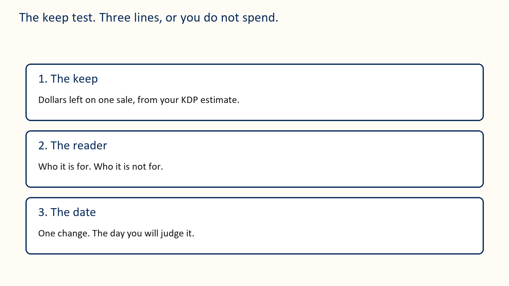
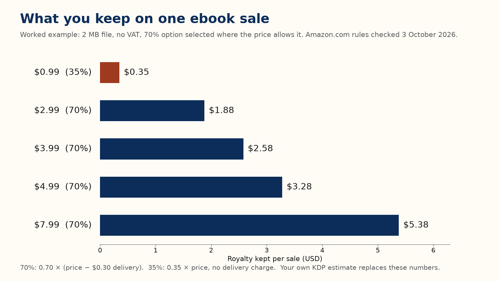
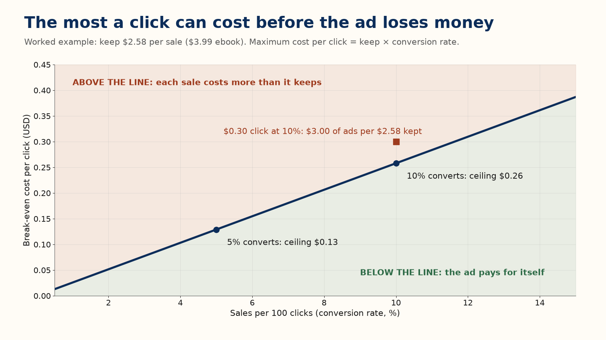
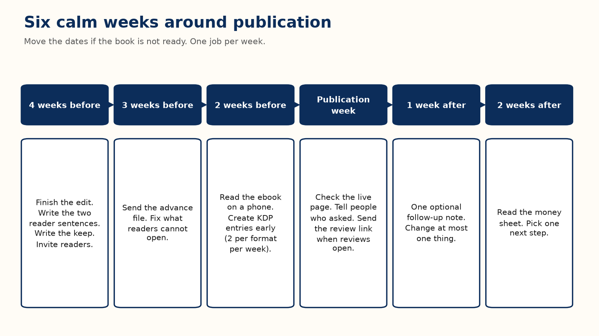

# Part I — The Short Road: One Book, One Action at a Time

## Start here

Picture a first-time author with a finished cozy mystery and a price of $0.99 in her head. She has not asked what one sale would leave her. Part I is how she finds out. She is a teaching example, and every number in her story is a worked example, not a report.

Each chapter gives one action. Do it, then turn the page. The reasons, the exceptions, and the marketplace detail live in Parts II to VIII; Part I points to them and moves on.

### The keep test

There is one method in this book, and it has three lines. Write them before you spend money or a week.

The keep. What one sale leaves you, from the royalty estimate in your KDP account. Until you have a file, use the practice number from Chapter 3 and write “practice” beside it.

The reader. Two sentences from Chapter 2: who the book is for, and who it is not for.

The date. The one change you will make, and the day you will look at the result. One change at a time is the whole discipline: if you change the price, the cover, and the ad on the same Monday, you will not know which one moved the money. Every later chapter that says “one change” means this line.

If a line is blank, do not pay for an ad, a promotion, or a stack of free copies.

## Chapter 1: Write one kind of book

The example book is a cozy mystery: one ferry office, one missing guest, one week, and the woman who keeps the office has to solve it. That is one kind of book. Her sentence for it is: a gentle mystery, a small town, no gore.

Write the one sentence you could print under your title. Then write one page for the path: what the reader knows at the start and what they know at the end. If you can retell your book only by listing someone else’s chapters, you copied a table of contents; invent your own.

### Your action

One sentence for the form, one page for the path. Do not buy a cover while the manuscript is still two kinds of book.

## Chapter 2: Name the reader

A cover, a price, and an ad each need one reader, not “people who like books.” Write two sentences:

This book helps or entertains [this reader] by giving them [this experience].

This book is a poor fit for people who want [something else].

Her pair reads: “This book entertains readers who like a gentle small-town mystery and a heroine who solves it without a gun. It is a poor fit for people who want a thriller, a romance with no puzzle, or a joke on every page.”

The second sentence matters as much as the first. A wrong buyer is unlikely to become a fan; they may return the book or write a review saying it was not what the page promised.

Then look at five books your reader already buys and write down the words those books share and their readers use. For her shelf: small town sleuth, amateur detective inn, clean no gore, village puzzle, quiet village detective. Those phrases come back in Chapter 5 and in the ad test. Never use another book’s title or author as one of your phrases.

### Your action

Write the two sentences and the five shared phrases before Friday. If they are blank, do not buy traffic.

## Chapter 3: The number you keep

Every later chapter that mentions “the keep” assumes you have done this sum.

The sticker price is not your money. The keep is what is left after Amazon’s share and, on the 70 percent option, a delivery charge.

**Platform rule [3] [4].** On Amazon.com an ebook can earn 70 percent when its list price is between $2.99 and $12.99 and you select the 70 percent option. The top of that band was $9.99 until 7 July 2026, so older advice to stop at $9.99 is out of date. The 70 percent royalty is 0.70 × (list price − any VAT − delivery cost). VAT, value-added tax, is charged on ebook sales in some marketplaces outside the United States and is subtracted before the royalty percentage is applied; Amazon.com sales carry none. Delivery on Amazon.com is $0.15 per megabyte of the file as Amazon converts it. Outside the band, or on the 35 percent option, you earn 0.35 × (list price − any VAT), with no delivery charge.

**Worked example.** 2 MB file, so $0.30 delivery; no VAT; rounded to the cent.

| List price | Option | Keep per sale |
|---|---|---|
| $0.99 | 35% | about $0.35 |
| $2.99 | 70% | 0.70 × ($2.99 − $0.30) = $1.88 |
| $3.99 | 70% | 0.70 × ($3.99 − $0.30) = $2.58 |
| $4.99 | 70% | 0.70 × ($4.99 − $0.30) = $3.28 |
| $7.99 | 70% | 0.70 × ($7.99 − $0.30) = $5.38 |

Whenever this book says “about $2.58,” it means the $3.99 line.

That table holds the $0.99 trap. A $0.99 sale keeps about $0.35; a $3.99 sale keeps about $2.58, more than seven times as much. Thirty sales at $2.99 keep about $56; twenty-five at $3.99 keep about $65. Fewer sales can pay you more.

Marketplace bands, the file-size minimums, Kindle Unlimited, and paperbacks are in Chapter 17. You do not need them to take this chapter’s action.

### Your action

Open KDP’s royalty estimate for your real file and write the keep on your sheet. Do not price a book you spent months on at $0.99.

Her three lines now read. Keep: about $0.35 at $0.99 today; about $2.58 at $3.99. Reader: the two sentences from Chapter 2. Date: raise the price to $3.99, change nothing else, and look in four weeks.

## Chapter 4: A page a stranger can trust

The cover, the description, the sample, and the book must promise the same thing. Put the promise in the first two sentences of the description, because they are what a shopper on a phone sees first.

A weak opening: “This incredible novel will change your life. A must-read for everyone who loves a good story.” It names no reader and no promise.

Her opening: “The woman who keeps the ferry office knows every guest who comes and goes. When one vanishes and leaves a chess piece on the blotter, she has until Sunday to find him, without scaring off the wedding party in the dining room. A gentle mystery for readers who want a small town, a puzzle, and no gore.”

Then open your sample on a phone and count the screens before the reader reaches what they came for. A tunnel of front matter is a reason to close the sample.

### Your action

Show your first two sentences to one stranger. If they cannot say who the book is for, rewrite them before you touch the cover or buy an ad.

## Chapter 5: Cover, keywords, and categories

**The thumbnail test.** Shrink your cover until it is about the size of a postage stamp, or look at it on your phone’s screen at arm’s length. You must still read the title, and you must still know what kind of book it is. A quiet mystery should not look like a thriller or a textbook. Do not rely on color alone; some screens show the cover in gray. If the title fails, the rest of the design does not matter yet. Chapter 22 covers genre conventions, hierarchy, and what covers cost.

**Keywords.** KDP gives you seven keyword boxes. Fill them with short phrases a reader would type, like the shared phrases from Chapter 2, not single words such as “book.” Her seven: small town sleuth, amateur detective inn, clean no gore, village puzzle, quiet village detective, gentle puzzle novel, weekend read. She leaves out the word “mystery”, because her category already carries it (Chapter 23).

**Categories.** You choose up to three. Pick the closest true shelves where your five comparison books sit, not the biggest shelf in the store. Chapter 23 has the rules and the reasons.

### Your action

Run the thumbnail test on your phone today. If the title fails, fix the cover before launch week.

## Chapter 6: Ask for an honest review

**Platform rule [1] [2].** You may give readers a free or discounted copy as long as you do not require a review and do not try to influence it. Offering anything beyond the book, such as a gift card, a refund, or a favor, invalidates the review. Amazon does not allow reviews from the author, or from friends, relatives, employers, business associates, competitors, or anyone with a financial interest in the book. Do not buy reviews, trade reviews with other authors, or ask anyone to change a rating.

**Platform rule [22].** In the United States the FTC’s rule on consumer reviews, in force since 21 October 2024, forbids a business from offering an incentive on condition that the review be positive, whether that condition is said out loud or implied.

So the request is simple, and it is the same for every reader: a review is welcome, optional, and honest, with no rating requested. Some readers will not finish. Some will finish and say nothing. Both are allowed.

A bad line: “I gave you this book, so please post five stars by Friday or I cannot send you the next one.” A clean line: “An honest review after publication is welcome and optional. No rating is requested. You can stop reading or say nothing.”

Not every willing reader can post on Amazon; Chapter 32 explains who can, and why many cannot.

### Your action

Delete any line in your invitation that sounds like a trade. Do not pay any service that promises stars.

## Chapter 7: Find readers and send the copy

The best advance reader already likes this kind of book and has time this month. Start with people who asked to hear from you, then communities whose rules allow a polite invitation. Do not scrape addresses, and do not add anyone to a list because they once said hello.

Tell them the subject, the length, the format, and the dates, and give them a way to decline. Collect a name, an email, the format they want, and one question about fit. Put any newsletter opt-in in a separate checkbox.

**Worked example.** Plan for a low response. Of 30 copies, 10, 20, or 30 percent posting would be 3, 6, or 9 reviews. Plan so that the low end is fine; readers owe you nothing.

She sent her copy to a reader who had asked for a thriller. He wrote back that the chess piece wasted his evening. She had skipped the sentence about who the book is not for.

Send four notes at most: a confirmation, the file, the store link once reviews can be posted, and one gentle follow-up. Chapter 13 has the words. If your ebook is in KDP Select, or about to be, read Chapter 28 before you email it; a public giveaway of the full ebook can break the exclusivity terms.

### Your action

Write the invitation with the “not for” sentence in it, and send the file to one willing reader before you send it to the group.

## Chapter 8: Pick three ways to be paid

A book can pay you in many ways, and Appendix D lists thirty-two, each with its smallest version and the sign to stop. This month, pick only three, each from a different section: Price, The next book, Formats and extras, or Reach.

Run each through the keep test. Write the keep for that product. Pick the smallest version that can still teach you something. Write the day you will look. On that day, keep it or stop it in one sentence on your money sheet, such as “Held the $3.99 price” or “Stopped the free days; no second book yet.”

**Worked example.** Her first idea is the price. At $0.99 she sold 20 copies in four quiet weeks and kept about $7. She changed only the price, to $3.99, and over the next four weeks sold 12 copies and kept about $31. Fewer sales, more money. She held the price through her ad test in Chapter 9 before believing it.

### Your action

Circle three ideas in Appendix D, each from a different section, and write a look-date next to each.

## Chapter 9: A small ad test

Chapter 26 adds campaign structure and ACOS; it does not repeat the cap.

You do not need many reviews to run a tiny test. You do need a cover that passes the thumbnail test, two true description lines, and a keep written down.

**Worked example.** She keeps about $2.58 on a $3.99 sale. A click costs $0.30. If one click in ten becomes a sale, the ad spends $3.00 to earn $2.58. The most a click can cost is the keep times the conversion rate: $2.58 × 0.10 = about $0.26. At 5 percent the ceiling is about $0.13. These are ceilings, not bids.

**Recommendation.** Use one Sponsored Products campaign. Set a total cap you can afford to lose, such as $20 to $60, and write the stop date before you turn it on. Stop at the cap even if you are curious; curiosity is not a budget.

Her fourteen-day log, with a $40 cap: on day 0, write the keep, the cap, the stop date, and five phrases. On day 3, look and change nothing. On day 7, if almost nobody clicked, change the cover or the phrases, not the cap. On day 14, or at $40, stop, and write sales, spend, and keep.

When you look, read in this order. Impressions but few clicks: the cover or targeting is wrong. Clicks but no sales: the page, the sample, or the price does not match the ad. Sales that keep less than they cost: lower the bid or pause. Page-read money, if you are in Kindle Unlimited, goes in its own column.

### Your action

Write the keep, the cap, and the stop date before you open the ads console. If any is blank, do not start.

## Chapter 10: The next book

One book can pay you a little. A second book can pay you again from a reader who already trusts you. That is not a reason to lose money on book one today; if book one loses money, book two is a second product, not a refund.

**Worked example.** 100 people buy book one at $3.99 and she keeps about $258. Thirty of them later buy book two at the same keep: about $77 more. That is about $335, or $3.35 per first buyer. If half of those 30 buy a third book, 15 more sales add about $39, for about $3.74 per original buyer. Paying $2 to find a buyer can fit; paying $4 does not. Never count a series as if every reader buys every book. The 30 percent who return is an assumption for this sum, not a rate to expect; real read-through varies by genre and by how good book one actually was, and only your own second book’s sales will tell you yours.

### Your action

Write one sentence for book two: who it is for and why a reader of book one would want it. If you cannot, leave book one at its ordinary price.

## Chapter 11: Six calm weeks

Move these dates if the book is not ready. A late, finished book beats an on-time file you are ashamed of.

Four weeks before: finish the edit, write the reader sentences and the first two description lines, write the keep, set the most you can lose, and invite advance readers. Three weeks before: send the advance file and fix what readers cannot open. Two weeks before: read the ebook on a phone and create your KDP entries; KDP lets you create only two new titles per format each week (Chapter 15). Publication week: check the live page, tell the people who asked, and send the review link once reviews can be posted. One week after: one optional follow-up note, and at most one change. Two weeks after: read the money sheet and pick one next step.

### Your action

Put these six dates in your calendar today.

## Chapter 12: When the book is already live

A slow book rarely explains itself. Find the first broken step, fix only that, and leave the later steps alone for two weeks.

Nobody can tell what the book is: fix the cover (Chapter 5) or the first two lines (Chapter 4). The right people never see it: change the categories and phrases. People open the sample and leave: move the reader faster to what they came for. Readers name the same flaw: believe the pattern, fix the book, and do not argue in public. Sales happen and you still lose money: compare the keep with the ad spend, pause the spend, and test the price by itself.

Pick the number that will tell you the fix worked before you start: two strangers read the title at thumbnail size; two strangers can say who the book is for; the keep on the sheet moved for a reason you can name.

### Your action

Name the earliest broken step, change only that, and write the look-date.

## Chapter 13: Words you can copy

Replace the brackets. These are your words to readers; never write their review for them.

### Public invitation

I am inviting readers who enjoy [subject] to receive a free advance copy of [Title]. It is [one true sentence, and its length], planned for [date]. If it fits and you have time during [dates], you can ask for a copy here: [link]. An honest review later is welcome and optional. No rating is requested. You can stop or say nothing.

### Confirmation

Thank you for asking about [Title]. I plan to send the [format] file on [date]. Publication is planned for [date]. You can opt out at [how]. The free copy does not require a review.

### Delivery

Your copy of [Title] is here: [link]. To open it, [steps you have tested]. If it fails, reply with what you see and I will help. I will send the store page when the book is live and reviews can be posted. Please do not pass the file on.

### The live page

[Title] is available here: [link]. If you have read it and want to leave an honest review, use the review option on that page. Reviewing is optional. If you review, please mention that you received a free advance copy.

### One follow-up

A last note about [Title]. If you finished and want to leave an honest review, the page is [link]. If you already did, thank you. If you would rather not, that is fine. I will not ask again about this book.

### Inside the book

Thank you for reading. If you want to help another reader decide whether this book suits them, you can leave an honest review where you found it. It is optional. What you actually thought is the useful part.

### First two lines you can adapt

For a novel: “[A character] wants [ordinary goal]. When [event] happens, they have until [deadline] to [action], without [cost they refuse to pay]. A [genre] for readers who want [three concrete tastes].”

For a guide: “This book helps [specific reader] do [specific job] without [the pain they already have]. You will leave with [the concrete thing]. It is a poor fit if you want [the opposite].”

## Chapter 14: A filled money sheet

Copy this shape and fill in your own lines. Her numbers are a worked example, not a report. This is her third month, after the price test in Chapter 8 and with the ad from Chapter 9.

| Line | Her month (worked example) | Yours |
|---|---|---|
| Book and price | Cozy mystery, $3.99 | |
| Keep per sale | about $2.58 | |
| Copies hoped for | 40 (about $103 kept) | |
| Ad cap and stop date | $40, the 28th | |
| Paid copies | 22 | |
| Money kept | about $57 | |
| Money spent on ads | $40 | |
| Left after ads | about $17 | |
| Editor and cover still unpaid | $600 | |
| Page reads | none (not in Select) | |
| The one change | the ad, nothing else | |
| The day you look | in two weeks | |

A useful sentence for the bottom: “$3.99, keep about $2.58, ad stopped at $40, cover still unpaid; the description is the next test.” A useless one: “Ads don’t work.” You know this month. You do not know ads.

## Chapter 15: The Kindle file

The Word file is not what the reader sees. Open KDP’s previewer and read the book on a phone-sized screen with the type larger than you like. Use real heading styles so the contents links work, give every picture words a screen reader can use, and replace any table that smears on a phone.

Before you press publish, check the title, subtitle, author name, description, cover, categories, keywords, territories, and price, then copy KDP’s royalty estimate onto your sheet in place of this book’s rounded examples.

Three more rules belong on the same checklist.

**Platform rule [8].** Each time you publish or republish, KDP asks whether the book contains AI-generated text, images, or translations. Answer for what you actually did. Chapter 33 gives the full rule and a decision chart.

**Platform rule [11].** KDP lets you create only two new titles per format each week: two ebooks, two paperbacks, and two hardcovers. Amazon announced the limit in the KDP Community on 21 September 2026, down from ten, with the count resetting each Sunday at midnight UTC. Editing a live book does not use a slot.

**Platform rule [12].** Since 20 January 2026, if you publish without DRM, verified buyers can download the book as EPUB and PDF files and read it on other devices. Kindle Unlimited borrowers cannot. Choose the DRM setting on purpose.

Finally, have one other person open the ebook, jump to a chapter, and come back to the contents. Do not announce the book until they can find their way without you.

### Your action

Read the whole preview on a phone, fix the first thing that breaks, and write KDP’s estimate on your sheet.

## Do these seven things this week

One page, one week, whether your book is still a file or already live.

1. Day 1. Write the keep from KDP’s royalty estimate (Chapter 3).
2. Day 2. Write the two reader sentences and the first two description lines (Chapters 2 and 4).
3. Day 3. Run the thumbnail test on your phone and note whether the title passes (Chapter 5).
4. Day 4. Choose up to three true categories and seven reader phrases (Chapter 5).
5. Day 5. Read the sample on a phone and fix the first place a reader would stop (Chapters 4 and 15).
6. Day 6. Circle three ideas in Appendix D and date them (Chapter 8).
7. Day 7. Fill the money sheet with this week’s real numbers, even if they are zero, and write the one change with its look-date (Chapter 14).

When all seven are done, Parts II to VIII are there for the questions this week raised. Jump to the chapter that matches the line on your sheet that is still hardest to fill.
