# Part II — The Landscape

## Before the Full Guide

This book makes you one promise: every number in it comes with the arithmetic attached. When it says a 70% royalty, it shows you what’s subtracted before that 70% ever reaches your account. When it says a category trick works, it tells you which part is a documented KDP mechanism and which part is a reasonable-but-unverifiable inference about how the algorithm behaves. When a chart is illustrating a shape rather than a disclosed statistic — a pricing curve, a launch-week effect, a backlist compounding over years — its caption says so, in words, on the chart itself. Nobody selling you a course about “the Amazon algorithm” actually has its source code, and a book that pretends otherwise is the first warning sign covered in Chapter 28.

Say the goal plainly, since the title already does: the point of everything that follows is making real, durable money from what you publish, not admiring the craft of publishing for its own sake. Most of what actually stands between a finished manuscript and real income isn’t talent — it’s a specific, learnable set of hurdles: an empty review section that makes cold traffic distrust an otherwise good page, a price picked by guesswork instead of arithmetic, a category chosen for ego instead of visibility, a scam that extracts money before the book has sold a single copy, a first year of income too thin to notice before the compounding in Chapter 29 has a chance to start. Every chapter ahead exists to get you past one specific hurdle on that list, in order, not to make you a more refined hobbyist.

That distinction matters because self-publishing has two very different reputations. To one crowd, it’s the most honest deal in publishing: no gatekeeper, a royalty rate three to seven times what traditional trade publishing pays, and a payment that lands every month for as long as the book sells. To another crowd, it’s a swamp of “publish a book in a weekend with AI” grifters, hybrid presses that charge new authors thousands of dollars for what a KDP account gives away free, and get-rich-quick threads that quietly stop posting income updates once the truth sets in. Both reputations are earned. The mechanics in this book are the same mechanics the grifters misrepresent — the difference is entirely in whether you use them to publish something worth reading, priced and positioned honestly, or to flood a category with noise until Amazon’s own enforcement catches up with you.

Who this book is for: someone who either has a manuscript already, or is willing to write one, and wants the business of getting it in front of buyers explained without a sales pitch at the end of every chapter. It is not a writing-craft book — Chapter 19 touches revision because revision is where most self-published books actually lose readers, but it will not teach you plot structure or sentence rhythm. It is not a get-rich-quick book either. Chapter 30 is blunt about what a realistic first year looks like, and it is not a yacht.

One more thing before Chapter 16: everything downstream of “click Publish” — categories, keywords, price, ads, reviews — only works on a book someone actually wants to finish. No amount of keyword research rescues a book that doesn’t deliver on its own cover promise. Keep that in the back of your mind through every chapter that follows; it is the one piece of advice in this book that was true before Amazon existed and will still be true after whatever replaces it.

## Chapter 16: Why Self-Publish

Publishing a book used to mean convincing a gatekeeper. You wrote a query letter, an agent said yes or (nineteen times out of twenty) no, the agent pitched editors, an imprint offered a contract, and eighteen months to two years later a book appeared in stores — assuming nothing fell through along the way, which it often did. That path still exists, it still confers real prestige and real distribution, and for some books it’s still the right choice. It is also not the subject of this book.

Self-publishing through Amazon’s Kindle Direct Publishing (KDP) collapses that entire chain into: you upload a file, you set a price, and roughly 24–72 hours later the book is for sale, worldwide, with no one’s permission required but your own. That is either the best thing to happen to writers in a century or a flood of unedited noise, depending on which corner of the internet you ask, and the honest answer is that it’s both — the barrier to publishing dropped to zero, and the barrier to publishing well did not move an inch. This book is about the second barrier.

### The three doors, and what each one actually costs

Traditional publishing. An advance (increasingly modest for all but lead titles), a royalty typically in the 7–25% range depending on format and figured off list or net price depending on the contract, professional editing and distribution you don’t have to arrange yourself, and a timeline measured in years. You give up pricing control, cover approval is often just consultation, and rights can be tied up for the life of copyright unless the contract reverts them. For a debut author with no platform, traditional deals have also gotten harder to land, not easier — imprints increasingly want an existing audience before they’ll bet on a book.

Hybrid and vanity publishers. A company offers to “publish” your book for a fee — sometimes a few hundred dollars, sometimes tens of thousands — providing some mix of editing, cover design, formatting, and distribution. Some hybrid presses are legitimate and transparent about exactly what they charge for and why. A great many are not: they charge premium prices for services (an ISBN, an ebook conversion, a KDP upload) that cost nothing or almost nothing to do yourself, and they lean on a new author’s uncertainty about the process to make “free” look like “expensive.” Chapter 28 covers how to tell the two apart before you sign anything.

Self-publishing. You are the publisher. That sentence is doing a lot of work, and it cuts both ways: no one is stopping you, and no one is helping you either, unless you hire the help yourself. In exchange, KDP pays a 70% royalty on ebooks in the standard price band (Chapter 17 shows the exact arithmetic) against traditional publishing’s single-digit-to-teens net royalty, keeps your rights entirely in your own hands, lets you change a price or fix a typo the same afternoon you notice it, and puts the book for sale before a traditional deal would have finished its first round of submissions. The cost is that editing, cover design, formatting, categories, keywords, pricing, launch, and advertising are now your job — either your own labor or money you spend hiring someone else’s. Every chapter after this one is one piece of that job, done properly instead of guessed at.

### Why “self-published” stopped meaning “unedited”

A decade ago “self-published” was near-synonymous with “unedited, badly formatted, amateur cover.” That reputation is dying slowly, for a specific reason: the authors making real money at this treat it like the small business it is. They hire editors. They commission or carefully design covers that meet genre and category conventions. They track royalty reports the way any business owner tracks a P&L. Amazon’s own bestseller lists are now thick with self-published authors who outsell most traditionally published midlist titles, precisely because they run the operation professionally rather than treating “self-published” as a license to skip the parts of publishing that were never actually optional.

> **Key takeaway: Self-publishing removes the gatekeeper, not the job. It trades a publisher’s cut and a publisher’s timeline for a publisher’s workload. Whether that trade pays off depends entirely on how well you do the job in the chapters ahead — not on the platform, which is free and identical for every author who uses it.**

Every chapter from here on is one stage of a single pipeline. It’s worth seeing the whole shape before diving into the first piece of it:

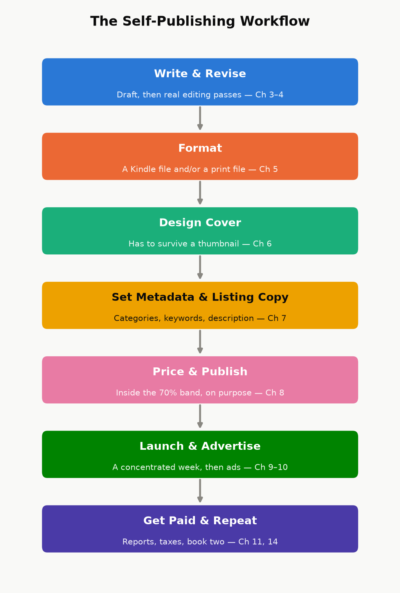

*Figure 16.1 — The self-publishing workflow this book walks through, one chapter at a time. Nothing here is optional; skipping a stage just means finding out about it later, from a review or a royalty report instead of from this book.*

### A note on doing both

These paths aren’t mutually exclusive across a career, or even across a single book — some authors self-publish a series to prove it sells, then use that sales data to land a traditional deal for future volumes; others go the other direction, getting rights reverted on an out-of-print traditionally published backlist title and re-publishing it themselves. Nothing in this book requires you to pick a side forever. It requires only that, for the books you do self-publish, you treat the business side with the same care you’d want from a publisher you were paying to do it for you.

## Chapter 17: How Amazon Actually Pays You

Before categories, before keywords, before a single dollar of advertising — you need to know what a sale is actually worth to you, in real currency, after Amazon’s cut and its fees. Almost every downstream decision in this book (what to price the book, whether an ad is profitable, whether Kindle Unlimited is worth joining) is a variation on the arithmetic in this chapter. Get this part wrong and every later chapter inherits the error.

### The ebook royalty: two plans, one cliff

KDP offers two ebook royalty plans, and — this trips up a lot of new authors — which one you get is determined automatically by your list price, not chosen as a marketing strategy:

70% royalty, available when your list price falls within the plan’s price band for that marketplace (as of this writing, $2.99–$12.99 in the US store — expanded from a $9.99 ceiling that had stood since 2007, effective July 2026 — with corresponding bands in other currencies), minus a delivery fee based on the file’s size — historically about $0.15 per megabyte. This plan also carries a “don’t undercut yourself” rule: KDP can decline the 70% rate if you’re offering the same book for less somewhere else. The expansion is opt-in for existing titles: a book already priced between $10 and $12.99 stays on the 35% plan until you go into Rights & Pricing and switch it by hand — the wider band doesn’t apply itself.

> **This number will move again.** The ceiling sat at $9.99 for nineteen years before this book was written, then changed. Every dollar figure in this book is a snapshot, not a law of nature — KDP changes royalty splits, price bands, and delivery-fee rates on its own schedule, with no obligation to announce it loudly. Check the current numbers on KDP’s own Pricing Page before you act on anything in this chapter; if it disagrees with a number printed here, KDP is right and this book is out of date.

35% royalty, available at any price from $0.99 up to $200, with no delivery fee subtracted. This is the only plan available outside the 70% price band — price a book at $1.99 or $12.99 and you’re on 35% automatically, whether you meant to be or not.

That’s the cliff: price one cent outside the 70% band and your royalty rate doesn’t taper, it drops by half. A worked example makes the stakes concrete.

> Worked example. A 350-page ebook, roughly 1.2 MB as an EPUB, priced at $4.99:

At 70%: $4.99 × 0.70 = $3.493, minus a delivery fee of roughly 1.2 MB × $0.15 ≈ $0.18. Net royalty ≈ $3.31 per copy.

At 35% (say the author instead priced it at $2.49, just under the band): $2.49 × 0.35 = $0.87 per copy — with no delivery fee to subtract, but also less than a third of the higher price’s payout.

> Pricing $2.50 lower cost this author roughly $2.44 per sale, not $0.87. That gap is the whole reason Chapter 23 spends as much time on pricing psychology as it does — the 70% band isn’t a suggestion, it’s where almost every nonfiction ebook in this genre should live unless there’s a specific reason not to.

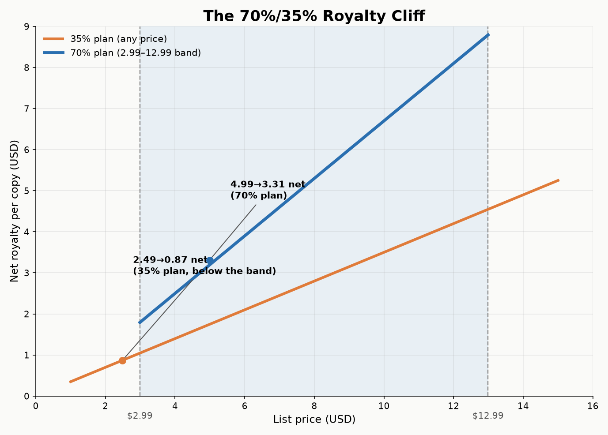

*Figure 17.1 — Net author royalty per copy at each price point. The step at $2.99 and the ceiling at $12.99 are the 70%-plan boundaries; everything outside that band falls back to the flat 35% line.*

### Kindle Unlimited and the page-read fund

If you enroll a book in KDP Select (Chapter 27 covers the exclusivity trade-off that comes with it), it becomes available to Kindle Unlimited and Kindle Owners’ Lending Library subscribers, and you’re paid not a royalty per “sale” but a per-page rate out of a shared monthly fund — Amazon sets aside a pool of money each month and divides it by the total normalized pages read across all Select books. The per-page rate therefore moves slightly every month; it has historically sat in the range of roughly $0.004–$0.005 per page (KDP announces the exact figure after each month closes, in your Reports dashboard). Pages are counted using Amazon’s own KENPC (Kindle Edition Normalized Page Count) standard, not your Word document’s page count, so formatting choices — font embedding, image sizing, front-matter bloat — can shift your page count even though the words didn’t change.

> Worked example. A 300-KENPC-page book fully read by one subscriber, in a month where the fund pays $0.0045/page: 300 × $0.0045 = $1.35 for that one full read — comparable to, sometimes less than, a single 70%-royalty sale, but earned from a reader who might never have paid $4.99 up front. Whether that trade is good for your book is exactly the question Chapter 27 answers.

For a sense of scale with a real book instead of a round number: this book runs about 34,000 words. Amazon doesn’t publish its exact KENPC formula, but the figure self-publishers have reverse-engineered by comparing known word counts against observed KENPC values clusters around 250 words per normalized page — which would put this book at roughly 135 KENPC pages, and one full Kindle Unlimited read of it at around $0.60 at the rate used above. Treat that as an estimate, not a receipt; the point is that a word count and a KU payout are the same number wearing different clothes.

### Print: paperback and hardcover

Print royalties don’t use a percentage-of-price plan the way ebooks do; they use a formula:

Royalty = (List Price × Royalty Rate) − Printing Cost

Paperback, sold through Amazon’s own store: 60% royalty rate.

Paperback through expanded distribution (third-party retailers, bookstores, and libraries KDP can place the book with beyond Amazon itself): 40% royalty rate — the same list price, a smaller share, and worth checking on a book-by-book basis whether it’s worth opting into.

Hardcover: also a 60% royalty rate minus printing cost, sold through Amazon’s own store.

Printing cost is not a number you pick — KDP calculates it from page count, trim size, ink type (black-and-white vs. color interior), and paper choice (standard white vs. cream), and it recalculates automatically if you change any of those. Use KDP’s own price calculator when you’re setting a print list price; don’t estimate the printing cost by hand, and don’t set a list price without checking that royalty ends up positive — it’s possible to price a heavily illustrated color paperback so low that KDP’s own calculator shows a negative or near-zero royalty at that price.

> **Key takeaway: A royalty rate is not a profit margin. It’s the number Amazon subtracts its own costs from — delivery fees for ebooks, printing costs for paperback and hardcover. Your actual per-copy profit is always smaller than the headline percentage, and every pricing decision later in this book starts from the real number, not the advertised one.**

### Reading your own numbers

Everything above is policy, which changes; your KDP Reports dashboard is fact, which doesn’t. Once a book is live, check the Sales Dashboard for units and estimated royalties in near-real time, and the Prior Months’ Royalties report once a month closes for the exact, finalized figures (including that month’s KENP rate). Get in the habit of reading it weekly during a launch and monthly afterward — it’s the only source in this entire book that’s about your book specifically rather than the platform in general, and every other chapter’s advice should eventually show up as a change in these numbers.

# Part III — Writing and Producing the Book

## Chapter 18: Choosing What to Write

“Write the book only you can write” is lovely advice and a poor business plan on its own. The books that make good money on Amazon sit at the intersection of two circles: something you can actually write well, and something a large enough group of people are already actively trying to buy. This chapter is about finding that intersection using Amazon’s own storefront as a research tool, instead of guessing.

### Amazon is a market-research tool you already have access to

You do not need paid keyword-research software to start. Amazon shows you demand directly, if you know where to look:

Browse the category you’re considering (not just the top-level genre — drill into the specific subcategory) and look at the current Best Sellers and Hot New Releases lists, not just the all-time top 100. All-time lists are survivorship-biased: they show you what won years ago, not what’s selling now. Hot New Releases shows recent books that are already gaining traction — a much better signal of live demand.

Check review count relative to publication date. A book with 4,000 reviews published eight years ago tells you the category has (or had) demand; a book with 300 reviews published four months ago tells you demand exists right now and a new entrant can still compete for it.

Look at who’s publishing in the category. A subcategory dominated by three or four publishers with decades of backlist is a hard room to enter. A subcategory full of single-book authors and recent, thin catalogs is fragmented — easier to be noticed in, though sometimes fragmented because the actual demand is smaller than it looks.

Read the one- and two-star reviews on the current bestsellers in your topic, not the five-star ones. Five-star reviews tell you the book worked; one- and two-star reviews tell you exactly what it left out, explained by someone who wanted it to be there. That gap is your outline.

> Worked example. Applying all four checks to one hypothetical category — a beginner’s guide to a specific hobby:

Best Sellers vs. Hot New Releases: the all-time top 20 are dominated by three books published 6–10 years ago, each with 8,000+ reviews. Hot New Releases for the same category shows two books published in the last 90 days already at 40–60 reviews — live demand, not fossilized demand.

Review count vs. publication date: one of those new entrants has 55 reviews after 10 weeks, roughly 5–6 a week — livelier than the older incumbents, who now average under 20 a week each.

Who’s publishing: four different single-book authors published in the last 18 months sit alongside the three long-established incumbents in that top 20 — fragmented, not a closed shop.

One- and two-star reviews on the incumbents: a specific complaint — no troubleshooting section for humid climates — recurs across dozens of reviews on all three bestsellers, and none of them has fixed it.

None of that guarantees a sale. It tells you the category has live buyers, room for a new entrant, and one specific, checkable gap a new book could lead with in its own subtitle and description (Chapter 22) — the difference between “I think people want this” and “here’s what twenty minutes of browsing this exact category actually showed me.”

### Write to a shelf, not into a void

Publishers call this “writing to a shelf” — knowing, before you write a word, which existing shelf your book would sit on, and what a reader browsing that shelf already expects. It sounds like it constrains creativity; in practice it’s the opposite of chasing a trend. Trend-chasing means noticing something is popular this month and racing to publish before the wave passes — by the time a trend is visible on Amazon’s charts, a meaningful number of other authors have already seen it too, and the category fills up fast. Writing to a shelf means picking a category with durable, structural demand (a persistent problem, a persistent hobby, a persistent stage of life) and writing the best specific answer to a specific reader’s specific question, rather than the broadest possible book that vaguely covers a popular topic.

> **Key takeaway: “Broad audience” and “big audience” are not the same thing. A book explicitly written for one clearly defined reader — a specific skill level, a specific goal, a specific constraint — usually outsells a book written to appeal to everyone, because the specific book’s cover, title, and sample pages all signal “this is for you” to the reader who actually needs it, instead of asking a general browser to self-select from vague language.**

### Standalone economics vs. series economics

A standalone book earns once per reader. A series earns on read-through — a reader who finishes book one and buys book two, three, four without any new marketing spend from you at all, because Amazon’s own “customers who bought this also bought” and “next in series” placements do the selling. This is the single biggest lever available to a self-published author with a limited budget: a five-book series with modest per-book sales and strong read-through routinely outearns a single book that sold as many total copies, because the series compounds — every new reader of book one is a prospective buyer of the other four, indefinitely, with no additional ad spend required. This applies to nonfiction too: a “beginner,” “intermediate,” and “advanced” set on the same topic, or a set of books that each solve one piece of a larger problem, gets the same compounding effect fiction series get from cliffhangers.

None of this is a substitute for writing something good. It’s the difference between writing something good into a category with active buyers and writing something equally good into a category nobody is currently searching. Both take the same effort to write; only one reliably gets found.

## Chapter 19: From Draft to Manuscript

A finished draft and a finished manuscript are not the same object, and the gap between them is where most self-published books lose readers — not at the idea stage, and not usually at the sentence-craft stage, but in the unglamorous work of catching the errors, gaps, and inconsistencies that a single read-through by the person who wrote it will never catch, because that person already knows what they meant to say.

### The passes, in order

Developmental — is the structure right? Does the argument (nonfiction) or the plot (fiction) actually hold together, in the right order, with nothing important missing and nothing redundant?

Line edit — does each paragraph read well? Is the voice consistent? Are explanations at the right level for the stated audience?

Copyedit — grammar, consistency (character names, spelled-out numbers vs. numerals, capitalization rules, a style choice applied the same way everywhere), and fact-checking any claim a reader could look up and check.

Proofread — the final pass, done on the manuscript in its near-final formatted state, catching typos, double spaces, and formatting accidents introduced by the editing process itself.

These are genuinely different skills, and treating them as one pass — “I’ll just read it again” — is the most common reason a self-edited book feels “almost professional” instead of professional. If you can only afford to hire one of these out, hire the copyedit; it catches the errors a reader notices consciously (“that’s a typo”) rather than the ones they only feel (“something about this felt amateur”).

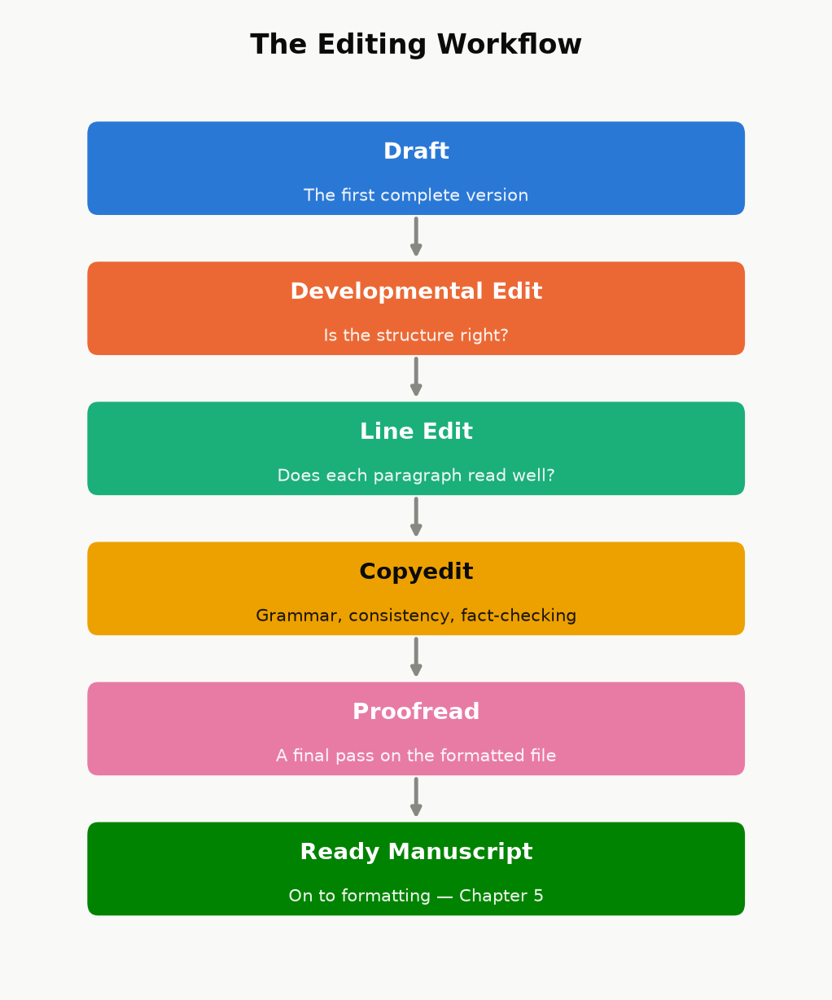

*Figure 19.1 — Four genuinely different passes, run in order, ending in a manuscript that’s actually ready for Chapter 20 — not four names for the same read-through.*

> Case study: what “professional-grade” editing actually looks like in practice. One real example: a long technical nonfiction manuscript went through three separate independent review passes after its first “complete” draft — each one specifically briefed to hunt for what the previous pass missed rather than re-check settled items, each one independently re-deriving every worked numerical example from scratch rather than trusting the displayed answer. The three passes together found and fixed 13, then 21, then 18 confirmed issues — genuine arithmetic errors, a claim that quietly contradicted the book’s own stated formula two paragraphs earlier, cross-references pointing at the wrong chapter after a renumbering, and (twice) a fix from an earlier pass that had itself introduced a new, smaller inconsistency. A separate manuscript was put through a dedicated mechanical sweep for overused qualifier words — “roughly,” “essentially,” “itself” — appearing twice on the same page, catching 111 instances a normal read-through had sailed past every time, because a reader’s eye and a targeted script are looking for different things. The lesson isn’t “hire three editors” if your budget doesn’t allow it — it’s that the errors still in your manuscript after one careful read are, almost by definition, the ones a normal read doesn’t catch. Budget at least one pass that is specifically not just reading the book again: a fact-check pass, a consistency script, a reader who has never seen the manuscript before.

### Where AI genuinely helps, and where the line is

Used well, AI tools can speed up the unglamorous parts of this process: a first-pass consistency check across hundreds of pages, generating several alternative phrasings of an awkward paragraph for you to choose between and rewrite, condensing research notes, or catching a subset of the kind of mechanical errors described above. Used badly, it becomes the entire book — a prompt, minimal human review, and a KDP upload — and readers have gotten noticeably better at spotting the tell-tale flatness of that approach, which shows up in review sections as a specific and damaging complaint.

Two things are not optional, regardless of how much AI assistance you use in your process:

Amazon requires disclosure. KDP’s publishing questionnaire asks you to declare whether a title contains AI-generated text, images, or translation, and misrepresenting that is a content-policy violation, not a gray area. Answer it honestly.

A human has to be the last editorial judgment. Whatever tools condense, draft, or suggest, the decision that a sentence is accurate, that an example is correct, and that a chapter says what you actually mean has to be made by a person who is accountable for it — which in practice means the fact-check and consistency passes above are not optional just because a tool helped write the first draft.

Chapter 32 covers AI’s use elsewhere in the business (covers, ad copy, keyword research), states the disclosure rule in full, and names a specific process — condensing existing books and auditing the result until it no longer resembles them — that is not the same thing as what this section describes.

### A minimum revision checklist

If you do nothing else before publishing, do these:

Read it aloud, or have text-to-speech read it to you. Your ear catches rhythm problems and repeated words your eye slides past.

Check every number and every cross-reference. “As shown in Chapter 19” needs to actually be Chapter 19, still, after every reorganization.

Run one adversarial pass. Read it once specifically looking for ways to be wrong — a claim you can’t actually back up, a promise the book doesn’t deliver on, a contradiction between an early chapter and a later one.

Get at least one outside reader who has never seen the manuscript before, and ask them specifically where they got confused or bored, not just whether they “liked it.”

## Chapter 20: Formatting That Doesn’t Break Kindle

Ebook formatting and print formatting are not the same job wearing two hats — they solve different problems, and treating one file as automatically correct for both formats is where a lot of self-published books develop avoidable, embarrassing bugs (a page-number reference in a book with no fixed pages, a table of contents with no working links, a paperback with no page numbers at all).

### Ebooks: let Kindle do the navigation

A Kindle reader can change font size, font, and line spacing, which means your ebook has no fixed pages — “page 47” means something different on every device and at every font size a reader might choose. Two consequences follow directly:

Don’t build a page-numbered table of contents. It cannot be accurate, because there are no fixed pages to number. Kindle instead builds its own “Go To” navigation menu automatically, directly from your document’s Heading 1 / Heading 2 paragraph styles — which is why using real heading styles (not just bold, oversized text that merely looks like a heading) is the single most important formatting choice in the whole manuscript. A plain-text contents listing (titles only, no page numbers, the way this book’s own front matter does it) is a nice reader convenience on top of that, not a replacement for it.

Skip the index. A print index maps terms to page numbers; without fixed pages, that mapping is meaningless. If a reference title needs a true, searchable index, that’s a signal to route it through print rather than positioning it as a Kindle-only reference work.

Beyond headings, keep ebook formatting deliberately plain: standard paragraph styles, images sized to look correct at typical device widths rather than at one specific screen size, and no fixed-width text boxes or multi-column layouts, which most reflowable Kindle formats handle poorly. Kindle Create (Amazon’s free formatting tool) or a clean Word document with correctly applied heading styles both get you there; what matters is the underlying structure, not which tool produced it. Before you publish, use KDP’s own online previewer and check the book on more than one simulated device size — a layout that looks fine on a tablet-width preview can crowd an image awkwardly on a phone-width one.

### Print: everything the ebook didn’t need

A paperback or hardcover interior needs the things the ebook explicitly skipped, plus a few of its own:

A real, page-numbered table of contents — because print pages are fixed, this one actually works, and readers expect it.

Page numbers and (usually) running headers, placed and styled consistently throughout.

Front matter in the conventional order: title page, copyright page, optional dedication, table of contents, then the body — readers of print nonfiction expect this shape, and deviating from it reads as amateur even when nothing is technically wrong.

A trim size choice. 6”×9” is the most common choice for nonfiction — large enough to keep line lengths comfortable, small enough to print economically — with 5.5”×8.5” a common alternative for shorter, more portable guides.

Margins that account for the gutter — the inner margin needs extra room so text isn’t swallowed by the binding, especially as page count grows.

Bleed, only if something touches the page edge. A book with no full-bleed images or background color doesn’t need a bleed margin at all; add one only for pages that actually require it.

Spine width and cover dimensions calculated by KDP’s own cover template tool, not by hand. Spine width depends on exact page count, trim size, paper color (white vs. cream), and interior ink (black-and-white vs. color) — four variables that make hand-calculating it a good way to order a cover that doesn’t fit.

A physical proof, ordered and actually read, before you hit publish. Screen previews miss things — color that renders differently in print, a margin that looked fine on screen but crowds the gutter, a font substitution — that only show up in your hands.

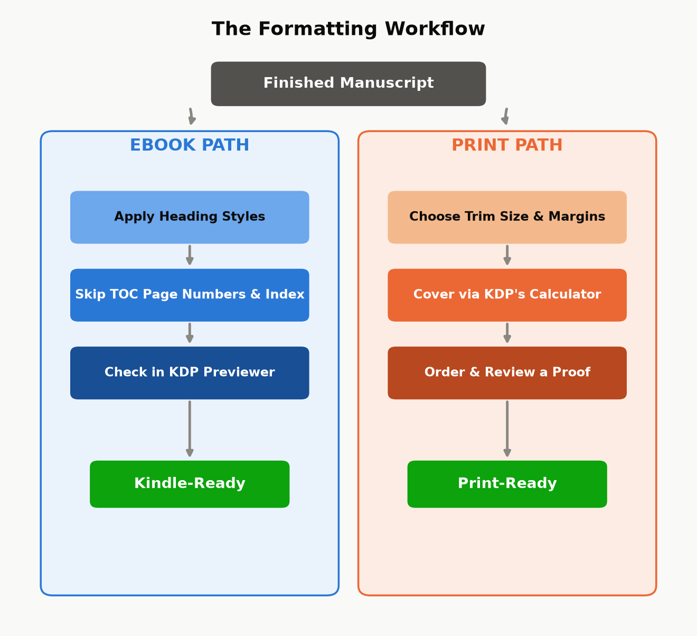

*Figure 20.1 — The same finished manuscript, two different finishing workflows. They diverge immediately, and “did the ebook steps by habit on the print file” (or vice versa) is exactly the kind of avoidable bug this split is meant to prevent.*

> **Key takeaway: Format for the reader’s actual device, not for how the manuscript looks in your word processor. An ebook formatted like a Word printout (fixed page-number references, a dead table of contents) looks broken to a Kindle reader; a paperback formatted like a webpage (no page numbers, no running headers) looks unfinished to a print reader. Same words, two different finished products.**

## Chapter 21: Covers That Sell in a Thumbnail

A cover has one job before it has any other job: survive being shown at roughly the size of a postage stamp. Almost every place a shopper actually encounters your book for the first time — search results, a “customers also bought” carousel, a category browse grid — shows it small, often under 150 pixels wide, often on a phone screen, often for under a second before the shopper’s eye moves on. A cover that looks stunning full-screen and unreadable as a thumbnail has failed at its actual job, no matter how good the artwork is.

### The thumbnail test

Before you finalize any cover — yours or a hired designer’s — shrink it down to actual thumbnail size and look at it from a normal viewing distance, not zoomed in on your monitor. Ask three questions:

Can you read the title at that size, at a glance, without leaning in?

Does the genre or category read correctly at a glance — does a business book look like a business book, a thriller like a thriller — even with no ability to read the small print?

Is there one clear focal point, or does the eye not know where to land?

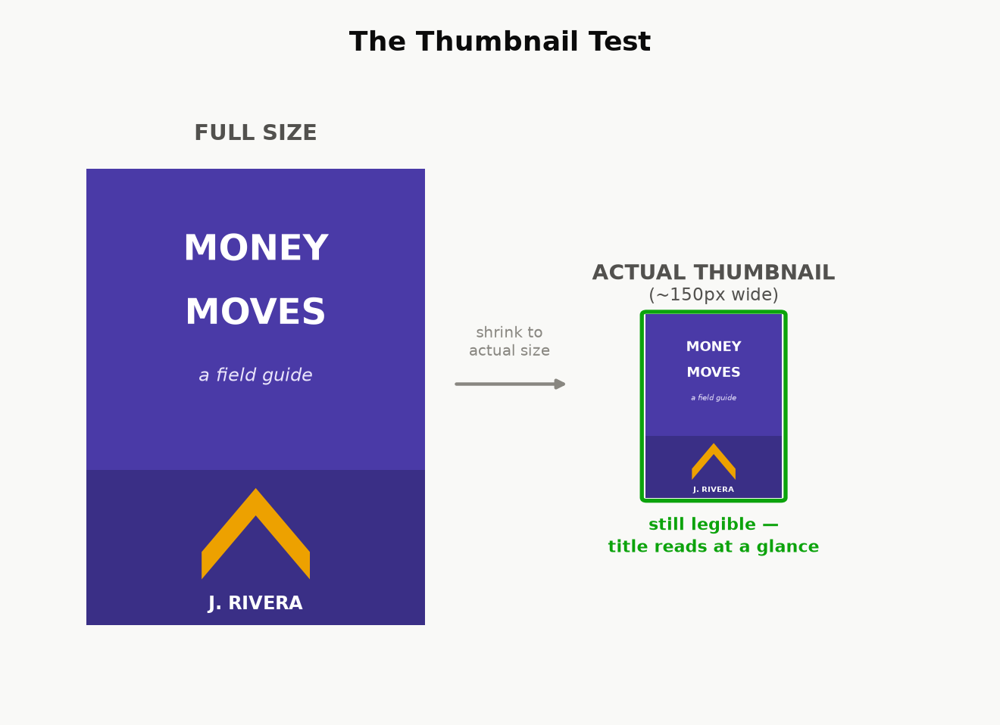

*Figure 21.1 — The same cover concept at full size and at the size a shopper actually sees it first. Details that read fine large enough often disappear entirely at thumbnail size — check at the smaller size, not the larger one.*

### Genre conventions exist because readers use them

A reader scanning a category page is pattern-matching, not reading — they’ve learned, from years of browsing, what a thriller cover looks like versus a cozy mystery, what a business book looks like versus a memoir. This isn’t a creative constraint to fight; it’s a communication channel to use. A cover that deliberately breaks convention can work, but only as a calculated choice made after you understand what you’re breaking from — breaking convention by accident, because you didn’t research what similar, successful books in your exact category actually look like, just reads as confusing rather than distinctive. Before commissioning or designing a cover, pull up the current bestsellers in your specific subcategory and note what they share: color palette conventions, typography weight, how much of the cover is imagery versus type, where the author name sits relative to the title.

### Hierarchy: title, subtitle, author — in that order, usually

For most nonfiction, the reading order a cover should guide the eye through is: title first (the hook), subtitle second (the specific promise — for nonfiction, the subtitle is doing real advertising copy work, not just decoration; it’s where “learn to play piano” becomes “learn to play piano in 30 days with no prior experience”), author name last, unless you’re already a known quantity in the category, in which case your name can carry as much weight as the title. Don’t split attention evenly across all three — a cover where the title, subtitle, and author name are all the same visual weight gives the eye nowhere obvious to start.

### DIY, template, or hire — and what each actually costs

KDP’s built-in Cover Creator produces a serviceable, template-based cover for free. It is recognizable as a template to anyone who’s seen a few of them, which is a real cost even though the dollar cost is zero — fine for testing an idea, rarely the right choice for a book you’re investing real marketing effort behind.

Template marketplaces and freelance platforms (pre-made cover templates customized with your title, or a freelancer working from a brief) typically run from double digits to a few hundred dollars and can look genuinely professional if you choose a template built for your actual genre and category, not just one that looks nice in isolation.

A dedicated cover designer, especially one who already works in your specific category, costs more — often several hundred dollars and up — but understands the genre conventions above without being told, and is usually the best return on investment for a book you expect to actively market, because the cover is one of the few assets that keeps working for you on every single impression, for free, for as long as the book is listed.

Whichever route you take, run the finished cover through the thumbnail test above before you commit to it — it’s the cheapest quality check in this entire chapter, and the one most often skipped.

# Part IV — Getting Discovered

## Chapter 22: Categories, Keywords, and Your Product Page

A shopper finds your book two ways: searching for it directly, or browsing a category and encountering it. Keywords control the first path, categories control the second, and both are set from the same KDP upload screen in about five minutes — which is exactly why they’re worth doing carefully instead of on autopilot. This is the cheapest, highest-leverage discoverability work in the entire book, because it costs nothing and takes effect immediately.

### The seven keyword slots

KDP gives you seven keyword fields, each accepting a phrase of up to fifty characters. Three rules make the difference between slots that work and slots that are quietly wasted:

Use full phrases, not single words. A slot can hold “budgeting for freelancers with irregular income,” not just “budgeting” — and a specific phrase matches how people actually type search queries far better than any single generic word does. A single word also wastes the other forty-plus characters of space you were given.

Don’t repeat words already in your title, subtitle, or series name. Amazon already indexes those for search; a keyword slot spent repeating “budgeting” when your title already contains “budgeting” is a slot doing no new work at all. Spend every slot on a phrase your title doesn’t already cover.

Never use another author’s name, a competing book’s title, or a trademarked term you don’t own, even though it’s technically possible to type one into the field. This is a KDP content-policy violation, not a gray-area growth hack, and it risks the listing itself, not just the keyword.

Where do the actual phrases come from? The single best free source is Amazon’s own search bar: start typing a query a real customer might type — “how to self-publish,” “self-publishing for” — and read the autocomplete suggestions. Those are real, aggregated queries other shoppers have actually typed, which makes them a far better source than guessing. Reading the “Look Inside” blurb language and the customer-review wording on the current bestsellers in your category is a second free source — readers often describe a book using different words than the author chose for the title, and those reader words are exactly what future readers will search.

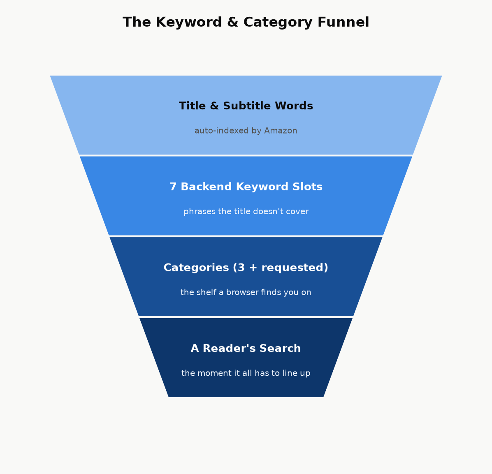

*Figure 22.1 — Discovery is a funnel: your title and subtitle are indexed automatically, seven backend keyword slots extend that coverage to phrases the title doesn’t use, categories place you on the right shelf, and all of it only pays off if it matches what a real shopper actually types or browses for.*

### Categories: pick the smallest room you actually belong in

At upload, KDP lets you choose up to three browse categories from Amazon’s BISAC-based category tree. The instinct to pick the biggest, most prominent category (“Business & Money”) is usually a mistake — it’s an enormous room where you’re competing against every business book on Amazon for attention. The more specific leaf category you can honestly claim (“Business & Money → Small Business & Entrepreneurship → Home-Based Businesses,” for instance) is a much smaller room, which means a given level of sales velocity moves you much further up its charts — including, for a genuinely small category, potentially far enough to earn an “#1 Best Seller” orange tag, which is itself a credibility signal that helps convert future browsers.

Amazon’s full category list is considerably longer than the three slots exposed in KDP’s own self-service picker, so choose your three with real care at upload rather than treating the choice as a draft you’ll casually widen later. More generally, whatever question or problem comes up anywhere along the way — categories included, but by no means limited to them — [KDP support](https://kdp.amazon.com/en_US/contact-us) is there to help, and a direct answer from them beats guessing from any outside source, including this book.

> **Key takeaway: Keywords are free, instant, and editable — you can revisit them the day after launch based on how the book is actually performing. Categories are chosen once at upload from a shorter list than Amazon’s full category tree contains, so choose your three with real care.**

### Your product page: the description does the selling the cover can’t

The cover (Chapter 21) earns the click. The book description — the block of text on the product page, up to 4,000 characters, with light HTML formatting available (bold, italics, line breaks, bullet lists) through KDP’s description editor — is what turns that click into a sale. It is advertising copy, not a table of contents, and the single most common mistake is writing it like the second thing instead of the first.

The shape that works, in order:

A hook, in one or two sentences. Open on the reader’s actual problem or the transformation they want, not on your book’s topic. “Most new authors lose money on their first book” earns another sentence of attention; “This book is about self-publishing on Amazon” does not.

The promise. One short paragraph on what the book delivers and, for nonfiction specifically, why this author — credentials, results, or a specific angle that differentiates it from the ten other books on the same shelf.

A scannable bulleted list of concrete takeaways. Most shoppers skim rather than read a product description top to bottom; five to eight specific, concrete bullets (“The exact royalty math behind the 70%/35% split,” not “Learn about royalties”) do more conversion work than another paragraph of prose.

Proof, if you have it. A review pull-quote, a credential, a relevant result — this section is optional and short; don’t manufacture proof you don’t have.

A short call to action. One line, telling the reader what happens next (“Scroll up and grab your copy” reads as a cliché for a reason — it works because it removes the last moment of friction before the buy button).

> **Worked example — before and after.**

> Before: “This book covers how to publish on Amazon KDP. It talks about royalties, pricing, categories, keywords, and marketing. It is useful for anyone who wants to become a self-published author.”

> After: “Most new authors lose money on their first book — not because the book is bad, but because nobody told them how the royalty math, the categories, or the ads actually work. Your First Book That Sells fixes that, with the arithmetic shown every time. Inside, you’ll learn: the exact price where your royalty rate cuts in half (and why most authors hit it by accident) · the seven keyword slots almost everyone wastes · a break-even ad formula you can run in your head · which KDP Select and going-wide decision actually fits your book. No guru pitch, no upsell — just the mechanics, shown, so you can run the numbers yourself.”

> Same facts, same length limit — the difference is entirely in what got promoted to the first sentence and what got turned into something scannable instead of buried in a paragraph.

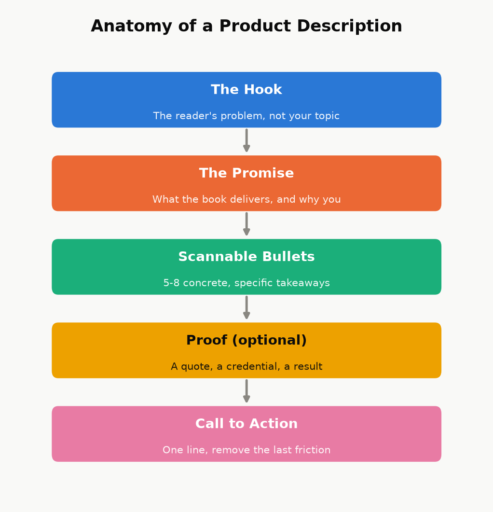

*Figure 22.2 — The description’s job, in order. Skip the hook and open on your topic instead, and most shoppers never reach the part where you actually make your case.*

Two more product-page pieces, both free and easy to skip:

Amazon Author Central. A free profile — bio, photo, and every book you publish under that name, automatically linked — that turns a single-book sale into a chance to be discovered as an author with a catalog (Chapter 29). There’s no reason not to set this up on day one.

A+ Content (Enhanced Brand Content). Image-and-text modules that can appear further down the product page. Eligibility and setup have changed more than once and vary by account, so treat this as “worth checking your current KDP dashboard for,” not as a guaranteed day-one option the way Author Central is.

Like price and keywords, the description isn’t a one-time decision — it’s editable the same afternoon you notice it isn’t converting, at zero cost. If a book has decent traffic (from ads or category placement) but a weak conversion rate, the description is one of the first three places to look, right alongside the cover and the price.

## Chapter 23: Pricing for Profit

Chapter 17 showed you the mechanical cliff between the 35% and 70% royalty plans. This chapter is about where inside — or deliberately outside — that band your specific book should sit, and why “as high as the market will bear” and “as low as possible to win on price” are both usually wrong answers for a new nonfiction title.

### The default range, and why

For most standalone nonfiction in the $2.99–$12.99 band, $3.99–$6.99 is a sensible starting range: high enough to signal real value (a $0.99 how-to guide reads, fairly or not, as slight and disposable to a lot of shoppers), low enough to be an easy impulse decision against a specific, felt problem. A narrow, high-authority professional or technical niche can often support pricing at or near the $12.99 ceiling of the 70% band — readers solving an expensive problem (a business decision, a certification, a skill tied directly to income) are reliably less price-sensitive than readers buying general-interest nonfiction, and testing a higher price within the band costs you nothing but a little time to observe the effect on conversion.

Pricing under $2.99 does double damage at once: it drops you to the 35% royalty plan (Chapter 17’s cliff) and it can read, to a browsing shopper, as a signal that the book itself is thin or low-effort — the opposite of the “impulse-buy bargain” effect a low price is often chosen to create. There are legitimate reasons to price low deliberately (a short lead-in title meant to build an email list or a series, discussed below) — but those are choices made for a specific strategic reason, not a default.

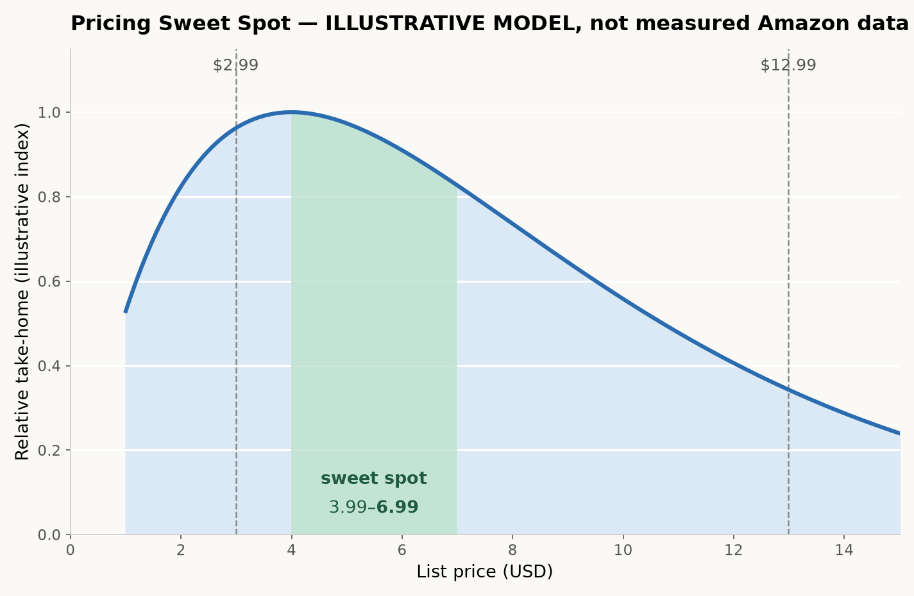

*Figure 23.1 — Illustrative model, not a disclosed Amazon statistic: take-home per book is price times conversion, and conversion falls as price rises. The curve’s shape — a broad middle that beats both extremes — is the real lesson; the exact peak location varies by book, category, and audience.*

### Print has its own floor

A paperback or hardcover list price must clear the printing cost before any royalty exists at all (Chapter 17’s formula). KDP’s price calculator will show you the minimum list price at which a royalty becomes positive for your exact page count, trim size, and ink choice — treat that number as an absolute floor, not a target, since a print book priced at the bare minimum often leaves you earning a few cents a copy after printing cost, which covers approximately none of the time this book has described so far.

### Pricing a series on purpose

For a series or a closely related set of nonfiction guides, price is a strategic lever across the whole set, not just one book: many authors price the first entry a little lower than the rest, specifically to lower the barrier to the read-through effect described in Chapter 18 — a reader who tries book one cheaply and likes it converts into a full-price buyer for every subsequent book, with no further marketing spend from you. True “$0.00 forever” pricing isn’t directly settable on KDP outside specific short promotional windows; the common way authors achieve a genuinely permanent free first-in-series title is by setting the ebook free on a retailer that allows it directly (Apple Books, or a distributor like Draft2Digital that reaches several at once — see Chapter 27), then submitting that lower price to Amazon as a price-match request, since Amazon’s own systems will match a lower verified price found elsewhere.

### Discount tools, honestly described

KDP Select enrollment (Chapter 27) unlocks Free Book Promotions — a limited number of days where an enrolled book can be offered free directly on Amazon, useful for a launch push or to re-energize a backlist title’s visibility. The alternative in each 90-day term is a Kindle Countdown Deal: a discount of up to seven days, on Amazon.com and Amazon.co.uk only, once the book has been enrolled for at least 30 days, and you keep your selected royalty rate during the deal, even below $2.99. You get one or the other per term, never both. These tools have changed before, so check the KDP Select pages for what is offered today rather than relying on an older blog post.

This chapter covers pricing at the level every book needs. Chapter 31 goes much further into one specific piece of it — the mechanics of *when* to move the price and why, tied to the review-seeding timeline — for anyone who wants the deeper tactical version once the basics here are settled.

## Chapter 24: Launching Without an Audience

The single biggest myth about a book launch is that it requires an existing audience. It doesn’t — it requires concentration: the same number of sales and reviews landing in a short, coordinated window does far more for a new book’s visibility than the identical numbers trickling in over a month, because Amazon’s own ranking and recommendation systems respond to velocity — how fast a book is moving right now — not just cumulative totals.

### Pre-orders: a deadline you set for yourself

KDP lets you list a book for pre-order up to a year ahead of its release date, which gives you weeks or months to gather momentum before day one instead of starting cold. The trade-off is a real deadline: your final manuscript file has to be locked in and approved before the release date, and Amazon has tightened its enforcement around pre-orders that miss their promised release — a pattern of late files can cost an account its pre-order privileges entirely. If you use a pre-order, treat the file-upload deadline as immovable and finish your revision passes (Chapter 19) with real margin before it, not right up against it.

### Building an ARC team, correctly

An ARC (Advance Reader Copy) team is a small group of readers who receive the book free, ahead of or right at launch, in exchange for an honest review. Recruiting one is straightforward — a call-out to your existing network, relevant online communities for your genre or topic, or a simple sign-up page — but the ethical and policy line here is sharp and worth stating plainly:

> **Key takeaway: You may give a book away free in exchange for a reader’s honest opinion. You may never give anything — a free copy, cash, a discount, or any other incentive — in exchange for a positive review, or review-swap with other authors. The first is normal, encouraged industry practice and is what an ARC team actually is. The second is a violation of both Amazon’s content policies and FTC disclosure rules, and it’s the exact mechanism behind several real account suspensions. Ask for honesty, not praise, and say so explicitly when you hand out review copies.**

### Launch week is a coordination problem, not a luck problem

The goal of launch week is to concentrate every review, every purchase from your own network, and any promotional push you’re running into the same narrow window — rather than let them land in a scattered trickle — because a short burst of real velocity is what triggers “Hot New Release” placement and meaningful category rank movement. Category rank is relative and constantly recalculated: it reflects your sales velocity compared to everything else currently active in that category, not a lifetime total, which is exactly why the specific, smaller category you chose in Chapter 22 matters so much at launch — the same burst of sales that barely dents a giant category’s chart can be enough to hit #1 New Release or #1 Best Seller in a well-chosen, narrower one, and that badge then becomes its own discoverability and credibility signal to every subsequent browser.

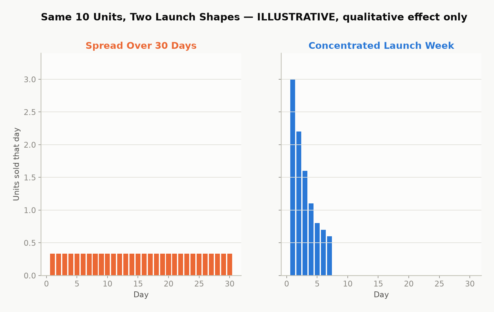

*Figure 24.1 — Illustrative model: the same total sales, spread thin across a month versus concentrated into a launch week. Amazon’s own ranking mechanics aren’t public, but the qualitative effect — concentrated velocity moves rank further than the same total spread thin — is well established indie-publishing practice, not a guarantee for any specific book.*

A practical launch-week checklist: line up your ARC reviews to post at or immediately after launch rather than whenever each reader happens to finish; tell your own network the specific date rather than “it’s out now” whenever convenient; and hold back any planned ad spend or promotion (Chapter 25) to start the same day rather than staggering it in afterward.

Everything above is the shape of a launch. Chapter 31 is the deep version of just the ARC and review-eligibility piece — who can actually post where, how to run the roster without tripping Amazon’s rules, and what to do with the first review that isn’t a good one — for anyone whose launch lives or dies on review count specifically.

## Chapter 25: Amazon Ads Without Wasting Money

Amazon Advertising (Sponsored Products, for most authors) lets you pay to place your book directly in search results and on other books’ product pages. It’s the closest thing self-publishing has to a dial you can turn up or down on demand — and also the fastest way to lose money if you turn it on without understanding the one number that actually matters: whether an ad is profitable at all.

### Auto campaigns first, manual campaigns second

Start with an automatic targeting campaign, where Amazon chooses which searches and product pages to show your ad against based on your book’s own metadata. Its job isn’t to be profitable on day one — it’s to generate data: after a couple of weeks, its Search Term Report shows you exactly which real customer searches actually led to clicks and sales. Take the phrases that converted well and move them into a manual campaign, where you control the bid on each keyword directly, and let the underperforming broad automatic spend taper down. This sequence — auto for discovery, manual for control — avoids the common new-advertiser mistake of guessing at keywords from scratch and bidding blind.

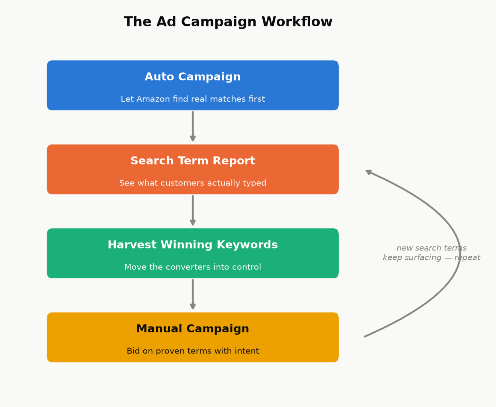

*Figure 25.1 — This isn’t a one-time setup. New search terms keep surfacing after the first harvest, so the loop back to the Search Term Report keeps running for as long as the campaign does.*

### The only formula that matters: break-even ACOS

ACOS (Advertising Cost of Sales) is simply:

ACOS = Ad Spend ÷ Ad-Attributed Sales × 100%

An ad is profitable exactly when its ACOS is below your break-even ACOS — the percentage of a sale’s revenue that equals your actual royalty margin:

Break-even ACOS ≈ Royalty per Copy ÷ Sale Price × 100%

> Worked example. A $4.99 ebook earning a $3.31 net royalty (Chapter 17’s worked example) has a break-even ACOS of 3.31 ÷ 4.99 ≈ 66%. Spend $10 in ads and sell three copies attributed to that spend (royalty: $9.93) and your actual ACOS is 10 ÷ 9.93 ≈ 101% — losing money on the ad, even though it “worked” in the sense of generating sales. The same $10 spend producing five sales (royalty: $16.55) gives an ACOS of 10 ÷ 16.55 ≈ 60% — under the 66% break-even line, and genuinely profitable.

Break-even is a floor, not a target. Community-reported benchmarks among self-published authors commonly put a healthy target ACOS for a single nonfiction title with no backend series well below that floor — often cited in the 20–35% range — with more room to run a break-even or slightly negative campaign on a series book that has real read-through behind it. Expect the first thirty to sixty days of any new campaign to run hotter than your real target while it gathers the data described below; a high ACOS in that window is normal, not a verdict on the book.

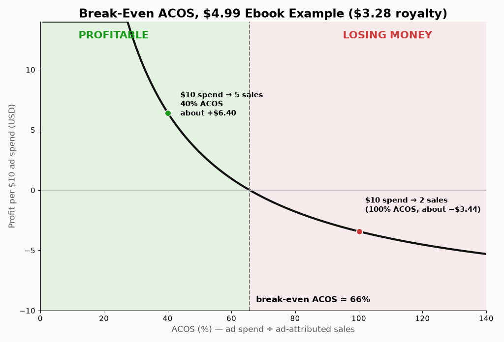

*Figure 25.2 — The break-even line for the $4.99 example above. Below the line, an ad is paying for itself before any read-through, page-read income, or brand-visibility effect is even counted; above it, the ad is a net cost you’re choosing to pay for exposure, which can still be a reasonable choice during a launch, as long as you’re making that trade on purpose.*

Two caveats worth holding onto: direct ACOS profitability isn’t the whole picture. A break-even-or-slightly-negative ad during launch week can still be worth running for the visibility and momentum effects described in Chapter 24, as a deliberate, bounded spend — the danger is treating every ad that way indefinitely, rather than as a specific, time-limited choice. And a single sale can undercount a book’s real return if it’s part of a series — factor a reasonable estimate of read-through into subsequent volumes before writing off a campaign that looks marginal on book one alone.

### Budget discipline for a new advertiser

Start with a small daily budget and let a campaign run long enough to gather a meaningful number of clicks before judging it — a campaign killed after two days rarely has enough data to mean anything.

Read the Search Term Report, not just the campaign-level ACOS — it’s common for one converting phrase to be subsidizing several non-converting ones sitting in the same auto campaign.

Add non-converting search terms as negative keywords once they’ve had enough clicks with zero sales to be a real signal, not a fluke — this stops you paying repeatedly for traffic that’s already shown you it doesn’t convert.

Revisit bids and budgets weekly, not daily — day-to-day noise in a small campaign’s numbers is mostly randomness, not signal.

# Part V — The Business Side

## Chapter 26: Getting Paid: Taxes, Payments, and Reporting

The most common reason a new author’s first royalty payment is delayed or smaller than expected has nothing to do with sales — it’s an incomplete tax interview. This chapter is the unglamorous plumbing that makes sure the money your earlier chapters worked to earn actually reaches you, at the rate it’s supposed to.

### The tax interview isn’t optional paperwork — it sets your withholding rate

Before KDP releases any royalty, it requires a tax interview, completed in your account settings:

US persons complete a Form W-9.

Non-US individuals complete a Form W-8BEN.

Non-US entities (a company rather than an individual) complete a Form W-8BEN-E.

Here is the part that catches people off guard: royalties are US-source income for tax purposes, and the default US withholding rate on that income for a non-US person is 30%, taken straight off the top before you ever see it. Many countries have a tax treaty with the United States that reduces or eliminates this withholding on royalty income specifically — but that reduced rate is not automatic. To claim it, your W-8BEN needs a foreign taxpayer identification number and an explicit treaty claim referencing the relevant treaty article. Skip that step, even by accident, and you default to the full 30% withholding regardless of what your country’s treaty actually allows.

> **Key takeaway: Treaty rates and eligibility genuinely vary by country and change over time — this book won’t guess a number for your specific situation. Look up your country’s current entry in the US Tax Treaty tables (or ask an accountant who handles cross-border royalty income) before your first sale, get whatever foreign tax ID the treaty claim requires, and complete the W-8BEN correctly the first time. Fixing an incorrect tax interview after the fact is entirely possible but slower than doing it right before you need it.**

If a required taxpayer ID takes time to obtain in your country, start that process as early as possible — ideally before you expect your first payment — rather than discovering the delay when a payment is already held up.

### How and when you’re actually paid

KDP pays royalties by direct deposit (or check, where direct deposit isn’t available for your country/currency), roughly 60 days after the month in which the royalty was earned closes — a February sale is typically paid around the end of April, not immediately. Payment also requires your accumulated royalty balance to clear a minimum threshold, which varies by currency and payment method; check your own Payment settings inside KDP for the current number rather than relying on a fixed figure here, since these thresholds are exactly the kind of detail that changes without much announcement.

### Reading your reports without confusing yourself

KDP gives you three different views of your own money, and new authors frequently compare the wrong two against each other:

Sales Dashboard — near-real-time, estimated units and royalties. Useful for watching a launch unfold; not the final number.

Prior Months’ Royalties report — the finalized figures for a closed month, after returns and any KENP fund rate is set. This is the number that will actually match what gets paid.

Payments report — the actual disbursements made to your bank account, which lag the royalty-earned month by the ~60-day delay above.

Expect the Sales Dashboard’s running estimate and the eventual finalized monthly report to differ slightly — that’s normal, not an error, and it’s exactly why the finalized report, not the live dashboard, is the number to use for any real accounting.

### Treat it like the business it is

Once money is actually moving, a little bookkeeping discipline pays for itself: keep records of every business expense (editing, cover design, ads, any software or service subscriptions) against your royalty income, and consider a dedicated bank account once revenue is more than trivial, purely to keep the paper trail clean. Whether self-published royalty income counts as self-employment income or passive royalty income for tax purposes is a real, fact-specific question in a number of jurisdictions — it typically depends on how regularly and actively you’re engaged in the business of writing and publishing, not just on the fact that “royalty” is in the name — and it materially affects which expenses are deductible and whether self-employment-type tax applies. This is exactly the kind of question worth a genuine conversation with an accountant familiar with creative or royalty income once you’re earning enough for the distinction to matter, rather than a guess from a general-purpose guide like this one.

## Chapter 27: KDP Select vs. Going Wide

Once a book is written, formatted, priced, and ready to launch, you face one more structural decision: does the ebook live on Amazon exclusively, or everywhere at once? Neither answer is universally correct, and the honest version of this chapter is that it depends heavily on your genre and your specific readers.

### What Select actually asks for, and what it gives back

Enrolling an ebook in KDP Select commits it to a rolling 90-day exclusivity period: for that ebook edition specifically, it can only be sold as an ebook through Amazon — not Apple Books, Kobo, or anywhere else. This restriction applies to the digital edition only; a paperback or hardcover edition of the same book is entirely unaffected and can be sold anywhere regardless of your Select enrollment. In exchange, Select unlocks:

Kindle Unlimited / Kindle Owners’ Lending Library page-read income (Chapter 17’s KENP mechanics) — for some genres, this is not a minor bonus but the majority of total revenue.

Free Book Promotions — a limited number of days where the book can be offered free directly on Amazon, useful for a launch push, a series first-volume strategy (Chapter 23), or reviving a quiet backlist title.

At the end of each 90-day term, Select auto-renews unless you opt out — worth calendaring, so a decision to go wide doesn’t get delayed by simply forgetting the renewal date exists.

### What “going wide” gets you instead

Going wide means distributing the ebook to multiple retailers and library platforms — Apple Books, Kobo, Barnes & Noble, Google Play Books, and library-lending systems — either by uploading to each directly or, far more commonly, through an aggregator like Draft2Digital or PublishDrive, which handles the individual retailer relationships for a cut of sales made through it. The upside is real: your income isn’t dependent on one platform’s rules, algorithm changes, or payment terms, and some readerships (certain nonfiction niches especially) skew more heavily toward Apple or library reading than Amazon’s fiction-heavy Kindle Unlimited subscriber base does.

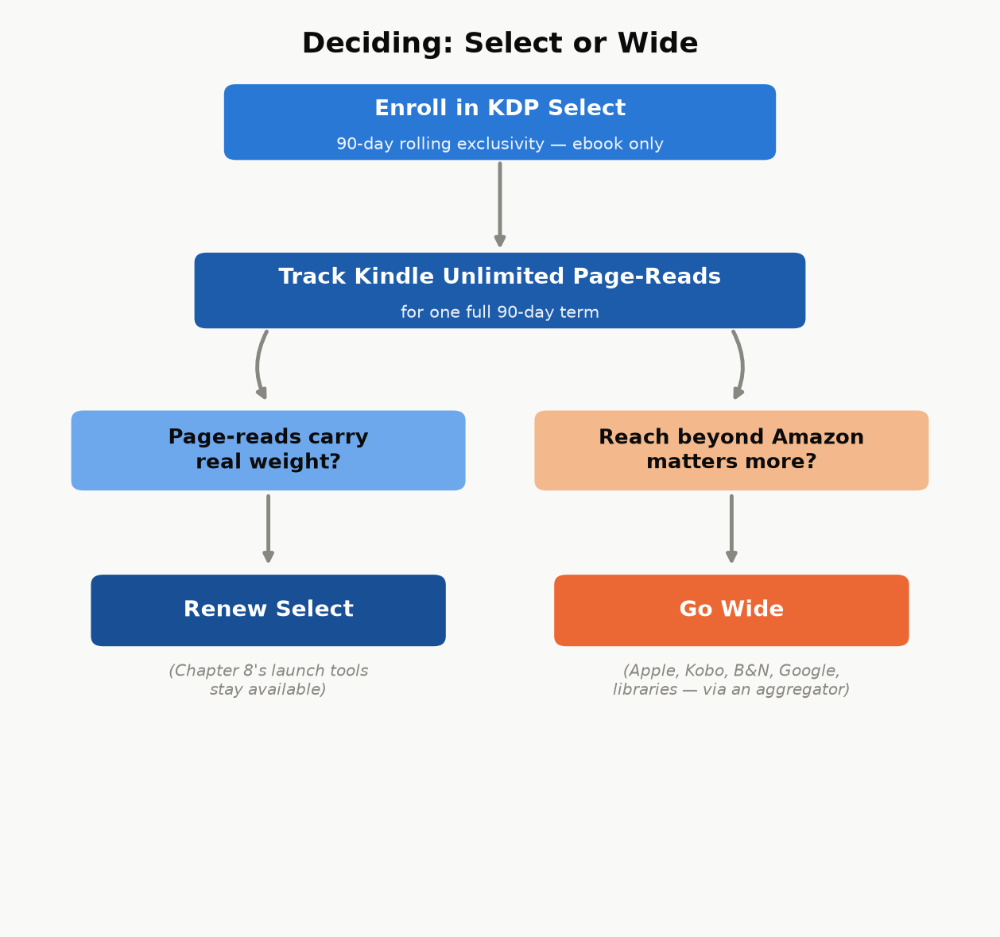

*Figure 27.1 — Not a one-time choice: run one real 90-day term, then let what actually happened to your page-reads make the next decision instead of a genre-wide generalization.*

### Choosing without guessing

A reasonable default for a new author with no existing data: enroll the first book (or series) in Select for one 90-day term, watch the actual page-read numbers against what wide distribution would plausibly have earned, and make the next term’s decision from real data instead of a genre-wide generalization.

> Worked example. A 300-KENPC-page nonfiction ebook at $4.99 (net 70% royalty ≈ $3.31/copy after the delivery fee, per Chapter 17), against 300 reader engagements over one 90-day term:

All 300 as direct purchases, wide distribution, comparable net across stores: 300 × $3.31 ≈ **$993** for the term.

The same 300 readers under Select, but 120 of them read the book in full through Kindle Unlimited instead of buying it (at Chapter 17’s illustrative $0.0045/page rate): 180 direct sales (180 × $3.31 ≈ $595.80) plus 120 full KU reads (120 × 300 pages × $0.0045 ≈ $162) ≈ **$757.80**.

In this illustration, wide comes out ahead per reader, because a full KU read at $1.35 is worth less than a $3.31 sale. Select only wins the comparison when it brings in readers who would not have bought at $4.99 at all — a number this book cannot supply for your specific book, your genre, or your audience. That missing number is exactly why the advice above is to run one real term and read your own dashboard, not to trust this arithmetic, or anyone else’s, for a decision this dependent on who your actual readers are.

> **Certainty, labeled.** Kindle Unlimited tends to matter most for genres with heavy series readers who consume books quickly (romance, fantasy, thriller fiction, in particular) and matters less for many nonfiction categories, where a reader may buy once rather than subscribe-and-binge. That is a widely observed pattern among authors, not a KDP-published rule — “tends to” is not a guarantee for your specific book, which is exactly why testing one real term beats assuming either way.

## Chapter 28: Avoiding the Traps

Every mechanism described in this book so far is free, documented, and available to any KDP account. Everything in this chapter exists because that fact — self-publishing costs nothing but effort — is exactly what a whole ecosystem of scams, shortcuts, and account-ending mistakes is built to obscure. Knowing what this chapter covers is often the difference between a first-time author who keeps their account and their earnings, and one who doesn’t.

### Vanity and predatory hybrid publishers

The scam is almost always the same shape: a company charges a new author a fee — anywhere from a few hundred to many thousands of dollars — for services that either cost nothing (an ISBN assignment, a KDP upload, basic ebook formatting) or cost a small fraction of what’s being charged (professional cover design, a real developmental edit). Watch for:

Unsolicited contact — “we read your manuscript and think it has real potential” from a company you never submitted to. Legitimate publishers don’t cold-call unpublished manuscripts they found on their own.

Upfront fees framed as necessary for basic access to distribution that KDP already provides for free.

Vague, inflated promises — “bestseller,” “bookstore placement,” “Hollywood option potential” — offered with no specifics about how, paired with pressure to sign quickly.

None of this means every paid publishing-adjacent service is a scam — freelance editors, cover designers, and formatters described in earlier chapters are legitimate paid services doing real, specific work. The distinguishing question is always the same: can you name, specifically, what this fee is paying for, and could you get that same specific thing done elsewhere for less? A legitimate freelancer answers that question instantly. A predatory hybrid publisher’s answer is deliberately vague.

### Fake reviews and rank manipulation

Buying reviews, joining a review-swap ring, or paying for a “guaranteed ranking boost” service are all violations of Amazon’s content policies, and the consequence isn’t limited to the one book involved — Amazon can suspend an entire account over manipulated reviews or rank manipulation, which means every book you’ve ever published under that account stops earning at once, not just the one that triggered it. There is no version of this trade-off that’s worth it: the honest ARC-team approach from Chapter 24 achieves the same “reviews at launch” goal legitimately, with none of the downside risk.

### AI-content flooding

A different, newer version of the same underlying trap: mass-producing large numbers of thin, minimally reviewed, AI-generated books to flood categories, hoping volume compensates for quality. Amazon has been actively tightening enforcement against exactly this pattern — content-quality policies, required AI-content disclosure (Chapter 19), and publishing limits: since 21 September 2026 every account can create only two new titles per format (ebook, paperback, hardcover) each week, down from ten. Beyond the policy risk, it’s a reputation trap for your author name and your existing titles: a flood of low-effort books under one name damages trust in your better books too, in a marketplace where a reader’s next click is often “see all books by this author.”

A more polished-looking relative of this trap gets its own treatment in Chapter 32: books that don’t look thin or AI-flooded at all, because the process used to make them included a step specifically designed to erase the resemblance to the handful of existing books they were actually built from.

### Copyright and licensing traps

Two mistakes show up often enough to name directly: assuming something is public domain when it isn’t (public-domain status depends on specific publication dates and jurisdictions, and a translation, annotation, or edited edition of a public-domain work can itself carry separate copyright even when the underlying original doesn’t), and using images — cover art, interior illustrations — without a license that actually covers commercial use. A stock image licensed for personal or editorial use is not automatically licensed for a book you’re selling; check the specific license terms every time, for every image, not just the ones that look obviously professional.

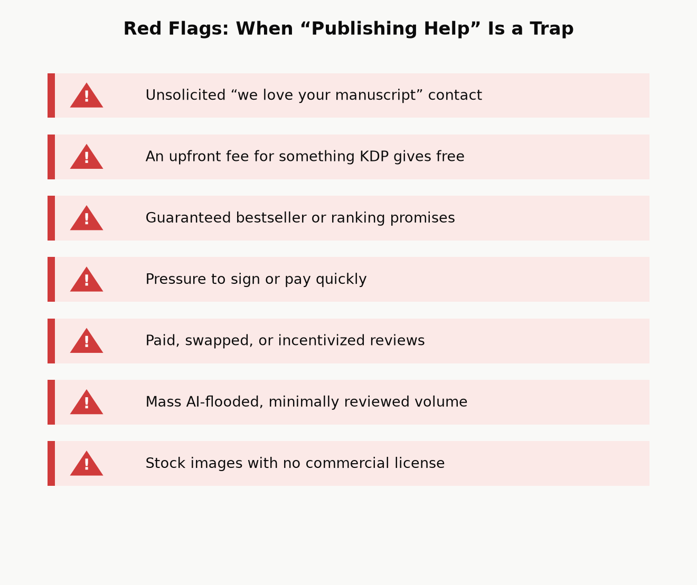

*Figure 28.1 — The common thread across every trap above: a shortcut that trades a small, certain cost now (an editor’s fee, a slower honest launch) against a large, uncertain cost later (a suspended account, a damaged reputation, a copyright claim) — and the trade almost never pays off in your favor.*

### Two more triggers worth naming directly

Two more patterns come up often enough in independently reported KDP account actions to name on their own, and neither one requires the bad intent behind the traps described above — an author can trigger either while doing something that felt entirely reasonable at the time.

Duplicate or near-duplicate content: publishing the same book, or a lightly reworded version of it, under a new title, a new cover, or a new account. This is the specific risk a poorly done public-domain modernization (Chapter 32) can run into even with no intent to deceive anyone, and it’s also what a “relaunch” of a book that didn’t sell can look like to Amazon’s systems if the fix was cosmetic rather than substantive.

KDP Select exclusivity violations: while a book is enrolled in Select (Chapter 27), its ebook can’t be sold, given away, or distributed anywhere else Amazon doesn’t control — not another retailer, not your own website, not a bulk-emailed review PDF. The common way authors trip this isn’t defiance, it’s forgetting: a book enrolled in Select months ago, then quietly included in a later website giveaway or bundle without checking whether it’s still exclusive.

Add banned or misleading backend keywords (Chapter 22) and a skipped AI-content disclosure (Chapters 19 and 32) to the list, and that covers most of what independent trackers of KDP account actions report repeatedly, alongside the review-manipulation and copyright traps already named above. None of the five requires malice — which is exactly the argument for treating this chapter as a checklist to run against your own upcoming launch, not just a warning about other people’s bad behavior.

### The best filter: check KDP’s own help pages first

A large share of “secret” paid courses promising to reveal how self-publishing really works are, on close inspection, reselling information KDP already publishes for free in its own Help pages and this book’s chapters. Before paying for any course or service that claims special insider knowledge of “the algorithm” or “what really works,” spend twenty minutes checking whether the claim is actually just documented KDP policy with a markup attached. Often, it is.

# Part VI — Playing the Long Game

## Chapter 29: From One Book to a Catalog

Every chapter so far has been about one book. This chapter is about the point at which the math changes: a catalog of several related books doesn’t just add up its individual books’ income — it compounds, because each additional title increases the discoverability surface of every title already in the catalog, not just its own.

### Why a catalog outearns the sum of its books

A reader who finishes your first book is shown your other books directly, on your Amazon author page, on each book’s “more by this author” section, and through “customers also bought” placements — at zero additional marketing cost, because you already paid the one-time cost (writing it, formatting it, launching it) to acquire that reader’s attention in the first place. A five-book catalog isn’t five separate customer-acquisition problems; it’s one customer-acquisition problem (get a reader to try book one) followed by four essentially free upsells. This is the same read-through economics from Chapter 18, extended from a single series to an entire body of work.

There’s a second, quieter compounding effect: the fixed costs of learning this whole system are paid once. The time spent learning to navigate KDP’s upload flow, understanding your own ad account well enough to run a profitable campaign, developing a cover style that reads correctly for your category, building an ARC team and an email list — none of that resets to zero for book two. Book two of a well-run catalog typically takes meaningfully less total effort to launch than book one did, for the simple reason that most of that effort was fixed-cost learning, not per-book labor.

> Case study: planning for compounding from day one. One real example: a technical nonfiction series was planned from the start as many separate, topic-sized books rather than as a single giant volume — explicitly so that each finished book would immediately extend the discoverability and “more by this author” surface of every other book already published, instead of asking one enormous, slow-to-finish book to carry the entire catalog’s earning potential alone. A broader catalog built the same way often spans several genuinely different categories at once, which spreads risk the same way a diversified small-business portfolio does: a slow month or an algorithm change affecting one category doesn’t take down income from the others at the same time. Neither choice — many small books in one series, or several unrelated catalogs at once — is the “correct” one in isolation; both are the same underlying principle (a catalog compounds; a single book doesn’t) applied to two different situations.

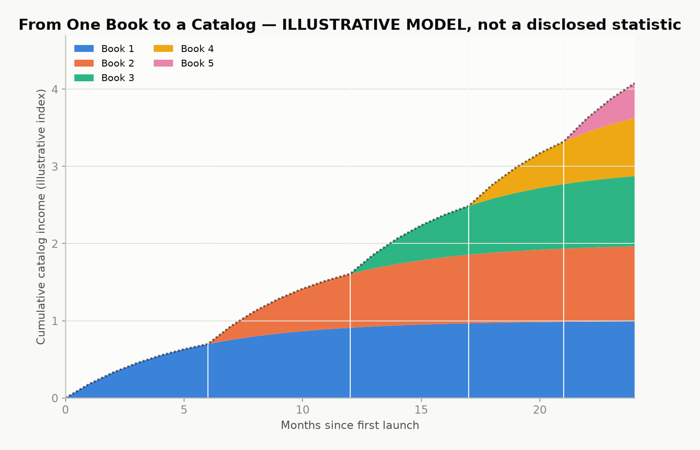

*Figure 29.1 — Illustrative model, not a disclosed statistic: cumulative catalog income over time as each new book adds both its own sales and a cross-sell boost to every earlier title. The compounding shape is the real lesson — a real catalog’s actual curve depends entirely on genre, quality, and consistency of output.*

### Bundles and an owned audience

Two more tools extend a catalog’s earning power beyond individual book sales:

Box sets and bundles. Combining several existing books into one discounted bundle product creates a new, sellable item with close to zero additional creation cost — the content already exists — while giving price-sensitive readers and new-to-you browsers a lower-friction way to try several books at once.

An email list, built from a simple sign-up offer (a short bonus chapter, a checklist, a free related short work) placed inside your existing books’ back matter. A list of genuinely interested readers is a source of concentrated launch-day velocity (Chapter 24) that you control directly, rather than one that depends entirely on Amazon’s algorithms, ad auctions, or luck — the single most durable hedge against any one platform changing its rules on you.

### A second format, mostly for free: audiobooks

There’s a third format beyond ebook and print, and it extends a catalog the same way bundles and an email list do: almost all of its cost is paid once, against content that already exists. ACX (Audiobook Creation Exchange) is Amazon’s audiobook platform, producing for Audible, Amazon, and iTunes from one submission — the audio equivalent of KDP itself.

Three ways to get a finished audiobook, at three very different price points:

Narrate it yourself. Zero cost beyond your own time and reasonably decent recording equipment. A real option for nonfiction in particular, if the author has a clear, listenable voice — readers of a how-to guide are often buying the author’s judgment as much as the words, and hearing it in their own voice is not a downgrade.

Royalty share with a narrator. No upfront cash — the narrator is paid out of future royalties instead of a fee, typically splitting close to evenly with the rights holder. This is the standard route for an author with no production budget but a book (or catalog) with a real chance of actually selling, since a narrator taking a royalty-share deal is, in effect, betting on the book too.

Pay-per-finished-hour (PFH). A professional narrator, paid a flat fee for each finished hour of audio — commonly several hundred dollars per hour, which puts a full-length audiobook’s upfront cost in the low-to-mid thousands. You keep the full royalty going forward; you also carry the entire financial risk if the audiobook doesn’t earn it back.

A newer, fourth option: Amazon has been rolling out AI-narrated (“Virtual Voice”) audiobooks directly through KDP for eligible titles, at little to no cost — a real, current alternative to the three routes above for an author testing whether their book’s audience wants audio at all before committing real money to it. Eligibility, available voices, and quality have been moving targets since this feature launched; check your own KDP dashboard for what’s actually offered before assuming it works the way an older article describes.

> Worked example. A pay-per-finished-hour audiobook running 6 finished hours at $300/hour costs $1,800 upfront, fully owned by the author afterward. The same book via royalty share costs $0 upfront, but every future audiobook royalty is split with the narrator, indefinitely. Neither choice is simply “better” — PFH is the better bet for a book with proven sales already (Chapters 17 and 30 show you how to tell); royalty share is the better bet for a first audiobook on an unproven title, since it caps the downside at zero.

Exclusivity works the same trade-off shape as KDP Select (Chapter 27): ACX offers a meaningfully higher royalty rate for audiobooks distributed exclusively through Audible, Amazon, and iTunes, against a lower rate for non-exclusive distribution that also reaches other audiobook retailers and library platforms. Check ACX’s current royalty table before committing — like every rate in this book, it’s a real number that changes over time, not a fixed constant.

Not every book belongs in audio. A book that leans on charts, worked numerical examples, or anything the reader needs to see translates poorly to a listen-only format — this book’s own royalty-cliff chart and break-even ACOS math, read aloud with no image to look at, would be a worse experience than the page version, not an equal one. A narrative nonfiction book, a memoir, or a novel has no such problem. Know which kind of book you’ve written before assuming audio is the obvious next format.

## Chapter 30: A Realistic First-Year Plan

This book opened with a promise to show its arithmetic, including the unflattering parts. Here is the unflattering part: self-publishing income is a power law, not a bell curve. A small share of books and authors earn very well; a large share earn modestly or barely cover their production costs; very few outcomes land neatly in between. Nothing in this book changes that distribution — what it changes is your odds of landing in the better half of it, by doing the specific, checkable things (real editing, honest launch coordination, correct categories and keywords, disciplined ad spending, a catalog instead of a single bet) that separate a professionally run small business from a hopeful one-off.

> **Key takeaway: Treat your first book as tuition, not a lottery ticket. Its most valuable output may not be its own royalty check — it may be everything you learn about your category, your readers, and your own process, which book two then gets to apply at a fraction of the effort. That’s not a consolation prize; it’s exactly how the compounding in Chapter 29 gets started.**

### A month-by-month shape for a first book

Every catalog’s real timeline will vary, but a reasonable default shape, tying every earlier chapter together:

Months 1–2 — Write and research (Chapters 16, 18). Confirm the category and audience against real Amazon signals before finishing the draft, not after.

Month 3 — Revise, design, recruit (Chapters 19, 21, 24). Run your editing passes, commission or finalize the cover, and open ARC-team recruitment early enough for readers to actually finish the book before launch.

Month 4 — Format, list, launch (Chapters 20, 22, 23, 24). Format for the correct output(s), set categories and keywords deliberately, price with intent, and concentrate your launch-week activity rather than spreading it thin.

Months 5–6 — Read the data, adjust, decide on ads (Chapters 25, 26, 27). Start (or continue) advertising with real break-even math, read your first finalized royalty report rather than the running estimate, and make your first informed KDP Select renewal decision from actual page-read numbers.

Months 7–12 — Start the next book, with everything you now know (Chapters 18, 29). Apply the category and audience research to book two (or book one of your next series) with the fixed-cost learning from this round already paid off, and begin building the email list and bundle options that only make sense once more than one book exists.

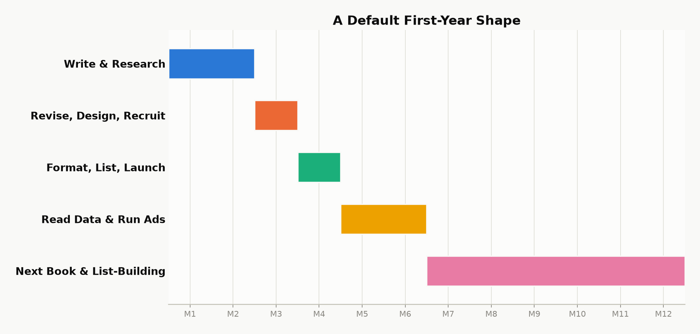

*Figure 30.1 — A default first-year shape. The exact pace will stretch or compress around real life — the sequence (research before writing, editing before launch, data before the next big decision) matters more than hitting these specific months.*

Whatever your book earns in its first year, the honest measure of whether this was worth doing isn’t that first royalty number in isolation — it’s whether you finished the year with a repeatable process and a second book underway. That’s the entire difference between having self-published a book, and having become a self-publisher.

# Part VII — One Topic, in Depth

## Chapter 31: The First-Review Problem

The target for this chapter isn’t a few sales that make the page look alive — it’s unit economics that still hold up once your friends have already bought their copies. Reviews and price are the two levers you can actually control before you’ve built a list large enough to matter on its own, and everything below treats them as mechanics to run correctly, not as marketing flourishes on top of a finished book.

As in every other chapter, Amazon’s written rules are treated here as real constraints, and any claim about how ranking actually behaves is labeled explicitly as inference rather than fact. The pricing bands referenced below reflect KDP’s 70 percent ebook option as expanded in July 2026 ($2.99–$12.99 on Amazon.com) — confirm the live help page before you lock in a price, the same caution this book asks for everywhere else.

> **Terms used in this chapter.** ARC: advance reader copy, sent before the book is live. KU / Select: Kindle Unlimited and KDP Select, Amazon’s borrow-and-subscription program. ASIN: the product ID a book receives on publication — no review can post before it exists. EPUB: the reflowable file format every e-reader except Kindle actually wants.

A note on the examples ahead: the public field reports this chapter can actually check — named authors, real numbers, a real launch date — mostly come from fiction, because fiction authors publish that kind of detail far more often than nonfiction authors do. The mechanics don’t care: a review-eligibility rule, a royalty band, and a launch-week concentration effect work identically on a novel and a how-to guide. Read “book one” and “series” below as your nonfiction title and your line of related titles (Chapter 29) — the arithmetic transfers directly, even where the example doesn’t.

### Selling a few copies is not a business

Most debut Kindle books do sell — to the author, to a handful of acquaintances, and to whoever happens to stumble in during the week the title is genuinely new. Then that week ends: Best Sellers Rank slides back down, and any ads that were running start costing more than they return. The author typically concludes that “self-publishing doesn’t pay,” having sampled a market that never actually saw a trustworthy product page in the first place.

A book that makes real money does three things a hobby listing doesn’t. It converts strangers who have no prior loyalty to you. It stays findable after the launch spike fades. And it leads somewhere else — another title, an email list, a borrow that pays out by the page. None of those three things begins with hoping; they begin with a product page a cold reader will actually finish and say yes to, priced so that enough royalty survives to fund the next unit of attention you buy or earn.

Reviews, in that light, are not decoration — they’re how a stranger agrees to pay. And price is not a reflection of the book’s worth or your own confidence in it; it’s simply how much of that stranger’s “yes” you get to keep, and whether the store will even show your book in the band where serious shoppers actually look.

The rest of this chapter turns those two sentences into something you can actually do: seed honest reviews before you spend on traffic, price for the royalty band and for the life of the whole catalog rather than for one launch, and only treat book one as an acquisition cost once book two actually exists to collect the debt it created.

> **Key takeaway:** Reviews and price are not marketing decoration on top of a finished book — they are the two levers that decide whether a finished book becomes a business. Get the sequence right (proof before spend, price for the band and for the catalog) and everything else in this chapter is mechanics.

### Where the money actually comes from

#### Not from the first ten cousins

Friends and family can put a number on your sales dashboard, but that’s essentially all they can do. They can’t put your book into “Customers who bought this also bought.” They can’t teach Amazon’s systems who the book is actually for. And they often can’t leave a review at all without violating Community Guidelines — the $50 spend-history rule described later in this chapter is exactly the trap that catches them. Treat their purchases as a rounding error in your real numbers. If your business plan depends on them, you don’t yet have a business plan.

#### From conversion on paid and organic traffic

Amazon gets paid when someone buys a copy, or, under Kindle Unlimited, when someone borrows one. Rank, as authors actually observe it in practice, tracks recent commercial events like these rather than a lifetime total. Reviews don’t appear anywhere in a published Amazon formula as a direct weight on rank — but they change whether a given click actually turns into one of those commercial events in the first place. A listing that converts at twice the rate of its neighbor can effectively buy the same ads for half the real cost per sale, which is exactly why a zero-review page makes advertising feel like a scam while a reviewed page makes the identical bid look perfectly rational.

The promotional newsletters that actually move the needle — the ones worth paying for once you have proof a book sells — routinely refuse to feature books with an empty or near-empty review module. That isn’t the newsletter being precious; it’s the newsletter protecting its own conversion rate for its subscribers. Without one of those newsletters, and with no list of your own, a free day or a $0.99 blast has nowhere to get real traction from.

#### From read-through, not from a single SKU

A standalone debut only gets one chance to collect money from a given reader: that one purchase, or those pages read. A series gets to collect again. If half the readers who finish book one go on to buy book two at full royalty, then book one can reasonably be priced as bait to get them there. If there is no book two, that same low price is just a cheap book with nothing behind it. The authors who report genuinely real income are disproportionately the ones with several related titles, not the ones with one beloved book and a perfect product description.

Amazon doesn’t publish a read-through figure, so what counts as “healthy” is only ever self-reported — but series authors who track their own numbers commonly describe 50 to 60 percent from book one to book two as solid, with anything well under half treated as a sign to fix book one’s ending, blurb, or back matter rather than a reason to rush book three into print. A free or heavily discounted book one pulls that number down on its own, since it fills the funnel with readers who paid nothing and were never sorted for fit — weigh read-through from a launch discount against another discounted launch, not against a full-price one, or the comparison won’t mean much.

Kindle Unlimited complicates this picture in a useful way: a borrow counts as a commercial event the moment it happens, and the pages read after that pay out separately, from a shared pool (Chapter 17). A book that converts borrows well but loses most of its readers by chapter two has a real leak in it — and advance readers who either finish the book or stop partway through and tell you why are a much cheaper way to find that leak than discovering it after a month of paid ads.

### The first-review problem, restated as cash flow

Launch week is the one genuinely cheap moment when your own list, incoming advance-copy reviews, and any small test of ad spend can all land in the same window at once — and Amazon’s own systems weight what happened recently more heavily than a lifetime total. Spend that window on a page with no testimony at all, and it converts poorly. Spend it on a page that already carries a few independent, honest paragraphs of review, and a larger share of the same visitors become actual sales — because sales, or “units” in Amazon’s own language, are the one thing the store’s systems know how to extend further.

That’s exactly why you recruit advance readers while the KDP file is still a draft: they can’t post a review until the book’s ASIN actually exists, and they can’t read even a short book overnight. The calendar you’re actually working against here is a reading calendar first and a marketing calendar second — reverse that order, and launch week arrives as an apology instead of an event.

A KDP Select free day is not a substitute for this. Free downloads don’t count as paid sales, and they reliably produce downloaded files rather than reviews. Nobody has published a clean study on organic post-free review rates; author forums describe them anecdotally, often in fractions of a percent — treat that as a reason to test on a small scale rather than as a citation you can rely on. An advance-reader group that specifically asked to read the book in its genre is a fundamentally different population: posting rates of roughly a quarter to two-fifths are commonly logged by authors who actually bother to count. Call that survivorship bias with better manners if you like, but it’s the specific bias you want working in your favor. Use the wider, anonymous crowd only after the page can already convert on its own; use the small, recruited group to make that conversion possible in the first place.

> **Certainty, labeled.** If Amazon never uses review count internally, shoppers still see the empty module, newsletter editors still use it as a gate, and ads still die on untrusted pages. The cash-flow case does not require an occult coefficient.

### Price: what KDP will pay you

On Amazon.com, the 70 percent ebook option applies whenever your list price sits inside the published band — $2.99 to $12.99 after the July 2026 expansion — and you’ve actually selected that option at upload. Outside that band, you earn 35 percent instead. A delivery cost, on the order of $0.15 per megabyte of the file, is deducted under the 70 percent plan and not under the 35 percent one. For a lean text file, 70 percent is unambiguously the better choice anywhere inside the band; a heavily illustrated file can eat into that advantage, so check your actual file size before assuming the percentage tells the whole story.

> **Worked example.** A price-by-price picture, approximate, 2 MB file, 70 percent selected — delivery fee (~$0.15/MB × 2MB = $0.30) subtracted wherever 70 percent applies, per the rule above:

| List price | Typical royalty band | Rough net / sale | Job of this price |
|---|---|---|---|
| $0.99 | 35% | ~$0.35 | Launch spike or loss-leader. Never the forever price of a lone book. |
| $2.99 | 70% | ~$1.79 | Floor of serious money. Default if unsure. |
| $3.99–$4.99 | 70% | ~$2.49–$3.19 | Genre fiction’s long-term home for many series mid-books. |
| $5.99–$7.99 | 70% | ~$3.89–$5.29 | Longer work, established name, or dense nonfiction. |
| $9.99–$12.99 | 70% if option on | ~$6.69–$8.79 | Only if comps and proof support it. Debut novels rarely. |
| $1.99 | 35% | ~$0.70 | The 35% trap dressed up as a friendly compromise. Worse net than $2.99 despite looking cheaper to the reader. |
| $13+ | 35% (outside the band) | high in isolation | The royalty math is fine alone; a debut rarely has the comps or proof to hold that price, so volume collapses before the math gets to matter. |

The important comparison here is that $2.99 at 70 percent usually earns more per copy than $1.99 at 35 percent does, and often earns more than a higher price that would have fallen outside the band before the July 2026 expansion. Don’t price at $1.99 in an attempt to “meet readers halfway” — doing so leaves most of that copy’s actual value on the table.

Here’s the same math worked through for a heavier file: a 20 MB illustrated nonfiction title priced at $9.99 with the 70 percent option selected. Royalty: $9.99 × 0.70 = $6.99. Delivery fee: $0.15/MB × 20 MB = $3.00. Net: roughly **$4.00** — well below the $6.69–$8.79 the table above shows for a lean 2 MB file at a similar price. The royalty percentage never changed; the file size did all the damage. Compress your images before trusting any of these figures for your own book, and rerun the math on [Kindlepreneur’s KDP royalty calculator](https://kindlepreneur.com/kdp-royalty-calculator/) using your file’s actual size rather than the 2 MB assumption this chapter has used throughout.

Print is an entirely separate ledger from the ebook math above. Paperback royalties are calculated as list price minus print cost, times the print royalty rate — and Amazon has tightened that rate in recent years on lower-priced paperbacks specifically. Don’t let a paperback’s list price influence your ebook price out of vanity, and don’t set a paperback’s price so low that the print cost simply eats the royalty; the print cost doesn’t care how proud you are of the cover.

### Initial price versus later price

Skip ahead to whichever of the following two subsections actually matches your situation — a debut with nothing behind it yet, or a series with at least one sequel already live. The math genuinely doesn’t agree with itself across these two cases, and that’s intentional: they’re different problems.

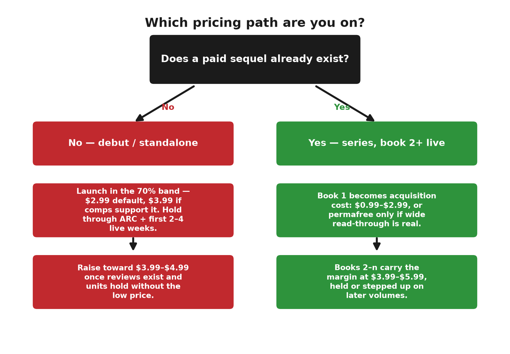

#### The principle

An early, low price buys you information and motion — real data about whether the book sells at all, and enough velocity to get noticed. A later, higher price harvests the trust you’ve since earned. A debut with no reviews yet simply can’t support the top of its genre’s price band, because shoppers have no real reason to pay a premium for a completely untested book. Once the page has genuine proof behind it, raising the price isn’t greed; it’s simply refusing to keep subsidizing strangers indefinitely.

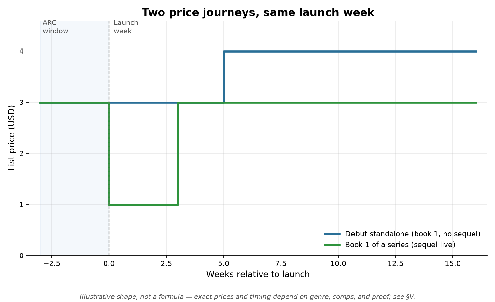

#### A debut standalone (or book one with nothing behind it)

- Don’t launch at $0.99 unless you already have a list or a paid promotional blast lined up to make use of it. At that price you’ll earn almost nothing per copy, you’ll train your first public readers to see the book as a bargain-bin item, and — with no sequel yet — you have no way to recover that subsidy later.
- Launch somewhere in the 70 percent band. $2.99 is the reasonable default; $3.99 makes sense if your category’s visible comparable titles cluster around that price and your book is long enough that $2.99 would look oddly cheap by comparison.
- Hold that launch price through the advance-copy window and the first two to four weeks the book is live. During this period you’re collecting reviews and building your first “customers also bought” neighborhood — not maximizing theoretical margin.
- Raise the price toward $3.99 or $4.99 once two things are both true: a handful of specific, substantive reviews exist, and your daily unit sales haven’t been depending entirely on the lower price. If sales collapse when you raise the price by a dollar, you’ve simply found the ceiling — lower it back down. That’s useful data, not a failure.
- Don’t open a first novel with no existing name at $7.99–$12.99. Literary exceptions to this exist, but they aren’t the norm — look at the actual first page of your category’s bestseller list, not at how you personally feel about the manuscript’s worth.

#### A series, once two or more books exist

Once a series has two or more books, book one effectively becomes an acquisition cost, and books two onward become the actual margin. Here’s the pattern that tends to survive contact with the royalty math:

| Title | Early life | Settled life | Why |
|---|---|---|---|
| Book 1, only child | $2.99–$3.99 | Same until a sequel exists | No funnel. This book must earn. |
| Book 1, sequel live | $0.99 for a launch window, or stay $2.99 | $0.99, $2.99, or permafree | You can now afford to give the first yes away. |
| Books 2–n | $3.99–$5.99 | Hold or step up on later volumes | This is the catalog’s wage. |
| Box set | Inside 70% band | A little under the sum of parts | Catches binge readers; still pick 70%. |

A permanently free book one — free everywhere, with Amazon price-matched to that free price — conflicts directly with KDP Select enrollment on that same title, since it’s fundamentally a wide-distribution tactic. It only pays off if read-through to the paid sequels is genuinely real; a permanently free book one backed by a single thin sequel is simply a gift to the internet.

Pricing book one at $0.99 during a new-release window is the Select-compatible version of the same underlying idea — you’ll earn 35 percent on those copies, plus page-read income from Kindle Unlimited if you’re enrolled. The actual point is driving traffic into book two, which stays priced in the 70 percent band.

#### When to raise, when to cut

- Raise the price once proof exists, once a sequel exists, once a promotional window ends, or when comparable titles on the same shelf have moved. Raise by a dollar at a time and watch a full week’s results before deciding anything further — don’t yo-yo the price daily.
- Cut the price for a scheduled, announceable promotion, not out of impatience on a quiet Tuesday. Permanent cuts train your own list to simply wait you out.
- Never pair a price cut with a required review of any kind — the free or discounted copy is the only concession you’re legally allowed to make.

#### Kindle Unlimited changes the launch discount

If the title is enrolled in Select, a $0.99 or free window still pays you when Kindle Unlimited readers actually read the pages — which makes a launch discount considerably less risky than it would be outside Select, provided readers actually finish the book. If they don’t finish, you’ve effectively paid for sampling that produced neither royalty nor a review. Advance copies exist partly so you can find that out privately, before launch, rather than publicly, after it.

### The constraint that keeps the money

Amazon’s own help text is fairly direct on this: you may give away a free or discounted copy, but you may not require a review in exchange, steer what it says, or add any other gift. Friends, employees, and author-for-author review swaps all sit outside what Amazon considers acceptable here. An unverified advance-copy review still displays publicly — it simply lacks the Verified Purchase badge. Chasing that badge by refunding readers after they buy is exactly the kind of pattern that gets listings cleaned out.

Enforcement here has only gotten more aggressive over time, not less: Amazon has spent the last several years actively pulling flagged reviews — incentivized, traded, or machine-written — and closing accounts on both sides of that trade. One genuine, unsolicited paragraph from an actual stranger now outlasts a hundred purchased five-star ratings that simply vanish in the next enforcement sweep. Confirm the current Community Guidelines before you build any kind of reviewer roster; this is the part of the rulebook that changes the most often.

A second, separate rule applies to the manuscript itself, not just its reviews: KDP requires disclosure of AI-generated content, on a distinction that is Amazon’s to draw, not an author’s judgment call. Chapter 32 states that rule in full, with the exact line KDP draws between disclosed and undisclosed use — read it before you check either box on the AI-content questionnaire.

#### Who is allowed to post on Amazon

A free copy alone is not enough to make someone eligible to review. On Amazon.com, Community Guidelines require a reviewer to clear a specific spend threshold before they’re allowed to leave a rating or written review at all:

- At least **$50** spent on that marketplace with a credit or debit card in the past twelve months.
- Promotional discounts do not count toward that $50.
- Gift-card-only spend is widely treated as not counting either.
- Each Amazon marketplace sets its own bar in its own currency — spend on Amazon.co.uk or .ca does not qualify an account on .com, and the reverse is equally true.

That’s exactly why a brand-new Amazon login can read your EPUB in full and still hit a wall at the review button. Prefer advance readers who already have a history of Amazon reviews on other books. Never tell anyone to go spend fifty dollars specifically so they can review you — that starts to look like an implicit condition on the review. And meeting the spend threshold still doesn’t create a Verified Purchase badge on its own; that badge comes from a separate check confirming they actually bought this specific title on Amazon at a normal price.

This same fragmentation shows up in royalty bands as well, not just in review eligibility. Amazon.com’s 70 percent band is priced in US dollars; Amazon.co.uk, Amazon.de, and the rest each publish their own band in their own local currency, and a book can end up sitting inside the band on one storefront while falling outside it on another, even at what looks like “the same” converted price. A series priced consistently in USD is not automatically priced consistently in royalty terms once it’s live across five different storefronts. Check each marketplace’s own current help page — not a currency converter — before assuming your domestic pricing logic carries over.

#### Goodreads is a different door

Goodreads works under an entirely different rule: it has no spend minimum at all. A normal member account can rate a book as soon as its edition exists in Goodreads’ system, including well before publication — something Amazon never allows. Treat posting on the two platforms as two separate jobs: Goodreads while your advance readers are still reading, and Amazon on the morning the KDP page actually goes live. A Goodreads rating never counts as an Amazon review, and the two shouldn’t be confused.

For advance copies specifically, Goodreads now asks the reader to confirm they actually read the book (marking it Did Not Finish is an allowed answer) and to pick a source for how they got it — author or publisher, Giveaway, NetGalley, or other — and that source can display alongside the review. Marking a book “Want to Read” isn’t enough to leave a star rating; the book has to sit on Read, Currently Reading, or Did Not Finish. Never tell readers to hide the fact that they received a free copy on Goodreads — the source picker itself is how that gets disclosed.

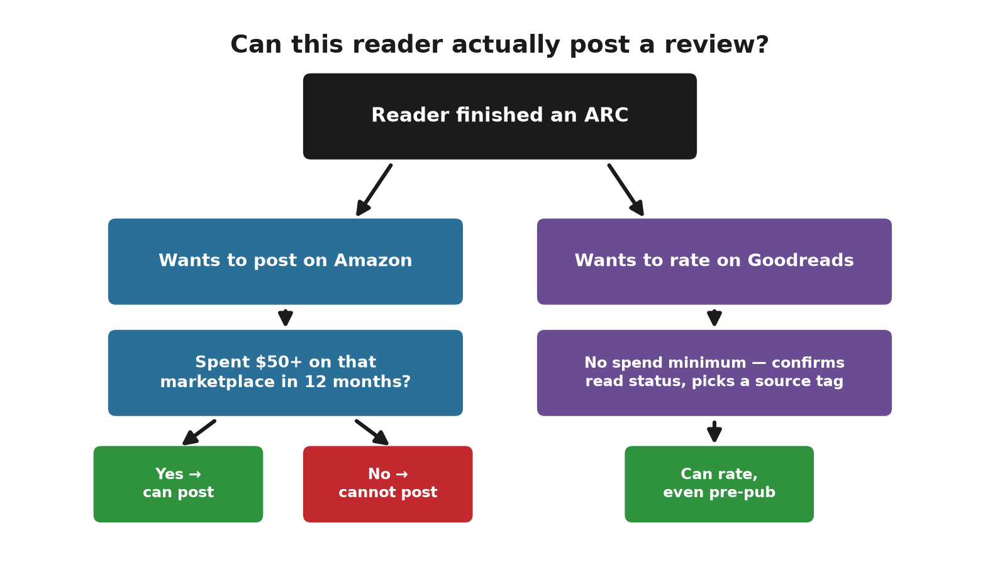

#### The first bad one

Not every review will be a good one, and that’s worth preparing for honestly. Amazon does not remove a review simply for being critical or for landing at one or two stars — it only removes reviews that actually violate Community Guidelines: obscenity, harassment, spam, off-topic content, someone else’s personal information, or a competitor posting in bad faith. A reader who genuinely disliked the book falls into none of those categories, and reporting that review through Amazon’s “Report abuse” link won’t get it removed, nor should it.

Don’t reply to it. An author’s public reply sits permanently underneath the review, and a defensive-sounding one will read worse to future shoppers than the original star rating ever did on its own. If the review does name a genuine production fault — a broken table, a missing chapter, a formatting error — fix the file and move on; that fix helps the next hundred readers far more than any argument with this one reader ever would.

A single candid three-star review that names a specific, genuine gripe is, by most working authors’ own account, worth more to a cold shopper than yet another five-star review that just repeats “loved it.” A page of nothing but superlatives actually reads like a page where nobody felt able to be honest. Recruit your advance readers for honest reactions, not for unanimous praise — the ARC form described below is already built to ask for exactly that.

#### Running the roster without breaking the rule

In practical, unromantic terms, this means: a sign-up form that states plainly that any review is optional. A roster that favors genre readers with a public history of actually writing reviews — and, on Amazon specifically, an account capable of posting one at all. Three emails cover the whole relationship: you’re confirmed for the list; here’s the file; here’s the live URL once the book is out. One later follow-up note to everyone who downloaded. And never a sentence like “book two only if you posted four stars” — that crosses directly into being a gift card, which Amazon’s rules explicitly forbid.

#### Delivering the file

Convert the Word file to EPUB before sending it to human readers. KDP itself can accept a .docx file directly, but your readers shouldn’t have to deal with one. Lock the manuscript’s text before anyone reviews it — a public review of a draft is, after all, only ever a review of that draft, not of the finished book.

If you email the EPUB, the attachment is the book — but a Kindle does not open a Gmail attachment by itself. The reader has two paths:

- Forward the saved file to their own address ending in **@kindle.com** (Amazon → Content and Devices → Preferences → Personal Document Settings), sent from an email address Amazon has already approved on that same page.
- Or open the `.epub` directly in the Kindle app, Apple Books, or Google Play Books.

Services like BookFunnel and StoryOrigin exist specifically so you don’t have to teach this process to readers one at a time.

> **Key takeaway:** Every rule in this section exists to answer one question honestly — did a real reader choose to say this? A free copy, a spend threshold, a disclosure checkbox, and a delivery method are all just plumbing in service of that one fact. Optimize the plumbing all you want; never touch the fact itself.

### The free pipeline, now as a profit tool

Open your sign-up form the same week the draft manuscript is ready. Aim to recruit thirty to fifty people if your goal is something near ten posted reviews. Send the files two to three weeks before the book goes live, and only ask for Amazon reviews once the form and roster actually exist. If you use a paid matching service, they generally prefer a runway of about forty days and a title that isn’t already stale by the time they receive it.

[Published guidance on managed ARC campaigns](https://www.bookready.net/blog/20-reviews-launch-day-arc) — built around real deadlines, reminders, and an actual managed roster rather than a link dropped into a Facebook group — reports review rates landing between roughly **38% and 75%** of the readers who received a file, nowhere near the fractional percentage a cold free-day grab typically produces. [A roster of twenty to thirty readers](https://indiebookbeacon.com/2026/06/02/what-is-an-arc-team-and-do-you-need-one/) commonly turns into ten or more day-one posts by that same logic.

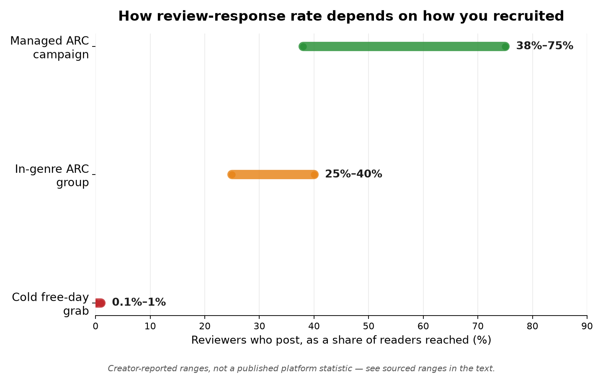

#### Who the form is for, and where it goes when you have no list

Think of the Google Form as an application, not an invitation. It should be filled out by strangers who already read in this genre — not by family. If you have no existing list and no followers yet, skip those sources entirely; you never actually had an audience to draw from there. Build the form itself at forms.google.com, asking for: name, email, three in-genre titles read in the last year, an Amazon or Goodreads profile link, device type, a finish-by date, optional trope preferences or hard limits, and a required checkbox confirming that any review is optional and must be honest. Share only the form’s link, never the EPUB itself — the spreadsheet collecting responses behind the form is your actual roster. You review and approve applicants first, then send the file.

As for where that form link actually goes: search Facebook for groups like Indie Fantasy Addicts ARC and Beta Readers, ARC Group for Readers & Authors, and ARC Readers and Authors, plus a genre-specific group such as a science-fiction ARC group if that fits your book. Join each group, read its pinned rules, and post the link once — no buy link, no request for a required review. On Reddit, stick to r/ARCReaders and r/AdvanceReaderCopy specifically, not general subreddits like r/scifi or r/selfpublish. One public post under your pen name and up to five direct messages to small reviewers who already post in-genre are both optional additions. If you get zero signups after a full week, that’s a reason to run a quiet test — repost the identical ask in exactly one low-traffic group by itself, and see whether that single quiet pond produces even one response before concluding the whole genre has no readers to find — or a reason to consider paying a service like BookSirens later. It is never a reason to fall back on recruiting relatives.

| When | Action | Money reason |
|---|---|---|
| Upload week | EPUB, form, recruit | Reading time is the bottleneck on launch conversion. |
| 2–3 weeks out | Deliver files | Posts need to exist the week units are cheap to get. |
| Live week | Review URL; hold sensible price | Convert the spike. Do not discount into 35% without a sequel. |
| Weeks 3–6 | Consider a $1 raise if proof exists | Stop subsidizing once trust is visible. |
| Book 2 in hand | Reprice book 1 as bait if you wish | Move margin to the titles that collect it. |

Recruit in this order: your own list first, then your own channels, then groups that specifically exist for advance copies. Screen every applicant for genre fit and a real, checkable profile. After each campaign, tag every reader Core, Soft, or Out — a reader earns “Core” status for the next campaign because they actually posted, not because they awarded five stars. Track downloads against sends, posts against sends, and how many Core readers from last time remain Core this time. Holding onto readers who never even opened the file, purely for the vanity of a longer list, is exactly how a catalog stays a hobby instead of becoming a business.

### What to pay for — only if it raises expected value

Only pay to fill a genuine hole in your funnel, not to soothe your own anxiety about launch. If you have no existing reader names to draw from, a capped matching service like BookSirens Promote or Booksprout can help. If Kindle delivery logistics are eating up your week, BookFunnel’s mail tool handles that. If you want to trade newsletter placements with other authors later, StoryOrigin is built for that. For librarians specifically, NetGalley is the standard route, though it won’t reliably produce ten Amazon reviews on a small budget. Using two separate finder networks on the same title is largely wasted spend — the same reader doesn’t convert any faster for having been found by both of them.

A bounded BookSirens experiment — a listing fee plus a few dollars per reader they find who actually downloads the book, capped at twenty-five readers — costs less than a month of ads run against an empty, unreviewed page. What you’re actually buying is downloads from people who asked to read the book, not guaranteed written reviews. The review stays entirely optional throughout, which is the whole point of the arrangement.

### After the listing can bear traffic

Recall that Select is a ninety-day exclusivity commitment that pays out Kindle Unlimited page reads and offers either five free promotional days or a Kindle Countdown Deal. Free days used after you have proof the book converts, and actually announced to someone, can genuinely acquire new readers. Free days used before you have that proof, announced to no one, are a tree falling in an empty forest. A Countdown Deal keeps your list price and 70 percent royalty intact as long as you stay inside the band — it’s built for books that are already selling, not for books trying to find their first readers.

If you decline Select and go wide instead, Draft2Digital reaches other retail stores and library vendors — just uncheck Amazon in its distribution settings, since Amazon is handled directly through KDP. Library licenses are a slow secondary market that develops over time, not something to expect results from during launch week. A permanently free book one lives entirely in the wide-distribution world; it has no place inside Select.

Ads belong in this sequence only after the review module is no longer empty and the price has settled where you actually intend it to live long-term. Run them any earlier, and you’re simply paying to demonstrate that untrusted pages don’t convert — precisely the lesson this chapter was written to spare you from learning the expensive way.

### A sequence that is allowed to mention money

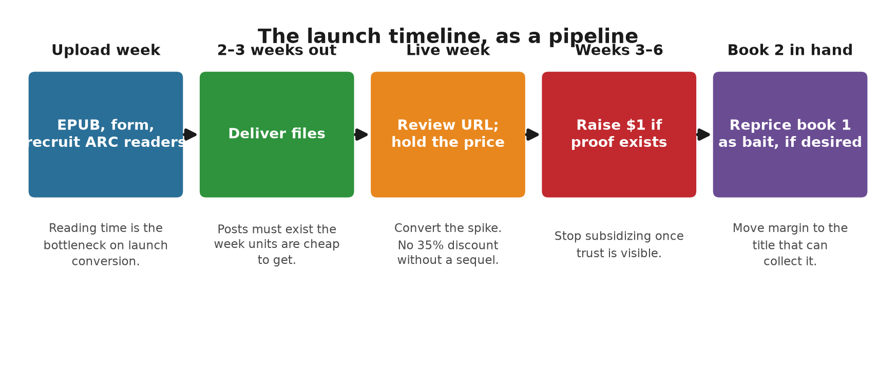

1. Lock the manuscript, convert it to an EPUB, and price the ebook inside the 70 percent band unless you already have a sequel that justifies pricing this one as bait.
2. Recruit advance readers now, and send them files two to three weeks before the product page actually exists.
3. Go live, send out the review URL, and don’t spend any serious ad money until a few honest reviews actually exist.
4. If the roster turns out thin, run one capped matching-service campaign to fill the gap.
5. Once you have proof the book sells: raise the price by a dollar if units hold steady, or keep the current floor and get to work on book two.
6. Once book two exists, decide deliberately whether book one should become bait for it, and put the actual margin on whichever titles are positioned to collect it.
7. Only after all of that, spend on free promotional windows, newsletters, or ads — treating the page as an actual product rather than a plea for attention.

##### Letters

> You are confirmed for an advance copy of [Title]. File on [date]. Live [date]. An honest review after publication would help the book find strangers. It is not required. No rating is requested. If the date fails, reply and you are removed.

> The file is ready. I will send the Amazon address on publication morning. Write what you think, or write nothing.

> The book is live. Optional honest review: https://www.amazon.com/review/create-review?asin=YOURASIN

### Field reports — what published accounts actually show

> **Certainty, labeled.** Blogs and author interviews are not laboratories. They are still better than folklore, provided you notice who already had a list before the launch you are reading about. The pattern that repeats is not magic — it is proof on the page, a price that can move, and something to sell after book one.

#### This book’s approach, in the wild

##### Daniel Arenson, *Earth Alone* (BookBub Partners, 2016)

Arenson was not a first-time author, and that fact is part of the lesson here. Two weeks before launch, he sent digital advance copies to forty readers through BookFunnel, and about half of them posted a review on launch day. He also placed short quotes in the editorial-review field on the product page, which is a separate thing from the customer-review module itself. He launched at $0.99 and raised the price to $2.99 within a week. Over the first seven weeks, the book sold more than 20,000 copies plus a substantial amount of Kindle Unlimited reading, and Arenson has said explicitly that his mailing list did more for the launch than any single other tactic.

What’s worth copying here: the two-week advance-copy window, using BookFunnel as delivery plumbing, and a planned price raise after launch. What’s not worth copying blindly: opening at $0.99 with no list and no sequel of your own — Arenson was effectively buying rank with a crowd he already owned.

##### Cindy L. Sell, *Remnants* (BookBub Partners interview, 2024)

This is a debut closer to what most first-time authors actually face. Sell built her advance-reader roster using a Google Form, social media posts, BookFunnel delivery, and BookSirens — the latter producing nine readers and seven reviews, some of them usefully detailed. Goodreads filled up first, reaching around 120 ratings before Amazon’s review count caught up. She priced the ebook at $3.99 and didn’t discount it immediately, and a week after launch reported more than 200 copies sold. The features that actually moved units were a BookBub New Releases for Less placement and an advance-access email blast — not the ARC team on its own.

What’s worth copying: pairing a sign-up form with a capped matching service, holding at $3.99 when you don’t yet have a sequel to recover the cost of a $0.99 week, and treating a service like BookSirens as a quality supplement rather than your main pipeline. Treat any extra physical gifts as entirely off-limits if they’re tied to an Amazon review in any way — Amazon’s rule remains that the free copy of the book is the only allowed concession.

##### Michael Anderle and the 20Booksto50K philosophy (multiple interviews, 2017–2024)

This one isn’t a single launch, and isn’t quite this chapter’s usual kind of case study — it’s a publishing philosophy, documented on the record across many interviews rather than as one countable event. Anderle, through LMBPN Publishing, built a catalog of several hundred titles around a stated unit target: roughly $7.50 in royalty per book per day as the bar a title needs to clear to remain worth active promotion, a figure he has repeated consistently across interviews rather than asserted just once. The name “20Booksto50K” describes the broader movement that his and Judith Anderle’s talks helped start — prioritizing volume and catalog depth over any single book’s individual performance, with book one deliberately priced to move readers into the later books that actually carry the margin.

What’s worth copying: setting a stated per-unit bar instead of relying on a vague sense that a book is “selling okay,” and deliberately treating book one as an acquisition cost at full catalog scale. What’s not worth copying blindly: this model assumes a catalog large enough that the bar can be measured across dozens of titles at once — [as discussed across multiple interviews](https://starkreflections.ca/2021/02/19/episode-178-the-wide-world-vision-of-judith-and-michael-anderle-of-lmbpn-publishing/) — rather than a debut author’s single book, which has no fleet-wide average to fall back on.

##### A composite pattern, illustrative only (not a single checkable source)

Unlike the two named cases above, this one doesn’t actually clear this book’s own bar for a real case study — it comes secondhand, from a formatter describing unnamed KDP exports rather than from a named author on the record. It’s included only because the shape it describes recurs often enough to be worth naming, clearly marked here as the exception it is. In this account, a four-book series sat at a flat $4.99 for six months, with book-one-to-book-two read-through running at about 11 percent. Book one was then cut to $0.99 for thirty days with the rest of the series already live, and read-through to book two rose to about 19 percent during that window. Treat the shape of that result, not its specific numbers, as the real takeaway: don’t discount book one to nothing until a paid book two actually exists to receive the traffic.

##### Kboards thread on full price versus 99 cents (2017)

In this thread, working authors compared notes publicly. One launched at $2.99 and raised the price to $4.99 after three or four weeks — unit rank worsened, but overall revenue improved. Another launched a sequel at $0.99 while book one ran a free-day promotion simultaneously. The store itself has changed considerably since 2017, but the underlying tradeoff hasn’t: $0.99 buys motion, while $2.99–$4.99 buys margin. Decide which of those two problems you actually have before choosing.

#### Alternatives that are not the same book

##### List first, book second

Arenson’s result above is, in part, a result of the list he’d already built. Some authors deliberately refuse to launch at all until a few hundred email addresses exist, on the reasoning that the first-review problem shrinks considerably once launch week is no longer cold. The real cost of this approach is time: if the manuscript is already finished, waiting a full year just to start the ARC clock is usually the wrong trade, since a finished manuscript ages more like milk than wine. The better approach is building the list in parallel with finishing the book, not before it.

##### Full-price launch, no 99-cent week

Sell’s decision to hold at $3.99 is this alternative in practice, as is the Kboards author who raised to $4.99 and ended up taking home more money on fewer copies. This approach fits a standalone book, a slower-writing author, or anyone who genuinely won’t have a sequel out this year.

##### Promo stacking after proof

Freebooksy, Bargain Booksy, Fussy Librarian, and stacked partners are how many midlist fiction authors create a second spike. The commonly reported practice is stacking several lists on one planned price cut rather than lighting a silent free day. Those sites often want a review floor. That is the hinge: ARCs first, stack later.

##### Wide and slow

Published first-year accounts from authors building across several stores at once treat success as steady doubling rather than an Amazon spike. Libraries and Apple promotions via Draft2Digital become part of the engine. Reviews still matter on every storefront. Select free days and permafree book one cannot share a title. Different calendar, real business.

##### What the blogs get wrong

Some street-team advice tells authors to make their advance readers buy the already-live book so the resulting review carries a Verified Purchase badge. Amazon does not require this, and pressuring readers into it effectively reconstructs the exact kind of condition Amazon’s rules forbid. Some relaunch write-ups describe spending thousands of dollars on ads against a page that still can’t convert, then blaming the ads for the result rather than the page. And some promise a hundred reviews within forty-eight hours — that is not a method this book will endorse or describe as usable.

The accounts that actually hold together, across every example above, share three things in common: someone genuinely read the book before the wider crowd arrived, the price either sat inside the 70 percent band or was a deliberate, temporary discount paid to move readers into a sequel, and there was a next title, an email list, or both waiting behind it. Missing all three of these is exactly how a book ends up selling only to cousins, and then stops selling at all.

### Claims that do not survive a spreadsheet

- That a debut should open at $0.99 to get reviews. Reviews come from people who agreed to read, not from a royalty you set on fire.
- That $1.99 is a friendly compromise. It is often a 35 percent trap that earns less than $2.99.
- That you should keep a first novel at $0.99 forever. Forever bait with no sequel is charity.
- That raising the price after reviews is a betrayal. Early price rented attention. Later price collects it.
- That one hundred reviews are required before anyone pays. The costly gap is zero testimony.
- That free days print reviews. They print files.
- That family reviews, properly disclosed, are a business plan. They are a policy problem.

One last limit worth stating plainly: this book cannot choose your tropes for you or make a weak cover convert on its own, and it cannot freeze KDP’s price band or a vendor’s fees in place — look both up again in the actual month you publish. What this chapter can do is refuse to indulge the hobbyist story in which a few courtesy sales from friends count as a real launch. Strangers pay once they see that other strangers actually finished the book, at a price the royalty table doesn’t punish, feeding into a catalog that has somewhere else to send them next. That’s the entire commercial problem this chapter has been describing. Everything else from here is simply execution.

---

*Sources: KDP Help: Customer Reviews (G202101910); ebook list price and 70 percent option; Free Book Promotions; Select terms. Amazon Community Guidelines. Vendor pricing pages, because they move.*

*Not legal advice. Not an Amazon publication.*

# Part VIII — Using AI Well

## Chapter 32: Using AI Without Losing the Business

Chapter 19 already covered the core rule for AI in your manuscript: it can speed up the unglamorous parts of writing, disclosure to KDP is mandatory, and a human stays the last editorial judgment. Chapter 28 covered the volume version of misusing it — flooding categories with thin, minimally reviewed AI output. This chapter is the rest of it: where AI genuinely helps everywhere else in the business, the disclosure rule stated in full, and the one line that separates “AI helped me write my book” from “I laundered someone else’s” — because that line gets crossed by processes that sound perfectly professional right up until the step that gives them away.

### Where it earns its place beyond the manuscript

The same tools that help with a first draft are useful at almost every later stage of this pipeline, used the same way: as a fast first pass a person then judges, not as the final decision.

- **Cover concepts** (Chapter 21): generating rough visual directions or thumbnail-test variants to react to, before a human designer executes the one that actually works. An AI-generated *final* cover image carries its own disclosure obligation — see below — separate from the manuscript text.
- **Ad copy and product-page description drafts** (Chapters 22 and 25): fast variants of a headline, a bullet list of benefits, or an ad’s body text, for you to pick from and edit — the same “several alternatives, human picks and rewrites” pattern Chapter 19 already described for manuscript prose.
- **Keyword and category brainstorming** (Chapter 22): surfacing phrases and angles you might not have thought of, which you then verify the way this whole book insists on — checking they’re real search terms and an honest fit, not just plausible-sounding.
- **Research synthesis in your own words**: using AI to summarize a pile of your own notes or a topic you’re already researching, then writing the actual explanation yourself. This is meaningfully different from the trap in the next section, and the difference is exactly what that section is about.

### Building background knowledge on a topic, the legitimate way

Writing competently about a topic you don’t already know cold takes real background research, and there’s nothing improper about drawing on more than one kind of source to get there — the question is always what you do with what you gather, not how many places you looked. A straightforward, legitimate process runs through three steps:

1. **General search first.** A search engine orients you fast: current terminology, what’s actually being asked and argued about the topic right now, recent developments a book written five years ago wouldn’t know about. Treat this as a map of the territory, not a source to write from directly — you’re finding out what’s out there and which questions matter, not collecting text to reuse.
2. **AI for explanation and gap-filling.** Ask an AI tool to explain a concept, walk through an argument, or suggest an analogy the way you’d ask a knowledgeable colleague — not “condense these three specific books,” but “explain X” or “what’s the standard way to think about Y.” Use the answer to test and sharpen your own understanding, then write the explanation yourself, in your own words and your own structure. This is the same research synthesis named above, and it’s exactly why the distinction matters: you’re the one producing the explanation that ends up on the page.
3. **Read what’s already published in the space — condensing and merging is fine here, as background.** Reading other books on your topic is normal, expected preparation, and for a topic two or three existing books already cover, condensing each one’s key content into your own notes and merging those notes into one synthesized picture of what the field already says is exactly what a literature review or a research binder is — a legitimate way to get oriented fast instead of slowly. The rule that keeps this a research technique rather than the trap in the next section: those merged notes exist to build your own understanding, and nothing else. Close them before you draft, and write the actual manuscript from what you now know, in your own words, your own structure, your own examples — not by editing the merged notes themselves into publishable prose.

None of this is the trap the next section names, as long as the condensing and merging stays on the input side, feeding your own understanding, and never becomes the output you edit into your book. The difference was never about how many sources you touch, or even whether you condense them — it’s whether the condensed material stays private research or quietly turns into the draft. If the thing you’re polishing into a finished chapter is the condensation itself, you’ve crossed into the next section’s trap, no matter how good your notes were.

### The disclosure rule, stated precisely

KDP’s publishing questionnaire requires you to disclose AI involvement, and the platform draws a specific line worth stating exactly rather than approximately:

> **Key takeaway:** *AI-generated* content — text, images, or translations an AI tool produced, even if you edited the result afterward — must be disclosed. *AI-assisted* content — where you wrote or created it yourself and a tool only edited, refined, error-checked, or helped you brainstorm — does not need to be disclosed. The distinction is Amazon’s to draw, not yours to interpret generously: get it wrong and the risk is the listing coming down, not a warning email. Disclosure happens privately at upload and never appears on the product page. See [KDP Help: Content Guidelines](https://kdp.amazon.com/en_US/help/topic/G200672390) (G200672390) before you check either box — for the manuscript, the cover, or both.

That same distinction is why “I used AI to help me write” and “AI wrote it and I edited it” are not the same sentence, even when the finished pages look similar. Which side of the line a given book falls on is a fact about how it was made, not a matter of how confident you feel about your edits.

### The trap that looks like a process

A specific pattern is worth naming directly, because it’s packaged persuasively enough that it can look like professional workflow rather than what it actually is: take a small number of existing books on the same topic, have AI condense and merge them, then run a “similarity audit” whose job is to find and eliminate close parallels with those specific sources — in wording, in examples, in the particular way a concept is explained — until the draft no longer looks traceably derived.

The tell is the audit step itself. Legitimate research doesn’t need to check a finished manuscript against a short list of specific source books to scrub out whatever still resembles them — that step only exists because the process expects resemblance and is designed to launder it. Facts and concepts in a textbook aren’t protected by copyright; the specific way an author explains them, their chosen analogies, and their pedagogical structure are exactly what copyright protects. A workflow whose last move is erasing detectable similarity to particular copyrighted works isn’t producing independent material — it’s producing a derivative one dressed to pass inspection.

This isn’t only a copyright problem you’d face from the original authors. It’s also a direct hit on the account-level trust this entire book keeps coming back to (Chapter 28): a catalog built this way is one infringement claim away from every title on the account, not just the one book, and “an AI tool did the condensing” is not a defense KDP or a court is likely to find persuasive. If you want to write a textbook or a popular-science book on a subject other authors have already covered, the legitimate version of that project starts with researching the actual subject matter — not condensing their books — and produces your own explanations, your own examples, and your own structure, informed by the field rather than assembled from a few competitors’ pages.

### Claims that do not survive contact with a copyright claim

- That rewriting a summary in different words makes it original. Originality lives in structure, explanation, and example — not just vocabulary — and a similarity audit built to catch exactly that isn’t evidence of originality, it’s evidence the process expected to need one.
- That AI involvement dilutes responsibility for what gets published. KDP’s disclosure requirement and ordinary copyright law both attach to the publishing account, not to whichever tool typed the words.
- That a book has to *look* AI-flooded (thin, generic, unedited) to be a policy problem. A polished, heavily-edited book built by laundering specific existing sources is a different, more serious problem than the volume-flooding trap in Chapter 28 — better production values don’t fix a derivative-work claim.

### What copyright actually protects — and a legitimate way to adapt someone else’s work

Copyright protects the specific way an idea gets expressed — wording, chosen analogies, structure — not the underlying facts or ideas themselves ([U.S. Copyright Act §102(b)](https://www.copyright.gov/title17/92chap1.html)). That is exactly why “I kept the facts and just rewrote the wording” is weaker than it sounds for nonfiction: the analogies, the structure, and the explanatory choices *are* the expression, not decoration around it.

None of the following, on its own, makes a derivative work legal — each gets repeated constantly, and none of them holds up:

- “I changed a set percentage of it.”
- “AI wrote the new wording.”
- “I credited the original author.”
- “It’s transformative” — transformative purpose is one factor in a four-factor U.S. test, not a standalone pass (see the [Fair Use Index](https://www.copyright.gov/fair-use/)).
- “It’s for an educational market.”
- “Only the structure or approach is the same, not the exact words.”
- “I didn’t charge money for it.” Commercial gain is one factor courts weigh, not a threshold — plenty of noncommercial uses still infringe.
- “It’s a parody.” Parody, satire, and pastiche are specific, narrow legal categories with their own requirements; calling something a parody doesn’t make it one, and a work that doesn’t actually comment on or mock its source through the borrowing itself won’t qualify just because the author labels it that way.

If the goal is genuinely to build on someone else’s existing work rather than your own research, there are exactly two legitimate paths: get a license from the rights holder, or adapt something actually in the public domain — not just old, not just freely downloadable somewhere, but verified public domain in every territory you’ll sell in. Duration rules are jurisdiction-specific and don’t track intuition: a modern translation of a public-domain original can still be separately protected, and an “old” edition can carry its own separately-copyrighted introduction, annotations, or cover art ([Circular 15A: Duration of Copyright](https://www.copyright.gov/circs/circ15a.pdf)). Verify the exact edition and every layer of it before you build anything on it — not after.

> **Key takeaway:** “I checked, and this exact text and translation are public domain everywhere I’m selling” is a real starting point. “It felt old enough” is not, and has ended author careers that started from exactly that assumption.

---

*Sources: KDP Help: Content Guidelines (G200672390); U.S. Copyright Act §102(b); U.S. Copyright Office Fair Use Index; U.S. Copyright Office Circular 15A (Duration of Copyright). General principles only, not legal advice — get a lawyer for a specific manuscript, not a book chapter.*

*Not legal advice. Not an Amazon publication.*
